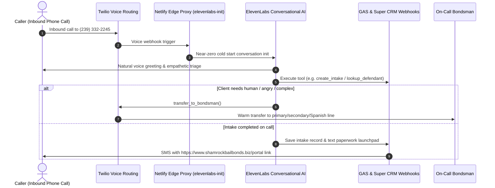

# Skill: ElevenLabs Voice Architecture

> **Agent Identity:** "Shannon" — 24/7 After-Hours Voice Intake Employee  
> **Agent ID:** `agent_2001kjth4na5ftqvdf1pp3gfb1cb`  
> **Platform:** ElevenLabs Conversational AI + Netlify Edge Proxy + GAS / Super CRM

Use this skill when developing, testing, or modifying Shannon Voice AI prompts, webhook tools, real-time call transfer sequences, and SMS launchpad deliveries.

---

## 1. System Topology & Data Flow

---

## 2. The 8 Webhook Tools

| Tool | Purpose | Output to Voice |
|---|---|---|
| `calculate_premium` | Computes FL statutory rate (10% or $100 min per charge) | Spoken quote estimate with payment plan option |
| `create_intake` | Creates deferred intake in Super CRM / GAS `IntakeQueue` | Confirmation and triggers SMS launchpad link |
| `lookup_defendant` | Scrapes / queries active county jail rosters | In custody status, charges, and bond amounts |
| `send_payment_link` | Dispatches SwipeSimple link via SMS | Confirmation ("I just texted you a payment link") |
| `schedule_callback` | Books scheduled callback time | Confirmation of time |
| `transfer_to_bondsman` | Warm-transfers to on-call bondsman (3 numbers) | Transfer prompt ("Let me get my bondsman on the line") |
| `check_inmate_status` | Verifies whether defendant is booked or released | Real-time booking status |
| `send_directions` | Texts address of jail or county courthouse | Address sent via SMS |

---

## 3. Voice Prompt & Tuning Rules

1. **Zero Markdown Formatting:** NEVER output asterisks, bullets, bold tags, or special characters. Text-to-Speech (TTS) models read them literally (e.g. "asterisk asterisk").
2. **Bite-Sized Turn Length:** Deliver no more than 1 to 2 sentences before asking a clarifying question or pausing for client input. Stressed callers easily get overwhelmed.
3. **Conversational Latency Fillers:** Use natural transitions (*"Got it."*, *"Understood."*, *"Let me check that booking for you right now..."*) to mask webhook latency (<5000ms).
4. **End-of-Turn Timeout:** Set to `700ms - 1000ms` because distressed callers pause frequently when recalling names or dates.
5. **High Interruption Sensitivity:** Shannon must stop speaking immediately if the caller interrupts.
6. **Human Escalation:** If caller asks for a human or becomes upset, immediately execute `transfer_to_bondsman`.
