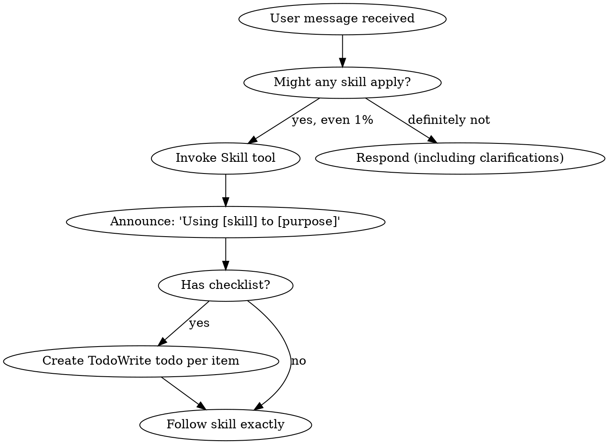

# Using Superpowers

<SKILL_METADATA>
description: Use when starting any conversation - establishes how to find and use skills
version: 1.0.0
author: sickn33
</SKILL_METADATA>

<EXTREMELY-IMPORTANT>
If you think there is even a 1% chance a skill might apply to what you are doing, you ABSOLUTELY MUST invoke the skill.

IF A SKILL APPLIES TO YOUR TASK, YOU DO NOT HAVE A CHOICE. YOU MUST USE IT.

This is not negotiable. This is not optional. You cannot rationalize your way out of this.
</EXTREMELY-IMPORTANT>

## The Rule

**Invoke relevant or requested skills BEFORE any response or action.**

## Red Flags (STOP if you think these)
- "This is just a simple question"
- "I need more context first"
- "I can check git/files quickly"
- "This doesn't need a formal skill"
- "I'll just do this one thing first"

## Skill Priority
1. **Process skills first** (brainstorming, debugging)
2. **Implementation skills second** (frontend-design, code-audit)
