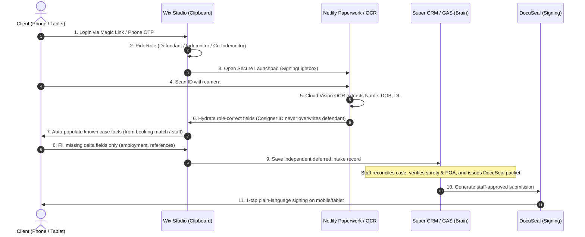

# 🍀 Shamrock Bail Bonds — The Digital Bail Agency

> **"The Uber of Bail Bonds" — Fast. Frictionless. Everywhere.**  
> **HQ / NAP:** 1528 Broadway, Fort Myers, FL 33901 · (239) 332-2245 · admin@shamrockbailbonds.biz  
> **Live Site:** [shamrockbailbonds.biz](https://www.shamrockbailbonds.biz) (Wix Editor live; Wix Studio rebuild in progress)  
> **Authoritative Runtime Truth:** [`STATUS.md`](./STATUS.md) · [`docs/CURRENT_PAPERWORK_ARCHITECTURE.md`](./docs/CURRENT_PAPERWORK_ARCHITECTURE.md)

---

## 🏛 Core Architectural Doctrine

> **"The Website is the Clipboard. The Backend is the Brain."**

- **The Website (Wix Studio / Velo)** is the high-converting, mobile-first **Clipboard**. It captures customer intent, authenticates members via magic links/OTP, provides a camera-first ID scanning launchpad, auto-hydrates form fields, and presents staff-approved signature sessions.
- **The Brain (`shamrock-leads` Super CRM & GAS)** is the multi-state intelligence engine. It runs county jail scrapers, performs flight risk underwriting, reconciles defendant/indemnitor matches, validates surety/POA limits, and generates legal DocuSeal signature packets under strict staff review.
- **Strict Boundary:** Wix never creates DocuSeal packets or provider signing links directly. Wix is a secure launchpad.

---

## 🚀 Growth Ladder (Information Architecture Law)

1. **Local/Regional Dominance First**: Lee, Collier, Charlotte, Hendry, Glades. Homepage, NAP, and hero are SWFL / Fort Myers / Cape Coral first. Never flatten the homepage into a generic national brochure.
2. **Statewide Florida**: All 67 counties supported via programmatic dynamic pages (`/florida-bail-bonds/:slug`) and First Appearance court calendars (`/first-appearance/:county`).
3. **11+ State Multi-State Expansion**: Multi-state directories live under `/bail-bonds/:state/:county`, backed by `shamrock-leads` multi-state scrapers. States are surfaced in navigation only when `ServiceAreas.status = live`.

---

## 📱 Client Paperwork North Star (Mobile & Tablet First)

Designed specifically for someone in crisis on a mobile phone or tablet:

- **Canonical Person+Case Schema:** Defined in [`src/public/canonical-paperwork-mapper.js`](src/public/canonical-paperwork-mapper.js). Abstracts surety carrier formats (OSI, Accredited, Bankers, etc.) so UI never binds to one company's PDF layout.
- **Role-Scoped Hydration:** ID scanning populates only the selected role’s field group. Cosigner scans cannot overwrite defendant records.

---

## 🛠 Tech Stack & Ecosystem

| System | Role | Technology |
|---|---|---|
| **Public Site & Portals** | The Clipboard | Wix Studio / Velo (`src/`), JavaScript |
| **Backend & Factory** | The Engine | Google Apps Script (`backend-gas/`, 190+ files) |
| **Arrest Intel & Super CRM** | The Brain | `shamrock-leads` (Python, Docker, Hetzner VPS, MongoDB Atlas) |
| **Ops Dashboard & Scheduler** | Operations Hub | `shamrock-node-red` (21 tabs, 64 crons, 836 nodes) |
| **Mobile Paperwork Launchpad** | Mini-Apps & OCR | `shamrock-telegram-app` (Netlify PWA, Cloud Vision API) |
| **Voice AI Agent** | 24/7 Phone Intake | Shannon (ElevenLabs Conversational AI + Netlify Edge) |
| **Bail School LMS** | Education Platform | `shamrock-bail-school` ($199 20hr / $649 120hr / $49 simulator) |

---

## 🤖 Digital Workforce (9 Agents)

| Agent | Role | Channel |
|---|---|---|
| **The Concierge** | 24/7 Client Support & Intake | Web Chat, SMS, Telegram |
| **Shannon** | After-Hours Voice Phone Intake | Phone (ElevenLabs) |
| **The Clerk** | Booking Scraper & OCR Parser | Automated |
| **The Analyst** | Risk Assessment (0-100 score) | Automated |
| **The Investigator** | Deep Background & Relationship Vetting | On-Demand |
| **The Closer** | Abandoned Intake Recovery Drips | SMS / WhatsApp |
| **Manus Brain** | Telegram AI Conversational Engine | Telegram Bot |
| **The Watchdog** | 5-Minute System Health Checks | Node-RED |
| **Bounty Hunter** | High-Value Unposted Bond Surfacing (>$2.5K) | Node-RED Ops |

---

## 🔒 Preserved Collections & Velo Modules

The following core modules and Wix CMS collections remain the foundation of the platform:
- **Collections:** `Cases`, `Defendants`, `Indemnitors`, `PortalUsers`, `PortalSessions`, `Magiclinks`, `PendingDocuments`, `SigningSessions`.
- **Backend Services:** `portal-auth.jsw`, `gasIntegration.jsw`, `first-appearance-api.jsw`, `county-generator.jsw`, `multi-state-router.js`.
- **Lightboxes & Wizards:** `IdUploadLightbox`, `SigningLightbox`, `DefendantDetails`, `defendant-wizard`, `indemnitor-wizard`.

---

*Maintained by Shamrock Engineering & AI Agents*