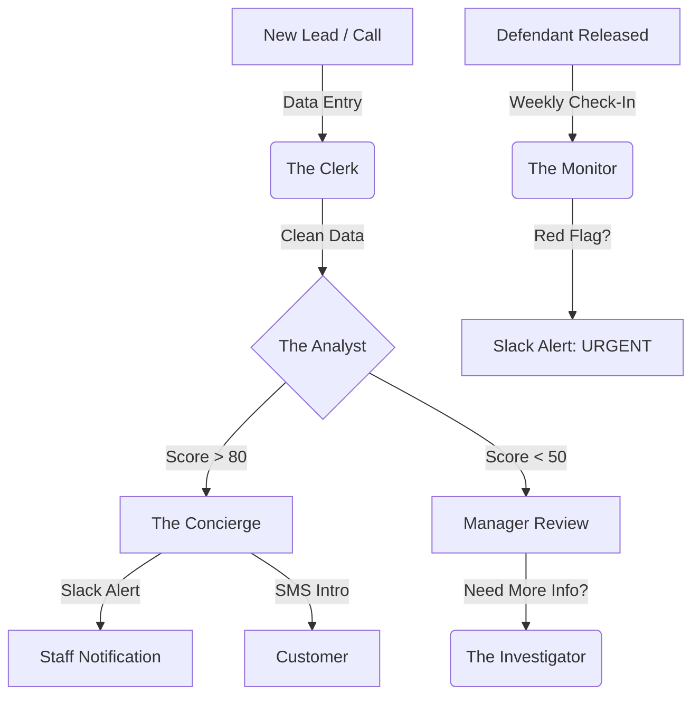

# Shamrock Bail Bonds - AI Agent Capabilities Guide

**Link to Dashboard:** [Staff Portal](https://www.shamrockbailbonds.biz/portal-staff)  
**Version:** 7.0 (AI Suite)  
**Last Updated:** January 2026

---

## 🤖 Overview
Shamrock Bail Bonds now utilizes a suite of **5 AI Agents** to assist with data entry, risk assessment, and leads management. These agents run 24/7 in the background or can be triggered manually from your Staff Dashboard.

This guide explains what each agent does and how it helps you write cleaner, safer bonds.

---

## 1. The Clerk (Data Entry)
*Your Automated Intake Assistant*

*   **What it does:** Reads Booking Sheets (PDFs, Images, or Text) and instantly extracts:
    *   Defendant Name
    *   Booking / Arrest Numbers
    *   List of Charges
    *   Bond Amounts
    *   Court Dates
*   **When it runs:**
    *   **On Demand:** When you click "Upload Booking Sheet" in the Staff Portal.
    *   **Automated:** When a new email with a booking attachment hits [admin@shamrockbailbonds.biz](mailto:admin@shamrockbailbonds.biz).
*   **How it helps you:** Eliminates typos. You just verify the data instead of typing it all in.

## 2. The Analyst (Risk Scoring)
*Your Underwriting Second Opinion*

*   **What it does:** Reviews every lead and calculates a **Flight Risk Score (0-100)** based on:
    *   **Charges:** Severity, nature of crime (Violent vs. Petty).
    *   **Ties:** Residency (Local vs. Out of State), Employment.
    *   **History:** Prior Failures to Appear (FTA).
*   **Risk Levels:**
    *   🟢 **Low Risk (Score > 80):** Good write. Locals, small bonds, traffic/DUI.
    *   🟡 **Medium Risk (Score 50-79):** Standard caution. Needs strong Indemnitor.
    *   🔴 **High Risk (Score < 50):** Manager approval required. Felonies, Flight Risk, No ties.
*   **When it runs:**
    *   **Automatically:** Every 10 minutes on new "Qualified" leads.
    *   **Manually:** You can click "Analyze Risk" on any lead in the dashboard.

## 3. The Concierge (Lead Engagement)
*Your 24/7 Front Desk*

*   **What it does:** Monitors our leads sheet for "HOT" leads (High value, qualified).
    *   **Alerts Team:** Pings the Slack channel immediately with the Lead Name, Bond Amount, and *The Analyst's* risk opinion.
    *   **Engages Customer:** Sends a polite SMS introduction via Twilio to the family, offering help.
*   **When it runs:** Every 10 minutes.
*   **How it helps you:** Ensures we never miss a big bond because we were busy or asleep.

## 4. The Investigator (Deep Vetting)
*Your Background Check Expert*

*   **What it does:** Reads detailed background reports (TLO / IRB / iDiCore) for **both** the Defendant and Indemnitor and cross-references them.
    *   **Finds Hidden Risks:** "Did the Indemnitor declare bankruptcy last month?"
    *   **Verifies Relationships:** "Do they actually live at the same address?" or "Is this actually his Ex-Wife?"
*   **When it runs:** **On Demand Only**. Use the "Run Deep Vetting" button when you have the background PDFs ready.
*   **Output:** Generates a "Vetting Assessment" summarizing the financial stability of the signer and the flight risk of the defendant.

## 5. The Monitor (Check-In Surveillance)
*Your Digital Parole Officer*

*   **What it does:** Reads the text notes from every Defendant Check-In (via App or Portal).
*   **What it looks for:**
    *   **Distress:** "I can't handle this," "I'm scared."
    *   **Non-Compliance:** "I lost my job," "I'm moving to Georgia."
    *   **Flight Risk:** "I'm not going to court."
*   **When it runs:** **Real-time**, the moment a Check-In is submitted.
*   **Alerts:** If it detects a **CRITICAL** issue, it immediately alerts the #bonds-monitoring Slack channel.

---

## 🛠️ How it Fits Together

