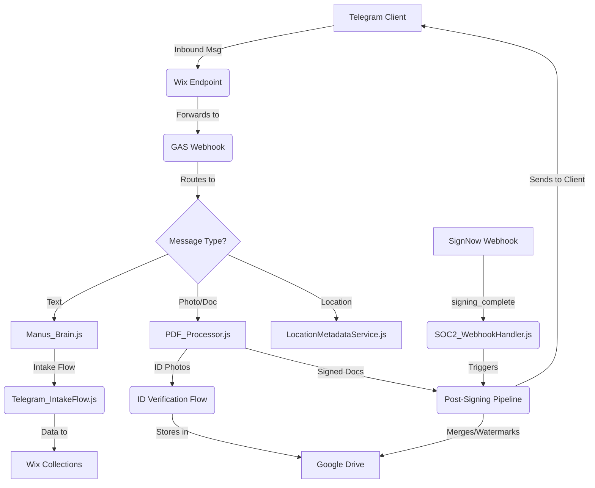
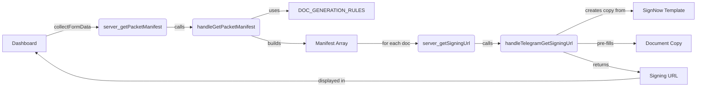

# Shamrock Bail Bonds Automation: System Architecture

**Version:** 2.1 (Multi-Indemnitor Signing Pipeline)
**Date:** 2026-02-27
**Author:** Manus AI / Antigravity

This document outlines the unified, deduplicated architecture of the Shamrock Bail Bonds automation factory. It reflects the merged and cleaned codebase after the audit of Antigravity and Manus session work.

## 1. Core Principle: Single Source of Truth

To eliminate redundancy and ensure data integrity, the system adheres to a strict single-source-of-truth principle for all key functionalities. Duplicate files and functions have been removed, and all logic is now centralized in canonical modules.

## 2. System Components & Data Flow

The automation pipeline is composed of several interconnected modules, each with a clearly defined responsibility.

### 2.1. Google Apps Script (`backend-gas`)

This is the heart of the automation factory, containing all business logic.

| File | Responsibility |
| :--- | :--- |
| **`Code.js`** | Main entry point. Routes all incoming webhooks (`doPost`) and exposes client-callable functions (`doGet`). |
| **`Telegram_Webhook.js`** | Handles all inbound Telegram messages. Routes to the appropriate handler based on message type (text, photo, document, location, command). |
| **`Telegram_Documents.js`** | **(V2)** Manages the document signing pipeline. Contains `SIGNNOW_TEMPLATE_MAP`, `DOC_GENERATION_RULES`, `buildPacketManifest()`, and signing URL generation. Handles multi-indemnitor document multiplication. |
| **`Server_DocumentLogic.js`** | Bridge between Dashboard UI and backend handlers. Provides `server_getPacketManifest()`, `server_getSigningUrl()`, and Drive file operations. |
| **`PDF_Processor.js`** | **(Unified)** Handles all document and photo uploads. Presents a task menu to the user (ID, Signed Docs, etc.) and manages the guided ID verification flow (front, back, selfie). Also runs the post-signing pipeline. |
| **`Telegram_IntakeFlow.js`** | Manages the conversational state machine for new client intake via Telegram. Collects all necessary defendant and indemnitor information. |
| **`Manus_Brain.js`** | Routes general text messages to the appropriate AI model or conversational flow. |
| **`WebhookHandler.js`** | Handles SignNow webhooks, specifically the `document.complete` event, which it delegates to `DriveFilingService` and now triggers the `PDF_Processor` post-signing pipeline. |
| **`SOC2_WebhookHandler.js`** | Secure entry point for all webhooks, performing signature verification before passing the payload to the main handlers. |
| **`DriveFilingService.gs`** | Manages all interactions with Google Drive, including creating case folders and saving documents. |
| **`Utilities.js`** | **(New)** A centralized library of all common helper functions (`getFileExtension`, `formatDate_`, `getOrCreateDriveSubfolder`, etc.) to eliminate code duplication. |
| **`Telegram_API.js`** | A robust client for the Telegram Bot API. Handles sending all message types, downloading files, and managing webhooks. |
| **`Telegram_Notifications.js`** | Contains all functions for sending outbound business notifications (court date reminders with 4-touch sequences, one-tap signing deep links, payment progress updates with visual bars). Includes time-driven trigger functions. |
| **`Telegram_Auth.js`** | Manages user authentication via OTP sent to their Telegram account. |
| **`Telegram_InlineQuote.js`** | **(New)** Handles `@ShamrockBail_bot` inline queries. Calculates FL bail premiums ($100/charge min or 10%, transfer fee logic) and returns rich inline result cards. |
| **`Telegram_Analytics.js`** | **(New)** Event logging (`logBotEvent`) and funnel analytics (`getBotAnalytics`). Tracks intake conversions, inline queries, OCR, and signing events to `BotAnalytics` sheet. |
| **`Telegram_OCR.js`** | **(New)** ID photo OCR using Google Cloud Vision API `TEXT_DETECTION`. Parses Florida Driver License fields (name, DOB, DL#, address). Falls back to Drive storage if Vision API unavailable. |
| **`LocationMetadataService.js`** | Manages location data enrichment, county detection, and `findNearestOffice()` for Shamrock office locations (Fort Myers HQ, Charlotte County). |
| **`registerWebhook.js`** | Webhook registration, bot command setup, menu button config, and `installTelegramFeatureTriggers()` for time-driven triggers. |

### 2.2. Wix Velo (`src`)

The Wix site serves as the mobile-first frontend for clients and the dashboard for staff.

| File | Responsibility |
| :--- | :--- |
| **`http-functions.js`** | Exposes the public webhook endpoint that receives messages from Telegram and forwards them to the GAS web app. |
| **`wix-crm-backend`** | Handles interactions with the Wix CRM, including creating and updating contact records. |
| **`portal-auth.jsw`** | Manages user login and session management for the client portal. |
| **`Dashboard.html`** | **(GAS)** The staff-facing dashboard for managing cases, viewing intake queue submissions, and generating document packets. |

## 3. Document Signing Pipeline (V2 — Multi-Indemnitor)

The signing system uses **SignNow as the single source of truth** for all document templates. Templates are stored in the SignNow "Team Templates" folder and referenced by ID in `SIGNNOW_TEMPLATE_MAP`.

### Document Generation Rules

| Rule | Behavior | Example |
|------|----------|---------|
| `static` | One copy per bond, agent signs | Appearance Bond |
| `shared` | One copy, all parties sign | Disclosure Form, Promissory Note |
| `per-indemnitor` | One copy per indemnitor | Indemnity Agreement |
| `per-person` | One copy per person (defendant + each indemnitor) | SSA Release |
| `print-only` | Not sent to SignNow | FAQ sheets |

### Tracking

Each document copy is tracked in the `DocSigningTracker` spreadsheet with a composite key: `docId:signer-N`. Columns include `SignerRole` and `SignerIndex` for unique identification.

## 4. Key Architectural Decisions & Resolutions

*   **Unified Document/Photo Handling:** All inbound photos and documents are now routed through `PDF_Processor.js`. This provides a consistent user experience with a clear task menu and leverages the robust, stateful ID verification flow from the `Telegram_PhotoHandler.js` (which has been merged and deleted).

*   **Centralized Utilities:** All common helper functions have been moved to `Utilities.js`. All other files have been refactored to call this single source of truth, reducing code size and maintenance effort.

*   **Closed-Loop Signing:** The `handleDocumentComplete` function in `WebhookHandler.js` now triggers the `triggerPostSigningFromWebhook` function in `PDF_Processor.js`. This creates a fully automated loop: a client signs a document in SignNow, the webhook is received, the final PDF is processed (merged, watermarked), and the client is immediately sent the final document and a request for ID photos via Telegram.

*   **SignNow as Template Source:** All 13 document templates live exclusively in SignNow (Team Templates folder). The system no longer generates PDFs from Google Drive templates. This eliminates hydration failures and ensures consistent field mapping.

*   **Manifest-Driven Document Generation:** Instead of merging PDFs into a single file, the system generates individual SignNow template copies per document, per signer. This enables proper per-person tracking, individual signing links, and correct document multiplication for multi-indemnitor bonds.

This unified architecture is now cleaner, more maintainable, and fully aligned with the project goal of a zero-re-entry automation factory.
