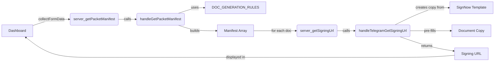

# Shamrock Bail Bonds: System Architecture

**Version:** 3.0
**Date:** 2026-03-15
**Author:** Shamrock Engineering & AI Agents

---

## 1. Core Principle: Single Source of Truth

The system adheres to a strict single-source-of-truth principle. Google Apps Script (GAS) is the **central nervous system** — every client surface, automation, and data pipeline connects through it. Duplicate logic is eliminated; business rules live in exactly one place.

---

## 2. High-Level System Architecture

```mermaid
graph TD
    subgraph "Client Surfaces"
        WEB[Wix Portal<br/>shamrockbailbonds.biz]
        TG_BOT[Telegram Bot<br/>@ShamrockBail_bot]
        TG_MINI[Telegram Mini Apps<br/>7 PWA screens]
        SHANNON[Shannon Voice AI<br/>ElevenLabs]
        PHONE[Phone / SMS<br/>Twilio]
    end

    subgraph "Edge Layer (Netlify)"
        EDGE_EL[elevenlabs-init.js]
        EDGE_CD[county-detect.js]
        EDGE_TV[twilio-voice-inbound.js]
        SFNS["17 Serverless Functions<br/>(AI, compliance, notifications)"]
    end

    subgraph "Backend Intelligence (GAS)"
        CODE["Code.js<br/>doPost() / doGet()<br/>Single Entry Point"]
        AI_AGENTS["AI Agents<br/>Clerk, Analyst, Investigator,<br/>Concierge, Closer"]
        SIGNNOW_INT["SignNow Integration<br/>14-doc packet generation"]
        TG_FLOW["Telegram Flows<br/>Intake, OCR, Notifications"]
        NR_HANDLERS["NodeRedHandlers.js<br/>17+ data endpoints"]
        MONGO_LOG["MongoLogger.gs<br/>Event persistence"]
    end

    subgraph "Operations (Node-RED)"
        NR_DASH["Operations Dashboard<br/>8 pages, glassmorphism UI"]
        NR_CRON["Scheduler<br/>51+ automated jobs"]
        NR_WEBHOOKS["Webhook Endpoints<br/>14 inbound routes"]
    end

    subgraph "Data Pipeline (Scrapers)"
        SCRAPERS["19 County Scrapers<br/>Python + Node.js + GAS"]
        HETZNER["Hetzner Cloud<br/>Dockerized fleet"]
        GH_ACTIONS["GitHub Actions<br/>15 workflows"]
    end

    subgraph "Data Stores"
        WIX_CMS["Wix CMS<br/>IntakeQueue, Cases,<br/>PortalSessions, MagicLinks"]
        GSHEETS["Google Sheets<br/>Master DB, Arrests,<br/>PaymentLog, CheckInLog"]
        MONGODB["MongoDB Atlas<br/>Arrest analytics,<br/>event audit trail"]
        GDRIVE["Google Drive<br/>Case folders, signed PDFs"]
    end

    subgraph "External Services"
        SIGNNOW[SignNow]
        TWILIO[Twilio SMS/WhatsApp]
        SLACK["Slack (12+ channels)"]
        OPENAI[OpenAI GPT-4o]
        VISION[Cloud Vision OCR]
    end

    WEB -->|http-functions.js| CODE
    TG_BOT -->|Wix webhook| CODE
    TG_MINI -->|fetch| CODE
    SHANNON --> EDGE_EL --> CODE
    PHONE --> EDGE_TV --> CODE

    CODE --> AI_AGENTS
    CODE --> SIGNNOW_INT
    CODE --> TG_FLOW
    CODE --> NR_HANDLERS
    CODE --> MONGO_LOG

    NR_CRON -->|HTTP GET/POST| CODE
    NR_WEBHOOKS -->|Relay| CODE
    NR_DASH ---|reads| NR_HANDLERS

    SCRAPERS --> GSHEETS
    SCRAPERS --> MONGODB
    SCRAPERS --> SLACK
    HETZNER -.->|hosts| SCRAPERS
    GH_ACTIONS -.->|triggers| SCRAPERS

    CODE --> WIX_CMS
    CODE --> GSHEETS
    MONGO_LOG --> MONGODB
    CODE --> GDRIVE

    SIGNNOW_INT --> SIGNNOW
    CODE --> TWILIO
    CODE --> SLACK
    AI_AGENTS --> OPENAI
    CODE --> VISION
```

---

## 3. Component Details

### 3.1 Google Apps Script (`backend-gas/`) — "The Factory"

Single entry point via `Code.js` → `doPost()` (50+ action routes) and `doGet()` → `handleGetAction()` (16+ routes).

| Module | Key Files | Responsibility |
|--------|-----------|----------------|
| **Core Router** | `Code.js` | Routes all webhooks, exposes GET endpoints for Node-RED |
| **Telegram** | `Telegram_Webhook.js`, `Telegram_IntakeFlow.js`, `Telegram_API.js`, `Telegram_Notifications.js`, `Telegram_Auth.js`, `Telegram_OCR.js`, `Telegram_InlineQuote.js`, `Telegram_Analytics.js` | Bot message routing, conversational intake (30+ steps), OTP auth, DL OCR, inline quotes, 4-touch court reminders |
| **AI Agents** | `AI_BookingParser.js`, `AI_FlightRisk.js`, `AI_Investigator.js`, `AIConcierge.js`, `TheCloser.js`, `Manus_Brain.js` | Booking parsing, risk scoring (0-100), background checks, chat, drip campaigns, Telegram AI routing |
| **SignNow** | `SignNow_SendPaperwork.js`, `Telegram_Documents.js`, `Server_DocumentLogic.js`, `SOC2_WebhookHandler.js` | 14-doc packet generation, field hydration, embedded signing, webhook verification |
| **Document Processing** | `PDF_Processor.js`, `DriveFilingService.gs` | Post-signing pipeline (merge, watermark), ID verification flow, Drive case folders |
| **Scrapers (Internal)** | `ArrestScraper_Lee.js`, `ArrestScraper_Collier.js` | GAS-native scrapers for Lee and Collier counties |
| **Lead Management** | `LeadScoringSystem.js`, `LeadScoringConfig.js` | Urgency × bond amount × county scoring, auto-prioritization |
| **Compliance** | `CourtReminderSystem.js`, `ClientCheckInSystem.js`, `BondReportingEngine.js`, `PaymentPlanReconciliation.js` | SMS reminder sequences, GPS/selfie check-ins, liability reports, delinquency flagging |
| **Communication** | `CommPrefsManager.js`, `TheCloser.js` | Client opt-in/out preferences, SMS/WhatsApp drip campaigns |
| **Infrastructure** | `MongoLogger.gs`, `WixPortalIntegration.js`, `NodeRedHandlers.js`, `Utilities.js`, `ElevenLabs_WebhookHandler.js` | MongoDB event logging, Wix CMS sync, Node-RED data endpoints, Shannon post-call processing |

### 3.2 Wix Velo (`src/`) — "The Clipboard"

Mobile-first frontend. Collects data but does NOT own heavy logic.

| File | Responsibility |
|------|----------------|
| `http-functions.js` | Public webhook endpoint — forwards Telegram/SignNow payloads to GAS |
| `portal-auth.jsw` | Magic link authentication, session management |
| `ai-service.jsw` | AI Concierge chat bridge (Wix → GAS) |
| `portal-defendant.js` | Defendant dashboard — appearance app, check-ins, court dates |
| `portal-indemnitor.js` | Indemnitor dashboard — financial forms, ID upload, SignNow signing |
| `Dashboard.html` (GAS) | Staff intake queue, case management, packet generation |

### 3.3 Node-RED (`shamrock-node-red/`) — "Operations Hub"

Dockerized at `localhost:1880`. Premium glassmorphism UI. Static ngrok domain for inbound webhooks.

| Component | Details |
|-----------|---------|
| **Dashboard Pages** | 8: Operations Radar, Concierge Ops, Analyst/Risk Ops, Revenue & Closing, DevOps & Infrastructure, Agency Management, Operations, Bounty Board |
| **Scheduled Jobs** | 51+ cron automations — scraper triggers, court date checks, compliance sweeps, health monitoring, daily briefings |
| **Webhook Endpoints** | 14 inbound routes — Twilio SMS/WhatsApp relay, Slack commands, payment notifications, scraper callbacks |
| **GAS Bridge** | `NodeRedHandlers.js` provides 17+ data endpoints for dashboard widgets via HTTP GET/POST |
| **Key Flows** | Auto-posting engine, qualified arrest sync, Concierge queue polling, Google token refresh, bond renewals, forfeiture monitoring |

### 3.4 Telegram Mini Apps (`shamrock-telegram-app/`) — PWA Client Interface

7 mini-apps hosted on Netlify at `shamrock-telegram.netlify.app`.

| App | Path | Purpose |
|-----|------|---------|
| Hub | `/` | Central navigation |
| Intake | `/intake/` | 5-step bail intake form |
| Defendant | `/defendant/` | Self-service portal |
| Documents | `/documents/` | View + sign docs (SignNow) |
| Payment | `/payment/` | Payments + GPS/selfie check-in |
| Status | `/status/` | Case lookup from GAS data |
| Updates | `/updates/` | Contact changes, tips, extensions |

**Backend:** 17 Netlify serverless functions (AI concierge, charge analysis, compliance digest, court reminders, risk scoring, etc.) + 3 edge functions (ElevenLabs init, county detect, Twilio voice).

### 3.5 Arrest Scrapers (`swfl-arrest-scrapers/`) — "The Scout"

19 active county scrapers. Dual-stack: Python (DrissionPage) + Node.js (Puppeteer) + GAS (internal).

| Component | Details |
|-----------|---------|
| **Counties** | Brevard, Charlotte, Collier, DeSoto, Hendry, Highlands, Hillsborough, Indian River, Lake, Lee, Manatee, Martin, Orange, Osceola, Palm Beach, Pinellas, Polk, Sarasota, Seminole |
| **Pipeline** | Scrape → Normalize (39-column schema) → Deduplicate (County + Booking_Number) → Score (0-100) → Sheets (row 2 insert) → MongoDB Atlas → Slack alert |
| **CI/CD** | 15 GitHub Actions workflows with staggered cron schedules |
| **Infrastructure** | Hetzner Cloud VPS (`cpx21`, Ubuntu 24.04) hosting Dockerized scraper fleet |
| **Expansion** | Wave 1: 13 SmartCOP clones (30 min each). Goal: 67 counties. |

### 3.6 Shannon — Voice AI (`ElevenLabs Conversational AI`)

24/7 after-hours voice intake agent.

| Component | Details |
|-----------|---------|
| **Platform** | ElevenLabs Conversational AI |
| **Init Proxy** | Netlify Edge Function `elevenlabs-init.js` (avoids GAS 302 redirect) |
| **Capabilities** | Collect caller info, send SignNow links via SMS during call, live transfer to 3 bondsman numbers |
| **Post-Call** | `ElevenLabs_WebhookHandler.js` processes transcripts, writes to IntakeQueue |
| **GAS Files** | `ElevenLabs_AfterHoursAgent.js`, `ElevenLabs_WebhookHandler.js` |

---

## 4. Document Signing Pipeline (V2 — Multi-Indemnitor)

SignNow is the **single source of truth** for all 14 document templates (Team Templates folder).

```mermaid
graph LR
    A[Dashboard] -->|collectFormData| B(server_getPacketManifest);
    B -->|calls| C(handleGetPacketManifest);
    C -->|uses| D[DOC_GENERATION_RULES];
    C -->|builds| E[Manifest Array];
    E -->|for each doc| F(server_getSigningUrl);
    F -->|calls| G(handleTelegramGetSigningUrl);
    G -->|creates copy from| H[SignNow Template];
    G -->|pre-fills| I[Document Copy];
    G -->|returns| J[Signing URL];
    J -->|displayed in| A;
```

| Rule | Behavior | Example |
|------|----------|---------|
| `static` | One copy per bond, agent signs | Appearance Bond |
| `shared` | One copy, all parties sign | Disclosure Form, Promissory Note |
| `per-indemnitor` | One copy per indemnitor | Indemnity Agreement |
| `per-person` | One copy per person (defendant + each indemnitor) | SSA Release |
| `print-only` | Not sent to SignNow | FAQ sheets |

**Tracking:** `DocSigningTracker` spreadsheet with composite key `docId:signer-N`.

---

## 5. Inter-Repo Data Flows

| Source → Destination | Mechanism | What Flows |
|---|---|---|
| Wix Portal → GAS | `http-functions.js` POST | Intake forms, magic link auth, CMS data |
| GAS → Wix CMS | `WixPortalIntegration.js` | Case updates, intake sync, doc status |
| Telegram Bot → GAS | Wix HTTP webhook → `doPost()` | All bot messages, inline queries, callbacks |
| Telegram Mini-App → GAS | Direct `fetch()` | Intake, payments, check-ins, uploads |
| Shannon → GAS | Netlify Edge → `doGet()` | Voice transcripts, send-paperwork calls |
| Node-RED → GAS | HTTP POST/GET (`NodeRedHandlers.js`) | 17+ data queries for dashboard |
| GAS → Node-RED | JSON responses | Dashboard widget data |
| GAS → Slack | Outbound webhooks (12+ channels) | Arrests, intakes, signing events, errors |
| GAS → Twilio | `UrlFetchApp` | SMS confirmations, court reminders |
| Scrapers → Sheets + MongoDB | `SheetsWriter` / Cloud Functions proxy | 39-column arrest records |
| Scrapers → Slack | Direct webhook | Hot lead alerts, health reports |
| SignNow → GAS | Webhook `document.complete` | Triggers post-signing pipeline |

---

## 6. Data Stores

| Store | Purpose | Key Collections/Tabs |
|-------|---------|---------------------|
| **Wix CMS** | Client-facing data | `IntakeQueue`, `Cases`, `PortalSessions`, `MagicLinks`, `PendingDocuments`, `MemberDocuments` |
| **Google Sheets** | Operational source of truth | One tab per county (arrests), `Qualified_Arrests`, `IntakeQueue`, `PaymentLog`, `CheckInLog`, `Ingestion_Log`, `BotAnalytics`, `DocSigningTracker` |
| **MongoDB Atlas** | Analytics & audit trail | Centralized arrests (cross-county dedup), event audit log (intakes, payments, signing, court dates) |
| **Google Drive** | Document storage | Case folders, signed PDFs, call transcripts, templates |

---

## 7. Key Architectural Decisions

1. **GAS as Single Backend:** All business logic routes through `Code.js`. Node-RED, Wix, and Telegram are consumers — not logic owners.

2. **Manifest-Driven Signing:** Individual SignNow template copies per document, per signer. Enables per-person tracking and multi-indemnitor multiplication.

3. **Closed-Loop Signing:** `document.complete` webhook → `PDF_Processor` post-signing pipeline → merged/watermarked PDFs → sent to client → ID upload request. Fully automated.

4. **MongoDB for Events, Sheets for Operations:** Sheets remain the operational source of truth (staff reads Sheets). MongoDB stores the event audit trail and analytics layer.

5. **Node-RED for Orchestration, Not Logic:** Node-RED handles scheduling, webhook relay, and dashboard visualization. It calls GAS endpoints — it never contains business rules.

6. **Edge Functions for Latency:** Shannon voice AI init and Twilio voice routing use Netlify Edge Functions to avoid GAS cold-start/302 redirect issues.

7. **Idempotent Writes:** All data writes check for duplicates. Arrest dedup key: `Booking_Number` + `County`. Intake dedup: phone + timestamp.

---

*Last Updated: March 15, 2026*
