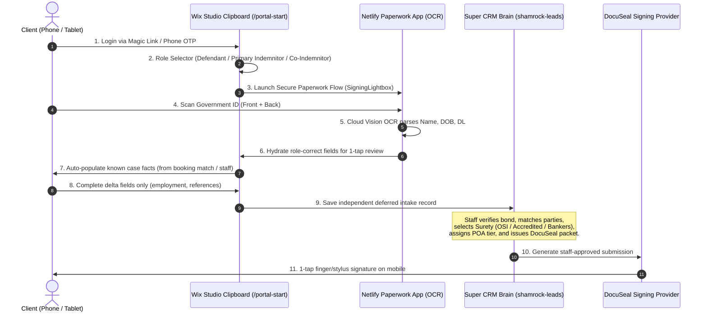

# Current Paperwork Architecture — DocuSeal Finalization & Studio Intake Clipboard

**Status:** Current production architecture  
**Effective date:** 2026-08-21  
**Applies to:** Wix Studio / Velo, Netlify paperwork UI, Super CRM (`shamrock-leads`), Google Apps Script, member portals, staff tooling, Telegram, and outbound communications  

> **Canonical Rule:** **DocuSeal is the sole active signing provider.** A client may complete a secure intake before a defendant, bond amount, or final case is known. Only authorized staff in Super CRM may reconcile that intake to a bond, select the surety carrier, assign POA tier, and issue final DocuSeal paperwork.

---

## 1. Purpose and Non-Negotiable System Boundaries

| System | Permitted Responsibility | Prohibited Responsibility |
|---|---|---|
| **Wix Studio Public Site** | Public education, conversion CTAs, county resources, and authenticated routing | Collecting sensitive paperwork data in public markup or exposing protected content to indexing |
| **Wix Studio Portal & Launchpad** | Authenticate the user via phone OTP / magic link, host `/portal-start` intake wizard, open `SigningLightbox` launchpad | Creating a DocuSeal submission, generating a signing URL, sending a provider invite, or requiring a case match before client intake |
| **Netlify Paperwork App** | Role selection, PIN verification, camera ID scanning, Cloud Vision OCR extraction, delta-only field collection, staff-review notice | Creating an unapproved final packet, assigning a bond amount, or treating a client-selected role as final case reconciliation |
| **Super CRM (`shamrock-leads`)** | Store independent intakes, reconcile defendants & multiple indemnitors, validate Match/BondCase/surety/POA, and issue DocuSeal upon staff approval | Delegating packet authority to a browser, Wix page, legacy GAS sender, or automatic ID-only workflow |
| **DocuSeal** | Host the individual final signing form and return submission/submitter state | Replace staff’s case, party, financial, surety, and POA validation |
| **GAS & Automation** | Maintain operational records, sync intake queue, fail closed on retired direct actions | Revive SignNow routes, direct packet factories, or unverified outbound signing links |

---

## 2. Client Intake Sequence (Mobile & Tablet First)

A client may be a defendant, a primary indemnitor, or an additional indemnitor. The experience begins with a role choice and camera ID scan; it does **not** ask the client to guess a final bond amount, power number, charges, court information, or a finalized defendant match.

### Client Intake Steps:
1. **Authenticated Launch:** Member opens the secure paperwork launchpad.
2. **Role Prompt:** User answers: *"Are you the defendant or helping someone out (Indemnitor)?"*
3. **Camera ID Scan:** User scans government ID. Cloud Vision OCR extracts name, DOB, DL#, and address directly into the role-scoped fields. Cosigner scans never overwrite defendant identity.
4. **Case Facts Hydration:** Known charges, bond amounts, jail, and court details populate automatically from booking data.
5. **Delta Fields Only:** User supplies only missing personal facts (employer, monthly income, emergency contact, references).
6. **Plain Language Acknowledgment:** The client reviews their summary with the following notice:
   > *"This is your secure intake, not the final bond contract. A Shamrock bondsman will verify the case, connect the right parties, and complete staff-only items such as the bond amount, charges, court details, surety carrier, and power number."*
7. **Deferred Intake Saved:** Super CRM records an independent client intake without fabricating a case or packet.

---

## 3. Canonical Schema & Surety Mapping Layer

To prevent the frontend UI from coupling to any specific surety company’s 14-page PDF layout, data is structured into canonical models via [`src/public/canonical-paperwork-mapper.js`](../src/public/canonical-paperwork-mapper.js):

### Canonical Person Object:
- `role`: `'defendant'` | `'indemnitor'` | `'coindemnitor'`
- `firstName`, `middleName`, `lastName`, `fullName`
- `dob`, `ssnLast4`, `ssnFull`, `dlNumber`, `dlState`, `dlExpiration`
- `phone`, `email`, `gender`, `race`
- `address`: `{ street, unit, city, state, zip, howLong }`
- `employment`: `{ employer, position, phone, monthlyIncome, howLong }`
- `emergencyContact`: `{ name, relationship, phone }`
- `references`: `[{ name, relationship, phone, address }]`

### Downstream Surety Packet Mappings:
- **OSI / Accredited / Bankers:** The canonical case model maps onto whichever surety packet is selected by staff in Super CRM.
- **Legacy Backward Compatibility:** `exportToLegacyPacketMap()` generates standard `Def*` and `Ind*` fields for existing GAS, Sheet, and webhook bridges.

---

## 4. Final Signing Sequence (Staff-Gated in Super CRM)

Only authorized staff may execute the signing sequence in Super CRM (`shamrock-leads`):

1. Confirm the correct defendant and `BondCase`.
2. Attach all required indemnitor intake records (supports multiple indemnitors).
3. Select the surety carrier (OSI preferred, Palmetto policy-gated, Accredited/Bankers supported).
4. Assign the active Power of Attorney (POA) number and tier.
5. Complete staff approval and generate the DocuSeal submission.
6. The verified DocuSeal signing session becomes available to the client inside the mobile/tablet launchpad (`SigningLightbox`).

---

## 5. Security & Public Crawler Policy

- No DocuSeal API token, signing URL, or submission ID may ever appear in public HTML markup, page metadata, JSON-LD schemas, `llms.txt`, public sitemaps, or client-side storage.
- All signing URLs are sensitive operational secrets delivered only within authenticated member sessions.

---

*Maintained by Shamrock Engineering & AI Agents*
