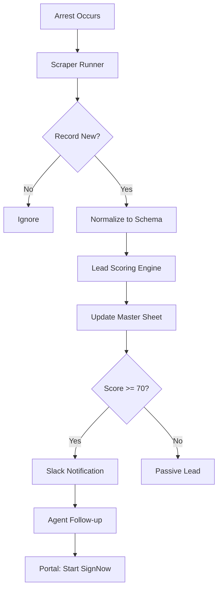

# Process Flow: Arrest to Notification - Shamrock Bail Suite

This document outlines the end-to-end process from the moment an arrest occurs to the notification of a bail agent.

## 1. Data Ingestion (Scrapers)
- **Trigger:** Scheduled cron jobs (GitHub Actions) run every 4-8 hours.
- **Action:** Scrapers target Florida county jail sites (Lee, Collier, etc.).
- **Normalization:** Raw data is mapped to the 34-column `ArrestRecord` schema.
- **Deduplication:** Scrapers check against existing `Booking_Number` in Google Sheets.

## 2. Lead Qualification (Scoring Engine)
- **Scoring:** The `LeadScorer` module applies points based on bond amount, recency, and charges.
- **Classification:** 
  - **Score ≥ 70:** "Hot" (Qualified)
  - **Score 40-69:** "Warm"
  - **Score < 40:** "Cold"
- **Status Update:** `Lead_Status` is assigned in the Master Sheet.

## 3. Real-Time Routing (Wix Frontend)
- **Geolocation:** User visits the site -> Location detected -> Mapped to County.
- **Dynamic Routing:**
  - Optimal phone number injected into UI.
  - User clicked "Call Now" -> Call logged -> Lead identified.
- **Bilingual Support:** Spanish-speaking users routed to a dedicated line.

## 4. Paperwork & Closing (SignNow Integration)
- **Start Bail:** User clicks "Start Bail Online" in portal.
- **Form Generation:** Defendant and Indemnitor details pulled from Sheet/CMS.
- **Digital Signing:** Multi-signer invites sent via SignNow.
- **Completion:** Signed documents stored in Google Drive and logged in Sheet.

## 5. Notification Loop (Slack/SMS)
- **Alerts:** "Hot" leads trigger instant Slack notifications to the appropriate county agent.
- **Mobile Support:** One-tap calling from mobile notifications for agents.

