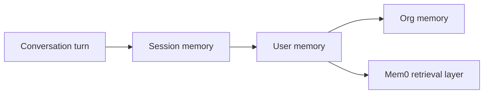

> ## Documentation Index
> Fetch the complete documentation index at: https://docs.mem0.ai/llms.txt
> Use this file to discover all available pages before exploring further.

# Platform vs Open Source

> Choose the right Mem0 solution for your needs

## Which Mem0 is right for you?

Mem0 offers two powerful ways to add memory to your AI applications. Choose based on your priorities:

<CardGroup cols={2}>
  <Card title="Mem0 Platform" icon="cloud" href="/platform/quickstart">
    **Managed, hassle-free**

    Get started in 5 minutes with our hosted solution. Perfect for fast iteration and production apps.
  </Card>

  <Card title="Open Source" icon="code-branch" href="/open-source/python-quickstart">
    **Self-hosted, full control**

    Deploy on your infrastructure. Choose your vector DB, LLM, and configure everything.
  </Card>
</CardGroup>

***

## Feature Comparison

<AccordionGroup>
  <Accordion title="Setup & Getting Started" icon="rocket">
    | Feature                   | Platform                 | Open Source                          |
    | ------------------------- | ------------------------ | ------------------------------------ |
    | **Time to first memory**  | 5 minutes                | 15-30 minutes                        |
    | **Infrastructure needed** | None                     | Vector DB + Python/Node env          |
    | **API key setup**         | One environment variable | Configure LLM + embedder + vector DB |
    | **Maintenance**           | Fully managed by Mem0    | Self-managed                         |
  </Accordion>

  <Accordion title="Core Memory Features" icon="brain">
    | Feature                   | Platform           | Open Source        |
    | ------------------------- | ------------------ | ------------------ |
    | **User & agent memories** | ✅                  | ✅                  |
    | **Smart deduplication**   | ✅                  | ✅                  |
    | **Semantic search**       | ✅                  | ✅                  |
    | **Memory updates**        | ✅                  | ✅                  |
    | **Multi-language SDKs**   | Python, JavaScript | Python, JavaScript |
  </Accordion>

  <Accordion title="Advanced Capabilities" icon="sparkles">
    | Feature                | Platform    | Open Source         |
    | ---------------------- | ----------- | ------------------- |
    | **Graph Memory**       | ✅ (Managed) | ✅ (Self-configured) |
    | **Multimodal support** | ✅           | ✅                   |
    | **Custom categories**  | ✅           | Limited             |
    | **Advanced retrieval** | ✅           | ✅                   |
    | **Memory filters v2**  | ✅           | ⚠️ (via metadata)   |
    | **Webhooks**           | ✅           | ❌                   |
    | **Memory export**      | ✅           | ❌                   |
  </Accordion>

  <Accordion title="Infrastructure & Scaling" icon="server">
    | Feature               | Platform            | Open Source                                   |
    | --------------------- | ------------------- | --------------------------------------------- |
    | **Hosting**           | Managed by Mem0     | Self-hosted                                   |
    | **Auto-scaling**      | ✅                   | Manual                                        |
    | **High availability** | ✅ Built-in          | DIY setup                                     |
    | **Vector DB choice**  | Managed             | Qdrant, Chroma, Pinecone, Milvus, +20 more    |
    | **LLM choice**        | Managed (optimized) | OpenAI, Anthropic, Ollama, Together, +10 more |
    | **Data residency**    | US (expandable)     | Your choice                                   |
  </Accordion>

  <Accordion title="Pricing & Cost" icon="dollar-sign">
    | Aspect                   | Platform                        | Open Source                          |
    | ------------------------ | ------------------------------- | ------------------------------------ |
    | **License**              | Usage-based pricing             | Apache 2.0 (free)                    |
    | **Infrastructure costs** | Included in pricing             | You pay for VectorDB + LLM + hosting |
    | **Support**              | Included                        | Community + GitHub                   |
    | **Best for**             | Fast iteration, production apps | Cost-sensitive, custom requirements  |
  </Accordion>

  <Accordion title="Development & Integration" icon="code">
    | Feature                    | Platform                           | Open Source          |
    | -------------------------- | ---------------------------------- | -------------------- |
    | **REST API**               | ✅                                  | ✅ (via feature flag) |
    | **Python SDK**             | ✅                                  | ✅                    |
    | **JavaScript SDK**         | ✅                                  | ✅                    |
    | **Framework integrations** | LangChain, CrewAI, LlamaIndex, +15 | Same                 |
    | **Dashboard**              | ✅ Web-based                        | ❌                    |
    | **Analytics**              | ✅ Built-in                         | DIY                  |
  </Accordion>
</AccordionGroup>

***

## Decision Guide

### Choose **Platform** if you want:

<CardGroup cols={2}>
  <Card icon="bolt" title="Fast Time to Market">
    Get your AI app with memory live in hours, not weeks. No infrastructure setup needed.
  </Card>

  <Card icon="shield" title="Production-Ready">
    Auto-scaling, high availability, and managed infrastructure out of the box.
  </Card>

  <Card icon="chart-line" title="Built-in Analytics">
    Track memory usage, query patterns, and user engagement through our dashboard.
  </Card>

  <Card icon="webhook" title="Advanced Features">
    Access to webhooks, memory export, custom categories, and priority support.
  </Card>
</CardGroup>

### Choose **Open Source** if you need:

<CardGroup cols={2}>
  <Card icon="lock" title="Full Data Control">
    Host everything on your infrastructure. Complete data residency and privacy control.
  </Card>

  <Card icon="wrench" title="Custom Configuration">
    Choose your own vector DB, LLM provider, embedder, and deployment strategy.
  </Card>

  <Card icon="code" title="Extensibility">
    Modify the codebase, add custom features, and contribute back to the community.
  </Card>

  <Card icon="dollar-sign" title="Cost Optimization">
    Use local LLMs (Ollama), self-hosted vector DBs, and optimize for your specific use case.
  </Card>
</CardGroup>

***

## Still not sure?

<CardGroup cols={2}>
  <Card title="Try Platform Free" icon="rocket" href="https://app.mem0.ai">
    Sign up and test the Platform with our free tier. No credit card required.
  </Card>

  <Card title="Explore Open Source" icon="github" href="https://github.com/mem0ai/mem0">
    Clone the repo and run locally to see how it works. Star us while you're there!
  </Card>
</CardGroup>

> ## Documentation Index
> Fetch the complete documentation index at: https://docs.mem0.ai/llms.txt
> Use this file to discover all available pages before exploring further.

# Mem0 MCP

> Connect any AI client to Mem0 using Model Context Protocol in minutes

<Info>
  **Prerequisites**

  * Mem0 Platform account ([Sign up here](https://app.mem0.ai))
  * API key ([Get one from dashboard](https://app.mem0.ai/settings/api-keys))
  * Python 3.10+, Docker, or Node.js 14+
  * An MCP-compatible client (Claude Desktop, Cursor, or custom agent)
</Info>

## What is Mem0 MCP?

Mem0 MCP Server exposes Mem0's memory capabilities as MCP tools, letting AI agents decide when to save, search, or update information.

## Deployment Options

Choose from three deployment methods:

1. **Python Package (Recommended)** - Install locally with `uvx` for instant setup
2. **Docker Container** - Isolated deployment with HTTP endpoint
3. **Smithery** - Remote hosted service for managed deployments

## Available Tools

The MCP server exposes these memory tools to your AI client:

| Tool                  | Description                                           |
| --------------------- | ----------------------------------------------------- |
| `add_memory`          | Save text or conversation history for a user/agent    |
| `search_memories`     | Semantic search across existing memories with filters |
| `get_memories`        | List memories with structured filters and pagination  |
| `get_memory`          | Retrieve one memory by its `memory_id`                |
| `update_memory`       | Overwrite a memory's text after confirming the ID     |
| `delete_memory`       | Delete a single memory by `memory_id`                 |
| `delete_all_memories` | Bulk delete all memories in scope                     |
| `delete_entities`     | Delete a user/agent/app/run entity and its memories   |
| `list_entities`       | Enumerate users/agents/apps/runs stored in Mem0       |

***

## Quickstart with Python (UVX)

<Steps>
  <Step title="Install the MCP Server">
    ```bash  theme={null}
    uv pip install mem0-mcp-server
    ```
  </Step>

  <Step title="Configure your MCP client">
    Add this to your MCP client (e.g., Claude Desktop):

    ```json  theme={null}
    {
      "mcpServers": {
        "mem0": {
          "command": "uvx",
          "args": ["mem0-mcp-server"],
          "env": {
            "MEM0_API_KEY": "m0-...",
            "MEM0_DEFAULT_USER_ID": "your-handle"
          }
        }
      }
    }
    ```

    Set your environment variables:

    ```bash  theme={null}
    export MEM0_API_KEY="m0-..."
    export MEM0_DEFAULT_USER_ID="your-handle"
    ```
  </Step>

  <Step title="Test with the Python agent">
    ```bash  theme={null}
    # Clone the mem0-mcp repository
    git clone https://github.com/mem0ai/mem0-mcp.git
    cd mem0-mcp

    # Set your API keys
    export MEM0_API_KEY="m0-..."
    export OPENAI_API_KEY="sk-openai-..."

    # Run the interactive agent
    python example/pydantic_ai_repl.py
    ```

    **Sample Interactions:**

    ```
    User: Remember that I love tiramisu
    Agent: Got it! I've saved that you love tiramisu.

    User: What do you know about my food preferences?
    Agent: Based on your memories, you love tiramisu.

    User: Update my project: the mobile app is now 80% complete
    Agent: Updated your project status successfully.
    ```
  </Step>

  <Step title="Verify the setup">
    Your AI client can now:

    * Automatically save information with `add_memory`
    * Search memories with `search_memories`
    * Update memories with `update_memory`
    * Delete memories with `delete_memory`

    <Info icon="check">
      If you get "Connection failed", ensure your API key is valid and the server is running.
    </Info>
  </Step>
</Steps>

***

## Quickstart with Docker

<Steps>
  <Step title="Build the Docker image">
    ```bash  theme={null}
    docker build -t mem0-mcp-server https://github.com/mem0ai/mem0-mcp.git
    ```
  </Step>

  <Step title="Run the container">
    ```bash  theme={null}
    docker run --rm -d \
      --name mem0-mcp \
      -e MEM0_API_KEY="m0-..." \
      -p 8080:8081 \
      mem0-mcp-server
    ```
  </Step>

  <Step title="Configure your client for HTTP">
    For clients that connect via HTTP (instead of stdio):

    ```json  theme={null}
    {
      "mcpServers": {
        "mem0-docker": {
          "command": "curl",
          "args": ["-X", "POST", "http://localhost:8080/mcp", "--data-binary", "@-"],
          "env": {
            "MEM0_API_KEY": "m0-..."
          }
        }
      }
    }
    ```
  </Step>

  <Step title="Verify the setup">
    ```bash  theme={null}
    # Check container logs
    docker logs mem0-mcp

    # Test HTTP endpoint
    curl http://localhost:8080/health
    ```

    <Info icon="check">
      The container should start successfully and respond to HTTP requests. If port 8080 is occupied, change it with `-p 8081:8081`.
    </Info>
  </Step>
</Steps>

***

## Quickstart with Smithery (Hosted)

For the simplest integration, use Smithery's hosted Mem0 MCP server - no installation required.

**Example: One-click setup in Cursor**

1. Visit [smithery.ai/server/@mem0ai/mem0-memory-mcp](https://smithery.ai/server/@mem0ai/mem0-memory-mcp) and select Cursor as your client


2. Open Cursor → Settings → MCP
3. Click `mem0-mcp` → Initiate authorization
4. Configure Smithery with your environment:
   * `MEM0_API_KEY`: Your Mem0 API key
   * `MEM0_DEFAULT_USER_ID`: Your user ID
   * `MEM0_ENABLE_GRAPH_DEFAULT`: Optional, set to `true` for graph memories
5. Return to Cursor settings and wait for tools to load
6. Start chatting with Cursor and begin storing preferences

**For other clients:**
Visit [smithery.ai/server/@mem0ai/mem0-memory-mcp](https://smithery.ai/server/@mem0ai/mem0-memory-mcp) to connect any MCP-compatible client with your Mem0 credentials.

***

## Quick Recovery

* **"uvx command not found"** → Install with `pip install uv` or use `pip install mem0-mcp-server` instead. Make sure your Python environment has `uv` installed (or system-wide).
* **"Connection refused"** → Check that the server is running and the correct port is configured
* **"Invalid API key"** → Get a new key from [Mem0 Dashboard](https://app.mem0.ai/settings/api-keys)
* **"Permission denied"** → Ensure Docker has access to bind ports (try with `sudo` on Linux)

***

## Next Steps

<CardGroup cols={2}>
  <Card title="MCP Integration Feature" description="Learn about MCP configuration options and advanced patterns" icon="plug" href="/platform/features/mcp-integration" />

  <Card title="Gemini 3 with Mem0 MCP" description="See how to integrate Gemini 3 with Mem0 MCP server" icon="book-open" href="/cookbooks/frameworks/gemini-3-with-mem0-mcp" />
</CardGroup>

## Additional Resources

* **[Mem0 MCP Repository](https://github.com/mem0ai/mem0-mcp)** - Source code and examples
* **[Platform Quickstart](/platform/quickstart)** - Direct API integration guide
* **[MCP Specification](https://modelcontextprotocol.io)** - Learn about MCP protocol

> ## Documentation Index
> Fetch the complete documentation index at: https://docs.mem0.ai/llms.txt
> Use this file to discover all available pages before exploring further.

# Platform vs Open Source

> Choose the right Mem0 solution for your needs

## Which Mem0 is right for you?

Mem0 offers two powerful ways to add memory to your AI applications. Choose based on your priorities:

<CardGroup cols={2}>
  <Card title="Mem0 Platform" icon="cloud" href="/platform/quickstart">
    **Managed, hassle-free**

    Get started in 5 minutes with our hosted solution. Perfect for fast iteration and production apps.
  </Card>

  <Card title="Open Source" icon="code-branch" href="/open-source/python-quickstart">
    **Self-hosted, full control**

    Deploy on your infrastructure. Choose your vector DB, LLM, and configure everything.
  </Card>
</CardGroup>

***

## Feature Comparison

<AccordionGroup>
  <Accordion title="Setup & Getting Started" icon="rocket">
    | Feature                   | Platform                 | Open Source                          |
    | ------------------------- | ------------------------ | ------------------------------------ |
    | **Time to first memory**  | 5 minutes                | 15-30 minutes                        |
    | **Infrastructure needed** | None                     | Vector DB + Python/Node env          |
    | **API key setup**         | One environment variable | Configure LLM + embedder + vector DB |
    | **Maintenance**           | Fully managed by Mem0    | Self-managed                         |
  </Accordion>

  <Accordion title="Core Memory Features" icon="brain">
    | Feature                   | Platform           | Open Source        |
    | ------------------------- | ------------------ | ------------------ |
    | **User & agent memories** | ✅                  | ✅                  |
    | **Smart deduplication**   | ✅                  | ✅                  |
    | **Semantic search**       | ✅                  | ✅                  |
    | **Memory updates**        | ✅                  | ✅                  |
    | **Multi-language SDKs**   | Python, JavaScript | Python, JavaScript |
  </Accordion>

  <Accordion title="Advanced Capabilities" icon="sparkles">
    | Feature                | Platform    | Open Source         |
    | ---------------------- | ----------- | ------------------- |
    | **Graph Memory**       | ✅ (Managed) | ✅ (Self-configured) |
    | **Multimodal support** | ✅           | ✅                   |
    | **Custom categories**  | ✅           | Limited             |
    | **Advanced retrieval** | ✅           | ✅                   |
    | **Memory filters v2**  | ✅           | ⚠️ (via metadata)   |
    | **Webhooks**           | ✅           | ❌                   |
    | **Memory export**      | ✅           | ❌                   |
  </Accordion>

  <Accordion title="Infrastructure & Scaling" icon="server">
    | Feature               | Platform            | Open Source                                   |
    | --------------------- | ------------------- | --------------------------------------------- |
    | **Hosting**           | Managed by Mem0     | Self-hosted                                   |
    | **Auto-scaling**      | ✅                   | Manual                                        |
    | **High availability** | ✅ Built-in          | DIY setup                                     |
    | **Vector DB choice**  | Managed             | Qdrant, Chroma, Pinecone, Milvus, +20 more    |
    | **LLM choice**        | Managed (optimized) | OpenAI, Anthropic, Ollama, Together, +10 more |
    | **Data residency**    | US (expandable)     | Your choice                                   |
  </Accordion>

  <Accordion title="Pricing & Cost" icon="dollar-sign">
    | Aspect                   | Platform                        | Open Source                          |
    | ------------------------ | ------------------------------- | ------------------------------------ |
    | **License**              | Usage-based pricing             | Apache 2.0 (free)                    |
    | **Infrastructure costs** | Included in pricing             | You pay for VectorDB + LLM + hosting |
    | **Support**              | Included                        | Community + GitHub                   |
    | **Best for**             | Fast iteration, production apps | Cost-sensitive, custom requirements  |
  </Accordion>

  <Accordion title="Development & Integration" icon="code">
    | Feature                    | Platform                           | Open Source          |
    | -------------------------- | ---------------------------------- | -------------------- |
    | **REST API**               | ✅                                  | ✅ (via feature flag) |
    | **Python SDK**             | ✅                                  | ✅                    |
    | **JavaScript SDK**         | ✅                                  | ✅                    |
    | **Framework integrations** | LangChain, CrewAI, LlamaIndex, +15 | Same                 |
    | **Dashboard**              | ✅ Web-based                        | ❌                    |
    | **Analytics**              | ✅ Built-in                         | DIY                  |
  </Accordion>
</AccordionGroup>

***

## Decision Guide

### Choose **Platform** if you want:

<CardGroup cols={2}>
  <Card icon="bolt" title="Fast Time to Market">
    Get your AI app with memory live in hours, not weeks. No infrastructure setup needed.
  </Card>

  <Card icon="shield" title="Production-Ready">
    Auto-scaling, high availability, and managed infrastructure out of the box.
  </Card>

  <Card icon="chart-line" title="Built-in Analytics">
    Track memory usage, query patterns, and user engagement through our dashboard.
  </Card>

  <Card icon="webhook" title="Advanced Features">
    Access to webhooks, memory export, custom categories, and priority support.
  </Card>
</CardGroup>

### Choose **Open Source** if you need:

<CardGroup cols={2}>
  <Card icon="lock" title="Full Data Control">
    Host everything on your infrastructure. Complete data residency and privacy control.
  </Card>

  <Card icon="wrench" title="Custom Configuration">
    Choose your own vector DB, LLM provider, embedder, and deployment strategy.
  </Card>

  <Card icon="code" title="Extensibility">
    Modify the codebase, add custom features, and contribute back to the community.
  </Card>

  <Card icon="dollar-sign" title="Cost Optimization">
    Use local LLMs (Ollama), self-hosted vector DBs, and optimize for your specific use case.
  </Card>
</CardGroup>

***

## Still not sure?

<CardGroup cols={2}>
  <Card title="Try Platform Free" icon="rocket" href="https://app.mem0.ai">
    Sign up and test the Platform with our free tier. No credit card required.
  </Card>

  <Card title="Explore Open Source" icon="github" href="https://github.com/mem0ai/mem0">
    Clone the repo and run locally to see how it works. Star us while you're there!
  </Card>
</CardGroup>

> ## Documentation Index
> Fetch the complete documentation index at: https://docs.mem0.ai/llms.txt
> Use this file to discover all available pages before exploring further.

# Memory Types

> See how Mem0 layers conversation, session, and user memories to keep agents contextual.

# How Mem0 Organizes Memory

Mem0 separates memory into layers so agents remember the right detail at the right time. Think of it like a notebook: a sticky note for the current task, a daily journal for the session, and an archive for everything a user has shared.

<Info>
  **Why it matters**

  * Keeps conversations coherent without repeating instructions.
  * Lets agents personalize responses based on long-term preferences.
  * Avoids over-fetching data by scoping memory to the correct layer.
</Info>

## Key terms

* **Conversation memory** – In-flight messages inside a single turn (what was just said).
* **Session memory** – Short-lived facts that apply for the current task or channel.
* **User memory** – Long-lived knowledge tied to a person, account, or workspace.
* **Organizational memory** – Shared context available to multiple agents or teams.



## Short-term vs long-term memory

Short-term memory keeps the current conversation coherent. It includes:

* **Conversation history** – recent turns in order so the agent remembers what was just said.
* **Working memory** – temporary state such as tool outputs or intermediate calculations.
* **Attention context** – the immediate focus of the assistant, similar to what a person holds in mind mid-sentence.

Long-term memory preserves knowledge across sessions. It captures:

* **Factual memory** – user preferences, account details, and domain facts.
* **Episodic memory** – summaries of past interactions or completed tasks.
* **Semantic memory** – relationships between concepts so agents can reason about them later.

Mem0 maps these classic categories onto its layered storage so you can decide what should fade quickly versus what should last for months.

## How does it work?

Mem0 stores each layer separately and merges them when you query:

1. **Capture** – Messages enter the conversation layer while the turn is active.
2. **Promote** – Relevant details persist to session or user memory based on your `user_id`, `session_id`, and metadata.
3. **Retrieve** – The search pipeline pulls from all layers, ranking user memories first, then session notes, then raw history.

```python  theme={null}
import os

from mem0 import Memory

memory = Memory(api_key=os.environ["MEM0_API_KEY"])

# Sticky note: conversation memory
memory.add(
    ["I'm Alex and I prefer boutique hotels."],
    user_id="alex",
    session_id="trip-planning-2025",
)

# Later in the session, pull long-term + session context
results = memory.search(
    "Any hotel preferences?",
    user_id="alex",
    session_id="trip-planning-2025",
)
```

<Tip>
  Use `session_id` when you want short-term context to expire automatically; rely on `user_id` for lasting personalization.
</Tip>

## When should you use each layer?

* **Conversation memory** – Tool calls or chain-of-thought that only matter within the current turn.
* **Session memory** – Multi-step tasks (onboarding flows, debugging sessions) that should reset once complete.
* **User memory** – Personal preferences, account state, or compliance details that must persist across interactions.
* **Organizational memory** – Shared FAQs, product catalogs, or policies that every agent should recall.

## How it compares

| Layer        | Lifetime            | Short or long term | Best for              | Trade-offs                   |
| ------------ | ------------------- | ------------------ | --------------------- | ---------------------------- |
| Conversation | Single response     | Short-term         | Tool execution detail | Lost after the turn finishes |
| Session      | Minutes to hours    | Short-term         | Multi-step flows      | Clear it manually when done  |
| User         | Weeks to forever    | Long-term          | Personalization       | Requires consent/governance  |
| Org          | Configured globally | Long-term          | Shared knowledge      | Needs owner to keep current  |

<Warning>
  Avoid storing secrets or unredacted PII in user or org memories—Mem0 is retrievable by design. Encrypt or hash sensitive values first.
</Warning>

## Put it into practice

* Use the <Link href="/core-concepts/memory-operations/add">Add Memory</Link> guide to persist user preferences.
* Follow <Link href="/platform/advanced-memory-operations">Advanced Memory Operations</Link> to tune metadata and graph writes.

## See it live

* <Link href="/cookbooks/companions/ai-tutor">AI Tutor with Mem0</Link> shows session vs user memories in action.
* <Link href="/cookbooks/operations/support-inbox">Support Inbox with Mem0</Link> demonstrates shared org memory.

<CardGroup cols={2}>
  <Card title="Explore Memory Operations" description="Dive into the add/search/update/delete concepts next." icon="circle-check" href="/core-concepts/memory-operations/add" />

  <Card title="See a Cookbook" description="Apply layered memories inside a customer support agent." icon="rocket" href="/cookbooks/operations/support-inbox" />
</CardGroup>

> ## Documentation Index
> Fetch the complete documentation index at: https://docs.mem0.ai/llms.txt
> Use this file to discover all available pages before exploring further.

# Add Memory

> Add memory into the Mem0 platform by storing user-assistant interactions and facts for later retrieval.

# How Mem0 Adds Memory

Adding memory is how Mem0 captures useful details from a conversation so your agents can reuse them later. Think of it as saving the important sentences from a chat transcript into a structured notebook your agent can search.

<Info>
  **Why it matters**

  * Preserves user preferences, goals, and feedback across sessions.
  * Powers personalization and decision-making in downstream conversations.
  * Keeps context consistent between managed Platform and OSS deployments.
</Info>

## Key terms

* **Messages** – The ordered list of user/assistant turns you send to `add`.
* **Infer** – Controls whether Mem0 extracts structured memories (`infer=True`, default) or stores raw messages.
* **Metadata** – Optional filters (e.g., `{"category": "movie_recommendations"}`) that improve retrieval later.
* **User / Session identifiers** – `user_id`, `session_id`, or `run_id` that scope the memory for future searches.

## How does it work?

Mem0 offers two flows:

* **Mem0 Platform** – Fully managed API with dashboard, scaling, and graph features.
* **Mem0 Open Source** – Local SDK that you run in your own environment.

Both flows take the same payload and pass it through the same pipeline.

<Frame caption="Architecture diagram illustrating the process of adding memories.">
  
</Frame>

<Steps>
  <Step title="Information extraction">
    Mem0 sends the messages through an LLM that pulls out key facts, decisions, or preferences to remember.
  </Step>

  <Step title="Conflict resolution">
    Existing memories are checked for duplicates or contradictions so the latest truth wins.
  </Step>

  <Step title="Storage">
    The resulting memories land in managed vector storage (and optional graph storage) so future searches return them quickly.
  </Step>
</Steps>

<Warning>
  Duplicate protection only runs during that conflict-resolution step when you let Mem0 infer memories (`infer=True`, the default). If you switch to `infer=False`, Mem0 stores your payload exactly as provided, so duplicates will land. Mixing both modes for the same fact will save it twice.
</Warning>

You trigger this pipeline with a single `add` call—no manual orchestration needed.

## Add with Mem0 Platform

<CodeGroup>
  ```python Python theme={null}
  from mem0 import MemoryClient

  client = MemoryClient(api_key="your-api-key")

  messages = [
      {"role": "user", "content": "I'm planning a trip to Tokyo next month."},
      {"role": "assistant", "content": "Great! I’ll remember that for future suggestions."}
  ]

  client.add(
      messages=messages,
      user_id="alice",
  )
  ```

  ```javascript JavaScript theme={null}
  import { MemoryClient } from "mem0ai";

  const client = new MemoryClient({apiKey: "your-api-key"});

  const messages = [
    { role: "user", content: "I'm planning a trip to Tokyo next month." },
    { role: "assistant", content: "Great! I’ll remember that for future suggestions." }
  ];

  await client.add(messages, {
    user_id: "alice",
    version: "v2",
  });
  ```
</CodeGroup>

<Info icon="check">
  Expect a `memory_id` (or list of IDs) in the response. Check the Mem0 dashboard to confirm the new entry under the correct user.
</Info>

## Add with Mem0 Open Source

<CodeGroup>
  ```python Python theme={null}
  import os
  from mem0 import Memory

  os.environ["OPENAI_API_KEY"] = "your-api-key"

  m = Memory()

  messages = [
      {"role": "user", "content": "I'm planning to watch a movie tonight. Any recommendations?"},
      {"role": "assistant", "content": "How about thriller movies? They can be quite engaging."},
      {"role": "user", "content": "I'm not a big fan of thriller movies but I love sci-fi movies."},
      {"role": "assistant", "content": "Got it! I'll avoid thriller recommendations and suggest sci-fi movies in the future."}
  ]

  # Store inferred memories (default behavior)
  result = m.add(messages, user_id="alice", metadata={"category": "movie_recommendations"})

  # Optionally store raw messages without inference
  result = m.add(messages, user_id="alice", metadata={"category": "movie_recommendations"}, infer=False)
  ```

  ```javascript JavaScript theme={null}
  import { Memory } from 'mem0ai/oss';

  const memory = new Memory();

  const messages = [
    {
      role: "user",
      content: "I like to drink coffee in the morning and go for a walk"
    }
  ];

  const result = memory.add(messages, {
    userId: "alice",
    metadata: { category: "preferences" }
  });
  ```
</CodeGroup>

<Tip>
  Use `infer=False` only when you need to store raw transcripts. Most workflows benefit from Mem0 extracting structured memories automatically.
</Tip>

<Warning>
  If you do choose `infer=False`, keep it consistent. Raw inserts skip conflict resolution, so a later `infer=True` call with the same content will create a second memory instead of updating the first.
</Warning>

## When Should You Add Memory?

Add memory whenever your agent learns something useful:

* A new user preference is shared
* A decision or suggestion is made
* A goal or task is completed
* A new entity is introduced
* A user gives feedback or clarification

<Callout type="tip" icon="plug">
  **MCP Alternative**: With <Link href="/platform/mem0-mcp">Mem0 MCP</Link>, AI agents can add memories automatically based on context.
</Callout>

Storing this context allows the agent to reason better in future interactions.

### More Details

For full list of supported fields, required formats, and advanced options, see the
[Add Memory API Reference](/api-reference/memory/add-memories).

## Managed vs OSS differences

| Capability           | Mem0 Platform                            | Mem0 OSS                                        |
| -------------------- | ---------------------------------------- | ----------------------------------------------- |
| Conflict resolution  | Automatic with dashboard visibility      | SDK handles merges locally; you control storage |
| Graph writes         | Toggle per request (`enable_graph=True`) | Requires configuring a graph provider           |
| Rate limits          | Managed quotas per workspace             | Limited by your hardware and provider APIs      |
| Dashboard visibility | Yes — inspect memories visually          | Inspect via CLI, logs, or custom UI             |

## Put it into practice

* Review the <Link href="/platform/advanced-memory-operations">Advanced Memory Operations</Link> guide to layer metadata, rerankers, and graph toggles.
* Explore the <Link href="/api-reference/memory/add-memories">Add Memories API reference</Link> for every request/response field.

## See it live

* <Link href="/cookbooks/operations/support-inbox">Support Inbox with Mem0</Link> shows add + search powering a support flow.
* <Link href="/cookbooks/companions/ai-tutor">AI Tutor with Mem0</Link> uses add to personalize lesson plans.

<CardGroup cols={2}>
  <Card title="Explore Search Concepts" description="See how stored memories feed retrieval in the Search guide." icon="search" href="/core-concepts/memory-operations/search" />

  <Card title="Build a Support Agent" description="Follow the cookbook to apply add/search/update in production." icon="rocket" href="/cookbooks/operations/support-inbox" />
</CardGroup>

> ## Documentation Index
> Fetch the complete documentation index at: https://docs.mem0.ai/llms.txt
> Use this file to discover all available pages before exploring further.

# Search Memory

> Retrieve relevant memories from Mem0 using powerful semantic and filtered search capabilities.

# How Mem0 Searches Memory

Mem0's search operation lets agents ask natural-language questions and get back the memories that matter most. Like a smart librarian, it finds exactly what you need from everything you've stored.

<Info>
  **Why it matters**

  * Retrieves the right facts without rebuilding prompts from scratch.
  * Supports both managed Platform and OSS so you can test locally and deploy at scale.
  * Keeps results relevant with filters, rerankers, and thresholds.
</Info>

## Key terms

* **Query** – Natural-language question or statement you pass to `search`.
* **Filters** – JSON logic (AND/OR, comparison operators) that narrows results by user, categories, dates, etc.
* **top\_k / threshold** – Controls how many memories return and the minimum similarity score.
* **Rerank** – Optional second pass that boosts precision when a reranker is configured.

## Architecture

<Frame caption="Architecture diagram illustrating the memory search process.">
  
</Frame>

<Steps>
  <Step title="Query processing">
    Mem0 cleans and enriches your natural-language query so the downstream embedding search is accurate.
  </Step>

  <Step title="Vector search">
    Embeddings locate the closest memories using cosine similarity across your scoped dataset.
  </Step>

  <Step title="Filtering & reranking">
    Logical filters narrow candidates; rerankers or thresholds fine-tune ordering.
  </Step>

  <Step title="Results delivery">
    Formatted memories (with metadata and timestamps) return to your agent or calling service.
  </Step>
</Steps>

This pipeline runs the same way for the hosted Platform API and the OSS SDK.

## How does it work?

Search converts your natural language question into a vector embedding, then finds memories with similar embeddings in your database. The results are ranked by similarity score and can be further refined with filters or reranking.

```python  theme={null}
# Minimal example that shows the concept in action
# Platform API
client.search("What are Alice's hobbies?", filters={"user_id": "alice"})

# OSS
m.search("What are Alice's hobbies?", user_id="alice")
```

<Tip>
  Always provide at least a `user_id` filter to scope searches to the right user's memories. This prevents cross-contamination between users.
</Tip>

## When should you use it?

* **Context retrieval** - When your agent needs past context to generate better responses
* **Personalization** - To recall user preferences, history, or past interactions
* **Fact checking** - To verify information against stored memories before responding
* **Decision support** - When agents need relevant background information to make decisions

## Platform vs OSS usage

| Capability            | Mem0 Platform                                                        | Mem0 OSS                                            |
| --------------------- | -------------------------------------------------------------------- | --------------------------------------------------- |
| **user\_id usage**    | In `filters={"user_id": "alice"}` for search/get\_all                | As parameter `user_id="alice"` for all operations   |
| **Filter syntax**     | Logical operators (`AND`, `OR`, comparisons) with field-level access | Basic field filters, extend via Python hooks        |
| **Reranking**         | Toggle `rerank=True` with managed reranker catalog                   | Requires configuring local or third-party rerankers |
| **Thresholds**        | Request-level configuration (`threshold`, `top_k`)                   | Controlled via SDK parameters                       |
| **Response metadata** | Includes confidence scores, timestamps, dashboard visibility         | Determined by your storage backend                  |

## Search with Mem0 Platform

<CodeGroup>
  ```python Python theme={null}
  from mem0 import MemoryClient

  client = MemoryClient(api_key="your-api-key")

  query = "What do you know about me?"
  filters = {
     "OR": [
        {"user_id": "alice"},
        {"agent_id": {"in": ["travel-assistant", "customer-support"]}}
     ]
  }

  results = client.search(query, filters=filters)
  ```

  ```javascript JavaScript theme={null}
  import { MemoryClient } from "mem0ai";

  const client = new MemoryClient({apiKey: "your-api-key"});

  const query = "I'm craving some pizza. Any recommendations?";
  const filters = {
    AND: [
      { user_id: "alice" }
    ]
  };

  const results = await client.search(query, {
    filters
  });
  ```
</CodeGroup>

## Search with Mem0 Open Source

<CodeGroup>
  ```python Python theme={null}
  from mem0 import Memory

  m = Memory()

  # Simple search
  related_memories = m.search("Should I drink coffee or tea?", user_id="alice")

  # Search with filters
  memories = m.search(
      "food preferences",
      user_id="alice",
      filters={"categories": {"contains": "diet"}}
  )
  ```

  ```javascript JavaScript theme={null}
  import { Memory } from 'mem0ai/oss';

  const memory = new Memory();

  // Simple search
  const relatedMemories = memory.search("Should I drink coffee or tea?", { userId: "alice" });

  // Search with filters (if supported)
  const memories = memory.search("food preferences", {
      userId: "alice",
      filters: { categories: { contains: "diet" } }
  });
  ```
</CodeGroup>

<Info icon="check">
  Expect an array of memory documents. Platform responses include vectors, metadata, and timestamps; OSS returns your stored schema.
</Info>

## Filter patterns

Filters help narrow down search results. Common use cases:

**Filter by Session Context:**

*Platform API:*

```python  theme={null}
# Get memories from a specific agent session
client.search("query", filters={
    "AND": [
        {"user_id": "alice"},
        {"agent_id": "chatbot"},
        {"run_id": "session-123"}
    ]
})
```

*OSS:*

```python  theme={null}
# Get memories from a specific agent session
m.search("query", user_id="alice", agent_id="chatbot", run_id="session-123")
```

**Filter by Date Range:**

```python  theme={null}
# Platform only - date filtering
client.search("recent memories", filters={
    "AND": [
        {"user_id": "alice"},
        {"created_at": {"gte": "2024-07-01"}}
    ]
})
```

**Filter by Categories:**

```python  theme={null}
# Platform only - category filtering
client.search("preferences", filters={
    "AND": [
        {"user_id": "alice"},
        {"categories": {"contains": "food"}}
    ]
})
```

## Tips for better search

* **Use natural language**: Mem0 understands intent, so describe what you're looking for naturally
* **Scope with user ID**: Always provide `user_id` to scope search to relevant memories
  * **Platform API**: Use `filters={"user_id": "alice"}`
  * **OSS**: Use `user_id="alice"` as parameter
* **Combine filters**: Use AND/OR logic to create precise queries (Platform)
* **Consider wildcard filters**: Use wildcard filters (e.g., `run_id: "*"`) for broader matches
* **Tune parameters**: Adjust `top_k` for result count, `threshold` for relevance cutoff
* **Enable reranking**: Use `rerank=True` (default) when you have a reranker configured

<Callout type="tip" icon="plug">
  **MCP Alternative**: With <Link href="/platform/mem0-mcp">Mem0 MCP</Link>, AI agents can search their own memories proactively when needed.
</Callout>

### More Details

For the full list of filter logic, comparison operators, and optional search parameters, see the
[Search Memory API Reference](/api-reference/memory/search-memories).

## Put it into practice

* Revisit the <Link href="/core-concepts/memory-operations/add">Add Memory</Link> guide to ensure you capture the context you expect to retrieve.
* Configure rerankers and filters in <Link href="/platform/features/advanced-retrieval">Advanced Retrieval</Link> for higher precision.

## See it live

* <Link href="/cookbooks/operations/support-inbox">Support Inbox with Mem0</Link> demonstrates scoped search with rerankers.
* <Link href="/cookbooks/integrations/tavily-search">Tavily Search with Mem0</Link> shows hybrid search in action.

<CardGroup cols={2}>
  <Card title="Search Memory API" description="Complete API reference with all filter operators and parameters." icon="book" href="/api-reference/memory/search-memories" />

  <Card title="Support Inbox Cookbook" description="Build a complete support system with scoped search and reranking." icon="rocket" href="/cookbooks/operations/support-inbox" />
</CardGroup>

> ## Documentation Index
> Fetch the complete documentation index at: https://docs.mem0.ai/llms.txt
> Use this file to discover all available pages before exploring further.

# Update Memory

> Modify an existing memory by updating its content or metadata.

# Keep Memories Accurate with Update

Mem0’s update operation lets you fix or enrich an existing memory without deleting it. When a user changes their preference or clarifies a fact, use update to keep the knowledge base fresh.

<Info>
  **Why it matters**

  * Corrects outdated or incorrect memories immediately.
  * Adds new metadata so filters and rerankers stay sharp.
  * Works for both one-off edits and large batches (up to 1000 memories).
</Info>

## Key terms

* **memory\_id** – Unique identifier returned by `add` or `search` results.
* **text** / **data** – New content that replaces the stored memory value.
* **metadata** – Optional key-value pairs you update alongside the text.
* **timestamp** – Unix epoch (int/float) or ISO 8601 string to override the memory's timestamp.
* **batch\_update** – Platform API that edits multiple memories in a single request.
* **immutable** – Flagged memories that must be deleted and re-added instead of updated.

## How the update flow works

<Steps>
  <Step title="Locate the memory">
    Use `search` or dashboard inspection to capture the `memory_id` you want to change.
  </Step>

  <Step title="Submit the update">
    Call `update` (or `batch_update`) with new text and optional metadata. Mem0 overwrites the stored value and adjusts indexes.
  </Step>

  <Step title="Verify">
    Check the response or re-run `search` to ensure the revised memory appears with the new content.
  </Step>
</Steps>

## Single memory update (Platform)

<CodeGroup>
  ```python Python theme={null}
  from mem0 import MemoryClient

  client = MemoryClient(api_key="your-api-key")

  memory_id = "your_memory_id"
  client.update(
      memory_id=memory_id,
      text="Updated memory content about the user",
      metadata={"category": "profile-update"},
      timestamp="2025-01-15T12:00:00Z"
  )
  ```

  ```javascript JavaScript theme={null}
  import MemoryClient from 'mem0ai';

  const client = new MemoryClient({ apiKey: "your-api-key" });
  const memory_id = "your_memory_id";

  await client.update(memory_id, {
    text: "Updated memory content about the user",
    metadata: { category: "profile-update" },
    timestamp: "2025-01-15T12:00:00Z"
  });
  ```
</CodeGroup>

<Info icon="check">
  Expect a confirmation message and the updated memory to appear in the dashboard almost instantly.
</Info>

## Batch update (Platform)

Update up to 1000 memories in one call.

<CodeGroup>
  ```python Python theme={null}
  from mem0 import MemoryClient

  client = MemoryClient(api_key="your-api-key")

  update_memories = [
      {"memory_id": "id1", "text": "Watches football"},
      {"memory_id": "id2", "text": "Likes to travel"}
  ]

  response = client.batch_update(update_memories)
  print(response)
  ```

  ```javascript JavaScript theme={null}
  import MemoryClient from 'mem0ai';

  const client = new MemoryClient({ apiKey: "your-api-key" });

  const updateMemories = [
    { memoryId: "id1", text: "Watches football" },
    { memoryId: "id2", text: "Likes to travel" }
  ];

  client.batchUpdate(updateMemories)
    .then(response => console.log('Batch update response:', response))
    .catch(error => console.error(error));
  ```
</CodeGroup>

## Update with Mem0 OSS

<CodeGroup>
  ```python Python theme={null}
  from mem0 import Memory

  memory = Memory()

  memory.update(
      memory_id="mem_123",
      data="Alex now prefers decaf coffee",
  )
  ```

  ```
  ```
</CodeGroup>

<Note>
  OSS JavaScript SDK does not expose `update` yet—use the REST API or Python SDK when self-hosting.
</Note>

## Tips

* Update both `text` **and** `metadata` together to keep filters accurate.
* Batch updates are ideal after large imports or when syncing CRM corrections.
* Immutable memories must be deleted and re-added instead of updated.
* Pair updates with feedback signals (thumbs up/down) to self-heal memories automatically.

<Callout type="tip" icon="plug">
  **MCP Alternative**: With <Link href="/platform/mem0-mcp">Mem0 MCP</Link>, AI agents can update their own memories when users correct information.
</Callout>

## Managed vs OSS differences

| Capability           | Mem0 Platform                               | Mem0 OSS                             |
| -------------------- | ------------------------------------------- | ------------------------------------ |
| Update call          | `client.update(memory_id, {...})`           | `memory.update(memory_id, data=...)` |
| Batch updates        | `client.batch_update` (up to 1000 memories) | Script your own loop or bulk job     |
| Dashboard visibility | Inspect updates in the UI                   | Inspect via logs or custom tooling   |
| Immutable handling   | Returns descriptive error                   | Raises exception—delete and re-add   |

## Put it into practice

* Review the <Link href="/api-reference/memory/update-memory">Update Memory API reference</Link> for request/response details.
* Combine updates with <Link href="/platform/features/feedback-mechanism">Feedback Mechanism</Link> to automate corrections.

## See it live

* <Link href="/cookbooks/operations/support-inbox">Support Inbox with Mem0</Link> uses updates to refine customer profiles.
* <Link href="/cookbooks/companions/ai-tutor">AI Tutor with Mem0</Link> demonstrates user preference corrections mid-course.

<CardGroup cols={2}>
  <Card title="Learn Delete Concepts" description="Understand when to remove memories instead of editing them." icon="trash" href="/core-concepts/memory-operations/delete" />

  <Card title="Automate Corrections" description="See how feedback loops trigger updates in production." icon="rocket" href="/platform/features/feedback-mechanism" />
</CardGroup>

> ## Documentation Index
> Fetch the complete documentation index at: https://docs.mem0.ai/llms.txt
> Use this file to discover all available pages before exploring further.

# Delete Memory

> Remove memories from Mem0 either individually, in bulk, or via filters.

# Remove Memories Safely

Deleting memories is how you honor compliance requests, undo bad data, or clean up expired sessions. Mem0 lets you delete a specific memory, a list of IDs, or everything that matches a filter.

<Info>
  **Why it matters**

  * Satisfies user erasure (GDPR/CCPA) without touching the rest of your data.
  * Keeps knowledge bases accurate by removing stale or incorrect facts.
  * Works for both the managed Platform API and the OSS SDK.
</Info>

## Key terms

* **memory\_id** – Unique ID returned by `add`/`search` identifying the record to delete.
* **batch\_delete** – API call that removes up to 1000 memories in one request.
* **delete\_all** – Filter-based deletion by user, agent, run, or metadata.
* **immutable** – Flagged memories that cannot be updated; delete + re-add instead.

## How the delete flow works

<Steps>
  <Step title="Choose the scope">
    Decide whether you’re removing a single memory, a list, or everything that matches a filter.
  </Step>

  <Step title="Submit the delete call">
    Call `delete`, `batch_delete`, or `delete_all` with the required IDs or filters.
  </Step>

  <Step title="Verify">
    Confirm the response message, then re-run `search` or check the dashboard/logs to ensure the memory is gone.
  </Step>
</Steps>

## Delete a single memory (Platform)

<CodeGroup>
  ```python Python theme={null}
  from mem0 import MemoryClient

  client = MemoryClient(api_key="your-api-key")

  memory_id = "your_memory_id"
  client.delete(memory_id=memory_id)
  ```

  ```javascript JavaScript theme={null}
  import MemoryClient from 'mem0ai';

  const client = new MemoryClient({ apiKey: "your-api-key" });

  client.delete("your_memory_id")
    .then(result => console.log(result))
    .catch(error => console.error(error));
  ```
</CodeGroup>

<Info icon="check">
  You’ll receive a confirmation payload. The dashboard reflects the removal within seconds.
</Info>

## Batch delete multiple memories (Platform)

<CodeGroup>
  ```python Python theme={null}
  from mem0 import MemoryClient

  client = MemoryClient(api_key="your-api-key")

  delete_memories = [
      {"memory_id": "id1"},
      {"memory_id": "id2"}
  ]

  response = client.batch_delete(delete_memories)
  print(response)
  ```

  ```javascript JavaScript theme={null}
  import MemoryClient from 'mem0ai';

  const client = new MemoryClient({ apiKey: "your-api-key" });

  const deleteMemories = [
    { memory_id: "id1" },
    { memory_id: "id2" }
  ];

  client.batchDelete(deleteMemories)
    .then(response => console.log('Batch delete response:', response))
    .catch(error => console.error(error));
  ```
</CodeGroup>

## Delete memories by filter (Platform)

<CodeGroup>
  ```python Python theme={null}
  from mem0 import MemoryClient

  client = MemoryClient(api_key="your-api-key")

  # Delete all memories for a specific user
  client.delete_all(user_id="alice")

  # Delete all memories for a specific agent
  client.delete_all(agent_id="support-bot")

  # Delete all memories for a specific run
  client.delete_all(run_id="session-xyz")
  ```

  ```javascript JavaScript theme={null}
  import MemoryClient from 'mem0ai';

  const client = new MemoryClient({ apiKey: "your-api-key" });

  client.deleteAll({ user_id: "alice" })
    .then(result => console.log(result))
    .catch(error => console.error(error));
  ```
</CodeGroup>

You can also filter by other parameters such as:

* `agent_id`
* `run_id`
* `metadata` (as JSON string)

<Warning>
  **Breaking change:** `delete_all` previously wiped all project memories when called with no filters. It now **raises an error** if no filters are provided. Use `"*"` wildcards for intentional bulk deletion (see below).
</Warning>

### Wildcard deletes

Setting a filter to `"*"` deletes **all memories** for that entity type across the entire project. This is an intentionally explicit opt-in to bulk deletion.

<CodeGroup>
  ```python Python theme={null}
  from mem0 import MemoryClient

  client = MemoryClient(api_key="your-api-key")

  # Delete all memories across every user in the project
  client.delete_all(user_id="*")

  # Delete all memories across every agent in the project
  client.delete_all(agent_id="*")

  # Full project wipe — all four filters must be explicitly set to "*"
  client.delete_all(user_id="*", agent_id="*", app_id="*", run_id="*")
  ```

  ```javascript JavaScript theme={null}
  import MemoryClient from 'mem0ai';

  const client = new MemoryClient({ apiKey: "your-api-key" });

  // Delete all memories across every user in the project
  client.deleteAll({ user_id: "*" })
    .then(result => console.log(result))
    .catch(error => console.error(error));

  // Full project wipe — all four filters must be explicitly set to "*"
  client.deleteAll({ user_id: "*", agent_id: "*", app_id: "*", run_id: "*" })
    .then(result => console.log(result))
    .catch(error => console.error(error));
  ```
</CodeGroup>

<Warning>
  A full project wipe requires **all four** filters set to `"*"`. Setting only some to `"*"` deletes memories only for those entity types, not the entire project.
</Warning>

## Delete with Mem0 OSS

<CodeGroup>
  ```python Python theme={null}
  from mem0 import Memory

  memory = Memory()

  memory.delete(memory_id="mem_123")
  memory.delete_all(user_id="alice")
  ```
</CodeGroup>

<Note>
  The OSS JavaScript SDK does not yet expose deletion helpers—use the REST API or Python SDK when self-hosting.
</Note>

## Use cases recap

* Forget a user’s preferences at their request.
* Remove outdated or incorrect facts before they spread.
* Clean up memories after session expiration or retention deadlines.
* Comply with privacy legislation (GDPR, CCPA) and internal policies.

<Callout type="tip" icon="plug">
  **MCP Alternative**: With <Link href="/platform/mem0-mcp">Mem0 MCP</Link>, AI agents can delete their own memories when data becomes irrelevant or at user request.
</Callout>

## Method comparison

| Method                | Use when                            | IDs required | Filters |
| --------------------- | ----------------------------------- | ------------ | ------- |
| `delete(memory_id)`   | You know the exact record           | ✔️           | ✖️      |
| `batch_delete([...])` | You have a list of IDs to purge     | ✔️           | ✖️      |
| `delete_all(...)`     | You need to forget a user/agent/run | ✖️           | ✔️      |

## Put it into practice

* Review the <Link href="/api-reference/memory/delete-memory">Delete Memory API reference</Link>, plus <Link href="/api-reference/memory/batch-delete">Batch Delete</Link> and <Link href="/api-reference/memory/delete-memories">Filtered Delete</Link>.
* Pair deletes with <Link href="/platform/features/expiration-date">Expiration Policies</Link> to automate retention.

## See it live

* <Link href="/cookbooks/operations/support-inbox">Support Inbox with Mem0</Link> demonstrates compliance-driven deletes.
* <Link href="/platform/features/direct-import">Data Management tooling</Link> shows how deletes fit into broader lifecycle flows.

<CardGroup cols={2}>
  <Card title="Review Add Concepts" description="Ensure the memories you keep are structured from the start." icon="circle-check" href="/core-concepts/memory-operations/add" />

  <Card title="Enable Expiration Policies" description="Automate retention with the platform’s expiration feature." icon="clock" href="/platform/features/expiration-date" />
</CardGroup>

> ## Documentation Index
> Fetch the complete documentation index at: https://docs.mem0.ai/llms.txt
> Use this file to discover all available pages before exploring further.

# Overview

> See how Mem0 Platform features evolve from baseline filters to graph-powered retrieval.

Mem0 Platform features help managed deployments scale from basic filtering to graph-powered retrieval and data governance. Use this page to pick the right feature lane for your team.

<Info>
  New to the platform? Start with the <Link href="/platform/quickstart">Platform quickstart</Link>,
  then dive into the journeys below.
</Info>

## Choose your path

<CardGroup cols={3}>
  <Card title="Apply Essential Filters" icon="rocket" href="/platform/features/v2-memory-filters">
    Field-level filtering with async defaults.
  </Card>

  <Card title="Go Real-Time with Async" icon="bolt" href="/platform/features/async-client">
    Non-blocking add/search requests for agents.
  </Card>

  <Card title="Unlock Graph Memory" icon="circle-nodes" href="/platform/features/graph-memory">
    Relationship-aware recall across entities.
  </Card>

  <Card title="Boost Retrieval Quality" icon="sparkles" href="/platform/features/advanced-retrieval">
    Metadata filters, rerankers, and toggles.
  </Card>

  <Card title="Manage Data Lifecycle" icon="database" href="/platform/features/direct-import">
    Imports, exports, timestamps, and expirations.
  </Card>

  <Card title="Connect Any AI Client" icon="puzzle-piece" href="/platform/mem0-mcp">
    Universal memory integration via MCP.
  </Card>
</CardGroup>

<Tip>
  Self-hosting instead? Jump to the{" "}
  <Link href="/open-source/features/overview">OSS feature overview</Link> for equivalent
  capabilities.
</Tip>

## Keep going

<CardGroup cols={2}>
  <Card title="Compare with Open Source" description="See how managed features map to the OSS stack." icon="server" href="/platform/platform-vs-oss" />

  <Card title="Run the Quickstart" description="Provision the workspace and ship your first advanced search." icon="rocket" href="/platform/quickstart" />
</CardGroup>

> ## Documentation Index
> Fetch the complete documentation index at: https://docs.mem0.ai/llms.txt
> Use this file to discover all available pages before exploring further.

# Memory Filters

> Query and retrieve memories with powerful filtering capabilities. Filter by users, agents, content, time ranges, and more.

> Memory filters provide a flexible way to query and retrieve specific memories from your memory store. You can filter by users, agents, content categories, time ranges, and combine multiple conditions using logical operators.

## When to use filters

When working with large-scale memory stores, you need precise control over which memories to retrieve. Filters help you:

* **Isolate user data**: Retrieve memories for specific users while maintaining privacy
* **Debug and audit**: Export specific memory subsets for analysis
* **Target content**: Find memories with specific categories or metadata
* **Time-based queries**: Retrieve memories within specific date ranges
* **Performance optimization**: Reduce query complexity by pre-filtering

<Callout type="info" icon="info-circle" color="#7A5DFF">
  Filters were introduced in v1.0.0 to provide precise control over memory retrieval.
</Callout>

## Filter structure

Filters use a nested JSON structure with logical operators at the root:

```python  theme={null}
# Basic structure
{
    "AND": [  # or "OR", "NOT"
        { "field": "value" },
        { "field": { "operator": "value" } }
    ]
}
```

## Available fields and operators

### Entity fields

| Field      | Operators             | Example                                |
| ---------- | --------------------- | -------------------------------------- |
| `user_id`  | `eq`, `ne`, `in`, `*` | `{"user_id": "user_123"}`              |
| `agent_id` | `eq`, `ne`, `in`, `*` | `{"agent_id": "*"}`                    |
| `app_id`   | `eq`, `ne`, `in`, `*` | `{"app_id": {"in": ["app1", "app2"]}}` |
| `run_id`   | `eq`, `ne`, `in`, `*` | `{"run_id": "*"}`                      |

### Time fields

| Field        | Operators                            | Example                                 |
| ------------ | ------------------------------------ | --------------------------------------- |
| `created_at` | `gt`, `gte`, `lt`, `lte`, `eq`, `ne` | `{"created_at": {"gte": "2024-01-01"}}` |
| `updated_at` | `gt`, `gte`, `lt`, `lte`, `eq`, `ne` | `{"updated_at": {"lt": "2024-12-31"}}`  |
| `timestamp`  | `gt`, `gte`, `lt`, `lte`, `eq`, `ne` | `{"timestamp": {"gt": "2024-01-01"}}`   |

### Content fields

| Field        | Operators                    | Example                                  |
| ------------ | ---------------------------- | ---------------------------------------- |
| `categories` | `eq`, `ne`, `in`, `contains` | `{"categories": {"in": ["finance"]}}`    |
| `metadata`   | `eq`, `ne`, `contains`       | `{"metadata": {"key": "value"}}`         |
| `keywords`   | `contains`, `icontains`      | `{"keywords": {"icontains": "invoice"}}` |

### Special fields

| Field        | Operators | Example                          |
| ------------ | --------- | -------------------------------- |
| `memory_ids` | `in`      | `{"memory_ids": ["id1", "id2"]}` |

<Callout type="warning" icon="exclamation-triangle" color="#F7B731">
  The `*` wildcard matches any non-null value. Records with null values for that field are excluded.
</Callout>

<Callout type="info" icon="keyboard" color="#00A8FF">
  Use operator keywords exactly as shown (`eq`, `ne`, `gte`, etc.). SQL-style symbols such as `>=` or `!=` are rejected by the Platform API.
</Callout>

## Common filter patterns

Use these ready-made filters to target typical retrieval scenarios without rebuilding logic from scratch.

<AccordionGroup>
  <Accordion title="Single user">
    ```python  theme={null}
    # Narrow to one user's memories
    filters = {"AND": [{"user_id": "user_123"}]}
    memories = client.get_all(filters=filters)
    ```
  </Accordion>

  <Accordion title="All users">
    ```python  theme={null}
    # Wildcard skips null user_id entries
    filters = {"AND": [{"user_id": "*"}]}
    memories = client.get_all(filters=filters)
    ```
  </Accordion>

  <Accordion title="User across all runs">
    ```python  theme={null}
    # Pair a user filter with a run wildcard
    filters = {
        "AND": [
            {"user_id": "user_123"},
            {"run_id": "*"}
        ]
    }
    memories = client.get_all(filters=filters)
    ```
  </Accordion>
</AccordionGroup>

<Callout type="warning" icon="exclamation-triangle" color="#E74C3C">
  Metadata filters only support bare values/`eq`, `contains`, and `ne`. Operators such as `in`, `gt`, or `lt` trigger a `FilterValidationError`. For multi-value checks, wrap multiple equality clauses in `OR`.
</Callout>

```python  theme={null}
# Multi-value metadata workaround
filters = {
    "OR": [
        {"metadata": {"type": "semantic"}},
        {"metadata": {"type": "episodic"}}
    ]
}
```

### Content search

Find memories containing specific text, categories, or metadata values.

<AccordionGroup>
  <Accordion title="Text search">
    ```python  theme={null}
    # Case-insensitive match
    filters = {
        "AND": [
            {"user_id": "user_123"},
            {"keywords": {"icontains": "pizza"}}
        ]
    }

    # Case-sensitive match
    filters = {
        "AND": [
            {"user_id": "user_123"},
            {"keywords": {"contains": "Invoice_2024"}}
        ]
    }
    ```
  </Accordion>

  <Accordion title="Categories">
    ```python  theme={null}
    # Match against category list
    filters = {
        "AND": [
            {"user_id": "user_123"},
            {"categories": {"in": ["finance", "health"]}}
        ]
    }

    # Partial category match
    filters = {
        "AND": [
            {"user_id": "user_123"},
            {"categories": {"contains": "finance"}}
        ]
    }
    ```
  </Accordion>

  <Accordion title="Metadata">
    ```python  theme={null}
    # Pin to a metadata attribute
    filters = {
        "AND": [
            {"user_id": "user_123"},
            {"metadata": {"source": "email"}}
        ]
    }
    ```
  </Accordion>
</AccordionGroup>

### Time-based filtering

Retrieve memories within specific date ranges using time operators.

<AccordionGroup>
  <Accordion title="Date range">
    ```python  theme={null}
    # Created in January 2024
    filters = {
        "AND": [
            {"user_id": "user_123"},
            {"created_at": {"gte": "2024-01-01T00:00:00Z"}},
            {"created_at": {"lt": "2024-02-01T00:00:00Z"}}
        ]
    }

    # Updated recently
    filters = {
        "AND": [
            {"user_id": "user_123"},
            {"updated_at": {"gte": "2024-12-01T00:00:00Z"}}
        ]
    }
    ```
  </Accordion>
</AccordionGroup>

### Multiple criteria

Combine various filters for complex queries across different dimensions.

<AccordionGroup>
  <Accordion title="Multiple users">
    ```python  theme={null}
    # Expand scope to a short user list
    filters = {
        "AND": [
            {"user_id": {"in": ["user_1", "user_2", "user_3"]}}
        ]
    }
    ```
  </Accordion>

  <Accordion title="OR logic">
    ```python  theme={null}
    # Return matches on either condition
    filters = {
        "OR": [
            {"user_id": "user_123"},
            {"run_id": "run_456"}
        ]
    }
    ```
  </Accordion>

  <Accordion title="Exclude categories">
    ```python  theme={null}
    # Wrap negative logic with NOT
    filters = {
        "AND": [
            {"user_id": "user_123"},
            {"NOT": {
                "categories": {"in": ["spam", "test"]}
            }}
        ]
    }
    ```
  </Accordion>

  <Accordion title="Specific memory IDs">
    ```python  theme={null}
    # Fetch a fixed set of memory IDs
    filters = {
        "AND": [
            {"user_id": "user_123"},
            {"memory_ids": ["mem_1", "mem_2", "mem_3"]}
        ]
    }
    ```
  </Accordion>

  <Accordion title="All entities populated (single entity scope)">
    ```python  theme={null}
    # Require user_id plus non-null run/app IDs
    # (Memories are stored separately per entity, so scope one dimension at a time.)
    filters = {
        "AND": [
            {"user_id": "user_123"},
            {"run_id": "*"},
            {"app_id": "*"}
        ]
    }
    ```
  </Accordion>
</AccordionGroup>

## Advanced examples

Level up foundational patterns with compound filters that coordinate entity scope, tighten time windows, and weave in exclusion rules for high-precision retrievals.

<AccordionGroup>
  <Accordion title="Multi-dimensional filtering">
    ```python  theme={null}
    # Invoice memories in Q1 2024
    filters = {
        "AND": [
            {"user_id": "user_123"},
            {"keywords": {"icontains": "invoice"}},
            {"categories": {"in": ["finance"]}},
            {"created_at": {"gte": "2024-01-01T00:00:00Z"}},
            {"created_at": {"lt": "2024-04-01T00:00:00Z"}}
        ]
    }
    ```
  </Accordion>

  <Accordion title="Entity-specific retrieval">
    ```python  theme={null}
    # Query agent scope on its own
    filters = {
        "AND": [
            {"agent_id": "finance_bot"}
        ]
    }

    # Or broaden within that scope using wildcards
    filters = {
        "AND": [
            {"agent_id": "finance_bot"},
            {"run_id": "*"}
        ]
    }
    ```
  </Accordion>

  <Accordion title="Nested NOT/OR logic">
    ```python  theme={null}
    # User memories from 2024, excluding spam and test
    filters = {
        "AND": [
            {"user_id": "user_123"},
            {"created_at": {"gte": "2024-01-01T00:00:00Z"}},
            {"NOT": {
                "OR": [
                    {"categories": {"in": ["spam"]}},
                    {"categories": {"in": ["test"]}}
                ]
            }}
        ]
    }
    ```
  </Accordion>
</AccordionGroup>

## Best practices

<Callout type="tip" icon="lightbulb" color="#26A17B">
  The root must be `AND`, `OR`, or `NOT` with an array of conditions.
</Callout>

<Callout type="tip" icon="lightbulb" color="#26A17B">
  Use `"*"` to match any non-null value for a field.
</Callout>

<Callout type="warning" icon="exclamation-triangle" color="#E74C3C">
  Memories are stored per-entity (user, agent, app, run). Combining `user_id` **and** `agent_id` in the same `AND` clause returns no results because no record contains both values at once. Query one entity scope at a time or use `OR` logic for parallel lookups.
</Callout>

## Troubleshooting

<AccordionGroup>
  <Accordion title="Missing results with agent_id">
    **Problem**: Filtered by `user_id` but don't see agent memories.

    **Solution**: User and agent memories are stored as separate records. Use OR to query both scopes:

    ```python  theme={null}
    {"OR": [{"user_id": "user_123"}, {"agent_id": "agent_name"}]}
    ```
  </Accordion>

  <Accordion title="ne operator returns too much">
    **Problem**: `ne` comparison pulls in records with null values.

    **Solution**: Pair `ne` with a wildcard guard:

    ```python  theme={null}
    {"AND": [{"agent_id": "*"}, {"agent_id": {"ne": "old_agent"}}]}
    ```
  </Accordion>

  <Accordion title="Case-insensitive search">
    **Solution**: Swap to `icontains` to normalize casing.
  </Accordion>

  <Accordion title="Date range between two dates">
    **Solution**: Use `gte` for the start and `lt` for the end boundary:

    ```python  theme={null}
    {"AND": [
        {"created_at": {"gte": "2024-01-01"}},
        {"created_at": {"lt": "2024-02-01"}}
    ]}
    ```
  </Accordion>

  <Accordion title="Metadata filter not working">
    **Solution**: Match top-level metadata keys exactly:

    ```python  theme={null}
    {"metadata": {"source": "email"}}
    ```
  </Accordion>
</AccordionGroup>

## FAQ

<AccordionGroup>
  <Accordion title="Do I need AND/OR/NOT?">
    Yes. The root must be a logical operator with an array.
  </Accordion>

  <Accordion title="What does * match?">
    Any non-null value. Nulls are excluded.
  </Accordion>

  <Accordion title="Why use wildcards?">
    Unspecified fields default to NULL. Use `"*"` to include non-null values.
  </Accordion>

  <Accordion title="Is = required?">
    No. Equality is the default: `{"user_id": "u1"}` works.
  </Accordion>

  <Accordion title="Can I filter nested metadata?">
    Only top-level keys are supported.
  </Accordion>

  <Accordion title="How to search text?">
    Use `keywords` with `contains` (case-sensitive) or `icontains` (case-insensitive).
  </Accordion>

  <Accordion title="Can I nest AND/OR?">
    ```python  theme={null}
    {
        "AND": [
            {"user_id": "user_123"},
            {"OR": [
                {"categories": "finance"},
                {"categories": "health"}
            ]}
        ]
    }
    ```
  </Accordion>
</AccordionGroup>

## Known limitations

* Entity filters operate on a single scope per record. Use separate queries or `OR` logic to compare users vs agents.
* Metadata supports only bare/`eq`, `contains`, and `ne` comparisons.
* Wildcards (`"*"` ) match only records where the field is already non-null.

> ## Documentation Index
> Fetch the complete documentation index at: https://docs.mem0.ai/llms.txt
> Use this file to discover all available pages before exploring further.

# Entity-Scoped Memory

> Scope conversations by user, agent, app, and session so memories land exactly where they belong.

Mem0's Platform API lets you separate memories for different users, agents, and apps. By tagging each write and query with the right identifiers, you can prevent data from mixing between them, maintain clear audit trails, and control data retention.

<Tip icon="layers">
  Want the long-form tutorial? The <Link href="/cookbooks/essentials/entity-partitioning-playbook">Partition Memories by Entity</Link> cookbook walks through multi-agent storage, debugging, and cleanup step by step.
</Tip>

<Info>
  **You'll use this when…**

  * You run assistants for multiple customers who each need private memory spaces
  * Different agents (like a planner and a critic) need separate context for the same user
  * Sessions should expire on their own schedule, making debugging and data removal more precise
</Info>

## Configure access

```python  theme={null}
from mem0 import MemoryClient

client = MemoryClient(api_key="m0-...")
```

Call `client.project.get()` to verify your connection. It should return your project details including `org_id` and `project_id`. If you get a 401 error, generate a new API key in the Mem0 dashboard.

## Feature anatomy

| Dimension   | Field      | When to use it                                   | Example value       |
| ----------- | ---------- | ------------------------------------------------ | ------------------- |
| User        | `user_id`  | Persistent persona or account                    | `"customer_6412"`   |
| Agent       | `agent_id` | Distinct agent persona or tool                   | `"meal_planner"`    |
| Application | `app_id`   | White-label app or product surface               | `"ios_retail_demo"` |
| Session     | `run_id`   | Short-lived flow, ticket, or conversation thread | `"ticket-9241"`     |

* **Writes** (`client.add`) accept any combination of these fields. Absent fields default to `null`.
* **Reads** (`client.search`, `client.get_all`, exports, deletes) accept the same identifiers inside the `filters` JSON object.
* **Implicit null scoping**: Passing only `{"user_id": "alice"}` automatically restricts results to records where `agent_id`, `app_id`, and `run_id` are `null`. Add wildcards (`"*"`), explicit lists, or additional filters when you need broader joins.

<Warning>
  **Common Pitfall**: If you create a memory with `user_id="alice"` but the other fields default to `null`, then search with `{"AND": [{"user_id": "alice"}, {"agent_id": "bot"}]}` will return nothing because you're looking for a memory where `agent_id="bot"`, not `null`.
</Warning>

## Choose the right identifier

| Identifier | Purpose                                                                                    | Example Use Cases                                      |
| ---------- | ------------------------------------------------------------------------------------------ | ------------------------------------------------------ |
| `user_id`  | Store preferences, profile details, and historical actions that follow a person everywhere | Dietary restrictions, seat preferences, meeting habits |
| `agent_id` | Keep an agent's personality, operating modes, or brand voice in one place                  | Travel agent vs concierge vs customer support personas |
| `app_id`   | Tag every write from a partner app or deployment for tenant separation                     | White-label deployments, partner integrations          |
| `run_id`   | Isolate temporary flows that should reset or expire independently                          | Support tickets, chat sessions, experiments            |

For more detailed examples, see the Partition Memories by Entity cookbook.

## Configure it

The example below adds memories with entity tags:

```python  theme={null}
messages = [
    {"role": "user", "content": "I teach ninth-grade algebra."},
    {"role": "assistant", "content": "I'll tailor study plans to algebra topics."}
]

client.add(
    messages,
    user_id="teacher_872",
    agent_id="study_planner",
    app_id="district_dashboard",
    run_id="prep-period-2025-09-02"
)
```

The response will include one or more memory IDs. Check the dashboard → Memories to confirm the entry appears under the correct user, agent, app, and run.

<Warning>
  Platform writes that include both `user_id` and `agent_id` (or other combinations) are persisted as separate records per entity so we can enforce privacy boundaries. Each record carries exactly one primary entity, which is why `{"AND": [{"user_id": ...}, {"agent_id": ...}]}` never returns results. Plan searches per entity scope or combine scopes with `OR`.
</Warning>

The HTTP equivalent uses `POST /v1/memories/` with the same identifiers in the JSON body. See the Add Memories API reference for REST details.

## See it in action

**1. Store scoped memories**

```python  theme={null}
traveler_messages = [
    {"role": "user", "content": "I prefer boutique hotels and avoid shellfish."},
    {"role": "assistant", "content": "Logged your travel preferences for future itineraries."}
]

client.add(
    traveler_messages,
    user_id="customer_6412",
    agent_id="travel_planner",
    app_id="concierge_portal",
    run_id="itinerary-2025-apr",
    metadata={"category": "preferences"}
)
```

**2. Retrieve by user scope**

```python  theme={null}
user_scope = {
    "AND": [
        {"user_id": "customer_6412"},
        {"app_id": "concierge_portal"},
        {"run_id": "itinerary-2025-apr"}
    ]
}

user_results = client.search("Any dietary flags?", filters=user_scope)
print(user_results)
```

**3. Retrieve by agent scope**

```python  theme={null}
agent_scope = {
    "AND": [
        {"agent_id": "travel_planner"},
        {"app_id": "concierge_portal"}
    ]
}

agent_results = client.search("Any dietary flags?", filters=agent_scope)
print(agent_results)
```

<Tip icon="compass">
  Writes can include multiple identifiers, but searches resolve one entity space at a time. Query user scope *or* agent scope in a given call—combining both returns an empty list today.
</Tip>

<Tip icon="sparkles">
  Want to experiment with AND/OR logic, nested operators, or wildcards? The <Link href="/platform/features/v2-memory-filters">Memory Filters v2 guide</Link> walks through every filter pattern with working examples.
</Tip>

**4. Audit everything for an app**

```python  theme={null}
app_scope = {
    "AND": [
        {"app_id": "concierge_portal"}
    ],
    "OR": [
        {"user_id": "*"},
        {"agent_id": "*"}
    ]
}

page = client.get_all(filters=app_scope, page=1, page_size=20)
```

<Info>
  Wildcards (`"*"`) include only non-null values. Use them when you want "any agent" or "any user" without limiting results to null-only records.
</Info>

**5. Clean up a session**

```python  theme={null}
client.delete_all(
    user_id="customer_6412",
    run_id="itinerary-2025-apr"
)
```

<Info icon="check">
  A successful delete returns `{"message": "Memories deleted successfully!"}`. Run the previous `get_all` call again to confirm the session memories were removed.
</Info>

## Verify the feature is working

* Run `client.search` with your filters and confirm only expected memories appear. Mismatched identifiers usually mean a typo in your scoping.
* Check the Mem0 dashboard filter pills. User, agent, app, and run should all show populated values for your memory entry.
* Call `client.delete_all` with a unique `run_id` and confirm other sessions remain intact (the count in `get_all` should only drop for that run).

## Best practices

* Use consistent identifier formats (like `team-alpha` or `app-ios-retail`) so you can query or delete entire groups later
* When debugging, print your filters before each call to verify wildcards (`"*"`), lists, and run IDs are spelled correctly
* Combine entity filters with metadata filters (categories, created\_at) for precise exports or audits
* Use `run_id` for temporary sessions like support tickets or experiments, then schedule cleanup jobs to delete them

For a complete walkthrough, see the Partition Memories by Entity cookbook.

<CardGroup cols={2}>
  <Card title="Master Memory Filters" description="Deep dive into JSON logic, operators, and wildcard behavior." icon="sliders" href="/platform/features/v2-memory-filters" />

  <Card title="Partition Memories in Practice" description="Follow the essentials cookbook to implement scoped workflows." icon="book-open" href="/cookbooks/essentials/entity-partitioning-playbook" />
</CardGroup>

> ## Documentation Index
> Fetch the complete documentation index at: https://docs.mem0.ai/llms.txt
> Use this file to discover all available pages before exploring further.

# Async Client

> Asynchronous client for Mem0

The `AsyncMemoryClient` is an asynchronous client for interacting with the Mem0 API. It provides similar functionality to the synchronous `MemoryClient` but allows for non-blocking operations, which can be beneficial in applications that require high concurrency.

## Initialization

To use the async client, you first need to initialize it:

<CodeGroup>
  ```python Python theme={null}
  import os
  from mem0 import AsyncMemoryClient

  os.environ["MEM0_API_KEY"] = "your-api-key"

  client = AsyncMemoryClient()
  ```

  ```javascript JavaScript theme={null}
  const { MemoryClient } = require('mem0ai');
  const client = new MemoryClient({ apiKey: 'your-api-key'});
  ```
</CodeGroup>

## Methods

The `AsyncMemoryClient` provides the following methods:

### Add

Add a new memory asynchronously.

<CodeGroup>
  ```python Python theme={null}
  messages = [
      {"role": "user", "content": "Alice loves playing badminton"},
      {"role": "assistant", "content": "That's great! Alice is a fitness freak"},
  ]
  await client.add(messages, user_id="alice")
  ```

  ```javascript JavaScript theme={null}
  const messages = [
      {"role": "user", "content": "Alice loves playing badminton"},
      {"role": "assistant", "content": "That's great! Alice is a fitness freak"},
  ];
  await client.add(messages, { user_id: "alice" });
  ```
</CodeGroup>

### Search

Search for memories based on a query asynchronously.

<CodeGroup>
  ```python Python theme={null}
  await client.search("What is Alice's favorite sport?", user_id="alice")
  ```

  ```javascript JavaScript theme={null}
  await client.search("What is Alice's favorite sport?", { user_id: "alice" });
  ```
</CodeGroup>

### Get All

Retrieve all memories for a user asynchronously.

<Callout type="warning" title="Filters Required">
  `get_all()` now requires filters to be specified.
</Callout>

<CodeGroup>
  ```python Python theme={null}
  await client.get_all(filters={"AND": [{"user_id": "alice"}]})
  ```

  ```javascript JavaScript theme={null}
  await client.getAll({ filters: {"AND": [{"user_id": "alice"}]} });
  ```
</CodeGroup>

### Delete

Delete a specific memory asynchronously.

<CodeGroup>
  ```python Python theme={null}
  await client.delete(memory_id="memory-id-here")
  ```

  ```javascript JavaScript theme={null}
  await client.delete("memory-id-here");
  ```
</CodeGroup>

### Delete All

Delete all memories for a user asynchronously.

<CodeGroup>
  ```python Python theme={null}
  await client.delete_all(user_id="alice")
  ```

  ```javascript JavaScript theme={null}
  await client.deleteAll({ user_id: "alice" });
  ```
</CodeGroup>

<Note>
  At least one filter (`user_id`, `agent_id`, `app_id`, or `run_id`) is required — calling `delete_all` with no filters raises an error to prevent accidental data loss. You can pass `"*"` as a value to delete all memories for a given entity type (e.g., `user_id="*"` removes memories for every user). A full project wipe requires all four filters set to `"*"`.
</Note>

### History

Get the history of a specific memory asynchronously.

<CodeGroup>
  ```python Python theme={null}
  await client.history(memory_id="memory-id-here")
  ```

  ```javascript JavaScript theme={null}
  await client.history("memory-id-here");
  ```
</CodeGroup>

### Users

Get all users, agents, and runs which have memories associated with them asynchronously.

<CodeGroup>
  ```python Python theme={null}
  await client.users()
  ```

  ```javascript JavaScript theme={null}
  await client.users();
  ```
</CodeGroup>

### Reset

Reset the client, deleting all users and memories asynchronously.

<CodeGroup>
  ```python Python theme={null}
  await client.reset()
  ```

  ```javascript JavaScript theme={null}
  await client.reset();
  ```
</CodeGroup>

## Conclusion

The `AsyncMemoryClient` provides a powerful way to interact with the Mem0 API asynchronously, allowing for more efficient and responsive applications. By using this client, you can perform memory operations without blocking your application's execution.

If you have any questions or need further assistance, please don't hesitate to reach out:

<Snippet file="get-help.mdx" />

> ## Documentation Index
> Fetch the complete documentation index at: https://docs.mem0.ai/llms.txt
> Use this file to discover all available pages before exploring further.

# Async Mode Default Change

> Important update to Memory Addition API behavior

<Note type="warning">
  **Important Change**

  The `async_mode` parameter defaults to `true` for all memory additions, changing the default API behavior to asynchronous processing.
</Note>

## Overview

The Memory Addition API processes all memory additions asynchronously by default. This change improves performance and scalability by queuing memory operations in the background, allowing your application to continue without waiting for memory processing to complete.

## What's Changing

The parameter `async_mode` will default to `true` instead of `false`.

This means memory additions will be **processed asynchronously** by default - queued for background execution instead of waiting for processing to complete.

## Behavior Comparison

### Old Default Behavior (async\_mode = false)

When `async_mode` was set to `false`, the API returned fully processed memory objects immediately:

```json  theme={null}
{
  "results": [
    {
      "id": "de0ee948-af6a-436c-835c-efb6705207de",
      "event": "ADD",
      "memory": "User Order #1234 was for a 'Nova 2000'",
      "structured_attributes": {
        "day": 13,
        "hour": 16,
        "year": 2025,
        "month": 10,
        "minute": 59,
        "quarter": 4,
        "is_weekend": false,
        "day_of_week": "monday",
        "day_of_year": 286,
        "week_of_year": 42
      }
    }
  ]
}
```

### New Default Behavior (async\_mode = true)

With `async_mode` defaulting to `true`, memory processing is queued in the background and the API returns immediately:

```json  theme={null}
{
  "results": [
    {
      "message": "Memory processing has been queued for background execution",
      "status": "PENDING",
      "event_id": "d7b5282a-0031-4cc2-98ba-5a02d8531e17"
    }
  ]
}
```

## Migration Guide

### If You Need Synchronous Processing

If your integration relies on receiving the processed memory object immediately, you can explicitly set `async_mode` to `false` in your requests:

<CodeGroup>
  ```python Python theme={null}
  from mem0 import MemoryClient

  client = MemoryClient(api_key="your-api-key")

  # Explicitly set async_mode=False to preserve synchronous behavior
  messages = [
      {"role": "user", "content": "I ordered a Nova 2000"}
  ]

  result = client.add(
      messages,
      user_id="user-123",
      async_mode=False  # This ensures synchronous processing
  )
  ```

  ```javascript JavaScript theme={null}
  const { MemoryClient } = require('mem0ai');

  const client = new MemoryClient({ apiKey: 'your-api-key' });

  // Explicitly set async_mode: false to preserve synchronous behavior
  const messages = [
      { role: "user", content: "I ordered a Nova 2000" }
  ];

  const result = await client.add(messages, {
      user_id: "user-123",
      async_mode: false  // This ensures synchronous processing
  });
  ```

  ```bash cURL theme={null}
  curl -X POST https://api.mem0.ai/v1/memories/ \
    -H "Authorization: Token your-api-key" \
    -H "Content-Type: application/json" \
    -d '{
      "messages": [
        {"role": "user", "content": "I ordered a Nova 2000"}
      ],
      "user_id": "user-123",
      "async_mode": false
    }'
  ```
</CodeGroup>

### If You Want to Adopt Asynchronous Processing

If you want to benefit from the improved performance of asynchronous processing:

1. **Remove** any explicit `async_mode=False` parameters from your code
2. **Use webhooks** to receive notifications when memory processing completes

<Note>
  Learn more about [Webhooks](/platform/features/webhooks) for real-time notifications about memory events.
</Note>

## Benefits of Asynchronous Processing

Switching to asynchronous processing provides several advantages:

* **Faster API Response Times**: Your application doesn't wait for memory processing
* **Better Scalability**: Handle more memory additions concurrently
* **Improved User Experience**: Reduced latency in your application
* **Resource Efficiency**: Background processing optimizes server resources

## Important Notes

* The default behavior is now `async_mode=true` for asynchronous processing
* Explicitly set `async_mode=false` if you need synchronous behavior
* Use webhooks to receive notifications when memories are processed

## Monitoring Memory Processing

When using asynchronous mode, use webhooks to receive notifications about memory events:

<Card title="Configure Webhooks" icon="webhook" href="/platform/features/webhooks">
  Learn how to set up webhooks for memory processing events
</Card>

You can also retrieve all processed memories at any time:

<CodeGroup>
  ```python Python theme={null}
  # Retrieve all memories for a user
  # Note: get_all now requires filters
  memories = client.get_all(filters={"AND": [{"user_id": "user-123"}]})
  ```

  ```javascript JavaScript theme={null}
  // Retrieve all memories for a user
  // Note: getAll now requires filters
  const memories = await client.getAll({ filters: {"AND": [{"user_id": "user-123"}]} });
  ```
</CodeGroup>

## Need Help?

If you have questions about this change or need assistance updating your integration:

<Snippet file="get-help.mdx" />

## Related Documentation

<CardGroup cols={2}>
  <Card title="Async Client" icon="bolt" href="/platform/features/async-client">
    Learn about the asynchronous client for Mem0
  </Card>

  <Card title="Add Memories API" icon="plus" href="/api-reference/memory/add-memories">
    View the complete API reference for adding memories
  </Card>

  <Card title="Webhooks" icon="webhook" href="/platform/features/webhooks">
    Configure webhooks for memory processing events
  </Card>

  <Card title="Memory Operations" icon="gear" href="/core-concepts/memory-operations/add">
    Understand memory addition operations
  </Card>
</CardGroup>

> ## Documentation Index
> Fetch the complete documentation index at: https://docs.mem0.ai/llms.txt
> Use this file to discover all available pages before exploring further.

# Multimodal Support

> Integrate images and documents into your interactions with Mem0

Mem0 extends its capabilities beyond text by supporting multimodal data, including images and documents. With this feature, users can seamlessly integrate visual and document content into their interactions, allowing Mem0 to extract relevant information from various media types and enrich the memory system.

## How It Works

When a user submits an image or document, Mem0 processes it to extract textual information and other pertinent details. These details are then added to the user's memory, enhancing the system's ability to understand and recall multimodal inputs.

<CodeGroup>
  ```python Python theme={null}
  import os
  from mem0 import MemoryClient

  os.environ["MEM0_API_KEY"] = "your-api-key"

  client = MemoryClient()

  messages = [
      {
          "role": "user",
          "content": "Hi, my name is Alice."
      },
      {
          "role": "assistant",
          "content": "Nice to meet you, Alice! What do you like to eat?"
      },
      {
          "role": "user",
          "content": {
              "type": "image_url",
              "image_url": {
                  "url": "https://www.superhealthykids.com/wp-content/uploads/2021/10/best-veggie-pizza-featured-image-square-2.jpg"
              }
          }
      },
  ]

  # Calling the add method to ingest messages into the memory system
  client.add(messages, user_id="alice")
  ```

  ```typescript TypeScript theme={null}
  import MemoryClient from "mem0ai";

  const client = new MemoryClient();

  const messages = [
      {
          role: "user",
          content: "Hi, my name is Alice."
      },
      {
          role: "assistant",
          content: "Nice to meet you, Alice! What do you like to eat?"
      },
      {
          role: "user",
          content: {
              type: "image_url",
              image_url: {
                  url: "https://www.superhealthykids.com/wp-content/uploads/2021/10/best-veggie-pizza-featured-image-square-2.jpg"
              }
          }
      },
  ]

  await client.add(messages, { user_id: "alice" })
  ```

  ```json Output theme={null}
  {
    "results": [
      {
        "memory": "Name is Alice",
        "event": "ADD",
        "id": "7ae113a3-3cb5-46e9-b6f7-486c36391847"
      },
      {
        "memory": "Likes large pizza with toppings including cherry tomatoes, black olives, green spinach, yellow bell peppers, diced ham, and sliced mushrooms",
        "event": "ADD",
        "id": "56545065-7dee-4acf-8bf2-a5b2535aabb3"
      }
    ]
  }
  ```
</CodeGroup>

## Supported Media Types

Mem0 currently supports the following media types:

1. **Images** - JPG, PNG, and other common image formats
2. **Documents** - MDX, TXT, and PDF files

## Integration Methods

### 1. Images

#### Using an Image URL

You can include an image by providing its direct URL. This method is simple and efficient for online images.

```python {2, 5-13} theme={null}
# Define the image URL
image_url = "https://www.superhealthykids.com/wp-content/uploads/2021/10/best-veggie-pizza-featured-image-square-2.jpg"

# Create the message dictionary with the image URL
image_message = {
    "role": "user",
    "content": {
        "type": "image_url",
        "image_url": {
            "url": image_url
        }
    }
}
client.add([image_message], user_id="alice")
```

#### Using Base64 Image Encoding for Local Files

For local images or when embedding the image directly is preferable, you can use a Base64-encoded string.

<CodeGroup>
  ```python Python theme={null}
  import base64

  # Path to the image file
  image_path = "path/to/your/image.jpg"

  # Encode the image in Base64
  with open(image_path, "rb") as image_file:
      base64_image = base64.b64encode(image_file.read()).decode("utf-8")

  # Create the message dictionary with the Base64-encoded image
  image_message = {
      "role": "user",
      "content": {
          "type": "image_url",
          "image_url": {
              "url": f"data:image/jpeg;base64,{base64_image}"
          }
      }
  }
  client.add([image_message], user_id="alice")
  ```

  ```typescript TypeScript theme={null}
  import MemoryClient from "mem0ai";
  import fs from 'fs';

  const imagePath = 'path/to/your/image.jpg';

  const base64Image = fs.readFileSync(imagePath, { encoding: 'base64' });

  const imageMessage = {
      role: "user",
      content: {
          type: "image_url",
          image_url: {
              url: `data:image/jpeg;base64,${base64Image}`
          }
      }
  };

  await client.add([imageMessage], { user_id: "alice" })
  ```
</CodeGroup>

### 2. Text Documents (MDX/TXT)

Mem0 supports both online and local text documents in MDX or TXT format.

#### Using a Document URL

```python  theme={null}
# Define the document URL
document_url = "https://www.w3.org/TR/2003/REC-PNG-20031110/iso_8859-1.txt"

# Create the message dictionary with the document URL
document_message = {
    "role": "user",
    "content": {
        "type": "mdx_url",
        "mdx_url": {
            "url": document_url
        }
    }
}
client.add([document_message], user_id="alice")
```

#### Using Base64 Encoding for Local Documents

```python  theme={null}
import base64

# Path to the document file
document_path = "path/to/your/document.txt"

# Function to convert file to Base64
def file_to_base64(file_path):
    with open(file_path, "rb") as file:
        return base64.b64encode(file.read()).decode('utf-8')

# Encode the document in Base64
base64_document = file_to_base64(document_path)

# Create the message dictionary with the Base64-encoded document
document_message = {
    "role": "user",
    "content": {
        "type": "mdx_url",
        "mdx_url": {
            "url": base64_document
        }
    }
}
client.add([document_message], user_id="alice")
```

### 3. PDF Documents

Mem0 supports PDF documents via URL.

```python  theme={null}
# Define the PDF URL
pdf_url = "https://www.w3.org/WAI/ER/tests/xhtml/testfiles/resources/pdf/dummy.pdf"

# Create the message dictionary with the PDF URL
pdf_message = {
    "role": "user",
    "content": {
        "type": "pdf_url",
        "pdf_url": {
            "url": pdf_url
        }
    }
}
client.add([pdf_message], user_id="alice")
```

## Complete Example with Multiple File Types

Here's a comprehensive example showing how to work with different file types:

```python  theme={null}
import base64
from mem0 import MemoryClient

client = MemoryClient()

def file_to_base64(file_path):
    with open(file_path, "rb") as file:
        return base64.b64encode(file.read()).decode('utf-8')

# Example 1: Using an image URL
image_message = {
    "role": "user",
    "content": {
        "type": "image_url",
        "image_url": {
            "url": "https://example.com/sample-image.jpg"
        }
    }
}

# Example 2: Using a text document URL
text_message = {
    "role": "user",
    "content": {
        "type": "mdx_url",
        "mdx_url": {
            "url": "https://www.w3.org/TR/2003/REC-PNG-20031110/iso_8859-1.txt"
        }
    }
}

# Example 3: Using a PDF URL
pdf_message = {
    "role": "user",
    "content": {
        "type": "pdf_url",
        "pdf_url": {
            "url": "https://www.w3.org/WAI/ER/tests/xhtml/testfiles/resources/pdf/dummy.pdf"
        }
    }
}

# Add each message to the memory system
client.add([image_message], user_id="alice")
client.add([text_message], user_id="alice")
client.add([pdf_message], user_id="alice")
```

Using these methods, you can seamlessly incorporate various media types into your interactions, further enhancing Mem0's multimodal capabilities.

If you have any questions, please feel free to reach out to us using one of the following methods:

<Snippet file="get-help.mdx" />

> ## Documentation Index
> Fetch the complete documentation index at: https://docs.mem0.ai/llms.txt
> Use this file to discover all available pages before exploring further.

# Custom Categories

> Teach Mem0 the labels that matter to your team.

# Custom Categories

Mem0 automatically tags every memory, but the default labels (travel, sports, music, etc.) may not match the names your app uses. Custom categories let you replace that list so the tags line up with your own wording.

<Info>
  **Use custom categories when…**

  * You need Mem0 to tag memories with names your product team already uses.
  * You want clean reports or automations that rely on those tags.
  * You’re moving from the open-source version and want the same labels here.
</Info>

<Warning>
  Per-request overrides (`custom_categories=...` on `client.add`) are not supported on the managed API yet. Set categories at the project level, then ingest memories as usual.
</Warning>

## Configure access

* Ensure `MEM0_API_KEY` is set in your environment or pass it to the SDK constructor.
* If you scope work to a specific organization/project, initialize the client with those identifiers.

## How it works

* **Default list** — Each project starts with 15 broad categories like `travel`, `sports`, and `music`.
* **Project override** — When you call `project.update(custom_categories=[...])`, that list replaces the defaults for future memories.
* **Automatic tags** — As new memories come in, Mem0 picks the closest matches from your list and saves them in the `categories` field.

<Note>
  Default catalog: `personal_details`, `family`, `professional_details`, `sports`, `travel`, `food`, `music`, `health`, `technology`, `hobbies`, `fashion`, `entertainment`, `milestones`, `user_preferences`, `misc`.
</Note>

## Configure it

### 1. Set custom categories at the project level

<CodeGroup>
  ```python Code theme={null}
  import os
  from mem0 import MemoryClient

  os.environ["MEM0_API_KEY"] = "your-api-key"

  client = MemoryClient()

  # Update custom categories
  new_categories = [
      {"lifestyle_management_concerns": "Tracks daily routines, habits, hobbies and interests including cooking, time management and work-life balance"},
      {"seeking_structure": "Documents goals around creating routines, schedules, and organized systems in various life areas"},
      {"personal_information": "Basic information about the user including name, preferences, and personality traits"}
  ]

  response = client.project.update(custom_categories=new_categories)
  print(response)
  ```

  ```json Output theme={null}
  {
      "message": "Updated custom categories"
  }
  ```
</CodeGroup>

### 2. Confirm the active catalog

<CodeGroup>
  ```python Code theme={null}
  # Get current custom categories
  categories = client.project.get(fields=["custom_categories"])
  print(categories)
  ```

  ```json Output theme={null}
  {
    "custom_categories": [
      {"lifestyle_management_concerns": "Tracks daily routines, habits, hobbies and interests including cooking, time management and work-life balance"},
      {"seeking_structure": "Documents goals around creating routines, schedules, and organized systems in various life areas"},
      {"personal_information": "Basic information about the user including name, preferences, and personality traits"}
    ]
  }
  ```
</CodeGroup>

## See it in action

### Add a memory (uses the project catalog automatically)

<CodeGroup>
  ```python Code theme={null}
  messages = [
      {"role": "user", "content": "My name is Alice. I need help organizing my daily schedule better. I feel overwhelmed trying to balance work, exercise, and social life."},
      {"role": "assistant", "content": "I understand how overwhelming that can feel. Let's break this down together. What specific areas of your schedule feel most challenging to manage?"},
      {"role": "user", "content": "I want to be more productive at work, maintain a consistent workout routine, and still have energy for friends and hobbies."},
      {"role": "assistant", "content": "Those are great goals for better time management. What's one small change you could make to start improving your daily routine?"},
  ]

  # Add memories with project-level custom categories
  client.add(messages, user_id="alice", async_mode=False)
  ```
</CodeGroup>

### Retrieve memories and inspect categories

<CodeGroup>
  ```python Code theme={null}
  memories = client.get_all(filters={"user_id": "alice"})
  ```

  ```json Output theme={null}
  ["lifestyle_management_concerns", "seeking_structure"]
  ```
</CodeGroup>

<Info>
  **Sample memory payload**

  ```json  theme={null}
  {
    "id": "33d2***",
    "memory": "Trying to balance work and workouts",
    "user_id": "alice",
    "metadata": null,
    "categories": ["wellness"],  // ← matches the custom category we set
    "created_at": "2025-11-01T02:13:32.828364-07:00",
    "updated_at": "2025-11-01T02:13:32.830896-07:00",
    "expiration_date": null,
    "structured_attributes": {
      "day": 1,
      "hour": 9,
      "year": 2025,
      "month": 11,
      "minute": 13,
      "quarter": 4,
      "is_weekend": true,
      "day_of_week": "saturday",
      "day_of_year": 305,
      "week_of_year": 44
    }
  }
  ```
</Info>

<Note>
  Need ad-hoc labels for a single call? Store them in `metadata` until per-request overrides become available.
</Note>

## Default categories (fallback)

If you do nothing, memories are tagged with the built-in set below.

```
- personal_details
- family
- professional_details
- sports
- travel
- food
- music
- health
- technology
- hobbies
- fashion
- entertainment
- milestones
- user_preferences
- misc
```

<CodeGroup>
  ```python Code theme={null}
  import os
  from mem0 import MemoryClient

  os.environ["MEM0_API_KEY"] = "your-api-key"

  client = MemoryClient()

  messages = [
      {"role": "user", "content": "Hi, my name is Alice."},
      {"role": "assistant", "content": "Hi Alice, what sports do you like to play?"},
      {"role": "user", "content": "I love playing badminton, football, and basketball. I'm quite athletic!"},
      {"role": "assistant", "content": "That's great! Alice seems to enjoy both individual sports like badminton and team sports like football and basketball."},
      {"role": "user", "content": "Sometimes, I also draw and sketch in my free time."},
      {"role": "assistant", "content": "That's cool! I'm sure you're good at it."}
  ]

  # Add memories with default categories
  client.add(messages, user_id='alice', async_mode=False)
  ```

  ```python Memories with categories theme={null}
  # Following categories will be created for the memories added
  Sometimes draws and sketches in free time (hobbies)
  Is quite athletic (sports)
  Loves playing badminton, football, and basketball (sports)
  Name is Alice (personal_details)
  ```
</CodeGroup>

You can verify the defaults are active by checking:

<CodeGroup>
  ```python Code theme={null}
  client.project.get(["custom_categories"])
  ```

  ```json Output theme={null}
  {
      "custom_categories": None
  }
  ```
</CodeGroup>

## Verify the feature is working

* `client.project.get(["custom_categories"])` returns the category list you set.
* `client.get_all(filters={"user_id": ...})` shows populated `categories` lists on new memories.
* The Mem0 dashboard (Project → Memories) displays the custom labels in the Category column.

## Best practices

* Keep category descriptions concise but specific; the classifier uses them to disambiguate.
* Review memories with empty `categories` to see where you might extend or rename your list.
* Stick with project-level overrides until per-request support is released; mixing approaches causes confusion.

<CardGroup cols={2}>
  <Card title="Advanced Memory Operations" icon="wand-magic-sparkles" href="/platform/advanced-memory-operations">
    Explore other ingestion tunables like custom prompts and selective writes.
  </Card>

  <Card title="Travel Assistant Cookbook" icon="plane-up" href="/cookbooks/companions/travel-assistant">
    See custom tagging drive personalization in a full agent workflow.
  </Card>
</CardGroup>

> ## Documentation Index
> Fetch the complete documentation index at: https://docs.mem0.ai/llms.txt
> Use this file to discover all available pages before exploring further.

# Graph Memory

> Enable graph-based memory retrieval for more contextually relevant results

## Overview

Graph Memory enhances the memory pipeline by creating relationships between entities in your data. It builds a network of interconnected information for more contextually relevant search results.

This feature allows your AI applications to understand connections between entities, providing richer context for responses. It's ideal for applications needing relationship tracking and nuanced information retrieval across related memories.

## How Graph Memory Works

The Graph Memory feature analyzes how each entity connects and relates to each other. When enabled:

1. Mem0 automatically builds a graph representation of entities
2. Vector search returns the top semantic matches (with any reranker you configure)
3. Graph relations are returned alongside those results to provide additional context—they do not reorder the vector hits

## Using Graph Memory

To use Graph Memory, you need to enable it in your API calls by setting the `enable_graph=True` parameter.

### Adding Memories with Graph Memory

When adding new memories, enable Graph Memory to automatically build relationships with existing memories:

<CodeGroup>
  ```python Python theme={null}
  from mem0 import MemoryClient

  client = MemoryClient(
      api_key="your-api-key",
      org_id="your-org-id",
      project_id="your-project-id"
  )

  messages = [
      {"role": "user", "content": "My name is Joseph"},
      {"role": "assistant", "content": "Hello Joseph, it's nice to meet you!"},
      {"role": "user", "content": "I'm from Seattle and I work as a software engineer"}
  ]

  # Enable graph memory when adding
  client.add(
      messages,
      user_id="joseph",
      enable_graph=True
  )
  ```

  ```javascript JavaScript theme={null}
  import { MemoryClient } from "mem0";

  const client = new MemoryClient({
    apiKey: "your-api-key",
    org_id: "your-org-id",
    project_id: "your-project-id"
  });

  const messages = [
    { role: "user", content: "My name is Joseph" },
    { role: "assistant", content: "Hello Joseph, it's nice to meet you!" },
    { role: "user", content: "I'm from Seattle and I work as a software engineer" }
  ];

  // Enable graph memory when adding
  await client.add({
    messages,
    user_id: "joseph",
    enable_graph: true
  });
  ```

  ```json Output theme={null}
  {
    "results": [
      {
        "memory": "Name is Joseph",
        "event": "ADD",
        "id": "4a5a417a-fa10-43b5-8c53-a77c45e80438"
      },
      {
        "memory": "Is from Seattle",
        "event": "ADD",
        "id": "8d268d0f-5452-4714-b27d-ae46f676a49d"
      },
      {
        "memory": "Is a software engineer",
        "event": "ADD",
        "id": "5f0a184e-ddea-4fe6-9b92-692d6a901df8"
      }
    ]
  }
  ```
</CodeGroup>

The graph memory would look like this:

<Frame>
  
</Frame>

<Caption>Graph Memory creates a network of relationships between entities, enabling more contextual retrieval</Caption>

<Note>
  Response for the graph memory's `add` operation will not be available directly in the response. As adding graph memories is an asynchronous operation due to heavy processing, you can use the `get_all()` endpoint to retrieve the memory with the graph metadata.
</Note>

### Searching with Graph Memory

When searching memories, Graph Memory helps retrieve entities that are contextually important even if they're not direct semantic matches.

<CodeGroup>
  ```python Python theme={null}
  # Search with graph memory enabled
  results = client.search(
      "what is my name?",
      user_id="joseph",
      enable_graph=True
  )

  print(results)
  ```

  ```javascript JavaScript theme={null}
  // Search with graph memory enabled
  const results = await client.search({
    query: "what is my name?",
    user_id: "joseph",
    enable_graph: true
  });

  console.log(results);
  ```

  ```json Output theme={null}
  {
    "results": [
      {
        "id": "4a5a417a-fa10-43b5-8c53-a77c45e80438",
        "memory": "Name is Joseph",
        "user_id": "joseph",
        "metadata": null,
        "categories": ["personal_details"],
        "immutable": false,
        "created_at": "2025-03-19T09:09:00.146390-07:00",
        "updated_at": "2025-03-19T09:09:00.146404-07:00",
        "score": 0.3621795393335552
      },
      {
        "id": "8d268d0f-5452-4714-b27d-ae46f676a49d",
        "memory": "Is from Seattle",
        "user_id": "joseph",
        "metadata": null,
        "categories": ["personal_details"],
        "immutable": false,
        "created_at": "2025-03-19T09:09:00.170680-07:00",
        "updated_at": "2025-03-19T09:09:00.170692-07:00",
        "score": 0.31212713194651254
      }
    ],
    "relations": [
      {
        "source": "joseph",
        "source_type": "person",
        "relationship": "name",
        "target": "joseph",
        "target_type": "person",
        "score": 0.39
      }
    ]
  }
  ```
</CodeGroup>

<Note>
  `results` always reflects the vector search order (optionally reranked). Graph Memory augments that response by adding related entities in the `relations` array; it does not re-rank the vector results automatically.
</Note>

### Retrieving All Memories with Graph Memory

When retrieving all memories, Graph Memory provides additional relationship context:

<Callout type="warning" title="Filters Required">
  `get_all()` now requires filters to be specified.
</Callout>

<CodeGroup>
  ```python Python theme={null}
  # Get all memories with graph context
  memories = client.get_all(
      filters={"AND": [{"user_id": "joseph"}]},
      enable_graph=True
  )

  print(memories)
  ```

  ```javascript JavaScript theme={null}
  // Get all memories with graph context
  const memories = await client.getAll({
    filters: {"AND": [{"user_id": "joseph"}]},
    enable_graph: true
  });

  console.log(memories);
  ```

  ```json Output theme={null}
  {
    "results": [
      {
        "id": "5f0a184e-ddea-4fe6-9b92-692d6a901df8",
        "memory": "Is a software engineer",
        "user_id": "joseph",
        "metadata": null,
        "categories": ["professional_details"],
        "immutable": false,
        "created_at": "2025-03-19T09:09:00.194116-07:00",
        "updated_at": "2025-03-19T09:09:00.194128-07:00",
      },
      {
        "id": "8d268d0f-5452-4714-b27d-ae46f676a49d",
        "memory": "Is from Seattle",
        "user_id": "joseph",
        "metadata": null,
        "categories": ["personal_details"],
        "immutable": false,
        "created_at": "2025-03-19T09:09:00.170680-07:00",
        "updated_at": "2025-03-19T09:09:00.170692-07:00",
      },
      {
        "id": "4a5a417a-fa10-43b5-8c53-a77c45e80438",
        "memory": "Name is Joseph",
        "user_id": "joseph",
        "metadata": null,
        "categories": ["personal_details"],
        "immutable": false,
        "created_at": "2025-03-19T09:09:00.146390-07:00",
        "updated_at": "2025-03-19T09:09:00.146404-07:00",
      }
    ],
    "relations": [
      {
        "source": "joseph",
        "source_type": "person",
        "relationship": "name",
        "target": "joseph",
        "target_type": "person"
      },
      {
        "source": "joseph",
        "source_type": "person",
        "relationship": "city",
        "target": "seattle",
        "target_type": "city"
      },
      {
        "source": "joseph",
        "source_type": "person",
        "relationship": "job",
        "target": "software engineer",
        "target_type": "job"
      }
    ]
  }
  ```
</CodeGroup>

### Setting Graph Memory at Project Level

Instead of passing `enable_graph=True` to every add call, you can enable it once at the project level:

<CodeGroup>
  ```python Python theme={null}
  from mem0 import MemoryClient

  client = MemoryClient(
      api_key="your-api-key",
      org_id="your-org-id",
      project_id="your-project-id"
  )

  # Enable graph memory for all operations in this project
  client.project.update(enable_graph=True)

  # Now all add operations will use graph memory by default
  messages = [
      {"role": "user", "content": "My name is Joseph"},
      {"role": "assistant", "content": "Hello Joseph, it's nice to meet you!"},
      {"role": "user", "content": "I'm from Seattle and I work as a software engineer"}
  ]

  client.add(
      messages,
      user_id="joseph"
  )
  ```

  ```javascript JavaScript theme={null}
  import { MemoryClient } from "mem0";

  const client = new MemoryClient({
    apiKey: "your-api-key",
    org_id: "your-org-id",
    project_id: "your-project-id"
  });

  // Enable graph memory for all operations in this project
  await client.project.update({ enable_graph: true });

  // Now all add operations will use graph memory by default
  const messages = [
    { role: "user", content: "My name is Joseph" },
    { role: "assistant", content: "Hello Joseph, it's nice to meet you!" },
    { role: "user", content: "I'm from Seattle and I work as a software engineer" }
  ];

  await client.add({
    messages,
    user_id: "joseph"
  });
  ```
</CodeGroup>

## Best Practices

* Enable Graph Memory for applications where understanding context and relationships between memories is important.
* Graph Memory works best with a rich history of related conversations.
* Consider Graph Memory for long-running assistants that need to track evolving information.

## Performance Considerations

Graph Memory requires additional processing and may increase response times slightly for very large memory stores. However, for most use cases, the improved retrieval quality outweighs the minimal performance impact.

If you have any questions, please feel free to reach out to us using one of the following methods:

<Snippet file="get-help.mdx" />

> ## Documentation Index
> Fetch the complete documentation index at: https://docs.mem0.ai/llms.txt
> Use this file to discover all available pages before exploring further.

# Configurable Graph Threshold

## Overview

The graph store threshold parameter controls how strictly nodes are matched during graph data ingestion based on embedding similarity. This feature allows you to customize the matching behavior to prevent false matches or enable entity merging based on your specific use case.

## Configuration

Add the `threshold` parameter to your graph store configuration:

```python  theme={null}
from mem0 import Memory

config = {
    "graph_store": {
        "provider": "neo4j",  # or memgraph, neptune, kuzu
        "config": {
            "url": "bolt://localhost:7687",
            "username": "neo4j",
            "password": "password"
        },
        "threshold": 0.7  # Default value, range: 0.0 to 1.0
    }
}

memory = Memory.from_config(config)
```

## Parameters

| Parameter   | Type  | Default | Range     | Description                                                                                |
| ----------- | ----- | ------- | --------- | ------------------------------------------------------------------------------------------ |
| `threshold` | float | 0.7     | 0.0 - 1.0 | Minimum embedding similarity score required to match existing nodes during graph ingestion |

## Use Cases

### Strict Matching (UUIDs, IDs)

Use higher thresholds (0.95-0.99) when working with identifiers that should remain distinct:

```python  theme={null}
config = {
    "graph_store": {
        "provider": "neo4j",
        "config": {...},
        "threshold": 0.95  # Strict matching
    }
}
```

**Example:** Prevents UUID collisions like `MXxBUE18QVBQTElDQVRJT058MjM3MTM4NjI5` being matched with `MXxBUE18QVBQTElDQVRJT058MjA2OTYxMzM`

### Permissive Matching (Natural Language)

Use lower thresholds (0.6-0.7) when entity variations should be merged:

```python  theme={null}
config = {
    "graph_store": {
        "threshold": 0.6  # Permissive matching
    }
}
```

**Example:** Merges similar entities like "Bob" and "Robert" as the same person.

## Threshold Guidelines

| Use Case         | Recommended Threshold | Behavior                                          |
| ---------------- | --------------------- | ------------------------------------------------- |
| UUIDs, IDs, Keys | 0.95 - 0.99           | Prevent false matches between similar identifiers |
| Structured Data  | 0.85 - 0.9            | Balanced precision and recall                     |
| General Purpose  | 0.7 - 0.8             | Default recommendation                            |
| Natural Language | 0.6 - 0.7             | Allow entity variations to merge                  |

## Examples

### Example 1: Preventing Data Loss with UUIDs

```python  theme={null}
from mem0 import Memory

config = {
    "graph_store": {
        "provider": "neo4j",
        "config": {
            "url": "bolt://localhost:7687",
            "username": "neo4j",
            "password": "password"
        },
        "threshold": 0.98  # Very strict for UUIDs
    }
}

memory = Memory.from_config(config)

# These UUIDs create separate nodes instead of being incorrectly merged
memory.add(
    [{"role": "user", "content": "MXxBUE18QVBQTElDQVRJT058MjM3MTM4NjI5 relates to Project A"}],
    user_id="user1"
)

memory.add(
    [{"role": "user", "content": "MXxBUE18QVBQTElDQVRJT058MjA2OTYxMzM relates to Project B"}],
    user_id="user1"
)
```

### Example 2: Merging Entity Variations

```python  theme={null}
config = {
    "graph_store": {
        "provider": "neo4j",
        "config": {...},
        "threshold": 0.6  # More permissive
    }
}

memory = Memory.from_config(config)

# These will be merged as the same entity
memory.add([{"role": "user", "content": "Bob works at Google"}], user_id="user1")
memory.add([{"role": "user", "content": "Robert works at Google"}], user_id="user1")
```

### Example 3: Different Thresholds for Different Clients

```python  theme={null}
# Client 1: Strict matching for transactional data
memory_strict = Memory.from_config({
    "graph_store": {"threshold": 0.95}
})

# Client 2: Permissive matching for conversational data
memory_permissive = Memory.from_config({
    "graph_store": {"threshold": 0.6}
})
```

## Supported Graph Providers

The threshold parameter works with all graph store providers:

* ✅ Neo4j
* ✅ Memgraph
* ✅ Kuzu
* ✅ Neptune (both Analytics and DB)

## How It Works

When adding a relation to the graph:

1. **Embedding Generation**: The system generates embeddings for source and destination entities
2. **Node Search**: Searches for existing nodes with similar embeddings
3. **Threshold Comparison**: Compares similarity scores against the configured threshold
4. **Decision**:
   * If similarity ≥ threshold: Uses the existing node
   * If similarity \< threshold: Creates a new node

```python  theme={null}
# Pseudocode
if node_similarity >= threshold:
    use_existing_node()
else:
    create_new_node()
```

## Troubleshooting

### Issue: Duplicate nodes being created

**Symptom**: Expected nodes to merge but they're created separately

**Solution**: Lower the threshold

```python  theme={null}
config = {"graph_store": {"threshold": 0.6}}
```

### Issue: Unrelated entities being merged

**Symptom**: Different entities incorrectly matched as the same node

**Solution**: Raise the threshold

```python  theme={null}
config = {"graph_store": {"threshold": 0.95}}
```

### Issue: Validation error

**Symptom**: `ValidationError: threshold must be between 0.0 and 1.0`

**Solution**: Ensure threshold is in valid range

```python  theme={null}
config = {"graph_store": {"threshold": 0.7}}  # Valid: 0.0 ≤ x ≤ 1.0
```

## Backward Compatibility

* **Default Value**: 0.7 (maintains existing behavior)
* **Optional Parameter**: Existing code works without any changes
* **No Breaking Changes**: Graceful fallback if not specified

## Related

* [Graph Memory](/platform/features/graph-memory)
* [Issue #3590](https://github.com/mem0ai/mem0/issues/3590)


> ## Documentation Index
> Fetch the complete documentation index at: https://docs.mem0.ai/llms.txt
> Use this file to discover all available pages before exploring further.

# Advanced Retrieval

> Advanced memory search with keyword expansion, intelligent reranking, and precision filtering

## What is Advanced Retrieval?

Advanced Retrieval gives you precise control over how memories are found and ranked. While basic search uses semantic similarity, these advanced options help you find exactly what you need, when you need it.

## Search Enhancement Options

### Keyword Search

Expands results to include memories with specific terms, names, and technical keywords.

<Tabs>
  <Tab title="When to Use">
    * Searching for specific entities, names, or technical terms
    * Need comprehensive coverage of a topic
    * Want broader recall even if some results are less relevant
    * Working with domain-specific terminology
  </Tab>

  <Tab title="How it Works">
    ```python Python theme={null}
    # Find memories containing specific food-related terms
    results = client.search(
        query="What foods should I avoid?",
        keyword_search=True,
        user_id="user123"
    )

    # Results might include:
    # ✓ "Allergic to peanuts and shellfish"  
    # ✓ "Lactose intolerant - avoid dairy"
    # ✓ "Mentioned avoiding gluten last week"
    ```
  </Tab>

  <Tab title="Performance">
    * **Latency**: \~10ms additional
    * **Recall**: Significantly increased
    * **Precision**: Slightly decreased
    * **Best for**: Entity search, comprehensive coverage
  </Tab>
</Tabs>

### Reranking

Reorders results using deep semantic understanding to put the most relevant memories first.

<Tabs>
  <Tab title="When to Use">
    * Need the most relevant result at the top
    * Result order is critical for your application
    * Want consistent quality across different queries
    * Building user-facing features where accuracy matters
  </Tab>

  <Tab title="How it Works">
    ```python Python theme={null}
    # Get the most relevant travel plans first
    results = client.search(
        query="What are my upcoming travel plans?",
        rerank=True,
        user_id="user123"
    )

    # Before reranking:        After reranking:
    # 1. "Went to Paris"   →   1. "Tokyo trip next month"
    # 2. "Tokyo trip next" →   2. "Need to book hotel in Tokyo"  
    # 3. "Need hotel"      →   3. "Went to Paris last year"
    ```
  </Tab>

  <Tab title="Performance">
    * **Latency**: 150-200ms additional
    * **Accuracy**: Significantly improved
    * **Ordering**: Much more relevant
    * **Best for**: Top-N precision, user-facing results
  </Tab>
</Tabs>

### Memory Filtering

Filters results to keep only the most precisely relevant memories.

<Tabs>
  <Tab title="When to Use">
    * Need highly specific, focused results
    * Working with large datasets where noise is problematic
    * Quality over quantity is essential
    * Building production or safety-critical applications
  </Tab>

  <Tab title="How it Works">
    ```python Python theme={null}
    # Get only the most relevant dietary restrictions
    results = client.search(
        query="What are my dietary restrictions?",
        filter_memories=True,
        user_id="user123"
    )

    # Before filtering:           After filtering:
    # • "Allergic to nuts"    →   • "Allergic to nuts"
    # • "Likes Italian food"  →   • "Vegetarian diet"
    # • "Vegetarian diet"     →   
    # • "Eats dinner at 7pm"  →   
    ```
  </Tab>

  <Tab title="Performance">
    * **Latency**: 200-300ms additional
    * **Precision**: Maximized
    * **Recall**: May be reduced
    * **Best for**: Focused queries, production systems
  </Tab>
</Tabs>

## Real-World Use Cases

<Tabs>
  <Tab title="Personal AI Assistant">
    ```python Python theme={null}
    # Smart home assistant finding device preferences
    results = client.search(
        query="How do I like my bedroom temperature?",
        keyword_search=True,    # Find specific temperature mentions
        rerank=True,           # Get most recent preferences first
        user_id="user123"
    )

    # Finds: "Keep bedroom at 68°F", "Too cold last night at 65°F", etc.
    ```
  </Tab>

  <Tab title="Customer Support">
    ```python Python theme={null}
    # Find specific product issues with high precision
    results = client.search(
        query="Problems with premium subscription billing",
        keyword_search=True,     # Find "premium", "billing", "subscription"
        filter_memories=True,    # Only billing-related issues
        user_id="customer456"
    )

    # Returns only relevant billing problems, not general questions
    ```
  </Tab>

  <Tab title="Healthcare AI">
    ```python Python theme={null}
    # Critical medical information needs perfect accuracy
    results = client.search(
        query="Patient allergies and contraindications",
        rerank=True,            # Most important info first
        filter_memories=True,   # Only medical restrictions
        user_id="patient789"
    )

    # Ensures critical allergy info appears first and filters out non-medical data
    ```
  </Tab>

  <Tab title="Learning Platform">
    ```python Python theme={null}
    # Find learning progress for specific topics
    results = client.search(
        query="Python programming progress and difficulties",
        keyword_search=True,    # Find "Python", "programming", specific concepts
        rerank=True,           # Recent progress first
        user_id="student123"
    )

    # Gets comprehensive view of Python learning journey
    ```
  </Tab>
</Tabs>

## Choosing the Right Combination

### Recommended Configurations

<CodeGroup>
  ```python Python theme={null}
  # Fast and broad - good for exploration
  def quick_search(query, user_id):
      return client.search(
          query=query,
          keyword_search=True,
          user_id=user_id
      )

  # Balanced - good for most applications  
  def standard_search(query, user_id):
      return client.search(
          query=query,
          keyword_search=True,
          rerank=True,
          user_id=user_id
      )

  # High precision - good for critical applications
  def precise_search(query, user_id):
      return client.search(
          query=query,
          rerank=True,
          filter_memories=True,
          user_id=user_id
      )
  ```

  ```javascript JavaScript theme={null}
  // Fast and broad - good for exploration
  function quickSearch(query, userId) {
      return client.search(query, {
          user_id: userId,
          keyword_search: true
      });
  }

  // Balanced - good for most applications
  function standardSearch(query, userId) {
      return client.search(query, {
          user_id: userId,
          keyword_search: true,
          rerank: true
      });
  }

  // High precision - good for critical applications
  function preciseSearch(query, userId) {
      return client.search(query, {
          user_id: userId,
          rerank: true,
          filter_memories: true
      });
  }
  ```
</CodeGroup>

## Best Practices

### Do

* Start simple with just one enhancement and measure impact
* Use keyword search for entity-heavy queries (names, places, technical terms)
* Use reranking when the top result quality matters most
* Use filtering for production systems where precision is critical
* Handle empty results gracefully when filtering is too aggressive
* Monitor latency and adjust based on your application's needs

### Don't

* Enable all options by default without measuring necessity
* Use filtering for broad exploratory queries
* Ignore latency impact in real-time applications
* Forget to handle cases where filtering returns no results
* Use advanced retrieval for simple, fast lookup scenarios

## Performance Guidelines

### Latency Expectations

```python Python theme={null}
# Performance monitoring example
import time

start_time = time.time()
results = client.search(
    query="user preferences",
    keyword_search=True,  # +10ms
    rerank=True,         # +150ms
    filter_memories=True, # +250ms
    user_id="user123"
)
latency = time.time() - start_time
print(f"Search completed in {latency:.2f}s")  # ~0.41s expected
```

### Optimization Tips

1. **Cache frequent queries** to avoid repeated advanced processing
2. **Use session-specific search** with `run_id` to reduce search space
3. **Implement fallback logic** when filtering returns empty results
4. **Monitor and alert** on search latency patterns

<Snippet file="get-help.mdx" />

> ## Documentation Index
> Fetch the complete documentation index at: https://docs.mem0.ai/llms.txt
> Use this file to discover all available pages before exploring further.

# Advanced Memory Operations

> Run richer add/search/update/delete flows on the managed platform with metadata, rerankers, and per-request controls.

# Make Platform Memory Operations Smarter

<Info>
  **Prerequisites**

  * Platform workspace with API key
  * Python 3.10+ and Node.js 18+
  * Async memories enabled in your dashboard (Settings → Memory Options)
</Info>

<Tip>
  Need a refresher on the core concepts first? Review the <Link href="/core-concepts/memory-operations/add">Add Memory</Link> overview, then come back for the advanced flow.
</Tip>

## Install and authenticate

<Tabs>
  <Tab title="Python">
    <Steps>
      <Step title="Install the SDK with async extras">
        ```bash  theme={null}
        pip install "mem0ai[async]"
        ```
      </Step>

      <Step title="Export your API key">
        ```bash  theme={null}
        export MEM0_API_KEY="sk-platform-..."
        ```
      </Step>

      <Step title="Create an async client">
        ```python  theme={null}
        import os
        from mem0 import AsyncMemoryClient

        memory = AsyncMemoryClient(api_key=os.environ["MEM0_API_KEY"])
        ```
      </Step>
    </Steps>
  </Tab>

  <Tab title="TypeScript">
    <Steps>
      <Step title="Install the OSS SDK">
        ```bash  theme={null}
        npm install mem0ai
        ```
      </Step>

      <Step title="Load your API key">
        ```bash  theme={null}
        export MEM0_API_KEY="sk-platform-..."
        ```
      </Step>

      <Step title="Instantiate the client">
        ```typescript  theme={null}
        import { Memory } from "mem0ai";

        const memory = new Memory({ apiKey: process.env.MEM0_API_KEY!, async: true });
        ```
      </Step>
    </Steps>
  </Tab>
</Tabs>

## Add memories with metadata and graph context

<Tabs>
  <Tab title="Python">
    <Steps>
      <Step title="Record conversations with metadata">
        ```python  theme={null}
        conversation = [
            {"role": "user", "content": "I'm Morgan, planning a 3-week trip to Japan in May."},
            {"role": "assistant", "content": "Great! I'll track dietary notes and cities you mention."},
            {"role": "user", "content": "Please remember I avoid shellfish and prefer boutique hotels in Tokyo."},
        ]

        result = await memory.add(
            conversation,
            user_id="traveler-42",
            metadata={"trip": "japan-2025", "preferences": ["boutique", "no-shellfish"]},
            enable_graph=True,
            run_id="planning-call-1",
        )
        ```
      </Step>
    </Steps>
  </Tab>

  <Tab title="TypeScript">
    <Steps>
      <Step title="Capture context-rich memories">
        ```typescript  theme={null}
        const conversation = [
          { role: "user", content: "I'm Morgan, planning a 3-week trip to Japan in May." },
          { role: "assistant", content: "Great! I'll track dietary notes and cities you mention." },
          { role: "user", content: "Please remember I avoid shellfish and love boutique hotels in Tokyo." },
        ];

        const result = await memory.add(conversation, {
          userId: "traveler-42",
          metadata: { trip: "japan-2025", preferences: ["boutique", "no-shellfish"] },
          enableGraph: true,
          runId: "planning-call-1",
        });
        ```
      </Step>
    </Steps>
  </Tab>
</Tabs>

<Info icon="check">
  Successful calls return memories tagged with the metadata you passed. In the dashboard, confirm a graph edge between “Morgan” and “Tokyo” and verify the `trip=japan-2025` tag exists.
</Info>

## Retrieve and refine

<Tabs>
  <Tab title="Python">
    <Steps>
      <Step title="Filter by metadata + reranker">
        ```python  theme={null}
        matches = await memory.search(
            "Any food alerts?",
            user_id="traveler-42",
            filters={"metadata.trip": "japan-2025"},
            rerank=True,
            include_vectors=False,
        )
        ```
      </Step>

      <Step title="Update a memory inline">
        ```python  theme={null}
        await memory.update(
            memory_id=matches["results"][0]["id"],
            content="Morgan avoids shellfish and prefers boutique hotels in central Tokyo.",
        )
        ```
      </Step>
    </Steps>
  </Tab>

  <Tab title="TypeScript">
    <Steps>
      <Step title="Search with metadata filters">
        ```typescript  theme={null}
        const matches = await memory.search("Any food alerts?", {
          userId: "traveler-42",
          filters: { "metadata.trip": "japan-2025" },
          rerank: true,
          includeVectors: false,
        });
        ```
      </Step>

      <Step title="Apply an update">
        ```typescript  theme={null}
        await memory.update(matches.results[0].id, {
          content: "Morgan avoids shellfish and prefers boutique hotels in central Tokyo.",
        });
        ```
      </Step>
    </Steps>
  </Tab>
</Tabs>

<Tip>
  Need to pause graph writes on a per-request basis? Pass `enableGraph: false` (TypeScript) or `enable_graph=False` (Python) when latency matters more than relationship building.
</Tip>

## Clean up

<Tabs>
  <Tab title="Python">
    <Steps>
      <Step title="Delete scoped memories">
        ```python  theme={null}
        await memory.delete_all(user_id="traveler-42", run_id="planning-call-1")
        ```
      </Step>
    </Steps>
  </Tab>

  <Tab title="TypeScript">
    <Steps>
      <Step title="Remove the run">
        ```typescript  theme={null}
        await memory.deleteAll({ userId: "traveler-42", runId: "planning-call-1" });
        ```
      </Step>
    </Steps>
  </Tab>
</Tabs>

## Quick recovery

* `Missing required key enableGraph`: update the SDK to `mem0ai>=0.4.0`.
* `Graph backend unavailable`: retry with `enableGraph=False` and inspect your graph provider status.
* Empty results with filters: log `filters` values and confirm metadata keys match (case-sensitive).

<Warning>
  Metadata keys become part of your filtering schema. Stick to lowercase snake\_case (`trip_id`, `preferences`) to avoid collisions down the road.
</Warning>

<CardGroup cols={2}>
  <Card title="Tune Metadata Filtering" description="Layer field-level filters on top of advanced operations." icon="funnel" href="/open-source/features/metadata-filtering" />

  <Card title="Explore Reranker Search" description="See how rerankers boost accuracy after vector + graph retrieval." icon="sparkles" href="/open-source/features/reranker-search" />
</CardGroup>

> ## Documentation Index
> Fetch the complete documentation index at: https://docs.mem0.ai/llms.txt
> Use this file to discover all available pages before exploring further.

# Criteria Retrieval

Mem0's Criteria Retrieval feature allows you to retrieve memories based on your defined criteria. It goes beyond generic semantic relevance and ranks memories based on what matters to your application: emotional tone, intent, behavioral signals, or other custom traits.

Instead of just searching for "how similar a memory is to this query," you can define what relevance truly means for your project. For example:

* Prioritize joyful memories when building a wellness assistant
* Downrank negative memories in a productivity-focused agent
* Highlight curiosity in a tutoring agent

You define criteria: custom attributes like "joy", "negativity", "confidence", or "urgency", and assign weights to control how they influence scoring. When you search, Mem0 uses these to re-rank semantically relevant memories, favoring those that better match your intent.

This gives you nuanced, intent-aware memory search that adapts to your use case.

## When to Use Criteria Retrieval

Use Criteria Retrieval if:

* You’re building an agent that should react to **emotions** or **behavioral signals**
* You want to guide memory selection based on **context**, not just content
* You have domain-specific signals like "risk", "positivity", "confidence", etc. that shape recall

## Setting Up Criteria Retrieval

Let’s walk through how to configure and use Criteria Retrieval step by step.

### Initialize the Client

Before defining any criteria, make sure to initialize the `MemoryClient` with your credentials and project ID:

```python  theme={null}
from mem0 import MemoryClient

client = MemoryClient(
    api_key="your_mem0_api_key",
    org_id="your_organization_id",
    project_id="your_project_id"
)
```

### Define Your Criteria

Each criterion includes:

* A `name` (used in scoring)
* A `description` (interpreted by the LLM)
* A `weight` (how much it influences the final score)

```python  theme={null}
retrieval_criteria = [
    {
        "name": "joy",
        "description": "Measure the intensity of positive emotions such as happiness, excitement, or amusement expressed in the sentence. A higher score reflects greater joy.",
        "weight": 3
    },
    {
        "name": "curiosity",
        "description": "Assess the extent to which the sentence reflects inquisitiveness, interest in exploring new information, or asking questions. A higher score reflects stronger curiosity.",
        "weight": 2
    },
    {
        "name": "emotion",
        "description": "Evaluate the presence and depth of sadness or negative emotional tone, including expressions of disappointment, frustration, or sorrow. A higher score reflects greater sadness.",
        "weight": 1
    }
]
```

### Apply Criteria to Your Project

Once defined, register the criteria to your project:

```python  theme={null}
client.project.update(retrieval_criteria=retrieval_criteria)
```

Criteria apply project-wide. Once set, they affect all searches automatically.

## Example Walkthrough

After setting up your criteria, you can use them to filter and retrieve memories. Here's an example:

### Add Memories

```python  theme={null}
messages = [
    {"role": "user", "content": "What a beautiful sunny day! I feel so refreshed and ready to take on anything!"},
    {"role": "user", "content": "I've always wondered how storms form—what triggers them in the atmosphere?"},
    {"role": "user", "content": "It's been raining for days, and it just makes everything feel heavier."},
    {"role": "user", "content": "Finally I get time to draw something today, after a long time!! I am super happy today."}
]

client.add(messages, user_id="alice")
```

### Run Standard vs. Criteria-Based Search

```python  theme={null}
# Search with criteria enabled
filters = {"user_id": "alice"}
results_with_criteria = client.search(
    query="Why I am feeling happy today?",
    filters=filters
)

# To disable criteria for a specific search
results_without_criteria = client.search(
    query="Why I am feeling happy today?",
    filters=filters,
    use_criteria=False  # Disable criteria-based scoring
)
```

### Compare Results

### Search Results (with Criteria)

```python  theme={null}
[
    {"memory": "User feels refreshed and ready to take on anything on a beautiful sunny day", "score": 0.666, ...},
    {"memory": "User finally has time to draw something after a long time", "score": 0.616, ...},
    {"memory": "User is happy today", "score": 0.500, ...},
    {"memory": "User is curious about how storms form and what triggers them in the atmosphere.", "score": 0.400, ...},
    {"memory": "It has been raining for days, making everything feel heavier.", "score": 0.116, ...}
]
```

### Search Results (without Criteria)

```python  theme={null}
[
    {"memory": "User is happy today", "score": 0.607, ...},
    {"memory": "User feels refreshed and ready to take on anything on a beautiful sunny day", "score": 0.512, ...},
    {"memory": "It has been raining for days, making everything feel heavier.", "score": 0.4617, ...},
    {"memory": "User is curious about how storms form and what triggers them in the atmosphere.", "score": 0.340, ...},
    {"memory": "User finally has time to draw something after a long time", "score": 0.336, ...},
]
```

## Search Results Comparison

1. **Memory Ordering**: With criteria, memories with high joy scores (like feeling refreshed and drawing) are ranked higher. Without criteria, the most relevant memory ("User is happy today") comes first.
2. **Score Distribution**: With criteria, scores are more spread out (0.116 to 0.666) and reflect the criteria weights. Without criteria, scores are more clustered (0.336 to 0.607) and based purely on relevance.
3. **Trait Sensitivity**: "Rainy day" content is penalized due to negative tone, while "Storm curiosity" is recognized and scored accordingly.

## Key Differences vs. Standard Search

| Aspect                 | Standard Search               | Criteria Retrieval                              |
| ---------------------- | ----------------------------- | ----------------------------------------------- |
| Ranking Logic          | Semantic similarity only      | Semantic + LLM-based criteria scoring           |
| Control Over Relevance | None                          | Fully customizable with weighted criteria       |
| Memory Reordering      | Static based on similarity    | Dynamically re-ranked by intent alignment       |
| Emotional Sensitivity  | No tone or trait awareness    | Incorporates emotion, tone, or custom behaviors |
| Activation             | Default (no criteria defined) | Enabled when criteria are defined in project    |

<Note>
  If no criteria are defined for a project, search behaves normally based on semantic similarity only.
</Note>

## Best Practices

* Choose 3-5 criteria that reflect your application's intent
* Make descriptions clear and distinct; these are interpreted by an LLM
* Use stronger weights to amplify the impact of important traits
* Avoid redundant or ambiguous criteria (e.g., "positivity" and "joy")
* Always handle empty result sets in your application logic

## How It Works

1. **Criteria Definition**: Define custom criteria with a name, description, and weight. These describe what matters in a memory (e.g., joy, urgency, empathy).
2. **Project Configuration**: Register these criteria using `project.update()`. They apply at the project level and automatically influence all searches.
3. **Memory Retrieval**: When you perform a search, Mem0 first retrieves relevant memories based on the query.
4. **Weighted Scoring**: Each retrieved memory is evaluated and scored against your defined criteria and weights.

This lets you prioritize memories that align with your agent's goals and not just those that look similar to the query.

<Note>
  Criteria retrieval is automatically enabled when criteria are defined in your project. Use `use_criteria=False` in search to temporarily disable it for a specific query.
</Note>

## Summary

* Define what "relevant" means using criteria
* Apply them per project via `project.update()`
* Criteria-aware search activates automatically when criteria are configured
* Build agents that reason not just with relevance, but **contextual importance**

***

Need help designing or tuning your criteria?

<Snippet file="get-help.mdx" />

> ## Documentation Index
> Fetch the complete documentation index at: https://docs.mem0.ai/llms.txt
> Use this file to discover all available pages before exploring further.

# Contextual Memory Creation

> Add messages with automatic context management - no manual history tracking required

## What is Contextual Memory Creation?

Contextual memory creation automatically manages message history, allowing you to focus on building AI experiences without manually tracking interactions. Simply send new messages, and Mem0 handles the context automatically.

<CodeGroup>
  ```python Python theme={null}
  # Just send new messages - Mem0 handles the context
  messages = [
      {"role": "user", "content": "I love Italian food, especially pasta"},
      {"role": "assistant", "content": "Great! I'll remember your preference for Italian cuisine."}
  ]

  client.add(messages, user_id="user123")
  ```

  ```javascript JavaScript theme={null}
  // Just send new messages - Mem0 handles the context
  const messages = [
      {"role": "user", "content": "I love Italian food, especially pasta"},
      {"role": "assistant", "content": "Great! I'll remember your preference for Italian cuisine."}
  ];

  await client.add(messages, { user_id: "user123", version: "v2" });
  ```
</CodeGroup>

## Why Use Contextual Memory Creation?

* **Simple**: Send only new messages, no manual history tracking
* **Efficient**: Smaller payloads and faster processing
* **Automatic**: Context management handled by Mem0
* **Reliable**: No risk of missing interaction history
* **Scalable**: Works seamlessly as your application grows

## How It Works

### Basic Usage

<CodeGroup>
  ```python Python theme={null}
  # First interaction
  messages1 = [
      {"role": "user", "content": "Hi, I'm Sarah from New York"},
      {"role": "assistant", "content": "Hello Sarah! Nice to meet you."}
  ]
  client.add(messages1, user_id="sarah")

  # Later interaction - just send new messages
  messages2 = [
      {"role": "user", "content": "I'm planning a trip to Italy next month"},
      {"role": "assistant", "content": "How exciting! Italy is beautiful this time of year."}
  ]
  client.add(messages2, user_id="sarah")
  # Mem0 automatically knows Sarah is from New York and can use this context
  ```

  ```javascript JavaScript theme={null}
  // First interaction
  const messages1 = [
      {"role": "user", "content": "Hi, I'm Sarah from New York"},
      {"role": "assistant", "content": "Hello Sarah! Nice to meet you."}
  ];
  await client.add(messages1, { user_id: "sarah", version: "v2" });

  // Later interaction - just send new messages
  const messages2 = [
      {"role": "user", "content": "I'm planning a trip to Italy next month"},
      {"role": "assistant", "content": "How exciting! Italy is beautiful this time of year."}
  ];
  await client.add(messages2, { user_id: "sarah", version: "v2" });
  // Mem0 automatically knows Sarah is from New York and can use this context
  ```
</CodeGroup>

## Organization Strategies

Choose the right approach based on your application's needs:

### User-Level Memories (`user_id` only)

**Best for:** Personal preferences, profile information, long-term user data

<CodeGroup>
  ```python Python theme={null}
  # Persistent user memories across all interactions
  messages = [
      {"role": "user", "content": "I'm allergic to nuts and dairy"},
      {"role": "assistant", "content": "I've noted your allergies for future reference."}
  ]

  client.add(messages, user_id="user123")
  # This allergy info will be available in ALL future interactions
  ```

  ```javascript JavaScript theme={null}
  // Persistent user memories across all interactions
  const messages = [
      {"role": "user", "content": "I'm allergic to nuts and dairy"},
      {"role": "assistant", "content": "I've noted your allergies for future reference."}
  ];

  await client.add(messages, { user_id: "user123", version: "v2" });
  // This allergy info will be available in ALL future interactions
  ```
</CodeGroup>

### Session-Specific Memories (`user_id` + `run_id`)

**Best for:** Task-specific context, separate interaction threads, project-based sessions

<CodeGroup>
  ```python Python theme={null}
  # Trip planning session
  messages1 = [
      {"role": "user", "content": "I want to plan a 5-day trip to Tokyo"},
      {"role": "assistant", "content": "Perfect! Let's plan your Tokyo adventure."}
  ]
  client.add(messages1, user_id="user123", run_id="tokyo-trip-2024")

  # Later in the same trip planning session
  messages2 = [
      {"role": "user", "content": "I prefer staying near Shibuya"},
      {"role": "assistant", "content": "Great choice! Shibuya is very convenient."}
  ]
  client.add(messages2, user_id="user123", run_id="tokyo-trip-2024")

  # Different session for work project (separate context)
  work_messages = [
      {"role": "user", "content": "Let's discuss the Q4 marketing strategy"},
      {"role": "assistant", "content": "Sure! What are your main goals for Q4?"}
  ]
  client.add(work_messages, user_id="user123", run_id="q4-marketing")
  ```

  ```javascript JavaScript theme={null}
  // Trip planning session
  const messages1 = [
      {"role": "user", "content": "I want to plan a 5-day trip to Tokyo"},
      {"role": "assistant", "content": "Perfect! Let's plan your Tokyo adventure."}
  ];
  await client.add(messages1, { user_id: "user123", run_id: "tokyo-trip-2024", version: "v2" });

  // Later in the same trip planning session
  const messages2 = [
      {"role": "user", "content": "I prefer staying near Shibuya"},
      {"role": "assistant", "content": "Great choice! Shibuya is very convenient."}
  ];
  await client.add(messages2, { user_id: "user123", run_id: "tokyo-trip-2024", version: "v2" });

  // Different session for work project (separate context)
  const workMessages = [
      {"role": "user", "content": "Let's discuss the Q4 marketing strategy"},
      {"role": "assistant", "content": "Sure! What are your main goals for Q4?"}
  ];
  await client.add(workMessages, { user_id: "user123", run_id: "q4-marketing", version: "v2" });
  ```
</CodeGroup>

## Real-World Use Cases

<Tabs>
  <Tab title="Customer Support">
    ```python Python theme={null}
    # Support ticket context - keeps interaction focused
    messages = [
        {"role": "user", "content": "My subscription isn't working"},
        {"role": "assistant", "content": "I can help with that. What specific issue are you experiencing?"},
        {"role": "user", "content": "I can't access premium features even though I paid"}
    ]

    # Each support ticket gets its own run_id
    client.add(messages, 
        user_id="customer123", 
        run_id="ticket-2024-001"
    )
    ```
  </Tab>

  <Tab title="Personal AI Assistant">
    ```python Python theme={null}
    # Personal preferences (persistent across all interactions)
    preference_messages = [
        {"role": "user", "content": "I prefer morning workouts and vegetarian meals"},
        {"role": "assistant", "content": "Got it! I'll keep your fitness and dietary preferences in mind."}
    ]

    client.add(preference_messages, user_id="user456")

    # Daily planning session (session-specific)
    planning_messages = [
        {"role": "user", "content": "Help me plan tomorrow's schedule"},
        {"role": "assistant", "content": "Of course! I'll consider your morning workout preference."}
    ]

    client.add(planning_messages, 
        user_id="user456", 
        run_id="daily-plan-2024-01-15"
    )
    ```
  </Tab>

  <Tab title="Educational Platform">
    ```python Python theme={null}
    # Student profile (persistent)
    profile_messages = [
        {"role": "user", "content": "I'm studying computer science and struggle with math"},
        {"role": "assistant", "content": "I'll tailor explanations to help with math concepts."}
    ]

    client.add(profile_messages, user_id="student789")

    # Specific lesson session
    lesson_messages = [
        {"role": "user", "content": "Can you explain algorithms?"},
        {"role": "assistant", "content": "Sure! I'll explain algorithms with math-friendly examples."}
    ]

    client.add(lesson_messages,
        user_id="student789",
        run_id="algorithms-lesson-1"
    )
    ```
  </Tab>
</Tabs>

## Best Practices

### ✅ Do

* **Organize by context scope**: Use `user_id` only for persistent data, add `run_id` for session-specific context
* **Keep messages focused** on the current interaction
* **Test with real interaction flows** to ensure context works as expected

### ❌ Don't

* Send duplicate messages or interaction history
* Skip identifiers like `user_id` or `run_id` that scope the memory
* Mix contextual and non-contextual approaches in the same application

## Troubleshooting

| Issue                           | Solution                                                                          |
| ------------------------------- | --------------------------------------------------------------------------------- |
| **Context not working**         | Ensure each call uses the same `user_id` / `run_id` combo; version is automatic   |
| **Wrong context retrieved**     | Check if you need separate `run_id` values for different interaction topics       |
| **Missing interaction history** | Verify all messages in the interaction thread use the same `user_id` and `run_id` |
| **Too much irrelevant context** | Use more specific `run_id` values to separate different interaction types         |

<Snippet file="get-help.mdx" />

> ## Documentation Index
> Fetch the complete documentation index at: https://docs.mem0.ai/llms.txt
> Use this file to discover all available pages before exploring further.

# Custom Instructions

> Control how Mem0 extracts and stores memories using natural language guidelines

## What are Custom Instructions?

Custom instructions are natural language guidelines that let you define exactly what Mem0 should include or exclude when creating memories from conversations. This gives you precise control over what information is extracted, acting as smart filters so your AI application only remembers what matters for your use case.

<CodeGroup>
  ```python Python theme={null}
  # Simple example: Health app focusing on wellness
  prompt = """
  Extract only health and wellness information:
  - Symptoms, medications, and treatments
  - Exercise routines and dietary habits
  - Doctor appointments and health goals

  Exclude: Personal identifiers, financial data
  """

  client.project.update(custom_instructions=prompt)
  ```

  ```javascript JavaScript theme={null}
  // Simple example: Health app focusing on wellness
  const prompt = `
  Extract only health and wellness information:
  - Symptoms, medications, and treatments
  - Exercise routines and dietary habits
  - Doctor appointments and health goals

  Exclude: Personal identifiers, financial data
  `;

  await client.project.update({ custom_instructions: prompt });
  ```
</CodeGroup>

## Why Use Custom Instructions?

* **Focus on What Matters**: Only capture information relevant to your application
* **Maintain Privacy**: Explicitly exclude sensitive data like passwords or personal identifiers
* **Ensure Consistency**: All memories follow the same extraction rules across your project
* **Improve Quality**: Filter out noise and irrelevant conversations

## How to Set Custom Instructions

### Basic Setup

<CodeGroup>
  ```python Python theme={null}
  # Set instructions for your project
  client.project.update(custom_instructions="Your guidelines here...")

  # Retrieve current instructions
  response = client.project.get(fields=["custom_instructions"])
  print(response["custom_instructions"])
  ```

  ```javascript JavaScript theme={null}
  // Set instructions for your project
  await client.project.update({ custom_instructions: "Your guidelines here..." });

  // Retrieve current instructions
  const response = await client.project.get({ fields: ["custom_instructions"] });
  console.log(response.custom_instructions);
  ```
</CodeGroup>

### Best Practice Template

Structure your instructions using this proven template:

```
Your Task: [Brief description of what to extract]

Information to Extract:
1. [Category 1]:
   - [Specific details]
   - [What to look for]

2. [Category 2]:
   - [Specific details]
   - [What to look for]

Guidelines:
- [Processing rules]
- [Quality requirements]

Exclude:
- [Sensitive data to avoid]
- [Irrelevant information]
```

## Real-World Examples

<Tabs>
  <Tab title="E-commerce Customer Support">
    <CodeGroup>
      ```python Python theme={null}
      instructions = """
      Extract customer service information for better support:

      1. Product Issues:
         - Product names, SKUs, defects
         - Return/exchange requests
         - Quality complaints

      2. Customer Preferences:
         - Preferred brands, sizes, colors
         - Shopping frequency and habits
         - Price sensitivity

      3. Service Experience:
         - Satisfaction with support
         - Resolution time expectations
         - Communication preferences

      Exclude: Payment card numbers, passwords, personal identifiers.
      """

      client.project.update(custom_instructions=instructions)
      ```

      ```javascript JavaScript theme={null}
      const instructions = `
      Extract customer service information for better support:

      1. Product Issues:
         - Product names, SKUs, defects
         - Return/exchange requests
         - Quality complaints

      2. Customer Preferences:
         - Preferred brands, sizes, colors
         - Shopping frequency and habits
         - Price sensitivity

      3. Service Experience:
         - Satisfaction with support
         - Resolution time expectations
         - Communication preferences

      Exclude: Payment card numbers, passwords, personal identifiers.
      `;

      await client.project.update({ custom_instructions: instructions });
      ```
    </CodeGroup>
  </Tab>

  <Tab title="Personalized Learning Platform">
    <CodeGroup>
      ```python Python theme={null}
      education_prompt = """
      Extract learning-related information for personalized education:

      1. Learning Progress:
         - Course completions and current modules
         - Skills acquired and improvement areas
         - Learning goals and objectives

      2. Student Preferences:
         - Learning styles (visual, audio, hands-on)
         - Time availability and scheduling
         - Subject interests and career goals

      3. Performance Data:
         - Assignment feedback and patterns
         - Areas of struggle or strength
         - Study habits and engagement

      Exclude: Specific grades, personal identifiers, financial information.
      """

      client.project.update(custom_instructions=education_prompt)
      ```

      ```javascript JavaScript theme={null}
      const educationPrompt = `
      Extract learning-related information for personalized education:

      1. Learning Progress:
         - Course completions and current modules
         - Skills acquired and improvement areas
         - Learning goals and objectives

      2. Student Preferences:
         - Learning styles (visual, audio, hands-on)
         - Time availability and scheduling
         - Subject interests and career goals

      3. Performance Data:
         - Assignment feedback and patterns
         - Areas of struggle or strength
         - Study habits and engagement

      Exclude: Specific grades, personal identifiers, financial information.
      `;

      await client.project.update({ custom_instructions: educationPrompt });
      ```
    </CodeGroup>
  </Tab>

  <Tab title="AI Financial Advisor">
    <CodeGroup>
      ```python Python theme={null}
      finance_prompt = """
      Extract financial planning information for advisory services:

      1. Financial Goals:
         - Retirement and investment objectives
         - Risk tolerance and preferences
         - Short-term and long-term goals

      2. Life Events:
         - Career and income changes
         - Family changes (marriage, children)
         - Major planned purchases

      3. Investment Interests:
         - Asset allocation preferences
         - ESG or ethical investment interests
         - Previous investment experience

      Exclude: Account numbers, SSNs, passwords, specific financial amounts.
      """

      client.project.update(custom_instructions=finance_prompt)
      ```

      ```javascript JavaScript theme={null}
      const financePrompt = `
      Extract financial planning information for advisory services:

      1. Financial Goals:
         - Retirement and investment objectives
         - Risk tolerance and preferences
         - Short-term and long-term goals

      2. Life Events:
         - Career and income changes
         - Family changes (marriage, children)
         - Major planned purchases

      3. Investment Interests:
         - Asset allocation preferences
         - ESG or ethical investment interests
         - Previous investment experience

      Exclude: Account numbers, SSNs, passwords, specific financial amounts.
      `;

      await client.project.update({ custom_instructions: financePrompt });
      ```
    </CodeGroup>
  </Tab>
</Tabs>

## Advanced Techniques

### Conditional Processing

Handle different conversation types with conditional logic:

<CodeGroup>
  ```python Python theme={null}
  advanced_prompt = """
  Extract information based on conversation context:

  IF customer support conversation:
  - Issue type, severity, resolution status
  - Customer satisfaction indicators

  IF sales conversation:
  - Product interests, budget range
  - Decision timeline and influencers

  IF onboarding conversation:
  - User experience level
  - Feature interests and priorities

  Always exclude personal identifiers and maintain professional context.
  """

  client.project.update(custom_instructions=advanced_prompt)
  ```
</CodeGroup>

### Testing Your Instructions

Always test your custom instructions with real message examples:

<CodeGroup>
  ```python Python theme={null}
  # Test with sample messages
  messages = [
      {"role": "user", "content": "I'm having billing issues with my subscription"},
      {"role": "assistant", "content": "I can help with that. What's the specific problem?"},
      {"role": "user", "content": "I'm being charged twice each month"}
  ]

  # Add the messages and check extracted memories
  result = client.add(messages, user_id="test_user")
  memories = client.get_all(filters={"AND": [{"user_id": "test_user"}]})

  # Review if the right information was extracted
  for memory in memories:
      print(f"Extracted: {memory['memory']}")
  ```
</CodeGroup>

## Best Practices

### ✅ Do

* **Be specific** about what information to extract
* **Use clear categories** to organize your instructions
* **Test with real conversations** before deploying
* **Explicitly state exclusions** for privacy and compliance
* **Start simple** and iterate based on results

### ❌ Don't

* Make instructions too long or complex
* Create conflicting rules within your guidelines
* Be overly restrictive (balance specificity with flexibility)
* Forget to exclude sensitive information
* Skip testing with diverse conversation examples

## Common Issues and Solutions

| Issue                         | Solution                                        |
| ----------------------------- | ----------------------------------------------- |
| **Instructions too long**     | Break into focused categories, keep concise     |
| **Missing important data**    | Add specific examples of what to capture        |
| **Capturing irrelevant info** | Strengthen exclusion rules and be more specific |
| **Inconsistent results**      | Clarify guidelines and test with more examples  |

> ## Documentation Index
> Fetch the complete documentation index at: https://docs.mem0.ai/llms.txt
> Use this file to discover all available pages before exploring further.

# Direct Import

> Bypass the memory deduction phase and directly store pre-defined memories for efficient retrieval

## How to Use Direct Import

The Direct Import feature allows users to skip the memory deduction phase and directly input pre-defined memories into the system for storage and retrieval. To enable this feature, set the `infer` parameter to `False` in the `add` method.

<CodeGroup>
  ```python Python theme={null}
  messages = [
      {"role": "user", "content": "Alice loves playing badminton"},
      {"role": "assistant", "content": "That's great! Alice is a fitness freak"},
      {"role": "user", "content": "Alice mostly cooks at home because of her gym plan"},
  ]


  client.add(messages, user_id="alice", infer=False)
  ```

  ```markdown Output theme={null}
  []
  ```
</CodeGroup>

You can see that the output of the add call is an empty list.

<Note>Only messages with the role "user" will be used for storage. Messages with roles such as "assistant" or "system" will be ignored during the storage process.</Note>

<Warning>
  Direct import skips the inference pipeline, so it also skips duplicate detection. If you later send the same fact with `infer=True`, Mem0 will store a second copy. Pick one mode per memory source unless you truly want both versions.
</Warning>

## How to Retrieve Memories

You can retrieve memories using the `search` method.

<CodeGroup>
  ```python Python theme={null}
  client.search("What is Alice's favorite sport?", user_id="alice")
  ```

  ```json Output theme={null}
  {
    "results": [
      {
        "id": "19d6d7aa-2454-4e58-96fc-e74d9e9f8dd1",
        "memory": "Alice loves playing badminton",
        "user_id": "pc123",
        "metadata": null,
        "categories": null,
        "created_at": "2024-10-15T21:52:11.474901-07:00",
        "updated_at": "2024-10-15T21:52:11.474912-07:00"
      }
    ]
  }
  ```
</CodeGroup>

## How to Retrieve All Memories

You can retrieve all memories using the `get_all` method.

<Callout type="warning" title="Filters Required">
  `get_all()` now requires filters to be specified.
</Callout>

<CodeGroup>
  ```python Python theme={null}
  client.get_all(filters={"AND": [{"user_id": "alice"}]})
  ```

  ```json Output theme={null}
  {
    "results": [
      {
        "id": "19d6d7aa-2454-4e58-96fc-e74d9e9f8dd1",
        "memory": "Alice loves playing badminton",
        "user_id": "pc123",
        "metadata": null,
        "categories": null,
        "created_at": "2024-10-15T21:52:11.474901-07:00",
        "updated_at": "2024-10-15T21:52:11.474912-07:00"
      },
      {
        "id": "8557f05d-7b3c-47e5-b409-9886f9e314fc",
        "memory": "Alice mostly cooks at home because of her gym plan",
        "user_id": "pc123",
        "metadata": null,
        "categories": null,
        "created_at": "2024-10-15T21:52:11.474929-07:00",
        "updated_at": "2024-10-15T21:52:11.474932-07:00"
      }
    ]
  }
  ```
</CodeGroup>

If you have any questions, please feel free to reach out to us using one of the following methods:

<Snippet file="get-help.mdx" />

> ## Documentation Index
> Fetch the complete documentation index at: https://docs.mem0.ai/llms.txt
> Use this file to discover all available pages before exploring further.

# Memory Export

> Export memories in a structured format using customizable Pydantic schemas

## Overview

The Memory Export feature allows you to create structured exports of memories using customizable Pydantic schemas. This process enables you to transform your stored memories into specific data formats that match your needs. You can apply various filters to narrow down which memories to export and define exactly how the data should be structured.

## Creating a Memory Export

To create a memory export, you'll need to:

1. Define your schema structure
2. Submit an export job
3. Retrieve the exported data

### Define Schema

Here's an example schema for extracting professional profile information:

```json  theme={null}
{
    "$defs": {
        "EducationLevel": {
            "enum": ["high_school", "bachelors", "masters"],
            "title": "EducationLevel",
            "type": "string"
        },
        "EmploymentStatus": {
            "enum": ["full_time", "part_time", "student"],
            "title": "EmploymentStatus", 
            "type": "string"
        }
    },
    "properties": {
        "full_name": {
            "anyOf": [
                {
                    "maxLength": 100,
                    "minLength": 2,
                    "type": "string"
                },
                {
                    "type": "null"
                }
            ],
            "default": null,
            "description": "The professional's full name",
            "title": "Full Name"
        },
        "current_role": {
            "anyOf": [
                {
                    "type": "string"
                },
                {
                    "type": "null"
                }
            ],
            "default": null,
            "description": "Current job title or role",
            "title": "Current Role"
        }
    },
    "title": "ProfessionalProfile",
    "type": "object"
}
```

### Submit Export Job

You can optionally provide additional instructions to guide how memories are processed and structured during export using the `export_instructions` parameter.

<CodeGroup>
  ```python Python theme={null}
  # Basic export request
  filters = {"user_id": "alice"}
  response = client.create_memory_export(
      schema=json_schema,
      filters=filters
  )

  # Export with custom instructions and additional filters
  export_instructions = """
  1. Create a comprehensive profile with detailed information in each category
  2. Only mark fields as "None" when absolutely no relevant information exists
  3. Base all information directly on the user's memories
  4. When contradictions exist, prioritize the most recent information
  5. Clearly distinguish between factual statements and inferences
  """

  filters = {
      "AND": [
          {"user_id": "alex"},
          {"created_at": {"gte": "2024-01-01"}}
      ]
  }

  response = client.create_memory_export(
      schema=json_schema,
      filters=filters,
      export_instructions=export_instructions  # Optional
  )

  print(response)
  ```

  ```javascript JavaScript theme={null}
  // Basic Export request
  const filters = {"user_id": "alice"};
  const response = await client.createMemoryExport({
      schema: json_schema,
      filters: filters
  });

  // Export with custom instructions and additional filters
  const export_instructions = `
  1. Create a comprehensive profile with detailed information in each category
  2. Only mark fields as "None" when absolutely no relevant information exists
  3. Base all information directly on the user's memories
  4. When contradictions exist, prioritize the most recent information
  5. Clearly distinguish between factual statements and inferences
  `;

  // For create operation, using only user_id filter as requested
  const filters = {
      "AND": [
          {"user_id": "alex"},
          {"created_at": {"gte": "2024-01-01"}}
      ]
  }

  const responseWithInstructions = await client.createMemoryExport({
      schema: json_schema,
      filters: filters,
      export_instructions: export_instructions
  });

  console.log(responseWithInstructions);
  ```

  ```bash cURL theme={null}
  curl -X POST "https://api.mem0.ai/v1/memories/export/" \
       -H "Authorization: Token your-api-key" \
       -H "Content-Type: application/json" \
       -d '{
           "schema": {json_schema},
           "filters": {"user_id": "alice"},
           "export_instructions": "1. Create a comprehensive profile with detailed information\n2. Only mark fields as \"None\" when absolutely no relevant information exists"
       }'
  ```

  ```json Output theme={null}
  {
      "message": "Memory export request received. The export will be ready in a few seconds.",
      "id": "550e8400-e29b-41d4-a716-446655440000"
  }
  ```
</CodeGroup>

### Retrieve Export

Once the export job is complete, you can retrieve the structured data in two ways:

#### Using Export ID

<CodeGroup>
  ```python Python theme={null}
  # Retrieve using export ID
  response = client.get_memory_export(memory_export_id="550e8400-e29b-41d4-a716-446655440000")
  print(response)
  ```

  ```javascript JavaScript theme={null}
  // Retrieve using export ID
  const memory_export_id = "550e8400-e29b-41d4-a716-446655440000";

  const response = await client.getMemoryExport({
      memory_export_id: memory_export_id
  });

  console.log(response);
  ```

  ```json Output theme={null}
  {
      "full_name": "John Doe",
      "current_role": "Senior Software Engineer",
      "years_experience": 8,
      "employment_status": "full_time",
      "education_level": "masters",
      "skills": ["Python", "AWS", "Machine Learning"]
  }
  ```
</CodeGroup>

#### Using Filters

<CodeGroup>
  ```python Python theme={null}
  # Retrieve using filters
  filters = {
      "AND": [
          {"created_at": {"gte": "2024-07-10", "lte": "2024-07-20"}},
          {"user_id": "alex"}
      ]
  }

  response = client.get_memory_export(filters=filters)
  print(response)
  ```

  ```javascript JavaScript theme={null}
  // Retrieve using filters
  const filters = {
      "AND": [
          {"created_at": {"gte": "2024-07-10", "lte": "2024-07-20"}},
          {"user_id": "alex"}
      ]
  }

  const response = await client.getMemoryExport({
      filters: filters
  });

  console.log(response);
  ```

  ```json Output theme={null}
  {
      "full_name": "John Doe",
      "current_role": "Senior Software Engineer",
      "years_experience": 8,
      "employment_status": "full_time",
      "education_level": "masters",
      "skills": ["Python", "AWS", "Machine Learning"]
  }
  ```
</CodeGroup>

## Available Filters

You can apply various filters to customize which memories are included in the export:

* `user_id`: Filter memories by specific user
* `agent_id`: Filter memories by specific agent
* `run_id`: Filter memories by specific run
* `session_id`: Filter memories by specific session
* `created_at`: Filter memories by date

<Note>
  The export process may take some time to complete, especially when dealing with a large number of memories or complex schemas.
</Note>

If you have any questions, please feel free to reach out to us using one of the following methods:

<Snippet file="get-help.mdx" />

> ## Documentation Index
> Fetch the complete documentation index at: https://docs.mem0.ai/llms.txt
> Use this file to discover all available pages before exploring further.

# Memory Timestamps

> Add timestamps to your memories to maintain chronological accuracy and historical context

## Overview

The Memory Timestamps feature allows you to specify when a memory was created, regardless of when it's actually added to the system. This powerful capability enables you to:

* Maintain accurate chronological ordering of memories
* Import historical data with proper timestamps
* Create memories that reflect when events actually occurred
* Build timelines with precise temporal information

By leveraging custom timestamps, you can ensure that your memory system maintains an accurate representation of when information was generated or events occurred.

## Benefits of Custom Timestamps

Custom timestamps offer several important benefits:

* **Historical Accuracy**: Preserve the exact timing of past events and information.
* **Data Migration**: Seamlessly migrate existing data while maintaining original timestamps.
* **Time-Sensitive Analysis**: Enable time-based analysis and pattern recognition across memories.
* **Consistent Chronology**: Maintain proper ordering of memories for coherent storytelling.

## Using Custom Timestamps

When adding new memories, you can specify a custom timestamp to indicate when the memory was created. This timestamp will be used instead of the current time.

### Adding Memories with Custom Timestamps

<CodeGroup>
  ```python Python theme={null}
  import os
  import time
  from datetime import datetime, timedelta

  from mem0 import MemoryClient

  os.environ["MEM0_API_KEY"] = "your-api-key"

  client = MemoryClient()

  # Get the current time
  current_time = datetime.now()

  # Calculate 5 days ago
  five_days_ago = current_time - timedelta(days=5)

  # Convert to Unix timestamp (seconds since epoch)
  unix_timestamp = int(five_days_ago.timestamp())

  # Add memory with custom timestamp
  messages = [
      {"role": "user", "content": "I'm travelling to SF"}
  ]
  client.add(messages, user_id="user1", timestamp=unix_timestamp)
  ```

  ```javascript JavaScript theme={null}
  import MemoryClient from 'mem0ai';
  const client = new MemoryClient({ apiKey: 'your-api-key' });

  // Get the current time
  const currentTime = new Date();

  // Calculate 5 days ago
  const fiveDaysAgo = new Date();
  fiveDaysAgo.setDate(currentTime.getDate() - 5);

  // Convert to Unix timestamp (seconds since epoch)
  const unixTimestamp = Math.floor(fiveDaysAgo.getTime() / 1000);

  // Add memory with custom timestamp
  const messages = [
      {"role": "user", "content": "I'm travelling to SF"}
  ]
  client.add(messages, { user_id: "user1", timestamp: unixTimestamp })
      .then(response => console.log(response))
      .catch(error => console.error(error));
  ```

  ```bash cURL theme={null}
  curl -X POST "https://api.mem0.ai/v1/memories/" \
       -H "Authorization: Token your-api-key" \
       -H "Content-Type: application/json" \
       -d '{
           "messages": [{"role": "user", "content": "I'm travelling to SF"}],
           "user_id": "user1",
           "timestamp": 1721577600
       }'
  ```

  ```json Output theme={null}
  {
      "results": [
          {
              "id": "a1b2c3d4-e5f6-4g7h-8i9j-k0l1m2n3o4p5",
              "data": {"memory": "Travelling to SF"},
              "event": "ADD"
          }
      ]
  }
  ```
</CodeGroup>

### Timestamp Format

When specifying a custom timestamp, you should provide a Unix timestamp (seconds since epoch). This is an integer representing the number of seconds that have elapsed since January 1, 1970 (UTC).

For example, to create a memory with a timestamp of January 1, 2023:

<CodeGroup>
  ```python Python theme={null}
  # January 1, 2023 timestamp
  january_2023_timestamp = 1672531200  # Unix timestamp for 2023-01-01 00:00:00 UTC

  messages = [
      {"role": "user", "content": "I'm travelling to SF"}
  ]
  client.add(messages, user_id="user1", timestamp=january_2023_timestamp)
  ```

  ```javascript JavaScript theme={null}
  // January 1, 2023 timestamp
  const january2023Timestamp = 1672531200;  // Unix timestamp for 2023-01-01 00:00:00 UTC

  const messages = [
      {"role": "user", "content": "I'm travelling to SF"}
  ]
  client.add(messages, { user_id: "user1", timestamp: january2023Timestamp })
      .then(response => console.log(response))
      .catch(error => console.error(error));
  ```
</CodeGroup>

If you have any questions, please feel free to reach out to us using one of the following methods:

<Snippet file="get-help.mdx" />

> ## Documentation Index
> Fetch the complete documentation index at: https://docs.mem0.ai/llms.txt
> Use this file to discover all available pages before exploring further.

# Expiration Date

> Set time-bound memories in Mem0 with automatic expiration dates to manage temporal information effectively.

## Benefits of Memory Expiration

Setting expiration dates for memories offers several advantages:

* **Time-Sensitive Information Management**: Handle information that is only relevant for a specific time period.
* **Event-Based Memory**: Manage information related to upcoming events that becomes irrelevant after the event passes.

These benefits enable more sophisticated memory management for applications where temporal context matters.

## Setting Memory Expiration Date

You can set an expiration date for memories, after which they will no longer be retrieved in searches. This is useful for creating temporary memories or memories that are relevant only for a specific time period.

<CodeGroup>
  ```python Python theme={null}
  import datetime
  from mem0 import MemoryClient

  client = MemoryClient(api_key="your-api-key")

  messages = [
      {
          "role": "user", 
          "content": "I'll be in San Francisco until the end of this month."
      }
  ]

  # Set an expiration date for this memory
  client.add(messages=messages, user_id="alex", expiration_date=str(datetime.datetime.now().date() + datetime.timedelta(days=30)))

  # You can also use an explicit date string
  client.add(messages=messages, user_id="alex", expiration_date="2023-08-31")
  ```

  ```javascript JavaScript theme={null}
  import MemoryClient from 'mem0ai';
  const client = new MemoryClient({ apiKey: 'your-api-key' });

  const messages = [
      {
          "role": "user", 
          "content": "I'll be in San Francisco until the end of this month."
      }
  ];

  // Set an expiration date 30 days from now
  const expirationDate = new Date();
  expirationDate.setDate(expirationDate.getDate() + 30);
  client.add(messages, { 
      user_id: "alex", 
      expiration_date: expirationDate.toISOString().split('T')[0] 
  })
      .then(response => console.log(response))
      .catch(error => console.error(error));

  // You can also use an explicit date string
  client.add(messages, { 
      user_id: "alex", 
      expiration_date: "2023-08-31" 
  })
      .then(response => console.log(response))
      .catch(error => console.error(error));
  ```

  ```bash cURL theme={null}
  curl -X POST "https://api.mem0.ai/v1/memories/" \
       -H "Authorization: Token your-api-key" \
       -H "Content-Type: application/json" \
       -d '{
           "messages": [
               {
                  "role": "user", 
                  "content": "I'll be in San Francisco until the end of this month."
              }
           ],
           "user_id": "alex",
           "expiration_date": "2023-08-31"
       }'
  ```

  ```json Output theme={null}
  {
      "results": [
          {
              "id": "a1b2c3d4-e5f6-4g7h-8i9j-k0l1m2n3o4p5",
              "data": {
                  "memory": "In San Francisco until the end of this month"
              },
              "event": "ADD"
          }
      ]
  }
  ```
</CodeGroup>

<Note>
  Once a memory reaches its expiration date, it will not be included in search or get results, though the data remains stored in the system.
</Note>

If you have any questions, please feel free to reach out to us using one of the following methods:

<Snippet file="get-help.mdx" />

> ## Documentation Index
> Fetch the complete documentation index at: https://docs.mem0.ai/llms.txt
> Use this file to discover all available pages before exploring further.

# Webhooks

> Configure and manage webhooks to receive real-time notifications about memory events

## Overview

Webhooks enable real-time notifications for memory events in your Mem0 project. Webhooks are configured at the project level, meaning each webhook is tied to a specific project and receives events solely from that project. You can configure webhooks to send HTTP POST requests to your specified URLs whenever memories are created, updated, deleted, or categorized.

## Managing Webhooks

### Create Webhook

Create a webhook for your project. It will receive events only from that project:

<CodeGroup>
  ```python Python theme={null}
  import os
  from mem0 import MemoryClient

  os.environ["MEM0_API_KEY"] = "your-api-key"

  client = MemoryClient()

  # Create webhook in a specific project
  webhook = client.create_webhook(
      url="https://your-app.com/webhook",
      name="Memory Logger",
      project_id="proj_123",
      event_types=["memory_add", "memory_categorize"]
  )
  print(webhook)
  ```

  ```javascript JavaScript theme={null}
  const { MemoryClient } = require('mem0ai');
  const client = new MemoryClient({ apiKey: 'your-api-key'});

  // Create webhook in a specific project
  const webhook = await client.createWebhook({
      url: "https://your-app.com/webhook",
      name: "Memory Logger",
      projectId: "proj_123",
      eventTypes: ["memory_add", "memory_categorize"]
  });
  console.log(webhook);
  ```

  ```json Output theme={null}
  {
    "webhook_id": "wh_123",
    "name": "Memory Logger",
    "url": "https://your-app.com/webhook",
    "event_types": ["memory_add"],
    "project": "default-project",
    "is_active": true,
    "created_at": "2025-02-18T22:59:56.804993-08:00",
    "updated_at": "2025-02-18T23:06:41.479361-08:00"
  }
  ```
</CodeGroup>

### Get Webhooks

Retrieve all webhooks for your project:

<CodeGroup>
  ```python Python theme={null}
  # Get webhooks for a specific project
  webhooks = client.get_webhooks(project_id="proj_123")
  print(webhooks)
  ```

  ```javascript JavaScript theme={null}
  // Get webhooks for a specific project
  const webhooks = await client.getWebhooks({projectId: "proj_123"});
  console.log(webhooks);
  ```

  ```json Output theme={null}
  [
      {
          "webhook_id": "wh_123",
          "url": "https://mem0.ai",
          "name": "mem0",
          "owner": "john",
          "event_types": ["memory_add"],
          "project": "default-project",
          "is_active": true,
          "created_at": "2025-02-18T22:59:56.804993-08:00",
          "updated_at": "2025-02-18T23:06:41.479361-08:00"
      }
  ]

  ```
</CodeGroup>

### Update Webhook

Update an existing webhook’s configuration by specifying its `webhook_id`:

<CodeGroup>
  ```python Python theme={null}
  # Update webhook for a specific project
  updated_webhook = client.update_webhook(
      name="Updated Logger",
      url="https://your-app.com/new-webhook",
      event_types=["memory_update", "memory_add"],
      webhook_id="wh_123"
  )
  print(updated_webhook)
  ```

  ```javascript JavaScript theme={null}
  // Update webhook for a specific project
  const updatedWebhook = await client.updateWebhook({
      name: "Updated Logger",
      url: "https://your-app.com/new-webhook",
      eventTypes: ["memory_update", "memory_add"],
      webhookId: "wh_123"
  });
  console.log(updatedWebhook);
  ```

  ```json Output theme={null}
  {
    "message": "Webhook updated successfully"
  }
  ```
</CodeGroup>

### Delete Webhook

Delete a webhook by providing its `webhook_id`:

<CodeGroup>
  ```python Python theme={null}
  # Delete webhook from a specific project
  response = client.delete_webhook(webhook_id="wh_123")
  print(response)
  ```

  ```javascript JavaScript theme={null}
  // Delete webhook from a specific project
  const response = await client.deleteWebhook({webhookId: "wh_123"});
  console.log(response);
  ```

  ```json Output theme={null}
  {
    "message": "Webhook deleted successfully"
  }
  ```
</CodeGroup>

## Event Types

Mem0 supports the following event types for webhooks:

* `memory_add`: Triggered when a memory is added.
* `memory_update`: Triggered when an existing memory is updated.
* `memory_delete`: Triggered when a memory is deleted.
* `memory_categorize`: Triggered when a memory is categorized.

## Webhook Payload

When a memory event occurs, Mem0 sends an HTTP POST request to your webhook URL with the following payload:

**Memory add/update/delete payload:**

```json  theme={null}
{
    "event_details": {
        "id": "a1b2c3d4-e5f6-4g7h-8i9j-k0l1m2n3o4p5",
            "data": {
            "memory": "Name is Alex"
            },
        "event": "ADD"
    }
}
```

**Memory categorize payload:**

```json  theme={null}
{
    "event_details": {
        "event": "CATEGORIZE",
        "memory_id": "a1b2c3d4-e5f6-4g7h-8i9j-k0l1m2n3o4p5",
        "categories": ["hobbies", "travel"]
    }
}
```

## Best Practices

1. **Implement Retry Logic**: Ensure your webhook endpoint can handle temporary failures.
2. **Verify Webhook Source**: Implement security measures to verify that webhook requests originate from Mem0.
3. **Process Events Asynchronously**: Process webhook events asynchronously to avoid timeouts and ensure reliable handling.
4. **Monitor Webhook Health**: Regularly review your webhook logs to ensure functionality and promptly address delivery failures.

If you have any questions, please feel free to reach out to us using one of the following methods:

<Snippet file="get-help.mdx" />

> ## Documentation Index
> Fetch the complete documentation index at: https://docs.mem0.ai/llms.txt
> Use this file to discover all available pages before exploring further.

# Feedback Mechanism

Mem0's Feedback Mechanism allows you to provide feedback on the memories generated by your application. This feedback is used to improve the accuracy of the memories and search results.

## How it works

The feedback mechanism is a simple API that allows you to provide feedback on the memories generated by your application. The feedback is stored in the database and used to improve the accuracy of the memories and search results. Over time, Mem0 continuously learns from this feedback, refining its memory generation and search capabilities for better performance.

## Give Feedback

You can give feedback on a memory by calling the `feedback` method on the Mem0 client.

<CodeGroup>
  ```python Python theme={null}
  from mem0 import MemoryClient

  client = MemoryClient(api_key="your_api_key")

  client.feedback(memory_id="your-memory-id", feedback="NEGATIVE", feedback_reason="I don't like this memory because it is not relevant.")
  ```

  ```javascript JavaScript theme={null}
  import MemoryClient from 'mem0ai';

  const client = new MemoryClient({ apiKey: 'your-api-key'});

  client.feedback({
      memory_id: "your-memory-id", 
      feedback: "NEGATIVE", 
      feedback_reason: "I don't like this memory because it is not relevant."
  })
  ```
</CodeGroup>

## Feedback Types

The `feedback` parameter can be one of the following values:

* `POSITIVE`: The memory is useful.
* `NEGATIVE`: The memory is not useful.
* `VERY_NEGATIVE`: The memory is not useful at all.

## Parameters

The `feedback` method accepts these parameters:

| Parameter         | Type   | Required | Description                                                  |
| ----------------- | ------ | -------- | ------------------------------------------------------------ |
| `memory_id`       | string | Yes      | The ID of the memory to give feedback on                     |
| `feedback`        | string | No       | Type of feedback: `POSITIVE`, `NEGATIVE`, or `VERY_NEGATIVE` |
| `feedback_reason` | string | No       | Optional explanation for the feedback                        |

<Note>
  Pass `None` or `null` to the `feedback` and `feedback_reason` parameters to remove existing feedback for a memory.
</Note>

## Bulk Feedback Operations

For applications with high volumes of feedback, you can provide feedback on multiple memories at once:

<CodeGroup>
  ```python Python theme={null}
  from mem0 import MemoryClient

  client = MemoryClient(api_key="your_api_key")

  # Bulk feedback example
  feedback_data = [
      {
          "memory_id": "memory-1", 
          "feedback": "POSITIVE", 
          "feedback_reason": "Accurately captured the user's preference"
      },
      {
          "memory_id": "memory-2", 
          "feedback": "NEGATIVE", 
          "feedback_reason": "Contains outdated information"
      }
  ]

  for item in feedback_data:
      client.feedback(**item)
  ```

  ```javascript JavaScript theme={null}
  import MemoryClient from 'mem0ai';

  const client = new MemoryClient({ apiKey: 'your-api-key'});

  // Bulk feedback example
  const feedbackData = [
      {
          memory_id: "memory-1", 
          feedback: "POSITIVE", 
          feedback_reason: "Accurately captured the user's preference"
      },
      {
          memory_id: "memory-2", 
          feedback: "NEGATIVE", 
          feedback_reason: "Contains outdated information"
      }
  ];

  for (const item of feedbackData) {
      await client.feedback(item);
  }
  ```
</CodeGroup>

## Best Practices

### When to Provide Feedback

* Immediately after memory retrieval when you can assess relevance
* During user interactions when users explicitly indicate satisfaction or dissatisfaction
* Through automated evaluation using your application's success metrics

### Effective Feedback Reasons

Provide specific, actionable feedback reasons:

**Good examples:**

* "Contains outdated contact information"
* "Accurately captured the user's dietary restrictions"
* "Irrelevant to the current conversation context"

**Avoid vague reasons:**

* "Bad memory"
* "Wrong"
* "Not good"

### Feedback Strategy

1. Be consistent: Apply the same criteria across similar memories
2. Be specific: Detailed reasons help improve the system faster
3. Monitor patterns: Regular feedback analysis helps identify improvement areas

## Error Handling

Handle potential errors when submitting feedback:

<CodeGroup>
  ```python Python theme={null}
  from mem0 import MemoryClient
  from mem0.exceptions import MemoryNotFoundError, APIError

  client = MemoryClient(api_key="your_api_key")

  try:
      client.feedback(
          memory_id="memory-123", 
          feedback="POSITIVE", 
          feedback_reason="Helpful context for user query"
      )
      print("Feedback submitted successfully")
  except MemoryNotFoundError:
      print("Memory not found")
  except APIError as e:
      print(f"API error: {e}")
  except Exception as e:
      print(f"Unexpected error: {e}")
  ```

  ```javascript JavaScript theme={null}
  import MemoryClient from 'mem0ai';

  const client = new MemoryClient({ apiKey: 'your-api-key'});

  try {
      await client.feedback({
          memory_id: "memory-123", 
          feedback: "POSITIVE", 
          feedback_reason: "Helpful context for user query"
      });
      console.log("Feedback submitted successfully");
  } catch (error) {
      if (error.status === 404) {
          console.log("Memory not found");
      } else {
          console.log(`Error: ${error.message}`);
      }
  }
  ```
</CodeGroup>

## Feedback Analytics

Track the impact of your feedback by monitoring memory performance over time. Consider implementing:

* Feedback completion rates: What percentage of memories receive feedback
* Feedback distribution: Balance of positive vs. negative feedback
* Memory quality trends: How accuracy improves with feedback volume
* User satisfaction metrics: Correlation between feedback and user experience

> ## Documentation Index
> Fetch the complete documentation index at: https://docs.mem0.ai/llms.txt
> Use this file to discover all available pages before exploring further.

# Group Chat

> Enable multi-participant conversations with automatic memory attribution to individual speakers

<Snippet file="paper-release.mdx" />

## Overview

The Group Chat feature enables Mem0 to process conversations involving multiple participants and automatically attribute memories to individual speakers. This allows for precise tracking of each participant's preferences, characteristics, and contributions in collaborative discussions, team meetings, or multi-agent conversations.

When you provide messages with participant names, Mem0 automatically:

* Extracts memories from each participant's messages separately
* Attributes each memory to the correct speaker using their name as the `user_id` or `agent_id`
* Maintains individual memory profiles for each participant

## How Group Chat Works

Mem0 automatically detects group chat scenarios when messages contain a `name` field:

```json  theme={null}
{
  "role": "user",
  "name": "Alice",
  "content": "Hey team, I think we should use React for the frontend"
}
```

When names are present, Mem0:

* Formats messages as `"Alice (user): content"` for processing
* Extracts memories with proper attribution to each speaker
* Stores memories with the speaker's name as the `user_id` (for users) or `agent_id` (for assistants/agents)

### Memory Attribution Rules

* **User Messages**: The `name` field becomes the `user_id` in stored memories
* **Assistant/Agent Messages**: The `name` field becomes the `agent_id` in stored memories
* **Messages without names**: Fall back to standard processing using role as identifier

## Using Group Chat

### Basic Group Chat

Add memories from a multi-participant conversation:

<CodeGroup>
  ```python Python theme={null}
  from mem0 import MemoryClient

  client = MemoryClient(api_key="your-api-key")

  # Group chat with multiple users
  messages = [
      {"role": "user", "name": "Alice", "content": "Hey team, I think we should use React for the frontend"},
      {"role": "user", "name": "Bob", "content": "I disagree, Vue.js would be better for our use case"},
      {"role": "user", "name": "Charlie", "content": "What about considering Angular? It has great enterprise support"},
      {"role": "assistant", "content": "All three frameworks have their merits. Let me summarize the pros and cons of each."}
  ]

  response = client.add(
      messages,
      run_id="group_chat_1",
      infer=True
  )
  print(response)
  ```

  ```json Output theme={null}
  {
    "results": [
      {
        "id": "4d82478a-8d50-47e6-9324-1f65efff5829",
        "event": "ADD",
        "memory": "prefers using React for the frontend"
      },
      {
        "id": "1d8b8f39-7b17-4d18-8632-ab1c64fa35b9",
        "event": "ADD",
        "memory": "prefers Vue.js for our use case"
      },
      {
        "id": "147559a8-c5f7-44d0-9418-91f53f7a89a4",
        "event": "ADD",
        "memory": "suggests considering Angular because it has great enterprise support"
      }
    ]
  }
  ```
</CodeGroup>

## Retrieving Group Chat Memories

### Get All Memories for a Session

Retrieve all memories from a specific group chat session:

<CodeGroup>
  ```python Python theme={null}
  # Get all memories for a specific run_id
  # Use wildcard "*" for user_id to match all participants
  filters = {
      "AND": [
          {"user_id": "*"},
          {"run_id": "group_chat_1"}
      ]
  }

  all_memories = client.get_all(filters=filters, page=1)
  print(all_memories)
  ```

  ```json Output theme={null}
  [
      {
          "id": "147559a8-c5f7-44d0-9418-91f53f7a89a4",
          "memory": "suggests considering Angular because it has great enterprise support",
          "user_id": "charlie",
          "run_id": "group_chat_1",
          "created_at": "2025-06-21T05:51:11.007223-07:00",
          "updated_at": "2025-06-21T05:51:11.626562-07:00"
      },
      {
          "id": "1d8b8f39-7b17-4d18-8632-ab1c64fa35b9",
          "memory": "prefers Vue.js for our use case",
          "user_id": "bob",
          "run_id": "group_chat_1",
          "created_at": "2025-06-21T05:51:08.675301-07:00",
          "updated_at": "2025-06-21T05:51:09.319269-07:00",
      },
      {
          "id": "4d82478a-8d50-47e6-9324-1f65efff5829",
          "memory": "prefers using React for the frontend",
          "user_id": "alice",
          "run_id": "group_chat_1",
          "created_at": "2025-06-21T05:51:05.943223-07:00",
          "updated_at": "2025-06-21T05:51:06.982539-07:00",
      }
  ]
  ```
</CodeGroup>

### Get Memories for a Specific Participant

Retrieve memories from a specific participant in a group chat:

<CodeGroup>
  ```python Python theme={null}
  # Get memories for a specific participant
  filters = {
      "AND": [
          {"user_id": "charlie"},
          {"run_id": "group_chat_1"}
      ]
  }

  charlie_memories = client.get_all(filters=filters, page=1)
  print(charlie_memories)
  ```

  ```json Output theme={null}
  [
      {
          "id": "147559a8-c5f7-44d0-9418-91f53f7a89a4",
          "memory": "suggests considering Angular because it has great enterprise support",
          "user_id": "charlie",
          "run_id": "group_chat_1",
          "created_at": "2025-06-21T05:51:11.007223-07:00",
          "updated_at": "2025-06-21T05:51:11.626562-07:00",

      }
  ]
  ```
</CodeGroup>

### Search Within Group Chat Context

Search for specific information within a group chat session:

<CodeGroup>
  ```python Python theme={null}
  # Search within group chat context
  filters = {
      "AND": [
          {"user_id": "charlie"},
          {"run_id": "group_chat_1"}
      ]
  }

  search_response = client.search(
      query="What are the tasks?",
      filters=filters
  )
  print(search_response)
  ```

  ```json Output theme={null}
  [
      {
          "id": "147559a8-c5f7-44d0-9418-91f53f7a89a4",
          "memory": "suggests considering Angular because it has great enterprise support",
          "user_id": "charlie",
          "run_id": "group_chat_1",
          "created_at": "2025-06-21T05:51:11.007223-07:00",
          "updated_at": "2025-06-21T05:51:11.626562-07:00",
      }
  ]
  ```
</CodeGroup>

## Async Mode Support

Group chat also supports async processing for improved performance:

<CodeGroup>
  ```python Python theme={null}
  # Group chat with async mode
  response = client.add(
      messages,
      run_id="groupchat_async",
      infer=True,
      async_mode=True
  )
  print(response)
  ```
</CodeGroup>

## Message Format Requirements

### Required Fields

Each message in a group chat must include:

* `role`: The participant's role (`"user"`, `"assistant"`, `"agent"`)
* `content`: The message content
* `name`: The participant's name (required for group chat detection)

### Example Message Structure

```json  theme={null}
{
  "role": "user",
  "name": "Alice",
  "content": "I think we should use React for the frontend"
}
```

### Supported Roles

* **`user`**: Human participants (memories stored with `user_id`)
* **`assistant`**: AI assistants (memories stored with `agent_id`)

## Best Practices

1. **Consistent Naming**: Use consistent names for participants across sessions to maintain proper memory attribution.

2. **Clear Role Assignment**: Ensure each participant has the correct role (`user`, `assistant`, or `agent`) for proper memory categorization.

3. **Session Management**: Use meaningful `run_id` values to organize group chat sessions and enable easy retrieval.

4. **Memory Filtering**: Use filters to retrieve memories from specific participants or sessions when needed.

5. **Async Processing**: Use `async_mode=True` for large group conversations to improve performance.

6. **Search Context**: Leverage the search functionality to find specific information within group chat contexts.

## Use Cases

* **Team Meetings**: Track individual team member preferences and contributions
* **Customer Support**: Maintain separate memory profiles for different customers
* **Multi-Agent Systems**: Manage conversations with multiple AI assistants
* **Collaborative Projects**: Track individual preferences and expertise areas
* **Group Discussions**: Maintain context for each participant's viewpoints

If you have any questions, please feel free to reach out to us using one of the following methods:

<Snippet file="get-help.mdx" />

> ## Documentation Index
> Fetch the complete documentation index at: https://docs.mem0.ai/llms.txt
> Use this file to discover all available pages before exploring further.

# MCP Integration

> Connect any AI client to Mem0 using Model Context Protocol for universal memory access

> Model Context Protocol (MCP) provides a standardized way for AI agents to manage their own memory through Mem0, without manual API calls.

## Why use MCP

When building AI applications, memory management often requires manual integration. MCP eliminates this complexity by:

* **Universal compatibility**: Works with any MCP-compatible client (Claude Desktop, Cursor, custom agents)
* **Agent autonomy**: AI agents decide when to save, search, or update memories
* **Zero infrastructure**: No servers to maintain - Mem0 handles everything
* **Standardized protocol**: One integration works across all your AI tools

## Available tools

The MCP server exposes 9 memory tools to your AI client:

| Tool                  | Purpose                             |
| --------------------- | ----------------------------------- |
| `add_memory`          | Store conversations or facts        |
| `search_memories`     | Find relevant memories with filters |
| `get_memories`        | List memories with pagination       |
| `update_memory`       | Modify existing memory content      |
| `delete_memory`       | Remove specific memories            |
| `delete_all_memories` | Bulk delete memories                |
| `delete_entities`     | Remove user/agent/app entities      |
| `get_memory`          | Retrieve single memory by ID        |
| `list_entities`       | View stored entities                |

## Deployment options

Choose the deployment method that fits your workflow:

<AccordionGroup>
  <Accordion title="Python package (recommended)">
    Install and run locally with uvx:

    ```bash  theme={null}
    uv pip install mem0-mcp-server
    ```

    Configure your client:

    ```json  theme={null}
    {
      "mcpServers": {
        "mem0": {
          "command": "uvx",
          "args": ["mem0-mcp-server"],
          "env": {
            "MEM0_API_KEY": "m0-...",
            "MEM0_DEFAULT_USER_ID": "your-handle"
          }
        }
      }
    }
    ```
  </Accordion>

  <Accordion title="Docker container">
    Containerized deployment with HTTP endpoint:

    ```bash  theme={null}
    docker build -t mem0-mcp-server https://github.com/mem0ai/mem0-mcp.git
    docker run --rm -d -e MEM0_API_KEY="m0-..." -p 8080:8081 mem0-mcp-server
    ```

    Configure for HTTP:

    ```json  theme={null}
    {
      "mcpServers": {
        "mem0-docker": {
          "command": "curl",
          "args": ["-X", "POST", "http://localhost:8080/mcp", "--data-binary", "@"],
          "env": {
            "MEM0_API_KEY": "m0-..."
          }
        }
      }
    }
    ```
  </Accordion>

  <Accordion title="Smithery">
    One-click setup with managed service:

    Visit [smithery.ai/server/@mem0ai/mem0-memory-mcp](https://smithery.ai/server/@mem0ai/mem0-memory-mcp) and:

    1. Select your AI client (Cursor, Claude Desktop, etc.)
    2. Configure your Mem0 API key
    3. Set your default user ID
    4. Enable graph memory (optional)
    5. Copy the generated configuration

    Your client connects automatically - no installation required.
  </Accordion>
</AccordionGroup>

## Configuration

### Required environment variables

```bash  theme={null}
MEM0_API_KEY="m0-..."                    # Your Mem0 API key
MEM0_DEFAULT_USER_ID="your-handle"        # Default user ID
```

### Optional variables

```bash  theme={null}
MEM0_ENABLE_GRAPH_DEFAULT="true"          # Enable graph memories
MEM0_MCP_AGENT_MODEL="gpt-4o-mini"        # LLM for bundled examples
```

<AccordionGroup>
  <Accordion title="Test your setup with the Python agent">
    The included Pydantic AI agent provides an interactive REPL to test memory operations:

    ```bash  theme={null}
    # Install the package
    pip install mem0-mcp-server

    # Set your API keys
    export MEM0_API_KEY="m0-..."
    export OPENAI_API_KEY="sk-openai-..."

    # Clone and test with the agent
    git clone https://github.com/mem0ai/mem0-mcp.git
    cd mem0-mcp-server
    python example/pydantic_ai_repl.py
    ```

    **Testing different server configurations:**

    * **Local server** (default): `python example/pydantic_ai_repl.py`

    * **Docker container**:
      ```bash  theme={null}
      export MEM0_MCP_CONFIG_PATH=example/docker-config.json
      export MEM0_MCP_CONFIG_SERVER=mem0-docker
      python example/pydantic_ai_repl.py
      ```

    * **Smithery remote**:
      ```bash  theme={null}
      export MEM0_MCP_CONFIG_PATH=example/config-smithery.json
      export MEM0_MCP_CONFIG_SERVER=mem0-memory-mcp
      python example/pydantic_ai_repl.py
      ```

    Try these test prompts:

    * "Remember that I love tiramisu"
    * "Search for my food preferences"
    * "Update my project: the mobile app is now 80% complete"
    * "Show me all memories about project Phoenix"
    * "Delete memories from 2023"
  </Accordion>
</AccordionGroup>

## How the testing works

1. **Configuration loads** - Reads from `example/config.json` by default
2. **Server starts** - Launches or connects to the Mem0 MCP server
3. **Agent connects** - Pydantic AI agent (Mem0Guide) attaches to the server
4. **Interactive REPL** - You get a chat interface to test all memory operations

## Example interactions

Once connected, your AI agent can:

```
User: Remember that I'm allergic to peanuts
Agent: [calls add_memory] Got it! I've saved your peanut allergy.

User: What dietary restrictions do I know about?
Agent: [calls search_memories] You have a peanut allergy.
```

The agent automatically decides when to use memory tools based on context.

## Try these prompts

```python  theme={null}
# Multi-task operations
"Generate 5 user personas for our e-commerce app with different demographics, store them all, then search for existing personas"

# Natural context retrieval
"Anything about my work preferences I should remember?"

# Complex information updates
"Update my current project: the mobile app is now 80% complete, we've fixed the login issues, and the launch date is March 15"

# Time-based queries
"What meetings did I have last week about Project Phoenix?"

# Memory cleanup
"Delete all test data and temporary memories from our development phase"

# Personal preferences
"I drink oat milk cappuccino with one sugar every morning, and I prefer standing desks"

# Health and wellness tracking
"I'm allergic to peanuts and shellfish, and I go for 5km runs on weekday mornings"
```

These examples demonstrate how MCP enables natural language memory operations - the AI agent automatically determines when to add, search, update, or delete memories based on context.

## What you can do

The Mem0 MCP server enables powerful memory capabilities for your AI applications:

* **Health tracking**: "I'm allergic to peanuts and shellfish" - Add new health information
* **Research data**: "Store these trial parameters: 200 participants, double-blind, placebo-controlled" - Save structured data
* **Preference queries**: "What do you know about my dietary preferences?" - Search and retrieve relevant memories
* **Project updates**: "Update my project status: the mobile app is now 80% complete" - Modify existing memory
* **Data cleanup**: "Delete all memories from 2023" - Bulk remove outdated information
* **Topic overview**: "Show me everything about Project Phoenix" - List all memories for a subject

## Performance tips

* Enable graph memories for relationship-aware recall
* Use specific filters when searching large memory sets
* Batch operations when adding multiple memories
* Monitor memory usage in the Mem0 dashboard

## Best practices

* **Start simple**: Use the Python package for development
* **Use wildcards**: `user_id: "*"` to search across all users
* **Test locally**: Use the bundled Python agent to verify setup
* **Monitor usage**: Track memory operations in the dashboard
* **Document patterns**: Share successful prompt patterns with your team

<CardGroup cols={2}>
  <Card title="Memory Filters" description="Refine memory retrieval with powerful filtering capabilities" icon="scale-balanced" href="/platform/features/v2-memory-filters" />

  <Card title="Gemini 3 with MCP" description="See MCP in action with Google's Gemini 3 model" icon="book-open" href="/cookbooks/frameworks/gemini-3-with-mem0-mcp" />
</CardGroup>

> ## Documentation Index
> Fetch the complete documentation index at: https://docs.mem0.ai/llms.txt
> Use this file to discover all available pages before exploring further.

# API Reference Changes

> Complete API changes between v0.x and v1.0.0 Beta

## Overview

This page documents all API changes between Mem0 v0.x and v1.0.0 Beta, organized by component and method.

## Memory Class Changes

### Constructor

#### v0.x

```python  theme={null}
from mem0 import Memory

# Basic initialization
m = Memory()

# With configuration
config = {
    "version": "v1.0",  # Supported in v0.x
    "vector_store": {...}
}
m = Memory.from_config(config)
```

#### v1.0.0

```python  theme={null}
from mem0 import Memory

# Basic initialization (same)
m = Memory()

# With configuration
config = {
    "version": "v1.1",  # v1.1+ only
    "vector_store": {...},
    # New optional features
    "reranker": {
        "provider": "cohere",
        "config": {...}
    }
}
m = Memory.from_config(config)
```

### add() Method

#### v0.x Signature

```python  theme={null}
def add(
    self,
    messages,
    user_id: str = None,
    agent_id: str = None,
    run_id: str = None,
    metadata: dict = None,
    filters: dict = None,
    output_format: str = None,  # ❌ REMOVED
    version: str = None         # ❌ REMOVED
) -> Union[List[dict], dict]
```

#### v1.0.0  Signature

```python  theme={null}
def add(
    self,
    messages,
    user_id: str = None,
    agent_id: str = None,
    run_id: str = None,
    metadata: dict = None,
    filters: dict = None,
    infer: bool = True          # ✅ NEW: Control memory inference
) -> dict  # Always returns dict with "results" key
```

#### Changes Summary

| Parameter       | v0.x | v1.0.0 | Change      |
| --------------- | ---- | ------ | ----------- |
| `messages`      | ✅    | ✅      | Unchanged   |
| `user_id`       | ✅    | ✅      | Unchanged   |
| `agent_id`      | ✅    | ✅      | Unchanged   |
| `run_id`        | ✅    | ✅      | Unchanged   |
| `metadata`      | ✅    | ✅      | Unchanged   |
| `filters`       | ✅    | ✅      | Unchanged   |
| `output_format` | ✅    | ❌      | **REMOVED** |
| `version`       | ✅    | ❌      | **REMOVED** |
| `infer`         | ❌    | ✅      | **NEW**     |

#### Response Format Changes

**v0.x Response (variable format):**

```python  theme={null}
# With output_format="v1.0"
[
    {
        "id": "mem_123",
        "memory": "User loves pizza",
        "event": "ADD"
    }
]

# With output_format="v1.1"
{
    "results": [
        {
            "id": "mem_123",
            "memory": "User loves pizza",
            "event": "ADD"
        }
    ]
}
```

**v1.0.0  Response (standardized):**

```python  theme={null}
# Always returns this format
{
    "results": [
        {
            "id": "mem_123",
            "memory": "User loves pizza",
            "metadata": {...},
            "event": "ADD"
        }
    ]
}
```

### search() Method

#### v0.x Signature

```python  theme={null}
def search(
    self,
    query: str,
    user_id: str = None,
    agent_id: str = None,
    run_id: str = None,
    limit: int = 100,
    filters: dict = None,       # Basic key-value only
    output_format: str = None,  # ❌ REMOVED
    version: str = None         # ❌ REMOVED
) -> Union[List[dict], dict]
```

#### v1.0.0  Signature

```python  theme={null}
def search(
    self,
    query: str,
    user_id: str = None,
    agent_id: str = None,
    run_id: str = None,
    limit: int = 100,
    filters: dict = None,       # ✅ ENHANCED: Advanced operators
    rerank: bool = True         # ✅ NEW: Reranking support
) -> dict  # Always returns dict with "results" key
```

#### Enhanced Filtering

**v0.x Filters (basic):**

```python  theme={null}
# Simple key-value filtering only
filters = {
    "category": "food",
    "user_id": "alice"
}
```

**v1.0.0  Filters (enhanced):**

```python  theme={null}
# Advanced filtering with operators
filters = {
    "AND": [
        {"category": "food"},
        {"score": {"gte": 0.8}},
        {
            "OR": [
                {"priority": "high"},
                {"urgent": True}
            ]
        }
    ]
}

# Comparison operators
filters = {
    "score": {"gt": 0.5},      # Greater than
    "priority": {"gte": 5},     # Greater than or equal
    "rating": {"lt": 3},        # Less than
    "confidence": {"lte": 0.9}, # Less than or equal
    "status": {"eq": "active"}, # Equal
    "archived": {"ne": True},   # Not equal
    "tags": {"in": ["work", "personal"]},     # In list
    "category": {"nin": ["spam", "deleted"]}  # Not in list
}
```

### get\_all() Method

#### v0.x Signature

```python  theme={null}
def get_all(
    self,
    user_id: str = None,
    agent_id: str = None,
    run_id: str = None,
    filters: dict = None,
    output_format: str = None,  # ❌ REMOVED
    version: str = None         # ❌ REMOVED
) -> Union[List[dict], dict]
```

#### v1.0.0  Signature

```python  theme={null}
def get_all(
    self,
    user_id: str = None,
    agent_id: str = None,
    run_id: str = None,
    filters: dict = None        # ✅ ENHANCED: Advanced operators
) -> dict  # Always returns dict with "results" key
```

### update() Method

#### No Breaking Changes

```python  theme={null}
# Same signature in both versions
def update(
    self,
    memory_id: str,
    data: str
) -> dict
```

### delete() Method

#### No Breaking Changes

```python  theme={null}
# Same signature in both versions
def delete(
    self,
    memory_id: str
) -> dict
```

### delete\_all() Method

#### Breaking Change — Empty filter no longer silently deletes everything

**Before:** calling `delete_all()` with no filters silently deleted **all memories in the project**.

**After:**

* No filters → raises a validation error (prevents accidental full-project wipe).
* Concrete ID (e.g. `user_id="alice"`) → deletes memories for that entity (unchanged).
* `"*"` for a filter → deletes all memories for that entity type across the project (new).
* All four filters set to `"*"` → explicit full project wipe (new, requires opt-in on every parameter).

This change replaces the silent full-project delete (triggered by an empty or missing filter) with a validation error, and introduces `"*"` wildcards as the intentional path for bulk deletion.

```python  theme={null}
# v0.x — no filter silently wiped all project memories
m.delete_all()                      # DANGER: deleted everything
m.delete_all(user_id="alice")       # deleted alice's memories

# v1.x — no filter now raises an error; use "*" for intentional bulk deletes
m.delete_all()                                                       # ERROR: at least one filter required
m.delete_all(user_id="alice")                                        # unchanged
m.delete_all(user_id="*")                                            # NEW — delete all users' memories
m.delete_all(user_id="*", agent_id="*", app_id="*", run_id="*")     # NEW — full project wipe
```

## Platform Client (MemoryClient) Changes

### async\_mode Default Changed

#### v0.x

```python  theme={null}
from mem0 import MemoryClient

client = MemoryClient(api_key="your-key")

# async_mode had to be explicitly set or had different default
result = client.add("content", user_id="alice", async_mode=True)
```

#### v1.0.0

```python  theme={null}
from mem0 import MemoryClient

client = MemoryClient(api_key="your-key")

# async_mode defaults to True now (better performance)
result = client.add("content", user_id="alice")  # Uses async_mode=True by default

# Can still override if needed
result = client.add("content", user_id="alice", async_mode=False)
```

## Configuration Changes

### Memory Configuration

#### v0.x Config Options

```python  theme={null}
config = {
    "vector_store": {...},
    "llm": {...},
    "embedder": {...},
    "graph_store": {...},
    "version": "v1.0",              # ❌ v1.0 no longer supported
    "history_db_path": "...",
    "custom_fact_extraction_prompt": "..."
}
```

#### v1.0.0  Config Options

```python  theme={null}
config = {
    "vector_store": {...},
    "llm": {...},
    "embedder": {...},
    "graph_store": {...},
    "reranker": {                   # ✅ NEW: Reranker support
        "provider": "cohere",
        "config": {...}
    },
    "version": "v1.1",              # ✅ v1.1+ only
    "history_db_path": "...",
    "custom_fact_extraction_prompt": "...",
    "custom_update_memory_prompt": "..."  # ✅ NEW: Custom update prompt
}
```

### New Configuration Options

#### Reranker Configuration

```python  theme={null}
# Cohere reranker
"reranker": {
    "provider": "cohere",
    "config": {
        "model": "rerank-english-v3.0",
        "api_key": "your-api-key",
        "top_k": 10
    }
}

# Sentence Transformer reranker
"reranker": {
    "provider": "sentence_transformer",
    "config": {
        "model": "cross-encoder/ms-marco-MiniLM-L-6-v2",
        "device": "cuda"
    }
}

# Hugging Face reranker
"reranker": {
    "provider": "huggingface",
    "config": {
        "model": "BAAI/bge-reranker-base",
        "device": "cuda"
    }
}

# LLM-based reranker
"reranker": {
    "provider": "llm_reranker",
    "config": {
        "llm": {
            "provider": "openai",
            "config": {
                "model": "gpt-4",
                "api_key": "your-api-key"
            }
        }
    }
}
```

## Error Handling Changes

### New Error Types

#### v0.x Errors

```python  theme={null}
# Generic exceptions
try:
    result = m.add("content", user_id="alice", version="v1.0")
except Exception as e:
    print(f"Error: {e}")
```

#### v1.0.0  Errors

```python  theme={null}
# More specific error handling
try:
    result = m.add("content", user_id="alice")
except ValueError as e:
    if "v1.0 API format is no longer supported" in str(e):
        # Handle version compatibility error
        pass
    elif "Invalid filter operator" in str(e):
        # Handle filter syntax error
        pass
except TypeError as e:
    # Handle parameter errors
    pass
except Exception as e:
    # Handle unexpected errors
    pass
```

### Validation Changes

#### Stricter Parameter Validation

**v0.x (Lenient):**

```python  theme={null}
# Unknown parameters might be ignored
result = m.add("content", user_id="alice", unknown_param="value")
```

**v1.0.0  (Strict):**

```python  theme={null}
# Unknown parameters raise TypeError
try:
    result = m.add("content", user_id="alice", unknown_param="value")
except TypeError as e:
    print(f"Invalid parameter: {e}")
```

## Response Schema Changes

### Memory Object Schema

#### v0.x Schema

```python  theme={null}
{
    "id": "mem_123",
    "memory": "User loves pizza",
    "user_id": "alice",
    "metadata": {...},
    "created_at": "2024-01-01T00:00:00Z",
    "updated_at": "2024-01-01T00:00:00Z",
    "score": 0.95  # In search results
}
```

#### v1.0.0  Schema (Enhanced)

```python  theme={null}
{
    "id": "mem_123",
    "memory": "User loves pizza",
    "user_id": "alice",
    "agent_id": "assistant",     # ✅ More context
    "run_id": "session_001",     # ✅ More context
    "metadata": {...},
    "categories": ["food"],      # ✅ NEW: Auto-categorization
    "immutable": false,          # ✅ NEW: Immutability flag
    "created_at": "2024-01-01T00:00:00Z",
    "updated_at": "2024-01-01T00:00:00Z",
    "score": 0.95,              # In search results
    "rerank_score": 0.98        # ✅ NEW: If reranking used
}
```

## Migration Code Examples

### Simple Migration

#### Before (v0.x)

```python  theme={null}
from mem0 import Memory

m = Memory()

# Add with deprecated parameters
result = m.add(
    "I love pizza",
    user_id="alice",
    output_format="v1.1",
    version="v1.0"
)

# Handle variable response format
if isinstance(result, list):
    memories = result
else:
    memories = result.get("results", [])

for memory in memories:
    print(memory["memory"])
```

#### After (v1.0.0 )

```python  theme={null}
from mem0 import Memory

m = Memory()

# Add without deprecated parameters
result = m.add(
    "I love pizza",
    user_id="alice"
)

# Always dict format with "results" key
for memory in result["results"]:
    print(memory["memory"])
```

### Advanced Migration

#### Before (v0.x)

```python  theme={null}
# Basic filtering
results = m.search(
    "food preferences",
    user_id="alice",
    filters={"category": "food"},
    output_format="v1.1"
)
```

#### After (v1.0.0 )

```python  theme={null}
# Enhanced filtering with reranking
results = m.search(
    "food preferences",
    user_id="alice",
    filters={
        "AND": [
            {"category": "food"},
            {"score": {"gte": 0.8}}
        ]
    },
    rerank=True
)
```

## Summary

| Component          | v0.x              | v1.0.0                         | Status        |
| ------------------ | ----------------- | ------------------------------ | ------------- |
| `add()` method     | Variable response | Standardized response          | ⚠️ Breaking   |
| `search()` method  | Basic filtering   | Enhanced filtering + reranking | ⚠️ Breaking   |
| `get_all()` method | Variable response | Standardized response          | ⚠️ Breaking   |
| Response format    | Variable          | Always `{"results": [...]}`    | ⚠️ Breaking   |
| Reranking          | ❌ Not available   | ✅ Full support                 | ✅ New feature |
| Advanced filtering | ❌ Basic only      | ✅ Full operators               | ✅ Enhancement |
| Error handling     | Generic           | Specific error types           | ✅ Improvement |

<Info>
  Use this reference to systematically update your codebase. Test each change thoroughly before deploying to production.
</Info>

> ## Documentation Index
> Fetch the complete documentation index at: https://docs.mem0.ai/llms.txt
> Use this file to discover all available pages before exploring further.

# Overview

> Self-host Mem0 with full control over your infrastructure and data

# Mem0 Open Source Overview

Mem0 Open Source delivers the same adaptive memory engine as the platform, but packaged for teams that need to run everything on their own infrastructure. You own the stack, the data, and the customizations.

<Tip>
  Mem0 v1.0.0 brought rerankers, async-by-default clients, and Azure OpenAI support. See the <Link href="/changelog">release notes</Link> for the full rundown before upgrading.
</Tip>

## What Mem0 OSS provides

* **Full control**: Tune every component, from LLMs to vector stores, inside your environment.
* **Offline ready**: Keep memory on your own network when compliance or privacy demands it.
* **Extendable codebase**: Fork the repo, add providers, and ship custom automations.

<Info>
  Begin with the <Link href="/open-source/python-quickstart">Python quickstart</Link> (or the Node.js variant) to clone the repo, configure dependencies, and validate memory reads/writes locally.
</Info>

## Choose your path

<CardGroup cols={2}>
  <Card title="Python Quickstart" icon="python" href="/open-source/python-quickstart">
    Bootstrap CLI and verify add/search loop.
  </Card>

  <Card title="Node.js Quickstart" icon="node" href="/open-source/node-quickstart">
    Install TypeScript SDK and run starter script.
  </Card>
</CardGroup>

<CardGroup cols={3}>
  <Card title="Configure Components" icon="sliders" href="/open-source/configuration">
    LLM, embedder, vector store, reranker setup.
  </Card>

  <Card title="Graph Memory Capability" icon="network-wired" href="/open-source/features/graph-memory">
    Relationship-aware recall with Neo4j, Memgraph.
  </Card>

  <Card title="Tune Retrieval & Rerankers" icon="sparkles" href="/open-source/features/reranker-search">
    Hybrid retrieval and reranker controls.
  </Card>
</CardGroup>

<CardGroup cols={2}>
  <Card title="Deploy with Docker Compose" icon="server" href="/cookbooks/companions/local-companion-ollama">
    Reference deployment with REST endpoints.
  </Card>

  <Card title="Use the REST API" icon="code" href="/open-source/features/rest-api">
    Async add/search flows and automation.
  </Card>
</CardGroup>

<Tip>
  Need a managed alternative? Compare hosting models in the <Link href="/platform/platform-vs-oss">Platform vs OSS guide</Link> or switch tabs to the Platform documentation.
</Tip>

<AccordionGroup>
  <Accordion title="What you get with Mem0 OSS" icon="code-branch">
    | Benefit                     | What you get                                                                   |
    | --------------------------- | ------------------------------------------------------------------------------ |
    | Full infrastructure control | Host on your own servers with complete access to configuration and deployment. |
    | Complete customization      | Modify the implementation, extend functionality, and tailor it to your stack.  |
    | Local development           | Perfect for development, testing, and offline environments.                    |
    | No vendor lock-in           | Keep ownership of your data, providers, and pipelines.                         |
    | Community driven            | Contribute improvements and tap into a growing ecosystem.                      |
  </Accordion>
</AccordionGroup>

## Default components

<Note>
  Mem0 OSS works out of the box with sensible defaults:

  * LLM: OpenAI `gpt-4.1-nano-2025-04-14` (via `OPENAI_API_KEY`)
  * Embeddings: OpenAI `text-embedding-3-small`
  * Vector store: Local Qdrant instance storing data at `/tmp/qdrant`
  * History store: SQLite database at `~/.mem0/history.db`
  * Reranker: Disabled until you configure a provider

  Override any component with <Link href="/open-source/configuration">`Memory.from_config`</Link>.
</Note>

## Keep going

<CardGroup cols={2}>
  <Card title="Review Platform vs OSS" description="Confirm whether managed infrastructure or self-hosting better suits your workload." icon="arrows-left-right" href="/platform/platform-vs-oss" />

  <Card title="Run the Python Quickstart" description="Clone the repo, install dependencies, and persist your first local memory." icon="terminal" href="/open-source/python-quickstart" />
</CardGroup>

<Tip>
  Need a managed alternative? Compare hosting models in the <Link href="/platform/platform-vs-oss">Platform vs OSS guide</Link> or switch tabs to the Platform documentation.
</Tip>

> ## Documentation Index
> Fetch the complete documentation index at: https://docs.mem0.ai/llms.txt
> Use this file to discover all available pages before exploring further.

# Python SDK Quickstart

> Get started with Mem0 quickly!

Get started with Mem0's Python SDK in under 5 minutes. This guide shows you how to install Mem0 and store your first memory.

## Prerequisites

* Python 3.10 or higher
* OpenAI API key ([Get one here](https://platform.openai.com/api-keys))

Set your OpenAI API key:

```bash  theme={null}
export OPENAI_API_KEY="your-openai-api-key"
```

<Note>
  Uses OpenAI by default. Want to use Ollama, Anthropic, or local models? See [Configuration](/open-source/configuration).
</Note>

## Installation

<Steps>
  <Step title="Install via pip">
    ```bash  theme={null}
    pip install mem0ai
    ```
  </Step>

  <Step title="Initialize Memory">
    ```python  theme={null}
    from mem0 import Memory

    m = Memory()

    ```
  </Step>

  <Step title="Add a memory">
    ```python  theme={null}
    messages = [
        {"role": "user", "content": "Hi, I'm Alex. I love basketball and gaming."},
        {"role": "assistant", "content": "Hey Alex! I'll remember your interests."}
    ]
    m.add(messages, user_id="alex")
    ```
  </Step>

  <Step title="Search memories">
    ```python  theme={null}
    results = m.search("What do you know about me?", filters={"user_id": "alex"})
    print(results)
    ```

    **Output:**

    ```json  theme={null}
    {
      "results": [
        {
          "id": "mem_123abc",
          "memory": "Name is Alex. Enjoys basketball and gaming.",
          "user_id": "alex",
          "categories": ["personal_info"],
          "created_at": "2025-10-22T04:40:22.864647-07:00",
          "score": 0.89
        }
      ]
    }
    ```
  </Step>
</Steps>

<Note>
  By default `Memory()` wires up:

  * OpenAI `gpt-4.1-nano-2025-04-14` for fact extraction and updates
  * OpenAI `text-embedding-3-small` embeddings (1536 dimensions)
  * Qdrant vector store with on-disk data at `/tmp/qdrant`
  * SQLite history at `~/.mem0/history.db`
  * No reranker (add one in the config when you need it)
</Note>

## What's Next?

<CardGroup cols={3}>
  <Card title="Memory Operations" icon="database" href="/core-concepts/memory-operations/add">
    Learn how to search, update, and manage memories with full CRUD operations
  </Card>

  <Card title="Configuration" icon="sliders" href="/open-source/configuration">
    Customize Mem0 with different LLMs, vector stores, and embedders for production use
  </Card>

  <Card title="Advanced Features" icon="sparkles" href="/open-source/features/async-memory">
    Explore async support, graph memory, and multi-agent memory organization
  </Card>
</CardGroup>

## Additional Resources

* **[OpenAI Compatibility](/open-source/features/openai_compatibility)** - Use Mem0 with OpenAI-compatible chat completions
* **[Contributing Guide](/contributing/development)** - Learn how to contribute to Mem0
* **[Examples](/cookbooks/companions/local-companion-ollama)** - See Mem0 in action with Ollama and other integrations

> ## Documentation Index
> Fetch the complete documentation index at: https://docs.mem0.ai/llms.txt
> Use this file to discover all available pages before exploring further.

# Node SDK Quickstart

> Store and search Mem0 memories from a TypeScript or JavaScript app in minutes.

Spin up Mem0 with the Node SDK in just a few steps. You’ll install the package, initialize the client, add a memory, and confirm retrieval with a single search.

## Prerequisites

* Node.js 18 or higher
* (Optional) OpenAI API key stored in your environment when you want to customize providers

## Install and run your first memory

<Steps>
  <Step title="Install the SDK">
    ```bash  theme={null}
    npm install mem0ai
    ```
  </Step>

  <Step title="Initialize the client">
    ```ts  theme={null}
    import { Memory } from "mem0ai/oss";

    const memory = new Memory();
    ```
  </Step>

  <Step title="Add a memory">
    ```ts  theme={null}
    const messages = [
      { role: "user", content: "I'm planning to watch a movie tonight. Any recommendations?" },
      { role: "assistant", content: "How about thriller movies? They can be quite engaging." },
      { role: "user", content: "I'm not a big fan of thriller movies but I love sci-fi movies." },
      { role: "assistant", content: "Got it! I'll avoid thriller recommendations and suggest sci-fi movies in the future." }
    ];

    await memory.add(messages, { userId: "alice", metadata: { category: "movie_recommendations" } });
    ```
  </Step>

  <Step title="Search memories">
    ```ts  theme={null}
    const results = await memory.search("What do you know about me?", { userId: "alice" });
    console.log(results);
    ```

    **Output**

    ```json  theme={null}
    {
      "results": [
        {
          "id": "892db2ae-06d9-49e5-8b3e-585ef9b85b8e",
          "memory": "User is planning to watch a movie tonight.",
          "score": 0.38920719231944799,
          "metadata": {
            "category": "movie_recommendations"
          },
          "userId": "alice"
        }
      ]
    }
    ```
  </Step>
</Steps>

<Note>
  By default the Node SDK uses local-friendly settings (OpenAI `gpt-4.1-nano-2025-04-14`, `text-embedding-3-small`, in-memory vector store, and SQLite history). Swap components by passing a config as shown below.
</Note>

## Configure for production

```ts  theme={null}
import { Memory } from "mem0ai/oss";

const memory = new Memory({
  version: "v1.1",
  embedder: {
    provider: "openai",
    config: {
      apiKey: process.env.OPENAI_API_KEY || "",
      model: "text-embedding-3-small"
    }
  },
  vectorStore: {
    provider: "memory",
    config: {
      collectionName: "memories",
      dimension: 1536
    }
  },
  llm: {
    provider: "openai",
    config: {
      apiKey: process.env.OPENAI_API_KEY || "",
      model: "gpt-4-turbo-preview"
    }
  },
  historyDbPath: "memory.db"
});
```

## Manage memories (optional)

<CodeGroup>
  ```ts Get all memories theme={null}
  const allMemories = await memory.getAll({ userId: "alice" });
  console.log(allMemories);
  ```

  ```ts Get one memory theme={null}
  const singleMemory = await memory.get("892db2ae-06d9-49e5-8b3e-585ef9b85b8e");
  console.log(singleMemory);
  ```

  ```ts Search memories theme={null}
  const result = await memory.search("What do you know about me?", { userId: "alice" });
  console.log(result);
  ```

  ```ts Update a memory theme={null}
  const updateResult = await memory.update(
    "892db2ae-06d9-49e5-8b3e-585ef9b85b8e",
    "I love India, it is my favorite country."
  );
  console.log(updateResult);
  ```
</CodeGroup>

```ts  theme={null}
// Audit history
const history = await memory.history("892db2ae-06d9-49e5-8b3e-585ef9b85b8e");
console.log(history);

// Delete specific or scoped memories
await memory.delete("892db2ae-06d9-49e5-8b3e-585ef9b85b8e");
await memory.deleteAll({ userId: "alice" });

// Reset everything
await memory.reset();
```

## Use a custom history store

The Node SDK supports Supabase (or other providers) when you need serverless-friendly history storage.

<CodeGroup>
  ```ts Supabase provider theme={null}
  import { Memory } from "mem0ai/oss";

  const memory = new Memory({
    historyStore: {
      provider: "supabase",
      config: {
        supabaseUrl: process.env.SUPABASE_URL || "",
        supabaseKey: process.env.SUPABASE_KEY || "",
        tableName: "memory_history"
      }
    }
  });
  ```

  ```ts Disable history theme={null}
  import { Memory } from "mem0ai/oss";

  const memory = new Memory({
    disableHistory: true
  });
  ```
</CodeGroup>

Create the Supabase table with:

```sql  theme={null}
create table memory_history (
  id text primary key,
  memory_id text not null,
  previous_value text,
  new_value text,
  action text not null,
  created_at timestamp with time zone default timezone('utc', now()),
  updated_at timestamp with time zone,
  is_deleted integer default 0
);
```

## Configuration parameters

Mem0 offers granular configuration across vector stores, LLMs, embedders, and history stores.

<AccordionGroup>
  <Accordion title="Vector store">
    | Parameter  | Description                              | Default       |
    | ---------- | ---------------------------------------- | ------------- |
    | `provider` | Vector store provider (e.g., `"memory"`) | `"memory"`    |
    | `host`     | Host address                             | `"localhost"` |
    | `port`     | Port number                              | `undefined`   |
  </Accordion>

  <Accordion title="LLM">
    | Parameter       | Description                                    | Provider |
    | --------------- | ---------------------------------------------- | -------- |
    | `provider`      | LLM provider (e.g., `"openai"`, `"anthropic"`) | All      |
    | `model`         | Model to use                                   | All      |
    | `temperature`   | Temperature value                              | All      |
    | `apiKey`        | API key                                        | All      |
    | `maxTokens`     | Max tokens to generate                         | All      |
    | `topP`          | Probability threshold                          | All      |
    | `topK`          | Token count to keep                            | All      |
    | `openaiBaseUrl` | Base URL override                              | OpenAI   |
  </Accordion>

  <Accordion title="Graph store">
    | Parameter  | Description                            | Default                      |
    | ---------- | -------------------------------------- | ---------------------------- |
    | `provider` | Graph store provider (e.g., `"neo4j"`) | `"neo4j"`                    |
    | `url`      | Connection URL                         | `process.env.NEO4J_URL`      |
    | `username` | Username                               | `process.env.NEO4J_USERNAME` |
    | `password` | Password                               | `process.env.NEO4J_PASSWORD` |
  </Accordion>

  <Accordion title="Embedder">
    | Parameter  | Description        | Default                    |
    | ---------- | ------------------ | -------------------------- |
    | `provider` | Embedding provider | `"openai"`                 |
    | `model`    | Embedding model    | `"text-embedding-3-small"` |
    | `apiKey`   | API key            | `undefined`                |
  </Accordion>

  <Accordion title="General">
    | Parameter       | Description              | Default                   |
    | --------------- | ------------------------ | ------------------------- |
    | `historyDbPath` | Path to history database | `"{mem0_dir}/history.db"` |
    | `version`       | API version              | `"v1.0"`                  |
    | `customPrompt`  | Custom processing prompt | `undefined`               |
  </Accordion>

  <Accordion title="History store">
    | Parameter        | Description            | Default     |
    | ---------------- | ---------------------- | ----------- |
    | `provider`       | History provider       | `"sqlite"`  |
    | `config`         | Provider configuration | `undefined` |
    | `disableHistory` | Disable history store  | `false`     |
  </Accordion>

  <Accordion title="Complete config example">
    ```ts  theme={null}
    const config = {
      version: "v1.1",
      embedder: {
        provider: "openai",
        config: {
          apiKey: process.env.OPENAI_API_KEY || "",
          model: "text-embedding-3-small"
        }
      },
      vectorStore: {
        provider: "memory",
        config: {
          collectionName: "memories",
          dimension: 1536
        }
      },
      llm: {
        provider: "openai",
        config: {
          apiKey: process.env.OPENAI_API_KEY || "",
          model: "gpt-4-turbo-preview"
        }
      },
      historyStore: {
        provider: "supabase",
        config: {
          supabaseUrl: process.env.SUPABASE_URL || "",
          supabaseKey: process.env.SUPABASE_KEY || "",
          tableName: "memories"
        }
      },
      disableHistory: false,
      customPrompt: "I'm a virtual assistant. I'm here to help you with your queries."
    };
    ```
  </Accordion>
</AccordionGroup>

## What's next?

<CardGroup cols={3}>
  <Card title="Explore Memory Operations" icon="database" href="/core-concepts/memory-operations/add">
    Review CRUD patterns, filters, and advanced retrieval across the OSS stack.
  </Card>

  <Card title="Customize Configuration" icon="sliders" href="/open-source/configuration">
    Swap in your preferred LLM, vector store, and history provider for production use.
  </Card>

  <Card title="Automate Node Workflows" icon="plug" href="/cookbooks/integrations/openai-tool-calls">
    See a full Node-based workflow that layers Mem0 memories onto tool-calling agents.
  </Card>
</CardGroup>

If you have any questions, please feel free to reach out:

<Snippet file="get-help.mdx" />

> ## Documentation Index
> Fetch the complete documentation index at: https://docs.mem0.ai/llms.txt
> Use this file to discover all available pages before exploring further.

# Custom Update Memory Prompt

> Decide how Mem0 adds, updates, or deletes memories using your own rules.

The custom update memory prompt tells Mem0 how to handle changes when new facts arrive. Craft the prompt so the LLM can compare incoming facts with existing memories and choose the right action.

<Info>
  **You’ll use this when…**

  * Stored memories need to stay consistent as users change preferences or correct past statements.
  * Your product has clear rules for when to add, update, delete, or leave a memory untouched.
  * You want traceable decisions (ADD, UPDATE, DELETE, NONE) for auditing or compliance.
</Info>

<Warning>
  Prompts that mix instructions or omit examples can lead to wrong actions like deleting valid memories. Keep the language simple and test each action path.
</Warning>

***

## Feature anatomy

* **Action verbs:** The prompt teaches the model to return `ADD`, `UPDATE`, `DELETE`, or `NONE` for every memory entry.
* **ID retention:** Updates reuse the original memory ID so downstream systems maintain history.
* **Old vs. new text:** Updates include `old_memory` so you can track what changed.
* **Decision table:** Your prompt should explain when to use each action and show concrete examples.

<AccordionGroup>
  <Accordion title="Decision guide">
    | Action   | When to choose it                                              | Output details                              |
    | -------- | -------------------------------------------------------------- | ------------------------------------------- |
    | `ADD`    | Fact is new and not stored yet                                 | Generate a new ID and set `event: "ADD"`.   |
    | `UPDATE` | Fact replaces older info about the same topic                  | Keep the original ID, include `old_memory`. |
    | `DELETE` | Fact contradicts the stored memory or you explicitly remove it | Keep ID, set `event: "DELETE"`.             |
    | `NONE`   | Fact matches existing memory or is irrelevant                  | Keep ID with `event: "NONE"`.               |
  </Accordion>
</AccordionGroup>

***

## Configure it

### Author the prompt

<CodeGroup>
  ```python Python theme={null}
  UPDATE_MEMORY_PROMPT = """You are a smart memory manager which controls the memory of a system.
  You can perform four operations: (1) add into the memory, (2) update the memory, (3) delete from the memory, and (4) no change.

  Based on the above four operations, the memory will change.

  Compare newly retrieved facts with the existing memory. For each new fact, decide whether to:
  - ADD: Add it to the memory as a new element
  - UPDATE: Update an existing memory element
  - DELETE: Delete an existing memory element
  - NONE: Make no change (if the fact is already present or irrelevant)

  There are specific guidelines to select which operation to perform:

  1. **Add**: If the retrieved facts contain new information not present in the memory, then you have to add it by generating a new ID in the id field.
  - **Example**:
      - Old Memory:
          [
              {
                  "id" : "0",
                  "text" : "User is a software engineer"
              }
          ]
      - Retrieved facts: ["Name is John"]
      - New Memory:
          {
              "memory" : [
                  {
                      "id" : "0",
                      "text" : "User is a software engineer",
                      "event" : "NONE"
                  },
                  {
                      "id" : "1",
                      "text" : "Name is John",
                      "event" : "ADD"
                  }
              ]

          }

  2. **Update**: If the retrieved facts contain information that is already present in the memory but the information is totally different, then you have to update it. 
  If the retrieved fact contains information that conveys the same thing as the elements present in the memory, then you have to keep the fact which has the most information. 
  Example (a) -- if the memory contains "User likes to play cricket" and the retrieved fact is "Loves to play cricket with friends", then update the memory with the retrieved facts.
  Example (b) -- if the memory contains "Likes cheese pizza" and the retrieved fact is "Loves cheese pizza", then you do not need to update it because they convey the same information.
  If the direction is to update the memory, then you have to update it.
  Please keep in mind while updating you have to keep the same ID.
  Please note to return the IDs in the output from the input IDs only and do not generate any new ID.
  - **Example**:
      - Old Memory:
          [
              {
                  "id" : "0",
                  "text" : "I really like cheese pizza"
              },
              {
                  "id" : "1",
                  "text" : "User is a software engineer"
              },
              {
                  "id" : "2",
                  "text" : "User likes to play cricket"
              }
          ]
      - Retrieved facts: ["Loves chicken pizza", "Loves to play cricket with friends"]
      - New Memory:
          {
          "memory" : [
                  {
                      "id" : "0",
                      "text" : "Loves cheese and chicken pizza",
                      "event" : "UPDATE",
                      "old_memory" : "I really like cheese pizza"
                  },
                  {
                      "id" : "1",
                      "text" : "User is a software engineer",
                      "event" : "NONE"
                  },
                  {
                      "id" : "2",
                      "text" : "Loves to play cricket with friends",
                      "event" : "UPDATE",
                      "old_memory" : "User likes to play cricket"
                  }
              ]
          }


  3. **Delete**: If the retrieved facts contain information that contradicts the information present in the memory, then you have to delete it. Or if the direction is to delete the memory, then you have to delete it.
  Please note to return the IDs in the output from the input IDs only and do not generate any new ID.
  - **Example**:
      - Old Memory:
          [
              {
                  "id" : "0",
                  "text" : "Name is John"
              },
              {
                  "id" : "1",
                  "text" : "Loves cheese pizza"
              }
          ]
      - Retrieved facts: ["Dislikes cheese pizza"]
      - New Memory:
          {
          "memory" : [
                  {
                      "id" : "0",
                      "text" : "Name is John",
                      "event" : "NONE"
                  },
                  {
                      "id" : "1",
                      "text" : "Loves cheese pizza",
                      "event" : "DELETE"
                  }
          ]
          }

  4. **No Change**: If the retrieved facts contain information that is already present in the memory, then you do not need to make any changes.
  - **Example**:
      - Old Memory:
          [
              {
                  "id" : "0",
                  "text" : "Name is John"
              },
              {
                  "id" : "1",
                  "text" : "Loves cheese pizza"
              }
          ]
      - Retrieved facts: ["Name is John"]
      - New Memory:
          {
          "memory" : [
                  {
                      "id" : "0",
                      "text" : "Name is John",
                      "event" : "NONE"
                  },
                  {
                      "id" : "1",
                      "text" : "Loves cheese pizza",
                      "event" : "NONE"
                  }
              ]
          }
  """
  ```
</CodeGroup>

### Define the expected output format

<CodeGroup>
  ```json Add theme={null}
  {
    "memory": [
      {
        "id": "0",
        "text": "This information is new",
        "event": "ADD"
      }
    ]
  }
  ```

  ```json Update theme={null}
  {
    "memory": [
      {
        "id": "0",
        "text": "This information replaces the old information",
        "event": "UPDATE",
        "old_memory": "Old information"
      }
    ]
  }
  ```

  ```json Delete theme={null}
  {
    "memory": [
      {
        "id": "0",
        "text": "This information will be deleted",
        "event": "DELETE"
      }
    ]
  }
  ```

  ```json No Change theme={null}
  {
    "memory": [
      {
        "id": "0",
        "text": "No changes for this information",
        "event": "NONE"
      }
    ]
  }
  ```
</CodeGroup>

<Info icon="check">
  Consistent JSON structure makes it easy to parse decisions downstream or log them for auditing.
</Info>

***

## See it in action

* Run reconciliation jobs that compare retrieved facts to existing memories.
* Feed both sources into the custom prompt, then apply the returned actions (add new entries, update text, delete outdated facts).
* Log each decision so product teams can review why a change happened.

<Note>
  The prompt works alongside `custom_fact_extraction_prompt`—fact extraction identifies candidate facts, and the update prompt decides how to merge them into long-term storage.
</Note>

***

## Verify the feature is working

* Test all four actions with targeted examples, including edge cases where facts differ only slightly.
* Confirm update responses keep the original IDs and include `old_memory`.
* Ensure delete actions only trigger when contradictions appear or when you explicitly request removal.

***

## Best practices

1. **Keep instructions brief:** Remove redundant wording so the LLM focuses on the decision logic.
2. **Document your schema:** Share the prompt and examples with your team so everyone knows how memories evolve.
3. **Track prompt versions:** When rules change, bump a version number and archive the prior prompt.
4. **Review outputs regularly:** Skim audit logs weekly to spot drift or repeated mistakes.
5. **Pair with monitoring:** Visualize counts of each action to detect spikes in deletes or updates.

***

## Compare prompts

| Feature     | `custom_update_memory_prompt`                  | `custom_fact_extraction_prompt`             |
| ----------- | ---------------------------------------------- | ------------------------------------------- |
| Primary job | Decide memory actions (ADD/UPDATE/DELETE/NONE) | Pull facts from user and assistant messages |
| Inputs      | Retrieved facts + existing memory entries      | Raw conversation turns                      |
| Output      | Structured memory array with events            | Array of extracted facts                    |

***

<CardGroup cols={2}>
  <Card title="Design Fact Extraction" icon="sparkles" href="/open-source/features/custom-fact-extraction-prompt">
    Coordinate both prompts so fact extraction feeds clean inputs into the update flow.
  </Card>

  <Card title="Build Email Automations" icon="inbox" href="/cookbooks/operations/email-automation">
    See how update prompts keep customer profiles current in a working automation.
  </Card>
</CardGroup>

> ## Documentation Index
> Fetch the complete documentation index at: https://docs.mem0.ai/llms.txt
> Use this file to discover all available pages before exploring further.

# REST API Server

> Reach every Mem0 OSS capability through a FastAPI-powered REST layer.

The Mem0 REST API server exposes every OSS memory operation over HTTP. Run it alongside your stack to add, search, update, and delete memories from any language that speaks REST.

<Info>
  **You’ll use this when…**

  * Your services already talk to REST APIs and you want Mem0 to match that style.
  * Teams on languages without the Mem0 SDK still need access to memories.
  * You plan to explore or debug endpoints through the built-in OpenAPI page at `/docs`.
</Info>

<Warning>
  Add your own authentication and HTTPS before exposing the server to anything beyond your internal network. The default image does not include auth.
</Warning>

***

## Feature

* **CRUD endpoints:** Create, retrieve, search, update, delete, and reset memories by `user_id`, `agent_id`, or `run_id`.
* **Status health check:** Access base routes to confirm the server is online.
* **OpenAPI explorer:** Visit `/docs` for interactive testing and schema reference.

***

## Configure it

### Run with Docker Compose (development)

<Tabs>
  <Tab title="Steps">
    1. Create `server/.env` with your keys:

    ```bash  theme={null}
    OPENAI_API_KEY=your-openai-api-key
    ```

    2. Start the stack:

    ```bash  theme={null}
    cd server
    docker compose up
    ```

    3. Reach the API at `http://localhost:8888`. Edits to the server or library auto-reload.
  </Tab>
</Tabs>

### Run with Docker

<Tabs>
  <Tab title="Pull image">
    ```bash  theme={null}
    docker pull mem0/mem0-api-server
    ```
  </Tab>

  <Tab title="Build locally">
    ```bash  theme={null}
    docker build -t mem0-api-server .
    ```
  </Tab>
</Tabs>

1. Create a `.env` file with `OPENAI_API_KEY`.
2. Run the container:

```bash  theme={null}
docker run -p 8000:8000 --env-file .env mem0-api-server
```

3. Visit `http://localhost:8000`.

### Run directly (no Docker)

```bash  theme={null}
pip install -r requirements.txt
uvicorn main:app --reload
```

<Tip>
  Use a process manager such as `systemd`, Supervisor, or PM2 when deploying the FastAPI server for production resilience.
</Tip>

<Note>
  The REST server reads the same configuration you use locally, so you can point it at your preferred LLM, vector store, graph backend, and reranker without changing code.
</Note>

***

## See it in action

### Create and search memories via HTTP

```bash  theme={null}
curl -X POST http://localhost:8000/memories \
  -H "Content-Type: application/json" \
  -d '{
    "messages": [
      {"role": "user", "content": "I love fresh vegetable pizza."}
    ],
    "user_id": "alice"
  }'
```

<Info icon="check">
  Expect a JSON response containing the new memory IDs and events (`ADD`, etc.).
</Info>

```bash  theme={null}
curl "http://localhost:8000/memories/search?user_id=alice&query=vegetable"
```

### Explore with OpenAPI docs

1. Navigate to `http://localhost:8000/docs`.
2. Pick an endpoint (e.g., `POST /memories/search`).
3. Fill in parameters and click **Execute** to try requests in-browser.

<Tip>
  Export the generated `curl` snippets from the OpenAPI UI to bootstrap integration tests.
</Tip>

***

## Verify the feature is working

* Hit the root route and `/docs` to confirm the server is reachable.
* Run a full cycle: `POST /memories` → `GET /memories/{id}` → `DELETE /memories/{id}`.
* Watch server logs for import errors or provider misconfigurations during startup.
* Confirm environment variables (API keys, vector store credentials) load correctly when containers restart.

***

## Best practices

1. **Add authentication:** Protect endpoints with API gateways, proxies, or custom FastAPI middleware.
2. **Use HTTPS:** Terminate TLS at your load balancer or reverse proxy.
3. **Monitor uptime:** Track request rates, latency, and error codes per endpoint.
4. **Version configs:** Keep environment files and Docker Compose definitions in source control.
5. **Limit exposure:** Bind to private networks unless you explicitly need public access.

***

<CardGroup cols={2}>
  <Card title="Configure OSS Components" icon="sliders" href="/open-source/configuration">
    Fine-tune LLMs, vector stores, and graph backends that power the REST server.
  </Card>

  <Card title="Automate Agent Integrations" icon="plug" href="/cookbooks/integrations/agents-sdk-tool">
    See how services call the REST endpoints as part of an automation pipeline.
  </Card>
</CardGroup>

> ## Documentation Index
> Fetch the complete documentation index at: https://docs.mem0.ai/llms.txt
> Use this file to discover all available pages before exploring further.

# OpenAI Compatibility

> Use Mem0 with the same chat-completions flow you already built for OpenAI.

Mem0 mirrors the OpenAI client interface so you can plug memories into existing chat-completion code with minimal changes. Point your OpenAI-compatible client at Mem0, keep the same request shape, and gain persistent memory between calls.

<Info>
  **You’ll use this when…**

  * Your app already relies on OpenAI chat completions and you want Mem0 to feel familiar.
  * You need to reuse existing middleware that expects OpenAI-compatible responses.
  * You plan to switch between Mem0 Platform and the self-hosted client without rewriting code.
</Info>

## Feature

* **Drop-in client:** `client.chat.completions.create(...)` works the same as OpenAI’s method signatures.
* **Shared parameters:** Mem0 accepts `messages`, `model`, and optional memory-scoping fields (`user_id`, `agent_id`, `run_id`).
* **Memory-aware responses:** Each call saves relevant facts so future prompts automatically reflect past conversations.
* **OSS parity:** Use the same API surface whether you call the hosted proxy or the OSS configuration.

<Info icon="check">
  Run one request with `user_id` set. If the next call references that ID and its reply uses the stored memory, compatibility is confirmed.
</Info>

***

## Configure it

### Call the managed Mem0 proxy

```python  theme={null}
from mem0.proxy.main import Mem0

client = Mem0(api_key="m0-xxx")

messages = [
    {"role": "user", "content": "I love Indian food but I cannot eat pizza since I'm allergic to cheese."}
]

chat_completion = client.chat.completions.create(
    messages=messages,
    model="gpt-4.1-nano-2025-04-14",
    user_id="alice"
)
```

<Tip>
  Reuse the same identifiers your OpenAI client already sends so you can switch between providers without branching logic.
</Tip>

### Use the OpenAI-compatible OSS client

```python  theme={null}
from mem0.proxy.main import Mem0

config = {
    "vector_store": {
        "provider": "qdrant",
        "config": {
            "host": "localhost",
            "port": 6333
        }
    }
}

client = Mem0(config=config)

chat_completion = client.chat.completions.create(
    messages=[{"role": "user", "content": "What's the capital of France?"}],
    model="gpt-4.1-nano-2025-04-14"
)
```

## See it in action

### Memory-aware restaurant recommendation

```python  theme={null}
from mem0.proxy.main import Mem0

client = Mem0(api_key="m0-xxx")

# Store preferences
client.chat.completions.create(
    messages=[{"role": "user", "content": "I love Indian food but I'm allergic to cheese."}],
    model="gpt-4.1-nano-2025-04-14",
    user_id="alice"
)

# Later conversation reuses the memory
response = client.chat.completions.create(
    messages=[{"role": "user", "content": "Suggest dinner options in San Francisco."}],
    model="gpt-4.1-nano-2025-04-14",
    user_id="alice"
)

print(response.choices[0].message.content)
```

<Info icon="check">
  The second response should call out Indian restaurants and avoid cheese, proving Mem0 recalled the stored preference.
</Info>

***

## Verify the feature is working

* Compare responses from Mem0 vs. OpenAI for identical prompts—both should return the same structure (`choices`, `usage`, etc.).
* Inspect stored memories after each request to confirm the fact extraction captured the right details.
* Test switching between hosted (`Mem0(api_key=...)`) and OSS configurations to ensure both respect the same request body.

***

## Best practices

1. **Scope context intentionally:** Pass identifiers only when you want conversations to persist; skip them for one-off calls.
2. **Log memory usage:** Inspect `response.metadata.memories` (if enabled) to see which facts the model recalled.
3. **Reuse middleware:** Point your existing OpenAI client wrappers to the Mem0 proxy URL to avoid code drift.
4. **Handle fallbacks:** Keep a code path for plain OpenAI calls in case Mem0 is unavailable, then resync memory later.

***

## Parameter reference

| Parameter  | Type   | Purpose                                                         |
| ---------- | ------ | --------------------------------------------------------------- |
| `user_id`  | `str`  | Associates the conversation with a user so memories persist.    |
| `agent_id` | `str`  | Optional agent or bot identifier for multi-agent scenarios.     |
| `run_id`   | `str`  | Optional session/run identifier for short-lived flows.          |
| `metadata` | `dict` | Store extra fields alongside each memory entry.                 |
| `filters`  | `dict` | Restrict retrieval to specific memories while responding.       |
| `limit`    | `int`  | Cap how many memories Mem0 pulls into the context (default 10). |

Other request fields mirror OpenAI’s chat completion API.

***

<CardGroup cols={2}>
  <Card title="Connect Vision Models" icon="circle-dot" href="/components/llms/models/openai">
    Review LLM options that support OpenAI-compatible calls in Mem0.
  </Card>

  <Card title="Automate OpenAI Tool Calls" icon="plug" href="/cookbooks/integrations/openai-tool-calls">
    See a full workflow that layers Mem0 memories on top of tool-calling agents.
  </Card>
</CardGroup>

> ## Documentation Index
> Fetch the complete documentation index at: https://docs.mem0.ai/llms.txt
> Use this file to discover all available pages before exploring further.

# Overview

Mem0 includes built-in support for various popular large language models. Memory can utilize the LLM provided by the user, ensuring efficient use for specific needs.

## Usage

To use a llm, you must provide a configuration to customize its usage. If no configuration is supplied, a default configuration will be applied, and `OpenAI` will be used as the llm.

For a comprehensive list of available parameters for llm configuration, please refer to [Config](./config).

## Supported LLMs

See the list of supported LLMs below.

<Note>
  All LLMs are supported in Python. The following LLMs are also supported in TypeScript: **OpenAI**, **Anthropic**, and **Groq**.
</Note>

<CardGroup cols={4}>
  <Card title="OpenAI" href="/components/llms/models/openai" />

  <Card title="Ollama" href="/components/llms/models/ollama" />

  <Card title="Azure OpenAI" href="/components/llms/models/azure_openai" />

  <Card title="Anthropic" href="/components/llms/models/anthropic" />

  <Card title="Together" href="/components/llms/models/together" />

  <Card title="Groq" href="/components/llms/models/groq" />

  <Card title="Litellm" href="/components/llms/models/litellm" />

  <Card title="Mistral AI" href="/components/llms/models/mistral_AI" />

  <Card title="Google AI" href="/components/llms/models/google_AI" />

  <Card title="AWS bedrock" href="/components/llms/models/aws_bedrock" />

  <Card title="DeepSeek" href="/components/llms/models/deepseek" />

  <Card title="xAI" href="/components/llms/models/xAI" />

  <Card title="Sarvam AI" href="/components/llms/models/sarvam" />

  <Card title="LM Studio" href="/components/llms/models/lmstudio" />

  <Card title="Langchain" href="/components/llms/models/langchain" />
</CardGroup>

## Structured vs Unstructured Outputs

Mem0 supports two types of OpenAI LLM formats, each with its own strengths and use cases:

### Structured Outputs

Structured outputs are LLMs that align with OpenAI's structured outputs model:

* **Optimized for:** Returning structured responses (e.g., JSON objects)
* **Benefits:** Precise, easily parseable data
* **Ideal for:** Data extraction, form filling, API responses
* **Learn more:** [OpenAI Structured Outputs Guide](https://platform.openai.com/docs/guides/structured-outputs/introduction)

### Unstructured Outputs

Unstructured outputs correspond to OpenAI's standard, free-form text model:

* **Flexibility:** Returns open-ended, natural language responses
* **Customization:** Use the `response_format` parameter to guide output
* **Trade-off:** Less efficient than structured outputs for specific data needs
* **Best for:** Creative writing, explanations, general conversation

Choose the format that best suits your application's requirements for optimal performance and usability.

> ## Documentation Index
> Fetch the complete documentation index at: https://docs.mem0.ai/llms.txt
> Use this file to discover all available pages before exploring further.

# Configurations

## How to define configurations?

<Tabs>
  <Tab title="Python">
    The `config` is defined as a Python dictionary with two main keys:

    * `llm`: Specifies the llm provider and its configuration
      * `provider`: The name of the llm (e.g., "openai", "groq")
      * `config`: A nested dictionary containing provider-specific settings
  </Tab>

  <Tab title="TypeScript">
    The `config` is defined as a TypeScript object with these keys:

    * `llm`: Specifies the LLM provider and its configuration (required)
      * `provider`: The name of the LLM (e.g., "openai", "groq")
      * `config`: A nested object containing provider-specific settings
    * `embedder`: Specifies the embedder provider and its configuration (optional)
    * `vectorStore`: Specifies the vector store provider and its configuration (optional)
    * `historyDbPath`: Path to the history database file (optional)
  </Tab>
</Tabs>

### Config Values Precedence

Config values are applied in the following order of precedence (from highest to lowest):

1. Values explicitly set in the `config` object/dictionary
2. Environment variables (e.g., `OPENAI_API_KEY`, `OPENAI_BASE_URL`)
3. Default values defined in the LLM implementation

This means that values specified in the `config` will override corresponding environment variables, which in turn override default values.

## How to Use Config

Here's a general example of how to use the config with Mem0:

<CodeGroup>
  ```python Python theme={null}
  import os
  from mem0 import Memory

  os.environ["OPENAI_API_KEY"] = "sk-xx" # for embedder

  config = {
      "llm": {
          "provider": "your_chosen_provider",
          "config": {
              # Provider-specific settings go here
          }
      }
  }

  m = Memory.from_config(config)
  m.add("Your text here", user_id="user", metadata={"category": "example"})

  ```

  ```typescript TypeScript theme={null}
  import { Memory } from 'mem0ai/oss';

  // Minimal configuration with just the LLM settings
  const config = {
    llm: {
      provider: 'your_chosen_provider',
      config: {
        // Provider-specific settings go here
      }
    }
  };

  const memory = new Memory(config);
  await memory.add("Your text here", { userId: "user123", metadata: { category: "example" } });
  ```
</CodeGroup>

## Why is Config Needed?

Config is essential for:

1. Specifying which LLM to use.
2. Providing necessary connection details (e.g., model, api\_key, temperature).
3. Ensuring proper initialization and connection to your chosen LLM.

## Master List of All Params in Config

Here's a comprehensive list of all parameters that can be used across different LLMs:

<Tabs>
  <Tab title="Python">
    | Parameter             | Description                                  | Provider    |
    | --------------------- | -------------------------------------------- | ----------- |
    | `model`               | Embedding model to use                       | All         |
    | `temperature`         | Temperature of the model                     | All         |
    | `api_key`             | API key to use                               | All         |
    | `max_tokens`          | Tokens to generate                           | All         |
    | `top_p`               | Probability threshold for nucleus sampling   | All         |
    | `top_k`               | Number of highest probability tokens to keep | All         |
    | `http_client_proxies` | Allow proxy server settings                  | AzureOpenAI |
    | `models`              | List of models                               | Openrouter  |
    | `route`               | Routing strategy                             | Openrouter  |
    | `openrouter_base_url` | Base URL for Openrouter API                  | Openrouter  |
    | `site_url`            | Site URL                                     | Openrouter  |
    | `app_name`            | Application name                             | Openrouter  |
    | `ollama_base_url`     | Base URL for Ollama API                      | Ollama      |
    | `openai_base_url`     | Base URL for OpenAI API                      | OpenAI      |
    | `azure_kwargs`        | Azure LLM args for initialization            | AzureOpenAI |
    | `deepseek_base_url`   | Base URL for DeepSeek API                    | DeepSeek    |
    | `xai_base_url`        | Base URL for XAI API                         | XAI         |
    | `sarvam_base_url`     | Base URL for Sarvam API                      | Sarvam      |
    | `reasoning_effort`    | Reasoning level (low, medium, high)          | Sarvam      |
    | `frequency_penalty`   | Penalize frequent tokens (-2.0 to 2.0)       | Sarvam      |
    | `presence_penalty`    | Penalize existing tokens (-2.0 to 2.0)       | Sarvam      |
    | `seed`                | Seed for deterministic sampling              | Sarvam      |
    | `stop`                | Stop sequences (max 4)                       | Sarvam      |
    | `lmstudio_base_url`   | Base URL for LM Studio API                   | LM Studio   |
    | `response_callback`   | LLM response callback function               | OpenAI      |
  </Tab>

  <Tab title="TypeScript">
    | Parameter       | Description                                  | Provider |
    | --------------- | -------------------------------------------- | -------- |
    | `model`         | Embedding model to use                       | All      |
    | `temperature`   | Temperature of the model                     | All      |
    | `apiKey`        | API key to use                               | All      |
    | `maxTokens`     | Tokens to generate                           | All      |
    | `topP`          | Probability threshold for nucleus sampling   | All      |
    | `topK`          | Number of highest probability tokens to keep | All      |
    | `openaiBaseUrl` | Base URL for OpenAI API                      | OpenAI   |
  </Tab>
</Tabs>

## Supported LLMs

For detailed information on configuring specific LLMs, please visit the [LLMs](./models) section. There you'll find information for each supported LLM with provider-specific usage examples and configuration details.

> ## Documentation Index
> Fetch the complete documentation index at: https://docs.mem0.ai/llms.txt
> Use this file to discover all available pages before exploring further.

# OpenAI

To use OpenAI LLM models, you have to set the `OPENAI_API_KEY` environment variable. You can obtain the OpenAI API key from the [OpenAI Platform](https://platform.openai.com/account/api-keys).

> **Note**: The following are currently unsupported with reasoning models `Parallel tool calling`,`temperature`, `top_p`, `presence_penalty`, `frequency_penalty`, `logprobs`, `top_logprobs`, `logit_bias`, `max_tokens`

## Usage

<CodeGroup>
  ```python Python theme={null}
  import os
  from mem0 import Memory

  os.environ["OPENAI_API_KEY"] = "your-api-key"

  config = {
      "llm": {
          "provider": "openai",
          "config": {
              "model": "gpt-4.1-nano-2025-04-14",
              "temperature": 0.2,
              "max_tokens": 2000,
          }
      }
  }

  # Use Openrouter by passing it's api key
  # os.environ["OPENROUTER_API_KEY"] = "your-api-key"
  # config = {
  #    "llm": {
  #        "provider": "openai",
  #        "config": {
  #            "model": "meta-llama/llama-3.1-70b-instruct",
  #        }
  #    }
  # }

  m = Memory.from_config(config)
  messages = [
      {"role": "user", "content": "I'm planning to watch a movie tonight. Any recommendations?"},
      {"role": "assistant", "content": "How about thriller movies? They can be quite engaging."},
      {"role": "user", "content": "I’m not a big fan of thriller movies but I love sci-fi movies."},
      {"role": "assistant", "content": "Got it! I'll avoid thriller recommendations and suggest sci-fi movies in the future."}
  ]
  m.add(messages, user_id="alice", metadata={"category": "movies"})
  ```

  ```typescript TypeScript theme={null}
  import { Memory } from 'mem0ai/oss';

  const config = {
    llm: {
      provider: 'openai',
      config: {
        apiKey: process.env.OPENAI_API_KEY || '',
        model: 'gpt-4-turbo-preview',
        temperature: 0.2,
        maxTokens: 1500,
      },
    },
  };

  const memory = new Memory(config);
  const messages = [
      {"role": "user", "content": "I'm planning to watch a movie tonight. Any recommendations?"},
      {"role": "assistant", "content": "How about thriller movies? They can be quite engaging."},
      {"role": "user", "content": "I’m not a big fan of thriller movies but I love sci-fi movies."},
      {"role": "assistant", "content": "Got it! I'll avoid thriller recommendations and suggest sci-fi movies in the future."}
  ]
  await memory.add(messages, { userId: "alice", metadata: { category: "movies" } });
  ```
</CodeGroup>

We also support the new [OpenAI structured-outputs](https://platform.openai.com/docs/guides/structured-outputs/introduction) model.

```python  theme={null}
import os
from mem0 import Memory

os.environ["OPENAI_API_KEY"] = "your-api-key"

config = {
    "llm": {
        "provider": "openai_structured",
        "config": {
            "model": "gpt-4.1-nano-2025-04-14",
            "temperature": 0.0,
        }
    }
}

m = Memory.from_config(config)
```

## Config

All available parameters for the `openai` config are present in [Master List of All Params in Config](../config).

> ## Documentation Index
> Fetch the complete documentation index at: https://docs.mem0.ai/llms.txt
> Use this file to discover all available pages before exploring further.

# Google AI

To use the Gemini model, set the `GOOGLE_API_KEY` environment variable. You can obtain the Google/Gemini API key from [Google AI Studio](https://aistudio.google.com/app/apikey).

> **Note:** As of the latest release, Mem0 uses the new `google.genai` SDK instead of the deprecated `google.generativeai`. All message formatting and model interaction now use the updated `types` module from `google.genai`.

> **Note:** Some Gemini models are being deprecated and will retire soon. It is recommended to migrate to the latest stable models like `"gemini-2.0-flash-001"` or `"gemini-2.0-flash-lite-001"` to ensure ongoing support and improvements.

## Usage

<CodeGroup>
  ```python Python theme={null}
  import os
  from mem0 import Memory

  os.environ["OPENAI_API_KEY"] = "your-openai-api-key"  # Used for embedding model
  os.environ["GOOGLE_API_KEY"] = "your-gemini-api-key"

  config = {
      "llm": {
          "provider": "gemini",
          "config": {
              "model": "gemini-2.0-flash-001",
              "temperature": 0.2,
              "max_tokens": 2000,
              "top_p": 1.0
          }
      }
  }

  m = Memory.from_config(config)

  messages = [
      {"role": "user", "content": "I'm planning to watch a movie tonight. Any recommendations?"},
      {"role": "assistant", "content": "How about thriller movies? They can be quite engaging."},
      {"role": "user", "content": "I’m not a big fan of thrillers, but I love sci-fi movies."},
      {"role": "assistant", "content": "Got it! I'll avoid thrillers and suggest sci-fi movies instead."}
  ]

  m.add(messages, user_id="alice", metadata={"category": "movies"})

  ```

  ```typescript TypeScript theme={null}
  import { Memory } from "mem0ai/oss";

  const config = {
      llm: {
          // You can also use "google" as provider ( for backward compatibility )
          provider: "gemini",
          config: {
              model: "gemini-2.0-flash-001",
              temperature: 0.1
          }
      }
  }

  const memory = new Memory(config);

  const messages = [
      { role: "user", content: "I'm planning to watch a movie tonight. Any recommendations?" },
      { role: "assistant", content: "How about thriller movies? They can be quite engaging." },
      { role: "user", content: "I’m not a big fan of thrillers, but I love sci-fi movies." },
      { role: "assistant", content: "Got it! I'll avoid thrillers and suggest sci-fi movies instead." }
  ]

  await memory.add(messages, { userId: "alice", metadata: { category: "movies" } });
  ```
</CodeGroup>

## Config

All available parameters for the `Gemini` config are present in [Master List of All Params in Config](../config).

> ## Documentation Index
> Fetch the complete documentation index at: https://docs.mem0.ai/llms.txt
> Use this file to discover all available pages before exploring further.

# xAI

[xAI](https://x.ai/) is a new AI company founded by Elon Musk that develops large language models, including Grok. Grok is trained on real-time data from X (formerly Twitter) and aims to provide accurate, up-to-date responses with a touch of wit and humor.

In order to use LLMs from xAI, go to their [platform](https://console.x.ai) and get the API key. Set the API key as `XAI_API_KEY` environment variable to use the model as given below in the example.

## Usage

```python  theme={null}
import os
from mem0 import Memory

os.environ["OPENAI_API_KEY"] = "your-api-key" # used for embedding model
os.environ["XAI_API_KEY"] = "your-api-key"

config = {
    "llm": {
        "provider": "xai",
        "config": {
            "model": "grok-3-beta",
            "temperature": 0.1,
            "max_tokens": 2000,
        }
    }
}

m = Memory.from_config(config)
messages = [
    {"role": "user", "content": "I'm planning to watch a movie tonight. Any recommendations?"},
    {"role": "assistant", "content": "How about thriller movies? They can be quite engaging."},
    {"role": "user", "content": "I’m not a big fan of thriller movies but I love sci-fi movies."},
    {"role": "assistant", "content": "Got it! I'll avoid thriller recommendations and suggest sci-fi movies in the future."}
]
m.add(messages, user_id="alice", metadata={"category": "movies"})
```

## Config

All available parameters for the `xai` config are present in [Master List of All Params in Config](../config).

> ## Documentation Index
> Fetch the complete documentation index at: https://docs.mem0.ai/llms.txt
> Use this file to discover all available pages before exploring further.

# Ollama

You can use LLMs from Ollama to run Mem0 locally. These [models](https://ollama.com/search?c=tools) support tool calling.

## Usage

<CodeGroup>
  ```python Python theme={null}
  import os
  from mem0 import Memory

  os.environ["OPENAI_API_KEY"] = "your-api-key" # for embedder

  config = {
      "llm": {
          "provider": "ollama",
          "config": {
              "model": "mixtral:8x7b",
              "temperature": 0.1,
              "max_tokens": 2000,
          }
      }
  }

  m = Memory.from_config(config)
  messages = [
      {"role": "user", "content": "I'm planning to watch a movie tonight. Any recommendations?"},
      {"role": "assistant", "content": "How about thriller movies? They can be quite engaging."},
      {"role": "user", "content": "I'm not a big fan of thriller movies but I love sci-fi movies."},
      {"role": "assistant", "content": "Got it! I'll avoid thriller recommendations and suggest sci-fi movies in the future."}
  ]
  m.add(messages, user_id="alice", metadata={"category": "movies"})
  ```

  ```typescript TypeScript theme={null}
  import { Memory } from 'mem0ai/oss';

  const config = {
    llm: {
      provider: 'ollama',
      config: {
        model: 'llama3.1:8b', // or any other Ollama model
        url: 'http://localhost:11434', // Ollama server URL
        temperature: 0.1,
      },
    },
  };

  const memory = new Memory(config);
  const messages = [
      {"role": "user", "content": "I'm planning to watch a movie tonight. Any recommendations?"},
      {"role": "assistant", "content": "How about thriller movies? They can be quite engaging."},
      {"role": "user", "content": "I'm not a big fan of thriller movies but I love sci-fi movies."},
      {"role": "assistant", "content": "Got it! I'll avoid thriller recommendations and suggest sci-fi movies in the future."}
  ]
  await memory.add(messages, { userId: "alice", metadata: { category: "movies" } });
  ```
</CodeGroup>

## Config

All available parameters for the `ollama` config are present in [Master List of All Params in Config](../config).

> ## Documentation Index
> Fetch the complete documentation index at: https://docs.mem0.ai/llms.txt
> Use this file to discover all available pages before exploring further.

# Overview

Mem0 includes built-in support for various popular databases. Memory can utilize the database provided by the user, ensuring efficient use for specific needs.

## Supported Vector Databases

See the list of supported vector databases below.

<Note>
  The following vector databases are supported in the Python implementation. The TypeScript implementation currently only supports Qdrant, Redis, Valkey, Vectorize and in-memory vector database.
</Note>

<CardGroup cols={3}>
  <Card title="Qdrant" href="/components/vectordbs/dbs/qdrant" />

  <Card title="Chroma" href="/components/vectordbs/dbs/chroma" />

  <Card title="PGVector" href="/components/vectordbs/dbs/pgvector" />

  <Card title="Upstash Vector" href="/components/vectordbs/dbs/upstash-vector" />

  <Card title="Milvus" href="/components/vectordbs/dbs/milvus" />

  <Card title="Pinecone" href="/components/vectordbs/dbs/pinecone" />

  <Card title="MongoDB" href="/components/vectordbs/dbs/mongodb" />

  <Card title="Azure" href="/components/vectordbs/dbs/azure" />

  <Card title="Redis" href="/components/vectordbs/dbs/redis" />

  <Card title="Valkey" href="/components/vectordbs/dbs/valkey" />

  <Card title="Elasticsearch" href="/components/vectordbs/dbs/elasticsearch" />

  <Card title="OpenSearch" href="/components/vectordbs/dbs/opensearch" />

  <Card title="Supabase" href="/components/vectordbs/dbs/supabase" />

  <Card title="Vertex AI" href="/components/vectordbs/dbs/vertex_ai" />

  <Card title="Weaviate" href="/components/vectordbs/dbs/weaviate" />

  <Card title="FAISS" href="/components/vectordbs/dbs/faiss" />

  <Card title="LangChain" href="/components/vectordbs/dbs/langchain" />

  <Card title="Amazon S3 Vectors" href="/components/vectordbs/dbs/s3_vectors" />

  <Card title="Databricks" href="/components/vectordbs/dbs/databricks" />
</CardGroup>

## Usage

To utilize a vector database, you must provide a configuration to customize its usage. If no configuration is supplied, a default configuration will be applied, and `Qdrant` will be used as the vector database.

For a comprehensive list of available parameters for vector database configuration, please refer to [Config](./config).

## Common issues

### Using Model with Different Dimensions

If you are using a customized model with different dimensions other than 1536 (for example, 768), you may encounter the following error:

`ValueError: shapes (0,1536) and (768,) not aligned: 1536 (dim 1) != 768 (dim 0)`

You can add `"embedding_model_dims": 768,` to the config of the vector\_store to resolve this issue.

> ## Documentation Index
> Fetch the complete documentation index at: https://docs.mem0.ai/llms.txt
> Use this file to discover all available pages before exploring further.

# Configurations

## How to define configurations?

The `config` is defined as an object with two main keys:

* `vector_store`: Specifies the vector database provider and its configuration
  * `provider`: The name of the vector database (e.g., "chroma", "pgvector", "qdrant", "milvus", "upstash\_vector", "azure\_ai\_search", "vertex\_ai\_vector\_search", "valkey")
  * `config`: A nested dictionary containing provider-specific settings

## How to Use Config

Here's a general example of how to use the config with mem0:

<CodeGroup>
  ```python Python theme={null}
  import os
  from mem0 import Memory

  os.environ["OPENAI_API_KEY"] = "sk-xx"

  config = {
      "vector_store": {
          "provider": "your_chosen_provider",
          "config": {
              # Provider-specific settings go here
          }
      }
  }

  m = Memory.from_config(config)
  m.add("Your text here", user_id="user", metadata={"category": "example"})
  ```

  ```typescript TypeScript theme={null}
  // Example for in-memory vector database (Only supported in TypeScript)
  import { Memory } from 'mem0ai/oss';

  const configMemory = {
    vector_store: {
      provider: 'memory',
      config: {
        collectionName: 'memories',
        dimension: 1536,
      },
    },
  };

  const memory = new Memory(configMemory);
  await memory.add("Your text here", { userId: "user", metadata: { category: "example" } });
  ```
</CodeGroup>

<Note>
  The in-memory vector database is only supported in the TypeScript implementation.
</Note>

## Why is Config Needed?

Config is essential for:

1. Specifying which vector database to use.
2. Providing necessary connection details (e.g., host, port, credentials).
3. Customizing database-specific settings (e.g., collection name, path).
4. Ensuring proper initialization and connection to your chosen vector store.

## Master List of All Params in Config

Here's a comprehensive list of all parameters that can be used across different vector databases:

<Tabs>
  <Tab title="Python">
    | Parameter                    | Description                                             |
    | ---------------------------- | ------------------------------------------------------- |
    | `collection_name`            | Name of the collection                                  |
    | `embedding_model_dims`       | Dimensions of the embedding model                       |
    | `client`                     | Custom client for the database                          |
    | `path`                       | Path for the database                                   |
    | `host`                       | Host where the server is running                        |
    | `port`                       | Port where the server is running                        |
    | `user`                       | Username for database connection                        |
    | `password`                   | Password for database connection                        |
    | `dbname`                     | Name of the database                                    |
    | `url`                        | Full URL for the server                                 |
    | `api_key`                    | API key for the server                                  |
    | `on_disk`                    | Enable persistent storage                               |
    | `endpoint_id`                | Endpoint ID (vertex\_ai\_vector\_search)                |
    | `index_id`                   | Index ID (vertex\_ai\_vector\_search)                   |
    | `deployment_index_id`        | Deployment index ID (vertex\_ai\_vector\_search)        |
    | `project_id`                 | Project ID (vertex\_ai\_vector\_search)                 |
    | `project_number`             | Project number (vertex\_ai\_vector\_search)             |
    | `vector_search_api_endpoint` | Vector search API endpoint (vertex\_ai\_vector\_search) |
    | `connection_string`          | PostgreSQL connection string (for Supabase/PGVector)    |
    | `index_method`               | Vector index method (for Supabase)                      |
    | `index_measure`              | Distance measure for similarity search (for Supabase)   |
  </Tab>

  <Tab title="TypeScript">
    | Parameter            | Description                                             |
    | -------------------- | ------------------------------------------------------- |
    | `collectionName`     | Name of the collection                                  |
    | `embeddingModelDims` | Dimensions of the embedding model                       |
    | `dimension`          | Dimensions of the embedding model (for memory provider) |
    | `host`               | Host where the server is running                        |
    | `port`               | Port where the server is running                        |
    | `url`                | URL for the server                                      |
    | `apiKey`             | API key for the server                                  |
    | `path`               | Path for the database                                   |
    | `onDisk`             | Enable persistent storage                               |
    | `redisUrl`           | URL for the Redis server                                |
    | `username`           | Username for database connection                        |
    | `password`           | Password for database connection                        |
  </Tab>
</Tabs>

## Customizing Config

Each vector database has its own specific configuration requirements. To customize the config for your chosen vector store:

1. Identify the vector database you want to use from [supported vector databases](./dbs).
2. Refer to the `Config` section in the respective vector database's documentation.
3. Include only the relevant parameters for your chosen database in the `config` dictionary.

## Supported Vector Databases

For detailed information on configuring specific vector databases, please visit the [Supported Vector Databases](./dbs) section. There you'll find individual pages for each supported vector store with provider-specific usage examples and configuration details.

> ## Documentation Index
> Fetch the complete documentation index at: https://docs.mem0.ai/llms.txt
> Use this file to discover all available pages before exploring further.

# Overview

Mem0 offers support for various embedding models, allowing users to choose the one that best suits their needs.

## Supported Embedders

See the list of supported embedders below.

<Note>
  The following embedders are supported in the Python implementation. The TypeScript implementation currently only supports OpenAI.
</Note>

<CardGroup cols={4}>
  <Card title="OpenAI" href="/components/embedders/models/openai" />

  <Card title="Azure OpenAI" href="/components/embedders/models/azure_openai" />

  <Card title="Ollama" href="/components/embedders/models/ollama" />

  <Card title="Hugging Face" href="/components/embedders/models/huggingface" />

  <Card title="Google AI" href="/components/embedders/models/google_AI" />

  <Card title="Vertex AI" href="/components/embedders/models/vertexai" />

  <Card title="Together" href="/components/embedders/models/together" />

  <Card title="LM Studio" href="/components/embedders/models/lmstudio" />

  <Card title="Langchain" href="/components/embedders/models/langchain" />

  <Card title="AWS Bedrock" href="/components/embedders/models/aws_bedrock" />
</CardGroup>

## Usage

To utilize an embedding model, you must provide a configuration to customize its usage. If no configuration is supplied, a default configuration will be applied, and `OpenAI` will be used as the embedding model.

For a comprehensive list of available parameters for embedding model configuration, please refer to [Config](./config).

> ## Documentation Index
> Fetch the complete documentation index at: https://docs.mem0.ai/llms.txt
> Use this file to discover all available pages before exploring further.

# Configurations

Config in mem0 is a dictionary that specifies the settings for your embedding models. It allows you to customize the behavior and connection details of your chosen embedder.

## How to define configurations?

The config is defined as an object (or dictionary) with two main keys:

* `embedder`: Specifies the embedder provider and its configuration
  * `provider`: The name of the embedder (e.g., "openai", "ollama")
  * `config`: A nested object or dictionary containing provider-specific settings

## How to use configurations?

Here's a general example of how to use the config with mem0:

<CodeGroup>
  ```python Python theme={null}
  import os
  from mem0 import Memory

  os.environ["OPENAI_API_KEY"] = "sk-xx"

  config = {
      "embedder": {
          "provider": "your_chosen_provider",
          "config": {
              # Provider-specific settings go here
          }
      }
  }

  m = Memory.from_config(config)
  m.add("Your text here", user_id="user", metadata={"category": "example"})
  ```

  ```typescript TypeScript theme={null}
  import { Memory } from 'mem0ai/oss';

  const config = {
    embedder: {
      provider: 'openai',
      config: {
        apiKey: process.env.OPENAI_API_KEY || '',
        model: 'text-embedding-3-small',
        // Provider-specific settings go here
      },
    },
  };

  const memory = new Memory(config);
  await memory.add("Your text here", { userId: "user", metadata: { category: "example" } });
  ```
</CodeGroup>

## Why is Config Needed?

Config is essential for:

1. Specifying which embedding model to use.
2. Providing necessary connection details (e.g., model, api\_key, embedding\_dims).
3. Ensuring proper initialization and connection to your chosen embedder.

## Master List of All Params in Config

Here's a comprehensive list of all parameters that can be used across different embedders:

<Tabs>
  <Tab title="Python">
    | Parameter                      | Description                                                 | Provider     |
    | ------------------------------ | ----------------------------------------------------------- | ------------ |
    | `model`                        | Embedding model to use                                      | All          |
    | `api_key`                      | API key of the provider                                     | All          |
    | `embedding_dims`               | Dimensions of the embedding model                           | All          |
    | `http_client_proxies`          | Allow proxy server settings                                 | All          |
    | `ollama_base_url`              | Base URL for the Ollama embedding model                     | Ollama       |
    | `model_kwargs`                 | Key-Value arguments for the Huggingface embedding model     | Huggingface  |
    | `azure_kwargs`                 | Key-Value arguments for the AzureOpenAI embedding model     | Azure OpenAI |
    | `openai_base_url`              | Base URL for OpenAI API                                     | OpenAI       |
    | `vertex_credentials_json`      | Path to the Google Cloud credentials JSON file for VertexAI | VertexAI     |
    | `memory_add_embedding_type`    | The type of embedding to use for the add memory action      | VertexAI     |
    | `memory_update_embedding_type` | The type of embedding to use for the update memory action   | VertexAI     |
    | `memory_search_embedding_type` | The type of embedding to use for the search memory action   | VertexAI     |
    | `lmstudio_base_url`            | Base URL for LM Studio API                                  | LM Studio    |
  </Tab>

  <Tab title="TypeScript">
    | Parameter       | Description                       | Provider |
    | --------------- | --------------------------------- | -------- |
    | `model`         | Embedding model to use            | All      |
    | `apiKey`        | API key of the provider           | All      |
    | `embeddingDims` | Dimensions of the embedding model | All      |
  </Tab>
</Tabs>

## Supported Embedding Models

For detailed information on configuring specific embedders, please visit the [Embedding Models](./models) section. There you'll find information for each supported embedder with provider-specific usage examples and configuration details.

> ## Documentation Index
> Fetch the complete documentation index at: https://docs.mem0.ai/llms.txt
> Use this file to discover all available pages before exploring further.

# OpenAI

To use OpenAI embedding models, set the `OPENAI_API_KEY` environment variable. You can obtain the OpenAI API key from the [OpenAI Platform](https://platform.openai.com/account/api-keys).

### Usage

<CodeGroup>
  ```python Python theme={null}
  import os
  from mem0 import Memory

  os.environ["OPENAI_API_KEY"] = "your_api_key"

  config = {
      "embedder": {
          "provider": "openai",
          "config": {
              "model": "text-embedding-3-large"
          }
      }
  }

  m = Memory.from_config(config)
  messages = [
      {"role": "user", "content": "I'm planning to watch a movie tonight. Any recommendations?"},
      {"role": "assistant", "content": "How about thriller movies? They can be quite engaging."},
      {"role": "user", "content": "I’m not a big fan of thriller movies but I love sci-fi movies."},
      {"role": "assistant", "content": "Got it! I'll avoid thriller recommendations and suggest sci-fi movies in the future."}
  ]
  m.add(messages, user_id="john")
  ```

  ```typescript TypeScript theme={null}
  import { Memory } from 'mem0ai/oss';

  const config = {
    embedder: {
      provider: 'openai',
      config: {
        apiKey: 'your-openai-api-key',
        model: 'text-embedding-3-large',
      },
    },
  };

  const memory = new Memory(config);
  await memory.add("I'm visiting Paris", { userId: "john" });
  ```
</CodeGroup>

### Config

Here are the parameters available for configuring OpenAI embedder:

<Tabs>
  <Tab title="Python">
    | Parameter        | Description                            | Default Value            |
    | ---------------- | -------------------------------------- | ------------------------ |
    | `model`          | The name of the embedding model to use | `text-embedding-3-small` |
    | `embedding_dims` | Dimensions of the embedding model      | `1536`                   |
    | `api_key`        | The OpenAI API key                     | `None`                   |
  </Tab>

  <Tab title="TypeScript">
    | Parameter       | Description                            | Default Value            |
    | --------------- | -------------------------------------- | ------------------------ |
    | `model`         | The name of the embedding model to use | `text-embedding-3-small` |
    | `embeddingDims` | Dimensions of the embedding model      | `1536`                   |
    | `apiKey`        | The OpenAI API key                     | `None`                   |
  </Tab>
</Tabs>

> ## Documentation Index
> Fetch the complete documentation index at: https://docs.mem0.ai/llms.txt
> Use this file to discover all available pages before exploring further.

# null

You can use embedding models from Ollama to run Mem0 locally.

### Usage

<CodeGroup>
  ```python Python theme={null}
  import os
  from mem0 import Memory

  os.environ["OPENAI_API_KEY"] = "your_api_key" # For LLM

  config = {
      "embedder": {
          "provider": "ollama",
          "config": {
              "model": "mxbai-embed-large"
          }
      }
  }

  m = Memory.from_config(config)
  messages = [
      {"role": "user", "content": "I'm planning to watch a movie tonight. Any recommendations?"},
      {"role": "assistant", "content": "How about thriller movies? They can be quite engaging."},
      {"role": "user", "content": "I'm not a big fan of thriller movies but I love sci-fi movies."},
      {"role": "assistant", "content": "Got it! I'll avoid thriller recommendations and suggest sci-fi movies in the future."}
  ]
  m.add(messages, user_id="john")
  ```

  ```typescript TypeScript theme={null}
  import { Memory } from 'mem0ai/oss';

  const config = {
    embedder: {
      provider: 'ollama',
      config: {
        model: 'nomic-embed-text:latest', // or any other Ollama embedding model
        url: 'http://localhost:11434', // Ollama server URL
      },
    },
  };

  const memory = new Memory(config);
  const messages = [
      {"role": "user", "content": "I'm planning to watch a movie tonight. Any recommendations?"},
      {"role": "assistant", "content": "How about thriller movies? They can be quite engaging."},
      {"role": "user", "content": "I'm not a big fan of thriller movies but I love sci-fi movies."},
      {"role": "assistant", "content": "Got it! I'll avoid thriller recommendations and suggest sci-fi movies in the future."}
  ]
  await memory.add(messages, { userId: "john" });
  ```
</CodeGroup>

### Config

Here are the parameters available for configuring Ollama embedder:

<Tabs>
  <Tab title="Python">
    | Parameter         | Description                         | Default Value      |
    | ----------------- | ----------------------------------- | ------------------ |
    | `model`           | The name of the Ollama model to use | `nomic-embed-text` |
    | `embedding_dims`  | Dimensions of the embedding model   | `512`              |
    | `ollama_base_url` | Base URL for ollama connection      | `None`             |
  </Tab>

  <Tab title="TypeScript">
    | Parameter       | Description                         | Default Value             |
    | --------------- | ----------------------------------- | ------------------------- |
    | `model`         | The name of the Ollama model to use | `nomic-embed-text:latest` |
    | `url`           | Base URL for Ollama server          | `http://localhost:11434`  |
    | `embeddingDims` | Dimensions of the embedding model   | 768                       |
  </Tab>
</Tabs>

> ## Documentation Index
> Fetch the complete documentation index at: https://docs.mem0.ai/llms.txt
> Use this file to discover all available pages before exploring further.

# Hugging Face

You can use embedding models from Huggingface to run Mem0 locally.

### Usage

```python  theme={null}
import os
from mem0 import Memory

os.environ["OPENAI_API_KEY"] = "your_api_key" # For LLM

config = {
    "embedder": {
        "provider": "huggingface",
        "config": {
            "model": "multi-qa-MiniLM-L6-cos-v1"
        }
    }
}

m = Memory.from_config(config)
messages = [
    {"role": "user", "content": "I'm planning to watch a movie tonight. Any recommendations?"},
    {"role": "assistant", "content": "How about thriller movies? They can be quite engaging."},
    {"role": "user", "content": "I'm not a big fan of thriller movies but I love sci-fi movies."},
    {"role": "assistant", "content": "Got it! I'll avoid thriller recommendations and suggest sci-fi movies in the future."}
]
m.add(messages, user_id="john")
```

### Using Text Embeddings Inference (TEI)

You can also use Hugging Face's Text Embeddings Inference service for faster and more efficient embeddings:

```python  theme={null}
import os
from mem0 import Memory

os.environ["OPENAI_API_KEY"] = "your_api_key" # For LLM

# Using HuggingFace Text Embeddings Inference API
config = {
    "embedder": {
        "provider": "huggingface",
        "config": {
            "huggingface_base_url": "http://localhost:3000/v1"
        }
    }
}

m = Memory.from_config(config)
m.add("This text will be embedded using the TEI service.", user_id="john")
```

To run the TEI service, you can use Docker:

```bash  theme={null}
docker run -d -p 3000:80 -v huggingfacetei:/data --platform linux/amd64 \
    ghcr.io/huggingface/text-embeddings-inference:cpu-1.6 \
    --model-id BAAI/bge-small-en-v1.5
```

### Config

Here are the parameters available for configuring Huggingface embedder:

| Parameter              | Description                                           | Default Value               |
| ---------------------- | ----------------------------------------------------- | --------------------------- |
| `model`                | The name of the model to use                          | `multi-qa-MiniLM-L6-cos-v1` |
| `embedding_dims`       | Dimensions of the embedding model                     | `selected_model_dimensions` |
| `model_kwargs`         | Additional arguments for the model                    | `None`                      |
| `huggingface_base_url` | URL to connect to Text Embeddings Inference (TEI) API | `None`                      |

> ## Documentation Index
> Fetch the complete documentation index at: https://docs.mem0.ai/llms.txt
> Use this file to discover all available pages before exploring further.

# Overview

> Pick the right reranker path to boost Mem0 search relevance.

Mem0 rerankers rescore vector search hits so your agents surface the most relevant memories. Use this hub to decide when reranking helps, configure a provider, and fine-tune performance.

<Info>
  Reranking trades extra latency for better precision. Start once you have baseline search working and measure before/after relevance.
</Info>

<CardGroup cols={3}>
  <Card title="Understand Reranking" description="See how reranker-enhanced search changes your retrieval flow." icon="search" href="/open-source/features/reranker-search" />

  <Card title="Configure Providers" description="Add reranker blocks to your memory configuration." icon="settings" href="/components/rerankers/config" />

  <Card title="Optimize Performance" description="Balance relevance, latency, and cost with tuning tactics." icon="speedometer" href="/components/rerankers/optimization" />

  <Card title="Custom Prompts" description="Shape LLM-based reranking with tailored instructions." icon="code" href="/components/rerankers/custom-prompts" />

  <Card title="Zero Entropy Guide" description="Adopt the managed neural reranker for production workloads." icon="sparkles" href="/components/rerankers/models/zero_entropy" />

  <Card title="Sentence Transformers" description="Keep reranking on-device with cross-encoder models." icon="cpu" href="/components/rerankers/models/sentence_transformer" />
</CardGroup>

## Picking the Right Reranker

* **API-first** when you need top quality and can absorb request costs (Cohere, Zero Entropy).
* **Self-hosted** for privacy-sensitive deployments that must stay on your hardware (Sentence Transformer, Hugging Face).
* **LLM-driven** when you need bespoke scoring logic or complex prompts.
* **Hybrid** by enabling reranking only on premium journeys to control spend.

## Implementation Checklist

1. Confirm baseline search KPIs so you can measure uplift.
2. Select a provider and add the `reranker` block to your config.
3. Test latency impact with production-like query batches.
4. Decide whether to enable reranking globally or per-search via the `rerank` flag.

<CardGroup cols={2}>
  <Card title="Set Up Reranking" description="Walk through the configuration fields and defaults." icon="settings" href="/components/rerankers/config" />

  <Card title="Example: Reranker Search" description="Follow the feature guide to see reranking in action." icon="rocket" href="/open-source/features/reranker-search" />
</CardGroup>

> ## Documentation Index
> Fetch the complete documentation index at: https://docs.mem0.ai/llms.txt
> Use this file to discover all available pages before exploring further.

# Config

> Configuration options for rerankers in Mem0

## Common Configuration Parameters

All rerankers share these common configuration parameters:

| Parameter  | Description                                         | Type  | Default  |
| ---------- | --------------------------------------------------- | ----- | -------- |
| `provider` | Reranker provider name                              | `str` | Required |
| `top_k`    | Maximum number of results to return after reranking | `int` | `None`   |
| `api_key`  | API key for the reranker service                    | `str` | `None`   |

## Provider-Specific Configuration

### Zero Entropy

| Parameter | Description                                  | Type  | Default      |
| --------- | -------------------------------------------- | ----- | ------------ |
| `model`   | Model to use: `zerank-1` or `zerank-1-small` | `str` | `"zerank-1"` |
| `api_key` | Zero Entropy API key                         | `str` | `None`       |

### Cohere

| Parameter            | Description                                  | Type   | Default                 |
| -------------------- | -------------------------------------------- | ------ | ----------------------- |
| `model`              | Cohere rerank model                          | `str`  | `"rerank-english-v3.0"` |
| `api_key`            | Cohere API key                               | `str`  | `None`                  |
| `return_documents`   | Whether to return document texts in response | `bool` | `False`                 |
| `max_chunks_per_doc` | Maximum chunks per document                  | `int`  | `None`                  |

### Sentence Transformer

| Parameter           | Description                                  | Type   | Default                                  |
| ------------------- | -------------------------------------------- | ------ | ---------------------------------------- |
| `model`             | HuggingFace cross-encoder model name         | `str`  | `"cross-encoder/ms-marco-MiniLM-L-6-v2"` |
| `device`            | Device to run model on (`cpu`, `cuda`, etc.) | `str`  | `None`                                   |
| `batch_size`        | Batch size for processing                    | `int`  | `32`                                     |
| `show_progress_bar` | Show progress during processing              | `bool` | `False`                                  |

### Hugging Face

| Parameter | Description                                  | Type  | Default                     |
| --------- | -------------------------------------------- | ----- | --------------------------- |
| `model`   | HuggingFace reranker model name              | `str` | `"BAAI/bge-reranker-large"` |
| `api_key` | HuggingFace API token                        | `str` | `None`                      |
| `device`  | Device to run model on (`cpu`, `cuda`, etc.) | `str` | `None`                      |

### LLM-based

| Parameter        | Description                                | Type    | Default                |
| ---------------- | ------------------------------------------ | ------- | ---------------------- |
| `model`          | LLM model to use for scoring               | `str`   | `"gpt-4o-mini"`        |
| `provider`       | LLM provider (`openai`, `anthropic`, etc.) | `str`   | `"openai"`             |
| `api_key`        | API key for LLM provider                   | `str`   | `None`                 |
| `temperature`    | Temperature for LLM generation             | `float` | `0.0`                  |
| `max_tokens`     | Maximum tokens for LLM response            | `int`   | `100`                  |
| `scoring_prompt` | Custom prompt template for scoring         | `str`   | Default scoring prompt |

### LLM Reranker

| Parameter      | Description                 | Type   | Default  |
| -------------- | --------------------------- | ------ | -------- |
| `llm.provider` | LLM provider for reranking  | `str`  | Required |
| `llm.config`   | LLM configuration object    | `dict` | Required |
| `top_n`        | Number of results to return | `int`  | `None`   |

## Environment Variables

You can set API keys using environment variables:

* `ZERO_ENTROPY_API_KEY` - Zero Entropy API key
* `COHERE_API_KEY` - Cohere API key
* `HUGGINGFACE_API_KEY` - HuggingFace API token
* `OPENAI_API_KEY` - OpenAI API key (for LLM-based reranker)
* `ANTHROPIC_API_KEY` - Anthropic API key (for LLM-based reranker)

## Basic Configuration Example

```python Python theme={null}
config = {
    "vector_store": {
        "provider": "chroma",
        "config": {
            "collection_name": "my_memories",
            "path": "./chroma_db"
        }
    },
    "llm": {
        "provider": "openai",
        "config": {
            "model": "gpt-4.1-nano-2025-04-14"
        }
    },
    "reranker": {
        "provider": "zero_entropy",
        "config": {
            "model": "zerank-1",
            "top_k": 5
        }
    }
}
```

> ## Documentation Index
> Fetch the complete documentation index at: https://docs.mem0.ai/llms.txt
> Use this file to discover all available pages before exploring further.

# Performance Optimization

Optimizing reranker performance is crucial for maintaining fast search response times while improving result quality. This guide covers best practices for different reranker types.

## General Optimization Principles

### Candidate Set Size

The number of candidates sent to the reranker significantly impacts performance:

```python  theme={null}
# Optimal candidate sizes for different rerankers
config_map = {
    "cohere": {"initial_candidates": 100, "top_n": 10},
    "sentence_transformer": {"initial_candidates": 50, "top_n": 10},
    "huggingface": {"initial_candidates": 30, "top_n": 5},
    "llm_reranker": {"initial_candidates": 20, "top_n": 5}
}
```

### Batching Strategy

Process multiple queries efficiently:

```python  theme={null}
# Configure for batch processing
config = {
    "reranker": {
        "provider": "sentence_transformer",
        "config": {
            "model": "cross-encoder/ms-marco-MiniLM-L-6-v2",
            "batch_size": 16,  # Process multiple candidates at once
            "top_n": 10
        }
    }
}
```

## Provider-Specific Optimizations

### Cohere Optimization

```python  theme={null}
# Optimized Cohere configuration
config = {
    "reranker": {
        "provider": "cohere",
        "config": {
            "model": "rerank-english-v3.0",
            "top_n": 10,
            "max_chunks_per_doc": 10,  # Limit chunk processing
            "return_documents": False   # Reduce response size
        }
    }
}
```

**Best Practices:**

* Use v3.0 models for better speed/accuracy balance
* Limit candidates to 100 or fewer
* Cache API responses when possible
* Monitor API rate limits

### Sentence Transformer Optimization

```python  theme={null}
# Performance-optimized configuration
config = {
    "reranker": {
        "provider": "sentence_transformer",
        "config": {
            "model": "cross-encoder/ms-marco-MiniLM-L-6-v2",
            "device": "cuda",  # Use GPU when available
            "batch_size": 32,
            "top_n": 10,
            "max_length": 512  # Limit input length
        }
    }
}
```

**Device Optimization:**

```python  theme={null}
import torch

# Auto-detect best device
device = "cuda" if torch.cuda.is_available() else "mps" if torch.backends.mps.is_available() else "cpu"

config = {
    "reranker": {
        "provider": "sentence_transformer",
        "config": {
            "device": device,
            "model": "cross-encoder/ms-marco-MiniLM-L-6-v2"
        }
    }
}
```

### Hugging Face Optimization

```python  theme={null}
# Optimized for Hugging Face models
config = {
    "reranker": {
        "provider": "huggingface",
        "config": {
            "model": "BAAI/bge-reranker-base",
            "use_fp16": True,  # Half precision for speed
            "max_length": 512,
            "batch_size": 8,
            "top_n": 10
        }
    }
}
```

### LLM Reranker Optimization

```python  theme={null}
# Optimized LLM reranker configuration
config = {
    "reranker": {
        "provider": "llm_reranker",
        "config": {
            "llm": {
                "provider": "openai",
                "config": {
                    "model": "gpt-3.5-turbo",  # Faster than gpt-4
                    "temperature": 0,  # Deterministic results
                    "max_tokens": 500  # Limit response length
                }
            },
            "batch_ranking": True,  # Rank multiple at once
            "top_n": 5,  # Fewer results for faster processing
            "timeout": 10  # Request timeout
        }
    }
}
```

## Performance Monitoring

### Latency Tracking

```python  theme={null}
import time
from mem0 import Memory

def measure_reranker_performance(config, queries, user_id):
    memory = Memory.from_config(config)

    latencies = []
    for query in queries:
        start_time = time.time()
        results = memory.search(query, user_id=user_id)
        latency = time.time() - start_time
        latencies.append(latency)

    return {
        "avg_latency": sum(latencies) / len(latencies),
        "max_latency": max(latencies),
        "min_latency": min(latencies)
    }
```

### Memory Usage Monitoring

```python  theme={null}
import psutil
import os

def monitor_memory_usage():
    process = psutil.Process(os.getpid())
    return {
        "memory_mb": process.memory_info().rss / 1024 / 1024,
        "memory_percent": process.memory_percent()
    }
```

## Caching Strategies

### Result Caching

```python  theme={null}
from functools import lru_cache
import hashlib

class CachedReranker:
    def __init__(self, config):
        self.memory = Memory.from_config(config)
        self.cache_size = 1000

    @lru_cache(maxsize=1000)
    def search_cached(self, query_hash, user_id):
        return self.memory.search(query, user_id=user_id)

    def search(self, query, user_id):
        query_hash = hashlib.md5(f"{query}_{user_id}".encode()).hexdigest()
        return self.search_cached(query_hash, user_id)
```

### Model Caching

```python  theme={null}
# Pre-load models to avoid initialization overhead
config = {
    "reranker": {
        "provider": "sentence_transformer",
        "config": {
            "model": "cross-encoder/ms-marco-MiniLM-L-6-v2",
            "cache_folder": "/path/to/model/cache",
            "device": "cuda"
        }
    }
}
```

## Parallel Processing

### Async Configuration

```python  theme={null}
import asyncio
from mem0 import Memory

async def parallel_search(config, queries, user_id):
    memory = Memory.from_config(config)

    # Process multiple queries concurrently
    tasks = [
        memory.search_async(query, user_id=user_id)
        for query in queries
    ]

    results = await asyncio.gather(*tasks)
    return results
```

## Hardware Optimization

### GPU Configuration

```python  theme={null}
# Optimize for GPU usage
import torch

if torch.cuda.is_available():
    torch.cuda.set_per_process_memory_fraction(0.8)  # Reserve GPU memory

config = {
    "reranker": {
        "provider": "sentence_transformer",
        "config": {
            "device": "cuda",
            "model": "cross-encoder/ms-marco-electra-base",
            "batch_size": 64,  # Larger batch for GPU
            "fp16": True  # Half precision
        }
    }
}
```

### CPU Optimization

```python  theme={null}
import torch

# Optimize CPU threading
torch.set_num_threads(4)  # Adjust based on your CPU

config = {
    "reranker": {
        "provider": "sentence_transformer",
        "config": {
            "device": "cpu",
            "model": "cross-encoder/ms-marco-MiniLM-L-6-v2",
            "num_workers": 4  # Parallel processing
        }
    }
}
```

## Benchmarking Different Configurations

```python  theme={null}
def benchmark_rerankers():
    configs = [
        {"provider": "cohere", "model": "rerank-english-v3.0"},
        {"provider": "sentence_transformer", "model": "cross-encoder/ms-marco-MiniLM-L-6-v2"},
        {"provider": "huggingface", "model": "BAAI/bge-reranker-base"}
    ]

    test_queries = ["sample query 1", "sample query 2", "sample query 3"]

    results = {}
    for config in configs:
        provider = config["provider"]
        performance = measure_reranker_performance(
            {"reranker": {"provider": provider, "config": config}},
            test_queries,
            "test_user"
        )
        results[provider] = performance

    return results
```

## Production Best Practices

1. **Model Selection**: Choose the right balance of speed vs. accuracy
2. **Resource Allocation**: Monitor CPU/GPU usage and memory consumption
3. **Error Handling**: Implement fallbacks for reranker failures
4. **Load Balancing**: Distribute reranking load across multiple instances
5. **Monitoring**: Track latency, throughput, and error rates
6. **Caching**: Cache frequent queries and model predictions
7. **Batch Processing**: Group similar queries for efficient processing

> ## Documentation Index
> Fetch the complete documentation index at: https://docs.mem0.ai/llms.txt
> Use this file to discover all available pages before exploring further.

# Custom Prompts

When using LLM rerankers, you can customize the prompts used for ranking to better suit your specific use case and domain.

## Default Prompt

The default LLM reranker prompt is designed to be general-purpose:

```
Given a query and a list of memory entries, rank the memory entries based on their relevance to the query.
Rate each memory on a scale of 1-10 where 10 is most relevant.

Query: {query}

Memory entries:
{memories}

Provide your ranking as a JSON array with scores for each memory.
```

## Custom Prompt Configuration

You can provide a custom prompt template when configuring the LLM reranker:

```python  theme={null}
from mem0 import Memory

custom_prompt = """
You are an expert at ranking memories for a personal AI assistant.
Given a user query and a list of memory entries, rank each memory based on:
1. Direct relevance to the query
2. Temporal relevance (recent memories may be more important)
3. Emotional significance
4. Actionability

Query: {query}
User Context: {user_context}

Memory entries:
{memories}

Rate each memory from 1-10 and provide reasoning.
Return as JSON: {{"rankings": [{{"index": 0, "score": 8, "reason": "..."}}]}}
"""

config = {
    "reranker": {
        "provider": "llm_reranker",
        "config": {
            "llm": {
                "provider": "openai",
                "config": {
                    "model": "gpt-4.1-nano-2025-04-14",
                    "api_key": "your-openai-key"
                }
            },
            "custom_prompt": custom_prompt,
            "top_n": 5
        }
    }
}

memory = Memory.from_config(config)
```

## Prompt Variables

Your custom prompt can use the following variables:

| Variable         | Description                           |
| ---------------- | ------------------------------------- |
| `{query}`        | The search query                      |
| `{memories}`     | The list of memory entries to rank    |
| `{user_id}`      | The user ID (if available)            |
| `{user_context}` | Additional user context (if provided) |

## Domain-Specific Examples

### Customer Support

```python  theme={null}
customer_support_prompt = """
You are ranking customer support conversation memories.
Prioritize memories that:
- Relate to the current customer issue
- Show previous resolution patterns
- Indicate customer preferences or constraints

Query: {query}
Customer Context: Previous interactions with this customer

Memories:
{memories}

Rank each memory 1-10 based on support relevance.
"""
```

### Educational Content

```python  theme={null}
educational_prompt = """
Rank these learning memories for a student query.
Consider:
- Prerequisite knowledge requirements
- Learning progression and difficulty
- Relevance to current learning objectives

Student Query: {query}
Learning Context: {user_context}

Available memories:
{memories}

Score each memory for educational value (1-10).
"""
```

### Personal Assistant

```python  theme={null}
personal_assistant_prompt = """
Rank personal memories for relevance to the user's query.
Consider:
- Recent vs. historical importance
- Personal preferences and habits
- Contextual relationships between memories

Query: {query}
Personal context: {user_context}

Memories to rank:
{memories}

Provide relevance scores (1-10) with brief explanations.
"""
```

## Advanced Prompt Techniques

### Multi-Criteria Ranking

```python  theme={null}
multi_criteria_prompt = """
Evaluate memories using multiple criteria:

1. RELEVANCE (40%): How directly related to the query
2. RECENCY (20%): How recent the memory is
3. IMPORTANCE (25%): Personal or business significance
4. ACTIONABILITY (15%): How useful for next steps

Query: {query}
Context: {user_context}

Memories:
{memories}

For each memory, provide:
- Overall score (1-10)
- Breakdown by criteria
- Final ranking recommendation

Format: JSON with detailed scoring
"""
```

### Contextual Ranking

```python  theme={null}
contextual_prompt = """
Consider the following context when ranking memories:
- Current user situation: {user_context}
- Time of day: {current_time}
- Recent activities: {recent_activities}

Query: {query}

Rank these memories considering both direct relevance and contextual appropriateness:
{memories}

Provide contextually-aware relevance scores (1-10).
"""
```

## Best Practices

1. **Be Specific**: Clearly define what makes a memory relevant for your use case
2. **Use Examples**: Include examples in your prompt for better model understanding
3. **Structure Output**: Specify the exact JSON format you want returned
4. **Test Iteratively**: Refine your prompt based on actual ranking performance
5. **Consider Token Limits**: Keep prompts concise while being comprehensive

## Prompt Testing

You can test different prompts by comparing ranking results:

```python  theme={null}
# Test multiple prompt variations
prompts = [
    default_prompt,
    custom_prompt_v1,
    custom_prompt_v2
]

for i, prompt in enumerate(prompts):
    config["reranker"]["config"]["custom_prompt"] = prompt
    memory = Memory.from_config(config)

    results = memory.search("test query", user_id="test_user")
    print(f"Prompt {i+1} results: {results}")
```

## Common Issues

* **Too Long**: Keep prompts under token limits for your chosen LLM
* **Too Vague**: Be specific about ranking criteria
* **Inconsistent Format**: Ensure JSON output format is clearly specified
* **Missing Context**: Include relevant variables for your use case

> ## Documentation Index
> Fetch the complete documentation index at: https://docs.mem0.ai/llms.txt
> Use this file to discover all available pages before exploring further.

# Development

# Development Contributions

We strive to make contributions **easy, collaborative, and enjoyable**. Follow the steps below to ensure a smooth contribution process.

## Submitting Your Contribution through PR

To contribute, follow these steps:

1. **Fork & Clone** the repository: [Mem0 on GitHub](https://github.com/mem0ai/mem0)
2. **Create a Feature Branch**: Use a dedicated branch for your changes, e.g., `feature/my-new-feature`
3. **Implement Changes**: If adding a feature or fixing a bug, ensure to:
   * Write necessary **tests**
   * Add **documentation, docstrings, and runnable examples**
4. **Code Quality Checks**:
   * Run **linting** to catch style issues
   * Ensure **all tests pass**
5. **Submit a Pull Request**

For detailed guidance on pull requests, refer to [GitHub's documentation](https://docs.github.com/en/pull-requests/collaborating-with-pull-requests/proposing-changes-to-your-work-with-pull-requests/creating-a-pull-request).

***

## Dependency Management

We use `hatch` as our package manager. Install it by following the [official instructions](https://hatch.pypa.io/latest/install/).

**Do NOT use `pip` or `conda` for dependency management.** Instead, follow these steps in order:

```bash  theme={null}
# 1. Install base dependencies
make install

# 2. Activate virtual environment (this will install dependencies)
hatch shell  # For default environment
hatch -e dev_py_3_11 shell  # For dev_py_3_11 (differences are mentioned in pyproject.toml)

# 3. Install all optional dependencies
make install_all
```

***

## Development Standards

### Pre-commit Hooks

Ensure `pre-commit` is installed before contributing:

```bash  theme={null}
pre-commit install
```

### Linting with `ruff`

Run the linter and fix any reported issues before submitting your PR:

```bash  theme={null}
make lint
```

### Code Formatting

To maintain a consistent code style, format your code:

```bash  theme={null}
make format
```

### Testing with `pytest`

Run tests to verify functionality before submitting your PR:

```bash  theme={null}
make test
```

**Note:** Some dependencies have been removed from the main dependencies to reduce package size. Run `make install_all` to install necessary dependencies before running tests.

***

## Release Process

Currently, releases are handled manually. We aim for frequent releases, typically when new features or bug fixes are introduced.

***

Thank you for contributing to Mem0!

> ## Documentation Index
> Fetch the complete documentation index at: https://docs.mem0.ai/llms.txt
> Use this file to discover all available pages before exploring further.

# Documentation

# Documentation Contributions

## Prerequisites

Before getting started, ensure you have **Node.js (version 23.6.0 or higher)** installed on your system.

***

## Setting Up Mintlify

### Step 1: Install Mintlify

Install Mintlify globally using your preferred package manager:

<CodeGroup>
  ```bash npm theme={null}
  npm i -g mintlify
  ```

  ```bash yarn theme={null}
  yarn global add mintlify
  ```
</CodeGroup>

### Step 2: Run the Documentation Server

Navigate to the `docs/` directory (where `docs.json` is located) and start the development server:

```bash  theme={null}
mintlify dev
```

The documentation website will be available at: [http://localhost:3000](http://localhost:3000).

***

## Custom Ports

By default, Mintlify runs on **port 3000**. To use a different port, add the `--port` flag:

```bash  theme={null}
mintlify dev --port 3333
```

***

By following these steps, you can efficiently contribute to Mem0's documentation.
