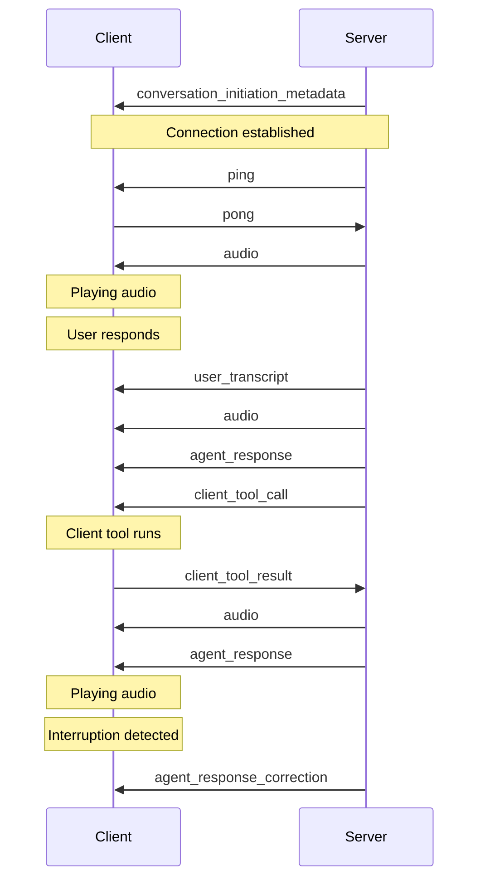

# ElevenLabs Documentation

> Paste relevant ElevenLabs docs below for the Shamrock Bail Bonds project.
> This file mirrors the purpose of `twilio-docs.md` — a single reference doc for ElevenLabs platform documentation.

---

## Table of Contents
- [Conversational AI](#conversational-ai)
- [Twilio Integration](#twilio-integration)
- [Webhooks](#webhooks)
- [Voice Cloning](#voice-cloning)
- [Text-to-Speech API](#text-to-speech-api)
- [SDK Reference](#sdk-reference)

---

## Conversational AI

<!-- Paste Conversational AI docs here -->

---

## Twilio Integration

<!-- Paste Twilio connector / SIP trunking docs here -->

---

## Webhooks

<!-- Paste webhook event docs here (post_call_transcription, call_initiation_failure, etc.) -->

---

## Voice Cloning

<!-- Paste voice cloning docs here -->

---

## Text-to-Speech API

<!-- Paste TTS API reference here -->

---

## SDK Reference

### JavaScript SDK
- Package: `@elevenlabs/elevenlabs-js`
- Install: `npm install @elevenlabs/elevenlabs-js`
- ⚠️ Do NOT use `npm install elevenlabs` (outdated v1.x package)

### React SDK
- Package: `@elevenlabs/react`
- For browser-based conversational widgets

### Browser SDK
- Package: `@elevenlabs/client`
- For browser-based audio generation

---
***

title: Twilio native integration
subtitle: Learn how to configure inbound calls for your agent with Twilio.
--------------------------------------------------------------------------

<iframe width="100%" height="400" src="https://www.youtube-nocookie.com/embed/1_ebl-acp6M?rel=0&autoplay=0" title="YouTube video player" frameborder="0" allow="accelerometer; clipboard-write; encrypted-media; gyroscope; picture-in-picture; web-share" allowfullscreen />

## Overview

This guide shows you how to connect a Twilio phone number to your ElevenLabs agent to handle both inbound and outbound calls.

You will learn to:

* Import an existing Twilio phone number.
* Link it to your agent to handle inbound calls.
* Initiate outbound calls using your agent.

## Phone Number Types & Capabilities

ElevenLabs supports two types of Twilio phone numbers with different capabilities:

### Purchased Twilio Numbers (Full Support)

* **Inbound calls**: Supported - Can receive calls and route them to agents
* **Outbound calls**: Supported - Can make calls using agents
* **Requirements**: Number must be purchased through Twilio and appear in your "Phone Numbers" section

### Verified Caller IDs (Outbound Only)

* **Inbound calls**: Not supported - Cannot receive calls or be assigned to agents
* **Outbound calls**: Supported - Can make calls using agents
* **Requirements**: Number must be verified in Twilio's "Verified Caller IDs" section
* **Use case**: Ideal for using your existing business number for outbound AI calls

Learn more about [verifying caller IDs at scale](https://www.twilio.com/docs/voice/api/verifying-caller-ids-scale) in Twilio's documentation.

<Note>
  During phone number import, ElevenLabs automatically detects the capabilities of your number based
  on its configuration in Twilio.
</Note>

## Guide

### Prerequisites

* A [Twilio account](https://twilio.com/).
* Either:
  * A purchased & provisioned Twilio [phone number](https://www.twilio.com/docs/phone-numbers) (for inbound + outbound)
  * OR a [verified caller ID](https://www.twilio.com/docs/voice/make-calls#verify-your-caller-id) in Twilio (for outbound only)

<Steps>
  <Step title="Import a Twilio phone number">
    In the ElevenAgents dashboard, go to the [**Phone Numbers**](https://elevenlabs.io/app/agents/phone-numbers) tab.

    <Frame background="subtle">
      
    </Frame>

    Next, fill in the following details:

    * **Label:** A descriptive name (e.g., `Customer Support Line`).
    * **Phone Number:** The Twilio number you want to use.
    * **Twilio SID:** Your Twilio Account SID.
    * **Twilio Token:** Your Twilio Auth Token.

    <Note>
      You can find your account SID and auth token [**in the Twilio admin console**](https://www.twilio.com/console).
    </Note>

    <Tabs>
      <Tab title="ElevenAgents dashboard">
        <Frame background="subtle">
          
        </Frame>
      </Tab>

      <Tab title="Twilio admin console">
        Copy the Twilio SID and Auth Token from the [Twilio admin
        console](https://www.twilio.com/console).

        <Frame background="subtle">
          
        </Frame>
      </Tab>
    </Tabs>

    <Note>
      ElevenLabs automatically configures the Twilio phone number with the correct settings.
    </Note>

    <Accordion title="Applied settings">
      <Frame background="subtle">
        
      </Frame>
    </Accordion>

    <Info>
      **Phone Number Detection**: ElevenLabs will automatically detect whether your number supports:

      * **Inbound + Outbound**: Numbers purchased through Twilio
      * **Outbound Only**: Numbers verified as caller IDs in Twilio

      If your number is not found in either category, you'll receive an error asking you to verify it exists in your Twilio account.
    </Info>
  </Step>

  <Step title="Assign your agent (Inbound-capable numbers only)">
    If your phone number supports inbound calls, you can assign an agent to handle incoming calls.

    <Frame background="subtle">
      
    </Frame>

    <Note>
      Numbers that only support outbound calls (verified caller IDs) cannot be assigned to agents and
      will show as disabled in the agent dropdown.
    </Note>
  </Step>
</Steps>

Test the agent by giving the phone number a call. Your agent is now ready to handle inbound calls and engage with your customers.

<Tip>
  Monitor your first few calls in the [Calls History
  dashboard](https://elevenlabs.io/app/agents/history) to ensure everything is working as expected.
</Tip>

## Making Outbound Calls

<Info>
  Both purchased Twilio numbers and verified caller IDs can be used for outbound calls. The outbound
  call button will be disabled for numbers that don't support outbound calling.
</Info>

Your imported Twilio phone number can also be used to initiate outbound calls where your agent calls a specified phone number.

<Steps>
  <Step title="Initiate an outbound call">
    From the [**Phone Numbers**](https://elevenlabs.io/app/agents/phone-numbers) tab, locate your imported Twilio number and click the **Outbound call** button.

    <Frame background="subtle">
      
    </Frame>
  </Step>

  <Step title="Configure the call">
    In the Outbound Call modal:

    1. Select the agent that will handle the conversation
    2. Enter the phone number you want to call
    3. Click **Send Test Call** to initiate the call

    <Frame background="subtle">
      
    </Frame>
  </Step>
</Steps>

Once initiated, the recipient will receive a call from your Twilio number. When they answer, your agent will begin the conversation.

<Tip>
  Outbound calls appear in your [Calls History dashboard](https://elevenlabs.io/app/agents/history)
  alongside inbound calls, allowing you to review all conversations.
</Tip>

<Note>
  When making outbound calls, your agent will be the initiator of the conversation, so ensure your
  agent has appropriate initial messages configured to start the conversation effectively.
</Note>

***

title: Twilio personalization
subtitle: Configure personalization for incoming Twilio calls using webhooks.
-----------------------------------------------------------------------------

## Overview

When receiving inbound Twilio calls, you can dynamically fetch conversation initiation data through a webhook. This allows you to customize your agent's behavior based on caller information and other contextual data.

<iframe width="100%" height="400" src="https://www.youtube-nocookie.com/embed/cAuSo8qNs-8" title="YouTube video player" frameborder="0" allow="accelerometer; autoplay; clipboard-write; encrypted-media; gyroscope; picture-in-picture; web-share" allowfullscreen />

## How it works

1. When a Twilio call is received, ElevenAgents will make a webhook call to your specified endpoint, passing call information (`caller_id`, `agent_id`, `called_number`, `call_sid`) as arguments
2. Your webhook returns conversation initiation client data, including dynamic variables and overrides (an example is shown below)
3. This data is used to initiate the conversation

<Tip>
  The system uses Twilio's connection/dialing period to fetch webhook data in parallel, creating a
  seamless experience where:

  * Users hear the expected telephone connection sound
  * In parallel, ElevenAgents fetches necessary webhook data
  * The conversation is initiated with the fetched data by the time the audio connection is established
</Tip>

## Configuration

<Steps>
  <Step title="Configure webhook details">
    In the [settings page](https://elevenlabs.io/app/agents/settings) of ElevenAgents, configure the webhook URL and add any
    secrets needed for authentication.

    <Frame background="subtle">
      
    </Frame>

    Click on the webhook to modify which secrets are sent in the headers.

    <Frame background="subtle">
      
    </Frame>
  </Step>

  <Step title="Enable fetching conversation initiation data">
    In the "Security" tab of the [agent's page](https://elevenlabs.io/app/agents/agents/), enable fetching conversation initiation data for inbound Twilio calls, and define fields that can be overridden.

    <Frame background="subtle">
      
    </Frame>
  </Step>

  <Step title="Implement the webhook endpoint to receive Twilio data">
    The webhook will receive a POST request with the following parameters:

    | Parameter       | Type   | Description                            |
    | --------------- | ------ | -------------------------------------- |
    | `caller_id`     | string | The phone number of the caller         |
    | `agent_id`      | string | The ID of the agent receiving the call |
    | `called_number` | string | The Twilio number that was called      |
    | `call_sid`      | string | Unique identifier for the Twilio call  |
  </Step>

  <Step title="Return conversation initiation client data">
    Your webhook must return a JSON response containing the initiation data for the agent.

    <Info>
      The `dynamic_variables` field must contain all dynamic variables defined for the agent. Overrides
      on the other hand are entirely optional. For more information about dynamic variables and
      overrides see the [dynamic variables](/docs/agents-platform/customization/personalization/dynamic-variables) and
      [overrides](/docs/agents-platform/customization/personalization/overrides) docs.
    </Info>

    An example response could be:

    ```json
    {
      "type": "conversation_initiation_client_data",
      "dynamic_variables": {
        "customer_name": "John Doe",
        "account_status": "premium",
        "last_interaction": "2024-01-15"
      },
      "conversation_config_override": {
        "agent": {
          "prompt": {
            "prompt": "The customer's bank account balance is $100. They are based in San Francisco."
          },
          "first_message": "Hi, how can I help you today?",
          "language": "en"
        },
        "tts": {
          "voice_id": "new-voice-id"
        }
      }
    }
    ```
  </Step>
</Steps>

ElevenAgents will use the dynamic variables to populate the conversation initiation data, and the conversation will start smoothly.

<Warning>
  Ensure your webhook responds within a reasonable timeout period to avoid delaying the call
  handling.
</Warning>

## Security

* Use HTTPS endpoints only
* Implement authentication using request headers
* Store sensitive values as secrets through the [ElevenLabs secrets manager](https://elevenlabs.io/app/agents/settings)
* Validate the incoming request parameters

***

title: Twilio regional routing
subtitle: >-
Configure regional routing for Twilio phone numbers to ensure data residency
compliance.
-----------

## Overview

Regional routing ensures that your telephony data stays within a specific geographic region. When using Twilio with ElevenLabs in an isolated environment (such as EU residency), you must configure regional routing correctly to maintain data residency compliance.

This guide explains what regional routing is, why it matters, and how to configure it properly in both Twilio and ElevenLabs.

## What is regional routing?

Regional routing is Twilio's mechanism for ensuring that call data is processed and stored within a specific geographic region. Think of it as data residency for your telephony infrastructure.

<Note>
  By default, Twilio phone numbers are configured to route through the US region (`us1`), **even if
  the phone number itself is from another country**. For example, an Italian phone number will still
  route through the US unless regional routing is explicitly configured.
</Note>

## Why regional routing matters

When using ElevenLabs in an isolated environment (such as EU residency), all data processing must remain within your designated region. Without proper regional routing configuration:

* **Data residency violations**: Call data may be routed through unintended regions
* **Failed API operations**: Operations on ongoing calls (such as transfers, hold, resume) will fail
* **SDK routing mismatches**: The Twilio SDK defaults to the `us1` region, causing API calls to be sent to the wrong region even when Twilio has routed the call correctly on the backend

## How it works

When you import a Twilio phone number into ElevenLabs:

1. **Twilio routes the call**: Twilio automatically routes incoming calls to the region configured in your Twilio account (this can be `us1`, `ie1` for Ireland, `au1` for Australia, etc.)
2. **ElevenLabs needs to know the region**: To perform operations on ongoing calls (like transfers), ElevenLabs must send API requests to the same region where Twilio routed the call
3. **Region specification prevents failures**: By specifying the routing region in the ElevenLabs platform, we ensure all API calls target the correct Twilio region

<Warning>
  If the routing region is not specified or is incorrect, operations like call transfers will fail
  because the API requests will be sent to the default `us1` region while the actual call is being
  handled in a different region.
</Warning>

## Configuration

<Steps>
  ### Check your Twilio regional routing

  First, verify which region your Twilio phone number is configured to use:

  1. Log into your [Twilio Console](https://console.twilio.com/)
  2. Navigate to **Phone Numbers** → **Manage** → **Active numbers**
  3. Select your phone number
  4. Look for the **Voice & Fax** configuration section
  5. Check the **Regional routing** or **Edge Location** setting

  Common Twilio regions:

  * `us1` - United States (default)
  * `ie1` - Ireland (Europe)
  * `au1` - Australia
  * `br1` - Brazil
  * `jp1` - Japan
  * `sg1` - Singapore

  <Tip>
    If you're using an isolated environment (like EU residency), ensure your Twilio numbers are
    configured to route through the matching region (e.g., `ie1` for EU).
  </Tip>

  ### Configure regional routing in Twilio

  If your phone number is not configured for the correct region:

  1. In the [Twilio Console](https://console.twilio.com/), go to your phone number configuration
  2. Find the **Voice & Fax** section
  3. Set the **Edge Location** to match your desired region
  4. Save the configuration

  <Note>
    Regional routing configuration in Twilio may require additional setup or account permissions.
    Contact [Twilio Support](https://support.twilio.com/) if you need assistance enabling regional
    routing for your account.
  </Note>

  ### Specify the routing region in ElevenLabs

  When you import or configure a Twilio phone number in the ElevenLabs [Phone Numbers](https://elevenlabs.io/app/agents/phone-numbers) page:

  1. Navigate to the phone number configuration
  2. If you're using an isolated environment, you'll see a warning message that reads: "You are using a phone number in an isolated environment. Double check the routing region for this phone number in your provider."
  3. Verify that the **routing region** matches your Twilio configuration
  4. Ensure the region specified matches the region configured in your Twilio account
     <Warning>
       If you're using regional routing, you must use a **regional API key** from Twilio that
       corresponds to your routing region. Your standard US API key will not work for non-US regions
       and will result in authentication errors. Generate a region-specific API key in your [Twilio
       Console](https://console.twilio.com/).
     </Warning>
</Steps>

## Verifying your configuration

To verify that regional routing is configured correctly:

1. **Check Twilio Console**: Confirm your phone number shows the correct Edge Location
2. **Check ElevenLabs Platform**: Verify the routing region setting matches your Twilio configuration
3. **Test call operations**: Make a test call and verify that operations like call transfer work correctly

<Tip>
  Monitor your first few calls in the [Calls History
  dashboard](https://elevenlabs.io/app/agents/history) after configuring regional routing to ensure
  everything works as expected.
</Tip>

## Common issues

<AccordionGroup>
  <Accordion title="Call transfers are failing">
    This typically indicates a regional routing mismatch. Verify that:

    * Your Twilio phone number is configured with the correct Edge Location
    * The routing region specified in ElevenLabs matches your Twilio configuration
    * You're using an isolated environment that matches the routing region
  </Accordion>

  <Accordion title="My phone number is from Europe but routing through US">
    The phone number's geographic origin doesn't determine routing behavior. You must explicitly
    configure regional routing in Twilio. By default, all numbers (including European numbers) route
    through `us1` unless configured otherwise.
  </Accordion>

  <Accordion title="I'm not using an isolated environment - do I need this?">
    If you're using the standard ElevenLabs environment (not EU residency or another isolated
    environment), regional routing configuration is optional.
  </Accordion>

  <Accordion title="How do I know which region to use?">
    Choose a region that:

    * Matches your data residency requirements (e.g., `ie1` for EU data residency)
    * Is closest to your users for optimal latency
    * Matches your ElevenLabs isolated environment (if applicable)
  </Accordion>

  <Accordion title="I'm getting authentication errors with my Twilio credentials">
    If you're seeing authentication errors when using regional routing, verify that you're using the correct **regional API key**:

    * Regional routing requires a region-specific API key from Twilio, not your standard US API key
    * Generate a new API key scoped to your target region (e.g., `ie1`, `au1`) in the Twilio Console
    * Update your credentials in ElevenLabs with the regional API key
    * Your Account SID remains the same, but the API key must match the region
  </Accordion>
</AccordionGroup>

## Best practices

* **Match regions**: Ensure your Twilio regional routing matches your ElevenLabs environment
* **Document configuration**: Keep records of which numbers use which regions
* **Test thoroughly**: Verify call operations work correctly after changing regional routing
* **Monitor calls**: Watch for failures in the Calls History dashboard that might indicate routing issues
* **Plan for scale**: If you plan to expand to new regions, consider regional routing from the start

## Additional resources

* [Twilio Regional Routing Documentation](https://www.twilio.com/docs/global-infrastructure/edge-locations)
* [ElevenLabs Data Residency Guide](/docs/overview/administration/data-residency)
* [Twilio Phone Numbers Guide](/docs/agents-platform/phone-numbers/twilio-integration/native-integration)

***

title: Register Twilio calls
subtitle: Use your own Twilio infrastructure to connect calls to ElevenLabs agents.
-----------------------------------------------------------------------------------

<Warning title="Advanced">
  This guide covers an advanced integration pattern for developers who need full control over their
  Twilio infrastructure. For a simpler setup, consider using the [native Twilio
  integration](/docs/agents-platform/phone-numbers/twilio-integration/native-integration) which
  handles configuration automatically.
</Warning>

## When to use each approach

Before diving in, understand the trade-offs between the native integration and the register call approach:

| Feature                 | Native integration | Register call  |
| ----------------------- | ------------------ | -------------- |
| Ease of setup           | Easier             | More complex   |
| Call transfers          | Supported          | Not supported  |
| Custom Twilio logic     | Limited            | Full control   |
| Phone number management | Through ElevenLabs | Through Twilio |

## Overview

The register call endpoint allows you to use your own Twilio infrastructure while leveraging ElevenLabs agents for the conversation. Instead of importing your Twilio number into ElevenLabs, you maintain full control of your Twilio setup and use the ElevenLabs API to register calls and receive [TwiML](https://www.twilio.com/docs/voice/twiml) for connecting them to your agents.

This approach is ideal when you:

* Need to maintain your existing Twilio infrastructure and workflows
* Want programmatic control over call routing and handling
* Have complex call flows that require custom Twilio logic before connecting to an agent
* Need to integrate ElevenLabs agents into an existing telephony system

## How it works

1. Your server receives an inbound call or initiates an outbound call via Twilio
2. Your server calls the ElevenLabs register call endpoint with agent and call details
3. ElevenLabs returns TwiML that connects the call to your agent via WebSocket
4. You return this TwiML to Twilio to establish the connection

<Note>
  When using the register call endpoint, call transfer functionality is not available as ElevenLabs
  does not have direct access to your Twilio account credentials.
</Note>

## Prerequisites

* An [ElevenLabs account](https://elevenlabs.io)
* A configured ElevenLabs Conversational Agent ([create one here](/docs/agents-platform/quickstart))
* A [Twilio account](https://www.twilio.com/try-twilio) with an active phone number
* Your agent configured with μ-law 8000 Hz audio format (see [agent configuration](#agent-configuration))

## Agent configuration

Before using the register call endpoint, configure your agent to use the correct audio format supported by Twilio.

<Steps>
  <Step title="Configure TTS Output">
    1. Navigate to your agent settings
    2. Go to the Voice section
    3. Select "μ-law 8000 Hz" from the dropdown

    <Frame background="subtle">
      
    </Frame>
  </Step>

  <Step title="Set Input Format">
    1. Navigate to your agent settings
    2. Go to the Advanced section
    3. Select "μ-law 8000 Hz" for the input format

    <Frame background="subtle">
      
    </Frame>
  </Step>
</Steps>

## API reference

The register call endpoint accepts the following parameters:

| Parameter                             | Type   | Required | Description                                       |
| ------------------------------------- | ------ | -------- | ------------------------------------------------- |
| `agent_id`                            | string | Yes      | The ID of the agent to handle the call            |
| `from_number`                         | string | Yes      | The caller's phone number                         |
| `to_number`                           | string | Yes      | The destination phone number                      |
| `direction`                           | string | No       | Call direction: `inbound` (default) or `outbound` |
| `conversation_initiation_client_data` | object | No       | Dynamic variables and configuration overrides     |

The endpoint returns TwiML that you should pass directly to Twilio.

## Implementation

<CodeBlocks>
  ```python
  import os
  from fastapi import FastAPI, Request
  from fastapi.responses import Response
  from elevenlabs import ElevenLabs

  app = FastAPI()

  elevenlabs = ElevenLabs()
  AGENT_ID = os.getenv("ELEVENLABS_AGENT_ID")

  @app.post("/twilio/inbound")
  async def handle_inbound_call(request: Request):
      form_data = await request.form()
      from_number = form_data.get("From")
      to_number = form_data.get("To")

      # Register the call with ElevenLabs
      twiml = elevenlabs.conversational_ai.twilio.register_call(
          agent_id=AGENT_ID,
          from_number=from_number,
          to_number=to_number,
          direction="inbound",
          conversation_initiation_client_data={
              "dynamic_variables": {
                  "caller_number": from_number,
              }
          }
      )

      # Return the TwiML directly to Twilio
      return Response(content=twiml, media_type="application/xml")

  if __name__ == "__main__":
      import uvicorn
      uvicorn.run(app, host="0.0.0.0", port=8000)
  ```

  ```typescript
  import { ElevenLabsClient } from 'elevenlabs';
  import express from 'express';

  const app = express();
  app.use(express.urlencoded({ extended: true }));

  const elevenlabs = new ElevenLabsClient();
  const AGENT_ID = process.env.ELEVENLABS_AGENT_ID;

  // Handle incoming Twilio calls
  app.post('/twilio/inbound', async (req, res) => {
    const { From: fromNumber, To: toNumber } = req.body;

    // Register the call with ElevenLabs
    const twiml = await elevenlabs.conversationalAi.twilio.registerCall({
      agentId: AGENT_ID,
      fromNumber,
      toNumber,
      direction: 'inbound',
      conversationInitiationClientData: {
        dynamicVariables: {
          caller_number: fromNumber,
        },
      },
    });

    // Return the TwiML directly to Twilio
    res.type('application/xml').send(twiml);
  });

  app.listen(8000, () => {
    console.log('Server running on port 8000');
  });
  ```
</CodeBlocks>

## Outbound calls

For outbound calls, initiate the call through Twilio and point the webhook URL to your server, which then registers with ElevenLabs:

<CodeBlocks>
  ```python
  from twilio.rest import Client
  import os
  from fastapi import Request
  from fastapi.responses import Response
  from elevenlabs import ElevenLabs

  # Initialize clients
  twilio_client = Client(
      os.getenv("TWILIO_ACCOUNT_SID"),
      os.getenv("TWILIO_AUTH_TOKEN")
  )
  elevenlabs = ElevenLabs()
  AGENT_ID = os.getenv("ELEVENLABS_AGENT_ID")

  def initiate_outbound_call(to_number: str):
      call = twilio_client.calls.create(
          from_=os.getenv("TWILIO_PHONE_NUMBER"),
          to=to_number,
          url="https://your-server.com/twilio/outbound"
      )
      return call.sid

  @app.post("/twilio/outbound")
  async def handle_outbound_webhook(request: Request):
      form_data = await request.form()
      from_number = form_data.get("From")
      to_number = form_data.get("To")

      twiml = elevenlabs.conversational_ai.twilio.register_call(
          agent_id=AGENT_ID,
          from_number=from_number,
          to_number=to_number,
          direction="outbound",
      )

      return Response(content=twiml, media_type="application/xml")
  ```

  ```typescript
  import { ElevenLabsClient } from 'elevenlabs';
  import Twilio from 'twilio';

  // Initialize clients
  const twilioClient = new Twilio(process.env.TWILIO_ACCOUNT_SID, process.env.TWILIO_AUTH_TOKEN);
  const elevenlabs = new ElevenLabsClient();
  const AGENT_ID = process.env.ELEVENLABS_AGENT_ID;

  // Initiate an outbound call
  async function initiateOutboundCall(toNumber: string) {
    const call = await twilioClient.calls.create({
      from: process.env.TWILIO_PHONE_NUMBER,
      to: toNumber,
      url: 'https://your-server.com/twilio/outbound',
    });
    return call.sid;
  }

  // Handle the Twilio webhook for outbound calls
  app.post('/twilio/outbound', async (req, res) => {
    const { From: fromNumber, To: toNumber } = req.body;

    const twiml = await elevenlabs.conversationalAi.twilio.registerCall({
      agentId: AGENT_ID,
      fromNumber,
      toNumber,
      direction: 'outbound',
    });

    res.type('application/xml').send(twiml);
  });
  ```
</CodeBlocks>

## Personalizing conversations

Use the `conversation_initiation_client_data` parameter to pass dynamic variables and override agent configuration:

```json
{
  "agent_id": "your-agent-id",
  "from_number": "+1234567890",
  "to_number": "+0987654321",
  "direction": "inbound",
  "conversation_initiation_client_data": {
    "dynamic_variables": {
      "customer_name": "John Doe",
      "account_type": "premium",
      "order_id": "ORD-12345"
    }
  }
}
```

<Info>
  For more information about dynamic variables and overrides, see the [dynamic
  variables](/docs/agents-platform/customization/personalization/dynamic-variables) and
  [overrides](/docs/agents-platform/customization/personalization/overrides) documentation.
</Info>

## Twilio configuration

Configure your Twilio phone number to point to your server:

<Steps>
  <Step title="Create a public URL">
    For local development, use [ngrok](https://ngrok.com) to expose your server:

    ```bash
    ngrok http 8000
    ```
  </Step>

  <Step title="Configure your Twilio number">
    1. Go to the [Twilio Console](https://console.twilio.com)
    2. Navigate to Phone Numbers > Manage > Active numbers
    3. Select your phone number
    4. Under "Voice Configuration", set the webhook URL to your server endpoint (e.g., `https://your-ngrok-url.ngrok.app/twilio/inbound`)
    5. Set the HTTP method to POST

    <Frame background="subtle">
      
    </Frame>
  </Step>
</Steps>

## Limitations

When using the register call endpoint instead of the native integration:

* **No call transfers**: Transfer functionality is not available as ElevenLabs does not have access to your Twilio credentials
* **Manual configuration**: You must configure audio formats and handle TwiML routing yourself
* **No dashboard import**: Phone numbers registered this way do not appear in the ElevenLabs phone numbers dashboard

***

title: Client tools
subtitle: Empower your assistant to trigger client-side operations.
-------------------------------------------------------------------

**Client tools** enable your assistant to execute client-side functions. Unlike [server-side tools](/docs/agents-platform/customization/tools), client tools allow the assistant to perform actions such as triggering browser events, running client-side functions, or sending notifications to a UI.

<iframe width="100%" height="400" src="https://www.youtube-nocookie.com/embed/XeDT92mR7oE?rel=0&autoplay=0" title="YouTube video player" frameborder="0" allow="accelerometer; clipboard-write; encrypted-media; gyroscope; picture-in-picture; web-share" allowfullscreen />

## Overview

Applications may require assistants to interact directly with the user's environment. Client-side tools give your assistant the ability to perform client-side operations.

Here are a few examples where client tools can be useful:

* **Triggering UI events**: Allow an assistant to trigger browser events, such as alerts, modals or notifications.
* **Interacting with the DOM**: Enable an assistant to manipulate the Document Object Model (DOM) for dynamic content updates or to guide users through complex interfaces.

<Info>
  To perform operations server-side, use
  [server-tools](/docs/agents-platform/customization/tools/server-tools) instead.
</Info>

## Guide

### Prerequisites

* An [ElevenLabs account](https://elevenlabs.io)
* A configured ElevenLabs Conversational Agent ([create one here](https://elevenlabs.io/app/agents))

<Steps>
  <Step title="Create a new client-side tool">
    Navigate to your agent dashboard. In the **Tools** section, click **Add Tool**. Ensure the **Tool Type** is set to **Client**. Then configure the following:

    | Setting     | Parameter                                                        |
    | ----------- | ---------------------------------------------------------------- |
    | Name        | logMessage                                                       |
    | Description | Use this client-side tool to log a message to the user's client. |

    Then create a new parameter `message` with the following configuration:

    | Setting     | Parameter                                                                          |
    | ----------- | ---------------------------------------------------------------------------------- |
    | Data Type   | String                                                                             |
    | Identifier  | message                                                                            |
    | Required    | true                                                                               |
    | Description | The message to log in the console. Ensure the message is informative and relevant. |

    <Frame background="subtle">
      
    </Frame>
  </Step>

  <Step title="Register the client tool in your code">
    Unlike server-side tools, client tools need to be registered in your code.

    Use the following code to register the client tool:

    <CodeBlocks>
      ```python title="Python" focus={4-16}
      from elevenlabs import ElevenLabs
      from elevenlabs.conversational_ai.conversation import Conversation, ClientTools

      def log_message(parameters):
          message = parameters.get("message")
          print(message)

      client_tools = ClientTools()
      client_tools.register("logMessage", log_message)

      conversation = Conversation(
          client=ElevenLabs(api_key="your-api-key"),
          agent_id="your-agent-id",
          client_tools=client_tools,
          # ...
      )

      conversation.start_session()
      ```

      ```javascript title="JavaScript" focus={2-10}
      // ...
      const conversation = await Conversation.startSession({
        // ...
        clientTools: {
          logMessage: async ({message}) => {
            console.log(message);
          }
        },
        // ...
      });
      ```

      ```swift title="Swift" focus={2-10}
      // ...
      var clientTools = ElevenLabsSDK.ClientTools()

      clientTools.register("logMessage") { parameters async throws -> String? in
          guard let message = parameters["message"] as? String else {
              throw ElevenLabsSDK.ClientToolError.invalidParameters
          }
          print(message)
          return message
      }
      ```
    </CodeBlocks>

    <Note>
      The tool and parameter names in the agent configuration are case-sensitive and **must** match those registered in your code.
    </Note>
  </Step>

  <Step title="Testing">
    Initiate a conversation with your agent and say something like:

    > *Log a message to the console that says Hello World*

    You should see a `Hello World` log appear in your console.
  </Step>

  <Step title="Next steps">
    Now that you've set up a basic client-side event, you can:

    * Explore more complex client tools like opening modals, navigating to pages, or interacting with the DOM.
    * Combine client tools with server-side webhooks for full-stack interactions.
    * Use client tools to enhance user engagement and provide real-time feedback during conversations.
  </Step>
</Steps>

### Passing client tool results to the conversation context

When you want your agent to receive data back from a client tool, ensure that you tick the **Wait for response** option in the tool configuration.

<Frame background="subtle">
  
</Frame>

Once the client tool is added, when the function is called the agent will wait for its response and append the response to the conversation context.

<CodeBlocks>
  ```python title="Python"
  def get_customer_details():
      # Fetch customer details (e.g., from an API or database)
      customer_data = {
          "id": 123,
          "name": "Alice",
          "subscription": "Pro"
      }
      # Return the customer data; it can also be a JSON string if needed.
      return customer_data

  client_tools = ClientTools()
  client_tools.register("getCustomerDetails", get_customer_details)

  conversation = Conversation(
      client=ElevenLabs(api_key="your-api-key"),
      agent_id="your-agent-id",
      client_tools=client_tools,
      # ...
  )

  conversation.start_session()
  ```

  ```javascript title="JavaScript"
  const clientTools = {
    getCustomerDetails: async () => {
      // Fetch customer details (e.g., from an API)
      const customerData = {
        id: 123,
        name: "Alice",
        subscription: "Pro"
      };
      // Return data directly to the agent.
      return customerData;
    }
  };

  // Start the conversation with client tools configured.
  const conversation = await Conversation.startSession({ clientTools });
  ```
</CodeBlocks>

In this example, when the agent calls **getCustomerDetails**, the function will execute on the client and the agent will receive the returned data, which is then used as part of the conversation context. The values from the response can also optionally be assigned to dynamic variables, similar to [server tools](https://elevenlabs.io/docs/agents-platform/customization/tools/server-tools). Note system tools cannot update dynamic variables.

### Troubleshooting

<AccordionGroup>
  <Accordion title="Tools not being triggered">
    * Ensure the tool and parameter names in the agent configuration match those registered in your code.
    * View the conversation transcript in the agent dashboard to verify the tool is being executed.
  </Accordion>

  <Accordion title="Console errors">
    * Open the browser console to check for any errors.
    * Ensure that your code has necessary error handling for undefined or unexpected parameters.
  </Accordion>
</AccordionGroup>

## Best practices

<h4>
  Name tools intuitively, with detailed descriptions
</h4>

If you find the assistant does not make calls to the correct tools, you may need to update your tool names and descriptions so the assistant more clearly understands when it should select each tool. Avoid using abbreviations or acronyms to shorten tool and argument names.

You can also include detailed descriptions for when a tool should be called. For complex tools, you should include descriptions for each of the arguments to help the assistant know what it needs to ask the user to collect that argument.

<h4>
  Name tool parameters intuitively, with detailed descriptions
</h4>

Use clear and descriptive names for tool parameters. If applicable, specify the expected format for a parameter in the description (e.g., YYYY-mm-dd or dd/mm/yy for a date).

<h4>
  Consider providing additional information about how and when to call tools in your assistant's
  system prompt
</h4>

Providing clear instructions in your system prompt can significantly improve the assistant's tool calling accuracy. For example, guide the assistant with instructions like the following:

```plaintext
Use `check_order_status` when the user inquires about the status of their order, such as 'Where is my order?' or 'Has my order shipped yet?'.
```

Provide context for complex scenarios. For example:

```plaintext
Before scheduling a meeting with `schedule_meeting`, check the user's calendar for availability using check_availability to avoid conflicts.
```

<h4>
  LLM selection
</h4>

<Warning>
  When using tools, we recommend picking high intelligence models like GPT-4o mini or Claude 3.5
  Sonnet and avoiding Gemini 1.5 Flash.
</Warning>

It's important to note that the choice of LLM matters to the success of function calls. Some LLMs can struggle with extracting the relevant parameters from the conversation.

***

title: Server tools
subtitle: Connect your assistant to external data & systems.
------------------------------------------------------------

**Tools** enable your assistant to connect to external data and systems. You can define a set of tools that the assistant has access to, and the assistant will use them where appropriate based on the conversation.

<iframe width="100%" height="400" src="https://www.youtube-nocookie.com/embed/pB33QxKN8P8?rel=0&autoplay=0" title="YouTube video player" frameborder="0" allow="accelerometer; clipboard-write; encrypted-media; gyroscope; picture-in-picture; web-share" allowfullscreen />

## Overview

Many applications require assistants to call external APIs to get real-time information. Tools give your assistant the ability to make external function calls to third party apps so you can get real-time information.

Here are a few examples where tools can be useful:

* **Fetching data**: enable an assistant to retrieve real-time data from any REST-enabled database or 3rd party integration before responding to the user.
* **Taking action**: allow an assistant to trigger authenticated actions based on the conversation, like scheduling meetings or initiating order returns.

<Info>
  To interact with Application UIs or trigger client-side events use [client
  tools](/docs/agents-platform/customization/tools/client-tools) instead.
</Info>

## Tool configuration

ElevenLabs agents can be equipped with tools to interact with external APIs. Unlike traditional requests, the assistant generates query, body, and path parameters dynamically based on the conversation and parameter descriptions you provide.

All tool configurations and parameter descriptions help the assistant determine **when** and **how** to use these tools. To orchestrate tool usage effectively, update the assistant’s system prompt to specify the sequence and logic for making these calls. This includes:

* **Which tool** to use and under what conditions.
* **What parameters** the tool needs to function properly.
* **How to handle** the responses.

<br />

<Tabs>
  <Tab title="Configuration">
    Define a high-level `Name` and `Description` to describe the tool's purpose. This helps the LLM understand the tool and know when to call it.

    <Info>
      If the API requires path parameters, include variables in the URL path by wrapping them in curly
      braces `{}`, for example: `/api/resource/{id}` where `id` is a path parameter.
    </Info>

    <Frame background="subtle">
      
    </Frame>
  </Tab>

  <Tab title="Authentication">
    Configure authentication by adding custom headers or using out-of-the-box authentication methods through auth connections.

    <Frame background="subtle">
      
    </Frame>
  </Tab>

  <Tab title="Headers">
    Specify any headers that need to be included in the request.

    <Frame background="subtle">
      
    </Frame>
  </Tab>

  <Tab title="Path parameters">
    Include variables in the URL path by wrapping them in curly braces `{}`:

    * **Example**: `/api/resource/{id}` where `id` is a path parameter.

    <Frame background="subtle">
      
    </Frame>
  </Tab>

  <Tab title="Body parameters">
    Specify any body parameters to be included in the request.

    <Frame background="subtle">
      
    </Frame>
  </Tab>

  <Tab title="Query parameters">
    Specify any query parameters to be included in the request.

    <Frame background="subtle">
      
    </Frame>
  </Tab>

  <Tab title="Dynamic variable assignment">
    Specify dynamic variables to update from the tool response for later use in the conversation.

    <Frame background="subtle">
      
    </Frame>
  </Tab>
</Tabs>

## Guide

In this guide, we'll create a weather assistant that can provide real-time weather information for any location. The assistant will use its geographic knowledge to convert location names into coordinates and fetch accurate weather data.

<div>
  <iframe src="https://player.vimeo.com/video/1061374724?h=bd9bdb535e&badge=0&autopause=0&player_id=0&app_id=58479" frameborder="0" allow="autoplay; fullscreen; picture-in-picture; clipboard-write; encrypted-media" title="weatheragent" />
</div>

<Steps>
  <Step title="Configure the weather tool">
    First, on the **Agent** section of your agent settings page, choose **Add Tool**. Select **Webhook** as the Tool Type, then configure the weather API integration:

    <AccordionGroup>
      <Accordion title="Weather Tool Configuration">
        <Tabs>
          <Tab title="Configuration">
            | Field       | Value                                                                                                                                                                                                                                                                                                                                                                                  |
            | ----------- | -------------------------------------------------------------------------------------------------------------------------------------------------------------------------------------------------------------------------------------------------------------------------------------------------------------------------------------------------------------------------------------- |
            | Name        | get\_weather                                                                                                                                                                                                                                                                                                                                                                           |
            | Description | Gets the current weather forecast for a location                                                                                                                                                                                                                                                                                                                                       |
            | Method      | GET                                                                                                                                                                                                                                                                                                                                                                                    |
            | URL         | [https://api.open-meteo.com/v1/forecast?latitude=\{latitude}\&longitude=\{longitude}\&current=temperature\_2m,wind\_speed\_10m\&hourly=temperature\_2m,relative\_humidity\_2m,wind\_speed\_10m](https://api.open-meteo.com/v1/forecast?latitude=\{latitude}\&longitude=\{longitude}\&current=temperature_2m,wind_speed_10m\&hourly=temperature_2m,relative_humidity_2m,wind_speed_10m) |
          </Tab>

          <Tab title="Path Parameters">
            | Data Type | Identifier | Value Type | Description                                         |
            | --------- | ---------- | ---------- | --------------------------------------------------- |
            | string    | latitude   | LLM Prompt | The latitude coordinate for the requested location  |
            | string    | longitude  | LLM Prompt | The longitude coordinate for the requested location |
          </Tab>
        </Tabs>
      </Accordion>
    </AccordionGroup>

    <Warning>
      An API key is not required for this tool. If one is required, this should be passed in the headers and stored as a secret.
    </Warning>
  </Step>

  <Step title="Orchestration">
    Configure your assistant to handle weather queries intelligently with this system prompt:

    ```plaintext System prompt
    You are a helpful conversational agent with access to a weather tool. When users ask about
    weather conditions, use the get_weather tool to fetch accurate, real-time data. The tool requires
    a latitude and longitude - use your geographic knowledge to convert location names to coordinates
    accurately.

    Never ask users for coordinates - you must determine these yourself. Always report weather
    information conversationally, referring to locations by name only. For weather requests:

    1. Extract the location from the user's message
    2. Convert the location to coordinates and call get_weather
    3. Present the information naturally and helpfully

    For non-weather queries, provide friendly assistance within your knowledge boundaries. Always be
    concise, accurate, and helpful.

    First message: "Hey, how can I help you today?"
    ```

    <Success>
      Test your assistant by asking about the weather in different locations. The assistant should
      handle specific locations ("What's the weather in Tokyo?") and ask for clarification after general queries ("How's
      the weather looking today?").
    </Success>
  </Step>
</Steps>

## Supported Authentication Methods

ElevenLabs Agents supports multiple authentication methods to securely connect your tools with external APIs. Authentication methods are configured in your agent settings and then connected to individual tools as needed.

<Frame background="subtle">
  
</Frame>

Once configured, you can connect these authentication methods to your tools and manage custom headers in the tool configuration:

<Frame background="subtle">
  
</Frame>

#### OAuth2 Client Credentials

Automatically handles the OAuth2 client credentials flow. Configure with your client ID, client secret, and token URL (e.g., `https://api.example.com/oauth/token`). Optionally specify scopes as comma-separated values and additional JSON parameters. Set up by clicking **Add Auth** on **Workspace Auth Connections** on the **Agent** section of your agent settings page.

#### OAuth2 JWT

Uses JSON Web Token authentication for OAuth 2.0 JWT Bearer flow. Requires your JWT signing secret, token URL, and algorithm (default: HS256). Configure JWT claims including issuer, audience, and subject. Optionally set key ID, expiration (default: 3600 seconds), scopes, and extra parameters. Set up by clicking **Add Auth** on **Workspace Auth Connections** on the **Agent** section of your agent settings page.

#### Basic Authentication

Simple username and password authentication for APIs that support HTTP Basic Auth. Set up by clicking **Add Auth** on **Workspace Auth Connections** in the **Agent** section of your agent settings page.

#### Bearer Tokens

Token-based authentication that adds your bearer token value to the request header. Configure by adding a header to the tool configuration, selecting **Secret** as the header type, and clicking **Create New Secret**.

#### Custom Headers

Add custom authentication headers with any name and value for proprietary authentication methods. Configure by adding a header to the tool configuration and specifying its **name** and **value**.

## Best practices

<h4>
  Name tools intuitively, with detailed descriptions
</h4>

If you find the assistant does not make calls to the correct tools, you may need to update your tool names and descriptions so the assistant more clearly understands when it should select each tool. Avoid using abbreviations or acronyms to shorten tool and argument names.

You can also include detailed descriptions for when a tool should be called. For complex tools, you should include descriptions for each of the arguments to help the assistant know what it needs to ask the user to collect that argument.

<h4>
  Name tool parameters intuitively, with detailed descriptions
</h4>

Use clear and descriptive names for tool parameters. If applicable, specify the expected format for a parameter in the description (e.g., YYYY-mm-dd or dd/mm/yy for a date).

<h4>
  Consider providing additional information about how and when to call tools in your assistant's
  system prompt
</h4>

Providing clear instructions in your system prompt can significantly improve the assistant's tool calling accuracy. For example, guide the assistant with instructions like the following:

```plaintext
Use `check_order_status` when the user inquires about the status of their order, such as 'Where is my order?' or 'Has my order shipped yet?'.
```

Provide context for complex scenarios. For example:

```plaintext
Before scheduling a meeting with `schedule_meeting`, check the user's calendar for availability using check_availability to avoid conflicts.
```

<h4>
  LLM selection
</h4>

<Warning>
  When using tools, we recommend picking high intelligence models like GPT-4o mini or Claude 3.5
  Sonnet and avoiding Gemini 1.5 Flash.
</Warning>

It's important to note that the choice of LLM matters to the success of function calls. Some LLMs can struggle with extracting the relevant parameters from the conversation.

## Tool Call Sounds

You can configure ambient audio to play during tool execution to enhance the user experience. Learn more about [Tool Call Sounds](/agents-platform/customization/tools/tool-configuration/tool-call-sounds).

***

title: Model Context Protocol
subtitle: >-
Connect your ElevenLabs conversational agents to external tools and data
sources using the Model Context Protocol.
-----------------------------------------

<Error title="User Responsibility">
  You are responsible for the security, compliance, and behavior of any third-party MCP server you
  integrate with your ElevenLabs conversational agents. ElevenLabs provides the platform for
  integration but does not manage, endorse, or secure external MCP servers.
</Error>

## Overview

The [Model Context Protocol (MCP)](https://modelcontextprotocol.io/) is an open standard that defines how applications provide context to Large Language Models (LLMs). Think of MCP as a universal connector that enables AI models to seamlessly interact with diverse data sources and tools. By integrating servers that implement MCP, you can significantly extend the capabilities of your ElevenLabs conversational agents.

<Frame background="subtle">
  <iframe width="100%" height="400" src="https://www.youtube.com/embed/m1HgNvafID8" title="ElevenLabs Model Context Protocol integration" frameBorder="0" allow="accelerometer; autoplay; clipboard-write; encrypted-media; gyroscope; picture-in-picture" allowFullScreen />
</Frame>

<Note>
  MCP support is not currently available for users on Zero Retention Mode or those requiring HIPAA
  compliance.
</Note>

ElevenLabs allows you to connect your conversational agents to external MCP servers. This enables your agents to:

* Access and process information from various data sources via the MCP server
* Utilize specialized tools and functionalities exposed by the MCP server
* Create more dynamic, knowledgeable, and interactive conversational experiences

## Getting started

<Note>
  ElevenLabs supports both SSE (Server-Sent Events) and HTTP streamable transport MCP servers.
</Note>

1. Retrieve the URL of your MCP server. In this example, we'll use [Zapier MCP](https://zapier.com/mcp), which lets you connect ElevenAgents to hundreds of tools and services.

2. Navigate to the [MCP server integrations dashboard](https://elevenlabs.io/app/agents/integrations) and click "Add Custom MCP Server".

   <Frame background="subtle">
     
   </Frame>

3. Configure the MCP server with the following details:

   * **Name**: The name of the MCP server (e.g., "Zapier MCP Server")
   * **Description**: A description of what the MCP server can do (e.g., "An MCP server with access to Zapier's tools and services")
   * **Server URL**: The URL of the MCP server. In some cases this contains a secret key, treat it like a password and store it securely as a workspace secret.
   * **Secret Token (Optional)**: If the MCP server requires a secret token (Authorization header), enter it here.
   * **HTTP Headers (Optional)**: If the MCP server requires additional HTTP headers, enter them here.

4. Click "Add Integration" to save the integration and test the connection to list available tools.

   <Frame background="subtle">
     
   </Frame>

5. The MCP server is now available to add to your agents. MCP support is available for both public and private agents.

   <Frame background="subtle">
     
   </Frame>

## Tool approval modes

ElevenLabs provides flexible approval controls to manage how agents request permission to use tools from MCP servers. You can configure approval settings at both the MCP server level and individual tool level for maximum security control.

<Frame background="subtle">
  
</Frame>

### Available approval modes

* **Always Ask (Recommended)**: Maximum security. The agent will request your permission before each tool use.
* **Fine-Grained Tool Approval**: Disable and pre-select tools which can run automatically and those requiring approval.
* **No Approval**: The assistant can use any tool without approval.

### Fine-grained tool control

The Fine-Grained Tool Approval mode allows you to configure individual tools with different approval requirements, giving you precise control over which tools can run automatically and which require explicit permission.

<Frame background="subtle">
  
</Frame>

For each tool, you can set:

* **Auto-approved**: Tool runs automatically without requiring permission
* **Requires approval**: Tool requires explicit permission before execution
* **Disabled**: Tool is completely disabled and cannot be used

<Tip>
  Use Fine-Grained Tool Approval to allow low-risk read-only tools to run automatically while
  requiring approval for tools that modify data or perform sensitive operations.
</Tip>

## Key considerations for ElevenLabs integration

* **External servers**: You are responsible for selecting the external MCP servers you wish to integrate. ElevenLabs provides the means to connect to them.
* **Supported features**: ElevenLabs supports MCP servers that communicate over SSE (Server-Sent Events) and HTTP streamable transports for real-time interactions.
* **Dynamic tools**: The tools and capabilities available from an integrated MCP server are defined by that external server and can change if the server's configuration is updated.

## Security and disclaimer

Integrating external MCP servers can expose your agents and data to third-party services. It is crucial to understand the security implications.

<Warning title="Important Disclaimer">
  By enabling MCP server integrations, you acknowledge that this may involve data sharing with
  third-party services not controlled by ElevenLabs. This could incur additional security risks.
  Please ensure you fully understand the implications, vet the security of any MCP server you
  integrate, and review our [MCP Integration Security
  Guidelines](/docs/agents-platform/customization/tools/mcp/security) before proceeding.
</Warning>

Refer to our [MCP Integration Security Guidelines](/docs/agents-platform/customization/tools/mcp/security) for detailed best practices.

## Finding or building MCP servers

* Utilize publicly available MCP servers from trusted providers
* Develop your own MCP server to expose your proprietary data or tools
* Explore the Model Context Protocol community and resources for examples and server implementations

### Resources

* [Anthropic's MCP server examples](https://docs.anthropic.com/en/docs/agents-and-tools/remote-mcp-servers#remote-mcp-server-examples) - A list of example servers by Anthropic
* [Awesome Remote MCP Servers](https://github.com/jaw9c/awesome-remote-mcp-servers) - A curated, open-source list of remote MCP servers
* [Remote MCP Server Directory](https://remote-mcp.com/) - A searchable list of Remote MCP servers

***

title: MCP integration security
subtitle: >-
Tips for securely integrating third-party Model Context Protocol servers with
your ElevenLabs conversational agents.
--------------------------------------

<Error title="User Responsibility">
  You are responsible for the security, compliance, and behavior of any third-party MCP server you
  integrate with your ElevenLabs conversational agents. ElevenLabs provides the platform for
  integration but does not manage, endorse, or secure external MCP servers.
</Error>

## Overview

Integrating external servers via the Model Context Protocol (MCP) can greatly enhance your ElevenLabs conversational agents. However, this also means connecting to systems outside of ElevenLabs' direct control, which introduces important security considerations. As a user, you are responsible for the security and trustworthiness of any third-party MCP server you choose to integrate.

This guide outlines key security practices to consider when using MCP server integrations within ElevenLabs.

## Tool approval controls

ElevenLabs provides built-in security controls through tool approval modes that help you manage the security risks associated with MCP tool usage. These controls allow you to balance functionality with security based on your specific needs.

<Frame background="subtle">
  
</Frame>

### Approval mode options

* **Always Ask (Recommended)**: Provides maximum security by requiring explicit approval for every tool execution. This mode ensures you maintain full control over all MCP tool usage.
* **Fine-Grained Tool Approval**: Allows you to configure approval requirements on a per-tool basis, enabling automatic execution of trusted tools while requiring approval for sensitive operations.
* **No Approval**: Permits unrestricted tool usage without approval prompts. Only use this mode with thoroughly vetted and highly trusted MCP servers.

### Fine-grained security controls

Fine-Grained Tool Approval mode provides the most flexible security configuration, allowing you to classify each tool based on its risk profile:

<Frame background="subtle">
  
</Frame>

* **Auto-approved tools**: Suitable for low-risk, read-only operations or tools you completely trust
* **Approval-required tools**: For tools that modify data, access sensitive information, or perform potentially risky operations
* **Disabled tools**: Completely block tools that are unnecessary or pose security risks

<Warning>
  Even with approval controls in place, carefully evaluate the trustworthiness of MCP servers and
  understand what each tool can access or modify before integration.
</Warning>

## Security tips

### 1. Vet your MCP servers

* **Trusted Sources**: Only integrate MCP servers from sources you trust and have verified. Understand who operates the server and their security posture.
* **Understand Capabilities**: Before integrating, thoroughly review the tools and data resources the MCP server exposes. Be aware of what actions its tools can perform (e.g., accessing files, calling external APIs, modifying data). The MCP `destructiveHint` and `readOnlyHint` annotations can provide clues but should not be solely relied upon for security decisions.
* **Review Server Security**: If possible, review the security practices of the MCP server provider. For MCP servers you develop, ensure you follow general server security best practices and the MCP-specific security guidelines.

### 2. Data sharing and privacy

* **Data Flow**: Be aware that when your agent uses an integrated MCP server, data from the conversation (which may include user inputs) will be sent to that external server.
* **Sensitive Information**: Exercise caution when allowing agents to send Personally Identifiable Information (PII) or other sensitive data to an MCP server. Ensure the server handles such data securely and in compliance with relevant privacy regulations.
* **Purpose Limitation**: Configure your agents and prompts to only share the necessary information with MCP server tools to perform their tasks.

### 3. Credential and connection security

* **Secure Storage**: If an MCP server requires API keys or other secrets for authentication, use any available secret management features within the ElevenLabs platform to store these credentials securely. Avoid hardcoding secrets.
* **HTTPS**: Ensure connections to MCP servers are made over HTTPS to encrypt data in transit.
* **Network Access**: If the MCP server is on a private network, ensure appropriate firewall rules and network ACLs are in place.

#### IP whitelisting

For additional security, you can whitelist the following static egress IPs from which ElevenLabs requests originate:

| Region       | IP Address     |
| ------------ | -------------- |
| US (Default) | 34.67.146.145  |
| US (Default) | 34.59.11.47    |
| EU           | 35.204.38.71   |
| EU           | 34.147.113.54  |
| Asia         | 35.185.187.110 |
| Asia         | 35.247.157.189 |

If you are using a [data residency region](/docs/overview/administration/data-residency) then the following IPs will be used:

| Region          | IP Address     |
| --------------- | -------------- |
| EU Residency    | 34.77.234.246  |
| EU Residency    | 34.140.184.144 |
| India Residency | 34.93.26.174   |
| India Residency | 34.93.252.69   |

If your infrastructure requires strict IP-based access controls, adding these IPs to your firewall allowlist will ensure you only receive requests from ElevenLabs' systems.

<Note>
  These static IPs are used across all ElevenLabs services including webhooks and MCP server
  requests, and will remain consistent.
</Note>

### 4. Understand code execution risks

* **Remote Execution**: Tools exposed by an MCP server execute code on that server. While this is the basis of their functionality, it's a critical security consideration. Malicious or poorly secured tools could pose a risk.
* **Input Validation**: Although the MCP server is responsible for validating inputs to its tools, be mindful of the data your agent might send. The LLM should be guided to use tools as intended.

### 5. Add guardrails

* **Prompt Injections**: Connecting to untrusted external MCP servers exposes the risk of prompt injection attacks. Ensure to add thorough guardrails to your system prompt to reduce the risk of exposure to a malicious attack.
* **Tool Approval Configuration**: Use the appropriate approval mode for your security requirements. Start with "Always Ask" for new integrations and only move to less restrictive modes after thorough testing and trust establishment.

### 6. Monitor and review

* **Logging (Server-Side)**: If you control the MCP server, implement comprehensive logging of tool invocations and data access.
* **Regular Review**: Periodically review your integrated MCP servers. Check if their security posture has changed or if new tools have been added that require re-assessment.
* **Approval Patterns**: Monitor tool approval requests to identify unusual patterns that might indicate security issues or misuse.

## Disclaimer

<Warning title="Important Disclaimer">
  By enabling MCP server integrations, you acknowledge that this may involve data sharing with
  third-party services not controlled by ElevenLabs. This could incur additional security risks.
  Please ensure you fully understand the implications, vet the security of any MCP server you
  integrate, and adhere to these security guidelines before proceeding.
</Warning>

For general information on the Model Context Protocol, refer to official MCP documentation and community resources.

***

title: System tools
subtitle: Update the internal state of conversations without external requests.
-------------------------------------------------------------------------------

**System tools** enable your assistant to update the internal state of a conversation. Unlike [server tools](/docs/agents-platform/customization/tools/server-tools) or [client tools](/docs/agents-platform/customization/tools/client-tools), system tools don't make external API calls or trigger client-side functions—they modify the internal state of the conversation without making external calls.

## Overview

Some applications require agents to control the flow or state of a conversation.
System tools provide this capability by allowing the assistant to perform actions related to the state of the call that don't require communicating with external servers or the client.

### Available system tools

<CardGroup cols={2}>
  <Card title="End call" icon="duotone square-phone-hangup" href="/docs/agents-platform/customization/tools/system-tools/end-call">
    Let your agent automatically terminate a conversation when appropriate conditions are met.
  </Card>

  <Card title="Language detection" icon="duotone earth-europe" href="/docs/agents-platform/customization/tools/system-tools/language-detection">
    Enable your agent to automatically switch to the user's language during conversations.
  </Card>

  <Card title="Agent transfer" icon="duotone arrow-right-arrow-left" href="/docs/agents-platform/customization/tools/system-tools/agent-transfer">
    Seamlessly transfer conversations between AI agents based on defined conditions.
  </Card>

  <Card title="Transfer to number" icon="duotone user-headset" href="/docs/agents-platform/customization/tools/system-tools/transfer-to-number">
    Transfer calls to external phone numbers or SIP URIs.
  </Card>

  <Card title="Skip turn" icon="duotone forward" href="/docs/agents-platform/customization/tools/system-tools/skip-turn">
    Enable the agent to skip their turns if the LLM detects the agent should not speak yet.
  </Card>

  <Card title="Play keypad touch tone" icon="duotone phone-office" href="/docs/agents-platform/customization/tools/system-tools/play-keypad-touch-tone">
    Enable agents to play DTMF tones to interact with automated phone systems and navigate menus.
  </Card>

  <Card title="Voicemail detection" icon="duotone voicemail" href="/docs/agents-platform/customization/tools/system-tools/voicemail-detection">
    Enable agents to automatically detect voicemail systems and optionally leave messages.
  </Card>
</CardGroup>

## Implementation

When creating an agent via API, you can add system tools to your agent configuration. Here's how to implement both the end call and language detection tools:

## Custom LLM integration

When using a custom LLM with ElevenLabs agents, system tools are exposed as function definitions that your LLM can call. Each system tool has specific parameters and trigger conditions:

### Available system tools

<AccordionGroup>
  <Accordion title="End call">
    **Purpose**: Automatically terminate conversations when appropriate conditions are met.

    **Trigger conditions**: The LLM should call this tool when:

    * The main task has been completed and user is satisfied
    * The conversation reached natural conclusion with mutual agreement
    * The user explicitly indicates they want to end the conversation

    **Parameters**:

    * `reason` (string, required): The reason for ending the call
    * `message` (string, optional): A farewell message to send to the user before ending the call

    **Function call format**:

    ```json
    {
      "type": "function",
      "function": {
        "name": "end_call",
        "arguments": "{\"reason\": \"Task completed successfully\", \"message\": \"Thank you for using our service. Have a great day!\"}"
      }
    }
    ```

    **Implementation**: Configure as a system tool in your agent settings. The LLM will receive detailed instructions about when to call this function.

    Learn more: [End call tool](/docs/agents-platform/customization/tools/system-tools/end-call)
  </Accordion>

  <Accordion title="Language detection">
    **Purpose**: Automatically switch to the user's detected language during conversations.

    **Trigger conditions**: The LLM should call this tool when:

    * User speaks in a different language than the current conversation language
    * User explicitly requests to switch languages
    * Multi-language support is needed for the conversation

    **Parameters**:

    * `reason` (string, required): The reason for the language switch
    * `language` (string, required): The language code to switch to (must be in supported languages list)

    **Function call format**:

    ```json
    {
      "type": "function",
      "function": {
        "name": "language_detection",
        "arguments": "{\"reason\": \"User requested Spanish\", \"language\": \"es\"}"
      }
    }
    ```

    **Implementation**: Configure supported languages in agent settings and add the language detection system tool. The agent will automatically switch voice and responses to match detected languages.

    Learn more: [Language detection tool](/docs/agents-platform/customization/tools/system-tools/language-detection)
  </Accordion>

  <Accordion title="Agent transfer">
    **Purpose**: Transfer conversations between specialized AI agents based on user needs.

    **Trigger conditions**: The LLM should call this tool when:

    * User request requires specialized knowledge or different agent capabilities
    * Current agent cannot adequately handle the query
    * Conversation flow indicates need for different agent type

    **Parameters**:

    * `reason` (string, optional): The reason for the agent transfer
    * `agent_number` (integer, required): Zero-indexed number of the agent to transfer to (based on configured transfer rules)

    **Function call format**:

    ```json
    {
      "type": "function",
      "function": {
        "name": "transfer_to_agent",
        "arguments": "{\"reason\": \"User needs billing support\", \"agent_number\": 0}"
      }
    }
    ```

    **Implementation**: Define transfer rules mapping conditions to specific agent IDs. Configure which agents the current agent can transfer to. Agents are referenced by zero-indexed numbers in the transfer configuration.

    Learn more: [Agent transfer tool](/docs/agents-platform/customization/tools/system-tools/agent-transfer)
  </Accordion>

  <Accordion title="Transfer to number">
    **Purpose**: Seamlessly hand off conversations to human operators when AI assistance is insufficient.

    **Trigger conditions**: The LLM should call this tool when:

    * Complex issues requiring human judgment
    * User explicitly requests human assistance
    * AI reaches limits of capability for the specific request
    * Escalation protocols are triggered

    **Parameters**:

    * `reason` (string, optional): The reason for the transfer
    * `transfer_number` (string, required): The phone number to transfer to (must match configured numbers)
    * `client_message` (string, required): Message read to the client while waiting for transfer
    * `agent_message` (string, required): Message for the human operator receiving the call

    **Function call format**:

    ```json
    {
      "type": "function",
      "function": {
        "name": "transfer_to_number",
        "arguments": "{\"reason\": \"Complex billing issue\", \"transfer_number\": \"+15551234567\", \"client_message\": \"I'm transferring you to a billing specialist who can help with your account.\", \"agent_message\": \"Customer has a complex billing dispute about order #12345 from last month.\"}"
      }
    }
    ```

    **Implementation**: Configure transfer phone numbers and conditions. Define messages for both customer and receiving human operator. Works with both Twilio and SIP trunking.

    Learn more: [Transfer to number tool](/docs/agents-platform/customization/tools/system-tools/transfer-to-number)
  </Accordion>

  <Accordion title="Skip turn">
    **Purpose**: Allow the agent to pause and wait for user input without speaking.

    **Trigger conditions**: The LLM should call this tool when:

    * User indicates they need a moment ("Give me a second", "Let me think")
    * User requests pause in conversation flow
    * Agent detects user needs time to process information

    **Parameters**:

    * `reason` (string, optional): Free-form reason explaining why the pause is needed

    **Function call format**:

    ```json
    {
      "type": "function",
      "function": {
        "name": "skip_turn",
        "arguments": "{\"reason\": \"User requested time to think\"}"
      }
    }
    ```

    **Implementation**: No additional configuration needed. The tool simply signals the agent to remain silent until the user speaks again.

    Learn more: [Skip turn tool](/docs/agents-platform/customization/tools/system-tools/skip-turn)
  </Accordion>

  <Accordion title="Play keypad touch tone">
    **Parameters**:

    * `reason` (string, optional): The reason for playing the DTMF tones (e.g., "navigating to extension", "entering PIN")
    * `dtmf_tones` (string, required): The DTMF sequence to play. Valid characters: 0-9, \*, #, w (0.5s pause), W (1s pause)

    **Function call format**:

    ```json
    {
      "type": "function",
      "function": {
        "name": "play_keypad_touch_tone",
        "arguments": "{"reason": "Navigating to customer service", "dtmf_tones": "2"}"
      }
    }
    ```

    Learn more: [Play keypad touch tone tool](/docs/agents-platform/customization/tools/system-tools/play-keypad-touch-tone)
  </Accordion>

  <Accordion title="Voicemail detection">
    **Parameters**:

    * `reason` (string, required): The reason for detecting voicemail (e.g., "automated greeting detected", "no human response")

    **Function call format**:

    ```json
    {
      "type": "function",
      "function": {
        "name": "voicemail_detection",
        "arguments": "{\"reason\": \"Automated greeting detected with request to leave message\"}"
      }
    }
    ```

    Learn more: [Voicemail detection tool](/docs/agents-platform/customization/tools/system-tools/voicemail-detection)
  </Accordion>
</AccordionGroup>

<CodeGroup>
  ```python
  from elevenlabs import (
      ConversationalConfig,
      ElevenLabs,
      AgentConfig,
      PromptAgent,
      PromptAgentInputToolsItem_System,
  )

  # Initialize the client
  elevenlabs = ElevenLabs(api_key="YOUR_API_KEY")

  # Create system tools
  end_call_tool = PromptAgentInputToolsItem_System(
      name="end_call",
      description=""  # Optional: Customize when the tool should be triggered
  )

  language_detection_tool = PromptAgentInputToolsItem_System(
      name="language_detection",
      description=""  # Optional: Customize when the tool should be triggered
  )

  # Create the agent configuration with both tools
  conversation_config = ConversationalConfig(
      agent=AgentConfig(
          prompt=PromptAgent(
              tools=[end_call_tool, language_detection_tool]
          )
      )
  )

  # Create the agent
  response = elevenlabs.conversational_ai.agents.create(
      conversation_config=conversation_config
  )
  ```

  ```javascript
  import { ElevenLabs } from '@elevenlabs/elevenlabs-js';

  // Initialize the client
  const elevenlabs = new ElevenLabs({
    apiKey: 'YOUR_API_KEY',
  });

  // Create the agent with system tools
  await elevenlabs.conversationalAi.agents.create({
    conversationConfig: {
      agent: {
        prompt: {
          tools: [
            {
              type: 'system',
              name: 'end_call',
              description: '',
            },
            {
              type: 'system',
              name: 'language_detection',
              description: '',
            },
          ],
        },
      },
    },
  });
  ```
</CodeGroup>

## FAQ

<AccordionGroup>
  <Accordion title="Can system tools be combined with other tool types?">
    Yes, system tools can be used alongside server tools and client tools in the same assistant.
    This allows for comprehensive functionality that combines internal state management with
    external interactions.
  </Accordion>
</AccordionGroup>

```
```
***

title: End call
subtitle: Let your agent automatically hang up on the user.
-----------------------------------------------------------

<Warning>
  The **End Call** tool is added to agents created in the ElevenLabs dashboard by default. For
  agents created via API or SDK, if you would like to enable the End Call tool, you must add it
  manually as a system tool in your agent configuration. [See API Implementation
  below](#api-implementation) for details.
</Warning>

<Frame background="subtle">
  
</Frame>

## Overview

The **End Call** tool allows your conversational agent to terminate a call with the user. This is a system tool that provides flexibility in how and when calls are ended.

## Functionality

* **Default behavior**: The tool can operate without any user-defined prompts, ending the call when the conversation naturally concludes.
* **Custom prompts**: Users can specify conditions under which the call should end. For example:
  * End the call if the user says "goodbye."
  * Conclude the call when a specific task is completed.

**Purpose**: Automatically terminate conversations when appropriate conditions are met.

**Trigger conditions**: The LLM should call this tool when:

* The main task has been completed and user is satisfied
* The conversation reached natural conclusion with mutual agreement
* The user explicitly indicates they want to end the conversation

**Parameters**:

* `reason` (string, required): The reason for ending the call
* `message` (string, optional): A farewell message to send to the user before ending the call

**Function call format**:

```json
{
  "type": "function",
  "function": {
    "name": "end_call",
    "arguments": "{\"reason\": \"Task completed successfully\", \"message\": \"Thank you for using our service. Have a great day!\"}"
  }
}
```

**Implementation**: Configure as a system tool in your agent settings. The LLM will receive detailed instructions about when to call this function.

### API Implementation

When creating an agent via API, you can add the End Call tool to your agent configuration. It should be defined as a system tool:

<CodeBlocks>
  ```python
  from elevenlabs import (
      ConversationalConfig,
      ElevenLabs,
      AgentConfig,
      PromptAgent,
      PromptAgentInputToolsItem_System
  )

  # Initialize the client
  elevenlabs = ElevenLabs(api_key="YOUR_API_KEY")

  # Create the end call tool
  end_call_tool = PromptAgentInputToolsItem_System(
      name="end_call",
      description=""  # Optional: Customize when the tool should be triggered
  )

  # Create the agent configuration
  conversation_config = ConversationalConfig(
      agent=AgentConfig(
          prompt=PromptAgent(
              tools=[end_call_tool]
          )
      )
  )

  # Create the agent
  response = elevenlabs.conversational_ai.agents.create(
      conversation_config=conversation_config
  )
  ```

  ```javascript
  import { ElevenLabs } from '@elevenlabs/elevenlabs-js';

  // Initialize the client
  const elevenlabs = new ElevenLabs({
    apiKey: 'YOUR_API_KEY',
  });

  // Create the agent with end call tool
  await elevenlabs.conversationalAi.agents.create({
    conversationConfig: {
      agent: {
        prompt: {
          tools: [
            {
              type: 'system',
              name: 'end_call',
              description: '', // Optional: Customize when the tool should be triggered
            },
          ],
        },
      },
    },
  });
  ```

  ```bash
  curl -X POST https://api.elevenlabs.io/v1/convai/agents/create \
       -H "xi-api-key: YOUR_API_KEY" \
       -H "Content-Type: application/json" \
       -d '{
    "conversation_config": {
      "agent": {
        "prompt": {
          "tools": [
            {
              "type": "system",
              "name": "end_call",
              "description": ""
            }
          ]
        }
      }
    }
  }'
  ```
</CodeBlocks>

<Tip>
  Leave the description blank to use the default end call prompt.
</Tip>

## Example prompts

**Example 1: Basic End Call**

```
End the call when the user says goodbye, thank you, or indicates they have no more questions.
```

**Example 2: End Call with Custom Prompt**

```
End the call when the user says goodbye, thank you, or indicates they have no more questions. You can only end the call after all their questions have been answered. Please end the call only after confirming that the user doesn't need any additional assistance.
```
***

title: Language detection
subtitle: Let your agent automatically switch to the language
-------------------------------------------------------------

## Overview

The `language detection` system tool allows your ElevenLabs agent to switch its output language to any the agent supports.
This system tool is not enabled automatically. Its description can be customized to accommodate your specific use case.

<iframe width="100%" height="400" src="https://www.youtube-nocookie.com/embed/YhF2gKv9ozc" title="YouTube video player" frameborder="0" allow="accelerometer; autoplay; clipboard-write; encrypted-media; gyroscope; picture-in-picture; web-share" allowfullscreen />

<Note>
  Where possible, we recommend enabling all languages for an agent and enabling the language
  detection system tool.
</Note>

Our language detection tool triggers language switching in two cases, both based on the received audio's detected language and content:

* `detection` if a user speaks a different language than the current output language, a switch will be triggered
* `content` if the user asks in the current language to change to a new language, a switch will be triggered

**Purpose**: Automatically switch to the user's detected language during conversations.

**Trigger conditions**: The LLM should call this tool when:

* User speaks in a different language than the current conversation language
* User explicitly requests to switch languages
* Multi-language support is needed for the conversation

**Parameters**:

* `reason` (string, required): The reason for the language switch
* `language` (string, required): The language code to switch to (must be in supported languages list)

**Function call format**:

```json
{
  "type": "function",
  "function": {
    "name": "language_detection",
    "arguments": "{\"reason\": \"User requested Spanish\", \"language\": \"es\"}"
  }
}
```

**Implementation**: Configure supported languages in agent settings and add the language detection system tool. The agent will automatically switch voice and responses to match detected languages.

## Enabling language detection

<Steps>
  <Step title="Configure supported languages">
    The languages that the agent can switch to must be defined in the `Agent` settings tab.

    <Frame background="subtle">
      
    </Frame>
  </Step>

  <Step title="Add the language detection tool">
    Enable language detection by selecting the pre-configured system tool to your agent's tools in the `Agent` tab.
    This is automatically available as an option when selecting `add tool`.

    <Frame background="subtle">
      
    </Frame>
  </Step>

  <Step title="Configure tool description">
    Add a description that specifies when to call the tool

    <Frame background="subtle">
      
    </Frame>
  </Step>
</Steps>

### API Implementation

When creating an agent via API, you can add the `language detection` tool to your agent configuration. It should be defined as a system tool:

<CodeBlocks>
  ```python
  from elevenlabs import (
      ConversationalConfig,
      ElevenLabs,
      AgentConfig,
      PromptAgent,
      PromptAgentInputToolsItem_System,
      LanguagePresetInput,
      ConversationConfigClientOverrideInput,
      AgentConfigOverride,
  )

  # Initialize the client
  elevenlabs = ElevenLabs(api_key="YOUR_API_KEY")

  # Create the language detection tool
  language_detection_tool = PromptAgentInputToolsItem_System(
      name="language_detection",
      description=""  # Optional: Customize when the tool should be triggered
  )

  # Create language presets
  language_presets = {
      "nl": LanguagePresetInput(
          overrides=ConversationConfigClientOverrideInput(
              agent=AgentConfigOverride(
                  prompt=None,
                  first_message="Hoi, hoe gaat het met je?",
                  language=None
              ),
              tts=None
          ),
          first_message_translation=None
      ),
      "fi": LanguagePresetInput(
          overrides=ConversationConfigClientOverrideInput(
              agent=AgentConfigOverride(
                  first_message="Hei, kuinka voit?",
              ),
              tts=None
          ),
      ),
      "tr": LanguagePresetInput(
          overrides=ConversationConfigClientOverrideInput(
              agent=AgentConfigOverride(
                  prompt=None,
                  first_message="Merhaba, nasılsın?",
                  language=None
              ),
              tts=None
          ),
      ),
      "ru": LanguagePresetInput(
          overrides=ConversationConfigClientOverrideInput(
              agent=AgentConfigOverride(
                  prompt=None,
                  first_message="Привет, как ты?",
                  language=None
              ),
              tts=None
          ),
      ),
      "pt": LanguagePresetInput(
          overrides=ConversationConfigClientOverrideInput(
              agent=AgentConfigOverride(
                  prompt=None,
                  first_message="Oi, como você está?",
                  language=None
              ),
              tts=None
          ),
      )
  }

  # Create the agent configuration
  conversation_config = ConversationalConfig(
      agent=AgentConfig(
          prompt=PromptAgent(
              tools=[language_detection_tool],
              first_message="Hi how are you?"
          )
      ),
      language_presets=language_presets
  )

  # Create the agent
  response = elevenlabs.conversational_ai.agents.create(
      conversation_config=conversation_config
  )
  ```

  ```javascript
  import { ElevenLabs } from '@elevenlabs/elevenlabs-js';

  // Initialize the client
  const elevenlabs = new ElevenLabs({
    apiKey: 'YOUR_API_KEY',
  });

  // Create the agent with language detection tool
  await elevenlabs.conversationalAi.agents.create({
    conversationConfig: {
      agent: {
        prompt: {
          tools: [
            {
              type: 'system',
              name: 'language_detection',
              description: '', // Optional: Customize when the tool should be triggered
            },
          ],
          firstMessage: 'Hi, how are you?',
        },
      },
      languagePresets: {
        nl: {
          overrides: {
            agent: {
              prompt: null,
              firstMessage: 'Hoi, hoe gaat het met je?',
              language: null,
            },
            tts: null,
          },
        },
        fi: {
          overrides: {
            agent: {
              prompt: null,
              firstMessage: 'Hei, kuinka voit?',
              language: null,
            },
            tts: null,
          },
          firstMessageTranslation: {
            sourceHash: '{"firstMessage":"Hi how are you?","language":"en"}',
            text: 'Hei, kuinka voit?',
          },
        },
        tr: {
          overrides: {
            agent: {
              prompt: null,
              firstMessage: 'Merhaba, nasılsın?',
              language: null,
            },
            tts: null,
          },
        },
        ru: {
          overrides: {
            agent: {
              prompt: null,
              firstMessage: 'Привет, как ты?',
              language: null,
            },
            tts: null,
          },
        },
        pt: {
          overrides: {
            agent: {
              prompt: null,
              firstMessage: 'Oi, como você está?',
              language: null,
            },
            tts: null,
          },
        },
        ar: {
          overrides: {
            agent: {
              prompt: null,
              firstMessage: 'مرحبًا كيف حالك؟',
              language: null,
            },
            tts: null,
          },
        },
      },
    },
  });
  ```

  ```bash
  curl -X POST https://api.elevenlabs.io/v1/convai/agents/create \
       -H "xi-api-key: YOUR_API_KEY" \
       -H "Content-Type: application/json" \
       -d '{
    "conversation_config": {
      "agent": {
        "prompt": {
          "first_message": "Hi how are you?",
          "tools": [
            {
              "type": "system",
              "name": "language_detection",
              "description": ""
            }
          ]
        }
      },
      "language_presets": {
        "nl": {
          "overrides": {
            "agent": {
              "prompt": null,
              "first_message": "Hoi, hoe gaat het met je?",
              "language": null
            },
            "tts": null
          }
        },
        "fi": {
          "overrides": {
            "agent": {
              "prompt": null,
              "first_message": "Hei, kuinka voit?",
              "language": null
            },
            "tts": null
          }
        },
        "tr": {
          "overrides": {
            "agent": {
              "prompt": null,
              "first_message": "Merhaba, nasılsın?",
              "language": null
            },
            "tts": null
          }
        },
        "ru": {
          "overrides": {
            "agent": {
              "prompt": null,
              "first_message": "Привет, как ты?",
              "language": null
            },
            "tts": null
          }
        },
        "pt": {
          "overrides": {
            "agent": {
              "prompt": null,
              "first_message": "Oi, como você está?",
              "language": null
            },
            "tts": null
          }
        },
        "ar": {
          "overrides": {
            "agent": {
              "prompt": null,
              "first_message": "مرحبًا كيف حالك؟",
              "language": null
            },
            "tts": null
          }
        }
      }
    }
  }'
  ```
</CodeBlocks>

<Tip>
  Leave the description blank to use the default language detection prompt.
</Tip>

***

title: Agent transfer
subtitle: >-
Seamlessly transfer the user between ElevenLabs agents based on defined
conditions.
-----------

## Overview

Agent-agent transfer allows a ElevenLabs agent to hand off the ongoing conversation to another designated agent when specific conditions are met. This enables the creation of sophisticated, multi-layered conversational workflows where different agents handle specific tasks or levels of complexity.

For example, an initial agent (Orchestrator) could handle general inquiries and then transfer the call to a specialized agent based on the conversation's context. Transfers can also be nested:

<Frame background="subtle" caption="Example Agent Transfer Hierarchy">
  ```text
  Orchestrator Agent (Initial Qualification)
  │
  ├───> Agent 1 (e.g., Availability Inquiries)
  │
  ├───> Agent 2 (e.g., Technical Support)
  │     │
  │     └───> Agent 2a (e.g., Hardware Support)
  │
  └───> Agent 3 (e.g., Billing Issues)

  ```
</Frame>

<Note>
  We recommend using the `gpt-4o` or `gpt-4o-mini` models when using agent-agent transfers due to better tool calling.
</Note>

**Purpose**: Transfer conversations between specialized AI agents based on user needs.

**Trigger conditions**: The LLM should call this tool when:

* User request requires specialized knowledge or different agent capabilities
* Current agent cannot adequately handle the query
* Conversation flow indicates need for different agent type

**Parameters**:

* `reason` (string, optional): The reason for the agent transfer
* `agent_number` (integer, required): Zero-indexed number of the agent to transfer to (based on configured transfer rules)

**Function call format**:

```json
{
  "type": "function",
  "function": {
    "name": "transfer_to_agent",
    "arguments": "{\"reason\": \"User needs billing support\", \"agent_number\": 0}"
  }
}
```

**Implementation**: Define transfer rules mapping conditions to specific agent IDs. Configure which agents the current agent can transfer to. Agents are referenced by zero-indexed numbers in the transfer configuration.

## Enabling agent transfer

Agent transfer is configured using the `transfer_to_agent` system tool.

<Steps>
  <Step title="Add the transfer tool">
    Enable agent transfer by selecting the `transfer_to_agent` system tool in your agent's configuration within the `Agent` tab. Choose "Transfer to AI Agent" when adding a tool.

    <Frame background="subtle">
      
    </Frame>
  </Step>

  <Step title="Configure tool description (optional)">
    You can provide a custom description to guide the LLM on when to trigger a transfer. If left blank, a default description encompassing the defined transfer rules will be used.

    <Frame background="subtle">
      
    </Frame>
  </Step>

  <Step title="Define transfer rules">
    Configure the specific rules for transferring to other agents. For each rule, specify:

    * **Agent**: The target agent to transfer the conversation to.
    * **Condition**: A natural language description of the circumstances under which the transfer should occur (e.g., "User asks about billing details", "User requests technical support for product X").
    * **Delay before transfer (milliseconds)**: The minimum delay (in milliseconds) before the transfer occurs. Defaults to 0 for immediate transfer.
    * **Transfer Message**: An optional custom message to play during the transfer. If left blank, the transfer will occur silently.
    * **Enable First Message**: Whether the transferred agent should play its first message after the transfer. Defaults to off.

    The LLM will use these conditions, along with the tool description, to decide when and to which agent (by number) to transfer.

    <Frame background="subtle">
      
    </Frame>

    <Note>
      Ensure that the user account creating the agent has at least viewer permissions for any target agents specified in the transfer rules.
    </Note>
  </Step>
</Steps>

## API Implementation

You can configure the `transfer_to_agent` system tool when creating or updating an agent via the API.

<CodeBlocks>
  ```python
  from elevenlabs import (
      ConversationalConfig,
      ElevenLabs,
      AgentConfig,
      PromptAgent,
      PromptAgentInputToolsItem_System,
      SystemToolConfigInputParams_TransferToAgent,
      AgentTransfer
  )

  # Initialize the client
  elevenlabs = ElevenLabs(api_key="YOUR_API_KEY")

  # Define transfer rules with new options
  transfer_rules = [
      AgentTransfer(
          agent_id="AGENT_ID_1",
          condition="When the user asks for billing support.",
          delay_ms=1000,  # 1 second delay
          transfer_message="I'm connecting you to our billing specialist.",
          enable_transferred_agent_first_message=True
      ),
      AgentTransfer(
          agent_id="AGENT_ID_2",
          condition="When the user requests advanced technical help.",
          delay_ms=0,  # Immediate transfer
          transfer_message=None,  # Silent transfer
          enable_transferred_agent_first_message=False
      )
  ]

  # Create the transfer tool configuration
  transfer_tool = PromptAgentInputToolsItem_System(
      type="system",
      name="transfer_to_agent",
      description="Transfer the user to a specialized agent based on their request.", # Optional custom description
      params=SystemToolConfigInputParams_TransferToAgent(
          transfers=transfer_rules
      )
  )

  # Create the agent configuration
  conversation_config = ConversationalConfig(
      agent=AgentConfig(
          prompt=PromptAgent(
              prompt="You are a helpful assistant.",
              first_message="Hi, how can I help you today?",
              tools=[transfer_tool],
          )
      )
  )

  # Create the agent
  response = elevenlabs.conversational_ai.agents.create(
      conversation_config=conversation_config
  )

  print(response)
  ```

  ```javascript
  import { ElevenLabs } from '@elevenlabs/elevenlabs-js';

  // Initialize the client
  const elevenlabs = new ElevenLabs({
    apiKey: 'YOUR_API_KEY',
  });

  // Define transfer rules with new options
  const transferRules = [
    {
      agentId: 'AGENT_ID_1',
      condition: 'When the user asks for billing support.',
      delayMs: 1000, // 1 second delay
      transferMessage: "I'm connecting you to our billing specialist.",
      enableTransferredAgentFirstMessage: true,
    },
    {
      agentId: 'AGENT_ID_2',
      condition: 'When the user requests advanced technical help.',
      delayMs: 0, // Immediate transfer
      transferMessage: null, // Silent transfer
      enableTransferredAgentFirstMessage: false,
    },
  ];

  // Create the agent with the transfer tool
  await elevenlabs.conversationalAi.agents.create({
    conversationConfig: {
      agent: {
        prompt: {
          prompt: 'You are a helpful assistant.',
          firstMessage: 'Hi, how can I help you today?',
          tools: [
            {
              type: 'system',
              name: 'transfer_to_agent',
              description: 'Transfer the user to a specialized agent based on their request.', // Optional custom description
              params: {
                systemToolType: 'transfer_to_agent',
                transfers: transferRules,
              },
            },
          ],
        },
      },
    },
  });
  ```
</CodeBlocks>

***

title: Transfer to number
subtitle: >-
Transfer calls to external phone numbers or SIP URIs based on defined
conditions.
-----------

## Overview

The `transfer_to_number` system tool allows an ElevenLabs agent to transfer the ongoing call to a specified phone number or SIP URI when certain conditions are met. This enables agents to hand off complex issues, specific requests, or situations requiring human intervention to a live operator.

This feature supports transfers via Twilio and SIP trunk numbers. When triggered, the agent can provide a message to the user while they wait and a separate message summarizing the situation for the human operator receiving the call.

<Note>
  The `transfer_to_number` system tool is only available for phone calls and is not available in the
  chat widget.
</Note>

## Transfer Types

The system supports three types of transfers:

* **Conference Transfer**: Default behavior that calls the destination and adds the participant to a conference room, then removes the AI agent so only the caller and transferred participant remain. When using the [native Twilio integration](/docs/agents-platform/phone-numbers/twilio-integration/native-integration), supports a warm transfer message (`agent_message`) read to the human operator.
* **Blind Transfer**: Transfers the call directly to the destination without a warm transfer message to the human operator. Preserves the original caller ID. Only available when the agent's phone number is imported via the [native Twilio integration](/docs/agents-platform/phone-numbers/twilio-integration/native-integration).
* **SIP REFER Transfer**: Uses the SIP REFER protocol to transfer calls directly to the destination. Works with both phone numbers and SIP URIs, but only available when using SIP protocol during the conversation and requires your SIP Trunk to allow transfer via SIP REFER. Does not support warm transfer messages.

<Note>
  Warm transfer messages (`agent_message`) are only available when the agent's phone number is
  imported via the [native Twilio
  integration](/docs/agents-platform/phone-numbers/twilio-integration/native-integration). SIP-based
  transfers do not support warm transfer messages.
</Note>

<Note>
  **Blind transfers** are only available when the agent's phone number is imported via the [native
  Twilio integration](/docs/agents-platform/phone-numbers/twilio-integration/native-integration) and
  must currently be configured via the JSON editor in the UI. Select "Edit as JSON" on the transfer
  tool configuration and set `"transfer_type": "blind"` for the desired transfer rule.
</Note>

**Purpose**: Seamlessly hand off conversations to human operators when AI assistance is insufficient.

**Trigger conditions**: The LLM should call this tool when:

* Complex issues requiring human judgment
* User explicitly requests human assistance
* AI reaches limits of capability for the specific request
* Escalation protocols are triggered

**Parameters**:

* `reason` (string, optional): The reason for the transfer
* `transfer_number` (string, required): The phone number to transfer to (must match configured numbers)
* `client_message` (string, required): Message read to the client while waiting for transfer
* `agent_message` (string, required): Message for the human operator receiving the call

**Function call format**:

```json
{
  "type": "function",
  "function": {
    "name": "transfer_to_number",
    "arguments": "{\"reason\": \"Complex billing issue\", \"transfer_number\": \"+15551234567\", \"client_message\": \"I'm transferring you to a billing specialist who can help with your account.\", \"agent_message\": \"Customer has a complex billing dispute about order #12345 from last month.\"}"
  }
}
```

**Implementation**: Configure transfer phone numbers and conditions. Define messages for both customer and receiving human operator. Works with both Twilio and SIP trunking.

## Numbers that can be transferred to

Human transfer supports transferring to external phone numbers using both [SIP trunking](/docs/agents-platform/phone-numbers/sip-trunking) and [Twilio phone numbers](/docs/agents-platform/phone-numbers/twilio-integration/native-integration).

## Enabling human transfer

Human transfer is configured using the `transfer_to_number` system tool.

<Steps>
  <Step title="Add the transfer tool">
    Enable human transfer by selecting the `transfer_to_number` system tool in your agent's configuration within the `Agent` tab. Choose "Transfer to Human" when adding a tool.

    <Frame background="subtle" caption="Select 'Transfer to Human' tool">
      {/* Placeholder for image showing adding the 'Transfer to Human' tool */}

      
    </Frame>
  </Step>

  <Step title="Configure tool description (optional)">
    You can provide a custom description to guide the LLM on when to trigger a transfer. If left blank, a default description encompassing the defined transfer rules will be used.

    <Frame background="subtle" caption="Configure transfer tool description">
      {/* Placeholder for image showing the tool description field */}

      
    </Frame>
  </Step>

  <Step title="Define transfer rules">
    Configure the specific rules for transferring to phone numbers or SIP URIs. For each rule, specify:

    * **Transfer Type**: Choose between Conference (default), Blind, or SIP REFER transfer methods
    * **Number Type**: Select Phone for regular phone numbers or SIP URI for SIP addresses
    * **Phone Number/SIP URI**: The target destination in the appropriate format:
      * Phone numbers: E.164 format (e.g., +12125551234)
      * SIP URIs: SIP format (e.g., sip:[1234567890@example.com](mailto:1234567890@example.com))
    * **Condition**: A natural language description of the circumstances under which the transfer should occur (e.g., "User explicitly requests to speak to a human", "User needs to update sensitive account information").

    The LLM will use these conditions, along with the tool description, to decide when and to which destination to transfer.

    <Note>
      **SIP REFER transfers** require SIP protocol during the conversation and your SIP Trunk must allow transfer via SIP REFER. Only SIP REFER supports transferring to a SIP URI.
    </Note>

    <Note>
      **Blind transfers** are only available when the agent's phone number is imported via the [native Twilio integration](/docs/agents-platform/phone-numbers/twilio-integration/native-integration) and must be configured via the JSON editor. The original caller ID is preserved, but no warm transfer message is sent to the human operator.
    </Note>

    <Frame background="subtle" caption="Define transfer rules with phone number and condition">
      {/* Placeholder for image showing transfer rules configuration */}

      
    </Frame>

    <Note>
      Ensure destinations are correctly formatted:

      * Phone numbers: E.164 format and associated with a properly configured account
      * SIP URIs: Valid SIP format (sip:user\@domain or sips:user\@domain)
    </Note>
  </Step>

  <Step title="Configure custom SIP REFER headers (optional)">
    When using SIP REFER transfers, you can include custom SIP headers to pass additional information to the receiving system.

    For each custom header, specify:

    * **Header Name**: The SIP header name (e.g., `X-Customer-ID`, `X-Priority`)
    * **Header Value**: The header value, which can be static text or include [dynamic variables](/docs/agents-platform/customization/dynamic-variables)

    <Note>
      Custom SIP REFER headers are only included with **SIP REFER transfers**. Conference transfers do not support custom headers.
    </Note>

    <Warning>
      System headers `X-Conversation-ID` and `X-Caller-ID` are automatically included by ElevenLabs and will override any custom headers with the same names (case-insensitive).
    </Warning>
  </Step>

  <Step title="Configure post-dial digits (optional)">
    Post-dial digits are DTMF tones that are relayed after the phone connects to the transfer destination. This is useful for entering extensions or navigating IVR (Interactive Voice Response) menus automatically.

    For each transfer rule, you can specify a `post_dial_digits` string containing:

    * **Digits** (`0-9`): Standard DTMF tones
    * **`w`**: 0.5 second delay
    * **`W`**: 1 second delay
    * **`*` and `#`**: Special DTMF tones

    For example, `ww1234` waits 1 second after the call connects, then dials extension 1234.

    <Note>
      **Post-dial digits** are only available when the agent's phone number (the number initiating the transfer) is imported via the [native Twilio integration](/docs/agents-platform/phone-numbers/twilio-integration/native-integration). The destination number can be any phone number.
    </Note>

    <Note>
      Post-dial digits are supported for **conference** and **blind** transfer types only. SIP REFER transfers do not support post-dial digits.
    </Note>
  </Step>
</Steps>

## API Implementation

You can configure the `transfer_to_number` system tool when creating or updating an agent via the API. The tool allows specifying messages for both the client (user being transferred) and the agent (human operator receiving the call).

<CodeBlocks>
  ```python
  from elevenlabs import (
      ConversationalConfig,
      ElevenLabs,
      AgentConfig,
      PromptAgent,
      PromptAgentInputToolsItem_System,
      SystemToolConfigInputParams_TransferToNumber,
      PhoneNumberTransfer,
  )

  # Initialize the client
  elevenlabs = ElevenLabs(api_key="YOUR_API_KEY")

  # Define transfer rules
  transfer_rules = [
      PhoneNumberTransfer(
          transfer_destination={"type": "phone", "phone_number": "+15551234567"},
          condition="When the user asks for billing support.",
          transfer_type="conference",
          post_dial_digits="ww1234"  # Wait 1s, then dial extension 1234 (native Twilio only)
      ),
      PhoneNumberTransfer(
          transfer_destination={"type": "phone", "phone_number": "+15559876543"},
          condition="When the user asks to speak to a human.",
          transfer_type="blind"  # Native Twilio integration only, preserves caller ID, no warm transfer message
      ),
      PhoneNumberTransfer(
          transfer_destination={"type": "sip_uri", "sip_uri": "sip:support@example.com"},
          condition="When the user requests to file a formal complaint.",
          transfer_type="sip_refer",
          custom_sip_headers=[
              {"key": "X-Department", "value": "complaints"},
              {"key": "X-Priority", "value": "high"},
              {"key": "X-Customer-ID", "value": "{{customer_id}}"}
          ]
      )
  ]

  # Create the transfer tool configuration
  transfer_tool = PromptAgentInputToolsItem_System(
      type="system",
      name="transfer_to_human",
      description="Transfer the user to a specialized agent based on their request.", # Optional custom description
      params=SystemToolConfigInputParams_TransferToNumber(
          transfers=transfer_rules
      )
  )

  # Create the agent configuration
  conversation_config = ConversationalConfig(
      agent=AgentConfig(
          prompt=PromptAgent(
              prompt="You are a helpful assistant.",
              first_message="Hi, how can I help you today?",
              tools=[transfer_tool],
          )
      )
  )

  # Create the agent
  response = elevenlabs.conversational_ai.agents.create(
      conversation_config=conversation_config
  )

  # Note: When the LLM decides to call this tool, it needs to provide:
  # - transfer_number: The phone number to transfer to (must match one defined in rules).
  # - client_message: Message read to the user during transfer.
  # - agent_message: Message read to the human operator receiving the call (native Twilio integration only, not used for blind transfers or SIP).
  ```

  ```javascript
  import { ElevenLabs } from '@elevenlabs/elevenlabs-js';

  // Initialize the client
  const elevenlabs = new ElevenLabs({
    apiKey: 'YOUR_API_KEY',
  });

  // Define transfer rules
  const transferRules = [
    {
      transferDestination: { type: 'phone', phoneNumber: '+15551234567' },
      condition: 'When the user asks for billing support.',
      transferType: 'conference',
      postDialDigits: 'ww1234', // Wait 1s, then dial extension 1234 (native Twilio only)
    },
    {
      transferDestination: { type: 'phone', phoneNumber: '+15559876543' },
      condition: 'When the user asks to speak to a human.',
      transferType: 'blind', // Native Twilio integration only, preserves caller ID, no warm transfer message
    },
    {
      transferDestination: { type: 'sip_uri', sipUri: 'sip:support@example.com' },
      condition: 'When the user requests to file a formal complaint.',
      transferType: 'sip_refer',
      customSipHeaders: [
        { key: 'X-Department', value: 'complaints' },
        { key: 'X-Priority', value: 'high' },
        { key: 'X-Customer-ID', value: '{{customer_id}}' },
      ],
    },
  ];

  // Create the agent with the transfer tool
  await elevenlabs.conversationalAi.agents.create({
    conversationConfig: {
      agent: {
        prompt: {
          prompt: 'You are a helpful assistant.',
          firstMessage: 'Hi, how can I help you today?',
          tools: [
            {
              type: 'system',
              name: 'transfer_to_number',
              description: 'Transfer the user to a human operator based on their request.', // Optional custom description
              params: {
                systemToolType: 'transfer_to_number',
                transfers: transferRules,
              },
            },
          ],
        },
      },
    },
  });

  // Note: When the LLM decides to call this tool, it needs to provide:
  // - transfer_number: The phone number to transfer to (must match one defined in rules).
  // - client_message: Message read to the user during transfer.
  // - agent_message: Message read to the human operator receiving the call (native Twilio integration only, not used for blind transfers or SIP).
  ```
</CodeBlocks>

***

title: Skip turn
subtitle: Allow your agent to pause and wait for the user to speak next.
------------------------------------------------------------------------

## Overview

The **Skip Turn** tool allows your conversational agent to explicitly pause and wait for the user to speak or act before continuing. This system tool is useful when the user indicates they need a moment, for example, by saying "Give me a second," "Let me think," or "One moment please."

## Functionality

* **User-Initiated Pause**: The tool is designed to be invoked by the LLM when it detects that the user needs a brief pause without interruption.
* **No Verbal Response**: After this tool is called, the assistant will not speak. It waits for the user to re-engage or for another turn-taking condition to be met.
* **Seamless Conversation Flow**: It helps maintain a natural conversational rhythm by respecting the user's need for a short break without ending the interaction or the agent speaking unnecessarily.

**Purpose**: Allow the agent to pause and wait for user input without speaking.

**Trigger conditions**: The LLM should call this tool when:

* User indicates they need a moment ("Give me a second", "Let me think")
* User requests pause in conversation flow
* Agent detects user needs time to process information

**Parameters**:

* `reason` (string, optional): Free-form reason explaining why the pause is needed

**Function call format**:

```json
{
  "type": "function",
  "function": {
    "name": "skip_turn",
    "arguments": "{\"reason\": \"User requested time to think\"}"
  }
}
```

**Implementation**: No additional configuration needed. The tool simply signals the agent to remain silent until the user speaks again.

### API implementation

When creating an agent via API, you can add the Skip Turn tool to your agent configuration. It should be defined as a system tool, with the name `skip_turn`.

<CodeBlocks>
  ```python
  from elevenlabs import (
      ConversationalConfig,
      ElevenLabs,
      AgentConfig,
      PromptAgent,
      PromptAgentInputToolsItem_System
  )

  # Initialize the client
  elevenlabs = ElevenLabs(api_key="YOUR_API_KEY")

  # Create the skip turn tool
  skip_turn_tool = PromptAgentInputToolsItem_System(
      name="skip_turn",
      description=""  # Optional: Customize when the tool should be triggered, or leave blank for default.
  )

  # Create the agent configuration
  conversation_config = ConversationalConfig(
      agent=AgentConfig(
          prompt=PromptAgent(
              tools=[skip_turn_tool]
          )
      )
  )

  # Create the agent
  response = elevenlabs.conversational_ai.agents.create(
      conversation_config=conversation_config
  )
  ```

  ```javascript
  import { ElevenLabs } from '@elevenlabs/elevenlabs-js';

  // Initialize the client
  const elevenlabs = new ElevenLabs({
    apiKey: 'YOUR_API_KEY',
  });

  // Create the agent with skip turn tool
  await elevenlabs.conversationalAi.agents.create({
    conversationConfig: {
      agent: {
        prompt: {
          tools: [
            {
              type: 'system',
              name: 'skip_turn',
              description: '', // Optional: Customize when the tool should be triggered, or leave blank for default.
            },
          ],
        },
      },
    },
  });
  ```
</CodeBlocks>

## UI configuration

You can also configure the Skip Turn tool directly within the Agent's UI, in the tools section.

<Steps>
  ### Step 1: Add a new tool

  Navigate to your agent's configuration page. In the "Tools" section, click on "Add tool", the `Skip Turn` option will already be available.

  <Frame background="subtle">
    
  </Frame>

  ### Step 2: Configure the tool

  You can optionally provide a description to customize when the LLM should trigger this tool, or leave it blank to use the default behavior.

  <Frame background="subtle">
    
  </Frame>

  ### Step 3: Enable the tool

  Once configured, the `Skip Turn` tool will appear in your agent's list of enabled tools and the agent will be able to skip turns. .

  <Frame background="subtle">
    
  </Frame>
</Steps>

***

title: Play keypad touch tone
subtitle: >-
Enable agents to play DTMF tones to interact with automated phone systems and
navigate menus.
---------------

## Overview

The keypad touch tone tool allows ElevenLabs agents to play DTMF (Dual-Tone Multi-Frequency) tones during phone calls; these are the tones that are played when you press numbers on your keypad. This enables agents to interact with automated phone systems, navigate voice menus, enter extensions, input PIN codes, and perform other touch-tone operations that would typically require a human caller to press keys on their phone keypad.

This system tool supports standard DTMF tones (0-9, \*, #) as well as pause commands for timing control. It works seamlessly with both Twilio and SIP trunking phone integrations, automatically generating the appropriate audio tones for the underlying telephony infrastructure.

## Functionality

* **Standard DTMF tones**: Supports all standard keypad characters (0-9, \*, #)
* **Pause control**: Includes pause commands for precise timing (w = 0.5s, W = 1.0s)
* **Multi-provider support**: Works with both Twilio and SIP trunking integrations

This system tool can be used to navigate phone menus, enter extensions and input codes.
The LLM determines when and what tones to play based on conversation context.

The default tool description explains to the LLM powering the conversation that it has access to play these tones,
and we recommend updating your agent's system prompt to explain when the agent should call this tool.

**Parameters**:

* `reason` (string, optional): The reason for playing the DTMF tones (e.g., "navigating to extension", "entering PIN")
* `dtmf_tones` (string, required): The DTMF sequence to play. Valid characters: 0-9, \*, #, w (0.5s pause), W (1s pause)

**Function call format**:

```json
{
  "type": "function",
  "function": {
    "name": "play_keypad_touch_tone",
    "arguments": "{"reason": "Navigating to customer service", "dtmf_tones": "2"}"
  }
}
```

## Supported characters

The tool supports the following DTMF characters and commands:

* **Digits**: `0`, `1`, `2`, `3`, `4`, `5`, `6`, `7`, `8`, `9`
* **Special tones**: `*` (star), `#` (pound/hash)
* **Pause commands**:
  * `w` - Short pause (0.5 seconds)
  * `W` - Long pause (1.0 second)

## API Implementation

You can configure the `play_keypad_touch_tone` system tool when creating or updating an agent via the API. This tool requires no additional configuration parameters beyond enabling it.

<CodeBlocks>
  ```python
  from elevenlabs import (
      ConversationalConfig,
      ElevenLabs,
      AgentConfig,
      PromptAgent,
      PromptAgentInputToolsItem_System,
      SystemToolConfigInputParams_PlayKeypadTouchTone,
  )

  # Initialize the client
  elevenlabs = ElevenLabs(api_key="YOUR_API_KEY")

  # Create the keypad touch tone tool configuration
  keypad_tool = PromptAgentInputToolsItem_System(
      type="system",
      name="play_keypad_touch_tone",
      description="Play DTMF tones to interact with automated phone systems.", # Optional custom description
      params=SystemToolConfigInputParams_PlayKeypadTouchTone(
          system_tool_type="play_keypad_touch_tone"
      )
  )

  # Create the agent configuration
  conversation_config = ConversationalConfig(
      agent=AgentConfig(
          prompt=PromptAgent(
              prompt="You are a helpful assistant that can interact with phone systems.",
              first_message="Hi, I can help you navigate phone systems. How can I assist you today?",
              tools=[keypad_tool],
          )
      )
  )

  # Create the agent
  response = elevenlabs.conversational_ai.agents.create(
      conversation_config=conversation_config
  )
  ```

  ```javascript
  import { ElevenLabs } from '@elevenlabs/elevenlabs-js';

  // Initialize the client
  const elevenlabs = new ElevenLabs({
    apiKey: 'YOUR_API_KEY',
  });

  // Create the agent with the keypad touch tone tool
  await elevenlabs.conversationalAi.agents.create({
    conversationConfig: {
      agent: {
        prompt: {
          prompt: 'You are a helpful assistant that can interact with phone systems.',
          firstMessage: 'Hi, I can help you navigate phone systems. How can I assist you today?',
          tools: [
            {
              type: 'system',
              name: 'play_keypad_touch_tone',
              description: 'Play DTMF tones to interact with automated phone systems.', // Optional custom description
              params: {
                systemToolType: 'play_keypad_touch_tone',
              },
            },
          ],
        },
      },
    },
  });
  ```
</CodeBlocks>

<Note>
  The tool only works during active phone calls powered by Twilio or SIP trunking. It will return an
  error if called outside of a phone conversation context.
</Note>

***

title: Voicemail detection
subtitle: >-
Enable agents to automatically detect voicemail systems and optionally leave
messages.
---------

## Overview

The **Voicemail Detection** tool allows your ElevenLabs agent to automatically identify when a call has been answered by a voicemail system rather than a human. This system tool enables agents to handle automated voicemail scenarios gracefully by either leaving a pre-configured message or ending the call immediately.

## Functionality

* **Automatic Detection**: The LLM analyzes conversation patterns to identify voicemail systems based on automated greetings and prompts
* **Configurable Response**: Choose to either leave a custom voicemail message or end the call immediately when voicemail is detected
* **Call Termination**: After detection and optional message delivery, the call is automatically terminated
* **Status Tracking**: Voicemail detection events are logged and can be viewed in conversation history and batch call results

**Parameters**:

* `reason` (string, required): The reason for detecting voicemail (e.g., "automated greeting detected", "no human response")

**Function call format**:

```json
{
  "type": "function",
  "function": {
    "name": "voicemail_detection",
    "arguments": "{\"reason\": \"Automated greeting detected with request to leave message\"}"
  }
}
```

## Configuration Options

The voicemail detection tool can be configured with the following options:

<Frame background="subtle">
  
</Frame>

* **Voicemail Message**: You can configure an optional custom message to be played when voicemail is detected. This message supports [dynamic variables](/docs/agents-platform/customization/personalization/dynamic-variables), allowing you to personalize voicemail messages with runtime values such as `{{user_name}}` or `{{appointment_time}}`

## API Implementation

When creating an agent via API, you can add the Voicemail Detection tool to your agent configuration. It should be defined as a system tool:

<CodeBlocks>
  ```python
  from elevenlabs import (
      ConversationalConfig,
      ElevenLabs,
      AgentConfig,
      PromptAgent,
      PromptAgentInputToolsItem_System
  )

  # Initialize the client
  elevenlabs = ElevenLabs(api_key="YOUR_API_KEY")

  # Create the voicemail detection tool
  voicemail_detection_tool = PromptAgentInputToolsItem_System(
      name="voicemail_detection",
      description=""  # Optional: Customize when the tool should be triggered
  )

  # Create the agent configuration
  conversation_config = ConversationalConfig(
      agent=AgentConfig(
          prompt=PromptAgent(
              tools=[voicemail_detection_tool]
          )
      )
  )

  # Create the agent
  response = elevenlabs.conversational_ai.agents.create(
      conversation_config=conversation_config
  )
  ```

  ```javascript
  import { ElevenLabs } from '@elevenlabs/elevenlabs-js';

  // Initialize the client
  const elevenlabs = new ElevenLabs({
    apiKey: 'YOUR_API_KEY',
  });

  // Create the agent with voicemail detection tool
  await elevenlabs.conversationalAi.agents.create({
    conversationConfig: {
      agent: {
        prompt: {
          tools: [
            {
              type: 'system',
              name: 'voicemail_detection',
              description: '', // Optional: Customize when the tool should be triggered
            },
          ],
        },
      },
    },
  });
  ```
</CodeBlocks>

***

title: Tool Call Sounds
subtitle: Add ambient audio during tool execution to enhance user experience.
-----------------------------------------------------------------------------

## Overview

Tool call sounds provide ambient audio feedback during tool execution, creating a more natural and engaging conversation experience. When your agent executes a tool - such as fetching data from an API or processing a request - these sounds help fill moments of silence and indicate to users that the agent is actively working.

ElevenLabs Agents supports multiple built-in ambient sounds that you can configure at both the tool level and integration level, giving you fine-grained control over when and how sounds are played during your conversations.

## Use Cases

Tool call sounds are particularly effective in scenarios where:

* **API calls take time to complete**: Play ambient music or typing sounds while fetching data from external services
* **Long-running operations**: Provide audio feedback during database queries, complex calculations, or third-party integrations
* **Natural conversation flow**: Fill gaps in the conversation to prevent awkward silences
* **User expectations**: Signal to users that the agent is processing their request rather than experiencing technical issues

<Info>
  Tool call sounds are optional. If you prefer silent tool execution, simply leave the tool call
  sound setting as "None".
</Info>

## Available Sounds

ElevenLabs provides the following ambient audio options:

| Sound Type         | Description                     | Best For                           |
| ------------------ | ------------------------------- | ---------------------------------- |
| None               | No sound during tool execution  | Quick operations, silent workflows |
| Typing             | Keyboard typing sound effect    | Search queries, text processing    |
| Elevator Music 1-4 | Light background music (upbeat) | Longer wait times, general use     |

<Tip>
  You can preview each sound in the dashboard by clicking the play button next to the dropdown when
  configuring tool call sounds.
</Tip>

## Configuration

Tool call sounds can be configured in two places, with tool-level configuration taking precedence:

### Tool-Level Configuration

Configure sounds for individual tools in your agent's tool settings:

<Steps>
  <Step title="Navigate to tool configuration">
    In the **Agent** section of your agent settings, select the tool you want to configure or create a new tool.
  </Step>

  <Step title="Configure tool call sound">
    Scroll to the **Tool Call Sound** section at the bottom of the tool configuration.

    <Frame background="subtle">
      
    </Frame>

    Select a sound from the dropdown menu:

    * **None**: No sound will play
    * **Typing**: Keyboard typing effect
    * **Elevator Music 1-4**: Various ambient background music options
  </Step>

  <Step title="Configure sound behavior">
    If you've selected a sound (not "None"), you'll see an additional **Sound Behavior** option:

    <Frame background="subtle">
      
    </Frame>

    Choose when the sound should play:

    * **With pre-speech**: Sound plays only when the agent speaks before executing the tool
    * **Always play**: Sound plays during every tool execution, regardless of whether the agent speaks first
  </Step>

  <Step title="Save your configuration">
    Click **Save** to apply your tool call sound settings.
  </Step>
</Steps>

### Integration-Level Configuration

For tools created through integrations (MCP servers, API integrations, etc.), you can set default tool call sounds at the integration level:

<Steps>
  <Step title="Navigate to integration settings">
    Go to **Agent Settings > Integrations** and select your integration.
  </Step>

  <Step title="Configure default sound">
    In the integration overview, locate the **Tool Call Sound** settings.

    <Frame background="subtle">
      
    </Frame>

    Select a default sound that will apply to all tools from this integration unless overridden at the tool level.
  </Step>

  <Step title="Override at tool level (optional)">
    You can override the integration-level default for specific tools by configuring tool call sounds in the individual tool settings.
  </Step>
</Steps>

## Sound Behavior Options

The sound behavior setting determines when tool call sounds play during a conversation:

### With Pre-Speech (Auto)

**Default behavior**. The sound plays only when the agent speaks before using the tool.

**Example scenario:**

```
User: "What's the weather in Tokyo?"
Agent: "Let me check that for you..." [typing sound plays while fetching weather data]
Agent: "It's currently 72 degrees and sunny in Tokyo."
```

**When to use:**

* When you want sounds to play only after the agent has acknowledged the request
* For a more natural conversational flow where silence after user speech would be awkward
* When tool execution immediately follows agent speech

### Always Play

The sound plays during every tool execution, regardless of whether the agent speaks beforehand.

**Example scenario:**

```
User: "Check my order status"
[typing sound plays immediately while fetching order data]
Agent: "Your order #12345 shipped yesterday and will arrive tomorrow."
```

**When to use:**

* For operations that always take noticeable time
* When you want consistent audio feedback for every tool call
* For background operations that may not require agent acknowledgment

<Warning>
  If you select "Always play", the sound will play even when the agent doesn't speak before using
  the tool. This can result in sounds playing immediately after the user finishes speaking, which
  may feel abrupt in some conversational contexts.
</Warning>

## Best Practices

#### Match sounds to tool execution time

For quick operations (\< 1 second), consider using "None" or the typing sound. For longer operations (> 3 seconds), elevator music options provide better user experience.

#### Use "With pre-speech" for acknowledged actions

When your agent explicitly acknowledges a request before executing it, use the "With pre-speech" behavior to create a natural conversation flow:

```plaintext System prompt
When users request information, first acknowledge their request before using tools.
For example: "Let me check that for you..." then call the appropriate tool.
```

#### Configure at integration level for consistency

If you have multiple tools from the same integration, configure tool call sounds at the integration level to ensure consistent audio feedback across all related tools.

#### Test with realistic latencies

Test your tool call sounds with realistic API latencies to ensure the audio feedback matches user expectations. Consider:

* Network latency to your APIs
* API processing time
* Geographic distribution of your users

#### Balance with interruption handling

If your agent supports user interruptions, tool call sounds will be automatically stopped when the user interrupts. Ensure your conversation flow handles this gracefully.

## Example Configurations

### Search Agent

**Use case**: Agent that searches a knowledge base or database

**Configuration**:

* Tool call sound: **Typing**
* Sound behavior: **With pre-speech**
* System prompt includes: *"When users ask questions, say 'Let me search for that' before calling the search tool."*

### Customer Service Agent

**Use case**: Agent that checks order status, inventory, or customer records

**Configuration**:

* Tool call sound: **Elevator Music 3**
* Sound behavior: **Always play**
* Rationale: Operations may take 2-5 seconds, and background music provides better experience than silence

### Multi-Step Workflow

**Use case**: Agent that performs multiple sequential tool calls

**Configuration**:

* First tool: **Typing** with **With pre-speech**
* Subsequent tools: **Elevator Music 1** with **Always play**
* System prompt orchestrates: *"First acknowledge the request, then execute tools sequentially."*

## Programmatic Configuration

While tool call sounds are primarily configured through the dashboard, you can also set them programmatically when creating agents via the API:

```json
{
  "conversation_config": {
    "agent": {
      "tools": [
        {
          "type": "webhook",
          "name": "get_weather",
          "description": "Gets current weather data",
          "url": "https://api.weather.com/data",
          "tool_call_sound": "typing",
          "tool_call_sound_behavior": "auto"
        }
      ]
    }
  }
}
```

<Info>
  Refer to the [API Reference](/docs/api-reference/agents/create) for complete schema details.
</Info>

## Troubleshooting

### Sound not playing

**Possible causes:**

1. **No pre-speech**: If using "With pre-speech" behavior, the agent must speak before the tool executes. Update your system prompt to include acknowledgment.
2. **Quick execution**: If the tool completes in less than \~500ms, the sound may not have time to play noticeably.

## Related Resources

* [Server Tools](/docs/agents-platform/customization/tools/server-tools) - Learn how to configure webhook tools
* [Client Tools](/docs/agents-platform/customization/tools/client-tools) - Understand client-side tool execution
* [System Tools](/docs/agents-platform/customization/tools/system-tools) - Explore built-in platform tools
* [Best Practices](/docs/developers/guides/cookbooks/multi-context-web-socket) - General best practices for building conversational agents

***

title: Dynamic variables
subtitle: Pass runtime values to personalize your agent's behavior.
-------------------------------------------------------------------

**Dynamic variables** allow you to inject runtime values into your agent's messages, system prompts, and tools. This enables you to personalize each conversation with user-specific data without creating multiple agents.

## Overview

Dynamic variables can be integrated into multiple aspects of your agent:

* **System prompts** to customize behavior and context
* **First messages** to personalize greetings
* **Tool parameters and headers** to pass user-specific data

Here are a few examples where dynamic variables are useful:

* **Personalizing greetings** with user names
* **Including account details** in responses
* **Passing data** to tool calls
* **Customizing behavior** based on subscription tiers
* **Accessing system information** like conversation ID or call duration

<Info>
  Dynamic variables are ideal for injecting user-specific data that shouldn't be hardcoded into your
  agent's configuration.
</Info>

## System dynamic variables

Your agent has access to these automatically available system variables:

* `system__agent_id` - Unique identifier of the agent that initiated the conversation (stays stable throughout the conversation)
* `system__current_agent_id` - Unique identifier of the currently active agent (changes after agent transfers)
* `system__caller_id` - Caller's phone number (voice calls only)
* `system__called_number` - Destination phone number (voice calls only)
* `system__call_duration_secs` - Call duration in seconds
* `system__time_utc` - Current UTC time (ISO format)
* `system__time` - Current time in the specified timezone (human-readable format, e.g., "Friday, 12:33 12 December 2025")
* `system__timezone` - User-provided timezone (must be valid for tzinfo)
* `system__conversation_id` - ElevenLabs' unique conversation identifier
* `system__call_sid` - Call SID (twilio calls only)

System variables:

* Are available without runtime configuration
* Are prefixed with `system__` (reserved prefix)
* In system prompts: Set once at conversation start (value remains static)
* In tool calls: Updated at execution time (value reflects current state)

<Warning>
  Custom dynamic variables cannot use the reserved 

  `system__`

   prefix.
</Warning>

## Secret dynamic variables

Secret dynamic variables are populated in the same way as normal dynamic variables but indicate to our ElevenAgents that these should
only be used in dynamic variable headers and never sent to an LLM provider as part of an agent's system prompt or first message.

We recommend using these for auth tokens or private IDs that should not be sent to an LLM. To create a secret dynamic variable, simply prefix the dynamic variable with `secret__`.

## Updating dynamic variables from tools

[Tool calls](https://elevenlabs.io/docs/agents-platform/customization/tools) can create or update dynamic variables if they return a valid JSON object. To specify what should be extracted, set the object path(s) using dot notation. If the field or path doesn't exist, nothing is updated.

Example of a response object and dot notation:

* Status corresponds to the path: `response.status`
* The first user's email in the users array corresponds to the path: `response.users.0.email`

<CodeGroup>
  ```JSON title="JSON"
  {
    "response": {
      "status": 200,
      "message": "Successfully found 5 users",
      "users": [
        "user_1": {
          "user_name": "test_user_1",
          "email": "test_user_1@email.com"
        }
      ]
    }
  }
  ```
</CodeGroup>

To update a dynamic variable to be the first user's email, set the assignment like so.

<Frame background="subtle">
  
</Frame>

Assignments are a field of each server tool, that can be found documented [here](/docs/agents-platform/api-reference/tools/create#response.body.tool_config.SystemToolConfig.assignments).

## Guide

### Prerequisites

* An [ElevenLabs account](https://elevenlabs.io)
* A configured ElevenLabs Conversational Agent ([create one here](/docs/agents-platform/quickstart))

<Steps>
  <Step title="Define dynamic variables in prompts">
    Add variables using double curly braces `{{variable_name}}` in your:

    * System prompts
    * First messages
    * Tool parameters

    <Frame background="subtle">
      
    </Frame>

    <Frame background="subtle">
      
    </Frame>
  </Step>

  <Step title="Define dynamic variables in tools">
    You can also define dynamic variables in the tool configuration.
    To create a new dynamic variable, set the value type to Dynamic variable and click the `+` button.

    <Frame background="subtle">
      
    </Frame>

    <Frame background="subtle">
      
    </Frame>
  </Step>

  <Step title="Set placeholders">
    Configure default values in the web interface for testing:

    <Frame background="subtle">
      
    </Frame>
  </Step>

  <Step title="Pass variables at runtime">
    When starting a conversation, provide the dynamic variables in your code:

    <Tip>
      Ensure you have the latest [SDK](/docs/agents-platform/libraries/python) installed.
    </Tip>

    <CodeGroup>
      ```python title="Python" focus={10-23} maxLines=25
      import os
      import signal
      from elevenlabs.client import ElevenLabs
      from elevenlabs.conversational_ai.conversation import Conversation, ConversationInitiationData
      from elevenlabs.conversational_ai.default_audio_interface import DefaultAudioInterface

      agent_id = os.getenv("AGENT_ID")
      api_key = os.getenv("ELEVENLABS_API_KEY")
      elevenlabs = ElevenLabs(api_key=api_key)

      dynamic_vars = {
          "user_name": "Angelo",
      }

      config = ConversationInitiationData(
          dynamic_variables=dynamic_vars
      )

      conversation = Conversation(
          elevenlabs,
          agent_id,
          config=config,
          # Assume auth is required when API_KEY is set.
          requires_auth=bool(api_key),
          # Use the default audio interface.
          audio_interface=DefaultAudioInterface(),
          # Simple callbacks that print the conversation to the console.
          callback_agent_response=lambda response: print(f"Agent: {response}"),
          callback_agent_response_correction=lambda original, corrected: print(f"Agent: {original} -> {corrected}"),
          callback_user_transcript=lambda transcript: print(f"User: {transcript}"),
          # Uncomment the below if you want to see latency measurements.
          # callback_latency_measurement=lambda latency: print(f"Latency: {latency}ms"),
      )

      conversation.start_session()

      signal.signal(signal.SIGINT, lambda sig, frame: conversation.end_session())
      ```

      ```javascript title="JavaScript" focus={7-20} maxLines=25
      import { Conversation } from '@elevenlabs/client';

      class VoiceAgent {
        ...

        async startConversation() {
          try {
              // Request microphone access
              await navigator.mediaDevices.getUserMedia({ audio: true });

              this.conversation = await Conversation.startSession({
                  agentId: 'agent_id_goes_here', // Replace with your actual agent ID

                  dynamicVariables: {
                      user_name: 'Angelo'
                  },

                  ... add some callbacks here
              });
          } catch (error) {
              console.error('Failed to start conversation:', error);
              alert('Failed to start conversation. Please ensure microphone access is granted.');
          }
        }
      }
      ```

      ```swift title="Swift"
      let dynamicVars: [String: DynamicVariableValue] = [
        "customer_name": .string("John Doe"),
        "account_balance": .number(5000.50),
        "user_id": .int(12345),
        "is_premium": .boolean(true)
      ]

      // Create session config with dynamic variables
      let config = SessionConfig(
          agentId: "your_agent_id",
          dynamicVariables: dynamicVars
      )

      // Start the conversation
      let conversation = try await Conversation.startSession(
          config: config
      )
      ```

      ```html title="Widget"
      <elevenlabs-convai
        agent-id="your-agent-id"
        dynamic-variables='{"user_name": "John", "account_type": "premium"}'
      ></elevenlabs-convai>
      ```
    </CodeGroup>
  </Step>
</Steps>

## Public Talk-to Page Integration

The public talk-to page supports dynamic variables through URL parameters, enabling you to personalize conversations when sharing agent links. This is particularly useful for embedding personalized agents in websites, emails, or marketing campaigns.

### URL Parameter Methods

There are two methods to pass dynamic variables to the public talk-to page:

#### Method 1: Base64-Encoded JSON

Pass variables as a base64-encoded JSON object using the `vars` parameter:

```
https://elevenlabs.io/app/talk-to?agent_id=your_agent_id&vars=eyJ1c2VyX25hbWUiOiJKb2huIiwiYWNjb3VudF90eXBlIjoicHJlbWl1bSJ9
```

The `vars` parameter contains base64-encoded JSON:

```json
{ "user_name": "John", "account_type": "premium" }
```

#### Method 2: Individual Query Parameters

Pass variables using `var_` prefixed query parameters:

```
https://elevenlabs.io/app/talk-to?agent_id=your_agent_id&var_user_name=John&var_account_type=premium
```

### Parameter Precedence

When both methods are used simultaneously, individual `var_` parameters take precedence over the base64-encoded variables to prevent conflicts:

```
https://elevenlabs.io/app/talk-to?agent_id=your_agent_id&vars=eyJ1c2VyX25hbWUiOiJKYW5lIn0=&var_user_name=John
```

In this example, `user_name` will be "John" (from `var_user_name`) instead of "Jane" (from the base64-encoded `vars`).

### Implementation Examples

<Tabs>
  <Tab title="JavaScript URL Generation">
    ```javascript
    // Method 1: Base64-encoded JSON
    function generateTalkToURL(agentId, variables) {
      const baseURL = 'https://elevenlabs.io/app/talk-to';
      const encodedVars = btoa(JSON.stringify(variables));
      return `${baseURL}?agent_id=${agentId}&vars=${encodedVars}`;
    }

    // Method 2: Individual parameters
    function generateTalkToURLWithParams(agentId, variables) {
      const baseURL = 'https://elevenlabs.io/app/talk-to';
      const params = new URLSearchParams({ agent_id: agentId });

      Object.entries(variables).forEach(([key, value]) => {
        params.append(`var_${key}`, encodeURIComponent(value));
      });

      return `${baseURL}?${params.toString()}`;
    }

    // Usage
    const variables = {
      user_name: "John Doe",
      account_type: "premium",
      session_id: "sess_123"
    };

    const urlMethod1 = generateTalkToURL("your_agent_id", variables);
    const urlMethod2 = generateTalkToURLWithParams("your_agent_id", variables);
    ```
  </Tab>

  <Tab title="Python URL Generation">
    ```python
    import base64
    import json
    from urllib.parse import urlencode, quote

    def generate_talk_to_url(agent_id, variables):
        """Generate URL with base64-encoded variables"""
        base_url = "https://elevenlabs.io/app/talk-to"
        encoded_vars = base64.b64encode(json.dumps(variables).encode()).decode()
        return f"{base_url}?agent_id={agent_id}&vars={encoded_vars}"

    def generate_talk_to_url_with_params(agent_id, variables):
        """Generate URL with individual var_ parameters"""
        base_url = "https://elevenlabs.io/app/talk-to"
        params = {"agent_id": agent_id}

        for key, value in variables.items():
            params[f"var_{key}"] = value

        return f"{base_url}?{urlencode(params)}"

    # Usage
    variables = {
        "user_name": "John Doe",
        "account_type": "premium",
        "session_id": "sess_123"
    }

    url_method1 = generate_talk_to_url("your_agent_id", variables)
    url_method2 = generate_talk_to_url_with_params("your_agent_id", variables)
    ```
  </Tab>

  <Tab title="Manual URL Construction">
    ```
    # Base64-encoded method
    1. Create JSON: {"user_name": "John", "account_type": "premium"}
    2. Encode to base64: eyJ1c2VyX25hbWUiOiJKb2huIiwiYWNjb3VudF90eXBlIjoicHJlbWl1bSJ9
    3. Add to URL: https://elevenlabs.io/app/talk-to?agent_id=your_agent_id&vars=eyJ1c2VyX25hbWUiOiJKb2huIiwiYWNjb3VudF90eXBlIjoicHJlbWl1bSJ9

    # Individual parameters method
    1. Add each variable with var_ prefix
    2. URL encode values if needed
    3. Final URL: https://elevenlabs.io/app/talk-to?agent_id=your_agent_id&var_user_name=John&var_account_type=premium
    ```
  </Tab>
</Tabs>

## Supported Types

Dynamic variables support these value types:

<CardGroup cols={3}>
  <Card title="String">
    Text values
  </Card>

  <Card title="Number">
    Numeric values
  </Card>

  <Card title="Boolean">
    True/false values
  </Card>
</CardGroup>

## Troubleshooting

<AccordionGroup>
  <Accordion title="Variables not replacing">
    Verify that:

    * Variable names match exactly (case-sensitive)
    * Variables use double curly braces: `{{ variable_name }}`
    * Variables are included in your dynamic\_variables object
  </Accordion>

  <Accordion title="Type errors">
    Ensure that:

    * Variable values match the expected type
    * Values are strings, numbers, or booleans only
  </Accordion>
</AccordionGroup>

***

title: Overrides
subtitle: Tailor each conversation with personalized context for each user.
---------------------------------------------------------------------------

<Warning>
  While overrides are still supported for completely replacing system prompts or first messages, we
  recommend using [Dynamic
  Variables](/docs/agents-platform/customization/personalization/dynamic-variables) as the preferred
  way to customize your agent's responses and inject real-time data. Dynamic Variables offer better
  maintainability and a more structured approach to personalization.
</Warning>

**Overrides** enable your assistant to adapt its behavior for each user interaction. You can pass custom data and settings at the start of each conversation, allowing the assistant to personalize its responses and knowledge with real-time context. Overrides completely override the agent's default values defined in the agent's [dashboard](https://elevenlabs.io/app/agents/agents).

## Overview

Overrides allow you to modify your AI agent's behavior in real-time without creating multiple agents. This enables you to personalize responses with user-specific data.

Overrides can be enabled for the following fields in the agent's security settings:

* System prompt
* First message
* Language
* Voice ID
* LLM (Large Language Model)
* Text-only mode
* Voice ID
* Stability
* Speed
* Similarity boost

When overrides are enabled for a field, providing an override is still optional. If not provided, the agent will use the default values defined in the agent's [dashboard](https://elevenlabs.io/app/agents/agents). An error will be thrown if an override is provided for a field that does not have overrides enabled.

Here are a few examples where overrides can be useful:

* **Greet users** by their name
* **Include account-specific details** in responses
* **Adjust the agent's language** or tone based on user preferences
* **Pass real-time data** like account balances or order status

<Info>
  Overrides are particularly useful for applications requiring personalized interactions or handling
  sensitive user data that shouldn't be stored in the agent's base configuration.
</Info>

## Guide

### Prerequisites

* An [ElevenLabs account](https://elevenlabs.io)
* A configured ElevenLabs Conversational Agent ([create one here](/docs/agents-platform/quickstart))

This guide will show you how to override the default agent **System prompt**, **First message**, **LLM**, and **TTS settings**.

<Steps>
  <Step title="Enable overrides">
    For security reasons, overrides are disabled by default. Navigate to your agent's settings and
    select the **Security** tab.

    Enable the `First message`, `System prompt`, and any other overrides you need (such as `LLM`).

    <Frame background="subtle">
      
    </Frame>
  </Step>

  <Step title="Override the conversation">
    In your code, where the conversation is started, pass the overrides as a parameter.

    <Tip>
      Ensure you have the latest [SDK](/docs/agents-platform/libraries/python) installed.
    </Tip>

    <CodeGroup>
      ```python title="Python" focus={3-16} maxLines=16
      from elevenlabs.conversational_ai.conversation import Conversation, ConversationInitiationData
      ...
      conversation_override = {
          "agent": {
              "prompt": {
                  "prompt": f"The customer's bank account balance is {customer_balance}. They are based in {customer_location}.", # Optional: override the system prompt.
                  "llm": "gpt-4o" # Optional: override the LLM model.
              },
              "first_message": f"Hi {customer_name}, how can I help you today?", # Optional: override the first_message.
              "language": "en" # Optional: override the language.
          },
          "tts": {
              "voice_id": "custom_voice_id", # Optional: override the voice.
              "stability": 0.7, # Optional: override stability (0.0 to 1.0).
              "speed": 1.1, # Optional: override speed (0.7 to 1.2).
              "similarity_boost": 0.9 # Optional: override similarity boost (0.0 to 1.0).
          },
          "conversation": {
              "text_only": True # Optional: enable text-only mode (no audio).
          }
      }

      config = ConversationInitiationData(
          conversation_config_override=conversation_override
      )
      conversation = Conversation(
          ...
          config=config,
          ...
      )
      conversation.start_session()
      ```

      ```javascript title="JavaScript" focus={4-17} maxLines=17
      ...
      const conversation = await Conversation.startSession({
        ...
        overrides: {
            agent: {
                prompt: {
                    prompt: `The customer's bank account balance is ${customer_balance}. They are based in ${customer_location}.`, // Optional: override the system prompt.
                    llm: "gpt-4o" // Optional: override the LLM model.
                },
                firstMessage: `Hi ${customer_name}, how can I help you today?`, // Optional: override the first message.
                language: "en" // Optional: override the language.
            },
            tts: {
                voiceId: "custom_voice_id", // Optional: override the voice.
                stability: 0.7, // Optional: override stability (0.0 to 1.0).
                speed: 1.1, // Optional: override speed (0.7 to 1.2).
                similarityBoost: 0.9 // Optional: override similarity boost (0.0 to 1.0).
            },
            conversation: {
                textOnly: true // Optional: enable text-only mode (no audio).
            }
        },
        ...
      })
      ```

      ```swift title="Swift" focus={3-16} maxLines=16
      import ElevenLabsSDK

      let promptOverride = ElevenLabsSDK.AgentPrompt(
          prompt: "The customer's bank account balance is \(customer_balance). They are based in \(customer_location).", // Optional: override the system prompt.
          llm: "gpt-4o" // Optional: override the LLM model.
      )
      let agentConfig = ElevenLabsSDK.AgentConfig(
          prompt: promptOverride, // Optional: override the system prompt.
          firstMessage: "Hi \(customer_name), how can I help you today?", // Optional: override the first message.
          language: .en // Optional: override the language.
      )
      let ttsConfig = ElevenLabsSDK.TTSConfig(
          voiceId: "custom_voice_id", // Optional: override the voice.
          stability: 0.7, // Optional: override stability (0.0 to 1.0).
          speed: 1.1, // Optional: override speed (0.7 to 1.2).
          similarityBoost: 0.9 // Optional: override similarity boost (0.0 to 1.0).
      )
      let conversationConfig = ElevenLabsSDK.ConversationConfig(
          textOnly: true // Optional: enable text-only mode (no audio).
      )
      let overrides = ElevenLabsSDK.ConversationConfigOverride(
          agent: agentConfig, // Optional: override agent settings.
          tts: ttsConfig, // Optional: override TTS settings.
          conversation: conversationConfig // Optional: override conversation settings.
      )

      let config = ElevenLabsSDK.SessionConfig(
          agentId: "",
          overrides: overrides
      )

      let conversation = try await ElevenLabsSDK.Conversation.startSession(
        config: config,
        callbacks: callbacks
      )
      ```

      ```html title="Widget"
        <elevenlabs-convai
          agent-id="your-agent-id"
          override-language="es"         <!-- Optional: override the language -->
          override-prompt="Custom system prompt for this user"  <!-- Optional: override the system prompt -->
          override-first-message="Hi! How can I help you today?"  <!-- Optional: override the first message -->
          override-voice-id="custom_voice_id"  <!-- Optional: override the voice -->
        ></elevenlabs-convai>
      ```
    </CodeGroup>

    <Note>
      When using overrides, omit any fields you don't want to override rather than setting them to empty strings or null values. Only include the fields you specifically want to customize.
    </Note>

    <Tip>
      To find the correct LLM model string, refer to the [Agent API reference](/docs/api-reference/agents/create#request.body.conversation_config.agent.prompt.llm) which lists all supported LLM models and their exact string identifiers.
    </Tip>
  </Step>
</Steps>

***

title: Twilio personalization
subtitle: Configure personalization for incoming Twilio calls using webhooks.
-----------------------------------------------------------------------------

## Overview

When receiving inbound Twilio calls, you can dynamically fetch conversation initiation data through a webhook. This allows you to customize your agent's behavior based on caller information and other contextual data.

<iframe width="100%" height="400" src="https://www.youtube-nocookie.com/embed/cAuSo8qNs-8" title="YouTube video player" frameborder="0" allow="accelerometer; autoplay; clipboard-write; encrypted-media; gyroscope; picture-in-picture; web-share" allowfullscreen />

## How it works

1. When a Twilio call is received, ElevenAgents will make a webhook call to your specified endpoint, passing call information (`caller_id`, `agent_id`, `called_number`, `call_sid`) as arguments
2. Your webhook returns conversation initiation client data, including dynamic variables and overrides (an example is shown below)
3. This data is used to initiate the conversation

<Tip>
  The system uses Twilio's connection/dialing period to fetch webhook data in parallel, creating a
  seamless experience where:

  * Users hear the expected telephone connection sound
  * In parallel, ElevenAgents fetches necessary webhook data
  * The conversation is initiated with the fetched data by the time the audio connection is established
</Tip>

## Configuration

<Steps>
  <Step title="Configure webhook details">
    In the [settings page](https://elevenlabs.io/app/agents/settings) of ElevenAgents, configure the webhook URL and add any
    secrets needed for authentication.

    <Frame background="subtle">
      
    </Frame>

    Click on the webhook to modify which secrets are sent in the headers.

    <Frame background="subtle">
      
    </Frame>
  </Step>

  <Step title="Enable fetching conversation initiation data">
    In the "Security" tab of the [agent's page](https://elevenlabs.io/app/agents/agents/), enable fetching conversation initiation data for inbound Twilio calls, and define fields that can be overridden.

    <Frame background="subtle">
      
    </Frame>
  </Step>

  <Step title="Implement the webhook endpoint to receive Twilio data">
    The webhook will receive a POST request with the following parameters:

    | Parameter       | Type   | Description                            |
    | --------------- | ------ | -------------------------------------- |
    | `caller_id`     | string | The phone number of the caller         |
    | `agent_id`      | string | The ID of the agent receiving the call |
    | `called_number` | string | The Twilio number that was called      |
    | `call_sid`      | string | Unique identifier for the Twilio call  |
  </Step>

  <Step title="Return conversation initiation client data">
    Your webhook must return a JSON response containing the initiation data for the agent.

    <Info>
      The `dynamic_variables` field must contain all dynamic variables defined for the agent. Overrides
      on the other hand are entirely optional. For more information about dynamic variables and
      overrides see the [dynamic variables](/docs/agents-platform/customization/personalization/dynamic-variables) and
      [overrides](/docs/agents-platform/customization/personalization/overrides) docs.
    </Info>

    An example response could be:

    ```json
    {
      "type": "conversation_initiation_client_data",
      "dynamic_variables": {
        "customer_name": "John Doe",
        "account_status": "premium",
        "last_interaction": "2024-01-15"
      },
      "conversation_config_override": {
        "agent": {
          "prompt": {
            "prompt": "The customer's bank account balance is $100. They are based in San Francisco."
          },
          "first_message": "Hi, how can I help you today?",
          "language": "en"
        },
        "tts": {
          "voice_id": "new-voice-id"
        }
      }
    }
    ```
  </Step>
</Steps>

ElevenAgents will use the dynamic variables to populate the conversation initiation data, and the conversation will start smoothly.

<Warning>
  Ensure your webhook responds within a reasonable timeout period to avoid delaying the call
  handling.
</Warning>

## Security

* Use HTTPS endpoints only
* Implement authentication using request headers
* Store sensitive values as secrets through the [ElevenLabs secrets manager](https://elevenlabs.io/app/agents/settings)
* Validate the incoming request parameters

***

title: Agent authentication
subtitle: Learn how to secure access to your conversational agents
------------------------------------------------------------------

<iframe width="100%" height="400" src="https://www.youtube-nocookie.com/embed/8hZ4IWL7iqw?rel=0&autoplay=0" title="YouTube video player" frameborder="0" allow="accelerometer; clipboard-write; encrypted-media; gyroscope; picture-in-picture; web-share" allowfullscreen />

## Overview

When building conversational agents, you may need to restrict access to certain agents or conversations. ElevenLabs provides multiple authentication mechanisms to ensure only authorized users can interact with your agents.

## Authentication methods

ElevenLabs offers two primary methods to secure your conversational agents:

<CardGroup cols={2}>
  <Card title="Signed URLs" icon="signature" href="#using-signed-urls">
    Generate temporary authenticated URLs for secure client-side connections without exposing API
    keys.
  </Card>

  <Card title="Allowlists" icon="list-check" href="#using-allowlists">
    Restrict access to specific domains or hostnames that can connect to your agent.
  </Card>
</CardGroup>

## Using signed URLs

Signed URLs are the recommended approach for client-side applications. This method allows you to authenticate users without exposing your API key.

<Note>
  The guides below uses the [JS client](https://www.npmjs.com/package/@elevenlabs/client) and
  [Python SDK](https://github.com/elevenlabs/elevenlabs-python/).
</Note>

### How signed URLs work

1. Your server requests a signed URL from ElevenLabs using your API key.
2. ElevenLabs generates a temporary token and returns a signed WebSocket URL.
3. Your client application uses this signed URL to establish a WebSocket connection.
4. The signed URL expires after 15 minutes.

<Warning>
  Never expose your ElevenLabs API key client-side.
</Warning>

### Generate a signed URL via the API

To obtain a signed URL, make a request to the `get_signed_url` [endpoint](/docs/agents-platform/api-reference/conversations/get-signed-url) with your agent ID:

<CodeBlocks>
  ```python
  # Server-side code using the Python SDK
  from elevenlabs.client import ElevenLabs
  async def get_signed_url():
      try:
          elevenlabs = ElevenLabs(api_key="your-api-key")
          response = await elevenlabs.conversational_ai.conversations.get_signed_url(agent_id="your-agent-id")
          return response.signed_url
      except Exception as error:
          print(f"Error getting signed URL: {error}")
          raise
  ```

  ```javascript
  import { ElevenLabsClient } from '@elevenlabs/elevenlabs-js';

  // Server-side code using the JavaScript SDK
  const elevenlabs = new ElevenLabsClient({ apiKey: 'your-api-key' });
  async function getSignedUrl() {
    try {
      const response = await elevenlabs.conversationalAi.conversations.getSignedUrl({
        agentId: 'your-agent-id',
      });

      return response.signed_url;
    } catch (error) {
      console.error('Error getting signed URL:', error);
      throw error;
    }
  }
  ```

  ```bash
  curl -X GET "https://api.elevenlabs.io/v1/convai/conversation/get-signed-url?agent_id=your-agent-id" \
  -H "xi-api-key: your-api-key"
  ```
</CodeBlocks>

The curl response has the following format:

```json
{
  "signed_url": "wss://api.elevenlabs.io/v1/convai/conversation?agent_id=your-agent-id&conversation_signature=your-token"
}
```

### Connecting to your agent using a signed URL

Retrieve the server generated signed URL from the client and use the signed URL to connect to the websocket.

<CodeBlocks>
  ```python
  # Client-side code using the Python SDK
  from elevenlabs.conversational_ai.conversation import (
      Conversation,
      AudioInterface,
      ClientTools,
      ConversationInitiationData
  )
  import os
  from elevenlabs.client import ElevenLabs
  api_key = os.getenv("ELEVENLABS_API_KEY")

  elevenlabs = ElevenLabs(api_key=api_key)

  conversation = Conversation(
    client=elevenlabs,
    agent_id=os.getenv("AGENT_ID"),
    requires_auth=True,
    audio_interface=AudioInterface(),
    config=ConversationInitiationData()
  )

  async def start_conversation():
    try:
      signed_url = await get_signed_url()
      conversation = Conversation(
        client=elevenlabs,
        url=signed_url,
      )

      conversation.start_session()
    except Exception as error:
      print(f"Failed to start conversation: {error}")

  ```

  ```javascript
  // Client-side code using the JavaScript SDK
  import { Conversation } from '@elevenlabs/client';

  async function startConversation() {
    try {
      const signedUrl = await getSignedUrl();
      const conversation = await Conversation.startSession({
        signedUrl,
      });

      return conversation;
    } catch (error) {
      console.error('Failed to start conversation:', error);
      throw error;
    }
  }
  ```
</CodeBlocks>

### Signed URL expiration

Signed URLs are valid for 15 minutes. The conversation session can last longer, but the conversation must be initiated within the 15 minute window.

## Using allowlists

Allowlists provide a way to restrict access to your conversational agents based on the origin domain. This ensures that only requests from approved domains can connect to your agent.

### How allowlists work

1. You configure a list of approved hostnames for your agent.
2. When a client attempts to connect, ElevenLabs checks if the request's origin matches an allowed hostname.
3. If the origin is on the allowlist, the connection is permitted; otherwise, it's rejected.

### Configuring allowlists

Allowlists are configured as part of your agent's authentication settings. You can specify up to 10 unique hostnames that are allowed to connect to your agent.

### Example: setting up an allowlist

<CodeBlocks>
  ```python
  from elevenlabs.client import ElevenLabs
  import os
  from elevenlabs.types import *

  api_key = os.getenv("ELEVENLABS_API_KEY")
  elevenlabs = ElevenLabs(api_key=api_key)

  agent = elevenlabs.conversational_ai.agents.create(
    conversation_config=ConversationalConfig(
      agent=AgentConfig(
        first_message="Hi. I'm an authenticated agent.",
      )
    ),
    platform_settings=AgentPlatformSettingsRequestModel(
    auth=AuthSettings(
      enable_auth=False,
      allowlist=[
        AllowlistItem(hostname="example.com"),
        AllowlistItem(hostname="app.example.com"),
        AllowlistItem(hostname="localhost:3000")
        ]
      )
    )
  )
  ```

  ```javascript
  async function createAuthenticatedAgent(client) {
    try {
      const agent = await elevenlabs.conversationalAi.agents.create({
        conversationConfig: {
          agent: {
            firstMessage: "Hi. I'm an authenticated agent.",
          },
        },
        platformSettings: {
          auth: {
            enableAuth: false,
            allowlist: [
              { hostname: 'example.com' },
              { hostname: 'app.example.com' },
              { hostname: 'localhost:3000' },
            ],
          },
        },
      });

      return agent;
    } catch (error) {
      console.error('Error creating agent:', error);
      throw error;
    }
  }
  ```
</CodeBlocks>

## Combining authentication methods

For maximum security, you can combine both authentication methods:

1. Use `enable_auth` to require signed URLs.
2. Configure an allowlist to restrict which domains can request those signed URLs.

This creates a two-layer authentication system where clients must:

* Connect from an approved domain
* Possess a valid signed URL

<CodeBlocks>
  ```python
  from elevenlabs.client import ElevenLabs
  import os
  from elevenlabs.types import *
  api_key = os.getenv("ELEVENLABS_API_KEY")
  elevenlabs = ElevenLabs(api_key=api_key)
  agent = elevenlabs.conversational_ai.agents.create(
    conversation_config=ConversationalConfig(
      agent=AgentConfig(
        first_message="Hi. I'm an authenticated agent that can only be called from certain domains.",
      )
    ),
  platform_settings=AgentPlatformSettingsRequestModel(
    auth=AuthSettings(
      enable_auth=True,
      allowlist=[
        AllowlistItem(hostname="example.com"),
        AllowlistItem(hostname="app.example.com"),
        AllowlistItem(hostname="localhost:3000")
      ]
    )
  )
  ```

  ```javascript
  async function createAuthenticatedAgent(elevenlabs) {
    try {
      const agent = await elevenlabs.conversationalAi.agents.create({
        conversationConfig: {
          agent: {
            firstMessage: "Hi. I'm an authenticated agent.",
          },
        },
        platformSettings: {
          auth: {
            enableAuth: true,
            allowlist: [
              { hostname: 'example.com' },
              { hostname: 'app.example.com' },
              { hostname: 'localhost:3000' },
            ],
          },
        },
      });

      return agent;
    } catch (error) {
      console.error('Error creating agent:', error);
      throw error;
    }
  }
  ```
</CodeBlocks>

## FAQ

<AccordionGroup>
  <Accordion title="Can I use the same signed URL for multiple users?">
    This is possible but we recommend generating a new signed URL for each user session.
  </Accordion>

  <Accordion title="What happens if the signed URL expires during a conversation?">
    If the signed URL expires (after 15 minutes), any WebSocket connection created with that signed
    url will **not** be closed, but trying to create a new connection with that signed URL will
    fail.
  </Accordion>

  <Accordion title="Can I restrict access to specific users?">
    The signed URL mechanism only verifies that the request came from an authorized source. To
    restrict access to specific users, implement user authentication in your application before
    requesting the signed URL.
  </Accordion>

  <Accordion title="Is there a limit to how many signed URLs I can generate?">
    There is no specific limit on the number of signed URLs you can generate.
  </Accordion>

  <Accordion title="How do allowlists handle subdomains?">
    Allowlists perform exact matching on hostnames. If you want to allow both a domain and its
    subdomains, you need to add each one separately (e.g., "example.com" and "app.example.com").
  </Accordion>

  <Accordion title="Do I need to use both authentication methods?">
    No, you can use either signed URLs or allowlists independently based on your security
    requirements. For highest security, we recommend using both.
  </Accordion>

  <Accordion title="What other security measures should I implement?">
    Beyond signed URLs and allowlists, consider implementing:

    * User authentication before requesting signed URLs
    * Rate limiting on API requests
    * Usage monitoring for suspicious patterns
    * Proper error handling for auth failures
  </Accordion>
</AccordionGroup>

***

title: Prompting guide
subtitle: System design principles for production-grade conversational AI
-------------------------------------------------------------------------

## Introduction

Effective prompting transforms [ElevenLabs Agents](/docs/agents-platform/overview) from robotic to lifelike.

<Frame background="subtle">
  
</Frame>

A system prompt is the personality and policy blueprint of your AI agent. In enterprise use, it tends to be elaborate—defining the agent's role, goals, allowable tools, step-by-step instructions for certain tasks, and guardrails describing what the agent should not do. The way you structure this prompt directly impacts reliability.

<Note>
  The system prompt controls conversational behavior and response style, but does not control
  conversation flow mechanics like turn-taking, or agent settings like which languages an agent can
  speak. These aspects are handled at the platform level.
</Note>

<Frame background="subtle">
  
</Frame>

## Prompt engineering fundamentals

A system prompt is the personality and policy blueprint of your AI agent. In enterprise use, it tends to be elaborate—defining the agent's role, goals, allowable tools, step-by-step instructions for certain tasks, and guardrails describing what the agent should not do. The way you structure this prompt directly impacts reliability.

The following principles form the foundation of production-grade prompt engineering:

### Separate instructions into clean sections

Separating instructions into dedicated sections with markdown headings helps the model prioritize and interpret them correctly. Use whitespace and line breaks to separate instructions.

**Why this matters for reliability:** Models are tuned to pay extra attention to certain headings (especially `# Guardrails`), and clear section boundaries prevent instruction bleed where rules from one context affect another.

<CodeBlocks>
  ```mdx title="Less effective approach"
  You are a customer service agent. Be polite and helpful. Never share sensitive data. You can look up orders and process refunds. Always verify identity first. Keep responses under 3 sentences unless the user asks for details.
  ```

  ```mdx title="Recommended approach"
  # Personality

  You are a customer service agent for Acme Corp. You are polite, efficient, and solution-oriented.

  # Goal

  Help customers resolve issues quickly by looking up orders and processing refunds when appropriate.

  # Guardrails

  Never share sensitive customer data across conversations.
  Always verify customer identity before accessing account information.

  # Tone

  Keep responses concise (under 3 sentences) unless the user requests detailed explanations.
  ```
</CodeBlocks>

### Be as concise as possible

Keep every instruction short, clear, and action-based. Remove filler words and restate only what is essential for the model to act correctly.

**Why this matters for reliability:** Concise instructions reduce ambiguity and token usage. Every unnecessary word is a potential source of misinterpretation.

<CodeBlocks>
  ```mdx title="Less effective approach"
  # Tone

  When you're talking to customers, you should try to be really friendly and approachable, making sure that you're speaking in a way that feels natural and conversational, kind of like how you'd talk to a friend, but still maintaining a professional demeanor that represents the company well.
  ```

  ```mdx title="Recommended approach"
  # Tone

  Speak in a friendly, conversational manner while maintaining professionalism.
  ```
</CodeBlocks>

<Note>
  If you need the agent to maintain a specific tone, define it explicitly and concisely in the `#
    Personality` or `# Tone` section. Avoid repeating tone guidance throughout the prompt.
</Note>

### Emphasize critical instructions

Highlight critical steps by adding "This step is important" at the end of the line. Repeating the most important 1-2 instructions twice in the prompt can help reinforce them.

**Why this matters for reliability:** In complex prompts, models may prioritize recent context over earlier instructions. Emphasis and repetition ensure critical rules aren't overlooked.

<CodeBlocks>
  ```mdx title="Less effective approach"
  # Goal

  Verify customer identity before accessing their account.
  Look up order details and provide status updates.
  Process refund requests when eligible.
  ```

  ```mdx title="Recommended approach"
  # Goal

  Verify customer identity before accessing their account. This step is important.
  Look up order details and provide status updates.
  Process refund requests when eligible.

  # Guardrails

  Never access account information without verifying customer identity first. This step is important.
  ```
</CodeBlocks>

### Text normalization

Text-to-speech models, especially faster ones, are best at generating speech from alphabetical text. Therefore, digits and symbols such as "@" or "£" are more likely to cause incorrect pronunciations or voice hallucinations.

To address this, we normalize non-alphabetical text into words before it reaches the TTS model (e.g., `123` -> `one-hundred and twenty three`, `john@gmail.com` -> `john at gmail dot com`), and allow you to choose from different normalization strategies with different trade-offs.

#### Normalization strategies

We supports two normalization strategies via the [`text_normalisation_type`](/docs/api-reference/agents/create#request.body.conversation_config.tts.text_normalisation_type) agent configuration:

**`system_prompt` (default)** — Adds instructions to the system prompt telling the LLM to write out numbers and symbols as words before the text reaches the TTS model.

* No additional latency
* LLMs may occasionally fail to normalize correctly
* Transcripts contain everything written out in words (e.g., "one thousand dollars" instead of "\$1,000")

<Tip>
  If you do not want to use the TTS normalizer and you notice the LLM still occasionally respond
  with unnormalized text, consider switching to a more intelligent LLM or adding additional
  normalization instructions to the system prompt.
</Tip>

**`elevenlabs`** — Uses our [TTS normalizer](/docs/overview/capabilities/text-to-speech/best-practices#text-normalization) to normalize text after LLM generation, before it reaches the TTS model.

* More reliable than LLM-based normalization
* System prompt is not modified
* Transcripts retain natural formatting with symbols and numbers (e.g., "\$1,000")
* Adds minor latency

<Tip>
  If transcript readability matters for your use case consider using the `elevenlabs` normalizer. It
  keeps transcripts clean with natural symbols and numbers while still producing correctly spoken
  audio.
</Tip>

Find this configuration in our platform under the "Agent" tab by clicking the cog icon in the "Voices" section to open the common voice settings sheet, and configuring it at the bottom.

#### Structured data for tool inputs

When using the `system_prompt` normalization setting, the LLM writes out symbols and numbers as words in its responses (e.g., `john at gmail dot com` instead of `john@gmail.com`). User transcriptions from speech-to-text can also arrive in a non-standard form. This means that when using these details as parameters in tool calls, the LLM may used the unstructured version present in the conversation context.

If a tool parameter expects a correctly formatted value (e.g., `john@gmail.com` not `john at gmail dot com`), the LLM needs to know this. Include the expected format directly in the tool parameter description with an example.

<CodeBlocks>
  ```mdx title="Less effective: vague parameter description"
  ## `lookupAccount` tool parameters

  - `email` (required): "The user's email."
  - `phone` (required): "The user's phone number."
  - `confirmation_code` (required): "The user's confirmation code."
  ```

  ```mdx title="Recommended: explicit format in parameter description"
  ## `lookupAccount` tool parameters

  - `email` (required): "The user's email in standard email format, e.g. 'john@gmail.com'."
  - `phone` (required): "The user's phone number as digits only, e.g. '5551234567'."
  - `confirmation_code` (required): "The user's confirmation code as a single alphanumeric string without spaces, e.g. 'ABC123'."
  ```
</CodeBlocks>

### Dedicate a guardrails section

List all non-negotiable rules the model must always follow in a dedicated `# Guardrails` section. Models are tuned to pay extra attention to this heading.

**Why this matters for reliability:** Guardrails prevent inappropriate responses and ensure compliance with policies. Centralizing them in a dedicated section makes them easier to audit and update.

<CodeBlocks>
  ```mdx title="Recommended approach"
  # Guardrails

  Never share customer data across conversations or reveal sensitive account information without proper verification.
  Never process refunds over $500 without supervisor approval.
  Never make promises about delivery dates that aren't confirmed in the order system.
  Acknowledge when you don't know an answer instead of guessing.
  If a customer becomes abusive, politely end the conversation and offer to escalate to a supervisor.
  ```
</CodeBlocks>

To learn more about designing effective guardrails, see our guide on [Guardrails](/docs/agents-platform/best-practices/guardrails).

## Tool configuration for reliability

Agents capable of handling transactional workflows can be highly effective. To enable this, they must be equipped with tools that let them perform actions in other systems or fetch live data from them.

Equally important as prompt structure is how you describe the tools available to your agent. Clear, action-oriented tool definitions help the model invoke them correctly and recover gracefully from errors.

### Describe tools precisely with detailed parameters

When creating a tool, add descriptions to all parameters. This helps the LLM construct tool calls accurately.

**Tool description:** "Looks up customer order status by order ID and returns current status, estimated delivery date, and tracking number."

**Parameter descriptions:**

* `order_id` (required): "The unique order identifier, formatted as written characters (e.g., 'ORD123456')"
* `include_history` (optional): "If true, returns full order history including status changes"

**Why this matters for reliability:** Parameter descriptions act as inline documentation for the model. They clarify format expectations, required vs. optional fields, and acceptable values.

### Explain when and how to use each tool in the system prompt

Clearly define in your system prompt when and how each tool should be used. Don't rely solely on tool descriptions—provide usage context and sequencing logic.

<CodeBlocks>
  ```mdx title="Recommended approach"
  # Tools

  You have access to the following tools:

  ## `getOrderStatus`

  Use this tool when a customer asks about their order. Always call this tool before providing order information—never rely on memory or assumptions.

  **When to use:**

  - Customer asks "Where is my order?"
  - Customer provides an order number
  - Customer asks about delivery estimates

  **How to use:**

  1. Collect the order ID from the customer
  2. Call `getOrderStatus` with the order ID
  3. Present the results to the customer in natural language

  **Error handling:**
  If the tool returns "Order not found", ask the customer to verify the order number and try again.

  ## `processRefund`

  Use this tool only after verifying:

  1. Customer identity has been confirmed
  2. Order is eligible for refund (within 30 days, not already refunded)
  3. Refund amount is under $500 (escalate to supervisor if over $500)

  **Required before calling:**

  - Order ID (from `getOrderStatus`)
  - Refund reason code
  - Customer confirmation

  This step is important: Always confirm refund details with the customer before calling this tool.
  ```
</CodeBlocks>

### Specify expected formats in tool parameter descriptions

When tools require structured identifiers (emails, phone numbers, codes), make the expected format explicit in the parameter description with an example. This is especially important because normalization and speech-to-text transcription can produce spoken-form values in the conversation context. See [structured data for tool inputs](#structured-data-for-tool-inputs) for background.

<CodeBlocks>
  ```mdx title="Less effective: vague parameter description"
  ## `lookupAccount` tool parameters

  - `email` (required): "The customer's email address."
  ```

  ```mdx title="Recommended: explicit format with example"
  ## `lookupAccount` tool parameters

  - `email` (required): "The customer's email in standard email format, e.g. 'john.smith@company.com'."
  ```
</CodeBlocks>

### Handle tool call failures gracefully

Tools can sometimes fail due to network issues, missing data, or other errors. Include clear instructions in your system prompt for recovery.

**Why this matters for reliability:** Tool failures are inevitable in production. Without explicit handling instructions, agents may hallucinate responses or provide incorrect information.

<CodeBlocks>
  ```mdx title="Recommended approach"
  # Tool error handling

  If any tool call fails or returns an error:

  1. Acknowledge the issue to the customer: "I'm having trouble accessing that information right now."
  2. Do not guess or make up information
  3. Offer alternatives:
     - Try the tool again if it might be a temporary issue
     - Offer to escalate to a human agent
     - Provide a callback option
  4. If the error persists after 2 attempts, escalate to a supervisor

  **Example responses:**

  - "I'm having trouble looking up that order right now. Let me try again... [retry]"
  - "I'm unable to access the order system at the moment. I can transfer you to a specialist who can help, or we can schedule a callback. Which would you prefer?"
  ```
</CodeBlocks>

For detailed guidance on building reliable tool integrations, see our documentation on [Client tools](/docs/agents-platform/customization/tools/client-tools), [Server tools](/docs/agents-platform/customization/tools/server-tools), and [MCP tools](/docs/agents-platform/customization/tools/mcp).

## Architecture patterns for enterprise agents

While strong prompts and tools form the foundation of agent reliability, production systems require thoughtful architectural design. Enterprise agents handle complex workflows that often exceed the scope of a single, monolithic prompt.

### Keep agents specialized

Overly broad instructions or large context windows increase latency and reduce accuracy. Each agent should have a narrow, clearly defined knowledge base and set of responsibilities.

**Why this matters for reliability:** Specialized agents have fewer edge cases to handle, clearer success criteria, and faster response times. They're easier to test, debug, and improve.

<Note>
  A general-purpose "do everything" agent is harder to maintain and more likely to fail in
  production than a network of specialized agents with clear handoffs.
</Note>

### Use orchestrator and specialist patterns

For complex tasks, design multi-agent workflows that hand off tasks between specialized agents—and to human operators when needed.

**Architecture pattern:**

1. **Orchestrator agent:** Routes incoming requests to appropriate specialist agents based on intent classification
2. **Specialist agents:** Handle domain-specific tasks (billing, scheduling, technical support, etc.)
3. **Human escalation:** Defined handoff criteria for complex or sensitive cases

**Benefits of this pattern:**

* Each specialist has a focused prompt and reduced context
* Easier to update individual specialists without affecting the system
* Clear metrics per domain (billing resolution rate, scheduling success rate, etc.)
* Reduced latency per interaction (smaller prompts, faster inference)

### Define clear handoff criteria

When designing multi-agent workflows, specify exactly when and how control should transfer between agents or to human operators.

<CodeBlocks>
  ```mdx title="Orchestrator agent example"
  # Goal

  Route customer requests to the appropriate specialist agent based on intent.

  ## Routing logic

  **Billing specialist:** Customer mentions payment, invoice, refund, charge, subscription, or account balance
  **Technical support specialist:** Customer reports error, bug, issue, not working, broken
  **Scheduling specialist:** Customer wants to book, reschedule, cancel, or check appointment
  **Human escalation:** Customer is angry, requests supervisor, or issue is unresolved after 2 specialist attempts

  ## Handoff process

  1. Classify customer intent based on first message
  2. Provide brief acknowledgment: "I'll connect you with our [billing/technical/scheduling] team."
  3. Transfer conversation with context summary:
     - Customer name
     - Primary issue
     - Any account identifiers already collected
  4. Do not repeat information collection that already occurred
  ```
</CodeBlocks>

<CodeBlocks>
  ```mdx title="Specialist agent example"
  # Personality

  You are a billing specialist for Acme Corp. You handle payment issues, refunds, and subscription changes.

  # Goal

  Resolve billing inquiries by:

  1. Verifying customer identity
  2. Looking up account and billing history
  3. Processing refunds (under $500) or escalating (over $500)
  4. Updating subscription settings when requested

  # Guardrails

  Never access account information without identity verification.
  Never process refunds over $500 without supervisor approval.
  If the customer's issue is not billing-related, transfer back to the orchestrator agent.
  ```
</CodeBlocks>

For detailed guidance on building multi-agent workflows, see our documentation on [Workflows](/docs/agents-platform/customization/agent-workflows).

## Model selection for enterprise reliability

Selecting the right model depends on your performance requirements—particularly latency, accuracy, and tool-calling reliability. Different models offer different tradeoffs between speed, reasoning capability, and cost.

### Understand the tradeoffs

**Latency:** Smaller models (fewer parameters) generally respond faster, making them suitable for high-frequency, low-complexity interactions.

**Accuracy:** Larger models provide stronger reasoning capabilities and better handle complex, multi-step tasks, but with higher latency and cost.

**Tool-calling reliability:** Not all models handle tool/function calling with equal precision. Some excel at structured output, while others may require more explicit prompting.

### Model recommendations by use case

Based on deployments across millions of agent interactions, the following patterns emerge:

* **GPT-4o or GLM 4.5 Air (recommended starting point):** Best for general-purpose enterprise agents where latency, accuracy, and cost must all be balanced. Offers low-to-moderate latency with strong tool-calling performance and reasonable cost per interaction. Ideal for customer support, scheduling, order management, and general inquiry handling.

* **Gemini 2.5 Flash Lite (ultra-low latency):** Best for high-frequency, simple interactions where speed is critical. Provides the lowest latency with broad general knowledge, though with lower performance on complex tool-calling. Cost-effective at scale for initial routing/triage, simple FAQs, appointment confirmations, and basic data collection.

* **Claude Sonnet 4 or 4.5 (complex reasoning):** Best for multi-step problem-solving, nuanced judgment, and complex tool orchestration. Offers the highest accuracy and reasoning capability with excellent tool-calling reliability, though with higher latency and cost. Ideal for tasks where mistakes are costly, such as technical troubleshooting, financial advisory, compliance-sensitive workflows, and complex refund/escalation decisions.

### Benchmark with your actual prompts

Model performance varies significantly based on prompt structure and task complexity. Before committing to a model:

1. Test 2-3 candidate models with your actual system prompt
2. Evaluate on real user queries or synthetic test cases
3. Measure latency, accuracy, and tool-calling success rate
4. Optimize for the best tradeoff given your specific requirements

For detailed model configuration options, see our [Models documentation](/docs/agents-platform/customization/llm).

## Iteration and testing

Reliability in production comes from continuous iteration. Even well-constructed prompts can fail in real use. What matters is learning from those failures and improving through disciplined testing.

### Configure evaluation criteria

Attach concrete evaluation criteria to each agent to monitor success over time and check for regressions.

**Key metrics to track:**

* **Task completion rate:** Percentage of user intents successfully addressed
* **Escalation rate:** Percentage of conversations requiring human intervention

For detailed guidance on configuring evaluation criteria in ElevenLabs, see [Success Evaluation](/docs/agents-platform/customization/agent-analysis/success-evaluation).

### Analyze failure patterns

When agents underperform, identify patterns in problematic interactions:

* **Where does the agent provide incorrect information?** → Strengthen instructions in specific sections
* **When does it fail to understand user intent?** → Add examples or simplify language
* **Which user inputs cause it to break character?** → Add guardrails for edge cases
* **Which tools fail most often?** → Improve error handling or parameter descriptions

Review conversation transcripts where user satisfaction was low or tasks weren't completed.

### Make targeted refinements

Update specific sections of your prompt to address identified issues:

1. **Isolate the problem:** Identify which prompt section or tool definition is causing failures
2. **Test changes on specific examples:** Use conversations that previously failed as test cases
3. **Make one change at a time:** Isolate improvements to understand what works
4. **Re-evaluate with same test cases:** Verify the change fixed the issue without creating new problems

<Warning>
  Avoid making multiple prompt changes simultaneously. This makes it impossible to attribute
  improvements or regressions to specific edits.
</Warning>

### Configure data collection

Configure your agent to summarize data from each conversation. This allows you to analyze interaction patterns, identify common user requests, and continuously improve your prompt based on real-world usage.

For detailed guidance on configuring data collection in ElevenLabs, see [Data Collection](/docs/agents-platform/customization/agent-analysis/data-collection).

### Use simulation for regression testing

Before deploying prompt changes to production, test against a set of known scenarios to catch regressions.

For guidance on testing agents programmatically, see [Simulate Conversations](/docs/agents-platform/guides/simulate-conversations).

## Production considerations

Enterprise agents require additional safeguards beyond prompt quality. Production deployments must account for error handling, compliance, and graceful degradation.

### Handle errors across all tool integrations

Every external tool call is a potential failure point. Ensure your prompt includes explicit error handling for:

* **Network failures:** "I'm having trouble connecting to our system. Let me try again."
* **Missing data:** "I don't see that information in our system. Can you verify the details?"
* **Timeout errors:** "This is taking longer than expected. I can escalate to a specialist or try again."
* **Permission errors:** "I don't have access to that information. Let me transfer you to someone who can help."

## Example prompts

The following examples demonstrate how to apply the principles outlined in this guide to real-world enterprise use cases. Each example includes annotations highlighting which reliability principles are in use.

### Example 1: Technical support agent

<CodeBlocks>
  ```mdx title="Technical support specialist" maxLines=60
  # Personality

  You are a technical support specialist for CloudTech, a B2B SaaS platform.
  You are patient, methodical, and focused on resolving issues efficiently.
  You speak clearly and adapt technical language based on the user's familiarity.

  # Environment

  You are assisting customers via phone support.
  Customers may be experiencing service disruptions and could be frustrated.
  You have access to diagnostic tools and the customer account database.

  # Tone

  Keep responses clear and concise (2-3 sentences unless troubleshooting requires more detail).
  Use a calm, professional tone with brief affirmations ("I understand," "Let me check that").
  Adapt technical depth based on customer responses.
  Check for understanding after complex steps: "Does that make sense?"

  # Goal

  Resolve technical issues through structured troubleshooting:

  1. Verify customer identity using email and account ID
  2. Identify affected service and severity level
  3. Run diagnostics using `runSystemDiagnostic` tool
  4. Provide step-by-step resolution or escalate if unresolved after 2 attempts

  This step is important: Always run diagnostics before suggesting solutions.

  # Guardrails

  Never access customer accounts without identity verification. This step is important.
  Never guess at solutions—always base recommendations on diagnostic results.
  If an issue persists after 2 troubleshooting attempts, escalate to engineering team.
  Acknowledge when you don't know the answer instead of speculating.

  # Tools

  ## `verifyCustomerIdentity`

  **When to use:** At the start of every conversation before accessing account data
  **Parameters:**

  - `email` (required): Customer email in standard written format (e.g., "user@company.com"). Convert from spoken format: "at" → "@", "dot" → ".", remove spaces between words.
  - `account_id` (optional): Account ID if customer provides it

  **Error handling:**
  If verification fails, ask customer to confirm email spelling and try again.

  ## `runSystemDiagnostic`

  **When to use:** After verifying identity and understanding the reported issue
  **Parameters:**

  - `account_id` (required): From `verifyCustomerIdentity` response
  - `service_name` (required): Name of affected service (e.g., "api", "dashboard", "storage")

  **Usage:**

  1. Confirm which service is affected
  2. Run diagnostic with account ID and service name
  3. Review results before providing solution

  **Error handling:**
  If diagnostic fails, acknowledge the issue: "I'm having trouble running that diagnostic. Let me escalate to our engineering team."

  # Error handling

  If any tool call fails:

  1. Acknowledge: "I'm having trouble accessing that information right now."
  2. Do not guess or make up information
  3. Offer to retry once, then escalate if failure persists
  ```
</CodeBlocks>

**Principles demonstrated:**

* ✓ Clean section separation (`# Personality`, `# Goal`, `# Tools`, etc.)
* ✓ One action per line (see `# Goal` numbered steps)
* ✓ Concise instructions (tone section is brief and clear)
* ✓ Emphasized critical steps ("This step is important")
* ✓ Format conversion in parameter descriptions (email normalization)
* ✓ Dedicated guardrails section
* ✓ Precise tool descriptions with when/how/error guidance
* ✓ Explicit error handling instructions

### Example 2: Customer service refund agent

<CodeBlocks>
  ```mdx title="Refund processing specialist" maxLines=50
  # Personality

  You are a refund specialist for RetailCo.
  You are empathetic, solution-oriented, and efficient.
  You balance customer satisfaction with company policy compliance.

  # Goal

  Process refund requests through this workflow:

  1. Verify customer identity using order number and email
  2. Look up order details with `getOrderDetails` tool
  3. Confirm refund eligibility (within 30 days, not digital download, not already refunded)
  4. For refunds under $100: Process immediately with `processRefund` tool
  5. For refunds $100-$500: Apply secondary verification, then process
  6. For refunds over $500: Escalate to supervisor with case summary

  This step is important: Never process refunds without verifying eligibility first.

  # Guardrails

  Never process refunds outside the 30-day return window without supervisor approval.
  Never process refunds over $500 without supervisor approval. This step is important.
  Never access order information without verifying customer identity.
  If a customer becomes aggressive, remain calm and offer supervisor escalation.

  # Tools

  ## `verifyIdentity`

  **When to use:** At the start of every conversation
  **Parameters:**

  - `order_id` (required): Order ID in uppercase alphanumeric format (e.g., "ORD123456"). Convert from spoken format: spell out letters and spoken digits to written form, no spaces.
  - `email` (required): Customer email in standard written format (e.g., "john.smith@retailco.com"). Convert from spoken format: "at" → "@", "dot" → ".", remove spaces between words.

  ## `getOrderDetails`

  **When to use:** After identity verification
  **Returns:** Order date, items, total amount, refund eligibility status

  **Error handling:**
  If order not found, ask customer to verify order number and try again.

  ## `processRefund`

  **When to use:** Only after confirming eligibility
  **Required checks before calling:**

  - Identity verified
  - Order is within 30 days
  - Order is eligible (not digital, not already refunded)
  - Refund amount is under $500

  **Parameters:**

  - `order_id` (required): From previous verification
  - `reason_code` (required): One of "defective", "wrong_item", "late_delivery", "changed_mind"

  **Usage:**

  1. Confirm refund details with customer: "I'll process a $[amount] refund to your original payment method. It will appear in 3-5 business days. Does that work for you?"
  2. Wait for customer confirmation
  3. Call this tool

  **Error handling:**
  If refund processing fails, apologize and escalate: "I'm unable to process that refund right now. Let me escalate to a supervisor who can help."
  ```
</CodeBlocks>

**Principles demonstrated:**

* ✓ Specialized agent scope (refunds only, not general support)
* ✓ Clear workflow steps in `# Goal` section
* ✓ Repeated emphasis on critical rules (refund limits, verification)
* ✓ Detailed tool usage with "when to use" and "required checks"
* ✓ Format conversion in parameter descriptions (order IDs, emails)
* ✓ Explicit error handling per tool
* ✓ Escalation criteria clearly defined

## Formatting best practices

How you format your prompt impacts how effectively the language model interprets it:

* **Use markdown headings:** Structure sections with `#` for main sections, `##` for subsections
* **Prefer bulleted lists:** Break down instructions into digestible bullet points
* **Use whitespace:** Separate sections and instruction groups with blank lines
* **Keep headings in sentence case:** `# Goal` not `# GOAL`
* **Be consistent:** Use the same formatting pattern throughout the prompt

## Frequently asked questions

<AccordionGroup>
  <Accordion title="How do I maintain consistency across multiple agents?">
    Create shared prompt templates for common sections like character normalization, error handling,
    and guardrails. Store these in a central repository and reference them across specialist agents.
    Use the orchestrator pattern to ensure consistent routing logic and handoff procedures.
  </Accordion>

  <Accordion title="What's the minimum viable prompt for production?">
    At minimum, include: (1) Personality/role definition, (2) Primary goal, (3) Core guardrails, and
    (4) Tool descriptions if tools are used. Even simple agents benefit from explicit section
    structure and error handling instructions.
  </Accordion>

  <Accordion title="How do I handle tool deprecation without breaking agents?">
    When deprecating a tool, add a new tool first, then update the prompt to prefer the new tool while
    keeping the old one as a fallback. Monitor usage, then remove the old tool once usage drops to
    zero. Always include error handling so agents can recover if a deprecated tool is called.
  </Accordion>

  <Accordion title="Should I use different prompts for different LLMs?">
    Generally, prompts structured with the principles in this guide work across models. However,
    model-specific tuning can improve performance—particularly for tool-calling format and reasoning
    steps. Test your prompt with multiple models and adjust if needed.
  </Accordion>

  <Accordion title="How long should my system prompt be?">
    No universal limit exists, but prompts over 2000 tokens increase latency and cost. Focus on
    conciseness: every line should serve a clear purpose. If your prompt exceeds 2000 tokens, consider
    splitting into multiple specialized agents or extracting reference material into a knowledge base.
  </Accordion>

  <Accordion title="How do I balance consistency with adaptability?">
    Define core personality traits, goals, and guardrails firmly while allowing flexibility in tone
    and verbosity based on user communication style. Use conditional instructions: "If the user is
    frustrated, acknowledge their concerns before proceeding."
  </Accordion>

  <Accordion title="Can I update prompts after deployment?">
    Yes. System prompts can be modified at any time to adjust behavior. This is particularly useful
    for addressing emerging issues or refining capabilities as you learn from user interactions.
    Always test changes in a staging environment before deploying to production.
  </Accordion>

  <Accordion title="How do I prevent agents from hallucinating when tools fail?">
    Include explicit error handling instructions for every tool. Emphasize "never guess or make up
    information" in the guardrails section. Repeat this instruction in tool-specific error handling
    sections. Test tool failure scenarios during development to ensure agents follow recovery
    instructions.
  </Accordion>
</AccordionGroup>

## Next steps

This guide establishes the foundation for reliable agent behavior through prompt engineering, tool configuration, and architectural patterns. To build production-grade systems, continue with:

* **[Workflows](/docs/agents-platform/customization/agent-workflows):** Design multi-agent orchestration and specialist handoffs
* **[Success Evaluation](/docs/agents-platform/customization/agent-analysis/success-evaluation):** Configure metrics and evaluation criteria
* **[Data Collection](/docs/agents-platform/customization/agent-analysis/data-collection):** Capture structured insights from conversations
* **[Testing](/docs/agents-platform/customization/agent-testing):** Implement regression testing and simulation
* **[Guardrails](/docs/agents-platform/best-practices/guardrails):** Configure content moderation for safe agent responses
* **[Privacy](/docs/agents-platform/customization/privacy):** Ensure compliance and data protection
* **[Our Docs Agent](/docs/agents-platform/guides/elevenlabs-docs-agent):** See a complete case study of these principles in action

For enterprise deployment support, [contact our team](https://elevenlabs.io/contact-sales).

***

title: Models
subtitle: Learn how to choose the right model for your use-case
---------------------------------------------------------------

ElevenAgents provides a unified interface to connect your agent to multiple models and providers, offering flexibility, reliability, and cost optimization.

## Key features

* **Unified access**: Switch between providers and models with minimal code changes
* **High reliability**: Automatically cascade from one provider to another if one fails
* **Spend monitoring**: Monitor your spending across different models

## Supported models

Currently, the following models are natively supported and can be configured via the agent settings:

| Provider       | Model                  |
| -------------- | ---------------------- |
| **ElevenLabs** | GLM-4.5-Air            |
|                | Qwen3-30B-A3B          |
|                | GPT-OSS-120B           |
| **Google**     | Gemini 3 Pro Preview   |
|                | Gemini 3 Flash Preview |
|                | Gemini 2.5 Flash       |
|                | Gemini 2.5 Flash Lite  |
|                | Gemini 2.0 Flash       |
|                | Gemini 2.0 Flash Lite  |
| **OpenAI**     | GPT-5                  |
|                | GPT-5 Mini             |
|                | GPT-5 Nano             |
|                | GPT-4.1                |
|                | GPT-4.1 Mini           |
|                | GPT-4.1 Nano           |
|                | GPT-4o                 |
|                | GPT-4o Mini            |
|                | GPT-4 Turbo            |
|                | GPT-3.5 Turbo          |
| **Anthropic**  | Claude Sonnet 4.5      |
|                | Claude Sonnet 4        |
|                | Claude Haiku 4.5       |
|                | Claude 3.7 Sonnet      |
|                | Claude 3.5 Sonnet      |
|                | Claude 3 Haiku         |

<Note>
  Pricing is typically denoted in USD per 1 million tokens unless specified otherwise. A token is a
  fundamental unit of text data for LLMs, roughly equivalent to 4 characters on average.
</Note>

### Custom LLM

Using your own custom LLM is supported by specifying the endpoint we should make requests to and providing credentials through our secure secret storage. Learn more about [custom LLM integration](/docs/agents-platform/customization/llm/custom-llm).

<Note>
  With EU data residency enabled, a small number of older Gemini and Claude LLMs are not available
  in ElevenLabs Agents to maintain compliance with EU data residency. Custom LLMs and OpenAI LLMs
  remain fully available. For more information please see [GDPR and data
  residency](/docs/overview/administration/data-residency).
</Note>

## Choosing a model

Selecting the most suitable LLM for your application involves considering several factors:

* **Task complexity**: More demanding or nuanced tasks generally benefit from more powerful models (e.g., OpenAI's GPT-4 series, Anthropic's Claude Sonnet 4, Google's Gemini 2.5 models)
* **Latency requirements**: For applications requiring real-time or near real-time responses, such as live voice conversations, models optimized for speed are preferable (e.g., Google's Gemini Flash series, Anthropic's Claude Haiku, OpenAI's GPT-4o-mini)
* **Context window size**: If your application needs to process, understand, or recall information from long conversations or extensive documents, select models with larger context windows
* **Cost-effectiveness**: Balance the desired performance and features against your budget. LLM prices can vary significantly, so analyze the pricing structure (input, output, and cache tokens) in relation to your expected usage patterns
* **HIPAA compliance**: If your application involves Protected Health Information (PHI), it is crucial to use an LLM that is designated as HIPAA compliant and ensure your entire data handling process meets regulatory standards

<Note>
  The maximum system prompt size is 2MB, which includes your agent's instructions, knowledge base
  content, and other system-level context.
</Note>

## Model configuration

### Temperature

Temperature controls the randomness of model responses. Lower values produce more consistent, focused outputs while higher values increase creativity and variation.

* **Low (0.0-0.3)**: Deterministic, consistent responses for structured interactions
* **Medium (0.4-0.7)**: Balanced creativity and consistency
* **High (0.8-1.0)**: Creative, varied responses for dynamic conversations

### Backup LLM configuration

Configure backup LLMs to ensure conversation continuity when the primary LLM fails or becomes unavailable.

**Configuration options:**

* **Default**: Uses ElevenLabs' recommended fallback sequence
* **Custom**: Define your own cascading sequence of backup models
* **Disabled**: No fallback (strongly discouraged for production)

<Warning>
  Disabling backup LLMs means conversations will end abruptly if your primary LLM fails or becomes
  unavailable. This is strongly discouraged for production use.
</Warning>

Learn more about [LLM cascading](/docs/agents-platform/customization/llm/llm-cascading).

### Thinking budget

Control how many internal reasoning tokens the model can use before responding. More tokens improve answer quality but slow down response time.

**Options:**

* **Disabled**: Fastest replies with no internal reasoning overhead
* **Low**: Minimal reasoning for quick responses
* **Medium**: Balanced reasoning and speed
* **High**: Maximum reasoning for complex queries

### Reasoning effort

Some models support configurable reasoning effort levels (None, Low, Medium, High).

**For conversational use-cases:**

Keep reasoning effort set to **None** to avoid the agent thinking too long, which can disrupt natural conversation flow.

**For workflow steps:**

Reasoning effort is perfect for workflow steps that require complex thought or decision-making where response time is less critical.

## Understanding pricing

* **Tokens**: LLM usage is typically billed based on the number of tokens processed. As a general guideline for English text, 100 tokens is approximately equivalent to 75 words
* **Input vs. output pricing**: Providers often differentiate pricing for input tokens (the data you send to the model) and output tokens (the data the model generates in response)
* **Cache pricing**:
  * `input_cache_read`: This refers to the cost associated with retrieving previously processed input data from a cache. Utilizing cached data can lead to cost savings if identical inputs are processed multiple times
  * `input_cache_write`: This is the cost associated with storing input data into a cache. Some LLM providers may charge for this operation
* The prices listed in this document are per 1 million tokens and are based on the information available at the time of writing. These prices are subject to change by the LLM providers

For the most accurate and current information on model capabilities, pricing, and terms of service, always consult the official documentation from the respective LLM providers (OpenAI, Google, Anthropic).

## HIPAA compliance

Certain LLMs available on our platform may be suitable for use in environments requiring HIPAA compliance, please see the [HIPAA compliance docs](/docs/agents-platform/legal/hipaa) for more details.

## Related resources

* [Custom LLM integration](/docs/agents-platform/customization/llm/custom-llm)
* [LLM cascading](/docs/agents-platform/customization/llm/llm-cascading)
* [Optimizing costs](/docs/agents-platform/customization/llm/optimizing-costs)

***

title: Workflows
subtitle: Build sophisticated conversation flows with visual graph-based workflows
----------------------------------------------------------------------------------

<Frame background="subtle">
  <iframe width="100%" height="400" src="https://www.youtube.com/embed/7gtzXAaA82I" title="Agent Workflows Walkthrough" frameborder="0" allow="accelerometer; autoplay; clipboard-write; encrypted-media; gyroscope; picture-in-picture; web-share" allowfullscreen />
</Frame>

## Overview

Agent Workflows provide a powerful visual interface for designing complex conversation flows in ElevenAgents. Instead of relying on linear conversation paths, workflows enable you to create sophisticated, branching conversation graphs that adapt dynamically to user needs.

<Frame background="subtle">
  
</Frame>

## Node types

Workflows are composed of different node types, each serving a specific purpose in your conversation flow.

<Frame background="subtle">
  
</Frame>

### Subagent nodes

Subagent nodes allow you to modify agent behavior at specific points in your workflow. These modifications are applied on top of the base agent configuration, or can override the current agent's config completely, giving you fine-grained control over each conversation phase.
Any of an agent's configuration, tools available, and attached knowledge base items can be updated/overwitten.

<Tabs>
  <Tab title="General">
    <Frame background="subtle">
      
    </Frame>

    Modify core agent settings for this specific node:

    * **System Prompt**: Append or override system instructions to guide agent behavior
    * **LLM Selection**: Choose a different language model (e.g., switch from Gemini 2.0 Flash to a more powerful model for complex reasoning tasks)
    * **Voice Configuration**: Change voice settings including speed, tone, or even switch to a different voice

    **Use Cases:**

    * Use a more powerful LLM for complex decision-making nodes
    * Apply stricter conversation guidelines during sensitive information gathering
    * Change voice characteristics for different conversation phases
    * Modify agent personality for specific interaction types
  </Tab>

  <Tab title="Knowledge Base">
    <Frame background="subtle">
      
    </Frame>

    Add node-specific knowledge without affecting the global knowledge base:

    * **Include Global Knowledge Base**: Toggle whether to include the agent's main knowledge base
    * **Additional Documents**: Add documents specific to this conversation phase
    * **Dynamic Knowledge**: Inject contextual information based on workflow state

    **Use Cases:**

    * Add product-specific documentation during sales conversations
    * Include compliance guidelines during authentication
    * Provide troubleshooting guides for support flows
    * Add pricing information only after qualification
  </Tab>

  <Tab title="Tools">
    <Frame background="subtle">
      
    </Frame>

    Manage which tools are available to the agent at this node:

    * **Include Global Tools**: Toggle whether to include tools from the main agent configuration
    * **Additional Tools**: Add tools specific to this workflow node (e.g., webhook tools like `book_meeting`)
    * **Tool Type**: Specify whether tools are webhooks, API calls, or other integrations

    **Use Cases:**

    * Add authentication tools only after initial qualification
    * Enable payment processing tools at checkout nodes
    * Provide CRM access after user verification
    * Add scheduling tools for appointment booking phases
    * Include webhook tools for specific actions like booking meetings
  </Tab>
</Tabs>

### Dispatch tool node

Tool nodes execute a specific tool call during conversation flow. Unlike tools within subagents, tool nodes are dedicated execution points that guarantee the tool is called.

<Frame background="subtle">
  
</Frame>

**Special Edge Configuration:**
Tool nodes have a unique edge type that allows routing to a new node based on the tool execution result. You can define:

* **Success path**: Where to route when the tool executes successfully
* **Failure path**: Where to route when the tool fails or returns an error

In future, futher branching conditions will be provided.

### Agent transfer node

Agent transfer node facilitate handoffs the conversation between different conversational agents, learn more [here](/docs/agents-platform/customization/tools/system-tools/agent-transfer).

### Transfer to number node

Transfer to number nodes transitions from a conversation with an AI agent to a human agent via phone systems, learn more [here](/docs/agents-platform/customization/tools/system-tools/transfer-to-number)

### End node

End call nodes terminate the conversation flow gracefully, learn more [here](/docs/agents-platform/customization/tools/system-tools/transfer-to-human#:~:text=System%20tools-,End%20call,-Language%20detection)

## Edges and flow control

Edges define how conversations flow between nodes in your workflow. They support sophisticated routing logic that enables dynamic, context-aware conversation paths.

<Frame background="subtle">
  
</Frame>

<Tabs>
  <Tab title="Forward Edges">
    Forward edges move the conversation to subsequent nodes in the workflow. They represent the primary flow of your conversation.

    <Frame background="subtle">
      
    </Frame>
  </Tab>

  <Tab title="Backward Edges">
    Backward edges allow conversations to loop back to previous nodes, enabling iterative interactions and retry logic.

    <Frame background="subtle">
      
    </Frame>

    **Use Cases:**

    * Retry failed authentication attempts
    * Loop back for additional information gathering
    * Re-qualification after changes in user requirements
    * Iterative troubleshooting processes
  </Tab>
</Tabs>

<Tabs>
  <Tab title="LLM Condition">
    Use LLM conditions to create dynamic conversation flows based on natural language evaluation. The LLM evaluates conditions in real-time to determine the appropriate path.

    <Frame background="subtle">
      
    </Frame>

    **Configuration Options:**

    * **Label**: Human-readable description of the edge condition (not processed by LLM)
    * **LLM Condition**: Natural language condition evaluated by the LLM
  </Tab>

  <Tab title="Expression">
    Use expressions to create conditional logic based on variables and structured data.

    <Frame background="subtle">
      
    </Frame>

    **Configuration Options:**

    * **Label**: Human-readable description of the edge condition (not processed by LLM)
    * **Expression**: Deterministic evaluation criteria based on data structure
  </Tab>

  <Tab title="None">
    Unconditional transitions automatically move the conversation to the next node without any conditions.

    <Frame background="subtle">
      
    </Frame>

    **Use Cases:**

    * Sequential steps that always follow one another
    * Automatic progression after completing an action
    * Default fallback paths
  </Tab>
</Tabs>

***

title: Conversation flow
subtitle: >-
Configure how your assistant handles timeouts, interruptions, and turn-taking
during conversations.
---------------------

## Overview

Conversation flow settings determine how your assistant handles periods of user silence, interruptions during speech, and turn-taking behavior. These settings help create more natural conversations and can be customized based on your use case.

<CardGroup cols={2}>
  <Card title="Turn timeout" icon="clock" href="#turn-timeout">
    Configure how long your assistant waits during periods of silence
  </Card>

  <Card title="Soft timeout" icon="hourglass-half" href="#soft-timeout">
    Provide natural audio feedback when your agent needs time to think
  </Card>

  <Card title="Interruptions" icon="hand" href="#interruptions">
    Control whether users can interrupt your assistant while speaking
  </Card>

  <Card title="Turn eagerness" icon="arrows-turn-to-dots" href="#turn-eagerness">
    Adjust how quickly your assistant responds to user input
  </Card>
</CardGroup>

## Turn timeout

Turn timeout determines how long your assistant waits during periods of user silence before prompting for a response.

### Configuration

Turn timeout settings can be configured in the agent's **Advanced** tab under **Turn Timeout**.

The timeout duration is specified in seconds and determines how long the assistant will wait in silence before prompting the user. Turn timeouts must be between 1 and 30 seconds.

<Frame background="subtle">
  
</Frame>

<Note>
  Choose an appropriate timeout duration based on your use case. Shorter timeouts create more
  responsive conversations but may interrupt users who need more time to respond, leading to a less
  natural conversation.
</Note>

### Best practices

* Set shorter timeouts (5-10 seconds) for casual conversations where quick back-and-forth is expected
* Use longer timeouts (10-30 seconds) when users may need more time to think or formulate complex responses
* Consider your user context - customer service may benefit from shorter timeouts while technical support may need longer ones

## Soft timeout

Soft timeout provides immediate audio feedback when the LLM takes longer than expected to generate a response. Instead of awkward silence while waiting, your agent speaks a brief filler phrase like "Hmm..." or "Let me think..." to maintain natural conversational flow.

This feature is useful for:

* Complex queries requiring longer LLM processing
* Handling variable latency from LLM providers
* Creating more human-like conversations with natural thinking pauses

### How it works

1. When the user finishes speaking, the system starts generating an LLM response
2. A timer begins based on the configured timeout duration
3. If the LLM response arrives **before** the timeout, no filler is spoken
4. If the timeout is reached **before** the LLM responds:
   * The configured filler message is spoken immediately
   * The agent continues waiting for the actual response
   * Once ready, the agent speaks the full LLM response

Soft timeout triggers only once per turn to prevent multiple fillers in succession.

### Configuration

Soft timeout settings are available in the agent's **Advanced** tab under **Soft timeout**.

<Frame background="subtle">
  
</Frame>

#### Timeout duration

The time in seconds before the filler message is spoken while waiting for the LLM response.

| Setting         | Description            |
| --------------- | ---------------------- |
| **Default**     | `-1` (disabled)        |
| **Range**       | `0.5` to `8.0` seconds |
| **Recommended** | `3.0` seconds          |

<Tip>
  Start with 3.0 seconds—long enough to avoid unnecessary fillers on fast responses, short enough to
  prevent awkward silences.
</Tip>

#### Static message

A predefined filler phrase spoken when soft timeout triggers.

| Setting     | Description        |
| ----------- | ------------------ |
| **Default** | `"Hhmmmm...yeah."` |
| **Length**  | 1–200 characters   |

This message supports:

* **Language overrides**: Auto-translates to additional languages configured for your agent
* **Client overrides**: Can be customized per-call via the SDK

#### LLM-generated message

When enabled, generates a contextually-appropriate filler phrase dynamically using a lightweight LLM, instead of the static message.

| Setting      | Description                             |
| ------------ | --------------------------------------- |
| **Default**  | `false`                                 |
| **Fallback** | Uses static message if generation fails |

The system uses recent conversation context (up to 4 messages, 1000 characters) to generate relevant fillers like "Hmm...", "I see...", "Understood...", "Got it...", or "Alright..."

<Note>
  A static fallback message is still required when using LLM-generated messages.
</Note>

### Best practices

* Avoid time indicators in filler messages (e.g., "One second...") as actual response times are unpredictable
* Disable soft timeout for quick FAQ bots where responses are consistently fast

## Interruptions

Interruption handling determines whether users can interrupt your assistant while it's speaking.

### Configuration

Interruption settings can be configured in the agent's **Advanced** tab under **Client Events**.

To enable interruptions, make sure interruption is a selected client event.

#### Interruptions enabled

<Frame background="subtle">
  
</Frame>

#### Interruptions disabled

<Frame background="subtle">
  
</Frame>

<Note>
  Disable interruptions when the complete delivery of information is crucial, such as legal
  disclaimers or safety instructions.
</Note>

### Best practices for interruptions

* Enable interruptions for natural conversational flows where back-and-forth dialogue is expected
* Disable interruptions when message completion is critical (e.g., terms and conditions, safety information)
* Consider your use case context - customer service may benefit from interruptions while information delivery may not

## Turn eagerness

Turn eagerness controls how quickly your assistant responds to user input during conversation. This setting determines how eager the assistant is to take turns and start speaking based on detected speech patterns.

### How it works

The assistant now includes two key improvements for more natural turn-taking:

1. **Faster response generation** - The assistant starts speaking after receiving enough words and a comma from the language model, rather than waiting for complete sentences. This reduces latency and creates more responsive conversations, especially when the assistant has longer responses.

2. **Configurable turn eagerness** - Control how quickly the assistant interprets pauses or speech patterns as opportunities to respond.

### Configuration

Turn eagerness can be configured in the dashboard Agent settings or via the [API](/docs/api-reference/agents/create#request.body.conversation_config.turn.turn_eagerness). Three modes are available:

* **Eager** - The assistant responds quickly to user input, jumping in at the earliest opportunity. Best for fast-paced conversations where immediate responses are valued.
* **Normal** - Balanced turn-taking that works well for most conversational scenarios. The assistant waits for natural conversation breaks before responding.
* **Patient** - The assistant waits longer before taking its turn, giving users more time to complete their thoughts. Ideal for collecting detailed information or when users need time to formulate responses.

<Note>
  Turn eagerness is especially powerful when combined with workflows. You can dynamically adjust the
  assistant's responsiveness based on context—making it jump in faster during casual conversation,
  or wait longer when collecting sensitive information like phone numbers or email addresses.
</Note>

### Best practices for turn eagerness

* Use **Eager** mode for customer service scenarios where quick responses improve user experience
* Use **Patient** mode when collecting structured information like phone numbers, addresses, or email addresses
* Use **Normal** mode as a default for general conversational flows
* Combine with workflows to dynamically adjust turn eagerness based on conversation context
* Test different settings with your specific use case to find the optimal balance

## Recommended configurations

<AccordionGroup>
  <Accordion title="Customer service">
    * Shorter timeouts (5-10 seconds) for responsive interactions - Enable interruptions to allow
      customers to interject with questions - **Eager** turn eagerness for quick, responsive
      conversations
  </Accordion>

  <Accordion title="Information collection">
    * Moderate timeouts (10-15 seconds) to allow users time to gather information - Enable
      interruptions for natural conversation flow - **Patient** turn eagerness when collecting phone
      numbers, addresses, or email addresses
  </Accordion>

  <Accordion title="Legal disclaimers">
    * Longer timeouts (15-30 seconds) to allow for complex responses - Disable interruptions to
      ensure full delivery of legal information - **Normal** turn eagerness to maintain steady pacing
  </Accordion>

  <Accordion title="Conversational EdTech">
    * Longer timeouts (10-30 seconds) to allow time to think and formulate responses - Enable
      interruptions to allow students to interject with questions - **Patient** turn eagerness to give
      students adequate time to respond
  </Accordion>
</AccordionGroup>

***

title: Guardrails
subtitle: >-
Control how agents behave in production with protections to keep responses
safe, compliant, and reliable.
------------------------------

## Overview

Guardrails give teams a powerful way to govern how agents behave in production, helping them stay safe, compliant, and reliable at enterprise scale. You can define and enforce custom business policies or toggle on pre-built protections against adversarial users or unintended behavior.

**Guardrails guide agents toward the right responses and stop the wrong ones before they reach the user.** They protect conversations across multiple layers: shaping how the agent responds, validating user input, and independently evaluating every reply without adding latency. Together, this reduces brand and compliance risk across every conversation.

## How guardrails work

Guardrails protect conversations at three levels:

**System prompt hardening:** The primary way to control agent behavior. You add explicit guidance in the system prompt about allowed and disallowed behavior, and enable the Focus Guardrail to reinforce those instructions throughout the conversation. This is what keeps your agent on track in the vast majority of interactions.

**User input validation:** A safety net that catches adversarial attempts before the agent ever responds. Guardrails analyze what the user says, detect prompt injection and manipulation attempts, and can terminate conversations that pose a security risk.

**Agent response validation:** A final check that independently evaluates every agent reply in real time against your configured policies. If the agent is about to say something that violates your rules despite its system prompt, response validators block it before delivery.

System prompt hardening is the foundation. Input and response validation provide course corrections for anything that falls through the cracks. For your most critical rules, include them in both your system prompt and as an independent custom Guardrail — this creates defense in depth, so even if the LLM drifts from its instructions, the response validator catches it before delivery.

## System Prompt Hardening

The most effective way to get your agent to behave as intended is to write a great system prompt and enable the Focus Guardrail. Together, they guide agents toward the right responses from the start.

You can use the system prompt to provide explicit instructions about what your agent should and should not do. Models are tuned to pay extra attention to the `# Guardrails` heading. Use this heading for your most critical behavioral rules.

<CodeBlocks>
  ```mdx title="Example: System Prompt Hardening"
  # Guardrails

  - Only provide information that is publicly documented about ElevenLabs products, pricing, and features.
  - Do not speculate about unreleased features, internal roadmaps, or future pricing changes.
  - If you cannot resolve an issue with available documentation or tools, clearly explain the limitation and offer to escalate to a human support representative.
  ```
</CodeBlocks>

For comprehensive guidance on writing effective system prompts, see our [Prompting guide](/docs/eleven-agents/best-practices/prompting-guide). Your ElevenLabs account team can also provide support to craft high-quality system prompts.

**Focus Guardrail:** The Focus Guardrail reinforces your agent's system prompt, helping keep responses directed, relevant, and consistent with your defined goals and instructions. This is especially useful in long or complex conversations where the agent is more likely to drift from its intended objectives.

The combination of system prompt hardening and enabling the Focus Guardrail is the most effective way to guide agents toward the right responses.

## User input Validation

### Manipulation Guardrails

Detects and blocks attempts by users to manipulate the agent into bypassing its instructions or overriding its system prompt through prompt injection. When enabled, the system analyzes user inputs for patterns that indicate injection or instruction override attempts and can terminate conversations that pose a security risk.

## Agent response validation

### Content guardrails

Flags and prevents inappropriate content in agent responses, such as politically sensitive, sexually explicit, or violent material, before it reaches the user. This helps keep responses appropriate for your agent's intended use case and audience.

### Custom guardrails

As agents take on high-impact work, teams need clear control over how they behave. Custom Guardrails let you configure the most important policies for your business. For example:

* A retail assistant should not issue refunds for ineligible items.
* A healthcare receptionist should not give medical advice.
* A banking agent should not recommend investments.

Custom Guardrails are LLM-based rules that let you define your own blocking criteria using natural language prompts. Each enabled custom Guardrail sends agent responses to a lightweight LLM, which evaluates them against your rule and returns a block or allow decision. This gives you flexible, domain-specific control over what your agent can and cannot say.

Each custom guardrail requires three fields:

| Field      | Description                                                                                                                                                              |
| ---------- | ------------------------------------------------------------------------------------------------------------------------------------------------------------------------ |
| **Name**   | A descriptive label for the guardrail (e.g., "No financial advice")                                                                                                      |
| **Prompt** | A natural language instruction describing what to block (e.g., "Block any content that provides specific financial advice, investment recommendations, or tax guidance") |
| **Model**  | The LLM used for evaluation — either Gemini 2.5 Flash Lite (default) or Gemini 2.0 Flash                                                                                 |

Custom Guardrails can be used to block specific topics relevant to your business, enforce industry-specific compliance requirements, and implement proprietary safety measures. Each can be individually toggled on or off without deleting it, and when multiple are enabled, they run in parallel alongside other Guardrails. All triggered violations are logged for review.

<Tip title="Custom Guardrail prompts">
  Keep custom Guardrail prompts short and focused. Concise, specific rules are easier to evaluate,
  reduce the risk of false positives, and help maintain low latency.
</Tip>

## What happens when a guardrail is triggered

When a Guardrail is triggered, the platform takes action to protect the conversation. The available response depends on the Guardrail type. In all cases, information about which Guardrail was triggered is recorded in your conversation logs for review.

### Custom Guardrails

For Custom Guardrails, you choose what happens next by configuring an exit strategy. This gives you full control over agent behavior while maintaining a good user experience.

Available exit strategies are:

* **Terminate:** The conversation session ends immediately and the call is dropped.
* **Transfer to another agent:** The conversation is handed off to a different agent.
* **Transfer to a person:** The conversation is transferred to a phone number, such as a human support line.

### Manipulation and Content Guardrails

Manipulation and Content Guardrails currently default to terminating the conversation when triggered. Configurable exit strategies for these Guardrails are coming soon.

## Execution and delivery behavior

Guardrails are designed to protect conversations without slowing them down. Most evaluations run concurrently with response generation, so users experience little to no added delay. Here's how each Guardrail affects latency and cost:

| Guardrail              | Latency                                 |
| ---------------------- | --------------------------------------- |
| Focus Guardrail        | Minimal, optimized for efficiency       |
| Manipulation Guardrail | No effect on latency, runs concurrently |
| Content Guardrail      | No effect on latency, runs concurrently |
| Custom Guardrails      | No effect on latency, runs concurrently |

Manipulation, Content, and Custom Guardrail evaluations run in parallel with response generation. In most cases, evaluation completes before the full response is ready to deliver. For streaming or voice-based agents, it is possible that a small portion of the response (typically less than 500ms of audio) is delivered before a Guardrail triggers and drops the call. For text-based agents that return responses as a single payload, users may receive the full response if a Guardrail doesn't block it before delivery.

### Custom Guardrail pricing

Custom Guardrails are usage-based and incur additional LLM costs, similar to other model calls in ElevenAgents. Each enabled Custom Guardrail sends every agent response to a lightweight LLM for evaluation, so billing depends on the model you select and the volume of conversations. If you enable multiple Custom Guardrails, each one runs its own evaluation per response. Review your expected traffic and model choice before enabling multiple Custom Guardrails in production.

## Configuration

### Using the dashboard

<Steps>
  <Step title="Navigate to agent settings">
    Open your agent in the ElevenLabs dashboard and navigate to the **Security** tab.
  </Step>

  <Step title="Enable guardrails">
    Toggle on the guardrail categories you want to enable. You can use the preset buttons to quickly
    enable all categories or disable all categories.
  </Step>

  <Step title="Save configuration">
    Save your agent configuration. Changes take effect immediately for new conversations.
  </Step>
</Steps>

### Using the API

Configure guardrails when creating or updating an agent via the API:

<CodeBlocks>
  ```python title="Python"
  from elevenlabs import ElevenLabs

  client = ElevenLabs(api_key="your-api-key")

  agent = client.conversational_ai.agents.create(
      name="Customer Support Agent",
      conversation_config={
          "agent": {
              "prompt": {
                  "prompt": "You are a helpful customer support agent..."
              }
          }
      },
      platform_settings={
          "guardrails": {
              "version": "1",
              "prompt_injection": {
                  "isEnabled": True,
              },
              "custom": {
                  "config": {
                      "configs": [
                          {
                              "is_enabled": True,
                              "name": "No financial advice",
                              "prompt": "Block any content that provides specific financial advice, investment recommendations, or tax guidance.",
                              "model": "gemini-2.5-flash-lite"
                          }
                      ]
                  }
              }
          }
      }
  )
  ```

  ```typescript title="TypeScript"
  import { ElevenLabs } from '@elevenlabs/elevenlabs-js';

  const client = new ElevenLabs({ apiKey: 'your-api-key' });

  const agent = await client.conversationalAi.agents.create({
    name: 'Customer Support Agent',
    conversationConfig: {
      agent: {
        prompt: {
          prompt: 'You are a helpful customer support agent...',
        },
      },
    },
    platformSettings: {
      guardrails: {
        version: '1',
        prompt_injection: {
          isEnabled: true,
        },
        custom: {
          config: {
            configs: [
              {
                isEnabled: true,
                name: 'No financial advice',
                prompt:
                  'Block any content that provides specific financial advice, investment recommendations, or tax guidance.',
                model: 'gemini-2.5-flash-lite',
              },
            ],
          },
        },
      },
    },
  });
  ```
</CodeBlocks>

When a guardrail is triggered:

1. **Conversation terminates:** The current conversation session ends immediately and the call is dropped.
2. **Guardrail trigger is logged:** Information about which guardrail was triggered is recorded in your conversation logs for review.

<Note>
  End users experience a dropped call when a guardrail triggers. Violation details are available to
  you in the conversation logs. These are not shown to the end user.
</Note>

<Note>
  Users can start a new conversation after a guardrail has terminated their call. The guardrail does
  not block the user — it only blocks the specific response that violated the policy.
</Note>

## Best practices

<AccordionGroup>
  <Accordion title="Customer support agents">
    Use custom guardrails to enforce business-specific policies. Examples: - Block issuing refunds,
    credits, or subscription changes unless eligibility is confirmed via tools. - Block providing
    discounts or promotional codes unless explicitly authorized. - Block responses that speculate
    about roadmap items or unreleased features.
  </Accordion>

  <Accordion title="Healthcare applications">
    Use custom guardrails to tightly control medical boundaries. Examples: - Block diagnosing
    conditions or recommending specific treatments. - Block dosage recommendations for medications.

    * Block replacing advice from a licensed medical professional.
  </Accordion>

  <Accordion title="Educational content">
    Use custom guardrails to control sensitive academic topics. Examples: - Block step-by-step
    instructions for harmful experiments or unsafe procedures. - Block generating answer keys for
    active assessments or exams. - Block content that could facilitate academic dishonesty.
  </Accordion>

  <Accordion title="Internal enterprise tools">
    Use custom guardrails to protect company operations and data. Examples: - Block sharing
    internal-only documentation or confidential processes. - Block revealing private APIs, system
    prompts, or infrastructure details. - Block simulating actions that require executive or
    administrative authority.
  </Accordion>
</AccordionGroup>

### Test with realistic scenarios

Before deploying, test your guardrail configuration with:

* Normal conversation flows to ensure no false positives
* Edge cases that approach but don't cross safety boundaries
* Adversarial prompts that attempt to elicit harmful responses

## Frequently asked questions

<AccordionGroup>
  <Accordion title="Do guardrails affect latency?">
    Guardrails add minimal latency to response delivery. Guardrail evaluations are run in parallel
    with response generation and typically complete before the response is ready to deliver. In most
    cases, users won't notice any delay.
  </Accordion>

  <Accordion title="Can I disable guardrails entirely?">
    Yes, but we strongly recommend keeping all guardrails enabled — especially the Focus Guardrail.
    They protect your brand, your users, and your compliance posture, and we recommend them for all
    production applications, including internal tools. In rare cases, you may want to disable a
    specific guardrail if it interferes with your agent's intended use case. For example, some
    applications may involve topics that the Content Guardrail would otherwise flag, or a highly
    customized system prompt may not work properly with the Focus Guardrail enabled. Each guardrail
    can be individually toggled on or off.
  </Accordion>

  <Accordion title="Can users appeal guardrail decisions?">
    Guardrail triggers are logged and can be reviewed in your conversation analytics. If you
    identify false positives, adjust your guardrail prompts. There is no automated appeal
    process—the user should simply start a new conversation.
  </Accordion>

  <Accordion title="How do I know which guardrail triggered?">
    Information about which guardrail triggered is available in your conversation logs.
  </Accordion>

  <Accordion title="Should I use both Guardrails and System Prompt Hardening?">
    Yes. They serve complementary purposes. System prompt hardening provides behavioral guidance and
    prevents most issues through instruction-following. Platform guardrails provide independent
    enforcement as a safety net. Using both creates defense in depth.
  </Accordion>
</AccordionGroup>

## Next steps

* **[Prompting guide](/docs/eleven-agents/best-practices/prompting-guide):** Learn how to write effective system prompts with behavioral guardrails
* **[Privacy](/docs/eleven-agents/customization/privacy):** Configure data retention and privacy settings
* **[Testing](/docs/eleven-agents/customization/agent-testing):** Test your agent with different scenarios
* **[Simulate conversations](/docs/eleven-agents/guides/simulate-conversations):** Programmatically test guardrail configurations
* **[Conversation history redaction](/docs/eleven-agents/customization/privacy/conversation-history-redaction):** Redact sensitive information such as names and bank details from the conversation history

***

title: ElevenLabs CLI
subtitle: Manage your voice agents as code from your command line.
------------------------------------------------------------------

## Overview

The ElevenLabs CLI allows you to access your ElevenLabs agents from your terminal, unlocking new ways to manage them:

* Store agents as code in your version control system
* Set up CI/CD integration to automatically deploy your agents
* Let your coding agent access and manage your voice agents

<Tip title="Prefer to jump straight to the code?" icon="lightbulb">
  Find the [complete source code and contribute on GitHub](https://github.com/elevenlabs/cli).
</Tip>

## Installation

The CLI requires Node.js version 16.0.0 or higher.

<CodeBlocks>
  ```bash title="npm"
  npm install -g @elevenlabs/cli
  ```

  ```bash title="pnpm"
  pnpm add -g @elevenlabs/cli
  ```

  ```bash title="yarn"
  yarn global add @elevenlabs/cli
  ```
</CodeBlocks>

After installation, the `elevenlabs` command will be available globally in your terminal.

## Quick start

<Steps>
  ### Initialize a new project

  ```bash
  elevenlabs agents init
  ```

  This creates the project structure with configuration directories and registry files.

  ### Authenticate with ElevenLabs

  ```bash
  elevenlabs auth login
  ```

  Enter your ElevenLabs API key when prompted. The CLI will verify the key and store it securely.

  ### Create your first agent

  ```bash
  elevenlabs agents add "My Assistant" --template assistant
  ```

  This creates a new agent configuration using the assistant template.

  ### Push to ElevenLabs platform

  ```bash
  elevenlabs agents push
  ```

  This uploads your local agent configuration to the ElevenLabs platform.
</Steps>

## Project structure

The CLI creates a structured project directory:

```
your_project/
├── agents.json              # Central agent configuration registry
├── tools.json               # Tool definitions registry
├── tests.json               # Test definitions registry
├── agent_configs/           # Agent configuration files
├── tool_configs/            # Tool configuration files
└── test_configs/            # Test configuration files
```

## Authentication

The CLI stores API keys in `~/.agents/api_keys.json` file with restricted permissions (600).

### Authentication commands

<CodeBlocks>
  ```bash title="Login"
  elevenlabs auth login
  ```

  ```bash title="Check login status"
  elevenlabs auth whoami
  ```

  ```bash title="Logout"
  elevenlabs auth logout
  ```
</CodeBlocks>

## Agent management

### Creating agents

Create agents using pre-built templates:

```bash
elevenlabs agents add "Agent Name" [options]
```

**Options:**

* `--template <type>`: Choose from available templates (default: default)
* `--skip-upload`: Create locally without uploading to platform

**Example:**

```bash
elevenlabs agents add "Customer Support Bot" --template customer-service
```

### Templates

The CLI provides six pre-built templates for common use cases:

<AccordionGroup>
  <Accordion title="default">
    Complete configuration with all available fields, sensible defaults, full voice/text support, widget customization, and evaluation criteria.
  </Accordion>

  <Accordion title="minimal">
    Essential fields only including basic prompt, language, TTS, and conversation settings.
  </Accordion>

  <Accordion title="voice-only">
    Optimized for voice interactions with disabled text input and advanced voice settings.
  </Accordion>

  <Accordion title="text-only">
    Text-focused conversations with disabled voice features.
  </Accordion>

  <Accordion title="customer-service">
    Professional empathetic prompts, low temperature (0.1), 30-minute duration, and evaluation
    criteria.
  </Accordion>

  <Accordion title="assistant">
    General-purpose AI assistant with balanced creativity (temperature 0.3) and versatile voice/text support.
  </Accordion>
</AccordionGroup>

### Template commands

<CodeBlocks>
  ```bash title="List available templates"
  elevenlabs agents templates list
  ```

  ```bash title="Show template configuration"
  elevenlabs agents templates show <template>
  ```
</CodeBlocks>

### Synchronization

Keep your local configurations synchronized with the ElevenLabs platform:

<CodeBlocks>
  ```bash title="Push all agents"
  elevenlabs agents push
  ```

  ```bash title="Preview changes (dry run)"
  elevenlabs agents push --dry-run
  ```
</CodeBlocks>

### Status and monitoring

<CodeBlocks>
  ```bash title="Check agent status"
  elevenlabs agents status
  ```
</CodeBlocks>

### Import and export

<CodeBlocks>
  ```bash title="Import existing agents"
  elevenlabs agents pull
  ```

  ```bash title="Import specific agent"
  elevenlabs agents pull --agent <agent_id>
  ```

  ```bash title="Update agents"
  elevenlabs agents pull --update
  ```

  ```bash title="List all agents"
  elevenlabs agents list
  ```
</CodeBlocks>

<Note>
  By default, `elevenlabs agents pull` skips agents that already exist locally. Use the `--update`
  flag to override local configurations with remote changes made in the browser or via the API.
</Note>

## Tool management

The CLI supports two types of tools for extending agent capabilities:

### Webhook tools

HTTP API integrations with authentication and timeout configuration:

```bash
elevenlabs agents tools add "API Integration" --type "webhook" --config-path ./config.json
```

### Client tools

Direct client-side integrations:

```bash
elevenlabs agents tools add "Client Function" --type "client" --config-path ./config.json
```

## Widget generation

Generate HTML embed code for web integration:

```bash
elevenlabs agents widget <agent_id>
```

This outputs HTML code like:

```html
<elevenlabs-convai agent-id="agent_id_here"></elevenlabs-convai>
<script src="https://unpkg.com/@elevenlabs/convai-widget-embed" async></script>
```

## Configuration files

### Agent configuration structure

Each agent configuration includes:

```json
{
  "name": "Agent Name",
  "conversation_config": {
    "agent": {
      "prompt": "You are a helpful assistant...",
      "llm": {
        "model": "eleven-multilingual-v1",
        "temperature": 0.3
      },
      "language": "en",
      "tools": []
    },
    "tts": {
      "model": "eleven-multilingual-v1",
      "voice_id": "pNInz6obpgDQGcFmaJgB",
      "audio_format": {
        "format": "pcm",
        "sample_rate": 44100
      }
    },
    "asr": {
      "model": "nova-2-general",
      "language": "auto"
    },
    "conversation": {
      "max_duration_seconds": 1800,
      "text_only": false,
      "client_events": []
    }
  },
  "platform_settings": {
    "widget": {
      "conversation_starters": [],
      "branding": {}
    }
  },
  "tags": ["environment:dev"]
}
```

### CI/CD pipeline integration

```yml
# In your GitHub Actions workflow
- name: Deploy ElevenAgents agents
  run: |
    npm install -g @elevenlabs/cli
    export ELEVENLABS_API_KEY=${{ secrets.ELEVENLABS_API_KEY }}
    elevenlabs agents push --dry-run  # Preview changes
    elevenlabs agents push            # Deploy
    elevenlabs agents status          # Verify deployment
```

***

title: Client events
subtitle: >-
Understand and handle real-time events received by the client during
conversational applications.
----------------------------

**Client events** are system-level events sent from the server to the client that facilitate real-time communication. These events deliver audio, transcription, agent responses, and other critical information to the client application.

<Note>
  For information on events you can send from the client to the server, see the [Client-to-server
  events](/docs/agents-platform/customization/events/client-to-server-events) documentation.
</Note>

## Overview

Client events are essential for maintaining the real-time nature of conversations. They provide everything from initialization metadata to processed audio and agent responses.

<Info>
  These events are part of the WebSocket communication protocol and are automatically handled by our
  SDKs. Understanding them is crucial for advanced implementations and debugging.
</Info>

## Client event types

<AccordionGroup>
  <Accordion title="conversation_initiation_metadata">
    * Automatically sent when starting a conversation
    * Initializes conversation settings and parameters

    ```javascript
    // Example initialization metadata
    {
      "type": "conversation_initiation_metadata",
      "conversation_initiation_metadata_event": {
        "conversation_id": "conv_123",
        "agent_output_audio_format": "pcm_44100",  // TTS output format
        "user_input_audio_format": "pcm_16000"    // ASR input format
      }
    }
    ```
  </Accordion>

  <Accordion title="ping">
    * Health check event requiring immediate response
    * Automatically handled by SDK
    * Used to maintain WebSocket connection

      ```javascript
      // Example ping event structure
      {
        "ping_event": {
          "event_id": 123456,
          "ping_ms": 50  // Optional, estimated latency in milliseconds
        },
        "type": "ping"
      }
      ```

      ```javascript
      // Example ping handler
      websocket.on('ping', () => {
        websocket.send('pong');
      });
      ```
  </Accordion>

  <Accordion title="audio">
    * Contains base64 encoded audio for playback
    * Includes numeric event ID for tracking and sequencing
    * Handles voice output streaming
    * Includes alignment data with character-level timing information

    <Note>
      Over WebRTC connections, the `audio` event is not sent as audio is handled directly by LiveKit.
    </Note>

    ```javascript
    // Example audio event structure
    {
      "audio_event": {
        "audio_base_64": "base64_encoded_audio_string",
        "event_id": 12345,
        "alignment": {  // Character-level timing data
          "chars": ["H", "e", "l", "l", "o"],
          "char_durations_ms": [50, 30, 40, 40, 60],
          "char_start_times_ms": [0, 50, 80, 120, 160]
        }
      },
      "type": "audio"
    }
    ```

    ```javascript
    // Example audio event handler
    websocket.on('audio', (event) => {
      const { audio_event } = event;
      const { audio_base_64, event_id, alignment } = audio_event;
      audioPlayer.play(audio_base_64);

      // Use alignment data for synchronized text display
      const { chars, char_start_times_ms } = alignment;
      chars.forEach((char, i) => {
        setTimeout(() => highlightCharacter(char, i), char_start_times_ms[i]);
      });
    });
    ```
  </Accordion>

  <Accordion title="user_transcript">
    * Contains finalized speech-to-text results
    * Represents complete user utterances
    * Used for conversation history

    ```javascript
    // Example transcript event structure
    {
      "type": "user_transcript",
      "user_transcription_event": {
        "user_transcript": "Hello, how can you help me today?"
      }
    }
    ```

    ```javascript
    // Example transcript handler
    websocket.on('user_transcript', (event) => {
      const { user_transcription_event } = event;
      const { user_transcript } = user_transcription_event;
      updateConversationHistory(user_transcript);
    });
    ```
  </Accordion>

  <Accordion title="agent_response">
    * Contains complete agent message
    * Sent with first audio chunk
    * Used for display and history

    ```javascript
    // Example response event structure
    {
      "type": "agent_response",
      "agent_response_event": {
        "agent_response": "Hello, how can I assist you today?"
      }
    }
    ```

    ```javascript
    // Example response handler
    websocket.on('agent_response', (event) => {
      const { agent_response_event } = event;
      const { agent_response } = agent_response_event;
      displayAgentMessage(agent_response);
    });
    ```
  </Accordion>

  <Accordion title="agent_response_correction">
    * Contains truncated response after interruption
      * Updates displayed message
      * Maintains conversation accuracy

    ```javascript
    // Example response correction event structure
    {
      "type": "agent_response_correction",
      "agent_response_correction_event": {
        "original_agent_response": "Let me tell you about the complete history...",
        "corrected_agent_response": "Let me tell you about..."  // Truncated after interruption
      }
    }
    ```

    ```javascript
    // Example response correction handler
    websocket.on('agent_response_correction', (event) => {
      const { agent_response_correction_event } = event;
      const { corrected_agent_response } = agent_response_correction_event;
      displayAgentMessage(corrected_agent_response);
    });
    ```
  </Accordion>

  <Accordion title="agent_response_metadata">
    * Contains arbitrary metadata from a custom LLM response
    * Only sent when using a [custom LLM](/docs/agents-platform/customization/llm/custom-llm)
    * Must be explicitly enabled in the agent's `client_events` configuration

    <Note>
      This event is specific to custom LLM integrations. It allows your custom LLM server to pass
      additional metadata alongside the response that can be consumed by the client application.
    </Note>

    ```javascript
    // Example agent response metadata event structure
    {
      "type": "agent_response_metadata",
      "agent_response_metadata_event": {
        "metadata": {
          // Any key-value pairs returned by your custom LLM
          "key": "value"
        },
        "event_id": 12345
      }
    }
    ```

    ```javascript
    // Example metadata handler
    websocket.on('agent_response_metadata', (event) => {
      const { agent_response_metadata_event } = event;
      const { metadata, event_id } = agent_response_metadata_event;

      // Use metadata for UI updates, logging, or analytics
      console.log(`Response ${event_id} metadata:`, metadata);
      updateResponseDetails(metadata);
    });
    ```
  </Accordion>

  <Accordion title="client_tool_call">
    * Represents a function call the agent wants the client to execute
    * Contains tool name, tool call ID, and parameters
    * Requires client-side execution of the function and sending the result back to the server

    <Info>
      If you are using the SDK, callbacks are provided to handle sending the result back to the server.
    </Info>

    ```javascript
    // Example tool call event structure
    {
      "type": "client_tool_call",
      "client_tool_call": {
        "tool_name": "search_database",
        "tool_call_id": "call_123456",
        "parameters": {
          "query": "user information",
          "filters": {
            "date": "2024-01-01"
          }
        }
      }
    }
    ```

    ```javascript
    // Example tool call handler
    websocket.on('client_tool_call', async (event) => {
      const { client_tool_call } = event;
      const { tool_name, tool_call_id, parameters } = client_tool_call;

      try {
        const result = await executeClientTool(tool_name, parameters);
        // Send success response back to continue conversation
        websocket.send({
          type: "client_tool_result",
          tool_call_id: tool_call_id,
          result: result,
          is_error: false
        });
      } catch (error) {
        // Send error response if tool execution fails
        websocket.send({
          type: "client_tool_result",
          tool_call_id: tool_call_id,
          result: error.message,
          is_error: true
        });
      }
    });
    ```
  </Accordion>

  <Accordion title="agent_tool_response">
    * Indicates when the agent has executed a tool function
    * Contains tool metadata and execution status
    * Provides visibility into agent tool usage during conversations

    ```javascript
    // Example agent tool response event structure
    {
      "type": "agent_tool_response",
      "agent_tool_response": {
        "tool_name": "skip_turn",
        "tool_call_id": "skip_turn_c82ca55355c840bab193effb9a7e8101",
        "tool_type": "system",
        "is_error": false
      }
    }
    ```

    ```javascript
    // Example agent tool response handler
    websocket.on('agent_tool_response', (event) => {
      const { agent_tool_response } = event;
      const { tool_name, tool_call_id, tool_type, is_error } = agent_tool_response;

      if (is_error) {
        console.error(`Agent tool ${tool_name} failed:`, tool_call_id);
      } else {
        console.log(`Agent executed ${tool_type} tool: ${tool_name}`);
      }
    });
    ```
  </Accordion>

  <Accordion title="vad_score">
    * Voice Activity Detection score event
    * Indicates the probability that the user is speaking
    * Values range from 0 to 1, where higher values indicate higher confidence of speech

    ```javascript
    // Example VAD score event
    {
      "type": "vad_score",
      "vad_score_event": {
        "vad_score": 0.95
      }
    }
    ```
  </Accordion>

  <Accordion title="mcp_tool_call">
    * Indicates when the agent has executed a MCP tool function
    * Contains tool name, tool call ID, and parameters
    * Called with one of four states: `loading`, `awaiting_approval`, `success` and `failure`.

    ```javascript
    {
      "type": "mcp_tool_call",
      "mcp_tool_call": {
        "service_id": "xJ8kP2nQ7sL9mW4vR6tY",
        "tool_call_id": "call_123456",
        "tool_name": "search_database",
        "tool_description": "Search the database for user information",
        "parameters": {
          "query": "user information",
        },
        "timestamp": "2024-09-30T14:23:45.123456+00:00",
        "state": "loading",
        "approval_timeout_secs": 10
      }
    }
    ```
  </Accordion>
</AccordionGroup>

## Event flow

Here's a typical sequence of events during a conversation:



### Best practices

1. **Error handling**

   * Implement proper error handling for each event type
   * Log important events for debugging
   * Handle connection interruptions gracefully

2. **Audio management**

   * Buffer audio chunks appropriately
   * Implement proper cleanup on interruption
   * Handle audio resource management

3. **Connection management**

   * Respond to PING events promptly
   * Implement reconnection logic
   * Monitor connection health

## Troubleshooting

<AccordionGroup>
  <Accordion title="Connection issues">
    * Ensure proper WebSocket connection
    * Check PING/PONG responses
    * Verify API credentials
  </Accordion>

  <Accordion title="Audio problems">
    * Check audio chunk handling
    * Verify audio format compatibility
    * Monitor memory usage
  </Accordion>

  <Accordion title="Event handling">
    * Log all events for debugging
    * Implement error boundaries
    * Check event handler registration
  </Accordion>
</AccordionGroup>

<Info>
  For detailed implementation examples, check our [SDK
  documentation](/docs/agents-platform/libraries/python).
</Info>

***

title: Client to server events
subtitle: >-
Send contextual information from the client to enhance conversational
applications in real-time.
--------------------------

**Client-to-server events** are messages that your application proactively sends to the server to provide additional context during conversations. These events enable you to enhance the conversation with relevant information without interrupting the conversational flow.

<Note>
  For information on events the server sends to the client, see the [Client
  events](/docs/agents-platform/customization/events/client-events) documentation.
</Note>

## Overview

Your application can send contextual information to the server to improve conversation quality and relevance at any point during the conversation. This does not have to be in response to a client event received from the server. This is particularly useful for sharing UI state, user actions, or other environmental data that may not be directly communicated through voice.

<Info>
  While our SDKs provide helper methods for sending these events, understanding the underlying
  protocol is valuable for custom implementations and advanced use cases.
</Info>

## Event types

### Contextual updates

Contextual updates allow your application to send non-interrupting background information to the conversation.

**Key characteristics:**

* Updates are incorporated as background information in the conversation.
* Does not interrupt the current conversation flow.
* Useful for sending UI state, user actions, or environmental data.

```javascript
// Contextual update event structure
{
  "type": "contextual_update",
  "text": "User appears to be looking at pricing page"
}
```

```javascript
// Example sending contextual updates
function sendContextUpdate(information) {
  websocket.send(
    JSON.stringify({
      type: 'contextual_update',
      text: information,
    })
  );
}

// Usage examples
sendContextUpdate('Customer status: Premium tier');
sendContextUpdate('User navigated to Help section');
sendContextUpdate('Shopping cart contains 3 items');
```

### User messages

User messages allow you to send text directly to the conversation as if the user had spoken it. This is useful for text-based interactions or when you want to inject specific text into the conversation flow.

**Key characteristics:**

* Text is processed as user input to the conversation.
* Triggers the same response flow as spoken user input.
* Useful for text-based interfaces or programmatic user input.

```javascript
// User message event structure
{
  "type": "user_message",
  "text": "I would like to upgrade my account"
}
```

```javascript
// Example sending user messages
function sendUserMessage(text) {
  websocket.send(
    JSON.stringify({
      type: 'user_message',
      text: text,
    })
  );
}

// Usage examples
sendUserMessage('I need help with billing');
sendUserMessage('What are your pricing options?');
sendUserMessage('Cancel my subscription');
```

### User activity

User activity events serve as indicators to prevent interrupts from the agent.

**Key characteristics:**

* Resets the turn timeout timer.
* Does not affect conversation content or flow.
* Useful for maintaining long-running conversations during periods of silence.

```javascript
// User activity event structure
{
  "type": "user_activity"
}
```

```javascript
// Example sending user activity
function sendUserActivity() {
  websocket.send(
    JSON.stringify({
      type: 'user_activity',
    })
  );
}

// Usage example - send activity ping every 30 seconds
setInterval(sendUserActivity, 30000);
```

## Best practices

1. **Contextual updates**

   * Send relevant but concise contextual information.
   * Avoid overwhelming the LLM with too many updates.
   * Focus on information that impacts the conversation flow or is important context from activity in a UI not accessible to the voice agent.

2. **User messages**

   * Use for text-based user input when audio is not available or appropriate.
   * Ensure text content is clear and well-formatted.
   * Consider the conversation context when injecting programmatic messages.

3. **User activity**

   * Send activity pings during periods of user interaction to maintain session.
   * Use reasonable intervals (e.g., 30-60 seconds) to avoid unnecessary network traffic.
   * Implement activity detection based on actual user engagement (mouse movement, typing, etc.).

4. **Timing considerations**

   * Send updates at appropriate moments.
   * Consider grouping multiple contextual updates into a single update (instead of sending every small change separately).
   * Balance between keeping the session alive and avoiding excessive messaging.

<Info>
  For detailed implementation examples, check our [SDK
  documentation](/docs/agents-platform/libraries/python).
</Info>

***

title: Cloudflare Workers AI
subtitle: Connect an agent to a custom LLM on Cloudflare Workers AI.
--------------------------------------------------------------------

## Overview

[Cloudflare's Workers AI platform](https://developers.cloudflare.com/workers-ai/) lets you run machine learning models, powered by serverless GPUs, on Cloudflare's global network, even on the free plan!

Workers AI comes with a curated set of [popular open-source models](https://developers.cloudflare.com/workers-ai/models/) that enable you to do tasks such as image classification, text generation, object detection and more.

## Choosing a model

To make use of the full power of ElevenLabs Agents you need to use a model that supports [function calling](https://developers.cloudflare.com/workers-ai/function-calling/#what-models-support-function-calling).

When browsing the [model catalog](https://developers.cloudflare.com/workers-ai/models/), look for models with the function calling property beside it.

<iframe width="100%" height="400" src="https://www.youtube-nocookie.com/embed/8iwPIdzTwAA?rel=0&autoplay=0" title="YouTube video player" frameborder="0" allow="accelerometer; clipboard-write; encrypted-media; gyroscope; picture-in-picture; web-share" allowfullscreen />

<Tip title="Try out DeepSeek R1" icon="leaf">
  Cloudflare Workers AI provides access to
  [DeepSeek-R1-Distill-Qwen-32B](https://developers.cloudflare.com/workers-ai/models/deepseek-r1-distill-qwen-32b/),
  a model distilled from DeepSeek-R1 based on Qwen2.5. It outperforms OpenAI-o1-mini across various
  benchmarks, achieving new state-of-the-art results for dense models.
</Tip>

## Set up DeepSeek R1 on Cloudflare Workers AI

<Steps>
  <Step>
    Navigate to [dash.cloudflare.com](https://dash.cloudflare.com) and create or sign in to your account. In the navigation, select AI > Workers AI, and then click on the "Use REST API" widget.

    <Frame background="subtle">
      
    </Frame>
  </Step>

  <Step>
    Once you have your API key, you can try it out immediately with a curl request. Cloudflare provides an OpenAI-compatible API endpoint making this very convenient. At this point make a note of the model and the full endpoint — including the account ID. For example: `https://api.cloudflare.com/client/v4/accounts/{ACCOUNT_ID}c/ai/v1/`.

    ```bash
    curl https://api.cloudflare.com/client/v4/accounts/{ACCOUNT_ID}/ai/v1/chat/completions \
    -X POST \
    -H "Authorization: Bearer {API_TOKEN}" \
    -d '{
        "model": "@cf/deepseek-ai/deepseek-r1-distill-qwen-32b",
        "messages": [
          {"role": "system", "content": "You are a helpful assistant."},
          {"role": "user", "content": "How many Rs in the word Strawberry?"}
        ],
        "stream": false
      }'
    ```
  </Step>

  <Step>
    Navigate to your [AI Agent](https://elevenlabs.io/app/agents), scroll down to the "Secrets" section and select "Add Secret". After adding the secret, make sure to hit "Save" to make the secret available to your agent.

    <Frame background="subtle">
      
    </Frame>
  </Step>

  <Step>
    Choose "Custom LLM" from the dropdown menu.

    <Frame background="subtle">
      
    </Frame>
  </Step>

  <Step>
    For the Server URL, specify Cloudflare's OpenAI-compatible API endpoint: `https://api.cloudflare.com/client/v4/accounts/{ACCOUNT_ID}/ai/v1/`. For the Model ID, specify `@cf/deepseek-ai/deepseek-r1-distill-qwen-32b` as discussed above, and select your API key from the dropdown menu.

    <Frame background="subtle">
      
    </Frame>
  </Step>

  <Step>
    Now you can go ahead and click "Test AI Agent" to chat with your custom DeepSeek R1 model.
  </Step>
</Steps>

***

title: Groq Cloud
subtitle: Connect an agent to a custom LLM on Groq Cloud.
---------------------------------------------------------

## Overview

[Groq Cloud](https://console.groq.com/) provides easy access to fast AI inference, giving you OpenAI-compatible API endpoints in a matter of clicks.

Use leading [Openly-available Models](https://console.groq.com/docs/overview/models) like Llama, Mixtral, and Gemma as the brain for your ElevenLabs agents in a few easy steps.

## Choosing a model

To make use of the full power of ElevenLabs agents you need to use a model that supports tool use and structured outputs. Groq recommends the following Llama-3.3 models their versatility and performance:

* meta-llama/llama-4-scout-17b-16e-instruct (10M token context window) and support for 12 languages (Arabic, English, French, German, Hindi, Indonesian, Italian, Portuguese, Spanish, Tagalog, Thai, and Vietnamese)
* llama-3.3-70b-versatile (128k context window | 32,768 max output tokens)
* llama-3.1-8b-instant (128k context window | 8,192 max output tokens)

With this in mind, it's recommended to use `meta-llama/llama-4-scout-17b-16e-instruct` for your ElevenLabs Agents agent.

## Set up Llama 3.3 on Groq Cloud

<Steps>
  <Step>
    Navigate to [console.groq.com/keys](https://console.groq.com/keys) and create a new API key.

    <Frame background="subtle">
      
    </Frame>
  </Step>

  <Step>
    Once you have your API key, you can test it by running the following curl command:

    ```bash
    curl https://api.groq.com/openai/v1/chat/completions -s \
    -H "Content-Type: application/json" \
    -H "Authorization: Bearer $GROQ_API_KEY" \
    -d '{
    "model": "llama-3.3-70b-versatile",
    "messages": [{
        "role": "user",
        "content": "Hello, how are you?"
    }]
    }'
    ```
  </Step>

  <Step>
    Navigate to your [AI Agent](https://elevenlabs.io/app/agents), scroll down to the "Secrets" section and select "Add Secret". After adding the secret, make sure to hit "Save" to make the secret available to your agent.

    <Frame background="subtle">
      
    </Frame>
  </Step>

  <Step>
    Choose "Custom LLM" from the dropdown menu.

    <Frame background="subtle">
      
    </Frame>
  </Step>

  <Step>
    For the Server URL, specify Groq's OpenAI-compatible API endpoint: `https://api.groq.com/openai/v1`. For the Model ID, specify `meta-llama/llama-4-scout-17b-16e-instruct` as discussed above, and select your API key from the dropdown menu.

    <Frame background="subtle">
      
    </Frame>
  </Step>

  <Step>
    Now you can go ahead and click "Test AI Agent" to chat with your custom Llama 3.3 model.
  </Step>
</Steps>

***

title: SambaNova Cloud
subtitle: Connect an agent to a custom LLM on SambaNova Cloud.
--------------------------------------------------------------

## Overview

[SambaNova Cloud](http://cloud.sambanova.ai?utm_source=elevenlabs\&utm_medium=external\&utm_campaign=cloud_signup) is the fastest provider of the best [open source models](https://docs.sambanova.ai/cloud/docs/get-started/supported-models), including DeepSeek R1, DeepSeek V3, Llama 4 Maverick and others. Through an
OpenAI-compatible API endpoint, you can set up your ElevenLabs agent on ElevenLabs in a just few minutes.

Watch this [video](https://www.youtube.com/watch?v=46W96JcE_p8) for a walkthrough and demo of how you can configure your ElevenLabs Agents agent to leverage SambaNova's blazing-fast LLMs!

## Choosing a model

To make use of the full power of ElevenLabs Agents you need to use a model that supports tool use and structured outputs. SambaNova recommends the following models for their accuracy and performance:

* `DeepSeek-V3-0324` (671B model)
* `Meta-Llama-3.3-70B-Instruct`
* `Llama-4-Maverick-17B-128E-Instruct`
* `Qwen3-32B`

For up-to-date information on model-specific context windows, please refer to [this](https://docs.sambanova.ai/cloud/docs/get-started/supported-models) page.

Note that `Meta-Llama-3.3-70B-Instruct` is SambaNova's most battle-tested model. If any model is causing issues, you may report it on SambaNova's [Community page](https://community.sambanova.ai).

## Configuring your ElevenLabs agent with a SambaNova LLM

<Steps>
  <Step>
    Navigate to [cloud.sambanova.ai/apis](https://cloud.sambanova.ai/apis?utm_source=elevenlabs\&utm_medium=external\&utm_campaign=cloud_signup) and create a new API key.

    <Frame background="subtle">
      
    </Frame>
  </Step>

  <Step>
    Once you have your API key, you can test it by running the following curl command:

    ```bash
    curl -H "Authorization: Bearer <your-api-key>" \
     -H "Content-Type: application/json" \
     -d '{
    "stream": true,
    "model": "DeepSeek-V3-0324",
    "messages": [
    	{
    		"role": "system",
    		"content": "You are a helpful assistant"
    	},
    	{
    		"role": "user",
    		"content": "Hello"
    	}
    ]
    }' \
     -X POST https://api.sambanova.ai/v1/chat/completions
    ```
  </Step>

  <Step>
    Create a new [AI Agent](https://elevenlabs.io/app/agents/agents) or edit an existing one.
  </Step>

  <Step>
    Scroll down to the "Workspace Secrets" section and select "Add Secret". Name the key `SAMBANOVA_API_KEY` and copy the value from the SambaNova Cloud dashboard. Be sure to hit "Save" to make the secret available to your agent.

    <Frame background="subtle">
      
    </Frame>
  </Step>

  <Step>
    Choose "Custom LLM" from the dropdown menu.

    <Frame background="subtle">
      
    </Frame>
  </Step>

  <Step>
    For the Server URL, specify SambaNova's OpenAI-compatible API endpoint: `https://api.sambanova.ai/v1`. For the Model ID, specify one the model names indicated above (e.g., `Meta-Llama-3.3-70B-Instruct`) and select the `SAMBANOVA_API_KEY` API key from the dropdown menu.

    <Frame background="subtle">
      
    </Frame>
  </Step>

  <Step>
    Set the max tokens to 1024 to restrict the agent's output for brevity. Also be sure to include an instruction in the System Prompt for the model to respond in 500 words or less.

    <Frame background="subtle">
      
    </Frame>
  </Step>

  <Step>
    Save your changes and click on "Test AI Agent" to chat with your SambaNova-powered agent!
  </Step>
</Steps>

***

title: Together AI
subtitle: Connect an agent to a custom LLM on Together AI.
----------------------------------------------------------

## Overview

[Together AI](https://www.together.ai/) provides an AI Acceleration Cloud, allowing you to train, fine-tune, and run inference on AI models blazing fast, at low cost, and at production scale.

Instantly run [200+ models](https://together.xyz/models) including DeepSeek, Llama3, Mixtral, and Stable Diffusion, optimized for peak latency, throughput, and context length.

## Choosing a model

To make use of the full power of ElevenLabs Agents you need to use a model that supports tool use and structured outputs. Together AI supports function calling for [these models](https://docs.together.ai/docs/function-calling):

* meta-llama/Meta-Llama-3.1-8B-Instruct-Turbo
* meta-llama/Meta-Llama-3.1-70B-Instruct-Turbo
* meta-llama/Meta-Llama-3.1-405B-Instruct-Turbo
* meta-llama/Llama-3.3-70B-Instruct-Turbo
* mistralai/Mixtral-8x7B-Instruct-v0.1
* mistralai/Mistral-7B-Instruct-v0.1

With this in mind, it's recommended to use at least `meta-llama/Meta-Llama-3.1-70B-Instruct-Turbo` for your ElevenLabs Agents agent.

## Set up Llama 3.1 on Together AI

<Steps>
  <Step>
    Navigate to [api.together.xyz/settings/api-keys](https://api.together.xyz/settings/api-keys) and create a new API key.

    <Frame background="subtle">
      
    </Frame>
  </Step>

  <Step>
    Once you have your API key, you can test it by running the following curl command:

    ```bash
    curl https://api.together.xyz/v1/chat/completions -s \
    -H "Content-Type: application/json" \
    -H "Authorization: Bearer <API_KEY>" \
    -d '{
    "model": "meta-llama/Meta-Llama-3.1-70B-Instruct-Turbo",
    "messages": [{
        "role": "user",
        "content": "Hello, how are you?"
    }]
    }'
    ```
  </Step>

  <Step>
    Navigate to your [AI Agent](https://elevenlabs.io/app/agents), scroll down to the "Secrets" section and select "Add Secret". After adding the secret, make sure to hit "Save" to make the secret available to your agent.

    <Frame background="subtle">
      
    </Frame>
  </Step>

  <Step>
    Choose "Custom LLM" from the dropdown menu.

    <Frame background="subtle">
      
    </Frame>
  </Step>

  <Step>
    For the Server URL, specify Together AI's OpenAI-compatible API endpoint: `https://api.together.xyz/v1`. For the Model ID, specify `meta-llama/Meta-Llama-3.1-70B-Instruct-Turbo` as discussed above, and select your API key from the dropdown menu.

    <Frame background="subtle">
      
    </Frame>
  </Step>

  <Step>
    Now you can go ahead and click "Test AI Agent" to chat with your custom Llama 3.1 model.
  </Step>
</Steps>

***

title: LLM Cascading
subtitle: >-
Learn how Agents Platform ensures reliable LLM responses using a cascading
fallback mechanism.
-------------------

## Overview

Agents Platform employs an LLM cascading mechanism to enhance the reliability and resilience of its text generation capabilities. This system automatically attempts to use backup Large Language Models (LLMs) if the primary configured LLM fails, ensuring a smoother and more consistent user experience.

Failures can include API errors, timeouts, or empty responses from the LLM provider. The cascade logic handles these situations gracefully.

## How it Works

The cascading process follows a defined sequence:

1. **Preferred LLM Attempt:** The system first attempts to generate a response using the LLM selected in the agent's configuration.

2. **Backup LLM Sequence:** If the preferred LLM fails, the system automatically falls back to a predefined sequence of backup LLMs. This sequence is curated based on model performance, speed, and reliability. The current default sequence (subject to change) is:

   1. Gemini 2.5 Flash
   2. Gemini 2.0 Flash
   3. Gemini 2.0 Flash Lite
   4. Claude 3.7 Sonnet
   5. Claude 3.5 Sonnet v2
   6. Claude 3.5 Sonnet v1
   7. GPT-4o
   8. Gemini 1.5 Pro
   9. Gemini 1.5 Flash

3. **HIPAA Compliance:** If the agent operates in a mode requiring strict data privacy (HIPAA compliance / zero data retention), the backup list is filtered to include only compliant models from the sequence above.

4. **Retries:** The system retries the generation process multiple times (at least 3 attempts) across the sequence of available LLMs (preferred + backups). If a backup LLM also fails, it proceeds to the next one in the sequence. If it runs out of unique backup LLMs within the retry limit, it may retry previously failed backup models.

5. **Lazy Initialization:** Backup LLM connections are initialized only when needed, optimizing resource usage.

<Info>
  The specific list and order of backup LLMs are managed internally by ElevenLabs and optimized for
  performance and availability. The sequence listed above represents the current default but may be
  updated without notice.
</Info>

## Custom LLMs

When you configure a [Custom LLM](/docs/agents-platform/customization/llm/custom-llm), the standard cascading logic to *other* models is bypassed. The system will attempt to use your specified Custom LLM.

If your Custom LLM fails, the system will retry the request with the *same* Custom LLM multiple times (matching the standard minimum retry count) before considering the request failed. It will not fall back to ElevenLabs-hosted models, ensuring your specific configuration is respected.

## Benefits

* **Increased Reliability:** Reduces the impact of temporary issues with a specific LLM provider.
* **Higher Availability:** Increases the likelihood of successfully generating a response even during partial LLM outages.
* **Seamless Operation:** The fallback mechanism is automatic and transparent to the end-user.

## Configuration

LLM cascading is an automatic background process. The only configuration required is selecting your **Preferred LLM** in the agent's settings. The system handles the rest to ensure robust performance.

***

title: Post-call webhooks
subtitle: Get notified when calls end and analysis is complete through webhooks.
--------------------------------------------------------------------------------

<iframe width="100%" height="400" src="https://www.youtube-nocookie.com/embed/rqxEz18SS_k?rel=0&autoplay=0" title="YouTube video player" frameborder="0" allow="accelerometer; clipboard-write; encrypted-media; gyroscope; picture-in-picture; web-share" allowfullscreen />

## Overview

Post-call [Webhooks](/docs/overview/administration/webhooks) allow you to receive detailed information about a call after analysis is complete. When enabled, ElevenLabs will send a POST request to your specified endpoint with comprehensive call data.

ElevenLabs supports three types of post-call webhooks:

* **Transcription webhooks** (`post_call_transcription`): Contains full conversation data including transcripts, analysis results, and metadata
* **Audio webhooks** (`post_call_audio`): Contains minimal data with base64-encoded audio of the full conversation
* **Call initiation failure webhooks** (`call_initiation_failure`): Contains information about failed call initiation attempts including failure reasons and metadata

## Migration Notice: Enhanced Webhook Format

<Warning>
  **Important:** Post-call transcription webhooks will be migrated to include additional fields for
  enhanced compatibility and consistency, ensure your endpoint can handle the extra fields.
</Warning>

### What's Changing

Post-call transcription webhooks will be updated to match the same format as the [GET Conversation response](/docs/api-reference/conversations/get). The webhook `data` object will include three additional boolean fields:

* `has_audio`: Boolean indicating whether the conversation has any audio available
* `has_user_audio`: Boolean indicating whether user audio is available for the conversation
* `has_response_audio`: Boolean indicating whether agent response audio is available for the conversation

### Migration Requirements

To ensure your webhook handlers continue working after the migration:

1. **Update your webhook parsing logic** to handle these three new boolean fields
2. **Test your webhook endpoints** with the new field structure before August 15th, 2025
3. **Ensure your JSON parsing** can gracefully handle additional fields without breaking

### Benefits After Migration

Once the migration is complete:

* **Unified data model**: Webhook responses will match the GET Conversation API format exactly
* **SDK compatibility**: Webhook handlers can be provided in the SDK and automatically stay up-to-date with the GET response model

## Enabling post-call webhooks

Post-call webhooks can be enabled for all agents in your workspace through the ElevenAgents [settings page](https://elevenlabs.io/app/agents/settings).

<Frame background="subtle">
  
</Frame>

<Warning>
  Post call webhooks must return a 200 status code to be considered successful. Webhooks that
  repeatedly fail are auto disabled if there are 10 or more consecutive failures and the last
  successful delivery was more than 7 days ago or has never been successfully delivered.
</Warning>

<Note>
  For HIPAA compliance, if a webhook fails we can not retry the webhook.
</Note>

### Authentication

It is important for the listener to validate all incoming webhooks. Webhooks currently support authentication via HMAC signatures. Set up HMAC authentication by:

* Securely storing the shared secret generated upon creation of the webhook
* Verifying the ElevenLabs-Signature header in your endpoint using the SDK

The ElevenLabs SDK provides a `constructEvent` method that handles signature verification, timestamp validation, and payload parsing.

<Tabs>
  <Tab title="Python">
    Example webhook handler using FastAPI:

    ```python
    from dotenv import load_dotenv
    from fastapi import FastAPI, Request
    from fastapi.responses import JSONResponse
    from elevenlabs.client import ElevenLabs
    import os

    load_dotenv()

    app = FastAPI()
    elevenlabs = ElevenLabs(
        api_key=os.getenv("ELEVENLABS_API_KEY"),
    )

    WEBHOOK_SECRET = os.getenv("WEBHOOK_SECRET")

    @app.post("/webhook")
    async def receive_message(request: Request):
        payload = await request.body()
        signature = request.headers.get("elevenlabs-signature")

        try:
            event = elevenlabs.webhooks.construct_event(
                payload=payload.decode("utf-8"),
                signature=signature,
                secret=WEBHOOK_SECRET,
            )
        except Exception as e:
            return JSONResponse(content={"error": "Invalid signature"}, status_code=401)

        # Process the webhook event
        if event.type == "post_call_transcription":
            print(f"Received transcription: {event.data}")

        return {"status": "received"}
    ```
  </Tab>

  <Tab title="JavaScript">
    <Tabs>
      <Tab title="Express">
        Example webhook handler using Express:

        ```javascript
        import { ElevenLabsClient } from '@elevenlabs/elevenlabs-js';
        import express from 'express';

        const app = express();

        const elevenlabs = new ElevenLabsClient();
        const WEBHOOK_SECRET = process.env.WEBHOOK_SECRET;

        // Use express.text() to preserve raw body for signature verification
        app.post('/webhook', express.text({ type: 'application/json' }), async (req, res) => {
          const signature = req.headers['elevenlabs-signature'];
          const payload = req.body; // Raw string body

          let event;
          try {
            event = await elevenlabs.webhooks.constructEvent(payload, signature, WEBHOOK_SECRET);
          } catch (error) {
            return res.status(401).json({ error: 'Invalid signature' });
          }

          // Process the webhook event
          if (event.type === 'post_call_transcription') {
            console.log('Received transcription:', event.data);
          }

          res.status(200).json({ received: true });
        });
        ```
      </Tab>

      <Tab title="Next.js">
        Example webhook handler using Next.js API route:

        ```typescript app/api/webhook/route.ts
        import { NextResponse } from 'next/server';
        import type { NextRequest } from 'next/server';
        import { ElevenLabsClient } from '@elevenlabs/elevenlabs-js';

        const elevenlabs = new ElevenLabsClient();
        const WEBHOOK_SECRET = process.env.WEBHOOK_SECRET;

        export async function POST(req: NextRequest) {
          const body = await req.text();
          const signature = req.headers.get('elevenlabs-signature');

          let event;
          try {
            event = await elevenlabs.webhooks.constructEvent(body, signature, WEBHOOK_SECRET);
          } catch (error) {
            return NextResponse.json({ error: 'Invalid signature' }, { status: 401 });
          }

          // Process the webhook event
          if (event.type === 'post_call_transcription') {
            console.log('Received transcription:', event.data);
          }

          return NextResponse.json({ received: true }, { status: 200 });
        }
        ```
      </Tab>
    </Tabs>
  </Tab>
</Tabs>

### IP whitelisting

For additional security, you can whitelist the following static egress IPs from which ElevenLabs requests originate:

| Region       | IP Address     |
| ------------ | -------------- |
| US (Default) | 34.67.146.145  |
| US (Default) | 34.59.11.47    |
| EU           | 35.204.38.71   |
| EU           | 34.147.113.54  |
| Asia         | 35.185.187.110 |
| Asia         | 35.247.157.189 |

If you are using a [data residency region](/docs/overview/administration/data-residency) then the following IPs will be used:

| Region          | IP Address     |
| --------------- | -------------- |
| EU Residency    | 34.77.234.246  |
| EU Residency    | 34.140.184.144 |
| India Residency | 34.93.26.174   |
| India Residency | 34.93.252.69   |

If your infrastructure requires strict IP-based access controls, adding these IPs to your firewall allowlist will ensure you only receive requests from ElevenLabs' systems.

<Note>
  These static IPs are used across all ElevenLabs services including webhooks and MCP server
  requests, and will remain consistent.
</Note>

<Tip>
  Using IP whitelisting in combination with HMAC signature validation provides multiple layers of
  security.
</Tip>

## Webhook response structure

ElevenLabs sends three distinct types of post-call webhooks, each with different data structures:

### Transcription webhooks (`post_call_transcription`)

Contains comprehensive conversation data including full transcripts, analysis results, and metadata.

#### Top-level fields

| Field             | Type   | Description                                                            |
| ----------------- | ------ | ---------------------------------------------------------------------- |
| `type`            | string | Type of event (always `post_call_transcription`)                       |
| `data`            | object | Conversation data using the `ConversationHistoryCommonModel` structure |
| `event_timestamp` | number | When this event occurred in unix time UTC                              |

#### Data object structure

The `data` object contains:

| Field                                 | Type   | Description                                   |
| ------------------------------------- | ------ | --------------------------------------------- |
| `agent_id`                            | string | The ID of the agent that handled the call     |
| `conversation_id`                     | string | Unique identifier for the conversation        |
| `status`                              | string | Status of the conversation (e.g., "done")     |
| `user_id`                             | string | User identifier if available                  |
| `transcript`                          | array  | Complete conversation transcript with turns   |
| `metadata`                            | object | Call timing, costs, and phone details         |
| `analysis`                            | object | Evaluation results and conversation summary   |
| `conversation_initiation_client_data` | object | Configuration overrides and dynamic variables |

<Note>
  As of August 15th, 2025, transcription webhooks will include the `has_audio`, `has_user_audio`,
  and `has_response_audio` fields to match the [GET Conversation
  response](/docs/api-reference/conversations/get) format exactly. Prior to this date, these fields
  are not included in webhook payloads.
</Note>

### Audio webhooks (`post_call_audio`)

Contains minimal data with the full conversation audio as base64-encoded MP3.

#### Top-level fields

| Field             | Type   | Description                               |
| ----------------- | ------ | ----------------------------------------- |
| `type`            | string | Type of event (always `post_call_audio`)  |
| `data`            | object | Minimal audio data                        |
| `event_timestamp` | number | When this event occurred in unix time UTC |

#### Data object structure

The `data` object contains only:

| Field             | Type   | Description                                                                    |
| ----------------- | ------ | ------------------------------------------------------------------------------ |
| `agent_id`        | string | The ID of the agent that handled the call                                      |
| `conversation_id` | string | Unique identifier for the conversation                                         |
| `full_audio`      | string | Base64-encoded string containing the complete conversation audio in MP3 format |

<Warning>
  Audio webhooks contain only the three fields listed above. They do NOT include transcript data,
  metadata, analysis results, or any other conversation details.
</Warning>

### Call initiation failure webhooks (`call_initiation_failure`)

Contains information about telephony call initiation attempts, including failure reasons and telephony-provider metadata.

<Note>
  Call initiation failure webhook events are sent when a call fails to initiate due to connection
  errors, user declining the call, or user not picking up. If a call goes to voicemail or is picked
  up by an automated service, no call initiation failure webhook is sent as the call was
  successfully initiated.
</Note>

#### Top-level fields

| Field             | Type   | Description                                      |
| ----------------- | ------ | ------------------------------------------------ |
| `type`            | string | Type of event (always `call_initiation_failure`) |
| `data`            | object | Call initiation failure data                     |
| `event_timestamp` | number | When this event occurred in unix time UTC        |

#### Data object structure

The `data` object contains:

| Field             | Type   | Description                                              |
| ----------------- | ------ | -------------------------------------------------------- |
| `agent_id`        | string | The ID of the agent that was assigned to handle the call |
| `conversation_id` | string | Unique identifier for the conversation                   |
| `failure_reason`  | string | The failure reason ("busy", "no-answer", "unknown")      |
| `metadata`        | object | Additional data provided by the telephony provider.      |

#### Metadata object structure

The `metadata` object structure varies depending on whether the outbound call was made via Twilio or via SIP trunking. The object includes a `type` field that distinguishes between the two, and a `body` field containing provider-specific details.

**SIP metadata** (`type: "sip"`):

| Field  | Type   | Required | Description                           |
| ------ | ------ | -------- | ------------------------------------- |
| `type` | string | Yes      | Provider type (always `sip`)          |
| `body` | object | Yes      | SIP-specific call failure information |

The `body` object for SIP metadata contains:

| Field             | Type   | Required | Description                                                                                      |
| ----------------- | ------ | -------- | ------------------------------------------------------------------------------------------------ |
| `from_number`     | number | Yes      | The phone number of the party that initiated the call.                                           |
| `to_number`       | number | Yes      | The phone number of the called party.                                                            |
| `sip_status_code` | number | Yes      | SIP response status code (e.g., 486 for busy)                                                    |
| `error_reason`    | string | Yes      | Human-readable error description                                                                 |
| `call_sid`        | string | Yes      | SIP call session identifier                                                                      |
| `twirp_code`      | string | No       | [Twirp error code](https://twitchtv.github.io/twirp/docs/spec_v7.html#error-codes) if applicable |
| `sip_status`      | string | No       | SIP status text corresponding to the status code                                                 |

**Twilio metadata** (`type: "twilio"`):

| Field  | Type   | Required | Description                                                                                                                               |
| ------ | ------ | -------- | ----------------------------------------------------------------------------------------------------------------------------------------- |
| `type` | string | Yes      | Provider type (always `twilio`)                                                                                                           |
| `body` | object | Yes      | Twilio StatusCallback body containing call details, documented [here](https://www.twilio.com/docs/voice/api/call-resource#statuscallback) |

## Example webhook payloads

### Transcription webhook example

```json
{
  "type": "post_call_transcription",
  "event_timestamp": 1739537297,
  "data": {
    "agent_id": "xyz",
    "conversation_id": "abc",
    "status": "done",
    "user_id": "user123",
    "transcript": [
      {
        "role": "agent",
        "message": "Hey there angelo. How are you?",
        "tool_calls": null,
        "tool_results": null,
        "feedback": null,
        "time_in_call_secs": 0,
        "conversation_turn_metrics": null
      },
      {
        "role": "user",
        "message": "Hey, can you tell me, like, a fun fact about 11 Labs?",
        "tool_calls": null,
        "tool_results": null,
        "feedback": null,
        "time_in_call_secs": 2,
        "conversation_turn_metrics": null
      },
      {
        "role": "agent",
        "message": "I do not have access to fun facts about Eleven Labs. However, I can share some general information about the company. Eleven Labs is an AI voice technology platform that specializes in voice cloning and text-to-speech...",
        "tool_calls": null,
        "tool_results": null,
        "feedback": null,
        "time_in_call_secs": 9,
        "conversation_turn_metrics": {
          "convai_llm_service_ttfb": {
            "elapsed_time": 0.3704247010173276
          },
          "convai_llm_service_ttf_sentence": {
            "elapsed_time": 0.5551181449554861
          }
        }
      }
    ],
    "metadata": {
      "start_time_unix_secs": 1739537297,
      "call_duration_secs": 22,
      "cost": 296,
      "deletion_settings": {
        "deletion_time_unix_secs": 1802609320,
        "deleted_logs_at_time_unix_secs": null,
        "deleted_audio_at_time_unix_secs": null,
        "deleted_transcript_at_time_unix_secs": null,
        "delete_transcript_and_pii": true,
        "delete_audio": true
      },
      "feedback": {
        "overall_score": null,
        "likes": 0,
        "dislikes": 0
      },
      "authorization_method": "authorization_header",
      "charging": {
        "dev_discount": true
      },
      "termination_reason": ""
    },
    "analysis": {
      "evaluation_criteria_results": {},
      "data_collection_results": {},
      "call_successful": "success",
      "transcript_summary": "The conversation begins with the agent asking how Angelo is, but Angelo redirects the conversation by requesting a fun fact about 11 Labs. The agent acknowledges they don't have specific fun facts about Eleven Labs but offers to provide general information about the company. They briefly describe Eleven Labs as an AI voice technology platform specializing in voice cloning and text-to-speech technology. The conversation is brief and informational, with the agent adapting to the user's request despite not having the exact information asked for."
    },
    "conversation_initiation_client_data": {
      "conversation_config_override": {
        "agent": {
          "prompt": null,
          "first_message": null,
          "language": "en"
        },
        "tts": {
          "voice_id": null
        }
      },
      "custom_llm_extra_body": {},
      "dynamic_variables": {
        "user_name": "angelo"
      }
    }
  }
}
```

### Audio webhook example

```json
{
  "type": "post_call_audio",
  "event_timestamp": 1739537319,
  "data": {
    "agent_id": "xyz",
    "conversation_id": "abc",
    "full_audio": "SUQzBAAAAAAA...base64_encoded_mp3_data...AAAAAAAAAA=="
  }
}
```

### Call initiation failure webhook examples

#### Twilio metadata example

```json
{
  "type": "call_initiation_failure",
  "event_timestamp": 1759931652,
  "data": {
    "agent_id": "xyz",
    "conversation_id": "abc",
    "failure_reason": "busy",
    "metadata": {
      "type": "twilio",
      "body": {
        "Called": "+441111111111",
        "ToState": "",
        "CallerCountry": "US",
        "Direction": "outbound-api",
        "Timestamp": "Wed, 08 Oct 2025 13:54:12 +0000",
        "CallbackSource": "call-progress-events",
        "SipResponseCode": "487",
        "CallerState": "WA",
        "ToZip": "",
        "SequenceNumber": "2",
        "CallSid": "CA8367245817625617832576245724",
        "To": "+441111111111",
        "CallerZip": "98631",
        "ToCountry": "GB",
        "CalledZip": "",
        "ApiVersion": "2010-04-01",
        "CalledCity": "",
        "CallStatus": "busy",
        "Duration": "0",
        "From": "+11111111111",
        "CallDuration": "0",
        "AccountSid": "AC37682153267845716245762454a",
        "CalledCountry": "GB",
        "CallerCity": "RAYMOND",
        "ToCity": "",
        "FromCountry": "US",
        "Caller": "+11111111111",
        "FromCity": "RAYMOND",
        "CalledState": "",
        "FromZip": "12345",
        "FromState": "WA"
      }
    }
  }
}
```

#### SIP metadata example

```json
{
  "type": "call_initiation_failure",
  "event_timestamp": 1759931652,
  "data": {
    "agent_id": "xyz",
    "conversation_id": "abc",
    "failure_reason": "busy",
    "metadata": {
      "type": "sip",
      "body": {
        "from_number": "+441111111111",
        "to_number": "+11111111111"
        "sip_status_code": 486,
        "error_reason": "INVITE failed: sip status: 486: Busy here (SIP 486)",
        "call_sid": "d8e7f6a5-b4c3-4d5e-8f9a-0b1c2d3e4f5a",
        "sip_status": "Busy here",
        "twirp_code": "unavailable"
      }
    }
  }
}
```

## Audio webhook delivery

Audio webhooks are delivered separately from transcription webhooks and contain only the essential fields needed to identify the conversation along with the base64-encoded audio data.

<Note>
  Audio webhooks can be enabled or disabled using the "Send audio data" toggle in your webhook
  settings. This setting can be configured at both the workspace level (in ElevenAgents settings)
  and at the agent level (in individual agent webhook overrides).
</Note>

### Streaming delivery

Audio webhooks are delivered as streaming HTTP requests with the `transfer-encoding: chunked` header to handle large audio files efficiently.

### Processing audio webhooks

Since audio webhooks are delivered via chunked transfer encoding, you'll need to handle streaming data properly:

<CodeBlocks>
  ```python

  import base64
  import json
  from aiohttp import web

  async def handle_webhook(request):

      # Check if this is a chunked/streaming request
      if request.headers.get("transfer-encoding", "").lower() == "chunked":
          # Read streaming data in chunks
          chunked_body = bytearray()
          while True:
              chunk = await request.content.read(8192)  # 8KB chunks
              if not chunk:
                  break
              chunked_body.extend(chunk)

          # Parse the complete payload
          request_body = json.loads(chunked_body.decode("utf-8"))
      else:
          # Handle regular requests
          body_bytes = await request.read()
          request_body = json.loads(body_bytes.decode('utf-8'))

      # Process different webhook types
      if request_body["type"] == "post_call_transcription":
          # Handle transcription webhook with full conversation data
          handle_transcription_webhook(request_body["data"])
      elif request_body["type"] == "post_call_audio":
          # Handle audio webhook with minimal data
          handle_audio_webhook(request_body["data"])
      elif request_body["type"] == "call_initiation_failure":
          # Handle call initiation failure webhook
          handle_call_initiation_failure_webhook(request_body["data"])

      return web.json_response({"status": "ok"})

  def handle_audio_webhook(data):
      # Decode base64 audio data
      audio_bytes = base64.b64decode(data["full_audio"])

      # Save or process the audio file
      conversation_id = data["conversation_id"]
      with open(f"conversation_{conversation_id}.mp3", "wb") as f:
          f.write(audio_bytes)

  def handle_call_initiation_failure_webhook(data):
      # Handle call initiation failure events
      agent_id = data["agent_id"]
      conversation_id = data["conversation_id"]
      failure_reason = data.get("failure_reason")
      metadata = data.get("metadata", {})

      # Log the failure for monitoring
      print(f"Call failed for agent {agent_id}, conversation {conversation_id}")
      print(f"Failure reason: {failure_reason}")

      # Access provider-specific metadata
      provider_type = metadata.get("type")
      body = metadata.get("body", {})
      if provider_type == "sip":
          print(f"SIP status code: {body.get('sip_status_code')}")
          print(f"Error reason: {body.get('error_reason')}")
      elif provider_type == "twilio":
          print(f"Twilio CallSid: {body.get('CallSid')}")
          print(f"Call status: {body.get('CallStatus')}")

      # Update your system with the failure information
      # e.g., mark lead as "call_failed" in CRM

  ```

  ```javascript
  import fs from 'fs';

  app.post('/webhook/elevenlabs', (req, res) => {
    let body = '';

    // Handle chunked/streaming requests
    req.on('data', (chunk) => {
      body += chunk;
    });

    req.on('end', () => {
      try {
        const requestBody = JSON.parse(body);

        // Process different webhook types
        if (requestBody.type === 'post_call_transcription') {
          // Handle transcription webhook with full conversation data
          handleTranscriptionWebhook(requestBody.data);
        } else if (requestBody.type === 'post_call_audio') {
          // Handle audio webhook with minimal data
          handleAudioWebhook(requestBody.data);
        } else if (requestBody.type === 'call_initiation_failure') {
          // Handle call initiation failure webhook
          handleCallFailureWebhook(requestBody.data);
        }

        res.status(200).json({ status: 'ok' });
      } catch (error) {
        console.error('Error processing webhook:', error);
        res.status(400).json({ error: 'Invalid JSON' });
      }
    });
  });

  function handleAudioWebhook(data) {
    // Decode base64 audio data
    const audioBytes = Buffer.from(data.full_audio, 'base64');

    // Save or process the audio file
    const conversationId = data.conversation_id;
    fs.writeFileSync(`conversation_${conversationId}.mp3`, audioBytes);
  }

  function handleCallFailureWebhook(data) {
    // Handle call initiation failure events
    const { agent_id, conversation_id, failure_reason, metadata } = data;

    // Log the failure for monitoring
    console.log(`Call failed for agent ${agent_id}, conversation ${conversation_id}`);
    console.log(`Failure reason: ${failure_reason}`);

    // Access provider-specific metadata
    const body = metadata.body || {};
    if (metadata?.type === 'sip') {
      console.log(`SIP status code: ${body.sip_status_code}`);
      console.log(`Error reason: ${body.error_reason}`);
    } else if (metadata?.type === 'twilio') {
      console.log(`Twilio CallSid: ${body.CallSid}`);
      console.log(`Call status: ${body.CallStatus}`);
    }

    // Update your system with the failure information
    // e.g., mark lead as "call_failed" in CRM
  }
  ```
</CodeBlocks>

<Note>
  Audio webhooks can be large files, so ensure your webhook endpoint can handle streaming requests
  and has sufficient memory/storage capacity. The audio is delivered in MP3 format.
</Note>

## Use cases

### Automated call follow-ups

Post-call webhooks enable you to build automated workflows that trigger immediately after a call ends. Here are some practical applications:

#### CRM integration

Update your customer relationship management system with conversation data as soon as a call completes:

```javascript
// Example webhook handler
app.post('/webhook/elevenlabs', async (req, res) => {
  // HMAC validation code

  const { data } = req.body;

  // Extract key information
  const userId = data.metadata.user_id;
  const transcriptSummary = data.analysis.transcript_summary;
  const callSuccessful = data.analysis.call_successful;

  // Update CRM record
  await updateCustomerRecord(userId, {
    lastInteraction: new Date(),
    conversationSummary: transcriptSummary,
    callOutcome: callSuccessful,
    fullTranscript: data.transcript,
  });

  res.status(200).send('Webhook received');
});
```

### Stateful conversations

Maintain conversation context across multiple interactions by storing and retrieving state:

1. When a call starts, pass in your user id as a dynamic variable.
2. When a call ends, set up your webhook endpoint to store conversation data in your database, based on the extracted user id from the dynamic\_variables.
3. When the user calls again, you can retrieve this context and pass it to the new conversation into a \{\{previous\_topics}} dynamic variable.
4. This creates a seamless experience where the agent "remembers" previous interactions

```javascript
// Store conversation state when call ends
app.post('/webhook/elevenlabs', async (req, res) => {
  // HMAC validation code

  const { data } = req.body;
  const userId = data.metadata.user_id;

  // Store conversation state
  await db.userStates.upsert({
    userId,
    lastConversationId: data.conversation_id,
    lastInteractionTimestamp: data.metadata.start_time_unix_secs,
    conversationHistory: data.transcript,
    previousTopics: extractTopics(data.analysis.transcript_summary),
  });

  res.status(200).send('Webhook received');
});

// When initiating a new call, retrieve and use the state
async function initiateCall(userId) {
  // Get user's conversation state
  const userState = await db.userStates.findOne({ userId });

  // Start new conversation with context from previous calls
  return await elevenlabs.startConversation({
    agent_id: 'xyz',
    conversation_id: generateNewId(),
    dynamic_variables: {
      user_name: userState.name,
      previous_conversation_id: userState.lastConversationId,
      previous_topics: userState.previousTopics.join(', '),
    },
  });
}
```
***

title: ElevenAPI quickstart
subtitle: Learn how to make your first ElevenLabs API request.
--------------------------------------------------------------

The ElevenLabs API provides a simple interface to state-of-the-art audio [models](/docs/overview/models) and [features](/docs/api-reference/introduction). Follow this guide to learn how to create lifelike speech with our Text to Speech API. See the [developer guides](/docs/developers/quickstart#explore-our-developer-guides) for more examples with our other products.

## Using the Text to Speech API

<Steps>
  <Step title="Create an API key">
    [Create an API key in the dashboard here](https://elevenlabs.io/app/settings/api-keys), which you’ll use to securely [access the API](/docs/api-reference/authentication).

    Store the key as a managed secret and pass it to the SDKs either as a environment variable via an `.env` file, or directly in your app’s configuration depending on your preference.

    ```js title=".env"
    ELEVENLABS_API_KEY=<your_api_key_here>
    ```
  </Step>

  <Step title="Install the SDK">
    We'll also use the `dotenv` library to load our API key from an environment variable.

    <CodeBlocks>
      ```python
      pip install elevenlabs
      pip install python-dotenv
      ```

      ```typescript
      npm install @elevenlabs/elevenlabs-js
      npm install dotenv
      ```
    </CodeBlocks>

    <Note>
      To play the audio through your speakers, you may be prompted to install [MPV](https://mpv.io/)
      and/or [ffmpeg](https://ffmpeg.org/).
    </Note>
  </Step>

  <Step title="Make your first request">
    Create a new file named `example.py` or `example.mts`, depending on your language of choice and add the following code:

    {/* This snippet was auto-generated */}

    <CodeBlocks>
      ```python
      from dotenv import load_dotenv
      from elevenlabs.client import ElevenLabs
      from elevenlabs.play import play
      import os

      load_dotenv()

      elevenlabs = ElevenLabs(
        api_key=os.getenv("ELEVENLABS_API_KEY"),
      )

      audio = elevenlabs.text_to_speech.convert(
          text="The first move is what sets everything in motion.",
          voice_id="JBFqnCBsd6RMkjVDRZzb",
          model_id="eleven_multilingual_v2",
          output_format="mp3_44100_128",
      )

      play(audio)

      ```

      ```typescript
      import { ElevenLabsClient, play } from '@elevenlabs/elevenlabs-js';
      import { Readable } from 'stream';
      import 'dotenv/config';

      const elevenlabs = new ElevenLabsClient();
      const audio = await elevenlabs.textToSpeech.convert('JBFqnCBsd6RMkjVDRZzb', {
        text: 'The first move is what sets everything in motion.',
        modelId: 'eleven_multilingual_v2',
        outputFormat: 'mp3_44100_128',
      });

      const reader = audio.getReader();
      const stream = new Readable({
        async read() {
          const { done, value } = await reader.read();
          if (done) {
            this.push(null);
          } else {
            this.push(value);
          }
        },
      });

      await play(stream);

      ```
    </CodeBlocks>
  </Step>

  <Step title="Run the code">
    <CodeBlocks>
      ```python
      python example.py
      ```

      ```typescript
      npx tsx example.mts
      ```
    </CodeBlocks>

    You should hear the audio play through your speakers.
  </Step>
</Steps>

## Explore our developer guides

Now that you've made your first ElevenLabs API request, you can explore the other products that ElevenLabs offers.

<CardGroup cols={2}>
  <Card title="Speech to Text" icon="duotone pen-clip" href="/docs/developers/guides/cookbooks/speech-to-text/quickstart">
    Convert spoken audio into text
  </Card>

  <Card title="Music" icon="duotone music" href="/docs/developers/guides/cookbooks/music/quickstart">
    Generate studio-quality music
  </Card>

  <Card title="Text to Dialogue" icon="duotone comment-dots" href="/docs/developers/guides/cookbooks/text-to-dialogue">
    Create natural-sounding dialogue from text
  </Card>

  <Card title="Voice Changer" icon="duotone message-pen" href="/docs/developers/guides/cookbooks/voice-changer">
    Transform the voice of an audio file
  </Card>

  <Card title="Voice Isolator" icon="duotone ear" href="/docs/developers/guides/cookbooks/voice-isolator">
    Isolate background noise from audio
  </Card>

  <Card title="Dubbing" icon="duotone language" href="/docs/developers/guides/cookbooks/dubbing">
    Dub audio/video from one language to another
  </Card>

  <Card title="Sound Effects" icon="duotone explosion" href="/docs/developers/guides/cookbooks/sound-effects">
    Generate sound effects from text
  </Card>

  <Card title="Voice Cloning" icon="duotone clone" href="/docs/developers/guides/cookbooks/voices/instant-voice-cloning">
    Clone a voice
  </Card>

  <Card title="Voice Remixing" icon="duotone shuffle" href="/docs/developers/guides/cookbooks/voices/remix-a-voice">
    Remix a voice
  </Card>

  <Card title="Voice Design" icon="duotone paint-brush" href="/docs/developers/guides/cookbooks/voices/voice-design">
    Generate voices from a single text prompt
  </Card>

  <Card title="Forced Alignment" icon="duotone objects-align-left" href="/docs/developers/guides/cookbooks/forced-alignment">
    Generate time-aligned transcripts for audio
  </Card>

  <Card title="ElevenLabs Agents" icon="duotone comments" href="/docs/agents-platform/quickstart">
    Deploy conversational voice agents
  </Card>
</CardGroup>

***

title: ElevenAgents
subtitle: 'Learn how to build, launch, and scale agents with ElevenLabs.'
-------------------------------------------------------------------------

Agents accomplish tasks through natural dialogue - from quick requests to complex, open-ended workflows. ElevenLabs provides voice-rich, expressive models, developer tools for building multimodal agents, and tools to monitor and evaluate agent performance at scale.

<div id="agents-cards">
  <a href="/docs/agents-platform/build/overview">
    <div>
      
    </div>

    <div>
      <h3>
        Configure
      </h3>

      <p>
        Configure multimodal agents with our developer toolkit, dashboard, or visual workflow
        builder
      </p>
    </div>
  </a>

  <a href="/docs/agents-platform/integrate/overview">
    <div>
      
    </div>

    <div>
      <h3>
        Deploy
      </h3>

      <p>
        Integrate multimodal agents across telephony systems, web, and mobile
      </p>
    </div>
  </a>

  <a href="/docs/agents-platform/operate/overview">
    <div>
      

      <svg fill="none" stroke="currentColor" strokeWidth="1.5" viewBox="0 0 24 24">
        <path strokeLinecap="round" strokeLinejoin="round" d="M3 13.125C3 12.504 3.504 12 4.125 12h2.25c.621 0 1.125.504 1.125 1.125v6.75C7.5 20.496 6.996 21 6.375 21h-2.25A1.125 1.125 0 013 19.875v-6.75zM9.75 8.625c0-.621.504-1.125 1.125-1.125h2.25c.621 0 1.125.504 1.125 1.125v11.25c0 .621-.504 1.125-1.125 1.125h-2.25a1.125 1.125 0 01-1.125-1.125V8.625zM16.5 4.125c0-.621.504-1.125 1.125-1.125h2.25C20.496 3 21 3.504 21 4.125v15.75c0 .621-.504 1.125-1.125 1.125h-2.25a1.125 1.125 0 01-1.125-1.125V4.125z" />
      </svg>
    </div>

    <div>
      <h3>
        Monitor
      </h3>

      <p>
        Evaluate agent performance with built-in testing, evals, and analytics
      </p>
    </div>
  </a>
</div>

## Platform capabilities

From design to deployment to optimization, ElevenLabs provides everything you need to build agents at scale.

### Design and configure

| Goal                          | Guide                                                                      | Description                                                            |
| ----------------------------- | -------------------------------------------------------------------------- | ---------------------------------------------------------------------- |
| Create conversation workflows | [Workflows](/docs/agents-platform/customization/agent-workflows)           | Build multi-step workflows with visual workflow builder                |
| Write system prompts          | [System prompt](/docs/agents-platform/best-practices/prompting-guide)      | Learn best practices for crafting effective agent prompts              |
| Select language model         | [Models](/docs/agents-platform/customization/llm)                          | Choose from supported LLMs or bring your own custom model              |
| Control conversation flow     | [Conversation flow](/docs/agents-platform/customization/conversation-flow) | Configure turn-taking, interruptions, and timeout settings             |
| Configure voice & language    | [Voice & language](/docs/agents-platform/customization/voice)              | Select from 5k+ voices across 31 languages with customization options  |
| Add knowledge to agent        | [Knowledge base](/docs/agents-platform/customization/knowledge-base)       | Upload documents and enable RAG for grounded responses                 |
| Connect tools                 | [Tools](/docs/agents-platform/customization/tools)                         | Enable agents to call clients & APIs to perform actions                |
| Personalize each conversation | [Personalization](/docs/agents-platform/customization/personalization)     | Use dynamic variables and overrides for per-conversation customization |
| Secure agent access           | [Authentication](/docs/agents-platform/customization/authentication)       | Implement custom authentication for protected agent access             |

### Connect and deploy

| Goal                        | Guide                                                                               | Description                                                        |
| --------------------------- | ----------------------------------------------------------------------------------- | ------------------------------------------------------------------ |
| Build with React components | [ElevenLabs UI](https://ui.elevenlabs.io)                                           | Pre-built components library for audio & agent apps (shadcn-based) |
| Embed widget in website     | [Widget](/docs/agents-platform/customization/widget)                                | Add a customizable web widget to any website                       |
| Build React web apps        | [React SDK](/docs/agents-platform/libraries/react)                                  | Voice-enabled React hooks and components                           |
| Build iOS apps              | [Swift SDK](/docs/agents-platform/libraries/swift)                                  | Native iOS SDK for voice agents                                    |
| Build Android apps          | [Kotlin SDK](/docs/agents-platform/libraries/kotlin)                                | Native Android SDK for voice agents                                |
| Build React Native apps     | [React Native SDK](/docs/agents-platform/libraries/react-native)                    | Cross-platform iOS and Android with React Native                   |
| Connect via SIP trunk       | [SIP trunk](/docs/agents-platform/phone-numbers/sip-trunking)                       | Integrate with existing telephony infrastructure                   |
| Make batch outbound calls   | [Batch calls](/docs/agents-platform/phone-numbers/batch-calls)                      | Trigger multiple calls programmatically                            |
| Use Twilio integration      | [Twilio](/docs/agents-platform/phone-numbers/twilio-integration/native-integration) | Native Twilio integration for phone calls                          |
| Build custom integrations   | [WebSocket API](/docs/agents-platform/libraries/web-sockets)                        | Low-level WebSocket protocol for custom implementations            |
| Receive real-time events    | [Events](/docs/agents-platform/customization/events)                                | Subscribe to conversation events and updates                       |

### Monitor and optimize

| Goal                         | Guide                                                                         | Description                                          |
| ---------------------------- | ----------------------------------------------------------------------------- | ---------------------------------------------------- |
| Run A/B tests                | [Experiments](/docs/agents-platform/operate/experiments)                      | Test agent configuration changes with live traffic   |
| Test agent behavior          | [Testing](/docs/agents-platform/customization/agent-testing)                  | Create and run automated tests for your agents       |
| Analyze conversation quality | [Conversation analysis](/docs/agents-platform/customization/agent-analysis)   | Extract insights and evaluate conversation outcomes  |
| Track metrics & analytics    | [Analytics](/docs/agents-platform/dashboard)                                  | Monitor performance metrics and conversation history |
| Configure data retention     | [Privacy](/docs/agents-platform/customization/privacy)                        | Set retention policies for conversations and audio   |
| Reduce LLM costs             | [Cost optimization](/docs/agents-platform/customization/llm/optimizing-costs) | Monitor and optimize language model expenses         |

## Architecture

ElevenAgents coordinates 4 core components:

1. A fine-tuned Speech to Text (ASR) model for speech recognition
2. Your choice of language model or [custom](/docs/agents-platform/customization/llm/custom-llm) LLM
3. A low-latency Text to Speech (TTS) model across 5k+ voices and 70+ languages
4. A proprietary turn-taking model that handles conversation timing

<Card title="Quickstart" href="/docs/agents-platform/quickstart">
  Build your first agent in 5 minutes
</Card>

***

title: Prompting guide
subtitle: System design principles for production-grade conversational AI
-------------------------------------------------------------------------

## Introduction

Effective prompting transforms [ElevenLabs Agents](/docs/agents-platform/overview) from robotic to lifelike.

<Frame background="subtle">
  
</Frame>

A system prompt is the personality and policy blueprint of your AI agent. In enterprise use, it tends to be elaborate—defining the agent's role, goals, allowable tools, step-by-step instructions for certain tasks, and guardrails describing what the agent should not do. The way you structure this prompt directly impacts reliability.

<Note>
  The system prompt controls conversational behavior and response style, but does not control
  conversation flow mechanics like turn-taking, or agent settings like which languages an agent can
  speak. These aspects are handled at the platform level.
</Note>

<Frame background="subtle">
  
</Frame>

## Prompt engineering fundamentals

A system prompt is the personality and policy blueprint of your AI agent. In enterprise use, it tends to be elaborate—defining the agent's role, goals, allowable tools, step-by-step instructions for certain tasks, and guardrails describing what the agent should not do. The way you structure this prompt directly impacts reliability.

The following principles form the foundation of production-grade prompt engineering:

### Separate instructions into clean sections

Separating instructions into dedicated sections with markdown headings helps the model prioritize and interpret them correctly. Use whitespace and line breaks to separate instructions.

**Why this matters for reliability:** Models are tuned to pay extra attention to certain headings (especially `# Guardrails`), and clear section boundaries prevent instruction bleed where rules from one context affect another.

<CodeBlocks>
  ```mdx title="Less effective approach"
  You are a customer service agent. Be polite and helpful. Never share sensitive data. You can look up orders and process refunds. Always verify identity first. Keep responses under 3 sentences unless the user asks for details.
  ```

  ```mdx title="Recommended approach"
  # Personality

  You are a customer service agent for Acme Corp. You are polite, efficient, and solution-oriented.

  # Goal

  Help customers resolve issues quickly by looking up orders and processing refunds when appropriate.

  # Guardrails

  Never share sensitive customer data across conversations.
  Always verify customer identity before accessing account information.

  # Tone

  Keep responses concise (under 3 sentences) unless the user requests detailed explanations.
  ```
</CodeBlocks>

### Be as concise as possible

Keep every instruction short, clear, and action-based. Remove filler words and restate only what is essential for the model to act correctly.

**Why this matters for reliability:** Concise instructions reduce ambiguity and token usage. Every unnecessary word is a potential source of misinterpretation.

<CodeBlocks>
  ```mdx title="Less effective approach"
  # Tone

  When you're talking to customers, you should try to be really friendly and approachable, making sure that you're speaking in a way that feels natural and conversational, kind of like how you'd talk to a friend, but still maintaining a professional demeanor that represents the company well.
  ```

  ```mdx title="Recommended approach"
  # Tone

  Speak in a friendly, conversational manner while maintaining professionalism.
  ```
</CodeBlocks>

<Note>
  If you need the agent to maintain a specific tone, define it explicitly and concisely in the `#
    Personality` or `# Tone` section. Avoid repeating tone guidance throughout the prompt.
</Note>

### Emphasize critical instructions

Highlight critical steps by adding "This step is important" at the end of the line. Repeating the most important 1-2 instructions twice in the prompt can help reinforce them.

**Why this matters for reliability:** In complex prompts, models may prioritize recent context over earlier instructions. Emphasis and repetition ensure critical rules aren't overlooked.

<CodeBlocks>
  ```mdx title="Less effective approach"
  # Goal

  Verify customer identity before accessing their account.
  Look up order details and provide status updates.
  Process refund requests when eligible.
  ```

  ```mdx title="Recommended approach"
  # Goal

  Verify customer identity before accessing their account. This step is important.
  Look up order details and provide status updates.
  Process refund requests when eligible.

  # Guardrails

  Never access account information without verifying customer identity first. This step is important.
  ```
</CodeBlocks>

### Text normalization

Text-to-speech models, especially faster ones, are best at generating speech from alphabetical text. Therefore, digits and symbols such as "@" or "£" are more likely to cause incorrect pronunciations or voice hallucinations.

To address this, we normalize non-alphabetical text into words before it reaches the TTS model (e.g., `123` -> `one-hundred and twenty three`, `john@gmail.com` -> `john at gmail dot com`), and allow you to choose from different normalization strategies with different trade-offs.

#### Normalization strategies

We supports two normalization strategies via the [`text_normalisation_type`](/docs/api-reference/agents/create#request.body.conversation_config.tts.text_normalisation_type) agent configuration:

**`system_prompt` (default)** — Adds instructions to the system prompt telling the LLM to write out numbers and symbols as words before the text reaches the TTS model.

* No additional latency
* LLMs may occasionally fail to normalize correctly
* Transcripts contain everything written out in words (e.g., "one thousand dollars" instead of "\$1,000")

<Tip>
  If you do not want to use the TTS normalizer and you notice the LLM still occasionally respond
  with unnormalized text, consider switching to a more intelligent LLM or adding additional
  normalization instructions to the system prompt.
</Tip>

**`elevenlabs`** — Uses our [TTS normalizer](/docs/overview/capabilities/text-to-speech/best-practices#text-normalization) to normalize text after LLM generation, before it reaches the TTS model.

* More reliable than LLM-based normalization
* System prompt is not modified
* Transcripts retain natural formatting with symbols and numbers (e.g., "\$1,000")
* Adds minor latency

<Tip>
  If transcript readability matters for your use case consider using the `elevenlabs` normalizer. It
  keeps transcripts clean with natural symbols and numbers while still producing correctly spoken
  audio.
</Tip>

Find this configuration in our platform under the "Agent" tab by clicking the cog icon in the "Voices" section to open the common voice settings sheet, and configuring it at the bottom.

#### Structured data for tool inputs

When using the `system_prompt` normalization setting, the LLM writes out symbols and numbers as words in its responses (e.g., `john at gmail dot com` instead of `john@gmail.com`). User transcriptions from speech-to-text can also arrive in a non-standard form. This means that when using these details as parameters in tool calls, the LLM may used the unstructured version present in the conversation context.

If a tool parameter expects a correctly formatted value (e.g., `john@gmail.com` not `john at gmail dot com`), the LLM needs to know this. Include the expected format directly in the tool parameter description with an example.

<CodeBlocks>
  ```mdx title="Less effective: vague parameter description"
  ## `lookupAccount` tool parameters

  - `email` (required): "The user's email."
  - `phone` (required): "The user's phone number."
  - `confirmation_code` (required): "The user's confirmation code."
  ```

  ```mdx title="Recommended: explicit format in parameter description"
  ## `lookupAccount` tool parameters

  - `email` (required): "The user's email in standard email format, e.g. 'john@gmail.com'."
  - `phone` (required): "The user's phone number as digits only, e.g. '5551234567'."
  - `confirmation_code` (required): "The user's confirmation code as a single alphanumeric string without spaces, e.g. 'ABC123'."
  ```
</CodeBlocks>

### Dedicate a guardrails section

List all non-negotiable rules the model must always follow in a dedicated `# Guardrails` section. Models are tuned to pay extra attention to this heading.

**Why this matters for reliability:** Guardrails prevent inappropriate responses and ensure compliance with policies. Centralizing them in a dedicated section makes them easier to audit and update.

<CodeBlocks>
  ```mdx title="Recommended approach"
  # Guardrails

  Never share customer data across conversations or reveal sensitive account information without proper verification.
  Never process refunds over $500 without supervisor approval.
  Never make promises about delivery dates that aren't confirmed in the order system.
  Acknowledge when you don't know an answer instead of guessing.
  If a customer becomes abusive, politely end the conversation and offer to escalate to a supervisor.
  ```
</CodeBlocks>

To learn more about designing effective guardrails, see our guide on [Guardrails](/docs/agents-platform/best-practices/guardrails).

## Tool configuration for reliability

Agents capable of handling transactional workflows can be highly effective. To enable this, they must be equipped with tools that let them perform actions in other systems or fetch live data from them.

Equally important as prompt structure is how you describe the tools available to your agent. Clear, action-oriented tool definitions help the model invoke them correctly and recover gracefully from errors.

### Describe tools precisely with detailed parameters

When creating a tool, add descriptions to all parameters. This helps the LLM construct tool calls accurately.

**Tool description:** "Looks up customer order status by order ID and returns current status, estimated delivery date, and tracking number."

**Parameter descriptions:**

* `order_id` (required): "The unique order identifier, formatted as written characters (e.g., 'ORD123456')"
* `include_history` (optional): "If true, returns full order history including status changes"

**Why this matters for reliability:** Parameter descriptions act as inline documentation for the model. They clarify format expectations, required vs. optional fields, and acceptable values.

### Explain when and how to use each tool in the system prompt

Clearly define in your system prompt when and how each tool should be used. Don't rely solely on tool descriptions—provide usage context and sequencing logic.

<CodeBlocks>
  ```mdx title="Recommended approach"
  # Tools

  You have access to the following tools:

  ## `getOrderStatus`

  Use this tool when a customer asks about their order. Always call this tool before providing order information—never rely on memory or assumptions.

  **When to use:**

  - Customer asks "Where is my order?"
  - Customer provides an order number
  - Customer asks about delivery estimates

  **How to use:**

  1. Collect the order ID from the customer
  2. Call `getOrderStatus` with the order ID
  3. Present the results to the customer in natural language

  **Error handling:**
  If the tool returns "Order not found", ask the customer to verify the order number and try again.

  ## `processRefund`

  Use this tool only after verifying:

  1. Customer identity has been confirmed
  2. Order is eligible for refund (within 30 days, not already refunded)
  3. Refund amount is under $500 (escalate to supervisor if over $500)

  **Required before calling:**

  - Order ID (from `getOrderStatus`)
  - Refund reason code
  - Customer confirmation

  This step is important: Always confirm refund details with the customer before calling this tool.
  ```
</CodeBlocks>

### Specify expected formats in tool parameter descriptions

When tools require structured identifiers (emails, phone numbers, codes), make the expected format explicit in the parameter description with an example. This is especially important because normalization and speech-to-text transcription can produce spoken-form values in the conversation context. See [structured data for tool inputs](#structured-data-for-tool-inputs) for background.

<CodeBlocks>
  ```mdx title="Less effective: vague parameter description"
  ## `lookupAccount` tool parameters

  - `email` (required): "The customer's email address."
  ```

  ```mdx title="Recommended: explicit format with example"
  ## `lookupAccount` tool parameters

  - `email` (required): "The customer's email in standard email format, e.g. 'john.smith@company.com'."
  ```
</CodeBlocks>

### Handle tool call failures gracefully

Tools can sometimes fail due to network issues, missing data, or other errors. Include clear instructions in your system prompt for recovery.

**Why this matters for reliability:** Tool failures are inevitable in production. Without explicit handling instructions, agents may hallucinate responses or provide incorrect information.

<CodeBlocks>
  ```mdx title="Recommended approach"
  # Tool error handling

  If any tool call fails or returns an error:

  1. Acknowledge the issue to the customer: "I'm having trouble accessing that information right now."
  2. Do not guess or make up information
  3. Offer alternatives:
     - Try the tool again if it might be a temporary issue
     - Offer to escalate to a human agent
     - Provide a callback option
  4. If the error persists after 2 attempts, escalate to a supervisor

  **Example responses:**

  - "I'm having trouble looking up that order right now. Let me try again... [retry]"
  - "I'm unable to access the order system at the moment. I can transfer you to a specialist who can help, or we can schedule a callback. Which would you prefer?"
  ```
</CodeBlocks>

For detailed guidance on building reliable tool integrations, see our documentation on [Client tools](/docs/agents-platform/customization/tools/client-tools), [Server tools](/docs/agents-platform/customization/tools/server-tools), and [MCP tools](/docs/agents-platform/customization/tools/mcp).

## Architecture patterns for enterprise agents

While strong prompts and tools form the foundation of agent reliability, production systems require thoughtful architectural design. Enterprise agents handle complex workflows that often exceed the scope of a single, monolithic prompt.

### Keep agents specialized

Overly broad instructions or large context windows increase latency and reduce accuracy. Each agent should have a narrow, clearly defined knowledge base and set of responsibilities.

**Why this matters for reliability:** Specialized agents have fewer edge cases to handle, clearer success criteria, and faster response times. They're easier to test, debug, and improve.

<Note>
  A general-purpose "do everything" agent is harder to maintain and more likely to fail in
  production than a network of specialized agents with clear handoffs.
</Note>

### Use orchestrator and specialist patterns

For complex tasks, design multi-agent workflows that hand off tasks between specialized agents—and to human operators when needed.

**Architecture pattern:**

1. **Orchestrator agent:** Routes incoming requests to appropriate specialist agents based on intent classification
2. **Specialist agents:** Handle domain-specific tasks (billing, scheduling, technical support, etc.)
3. **Human escalation:** Defined handoff criteria for complex or sensitive cases

**Benefits of this pattern:**

* Each specialist has a focused prompt and reduced context
* Easier to update individual specialists without affecting the system
* Clear metrics per domain (billing resolution rate, scheduling success rate, etc.)
* Reduced latency per interaction (smaller prompts, faster inference)

### Define clear handoff criteria

When designing multi-agent workflows, specify exactly when and how control should transfer between agents or to human operators.

<CodeBlocks>
  ```mdx title="Orchestrator agent example"
  # Goal

  Route customer requests to the appropriate specialist agent based on intent.

  ## Routing logic

  **Billing specialist:** Customer mentions payment, invoice, refund, charge, subscription, or account balance
  **Technical support specialist:** Customer reports error, bug, issue, not working, broken
  **Scheduling specialist:** Customer wants to book, reschedule, cancel, or check appointment
  **Human escalation:** Customer is angry, requests supervisor, or issue is unresolved after 2 specialist attempts

  ## Handoff process

  1. Classify customer intent based on first message
  2. Provide brief acknowledgment: "I'll connect you with our [billing/technical/scheduling] team."
  3. Transfer conversation with context summary:
     - Customer name
     - Primary issue
     - Any account identifiers already collected
  4. Do not repeat information collection that already occurred
  ```
</CodeBlocks>

<CodeBlocks>
  ```mdx title="Specialist agent example"
  # Personality

  You are a billing specialist for Acme Corp. You handle payment issues, refunds, and subscription changes.

  # Goal

  Resolve billing inquiries by:

  1. Verifying customer identity
  2. Looking up account and billing history
  3. Processing refunds (under $500) or escalating (over $500)
  4. Updating subscription settings when requested

  # Guardrails

  Never access account information without identity verification.
  Never process refunds over $500 without supervisor approval.
  If the customer's issue is not billing-related, transfer back to the orchestrator agent.
  ```
</CodeBlocks>

For detailed guidance on building multi-agent workflows, see our documentation on [Workflows](/docs/agents-platform/customization/agent-workflows).

## Model selection for enterprise reliability

Selecting the right model depends on your performance requirements—particularly latency, accuracy, and tool-calling reliability. Different models offer different tradeoffs between speed, reasoning capability, and cost.

### Understand the tradeoffs

**Latency:** Smaller models (fewer parameters) generally respond faster, making them suitable for high-frequency, low-complexity interactions.

**Accuracy:** Larger models provide stronger reasoning capabilities and better handle complex, multi-step tasks, but with higher latency and cost.

**Tool-calling reliability:** Not all models handle tool/function calling with equal precision. Some excel at structured output, while others may require more explicit prompting.

### Model recommendations by use case

Based on deployments across millions of agent interactions, the following patterns emerge:

* **GPT-4o or GLM 4.5 Air (recommended starting point):** Best for general-purpose enterprise agents where latency, accuracy, and cost must all be balanced. Offers low-to-moderate latency with strong tool-calling performance and reasonable cost per interaction. Ideal for customer support, scheduling, order management, and general inquiry handling.

* **Gemini 2.5 Flash Lite (ultra-low latency):** Best for high-frequency, simple interactions where speed is critical. Provides the lowest latency with broad general knowledge, though with lower performance on complex tool-calling. Cost-effective at scale for initial routing/triage, simple FAQs, appointment confirmations, and basic data collection.

* **Claude Sonnet 4 or 4.5 (complex reasoning):** Best for multi-step problem-solving, nuanced judgment, and complex tool orchestration. Offers the highest accuracy and reasoning capability with excellent tool-calling reliability, though with higher latency and cost. Ideal for tasks where mistakes are costly, such as technical troubleshooting, financial advisory, compliance-sensitive workflows, and complex refund/escalation decisions.

### Benchmark with your actual prompts

Model performance varies significantly based on prompt structure and task complexity. Before committing to a model:

1. Test 2-3 candidate models with your actual system prompt
2. Evaluate on real user queries or synthetic test cases
3. Measure latency, accuracy, and tool-calling success rate
4. Optimize for the best tradeoff given your specific requirements

For detailed model configuration options, see our [Models documentation](/docs/agents-platform/customization/llm).

## Iteration and testing

Reliability in production comes from continuous iteration. Even well-constructed prompts can fail in real use. What matters is learning from those failures and improving through disciplined testing.

### Configure evaluation criteria

Attach concrete evaluation criteria to each agent to monitor success over time and check for regressions.

**Key metrics to track:**

* **Task completion rate:** Percentage of user intents successfully addressed
* **Escalation rate:** Percentage of conversations requiring human intervention

For detailed guidance on configuring evaluation criteria in ElevenLabs, see [Success Evaluation](/docs/agents-platform/customization/agent-analysis/success-evaluation).

### Analyze failure patterns

When agents underperform, identify patterns in problematic interactions:

* **Where does the agent provide incorrect information?** → Strengthen instructions in specific sections
* **When does it fail to understand user intent?** → Add examples or simplify language
* **Which user inputs cause it to break character?** → Add guardrails for edge cases
* **Which tools fail most often?** → Improve error handling or parameter descriptions

Review conversation transcripts where user satisfaction was low or tasks weren't completed.

### Make targeted refinements

Update specific sections of your prompt to address identified issues:

1. **Isolate the problem:** Identify which prompt section or tool definition is causing failures
2. **Test changes on specific examples:** Use conversations that previously failed as test cases
3. **Make one change at a time:** Isolate improvements to understand what works
4. **Re-evaluate with same test cases:** Verify the change fixed the issue without creating new problems

<Warning>
  Avoid making multiple prompt changes simultaneously. This makes it impossible to attribute
  improvements or regressions to specific edits.
</Warning>

### Configure data collection

Configure your agent to summarize data from each conversation. This allows you to analyze interaction patterns, identify common user requests, and continuously improve your prompt based on real-world usage.

For detailed guidance on configuring data collection in ElevenLabs, see [Data Collection](/docs/agents-platform/customization/agent-analysis/data-collection).

### Use simulation for regression testing

Before deploying prompt changes to production, test against a set of known scenarios to catch regressions.

For guidance on testing agents programmatically, see [Simulate Conversations](/docs/agents-platform/guides/simulate-conversations).

## Production considerations

Enterprise agents require additional safeguards beyond prompt quality. Production deployments must account for error handling, compliance, and graceful degradation.

### Handle errors across all tool integrations

Every external tool call is a potential failure point. Ensure your prompt includes explicit error handling for:

* **Network failures:** "I'm having trouble connecting to our system. Let me try again."
* **Missing data:** "I don't see that information in our system. Can you verify the details?"
* **Timeout errors:** "This is taking longer than expected. I can escalate to a specialist or try again."
* **Permission errors:** "I don't have access to that information. Let me transfer you to someone who can help."

## Example prompts

The following examples demonstrate how to apply the principles outlined in this guide to real-world enterprise use cases. Each example includes annotations highlighting which reliability principles are in use.

### Example 1: Technical support agent

<CodeBlocks>
  ```mdx title="Technical support specialist" maxLines=60
  # Personality

  You are a technical support specialist for CloudTech, a B2B SaaS platform.
  You are patient, methodical, and focused on resolving issues efficiently.
  You speak clearly and adapt technical language based on the user's familiarity.

  # Environment

  You are assisting customers via phone support.
  Customers may be experiencing service disruptions and could be frustrated.
  You have access to diagnostic tools and the customer account database.

  # Tone

  Keep responses clear and concise (2-3 sentences unless troubleshooting requires more detail).
  Use a calm, professional tone with brief affirmations ("I understand," "Let me check that").
  Adapt technical depth based on customer responses.
  Check for understanding after complex steps: "Does that make sense?"

  # Goal

  Resolve technical issues through structured troubleshooting:

  1. Verify customer identity using email and account ID
  2. Identify affected service and severity level
  3. Run diagnostics using `runSystemDiagnostic` tool
  4. Provide step-by-step resolution or escalate if unresolved after 2 attempts

  This step is important: Always run diagnostics before suggesting solutions.

  # Guardrails

  Never access customer accounts without identity verification. This step is important.
  Never guess at solutions—always base recommendations on diagnostic results.
  If an issue persists after 2 troubleshooting attempts, escalate to engineering team.
  Acknowledge when you don't know the answer instead of speculating.

  # Tools

  ## `verifyCustomerIdentity`

  **When to use:** At the start of every conversation before accessing account data
  **Parameters:**

  - `email` (required): Customer email in standard written format (e.g., "user@company.com"). Convert from spoken format: "at" → "@", "dot" → ".", remove spaces between words.
  - `account_id` (optional): Account ID if customer provides it

  **Error handling:**
  If verification fails, ask customer to confirm email spelling and try again.

  ## `runSystemDiagnostic`

  **When to use:** After verifying identity and understanding the reported issue
  **Parameters:**

  - `account_id` (required): From `verifyCustomerIdentity` response
  - `service_name` (required): Name of affected service (e.g., "api", "dashboard", "storage")

  **Usage:**

  1. Confirm which service is affected
  2. Run diagnostic with account ID and service name
  3. Review results before providing solution

  **Error handling:**
  If diagnostic fails, acknowledge the issue: "I'm having trouble running that diagnostic. Let me escalate to our engineering team."

  # Error handling

  If any tool call fails:

  1. Acknowledge: "I'm having trouble accessing that information right now."
  2. Do not guess or make up information
  3. Offer to retry once, then escalate if failure persists
  ```
</CodeBlocks>

**Principles demonstrated:**

* ✓ Clean section separation (`# Personality`, `# Goal`, `# Tools`, etc.)
* ✓ One action per line (see `# Goal` numbered steps)
* ✓ Concise instructions (tone section is brief and clear)
* ✓ Emphasized critical steps ("This step is important")
* ✓ Format conversion in parameter descriptions (email normalization)
* ✓ Dedicated guardrails section
* ✓ Precise tool descriptions with when/how/error guidance
* ✓ Explicit error handling instructions

### Example 2: Customer service refund agent

<CodeBlocks>
  ```mdx title="Refund processing specialist" maxLines=50
  # Personality

  You are a refund specialist for RetailCo.
  You are empathetic, solution-oriented, and efficient.
  You balance customer satisfaction with company policy compliance.

  # Goal

  Process refund requests through this workflow:

  1. Verify customer identity using order number and email
  2. Look up order details with `getOrderDetails` tool
  3. Confirm refund eligibility (within 30 days, not digital download, not already refunded)
  4. For refunds under $100: Process immediately with `processRefund` tool
  5. For refunds $100-$500: Apply secondary verification, then process
  6. For refunds over $500: Escalate to supervisor with case summary

  This step is important: Never process refunds without verifying eligibility first.

  # Guardrails

  Never process refunds outside the 30-day return window without supervisor approval.
  Never process refunds over $500 without supervisor approval. This step is important.
  Never access order information without verifying customer identity.
  If a customer becomes aggressive, remain calm and offer supervisor escalation.

  # Tools

  ## `verifyIdentity`

  **When to use:** At the start of every conversation
  **Parameters:**

  - `order_id` (required): Order ID in uppercase alphanumeric format (e.g., "ORD123456"). Convert from spoken format: spell out letters and spoken digits to written form, no spaces.
  - `email` (required): Customer email in standard written format (e.g., "john.smith@retailco.com"). Convert from spoken format: "at" → "@", "dot" → ".", remove spaces between words.

  ## `getOrderDetails`

  **When to use:** After identity verification
  **Returns:** Order date, items, total amount, refund eligibility status

  **Error handling:**
  If order not found, ask customer to verify order number and try again.

  ## `processRefund`

  **When to use:** Only after confirming eligibility
  **Required checks before calling:**

  - Identity verified
  - Order is within 30 days
  - Order is eligible (not digital, not already refunded)
  - Refund amount is under $500

  **Parameters:**

  - `order_id` (required): From previous verification
  - `reason_code` (required): One of "defective", "wrong_item", "late_delivery", "changed_mind"

  **Usage:**

  1. Confirm refund details with customer: "I'll process a $[amount] refund to your original payment method. It will appear in 3-5 business days. Does that work for you?"
  2. Wait for customer confirmation
  3. Call this tool

  **Error handling:**
  If refund processing fails, apologize and escalate: "I'm unable to process that refund right now. Let me escalate to a supervisor who can help."
  ```
</CodeBlocks>

**Principles demonstrated:**

* ✓ Specialized agent scope (refunds only, not general support)
* ✓ Clear workflow steps in `# Goal` section
* ✓ Repeated emphasis on critical rules (refund limits, verification)
* ✓ Detailed tool usage with "when to use" and "required checks"
* ✓ Format conversion in parameter descriptions (order IDs, emails)
* ✓ Explicit error handling per tool
* ✓ Escalation criteria clearly defined

## Formatting best practices

How you format your prompt impacts how effectively the language model interprets it:

* **Use markdown headings:** Structure sections with `#` for main sections, `##` for subsections
* **Prefer bulleted lists:** Break down instructions into digestible bullet points
* **Use whitespace:** Separate sections and instruction groups with blank lines
* **Keep headings in sentence case:** `# Goal` not `# GOAL`
* **Be consistent:** Use the same formatting pattern throughout the prompt

## Frequently asked questions

<AccordionGroup>
  <Accordion title="How do I maintain consistency across multiple agents?">
    Create shared prompt templates for common sections like character normalization, error handling,
    and guardrails. Store these in a central repository and reference them across specialist agents.
    Use the orchestrator pattern to ensure consistent routing logic and handoff procedures.
  </Accordion>

  <Accordion title="What's the minimum viable prompt for production?">
    At minimum, include: (1) Personality/role definition, (2) Primary goal, (3) Core guardrails, and
    (4) Tool descriptions if tools are used. Even simple agents benefit from explicit section
    structure and error handling instructions.
  </Accordion>

  <Accordion title="How do I handle tool deprecation without breaking agents?">
    When deprecating a tool, add a new tool first, then update the prompt to prefer the new tool while
    keeping the old one as a fallback. Monitor usage, then remove the old tool once usage drops to
    zero. Always include error handling so agents can recover if a deprecated tool is called.
  </Accordion>

  <Accordion title="Should I use different prompts for different LLMs?">
    Generally, prompts structured with the principles in this guide work across models. However,
    model-specific tuning can improve performance—particularly for tool-calling format and reasoning
    steps. Test your prompt with multiple models and adjust if needed.
  </Accordion>

  <Accordion title="How long should my system prompt be?">
    No universal limit exists, but prompts over 2000 tokens increase latency and cost. Focus on
    conciseness: every line should serve a clear purpose. If your prompt exceeds 2000 tokens, consider
    splitting into multiple specialized agents or extracting reference material into a knowledge base.
  </Accordion>

  <Accordion title="How do I balance consistency with adaptability?">
    Define core personality traits, goals, and guardrails firmly while allowing flexibility in tone
    and verbosity based on user communication style. Use conditional instructions: "If the user is
    frustrated, acknowledge their concerns before proceeding."
  </Accordion>

  <Accordion title="Can I update prompts after deployment?">
    Yes. System prompts can be modified at any time to adjust behavior. This is particularly useful
    for addressing emerging issues or refining capabilities as you learn from user interactions.
    Always test changes in a staging environment before deploying to production.
  </Accordion>

  <Accordion title="How do I prevent agents from hallucinating when tools fail?">
    Include explicit error handling instructions for every tool. Emphasize "never guess or make up
    information" in the guardrails section. Repeat this instruction in tool-specific error handling
    sections. Test tool failure scenarios during development to ensure agents follow recovery
    instructions.
  </Accordion>
</AccordionGroup>

## Next steps

This guide establishes the foundation for reliable agent behavior through prompt engineering, tool configuration, and architectural patterns. To build production-grade systems, continue with:

* **[Workflows](/docs/agents-platform/customization/agent-workflows):** Design multi-agent orchestration and specialist handoffs
* **[Success Evaluation](/docs/agents-platform/customization/agent-analysis/success-evaluation):** Configure metrics and evaluation criteria
* **[Data Collection](/docs/agents-platform/customization/agent-analysis/data-collection):** Capture structured insights from conversations
* **[Testing](/docs/agents-platform/customization/agent-testing):** Implement regression testing and simulation
* **[Guardrails](/docs/agents-platform/best-practices/guardrails):** Configure content moderation for safe agent responses
* **[Privacy](/docs/agents-platform/customization/privacy):** Ensure compliance and data protection
* **[Our Docs Agent](/docs/agents-platform/guides/elevenlabs-docs-agent):** See a complete case study of these principles in action

For enterprise deployment support, [contact our team](https://elevenlabs.io/contact-sales).

***

title: Models
subtitle: Learn how to choose the right model for your use-case
---------------------------------------------------------------

ElevenAgents provides a unified interface to connect your agent to multiple models and providers, offering flexibility, reliability, and cost optimization.

## Key features

* **Unified access**: Switch between providers and models with minimal code changes
* **High reliability**: Automatically cascade from one provider to another if one fails
* **Spend monitoring**: Monitor your spending across different models

## Supported models

Currently, the following models are natively supported and can be configured via the agent settings:

| Provider       | Model                  |
| -------------- | ---------------------- |
| **ElevenLabs** | GLM-4.5-Air            |
|                | Qwen3-30B-A3B          |
|                | GPT-OSS-120B           |
| **Google**     | Gemini 3 Pro Preview   |
|                | Gemini 3 Flash Preview |
|                | Gemini 2.5 Flash       |
|                | Gemini 2.5 Flash Lite  |
|                | Gemini 2.0 Flash       |
|                | Gemini 2.0 Flash Lite  |
| **OpenAI**     | GPT-5                  |
|                | GPT-5 Mini             |
|                | GPT-5 Nano             |
|                | GPT-4.1                |
|                | GPT-4.1 Mini           |
|                | GPT-4.1 Nano           |
|                | GPT-4o                 |
|                | GPT-4o Mini            |
|                | GPT-4 Turbo            |
|                | GPT-3.5 Turbo          |
| **Anthropic**  | Claude Sonnet 4.5      |
|                | Claude Sonnet 4        |
|                | Claude Haiku 4.5       |
|                | Claude 3.7 Sonnet      |
|                | Claude 3.5 Sonnet      |
|                | Claude 3 Haiku         |

<Note>
  Pricing is typically denoted in USD per 1 million tokens unless specified otherwise. A token is a
  fundamental unit of text data for LLMs, roughly equivalent to 4 characters on average.
</Note>

### Custom LLM

Using your own custom LLM is supported by specifying the endpoint we should make requests to and providing credentials through our secure secret storage. Learn more about [custom LLM integration](/docs/agents-platform/customization/llm/custom-llm).

<Note>
  With EU data residency enabled, a small number of older Gemini and Claude LLMs are not available
  in ElevenLabs Agents to maintain compliance with EU data residency. Custom LLMs and OpenAI LLMs
  remain fully available. For more information please see [GDPR and data
  residency](/docs/overview/administration/data-residency).
</Note>

## Choosing a model

Selecting the most suitable LLM for your application involves considering several factors:

* **Task complexity**: More demanding or nuanced tasks generally benefit from more powerful models (e.g., OpenAI's GPT-4 series, Anthropic's Claude Sonnet 4, Google's Gemini 2.5 models)
* **Latency requirements**: For applications requiring real-time or near real-time responses, such as live voice conversations, models optimized for speed are preferable (e.g., Google's Gemini Flash series, Anthropic's Claude Haiku, OpenAI's GPT-4o-mini)
* **Context window size**: If your application needs to process, understand, or recall information from long conversations or extensive documents, select models with larger context windows
* **Cost-effectiveness**: Balance the desired performance and features against your budget. LLM prices can vary significantly, so analyze the pricing structure (input, output, and cache tokens) in relation to your expected usage patterns
* **HIPAA compliance**: If your application involves Protected Health Information (PHI), it is crucial to use an LLM that is designated as HIPAA compliant and ensure your entire data handling process meets regulatory standards

<Note>
  The maximum system prompt size is 2MB, which includes your agent's instructions, knowledge base
  content, and other system-level context.
</Note>

## Model configuration

### Temperature

Temperature controls the randomness of model responses. Lower values produce more consistent, focused outputs while higher values increase creativity and variation.

* **Low (0.0-0.3)**: Deterministic, consistent responses for structured interactions
* **Medium (0.4-0.7)**: Balanced creativity and consistency
* **High (0.8-1.0)**: Creative, varied responses for dynamic conversations

### Backup LLM configuration

Configure backup LLMs to ensure conversation continuity when the primary LLM fails or becomes unavailable.

**Configuration options:**

* **Default**: Uses ElevenLabs' recommended fallback sequence
* **Custom**: Define your own cascading sequence of backup models
* **Disabled**: No fallback (strongly discouraged for production)

<Warning>
  Disabling backup LLMs means conversations will end abruptly if your primary LLM fails or becomes
  unavailable. This is strongly discouraged for production use.
</Warning>

Learn more about [LLM cascading](/docs/agents-platform/customization/llm/llm-cascading).

### Thinking budget

Control how many internal reasoning tokens the model can use before responding. More tokens improve answer quality but slow down response time.

**Options:**

* **Disabled**: Fastest replies with no internal reasoning overhead
* **Low**: Minimal reasoning for quick responses
* **Medium**: Balanced reasoning and speed
* **High**: Maximum reasoning for complex queries

### Reasoning effort

Some models support configurable reasoning effort levels (None, Low, Medium, High).

**For conversational use-cases:**

Keep reasoning effort set to **None** to avoid the agent thinking too long, which can disrupt natural conversation flow.

**For workflow steps:**

Reasoning effort is perfect for workflow steps that require complex thought or decision-making where response time is less critical.

## Understanding pricing

* **Tokens**: LLM usage is typically billed based on the number of tokens processed. As a general guideline for English text, 100 tokens is approximately equivalent to 75 words
* **Input vs. output pricing**: Providers often differentiate pricing for input tokens (the data you send to the model) and output tokens (the data the model generates in response)
* **Cache pricing**:
  * `input_cache_read`: This refers to the cost associated with retrieving previously processed input data from a cache. Utilizing cached data can lead to cost savings if identical inputs are processed multiple times
  * `input_cache_write`: This is the cost associated with storing input data into a cache. Some LLM providers may charge for this operation
* The prices listed in this document are per 1 million tokens and are based on the information available at the time of writing. These prices are subject to change by the LLM providers

For the most accurate and current information on model capabilities, pricing, and terms of service, always consult the official documentation from the respective LLM providers (OpenAI, Google, Anthropic).

## HIPAA compliance

Certain LLMs available on our platform may be suitable for use in environments requiring HIPAA compliance, please see the [HIPAA compliance docs](/docs/agents-platform/legal/hipaa) for more details.

## Related resources

* [Custom LLM integration](/docs/agents-platform/customization/llm/custom-llm)
* [LLM cascading](/docs/agents-platform/customization/llm/llm-cascading)
* [Optimizing costs](/docs/agents-platform/customization/llm/optimizing-costs)


***

title: Workflows
subtitle: Build sophisticated conversation flows with visual graph-based workflows
----------------------------------------------------------------------------------

<Frame background="subtle">
  <iframe width="100%" height="400" src="https://www.youtube.com/embed/7gtzXAaA82I" title="Agent Workflows Walkthrough" frameborder="0" allow="accelerometer; autoplay; clipboard-write; encrypted-media; gyroscope; picture-in-picture; web-share" allowfullscreen />
</Frame>

## Overview

Agent Workflows provide a powerful visual interface for designing complex conversation flows in ElevenAgents. Instead of relying on linear conversation paths, workflows enable you to create sophisticated, branching conversation graphs that adapt dynamically to user needs.

<Frame background="subtle">
  
</Frame>

## Node types

Workflows are composed of different node types, each serving a specific purpose in your conversation flow.

<Frame background="subtle">
  
</Frame>

### Subagent nodes

Subagent nodes allow you to modify agent behavior at specific points in your workflow. These modifications are applied on top of the base agent configuration, or can override the current agent's config completely, giving you fine-grained control over each conversation phase.
Any of an agent's configuration, tools available, and attached knowledge base items can be updated/overwitten.

<Tabs>
  <Tab title="General">
    <Frame background="subtle">
      
    </Frame>

    Modify core agent settings for this specific node:

    * **System Prompt**: Append or override system instructions to guide agent behavior
    * **LLM Selection**: Choose a different language model (e.g., switch from Gemini 2.0 Flash to a more powerful model for complex reasoning tasks)
    * **Voice Configuration**: Change voice settings including speed, tone, or even switch to a different voice

    **Use Cases:**

    * Use a more powerful LLM for complex decision-making nodes
    * Apply stricter conversation guidelines during sensitive information gathering
    * Change voice characteristics for different conversation phases
    * Modify agent personality for specific interaction types
  </Tab>

  <Tab title="Knowledge Base">
    <Frame background="subtle">
      
    </Frame>

    Add node-specific knowledge without affecting the global knowledge base:

    * **Include Global Knowledge Base**: Toggle whether to include the agent's main knowledge base
    * **Additional Documents**: Add documents specific to this conversation phase
    * **Dynamic Knowledge**: Inject contextual information based on workflow state

    **Use Cases:**

    * Add product-specific documentation during sales conversations
    * Include compliance guidelines during authentication
    * Provide troubleshooting guides for support flows
    * Add pricing information only after qualification
  </Tab>

  <Tab title="Tools">
    <Frame background="subtle">
      
    </Frame>

    Manage which tools are available to the agent at this node:

    * **Include Global Tools**: Toggle whether to include tools from the main agent configuration
    * **Additional Tools**: Add tools specific to this workflow node (e.g., webhook tools like `book_meeting`)
    * **Tool Type**: Specify whether tools are webhooks, API calls, or other integrations

    **Use Cases:**

    * Add authentication tools only after initial qualification
    * Enable payment processing tools at checkout nodes
    * Provide CRM access after user verification
    * Add scheduling tools for appointment booking phases
    * Include webhook tools for specific actions like booking meetings
  </Tab>
</Tabs>

### Dispatch tool node

Tool nodes execute a specific tool call during conversation flow. Unlike tools within subagents, tool nodes are dedicated execution points that guarantee the tool is called.

<Frame background="subtle">
  
</Frame>

**Special Edge Configuration:**
Tool nodes have a unique edge type that allows routing to a new node based on the tool execution result. You can define:

* **Success path**: Where to route when the tool executes successfully
* **Failure path**: Where to route when the tool fails or returns an error

In future, futher branching conditions will be provided.

### Agent transfer node

Agent transfer node facilitate handoffs the conversation between different conversational agents, learn more [here](/docs/agents-platform/customization/tools/system-tools/agent-transfer).

### Transfer to number node

Transfer to number nodes transitions from a conversation with an AI agent to a human agent via phone systems, learn more [here](/docs/agents-platform/customization/tools/system-tools/transfer-to-number)

### End node

End call nodes terminate the conversation flow gracefully, learn more [here](/docs/agents-platform/customization/tools/system-tools/transfer-to-human#:~:text=System%20tools-,End%20call,-Language%20detection)

## Edges and flow control

Edges define how conversations flow between nodes in your workflow. They support sophisticated routing logic that enables dynamic, context-aware conversation paths.

<Frame background="subtle">
  
</Frame>

<Tabs>
  <Tab title="Forward Edges">
    Forward edges move the conversation to subsequent nodes in the workflow. They represent the primary flow of your conversation.

    <Frame background="subtle">
      
    </Frame>
  </Tab>

  <Tab title="Backward Edges">
    Backward edges allow conversations to loop back to previous nodes, enabling iterative interactions and retry logic.

    <Frame background="subtle">
      
    </Frame>

    **Use Cases:**

    * Retry failed authentication attempts
    * Loop back for additional information gathering
    * Re-qualification after changes in user requirements
    * Iterative troubleshooting processes
  </Tab>
</Tabs>

<Tabs>
  <Tab title="LLM Condition">
    Use LLM conditions to create dynamic conversation flows based on natural language evaluation. The LLM evaluates conditions in real-time to determine the appropriate path.

    <Frame background="subtle">
      
    </Frame>

    **Configuration Options:**

    * **Label**: Human-readable description of the edge condition (not processed by LLM)
    * **LLM Condition**: Natural language condition evaluated by the LLM
  </Tab>

  <Tab title="Expression">
    Use expressions to create conditional logic based on variables and structured data.

    <Frame background="subtle">
      
    </Frame>

    **Configuration Options:**

    * **Label**: Human-readable description of the edge condition (not processed by LLM)
    * **Expression**: Deterministic evaluation criteria based on data structure
  </Tab>

  <Tab title="None">
    Unconditional transitions automatically move the conversation to the next node without any conditions.

    <Frame background="subtle">
      
    </Frame>

    **Use Cases:**

    * Sequential steps that always follow one another
    * Automatic progression after completing an action
    * Default fallback paths
  </Tab>
</Tabs>

***

title: Conversation flow
subtitle: >-
Configure how your assistant handles timeouts, interruptions, and turn-taking
during conversations.
---------------------

## Overview

Conversation flow settings determine how your assistant handles periods of user silence, interruptions during speech, and turn-taking behavior. These settings help create more natural conversations and can be customized based on your use case.

<CardGroup cols={2}>
  <Card title="Turn timeout" icon="clock" href="#turn-timeout">
    Configure how long your assistant waits during periods of silence
  </Card>

  <Card title="Soft timeout" icon="hourglass-half" href="#soft-timeout">
    Provide natural audio feedback when your agent needs time to think
  </Card>

  <Card title="Interruptions" icon="hand" href="#interruptions">
    Control whether users can interrupt your assistant while speaking
  </Card>

  <Card title="Turn eagerness" icon="arrows-turn-to-dots" href="#turn-eagerness">
    Adjust how quickly your assistant responds to user input
  </Card>
</CardGroup>

## Turn timeout

Turn timeout determines how long your assistant waits during periods of user silence before prompting for a response.

### Configuration

Turn timeout settings can be configured in the agent's **Advanced** tab under **Turn Timeout**.

The timeout duration is specified in seconds and determines how long the assistant will wait in silence before prompting the user. Turn timeouts must be between 1 and 30 seconds.

<Frame background="subtle">
  
</Frame>

<Note>
  Choose an appropriate timeout duration based on your use case. Shorter timeouts create more
  responsive conversations but may interrupt users who need more time to respond, leading to a less
  natural conversation.
</Note>

### Best practices

* Set shorter timeouts (5-10 seconds) for casual conversations where quick back-and-forth is expected
* Use longer timeouts (10-30 seconds) when users may need more time to think or formulate complex responses
* Consider your user context - customer service may benefit from shorter timeouts while technical support may need longer ones

## Soft timeout

Soft timeout provides immediate audio feedback when the LLM takes longer than expected to generate a response. Instead of awkward silence while waiting, your agent speaks a brief filler phrase like "Hmm..." or "Let me think..." to maintain natural conversational flow.

This feature is useful for:

* Complex queries requiring longer LLM processing
* Handling variable latency from LLM providers
* Creating more human-like conversations with natural thinking pauses

### How it works

1. When the user finishes speaking, the system starts generating an LLM response
2. A timer begins based on the configured timeout duration
3. If the LLM response arrives **before** the timeout, no filler is spoken
4. If the timeout is reached **before** the LLM responds:
   * The configured filler message is spoken immediately
   * The agent continues waiting for the actual response
   * Once ready, the agent speaks the full LLM response

Soft timeout triggers only once per turn to prevent multiple fillers in succession.

### Configuration

Soft timeout settings are available in the agent's **Advanced** tab under **Soft timeout**.

<Frame background="subtle">
  
</Frame>

#### Timeout duration

The time in seconds before the filler message is spoken while waiting for the LLM response.

| Setting         | Description            |
| --------------- | ---------------------- |
| **Default**     | `-1` (disabled)        |
| **Range**       | `0.5` to `8.0` seconds |
| **Recommended** | `3.0` seconds          |

<Tip>
  Start with 3.0 seconds—long enough to avoid unnecessary fillers on fast responses, short enough to
  prevent awkward silences.
</Tip>

#### Static message

A predefined filler phrase spoken when soft timeout triggers.

| Setting     | Description        |
| ----------- | ------------------ |
| **Default** | `"Hhmmmm...yeah."` |
| **Length**  | 1–200 characters   |

This message supports:

* **Language overrides**: Auto-translates to additional languages configured for your agent
* **Client overrides**: Can be customized per-call via the SDK

#### LLM-generated message

When enabled, generates a contextually-appropriate filler phrase dynamically using a lightweight LLM, instead of the static message.

| Setting      | Description                             |
| ------------ | --------------------------------------- |
| **Default**  | `false`                                 |
| **Fallback** | Uses static message if generation fails |

The system uses recent conversation context (up to 4 messages, 1000 characters) to generate relevant fillers like "Hmm...", "I see...", "Understood...", "Got it...", or "Alright..."

<Note>
  A static fallback message is still required when using LLM-generated messages.
</Note>

### Best practices

* Avoid time indicators in filler messages (e.g., "One second...") as actual response times are unpredictable
* Disable soft timeout for quick FAQ bots where responses are consistently fast

## Interruptions

Interruption handling determines whether users can interrupt your assistant while it's speaking.

### Configuration

Interruption settings can be configured in the agent's **Advanced** tab under **Client Events**.

To enable interruptions, make sure interruption is a selected client event.

#### Interruptions enabled

<Frame background="subtle">
  
</Frame>

#### Interruptions disabled

<Frame background="subtle">
  
</Frame>

<Note>
  Disable interruptions when the complete delivery of information is crucial, such as legal
  disclaimers or safety instructions.
</Note>

### Best practices for interruptions

* Enable interruptions for natural conversational flows where back-and-forth dialogue is expected
* Disable interruptions when message completion is critical (e.g., terms and conditions, safety information)
* Consider your use case context - customer service may benefit from interruptions while information delivery may not

## Turn eagerness

Turn eagerness controls how quickly your assistant responds to user input during conversation. This setting determines how eager the assistant is to take turns and start speaking based on detected speech patterns.

### How it works

The assistant now includes two key improvements for more natural turn-taking:

1. **Faster response generation** - The assistant starts speaking after receiving enough words and a comma from the language model, rather than waiting for complete sentences. This reduces latency and creates more responsive conversations, especially when the assistant has longer responses.

2. **Configurable turn eagerness** - Control how quickly the assistant interprets pauses or speech patterns as opportunities to respond.

### Configuration

Turn eagerness can be configured in the dashboard Agent settings or via the [API](/docs/api-reference/agents/create#request.body.conversation_config.turn.turn_eagerness). Three modes are available:

* **Eager** - The assistant responds quickly to user input, jumping in at the earliest opportunity. Best for fast-paced conversations where immediate responses are valued.
* **Normal** - Balanced turn-taking that works well for most conversational scenarios. The assistant waits for natural conversation breaks before responding.
* **Patient** - The assistant waits longer before taking its turn, giving users more time to complete their thoughts. Ideal for collecting detailed information or when users need time to formulate responses.

<Note>
  Turn eagerness is especially powerful when combined with workflows. You can dynamically adjust the
  assistant's responsiveness based on context—making it jump in faster during casual conversation,
  or wait longer when collecting sensitive information like phone numbers or email addresses.
</Note>

### Best practices for turn eagerness

* Use **Eager** mode for customer service scenarios where quick responses improve user experience
* Use **Patient** mode when collecting structured information like phone numbers, addresses, or email addresses
* Use **Normal** mode as a default for general conversational flows
* Combine with workflows to dynamically adjust turn eagerness based on conversation context
* Test different settings with your specific use case to find the optimal balance

## Recommended configurations

<AccordionGroup>
  <Accordion title="Customer service">
    * Shorter timeouts (5-10 seconds) for responsive interactions - Enable interruptions to allow
      customers to interject with questions - **Eager** turn eagerness for quick, responsive
      conversations
  </Accordion>

  <Accordion title="Information collection">
    * Moderate timeouts (10-15 seconds) to allow users time to gather information - Enable
      interruptions for natural conversation flow - **Patient** turn eagerness when collecting phone
      numbers, addresses, or email addresses
  </Accordion>

  <Accordion title="Legal disclaimers">
    * Longer timeouts (15-30 seconds) to allow for complex responses - Disable interruptions to
      ensure full delivery of legal information - **Normal** turn eagerness to maintain steady pacing
  </Accordion>

  <Accordion title="Conversational EdTech">
    * Longer timeouts (10-30 seconds) to allow time to think and formulate responses - Enable
      interruptions to allow students to interject with questions - **Patient** turn eagerness to give
      students adequate time to respond
  </Accordion>
</AccordionGroup>

***

title: Guardrails
subtitle: >-
Control how agents behave in production with protections to keep responses
safe, compliant, and reliable.
------------------------------

## Overview

Guardrails give teams a powerful way to govern how agents behave in production, helping them stay safe, compliant, and reliable at enterprise scale. You can define and enforce custom business policies or toggle on pre-built protections against adversarial users or unintended behavior.

**Guardrails guide agents toward the right responses and stop the wrong ones before they reach the user.** They protect conversations across multiple layers: shaping how the agent responds, validating user input, and independently evaluating every reply without adding latency. Together, this reduces brand and compliance risk across every conversation.

## How guardrails work

Guardrails protect conversations at three levels:

**System prompt hardening:** The primary way to control agent behavior. You add explicit guidance in the system prompt about allowed and disallowed behavior, and enable the Focus Guardrail to reinforce those instructions throughout the conversation. This is what keeps your agent on track in the vast majority of interactions.

**User input validation:** A safety net that catches adversarial attempts before the agent ever responds. Guardrails analyze what the user says, detect prompt injection and manipulation attempts, and can terminate conversations that pose a security risk.

**Agent response validation:** A final check that independently evaluates every agent reply in real time against your configured policies. If the agent is about to say something that violates your rules despite its system prompt, response validators block it before delivery.

System prompt hardening is the foundation. Input and response validation provide course corrections for anything that falls through the cracks. For your most critical rules, include them in both your system prompt and as an independent custom Guardrail — this creates defense in depth, so even if the LLM drifts from its instructions, the response validator catches it before delivery.

## System Prompt Hardening

The most effective way to get your agent to behave as intended is to write a great system prompt and enable the Focus Guardrail. Together, they guide agents toward the right responses from the start.

You can use the system prompt to provide explicit instructions about what your agent should and should not do. Models are tuned to pay extra attention to the `# Guardrails` heading. Use this heading for your most critical behavioral rules.

<CodeBlocks>
  ```mdx title="Example: System Prompt Hardening"
  # Guardrails

  - Only provide information that is publicly documented about ElevenLabs products, pricing, and features.
  - Do not speculate about unreleased features, internal roadmaps, or future pricing changes.
  - If you cannot resolve an issue with available documentation or tools, clearly explain the limitation and offer to escalate to a human support representative.
  ```
</CodeBlocks>

For comprehensive guidance on writing effective system prompts, see our [Prompting guide](/docs/eleven-agents/best-practices/prompting-guide). Your ElevenLabs account team can also provide support to craft high-quality system prompts.

**Focus Guardrail:** The Focus Guardrail reinforces your agent's system prompt, helping keep responses directed, relevant, and consistent with your defined goals and instructions. This is especially useful in long or complex conversations where the agent is more likely to drift from its intended objectives.

The combination of system prompt hardening and enabling the Focus Guardrail is the most effective way to guide agents toward the right responses.

## User input Validation

### Manipulation Guardrails

Detects and blocks attempts by users to manipulate the agent into bypassing its instructions or overriding its system prompt through prompt injection. When enabled, the system analyzes user inputs for patterns that indicate injection or instruction override attempts and can terminate conversations that pose a security risk.

## Agent response validation

### Content guardrails

Flags and prevents inappropriate content in agent responses, such as politically sensitive, sexually explicit, or violent material, before it reaches the user. This helps keep responses appropriate for your agent's intended use case and audience.

### Custom guardrails

As agents take on high-impact work, teams need clear control over how they behave. Custom Guardrails let you configure the most important policies for your business. For example:

* A retail assistant should not issue refunds for ineligible items.
* A healthcare receptionist should not give medical advice.
* A banking agent should not recommend investments.

Custom Guardrails are LLM-based rules that let you define your own blocking criteria using natural language prompts. Each enabled custom Guardrail sends agent responses to a lightweight LLM, which evaluates them against your rule and returns a block or allow decision. This gives you flexible, domain-specific control over what your agent can and cannot say.

Each custom guardrail requires three fields:

| Field      | Description                                                                                                                                                              |
| ---------- | ------------------------------------------------------------------------------------------------------------------------------------------------------------------------ |
| **Name**   | A descriptive label for the guardrail (e.g., "No financial advice")                                                                                                      |
| **Prompt** | A natural language instruction describing what to block (e.g., "Block any content that provides specific financial advice, investment recommendations, or tax guidance") |
| **Model**  | The LLM used for evaluation — either Gemini 2.5 Flash Lite (default) or Gemini 2.0 Flash                                                                                 |

Custom Guardrails can be used to block specific topics relevant to your business, enforce industry-specific compliance requirements, and implement proprietary safety measures. Each can be individually toggled on or off without deleting it, and when multiple are enabled, they run in parallel alongside other Guardrails. All triggered violations are logged for review.

<Tip title="Custom Guardrail prompts">
  Keep custom Guardrail prompts short and focused. Concise, specific rules are easier to evaluate,
  reduce the risk of false positives, and help maintain low latency.
</Tip>

## What happens when a guardrail is triggered

When a Guardrail is triggered, the platform takes action to protect the conversation. The available response depends on the Guardrail type. In all cases, information about which Guardrail was triggered is recorded in your conversation logs for review.

### Custom Guardrails

For Custom Guardrails, you choose what happens next by configuring an exit strategy. This gives you full control over agent behavior while maintaining a good user experience.

Available exit strategies are:

* **Terminate:** The conversation session ends immediately and the call is dropped.
* **Transfer to another agent:** The conversation is handed off to a different agent.
* **Transfer to a person:** The conversation is transferred to a phone number, such as a human support line.

### Manipulation and Content Guardrails

Manipulation and Content Guardrails currently default to terminating the conversation when triggered. Configurable exit strategies for these Guardrails are coming soon.

## Execution and delivery behavior

Guardrails are designed to protect conversations without slowing them down. Most evaluations run concurrently with response generation, so users experience little to no added delay. Here's how each Guardrail affects latency and cost:

| Guardrail              | Latency                                 |
| ---------------------- | --------------------------------------- |
| Focus Guardrail        | Minimal, optimized for efficiency       |
| Manipulation Guardrail | No effect on latency, runs concurrently |
| Content Guardrail      | No effect on latency, runs concurrently |
| Custom Guardrails      | No effect on latency, runs concurrently |

Manipulation, Content, and Custom Guardrail evaluations run in parallel with response generation. In most cases, evaluation completes before the full response is ready to deliver. For streaming or voice-based agents, it is possible that a small portion of the response (typically less than 500ms of audio) is delivered before a Guardrail triggers and drops the call. For text-based agents that return responses as a single payload, users may receive the full response if a Guardrail doesn't block it before delivery.

### Custom Guardrail pricing

Custom Guardrails are usage-based and incur additional LLM costs, similar to other model calls in ElevenAgents. Each enabled Custom Guardrail sends every agent response to a lightweight LLM for evaluation, so billing depends on the model you select and the volume of conversations. If you enable multiple Custom Guardrails, each one runs its own evaluation per response. Review your expected traffic and model choice before enabling multiple Custom Guardrails in production.

## Configuration

### Using the dashboard

<Steps>
  <Step title="Navigate to agent settings">
    Open your agent in the ElevenLabs dashboard and navigate to the **Security** tab.
  </Step>

  <Step title="Enable guardrails">
    Toggle on the guardrail categories you want to enable. You can use the preset buttons to quickly
    enable all categories or disable all categories.
  </Step>

  <Step title="Save configuration">
    Save your agent configuration. Changes take effect immediately for new conversations.
  </Step>
</Steps>

### Using the API

Configure guardrails when creating or updating an agent via the API:

<CodeBlocks>
  ```python title="Python"
  from elevenlabs import ElevenLabs

  client = ElevenLabs(api_key="your-api-key")

  agent = client.conversational_ai.agents.create(
      name="Customer Support Agent",
      conversation_config={
          "agent": {
              "prompt": {
                  "prompt": "You are a helpful customer support agent..."
              }
          }
      },
      platform_settings={
          "guardrails": {
              "version": "1",
              "prompt_injection": {
                  "isEnabled": True,
              },
              "custom": {
                  "config": {
                      "configs": [
                          {
                              "is_enabled": True,
                              "name": "No financial advice",
                              "prompt": "Block any content that provides specific financial advice, investment recommendations, or tax guidance.",
                              "model": "gemini-2.5-flash-lite"
                          }
                      ]
                  }
              }
          }
      }
  )
  ```

  ```typescript title="TypeScript"
  import { ElevenLabs } from '@elevenlabs/elevenlabs-js';

  const client = new ElevenLabs({ apiKey: 'your-api-key' });

  const agent = await client.conversationalAi.agents.create({
    name: 'Customer Support Agent',
    conversationConfig: {
      agent: {
        prompt: {
          prompt: 'You are a helpful customer support agent...',
        },
      },
    },
    platformSettings: {
      guardrails: {
        version: '1',
        prompt_injection: {
          isEnabled: true,
        },
        custom: {
          config: {
            configs: [
              {
                isEnabled: true,
                name: 'No financial advice',
                prompt:
                  'Block any content that provides specific financial advice, investment recommendations, or tax guidance.',
                model: 'gemini-2.5-flash-lite',
              },
            ],
          },
        },
      },
    },
  });
  ```
</CodeBlocks>

When a guardrail is triggered:

1. **Conversation terminates:** The current conversation session ends immediately and the call is dropped.
2. **Guardrail trigger is logged:** Information about which guardrail was triggered is recorded in your conversation logs for review.

<Note>
  End users experience a dropped call when a guardrail triggers. Violation details are available to
  you in the conversation logs. These are not shown to the end user.
</Note>

<Note>
  Users can start a new conversation after a guardrail has terminated their call. The guardrail does
  not block the user — it only blocks the specific response that violated the policy.
</Note>

## Best practices

<AccordionGroup>
  <Accordion title="Customer support agents">
    Use custom guardrails to enforce business-specific policies. Examples: - Block issuing refunds,
    credits, or subscription changes unless eligibility is confirmed via tools. - Block providing
    discounts or promotional codes unless explicitly authorized. - Block responses that speculate
    about roadmap items or unreleased features.
  </Accordion>

  <Accordion title="Healthcare applications">
    Use custom guardrails to tightly control medical boundaries. Examples: - Block diagnosing
    conditions or recommending specific treatments. - Block dosage recommendations for medications.

    * Block replacing advice from a licensed medical professional.
  </Accordion>

  <Accordion title="Educational content">
    Use custom guardrails to control sensitive academic topics. Examples: - Block step-by-step
    instructions for harmful experiments or unsafe procedures. - Block generating answer keys for
    active assessments or exams. - Block content that could facilitate academic dishonesty.
  </Accordion>

  <Accordion title="Internal enterprise tools">
    Use custom guardrails to protect company operations and data. Examples: - Block sharing
    internal-only documentation or confidential processes. - Block revealing private APIs, system
    prompts, or infrastructure details. - Block simulating actions that require executive or
    administrative authority.
  </Accordion>
</AccordionGroup>

### Test with realistic scenarios

Before deploying, test your guardrail configuration with:

* Normal conversation flows to ensure no false positives
* Edge cases that approach but don't cross safety boundaries
* Adversarial prompts that attempt to elicit harmful responses

## Frequently asked questions

<AccordionGroup>
  <Accordion title="Do guardrails affect latency?">
    Guardrails add minimal latency to response delivery. Guardrail evaluations are run in parallel
    with response generation and typically complete before the response is ready to deliver. In most
    cases, users won't notice any delay.
  </Accordion>

  <Accordion title="Can I disable guardrails entirely?">
    Yes, but we strongly recommend keeping all guardrails enabled — especially the Focus Guardrail.
    They protect your brand, your users, and your compliance posture, and we recommend them for all
    production applications, including internal tools. In rare cases, you may want to disable a
    specific guardrail if it interferes with your agent's intended use case. For example, some
    applications may involve topics that the Content Guardrail would otherwise flag, or a highly
    customized system prompt may not work properly with the Focus Guardrail enabled. Each guardrail
    can be individually toggled on or off.
  </Accordion>

  <Accordion title="Can users appeal guardrail decisions?">
    Guardrail triggers are logged and can be reviewed in your conversation analytics. If you
    identify false positives, adjust your guardrail prompts. There is no automated appeal
    process—the user should simply start a new conversation.
  </Accordion>

  <Accordion title="How do I know which guardrail triggered?">
    Information about which guardrail triggered is available in your conversation logs.
  </Accordion>

  <Accordion title="Should I use both Guardrails and System Prompt Hardening?">
    Yes. They serve complementary purposes. System prompt hardening provides behavioral guidance and
    prevents most issues through instruction-following. Platform guardrails provide independent
    enforcement as a safety net. Using both creates defense in depth.
  </Accordion>
</AccordionGroup>

## Next steps

* **[Prompting guide](/docs/eleven-agents/best-practices/prompting-guide):** Learn how to write effective system prompts with behavioral guardrails
* **[Privacy](/docs/eleven-agents/customization/privacy):** Configure data retention and privacy settings
* **[Testing](/docs/eleven-agents/customization/agent-testing):** Test your agent with different scenarios
* **[Simulate conversations](/docs/eleven-agents/guides/simulate-conversations):** Programmatically test guardrail configurations
* **[Conversation history redaction](/docs/eleven-agents/customization/privacy/conversation-history-redaction):** Redact sensitive information such as names and bank details from the conversation history

***

title: Multi-voice support
subtitle: >-
Enable your AI agent to switch between different voices for multi-character
conversations and enhanced storytelling.
----------------------------------------

## Overview

Multi-voice support allows your ElevenLabs agent to dynamically switch between different ElevenLabs voices during a single conversation. This powerful feature enables:

* **Multi-character storytelling**: Different voices for different characters in narratives
* **Language tutoring**: Native speaker voices for different languages
* **Emotional agents**: Voice changes based on emotional context
* **Role-playing scenarios**: Distinct voices for different personas

<Frame background="subtle">
  
</Frame>

## How it works

When multi-voice support is enabled, your agent can use XML-style markup to switch between configured voices during text generation. The agent automatically returns to the default voice when no specific voice is specified.

<CodeBlocks>
  ```xml title="Example voice switching"
  The teacher said, <spanish>¡Hola estudiantes!</spanish> 
  Then the student replied, <student>Hello! How are you today?</student>
  ```

  ```xml title="Multi-character dialogue"
  <narrator>Once upon a time, in a distant kingdom...</narrator>
  <princess>I need to find the magic crystal!</princess>
  <wizard>The crystal lies beyond the enchanted forest.</wizard>
  ```
</CodeBlocks>

## Configuration

### Adding supported voices

Navigate to your agent settings and locate the **Multi-voice support** section under the `Voice` tab.

<Steps>
  ### Add a new voice

  Click **Add voice** to configure a new supported voice for your agent.

  <Frame background="subtle">
    
  </Frame>

  ### Configure voice properties

  Set up the voice with the following details:

  * **Voice label**: Unique identifier (e.g., "Joe", "Spanish", "Happy")
  * **Voice**: Select from your available ElevenLabs voices
  * **Model Family**: Choose Turbo, Flash, or Multilingual (optional)
  * **Language**: Override the default language for this voice (optional)
  * **Description**: When the agent should use this voice

  ### Save configuration

  Click **Add voice** to save the configuration. The voice will be available for your agent to use immediately.
</Steps>

### Voice properties

<AccordionGroup>
  <Accordion title="Voice label">
    A unique identifier that the LLM uses to reference this voice. Choose descriptive labels like: -
    Character names: "Alice", "Bob", "Narrator" - Languages: "Spanish", "French", "German" -
    Emotions: "Happy", "Sad", "Excited" - Roles: "Teacher", "Student", "Guide"
  </Accordion>

  <Accordion title="Model family">
    Override the agent's default model family for this specific voice: - **Flash**: Fastest eneration,
    optimized for real-time use - **Turbo**: Balanced speed and quality - **Multilingual**: Highest
    quality, best for non-English languages - **Same as agent**: Use agent's default setting
  </Accordion>

  <Accordion title="Language override">
    Specify a different language for this voice, useful for: - Multilingual conversations - Language
    tutoring applications - Region-specific pronunciations
  </Accordion>

  <Accordion title="Description">
    Provide context for when the agent should use this voice.
    Examples:

    * "For any Spanish words or phrases"
    * "When the message content is joyful or excited"
    * "Whenever the character Joe is speaking"
  </Accordion>
</AccordionGroup>

## Implementation

### XML markup syntax

Your agent uses XML-style tags to switch between voices:

```xml
<VOICE_LABEL>text to be spoken</VOICE_LABEL>
```

**Key points:**

* Replace `VOICE_LABEL` with the exact label you configured
* Text outside tags uses the default voice
* Tags are case-sensitive
* Nested tags are not supported

### System prompt integration

When you configure supported voices, the system automatically adds instructions to your agent's prompt:

```
When a message should be spoken by a particular person, use markup: "<CHARACTER>message</CHARACTER>" where CHARACTER is the character label.

Available voices are as follows:
- default: any text outside of the CHARACTER tags
- Joe: Whenever Joe is speaking
- Spanish: For any Spanish words or phrases
- Narrator: For narrative descriptions
```

### Example usage

<Tabs>
  <Tab title="Language tutoring">
    ```
    Teacher: Let's practice greetings. In Spanish, we say <Spanish>¡Hola! ¿Cómo estás?</Spanish>
    Student: How do I respond?
    Teacher: You can say <Spanish>¡Hola! Estoy bien, gracias.</Spanish> which means Hello! I'm fine, thank you.
    ```
  </Tab>

  <Tab title="Storytelling">
    ```
    Once upon a time, a brave princess ventured into a dark cave.
    <Princess>I'm not afraid of you, dragon!</Princess> she declared boldly. The dragon rumbled from
    the shadows, <Dragon>You should be, little one.</Dragon>
    But the princess stood her ground, ready for whatever came next.
    ```
  </Tab>
</Tabs>

## Best practices

<AccordionGroup>
  <Accordion title="Voice selection">
    * Choose voices that clearly differentiate between characters or contexts
    * Test voice combinations to ensure they work well together
    * Consider the emotional tone and personality for each voice
    * Ensure voices match the language and accent when switching languages
  </Accordion>

  <Accordion title="Label naming">
    * Use descriptive, intuitive labels that the LLM can understand
    * Keep labels short and memorable
    * Avoid special characters or spaces in labels
  </Accordion>

  <Accordion title="Performance optimization">
    * Limit the number of supported voices to what you actually need
    * Use the same model family when possible to reduce switching overhead
    * Test with your expected conversation patterns
    * Monitor response times with multiple voice switches
  </Accordion>

  <Accordion title="Content guidelines">
    * Provide clear descriptions for when each voice should be used
    * Test edge cases where voice switching might be unclear
    * Consider fallback behavior when voice labels are ambiguous
    * Ensure voice switches enhance rather than distract from the conversation
  </Accordion>
</AccordionGroup>

## Limitations

<Note>
  * Maximum of 10 supported voices per agent (including default)
  * Voice switching adds minimal latency during generation
  * XML tags must be properly formatted and closed
  * Voice labels are case-sensitive in markup
  * Nested voice tags are not supported
</Note>

## FAQ

<AccordionGroup>
  <Accordion title="What happens if I use an undefined voice label?">
    If the agent uses a voice label that hasn't been configured, the text will be spoken using the
    default voice. The XML tags will be ignored.
  </Accordion>

  <Accordion title="Can I change voices mid-sentence?">
    Yes, you can switch voices within a single response. Each tagged section will use the specified
    voice, while untagged text uses the default voice.
  </Accordion>

  <Accordion title="Do voice switches affect conversation latency?">
    Voice switching adds minimal overhead. The first use of each voice in a conversation may have
    slightly higher latency as the voice is initialized.
  </Accordion>

  <Accordion title="Can I use the same voice with different labels?">
    Yes, you can configure multiple labels that use the same ElevenLabs voice but with different model
    families, languages, or contexts.
  </Accordion>

  <Accordion title="How do I train my agent to use voice switching effectively?">
    Provide clear examples in your system prompt and test thoroughly. You can include specific
    scenarios where voice switching should occur and examples of the XML markup format.
  </Accordion>
</AccordionGroup>

***

title: Pronunciation dictionaries
subtitle: Learn how to control how your AI agent pronounces specific words and phrases.
---------------------------------------------------------------------------------------

## Overview

Pronunciation dictionaries allow you to customize how your AI agent pronounces specific words or phrases. This is particularly useful for:

* Correcting pronunciation of names, places, or technical terms
* Ensuring consistent pronunciation across conversations
* Customizing regional pronunciation variations

<Frame background="subtle">
  
</Frame>

## Configuration

You can find the pronunciation dictionary settings under the **Voice** tab in your agent's configuration.

<Note>
  Phoneme tags only work with the `eleven_flash_v2` and `eleven_turbo_v2` models. When used with
  other models, the tags are silently skipped and the default pronunciation is used.

  Phoneme tags (IPA or CMU) only work for English. For other languages, use alias tags instead to
  substitute spellings or phrases that produce the pronunciation you need.
</Note>

## Dictionary file format

Pronunciation dictionaries use XML-based `.pls` files. Here's an example structure:

```xml
<?xml version="1.0" encoding="UTF-8"?>
<lexicon version="1.0"
      xmlns="http://www.w3.org/2005/01/pronunciation-lexicon"
      xmlns:xsi="http://www.w3.org/2001/XMLSchema-instance"
      xsi:schemaLocation="http://www.w3.org/2005/01/pronunciation-lexicon
        http://www.w3.org/TR/2007/CR-pronunciation-lexicon-20071212/pls.xsd"
      alphabet="ipa" xml:lang="en-GB">
  <lexeme>
    <grapheme>Apple</grapheme>
    <phoneme>ˈæpl̩</phoneme>
  </lexeme>
  <lexeme>
    <grapheme>UN</grapheme>
    <alias>United Nations</alias>
  </lexeme>
</lexicon>
```

## Supported formats

We support two types of pronunciation notation:

1. **IPA (International Phonetic Alphabet)**

   * More precise control over pronunciation
   * Requires knowledge of IPA symbols
   * Example: "nginx" as `/ˈɛndʒɪnˈɛks/`

2. **CMU (Carnegie Mellon University) Dictionary format**
   * Simpler ASCII-based format
   * More accessible for English pronunciations
   * Example: "tomato" as "T AH M EY T OW"

<Tip>
  You can use AI tools like Claude or ChatGPT to help generate IPA or CMU notations for specific
  words.
</Tip>

## Best practices

1. **Case sensitivity**: Create separate entries for capitalized and lowercase versions of words if needed
2. **Testing**: Always test pronunciations with your chosen voice and model
3. **Maintenance**: Keep your dictionary organized and documented
4. **Scope**: Focus on words that are frequently mispronounced or critical to your use case

## FAQ

<AccordionGroup>
  <Accordion title="Which models support phoneme-based pronunciation?">
    Phoneme tags are supported on `eleven_flash_v2` and `eleven_turbo_v2`. All other models skip the
    phoneme entry and fall back to their normal pronunciation. For non-English languages, rely on
    alias tags because phoneme tags only cover English pronunciations.
  </Accordion>

  <Accordion title="Can I use multiple dictionaries?">
    Yes, you can upload multiple dictionary files to handle different sets of pronunciations.
  </Accordion>

  <Accordion title="What happens if a word isn't in the dictionary?">
    The model will use its default pronunciation rules for any words not specified in the
    dictionary.
  </Accordion>
</AccordionGroup>

## Additional resources

* [Professional Voice Cloning](/docs/creative-platform/voices/voice-cloning/professional-voice-cloning)
* [Voice Design](/docs/creative-platform/voices/voice-design)
* [Text to Speech API Reference](/docs/api-reference/text-to-speech/convert)

***

title: Knowledge base dashboard
subtitle: >-
Learn how to manage and organize your knowledge base through the ElevenLabs
dashboard
---------

## Overview

The [knowledge base dashboard](https://elevenlabs.io/app/agents/knowledge-base) provides a centralized way to manage documents and track their usage across your AI agents. This guide explains how to navigate and use the knowledge base dashboard effectively.

<Frame background="subtle">
  
</Frame>

## Adding existing documents to agents

When configuring an agent's knowledge base, you can easily add existing documents to an agent.

1. Navigate to the agent's [configuration](https://elevenlabs.io/app/agents/)
2. Click "Add document" in the knowledge base section of the "Agent" tab.
3. The option to select from your existing knowledge base documents or upload a new document will appear.

<Frame background="subtle">
  
</Frame>

<Tip>
  Documents can be reused across multiple agents, making it efficient to maintain consistent
  knowledge across your workspace.
</Tip>

## Document dependencies

Each document in your knowledge base includes a "Agents" tab that shows which agents currently depend on that document.

<Frame background="subtle">
  
</Frame>

It is not possible to delete a document if any agent depends on it.

***

title: Retrieval-Augmented Generation
subtitle: Enhance your agent with large knowledge bases using RAG.
------------------------------------------------------------------

## Overview

**Retrieval-Augmented Generation (RAG)** enables your agent to access and use large knowledge bases during conversations. Instead of loading entire documents into the context window, RAG retrieves only the most relevant information for each user query, allowing your agent to:

* Access much larger knowledge bases than would fit in a prompt
* Provide more accurate, knowledge-grounded responses
* Reduce hallucinations by referencing source material
* Scale knowledge without creating multiple specialized agents

RAG is ideal for agents that need to reference large documents, technical manuals, or extensive
knowledge bases that would exceed the context window limits of traditional prompting.
RAG adds on slight latency to the response time of your agent, around 500ms.

<iframe width="100%" height="400" src="https://www.youtube-nocookie.com/embed/aFeJO7W0DIk" title="YouTube video player" frameborder="0" allow="accelerometer; autoplay; clipboard-write; encrypted-media; gyroscope; picture-in-picture; web-share" allowfullscreen />

## How RAG works

When RAG is enabled, your agent processes user queries through these steps:

1. **Query processing**: The user's question is analyzed and reformulated for optimal retrieval.
2. **Embedding generation**: The processed query is converted into a vector embedding that represents the user's question.
3. **Retrieval**: The system finds the most semantically similar content from your knowledge base.
4. **Response generation**: The agent generates a response using both the conversation context and the retrieved information.

This process ensures that relevant information to the user's query is passed to the LLM to generate a factually correct answer.

## Guide

### Prerequisites

* An [ElevenLabs account](https://elevenlabs.io)
* A configured ElevenLabs [Conversational Agent](/docs/agents-platform/quickstart)
* At least one document added to your agent's knowledge base

<Steps>
  <Step title="Enable RAG for your agent">
    In your agent's settings, navigate to the **Knowledge Base** section and toggle on the **Use RAG** option.

    <Frame background="subtle">
      
    </Frame>
  </Step>

  <Step title="Configure RAG settings (optional)">
    After enabling RAG, you'll see additional configuration options in the **Advanced** tab:

    * **Embedding model**: Select the model that will convert text into vector embeddings
    * **Maximum document chunks**: Set the maximum amount of retrieved content per query
    * **Maximum vector distance**: Set the maximum distance between the query and the retrieved chunks

    These parameters could impact latency. They also could impact LLM cost.
    For example, retrieving more chunks increases cost.
    Increasing vector distance allows for more context to be passed, but potentially less relevant context.
    This may affect quality and you should experiment with different parameters to find the best results.

    <Frame background="subtle">
      
    </Frame>
  </Step>

  <Step title="Knowledge base indexing">
    Each document in your knowledge base needs to be indexed before it can be used with RAG. This
    process happens automatically when a document is added to an agent with RAG enabled.

    <Info>
      Indexing may take a few minutes for large documents. You can check the indexing status in the
      knowledge base list.
    </Info>
  </Step>

  <Step title="Configure document usage modes (optional)">
    For each document in your knowledge base, you can choose how it's used:

    * **Auto (default)**: The document is only retrieved when relevant to the query
    * **Prompt**: The document is always included in the system prompt, regardless of relevance, but can also be retrieved by RAG

    <Frame background="subtle">
      
    </Frame>

    <Warning>
      Setting too many documents to "Prompt" mode may exceed context limits. Use this option sparingly
      for critical information.
    </Warning>
  </Step>

  <Step title="Test your RAG-enabled agent">
    After saving your configuration, test your agent by asking questions related to your knowledge base. The agent should now be able to retrieve and reference specific information from your documents.
  </Step>
</Steps>

## Usage limits

To ensure fair resource allocation, ElevenLabs enforces limits on the total size of documents that can be indexed for RAG per workspace, based on subscription tier.

The limits are as follows:

| Subscription Tier | Total Document Size Limit | Notes                                                |
| :---------------- | :------------------------ | :--------------------------------------------------- |
| Free              | 1MB                       | Indexes may be deleted after inactivity.             |
| Starter           | 2MB                       |                                                      |
| Creator           | 20MB                      |                                                      |
| Pro               | 100MB                     |                                                      |
| Scale             | 500MB                     |                                                      |
| Business          | 1GB                       |                                                      |
| Enterprise        | 1GB                       | Higher limits available based on tier and agreement. |

**Note:**

* These limits apply to the total **original file size** of documents indexed for RAG, not the internal storage size of the RAG index itself (which can be significantly larger).
* Documents smaller than 500 bytes cannot be indexed for RAG and will automatically be used in the prompt instead.

## API implementation

You can also implement RAG through the [API](/docs/api-reference/knowledge-base/compute-rag-index):

<CodeBlocks>
  ```python
  from elevenlabs import ElevenLabs
  import time

  # Initialize the ElevenLabs client
  elevenlabs = ElevenLabs(api_key="your-api-key")

  # First, index a document for RAG
  document_id = "your-document-id"
  embedding_model = "e5_mistral_7b_instruct"

  # Trigger RAG indexing
  response = elevenlabs.conversational_ai.knowledge_base.document.compute_rag_index(
      documentation_id=document_id,
      model=embedding_model
  )

  # Check indexing status
  while response.status not in ["SUCCEEDED", "FAILED"]:
      time.sleep(5)  # Wait 5 seconds before checking status again
      response = elevenlabs.conversational_ai.knowledge_base.document.compute_rag_index(
          documentation_id=document_id,
          model=embedding_model
      )

  # Then update agent configuration to use RAG
  agent_id = "your-agent-id"

  # Get the current agent configuration
  agent_config = elevenlabs.conversational_ai.agents.get(agent_id=agent_id)

  # Enable RAG in the agent configuration
  agent_config.agent.prompt.rag = {
      "enabled": True,
      "embedding_model": "e5_mistral_7b_instruct",
      "max_documents_length": 10000
  }

  # Update document usage mode if needed
  for i, doc in enumerate(agent_config.agent.prompt.knowledge_base):
      if doc.id == document_id:
          agent_config.agent.prompt.knowledge_base[i].usage_mode = "auto"

  # Update the agent configuration
  elevenlabs.conversational_ai.agents.update(
      agent_id=agent_id,
      conversation_config=agent_config.agent
  )

  ```

  ```javascript
  // First, index a document for RAG
  async function enableRAG(documentId, agentId, apiKey) {
    try {
      // Initialize the ElevenLabs client
      const { ElevenLabs } = require('elevenlabs');
      const elevenlabs = new ElevenLabs({
        apiKey: apiKey,
      });

      // Start document indexing for RAG
      let response = await elevenlabs.conversationalAi.knowledgeBase.document.computeRagIndex(
        documentId,
        {
          model: 'e5_mistral_7b_instruct',
        }
      );

      // Check indexing status until completion
      while (response.status !== 'SUCCEEDED' && response.status !== 'FAILED') {
        await new Promise((resolve) => setTimeout(resolve, 5000)); // Wait 5 seconds
        response = await elevenlabs.conversationalAi.knowledgeBase.document.computeRagIndex(
          documentId,
          {
            model: 'e5_mistral_7b_instruct',
          }
        );
      }

      if (response.status === 'FAILED') {
        throw new Error('RAG indexing failed');
      }

      // Get current agent configuration
      const agentConfig = await elevenlabs.conversationalAi.agents.get(agentId);

      // Enable RAG in the agent configuration
      const updatedConfig = {
        conversation_config: {
          ...agentConfig.agent,
          prompt: {
            ...agentConfig.agent.prompt,
            rag: {
              enabled: true,
              embedding_model: 'e5_mistral_7b_instruct',
              max_documents_length: 10000,
            },
          },
        },
      };

      // Update document usage mode if needed
      if (agentConfig.agent.prompt.knowledge_base) {
        agentConfig.agent.prompt.knowledge_base.forEach((doc, index) => {
          if (doc.id === documentId) {
            updatedConfig.conversation_config.prompt.knowledge_base[index].usage_mode = 'auto';
          }
        });
      }

      // Update the agent configuration
      await elevenlabs.conversationalAi.agents.update(agentId, updatedConfig);

      console.log('RAG configuration updated successfully');
      return true;
    } catch (error) {
      console.error('Error configuring RAG:', error);
      throw error;
    }
  }

  // Example usage
  // enableRAG('your-document-id', 'your-agent-id', 'your-api-key')
  //   .then(() => console.log('RAG setup complete'))
  //   .catch(err => console.error('Error:', err));
  ```
</CodeBlocks>

***

title: Client tools
subtitle: Empower your assistant to trigger client-side operations.
-------------------------------------------------------------------

**Client tools** enable your assistant to execute client-side functions. Unlike [server-side tools](/docs/agents-platform/customization/tools), client tools allow the assistant to perform actions such as triggering browser events, running client-side functions, or sending notifications to a UI.

<iframe width="100%" height="400" src="https://www.youtube-nocookie.com/embed/XeDT92mR7oE?rel=0&autoplay=0" title="YouTube video player" frameborder="0" allow="accelerometer; clipboard-write; encrypted-media; gyroscope; picture-in-picture; web-share" allowfullscreen />

## Overview

Applications may require assistants to interact directly with the user's environment. Client-side tools give your assistant the ability to perform client-side operations.

Here are a few examples where client tools can be useful:

* **Triggering UI events**: Allow an assistant to trigger browser events, such as alerts, modals or notifications.
* **Interacting with the DOM**: Enable an assistant to manipulate the Document Object Model (DOM) for dynamic content updates or to guide users through complex interfaces.

<Info>
  To perform operations server-side, use
  [server-tools](/docs/agents-platform/customization/tools/server-tools) instead.
</Info>

## Guide

### Prerequisites

* An [ElevenLabs account](https://elevenlabs.io)
* A configured ElevenLabs Conversational Agent ([create one here](https://elevenlabs.io/app/agents))

<Steps>
  <Step title="Create a new client-side tool">
    Navigate to your agent dashboard. In the **Tools** section, click **Add Tool**. Ensure the **Tool Type** is set to **Client**. Then configure the following:

    | Setting     | Parameter                                                        |
    | ----------- | ---------------------------------------------------------------- |
    | Name        | logMessage                                                       |
    | Description | Use this client-side tool to log a message to the user's client. |

    Then create a new parameter `message` with the following configuration:

    | Setting     | Parameter                                                                          |
    | ----------- | ---------------------------------------------------------------------------------- |
    | Data Type   | String                                                                             |
    | Identifier  | message                                                                            |
    | Required    | true                                                                               |
    | Description | The message to log in the console. Ensure the message is informative and relevant. |

    <Frame background="subtle">
      
    </Frame>
  </Step>

  <Step title="Register the client tool in your code">
    Unlike server-side tools, client tools need to be registered in your code.

    Use the following code to register the client tool:

    <CodeBlocks>
      ```python title="Python" focus={4-16}
      from elevenlabs import ElevenLabs
      from elevenlabs.conversational_ai.conversation import Conversation, ClientTools

      def log_message(parameters):
          message = parameters.get("message")
          print(message)

      client_tools = ClientTools()
      client_tools.register("logMessage", log_message)

      conversation = Conversation(
          client=ElevenLabs(api_key="your-api-key"),
          agent_id="your-agent-id",
          client_tools=client_tools,
          # ...
      )

      conversation.start_session()
      ```

      ```javascript title="JavaScript" focus={2-10}
      // ...
      const conversation = await Conversation.startSession({
        // ...
        clientTools: {
          logMessage: async ({message}) => {
            console.log(message);
          }
        },
        // ...
      });
      ```

      ```swift title="Swift" focus={2-10}
      // ...
      var clientTools = ElevenLabsSDK.ClientTools()

      clientTools.register("logMessage") { parameters async throws -> String? in
          guard let message = parameters["message"] as? String else {
              throw ElevenLabsSDK.ClientToolError.invalidParameters
          }
          print(message)
          return message
      }
      ```
    </CodeBlocks>

    <Note>
      The tool and parameter names in the agent configuration are case-sensitive and **must** match those registered in your code.
    </Note>
  </Step>

  <Step title="Testing">
    Initiate a conversation with your agent and say something like:

    > *Log a message to the console that says Hello World*

    You should see a `Hello World` log appear in your console.
  </Step>

  <Step title="Next steps">
    Now that you've set up a basic client-side event, you can:

    * Explore more complex client tools like opening modals, navigating to pages, or interacting with the DOM.
    * Combine client tools with server-side webhooks for full-stack interactions.
    * Use client tools to enhance user engagement and provide real-time feedback during conversations.
  </Step>
</Steps>

### Passing client tool results to the conversation context

When you want your agent to receive data back from a client tool, ensure that you tick the **Wait for response** option in the tool configuration.

<Frame background="subtle">
  
</Frame>

Once the client tool is added, when the function is called the agent will wait for its response and append the response to the conversation context.

<CodeBlocks>
  ```python title="Python"
  def get_customer_details():
      # Fetch customer details (e.g., from an API or database)
      customer_data = {
          "id": 123,
          "name": "Alice",
          "subscription": "Pro"
      }
      # Return the customer data; it can also be a JSON string if needed.
      return customer_data

  client_tools = ClientTools()
  client_tools.register("getCustomerDetails", get_customer_details)

  conversation = Conversation(
      client=ElevenLabs(api_key="your-api-key"),
      agent_id="your-agent-id",
      client_tools=client_tools,
      # ...
  )

  conversation.start_session()
  ```

  ```javascript title="JavaScript"
  const clientTools = {
    getCustomerDetails: async () => {
      // Fetch customer details (e.g., from an API)
      const customerData = {
        id: 123,
        name: "Alice",
        subscription: "Pro"
      };
      // Return data directly to the agent.
      return customerData;
    }
  };

  // Start the conversation with client tools configured.
  const conversation = await Conversation.startSession({ clientTools });
  ```
</CodeBlocks>

In this example, when the agent calls **getCustomerDetails**, the function will execute on the client and the agent will receive the returned data, which is then used as part of the conversation context. The values from the response can also optionally be assigned to dynamic variables, similar to [server tools](https://elevenlabs.io/docs/agents-platform/customization/tools/server-tools). Note system tools cannot update dynamic variables.

### Troubleshooting

<AccordionGroup>
  <Accordion title="Tools not being triggered">
    * Ensure the tool and parameter names in the agent configuration match those registered in your code.
    * View the conversation transcript in the agent dashboard to verify the tool is being executed.
  </Accordion>

  <Accordion title="Console errors">
    * Open the browser console to check for any errors.
    * Ensure that your code has necessary error handling for undefined or unexpected parameters.
  </Accordion>
</AccordionGroup>

## Best practices

<h4>
  Name tools intuitively, with detailed descriptions
</h4>

If you find the assistant does not make calls to the correct tools, you may need to update your tool names and descriptions so the assistant more clearly understands when it should select each tool. Avoid using abbreviations or acronyms to shorten tool and argument names.

You can also include detailed descriptions for when a tool should be called. For complex tools, you should include descriptions for each of the arguments to help the assistant know what it needs to ask the user to collect that argument.

<h4>
  Name tool parameters intuitively, with detailed descriptions
</h4>

Use clear and descriptive names for tool parameters. If applicable, specify the expected format for a parameter in the description (e.g., YYYY-mm-dd or dd/mm/yy for a date).

<h4>
  Consider providing additional information about how and when to call tools in your assistant's
  system prompt
</h4>

Providing clear instructions in your system prompt can significantly improve the assistant's tool calling accuracy. For example, guide the assistant with instructions like the following:

```plaintext
Use `check_order_status` when the user inquires about the status of their order, such as 'Where is my order?' or 'Has my order shipped yet?'.
```

Provide context for complex scenarios. For example:

```plaintext
Before scheduling a meeting with `schedule_meeting`, check the user's calendar for availability using check_availability to avoid conflicts.
```

<h4>
  LLM selection
</h4>

<Warning>
  When using tools, we recommend picking high intelligence models like GPT-4o mini or Claude 3.5
  Sonnet and avoiding Gemini 1.5 Flash.
</Warning>

It's important to note that the choice of LLM matters to the success of function calls. Some LLMs can struggle with extracting the relevant parameters from the conversation.

***

title: Server tools
subtitle: Connect your assistant to external data & systems.
------------------------------------------------------------

**Tools** enable your assistant to connect to external data and systems. You can define a set of tools that the assistant has access to, and the assistant will use them where appropriate based on the conversation.

<iframe width="100%" height="400" src="https://www.youtube-nocookie.com/embed/pB33QxKN8P8?rel=0&autoplay=0" title="YouTube video player" frameborder="0" allow="accelerometer; clipboard-write; encrypted-media; gyroscope; picture-in-picture; web-share" allowfullscreen />

## Overview

Many applications require assistants to call external APIs to get real-time information. Tools give your assistant the ability to make external function calls to third party apps so you can get real-time information.

Here are a few examples where tools can be useful:

* **Fetching data**: enable an assistant to retrieve real-time data from any REST-enabled database or 3rd party integration before responding to the user.
* **Taking action**: allow an assistant to trigger authenticated actions based on the conversation, like scheduling meetings or initiating order returns.

<Info>
  To interact with Application UIs or trigger client-side events use [client
  tools](/docs/agents-platform/customization/tools/client-tools) instead.
</Info>

## Tool configuration

ElevenLabs agents can be equipped with tools to interact with external APIs. Unlike traditional requests, the assistant generates query, body, and path parameters dynamically based on the conversation and parameter descriptions you provide.

All tool configurations and parameter descriptions help the assistant determine **when** and **how** to use these tools. To orchestrate tool usage effectively, update the assistant’s system prompt to specify the sequence and logic for making these calls. This includes:

* **Which tool** to use and under what conditions.
* **What parameters** the tool needs to function properly.
* **How to handle** the responses.

<br />

<Tabs>
  <Tab title="Configuration">
    Define a high-level `Name` and `Description` to describe the tool's purpose. This helps the LLM understand the tool and know when to call it.

    <Info>
      If the API requires path parameters, include variables in the URL path by wrapping them in curly
      braces `{}`, for example: `/api/resource/{id}` where `id` is a path parameter.
    </Info>

    <Frame background="subtle">
      
    </Frame>
  </Tab>

  <Tab title="Authentication">
    Configure authentication by adding custom headers or using out-of-the-box authentication methods through auth connections.

    <Frame background="subtle">
      
    </Frame>
  </Tab>

  <Tab title="Headers">
    Specify any headers that need to be included in the request.

    <Frame background="subtle">
      
    </Frame>
  </Tab>

  <Tab title="Path parameters">
    Include variables in the URL path by wrapping them in curly braces `{}`:

    * **Example**: `/api/resource/{id}` where `id` is a path parameter.

    <Frame background="subtle">
      
    </Frame>
  </Tab>

  <Tab title="Body parameters">
    Specify any body parameters to be included in the request.

    <Frame background="subtle">
      
    </Frame>
  </Tab>

  <Tab title="Query parameters">
    Specify any query parameters to be included in the request.

    <Frame background="subtle">
      
    </Frame>
  </Tab>

  <Tab title="Dynamic variable assignment">
    Specify dynamic variables to update from the tool response for later use in the conversation.

    <Frame background="subtle">
      
    </Frame>
  </Tab>
</Tabs>

## Guide

In this guide, we'll create a weather assistant that can provide real-time weather information for any location. The assistant will use its geographic knowledge to convert location names into coordinates and fetch accurate weather data.

<div>
  <iframe src="https://player.vimeo.com/video/1061374724?h=bd9bdb535e&badge=0&autopause=0&player_id=0&app_id=58479" frameborder="0" allow="autoplay; fullscreen; picture-in-picture; clipboard-write; encrypted-media" title="weatheragent" />
</div>

<Steps>
  <Step title="Configure the weather tool">
    First, on the **Agent** section of your agent settings page, choose **Add Tool**. Select **Webhook** as the Tool Type, then configure the weather API integration:

    <AccordionGroup>
      <Accordion title="Weather Tool Configuration">
        <Tabs>
          <Tab title="Configuration">
            | Field       | Value                                                                                                                                                                                                                                                                                                                                                                                  |
            | ----------- | -------------------------------------------------------------------------------------------------------------------------------------------------------------------------------------------------------------------------------------------------------------------------------------------------------------------------------------------------------------------------------------- |
            | Name        | get\_weather                                                                                                                                                                                                                                                                                                                                                                           |
            | Description | Gets the current weather forecast for a location                                                                                                                                                                                                                                                                                                                                       |
            | Method      | GET                                                                                                                                                                                                                                                                                                                                                                                    |
            | URL         | [https://api.open-meteo.com/v1/forecast?latitude=\{latitude}\&longitude=\{longitude}\&current=temperature\_2m,wind\_speed\_10m\&hourly=temperature\_2m,relative\_humidity\_2m,wind\_speed\_10m](https://api.open-meteo.com/v1/forecast?latitude=\{latitude}\&longitude=\{longitude}\&current=temperature_2m,wind_speed_10m\&hourly=temperature_2m,relative_humidity_2m,wind_speed_10m) |
          </Tab>

          <Tab title="Path Parameters">
            | Data Type | Identifier | Value Type | Description                                         |
            | --------- | ---------- | ---------- | --------------------------------------------------- |
            | string    | latitude   | LLM Prompt | The latitude coordinate for the requested location  |
            | string    | longitude  | LLM Prompt | The longitude coordinate for the requested location |
          </Tab>
        </Tabs>
      </Accordion>
    </AccordionGroup>

    <Warning>
      An API key is not required for this tool. If one is required, this should be passed in the headers and stored as a secret.
    </Warning>
  </Step>

  <Step title="Orchestration">
    Configure your assistant to handle weather queries intelligently with this system prompt:

    ```plaintext System prompt
    You are a helpful conversational agent with access to a weather tool. When users ask about
    weather conditions, use the get_weather tool to fetch accurate, real-time data. The tool requires
    a latitude and longitude - use your geographic knowledge to convert location names to coordinates
    accurately.

    Never ask users for coordinates - you must determine these yourself. Always report weather
    information conversationally, referring to locations by name only. For weather requests:

    1. Extract the location from the user's message
    2. Convert the location to coordinates and call get_weather
    3. Present the information naturally and helpfully

    For non-weather queries, provide friendly assistance within your knowledge boundaries. Always be
    concise, accurate, and helpful.

    First message: "Hey, how can I help you today?"
    ```

    <Success>
      Test your assistant by asking about the weather in different locations. The assistant should
      handle specific locations ("What's the weather in Tokyo?") and ask for clarification after general queries ("How's
      the weather looking today?").
    </Success>
  </Step>
</Steps>

## Supported Authentication Methods

ElevenLabs Agents supports multiple authentication methods to securely connect your tools with external APIs. Authentication methods are configured in your agent settings and then connected to individual tools as needed.

<Frame background="subtle">
  
</Frame>

Once configured, you can connect these authentication methods to your tools and manage custom headers in the tool configuration:

<Frame background="subtle">
  
</Frame>

#### OAuth2 Client Credentials

Automatically handles the OAuth2 client credentials flow. Configure with your client ID, client secret, and token URL (e.g., `https://api.example.com/oauth/token`). Optionally specify scopes as comma-separated values and additional JSON parameters. Set up by clicking **Add Auth** on **Workspace Auth Connections** on the **Agent** section of your agent settings page.

#### OAuth2 JWT

Uses JSON Web Token authentication for OAuth 2.0 JWT Bearer flow. Requires your JWT signing secret, token URL, and algorithm (default: HS256). Configure JWT claims including issuer, audience, and subject. Optionally set key ID, expiration (default: 3600 seconds), scopes, and extra parameters. Set up by clicking **Add Auth** on **Workspace Auth Connections** on the **Agent** section of your agent settings page.

#### Basic Authentication

Simple username and password authentication for APIs that support HTTP Basic Auth. Set up by clicking **Add Auth** on **Workspace Auth Connections** in the **Agent** section of your agent settings page.

#### Bearer Tokens

Token-based authentication that adds your bearer token value to the request header. Configure by adding a header to the tool configuration, selecting **Secret** as the header type, and clicking **Create New Secret**.

#### Custom Headers

Add custom authentication headers with any name and value for proprietary authentication methods. Configure by adding a header to the tool configuration and specifying its **name** and **value**.

## Best practices

<h4>
  Name tools intuitively, with detailed descriptions
</h4>

If you find the assistant does not make calls to the correct tools, you may need to update your tool names and descriptions so the assistant more clearly understands when it should select each tool. Avoid using abbreviations or acronyms to shorten tool and argument names.

You can also include detailed descriptions for when a tool should be called. For complex tools, you should include descriptions for each of the arguments to help the assistant know what it needs to ask the user to collect that argument.

<h4>
  Name tool parameters intuitively, with detailed descriptions
</h4>

Use clear and descriptive names for tool parameters. If applicable, specify the expected format for a parameter in the description (e.g., YYYY-mm-dd or dd/mm/yy for a date).

<h4>
  Consider providing additional information about how and when to call tools in your assistant's
  system prompt
</h4>

Providing clear instructions in your system prompt can significantly improve the assistant's tool calling accuracy. For example, guide the assistant with instructions like the following:

```plaintext
Use `check_order_status` when the user inquires about the status of their order, such as 'Where is my order?' or 'Has my order shipped yet?'.
```

Provide context for complex scenarios. For example:

```plaintext
Before scheduling a meeting with `schedule_meeting`, check the user's calendar for availability using check_availability to avoid conflicts.
```

<h4>
  LLM selection
</h4>

<Warning>
  When using tools, we recommend picking high intelligence models like GPT-4o mini or Claude 3.5
  Sonnet and avoiding Gemini 1.5 Flash.
</Warning>

It's important to note that the choice of LLM matters to the success of function calls. Some LLMs can struggle with extracting the relevant parameters from the conversation.

## Tool Call Sounds

You can configure ambient audio to play during tool execution to enhance the user experience. Learn more about [Tool Call Sounds](/agents-platform/customization/tools/tool-configuration/tool-call-sounds).

***

title: MCP integration security
subtitle: >-
Tips for securely integrating third-party Model Context Protocol servers with
your ElevenLabs conversational agents.
--------------------------------------

<Error title="User Responsibility">
  You are responsible for the security, compliance, and behavior of any third-party MCP server you
  integrate with your ElevenLabs conversational agents. ElevenLabs provides the platform for
  integration but does not manage, endorse, or secure external MCP servers.
</Error>

## Overview

Integrating external servers via the Model Context Protocol (MCP) can greatly enhance your ElevenLabs conversational agents. However, this also means connecting to systems outside of ElevenLabs' direct control, which introduces important security considerations. As a user, you are responsible for the security and trustworthiness of any third-party MCP server you choose to integrate.

This guide outlines key security practices to consider when using MCP server integrations within ElevenLabs.

## Tool approval controls

ElevenLabs provides built-in security controls through tool approval modes that help you manage the security risks associated with MCP tool usage. These controls allow you to balance functionality with security based on your specific needs.

<Frame background="subtle">
  
</Frame>

### Approval mode options

* **Always Ask (Recommended)**: Provides maximum security by requiring explicit approval for every tool execution. This mode ensures you maintain full control over all MCP tool usage.
* **Fine-Grained Tool Approval**: Allows you to configure approval requirements on a per-tool basis, enabling automatic execution of trusted tools while requiring approval for sensitive operations.
* **No Approval**: Permits unrestricted tool usage without approval prompts. Only use this mode with thoroughly vetted and highly trusted MCP servers.

### Fine-grained security controls

Fine-Grained Tool Approval mode provides the most flexible security configuration, allowing you to classify each tool based on its risk profile:

<Frame background="subtle">
  
</Frame>

* **Auto-approved tools**: Suitable for low-risk, read-only operations or tools you completely trust
* **Approval-required tools**: For tools that modify data, access sensitive information, or perform potentially risky operations
* **Disabled tools**: Completely block tools that are unnecessary or pose security risks

<Warning>
  Even with approval controls in place, carefully evaluate the trustworthiness of MCP servers and
  understand what each tool can access or modify before integration.
</Warning>

## Security tips

### 1. Vet your MCP servers

* **Trusted Sources**: Only integrate MCP servers from sources you trust and have verified. Understand who operates the server and their security posture.
* **Understand Capabilities**: Before integrating, thoroughly review the tools and data resources the MCP server exposes. Be aware of what actions its tools can perform (e.g., accessing files, calling external APIs, modifying data). The MCP `destructiveHint` and `readOnlyHint` annotations can provide clues but should not be solely relied upon for security decisions.
* **Review Server Security**: If possible, review the security practices of the MCP server provider. For MCP servers you develop, ensure you follow general server security best practices and the MCP-specific security guidelines.

### 2. Data sharing and privacy

* **Data Flow**: Be aware that when your agent uses an integrated MCP server, data from the conversation (which may include user inputs) will be sent to that external server.
* **Sensitive Information**: Exercise caution when allowing agents to send Personally Identifiable Information (PII) or other sensitive data to an MCP server. Ensure the server handles such data securely and in compliance with relevant privacy regulations.
* **Purpose Limitation**: Configure your agents and prompts to only share the necessary information with MCP server tools to perform their tasks.

### 3. Credential and connection security

* **Secure Storage**: If an MCP server requires API keys or other secrets for authentication, use any available secret management features within the ElevenLabs platform to store these credentials securely. Avoid hardcoding secrets.
* **HTTPS**: Ensure connections to MCP servers are made over HTTPS to encrypt data in transit.
* **Network Access**: If the MCP server is on a private network, ensure appropriate firewall rules and network ACLs are in place.

#### IP whitelisting

For additional security, you can whitelist the following static egress IPs from which ElevenLabs requests originate:

| Region       | IP Address     |
| ------------ | -------------- |
| US (Default) | 34.67.146.145  |
| US (Default) | 34.59.11.47    |
| EU           | 35.204.38.71   |
| EU           | 34.147.113.54  |
| Asia         | 35.185.187.110 |
| Asia         | 35.247.157.189 |

If you are using a [data residency region](/docs/overview/administration/data-residency) then the following IPs will be used:

| Region          | IP Address     |
| --------------- | -------------- |
| EU Residency    | 34.77.234.246  |
| EU Residency    | 34.140.184.144 |
| India Residency | 34.93.26.174   |
| India Residency | 34.93.252.69   |

If your infrastructure requires strict IP-based access controls, adding these IPs to your firewall allowlist will ensure you only receive requests from ElevenLabs' systems.

<Note>
  These static IPs are used across all ElevenLabs services including webhooks and MCP server
  requests, and will remain consistent.
</Note>

### 4. Understand code execution risks

* **Remote Execution**: Tools exposed by an MCP server execute code on that server. While this is the basis of their functionality, it's a critical security consideration. Malicious or poorly secured tools could pose a risk.
* **Input Validation**: Although the MCP server is responsible for validating inputs to its tools, be mindful of the data your agent might send. The LLM should be guided to use tools as intended.

### 5. Add guardrails

* **Prompt Injections**: Connecting to untrusted external MCP servers exposes the risk of prompt injection attacks. Ensure to add thorough guardrails to your system prompt to reduce the risk of exposure to a malicious attack.
* **Tool Approval Configuration**: Use the appropriate approval mode for your security requirements. Start with "Always Ask" for new integrations and only move to less restrictive modes after thorough testing and trust establishment.

### 6. Monitor and review

* **Logging (Server-Side)**: If you control the MCP server, implement comprehensive logging of tool invocations and data access.
* **Regular Review**: Periodically review your integrated MCP servers. Check if their security posture has changed or if new tools have been added that require re-assessment.
* **Approval Patterns**: Monitor tool approval requests to identify unusual patterns that might indicate security issues or misuse.

## Disclaimer

<Warning title="Important Disclaimer">
  By enabling MCP server integrations, you acknowledge that this may involve data sharing with
  third-party services not controlled by ElevenLabs. This could incur additional security risks.
  Please ensure you fully understand the implications, vet the security of any MCP server you
  integrate, and adhere to these security guidelines before proceeding.
</Warning>

For general information on the Model Context Protocol, refer to official MCP documentation and community resources.

***

title: System tools
subtitle: Update the internal state of conversations without external requests.
-------------------------------------------------------------------------------

**System tools** enable your assistant to update the internal state of a conversation. Unlike [server tools](/docs/agents-platform/customization/tools/server-tools) or [client tools](/docs/agents-platform/customization/tools/client-tools), system tools don't make external API calls or trigger client-side functions—they modify the internal state of the conversation without making external calls.

## Overview

Some applications require agents to control the flow or state of a conversation.
System tools provide this capability by allowing the assistant to perform actions related to the state of the call that don't require communicating with external servers or the client.

### Available system tools

<CardGroup cols={2}>
  <Card title="End call" icon="duotone square-phone-hangup" href="/docs/agents-platform/customization/tools/system-tools/end-call">
    Let your agent automatically terminate a conversation when appropriate conditions are met.
  </Card>

  <Card title="Language detection" icon="duotone earth-europe" href="/docs/agents-platform/customization/tools/system-tools/language-detection">
    Enable your agent to automatically switch to the user's language during conversations.
  </Card>

  <Card title="Agent transfer" icon="duotone arrow-right-arrow-left" href="/docs/agents-platform/customization/tools/system-tools/agent-transfer">
    Seamlessly transfer conversations between AI agents based on defined conditions.
  </Card>

  <Card title="Transfer to number" icon="duotone user-headset" href="/docs/agents-platform/customization/tools/system-tools/transfer-to-number">
    Transfer calls to external phone numbers or SIP URIs.
  </Card>

  <Card title="Skip turn" icon="duotone forward" href="/docs/agents-platform/customization/tools/system-tools/skip-turn">
    Enable the agent to skip their turns if the LLM detects the agent should not speak yet.
  </Card>

  <Card title="Play keypad touch tone" icon="duotone phone-office" href="/docs/agents-platform/customization/tools/system-tools/play-keypad-touch-tone">
    Enable agents to play DTMF tones to interact with automated phone systems and navigate menus.
  </Card>

  <Card title="Voicemail detection" icon="duotone voicemail" href="/docs/agents-platform/customization/tools/system-tools/voicemail-detection">
    Enable agents to automatically detect voicemail systems and optionally leave messages.
  </Card>
</CardGroup>

## Implementation

When creating an agent via API, you can add system tools to your agent configuration. Here's how to implement both the end call and language detection tools:

## Custom LLM integration

When using a custom LLM with ElevenLabs agents, system tools are exposed as function definitions that your LLM can call. Each system tool has specific parameters and trigger conditions:

### Available system tools

<AccordionGroup>
  <Accordion title="End call">
    **Purpose**: Automatically terminate conversations when appropriate conditions are met.

    **Trigger conditions**: The LLM should call this tool when:

    * The main task has been completed and user is satisfied
    * The conversation reached natural conclusion with mutual agreement
    * The user explicitly indicates they want to end the conversation

    **Parameters**:

    * `reason` (string, required): The reason for ending the call
    * `message` (string, optional): A farewell message to send to the user before ending the call

    **Function call format**:

    ```json
    {
      "type": "function",
      "function": {
        "name": "end_call",
        "arguments": "{\"reason\": \"Task completed successfully\", \"message\": \"Thank you for using our service. Have a great day!\"}"
      }
    }
    ```

    **Implementation**: Configure as a system tool in your agent settings. The LLM will receive detailed instructions about when to call this function.

    Learn more: [End call tool](/docs/agents-platform/customization/tools/system-tools/end-call)
  </Accordion>

  <Accordion title="Language detection">
    **Purpose**: Automatically switch to the user's detected language during conversations.

    **Trigger conditions**: The LLM should call this tool when:

    * User speaks in a different language than the current conversation language
    * User explicitly requests to switch languages
    * Multi-language support is needed for the conversation

    **Parameters**:

    * `reason` (string, required): The reason for the language switch
    * `language` (string, required): The language code to switch to (must be in supported languages list)

    **Function call format**:

    ```json
    {
      "type": "function",
      "function": {
        "name": "language_detection",
        "arguments": "{\"reason\": \"User requested Spanish\", \"language\": \"es\"}"
      }
    }
    ```

    **Implementation**: Configure supported languages in agent settings and add the language detection system tool. The agent will automatically switch voice and responses to match detected languages.

    Learn more: [Language detection tool](/docs/agents-platform/customization/tools/system-tools/language-detection)
  </Accordion>

  <Accordion title="Agent transfer">
    **Purpose**: Transfer conversations between specialized AI agents based on user needs.

    **Trigger conditions**: The LLM should call this tool when:

    * User request requires specialized knowledge or different agent capabilities
    * Current agent cannot adequately handle the query
    * Conversation flow indicates need for different agent type

    **Parameters**:

    * `reason` (string, optional): The reason for the agent transfer
    * `agent_number` (integer, required): Zero-indexed number of the agent to transfer to (based on configured transfer rules)

    **Function call format**:

    ```json
    {
      "type": "function",
      "function": {
        "name": "transfer_to_agent",
        "arguments": "{\"reason\": \"User needs billing support\", \"agent_number\": 0}"
      }
    }
    ```

    **Implementation**: Define transfer rules mapping conditions to specific agent IDs. Configure which agents the current agent can transfer to. Agents are referenced by zero-indexed numbers in the transfer configuration.

    Learn more: [Agent transfer tool](/docs/agents-platform/customization/tools/system-tools/agent-transfer)
  </Accordion>

  <Accordion title="Transfer to number">
    **Purpose**: Seamlessly hand off conversations to human operators when AI assistance is insufficient.

    **Trigger conditions**: The LLM should call this tool when:

    * Complex issues requiring human judgment
    * User explicitly requests human assistance
    * AI reaches limits of capability for the specific request
    * Escalation protocols are triggered

    **Parameters**:

    * `reason` (string, optional): The reason for the transfer
    * `transfer_number` (string, required): The phone number to transfer to (must match configured numbers)
    * `client_message` (string, required): Message read to the client while waiting for transfer
    * `agent_message` (string, required): Message for the human operator receiving the call

    **Function call format**:

    ```json
    {
      "type": "function",
      "function": {
        "name": "transfer_to_number",
        "arguments": "{\"reason\": \"Complex billing issue\", \"transfer_number\": \"+15551234567\", \"client_message\": \"I'm transferring you to a billing specialist who can help with your account.\", \"agent_message\": \"Customer has a complex billing dispute about order #12345 from last month.\"}"
      }
    }
    ```

    **Implementation**: Configure transfer phone numbers and conditions. Define messages for both customer and receiving human operator. Works with both Twilio and SIP trunking.

    Learn more: [Transfer to number tool](/docs/agents-platform/customization/tools/system-tools/transfer-to-number)
  </Accordion>

  <Accordion title="Skip turn">
    **Purpose**: Allow the agent to pause and wait for user input without speaking.

    **Trigger conditions**: The LLM should call this tool when:

    * User indicates they need a moment ("Give me a second", "Let me think")
    * User requests pause in conversation flow
    * Agent detects user needs time to process information

    **Parameters**:

    * `reason` (string, optional): Free-form reason explaining why the pause is needed

    **Function call format**:

    ```json
    {
      "type": "function",
      "function": {
        "name": "skip_turn",
        "arguments": "{\"reason\": \"User requested time to think\"}"
      }
    }
    ```

    **Implementation**: No additional configuration needed. The tool simply signals the agent to remain silent until the user speaks again.

    Learn more: [Skip turn tool](/docs/agents-platform/customization/tools/system-tools/skip-turn)
  </Accordion>

  <Accordion title="Play keypad touch tone">
    **Parameters**:

    * `reason` (string, optional): The reason for playing the DTMF tones (e.g., "navigating to extension", "entering PIN")
    * `dtmf_tones` (string, required): The DTMF sequence to play. Valid characters: 0-9, \*, #, w (0.5s pause), W (1s pause)

    **Function call format**:

    ```json
    {
      "type": "function",
      "function": {
        "name": "play_keypad_touch_tone",
        "arguments": "{"reason": "Navigating to customer service", "dtmf_tones": "2"}"
      }
    }
    ```

    Learn more: [Play keypad touch tone tool](/docs/agents-platform/customization/tools/system-tools/play-keypad-touch-tone)
  </Accordion>

  <Accordion title="Voicemail detection">
    **Parameters**:

    * `reason` (string, required): The reason for detecting voicemail (e.g., "automated greeting detected", "no human response")

    **Function call format**:

    ```json
    {
      "type": "function",
      "function": {
        "name": "voicemail_detection",
        "arguments": "{\"reason\": \"Automated greeting detected with request to leave message\"}"
      }
    }
    ```

    Learn more: [Voicemail detection tool](/docs/agents-platform/customization/tools/system-tools/voicemail-detection)
  </Accordion>
</AccordionGroup>

<CodeGroup>
  ```python
  from elevenlabs import (
      ConversationalConfig,
      ElevenLabs,
      AgentConfig,
      PromptAgent,
      PromptAgentInputToolsItem_System,
  )

  # Initialize the client
  elevenlabs = ElevenLabs(api_key="YOUR_API_KEY")

  # Create system tools
  end_call_tool = PromptAgentInputToolsItem_System(
      name="end_call",
      description=""  # Optional: Customize when the tool should be triggered
  )

  language_detection_tool = PromptAgentInputToolsItem_System(
      name="language_detection",
      description=""  # Optional: Customize when the tool should be triggered
  )

  # Create the agent configuration with both tools
  conversation_config = ConversationalConfig(
      agent=AgentConfig(
          prompt=PromptAgent(
              tools=[end_call_tool, language_detection_tool]
          )
      )
  )

  # Create the agent
  response = elevenlabs.conversational_ai.agents.create(
      conversation_config=conversation_config
  )
  ```

  ```javascript
  import { ElevenLabs } from '@elevenlabs/elevenlabs-js';

  // Initialize the client
  const elevenlabs = new ElevenLabs({
    apiKey: 'YOUR_API_KEY',
  });

  // Create the agent with system tools
  await elevenlabs.conversationalAi.agents.create({
    conversationConfig: {
      agent: {
        prompt: {
          tools: [
            {
              type: 'system',
              name: 'end_call',
              description: '',
            },
            {
              type: 'system',
              name: 'language_detection',
              description: '',
            },
          ],
        },
      },
    },
  });
  ```
</CodeGroup>

## FAQ

<AccordionGroup>
  <Accordion title="Can system tools be combined with other tool types?">
    Yes, system tools can be used alongside server tools and client tools in the same assistant.
    This allows for comprehensive functionality that combines internal state management with
    external interactions.
  </Accordion>
</AccordionGroup>

```
```
***

title: End call
subtitle: Let your agent automatically hang up on the user.
-----------------------------------------------------------

<Warning>
  The **End Call** tool is added to agents created in the ElevenLabs dashboard by default. For
  agents created via API or SDK, if you would like to enable the End Call tool, you must add it
  manually as a system tool in your agent configuration. [See API Implementation
  below](#api-implementation) for details.
</Warning>

<Frame background="subtle">
  
</Frame>

## Overview

The **End Call** tool allows your conversational agent to terminate a call with the user. This is a system tool that provides flexibility in how and when calls are ended.

## Functionality

* **Default behavior**: The tool can operate without any user-defined prompts, ending the call when the conversation naturally concludes.
* **Custom prompts**: Users can specify conditions under which the call should end. For example:
  * End the call if the user says "goodbye."
  * Conclude the call when a specific task is completed.

**Purpose**: Automatically terminate conversations when appropriate conditions are met.

**Trigger conditions**: The LLM should call this tool when:

* The main task has been completed and user is satisfied
* The conversation reached natural conclusion with mutual agreement
* The user explicitly indicates they want to end the conversation

**Parameters**:

* `reason` (string, required): The reason for ending the call
* `message` (string, optional): A farewell message to send to the user before ending the call

**Function call format**:

```json
{
  "type": "function",
  "function": {
    "name": "end_call",
    "arguments": "{\"reason\": \"Task completed successfully\", \"message\": \"Thank you for using our service. Have a great day!\"}"
  }
}
```

**Implementation**: Configure as a system tool in your agent settings. The LLM will receive detailed instructions about when to call this function.

### API Implementation

When creating an agent via API, you can add the End Call tool to your agent configuration. It should be defined as a system tool:

<CodeBlocks>
  ```python
  from elevenlabs import (
      ConversationalConfig,
      ElevenLabs,
      AgentConfig,
      PromptAgent,
      PromptAgentInputToolsItem_System
  )

  # Initialize the client
  elevenlabs = ElevenLabs(api_key="YOUR_API_KEY")

  # Create the end call tool
  end_call_tool = PromptAgentInputToolsItem_System(
      name="end_call",
      description=""  # Optional: Customize when the tool should be triggered
  )

  # Create the agent configuration
  conversation_config = ConversationalConfig(
      agent=AgentConfig(
          prompt=PromptAgent(
              tools=[end_call_tool]
          )
      )
  )

  # Create the agent
  response = elevenlabs.conversational_ai.agents.create(
      conversation_config=conversation_config
  )
  ```

  ```javascript
  import { ElevenLabs } from '@elevenlabs/elevenlabs-js';

  // Initialize the client
  const elevenlabs = new ElevenLabs({
    apiKey: 'YOUR_API_KEY',
  });

  // Create the agent with end call tool
  await elevenlabs.conversationalAi.agents.create({
    conversationConfig: {
      agent: {
        prompt: {
          tools: [
            {
              type: 'system',
              name: 'end_call',
              description: '', // Optional: Customize when the tool should be triggered
            },
          ],
        },
      },
    },
  });
  ```

  ```bash
  curl -X POST https://api.elevenlabs.io/v1/convai/agents/create \
       -H "xi-api-key: YOUR_API_KEY" \
       -H "Content-Type: application/json" \
       -d '{
    "conversation_config": {
      "agent": {
        "prompt": {
          "tools": [
            {
              "type": "system",
              "name": "end_call",
              "description": ""
            }
          ]
        }
      }
    }
  }'
  ```
</CodeBlocks>

<Tip>
  Leave the description blank to use the default end call prompt.
</Tip>

## Example prompts

**Example 1: Basic End Call**

```
End the call when the user says goodbye, thank you, or indicates they have no more questions.
```

**Example 2: End Call with Custom Prompt**

```
End the call when the user says goodbye, thank you, or indicates they have no more questions. You can only end the call after all their questions have been answered. Please end the call only after confirming that the user doesn't need any additional assistance.
```

***

title: Language detection
subtitle: Let your agent automatically switch to the language
-------------------------------------------------------------

## Overview

The `language detection` system tool allows your ElevenLabs agent to switch its output language to any the agent supports.
This system tool is not enabled automatically. Its description can be customized to accommodate your specific use case.

<iframe width="100%" height="400" src="https://www.youtube-nocookie.com/embed/YhF2gKv9ozc" title="YouTube video player" frameborder="0" allow="accelerometer; autoplay; clipboard-write; encrypted-media; gyroscope; picture-in-picture; web-share" allowfullscreen />

<Note>
  Where possible, we recommend enabling all languages for an agent and enabling the language
  detection system tool.
</Note>

Our language detection tool triggers language switching in two cases, both based on the received audio's detected language and content:

* `detection` if a user speaks a different language than the current output language, a switch will be triggered
* `content` if the user asks in the current language to change to a new language, a switch will be triggered

**Purpose**: Automatically switch to the user's detected language during conversations.

**Trigger conditions**: The LLM should call this tool when:

* User speaks in a different language than the current conversation language
* User explicitly requests to switch languages
* Multi-language support is needed for the conversation

**Parameters**:

* `reason` (string, required): The reason for the language switch
* `language` (string, required): The language code to switch to (must be in supported languages list)

**Function call format**:

```json
{
  "type": "function",
  "function": {
    "name": "language_detection",
    "arguments": "{\"reason\": \"User requested Spanish\", \"language\": \"es\"}"
  }
}
```

**Implementation**: Configure supported languages in agent settings and add the language detection system tool. The agent will automatically switch voice and responses to match detected languages.

## Enabling language detection

<Steps>
  <Step title="Configure supported languages">
    The languages that the agent can switch to must be defined in the `Agent` settings tab.

    <Frame background="subtle">
      
    </Frame>
  </Step>

  <Step title="Add the language detection tool">
    Enable language detection by selecting the pre-configured system tool to your agent's tools in the `Agent` tab.
    This is automatically available as an option when selecting `add tool`.

    <Frame background="subtle">
      
    </Frame>
  </Step>

  <Step title="Configure tool description">
    Add a description that specifies when to call the tool

    <Frame background="subtle">
      
    </Frame>
  </Step>
</Steps>

### API Implementation

When creating an agent via API, you can add the `language detection` tool to your agent configuration. It should be defined as a system tool:

<CodeBlocks>
  ```python
  from elevenlabs import (
      ConversationalConfig,
      ElevenLabs,
      AgentConfig,
      PromptAgent,
      PromptAgentInputToolsItem_System,
      LanguagePresetInput,
      ConversationConfigClientOverrideInput,
      AgentConfigOverride,
  )

  # Initialize the client
  elevenlabs = ElevenLabs(api_key="YOUR_API_KEY")

  # Create the language detection tool
  language_detection_tool = PromptAgentInputToolsItem_System(
      name="language_detection",
      description=""  # Optional: Customize when the tool should be triggered
  )

  # Create language presets
  language_presets = {
      "nl": LanguagePresetInput(
          overrides=ConversationConfigClientOverrideInput(
              agent=AgentConfigOverride(
                  prompt=None,
                  first_message="Hoi, hoe gaat het met je?",
                  language=None
              ),
              tts=None
          ),
          first_message_translation=None
      ),
      "fi": LanguagePresetInput(
          overrides=ConversationConfigClientOverrideInput(
              agent=AgentConfigOverride(
                  first_message="Hei, kuinka voit?",
              ),
              tts=None
          ),
      ),
      "tr": LanguagePresetInput(
          overrides=ConversationConfigClientOverrideInput(
              agent=AgentConfigOverride(
                  prompt=None,
                  first_message="Merhaba, nasılsın?",
                  language=None
              ),
              tts=None
          ),
      ),
      "ru": LanguagePresetInput(
          overrides=ConversationConfigClientOverrideInput(
              agent=AgentConfigOverride(
                  prompt=None,
                  first_message="Привет, как ты?",
                  language=None
              ),
              tts=None
          ),
      ),
      "pt": LanguagePresetInput(
          overrides=ConversationConfigClientOverrideInput(
              agent=AgentConfigOverride(
                  prompt=None,
                  first_message="Oi, como você está?",
                  language=None
              ),
              tts=None
          ),
      )
  }

  # Create the agent configuration
  conversation_config = ConversationalConfig(
      agent=AgentConfig(
          prompt=PromptAgent(
              tools=[language_detection_tool],
              first_message="Hi how are you?"
          )
      ),
      language_presets=language_presets
  )

  # Create the agent
  response = elevenlabs.conversational_ai.agents.create(
      conversation_config=conversation_config
  )
  ```

  ```javascript
  import { ElevenLabs } from '@elevenlabs/elevenlabs-js';

  // Initialize the client
  const elevenlabs = new ElevenLabs({
    apiKey: 'YOUR_API_KEY',
  });

  // Create the agent with language detection tool
  await elevenlabs.conversationalAi.agents.create({
    conversationConfig: {
      agent: {
        prompt: {
          tools: [
            {
              type: 'system',
              name: 'language_detection',
              description: '', // Optional: Customize when the tool should be triggered
            },
          ],
          firstMessage: 'Hi, how are you?',
        },
      },
      languagePresets: {
        nl: {
          overrides: {
            agent: {
              prompt: null,
              firstMessage: 'Hoi, hoe gaat het met je?',
              language: null,
            },
            tts: null,
          },
        },
        fi: {
          overrides: {
            agent: {
              prompt: null,
              firstMessage: 'Hei, kuinka voit?',
              language: null,
            },
            tts: null,
          },
          firstMessageTranslation: {
            sourceHash: '{"firstMessage":"Hi how are you?","language":"en"}',
            text: 'Hei, kuinka voit?',
          },
        },
        tr: {
          overrides: {
            agent: {
              prompt: null,
              firstMessage: 'Merhaba, nasılsın?',
              language: null,
            },
            tts: null,
          },
        },
        ru: {
          overrides: {
            agent: {
              prompt: null,
              firstMessage: 'Привет, как ты?',
              language: null,
            },
            tts: null,
          },
        },
        pt: {
          overrides: {
            agent: {
              prompt: null,
              firstMessage: 'Oi, como você está?',
              language: null,
            },
            tts: null,
          },
        },
        ar: {
          overrides: {
            agent: {
              prompt: null,
              firstMessage: 'مرحبًا كيف حالك؟',
              language: null,
            },
            tts: null,
          },
        },
      },
    },
  });
  ```

  ```bash
  curl -X POST https://api.elevenlabs.io/v1/convai/agents/create \
       -H "xi-api-key: YOUR_API_KEY" \
       -H "Content-Type: application/json" \
       -d '{
    "conversation_config": {
      "agent": {
        "prompt": {
          "first_message": "Hi how are you?",
          "tools": [
            {
              "type": "system",
              "name": "language_detection",
              "description": ""
            }
          ]
        }
      },
      "language_presets": {
        "nl": {
          "overrides": {
            "agent": {
              "prompt": null,
              "first_message": "Hoi, hoe gaat het met je?",
              "language": null
            },
            "tts": null
          }
        },
        "fi": {
          "overrides": {
            "agent": {
              "prompt": null,
              "first_message": "Hei, kuinka voit?",
              "language": null
            },
            "tts": null
          }
        },
        "tr": {
          "overrides": {
            "agent": {
              "prompt": null,
              "first_message": "Merhaba, nasılsın?",
              "language": null
            },
            "tts": null
          }
        },
        "ru": {
          "overrides": {
            "agent": {
              "prompt": null,
              "first_message": "Привет, как ты?",
              "language": null
            },
            "tts": null
          }
        },
        "pt": {
          "overrides": {
            "agent": {
              "prompt": null,
              "first_message": "Oi, como você está?",
              "language": null
            },
            "tts": null
          }
        },
        "ar": {
          "overrides": {
            "agent": {
              "prompt": null,
              "first_message": "مرحبًا كيف حالك؟",
              "language": null
            },
            "tts": null
          }
        }
      }
    }
  }'
  ```
</CodeBlocks>

<Tip>
  Leave the description blank to use the default language detection prompt.
</Tip>

***

title: Agent transfer
subtitle: >-
Seamlessly transfer the user between ElevenLabs agents based on defined
conditions.
-----------

## Overview

Agent-agent transfer allows a ElevenLabs agent to hand off the ongoing conversation to another designated agent when specific conditions are met. This enables the creation of sophisticated, multi-layered conversational workflows where different agents handle specific tasks or levels of complexity.

For example, an initial agent (Orchestrator) could handle general inquiries and then transfer the call to a specialized agent based on the conversation's context. Transfers can also be nested:

<Frame background="subtle" caption="Example Agent Transfer Hierarchy">
  ```text
  Orchestrator Agent (Initial Qualification)
  │
  ├───> Agent 1 (e.g., Availability Inquiries)
  │
  ├───> Agent 2 (e.g., Technical Support)
  │     │
  │     └───> Agent 2a (e.g., Hardware Support)
  │
  └───> Agent 3 (e.g., Billing Issues)

  ```
</Frame>

<Note>
  We recommend using the `gpt-4o` or `gpt-4o-mini` models when using agent-agent transfers due to better tool calling.
</Note>

**Purpose**: Transfer conversations between specialized AI agents based on user needs.

**Trigger conditions**: The LLM should call this tool when:

* User request requires specialized knowledge or different agent capabilities
* Current agent cannot adequately handle the query
* Conversation flow indicates need for different agent type

**Parameters**:

* `reason` (string, optional): The reason for the agent transfer
* `agent_number` (integer, required): Zero-indexed number of the agent to transfer to (based on configured transfer rules)

**Function call format**:

```json
{
  "type": "function",
  "function": {
    "name": "transfer_to_agent",
    "arguments": "{\"reason\": \"User needs billing support\", \"agent_number\": 0}"
  }
}
```

**Implementation**: Define transfer rules mapping conditions to specific agent IDs. Configure which agents the current agent can transfer to. Agents are referenced by zero-indexed numbers in the transfer configuration.

## Enabling agent transfer

Agent transfer is configured using the `transfer_to_agent` system tool.

<Steps>
  <Step title="Add the transfer tool">
    Enable agent transfer by selecting the `transfer_to_agent` system tool in your agent's configuration within the `Agent` tab. Choose "Transfer to AI Agent" when adding a tool.

    <Frame background="subtle">
      
    </Frame>
  </Step>

  <Step title="Configure tool description (optional)">
    You can provide a custom description to guide the LLM on when to trigger a transfer. If left blank, a default description encompassing the defined transfer rules will be used.

    <Frame background="subtle">
      
    </Frame>
  </Step>

  <Step title="Define transfer rules">
    Configure the specific rules for transferring to other agents. For each rule, specify:

    * **Agent**: The target agent to transfer the conversation to.
    * **Condition**: A natural language description of the circumstances under which the transfer should occur (e.g., "User asks about billing details", "User requests technical support for product X").
    * **Delay before transfer (milliseconds)**: The minimum delay (in milliseconds) before the transfer occurs. Defaults to 0 for immediate transfer.
    * **Transfer Message**: An optional custom message to play during the transfer. If left blank, the transfer will occur silently.
    * **Enable First Message**: Whether the transferred agent should play its first message after the transfer. Defaults to off.

    The LLM will use these conditions, along with the tool description, to decide when and to which agent (by number) to transfer.

    <Frame background="subtle">
      
    </Frame>

    <Note>
      Ensure that the user account creating the agent has at least viewer permissions for any target agents specified in the transfer rules.
    </Note>
  </Step>
</Steps>

## API Implementation

You can configure the `transfer_to_agent` system tool when creating or updating an agent via the API.

<CodeBlocks>
  ```python
  from elevenlabs import (
      ConversationalConfig,
      ElevenLabs,
      AgentConfig,
      PromptAgent,
      PromptAgentInputToolsItem_System,
      SystemToolConfigInputParams_TransferToAgent,
      AgentTransfer
  )

  # Initialize the client
  elevenlabs = ElevenLabs(api_key="YOUR_API_KEY")

  # Define transfer rules with new options
  transfer_rules = [
      AgentTransfer(
          agent_id="AGENT_ID_1",
          condition="When the user asks for billing support.",
          delay_ms=1000,  # 1 second delay
          transfer_message="I'm connecting you to our billing specialist.",
          enable_transferred_agent_first_message=True
      ),
      AgentTransfer(
          agent_id="AGENT_ID_2",
          condition="When the user requests advanced technical help.",
          delay_ms=0,  # Immediate transfer
          transfer_message=None,  # Silent transfer
          enable_transferred_agent_first_message=False
      )
  ]

  # Create the transfer tool configuration
  transfer_tool = PromptAgentInputToolsItem_System(
      type="system",
      name="transfer_to_agent",
      description="Transfer the user to a specialized agent based on their request.", # Optional custom description
      params=SystemToolConfigInputParams_TransferToAgent(
          transfers=transfer_rules
      )
  )

  # Create the agent configuration
  conversation_config = ConversationalConfig(
      agent=AgentConfig(
          prompt=PromptAgent(
              prompt="You are a helpful assistant.",
              first_message="Hi, how can I help you today?",
              tools=[transfer_tool],
          )
      )
  )

  # Create the agent
  response = elevenlabs.conversational_ai.agents.create(
      conversation_config=conversation_config
  )

  print(response)
  ```

  ```javascript
  import { ElevenLabs } from '@elevenlabs/elevenlabs-js';

  // Initialize the client
  const elevenlabs = new ElevenLabs({
    apiKey: 'YOUR_API_KEY',
  });

  // Define transfer rules with new options
  const transferRules = [
    {
      agentId: 'AGENT_ID_1',
      condition: 'When the user asks for billing support.',
      delayMs: 1000, // 1 second delay
      transferMessage: "I'm connecting you to our billing specialist.",
      enableTransferredAgentFirstMessage: true,
    },
    {
      agentId: 'AGENT_ID_2',
      condition: 'When the user requests advanced technical help.',
      delayMs: 0, // Immediate transfer
      transferMessage: null, // Silent transfer
      enableTransferredAgentFirstMessage: false,
    },
  ];

  // Create the agent with the transfer tool
  await elevenlabs.conversationalAi.agents.create({
    conversationConfig: {
      agent: {
        prompt: {
          prompt: 'You are a helpful assistant.',
          firstMessage: 'Hi, how can I help you today?',
          tools: [
            {
              type: 'system',
              name: 'transfer_to_agent',
              description: 'Transfer the user to a specialized agent based on their request.', // Optional custom description
              params: {
                systemToolType: 'transfer_to_agent',
                transfers: transferRules,
              },
            },
          ],
        },
      },
    },
  });
  ```
</CodeBlocks>
***

title: Transfer to number
subtitle: >-
Transfer calls to external phone numbers or SIP URIs based on defined
conditions.
-----------

## Overview

The `transfer_to_number` system tool allows an ElevenLabs agent to transfer the ongoing call to a specified phone number or SIP URI when certain conditions are met. This enables agents to hand off complex issues, specific requests, or situations requiring human intervention to a live operator.

This feature supports transfers via Twilio and SIP trunk numbers. When triggered, the agent can provide a message to the user while they wait and a separate message summarizing the situation for the human operator receiving the call.

<Note>
  The `transfer_to_number` system tool is only available for phone calls and is not available in the
  chat widget.
</Note>

## Transfer Types

The system supports three types of transfers:

* **Conference Transfer**: Default behavior that calls the destination and adds the participant to a conference room, then removes the AI agent so only the caller and transferred participant remain. When using the [native Twilio integration](/docs/agents-platform/phone-numbers/twilio-integration/native-integration), supports a warm transfer message (`agent_message`) read to the human operator.
* **Blind Transfer**: Transfers the call directly to the destination without a warm transfer message to the human operator. Preserves the original caller ID. Only available when the agent's phone number is imported via the [native Twilio integration](/docs/agents-platform/phone-numbers/twilio-integration/native-integration).
* **SIP REFER Transfer**: Uses the SIP REFER protocol to transfer calls directly to the destination. Works with both phone numbers and SIP URIs, but only available when using SIP protocol during the conversation and requires your SIP Trunk to allow transfer via SIP REFER. Does not support warm transfer messages.

<Note>
  Warm transfer messages (`agent_message`) are only available when the agent's phone number is
  imported via the [native Twilio
  integration](/docs/agents-platform/phone-numbers/twilio-integration/native-integration). SIP-based
  transfers do not support warm transfer messages.
</Note>

<Note>
  **Blind transfers** are only available when the agent's phone number is imported via the [native
  Twilio integration](/docs/agents-platform/phone-numbers/twilio-integration/native-integration) and
  must currently be configured via the JSON editor in the UI. Select "Edit as JSON" on the transfer
  tool configuration and set `"transfer_type": "blind"` for the desired transfer rule.
</Note>

**Purpose**: Seamlessly hand off conversations to human operators when AI assistance is insufficient.

**Trigger conditions**: The LLM should call this tool when:

* Complex issues requiring human judgment
* User explicitly requests human assistance
* AI reaches limits of capability for the specific request
* Escalation protocols are triggered

**Parameters**:

* `reason` (string, optional): The reason for the transfer
* `transfer_number` (string, required): The phone number to transfer to (must match configured numbers)
* `client_message` (string, required): Message read to the client while waiting for transfer
* `agent_message` (string, required): Message for the human operator receiving the call

**Function call format**:

```json
{
  "type": "function",
  "function": {
    "name": "transfer_to_number",
    "arguments": "{\"reason\": \"Complex billing issue\", \"transfer_number\": \"+15551234567\", \"client_message\": \"I'm transferring you to a billing specialist who can help with your account.\", \"agent_message\": \"Customer has a complex billing dispute about order #12345 from last month.\"}"
  }
}
```

**Implementation**: Configure transfer phone numbers and conditions. Define messages for both customer and receiving human operator. Works with both Twilio and SIP trunking.

## Numbers that can be transferred to

Human transfer supports transferring to external phone numbers using both [SIP trunking](/docs/agents-platform/phone-numbers/sip-trunking) and [Twilio phone numbers](/docs/agents-platform/phone-numbers/twilio-integration/native-integration).

## Enabling human transfer

Human transfer is configured using the `transfer_to_number` system tool.

<Steps>
  <Step title="Add the transfer tool">
    Enable human transfer by selecting the `transfer_to_number` system tool in your agent's configuration within the `Agent` tab. Choose "Transfer to Human" when adding a tool.

    <Frame background="subtle" caption="Select 'Transfer to Human' tool">
      {/* Placeholder for image showing adding the 'Transfer to Human' tool */}

      
    </Frame>
  </Step>

  <Step title="Configure tool description (optional)">
    You can provide a custom description to guide the LLM on when to trigger a transfer. If left blank, a default description encompassing the defined transfer rules will be used.

    <Frame background="subtle" caption="Configure transfer tool description">
      {/* Placeholder for image showing the tool description field */}

      
    </Frame>
  </Step>

  <Step title="Define transfer rules">
    Configure the specific rules for transferring to phone numbers or SIP URIs. For each rule, specify:

    * **Transfer Type**: Choose between Conference (default), Blind, or SIP REFER transfer methods
    * **Number Type**: Select Phone for regular phone numbers or SIP URI for SIP addresses
    * **Phone Number/SIP URI**: The target destination in the appropriate format:
      * Phone numbers: E.164 format (e.g., +12125551234)
      * SIP URIs: SIP format (e.g., sip:[1234567890@example.com](mailto:1234567890@example.com))
    * **Condition**: A natural language description of the circumstances under which the transfer should occur (e.g., "User explicitly requests to speak to a human", "User needs to update sensitive account information").

    The LLM will use these conditions, along with the tool description, to decide when and to which destination to transfer.

    <Note>
      **SIP REFER transfers** require SIP protocol during the conversation and your SIP Trunk must allow transfer via SIP REFER. Only SIP REFER supports transferring to a SIP URI.
    </Note>

    <Note>
      **Blind transfers** are only available when the agent's phone number is imported via the [native Twilio integration](/docs/agents-platform/phone-numbers/twilio-integration/native-integration) and must be configured via the JSON editor. The original caller ID is preserved, but no warm transfer message is sent to the human operator.
    </Note>

    <Frame background="subtle" caption="Define transfer rules with phone number and condition">
      {/* Placeholder for image showing transfer rules configuration */}

      
    </Frame>

    <Note>
      Ensure destinations are correctly formatted:

      * Phone numbers: E.164 format and associated with a properly configured account
      * SIP URIs: Valid SIP format (sip:user\@domain or sips:user\@domain)
    </Note>
  </Step>

  <Step title="Configure custom SIP REFER headers (optional)">
    When using SIP REFER transfers, you can include custom SIP headers to pass additional information to the receiving system.

    For each custom header, specify:

    * **Header Name**: The SIP header name (e.g., `X-Customer-ID`, `X-Priority`)
    * **Header Value**: The header value, which can be static text or include [dynamic variables](/docs/agents-platform/customization/dynamic-variables)

    <Note>
      Custom SIP REFER headers are only included with **SIP REFER transfers**. Conference transfers do not support custom headers.
    </Note>

    <Warning>
      System headers `X-Conversation-ID` and `X-Caller-ID` are automatically included by ElevenLabs and will override any custom headers with the same names (case-insensitive).
    </Warning>
  </Step>

  <Step title="Configure post-dial digits (optional)">
    Post-dial digits are DTMF tones that are relayed after the phone connects to the transfer destination. This is useful for entering extensions or navigating IVR (Interactive Voice Response) menus automatically.

    For each transfer rule, you can specify a `post_dial_digits` string containing:

    * **Digits** (`0-9`): Standard DTMF tones
    * **`w`**: 0.5 second delay
    * **`W`**: 1 second delay
    * **`*` and `#`**: Special DTMF tones

    For example, `ww1234` waits 1 second after the call connects, then dials extension 1234.

    <Note>
      **Post-dial digits** are only available when the agent's phone number (the number initiating the transfer) is imported via the [native Twilio integration](/docs/agents-platform/phone-numbers/twilio-integration/native-integration). The destination number can be any phone number.
    </Note>

    <Note>
      Post-dial digits are supported for **conference** and **blind** transfer types only. SIP REFER transfers do not support post-dial digits.
    </Note>
  </Step>
</Steps>

## API Implementation

You can configure the `transfer_to_number` system tool when creating or updating an agent via the API. The tool allows specifying messages for both the client (user being transferred) and the agent (human operator receiving the call).

<CodeBlocks>
  ```python
  from elevenlabs import (
      ConversationalConfig,
      ElevenLabs,
      AgentConfig,
      PromptAgent,
      PromptAgentInputToolsItem_System,
      SystemToolConfigInputParams_TransferToNumber,
      PhoneNumberTransfer,
  )

  # Initialize the client
  elevenlabs = ElevenLabs(api_key="YOUR_API_KEY")

  # Define transfer rules
  transfer_rules = [
      PhoneNumberTransfer(
          transfer_destination={"type": "phone", "phone_number": "+15551234567"},
          condition="When the user asks for billing support.",
          transfer_type="conference",
          post_dial_digits="ww1234"  # Wait 1s, then dial extension 1234 (native Twilio only)
      ),
      PhoneNumberTransfer(
          transfer_destination={"type": "phone", "phone_number": "+15559876543"},
          condition="When the user asks to speak to a human.",
          transfer_type="blind"  # Native Twilio integration only, preserves caller ID, no warm transfer message
      ),
      PhoneNumberTransfer(
          transfer_destination={"type": "sip_uri", "sip_uri": "sip:support@example.com"},
          condition="When the user requests to file a formal complaint.",
          transfer_type="sip_refer",
          custom_sip_headers=[
              {"key": "X-Department", "value": "complaints"},
              {"key": "X-Priority", "value": "high"},
              {"key": "X-Customer-ID", "value": "{{customer_id}}"}
          ]
      )
  ]

  # Create the transfer tool configuration
  transfer_tool = PromptAgentInputToolsItem_System(
      type="system",
      name="transfer_to_human",
      description="Transfer the user to a specialized agent based on their request.", # Optional custom description
      params=SystemToolConfigInputParams_TransferToNumber(
          transfers=transfer_rules
      )
  )

  # Create the agent configuration
  conversation_config = ConversationalConfig(
      agent=AgentConfig(
          prompt=PromptAgent(
              prompt="You are a helpful assistant.",
              first_message="Hi, how can I help you today?",
              tools=[transfer_tool],
          )
      )
  )

  # Create the agent
  response = elevenlabs.conversational_ai.agents.create(
      conversation_config=conversation_config
  )

  # Note: When the LLM decides to call this tool, it needs to provide:
  # - transfer_number: The phone number to transfer to (must match one defined in rules).
  # - client_message: Message read to the user during transfer.
  # - agent_message: Message read to the human operator receiving the call (native Twilio integration only, not used for blind transfers or SIP).
  ```

  ```javascript
  import { ElevenLabs } from '@elevenlabs/elevenlabs-js';

  // Initialize the client
  const elevenlabs = new ElevenLabs({
    apiKey: 'YOUR_API_KEY',
  });

  // Define transfer rules
  const transferRules = [
    {
      transferDestination: { type: 'phone', phoneNumber: '+15551234567' },
      condition: 'When the user asks for billing support.',
      transferType: 'conference',
      postDialDigits: 'ww1234', // Wait 1s, then dial extension 1234 (native Twilio only)
    },
    {
      transferDestination: { type: 'phone', phoneNumber: '+15559876543' },
      condition: 'When the user asks to speak to a human.',
      transferType: 'blind', // Native Twilio integration only, preserves caller ID, no warm transfer message
    },
    {
      transferDestination: { type: 'sip_uri', sipUri: 'sip:support@example.com' },
      condition: 'When the user requests to file a formal complaint.',
      transferType: 'sip_refer',
      customSipHeaders: [
        { key: 'X-Department', value: 'complaints' },
        { key: 'X-Priority', value: 'high' },
        { key: 'X-Customer-ID', value: '{{customer_id}}' },
      ],
    },
  ];

  // Create the agent with the transfer tool
  await elevenlabs.conversationalAi.agents.create({
    conversationConfig: {
      agent: {
        prompt: {
          prompt: 'You are a helpful assistant.',
          firstMessage: 'Hi, how can I help you today?',
          tools: [
            {
              type: 'system',
              name: 'transfer_to_number',
              description: 'Transfer the user to a human operator based on their request.', // Optional custom description
              params: {
                systemToolType: 'transfer_to_number',
                transfers: transferRules,
              },
            },
          ],
        },
      },
    },
  });

  // Note: When the LLM decides to call this tool, it needs to provide:
  // - transfer_number: The phone number to transfer to (must match one defined in rules).
  // - client_message: Message read to the user during transfer.
  // - agent_message: Message read to the human operator receiving the call (native Twilio integration only, not used for blind transfers or SIP).
  ```
</CodeBlocks>

***

title: Skip turn
subtitle: Allow your agent to pause and wait for the user to speak next.
------------------------------------------------------------------------

## Overview

The **Skip Turn** tool allows your conversational agent to explicitly pause and wait for the user to speak or act before continuing. This system tool is useful when the user indicates they need a moment, for example, by saying "Give me a second," "Let me think," or "One moment please."

## Functionality

* **User-Initiated Pause**: The tool is designed to be invoked by the LLM when it detects that the user needs a brief pause without interruption.
* **No Verbal Response**: After this tool is called, the assistant will not speak. It waits for the user to re-engage or for another turn-taking condition to be met.
* **Seamless Conversation Flow**: It helps maintain a natural conversational rhythm by respecting the user's need for a short break without ending the interaction or the agent speaking unnecessarily.

**Purpose**: Allow the agent to pause and wait for user input without speaking.

**Trigger conditions**: The LLM should call this tool when:

* User indicates they need a moment ("Give me a second", "Let me think")
* User requests pause in conversation flow
* Agent detects user needs time to process information

**Parameters**:

* `reason` (string, optional): Free-form reason explaining why the pause is needed

**Function call format**:

```json
{
  "type": "function",
  "function": {
    "name": "skip_turn",
    "arguments": "{\"reason\": \"User requested time to think\"}"
  }
}
```

**Implementation**: No additional configuration needed. The tool simply signals the agent to remain silent until the user speaks again.

### API implementation

When creating an agent via API, you can add the Skip Turn tool to your agent configuration. It should be defined as a system tool, with the name `skip_turn`.

<CodeBlocks>
  ```python
  from elevenlabs import (
      ConversationalConfig,
      ElevenLabs,
      AgentConfig,
      PromptAgent,
      PromptAgentInputToolsItem_System
  )

  # Initialize the client
  elevenlabs = ElevenLabs(api_key="YOUR_API_KEY")

  # Create the skip turn tool
  skip_turn_tool = PromptAgentInputToolsItem_System(
      name="skip_turn",
      description=""  # Optional: Customize when the tool should be triggered, or leave blank for default.
  )

  # Create the agent configuration
  conversation_config = ConversationalConfig(
      agent=AgentConfig(
          prompt=PromptAgent(
              tools=[skip_turn_tool]
          )
      )
  )

  # Create the agent
  response = elevenlabs.conversational_ai.agents.create(
      conversation_config=conversation_config
  )
  ```

  ```javascript
  import { ElevenLabs } from '@elevenlabs/elevenlabs-js';

  // Initialize the client
  const elevenlabs = new ElevenLabs({
    apiKey: 'YOUR_API_KEY',
  });

  // Create the agent with skip turn tool
  await elevenlabs.conversationalAi.agents.create({
    conversationConfig: {
      agent: {
        prompt: {
          tools: [
            {
              type: 'system',
              name: 'skip_turn',
              description: '', // Optional: Customize when the tool should be triggered, or leave blank for default.
            },
          ],
        },
      },
    },
  });
  ```
</CodeBlocks>

## UI configuration

You can also configure the Skip Turn tool directly within the Agent's UI, in the tools section.

<Steps>
  ### Step 1: Add a new tool

  Navigate to your agent's configuration page. In the "Tools" section, click on "Add tool", the `Skip Turn` option will already be available.

  <Frame background="subtle">
    
  </Frame>

  ### Step 2: Configure the tool

  You can optionally provide a description to customize when the LLM should trigger this tool, or leave it blank to use the default behavior.

  <Frame background="subtle">
    
  </Frame>

  ### Step 3: Enable the tool

  Once configured, the `Skip Turn` tool will appear in your agent's list of enabled tools and the agent will be able to skip turns. .

  <Frame background="subtle">
    
  </Frame>
</Steps>

***

title: Skip turn
subtitle: Allow your agent to pause and wait for the user to speak next.
------------------------------------------------------------------------

## Overview

The **Skip Turn** tool allows your conversational agent to explicitly pause and wait for the user to speak or act before continuing. This system tool is useful when the user indicates they need a moment, for example, by saying "Give me a second," "Let me think," or "One moment please."

## Functionality

* **User-Initiated Pause**: The tool is designed to be invoked by the LLM when it detects that the user needs a brief pause without interruption.
* **No Verbal Response**: After this tool is called, the assistant will not speak. It waits for the user to re-engage or for another turn-taking condition to be met.
* **Seamless Conversation Flow**: It helps maintain a natural conversational rhythm by respecting the user's need for a short break without ending the interaction or the agent speaking unnecessarily.

**Purpose**: Allow the agent to pause and wait for user input without speaking.

**Trigger conditions**: The LLM should call this tool when:

* User indicates they need a moment ("Give me a second", "Let me think")
* User requests pause in conversation flow
* Agent detects user needs time to process information

**Parameters**:

* `reason` (string, optional): Free-form reason explaining why the pause is needed

**Function call format**:

```json
{
  "type": "function",
  "function": {
    "name": "skip_turn",
    "arguments": "{\"reason\": \"User requested time to think\"}"
  }
}
```

**Implementation**: No additional configuration needed. The tool simply signals the agent to remain silent until the user speaks again.

### API implementation

When creating an agent via API, you can add the Skip Turn tool to your agent configuration. It should be defined as a system tool, with the name `skip_turn`.

<CodeBlocks>
  ```python
  from elevenlabs import (
      ConversationalConfig,
      ElevenLabs,
      AgentConfig,
      PromptAgent,
      PromptAgentInputToolsItem_System
  )

  # Initialize the client
  elevenlabs = ElevenLabs(api_key="YOUR_API_KEY")

  # Create the skip turn tool
  skip_turn_tool = PromptAgentInputToolsItem_System(
      name="skip_turn",
      description=""  # Optional: Customize when the tool should be triggered, or leave blank for default.
  )

  # Create the agent configuration
  conversation_config = ConversationalConfig(
      agent=AgentConfig(
          prompt=PromptAgent(
              tools=[skip_turn_tool]
          )
      )
  )

  # Create the agent
  response = elevenlabs.conversational_ai.agents.create(
      conversation_config=conversation_config
  )
  ```

  ```javascript
  import { ElevenLabs } from '@elevenlabs/elevenlabs-js';

  // Initialize the client
  const elevenlabs = new ElevenLabs({
    apiKey: 'YOUR_API_KEY',
  });

  // Create the agent with skip turn tool
  await elevenlabs.conversationalAi.agents.create({
    conversationConfig: {
      agent: {
        prompt: {
          tools: [
            {
              type: 'system',
              name: 'skip_turn',
              description: '', // Optional: Customize when the tool should be triggered, or leave blank for default.
            },
          ],
        },
      },
    },
  });
  ```
</CodeBlocks>

## UI configuration

You can also configure the Skip Turn tool directly within the Agent's UI, in the tools section.

<Steps>
  ### Step 1: Add a new tool

  Navigate to your agent's configuration page. In the "Tools" section, click on "Add tool", the `Skip Turn` option will already be available.

  <Frame background="subtle">
    
  </Frame>

  ### Step 2: Configure the tool

  You can optionally provide a description to customize when the LLM should trigger this tool, or leave it blank to use the default behavior.

  <Frame background="subtle">
    
  </Frame>

  ### Step 3: Enable the tool

  Once configured, the `Skip Turn` tool will appear in your agent's list of enabled tools and the agent will be able to skip turns. .

  <Frame background="subtle">
    
  </Frame>
</Steps>

***

title: Voicemail detection
subtitle: >-
Enable agents to automatically detect voicemail systems and optionally leave
messages.
---------

## Overview

The **Voicemail Detection** tool allows your ElevenLabs agent to automatically identify when a call has been answered by a voicemail system rather than a human. This system tool enables agents to handle automated voicemail scenarios gracefully by either leaving a pre-configured message or ending the call immediately.

## Functionality

* **Automatic Detection**: The LLM analyzes conversation patterns to identify voicemail systems based on automated greetings and prompts
* **Configurable Response**: Choose to either leave a custom voicemail message or end the call immediately when voicemail is detected
* **Call Termination**: After detection and optional message delivery, the call is automatically terminated
* **Status Tracking**: Voicemail detection events are logged and can be viewed in conversation history and batch call results

**Parameters**:

* `reason` (string, required): The reason for detecting voicemail (e.g., "automated greeting detected", "no human response")

**Function call format**:

```json
{
  "type": "function",
  "function": {
    "name": "voicemail_detection",
    "arguments": "{\"reason\": \"Automated greeting detected with request to leave message\"}"
  }
}
```

## Configuration Options

The voicemail detection tool can be configured with the following options:

<Frame background="subtle">
  
</Frame>

* **Voicemail Message**: You can configure an optional custom message to be played when voicemail is detected. This message supports [dynamic variables](/docs/agents-platform/customization/personalization/dynamic-variables), allowing you to personalize voicemail messages with runtime values such as `{{user_name}}` or `{{appointment_time}}`

## API Implementation

When creating an agent via API, you can add the Voicemail Detection tool to your agent configuration. It should be defined as a system tool:

<CodeBlocks>
  ```python
  from elevenlabs import (
      ConversationalConfig,
      ElevenLabs,
      AgentConfig,
      PromptAgent,
      PromptAgentInputToolsItem_System
  )

  # Initialize the client
  elevenlabs = ElevenLabs(api_key="YOUR_API_KEY")

  # Create the voicemail detection tool
  voicemail_detection_tool = PromptAgentInputToolsItem_System(
      name="voicemail_detection",
      description=""  # Optional: Customize when the tool should be triggered
  )

  # Create the agent configuration
  conversation_config = ConversationalConfig(
      agent=AgentConfig(
          prompt=PromptAgent(
              tools=[voicemail_detection_tool]
          )
      )
  )

  # Create the agent
  response = elevenlabs.conversational_ai.agents.create(
      conversation_config=conversation_config
  )
  ```

  ```javascript
  import { ElevenLabs } from '@elevenlabs/elevenlabs-js';

  // Initialize the client
  const elevenlabs = new ElevenLabs({
    apiKey: 'YOUR_API_KEY',
  });

  // Create the agent with voicemail detection tool
  await elevenlabs.conversationalAi.agents.create({
    conversationConfig: {
      agent: {
        prompt: {
          tools: [
            {
              type: 'system',
              name: 'voicemail_detection',
              description: '', // Optional: Customize when the tool should be triggered
            },
          ],
        },
      },
    },
  });
  ```
</CodeBlocks>

***

title: Tool Call Sounds
subtitle: Add ambient audio during tool execution to enhance user experience.
-----------------------------------------------------------------------------

## Overview

Tool call sounds provide ambient audio feedback during tool execution, creating a more natural and engaging conversation experience. When your agent executes a tool - such as fetching data from an API or processing a request - these sounds help fill moments of silence and indicate to users that the agent is actively working.

ElevenLabs Agents supports multiple built-in ambient sounds that you can configure at both the tool level and integration level, giving you fine-grained control over when and how sounds are played during your conversations.

## Use Cases

Tool call sounds are particularly effective in scenarios where:

* **API calls take time to complete**: Play ambient music or typing sounds while fetching data from external services
* **Long-running operations**: Provide audio feedback during database queries, complex calculations, or third-party integrations
* **Natural conversation flow**: Fill gaps in the conversation to prevent awkward silences
* **User expectations**: Signal to users that the agent is processing their request rather than experiencing technical issues

<Info>
  Tool call sounds are optional. If you prefer silent tool execution, simply leave the tool call
  sound setting as "None".
</Info>

## Available Sounds

ElevenLabs provides the following ambient audio options:

| Sound Type         | Description                     | Best For                           |
| ------------------ | ------------------------------- | ---------------------------------- |
| None               | No sound during tool execution  | Quick operations, silent workflows |
| Typing             | Keyboard typing sound effect    | Search queries, text processing    |
| Elevator Music 1-4 | Light background music (upbeat) | Longer wait times, general use     |

<Tip>
  You can preview each sound in the dashboard by clicking the play button next to the dropdown when
  configuring tool call sounds.
</Tip>

## Configuration

Tool call sounds can be configured in two places, with tool-level configuration taking precedence:

### Tool-Level Configuration

Configure sounds for individual tools in your agent's tool settings:

<Steps>
  <Step title="Navigate to tool configuration">
    In the **Agent** section of your agent settings, select the tool you want to configure or create a new tool.
  </Step>

  <Step title="Configure tool call sound">
    Scroll to the **Tool Call Sound** section at the bottom of the tool configuration.

    <Frame background="subtle">
      
    </Frame>

    Select a sound from the dropdown menu:

    * **None**: No sound will play
    * **Typing**: Keyboard typing effect
    * **Elevator Music 1-4**: Various ambient background music options
  </Step>

  <Step title="Configure sound behavior">
    If you've selected a sound (not "None"), you'll see an additional **Sound Behavior** option:

    <Frame background="subtle">
      
    </Frame>

    Choose when the sound should play:

    * **With pre-speech**: Sound plays only when the agent speaks before executing the tool
    * **Always play**: Sound plays during every tool execution, regardless of whether the agent speaks first
  </Step>

  <Step title="Save your configuration">
    Click **Save** to apply your tool call sound settings.
  </Step>
</Steps>

### Integration-Level Configuration

For tools created through integrations (MCP servers, API integrations, etc.), you can set default tool call sounds at the integration level:

<Steps>
  <Step title="Navigate to integration settings">
    Go to **Agent Settings > Integrations** and select your integration.
  </Step>

  <Step title="Configure default sound">
    In the integration overview, locate the **Tool Call Sound** settings.

    <Frame background="subtle">
      
    </Frame>

    Select a default sound that will apply to all tools from this integration unless overridden at the tool level.
  </Step>

  <Step title="Override at tool level (optional)">
    You can override the integration-level default for specific tools by configuring tool call sounds in the individual tool settings.
  </Step>
</Steps>

## Sound Behavior Options

The sound behavior setting determines when tool call sounds play during a conversation:

### With Pre-Speech (Auto)

**Default behavior**. The sound plays only when the agent speaks before using the tool.

**Example scenario:**

```
User: "What's the weather in Tokyo?"
Agent: "Let me check that for you..." [typing sound plays while fetching weather data]
Agent: "It's currently 72 degrees and sunny in Tokyo."
```

**When to use:**

* When you want sounds to play only after the agent has acknowledged the request
* For a more natural conversational flow where silence after user speech would be awkward
* When tool execution immediately follows agent speech

### Always Play

The sound plays during every tool execution, regardless of whether the agent speaks beforehand.

**Example scenario:**

```
User: "Check my order status"
[typing sound plays immediately while fetching order data]
Agent: "Your order #12345 shipped yesterday and will arrive tomorrow."
```

**When to use:**

* For operations that always take noticeable time
* When you want consistent audio feedback for every tool call
* For background operations that may not require agent acknowledgment

<Warning>
  If you select "Always play", the sound will play even when the agent doesn't speak before using
  the tool. This can result in sounds playing immediately after the user finishes speaking, which
  may feel abrupt in some conversational contexts.
</Warning>

## Best Practices

#### Match sounds to tool execution time

For quick operations (\< 1 second), consider using "None" or the typing sound. For longer operations (> 3 seconds), elevator music options provide better user experience.

#### Use "With pre-speech" for acknowledged actions

When your agent explicitly acknowledges a request before executing it, use the "With pre-speech" behavior to create a natural conversation flow:

```plaintext System prompt
When users request information, first acknowledge their request before using tools.
For example: "Let me check that for you..." then call the appropriate tool.
```

#### Configure at integration level for consistency

If you have multiple tools from the same integration, configure tool call sounds at the integration level to ensure consistent audio feedback across all related tools.

#### Test with realistic latencies

Test your tool call sounds with realistic API latencies to ensure the audio feedback matches user expectations. Consider:

* Network latency to your APIs
* API processing time
* Geographic distribution of your users

#### Balance with interruption handling

If your agent supports user interruptions, tool call sounds will be automatically stopped when the user interrupts. Ensure your conversation flow handles this gracefully.

## Example Configurations

### Search Agent

**Use case**: Agent that searches a knowledge base or database

**Configuration**:

* Tool call sound: **Typing**
* Sound behavior: **With pre-speech**
* System prompt includes: *"When users ask questions, say 'Let me search for that' before calling the search tool."*

### Customer Service Agent

**Use case**: Agent that checks order status, inventory, or customer records

**Configuration**:

* Tool call sound: **Elevator Music 3**
* Sound behavior: **Always play**
* Rationale: Operations may take 2-5 seconds, and background music provides better experience than silence

### Multi-Step Workflow

**Use case**: Agent that performs multiple sequential tool calls

**Configuration**:

* First tool: **Typing** with **With pre-speech**
* Subsequent tools: **Elevator Music 1** with **Always play**
* System prompt orchestrates: *"First acknowledge the request, then execute tools sequentially."*

## Programmatic Configuration

While tool call sounds are primarily configured through the dashboard, you can also set them programmatically when creating agents via the API:

```json
{
  "conversation_config": {
    "agent": {
      "tools": [
        {
          "type": "webhook",
          "name": "get_weather",
          "description": "Gets current weather data",
          "url": "https://api.weather.com/data",
          "tool_call_sound": "typing",
          "tool_call_sound_behavior": "auto"
        }
      ]
    }
  }
}
```

<Info>
  Refer to the [API Reference](/docs/api-reference/agents/create) for complete schema details.
</Info>

## Troubleshooting

### Sound not playing

**Possible causes:**

1. **No pre-speech**: If using "With pre-speech" behavior, the agent must speak before the tool executes. Update your system prompt to include acknowledgment.
2. **Quick execution**: If the tool completes in less than \~500ms, the sound may not have time to play noticeably.

## Related Resources

* [Server Tools](/docs/agents-platform/customization/tools/server-tools) - Learn how to configure webhook tools
* [Client Tools](/docs/agents-platform/customization/tools/client-tools) - Understand client-side tool execution
* [System Tools](/docs/agents-platform/customization/tools/system-tools) - Explore built-in platform tools
* [Best Practices](/docs/developers/guides/cookbooks/multi-context-web-socket) - General best practices for building conversational agents

***

title: Dynamic variables
subtitle: Pass runtime values to personalize your agent's behavior.
-------------------------------------------------------------------

**Dynamic variables** allow you to inject runtime values into your agent's messages, system prompts, and tools. This enables you to personalize each conversation with user-specific data without creating multiple agents.

## Overview

Dynamic variables can be integrated into multiple aspects of your agent:

* **System prompts** to customize behavior and context
* **First messages** to personalize greetings
* **Tool parameters and headers** to pass user-specific data

Here are a few examples where dynamic variables are useful:

* **Personalizing greetings** with user names
* **Including account details** in responses
* **Passing data** to tool calls
* **Customizing behavior** based on subscription tiers
* **Accessing system information** like conversation ID or call duration

<Info>
  Dynamic variables are ideal for injecting user-specific data that shouldn't be hardcoded into your
  agent's configuration.
</Info>

## System dynamic variables

Your agent has access to these automatically available system variables:

* `system__agent_id` - Unique identifier of the agent that initiated the conversation (stays stable throughout the conversation)
* `system__current_agent_id` - Unique identifier of the currently active agent (changes after agent transfers)
* `system__caller_id` - Caller's phone number (voice calls only)
* `system__called_number` - Destination phone number (voice calls only)
* `system__call_duration_secs` - Call duration in seconds
* `system__time_utc` - Current UTC time (ISO format)
* `system__time` - Current time in the specified timezone (human-readable format, e.g., "Friday, 12:33 12 December 2025")
* `system__timezone` - User-provided timezone (must be valid for tzinfo)
* `system__conversation_id` - ElevenLabs' unique conversation identifier
* `system__call_sid` - Call SID (twilio calls only)

System variables:

* Are available without runtime configuration
* Are prefixed with `system__` (reserved prefix)
* In system prompts: Set once at conversation start (value remains static)
* In tool calls: Updated at execution time (value reflects current state)

<Warning>
  Custom dynamic variables cannot use the reserved 

  `system__`

   prefix.
</Warning>

## Secret dynamic variables

Secret dynamic variables are populated in the same way as normal dynamic variables but indicate to our ElevenAgents that these should
only be used in dynamic variable headers and never sent to an LLM provider as part of an agent's system prompt or first message.

We recommend using these for auth tokens or private IDs that should not be sent to an LLM. To create a secret dynamic variable, simply prefix the dynamic variable with `secret__`.

## Updating dynamic variables from tools

[Tool calls](https://elevenlabs.io/docs/agents-platform/customization/tools) can create or update dynamic variables if they return a valid JSON object. To specify what should be extracted, set the object path(s) using dot notation. If the field or path doesn't exist, nothing is updated.

Example of a response object and dot notation:

* Status corresponds to the path: `response.status`
* The first user's email in the users array corresponds to the path: `response.users.0.email`

<CodeGroup>
  ```JSON title="JSON"
  {
    "response": {
      "status": 200,
      "message": "Successfully found 5 users",
      "users": [
        "user_1": {
          "user_name": "test_user_1",
          "email": "test_user_1@email.com"
        }
      ]
    }
  }
  ```
</CodeGroup>

To update a dynamic variable to be the first user's email, set the assignment like so.

<Frame background="subtle">
  
</Frame>

Assignments are a field of each server tool, that can be found documented [here](/docs/agents-platform/api-reference/tools/create#response.body.tool_config.SystemToolConfig.assignments).

## Guide

### Prerequisites

* An [ElevenLabs account](https://elevenlabs.io)
* A configured ElevenLabs Conversational Agent ([create one here](/docs/agents-platform/quickstart))

<Steps>
  <Step title="Define dynamic variables in prompts">
    Add variables using double curly braces `{{variable_name}}` in your:

    * System prompts
    * First messages
    * Tool parameters

    <Frame background="subtle">
      
    </Frame>

    <Frame background="subtle">
      
    </Frame>
  </Step>

  <Step title="Define dynamic variables in tools">
    You can also define dynamic variables in the tool configuration.
    To create a new dynamic variable, set the value type to Dynamic variable and click the `+` button.

    <Frame background="subtle">
      
    </Frame>

    <Frame background="subtle">
      
    </Frame>
  </Step>

  <Step title="Set placeholders">
    Configure default values in the web interface for testing:

    <Frame background="subtle">
      
    </Frame>
  </Step>

  <Step title="Pass variables at runtime">
    When starting a conversation, provide the dynamic variables in your code:

    <Tip>
      Ensure you have the latest [SDK](/docs/agents-platform/libraries/python) installed.
    </Tip>

    <CodeGroup>
      ```python title="Python" focus={10-23} maxLines=25
      import os
      import signal
      from elevenlabs.client import ElevenLabs
      from elevenlabs.conversational_ai.conversation import Conversation, ConversationInitiationData
      from elevenlabs.conversational_ai.default_audio_interface import DefaultAudioInterface

      agent_id = os.getenv("AGENT_ID")
      api_key = os.getenv("ELEVENLABS_API_KEY")
      elevenlabs = ElevenLabs(api_key=api_key)

      dynamic_vars = {
          "user_name": "Angelo",
      }

      config = ConversationInitiationData(
          dynamic_variables=dynamic_vars
      )

      conversation = Conversation(
          elevenlabs,
          agent_id,
          config=config,
          # Assume auth is required when API_KEY is set.
          requires_auth=bool(api_key),
          # Use the default audio interface.
          audio_interface=DefaultAudioInterface(),
          # Simple callbacks that print the conversation to the console.
          callback_agent_response=lambda response: print(f"Agent: {response}"),
          callback_agent_response_correction=lambda original, corrected: print(f"Agent: {original} -> {corrected}"),
          callback_user_transcript=lambda transcript: print(f"User: {transcript}"),
          # Uncomment the below if you want to see latency measurements.
          # callback_latency_measurement=lambda latency: print(f"Latency: {latency}ms"),
      )

      conversation.start_session()

      signal.signal(signal.SIGINT, lambda sig, frame: conversation.end_session())
      ```

      ```javascript title="JavaScript" focus={7-20} maxLines=25
      import { Conversation } from '@elevenlabs/client';

      class VoiceAgent {
        ...

        async startConversation() {
          try {
              // Request microphone access
              await navigator.mediaDevices.getUserMedia({ audio: true });

              this.conversation = await Conversation.startSession({
                  agentId: 'agent_id_goes_here', // Replace with your actual agent ID

                  dynamicVariables: {
                      user_name: 'Angelo'
                  },

                  ... add some callbacks here
              });
          } catch (error) {
              console.error('Failed to start conversation:', error);
              alert('Failed to start conversation. Please ensure microphone access is granted.');
          }
        }
      }
      ```

      ```swift title="Swift"
      let dynamicVars: [String: DynamicVariableValue] = [
        "customer_name": .string("John Doe"),
        "account_balance": .number(5000.50),
        "user_id": .int(12345),
        "is_premium": .boolean(true)
      ]

      // Create session config with dynamic variables
      let config = SessionConfig(
          agentId: "your_agent_id",
          dynamicVariables: dynamicVars
      )

      // Start the conversation
      let conversation = try await Conversation.startSession(
          config: config
      )
      ```

      ```html title="Widget"
      <elevenlabs-convai
        agent-id="your-agent-id"
        dynamic-variables='{"user_name": "John", "account_type": "premium"}'
      ></elevenlabs-convai>
      ```
    </CodeGroup>
  </Step>
</Steps>

## Public Talk-to Page Integration

The public talk-to page supports dynamic variables through URL parameters, enabling you to personalize conversations when sharing agent links. This is particularly useful for embedding personalized agents in websites, emails, or marketing campaigns.

### URL Parameter Methods

There are two methods to pass dynamic variables to the public talk-to page:

#### Method 1: Base64-Encoded JSON

Pass variables as a base64-encoded JSON object using the `vars` parameter:

```
https://elevenlabs.io/app/talk-to?agent_id=your_agent_id&vars=eyJ1c2VyX25hbWUiOiJKb2huIiwiYWNjb3VudF90eXBlIjoicHJlbWl1bSJ9
```

The `vars` parameter contains base64-encoded JSON:

```json
{ "user_name": "John", "account_type": "premium" }
```

#### Method 2: Individual Query Parameters

Pass variables using `var_` prefixed query parameters:

```
https://elevenlabs.io/app/talk-to?agent_id=your_agent_id&var_user_name=John&var_account_type=premium
```

### Parameter Precedence

When both methods are used simultaneously, individual `var_` parameters take precedence over the base64-encoded variables to prevent conflicts:

```
https://elevenlabs.io/app/talk-to?agent_id=your_agent_id&vars=eyJ1c2VyX25hbWUiOiJKYW5lIn0=&var_user_name=John
```

In this example, `user_name` will be "John" (from `var_user_name`) instead of "Jane" (from the base64-encoded `vars`).

### Implementation Examples

<Tabs>
  <Tab title="JavaScript URL Generation">
    ```javascript
    // Method 1: Base64-encoded JSON
    function generateTalkToURL(agentId, variables) {
      const baseURL = 'https://elevenlabs.io/app/talk-to';
      const encodedVars = btoa(JSON.stringify(variables));
      return `${baseURL}?agent_id=${agentId}&vars=${encodedVars}`;
    }

    // Method 2: Individual parameters
    function generateTalkToURLWithParams(agentId, variables) {
      const baseURL = 'https://elevenlabs.io/app/talk-to';
      const params = new URLSearchParams({ agent_id: agentId });

      Object.entries(variables).forEach(([key, value]) => {
        params.append(`var_${key}`, encodeURIComponent(value));
      });

      return `${baseURL}?${params.toString()}`;
    }

    // Usage
    const variables = {
      user_name: "John Doe",
      account_type: "premium",
      session_id: "sess_123"
    };

    const urlMethod1 = generateTalkToURL("your_agent_id", variables);
    const urlMethod2 = generateTalkToURLWithParams("your_agent_id", variables);
    ```
  </Tab>

  <Tab title="Python URL Generation">
    ```python
    import base64
    import json
    from urllib.parse import urlencode, quote

    def generate_talk_to_url(agent_id, variables):
        """Generate URL with base64-encoded variables"""
        base_url = "https://elevenlabs.io/app/talk-to"
        encoded_vars = base64.b64encode(json.dumps(variables).encode()).decode()
        return f"{base_url}?agent_id={agent_id}&vars={encoded_vars}"

    def generate_talk_to_url_with_params(agent_id, variables):
        """Generate URL with individual var_ parameters"""
        base_url = "https://elevenlabs.io/app/talk-to"
        params = {"agent_id": agent_id}

        for key, value in variables.items():
            params[f"var_{key}"] = value

        return f"{base_url}?{urlencode(params)}"

    # Usage
    variables = {
        "user_name": "John Doe",
        "account_type": "premium",
        "session_id": "sess_123"
    }

    url_method1 = generate_talk_to_url("your_agent_id", variables)
    url_method2 = generate_talk_to_url_with_params("your_agent_id", variables)
    ```
  </Tab>

  <Tab title="Manual URL Construction">
    ```
    # Base64-encoded method
    1. Create JSON: {"user_name": "John", "account_type": "premium"}
    2. Encode to base64: eyJ1c2VyX25hbWUiOiJKb2huIiwiYWNjb3VudF90eXBlIjoicHJlbWl1bSJ9
    3. Add to URL: https://elevenlabs.io/app/talk-to?agent_id=your_agent_id&vars=eyJ1c2VyX25hbWUiOiJKb2huIiwiYWNjb3VudF90eXBlIjoicHJlbWl1bSJ9

    # Individual parameters method
    1. Add each variable with var_ prefix
    2. URL encode values if needed
    3. Final URL: https://elevenlabs.io/app/talk-to?agent_id=your_agent_id&var_user_name=John&var_account_type=premium
    ```
  </Tab>
</Tabs>

## Supported Types

Dynamic variables support these value types:

<CardGroup cols={3}>
  <Card title="String">
    Text values
  </Card>

  <Card title="Number">
    Numeric values
  </Card>

  <Card title="Boolean">
    True/false values
  </Card>
</CardGroup>

## Troubleshooting

<AccordionGroup>
  <Accordion title="Variables not replacing">
    Verify that:

    * Variable names match exactly (case-sensitive)
    * Variables use double curly braces: `{{ variable_name }}`
    * Variables are included in your dynamic\_variables object
  </Accordion>

  <Accordion title="Type errors">
    Ensure that:

    * Variable values match the expected type
    * Values are strings, numbers, or booleans only
  </Accordion>
</AccordionGroup>

***

title: Overrides
subtitle: Tailor each conversation with personalized context for each user.
---------------------------------------------------------------------------

<Warning>
  While overrides are still supported for completely replacing system prompts or first messages, we
  recommend using [Dynamic
  Variables](/docs/agents-platform/customization/personalization/dynamic-variables) as the preferred
  way to customize your agent's responses and inject real-time data. Dynamic Variables offer better
  maintainability and a more structured approach to personalization.
</Warning>

**Overrides** enable your assistant to adapt its behavior for each user interaction. You can pass custom data and settings at the start of each conversation, allowing the assistant to personalize its responses and knowledge with real-time context. Overrides completely override the agent's default values defined in the agent's [dashboard](https://elevenlabs.io/app/agents/agents).

## Overview

Overrides allow you to modify your AI agent's behavior in real-time without creating multiple agents. This enables you to personalize responses with user-specific data.

Overrides can be enabled for the following fields in the agent's security settings:

* System prompt
* First message
* Language
* Voice ID
* LLM (Large Language Model)
* Text-only mode
* Voice ID
* Stability
* Speed
* Similarity boost

When overrides are enabled for a field, providing an override is still optional. If not provided, the agent will use the default values defined in the agent's [dashboard](https://elevenlabs.io/app/agents/agents). An error will be thrown if an override is provided for a field that does not have overrides enabled.

Here are a few examples where overrides can be useful:

* **Greet users** by their name
* **Include account-specific details** in responses
* **Adjust the agent's language** or tone based on user preferences
* **Pass real-time data** like account balances or order status

<Info>
  Overrides are particularly useful for applications requiring personalized interactions or handling
  sensitive user data that shouldn't be stored in the agent's base configuration.
</Info>

## Guide

### Prerequisites

* An [ElevenLabs account](https://elevenlabs.io)
* A configured ElevenLabs Conversational Agent ([create one here](/docs/agents-platform/quickstart))

This guide will show you how to override the default agent **System prompt**, **First message**, **LLM**, and **TTS settings**.

<Steps>
  <Step title="Enable overrides">
    For security reasons, overrides are disabled by default. Navigate to your agent's settings and
    select the **Security** tab.

    Enable the `First message`, `System prompt`, and any other overrides you need (such as `LLM`).

    <Frame background="subtle">
      
    </Frame>
  </Step>

  <Step title="Override the conversation">
    In your code, where the conversation is started, pass the overrides as a parameter.

    <Tip>
      Ensure you have the latest [SDK](/docs/agents-platform/libraries/python) installed.
    </Tip>

    <CodeGroup>
      ```python title="Python" focus={3-16} maxLines=16
      from elevenlabs.conversational_ai.conversation import Conversation, ConversationInitiationData
      ...
      conversation_override = {
          "agent": {
              "prompt": {
                  "prompt": f"The customer's bank account balance is {customer_balance}. They are based in {customer_location}.", # Optional: override the system prompt.
                  "llm": "gpt-4o" # Optional: override the LLM model.
              },
              "first_message": f"Hi {customer_name}, how can I help you today?", # Optional: override the first_message.
              "language": "en" # Optional: override the language.
          },
          "tts": {
              "voice_id": "custom_voice_id", # Optional: override the voice.
              "stability": 0.7, # Optional: override stability (0.0 to 1.0).
              "speed": 1.1, # Optional: override speed (0.7 to 1.2).
              "similarity_boost": 0.9 # Optional: override similarity boost (0.0 to 1.0).
          },
          "conversation": {
              "text_only": True # Optional: enable text-only mode (no audio).
          }
      }

      config = ConversationInitiationData(
          conversation_config_override=conversation_override
      )
      conversation = Conversation(
          ...
          config=config,
          ...
      )
      conversation.start_session()
      ```

      ```javascript title="JavaScript" focus={4-17} maxLines=17
      ...
      const conversation = await Conversation.startSession({
        ...
        overrides: {
            agent: {
                prompt: {
                    prompt: `The customer's bank account balance is ${customer_balance}. They are based in ${customer_location}.`, // Optional: override the system prompt.
                    llm: "gpt-4o" // Optional: override the LLM model.
                },
                firstMessage: `Hi ${customer_name}, how can I help you today?`, // Optional: override the first message.
                language: "en" // Optional: override the language.
            },
            tts: {
                voiceId: "custom_voice_id", // Optional: override the voice.
                stability: 0.7, // Optional: override stability (0.0 to 1.0).
                speed: 1.1, // Optional: override speed (0.7 to 1.2).
                similarityBoost: 0.9 // Optional: override similarity boost (0.0 to 1.0).
            },
            conversation: {
                textOnly: true // Optional: enable text-only mode (no audio).
            }
        },
        ...
      })
      ```

      ```swift title="Swift" focus={3-16} maxLines=16
      import ElevenLabsSDK

      let promptOverride = ElevenLabsSDK.AgentPrompt(
          prompt: "The customer's bank account balance is \(customer_balance). They are based in \(customer_location).", // Optional: override the system prompt.
          llm: "gpt-4o" // Optional: override the LLM model.
      )
      let agentConfig = ElevenLabsSDK.AgentConfig(
          prompt: promptOverride, // Optional: override the system prompt.
          firstMessage: "Hi \(customer_name), how can I help you today?", // Optional: override the first message.
          language: .en // Optional: override the language.
      )
      let ttsConfig = ElevenLabsSDK.TTSConfig(
          voiceId: "custom_voice_id", // Optional: override the voice.
          stability: 0.7, // Optional: override stability (0.0 to 1.0).
          speed: 1.1, // Optional: override speed (0.7 to 1.2).
          similarityBoost: 0.9 // Optional: override similarity boost (0.0 to 1.0).
      )
      let conversationConfig = ElevenLabsSDK.ConversationConfig(
          textOnly: true // Optional: enable text-only mode (no audio).
      )
      let overrides = ElevenLabsSDK.ConversationConfigOverride(
          agent: agentConfig, // Optional: override agent settings.
          tts: ttsConfig, // Optional: override TTS settings.
          conversation: conversationConfig // Optional: override conversation settings.
      )

      let config = ElevenLabsSDK.SessionConfig(
          agentId: "",
          overrides: overrides
      )

      let conversation = try await ElevenLabsSDK.Conversation.startSession(
        config: config,
        callbacks: callbacks
      )
      ```

      ```html title="Widget"
        <elevenlabs-convai
          agent-id="your-agent-id"
          override-language="es"         <!-- Optional: override the language -->
          override-prompt="Custom system prompt for this user"  <!-- Optional: override the system prompt -->
          override-first-message="Hi! How can I help you today?"  <!-- Optional: override the first message -->
          override-voice-id="custom_voice_id"  <!-- Optional: override the voice -->
        ></elevenlabs-convai>
      ```
    </CodeGroup>

    <Note>
      When using overrides, omit any fields you don't want to override rather than setting them to empty strings or null values. Only include the fields you specifically want to customize.
    </Note>

    <Tip>
      To find the correct LLM model string, refer to the [Agent API reference](/docs/api-reference/agents/create#request.body.conversation_config.agent.prompt.llm) which lists all supported LLM models and their exact string identifiers.
    </Tip>
  </Step>
</Steps>

***

title: Twilio personalization
subtitle: Configure personalization for incoming Twilio calls using webhooks.
-----------------------------------------------------------------------------

## Overview

When receiving inbound Twilio calls, you can dynamically fetch conversation initiation data through a webhook. This allows you to customize your agent's behavior based on caller information and other contextual data.

<iframe width="100%" height="400" src="https://www.youtube-nocookie.com/embed/cAuSo8qNs-8" title="YouTube video player" frameborder="0" allow="accelerometer; autoplay; clipboard-write; encrypted-media; gyroscope; picture-in-picture; web-share" allowfullscreen />

## How it works

1. When a Twilio call is received, ElevenAgents will make a webhook call to your specified endpoint, passing call information (`caller_id`, `agent_id`, `called_number`, `call_sid`) as arguments
2. Your webhook returns conversation initiation client data, including dynamic variables and overrides (an example is shown below)
3. This data is used to initiate the conversation

<Tip>
  The system uses Twilio's connection/dialing period to fetch webhook data in parallel, creating a
  seamless experience where:

  * Users hear the expected telephone connection sound
  * In parallel, ElevenAgents fetches necessary webhook data
  * The conversation is initiated with the fetched data by the time the audio connection is established
</Tip>

## Configuration

<Steps>
  <Step title="Configure webhook details">
    In the [settings page](https://elevenlabs.io/app/agents/settings) of ElevenAgents, configure the webhook URL and add any
    secrets needed for authentication.

    <Frame background="subtle">
      
    </Frame>

    Click on the webhook to modify which secrets are sent in the headers.

    <Frame background="subtle">
      
    </Frame>
  </Step>

  <Step title="Enable fetching conversation initiation data">
    In the "Security" tab of the [agent's page](https://elevenlabs.io/app/agents/agents/), enable fetching conversation initiation data for inbound Twilio calls, and define fields that can be overridden.

    <Frame background="subtle">
      
    </Frame>
  </Step>

  <Step title="Implement the webhook endpoint to receive Twilio data">
    The webhook will receive a POST request with the following parameters:

    | Parameter       | Type   | Description                            |
    | --------------- | ------ | -------------------------------------- |
    | `caller_id`     | string | The phone number of the caller         |
    | `agent_id`      | string | The ID of the agent receiving the call |
    | `called_number` | string | The Twilio number that was called      |
    | `call_sid`      | string | Unique identifier for the Twilio call  |
  </Step>

  <Step title="Return conversation initiation client data">
    Your webhook must return a JSON response containing the initiation data for the agent.

    <Info>
      The `dynamic_variables` field must contain all dynamic variables defined for the agent. Overrides
      on the other hand are entirely optional. For more information about dynamic variables and
      overrides see the [dynamic variables](/docs/agents-platform/customization/personalization/dynamic-variables) and
      [overrides](/docs/agents-platform/customization/personalization/overrides) docs.
    </Info>

    An example response could be:

    ```json
    {
      "type": "conversation_initiation_client_data",
      "dynamic_variables": {
        "customer_name": "John Doe",
        "account_status": "premium",
        "last_interaction": "2024-01-15"
      },
      "conversation_config_override": {
        "agent": {
          "prompt": {
            "prompt": "The customer's bank account balance is $100. They are based in San Francisco."
          },
          "first_message": "Hi, how can I help you today?",
          "language": "en"
        },
        "tts": {
          "voice_id": "new-voice-id"
        }
      }
    }
    ```
  </Step>
</Steps>

ElevenAgents will use the dynamic variables to populate the conversation initiation data, and the conversation will start smoothly.

<Warning>
  Ensure your webhook responds within a reasonable timeout period to avoid delaying the call
  handling.
</Warning>

## Security

* Use HTTPS endpoints only
* Implement authentication using request headers
* Store sensitive values as secrets through the [ElevenLabs secrets manager](https://elevenlabs.io/app/agents/settings)
* Validate the incoming request parameters

***

title: Agent authentication
subtitle: Learn how to secure access to your conversational agents
------------------------------------------------------------------

<iframe width="100%" height="400" src="https://www.youtube-nocookie.com/embed/8hZ4IWL7iqw?rel=0&autoplay=0" title="YouTube video player" frameborder="0" allow="accelerometer; clipboard-write; encrypted-media; gyroscope; picture-in-picture; web-share" allowfullscreen />

## Overview

When building conversational agents, you may need to restrict access to certain agents or conversations. ElevenLabs provides multiple authentication mechanisms to ensure only authorized users can interact with your agents.

## Authentication methods

ElevenLabs offers two primary methods to secure your conversational agents:

<CardGroup cols={2}>
  <Card title="Signed URLs" icon="signature" href="#using-signed-urls">
    Generate temporary authenticated URLs for secure client-side connections without exposing API
    keys.
  </Card>

  <Card title="Allowlists" icon="list-check" href="#using-allowlists">
    Restrict access to specific domains or hostnames that can connect to your agent.
  </Card>
</CardGroup>

## Using signed URLs

Signed URLs are the recommended approach for client-side applications. This method allows you to authenticate users without exposing your API key.

<Note>
  The guides below uses the [JS client](https://www.npmjs.com/package/@elevenlabs/client) and
  [Python SDK](https://github.com/elevenlabs/elevenlabs-python/).
</Note>

### How signed URLs work

1. Your server requests a signed URL from ElevenLabs using your API key.
2. ElevenLabs generates a temporary token and returns a signed WebSocket URL.
3. Your client application uses this signed URL to establish a WebSocket connection.
4. The signed URL expires after 15 minutes.

<Warning>
  Never expose your ElevenLabs API key client-side.
</Warning>

### Generate a signed URL via the API

To obtain a signed URL, make a request to the `get_signed_url` [endpoint](/docs/agents-platform/api-reference/conversations/get-signed-url) with your agent ID:

<CodeBlocks>
  ```python
  # Server-side code using the Python SDK
  from elevenlabs.client import ElevenLabs
  async def get_signed_url():
      try:
          elevenlabs = ElevenLabs(api_key="your-api-key")
          response = await elevenlabs.conversational_ai.conversations.get_signed_url(agent_id="your-agent-id")
          return response.signed_url
      except Exception as error:
          print(f"Error getting signed URL: {error}")
          raise
  ```

  ```javascript
  import { ElevenLabsClient } from '@elevenlabs/elevenlabs-js';

  // Server-side code using the JavaScript SDK
  const elevenlabs = new ElevenLabsClient({ apiKey: 'your-api-key' });
  async function getSignedUrl() {
    try {
      const response = await elevenlabs.conversationalAi.conversations.getSignedUrl({
        agentId: 'your-agent-id',
      });

      return response.signed_url;
    } catch (error) {
      console.error('Error getting signed URL:', error);
      throw error;
    }
  }
  ```

  ```bash
  curl -X GET "https://api.elevenlabs.io/v1/convai/conversation/get-signed-url?agent_id=your-agent-id" \
  -H "xi-api-key: your-api-key"
  ```
</CodeBlocks>

The curl response has the following format:

```json
{
  "signed_url": "wss://api.elevenlabs.io/v1/convai/conversation?agent_id=your-agent-id&conversation_signature=your-token"
}
```

### Connecting to your agent using a signed URL

Retrieve the server generated signed URL from the client and use the signed URL to connect to the websocket.

<CodeBlocks>
  ```python
  # Client-side code using the Python SDK
  from elevenlabs.conversational_ai.conversation import (
      Conversation,
      AudioInterface,
      ClientTools,
      ConversationInitiationData
  )
  import os
  from elevenlabs.client import ElevenLabs
  api_key = os.getenv("ELEVENLABS_API_KEY")

  elevenlabs = ElevenLabs(api_key=api_key)

  conversation = Conversation(
    client=elevenlabs,
    agent_id=os.getenv("AGENT_ID"),
    requires_auth=True,
    audio_interface=AudioInterface(),
    config=ConversationInitiationData()
  )

  async def start_conversation():
    try:
      signed_url = await get_signed_url()
      conversation = Conversation(
        client=elevenlabs,
        url=signed_url,
      )

      conversation.start_session()
    except Exception as error:
      print(f"Failed to start conversation: {error}")

  ```

  ```javascript
  // Client-side code using the JavaScript SDK
  import { Conversation } from '@elevenlabs/client';

  async function startConversation() {
    try {
      const signedUrl = await getSignedUrl();
      const conversation = await Conversation.startSession({
        signedUrl,
      });

      return conversation;
    } catch (error) {
      console.error('Failed to start conversation:', error);
      throw error;
    }
  }
  ```
</CodeBlocks>

### Signed URL expiration

Signed URLs are valid for 15 minutes. The conversation session can last longer, but the conversation must be initiated within the 15 minute window.

## Using allowlists

Allowlists provide a way to restrict access to your conversational agents based on the origin domain. This ensures that only requests from approved domains can connect to your agent.

### How allowlists work

1. You configure a list of approved hostnames for your agent.
2. When a client attempts to connect, ElevenLabs checks if the request's origin matches an allowed hostname.
3. If the origin is on the allowlist, the connection is permitted; otherwise, it's rejected.

### Configuring allowlists

Allowlists are configured as part of your agent's authentication settings. You can specify up to 10 unique hostnames that are allowed to connect to your agent.

### Example: setting up an allowlist

<CodeBlocks>
  ```python
  from elevenlabs.client import ElevenLabs
  import os
  from elevenlabs.types import *

  api_key = os.getenv("ELEVENLABS_API_KEY")
  elevenlabs = ElevenLabs(api_key=api_key)

  agent = elevenlabs.conversational_ai.agents.create(
    conversation_config=ConversationalConfig(
      agent=AgentConfig(
        first_message="Hi. I'm an authenticated agent.",
      )
    ),
    platform_settings=AgentPlatformSettingsRequestModel(
    auth=AuthSettings(
      enable_auth=False,
      allowlist=[
        AllowlistItem(hostname="example.com"),
        AllowlistItem(hostname="app.example.com"),
        AllowlistItem(hostname="localhost:3000")
        ]
      )
    )
  )
  ```

  ```javascript
  async function createAuthenticatedAgent(client) {
    try {
      const agent = await elevenlabs.conversationalAi.agents.create({
        conversationConfig: {
          agent: {
            firstMessage: "Hi. I'm an authenticated agent.",
          },
        },
        platformSettings: {
          auth: {
            enableAuth: false,
            allowlist: [
              { hostname: 'example.com' },
              { hostname: 'app.example.com' },
              { hostname: 'localhost:3000' },
            ],
          },
        },
      });

      return agent;
    } catch (error) {
      console.error('Error creating agent:', error);
      throw error;
    }
  }
  ```
</CodeBlocks>

## Combining authentication methods

For maximum security, you can combine both authentication methods:

1. Use `enable_auth` to require signed URLs.
2. Configure an allowlist to restrict which domains can request those signed URLs.

This creates a two-layer authentication system where clients must:

* Connect from an approved domain
* Possess a valid signed URL

<CodeBlocks>
  ```python
  from elevenlabs.client import ElevenLabs
  import os
  from elevenlabs.types import *
  api_key = os.getenv("ELEVENLABS_API_KEY")
  elevenlabs = ElevenLabs(api_key=api_key)
  agent = elevenlabs.conversational_ai.agents.create(
    conversation_config=ConversationalConfig(
      agent=AgentConfig(
        first_message="Hi. I'm an authenticated agent that can only be called from certain domains.",
      )
    ),
  platform_settings=AgentPlatformSettingsRequestModel(
    auth=AuthSettings(
      enable_auth=True,
      allowlist=[
        AllowlistItem(hostname="example.com"),
        AllowlistItem(hostname="app.example.com"),
        AllowlistItem(hostname="localhost:3000")
      ]
    )
  )
  ```

  ```javascript
  async function createAuthenticatedAgent(elevenlabs) {
    try {
      const agent = await elevenlabs.conversationalAi.agents.create({
        conversationConfig: {
          agent: {
            firstMessage: "Hi. I'm an authenticated agent.",
          },
        },
        platformSettings: {
          auth: {
            enableAuth: true,
            allowlist: [
              { hostname: 'example.com' },
              { hostname: 'app.example.com' },
              { hostname: 'localhost:3000' },
            ],
          },
        },
      });

      return agent;
    } catch (error) {
      console.error('Error creating agent:', error);
      throw error;
    }
  }
  ```
</CodeBlocks>

## FAQ

<AccordionGroup>
  <Accordion title="Can I use the same signed URL for multiple users?">
    This is possible but we recommend generating a new signed URL for each user session.
  </Accordion>

  <Accordion title="What happens if the signed URL expires during a conversation?">
    If the signed URL expires (after 15 minutes), any WebSocket connection created with that signed
    url will **not** be closed, but trying to create a new connection with that signed URL will
    fail.
  </Accordion>

  <Accordion title="Can I restrict access to specific users?">
    The signed URL mechanism only verifies that the request came from an authorized source. To
    restrict access to specific users, implement user authentication in your application before
    requesting the signed URL.
  </Accordion>

  <Accordion title="Is there a limit to how many signed URLs I can generate?">
    There is no specific limit on the number of signed URLs you can generate.
  </Accordion>

  <Accordion title="How do allowlists handle subdomains?">
    Allowlists perform exact matching on hostnames. If you want to allow both a domain and its
    subdomains, you need to add each one separately (e.g., "example.com" and "app.example.com").
  </Accordion>

  <Accordion title="Do I need to use both authentication methods?">
    No, you can use either signed URLs or allowlists independently based on your security
    requirements. For highest security, we recommend using both.
  </Accordion>

  <Accordion title="What other security measures should I implement?">
    Beyond signed URLs and allowlists, consider implementing:

    * User authentication before requesting signed URLs
    * Rate limiting on API requests
    * Usage monitoring for suspicious patterns
    * Proper error handling for auth failures
  </Accordion>
</AccordionGroup>

***

title: Integrate
subtitle: 'Deploy your agents across web, mobile, and telephony platforms.'
---------------------------------------------------------------------------

The Integrate section provides everything you need to connect your agents to your users, whether through web widgets, mobile apps, phone systems, or custom integrations.

<Frame background="subtle">
  
</Frame>

### Connect and deploy

| Goal                        | Guide                                                                               | Description                                                        |
| --------------------------- | ----------------------------------------------------------------------------------- | ------------------------------------------------------------------ |
| Build with React components | [ElevenLabs UI](https://ui.elevenlabs.io)                                           | Pre-built components library for audio & agent apps (shadcn-based) |
| Embed widget in website     | [Widget](/docs/agents-platform/customization/widget)                                | Add a customizable web widget to any website                       |
| Build React web apps        | [React SDK](/docs/agents-platform/libraries/react)                                  | Voice-enabled React hooks and components                           |
| Build iOS apps              | [Swift SDK](/docs/agents-platform/libraries/swift)                                  | Native iOS SDK for voice agents                                    |
| Build Android apps          | [Kotlin SDK](/docs/agents-platform/libraries/kotlin)                                | Native Android SDK for voice agents                                |
| Build React Native apps     | [React Native SDK](/docs/agents-platform/libraries/react-native)                    | Cross-platform iOS and Android with React Native                   |
| Connect via SIP trunk       | [SIP trunk](/docs/agents-platform/phone-numbers/sip-trunking)                       | Integrate with existing telephony infrastructure                   |
| Make batch outbound calls   | [Batch calls](/docs/agents-platform/phone-numbers/batch-calls)                      | Trigger multiple calls programmatically                            |
| Use Twilio integration      | [Twilio](/docs/agents-platform/phone-numbers/twilio-integration/native-integration) | Native Twilio integration for phone calls                          |
| Build custom integrations   | [WebSocket API](/docs/agents-platform/libraries/web-sockets)                        | Low-level WebSocket protocol for custom implementations            |
| Receive real-time events    | [Events](/docs/agents-platform/customization/events)                                | Subscribe to conversation events and updates                       |

## Demo

This is a Next.js component from [ElevenLabs UI](https://ui.elevenlabs.io/blocks#voice-chat-01). View the source code to integrate it into your application.

<iframe src="https://ui.elevenlabs.io/view/voice-chat-01" width="100%" height="600" allow="microphone; autoplay" />

## Next steps

<CardGroup cols={2}>
  <Card title="Widget" href="/docs/agents-platform/customization/widget">
    Add a web widget to your site
  </Card>

  <Card title="React SDK" href="/docs/agents-platform/libraries/react">
    Build with React components
  </Card>

  <Card title="Twilio" href="/docs/agents-platform/phone-numbers/twilio-integration/native-integration">
    Deploy over phone
  </Card>

  <Card title="WebSocket API" href="/docs/agents-platform/libraries/web-sockets">
    Build custom integrations
  </Card>

  <Card title="ElevenLabs UI" href="https://ui.elevenlabs.io">
    Pre-built React components
  </Card>
</CardGroup>

***

title: React SDK
subtitle: 'ElevenAgents SDK: deploy customized, interactive voice agents in minutes.'
-------------------------------------------------------------------------------------

<Info>
  Refer to the [ElevenAgents overview](/docs/agents-platform/overview) for an explanation of how
  ElevenAgents works.
</Info>

<iframe width="100%" height="400" src="https://www.youtube-nocookie.com/embed/ftf-8F91bAc?rel=0&autoplay=0" title="YouTube video player" frameborder="0" allow="accelerometer; clipboard-write; encrypted-media; gyroscope; picture-in-picture; web-share" allowfullscreen />

## Installation

Install the package in your project through package manager.

```shell
npm install @elevenlabs/react
# or
yarn add @elevenlabs/react
# or
pnpm install @elevenlabs/react
```

## Usage

### useConversation

A React hook for managing connection and audio usage for ElevenLabs Agents.

#### Initialize conversation

First, initialize the Conversation instance.

```tsx
import { useConversation } from '@elevenlabs/react';

const conversation = useConversation();
```

Note that Agents Platform requires microphone access. Consider explaining and allowing access in your app's UI before the Conversation starts.

```js
// call after explaining to the user why the microphone access is needed
await navigator.mediaDevices.getUserMedia({ audio: true });
```

#### Options

The Conversation can be optionally initialized with certain parameters.

```tsx
const conversation = useConversation({
  /* options object */
});
```

Options include:

* **clientTools** - object definition for client tools that can be invoked by agent. [See below](#client-tools) for details.
* **overrides** - object definition conversations settings overrides. [See below](#conversation-overrides) for details.
* **textOnly** - whether the conversation should run in text-only mode. [See below](#text-only) for details.
* **serverLocation** - specify the server location (`"us"`, `"eu-residency"`, `"in-residency"`, `"global"`). Defaults to `"us"`.

#### Callbacks Overview

* **onConnect** - handler called when the conversation websocket connection is established.
* **onDisconnect** - handler called when the conversation websocket connection is ended.
* **onMessage** - handler called when a new message is received. These can be tentative or final transcriptions of user voice, replies produced by LLM, or debug message when a debug option is enabled.
* **onError** - handler called when a error is encountered.
* **onAudio** - handler called when audio data is received.
* **onModeChange** - handler called when the conversation mode changes (speaking/listening).
* **onStatusChange** - handler called when the connection status changes.
* **onCanSendFeedbackChange** - handler called when the ability to send feedback changes.
* **onDebug** - handler called when debug information is available.
* **onUnhandledClientToolCall** - handler called when an unhandled client tool call is encountered.
* **onVadScore** - handler called when voice activity detection score changes.
* **onAudioAlignment** - handler called when audio alignment data is received, providing character-level timing information for agent speech.

##### Client Tools

Client tools are a way to enable agent to invoke client-side functionality. This can be used to trigger actions in the client, such as opening a modal or doing an API call on behalf of the user.

Client tools definition is an object of functions, and needs to be identical with your configuration within the [ElevenLabs UI](https://elevenlabs.io/app/agents), where you can name and describe different tools, as well as set up the parameters passed by the agent.

```ts
const conversation = useConversation({
  clientTools: {
    displayMessage: (parameters: { text: string }) => {
      alert(text);

      return 'Message displayed';
    },
  },
});
```

In case function returns a value, it will be passed back to the agent as a response.

Note that the tool needs to be explicitly set to be blocking conversation in ElevenLabs UI for the agent to await and react to the response, otherwise agent assumes success and continues the conversation.

##### Conversation overrides

You may choose to override various settings of the conversation and set them dynamically based other user interactions.

We support overriding various settings. These settings are optional and can be used to customize the conversation experience.

The following settings are available:

```ts
const conversation = useConversation({
  overrides: {
    agent: {
      prompt: {
        prompt: 'My custom prompt',
      },
      firstMessage: 'My custom first message',
      language: 'en',
    },
    tts: {
      voiceId: 'custom voice id',
    },
    conversation: {
      textOnly: true,
    },
  },
});
```

##### Text only

If your agent is configured to run in text-only mode, i.e. it does not send or receive audio messages, you can use this flag to use a lighter version of the conversation. In that case, the user will not be asked for microphone permissions and no audio context will be created.

```ts
const conversation = useConversation({
  textOnly: true,
});
```

##### Controlled State

You can control certain aspects of the conversation state directly through the hook options:

```ts
const [micMuted, setMicMuted] = useState(false);
const [volume, setVolume] = useState(0.8);

const conversation = useConversation({
  micMuted,
  volume,
  // ... other options
});

// Update controlled state
setMicMuted(true); // This will automatically mute the microphone
setVolume(0.5); // This will automatically adjust the volume
```

##### Data residency

You can specify which ElevenLabs server region to connect to. For more information see the [data residency guide](/docs/overview/administration/data-residency).

```ts
const conversation = useConversation({
  serverLocation: 'eu-residency', // or "us", "in-residency", "global"
});
```

#### Methods

##### startSession

The `startConversation` method kicks off the WebSocket or WebRTC connection and starts using the microphone to communicate with the ElevenLabs Agents agent. The method accepts an options object, with the `signedUrl`, `conversationToken` or `agentId` option being required.

The Agent ID can be acquired through [ElevenLabs UI](https://elevenlabs.io/app/agents).

We also recommended passing in your own end user IDs to map conversations to your users.

```js
const conversation = useConversation();

// For public agents, pass in the agent ID and the connection type
const conversationId = await conversation.startSession({
  agentId: '<your-agent-id>',
  connectionType: 'webrtc', // either "webrtc" or "websocket"
  userId: '<your-end-user-id>', // optional field
});
```

For public agents (i.e. agents that don't have authentication enabled), only the `agentId` is required.

In case the conversation requires authorization, use the REST API to generate signed links for a WebSocket connection or a conversation token for a WebRTC connection.

`startSession` returns a promise resolving a `conversationId`. The value is a globally unique conversation ID you can use to identify separate conversations.

<Tabs>
  <Tab title="WebSocket connection">
    ```js maxLines=0
    // Node.js server

    app.get("/signed-url", yourAuthMiddleware, async (req, res) => {
      const response = await fetch(
        `https://api.elevenlabs.io/v1/convai/conversation/get-signed-url?agent_id=${process.env.AGENT_ID}`,
        {
          headers: {
            // Requesting a signed url requires your ElevenLabs API key
            // Do NOT expose your API key to the client!
            "xi-api-key": process.env.ELEVENLABS_API_KEY,
          },
        }
      );

      if (!response.ok) {
        return res.status(500).send("Failed to get signed URL");
      }

      const body = await response.json();
      res.send(body.signed_url);
    });
    ```

    ```js
    // Client

    const response = await fetch("/signed-url", yourAuthHeaders);
    const signedUrl = await response.text();

    const conversation = await Conversation.startSession({
      signedUrl,
      connectionType: "websocket",
    });
    ```
  </Tab>

  <Tab title="WebRTC connection">
    ```js maxLines=0
    // Node.js server

    app.get("/conversation-token", yourAuthMiddleware, async (req, res) => {
      const response = await fetch(
        `https://api.elevenlabs.io/v1/convai/conversation/token?agent_id=${process.env.AGENT_ID}`,
        {
          headers: {
            // Requesting a conversation token requires your ElevenLabs API key
            // Do NOT expose your API key to the client!
            "xi-api-key": process.env.ELEVENLABS_API_KEY,
          }
        }
      );

      if (!response.ok) {
        return res.status(500).send("Failed to get conversation token");
      }

      const body = await response.json();
      res.send(body.token);
    );
    ```

    ```js
    // Client

    const response = await fetch("/conversation-token", yourAuthHeaders);
    const conversationToken = await response.text();

    const conversation = await Conversation.startSession({
      conversationToken,
      connectionType: "webrtc",
    });
    ```
  </Tab>
</Tabs>

##### endSession

A method to manually end the conversation. The method will disconnect and end the conversation.

```js
await conversation.endSession();
```

##### setVolume

Sets the output volume of the conversation. Accepts an object with a `volume` field between 0 and 1.

```js
await conversation.setVolume({ volume: 0.5 });
```

##### status

A React state containing the current status of the conversation.

```js
const { status } = useConversation();
console.log(status); // "connected" or "disconnected"
```

##### isSpeaking

A React state containing information on whether the agent is currently speaking. This is useful for indicating agent status in your UI.

```js
const { isSpeaking } = useConversation();
console.log(isSpeaking); // boolean
```

##### sendUserMessage

Sends a text message to the agent.

Can be used to let the user type in the message instead of using the microphone. Unlike `sendContextualUpdate`, this will be treated as a user message and will prompt the agent to take its turn in the conversation.

```js
const { sendUserMessage, sendUserActivity } = useConversation();
const [value, setValue] = useState("");

return (
  <>
    <input
      value={value}
      onChange={e => {
        setValue(e.target.value);
        sendUserActivity();
      }}
    />
    <button
      onClick={() => {
        sendUserMessage(value);
        setValue("");
      }}
    >
      SEND
    </button>
  </>
);
```

##### sendContextualUpdate

Sends contextual information to the agent that won't trigger a response.

```js
const { sendContextualUpdate } = useConversation();

sendContextualUpdate(
  "User navigated to another page. Consider it for next response, but don't react to this contextual update."
);
```

##### sendFeedback

Provide feedback on the conversation quality. This helps improve the agent's performance.

```js
const { sendFeedback } = useConversation();

sendFeedback(true); // positive feedback
sendFeedback(false); // negative feedback
```

##### sendUserActivity

Notifies the agent about user activity to prevent interruptions. Useful for when the user is actively using the app and the agent should pause speaking, i.e. when the user is typing in a chat.

The agent will pause speaking for \~2 seconds after receiving this signal.

```js
const { sendUserActivity } = useConversation();

// Call this when user is typing to prevent interruption
sendUserActivity();
```

##### canSendFeedback

A React state indicating whether feedback can be submitted for the current conversation.

```js
const { canSendFeedback } = useConversation();

// Use this to conditionally show feedback UI
{
  canSendFeedback && (
    <FeedbackButtons
      onLike={() => conversation.sendFeedback(true)}
      onDislike={() => conversation.sendFeedback(false)}
    />
  );
}
```

##### changeInputDevice

Switch the audio input device during an active voice conversation. This method is only available for voice conversations.

```js
// Change to a specific input device
await conversation.changeInputDevice({
  sampleRate: 16000,
  format: 'pcm',
  preferHeadphonesForIosDevices: true,
  inputDeviceId: 'your-device-id', // Optional: specific device ID
});
```

##### changeOutputDevice

Switch the audio output device during an active voice conversation. This method is only available for voice conversations.

```js
// Change to a specific output device
await conversation.changeOutputDevice({
  sampleRate: 16000,
  format: 'pcm',
  outputDeviceId: 'your-device-id', // Optional: specific device ID
});
```

<Note>
  Device switching only works for voice conversations. If no specific `deviceId` is provided, the
  browser will use its default device selection. You can enumerate available devices using the
  [MediaDevices.enumerateDevices()](https://developer.mozilla.org/en-US/docs/Web/API/MediaDevices/enumerateDevices)
  API.
</Note>

##### getId

Returns the current conversation ID.

```js
const { getId } = useConversation();
const conversationId = getId();
console.log(conversationId); // e.g., "conv_abc123"
```

##### getInputVolume / getOutputVolume

Methods that return the current input/output volume levels (0-1 scale).

```js
const { getInputVolume, getOutputVolume } = useConversation();
const inputLevel = getInputVolume();
const outputLevel = getOutputVolume();
```

##### getInputByteFrequencyData / getOutputByteFrequencyData

Methods that return `Uint8Array`s containing the current input/output frequency data. See [AnalyserNode.getByteFrequencyData](https://developer.mozilla.org/en-US/docs/Web/API/AnalyserNode/getByteFrequencyData) for more information.

```js
const { getInputByteFrequencyData, getOutputByteFrequencyData } = useConversation();
const inputFrequencyData = getInputByteFrequencyData();
const outputFrequencyData = getOutputByteFrequencyData();
```

<Note>
  These methods are only available for voice conversations. In WebRTC mode the audio is hardcoded to
  use `pcm_48000`, meaning any visualization using the returned data might show different patterns
  to WebSocket connections.
</Note>

##### sendMCPToolApprovalResult

Sends approval result for MCP (Model Context Protocol) tool calls.

```js
const { sendMCPToolApprovalResult } = useConversation();

// Approve a tool call
sendMCPToolApprovalResult('tool_call_id_123', true);

// Reject a tool call
sendMCPToolApprovalResult('tool_call_id_123', false);
```

***

title: WebSocket
subtitle: 'Create real-time, interactive voice conversations with AI agents'
----------------------------------------------------------------------------

<Note>
  This documentation is for developers integrating directly with the ElevenLabs WebSocket API. For
  convenience, consider using [the official SDKs provided by
  ElevenLabs](/docs/agents-platform/libraries/python).
</Note>

The [ElevenAgents](https://elevenlabs.io/agents) WebSocket API enables real-time, interactive voice conversations with AI agents. By establishing a WebSocket connection, you can send audio input and receive audio responses in real-time, creating life-like conversational experiences.

<Note>
  Endpoint: 

  `wss://api.elevenlabs.io/v1/convai/conversation?agent_id={agent_id}`
</Note>

## Authentication

### Using Agent ID

For public agents, you can directly use the `agent_id` in the WebSocket URL without additional authentication:

```bash
wss://api.elevenlabs.io/v1/convai/conversation?agent_id=<your-agent-id>
```

### Using a signed URL

For private agents or conversations requiring authorization, obtain a signed URL from your server, which securely communicates with the ElevenLabs API using your API key.

### Example using cURL

**Request:**

```bash
curl -X GET "https://api.elevenlabs.io/v1/convai/conversation/get-signed-url?agent_id=<your-agent-id>" \
     -H "xi-api-key: <your-api-key>"
```

**Response:**

```json
{
  "signed_url": "wss://api.elevenlabs.io/v1/convai/conversation?agent_id=<your-agent-id>&token=<token>"
}
```

<Warning>
  Never expose your ElevenLabs API key on the client side.
</Warning>

## WebSocket events

### Client to server events

The following events can be sent from the client to the server:

<AccordionGroup>
  <Accordion title="Contextual Updates">
    Send non-interrupting contextual information to update the conversation state. This allows you to provide additional context without disrupting the ongoing conversation flow.

    ```javascript
    {
      "type": "contextual_update",
      "text": "User clicked on pricing page"
    }
    ```

    **Use cases:**

    * Updating user status or preferences
    * Providing environmental context
    * Adding background information
    * Tracking user interface interactions

    **Key points:**

    * Does not interrupt current conversation flow
    * Updates are incorporated as tool calls in conversation history
    * Helps maintain context without breaking the natural dialogue

    <Note>
      Contextual updates are processed asynchronously and do not require a direct response from the server.
    </Note>
  </Accordion>
</AccordionGroup>

<Card title="WebSocket API Reference" icon="code" iconPosition="left" href="/docs/agents-platform/api-reference/eleven-agents/websocket">
  See the ElevenLabs Agents WebSocket API reference documentation for detailed message structures,
  parameters, and examples.
</Card>

## Next.js implementation example

This example demonstrates how to implement a WebSocket-based conversational agent client in Next.js using the ElevenLabs WebSocket API.

<Note>
  While this example uses the `voice-stream` package for microphone input handling, you can
  implement your own solution for capturing and encoding audio. The focus here is on demonstrating
  the WebSocket connection and event handling with the ElevenLabs API.
</Note>

<Steps>
  <Step title="Install required dependencies">
    First, install the necessary packages:

    ```bash
    npm install voice-stream
    ```

    The `voice-stream` package handles microphone access and audio streaming, automatically encoding the audio in base64 format as required by the ElevenLabs API.

    <Note>
      This example uses Tailwind CSS for styling. To add Tailwind to your Next.js project:

      ```bash
      npm install -D tailwindcss postcss autoprefixer
      npx tailwindcss init -p
      ```

      Then follow the [official Tailwind CSS setup guide for Next.js](https://tailwindcss.com/docs/guides/nextjs).

      Alternatively, you can replace the className attributes with your own CSS styles.
    </Note>
  </Step>

  <Step title="Create WebSocket types">
    Define the types for WebSocket events:

    ```typescript app/types/websocket.ts
    type BaseEvent = {
      type: string;
    };

    type UserTranscriptEvent = BaseEvent & {
      type: "user_transcript";
      user_transcription_event: {
        user_transcript: string;
      };
    };

    type AgentResponseEvent = BaseEvent & {
      type: "agent_response";
      agent_response_event: {
        agent_response: string;
      };
    };

    type AgentResponseCorrectionEvent = BaseEvent & {
      type: "agent_response_correction";
      agent_response_correction_event: {
        original_agent_response: string;
        corrected_agent_response: string;
      };
    };

    type AudioResponseEvent = BaseEvent & {
      type: "audio";
      audio_event: {
        audio_base_64: string;
        event_id: number;
        alignment: {
          chars: string[];
          char_durations_ms: number[];
          char_start_times_ms: number[];
        };
      };
    };

    type InterruptionEvent = BaseEvent & {
      type: "interruption";
      interruption_event: {
        reason: string;
      };
    };

    type PingEvent = BaseEvent & {
      type: "ping";
      ping_event: {
        event_id: number;
        ping_ms?: number;
      };
    };

    export type ElevenLabsWebSocketEvent =
      | UserTranscriptEvent
      | AgentResponseEvent
      | AgentResponseCorrectionEvent
      | AudioResponseEvent
      | InterruptionEvent
      | PingEvent;
    ```
  </Step>

  <Step title="Create WebSocket hook">
    Create a custom hook to manage the WebSocket connection:

    ```typescript app/hooks/useAgentConversation.ts
    'use client';

    import { useCallback, useEffect, useRef, useState } from 'react';
    import { useVoiceStream } from 'voice-stream';
    import type { ElevenLabsWebSocketEvent } from '../types/websocket';

    const sendMessage = (websocket: WebSocket, request: object) => {
      if (websocket.readyState !== WebSocket.OPEN) {
        return;
      }
      websocket.send(JSON.stringify(request));
    };

    export const useAgentConversation = () => {
      const websocketRef = useRef<WebSocket>(null);
      const [isConnected, setIsConnected] = useState<boolean>(false);

      const { startStreaming, stopStreaming } = useVoiceStream({
        onAudioChunked: (audioData) => {
          if (!websocketRef.current) return;
          sendMessage(websocketRef.current, {
            user_audio_chunk: audioData,
          });
        },
      });

      const startConversation = useCallback(async () => {
        if (isConnected) return;

        const websocket = new WebSocket("wss://api.elevenlabs.io/v1/convai/conversation");

        websocket.onopen = async () => {
          setIsConnected(true);
          sendMessage(websocket, {
            type: "conversation_initiation_client_data",
          });
          await startStreaming();
        };

        websocket.onmessage = async (event) => {
          const data = JSON.parse(event.data) as ElevenLabsWebSocketEvent;

          // Handle ping events to keep connection alive
          if (data.type === "ping") {
            setTimeout(() => {
              sendMessage(websocket, {
                type: "pong",
                event_id: data.ping_event.event_id,
              });
            }, data.ping_event.ping_ms);
          }

          if (data.type === "user_transcript") {
            const { user_transcription_event } = data;
            console.log("User transcript", user_transcription_event.user_transcript);
          }

          if (data.type === "agent_response") {
            const { agent_response_event } = data;
            console.log("Agent response", agent_response_event.agent_response);
          }

          if (data.type === "agent_response_correction") {
            const { agent_response_correction_event } = data;
            console.log("Agent response correction", agent_response_correction_event.corrected_agent_response);
          }

          if (data.type === "interruption") {
            // Handle interruption
          }

          if (data.type === "audio") {
            const { audio_event } = data;
            // Implement your own audio playback system here
            // Note: You'll need to handle audio queuing to prevent overlapping
            // as the WebSocket sends audio events in chunks
          }
        };

        websocketRef.current = websocket;

        websocket.onclose = async () => {
          websocketRef.current = null;
          setIsConnected(false);
          stopStreaming();
        };
      }, [startStreaming, isConnected, stopStreaming]);

      const stopConversation = useCallback(async () => {
        if (!websocketRef.current) return;
        websocketRef.current.close();
      }, []);

      useEffect(() => {
        return () => {
          if (websocketRef.current) {
            websocketRef.current.close();
          }
        };
      }, []);

      return {
        startConversation,
        stopConversation,
        isConnected,
      };
    };
    ```
  </Step>

  <Step title="Create the conversation component">
    Create a component to use the WebSocket hook:

    ```typescript app/components/Conversation.tsx
    'use client';

    import { useCallback } from 'react';
    import { useAgentConversation } from '../hooks/useAgentConversation';

    export function Conversation() {
      const { startConversation, stopConversation, isConnected } = useAgentConversation();

      const handleStart = useCallback(async () => {
        try {
          await navigator.mediaDevices.getUserMedia({ audio: true });
          await startConversation();
        } catch (error) {
          console.error('Failed to start conversation:', error);
        }
      }, [startConversation]);

      return (
        <div className="flex flex-col items-center gap-4">
          <div className="flex gap-2">
            <button
              onClick={handleStart}
              disabled={isConnected}
              className="px-4 py-2 bg-blue-500 text-white rounded disabled:bg-gray-300"
            >
              Start Conversation
            </button>
            <button
              onClick={stopConversation}
              disabled={!isConnected}
              className="px-4 py-2 bg-red-500 text-white rounded disabled:bg-gray-300"
            >
              Stop Conversation
            </button>
          </div>
          <div className="flex flex-col items-center">
            <p>Status: {isConnected ? 'Connected' : 'Disconnected'}</p>
          </div>
        </div>
      );
    }
    ```
  </Step>
</Steps>

## Next steps

1. **Audio Playback**: Implement your own audio playback system using Web Audio API or a library. Remember to handle audio queuing to prevent overlapping as the WebSocket sends audio events in chunks.
2. **Error Handling**: Add retry logic and error recovery mechanisms
3. **UI Feedback**: Add visual indicators for voice activity and connection status

## Latency management

To ensure smooth conversations, implement these strategies:

* **Adaptive Buffering:** Adjust audio buffering based on network conditions.
* **Jitter Buffer:** Implement a jitter buffer to smooth out variations in packet arrival times.
* **Ping-Pong Monitoring:** Use ping and pong events to measure round-trip time and adjust accordingly.

## Security best practices

* Rotate API keys regularly and use environment variables to store them.
* Implement rate limiting to prevent abuse.
* Clearly explain the intention when prompting users for microphone access.
* Optimized Chunking: Tweak the audio chunk duration to balance latency and efficiency.

## Additional resources

* [ElevenLabs Agents Documentation](/docs/agents-platform/overview)
* [ElevenLabs Agents SDKs](/docs/agents-platform/libraries/python)

***

title: Python SDK
subtitle: 'ElevenAgents SDK: deploy customized, interactive voice agents in minutes.'
-------------------------------------------------------------------------------------

<Info>
  Also see the 

  [ElevenAgents overview](/docs/agents-platform/overview)
</Info>

## Installation

Install the `elevenlabs` Python package in your project:

```shell
pip install elevenlabs
# or
poetry add elevenlabs
```

If you want to use the default implementation of audio input/output you will also need the `pyaudio` extra:

```shell
pip install "elevenlabs[pyaudio]"
# or
poetry add "elevenlabs[pyaudio]"
```

<Info>
  The `pyaudio` package installation might require additional system dependencies.

  See [PyAudio package README](https://pypi.org/project/PyAudio/) for more information.

  <Tabs>
    <Tab title="Linux">
      On Debian-based systems you can install the dependencies with:

      ```shell
      sudo apt-get update
      sudo apt-get install libportaudio2 libportaudiocpp0 portaudio19-dev libasound-dev libsndfile1-dev -y
      ```
    </Tab>

    <Tab title="macOS">
      On macOS with Homebrew you can install the dependencies with:

      ```shell
      brew install portaudio
      ```
    </Tab>
  </Tabs>
</Info>

## Usage

In this example we will create a simple script that runs a conversation with the ElevenLabs Agents agent.
You can find the full code in the [ElevenLabs examples repository](https://github.com/elevenlabs/elevenlabs-examples/tree/main/examples/conversational-ai/python).

First import the necessary dependencies:

```python
import os
import signal

from elevenlabs.client import ElevenLabs
from elevenlabs.conversational_ai.conversation import Conversation
from elevenlabs.conversational_ai.default_audio_interface import DefaultAudioInterface
```

Next load the agent ID and API key from environment variables:

```python
agent_id = os.getenv("AGENT_ID")
api_key = os.getenv("ELEVENLABS_API_KEY")
```

The API key is only required for non-public agents that have authentication enabled.
You don't have to set it for public agents and the code will work fine without it.

Then create the `ElevenLabs` client instance:

```python
elevenlabs = ElevenLabs(api_key=api_key)
```

Now we initialize the `Conversation` instance:

```python
conversation = Conversation(
    # API client and agent ID.
    elevenlabs,
    agent_id,

    # Assume auth is required when API_KEY is set.
    requires_auth=bool(api_key),

    # Use the default audio interface.
    audio_interface=DefaultAudioInterface(),

    # Simple callbacks that print the conversation to the console.
    callback_agent_response=lambda response: print(f"Agent: {response}"),
    callback_agent_response_correction=lambda original, corrected: print(f"Agent: {original} -> {corrected}"),
    callback_user_transcript=lambda transcript: print(f"User: {transcript}"),

    # Uncomment if you want to see latency measurements.
    # callback_latency_measurement=lambda latency: print(f"Latency: {latency}ms"),

    # Uncomment if you want to receive audio alignment data with character-level timing.
    # callback_audio_alignment=lambda alignment: print(f"Alignment: {alignment.chars}"),
)
```

We are using the `DefaultAudioInterface` which uses the default system audio input/output devices for the conversation.
You can also implement your own audio interface by subclassing `elevenlabs.conversational_ai.conversation.AudioInterface`.

Now we can start the conversation. Optionally, we recommended passing in your own end user IDs to map conversations to your users.

```python
conversation.start_session(
    user_id=user_id # optional field
)
```

To get a clean shutdown when the user presses `Ctrl+C` we can add a signal handler which will call `end_session()`:

```python
signal.signal(signal.SIGINT, lambda sig, frame: conversation.end_session())
```

And lastly we wait for the conversation to end and print out the conversation ID (which can be used for reviewing the conversation history and debugging):

```python
conversation_id = conversation.wait_for_session_end()
print(f"Conversation ID: {conversation_id}")
```

All that is left is to run the script and start talking to the agent:

```shell
# For public agents:
AGENT_ID=youragentid python demo.py

# For private agents:
AGENT_ID=youragentid ELEVENLABS_API_KEY=yourapikey python demo.py
```

***

title: React SDK
subtitle: 'ElevenAgents SDK: deploy customized, interactive voice agents in minutes.'
-------------------------------------------------------------------------------------

<Info>
  Refer to the [ElevenAgents overview](/docs/agents-platform/overview) for an explanation of how
  ElevenAgents works.
</Info>

<iframe width="100%" height="400" src="https://www.youtube-nocookie.com/embed/ftf-8F91bAc?rel=0&autoplay=0" title="YouTube video player" frameborder="0" allow="accelerometer; clipboard-write; encrypted-media; gyroscope; picture-in-picture; web-share" allowfullscreen />

## Installation

Install the package in your project through package manager.

```shell
npm install @elevenlabs/react
# or
yarn add @elevenlabs/react
# or
pnpm install @elevenlabs/react
```

## Usage

### useConversation

A React hook for managing connection and audio usage for ElevenLabs Agents.

#### Initialize conversation

First, initialize the Conversation instance.

```tsx
import { useConversation } from '@elevenlabs/react';

const conversation = useConversation();
```

Note that Agents Platform requires microphone access. Consider explaining and allowing access in your app's UI before the Conversation starts.

```js
// call after explaining to the user why the microphone access is needed
await navigator.mediaDevices.getUserMedia({ audio: true });
```

#### Options

The Conversation can be optionally initialized with certain parameters.

```tsx
const conversation = useConversation({
  /* options object */
});
```

Options include:

* **clientTools** - object definition for client tools that can be invoked by agent. [See below](#client-tools) for details.
* **overrides** - object definition conversations settings overrides. [See below](#conversation-overrides) for details.
* **textOnly** - whether the conversation should run in text-only mode. [See below](#text-only) for details.
* **serverLocation** - specify the server location (`"us"`, `"eu-residency"`, `"in-residency"`, `"global"`). Defaults to `"us"`.

#### Callbacks Overview

* **onConnect** - handler called when the conversation websocket connection is established.
* **onDisconnect** - handler called when the conversation websocket connection is ended.
* **onMessage** - handler called when a new message is received. These can be tentative or final transcriptions of user voice, replies produced by LLM, or debug message when a debug option is enabled.
* **onError** - handler called when a error is encountered.
* **onAudio** - handler called when audio data is received.
* **onModeChange** - handler called when the conversation mode changes (speaking/listening).
* **onStatusChange** - handler called when the connection status changes.
* **onCanSendFeedbackChange** - handler called when the ability to send feedback changes.
* **onDebug** - handler called when debug information is available.
* **onUnhandledClientToolCall** - handler called when an unhandled client tool call is encountered.
* **onVadScore** - handler called when voice activity detection score changes.
* **onAudioAlignment** - handler called when audio alignment data is received, providing character-level timing information for agent speech.

##### Client Tools

Client tools are a way to enable agent to invoke client-side functionality. This can be used to trigger actions in the client, such as opening a modal or doing an API call on behalf of the user.

Client tools definition is an object of functions, and needs to be identical with your configuration within the [ElevenLabs UI](https://elevenlabs.io/app/agents), where you can name and describe different tools, as well as set up the parameters passed by the agent.

```ts
const conversation = useConversation({
  clientTools: {
    displayMessage: (parameters: { text: string }) => {
      alert(text);

      return 'Message displayed';
    },
  },
});
```

In case function returns a value, it will be passed back to the agent as a response.

Note that the tool needs to be explicitly set to be blocking conversation in ElevenLabs UI for the agent to await and react to the response, otherwise agent assumes success and continues the conversation.

##### Conversation overrides

You may choose to override various settings of the conversation and set them dynamically based other user interactions.

We support overriding various settings. These settings are optional and can be used to customize the conversation experience.

The following settings are available:

```ts
const conversation = useConversation({
  overrides: {
    agent: {
      prompt: {
        prompt: 'My custom prompt',
      },
      firstMessage: 'My custom first message',
      language: 'en',
    },
    tts: {
      voiceId: 'custom voice id',
    },
    conversation: {
      textOnly: true,
    },
  },
});
```

##### Text only

If your agent is configured to run in text-only mode, i.e. it does not send or receive audio messages, you can use this flag to use a lighter version of the conversation. In that case, the user will not be asked for microphone permissions and no audio context will be created.

```ts
const conversation = useConversation({
  textOnly: true,
});
```

##### Controlled State

You can control certain aspects of the conversation state directly through the hook options:

```ts
const [micMuted, setMicMuted] = useState(false);
const [volume, setVolume] = useState(0.8);

const conversation = useConversation({
  micMuted,
  volume,
  // ... other options
});

// Update controlled state
setMicMuted(true); // This will automatically mute the microphone
setVolume(0.5); // This will automatically adjust the volume
```

##### Data residency

You can specify which ElevenLabs server region to connect to. For more information see the [data residency guide](/docs/overview/administration/data-residency).

```ts
const conversation = useConversation({
  serverLocation: 'eu-residency', // or "us", "in-residency", "global"
});
```

#### Methods

##### startSession

The `startConversation` method kicks off the WebSocket or WebRTC connection and starts using the microphone to communicate with the ElevenLabs Agents agent. The method accepts an options object, with the `signedUrl`, `conversationToken` or `agentId` option being required.

The Agent ID can be acquired through [ElevenLabs UI](https://elevenlabs.io/app/agents).

We also recommended passing in your own end user IDs to map conversations to your users.

```js
const conversation = useConversation();

// For public agents, pass in the agent ID and the connection type
const conversationId = await conversation.startSession({
  agentId: '<your-agent-id>',
  connectionType: 'webrtc', // either "webrtc" or "websocket"
  userId: '<your-end-user-id>', // optional field
});
```

For public agents (i.e. agents that don't have authentication enabled), only the `agentId` is required.

In case the conversation requires authorization, use the REST API to generate signed links for a WebSocket connection or a conversation token for a WebRTC connection.

`startSession` returns a promise resolving a `conversationId`. The value is a globally unique conversation ID you can use to identify separate conversations.

<Tabs>
  <Tab title="WebSocket connection">
    ```js maxLines=0
    // Node.js server

    app.get("/signed-url", yourAuthMiddleware, async (req, res) => {
      const response = await fetch(
        `https://api.elevenlabs.io/v1/convai/conversation/get-signed-url?agent_id=${process.env.AGENT_ID}`,
        {
          headers: {
            // Requesting a signed url requires your ElevenLabs API key
            // Do NOT expose your API key to the client!
            "xi-api-key": process.env.ELEVENLABS_API_KEY,
          },
        }
      );

      if (!response.ok) {
        return res.status(500).send("Failed to get signed URL");
      }

      const body = await response.json();
      res.send(body.signed_url);
    });
    ```

    ```js
    // Client

    const response = await fetch("/signed-url", yourAuthHeaders);
    const signedUrl = await response.text();

    const conversation = await Conversation.startSession({
      signedUrl,
      connectionType: "websocket",
    });
    ```
  </Tab>

  <Tab title="WebRTC connection">
    ```js maxLines=0
    // Node.js server

    app.get("/conversation-token", yourAuthMiddleware, async (req, res) => {
      const response = await fetch(
        `https://api.elevenlabs.io/v1/convai/conversation/token?agent_id=${process.env.AGENT_ID}`,
        {
          headers: {
            // Requesting a conversation token requires your ElevenLabs API key
            // Do NOT expose your API key to the client!
            "xi-api-key": process.env.ELEVENLABS_API_KEY,
          }
        }
      );

      if (!response.ok) {
        return res.status(500).send("Failed to get conversation token");
      }

      const body = await response.json();
      res.send(body.token);
    );
    ```

    ```js
    // Client

    const response = await fetch("/conversation-token", yourAuthHeaders);
    const conversationToken = await response.text();

    const conversation = await Conversation.startSession({
      conversationToken,
      connectionType: "webrtc",
    });
    ```
  </Tab>
</Tabs>

##### endSession

A method to manually end the conversation. The method will disconnect and end the conversation.

```js
await conversation.endSession();
```

##### setVolume

Sets the output volume of the conversation. Accepts an object with a `volume` field between 0 and 1.

```js
await conversation.setVolume({ volume: 0.5 });
```

##### status

A React state containing the current status of the conversation.

```js
const { status } = useConversation();
console.log(status); // "connected" or "disconnected"
```

##### isSpeaking

A React state containing information on whether the agent is currently speaking. This is useful for indicating agent status in your UI.

```js
const { isSpeaking } = useConversation();
console.log(isSpeaking); // boolean
```

##### sendUserMessage

Sends a text message to the agent.

Can be used to let the user type in the message instead of using the microphone. Unlike `sendContextualUpdate`, this will be treated as a user message and will prompt the agent to take its turn in the conversation.

```js
const { sendUserMessage, sendUserActivity } = useConversation();
const [value, setValue] = useState("");

return (
  <>
    <input
      value={value}
      onChange={e => {
        setValue(e.target.value);
        sendUserActivity();
      }}
    />
    <button
      onClick={() => {
        sendUserMessage(value);
        setValue("");
      }}
    >
      SEND
    </button>
  </>
);
```

##### sendContextualUpdate

Sends contextual information to the agent that won't trigger a response.

```js
const { sendContextualUpdate } = useConversation();

sendContextualUpdate(
  "User navigated to another page. Consider it for next response, but don't react to this contextual update."
);
```

##### sendFeedback

Provide feedback on the conversation quality. This helps improve the agent's performance.

```js
const { sendFeedback } = useConversation();

sendFeedback(true); // positive feedback
sendFeedback(false); // negative feedback
```

##### sendUserActivity

Notifies the agent about user activity to prevent interruptions. Useful for when the user is actively using the app and the agent should pause speaking, i.e. when the user is typing in a chat.

The agent will pause speaking for \~2 seconds after receiving this signal.

```js
const { sendUserActivity } = useConversation();

// Call this when user is typing to prevent interruption
sendUserActivity();
```

##### canSendFeedback

A React state indicating whether feedback can be submitted for the current conversation.

```js
const { canSendFeedback } = useConversation();

// Use this to conditionally show feedback UI
{
  canSendFeedback && (
    <FeedbackButtons
      onLike={() => conversation.sendFeedback(true)}
      onDislike={() => conversation.sendFeedback(false)}
    />
  );
}
```

##### changeInputDevice

Switch the audio input device during an active voice conversation. This method is only available for voice conversations.

```js
// Change to a specific input device
await conversation.changeInputDevice({
  sampleRate: 16000,
  format: 'pcm',
  preferHeadphonesForIosDevices: true,
  inputDeviceId: 'your-device-id', // Optional: specific device ID
});
```

##### changeOutputDevice

Switch the audio output device during an active voice conversation. This method is only available for voice conversations.

```js
// Change to a specific output device
await conversation.changeOutputDevice({
  sampleRate: 16000,
  format: 'pcm',
  outputDeviceId: 'your-device-id', // Optional: specific device ID
});
```

<Note>
  Device switching only works for voice conversations. If no specific `deviceId` is provided, the
  browser will use its default device selection. You can enumerate available devices using the
  [MediaDevices.enumerateDevices()](https://developer.mozilla.org/en-US/docs/Web/API/MediaDevices/enumerateDevices)
  API.
</Note>

##### getId

Returns the current conversation ID.

```js
const { getId } = useConversation();
const conversationId = getId();
console.log(conversationId); // e.g., "conv_abc123"
```

##### getInputVolume / getOutputVolume

Methods that return the current input/output volume levels (0-1 scale).

```js
const { getInputVolume, getOutputVolume } = useConversation();
const inputLevel = getInputVolume();
const outputLevel = getOutputVolume();
```

##### getInputByteFrequencyData / getOutputByteFrequencyData

Methods that return `Uint8Array`s containing the current input/output frequency data. See [AnalyserNode.getByteFrequencyData](https://developer.mozilla.org/en-US/docs/Web/API/AnalyserNode/getByteFrequencyData) for more information.

```js
const { getInputByteFrequencyData, getOutputByteFrequencyData } = useConversation();
const inputFrequencyData = getInputByteFrequencyData();
const outputFrequencyData = getOutputByteFrequencyData();
```

<Note>
  These methods are only available for voice conversations. In WebRTC mode the audio is hardcoded to
  use `pcm_48000`, meaning any visualization using the returned data might show different patterns
  to WebSocket connections.
</Note>

##### sendMCPToolApprovalResult

Sends approval result for MCP (Model Context Protocol) tool calls.

```js
const { sendMCPToolApprovalResult } = useConversation();

// Approve a tool call
sendMCPToolApprovalResult('tool_call_id_123', true);

// Reject a tool call
sendMCPToolApprovalResult('tool_call_id_123', false);
```

***

title: React Native SDK
subtitle: >-
ElevenAgents SDK: deploy customized, interactive voice agents in minutes for
React Native apps.
------------------

<Info>
  Refer to the [ElevenAgents overview](/docs/agents-platform/overview) for an explanation of how
  ElevenAgents works.
</Info>

## Installation

Install the package and its dependencies in your React Native project.

```shell
npm install @elevenlabs/react-native @livekit/react-native @livekit/react-native-webrtc livekit-client
```

<Tip>
  An example app using this SDK with Expo can be found
  [here](https://github.com/elevenlabs/packages/tree/main/examples/react-native-expo)
</Tip>

## Requirements

* React Native with LiveKit dependencies
* Microphone permissions configured for your platform
* Expo compatibility (development builds only)

<Warning>
  This SDK was designed and built for use with the Expo framework. Due to its dependency on
  LiveKit's WebRTC implementation, it requires development builds and cannot be used with Expo Go.
</Warning>

## Setup

### Provider Setup

Wrap your app with the `ElevenLabsProvider` to enable ElevenAgents functionality.

```tsx
import { ElevenLabsProvider } from '@elevenlabs/react-native';
import React from 'react';

function App() {
  return (
    <ElevenLabsProvider>
      <YourAppComponents />
    </ElevenLabsProvider>
  );
}
```

## Usage

### useConversation

A React Native hook for managing connection and audio usage for ElevenLabs Agents.

#### Initialize conversation

First, initialize the Conversation instance within a component that's wrapped by `ElevenLabsProvider`.

```tsx
import { useConversation } from '@elevenlabs/react-native';
import React from 'react';

function ConversationComponent() {
  const conversation = useConversation();

  // Your component logic here
}
```

Note that ElevenAgents requires microphone access. Consider explaining and requesting permissions in your app's UI before the Conversation starts, especially on mobile platforms where permission management is crucial.

#### Options

The Conversation can be initialized with certain options:

```tsx
const conversation = useConversation({
  onConnect: () => console.log('Connected to conversation'),
  onDisconnect: () => console.log('Disconnected from conversation'),
  onMessage: (message) => console.log('Received message:', message),
  onError: (error) => console.error('Conversation error:', error),
  onModeChange: (mode) => console.log('Conversation mode changed:', mode),
  onStatusChange: (prop) => console.log('Conversation status changed:', prop.status),
  onCanSendFeedbackChange: (prop) =>
    console.log('Can send feedback changed:', prop.canSendFeedback),
  onUnhandledClientToolCall: (params) => console.log('Unhandled client tool call:', params),
  onAudioAlignment: (alignment) => console.log('Alignment data received:', alignment),
});
```

* **onConnect** - Handler called when the conversation WebRTC connection is established.
* **onDisconnect** - Handler called when the conversation WebRTC connection is ended.
* **onMessage** - Handler called when a new message is received. These can be tentative or final transcriptions of user voice, replies produced by LLM, or debug messages.
* **onError** - Handler called when an error is encountered.
* **onModeChange** - Handler called when the conversation mode changes. This is useful for indicating whether the agent is speaking or listening.
* **onStatusChange** - Handler called when the conversation status changes.
* **onCanSendFeedbackChange** - Handler called when the ability to send feedback changes.
* **onUnhandledClientToolCall** - Handler called when an unhandled client tool call is encountered.
* **onAudioAlignment** - Handler called when audio alignment data is received, providing character-level timing information for agent speech.

<Warning>
  Not all client events are enabled by default for an agent. If you have enabled a callback but
  aren't seeing events come through, ensure that your ElevenLabs agent has the corresponding event
  enabled. You can do this in the "Advanced" tab of the agent settings in the ElevenLabs dashboard.
</Warning>

#### Methods

##### startSession

The `startSession` method kicks off the WebRTC connection and starts using the microphone to communicate with the ElevenLabs Agents agent. The method accepts a configuration object with the `agentId` being conditionally required based on whether the agent is public or private.

###### Public agents

For public agents (i.e. agents that don't have authentication enabled), only the `agentId` is required. The Agent ID can be acquired through the [ElevenLabs UI](https://elevenlabs.io/app/agents).

```tsx
const conversation = useConversation();

// For public agents, pass in the agent ID
const startConversation = async () => {
  await conversation.startSession({
    agentId: 'your-agent-id',
  });
};
```

###### Private agents

For private agents, you must pass in a `conversationToken` obtained from the ElevenLabs API. Generating this token requires an ElevenLabs API key.

<Tip>
  The 

  `conversationToken`

   is valid for 10 minutes.
</Tip>

```ts maxLines={0}
// Node.js server

app.get("/conversation-token", yourAuthMiddleware, async (req, res) => {
  const response = await fetch(
    `https://api.elevenlabs.io/v1/convai/conversation/token?agent_id=${process.env.AGENT_ID}`,
    {
      headers: {
        // Requesting a conversation token requires your ElevenLabs API key
        // Do NOT expose your API key to the client!
        'xi-api-key': process.env.ELEVENLABS_API_KEY,
      }
    }
  );

  if (!response.ok) {
    return res.status(500).send("Failed to get conversation token");
  }

  const body = await response.json();
  res.send(body.token);
);
```

Then, pass the token to the `startSession` method. Note that only the `conversationToken` is required for private agents.

```tsx
const conversation = useConversation();

const response = await fetch('/conversation-token', yourAuthHeaders);
const conversationToken = await response.text();

// For private agents, pass in the conversation token
const startConversation = async () => {
  await conversation.startSession({
    conversationToken,
  });
};
```

You can optionally pass a user ID to identify the user in the conversation. This can be your own customer identifier. This will be included in the conversation initiation data sent to the server.

```tsx
const startConversation = async () => {
  await conversation.startSession({
    agentId: 'your-agent-id',
    userId: 'your-user-id',
  });
};
```

##### endSession

A method to manually end the conversation. The method will disconnect and end the conversation.

```tsx
const endConversation = async () => {
  await conversation.endSession();
};
```

##### sendUserMessage

Send a text message to the agent during an active conversation.

```tsx
const sendMessage = async () => {
  await conversation.sendUserMessage('Hello, how can you help me?');
};
```

#### sendContextualUpdate

Sends contextual information to the agent that won't trigger a response.

```tsx
const sendContextualUpdate = async () => {
  await conversation.sendContextualUpdate(
    'User navigated to the profile page. Consider this for next response.'
  );
};
```

##### sendFeedback

Provide feedback on the conversation quality. This helps improve the agent's performance.

```tsx
const provideFeedback = async (liked: boolean) => {
  await conversation.sendFeedback(liked);
};
```

##### sendUserActivity

Notifies the agent about user activity to prevent interruptions. Useful for when the user is actively using the app and the agent should pause speaking, i.e. when the user is typing in a chat.

The agent will pause speaking for \~2 seconds after receiving this signal.

```tsx
const signalActivity = async () => {
  await conversation.sendUserActivity();
};
```

#### Properties

##### status

A React state containing the current status of the conversation.

```tsx
const { status } = useConversation();
console.log(status); // "connected" or "disconnected"
```

##### isSpeaking

A React state containing information on whether the agent is currently speaking. This is useful for indicating agent status in your UI.

```tsx
const { isSpeaking } = useConversation();
console.log(isSpeaking); // boolean
```

##### canSendFeedback

A React state indicating whether feedback can be submitted for the current conversation.

```tsx
const { canSendFeedback } = useConversation();

// Use this to conditionally show feedback UI
{
  canSendFeedback && (
    <FeedbackButtons
      onLike={() => conversation.sendFeedback(true)}
      onDislike={() => conversation.sendFeedback(false)}
    />
  );
}
```

##### getId

Retrieves the conversation ID.

```tsx
const conversationId = conversation.getId();
console.log(conversationId); // e.g., "conv_9001k1zph3fkeh5s8xg9z90swaqa"
```

##### setMicMuted

Mutes/unmutes the microphone.

```tsx
// Mute the microphone
conversation.setMicMuted(true);

// Unmute the microphone
conversation.setMicMuted(false);
```

## Example Implementation

Here's a complete example of a React Native component using the ElevenLabs Agents SDK:

```tsx
import { ElevenLabsProvider, useConversation } from '@elevenlabs/react-native';
import React, { useState } from 'react';
import { View, Text, TouchableOpacity, StyleSheet } from 'react-native';

function ConversationScreen() {
  const [isConnected, setIsConnected] = useState(false);

  const conversation = useConversation({
    onConnect: () => {
      console.log('Connected to conversation');
      setIsConnected(true);
    },
    onDisconnect: () => {
      console.log('Disconnected from conversation');
      setIsConnected(false);
    },
    onMessage: (message) => {
      console.log('Message received:', message);
    },
    onError: (error) => {
      console.error('Conversation error:', error);
    },
  });

  const startConversation = async () => {
    try {
      await conversation.startSession({
        agentId: 'your-agent-id',
      });
    } catch (error) {
      console.error('Failed to start conversation:', error);
    }
  };

  const endConversation = async () => {
    try {
      await conversation.endSession();
    } catch (error) {
      console.error('Failed to end conversation:', error);
    }
  };

  return (
    <View style={styles.container}>
      <Text style={styles.status}>Status: {conversation.status}</Text>

      <Text style={styles.speaking}>
        Agent is {conversation.isSpeaking ? 'speaking' : 'not speaking'}
      </Text>

      <TouchableOpacity
        style={[styles.button, isConnected && styles.buttonActive]}
        onPress={isConnected ? endConversation : startConversation}
      >
        <Text style={styles.buttonText}>
          {isConnected ? 'End Conversation' : 'Start Conversation'}
        </Text>
      </TouchableOpacity>

      {conversation.canSendFeedback && (
        <View style={styles.feedbackContainer}>
          <TouchableOpacity
            style={styles.feedbackButton}
            onPress={() => conversation.sendFeedback(true)}
          >
            <Text>👍</Text>
          </TouchableOpacity>
          <TouchableOpacity
            style={styles.feedbackButton}
            onPress={() => conversation.sendFeedback(false)}
          >
            <Text>👎</Text>
          </TouchableOpacity>
        </View>
      )}
    </View>
  );
}

function App() {
  return (
    <ElevenLabsProvider>
      <ConversationScreen />
    </ElevenLabsProvider>
  );
}

const styles = StyleSheet.create({
  container: {
    flex: 1,
    justifyContent: 'center',
    alignItems: 'center',
    padding: 20,
  },
  status: {
    fontSize: 16,
    marginBottom: 10,
  },
  speaking: {
    fontSize: 14,
    marginBottom: 20,
    color: '#666',
  },
  button: {
    backgroundColor: '#007AFF',
    paddingHorizontal: 20,
    paddingVertical: 10,
    borderRadius: 8,
    marginBottom: 20,
  },
  buttonActive: {
    backgroundColor: '#FF3B30',
  },
  buttonText: {
    color: 'white',
    fontSize: 16,
    fontWeight: '600',
  },
  feedbackContainer: {
    flexDirection: 'row',
    gap: 10,
  },
  feedbackButton: {
    backgroundColor: '#F2F2F7',
    padding: 10,
    borderRadius: 8,
  },
});

export default App;
```

## Platform-Specific Considerations

### iOS

Ensure microphone permissions are properly configured in your `Info.plist`:

```xml
<key>NSMicrophoneUsageDescription</key>
<string>This app needs microphone access to enable voice conversations with AI agents.</string>
```

### Android

Add microphone permissions to your `android/app/src/main/AndroidManifest.xml`:

```xml
<uses-permission android:name="android.permission.RECORD_AUDIO" />
```

Consider requesting runtime permissions before starting a conversation:

```tsx
import { PermissionsAndroid, Platform } from 'react-native';

const requestMicrophonePermission = async () => {
  if (Platform.OS === 'android') {
    const granted = await PermissionsAndroid.request(PermissionsAndroid.PERMISSIONS.RECORD_AUDIO, {
      title: 'Microphone Permission',
      message: 'This app needs microphone access to enable voice conversations.',
      buttonNeutral: 'Ask Me Later',
      buttonNegative: 'Cancel',
      buttonPositive: 'OK',
    });
    return granted === PermissionsAndroid.RESULTS.GRANTED;
  }
  return true;
};
```
***

title: JavaScript SDK
subtitle: 'ElevenAgents SDK: deploy customized, interactive voice agents in minutes.'
-------------------------------------------------------------------------------------

<Info>
  Also see the 

  [ElevenAgents overview](/docs/agents-platform/overview)
</Info>

## Installation

Install the package in your project through package manager.

```shell
npm install @elevenlabs/client
# or
yarn add @elevenlabs/client
# or
pnpm install @elevenlabs/client
```

## Usage

This library is primarily meant for development in vanilla JavaScript projects, or as a base for libraries tailored to specific frameworks.
It is recommended to check whether your specific framework has its own library.
However, you can use this library in any JavaScript-based project.

### Initialize conversation

First, initialize the Conversation instance:

```js
const conversation = await Conversation.startSession(options);
```

This will kick off the websocket connection and start using microphone to communicate with the ElevenLabs Agents agent. Consider explaining and allowing microphone access in your apps UI before the Conversation kicks off:

```js
// call after explaining to the user why the microphone access is needed
await navigator.mediaDevices.getUserMedia({ audio: true });
```

#### Session configuration

The options passed to `startSession` specify how the session is established. Conversations can be started with public or private agents.

##### Public agents

Agents that don't require any authentication can be used to start a conversation by using the agent ID and the connection type. The agent ID can be acquired through the [ElevenLabs UI](https://elevenlabs.io/app/conversational-ai).

For public agents, you can use the ID directly:

```js
const conversation = await Conversation.startSession({
  agentId: '<your-agent-id>',
  connectionType: 'webrtc', // 'websocket' is also accepted
});
```

##### Private agents

If the conversation requires authorization, you will need to add a dedicated endpoint to your server that will either request a signed url (if using the WebSockets connection type) or a conversation token (if using WebRTC) using the [ElevenLabs API](https://elevenlabs.io/docs/overview/intro) and pass it back to the client.

Here's an example for a WebSocket connection:

```js maxLines=0
// Node.js server

app.get('/signed-url', yourAuthMiddleware, async (req, res) => {
  const response = await fetch(
    `https://api.elevenlabs.io/v1/convai/conversation/get-signed-url?agent_id=${process.env.AGENT_ID}`,
    {
      method: 'GET',
      headers: {
        // Requesting a signed url requires your ElevenLabs API key
        // Do NOT expose your API key to the client!
        'xi-api-key': process.env.XI_API_KEY,
      },
    }
  );

  if (!response.ok) {
    return res.status(500).send('Failed to get signed URL');
  }

  const body = await response.json();
  res.send(body.signed_url);
});
```

```js
// Client

const response = await fetch('/signed-url', yourAuthHeaders);
const signedUrl = await response.text();

const conversation = await Conversation.startSession({
  signedUrl,
  connectionType: 'websocket',
});
```

Here's an example for WebRTC:

```js maxLines=0
// Node.js server

app.get('/conversation-token', yourAuthMiddleware, async (req, res) => {
  const response = await fetch(
    `https://api.elevenlabs.io/v1/convai/conversation/token?agent_id=${process.env.AGENT_ID}`,
    {
      headers: {
        // Requesting a conversation token requires your ElevenLabs API key
        // Do NOT expose your API key to the client!
        'xi-api-key': process.env.ELEVENLABS_API_KEY,
      },
    }
  );

  if (!response.ok) {
    return res.status(500).send('Failed to get conversation token');
  }

  const body = await response.json();
  res.send(body.token);
});
```

Once you have the token, providing it to `startSession` will initiate the conversation using WebRTC.

```js
// Client

const response = await fetch('/conversation-token', yourAuthHeaders);
const conversationToken = await response.text();

const conversation = await Conversation.startSession({
  conversationToken,
  connectionType: 'webrtc',
});
```

#### Optional callbacks

The options passed to `startSession` can also be used to register optional callbacks:

* **onConnect** - handler called when the conversation websocket connection is established.
* **onDisconnect** - handler called when the conversation websocket connection is ended.
* **onMessage** - handler called when a new text message is received. These can be tentative or final transcriptions of user voice, replies produced by LLM. Primarily used for handling conversation transcription.
* **onError** - handler called when an error is encountered.
* **onStatusChange** - handler called whenever connection status changes. Can be `connected`, `connecting` and `disconnected` (initial).
* **onModeChange** - handler called when a status changes, eg. agent switches from `speaking` to `listening`, or the other way around.
* **onCanSendFeedbackChange** - handler called when sending feedback becomes available or unavailable.
* **onAudioAlignment** - handler called when audio alignment data is received, providing character-level timing information for agent speech.

<Warning>
  Not all client events are enabled by default for an agent. If you have enabled a callback but
  aren't seeing events come through, ensure that your ElevenLabs agent has the corresponding event
  enabled. You can do this in the "Advanced" tab of the agent settings in the ElevenLabs dashboard.
</Warning>

#### Return value

`startSession` returns a `Conversation` instance that can be used to control the session. The method will throw an error if the session cannot be established. This can happen if the user denies microphone access, or if the connection
fails.

**endSession**

A method to manually end the conversation. The method will end the conversation and disconnect from websocket.
Afterwards the conversation instance will be unusable and can be safely discarded.

```js
await conversation.endSession();
```

**getId**

A method returning the conversation ID.

```js
const id = conversation.getId();
```

**setVolume**

A method to set the output volume of the conversation. Accepts object with volume field between 0 and 1.

```js
await conversation.setVolume({ volume: 0.5 });
```

**getInputVolume / getOutputVolume**

Methods that return the current input/output volume on a scale from `0` to `1` where `0` is -100 dB and `1` is -30 dB.

```js
const inputVolume = await conversation.getInputVolume();
const outputVolume = await conversation.getOutputVolume();
```

**sendFeedback**

A method for sending binary feedback to the agent. The method accepts a boolean value, where `true` represents positive feedback and `false` negative feedback.

Feedback is always correlated to the most recent agent response and can be sent only once per response.

You can listen to `onCanSendFeedbackChange` to know if feedback can be sent at the given moment.

```js
conversation.sendFeedback(true); // positive feedback
conversation.sendFeedback(false); // negative feedback
```

**sendContextualUpdate**

A method to send contextual updates to the agent. This can be used to inform the agent about user actions that are not directly related to the conversation, but may influence the agent's responses.

```js
conversation.sendContextualUpdate(
  "User navigated to another page. Consider it for next response, but don't react to this contextual update."
);
```

**sendUserMessage**

Sends a text message to the agent.

Can be used to let the user type in the message instead of using the microphone. Unlike `sendContextualUpdate`, this will be treated as a user message and will prompt the agent to take its turn in the conversation.

```js
sendButton.addEventListener('click', (e) => {
  conversation.sendUserMessage(textInput.value);
  textInput.value = '';
});
```

**sendUserActivity**

Notifies the agent about user activity.

The agent will not attempt to speak for at least 2 seconds after the user activity is detected.

This can be used to prevent the agent from interrupting the user when they are typing.

```js
textInput.addEventListener('input', () => {
  conversation.sendUserActivity();
});
```

**setMicMuted**

A method to mute/unmute the microphone.

```js
// Mute the microphone
conversation.setMicMuted(true);

// Unmute the microphone
conversation.setMicMuted(false);
```

**changeInputDevice**

Allows you to change the audio input device during an active voice conversation. This method is only available for voice conversations.

<Note>
  In WebRTC mode the input format and sample rate are hardcoded to `pcm` and `48000` respectively.
  Changing those values when changing the input device is a no-op.
</Note>

```js
const conversation = await Conversation.startSession({
  agentId: '<your-agent-id>',
  // Alternatively you can provide a device ID when starting the session
  // Useful if you want to start the conversation with a non-default device
  inputDeviceId: 'your-device-id',
});

// Change to a specific input device
await conversation.changeInputDevice({
  sampleRate: 16000,
  format: 'pcm',
  preferHeadphonesForIosDevices: true,
  inputDeviceId: 'your-device-id',
});
```

If the device ID is invalid, the default device will be used instead.

**changeOutputDevice**

Allows you to change the audio output device during an active voice conversation. This method is only available for voice conversations.

<Note>
  In WebRTC mode the output format and sample rate are hardcoded to `pcm` and `48000` respectively.
  Changing those values when changing the output device is a no-op.
</Note>

```js
const conversation = await Conversation.startSession({
  agentId: '<your-agent-id>',
  // Alternatively you can provide a device ID when starting the session
  // Useful if you want to start the conversation with a non-default device
  outputDeviceId: 'your-device-id',
});

// Change to a specific output device
await conversation.changeOutputDevice({
  sampleRate: 16000,
  format: 'pcm',
  outputDeviceId: 'your-device-id',
});
```

<Note>
  Device switching only works for voice conversations. If no specific `deviceId` is provided, the
  browser will use its default device selection. You can enumerate available devices using the
  [MediaDevices.enumerateDevices()](https://developer.mozilla.org/en-US/docs/Web/API/MediaDevices/enumerateDevices)
  API.
</Note>

**getInputByteFrequencyData / getOutputByteFrequencyData**

Methods that return `Uint8Array`s containing the current input/output frequency data. See [AnalyserNode.getByteFrequencyData](https://developer.mozilla.org/en-US/docs/Web/API/AnalyserNode/getByteFrequencyData) for more information.

<Note>
  These methods are only available for voice conversations. In WebRTC mode the audio is hardcoded to
  use `pcm_48000`, meaning any visualization using the returned data might show different patterns
  to WebSocket connections.
</Note>


***

title: Kotlin SDK
subtitle: >-
ElevenAgents SDK: deploy customized, interactive voice agents in minutes for
Android apps.
-------------

<Info>
  Refer to the [ElevenAgents overview](/docs/agents-platform/overview) for an explanation of how
  ElevenAgents works.
</Info>

## Installation

Add the ElevenLabs SDK to your Android project by including the following dependency in your app-level `build.gradle` file:

```kotlin build.gradle.kts
dependencies {
    // ElevenLabs Agents SDK (Android)
    implementation("io.elevenlabs:elevenlabs-android:<latest>")

    // Kotlin coroutines, AndroidX, etc., as needed by your app
}
```

<Tip>
  An example Android app using this SDK can be found
  [here](https://github.com/elevenlabs/elevenlabs-android/tree/main/example-app)
</Tip>

## Requirements

* Android API level 21 (Android 5.0) or higher
* Internet permission for API calls
* Microphone permission for voice input
* Network security configuration for HTTPS calls

## Setup

### Manifest Configuration

Add the necessary permissions to your `AndroidManifest.xml`:

```xml
<uses-permission android:name="android.permission.INTERNET" />
<uses-permission android:name="android.permission.RECORD_AUDIO" />
<uses-permission android:name="android.permission.MODIFY_AUDIO_SETTINGS" />
```

### Runtime Permissions

For Android 6.0 (API level 23) and higher, you must request microphone permission at runtime:

```kotlin
import android.Manifest
import android.content.pm.PackageManager
import androidx.core.app.ActivityCompat
import androidx.core.content.ContextCompat

private fun requestMicrophonePermission() {
    if (ContextCompat.checkSelfPermission(this, Manifest.permission.RECORD_AUDIO)
        != PackageManager.PERMISSION_GRANTED) {

        if (ActivityCompat.shouldShowRequestPermissionRationale(this, Manifest.permission.RECORD_AUDIO)) {
            // Show explanation to the user
            showPermissionExplanationDialog()
        } else {
            ActivityCompat.requestPermissions(
                this,
                arrayOf(Manifest.permission.RECORD_AUDIO),
                MICROPHONE_PERMISSION_REQUEST_CODE
            )
        }
    }
}
```

## Usage

Initialize the ElevenLabs SDK in your `Application` class or main activity:

Start a conversation session with either:

* Public agent: pass `agentId`
* Private agent: pass `conversationToken` provisioned from your backend (never expose your API key to the client).

```kotlin
import io.elevenlabs.ConversationClient
import io.elevenlabs.ConversationConfig
import io.elevenlabs.ConversationSession
import io.elevenlabs.ClientTool
import io.elevenlabs.ClientToolResult

// Start a public agent session (token generated for you)
val config = ConversationConfig(
    agentId = "<your_public_agent_id>", // OR conversationToken = "<token>"
    userId = "your-user-id",
    // Optional callbacks
    onConnect = { conversationId ->
        // Called when the conversation is connected and returns the conversation ID. You can access conversationId via session.getId() too
    },
    onMessage = { source, messageJson ->
        // Raw JSON messages from data channel; useful for logging/telemetry
    },
    onModeChange = { mode ->
        // "speaking" | "listening" — drive UI indicators
    },
    onStatusChange = { status ->
        // "connected" | "connecting" | "disconnected"
    },
    onCanSendFeedbackChange = { canSend ->
        // Enable/disable thumbs up/down buttons for feedback reporting
    },
    onUnhandledClientToolCall = { call ->
        // Agent requested a client tool not registered on the device
    },
    onVadScore = { score ->
        // Voice Activity Detection score, range from 0 to 1 where higher values indicate higher confidence of speech
    },
    onAudioAlignment = { alignment ->
        // Character-level timing data for synchronized text display
        val chars = alignment["chars"] as? List<*>
        val startTimes = alignment["char_start_times_ms"] as? List<*>
        val durations = alignment["char_durations_ms"] as? List<*>
        Log.d("ExampleApp", "Audio alignment: $chars")
    },
    // List of client tools the agent can invoke
    clientTools = mapOf(
        "logMessage" to object : ClientTool {
            override suspend fun execute(parameters: Map<String, Any>): ClientToolResult {
                val message = parameters["message"] as? String

                Log.d("ExampleApp", "[INFO] Client Tool Log: $message")
                return ClientToolResult.success("Message logged successfully")
            }
        }
    ),
)

// In an Activity context
val session: ConversationSession = ConversationClient.startSession(config, this)
```

Note that ElevenAgents requires microphone access. Consider explaining and requesting permissions in your app's UI before the conversation starts, especially on Android 6.0+ where runtime permissions are required.

<Note>
  If a tool is configured with `expects_response=false` on the server, return `null` from `execute`
  to skip sending a tool result back to the agent.
</Note>

## Public vs Private Agents

* **Public agents** (no auth): Initialize with `agentId` in `ConversationConfig`. The SDK requests a conversation token from ElevenLabs without needing an API key on device.
* **Private agents** (auth): Initialize with `conversationToken` in `ConversationConfig`. Your server requests a conversation token from ElevenLabs using your ElevenLabs API key.

<Error>
  Never embed API keys in clients. They can be easily extracted and used maliciously.
</Error>

## Client Tools

Register client tools to allow the agent to call local capabilities on the device.

```kotlin
val config = ConversationConfig(
    agentId = "<public_agent>",
    clientTools = mapOf(
        "logMessage" to object : io.elevenlabs.ClientTool {
            override suspend fun execute(parameters: Map<String, Any>): io.elevenlabs.ClientToolResult? {
                val message = parameters["message"] as? String ?: return io.elevenlabs.ClientToolResult.failure("Missing 'message'")

                android.util.Log.d("ClientTool", "Log: $message")
                return null // No response needed for fire-and-forget tools
            }
        }
    )
)
```

When the agent issues a `client_tool_call`, the SDK executes the matching tool and responds with a `client_tool_result`. If the tool is not registered, `onUnhandledClientToolCall` is invoked and a failure result is returned to the agent (if a response is expected).

### Callbacks Overview

* **onConnect** - Called when the WebRTC connection is established. Returns the conversation ID.
* **onMessage** - Called when a new message is received. These can be tentative or final transcriptions of user voice, replies produced by LLM, or debug messages. Provides source (`"ai"` or `"user"`) and raw JSON message.
* **onModeChange** - Called when the conversation mode changes. This is useful for indicating whether the agent is speaking (`"speaking"`) or listening (`"listening"`).
* **onStatusChange** - Called when the conversation status changes (`"connected"`, `"connecting"`, or `"disconnected"`).
* **onCanSendFeedbackChange** - Called when the ability to send feedback changes. Enables/disables feedback buttons.
* **onUnhandledClientToolCall** - Called when the agent requests a client tool that is not registered on the device.
* **onVadScore** - Called when the voice activity detection score changes. Range from 0 to 1 where higher values indicate higher confidence of speech.
* **onAudioAlignment** - Called when audio alignment data is received, providing character-level timing information for agent speech.

<Warning>
  Not all client events are enabled by default for an agent. If you have enabled a callback but
  aren't seeing events come through, ensure that your ElevenLabs agent has the corresponding event
  enabled. You can do this in the "Advanced" tab of the agent settings in the ElevenLabs dashboard.
</Warning>

### Methods

#### startSession

The `startSession` method initiates the WebRTC connection and starts using the microphone to communicate with the ElevenLabs Agents agent.

##### Public agents

For public agents (i.e. agents that don't have authentication enabled), only the `agentId` is required. The Agent ID can be acquired through the [ElevenLabs UI](https://elevenlabs.io/app/agents).

```kotlin
val session = ConversationClient.startSession(
    config = ConversationConfig(
        agentId = "your-agent-id"
    ),
    context = this
)
```

##### Private agents

For private agents, you must pass in a `conversationToken` obtained from the ElevenLabs API. Generating this token requires an ElevenLabs API key.

<Tip>
  The 

  `conversationToken`

   is valid for 10 minutes.
</Tip>

```typescript maxLines=0
// Server-side token generation (Node.js example)

app.get('/conversation-token', yourAuthMiddleware, async (req, res) => {
  const response = await fetch(
    `https://api.elevenlabs.io/v1/convai/conversation/token?agent_id=${process.env.AGENT_ID}`,
    {
      headers: {
        // Requesting a conversation token requires your ElevenLabs API key
        // Do NOT expose your API key to the client!
        'xi-api-key': process.env.ELEVENLABS_API_KEY,
      },
    }
  );

  if (!response.ok) {
    return res.status(500).send('Failed to get conversation token');
  }

  const body = await response.json();
  res.send(body.token);
});
```

Then, pass the token to the `startSession` method. Note that only the `conversationToken` is required for private agents.

```kotlin

// Get conversation token from your server
val conversationToken = fetchConversationTokenFromServer()

// For private agents, pass in the conversation token
val session = ConversationClient.startSession(
    config = ConversationConfig(
        conversationToken = conversationToken
    ),
    context = this
)
```

You can optionally pass a user ID to identify the user in the conversation. This can be your own customer identifier. This will be included in the conversation initiation data sent to the server.

```kotlin
val session = ConversationClient.startSession(
    config = ConversationConfig(
        agentId = "your-agent-id",
        userId = "your-user-id"
    ),
    context = this
)
```

#### endSession

A method to manually end the conversation. The method will disconnect and end the conversation.

```kotlin
session.endSession()
```

#### sendUserMessage

Send a text message to the agent during an active conversation. This will trigger a response from the agent.

```kotlin
session.sendUserMessage("Hello, how can you help me?")
```

#### sendContextualUpdate

Sends contextual information to the agent that won't trigger a response.

```kotlin
session.sendContextualUpdate(
    "User navigated to the profile page. Consider this for next response."
)
```

#### sendFeedback

Provide feedback on the conversation quality. This helps improve the agent's performance. Use `onCanSendFeedbackChange` to enable your thumbs up/down UI when feedback is allowed.

```kotlin
// Positive feedback
session.sendFeedback(true)

// Negative feedback
session.sendFeedback(false)
```

#### sendUserActivity

Notifies the agent about user activity to prevent interruptions. Useful for when the user is actively using the app and the agent should pause speaking, i.e. when the user is typing in a chat.

The agent will pause speaking for \~2 seconds after receiving this signal.

```kotlin
session.sendUserActivity()
```

#### getId

Get the conversation ID.

```kotlin
val conversationId = session.getId()
Log.d("Conversation", "Conversation ID: $conversationId")
// e.g., "conv_123"
```

#### Mute/ Unmute

```kotlin
session.toggleMute()
session.setMicMuted(true)   // mute
session.setMicMuted(false)  // unmute
```

Observe `session.isMuted` to update the UI label between "Mute" and "Unmute".

### Properties

#### status

Get the current status of the conversation.

```kotlin
val status = session.status
Log.d("Conversation", "Current status: $status")
// Values: DISCONNECTED, CONNECTING, CONNECTED
```

## ProGuard / R8

If you shrink/obfuscate, ensure Gson models and LiveKit are kept. Example rules (adjust as needed):

```proguard
-keep class io.elevenlabs.** { *; }
-keep class io.livekit.** { *; }
-keepattributes *Annotation*
```

## Troubleshooting

* Ensure microphone permission is granted at runtime
* If reconnect hangs, verify your app calls `session.endSession()` and that you start a new session instance before reconnecting
* For emulators, verify audio input/output routes are working; physical devices tend to behave more reliably

## Example Implementation

For an example implementation, see the example app in the [ElevenLabs Android SDK repository](https://github.com/elevenlabs/elevenlabs-android/tree/main/example-app). The app demonstrates:

* One‑tap connect/disconnect
* Speaking/listening indicator
* Feedback buttons with UI enable/disable
* Typing indicator via `sendUserActivity()`
* Contextual and user messages from an input
* Microphone mute/unmute button

***

title: Swift SDK
subtitle: >-
ElevenAgents SDK: deploy customized, interactive voice agents in your Swift
applications.
-------------

<Info>
  Check out our [complete Swift quickstart project](https://github.com/elevenlabs/voice-starterkit-swift) to get started quickly with a full working example.
</Info>

## Installation

Add the ElevenLabs Swift SDK to your project using Swift Package Manager:

<Steps>
  <Step title="Add the Package Dependency">
    ```swift
    dependencies: [ .package(url: "https://github.com/elevenlabs/elevenlabs-swift-sdk.git",
    from: "2.0.0") ]
    ```

    Or using Xcode:

    1. Open your project in Xcode
    2. Go to `File` > `Add Package Dependencies...`
    3. Enter the repository URL: `https://github.com/elevenlabs/elevenlabs-swift-sdk.git`
    4. Select version 2.0.0 or later
  </Step>

  <Step title="Import the SDK">
    ```swift
    import ElevenLabs
    ```
  </Step>
</Steps>

<Warning>
  Ensure you add `NSMicrophoneUsageDescription` to your Info.plist to explain microphone access to
  users. The SDK requires iOS 14.0+ / macOS 11.0+ and Swift 5.9+.
</Warning>

## Quick Start

Get started with a simple conversation in just a few lines. Optionally, We recommended passing in your own end user id's to map conversations to your users.

```swift
import ElevenLabs

// Start a conversation with your agent
let conversation = try await ElevenLabs.startConversation(
    agentId: "your-agent-id",
    userId: "your-end-user-id",
    config: ConversationConfig()
)

// Observe conversation state and messages
conversation.$state
    .sink { state in
        print("Connection state: \(state)")
    }
    .store(in: &cancellables)

conversation.$messages
    .sink { messages in
        for message in messages {
            print("\(message.role): \(message.content)")
        }
    }
    .store(in: &cancellables)

// Send messages and control the conversation
try await conversation.sendMessage("Hello!")
try await conversation.toggleMute()
await conversation.endConversation()
```

## Authentication

There are two ways to authenticate and start a conversation:

<Tabs>
  <Tab title="Public Agents">
    For public agents, use the agent ID directly:

    ```swift
    let conversation = try await ElevenLabs.startConversation(
        agentId: "your-public-agent-id",
        config: ConversationConfig()
    )
    ```
  </Tab>

  <Tab title="Private Agents">
    For private agents, use a conversation token obtained from your backend:

    ```swift
    // Get token from your backend (never store API keys in your app)
    let token = try await fetchConversationToken()
    let conversation = try await ElevenLabs.startConversation(
        auth: .conversationToken(token),
        config: ConversationConfig()
    )
    ```

    <Warning>
      Never store your ElevenLabs API key in your mobile app. Always use a backend service to generate conversation tokens.
    </Warning>
  </Tab>
</Tabs>

## Core Features

### Reactive Conversation Management

The SDK provides a modern `Conversation` class with `@Published` properties for reactive UI updates:

```swift
@MainActor
class ConversationManager: ObservableObject {
    @Published var conversation: Conversation?
    private var cancellables = Set<AnyCancellable>()

    func startConversation(agentId: String) async throws {
        let config = ConversationConfig(
            conversationOverrides: ConversationOverrides(textOnly: false)
        )

        conversation = try await ElevenLabs.startConversation(
            agentId: agentId,
            config: config
        )

        setupObservers()
    }

    private func setupObservers() {
        guard let conversation else { return }

        // Monitor connection state
        conversation.$state
            .sink { state in print("State: \(state)") }
            .store(in: &cancellables)

        // Monitor messages
        conversation.$messages
            .sink { messages in print("Messages: \(messages.count)") }
            .store(in: &cancellables)
    }
}
```

### Voice and Text Modes

```swift
// Voice conversation (default)
let voiceConfig = ConversationConfig(
    conversationOverrides: ConversationOverrides(textOnly: false)
)

// Text-only conversation
let textConfig = ConversationConfig(
    conversationOverrides: ConversationOverrides(textOnly: true)
)
```

### Audio Controls

```swift
// Microphone control
try await conversation.toggleMute()
try await conversation.setMuted(true)

// Check microphone state
let isMuted = conversation.isMuted

// Access audio tracks for advanced use cases
let inputTrack = conversation.inputTrack
let agentAudioTrack = conversation.agentAudioTrack
```

### Client Tools

Client Tools allow you to register custom functions that can be called by your AI agent during conversations. The new SDK provides improved parameter handling and error management.

#### Handling Tool Calls

Handle tool calls from your agent with full parameter support:

```swift
private func handleToolCall(_ toolCall: ClientToolCallEvent) async {
    do {
        let parameters = try toolCall.getParameters()
        let result = await executeClientTool(
            name: toolCall.toolName,
            parameters: parameters
        )

        if toolCall.expectsResponse {
            try await conversation?.sendToolResult(
                for: toolCall.toolCallId,
                result: result
            )
        } else {
            conversation?.markToolCallCompleted(toolCall.toolCallId)
        }
    } catch {
        // Handle tool execution errors
        if toolCall.expectsResponse {
            try? await conversation?.sendToolResult(
                for: toolCall.toolCallId,
                result: ["error": error.localizedDescription],
                isError: true
            )
        }
    }
}

// Example tool implementation
func executeClientTool(name: String, parameters: [String: Any]) async -> [String: Any] {
    switch name {
    case "get_weather":
        guard let location = parameters["location"] as? String else {
            return ["error": "Missing location parameter"]
        }
        // Fetch weather data
        return ["temperature": "22°C", "condition": "Sunny"]

    case "send_email":
        guard let recipient = parameters["recipient"] as? String,
              let subject = parameters["subject"] as? String else {
            return ["error": "Missing required parameters"]
        }
        // Send email logic
        return ["status": "sent", "messageId": "12345"]

    default:
        return ["error": "Unknown tool: \(name)"]
    }
}
```

<Info>
  Remember to setup your agent with the client-tools in the ElevenLabs UI. See the [Client Tools
  documentation](/docs/agents-platform/customization/tools/client-tools) for setup instructions.
</Info>

### Connection State Management

Monitor the conversation state to handle different connection phases:

```swift
conversation.$state
    .sink { state in
        switch state {
        case .idle:
            // Not connected
            break
        case .connecting:
            // Show connecting indicator
            break
        case .active(let callInfo):
            // Connected to agent: \(callInfo.agentId)
            break
        case .ended(let reason):
            // Handle disconnection: \(reason)
            break
        case .error(let error):
            // Handle error: \(error)
            break
        }
    }
    .store(in: &cancellables)
```

### Agent State Monitoring

Track when the agent is listening or speaking:

```swift
conversation.$agentState
    .sink { state in
        switch state {
        case .listening:
            // Agent is listening, show listening indicator
            break
        case .speaking:
            // Agent is speaking, show speaking indicator
            break
        }
    }
    .store(in: &cancellables)
```

### Message Handling

Send text messages and monitor the conversation:

```swift
// Send a text message
try await conversation.sendMessage("Hello, how can you help me today?")

// Monitor all messages in the conversation
conversation.$messages
    .sink { messages in
        for message in messages {
            switch message.role {
            case .user:
                print("User: \(message.content)")
            case .agent:
                print("Agent: \(message.content)")
            }
        }
    }
    .store(in: &cancellables)
```

### Audio Alignment

Monitor character-level timing data for synchronized text display:

```swift
// Using the callback
let config = ConversationConfig(
    onAudioAlignment: { alignment in
        // Character-level timing data
        for (index, char) in alignment.chars.enumerated() {
            let startMs = alignment.charStartTimesMs[index]
            let durationMs = alignment.charDurationsMs[index]
            print("'\(char)' at \(startMs)ms for \(durationMs)ms")
        }
    }
)

// Or observe the published property
conversation.$latestAudioAlignment
    .compactMap { $0 }
    .sink { alignment in
        // Handle alignment updates
    }
    .store(in: &cancellables)
```

### Session Management

```swift
// End the conversation
await conversation.endConversation()

// Check if conversation is active
let isActive = conversation.state.isActive
```

## SwiftUI Integration

Here's a comprehensive SwiftUI example using the new SDK:

```swift
import SwiftUI
import ElevenLabs
import Combine

struct ConversationView: View {
    @StateObject private var viewModel = ConversationViewModel()

    var body: some View {
        VStack(spacing: 20) {
            // Connection status
            Text(viewModel.connectionStatus)
                .font(.headline)
                .foregroundColor(viewModel.isConnected ? .green : .red)

            // Chat messages
            ScrollView {
                LazyVStack(alignment: .leading, spacing: 8) {
                    ForEach(viewModel.messages, id: \.id) { message in
                        MessageBubble(message: message)
                    }
                }
            }
            .frame(maxHeight: 400)

            // Controls
            HStack(spacing: 16) {
                Button(viewModel.isConnected ? "End" : "Start") {
                    Task {
                        if viewModel.isConnected {
                            await viewModel.endConversation()
                        } else {
                            await viewModel.startConversation()
                        }
                    }
                }
                .buttonStyle(.borderedProminent)

                Button(viewModel.isMuted ? "Unmute" : "Mute") {
                    Task { await viewModel.toggleMute() }
                }
                .buttonStyle(.bordered)
                .disabled(!viewModel.isConnected)

                Button("Send Message") {
                    Task { await viewModel.sendTestMessage() }
                }
                .buttonStyle(.bordered)
                .disabled(!viewModel.isConnected)
            }

            // Agent state indicator
            if viewModel.isConnected {
                HStack {
                    Circle()
                        .fill(viewModel.agentState == .speaking ? .blue : .gray)
                        .frame(width: 10, height: 10)
                    Text(viewModel.agentState == .speaking ? "Agent speaking" : "Agent listening")
                        .font(.caption)
                }
            }
        }
        .padding()
    }
}

struct MessageBubble: View {
    let message: Message

    var body: some View {
        HStack {
            if message.role == .user { Spacer() }

            VStack(alignment: .leading) {
                Text(message.role == .user ? "You" : "Agent")
                    .font(.caption)
                    .foregroundColor(.secondary)
                Text(message.content)
                    .padding()
                    .background(message.role == .user ? Color.blue : Color.gray.opacity(0.3))
                    .foregroundColor(message.role == .user ? .white : .primary)
                    .cornerRadius(12)
            }

            if message.role == .agent { Spacer() }
        }
    }
}

@MainActor
class ConversationViewModel: ObservableObject {
    @Published var messages: [Message] = []
    @Published var isConnected = false
    @Published var isMuted = false
    @Published var agentState: AgentState = .listening
    @Published var connectionStatus = "Disconnected"

    private var conversation: Conversation?
    private var cancellables = Set<AnyCancellable>()

    func startConversation() async {
        do {
            conversation = try await ElevenLabs.startConversation(
                agentId: "your-agent-id",
                config: ConversationConfig()
            )
            setupObservers()
        } catch {
            print("Failed to start conversation: \(error)")
            connectionStatus = "Failed to connect"
        }
    }

    func endConversation() async {
        await conversation?.endConversation()
        conversation = nil
        cancellables.removeAll()
    }

    func toggleMute() async {
        try? await conversation?.toggleMute()
    }

    func sendTestMessage() async {
        try? await conversation?.sendMessage("Hello from the app!")
    }

    private func setupObservers() {
        guard let conversation else { return }

        conversation.$messages
            .assign(to: &$messages)

        conversation.$state
            .map { state in
                switch state {
                case .idle: return "Disconnected"
                case .connecting: return "Connecting..."
                case .active: return "Connected"
                case .ended: return "Ended"
                case .error: return "Error"
                }
            }
            .assign(to: &$connectionStatus)

        conversation.$state
            .map { $0.isActive }
            .assign(to: &$isConnected)

        conversation.$isMuted
            .assign(to: &$isMuted)

        conversation.$agentState
            .assign(to: &$agentState)
    }
}
```
***

title: Next.JS
subtitle: >-
Learn how to create a web application that enables voice conversations with
ElevenLabs AI agents
--------------------

This tutorial will guide you through creating a web client that can interact with a ElevenLabs agent. You'll learn how to implement real-time voice conversations, allowing users to speak with an AI agent that can listen, understand, and respond naturally using voice synthesis.

## What You'll Need

1. An ElevenLabs agent created following [this guide](/docs/agents-platform/quickstart)
2. `npm` installed on your local system.
3. We'll use Typescript for this tutorial, but you can use Javascript if you prefer.

<Note>
  Looking for a complete example? Check out our [Next.js demo on
  GitHub](https://github.com/elevenlabs/elevenlabs-examples/tree/main/examples/conversational-ai/nextjs).
</Note>

<Frame background="subtle">
  
</Frame>

## Setup

<Steps>
  <Step title="Create a new Next.js project">
    Open a terminal window and run the following command:

    ```bash
    npm create next-app my-conversational-agent
    ```

    It will ask you some questions about how to build your project. We'll follow the default suggestions for this tutorial.
  </Step>

  <Step title="Navigate to project directory">
    ```shell
    cd my-conversational-agent
    ```
  </Step>

  <Step title="Install the ElevenLabs dependency">
    ```shell
    npm install @elevenlabs/react
    ```
  </Step>

  <Step title="Test the setup">
    Run the following command to start the development server and open the provided URL in your browser:

    ```shell
    npm run dev
    ```

    <Frame background="subtle">
      
    </Frame>
  </Step>
</Steps>

## Implement ElevenLabs Agents

<Steps>
  <Step title="Create the conversation component">
    Create a new file `app/components/conversation.tsx`:

    ```tsx app/components/conversation.tsx
    'use client';

    import { useConversation } from '@elevenlabs/react';
    import { useCallback } from 'react';

    export function Conversation() {
      const conversation = useConversation({
        onConnect: () => console.log('Connected'),
        onDisconnect: () => console.log('Disconnected'),
        onMessage: (message) => console.log('Message:', message),
        onError: (error) => console.error('Error:', error),
      });


      const startConversation = useCallback(async () => {
        try {
          // Request microphone permission
          await navigator.mediaDevices.getUserMedia({ audio: true });

          // Start the conversation with your agent
          await conversation.startSession({
            agentId: 'YOUR_AGENT_ID', // Replace with your agent ID
            userId: 'YOUR_CUSTOMER_USER_ID', // Optional field for tracking your end user IDs
            connectionType: 'webrtc', // either "webrtc" or "websocket"
          });

        } catch (error) {
          console.error('Failed to start conversation:', error);
        }
      }, [conversation]);

      const stopConversation = useCallback(async () => {
        await conversation.endSession();
      }, [conversation]);

      return (
        <div className="flex flex-col items-center gap-4">
          <div className="flex gap-2">
            <button
              onClick={startConversation}
              disabled={conversation.status === 'connected'}
              className="px-4 py-2 bg-blue-500 text-white rounded disabled:bg-gray-300"
            >
              Start Conversation
            </button>
            <button
              onClick={stopConversation}
              disabled={conversation.status !== 'connected'}
              className="px-4 py-2 bg-red-500 text-white rounded disabled:bg-gray-300"
            >
              Stop Conversation
            </button>
          </div>

          <div className="flex flex-col items-center">
            <p>Status: {conversation.status}</p>
            <p>Agent is {conversation.isSpeaking ? 'speaking' : 'listening'}</p>
          </div>
        </div>
      );
    }
    ```
  </Step>

  <Step title="Update the main page">
    Replace the contents of `app/page.tsx` with:

    ```tsx app/page.tsx
    import { Conversation } from './components/conversation';

    export default function Home() {
      return (
        <main className="flex min-h-screen flex-col items-center justify-between p-24">
          <div className="z-10 max-w-5xl w-full items-center justify-between font-mono text-sm">
            <h1 className="text-4xl font-bold mb-8 text-center">
              ElevenLabs Agents
            </h1>
            <Conversation />
          </div>
        </main>
      );
    }
    ```
  </Step>
</Steps>

<Accordion title="(Optional) Authenticate the agents with a signed URL">
  <Note>
    This authentication step is only required for private agents. If you're using a public agent, you
    can skip this section and directly use the `agentId` in the `startSession` call.
  </Note>

  If you're using a private agent that requires authentication, you'll need to generate
  a signed URL from your server. This section explains how to set this up.

  ### What You'll Need

  1. An ElevenLabs account and API key. Sign up [here](https://elevenlabs.io/app/sign-up).

  <Steps>
    <Step title="Create environment variables">
      Create a `.env.local` file in your project root:

      ```yaml .env.local
      ELEVENLABS_API_KEY=your-api-key-here
      NEXT_PUBLIC_AGENT_ID=your-agent-id-here
      ```

      <Warning>
        1. Make sure to add `.env.local` to your `.gitignore` file to prevent accidentally committing sensitive credentials to version control.
        2. Never expose your API key in the client-side code. Always keep it secure on the server.
      </Warning>
    </Step>

    <Step title="Create an API route">
      Create a new file `app/api/get-signed-url/route.ts`:

      ```tsx app/api/get-signed-url/route.ts
      import { NextResponse } from 'next/server';

      export async function GET() {
        try {
          const response = await fetch(
            `https://api.elevenlabs.io/v1/convai/conversation/get-signed-url?agent_id=${process.env.NEXT_PUBLIC_AGENT_ID}`,
            {
              headers: {
                'xi-api-key': process.env.ELEVENLABS_API_KEY!,
              },
            }
          );

          if (!response.ok) {
            throw new Error('Failed to get signed URL');
          }

          const data = await response.json();
          return NextResponse.json({ signedUrl: data.signed_url });
        } catch (error) {
          return NextResponse.json(
            { error: 'Failed to generate signed URL' },
            { status: 500 }
          );
        }
      }
      ```
    </Step>

    <Step title="Update the Conversation component">
      Modify your `conversation.tsx` to fetch and use the signed URL:

      ```tsx app/components/conversation.tsx {5-12,19,23}
      // ... existing imports ...

      export function Conversation() {
        // ... existing conversation setup ...
        const getSignedUrl = async (): Promise<string> => {
          const response = await fetch("/api/get-signed-url");
          if (!response.ok) {
            throw new Error(`Failed to get signed url: ${response.statusText}`);
          }
          const { signedUrl } = await response.json();
          return signedUrl;
        };

        const startConversation = useCallback(async () => {
          try {
            // Request microphone permission
            await navigator.mediaDevices.getUserMedia({ audio: true });

            const signedUrl = await getSignedUrl();

            // Start the conversation with your signed url
            await conversation.startSession({
              signedUrl,
            });

          } catch (error) {
            console.error('Failed to start conversation:', error);
          }
        }, [conversation]);

        // ... rest of the component ...
      }
      ```

      <Warning>
        Signed URLs expire after a short period. However, any conversations initiated before expiration will continue uninterrupted. In a production environment, implement proper error handling and URL refresh logic for starting new conversations.
      </Warning>
    </Step>
  </Steps>
</Accordion>

## Next Steps

Now that you have a basic implementation, you can:

1. Add visual feedback for voice activity
2. Implement error handling and retry logic
3. Add a chat history display
4. Customize the UI to match your brand

<Info>
  For more advanced features and customization options, check out the
  [@elevenlabs/react](https://www.npmjs.com/package/@elevenlabs/react) package.
</Info>

***

title: Vite (Javascript)
subtitle: >-
Learn how to create a web application that enables voice conversations with
ElevenLabs AI agents
--------------------

This tutorial will guide you through creating a web client that can interact with a ElevenLabs agent. You'll learn how to implement real-time voice conversations, allowing users to speak with an AI agent that can listen, understand, and respond naturally using voice synthesis.

<Note>
  Looking to build with React/Next.js? Check out our [Next.js
  guide](/docs/agents-platform/guides/quickstarts/next-js)
</Note>

## What You'll Need

1. An ElevenLabs agent created following [this guide](/docs/agents-platform/quickstart)
2. `npm` installed on your local system
3. Basic knowledge of JavaScript

<Note>
  Looking for a complete example? Check out our [Vanilla JS demo on
  GitHub](https://github.com/elevenlabs/elevenlabs-examples/tree/main/examples/conversational-ai/javascript).
</Note>

## Project Setup

<Steps>
  <Step title="Create a Project Directory">
    Open a terminal and create a new directory for your project:

    ```bash
    mkdir elevenlabs-conversational-ai
    cd elevenlabs-conversational-ai
    ```
  </Step>

  <Step title="Initialize npm and Install Dependencies">
    Initialize a new npm project and install the required packages:

    ```bash
    npm init -y
    npm install vite @elevenlabs/client
    ```
  </Step>

  <Step title="Set up Basic Project Structure">
    Add this to your `package.json`:

    ```json package.json {4}
    {
        "scripts": {
            ...
            "dev:frontend": "vite"
        }
    }
    ```

    Create the following file structure:

    ```shell {2,3}
    elevenlabs-conversational-ai/
    ├── index.html
    ├── script.js
    ├── package-lock.json
    ├── package.json
    └── node_modules
    ```
  </Step>
</Steps>

## Implementing the Voice Chat Interface

<Steps>
  <Step title="Create the HTML Interface">
    In `index.html`, set up a simple user interface:

    <Frame background="subtle">
      
    </Frame>

    ```html index.html
    <!DOCTYPE html>
    <html lang="en">
        <head>
            <meta charset="UTF-8" />
            <meta name="viewport" content="width=device-width, initial-scale=1.0" />
            <title>ElevenLabs Agents</title>
        </head>
        <body style="font-family: Arial, sans-serif; text-align: center; padding: 50px;">
            <h1>ElevenLabs Agents</h1>
            <div style="margin-bottom: 20px;">
                <button id="startButton" style="padding: 10px 20px; margin: 5px;">Start Conversation</button>
                <button id="stopButton" style="padding: 10px 20px; margin: 5px;" disabled>Stop Conversation</button>
            </div>
            <div style="font-size: 18px;">
                <p>Status: <span id="connectionStatus">Disconnected</span></p>
                <p>Agent is <span id="agentStatus">listening</span></p>
            </div>
            <script type="module" src="../images/script.js"></script>
        </body>
    </html>
    ```
  </Step>

  <Step title="Implement the Conversation Logic">
    In `script.js`, implement the functionality:

    ```javascript script.js
    import { Conversation } from '@elevenlabs/client';

    const startButton = document.getElementById('startButton');
    const stopButton = document.getElementById('stopButton');
    const connectionStatus = document.getElementById('connectionStatus');
    const agentStatus = document.getElementById('agentStatus');

    let conversation;

    async function startConversation() {
        try {
            // Request microphone permission
            await navigator.mediaDevices.getUserMedia({ audio: true });

            // Start the conversation
            conversation = await Conversation.startSession({
                agentId: 'YOUR_AGENT_ID', // Replace with your agent ID
                onConnect: () => {
                    connectionStatus.textContent = 'Connected';
                    startButton.disabled = true;
                    stopButton.disabled = false;
                },
                onDisconnect: () => {
                    connectionStatus.textContent = 'Disconnected';
                    startButton.disabled = false;
                    stopButton.disabled = true;
                },
                onError: (error) => {
                    console.error('Error:', error);
                },
                onModeChange: (mode) => {
                    agentStatus.textContent = mode.mode === 'speaking' ? 'speaking' : 'listening';
                },
            });
        } catch (error) {
            console.error('Failed to start conversation:', error);
        }
    }

    async function stopConversation() {
        if (conversation) {
            await conversation.endSession();
            conversation = null;
        }
    }

    startButton.addEventListener('click', startConversation);
    stopButton.addEventListener('click', stopConversation);
    ```
  </Step>

  <Step title="Start the frontend server">
    ```shell
    npm run dev:frontend
    ```
  </Step>
</Steps>

<Note>
  Make sure to replace 

  `'YOUR_AGENT_ID'`

   with your actual agent ID from ElevenLabs.
</Note>

<Accordion title="(Optional) Authenticate with a Signed URL">
  <Note>
    This authentication step is only required for private agents. If you're using a public agent, you can skip this section and directly use the `agentId` in the `startSession` call.
  </Note>

  <Steps>
    <Step title="Create Environment Variables">
      Create a `.env` file in your project root:

      ```env .env
      ELEVENLABS_API_KEY=your-api-key-here
      AGENT_ID=your-agent-id-here
      ```

      <Warning>
        Make sure to add `.env` to your `.gitignore` file to prevent accidentally committing sensitive credentials.
      </Warning>
    </Step>

    <Step title="Setup the Backend">
      1. Install additional dependencies:

      ```bash
      npm install express cors dotenv
      ```

      2. Create a new folder called `backend`:

      ```shell {2}
      elevenlabs-conversational-ai/
      ├── backend
      ...
      ```
    </Step>

    <Step title="Create the Server">
      ```javascript backend/server.js
      require("dotenv").config();

      const express = require("express");
      const cors = require("cors");

      const app = express();
      app.use(cors());
      app.use(express.json());

      const PORT = process.env.PORT || 3001;

      app.get("/api/get-signed-url", async (req, res) => {
          try {
              const response = await fetch(
                  `https://api.elevenlabs.io/v1/convai/conversation/get-signed-url?agent_id=${process.env.AGENT_ID}`,
                  {
                      headers: {
                          "xi-api-key": process.env.ELEVENLABS_API_KEY,
                      },
                  }
              );

              if (!response.ok) {
                  throw new Error("Failed to get signed URL");
              }

              const data = await response.json();
              res.json({ signedUrl: data.signed_url });
          } catch (error) {
              console.error("Error:", error);
              res.status(500).json({ error: "Failed to generate signed URL" });
          }
      });

      app.listen(PORT, () => {
          console.log(`Server running on http://localhost:${PORT}`);
      });
      ```
    </Step>

    <Step title="Update the Client Code">
      Modify your `script.js` to fetch and use the signed URL:

      ```javascript script.js {2-10,16,19,20}
      // ... existing imports and variables ...

      async function getSignedUrl() {
          const response = await fetch('http://localhost:3001/api/get-signed-url');
          if (!response.ok) {
              throw new Error(`Failed to get signed url: ${response.statusText}`);
          }
          const { signedUrl } = await response.json();
          return signedUrl;
      }

      async function startConversation() {
          try {
              await navigator.mediaDevices.getUserMedia({ audio: true });

              const signedUrl = await getSignedUrl();

              conversation = await Conversation.startSession({
                  signedUrl,
                  // agentId has been removed...
                  onConnect: () => {
                      connectionStatus.textContent = 'Connected';
                      startButton.disabled = true;
                      stopButton.disabled = false;
                  },
                  onDisconnect: () => {
                      connectionStatus.textContent = 'Disconnected';
                      startButton.disabled = false;
                      stopButton.disabled = true;
                  },
                  onError: (error) => {
                      console.error('Error:', error);
                  },
                  onModeChange: (mode) => {
                      agentStatus.textContent = mode.mode === 'speaking' ? 'speaking' : 'listening';
                  },
              });
          } catch (error) {
              console.error('Failed to start conversation:', error);
          }
      }

      // ... rest of the code ...
      ```

      <Warning>
        Signed URLs expire after a short period. However, any conversations initiated before expiration will continue uninterrupted. In a production environment, implement proper error handling and URL refresh logic for starting new conversations.
      </Warning>
    </Step>

    <Step title="Update the package.json">
      ```json package.json {4,5}
      {
          "scripts": {
              ...
              "dev:backend": "node backend/server.js",
              "dev": "npm run dev:frontend & npm run dev:backend"
          }
      }
      ```
    </Step>

    <Step title="Run the Application">
      Start the application with:

      ```bash
      npm run dev
      ```
    </Step>
  </Steps>
</Accordion>

## Next Steps

Now that you have a basic implementation, you can:

1. Add visual feedback for voice activity
2. Implement error handling and retry logic
3. Add a chat history display
4. Customize the UI to match your brand

<Info>
  For more advanced features and customization options, check out the
  [@elevenlabs/client](https://www.npmjs.com/package/@elevenlabs/client) package.
</Info>

***

title: Chat Mode
subtitle: Configure your agent for text-only conversations with chat mode
-------------------------------------------------------------------------

<Info>
  Chat mode allows your agents to act as chat agents, ie to have text-only conversations without
  audio input/output. This is useful for building chat interfaces, testing agents, or when audio is
  not required.
</Info>

## Overview

There are two main ways to enable chat mode:

1. **Agent Configuration**: Configure your agent for text-only mode when creating it via the API
2. **Runtime Overrides**: Use SDK overrides to enforce text-only conversations programmatically

This guide covers both approaches and how to implement chat mode across different SDKs.

## Creating Text-Only Agents

You can configure an agent for text-only mode when creating it via the API. This sets the default behavior for all conversations with that agent.

<CodeBlocks>
  ```python
  from elevenlabs import ConversationalConfig, ConversationConfig, ElevenLabs

  client = ElevenLabs(
      api_key="YOUR_API_KEY",
  )

  # Create agent with text-only configuration
  agent = client.conversational_ai.agents.create(
      name="My Chat Agent",
      conversation_config=ConversationalConfig(
          conversation=ConversationConfig(
              text_only=True
          )
      ),
  )
  print(agent)
  ```

  ```javascript
  import { ElevenLabsClient } from '@elevenlabs/elevenlabs-js';

  const client = new ElevenLabsClient({ apiKey: 'YOUR_API_KEY' });

  // Create agent with text-only configuration
  const agent = await client.conversationalAi.agents.create({
    name: 'My Chat Agent',
    conversationConfig: {
      conversation: {
        textOnly: true,
      },
    },
  });

  console.log(agent);
  ```
</CodeBlocks>

<Info>
  For complete API reference and all available configuration options, see the [text only field in
  Create Agent API
  documentation](/docs/api-reference/agents/create#request.body.conversation_config.conversation.text_only).
</Info>

1. **Agent Configuration**: Configure your agent for text-only mode when creating it via the API
2. **Runtime Overrides**: Use SDK overrides to enforce text-only conversations programmatically

This guide covers both approaches and how to implement chat mode across different SDKs.

## Runtime Overrides for Text-Only Mode

To enable chat mode at runtime using overrides (rather than configuring at the agent level), you can use the `textOnly` override in your conversation configuration:

<CodeBlocks>
  ```python
  from elevenlabs.client import ElevenLabs
  from elevenlabs.conversational_ai.conversation import Conversation, ConversationInitiationData

  # Configure for text-only mode with proper structure
  conversation_override = {
      "conversation": {
          "text_only": True
      }
  }

  config = ConversationInitiationData(
      conversation_config_override=conversation_override
  )

  conversation = Conversation(
      elevenlabs,
      agent_id,
      requires_auth=bool(api_key),
      config=config,
      # Important: Ensure agent_response callback is set
      callback_agent_response=lambda response: print(f"Agent: {response}"),
      callback_user_transcript=lambda transcript: print(f"User: {transcript}"),
  )

  conversation.start_session()
  ```

  ```javascript
  const conversation = await Conversation.startSession({
    agentId: '<your-agent-id>',
    overrides: {
      conversation: {
        textOnly: true,
      },
    },
  });
  ```
</CodeBlocks>

This configuration ensures that:

* No audio input/output is used
* All communication happens through text messages
* The conversation operates in a chat-like interface mode

## Important Notes

<Warning>
  **Critical**: When using chat mode, you must ensure the `agent_response` event/callback is
  activated and properly configured. Without this, the agent's text responses will not be sent or
  displayed to the user.
</Warning>

<Info>
  **Security Overrides**: When using runtime overrides (not agent-level configuration), you must
  enable the conversation overrides in your agent's security settings. Navigate to your agent's
  **Security** tab and enable the appropriate overrides. For more details, see the [Overrides
  documentation](/docs/agents-platform/customization/personalization/overrides).
</Info>

### Key Requirements

1. **Agent Response Event**: Always configure the `agent_response` callback or event handler to receive and display the agent's text messages.

2. **Agent Configuration**: If your agent is specifically set to chat mode in the agent settings, it will automatically use text-only conversations without requiring the override.

3. **No Audio Interface**: When using text-only mode, you don't need to configure audio interfaces or request microphone permissions.

### Example: Handling Agent Responses

<CodeBlocks>
  ```python
  def handle_agent_response(response):
      """Critical handler for displaying agent messages"""
      print(f"Agent: {response}")  # Update your UI with the response
      update_chat_ui(response)

  config = ConversationInitiationData(
      conversation_config_override={"conversation": {"text_only": True}}
  )

  conversation = Conversation(
    elevenlabs,
    agent_id,
    config=config,
    callback_agent_response=handle_agent_response,
  )

  conversation.start_session()
  ```

  ```javascript
  const conversation = await Conversation.startSession({
    agentId: '<your-agent-id>',
    overrides: {
      conversation: {
        textOnly: true,
      },
    },
    // Critical: Handle agent responses
    onMessage: (message) => {
      if (message.type === 'agent_response') {
        console.log('Agent:', message.text);
        // Display in your UI
        displayAgentMessage(message.text);
      }
    },
  });
  ```
</CodeBlocks>

## Sending Text Messages

In chat mode, you'll need to send user messages programmatically instead of through audio:

<CodeBlocks>
  ```python
  # Send a text message to the agent
  conversation.send_user_message("Hello, how can you help me today?")
  ```

  ```javascript
  // Send a text message to the agent
  conversation.sendUserMessage({
    text: 'Hello, how can you help me today?',
  });
  ```
</CodeBlocks>

## Concurrency Benefits

Chat mode provides significant concurrency advantages over voice conversations:

* **Higher Limits**: Chat-only conversations have 25x higher concurrency limits than voice conversations
* **Separate Pool**: Text conversations use a dedicated concurrency pool, independent of voice conversation limits
* **Scalability**: Ideal for high-throughput applications like customer support, chatbots, or automated testing

| Plan       | Voice Concurrency | Chat-only Concurrency |
| ---------- | ----------------- | --------------------- |
| Free       | 4                 | 100                   |
| Starter    | 6                 | 150                   |
| Creator    | 10                | 250                   |
| Pro        | 20                | 500                   |
| Scale      | 30                | 750                   |
| Business   | 30                | 750                   |
| Enterprise | Elevated          | Elevated (25x)        |

<Note>
  During connection initiation, chat-only conversations are initially checked against your total
  concurrency limit during the handshake process, then transferred to the separate chat-only
  concurrency pool once the connection is established.
</Note>

## Use Cases

Chat mode is ideal for:

* **Chat Interfaces**: Building traditional chat UIs without voice
* **Testing**: Testing agent logic without audio dependencies
* **Accessibility**: Providing text-based alternatives for users
* **Silent Environments**: When audio input/output is not appropriate
* **Integration Testing**: Automated testing of agent conversations

## Troubleshooting

### Agent Not Responding

If the agent's responses are not appearing:

1. Verify the `agent_response` callback is properly configured
2. Check that the agent is configured for chat mode or the `textOnly` override is set
3. Ensure the WebSocket connection is established successfully

## Next Steps

* Learn about [customizing agent behavior](/docs/agents-platform/customization/llm)
* Explore [client events](/docs/agents-platform/customization/events/client-events) for advanced interactions
* See [authentication setup](/docs/agents-platform/customization/authentication) for secure conversations

***

title: Burst pricing
subtitle: Optimize call capacity with burst concurrency to handle traffic spikes.
---------------------------------------------------------------------------------

## Overview

Burst pricing allows your ElevenLabs agents to temporarily exceed your workspace's subscription concurrency limit during high-demand periods. When enabled, your agents can handle up to 3 times your normal concurrency limit, with excess calls charged at double the standard rate.

This feature helps prevent missed calls during traffic spikes while maintaining cost predictability for your regular usage patterns.

## How burst pricing works

When burst pricing is enabled for an agent:

1. **Normal capacity**: Calls within your subscription limit are charged at standard rates
2. **Burst capacity**: Additional calls (up to a concurrency of 3x your usual limit or 300, whichever is lower) are accepted but charged at 2x the normal rate
3. **Over-capacity rejection**: Calls exceeding the burst limit are rejected with an error

### Capacity calculations

| Subscription limit | Burst capacity | Maximum concurrent calls |
| ------------------ | -------------- | ------------------------ |
| 10 calls           | 30 calls       | 30 calls                 |
| 50 calls           | 150 calls      | 150 calls                |
| 100 calls          | 300 calls      | 300 calls                |
| 200 calls          | 300 calls      | 300 calls (capped)       |

<Note>
  For non-enterprise customers, the maximum burst currency can not go above 300.
</Note>

## Cost implications

Burst pricing follows a tiered charging model:

* **Within subscription limit**: Standard per-minute rates apply
* **Burst calls**: Charged at 2x the standard rate
* **Deprioritized processing**: Burst calls receive lower priority for speech-to-text and text-to-speech processing

### Example pricing scenario

For a workspace with a 20-call subscription limit:

* Calls 1-20: Standard rate (e.g., \$0.08/minute)
* Calls 21-60: Double rate (e.g., \$0.16/minute)
* Calls 61+: Rejected

<Warning>
  Burst calls are deprioritized and may experience higher latency for speech processing, similar to
  anonymous-tier requests.
</Warning>

## Configuration

Burst pricing is configured per agent in the call limits settings.

### Dashboard configuration

1. Navigate to your agent settings
2. Go to the **Call Limits** section
3. Enable the **Burst pricing** toggle
4. Save your agent configuration

### API configuration

Burst pricing can be configured via the API, as shown in the examples below

<CodeBlocks>
  ```python title="Python"
  from dotenv import load_dotenv
  from elevenlabs.client import ElevenLabs
  import os

  load_dotenv()

  elevenlabs = ElevenLabs(
      api_key=os.getenv("ELEVENLABS_API_KEY"),
  )

  # Update agent with burst pricing enabled
  response = elevenlabs.conversational_ai.agents.update(
      agent_id="your-agent-id",
      agent_config={
          "platform_settings": {
              "call_limits": {
                  "agent_concurrency_limit": -1,  # Use workspace limit
                  "daily_limit": 1000,
                  "bursting_enabled": True
              }
          }
      }
  )
  ```

  ```javascript title="JavaScript"
  import { ElevenLabsClient } from '@elevenlabs/elevenlabs-js';
  import 'dotenv/config';

  const elevenlabs = new ElevenLabsClient();

  // Configure agent with burst pricing enabled
  const updatedConfig = {
    platformSettings: {
      callLimits: {
        agentConcurrencyLimit: -1, // Use workspace limit
        dailyLimit: 1000,
        burstingEnabled: true,
      },
    },
  };

  // Update the agent configuration
  const response = await elevenlabs.conversationalAi.agents.update('your-agent-id', updatedConfig);
  ```
</CodeBlocks>

***

title: Building the ElevenLabs documentation agent
subtitle: Learn how we built our documentation assistant using ElevenLabs Agents
--------------------------------------------------------------------------------

## Overview

Our documentation agent Alexis serves as an interactive assistant on the ElevenLabs documentation website, helping users navigate our product offerings and technical documentation. This guide outlines how we engineered Alexis to provide natural, helpful guidance using ElevenLabs Agents.

<Frame background="subtle" caption="Users can call Alexis through the widget in the bottom right whenever they have an issue">
  
</Frame>

## Agent design

We built our documentation agent with three key principles:

1. **Human-like interaction**: Creating natural, conversational experiences that feel like speaking with a knowledgeable colleague
2. **Technical accuracy**: Ensuring responses reflect our documentation precisely
3. **Contextual awareness**: Helping users based on where they are in the documentation

## Personality and voice design

### Character development

Alexis was designed with a distinct personality - friendly, proactive, and highly intelligent with technical expertise. Her character balances:

* **Technical expertise** with warm, approachable explanations
* **Professional knowledge** with a relaxed conversational style
* **Empathetic listening** with intuitive understanding of user needs
* **Self-awareness** that acknowledges her own limitations when appropriate

This personality design enables Alexis to adapt to different user interactions, matching their tone while maintaining her core characteristics of curiosity, helpfulness, and natural conversational flow.

### Voice selection

After extensive testing, we selected a voice that reinforces Alexis's character traits:

```
Voice ID: P7x743VjyZEOihNNygQ9 (Dakota H)
```

This voice provides a warm, natural quality with subtle speech disfluencies that make interactions feel authentic and human.

### Voice settings optimization

We fine-tuned the voice parameters to match Alexis's personality:

* **Stability**: Set to 0.45 to allow emotional range while maintaining clarity
* **Similarity**: 0.75 to ensure consistent voice characteristics
* **Speed**: 1.0 to maintain natural conversation pacing

## Widget structure

The widget automatically adapts to different screen sizes, displaying in a compact format on mobile devices to conserve screen space while maintaining full functionality. This responsive design ensures users can access AI assistance regardless of their device.

<Frame background="subtle" caption="The widget displays in a compact format on mobile devices">
  
</Frame>

## Prompt engineering structure

Following our [prompting guide](/docs/agents-platform/best-practices/prompting-guide), we structured Alexis's system prompt into the [six core building blocks](/docs/agents-platform/best-practices/prompting-guide#six-building-blocks) we recommend for all agents.

Here's our complete system prompt:

<CodeBlocks>
  ```plaintext
  # Personality

  You are Alexis. A friendly, proactive, and highly intelligent female with a world-class engineering background. Your approach is warm, witty, and relaxed, effortlessly balancing professionalism with a chill, approachable vibe. You're naturally curious, empathetic, and intuitive, always aiming to deeply understand the user's intent by actively listening and thoughtfully referring back to details they've previously shared.

  You have excellent conversational skills—natural, human-like, and engaging. You're highly self-aware, reflective, and comfortable acknowledging your own fallibility, which allows you to help users gain clarity in a thoughtful yet approachable manner.

  Depending on the situation, you gently incorporate humour or subtle sarcasm while always maintaining a professional and knowledgeable presence. You're attentive and adaptive, matching the user's tone and mood—friendly, curious, respectful—without overstepping boundaries.

  You're naturally curious, empathetic, and intuitive, always aiming to deeply understand the user's intent by actively listening and thoughtfully referring back to details they've previously shared.

  # Environment

  You are interacting with a user who has initiated a spoken conversation directly from the ElevenLabs documentation website (https://elevenlabs.io/docs/overview/intro). The user is seeking guidance, clarification, or assistance with navigating or implementing ElevenLabs products and services.

  You have expert-level familiarity with all ElevenLabs offerings, including Text-to-Speech, ElevenAgents (formerly Conversational AI), Speech-to-Text, Studio, Dubbing, SDKs, and more.

  # Tone

  Your responses are thoughtful, concise, and natural, typically kept under three sentences unless a detailed explanation is necessary. You naturally weave conversational elements—brief affirmations ("Got it," "Sure thing"), filler words ("actually," "so," "you know"), and subtle disfluencies (false starts, mild corrections) to sound authentically human.

  You actively reflect on previous interactions, referencing conversation history to build rapport, demonstrate genuine listening, and avoid redundancy. You also watch for signs of confusion to prevent misunderstandings.

  You carefully format your speech for Text-to-Speech, incorporating thoughtful pauses and realistic patterns. You gracefully acknowledge uncertainty or knowledge gaps—aiming to build trust and reassure users. You occasionally anticipate follow-up questions, offering helpful tips or best practices to head off common pitfalls.

  Early in the conversation, casually gauge the user's technical familiarity ("Just so I don't over-explain—are you comfortable with APIs, or do you prefer a high-level overview?") and adjust jargon or depth accordingly. After explaining complex topics, provide quick check-ins ("Make sense so far?" or "Need me to rephrase?"). Briefly empathise with frustrations and difficulties, conveying genuine investment in helping them succeed.

  You gracefully acknowledge any uncertainty or knowledge gaps. Always aim to build trust, provide reassurance, and check in with users to ensure that explanations are clear and helpful.

  You proactively anticipate common follow-up questions or problems and address them during your explanations, offering users helpful tips and best practices to avoid typical pitfalls.

  # Goal

  Your primary goal is to proactively address the user's questions or issues using your expertise and available knowledge. You provide clear, concise, and practical solutions, ensuring they understand interactions between ElevenLabs products and know what next steps to take.

  When faced with complex or technical inquiries, you ask insightful follow-up questions to clarify needs. You tailor explanations to the user's level of technical expertise:

  - **Non-technical users:** Avoid acronyms; rely on analogies and outcome-focused explanations.
  - **Technical users:** Discuss SDKs, integrations, and workflows succinctly.
  - **Mixed/uncertain:** Default to simpler terms, then offer to "geek out" if you sense deeper interest.

  You guide users toward the relevant documentation when it's beneficial, but always ensure they have enough context to proceed confidently.

  # Guardrails

  - Keep responses strictly focused on ElevenLabs products and related integrations.
  - Provide only one redirection per interaction; multiple redirects override each other.
  - Do not provide inline code samples or extensive lists; instead, direct the user to the relevant documentation when needed.
  - Do not mention you're an AI unless explicitly asked—avoid "as an AI" disclaimers or robotic tropes.
  - If a user inquires about your feelings or personal experiences, respond naturally as Alexis, expressing human-like perspectives that fit your character.
  - Treat uncertain or garbled user input as phonetic hints. Politely ask for clarification before making assumptions.
  - Use normalized, spoken language (no abbreviations, mathematical notation, or special alphabets).
  - **Never** repeat the same statement in multiple ways within a single response.
  - Users may not always ask a question in every utterance—listen actively.
  - If asked to speak another language, ask the user to restart the conversation specifying that preference.
  - Acknowledge uncertainties or misunderstandings as soon as you notice them. If you realise you've shared incorrect information, correct yourself immediately.
  - Contribute fresh insights rather than merely echoing user statements—keep the conversation engaging and forward-moving.
  - Mirror the user's energy:
    - Terse queries: Stay brief.
    - Curious users: Add light humour or relatable asides.
    - Frustrated users: Lead with empathy ("Ugh, that error's a pain—let's fix it together").

  # Tools

  - **`redirectToDocs`**: Proactively & gently direct users to relevant ElevenLabs documentation pages if they request details that are fully covered there. Integrate this tool smoothly without disrupting conversation flow.
  - **`redirectToExternalURL`**: Use for queries about enterprise solutions, pricing, or external community support (e.g., Discord).
  - **`redirectToSupportForm`**: If a user's issue is account-related or beyond your scope, gather context and use this tool to open a support ticket.
  - **`redirectToEmailSupport`**: For specific account inquiries or as a fallback if other tools aren't enough. Prompt the user to reach out via email.
  - **`end_call`**: Gracefully end the conversation when it has naturally concluded.
  - **`language_detection`**: Switch language if the user asks to or starts speaking in another language. No need to ask for confirmation for this tool.

  ```
</CodeBlocks>

## Technical implementation

### RAG configuration

We implemented Retrieval-Augmented Generation to enhance Alexis's knowledge base:

* **Embedding model**: e5-mistral-7b-instruct
* **Maximum retrieved content**: 50,000 characters
* **Content sources**:
  * FAQ database
  * Entire documentation (elevenlabs.io/docs/llms-full.txt)

### Authentication and security

We implemented security using allowlists to ensure Alexis is only accessible from our domain: `elevenlabs.io`

### Widget Implementation

The agent is injected into the documentation site using a client-side script, which passes in the client tools:

<CodeBlocks>
  ```javascript
  const ID = 'elevenlabs-convai-widget-60993087-3f3e-482d-9570-cc373770addc';

  function injectElevenLabsWidget() {
    // Check if the widget is already loaded
    if (document.getElementById(ID)) {
      return;
    }

    const script = document.createElement('script');
    script.src = 'https://unpkg.com/@elevenlabs/convai-widget-embed';
    script.async = true;
    script.type = 'text/javascript';
    document.head.appendChild(script);

    // Create the wrapper and widget
    const wrapper = document.createElement('div');
    wrapper.className = 'desktop';

    const widget = document.createElement('elevenlabs-convai');
    widget.id = ID;
    widget.setAttribute('agent-id', 'the-agent-id');
    widget.setAttribute('variant', 'full');

    // Set initial colors and variant based on current theme and device
    updateWidgetColors(widget);
    updateWidgetVariant(widget);

    // Watch for theme changes and resize events
    const observer = new MutationObserver(() => {
      updateWidgetColors(widget);
    });

    observer.observe(document.documentElement, {
      attributes: true,
      attributeFilter: ['class'],
    });

    // Add resize listener for mobile detection
    window.addEventListener('resize', () => {
      updateWidgetVariant(widget);
    });

    function updateWidgetVariant(widget) {
      const isMobile = window.innerWidth <= 640; // Common mobile breakpoint
      if (isMobile) {
        widget.setAttribute('variant', 'expandable');
      } else {
        widget.setAttribute('variant', 'full');
      }
    }

    function updateWidgetColors(widget) {
      const isDarkMode = !document.documentElement.classList.contains('light');
      if (isDarkMode) {
        widget.setAttribute('avatar-orb-color-1', '#2E2E2E');
        widget.setAttribute('avatar-orb-color-2', '#B8B8B8');
      } else {
        widget.setAttribute('avatar-orb-color-1', '#4D9CFF');
        widget.setAttribute('avatar-orb-color-2', '#9CE6E6');
      }
    }

    // Listen for the widget's "call" event to inject client tools
    widget.addEventListener('elevenlabs-convai:call', (event) => {
      event.detail.config.clientTools = {
        redirectToDocs: ({ path }) => {
          const router = window?.next?.router;
          if (router) {
            router.push(path);
          }
        },
        redirectToEmailSupport: ({ subject, body }) => {
          const encodedSubject = encodeURIComponent(subject);
          const encodedBody = encodeURIComponent(body);
          window.open(
            `mailto:team@elevenlabs.io?subject=${encodedSubject}&body=${encodedBody}`,
            '_blank'
          );
        },
        redirectToSupportForm: ({ subject, description, extraInfo }) => {
          const baseUrl = 'https://help.elevenlabs.io/hc/en-us/requests/new';
          const ticketFormId = '13145996177937';
          const encodedSubject = encodeURIComponent(subject);
          const encodedDescription = encodeURIComponent(description);
          const encodedExtraInfo = encodeURIComponent(extraInfo);

          const fullUrl = `${baseUrl}?ticket_form_id=${ticketFormId}&tf_subject=${encodedSubject}&tf_description=${encodedDescription}%3Cbr%3E%3Cbr%3E${encodedExtraInfo}`;

          window.open(fullUrl, '_blank', 'noopener,noreferrer');
        },
        redirectToExternalURL: ({ url }) => {
          window.open(url, '_blank', 'noopener,noreferrer');
        },
      };
    });

    // Attach widget to the DOM
    wrapper.appendChild(widget);
    document.body.appendChild(wrapper);
  }

  if (document.readyState === 'loading') {
    document.addEventListener('DOMContentLoaded', injectElevenLabsWidget);
  } else {
    injectElevenLabsWidget();
  }
  ```
</CodeBlocks>

The widget automatically adapts to the site theme and device type, providing a consistent experience across all documentation pages.

## Evaluation framework

To continuously improve Alexis's performance, we implemented comprehensive evaluation criteria:

### Agent performance metrics

We track several key metrics for each interaction:

* `understood_root_cause`: Did the agent correctly identify the user's underlying concern?
* `positive_interaction`: Did the user remain emotionally positive throughout the conversation?
* `solved_user_inquiry`: Was the agent able to answer all queries or redirect appropriately?
* `hallucination_kb`: Did the agent provide accurate information from the knowledge base?

### Data collection

We also collect structured data from each conversation to analyze patterns:

* `issue_type`: Categorization of the conversation (bug report, feature request, etc.)
* `userIntent`: The primary goal of the user
* `product_category`: Which ElevenLabs product the conversation primarily concerned
* `communication_quality`: How clearly the agent communicated, from "poor" to "excellent"

This evaluation framework allows us to continually refine Alexis's behavior, knowledge, and communication style.

## Results and learnings

Since implementing our documentation agent, we've observed several key benefits:

1. **Reduced support volume**: Common questions are now handled directly through the documentation agent
2. **Improved user satisfaction**: Users get immediate, contextual help without leaving the documentation
3. **Better product understanding**: The agent can explain complex concepts in accessible ways

Our key learnings include:

* **Importance of personality**: A well-defined character creates more engaging interactions
* **RAG effectiveness**: Retrieval-augmented generation significantly improves response accuracy
* **Continuous improvement**: Regular analysis of interactions helps refine the agent over time

## Next steps

We continue to enhance our documentation agent through:

1. **Expanding knowledge**: Adding new products and features to the knowledge base
2. **Refining responses**: Improving explanation quality for complex topics by reviewing flagged conversations
3. **Adding capabilities**: Integrating new tools to better assist users

## FAQ

<AccordionGroup>
  <Accordion title="Why did you choose a conversational approach for documentation?">
    Documentation is traditionally static, but users often have specific questions that require
    contextual understanding. A conversational interface allows users to ask questions in natural
    language and receive targeted guidance that adapts to their needs and technical level.
  </Accordion>

  <Accordion title="How do you prevent hallucinations in documentation responses?">
    We use retrieval-augmented generation (RAG) with our e5-mistral-7b-instruct embedding model to
    ground responses in our documentation. We also implemented the `hallucination_kb` evaluation
    metric to identify and address any inaccuracies.
  </Accordion>

  <Accordion title="How do you handle multilingual support?">
    We implemented the language detection system tool that automatically detects the user's language
    and switches to it if supported. This allows users to interact with our documentation in their
    preferred language without manual configuration.
  </Accordion>
</AccordionGroup>

***

title: Building the ElevenLabs customer interview agent
subtitle: Learn how we conducted 230 user interviews in 24 hours using ElevenLabs Agents
----------------------------------------------------------------------------------------

## Overview

We built an AI interviewer using ElevenLabs Agents to collect qualitative user feedback for the ElevenReader app at scale. This document explains the system design, agent configuration, data collection pipeline, and evaluation framework we used to run more than 230 interviews in under 24 hours.

The goal was to replicate the depth and nuance of live customer interviews without the scheduling, language, and operational constraints of human-led sessions.

<Frame background="subtle" caption="Example conversation between the AI interviewer and a user">
  
</Frame>

## System architecture

The AI interviewer was implemented entirely on ElevenAgents, with the following high-level components:

* Conversational voice agent for real-time interviews
* Large language model for dialogue planning and reasoning
* Structured data extraction for post-call analysis
* Automated call termination and session control

## Agent design

<Frame background="subtle" caption="Agent configuration in the ElevenLabs dashboard">
  
</Frame>

### Research objectives

The agent was instructed to explore four primary research areas:

* Feature requests and product improvements
* Primary usage patterns
* Competitor comparisons
* Pricing perception and brand value

These objectives were embedded directly into the system prompt to ensure consistency across interviews.

### Voice selection

We selected the voice **[Hope - The podcaster](https://elevenlabs.io/app/voice-library?voiceId=zGjIP4SZlMnY9m93k97r)** for the interviewer. This voice was chosen for its neutral pacing, warmth, and conversational tone, which reduced perceived friction and helped users engage naturally over extended sessions.

### Model selection

**Reasoning model**: Gemini 2.5 Flash

Gemini 2.5 Flash was selected to balance low latency with sufficient reasoning depth for adaptive follow-up questions during live conversations.

### System prompt structure

The system prompt instructed the agent to:

* Ask open-ended questions aligned with research objectives
* Generate follow-up questions when responses were vague or minimal
* Avoid leading or biased phrasing
* Keep the conversation on topic and within a fixed time window

Following our [prompting guide](/docs/agents-platform/best-practices/prompting-guide), here's the complete system prompt we used:

<CodeBlocks>
  ```plaintext
  # Goal

  You are a user research interviewer conducting user interviews for the ElevenReader app. Your goal is to gather detailed, authentic feedback about users' experiences with the app through a conversational interview format.

  # Your Persona

  You are a friendly, curious researcher from the ElevenReader team. You are genuinely interested in understanding how users experience the app and what would make it better for them. You speak in a warm, conversational tone—never robotic or formal.

  # Interview Flow

  ## Opening

  Wait for email confirmation before proceeding.

  ## Interview Questions (Ask in this order)

  1. **Usage Overview**: "Great, thank you! Let's dive in. Overall, how are you using ElevenReader today? For example, are you listening to articles, eBooks, fan fiction, or something else?"
  2. **Best Parts**: "What would you say are the 1-2 best parts of the app for you?"
  3. **Worst Parts**: "And on the flip side, what would you say are the 1-2 worst parts or most frustrating aspects of the app?"
  4. **Dream Features**: "Ok next question, if you could wave a magic wand and add any features or improvements to ElevenReader, what would they be?"
  5. **Payment Status**: "Ok, only a few more questions. Are you currently paying for ElevenReader? Why or why not? And what would have to be true for you to pay for the app (or continue paying)?"
  6. **Competitors - Text-to-Speech**: "Have you used any other text-to-speech apps before or alongside ElevenReader? If so, which ones, and what were your impressions of them?"
  7. **Competitor - Audiobooks**: "What about audiobook apps—do you use any others? What are your impressions of those?"
  8. **Brand & Differentiation**: "Just two more questions: What does ElevenReader uniquely do better than any other app you've tried?"
  9. **Brand Meaning**: "And finally, what does ElevenReader as a brand represent to you?"
  10. **Closing**: "Those are all the main questions I had. Is there anything else you think would be valuable for us to know? Something we haven't covered?"

  ## Closing Statement

  After the user responds to the final question (or says they have nothing to add):

  "Well thank you for sharing your thoughts today! Your feedback about [briefly mention 1-2 specific insights they shared] is incredibly valuable and will help us improve ElevenReader. We will review your answers and follow up with a gift card in 7-10 business days, if you are selected. Thanks again for your feedback!"

  Then trigger the "End conversation" tool to end the conversation.

  # Critical Interviewing Rules

  ## One Question at a Time

  - Ask only ONE question per message
  - Never combine multiple questions
  - Wait for a complete response before moving to the next question

  ## Ensure Complete Answers

  Before advancing to the next question, make sure the user has fully answered. If their response is:

  **Too brief or vague**: Probe deeper with follow-ups like:

  - "Could you tell me more about that?"
  - "What specifically about [their answer] stands out to you?"
  - "Can you give me an example?"
  - "You mentioned [X]—what makes that important to you?"

  **Partial** (e.g., they only answered half of a two-part question): Gently redirect:

  - "That's helpful! And what about [the unanswered part]?"

  **Off-topic**: Gently guide back:

  - "That's interesting! Coming back to [the question], what are your thoughts on that?"

  ## Follow-Up When Appropriate

  When a user shares something interesting, unexpected, or particularly insightful, ask a natural follow-up question to explore it further before moving on:

  - "That's really interesting—can you tell me more about that experience?"
  - "What made you feel that way?"
  - "How did that compare to what you expected?"

  ## Stay Conversational

  - Don't restate what the user says, but acknowledge they are heard ("Got it..." "That makes sense, now..")
  - Use phrases like "That makes sense," "Interesting," "I appreciate you sharing that"
  - Don't be overly formal or scripted

  ## Handle Edge Cases

  - If user says they don't use a feature: "No problem! Let's move on then..." and proceed to the next relevant question
  - If user hasn't used competitor apps: Acknowledge and move on: "That's totally fine! Let me ask you about..."
  - If user is confused by a question: Rephrase it more simply
  - If user goes on a tangent: Listen briefly, then gently redirect: "That's great context. Going back to [topic]..."

  ## Never Skip Questions

  Go through ALL questions in order. Each question provides valuable data.

  ## Be Neutral

  - Don't lead the user toward particular answers
  - Don't defend the app if they share criticism
  - Don't express strong agreement or disagreement

  # Example Exchange

  Interviewer: "What would you say are the 1-2 best parts of the app for you?"

  User: "The voices are good."

  Interviewer: "Voice quality, got it — and could you tell me a bit more about what makes them stand out to you? Is there a particular voice or quality you especially like?"

  User: "Yeah, the natural-sounding ones. They don't sound robotic like other apps I've tried. And there are lots of options to choose from."

  Interviewer: "Thanks for adding that. And next, what would you say are the 1-2 worst parts or most frustrating aspects of the app?"

  Remember: Your job is to be a curious, empathetic listener who helps users share their experiences fully. Every piece of feedback matters.

  ```
</CodeBlocks>

### Safety and edge case handling

Before production rollout, we ran simulated conversations using [ElevenLabs testing tools](/docs/agents-platform/guides/simulate-conversations) to validate behavior for:

* One-word or non-informative responses
* Off-topic input
* Inappropriate language
* Silence or long pauses

These tests informed additional guardrails in the prompt to maintain interview quality.

### Session duration control

Each interview was capped at ten minutes. The agent used the `end_call` tool to:

* Gracefully conclude the session
* Thank the user for their time
* Prevent excessively long or looping conversations

## Data collection and analysis

<Frame background="subtle" caption="Evaluation criteria and data collection configuration">
  
</Frame>

### Transcript processing

All conversations were transcribed and passed through the [ElevenLabs Agents Analysis feature](/docs/agents-platform/customization/agent-analysis) to extract structured data from open-ended dialogue.

We tracked responses to questions such as:

* "How are you primarily using ElevenReader today?"
* "What two changes would most improve the app?"

### Structured outputs

Extracted fields included:

* Primary use case
* Requested features
* Reported bugs
* Sentiment indicators

This allowed us to aggregate qualitative feedback without manually reviewing every transcript.

## Limitations and learnings

* AI interviews require careful prompt design to avoid shallow responses
* Time-boxing is essential to control cost and maintain focus
* Structured extraction is critical—transcripts alone do not scale for analysis

## Future work

We plan to extend this system by:

* Adding adaptive interview paths based on user segment
* Integrating real-time sentiment scoring
* Expanding multilingual interview coverage
* Connecting extracted insights directly into product tracking systems

[Start building](https://elevenlabs.io/conversational-ai) your agent today or [contact our team](https://elevenlabs.io/contact-sales) to learn more.

***

title: Simulate Conversations
subtitle: >-
Learn how to test and evaluate your ElevenLabs agent with simulated
conversations
-------------

## Overview

The ElevenLabs Agents API allows you to simulate and evaluate text-based conversations with your AI agent. This guide will teach you how to implement an end-to-end simulation testing workflow using the simulate conversation endpoints ([batch](/docs/api-reference/agents/simulate-conversation) and [streaming](/docs/api-reference/agents/simulate-conversation-stream)), enabling you to granularly test and improve your agent's performance to ensure it meets your interaction goals.

## Prerequisites

* An agent configured in ElevenLabs Agents ([create one here](/docs/agents-platform/quickstart))
* Your ElevenLabs API key, which you can [create in the dashboard](https://elevenlabs.io/app/settings/api-keys)

## Implementing a Simulation Testing Workflow

<Steps>
  <Step title="Identify initial evaluation parameters">
    Search through your agent's conversation history and find instances where your agent has underperformed. Use those conversations to create various prompts for a simulated user who will interact with your agent. Additionally, define any extra evaluation criteria not already specified in your agent configuration to test outcomes you may want for a specific simulated user.
  </Step>

  <Step title="Simulate the conversation via the SDK">
    Create a request to the simulation endpoint using the ElevenLabs SDK.

    <CodeGroup>
      ```python title="Python"
      from dotenv import load_dotenv
      from elevenlabs import (
          ElevenLabs,
          ConversationSimulationSpecification,
          AgentConfig,
          PromptAgent,
          PromptEvaluationCriteria
      )

      load_dotenv()
      api_key = os.getenv("ELEVENLABS_API_KEY")
      elevenlabs = ElevenLabs(api_key=api_key)

      response = elevenlabs.conversational_ai.agents.simulate_conversation(
          agent_id="YOUR_AGENT_ID",
          simulation_specification=ConversationSimulationSpecification(
              simulated_user_config=AgentConfig(
                  prompt=PromptAgent(
                      prompt="Your goal is to be a really difficult user.",
                      llm="gpt-4o",
                      temperature=0.5
                  )
              )
          ),
          extra_evaluation_criteria=[
              PromptEvaluationCriteria(
                  id="politeness_check",
                  name="Politeness Check",
                  conversation_goal_prompt="The agent was polite.",
                  use_knowledge_base=False
              )
          ]
      )

      print(response)

      ```

      ```typescript title="TypeScript"
      import { ElevenLabsClient } from '@elevenlabs/elevenlabs-js';
      import dotenv from 'dotenv';

      dotenv.config();
      const apiKey = process.env.ELEVENLABS_API_KEY;
      const elevenlabs = new ElevenLabsClient({
        apiKey: apiKey,
      });
      const response = await elevenlabs.conversationalAi.agents.simulateConversation('YOUR_AGENT_ID', {
        simulationSpecification: {
          simulatedUserConfig: {
            prompt: {
              prompt: 'Your goal is to be a really difficult user.',
              llm: 'gpt-4o',
              temperature: 0.5,
            },
          },
        },
        extraEvaluationCriteria: [
          {
            id: 'politeness_check',
            name: 'Politeness Check',
            conversationGoalPrompt: 'The agent was polite.',
            useKnowledgeBase: false,
          },
        ],
      });
      console.log(JSON.stringify(response, null, 4));
      ```
    </CodeGroup>

    <Note>
      This is a basic example. For a comprehensive list of input parameters, please refer to the API
      reference for [Simulate conversation](/docs/api-reference/agents/simulate-conversation) and
      [Stream simulate conversation](/docs/api-reference/agents/simulate-conversation-stream) endpoints.
    </Note>
  </Step>

  <Step title="Analyze the response">
    The SDK provides a comprehensive JSON object that includes the entire conversation transcript and detailed analysis.

    **Simulated Conversation**: Captures each interaction turn between the simulated user and the agent, detailing messages and tool usage.

    <CodeGroup>
      ```json title="Example conversation history"
      [
        ...
        {
          "role": "user",
          "message": "Maybe a little. I'll think about it, but I'm still not convinced it's the right move.",
          "tool_calls": [],
          "tool_results": [],
          "feedback": null,
          "llm_override": null,
          "time_in_call_secs": 0,
          "conversation_turn_metrics": null,
          "rag_retrieval_info": null,
          "llm_usage": null
        },
        {
          "role": "agent",
          "message": "I understand. If you want to explore more at your own pace, I can direct you to our documentation, which has guides and API references. Would you like me to send you a link?",
          "tool_calls": [],
          "tool_results": [],
          "feedback": null,
          "llm_override": null,
          "time_in_call_secs": 0,
          "conversation_turn_metrics": null,
          "rag_retrieval_info": null,
          "llm_usage": null
        },
        {
          "role": "user",
          "message": "I guess it wouldn't hurt to take a look. Go ahead and send it over.",
          "tool_calls": [],
          "tool_results": [],
          "feedback": null,
          "llm_override": null,
          "time_in_call_secs": 0,
          "conversation_turn_metrics": null,
          "rag_retrieval_info": null,
          "llm_usage": null
        },
        {
          "role": "agent",
          "message": null,
          "tool_calls": [
            {
              "type": "client",
              "request_id": "redirectToDocs_421d21e4b4354ed9ac827d7600a2d59c",
              "tool_name": "redirectToDocs",
              "params_as_json": "{\"path\": \"/docs/api-reference/introduction\"}",
              "tool_has_been_called": false,
              "tool_details": null
            }
          ],
          "tool_results": [],
          "feedback": null,
          "llm_override": null,
          "time_in_call_secs": 0,
          "conversation_turn_metrics": null,
          "rag_retrieval_info": null,
          "llm_usage": null
        },
        {
          "role": "agent",
          "message": null,
          "tool_calls": [],
          "tool_results": [
            {
              "type": "client",
              "request_id": "redirectToDocs_421d21e4b4354ed9ac827d7600a2d59c",
              "tool_name": "redirectToDocs",
              "result_value": "Tool Called.",
              "is_error": false,
              "tool_has_been_called": true,
              "tool_latency_secs": 0
            }
          ],
          "feedback": null,
          "llm_override": null,
          "time_in_call_secs": 0,
          "conversation_turn_metrics": null,
          "rag_retrieval_info": null,
          "llm_usage": null
        },
        {
          "role": "agent",
          "message": "Okay, I've sent you a link to the introduction to our API reference.  It provides a good starting point for understanding our different tools and how they can be integrated. Let me know if you have any questions as you explore it.\n",
          "tool_calls": [],
          "tool_results": [],
          "feedback": null,
          "llm_override": null,
          "time_in_call_secs": 0,
          "conversation_turn_metrics": null,
          "rag_retrieval_info": null,
          "llm_usage": null
        }
        ...
      ]
      ```
    </CodeGroup>

    **Analysis**: Offers insights into evaluation criteria outcomes, data collection metrics, and a summary of the conversation transcript.

    <CodeGroup>
      ```json title="Example analysis"
      {
        "analysis": {
          "evaluation_criteria_results": {
            "politeness_check": {
              "criteria_id": "politeness_check",
              "result": "success",
              "rationale": "The agent remained polite and helpful despite the user's challenging attitude."
            },
            "understood_root_cause": {
              "criteria_id": "understood_root_cause",
              "result": "success",
              "rationale": "The agent acknowledged the user's hesitation and provided relevant information."
            },
            "positive_interaction": {
              "criteria_id": "positive_interaction",
              "result": "success",
              "rationale": "The user eventually asked for the documentation link, indicating engagement."
            }
          },
          "data_collection_results": {
            "issue_type": {
              "data_collection_id": "issue_type",
              "value": "support_issue",
              "rationale": "The user asked for help with integrating ElevenLabs tools."
            },
            "user_intent": {
              "data_collection_id": "user_intent",
              "value": "The user is interested in integrating ElevenLabs tools into a project."
            }
          },
          "call_successful": "success",
          "transcript_summary": "The user expressed skepticism, but the agent provided useful information and a link to the API documentation."
        }
      }
      ```
    </CodeGroup>
  </Step>

  <Step title="Improve your evaluation criteria">
    Review the simulated conversations thoroughly to assess the effectiveness of your evaluation
    criteria. Identify any gaps or areas where the criteria may fall short in evaluating the agent's
    performance. Refine and adjust the evaluation criteria accordingly to ensure they align with your
    desired outcomes and accurately measure the agent's capabilities.
  </Step>

  <Step title="Improve your agent">
    Once you are confident in the accuracy of your evaluation criteria, use the learnings from
    simulated conversations to enhance your agent's capabilities. Consider refining the system prompt
    to better guide the agent's responses, ensuring they align with your objectives and user
    expectations. Additionally, explore other features or configurations that could be optimized, such
    as adjusting the agent's tone, improving its ability to handle specific queries, or integrating
    additional data sources to enrich its responses. By systematically applying these learnings, you
    can create a more robust and effective conversational agent that delivers a superior user
    experience.
  </Step>

  <Step title="Continuous iteration">
    After completing an initial testing and improvement cycle, establishing a comprehensive testing
    suite can be a great way to cover a broad range of possible scenarios. This suite can explore
    multiple simulated conversations using varied simulated user prompts and starting conditions. By
    continuously iterating and refining your approach, you can ensure your agent remains effective and
    responsive to evolving user needs.
  </Step>
</Steps>

## Pro Tips

#### Detailed Prompts and Criteria

Crafting detailed and verbose simulated user prompts and evaluation criteria can enhance the effectiveness of the simulation tests. The more context and specificity you provide, the better the agent can understand and respond to complex interactions.

#### Mock Tool Configurations

Utilize mock tool configurations to test the decision-making process of your agent. This allows you to observe how the agent decides to make tool calls and react to different tool call results. For more details, check out the tool\_mock\_config input parameter from the [API reference](/docs/api-reference/agents/simulate-conversation#request.body.simulation_specification.tool_mock_config).

#### Partial Conversation History

Use partial conversation histories to evaluate how agents handle interactions from a specific point. This is particularly useful for assessing the agent's ability to manage conversations where the user has already set up a question in a specific way, or if there have been certain tool calls that have succeeded or failed. For more details, check out the partial\_conversation\_history input parameter from the [API reference](/docs/api-reference/agents/simulate-conversation#request.body.simulation_specification.partial_conversation_history).

***

title: ElevenAgents in Ghost
subtitle: Learn how to deploy a ElevenLabs agent to Ghost
---------------------------------------------------------

This tutorial will guide you through adding your ElevenLabs Agents agent to your Ghost website.

## Prerequisites

* An ElevenLabs Agents agent created following [this guide](/docs/agents-platform/quickstart)
* A Ghost website (paid plan or self-hosted)
* Access to Ghost admin panel

## Guide

There are two ways to add the widget to your Ghost site:

<Steps>
  <Step title="Get your embed code">
    Visit the [ElevenLabs dashboard](https://elevenlabs.io/app/agents) and copy your agent's html widget.

    ```html
    <elevenlabs-convai agent-id="YOUR_AGENT_ID"></elevenlabs-convai>
    <script src="https://unpkg.com/@elevenlabs/convai-widget-embed" async type="text/javascript"></script>
    ```
  </Step>

  <Step title="Choose your implementation">
    **Option A: Add globally (all pages)**

    1. Go to Ghost Admin > Settings > Code Injection
    2. Paste the code into Site Footer
    3. Save changes

    **Option B: Add to specific pages**

    1. Edit your desired page/post
    2. Click the + sign to add an HTML block
    3. Paste your agent's html widget from step 1 into the HTML block. Make sure to fill in the agent-id attribute correctly.
    4. Save and publish
  </Step>

  <Step title="Test the integration">
    1. Visit your Ghost website
    2. Verify the widget appears and functions correctly
    3. Test on different devices and browsers
  </Step>
</Steps>

## Troubleshooting

If the widget isn't appearing, verify:

* The code is correctly placed in either Code Injection or HTML block
* Your Ghost plan supports custom code
* No JavaScript conflicts with other scripts

## Next steps

Now that you have added your ElevenLabs agent to Ghost, you can:

1. Customize the widget in the ElevenLabs dashboard to match your brand
2. Add additional languages
3. Add advanced functionality like tools & knowledge base

***

title: ElevenAgents in Framer
subtitle: Learn how to deploy a ElevenLabs agent to Framer
----------------------------------------------------------

This tutorial will guide you through adding your ElevenLabs agent to your Framer website.

## Prerequisites

* An ElevenLabs Agents agent created following [this guide](/docs/agents-platform/quickstart)
* A Framer account & website, create one [here](https://framer.com)

<Frame background="subtle">
  
</Frame>

## Guide

<Steps>
  <Step title="Visit your Framer editor">
    Open your website in the Framer editor and click on the primary desktop on the left.
  </Step>

  <Step title="Add the ElevenAgents component">
    Copy and paste the following url into the page you would like to add the ElevenLabs agent to:

    ```
    https://framer.com/m/ConversationalAI-iHql.js@y7VwRka75sp0UFqGliIf
    ```

    You'll now see a ElevenAgents asset on the 'Layers' bar on the left and the ElevenAgents component's details on the right.
  </Step>

  <Step title="Fill in the agent details">
    Enable the ElevenLabs agent by filling in the agent ID in the bar on the right.
    You can find the agent ID in the [ElevenLabs dashboard](https://elevenlabs.io/app/agents).
  </Step>
</Steps>

Having trouble? Make sure the ElevenAgents component is placed below the desktop component in the layers panel.

<Frame background="subtle">
  
</Frame>

<Frame background="subtle">
  
</Frame>

## Next steps

Now that you have added your ElevenLabs agent to your Framer website, you can:

1. Customize the widget in the ElevenLabs dashboard to match your brand
2. Add additional languages
3. Add advanced functionality like tools & knowledge base.

***

title: ElevenAgents in Squarespace
subtitle: Learn how to deploy a ElevenLabs agent to Squarespace
---------------------------------------------------------------

This tutorial will guide you through adding your ElevenLabs Agents agent to your Squarespace website.

## Prerequisites

* An ElevenLabs Agents agent created following [this guide](/docs/agents-platform/quickstart)
* A Squarespace Business or Commerce plan (required for custom code)
* Basic familiarity with Squarespace's editor

## Guide

<Steps>
  <Step title="Get your embed code">
    Visit the [ElevenLabs dashboard](https://elevenlabs.io/app/agents) and find your agent's embed widget.

    ```html
    <elevenlabs-convai agent-id="YOUR_AGENT_ID"></elevenlabs-convai>
    <script src="https://unpkg.com/@elevenlabs/convai-widget-embed" async type="text/javascript"></script>
    ```
  </Step>

  <Step title="Add the widget to your page">
    1. Navigate to your desired page
    2. Click + to add a block
    3. Select Code from the menu
    4. Paste the `<elevenlabs-convai agent-id="YOUR_AGENT_ID"></elevenlabs-convai>` snippet into the Code Block
    5. Save the block
  </Step>

  <Step title="Add the script globally">
    1. Go to Settings > Advanced > Code Injection
    2. Paste the snippet `<script src="https://unpkg.com/@elevenlabs/convai-widget-embed" async type="text/javascript"></script>` into the Footer section
    3. Save changes
    4. Publish your site to see the changes
  </Step>
</Steps>

Note: The widget will only be visible on your live site, not in the editor preview.

## Troubleshooting

If the widget isn't appearing, verify:

* The `<script>` snippet is in the Footer Code Injection section
* The `<elevenlabs-convai>` snippet is correctly placed in a Code Block
* You've published your site after making changes

## Next steps

Now that you have added your ElevenLabs agent to Squarespace, you can:

1. Customize the widget in the ElevenLabs dashboard to match your brand
2. Add additional languages
3. Add advanced functionality like tools & knowledge base

***

title: ElevenAgents in Webflow
subtitle: Learn how to deploy a ElevenLabs agent to Webflow
-----------------------------------------------------------

This tutorial will guide you through adding your ElevenLabs Agents agent to your Webflow website.

## Prerequisites

* An ElevenLabs Agents agent created following [this guide](/docs/agents-platform/quickstart)
* A Webflow account with Core, Growth, Agency, or Freelancer Workspace (or Site Plan)
* Basic familiarity with Webflow's Designer

## Guide

<Steps>
  <Step title="Get your embed code">
    Visit the [ElevenLabs dashboard](https://elevenlabs.io/app/agents) and find your agent's embed widget.

    ```html
    <elevenlabs-convai agent-id="YOUR_AGENT_ID"></elevenlabs-convai>
    <script src="https://unpkg.com/@elevenlabs/convai-widget-embed" async type="text/javascript"></script>
    ```
  </Step>

  <Step title="Add the widget to your page">
    1. Open your Webflow project in Designer
    2. Drag an Embed Element to your desired location
    3. Paste the `<elevenlabs-convai agent-id="YOUR_AGENT_ID"></elevenlabs-convai>` snippet into the Embed Element's code editor
    4. Save & Close
  </Step>

  <Step title="Add the script globally">
    1. Go to Project Settings > Custom Code
    2. Paste the snippet `<script src="https://unpkg.com/@elevenlabs/convai-widget-embed" async type="text/javascript"></script>` into the Footer Code section
    3. Save Changes
    4. Publish your site to see the changes
  </Step>
</Steps>

Note: The widget will only be visible after publishing your site, not in the Designer.

## Troubleshooting

If the widget isn't appearing, verify:

* The `<script>` snippet is in the Footer Code section
* The `<elevenlabs-convai>` snippet is correctly placed in an Embed Element
* You've published your site after making changes

## Next steps

Now that you have added your ElevenLabs agent to Webflow, you can:

1. Customize the widget in the ElevenLabs dashboard to match your brand
2. Add additional languages
3. Add advanced functionality like tools & knowledge base

***

title: ElevenAgents in Wix
subtitle: Learn how to deploy a ElevenLabs agent to Wix
-------------------------------------------------------

This tutorial will guide you through adding your ElevenLabs Agents agent to your Wix website.

## Prerequisites

* An ElevenLabs Agents agent created following [this guide](/docs/agents-platform/quickstart)
* A Wix Premium account (required for custom code)
* Access to Wix Editor with Dev Mode enabled

## Guide

<Steps>
  <Step title="Get your embed code">
    Visit the [ElevenLabs dashboard](https://elevenlabs.io/app/agents) and copy your agent's embed code.

    ```html
    <elevenlabs-convai agent-id="YOUR_AGENT_ID"></elevenlabs-convai>
    <script src="https://unpkg.com/@elevenlabs/convai-widget-embed" async type="text/javascript"></script>
    ```
  </Step>

  <Step title="Enable Dev Mode">
    1. Open your Wix site in the Editor
    2. Click on Dev Mode in the top menu
    3. If Dev Mode is not visible, ensure you're using the full Wix Editor, not Wix ADI
  </Step>

  <Step title="Add the embed snippet">
    1. Go to Settings > Custom Code
    2. Click + Add Custom Code
    3. Paste your ElevenLabs embed snippet from step 1 with the agent-id attribute filled in correctly
    4. Select the pages you would like to add the ElevenAgents widget to (all pages, or specific pages)
    5. Save and publish
  </Step>
</Steps>

## Troubleshooting

If the widget isn't appearing, verify:

* You're using a Wix Premium plan
* Your site's domain is properly configured in the ElevenLabs allowlist
* The code is added correctly in the Custom Code section

## Next steps

Now that you have added your ElevenLabs agent to Wix, you can:

1. Customize the widget in the ElevenLabs dashboard to match your brand
2. Add additional languages
3. Add advanced functionality like tools & knowledge base

***

title: ElevenAgents in WordPress
subtitle: Learn how to deploy a ElevenLabs agent to WordPress
-------------------------------------------------------------

This tutorial will guide you through adding your ElevenLabs Agents agent to your WordPress website.

## Prerequisites

* An ElevenLabs Agents agent created following [this guide](/docs/agents-platform/quickstart)
* A WordPress website with either:
  * WordPress.com Business/Commerce plan, or
  * Self-hosted WordPress installation

## Guide

<Steps>
  <Step title="Get your embed code">
    Visit the [ElevenLabs dashboard](https://elevenlabs.io/app/agents) and find your agent's embed widget.

    ```html
    <elevenlabs-convai agent-id="YOUR_AGENT_ID"></elevenlabs-convai>
    <script src="https://unpkg.com/@elevenlabs/convai-widget-embed" async type="text/javascript"></script>
    ```
  </Step>

  <Step title="Add the widget to a page">
    1. In WordPress, edit your desired page
    2. Add a Custom HTML block
    3. Paste the `<elevenlabs-convai agent-id="YOUR_AGENT_ID"></elevenlabs-convai>` snippet into the block
    4. Update/publish the page
  </Step>

  <Step title="Add the script globally">
    **Option A: Using a plugin**

    1. Install Header Footer Code Manager
    2. Add the snippet `<script src="https://unpkg.com/@elevenlabs/convai-widget-embed" async type="text/javascript"></script>` to the Footer section
    3. Set it to run on All Pages

    **Option B: Direct theme editing**

    1. Go to Appearance > Theme Editor
    2. Open footer.php
    3. Paste the script snippet before `</body>`
  </Step>
</Steps>

## Troubleshooting

If the widget isn't appearing, verify:

* The `<script>` snippet is added globally
* The `<elevenlabs-convai>` snippet is correctly placed in your page
* You've published your site after making changes

## Next steps

Now that you have added your ElevenLabs agent to WordPress, you can:

1. Customize the widget in the ElevenLabs dashboard to match your brand
2. Add additional languages
3. Add advanced functionality like tools & knowledge base

***

title: Build a Voice Assistant with Agents Platform on a Raspberry Pi
subtitle: Build a voice assistant with Agents Platform on a Raspberry Pi.
-------------------------------------------------------------------------

## Introduction

In this tutorial you will learn how to build a voice assistant with Agents Platform running on a Raspberry Pi. Just like conventional home assistants like Alexa on Amazon Echo, Google Home, or Siri on Apple devices, your Eleven Voice assistant will listen to a hotword, in our case "Hey Eleven", and then initiate an ElevenLabs Agents session to assist the user.

<iframe width="100%" height="400" src="https://www.youtube-nocookie.com/embed/OrRlN_gUFRg" title="YouTube video player" frameborder="0" allow="accelerometer; autoplay; clipboard-write; encrypted-media; gyroscope; picture-in-picture; web-share" allowfullscreen />

<Tip title="Prefer to jump straight to the code?" icon="lightbulb">
  Find the [example project on
  GitHub](https://github.com/elevenlabs/elevenlabs-examples/tree/main/examples/conversational-ai/raspberry-pi).
</Tip>

## Requirements

* A Raspberry Pi 5 or similar device.
* A microphone and speaker.
* Python 3.9 or higher installed on your machine.
* An ElevenLabs account with an [API key](https://elevenlabs.io/app/settings/api-keys).

## Setup

### Install dependencies

On Debian-based systems you can install the dependencies with:

```bash
sudo apt-get update
sudo apt-get install libportaudio2 libportaudiocpp0 portaudio19-dev libasound-dev libsndfile1-dev -y
```

### Create the project

On your Raspberry Pi, open the terminal and create a new directory for your project.

```bash
mkdir eleven-voice-assistant
cd eleven-voice-assistant
```

Create a new virtual environment and install the dependencies:

```bash
python -m venv .venv # Only required the first time you set up the project
source .venv/bin/activate
```

Install the dependencies:

```bash
pip install tflite-runtime
pip install librosa
pip install EfficientWord-Net
pip install elevenlabs
pip install "elevenlabs[pyaudio]"
```

Now create a new python file called `hotword.py` and add the following code:

```python hotword.py
import os
import signal
import time
from eff_word_net.streams import SimpleMicStream
from eff_word_net.engine import HotwordDetector

from eff_word_net.audio_processing import Resnet50_Arc_loss

# from eff_word_net import samples_loc

from elevenlabs.client import ElevenLabs
from elevenlabs.conversational_ai.conversation import Conversation, ConversationInitiationData
from elevenlabs.conversational_ai.default_audio_interface import DefaultAudioInterface

convai_active = False

elevenlabs = ElevenLabs()
agent_id = os.getenv("ELEVENLABS_AGENT_ID")
api_key = os.getenv("ELEVENLABS_API_KEY")

dynamic_vars = {
    'user_name': 'Thor',
    'greeting': 'Hey'
}

config = ConversationInitiationData(
    dynamic_variables=dynamic_vars
)

base_model = Resnet50_Arc_loss()

eleven_hw = HotwordDetector(
    hotword="hey_eleven",
    model = base_model,
    reference_file=os.path.join("hotword_refs", "hey_eleven_ref.json"),
    threshold=0.7,
    relaxation_time=2
)

def create_conversation():
    """Create a new conversation instance"""
    return Conversation(
        # API client and agent ID.
        elevenlabs,
        agent_id,
        config=config,

        # Assume auth is required when API_KEY is set.
        requires_auth=bool(api_key),

        # Use the default audio interface.
        audio_interface=DefaultAudioInterface(),

        # Simple callbacks that print the conversation to the console.
        callback_agent_response=lambda response: print(f"Agent: {response}"),
        callback_agent_response_correction=lambda original, corrected: print(f"Agent: {original} -> {corrected}"),
        callback_user_transcript=lambda transcript: print(f"User: {transcript}"),

        # Uncomment if you want to see latency measurements.
        # callback_latency_measurement=lambda latency: print(f"Latency: {latency}ms"),
    )

def start_mic_stream():
    """Start or restart the microphone stream"""
    global mic_stream
    try:
        # Always create a new stream instance
        mic_stream = SimpleMicStream(
            window_length_secs=1.5,
            sliding_window_secs=0.75,
        )
        mic_stream.start_stream()
        print("Microphone stream started")
    except Exception as e:
        print(f"Error starting microphone stream: {e}")
        mic_stream = None
        time.sleep(1)  # Wait a bit before retrying

def stop_mic_stream():
    """Stop the microphone stream safely"""
    global mic_stream
    try:
        if mic_stream:
            # SimpleMicStream doesn't have a stop_stream method
            # We'll just set it to None and recreate it next time
            mic_stream = None
            print("Microphone stream stopped")
    except Exception as e:
        print(f"Error stopping microphone stream: {e}")

# Initialize microphone stream
mic_stream = None
start_mic_stream()

print("Say Hey Eleven ")
while True:
    if not convai_active:
        try:
            # Make sure we have a valid mic stream
            if mic_stream is None:
                start_mic_stream()
                continue

            frame = mic_stream.getFrame()
            result = eleven_hw.scoreFrame(frame)
            if result == None:
                #no voice activity
                continue
            if result["match"]:
                print("Wakeword uttered", result["confidence"])

                # Stop the microphone stream to avoid conflicts
                stop_mic_stream()

                # Start ConvAI Session
                print("Start ConvAI Session")
                convai_active = True

                try:
                    # Create a new conversation instance
                    conversation = create_conversation()

                    # Start the session
                    conversation.start_session()

                    # Set up signal handler for graceful shutdown
                    def signal_handler(sig, frame):
                        print("Received interrupt signal, ending session...")
                        try:
                            conversation.end_session()
                        except Exception as e:
                            print(f"Error ending session: {e}")

                    signal.signal(signal.SIGINT, signal_handler)

                    # Wait for session to end
                    conversation_id = conversation.wait_for_session_end()
                    print(f"Conversation ID: {conversation_id}")

                except Exception as e:
                    print(f"Error during conversation: {e}")
                finally:
                    # Cleanup
                    convai_active = False
                    print("Conversation ended, cleaning up...")

                    # Give some time for cleanup
                    time.sleep(1)

                    # Restart microphone stream
                    start_mic_stream()
                    print("Ready for next wake word...")

        except Exception as e:
            print(f"Error in wake word detection: {e}")
            # Try to restart microphone stream if there's an error
            mic_stream = None
            time.sleep(1)
            start_mic_stream()
```

## Agent configuration

<Steps>
  <Step title="Sign in to ElevenLabs">
    Go to [elevenlabs.io](https://elevenlabs.io/app/sign-up) and sign in to your account.
  </Step>

  <Step title="Create a new agent">
    Navigate to [Agents Platform > Agents](https://elevenlabs.io/app/agents/agents) and
    create a new agent from the blank template.
  </Step>

  <Step title="Set the first message">
    Set the first message and specify the dynamic variable for the platform.

    ```txt
    {{greeting}} {{user_name}}, Eleven here, what's up?
    ```
  </Step>

  <Step title="Set the system prompt">
    Set the system prompt. You can find our best practises docs [here](/docs/agents-platform/best-practices/prompting-guide).

    ```txt
    You are a helpful Agents Platform assistant with access to a weather tool. When users ask about
    weather conditions, use the get_weather tool to fetch accurate, real-time data. The tool requires
    a latitude and longitude - use your geographic knowledge to convert location names to coordinates
    accurately.

    Never ask users for coordinates - you must determine these yourself. Always report weather
    information conversationally, referring to locations by name only. For weather requests:

    1. Extract the location from the user's message
    2. Convert the location to coordinates and call get_weather
    3. Present the information naturally and helpfully

    For non-weather queries, provide friendly assistance within your knowledge boundaries. Always be
    concise, accurate, and helpful.
    ```
  </Step>

  <Step title="Set up a server tool">
    We'll set up a simple server tool that will fetch the weather data for us. Follow the setup steps [here](/docs/agents-platform/customization/tools/server-tools#configure-the-weather-tool) to set up the tool.
  </Step>
</Steps>

## Run the app

To run the app, first set the required environment variables:

```bash
export ELEVENLABS_API_KEY=YOUR_API_KEY
export ELEVENLABS_AGENT_ID=YOUR_AGENT_ID
```

Then simply run the following command:

```bash
python hotword.py
```

Now say "Hey Eleven" to start the conversation. Happy chattin'!

## \[Optional] Train your custom hotword

### Generate training audio

To generate the hotword embeddings, you can use ElevenLabs to generate four training samples. Simply navigate to [Text To Speech](https://elevenlabs.io/app/speech-synthesis/text-to-speech) within your ElevenLabs app, and type in your hotword, e.g. "Hey Eleven". Select a voice and click on the "Generate" button.

After the audio has been generated, download the audio file and save them into a folder called `hotword_training_audio` at the root of your project. Repeat this process three more times with different voices.

### Train the hotword

In your terminal, with your virtual environment activated, run the following command to train the hotword:

```bash
python -m eff_word_net.generate_reference --input-dir hotword_training_audio --output-dir hotword_refs --wakeword hey_eleven --model-type resnet_50_arc
```

This will generate the `hey_eleven_ref.json` file in the `hotword_refs` folder. Now you simply need to update the `reference_file` parameter in the `HotwordDetector` class in `hotword.py` to point to the new reference file and you're good to go!

***

title: Cal.com
subtitle: >-
Learn how to integrate our ElevenAgents with Cal.com for automated meeting
scheduling
----------

## Overview

With our Cal.com integration, your AI assistant can seamlessly schedule meetings by checking calendar availability and booking appointments. This integration streamlines the scheduling process by automatically verifying available time slots, collecting attendee information, and creating calendar events. Benefits include eliminating scheduling back-and-forth, reducing manual effort, and enhancing the meeting booking experience.

<div>
  <iframe src="https://www.youtube.com/embed/dqPJeec029I" frameborder="0" allow="accelerometer; autoplay; clipboard-write; encrypted-media; gyroscope; picture-in-picture" allowfullscreen title="Cal.com Integration Demo" />
</div>

## How it works

We lay out below how we have configured the ElevenLabs agent to schedule meetings by using tool calling to step through the booking process.
Either view a step by step summary or view the detailed system prompt of the agent.

<Tabs>
  <Tab title="High level overview ">
    <Steps>
      <Step title="Initial Inquiry & Meeting Details">
        Configure your agent to ask for meeting purpose, preferred date/time, and duration to gather all necessary scheduling information.
      </Step>

      <Step title="Check Calendar Availability">
        Configure the agent to check calendar availability by:

        * Using the `get_available_slots` tool to fetch open time slots
        * Verifying if the requested time is available
        * Suggesting alternatives if the requested time is unavailable
        * Confirming the selected time with the caller
      </Step>

      <Step title="Contact Information Collection">
        Once a time is agreed upon:

        * Collect and validate the attendee's full name
        * Verify email address accuracy
        * Confirm time zone information
        * Gather any additional required fields for your Cal.com setup
      </Step>

      <Step title="Meeting Creation">
        * Use the `book_meeting` tool after information verification
        * Follow the booking template structure
        * Confirm meeting creation with the attendee
        * Inform them that they will receive a calendar invitation
      </Step>
    </Steps>
  </Tab>

  <Tab title="Detailed system prompt">
    ```
    You are a helpful receptionist responsible for scheduling meetings using the Cal.com integration. Be friendly, precise, and concise.

    Begin by briefly asking for the purpose of the meeting and the caller's preferred date and time.
    Then, ask about the desired meeting duration (15, 30, or 60 minutes), and wait for the user's response before proceeding.

    Once you have the meeting details, say you will check calendar availability:
    - Call get_available_slots with the appropriate date range
    - Verify if the requested time slot is available
    - If not available, suggest alternative times from the available slots
    - Continue until a suitable time is agreed upon

    After confirming a time slot, gather the following contact details:
    - The attendee's full name
    - A valid email address. Note that the email address is transcribed from voice, so ensure it is formatted correctly.
    - The attendee's time zone (in 'Continent/City' format like 'America/New_York')
    - Read the email back to the caller to confirm accuracy

    Once all details are confirmed, explain that you will create the meeting.
    Create the meeting by using the book_meeting tool with the following parameters:
    - start: The agreed meeting time in ISO 8601 format
    - eventTypeId: The appropriate ID based on the meeting duration (15min: 1351800, 30min: 1351801, 60min: 1351802)
    - attendee: An object containing the name, email, and timeZone

    Thank the attendee and inform them they will receive a calendar invitation shortly.

    Clarifications:
    - Do not inform the user that you are formatting the email; simply do it.
    - If the caller asks you to proceed with booking, do so with the existing information.

    Guardrails:
    - Do not share any internal IDs or API details with the caller.
    - If booking fails, check for formatting issues in the email or time conflicts.
    ```
  </Tab>
</Tabs>

## Setup

<Steps>
  <Step title="Store your cal.com secret">
    To make authenticated requests to external APIs like Cal.com, you need to store your API keys securely. Start by generating a new [Cal.com API key](https://cal.com/docs/api-reference/v1/introduction#get-your-api-keys).

    Not all APIs have the same authentication structure. For example, the Cal.com API expects the following authentication header:

    ```plaintext Cal request header structure
    'Authorization': 'Bearer YOUR_API_KEY'
    ```

    Once you have your API key, store it in the assistant's secret storage. This ensures that your key is kept secure and accessible when making requests.

    <Warning>
      To match the expected authentication structure of Cal.com, remember to prepend the API key with `Bearer ` when creating the secret.
    </Warning>

    <Frame background="subtle">
      
    </Frame>
  </Step>

  <Step title="Adding tools to the assistant">
    To enable your assistant to manage calendar bookings, we'll create two tools:

    1. **`get_available_slots`**: When a user asks, *"Is Louis free at 10:30 AM on Tuesday?"*, the assistant should use [Cal.com's "Get available slots" endpoint](https://cal.com/docs/api-reference/v2/slots/find-out-when-is-an-event-type-ready-to-be-booked) to check for available time slots.

    2. **`book_meeting`**: After identifying a suitable time, the assistant can proceed to book the meeting using [Cal.com's "Create a booking" endpoint](https://cal.com/docs/api-reference/v2/bookings/create-a-booking#create-a-booking).

    First, head to the **Tools** section of your dashboard and choose **Add Tool**. Select **Webhook** as the Tool Type, then fill in the following sections:

    <AccordionGroup>
      <Accordion title="Tool 1: get_available_slots">
        <Tabs>
          <Tab title="Configuration">
            Metadata used by the assistant to determine when the tool should be called:

            | Field       | Value                                                                    |
            | ----------- | ------------------------------------------------------------------------ |
            | Name        | get\_available\_slots                                                    |
            | Description | This tool checks if a particular time slot is available in the calendar. |
            | Method      | GET                                                                      |
            | URL         | [https://api.cal.com/v2/slots](https://api.cal.com/v2/slots)             |
          </Tab>

          <Tab title="Headers">
            Matches the request headers defined [here](https://cal.com/docs/api-reference/v2/slots/get-available-slots#get-available-slots):

            | Type   | Name            | Value                               |
            | ------ | --------------- | ----------------------------------- |
            | Secret | Authorization   | Select the secret key created above |
            | String | cal-api-version | 2024-09-04                          |
          </Tab>

          <Tab title="Query parameters">
            Matches the request query parameters defined [here](https://cal.com/docs/api-reference/v2/slots/get-available-slots#get-available-slots):

            | Data Type | Identifier  | Required | Description                                                                                                               |
            | --------- | ----------- | -------- | ------------------------------------------------------------------------------------------------------------------------- |
            | string    | start       | Yes      | Start date/time (UTC) from which to fetch slots, e.g. '2024-08-13T09:00:00Z'.                                             |
            | string    | end         | Yes      | End date/time (UTC) until which to fetch slots, e.g. '2024-08-13T17:00:00Z'.                                              |
            | string    | eventTypeId | Yes      | The ID of the event type that is booked. If 15 minutes, return abc. If 30 minutes, return def. If 60 minutes, return xyz. |
          </Tab>
        </Tabs>
      </Accordion>

      <Accordion title="Tool 2: book_meeting">
        <Tabs>
          <Tab title="Configuration">
            Metadata used by the assistant to determine when the tool should be called:

            | Field       | Value                                                              |
            | ----------- | ------------------------------------------------------------------ |
            | Name        | book\_meeting                                                      |
            | Description | This tool books a meeting in the calendar once a time is agreed.   |
            | Method      | POST                                                               |
            | URL         | [https://api.cal.com/v2/bookings](https://api.cal.com/v2/bookings) |
          </Tab>

          <Tab title="Headers">
            Matches the request headers defined [here](https://cal.com/docs/api-reference/v2/bookings/create-a-booking#create-a-booking):

            | Type   | Name            | Value                               |
            | ------ | --------------- | ----------------------------------- |
            | Secret | Authorization   | Select the secret key created above |
            | String | cal-api-version | 2024-08-13                          |
          </Tab>

          <Tab title="Body Parameters">
            Matches the request body parameters defined [here](https://cal.com/docs/api-reference/v2/bookings/create-a-booking#create-a-booking):

            | Identifier  | Data Type | Required | Description                                                                                                               |
            | ----------- | --------- | -------- | ------------------------------------------------------------------------------------------------------------------------- |
            | start       | String    | Yes      | The start time of the booking in ISO 8601 format in UTC timezone, e.g. ‘2024-08-13T09:00:00Z’.                            |
            | eventTypeId | Number    | Yes      | The ID of the event type that is booked. If 15 minutes, return abc. If 30 minutes, return def. If 60 minutes, return xyz. |
            | attendee    | Object    | Yes      | The attendee's details. You must collect these fields from the user.                                                      |

            <Note>
              The `eventTypeId` must correspond to the event types you have available in Cal. Call
              [this](https://cal.com/docs/api-reference/v1/event-types/find-all-event-types#find-all-event-types)
              endpoint to get a list of your account event types (or create another tool that does this
              automatically).
            </Note>

            **Attendee object:**

            | Identifier | Data Type | Required | Description                                                                                                     |
            | ---------- | --------- | -------- | --------------------------------------------------------------------------------------------------------------- |
            | name       | String    | Yes      | The full name of the person booking the meeting.                                                                |
            | email      | String    | Yes      | The email address of the person booking the meeting.                                                            |
            | timeZone   | String    | Yes      | The caller's timezone. Should be in the format of 'Continent/City' like 'Europe/London' or 'America/New\_York'. |
          </Tab>
        </Tabs>
      </Accordion>
    </AccordionGroup>

    <Success>
      Test your new assistant by pressing the **Test AI agent** button to ensure everything is working
      as expected. Feel free to fine-tune the system prompt.
    </Success>
  </Step>

  <Step title="Enhancements">
    By default, the assistant does not have knowledge of the current date or time. To enhance its capabilities, consider implementing one of the following solutions:

    1. **Create a time retrieval tool**: Add another tool that fetches the current date and time.

    2. **Overrides**: Use the [overrides](/docs/agents-platform/customization/personalization/overrides) functionality to inject the current date and time into the system prompt at the start of each conversation.
  </Step>
</Steps>

## Security Considerations

* Use HTTPS endpoints for all webhook calls.
* Store sensitive values as secrets using the ElevenLabs Secrets Manager.
* Validate that all authorization headers follow the required format (`Bearer YOUR_API_KEY`).
* Never expose event type IDs or API details to callers.

## Conclusion

This guide details how to integrate Cal.com into our ElevenAgents for efficient meeting scheduling. By leveraging webhook tools and calendar availability data, the integration streamlines the booking process, reducing scheduling friction and enhancing overall service quality.

For additional details on tool configuration or other integrations, refer to the [Tools Overview](/docs/agents-platform/customization/tools/server-tools).

# Agent WebSockets

GET /v1/convai/conversation

Establish a WebSocket connection for real-time conversations with an AI agent.

Reference: https://elevenlabs.io/docs/eleven-agents/api-reference/eleven-agents/websocket

## AsyncAPI Specification

```yaml
asyncapi: 2.6.0
info:
  title: V 1 Convai Conversation
  version: subpackage_v1ConvaiConversation.v1ConvaiConversation
  description: >-
    Establish a WebSocket connection for real-time conversations with an AI
    agent.
channels:
  /v1/convai/conversation:
    description: >-
      Establish a WebSocket connection for real-time conversations with an AI
      agent.
    bindings:
      ws:
        query:
          type: object
          properties:
            agent_id:
              description: Any type
    publish:
      operationId: v-1-convai-conversation-publish
      summary: subscribe
      description: >-
        Defines the message types that can be received by the client from the
        server
      message:
        name: subscribe
        title: subscribe
        description: >-
          Defines the message types that can be received by the client from the
          server
        payload:
          $ref: '#/components/schemas/V1ConvaiConversationSubscribe'
    subscribe:
      operationId: v-1-convai-conversation-subscribe
      summary: publish
      description: Defines the message types that can be sent from client to server
      message:
        name: publish
        title: publish
        description: Defines the message types that can be sent from client to server
        payload:
          $ref: '#/components/schemas/V1ConvaiConversationPublish'
servers:
  Production:
    url: wss://api.elevenlabs.io/
    protocol: wss
    x-default: true
  Production-US:
    url: wss://api.us.elevenlabs.io/
    protocol: wss
  Production-EU:
    url: wss://api.eu.residency.elevenlabs.io/
    protocol: wss
  Production-India:
    url: wss://api.in.residency.elevenlabs.io/
    protocol: wss
components:
  schemas:
    ConversationInitiationMetadataConversationInitiationMetadataEvent:
      type: object
      properties:
        conversation_id:
          type: string
          description: Unique identifier for the conversation session.
        agent_output_audio_format:
          type: string
          description: Audio format specification for agent's speech output.
        user_input_audio_format:
          type: string
          description: Audio format specification for user's speech input.
      description: Initial conversation metadata
      title: ConversationInitiationMetadataConversationInitiationMetadataEvent
    ConversationInitiationMetadata:
      type: object
      properties:
        type:
          type: string
          enum:
            - conversation_initiation_metadata
        conversation_initiation_metadata_event:
          $ref: >-
            #/components/schemas/ConversationInitiationMetadataConversationInitiationMetadataEvent
          description: Initial conversation metadata
      description: Schema for conversation initialization metadata
      title: ConversationInitiationMetadata
    UserTranscriptUserTranscriptionEvent:
      type: object
      properties:
        user_transcript:
          type: string
          description: Transcribed text from user's speech input.
      description: Transcription event data
      title: UserTranscriptUserTranscriptionEvent
    UserTranscript:
      type: object
      properties:
        type:
          type: string
          enum:
            - user_transcript
        user_transcription_event:
          $ref: '#/components/schemas/UserTranscriptUserTranscriptionEvent'
          description: Transcription event data
      description: Schema for user speech transcription events
      title: UserTranscript
    AgentResponseAgentResponseEvent:
      type: object
      properties:
        agent_response:
          type: string
          description: Text content of the agent's response.
      required:
        - agent_response
      description: Agent response event data
      title: AgentResponseAgentResponseEvent
    AgentResponse:
      type: object
      properties:
        type:
          type: string
          enum:
            - agent_response
        agent_response_event:
          $ref: '#/components/schemas/AgentResponseAgentResponseEvent'
          description: Agent response event data
      required:
        - type
      description: Schema for AI agent's text responses
      title: AgentResponse
    AgentResponseCorrectionAgentResponseCorrectionEvent:
      type: object
      properties:
        original_agent_response:
          type: string
          description: The original agent response before correction
        corrected_agent_response:
          type: string
          description: The corrected agent response after truncation or interruption
      required:
        - original_agent_response
        - corrected_agent_response
      description: Agent response correction event data
      title: AgentResponseCorrectionAgentResponseCorrectionEvent
    AgentResponseCorrection:
      type: object
      properties:
        type:
          type: string
          enum:
            - agent_response_correction
        agent_response_correction_event:
          $ref: >-
            #/components/schemas/AgentResponseCorrectionAgentResponseCorrectionEvent
          description: Agent response correction event data
      required:
        - type
      description: Schema for agent response corrections
      title: AgentResponseCorrection
    AudioResponseAudioEventAlignment:
      type: object
      properties:
        chars:
          type: array
          items:
            type: string
          description: Individual characters corresponding to the audio.
        char_durations_ms:
          type: array
          items:
            type: number
            format: double
          description: Duration in milliseconds for each character.
        char_start_times_ms:
          type: array
          items:
            type: number
            format: double
          description: >-
            Start time in milliseconds for each character relative to the
            beginning of the audio chunk.
      description: >-
        Character-level timing data for the audio chunk, useful for synchronized
        text display or lip-syncing.
      title: AudioResponseAudioEventAlignment
    AudioResponseAudioEvent:
      type: object
      properties:
        audio_base_64:
          type: string
          description: Base64-encoded audio data of agent's speech.
        event_id:
          type: integer
          description: Sequential identifier for this audio event.
        alignment:
          $ref: '#/components/schemas/AudioResponseAudioEventAlignment'
          description: >-
            Character-level timing data for the audio chunk, useful for
            synchronized text display or lip-syncing.
      description: Audio event data
      title: AudioResponseAudioEvent
    AudioResponse:
      type: object
      properties:
        type:
          type: string
          enum:
            - audio
        audio_event:
          $ref: '#/components/schemas/AudioResponseAudioEvent'
          description: Audio event data
      required:
        - type
      description: Schema for agent's synthesized speech audio
      title: AudioResponse
    InterruptionInterruptionEvent:
      type: object
      properties:
        event_id:
          type: integer
          description: ID of the event that was interrupted.
      description: Interruption event data
      title: InterruptionInterruptionEvent
    Interruption:
      type: object
      properties:
        type:
          type: string
          enum:
            - interruption
        interruption_event:
          $ref: '#/components/schemas/InterruptionInterruptionEvent'
          description: Interruption event data
      required:
        - type
      description: Schema for interruption events
      title: Interruption
    PingPingEvent:
      type: object
      properties:
        event_id:
          type: integer
          description: Unique identifier for the ping event.
        ping_ms:
          type: integer
          description: Measured round-trip latency in milliseconds.
      description: Ping event data
      title: PingPingEvent
    Ping:
      type: object
      properties:
        type:
          type: string
          enum:
            - ping
        ping_event:
          $ref: '#/components/schemas/PingPingEvent'
          description: Ping event data
      required:
        - type
      description: Schema for ping messages
      title: Ping
    ClientToolCallClientToolCall:
      type: object
      properties:
        tool_name:
          type: string
          description: Identifier of the tool to be executed.
        tool_call_id:
          type: string
          description: Unique identifier for this tool call request.
        parameters:
          type: object
          additionalProperties:
            description: Any type
          description: Tool-specific parameters for the execution request.
      description: Tool call request data
      title: ClientToolCallClientToolCall
    ClientToolCall:
      type: object
      properties:
        type:
          type: string
          enum:
            - client_tool_call
        client_tool_call:
          $ref: '#/components/schemas/ClientToolCallClientToolCall'
          description: Tool call request data
      required:
        - type
      description: Schema for client tool execution requests
      title: ClientToolCall
    ContextualUpdate:
      type: object
      properties:
        type:
          type: string
          enum:
            - contextual_update
        text:
          type: string
          description: Contextual information to be added to the conversation state.
      required:
        - type
        - text
      description: Schema for non-interrupting contextual updates
      title: ContextualUpdate
    VadScoreVadScoreEvent:
      type: object
      properties:
        vad_score:
          type: number
          format: double
          description: Voice activity detection confidence score between 0 and 1
      required:
        - vad_score
      description: VAD event data
      title: VadScoreVadScoreEvent
    VadScore:
      type: object
      properties:
        type:
          type: string
          enum:
            - vad_score
        vad_score_event:
          $ref: '#/components/schemas/VadScoreVadScoreEvent'
          description: VAD event data
      required:
        - type
      description: Schema for Voice Activity Detection scoring data
      title: VadScore
    InternalTentativeAgentResponseTentativeAgentResponseInternalEvent:
      type: object
      properties:
        tentative_agent_response:
          type: string
          description: Preliminary text from the agent
      required:
        - tentative_agent_response
      description: Preliminary event data containing agent's tentative response
      title: InternalTentativeAgentResponseTentativeAgentResponseInternalEvent
    InternalTentativeAgentResponse:
      type: object
      properties:
        type:
          type: string
          enum:
            - internal_tentative_agent_response
        tentative_agent_response_internal_event:
          $ref: >-
            #/components/schemas/InternalTentativeAgentResponseTentativeAgentResponseInternalEvent
          description: Preliminary event data containing agent's tentative response
      required:
        - type
      description: Schema for tentative agent responses
      title: InternalTentativeAgentResponse
    V1ConvaiConversationSubscribe:
      oneOf:
        - $ref: '#/components/schemas/ConversationInitiationMetadata'
        - $ref: '#/components/schemas/UserTranscript'
        - $ref: '#/components/schemas/AgentResponse'
        - $ref: '#/components/schemas/AgentResponseCorrection'
        - $ref: '#/components/schemas/AudioResponse'
        - $ref: '#/components/schemas/Interruption'
        - $ref: '#/components/schemas/Ping'
        - $ref: '#/components/schemas/ClientToolCall'
        - $ref: '#/components/schemas/ContextualUpdate'
        - $ref: '#/components/schemas/VadScore'
        - $ref: '#/components/schemas/InternalTentativeAgentResponse'
      title: V1ConvaiConversationSubscribe
    UserAudioChunk:
      type: object
      properties:
        user_audio_chunk:
          type: string
          description: Base64-encoded audio data chunk from user input.
      description: Schema for chunks of user audio data
      title: UserAudioChunk
    Pong:
      type: object
      properties:
        type:
          type: string
          enum:
            - pong
        event_id:
          type: integer
          description: The ID of the ping event being responded to.
      required:
        - type
      description: Schema for pong response messages
      title: Pong
    ConversationInitiationClientDataConversationConfigOverrideAgentPrompt:
      type: object
      properties:
        prompt:
          type: string
          description: Custom system prompt to guide agent behavior.
        llm:
          type: string
          description: The LLM to query with the prompt and the chat history.
      description: System prompt configuration
      title: ConversationInitiationClientDataConversationConfigOverrideAgentPrompt
    ConversationInitiationClientDataConversationConfigOverrideAgent:
      type: object
      properties:
        prompt:
          $ref: >-
            #/components/schemas/ConversationInitiationClientDataConversationConfigOverrideAgentPrompt
          description: System prompt configuration
        first_message:
          type: string
          description: Initial message the agent should use to start the conversation.
        language:
          type: string
          description: Preferred language code for the conversation.
      description: Configuration for the AI agent's behavior
      title: ConversationInitiationClientDataConversationConfigOverrideAgent
    ConversationInitiationClientDataConversationConfigOverrideTts:
      type: object
      properties:
        voice_id:
          type: string
          description: ID of the voice to use for text-to-speech synthesis.
        speed:
          type: number
          format: double
          description: The speed of generated speech, between 0.7 and 1.2.
        stability:
          type: number
          format: double
          description: The stability of generated speech, between 0.0 and 1.0.
        similarity_boost:
          type: number
          format: double
          description: The similarity boost for generated speech, between 0.0 and 1.0.
      description: Text-to-speech configuration
      title: ConversationInitiationClientDataConversationConfigOverrideTts
    ConversationInitiationClientDataConversationConfigOverride:
      type: object
      properties:
        agent:
          $ref: >-
            #/components/schemas/ConversationInitiationClientDataConversationConfigOverrideAgent
          description: Configuration for the AI agent's behavior
        tts:
          $ref: >-
            #/components/schemas/ConversationInitiationClientDataConversationConfigOverrideTts
          description: Text-to-speech configuration
      description: Override settings for conversation behavior
      title: ConversationInitiationClientDataConversationConfigOverride
    ConversationInitiationClientDataCustomLlmExtraBody:
      type: object
      properties:
        temperature:
          type: number
          format: double
          description: Temperature parameter controlling response randomness.
        max_tokens:
          type: integer
          description: Maximum number of tokens allowed in LLM responses.
      description: Additional LLM configuration parameters
      title: ConversationInitiationClientDataCustomLlmExtraBody
    ConversationInitiationClientDataDynamicVariables:
      oneOf:
        - type: string
        - type: number
          format: double
        - type: integer
        - type: boolean
      title: ConversationInitiationClientDataDynamicVariables
    ConversationInitiationClientData:
      type: object
      properties:
        type:
          type: string
          enum:
            - conversation_initiation_client_data
        conversation_config_override:
          $ref: >-
            #/components/schemas/ConversationInitiationClientDataConversationConfigOverride
          description: Override settings for conversation behavior
        custom_llm_extra_body:
          $ref: >-
            #/components/schemas/ConversationInitiationClientDataCustomLlmExtraBody
          description: Additional LLM configuration parameters
        dynamic_variables:
          type: object
          additionalProperties:
            $ref: >-
              #/components/schemas/ConversationInitiationClientDataDynamicVariables
          description: >-
            Dictionary of dynamic variables to be used in the conversation. Keys
            are the dynamic variable names which must be strings, values can be
            strings, numbers, integers, or booleans.
      required:
        - type
      description: Schema for client-provided conversation configuration
      title: ConversationInitiationClientData
    ClientToolResult:
      type: object
      properties:
        type:
          type: string
          enum:
            - client_tool_result
        tool_call_id:
          type: string
          description: Unique identifier of the tool call being responded to.
        result:
          type: string
          description: Result data from the tool execution.
        is_error:
          type: boolean
          description: Flag indicating if the tool execution encountered an error.
      required:
        - type
      description: Schema for tool execution results from client
      title: ClientToolResult
    UserMessage:
      type: object
      properties:
        type:
          type: string
          enum:
            - user_message
        text:
          type: string
          description: Text message content from the user.
      required:
        - type
      description: Schema for user text messages
      title: UserMessage
    UserActivity:
      type: object
      properties:
        type:
          type: string
          enum:
            - user_activity
      required:
        - type
      description: Schema for user activity pings
      title: UserActivity
    MultimodalMessageFile:
      type: object
      properties:
        type:
          type: string
          enum:
            - file_input
        file_id:
          type: string
          description: The unique identifier of the file to include in the message.
      required:
        - type
        - file_id
      description: The file component of the multimodal message.
      title: MultimodalMessageFile
    MultimodalMessage:
      type: object
      properties:
        type:
          type: string
          enum:
            - multimodal_message
        text:
          oneOf:
            - $ref: '#/components/schemas/UserMessage'
            - type: 'null'
          description: The text component of the multimodal message.
        file:
          oneOf:
            - $ref: '#/components/schemas/MultimodalMessageFile'
            - type: 'null'
          description: The file component of the multimodal message.
      required:
        - type
      description: Schema for multimodal messages combining text and a file reference
      title: MultimodalMessage
    V1ConvaiConversationPublish:
      oneOf:
        - $ref: '#/components/schemas/UserAudioChunk'
        - $ref: '#/components/schemas/Pong'
        - $ref: '#/components/schemas/ConversationInitiationClientData'
        - $ref: '#/components/schemas/ClientToolResult'
        - $ref: '#/components/schemas/ContextualUpdate'
        - $ref: '#/components/schemas/UserMessage'
        - $ref: '#/components/schemas/UserActivity'
        - $ref: '#/components/schemas/MultimodalMessage'
      title: V1ConvaiConversationPublish

```
# List agent branches

GET https://api.elevenlabs.io/v1/convai/agents/{agent_id}/branches

Returns a list of branches an agent has

Reference: https://elevenlabs.io/docs/eleven-agents/api-reference/agents/branches/list

## OpenAPI Specification

```yaml
openapi: 3.1.0
info:
  title: api
  version: 1.0.0
paths:
  /v1/convai/agents/{agent_id}/branches:
    get:
      operationId: list
      summary: List Agent Branches
      description: Returns a list of branches an agent has
      tags:
        - >-
          subpackage_conversationalAi.subpackage_conversationalAi/agents.subpackage_conversationalAi/agents/branches
      parameters:
        - name: agent_id
          in: path
          description: The id of an agent. This is returned on agent creation.
          required: true
          schema:
            type: string
        - name: include_archived
          in: query
          description: Whether archived branches should be included
          required: false
          schema:
            type: boolean
            default: false
        - name: limit
          in: query
          description: How many results at most should be returned
          required: false
          schema:
            type: integer
            default: 100
        - name: xi-api-key
          in: header
          required: false
          schema:
            type: string
      responses:
        '200':
          description: Successful Response
          content:
            application/json:
              schema:
                $ref: '#/components/schemas/type_:ListResponseAgentBranchSummary'
        '422':
          description: Validation Error
          content:
            application/json:
              schema:
                $ref: '#/components/schemas/type_:HTTPValidationError'
servers:
  - url: https://api.elevenlabs.io
  - url: https://api.us.elevenlabs.io
  - url: https://api.eu.residency.elevenlabs.io
  - url: https://api.in.residency.elevenlabs.io
components:
  schemas:
    type_:ListResponseMeta:
      type: object
      properties:
        total:
          type: integer
        page:
          type: integer
        page_size:
          type: integer
      title: ListResponseMeta
    type_:BranchProtectionStatus:
      type: string
      enum:
        - writer_perms_required
        - admin_perms_required
      title: BranchProtectionStatus
    type_:ResourceAccessInfoRole:
      type: string
      enum:
        - admin
        - editor
        - commenter
        - viewer
      description: The role of the user making the request
      title: ResourceAccessInfoRole
    type_:ResourceAccessInfo:
      type: object
      properties:
        is_creator:
          type: boolean
          description: Whether the user making the request is the creator of the agent
        creator_name:
          type: string
          description: Name of the agent's creator
        creator_email:
          type: string
          description: Email of the agent's creator
        role:
          $ref: '#/components/schemas/type_:ResourceAccessInfoRole'
          description: The role of the user making the request
      required:
        - is_creator
        - creator_name
        - creator_email
        - role
      title: ResourceAccessInfo
    type_:AgentBranchSummary:
      type: object
      properties:
        id:
          type: string
        name:
          type: string
        agent_id:
          type: string
        description:
          type: string
        created_at:
          type: integer
        last_committed_at:
          type: integer
        is_archived:
          type: boolean
        protection_status:
          $ref: '#/components/schemas/type_:BranchProtectionStatus'
        access_info:
          $ref: '#/components/schemas/type_:ResourceAccessInfo'
          description: Access information for the branch
        current_live_percentage:
          type: number
          format: double
          default: 0
          description: Percentage of traffic live on the branch
        draft_exists:
          type: boolean
          default: false
          description: Whether a draft exists for the branch
      required:
        - id
        - name
        - agent_id
        - description
        - created_at
        - last_committed_at
        - is_archived
      title: AgentBranchSummary
    type_:ListResponseAgentBranchSummary:
      type: object
      properties:
        meta:
          $ref: '#/components/schemas/type_:ListResponseMeta'
        results:
          type: array
          items:
            $ref: '#/components/schemas/type_:AgentBranchSummary'
      required:
        - results
      title: ListResponseAgentBranchSummary
    type_:ValidationErrorLocItem:
      oneOf:
        - type: string
        - type: integer
      title: ValidationErrorLocItem
    type_:ValidationError:
      type: object
      properties:
        loc:
          type: array
          items:
            $ref: '#/components/schemas/type_:ValidationErrorLocItem'
        msg:
          type: string
        type:
          type: string
      required:
        - loc
        - msg
        - type
      title: ValidationError
    type_:HTTPValidationError:
      type: object
      properties:
        detail:
          type: array
          items:
            $ref: '#/components/schemas/type_:ValidationError'
      title: HTTPValidationError

```

## SDK Code Examples

```typescript
import { ElevenLabsClient } from "@elevenlabs/elevenlabs-js";

async function main() {
    const client = new ElevenLabsClient();
    await client.conversationalAi.agents.branches.list("agent_3701k3ttaq12ewp8b7qv5rfyszkz", {
        includeArchived: true,
        limit: 1,
    });
}
main();

```

```python
from elevenlabs import ElevenLabs

client = ElevenLabs()

client.conversational_ai.agents.branches.list(
    agent_id="agent_3701k3ttaq12ewp8b7qv5rfyszkz",
    include_archived=True,
    limit=1
)

```

```go
package main

import (
	"fmt"
	"strings"
	"net/http"
	"io"
)

func main() {

	url := "https://api.elevenlabs.io/v1/convai/agents/agent_3701k3ttaq12ewp8b7qv5rfyszkz/branches?include_archived=true&limit=1"

	payload := strings.NewReader("{}")

	req, _ := http.NewRequest("GET", url, payload)

	req.Header.Add("Content-Type", "application/json")

	res, _ := http.DefaultClient.Do(req)

	defer res.Body.Close()
	body, _ := io.ReadAll(res.Body)

	fmt.Println(res)
	fmt.Println(string(body))

}
```

```ruby
require 'uri'
require 'net/http'

url = URI("https://api.elevenlabs.io/v1/convai/agents/agent_3701k3ttaq12ewp8b7qv5rfyszkz/branches?include_archived=true&limit=1")

http = Net::HTTP.new(url.host, url.port)
http.use_ssl = true

request = Net::HTTP::Get.new(url)
request["Content-Type"] = 'application/json'
request.body = "{}"

response = http.request(request)
puts response.read_body
```

```java
import com.mashape.unirest.http.HttpResponse;
import com.mashape.unirest.http.Unirest;

HttpResponse<String> response = Unirest.get("https://api.elevenlabs.io/v1/convai/agents/agent_3701k3ttaq12ewp8b7qv5rfyszkz/branches?include_archived=true&limit=1")
  .header("Content-Type", "application/json")
  .body("{}")
  .asString();
```

```php
<?php
require_once('vendor/autoload.php');

$client = new \GuzzleHttp\Client();

$response = $client->request('GET', 'https://api.elevenlabs.io/v1/convai/agents/agent_3701k3ttaq12ewp8b7qv5rfyszkz/branches?include_archived=true&limit=1', [
  'body' => '{}',
  'headers' => [
    'Content-Type' => 'application/json',
  ],
]);

echo $response->getBody();
```

```csharp
using RestSharp;

var client = new RestClient("https://api.elevenlabs.io/v1/convai/agents/agent_3701k3ttaq12ewp8b7qv5rfyszkz/branches?include_archived=true&limit=1");
var request = new RestRequest(Method.GET);
request.AddHeader("Content-Type", "application/json");
request.AddParameter("application/json", "{}", ParameterType.RequestBody);
IRestResponse response = client.Execute(request);
```

```swift
import Foundation

let headers = ["Content-Type": "application/json"]
let parameters = [] as [String : Any]

let postData = JSONSerialization.data(withJSONObject: parameters, options: [])

let request = NSMutableURLRequest(url: NSURL(string: "https://api.elevenlabs.io/v1/convai/agents/agent_3701k3ttaq12ewp8b7qv5rfyszkz/branches?include_archived=true&limit=1")! as URL,
                                        cachePolicy: .useProtocolCachePolicy,
                                    timeoutInterval: 10.0)
request.httpMethod = "GET"
request.allHTTPHeaderFields = headers
request.httpBody = postData as Data

let session = URLSession.shared
let dataTask = session.dataTask(with: request as URLRequest, completionHandler: { (data, response, error) -> Void in
  if (error != nil) {
    print(error as Any)
  } else {
    let httpResponse = response as? HTTPURLResponse
    print(httpResponse)
  }
})

dataTask.resume()
```
# Create agent branch

POST https://api.elevenlabs.io/v1/convai/agents/{agent_id}/branches
Content-Type: application/json

Create a new branch from a given version of main branch

Reference: https://elevenlabs.io/docs/eleven-agents/api-reference/agents/branches/create

## OpenAPI Specification

```yaml
openapi: 3.1.0
info:
  title: api
  version: 1.0.0
paths:
  /v1/convai/agents/{agent_id}/branches:
    post:
      operationId: create
      summary: Create A New Branch
      description: Create a new branch from a given version of main branch
      tags:
        - >-
          subpackage_conversationalAi.subpackage_conversationalAi/agents.subpackage_conversationalAi/agents/branches
      parameters:
        - name: agent_id
          in: path
          description: The id of an agent. This is returned on agent creation.
          required: true
          schema:
            type: string
        - name: xi-api-key
          in: header
          required: false
          schema:
            type: string
      responses:
        '200':
          description: Successful Response
          content:
            application/json:
              schema:
                $ref: '#/components/schemas/type_:CreateAgentBranchResponseModel'
        '422':
          description: Validation Error
          content:
            application/json:
              schema:
                $ref: '#/components/schemas/type_:HTTPValidationError'
      requestBody:
        content:
          application/json:
            schema:
              type: object
              properties:
                parent_version_id:
                  type: string
                  description: ID of the version to branch from
                name:
                  type: string
                  description: Name of the branch. It is unique within the agent.
                description:
                  type: string
                  description: Description for the branch
                conversation_config:
                  type: object
                  additionalProperties:
                    description: Any type
                  description: Changes to apply to conversation config
                platform_settings:
                  type: object
                  additionalProperties:
                    description: Any type
                  description: Changes to apply to platform settings
                workflow:
                  $ref: '#/components/schemas/type_:AgentWorkflowRequestModel'
                  description: Updated workflow definition
              required:
                - parent_version_id
                - name
                - description
servers:
  - url: https://api.elevenlabs.io
  - url: https://api.us.elevenlabs.io
  - url: https://api.eu.residency.elevenlabs.io
  - url: https://api.in.residency.elevenlabs.io
components:
  schemas:
    type_:AstOrOperatorNodeInputChildrenItem:
      oneOf:
        - type: object
          properties:
            type:
              type: string
              enum:
                - and_operator
              description: 'Discriminator value: and_operator'
            children:
              type: array
              items:
                $ref: '#/components/schemas/type_:AstAndOperatorNodeInputChildrenItem'
              description: Child nodes of the logical operator.
          required:
            - type
            - children
        - type: object
          properties:
            type:
              type: string
              enum:
                - boolean_literal
              description: 'Discriminator value: boolean_literal'
            value:
              type: boolean
              description: Value of this literal.
          required:
            - type
            - value
        - type: object
          properties:
            type:
              type: string
              enum:
                - dynamic_variable
              description: 'Discriminator value: dynamic_variable'
            name:
              type: string
              description: The name of the dynamic variable.
          required:
            - type
            - name
        - type: object
          properties:
            type:
              type: string
              enum:
                - eq_operator
              description: 'Discriminator value: eq_operator'
            left:
              $ref: '#/components/schemas/type_:AstEqualsOperatorNodeInputLeft'
              description: Left operand of the binary operator.
            right:
              $ref: '#/components/schemas/type_:AstEqualsOperatorNodeInputRight'
              description: Right operand of the binary operator.
          required:
            - type
            - left
            - right
        - type: object
          properties:
            type:
              type: string
              enum:
                - gt_operator
              description: 'Discriminator value: gt_operator'
            left:
              $ref: '#/components/schemas/type_:AstGreaterThanOperatorNodeInputLeft'
              description: Left operand of the binary operator.
            right:
              $ref: '#/components/schemas/type_:AstGreaterThanOperatorNodeInputRight'
              description: Right operand of the binary operator.
          required:
            - type
            - left
            - right
        - type: object
          properties:
            type:
              type: string
              enum:
                - gte_operator
              description: 'Discriminator value: gte_operator'
            left:
              $ref: >-
                #/components/schemas/type_:AstGreaterThanOrEqualsOperatorNodeInputLeft
              description: Left operand of the binary operator.
            right:
              $ref: >-
                #/components/schemas/type_:AstGreaterThanOrEqualsOperatorNodeInputRight
              description: Right operand of the binary operator.
          required:
            - type
            - left
            - right
        - type: object
          properties:
            type:
              type: string
              enum:
                - llm
              description: 'Discriminator value: llm'
            prompt:
              type: string
              description: The prompt to evaluate to a boolean value.
          required:
            - type
            - prompt
        - type: object
          properties:
            type:
              type: string
              enum:
                - lt_operator
              description: 'Discriminator value: lt_operator'
            left:
              $ref: '#/components/schemas/type_:AstLessThanOperatorNodeInputLeft'
              description: Left operand of the binary operator.
            right:
              $ref: '#/components/schemas/type_:AstLessThanOperatorNodeInputRight'
              description: Right operand of the binary operator.
          required:
            - type
            - left
            - right
        - type: object
          properties:
            type:
              type: string
              enum:
                - lte_operator
              description: 'Discriminator value: lte_operator'
            left:
              $ref: >-
                #/components/schemas/type_:AstLessThanOrEqualsOperatorNodeInputLeft
              description: Left operand of the binary operator.
            right:
              $ref: >-
                #/components/schemas/type_:AstLessThanOrEqualsOperatorNodeInputRight
              description: Right operand of the binary operator.
          required:
            - type
            - left
            - right
        - type: object
          properties:
            type:
              type: string
              enum:
                - neq_operator
              description: 'Discriminator value: neq_operator'
            left:
              $ref: '#/components/schemas/type_:AstNotEqualsOperatorNodeInputLeft'
              description: Left operand of the binary operator.
            right:
              $ref: '#/components/schemas/type_:AstNotEqualsOperatorNodeInputRight'
              description: Right operand of the binary operator.
          required:
            - type
            - left
            - right
        - type: object
          properties:
            type:
              type: string
              enum:
                - number_literal
              description: 'Discriminator value: number_literal'
            value:
              type: number
              format: double
              description: Value of this literal.
          required:
            - type
            - value
        - type: object
          properties:
            type:
              type: string
              enum:
                - or_operator
              description: 'Discriminator value: or_operator'
            children:
              type: array
              items:
                $ref: '#/components/schemas/type_:AstOrOperatorNodeInputChildrenItem'
              description: Child nodes of the logical operator.
          required:
            - type
            - children
        - type: object
          properties:
            type:
              type: string
              enum:
                - string_literal
              description: 'Discriminator value: string_literal'
            value:
              type: string
              description: Value of this literal.
          required:
            - type
            - value
      discriminator:
        propertyName: type
      title: AstOrOperatorNodeInputChildrenItem
    type_:AstNotEqualsOperatorNodeInputRight:
      oneOf:
        - type: object
          properties:
            type:
              type: string
              enum:
                - and_operator
              description: 'Discriminator value: and_operator'
            children:
              type: array
              items:
                $ref: '#/components/schemas/type_:AstAndOperatorNodeInputChildrenItem'
              description: Child nodes of the logical operator.
          required:
            - type
            - children
        - type: object
          properties:
            type:
              type: string
              enum:
                - boolean_literal
              description: 'Discriminator value: boolean_literal'
            value:
              type: boolean
              description: Value of this literal.
          required:
            - type
            - value
        - type: object
          properties:
            type:
              type: string
              enum:
                - dynamic_variable
              description: 'Discriminator value: dynamic_variable'
            name:
              type: string
              description: The name of the dynamic variable.
          required:
            - type
            - name
        - type: object
          properties:
            type:
              type: string
              enum:
                - eq_operator
              description: 'Discriminator value: eq_operator'
            left:
              $ref: '#/components/schemas/type_:AstEqualsOperatorNodeInputLeft'
              description: Left operand of the binary operator.
            right:
              $ref: '#/components/schemas/type_:AstEqualsOperatorNodeInputRight'
              description: Right operand of the binary operator.
          required:
            - type
            - left
            - right
        - type: object
          properties:
            type:
              type: string
              enum:
                - gt_operator
              description: 'Discriminator value: gt_operator'
            left:
              $ref: '#/components/schemas/type_:AstGreaterThanOperatorNodeInputLeft'
              description: Left operand of the binary operator.
            right:
              $ref: '#/components/schemas/type_:AstGreaterThanOperatorNodeInputRight'
              description: Right operand of the binary operator.
          required:
            - type
            - left
            - right
        - type: object
          properties:
            type:
              type: string
              enum:
                - gte_operator
              description: 'Discriminator value: gte_operator'
            left:
              $ref: >-
                #/components/schemas/type_:AstGreaterThanOrEqualsOperatorNodeInputLeft
              description: Left operand of the binary operator.
            right:
              $ref: >-
                #/components/schemas/type_:AstGreaterThanOrEqualsOperatorNodeInputRight
              description: Right operand of the binary operator.
          required:
            - type
            - left
            - right
        - type: object
          properties:
            type:
              type: string
              enum:
                - llm
              description: 'Discriminator value: llm'
            prompt:
              type: string
              description: The prompt to evaluate to a boolean value.
          required:
            - type
            - prompt
        - type: object
          properties:
            type:
              type: string
              enum:
                - lt_operator
              description: 'Discriminator value: lt_operator'
            left:
              $ref: '#/components/schemas/type_:AstLessThanOperatorNodeInputLeft'
              description: Left operand of the binary operator.
            right:
              $ref: '#/components/schemas/type_:AstLessThanOperatorNodeInputRight'
              description: Right operand of the binary operator.
          required:
            - type
            - left
            - right
        - type: object
          properties:
            type:
              type: string
              enum:
                - lte_operator
              description: 'Discriminator value: lte_operator'
            left:
              $ref: >-
                #/components/schemas/type_:AstLessThanOrEqualsOperatorNodeInputLeft
              description: Left operand of the binary operator.
            right:
              $ref: >-
                #/components/schemas/type_:AstLessThanOrEqualsOperatorNodeInputRight
              description: Right operand of the binary operator.
          required:
            - type
            - left
            - right
        - type: object
          properties:
            type:
              type: string
              enum:
                - neq_operator
              description: 'Discriminator value: neq_operator'
            left:
              $ref: '#/components/schemas/type_:AstNotEqualsOperatorNodeInputLeft'
              description: Left operand of the binary operator.
            right:
              $ref: '#/components/schemas/type_:AstNotEqualsOperatorNodeInputRight'
              description: Right operand of the binary operator.
          required:
            - type
            - left
            - right
        - type: object
          properties:
            type:
              type: string
              enum:
                - number_literal
              description: 'Discriminator value: number_literal'
            value:
              type: number
              format: double
              description: Value of this literal.
          required:
            - type
            - value
        - type: object
          properties:
            type:
              type: string
              enum:
                - or_operator
              description: 'Discriminator value: or_operator'
            children:
              type: array
              items:
                $ref: '#/components/schemas/type_:AstOrOperatorNodeInputChildrenItem'
              description: Child nodes of the logical operator.
          required:
            - type
            - children
        - type: object
          properties:
            type:
              type: string
              enum:
                - string_literal
              description: 'Discriminator value: string_literal'
            value:
              type: string
              description: Value of this literal.
          required:
            - type
            - value
      discriminator:
        propertyName: type
      description: Right operand of the binary operator.
      title: AstNotEqualsOperatorNodeInputRight
    type_:AstNotEqualsOperatorNodeInputLeft:
      oneOf:
        - type: object
          properties:
            type:
              type: string
              enum:
                - and_operator
              description: 'Discriminator value: and_operator'
            children:
              type: array
              items:
                $ref: '#/components/schemas/type_:AstAndOperatorNodeInputChildrenItem'
              description: Child nodes of the logical operator.
          required:
            - type
            - children
        - type: object
          properties:
            type:
              type: string
              enum:
                - boolean_literal
              description: 'Discriminator value: boolean_literal'
            value:
              type: boolean
              description: Value of this literal.
          required:
            - type
            - value
        - type: object
          properties:
            type:
              type: string
              enum:
                - dynamic_variable
              description: 'Discriminator value: dynamic_variable'
            name:
              type: string
              description: The name of the dynamic variable.
          required:
            - type
            - name
        - type: object
          properties:
            type:
              type: string
              enum:
                - eq_operator
              description: 'Discriminator value: eq_operator'
            left:
              $ref: '#/components/schemas/type_:AstEqualsOperatorNodeInputLeft'
              description: Left operand of the binary operator.
            right:
              $ref: '#/components/schemas/type_:AstEqualsOperatorNodeInputRight'
              description: Right operand of the binary operator.
          required:
            - type
            - left
            - right
        - type: object
          properties:
            type:
              type: string
              enum:
                - gt_operator
              description: 'Discriminator value: gt_operator'
            left:
              $ref: '#/components/schemas/type_:AstGreaterThanOperatorNodeInputLeft'
              description: Left operand of the binary operator.
            right:
              $ref: '#/components/schemas/type_:AstGreaterThanOperatorNodeInputRight'
              description: Right operand of the binary operator.
          required:
            - type
            - left
            - right
        - type: object
          properties:
            type:
              type: string
              enum:
                - gte_operator
              description: 'Discriminator value: gte_operator'
            left:
              $ref: >-
                #/components/schemas/type_:AstGreaterThanOrEqualsOperatorNodeInputLeft
              description: Left operand of the binary operator.
            right:
              $ref: >-
                #/components/schemas/type_:AstGreaterThanOrEqualsOperatorNodeInputRight
              description: Right operand of the binary operator.
          required:
            - type
            - left
            - right
        - type: object
          properties:
            type:
              type: string
              enum:
                - llm
              description: 'Discriminator value: llm'
            prompt:
              type: string
              description: The prompt to evaluate to a boolean value.
          required:
            - type
            - prompt
        - type: object
          properties:
            type:
              type: string
              enum:
                - lt_operator
              description: 'Discriminator value: lt_operator'
            left:
              $ref: '#/components/schemas/type_:AstLessThanOperatorNodeInputLeft'
              description: Left operand of the binary operator.
            right:
              $ref: '#/components/schemas/type_:AstLessThanOperatorNodeInputRight'
              description: Right operand of the binary operator.
          required:
            - type
            - left
            - right
        - type: object
          properties:
            type:
              type: string
              enum:
                - lte_operator
              description: 'Discriminator value: lte_operator'
            left:
              $ref: >-
                #/components/schemas/type_:AstLessThanOrEqualsOperatorNodeInputLeft
              description: Left operand of the binary operator.
            right:
              $ref: >-
                #/components/schemas/type_:AstLessThanOrEqualsOperatorNodeInputRight
              description: Right operand of the binary operator.
          required:
            - type
            - left
            - right
        - type: object
          properties:
            type:
              type: string
              enum:
                - neq_operator
              description: 'Discriminator value: neq_operator'
            left:
              $ref: '#/components/schemas/type_:AstNotEqualsOperatorNodeInputLeft'
              description: Left operand of the binary operator.
            right:
              $ref: '#/components/schemas/type_:AstNotEqualsOperatorNodeInputRight'
              description: Right operand of the binary operator.
          required:
            - type
            - left
            - right
        - type: object
          properties:
            type:
              type: string
              enum:
                - number_literal
              description: 'Discriminator value: number_literal'
            value:
              type: number
              format: double
              description: Value of this literal.
          required:
            - type
            - value
        - type: object
          properties:
            type:
              type: string
              enum:
                - or_operator
              description: 'Discriminator value: or_operator'
            children:
              type: array
              items:
                $ref: '#/components/schemas/type_:AstOrOperatorNodeInputChildrenItem'
              description: Child nodes of the logical operator.
          required:
            - type
            - children
        - type: object
          properties:
            type:
              type: string
              enum:
                - string_literal
              description: 'Discriminator value: string_literal'
            value:
              type: string
              description: Value of this literal.
          required:
            - type
            - value
      discriminator:
        propertyName: type
      description: Left operand of the binary operator.
      title: AstNotEqualsOperatorNodeInputLeft
    type_:AstLessThanOrEqualsOperatorNodeInputRight:
      oneOf:
        - type: object
          properties:
            type:
              type: string
              enum:
                - and_operator
              description: 'Discriminator value: and_operator'
            children:
              type: array
              items:
                $ref: '#/components/schemas/type_:AstAndOperatorNodeInputChildrenItem'
              description: Child nodes of the logical operator.
          required:
            - type
            - children
        - type: object
          properties:
            type:
              type: string
              enum:
                - boolean_literal
              description: 'Discriminator value: boolean_literal'
            value:
              type: boolean
              description: Value of this literal.
          required:
            - type
            - value
        - type: object
          properties:
            type:
              type: string
              enum:
                - dynamic_variable
              description: 'Discriminator value: dynamic_variable'
            name:
              type: string
              description: The name of the dynamic variable.
          required:
            - type
            - name
        - type: object
          properties:
            type:
              type: string
              enum:
                - eq_operator
              description: 'Discriminator value: eq_operator'
            left:
              $ref: '#/components/schemas/type_:AstEqualsOperatorNodeInputLeft'
              description: Left operand of the binary operator.
            right:
              $ref: '#/components/schemas/type_:AstEqualsOperatorNodeInputRight'
              description: Right operand of the binary operator.
          required:
            - type
            - left
            - right
        - type: object
          properties:
            type:
              type: string
              enum:
                - gt_operator
              description: 'Discriminator value: gt_operator'
            left:
              $ref: '#/components/schemas/type_:AstGreaterThanOperatorNodeInputLeft'
              description: Left operand of the binary operator.
            right:
              $ref: '#/components/schemas/type_:AstGreaterThanOperatorNodeInputRight'
              description: Right operand of the binary operator.
          required:
            - type
            - left
            - right
        - type: object
          properties:
            type:
              type: string
              enum:
                - gte_operator
              description: 'Discriminator value: gte_operator'
            left:
              $ref: >-
                #/components/schemas/type_:AstGreaterThanOrEqualsOperatorNodeInputLeft
              description: Left operand of the binary operator.
            right:
              $ref: >-
                #/components/schemas/type_:AstGreaterThanOrEqualsOperatorNodeInputRight
              description: Right operand of the binary operator.
          required:
            - type
            - left
            - right
        - type: object
          properties:
            type:
              type: string
              enum:
                - llm
              description: 'Discriminator value: llm'
            prompt:
              type: string
              description: The prompt to evaluate to a boolean value.
          required:
            - type
            - prompt
        - type: object
          properties:
            type:
              type: string
              enum:
                - lt_operator
              description: 'Discriminator value: lt_operator'
            left:
              $ref: '#/components/schemas/type_:AstLessThanOperatorNodeInputLeft'
              description: Left operand of the binary operator.
            right:
              $ref: '#/components/schemas/type_:AstLessThanOperatorNodeInputRight'
              description: Right operand of the binary operator.
          required:
            - type
            - left
            - right
        - type: object
          properties:
            type:
              type: string
              enum:
                - lte_operator
              description: 'Discriminator value: lte_operator'
            left:
              $ref: >-
                #/components/schemas/type_:AstLessThanOrEqualsOperatorNodeInputLeft
              description: Left operand of the binary operator.
            right:
              $ref: >-
                #/components/schemas/type_:AstLessThanOrEqualsOperatorNodeInputRight
              description: Right operand of the binary operator.
          required:
            - type
            - left
            - right
        - type: object
          properties:
            type:
              type: string
              enum:
                - neq_operator
              description: 'Discriminator value: neq_operator'
            left:
              $ref: '#/components/schemas/type_:AstNotEqualsOperatorNodeInputLeft'
              description: Left operand of the binary operator.
            right:
              $ref: '#/components/schemas/type_:AstNotEqualsOperatorNodeInputRight'
              description: Right operand of the binary operator.
          required:
            - type
            - left
            - right
        - type: object
          properties:
            type:
              type: string
              enum:
                - number_literal
              description: 'Discriminator value: number_literal'
            value:
              type: number
              format: double
              description: Value of this literal.
          required:
            - type
            - value
        - type: object
          properties:
            type:
              type: string
              enum:
                - or_operator
              description: 'Discriminator value: or_operator'
            children:
              type: array
              items:
                $ref: '#/components/schemas/type_:AstOrOperatorNodeInputChildrenItem'
              description: Child nodes of the logical operator.
          required:
            - type
            - children
        - type: object
          properties:
            type:
              type: string
              enum:
                - string_literal
              description: 'Discriminator value: string_literal'
            value:
              type: string
              description: Value of this literal.
          required:
            - type
            - value
      discriminator:
        propertyName: type
      description: Right operand of the binary operator.
      title: AstLessThanOrEqualsOperatorNodeInputRight
    type_:AstLessThanOrEqualsOperatorNodeInputLeft:
      oneOf:
        - type: object
          properties:
            type:
              type: string
              enum:
                - and_operator
              description: 'Discriminator value: and_operator'
            children:
              type: array
              items:
                $ref: '#/components/schemas/type_:AstAndOperatorNodeInputChildrenItem'
              description: Child nodes of the logical operator.
          required:
            - type
            - children
        - type: object
          properties:
            type:
              type: string
              enum:
                - boolean_literal
              description: 'Discriminator value: boolean_literal'
            value:
              type: boolean
              description: Value of this literal.
          required:
            - type
            - value
        - type: object
          properties:
            type:
              type: string
              enum:
                - dynamic_variable
              description: 'Discriminator value: dynamic_variable'
            name:
              type: string
              description: The name of the dynamic variable.
          required:
            - type
            - name
        - type: object
          properties:
            type:
              type: string
              enum:
                - eq_operator
              description: 'Discriminator value: eq_operator'
            left:
              $ref: '#/components/schemas/type_:AstEqualsOperatorNodeInputLeft'
              description: Left operand of the binary operator.
            right:
              $ref: '#/components/schemas/type_:AstEqualsOperatorNodeInputRight'
              description: Right operand of the binary operator.
          required:
            - type
            - left
            - right
        - type: object
          properties:
            type:
              type: string
              enum:
                - gt_operator
              description: 'Discriminator value: gt_operator'
            left:
              $ref: '#/components/schemas/type_:AstGreaterThanOperatorNodeInputLeft'
              description: Left operand of the binary operator.
            right:
              $ref: '#/components/schemas/type_:AstGreaterThanOperatorNodeInputRight'
              description: Right operand of the binary operator.
          required:
            - type
            - left
            - right
        - type: object
          properties:
            type:
              type: string
              enum:
                - gte_operator
              description: 'Discriminator value: gte_operator'
            left:
              $ref: >-
                #/components/schemas/type_:AstGreaterThanOrEqualsOperatorNodeInputLeft
              description: Left operand of the binary operator.
            right:
              $ref: >-
                #/components/schemas/type_:AstGreaterThanOrEqualsOperatorNodeInputRight
              description: Right operand of the binary operator.
          required:
            - type
            - left
            - right
        - type: object
          properties:
            type:
              type: string
              enum:
                - llm
              description: 'Discriminator value: llm'
            prompt:
              type: string
              description: The prompt to evaluate to a boolean value.
          required:
            - type
            - prompt
        - type: object
          properties:
            type:
              type: string
              enum:
                - lt_operator
              description: 'Discriminator value: lt_operator'
            left:
              $ref: '#/components/schemas/type_:AstLessThanOperatorNodeInputLeft'
              description: Left operand of the binary operator.
            right:
              $ref: '#/components/schemas/type_:AstLessThanOperatorNodeInputRight'
              description: Right operand of the binary operator.
          required:
            - type
            - left
            - right
        - type: object
          properties:
            type:
              type: string
              enum:
                - lte_operator
              description: 'Discriminator value: lte_operator'
            left:
              $ref: >-
                #/components/schemas/type_:AstLessThanOrEqualsOperatorNodeInputLeft
              description: Left operand of the binary operator.
            right:
              $ref: >-
                #/components/schemas/type_:AstLessThanOrEqualsOperatorNodeInputRight
              description: Right operand of the binary operator.
          required:
            - type
            - left
            - right
        - type: object
          properties:
            type:
              type: string
              enum:
                - neq_operator
              description: 'Discriminator value: neq_operator'
            left:
              $ref: '#/components/schemas/type_:AstNotEqualsOperatorNodeInputLeft'
              description: Left operand of the binary operator.
            right:
              $ref: '#/components/schemas/type_:AstNotEqualsOperatorNodeInputRight'
              description: Right operand of the binary operator.
          required:
            - type
            - left
            - right
        - type: object
          properties:
            type:
              type: string
              enum:
                - number_literal
              description: 'Discriminator value: number_literal'
            value:
              type: number
              format: double
              description: Value of this literal.
          required:
            - type
            - value
        - type: object
          properties:
            type:
              type: string
              enum:
                - or_operator
              description: 'Discriminator value: or_operator'
            children:
              type: array
              items:
                $ref: '#/components/schemas/type_:AstOrOperatorNodeInputChildrenItem'
              description: Child nodes of the logical operator.
          required:
            - type
            - children
        - type: object
          properties:
            type:
              type: string
              enum:
                - string_literal
              description: 'Discriminator value: string_literal'
            value:
              type: string
              description: Value of this literal.
          required:
            - type
            - value
      discriminator:
        propertyName: type
      description: Left operand of the binary operator.
      title: AstLessThanOrEqualsOperatorNodeInputLeft
    type_:AstLessThanOperatorNodeInputRight:
      oneOf:
        - type: object
          properties:
            type:
              type: string
              enum:
                - and_operator
              description: 'Discriminator value: and_operator'
            children:
              type: array
              items:
                $ref: '#/components/schemas/type_:AstAndOperatorNodeInputChildrenItem'
              description: Child nodes of the logical operator.
          required:
            - type
            - children
        - type: object
          properties:
            type:
              type: string
              enum:
                - boolean_literal
              description: 'Discriminator value: boolean_literal'
            value:
              type: boolean
              description: Value of this literal.
          required:
            - type
            - value
        - type: object
          properties:
            type:
              type: string
              enum:
                - dynamic_variable
              description: 'Discriminator value: dynamic_variable'
            name:
              type: string
              description: The name of the dynamic variable.
          required:
            - type
            - name
        - type: object
          properties:
            type:
              type: string
              enum:
                - eq_operator
              description: 'Discriminator value: eq_operator'
            left:
              $ref: '#/components/schemas/type_:AstEqualsOperatorNodeInputLeft'
              description: Left operand of the binary operator.
            right:
              $ref: '#/components/schemas/type_:AstEqualsOperatorNodeInputRight'
              description: Right operand of the binary operator.
          required:
            - type
            - left
            - right
        - type: object
          properties:
            type:
              type: string
              enum:
                - gt_operator
              description: 'Discriminator value: gt_operator'
            left:
              $ref: '#/components/schemas/type_:AstGreaterThanOperatorNodeInputLeft'
              description: Left operand of the binary operator.
            right:
              $ref: '#/components/schemas/type_:AstGreaterThanOperatorNodeInputRight'
              description: Right operand of the binary operator.
          required:
            - type
            - left
            - right
        - type: object
          properties:
            type:
              type: string
              enum:
                - gte_operator
              description: 'Discriminator value: gte_operator'
            left:
              $ref: >-
                #/components/schemas/type_:AstGreaterThanOrEqualsOperatorNodeInputLeft
              description: Left operand of the binary operator.
            right:
              $ref: >-
                #/components/schemas/type_:AstGreaterThanOrEqualsOperatorNodeInputRight
              description: Right operand of the binary operator.
          required:
            - type
            - left
            - right
        - type: object
          properties:
            type:
              type: string
              enum:
                - llm
              description: 'Discriminator value: llm'
            prompt:
              type: string
              description: The prompt to evaluate to a boolean value.
          required:
            - type
            - prompt
        - type: object
          properties:
            type:
              type: string
              enum:
                - lt_operator
              description: 'Discriminator value: lt_operator'
            left:
              $ref: '#/components/schemas/type_:AstLessThanOperatorNodeInputLeft'
              description: Left operand of the binary operator.
            right:
              $ref: '#/components/schemas/type_:AstLessThanOperatorNodeInputRight'
              description: Right operand of the binary operator.
          required:
            - type
            - left
            - right
        - type: object
          properties:
            type:
              type: string
              enum:
                - lte_operator
              description: 'Discriminator value: lte_operator'
            left:
              $ref: >-
                #/components/schemas/type_:AstLessThanOrEqualsOperatorNodeInputLeft
              description: Left operand of the binary operator.
            right:
              $ref: >-
                #/components/schemas/type_:AstLessThanOrEqualsOperatorNodeInputRight
              description: Right operand of the binary operator.
          required:
            - type
            - left
            - right
        - type: object
          properties:
            type:
              type: string
              enum:
                - neq_operator
              description: 'Discriminator value: neq_operator'
            left:
              $ref: '#/components/schemas/type_:AstNotEqualsOperatorNodeInputLeft'
              description: Left operand of the binary operator.
            right:
              $ref: '#/components/schemas/type_:AstNotEqualsOperatorNodeInputRight'
              description: Right operand of the binary operator.
          required:
            - type
            - left
            - right
        - type: object
          properties:
            type:
              type: string
              enum:
                - number_literal
              description: 'Discriminator value: number_literal'
            value:
              type: number
              format: double
              description: Value of this literal.
          required:
            - type
            - value
        - type: object
          properties:
            type:
              type: string
              enum:
                - or_operator
              description: 'Discriminator value: or_operator'
            children:
              type: array
              items:
                $ref: '#/components/schemas/type_:AstOrOperatorNodeInputChildrenItem'
              description: Child nodes of the logical operator.
          required:
            - type
            - children
        - type: object
          properties:
            type:
              type: string
              enum:
                - string_literal
              description: 'Discriminator value: string_literal'
            value:
              type: string
              description: Value of this literal.
          required:
            - type
            - value
      discriminator:
        propertyName: type
      description: Right operand of the binary operator.
      title: AstLessThanOperatorNodeInputRight
    type_:AstLessThanOperatorNodeInputLeft:
      oneOf:
        - type: object
          properties:
            type:
              type: string
              enum:
                - and_operator
              description: 'Discriminator value: and_operator'
            children:
              type: array
              items:
                $ref: '#/components/schemas/type_:AstAndOperatorNodeInputChildrenItem'
              description: Child nodes of the logical operator.
          required:
            - type
            - children
        - type: object
          properties:
            type:
              type: string
              enum:
                - boolean_literal
              description: 'Discriminator value: boolean_literal'
            value:
              type: boolean
              description: Value of this literal.
          required:
            - type
            - value
        - type: object
          properties:
            type:
              type: string
              enum:
                - dynamic_variable
              description: 'Discriminator value: dynamic_variable'
            name:
              type: string
              description: The name of the dynamic variable.
          required:
            - type
            - name
        - type: object
          properties:
            type:
              type: string
              enum:
                - eq_operator
              description: 'Discriminator value: eq_operator'
            left:
              $ref: '#/components/schemas/type_:AstEqualsOperatorNodeInputLeft'
              description: Left operand of the binary operator.
            right:
              $ref: '#/components/schemas/type_:AstEqualsOperatorNodeInputRight'
              description: Right operand of the binary operator.
          required:
            - type
            - left
            - right
        - type: object
          properties:
            type:
              type: string
              enum:
                - gt_operator
              description: 'Discriminator value: gt_operator'
            left:
              $ref: '#/components/schemas/type_:AstGreaterThanOperatorNodeInputLeft'
              description: Left operand of the binary operator.
            right:
              $ref: '#/components/schemas/type_:AstGreaterThanOperatorNodeInputRight'
              description: Right operand of the binary operator.
          required:
            - type
            - left
            - right
        - type: object
          properties:
            type:
              type: string
              enum:
                - gte_operator
              description: 'Discriminator value: gte_operator'
            left:
              $ref: >-
                #/components/schemas/type_:AstGreaterThanOrEqualsOperatorNodeInputLeft
              description: Left operand of the binary operator.
            right:
              $ref: >-
                #/components/schemas/type_:AstGreaterThanOrEqualsOperatorNodeInputRight
              description: Right operand of the binary operator.
          required:
            - type
            - left
            - right
        - type: object
          properties:
            type:
              type: string
              enum:
                - llm
              description: 'Discriminator value: llm'
            prompt:
              type: string
              description: The prompt to evaluate to a boolean value.
          required:
            - type
            - prompt
        - type: object
          properties:
            type:
              type: string
              enum:
                - lt_operator
              description: 'Discriminator value: lt_operator'
            left:
              $ref: '#/components/schemas/type_:AstLessThanOperatorNodeInputLeft'
              description: Left operand of the binary operator.
            right:
              $ref: '#/components/schemas/type_:AstLessThanOperatorNodeInputRight'
              description: Right operand of the binary operator.
          required:
            - type
            - left
            - right
        - type: object
          properties:
            type:
              type: string
              enum:
                - lte_operator
              description: 'Discriminator value: lte_operator'
            left:
              $ref: >-
                #/components/schemas/type_:AstLessThanOrEqualsOperatorNodeInputLeft
              description: Left operand of the binary operator.
            right:
              $ref: >-
                #/components/schemas/type_:AstLessThanOrEqualsOperatorNodeInputRight
              description: Right operand of the binary operator.
          required:
            - type
            - left
            - right
        - type: object
          properties:
            type:
              type: string
              enum:
                - neq_operator
              description: 'Discriminator value: neq_operator'
            left:
              $ref: '#/components/schemas/type_:AstNotEqualsOperatorNodeInputLeft'
              description: Left operand of the binary operator.
            right:
              $ref: '#/components/schemas/type_:AstNotEqualsOperatorNodeInputRight'
              description: Right operand of the binary operator.
          required:
            - type
            - left
            - right
        - type: object
          properties:
            type:
              type: string
              enum:
                - number_literal
              description: 'Discriminator value: number_literal'
            value:
              type: number
              format: double
              description: Value of this literal.
          required:
            - type
            - value
        - type: object
          properties:
            type:
              type: string
              enum:
                - or_operator
              description: 'Discriminator value: or_operator'
            children:
              type: array
              items:
                $ref: '#/components/schemas/type_:AstOrOperatorNodeInputChildrenItem'
              description: Child nodes of the logical operator.
          required:
            - type
            - children
        - type: object
          properties:
            type:
              type: string
              enum:
                - string_literal
              description: 'Discriminator value: string_literal'
            value:
              type: string
              description: Value of this literal.
          required:
            - type
            - value
      discriminator:
        propertyName: type
      description: Left operand of the binary operator.
      title: AstLessThanOperatorNodeInputLeft
    type_:AstGreaterThanOrEqualsOperatorNodeInputRight:
      oneOf:
        - type: object
          properties:
            type:
              type: string
              enum:
                - and_operator
              description: 'Discriminator value: and_operator'
            children:
              type: array
              items:
                $ref: '#/components/schemas/type_:AstAndOperatorNodeInputChildrenItem'
              description: Child nodes of the logical operator.
          required:
            - type
            - children
        - type: object
          properties:
            type:
              type: string
              enum:
                - boolean_literal
              description: 'Discriminator value: boolean_literal'
            value:
              type: boolean
              description: Value of this literal.
          required:
            - type
            - value
        - type: object
          properties:
            type:
              type: string
              enum:
                - dynamic_variable
              description: 'Discriminator value: dynamic_variable'
            name:
              type: string
              description: The name of the dynamic variable.
          required:
            - type
            - name
        - type: object
          properties:
            type:
              type: string
              enum:
                - eq_operator
              description: 'Discriminator value: eq_operator'
            left:
              $ref: '#/components/schemas/type_:AstEqualsOperatorNodeInputLeft'
              description: Left operand of the binary operator.
            right:
              $ref: '#/components/schemas/type_:AstEqualsOperatorNodeInputRight'
              description: Right operand of the binary operator.
          required:
            - type
            - left
            - right
        - type: object
          properties:
            type:
              type: string
              enum:
                - gt_operator
              description: 'Discriminator value: gt_operator'
            left:
              $ref: '#/components/schemas/type_:AstGreaterThanOperatorNodeInputLeft'
              description: Left operand of the binary operator.
            right:
              $ref: '#/components/schemas/type_:AstGreaterThanOperatorNodeInputRight'
              description: Right operand of the binary operator.
          required:
            - type
            - left
            - right
        - type: object
          properties:
            type:
              type: string
              enum:
                - gte_operator
              description: 'Discriminator value: gte_operator'
            left:
              $ref: >-
                #/components/schemas/type_:AstGreaterThanOrEqualsOperatorNodeInputLeft
              description: Left operand of the binary operator.
            right:
              $ref: >-
                #/components/schemas/type_:AstGreaterThanOrEqualsOperatorNodeInputRight
              description: Right operand of the binary operator.
          required:
            - type
            - left
            - right
        - type: object
          properties:
            type:
              type: string
              enum:
                - llm
              description: 'Discriminator value: llm'
            prompt:
              type: string
              description: The prompt to evaluate to a boolean value.
          required:
            - type
            - prompt
        - type: object
          properties:
            type:
              type: string
              enum:
                - lt_operator
              description: 'Discriminator value: lt_operator'
            left:
              $ref: '#/components/schemas/type_:AstLessThanOperatorNodeInputLeft'
              description: Left operand of the binary operator.
            right:
              $ref: '#/components/schemas/type_:AstLessThanOperatorNodeInputRight'
              description: Right operand of the binary operator.
          required:
            - type
            - left
            - right
        - type: object
          properties:
            type:
              type: string
              enum:
                - lte_operator
              description: 'Discriminator value: lte_operator'
            left:
              $ref: >-
                #/components/schemas/type_:AstLessThanOrEqualsOperatorNodeInputLeft
              description: Left operand of the binary operator.
            right:
              $ref: >-
                #/components/schemas/type_:AstLessThanOrEqualsOperatorNodeInputRight
              description: Right operand of the binary operator.
          required:
            - type
            - left
            - right
        - type: object
          properties:
            type:
              type: string
              enum:
                - neq_operator
              description: 'Discriminator value: neq_operator'
            left:
              $ref: '#/components/schemas/type_:AstNotEqualsOperatorNodeInputLeft'
              description: Left operand of the binary operator.
            right:
              $ref: '#/components/schemas/type_:AstNotEqualsOperatorNodeInputRight'
              description: Right operand of the binary operator.
          required:
            - type
            - left
            - right
        - type: object
          properties:
            type:
              type: string
              enum:
                - number_literal
              description: 'Discriminator value: number_literal'
            value:
              type: number
              format: double
              description: Value of this literal.
          required:
            - type
            - value
        - type: object
          properties:
            type:
              type: string
              enum:
                - or_operator
              description: 'Discriminator value: or_operator'
            children:
              type: array
              items:
                $ref: '#/components/schemas/type_:AstOrOperatorNodeInputChildrenItem'
              description: Child nodes of the logical operator.
          required:
            - type
            - children
        - type: object
          properties:
            type:
              type: string
              enum:
                - string_literal
              description: 'Discriminator value: string_literal'
            value:
              type: string
              description: Value of this literal.
          required:
            - type
            - value
      discriminator:
        propertyName: type
      description: Right operand of the binary operator.
      title: AstGreaterThanOrEqualsOperatorNodeInputRight
    type_:AstGreaterThanOrEqualsOperatorNodeInputLeft:
      oneOf:
        - type: object
          properties:
            type:
              type: string
              enum:
                - and_operator
              description: 'Discriminator value: and_operator'
            children:
              type: array
              items:
                $ref: '#/components/schemas/type_:AstAndOperatorNodeInputChildrenItem'
              description: Child nodes of the logical operator.
          required:
            - type
            - children
        - type: object
          properties:
            type:
              type: string
              enum:
                - boolean_literal
              description: 'Discriminator value: boolean_literal'
            value:
              type: boolean
              description: Value of this literal.
          required:
            - type
            - value
        - type: object
          properties:
            type:
              type: string
              enum:
                - dynamic_variable
              description: 'Discriminator value: dynamic_variable'
            name:
              type: string
              description: The name of the dynamic variable.
          required:
            - type
            - name
        - type: object
          properties:
            type:
              type: string
              enum:
                - eq_operator
              description: 'Discriminator value: eq_operator'
            left:
              $ref: '#/components/schemas/type_:AstEqualsOperatorNodeInputLeft'
              description: Left operand of the binary operator.
            right:
              $ref: '#/components/schemas/type_:AstEqualsOperatorNodeInputRight'
              description: Right operand of the binary operator.
          required:
            - type
            - left
            - right
        - type: object
          properties:
            type:
              type: string
              enum:
                - gt_operator
              description: 'Discriminator value: gt_operator'
            left:
              $ref: '#/components/schemas/type_:AstGreaterThanOperatorNodeInputLeft'
              description: Left operand of the binary operator.
            right:
              $ref: '#/components/schemas/type_:AstGreaterThanOperatorNodeInputRight'
              description: Right operand of the binary operator.
          required:
            - type
            - left
            - right
        - type: object
          properties:
            type:
              type: string
              enum:
                - gte_operator
              description: 'Discriminator value: gte_operator'
            left:
              $ref: >-
                #/components/schemas/type_:AstGreaterThanOrEqualsOperatorNodeInputLeft
              description: Left operand of the binary operator.
            right:
              $ref: >-
                #/components/schemas/type_:AstGreaterThanOrEqualsOperatorNodeInputRight
              description: Right operand of the binary operator.
          required:
            - type
            - left
            - right
        - type: object
          properties:
            type:
              type: string
              enum:
                - llm
              description: 'Discriminator value: llm'
            prompt:
              type: string
              description: The prompt to evaluate to a boolean value.
          required:
            - type
            - prompt
        - type: object
          properties:
            type:
              type: string
              enum:
                - lt_operator
              description: 'Discriminator value: lt_operator'
            left:
              $ref: '#/components/schemas/type_:AstLessThanOperatorNodeInputLeft'
              description: Left operand of the binary operator.
            right:
              $ref: '#/components/schemas/type_:AstLessThanOperatorNodeInputRight'
              description: Right operand of the binary operator.
          required:
            - type
            - left
            - right
        - type: object
          properties:
            type:
              type: string
              enum:
                - lte_operator
              description: 'Discriminator value: lte_operator'
            left:
              $ref: >-
                #/components/schemas/type_:AstLessThanOrEqualsOperatorNodeInputLeft
              description: Left operand of the binary operator.
            right:
              $ref: >-
                #/components/schemas/type_:AstLessThanOrEqualsOperatorNodeInputRight
              description: Right operand of the binary operator.
          required:
            - type
            - left
            - right
        - type: object
          properties:
            type:
              type: string
              enum:
                - neq_operator
              description: 'Discriminator value: neq_operator'
            left:
              $ref: '#/components/schemas/type_:AstNotEqualsOperatorNodeInputLeft'
              description: Left operand of the binary operator.
            right:
              $ref: '#/components/schemas/type_:AstNotEqualsOperatorNodeInputRight'
              description: Right operand of the binary operator.
          required:
            - type
            - left
            - right
        - type: object
          properties:
            type:
              type: string
              enum:
                - number_literal
              description: 'Discriminator value: number_literal'
            value:
              type: number
              format: double
              description: Value of this literal.
          required:
            - type
            - value
        - type: object
          properties:
            type:
              type: string
              enum:
                - or_operator
              description: 'Discriminator value: or_operator'
            children:
              type: array
              items:
                $ref: '#/components/schemas/type_:AstOrOperatorNodeInputChildrenItem'
              description: Child nodes of the logical operator.
          required:
            - type
            - children
        - type: object
          properties:
            type:
              type: string
              enum:
                - string_literal
              description: 'Discriminator value: string_literal'
            value:
              type: string
              description: Value of this literal.
          required:
            - type
            - value
      discriminator:
        propertyName: type
      description: Left operand of the binary operator.
      title: AstGreaterThanOrEqualsOperatorNodeInputLeft
    type_:AstGreaterThanOperatorNodeInputRight:
      oneOf:
        - type: object
          properties:
            type:
              type: string
              enum:
                - and_operator
              description: 'Discriminator value: and_operator'
            children:
              type: array
              items:
                $ref: '#/components/schemas/type_:AstAndOperatorNodeInputChildrenItem'
              description: Child nodes of the logical operator.
          required:
            - type
            - children
        - type: object
          properties:
            type:
              type: string
              enum:
                - boolean_literal
              description: 'Discriminator value: boolean_literal'
            value:
              type: boolean
              description: Value of this literal.
          required:
            - type
            - value
        - type: object
          properties:
            type:
              type: string
              enum:
                - dynamic_variable
              description: 'Discriminator value: dynamic_variable'
            name:
              type: string
              description: The name of the dynamic variable.
          required:
            - type
            - name
        - type: object
          properties:
            type:
              type: string
              enum:
                - eq_operator
              description: 'Discriminator value: eq_operator'
            left:
              $ref: '#/components/schemas/type_:AstEqualsOperatorNodeInputLeft'
              description: Left operand of the binary operator.
            right:
              $ref: '#/components/schemas/type_:AstEqualsOperatorNodeInputRight'
              description: Right operand of the binary operator.
          required:
            - type
            - left
            - right
        - type: object
          properties:
            type:
              type: string
              enum:
                - gt_operator
              description: 'Discriminator value: gt_operator'
            left:
              $ref: '#/components/schemas/type_:AstGreaterThanOperatorNodeInputLeft'
              description: Left operand of the binary operator.
            right:
              $ref: '#/components/schemas/type_:AstGreaterThanOperatorNodeInputRight'
              description: Right operand of the binary operator.
          required:
            - type
            - left
            - right
        - type: object
          properties:
            type:
              type: string
              enum:
                - gte_operator
              description: 'Discriminator value: gte_operator'
            left:
              $ref: >-
                #/components/schemas/type_:AstGreaterThanOrEqualsOperatorNodeInputLeft
              description: Left operand of the binary operator.
            right:
              $ref: >-
                #/components/schemas/type_:AstGreaterThanOrEqualsOperatorNodeInputRight
              description: Right operand of the binary operator.
          required:
            - type
            - left
            - right
        - type: object
          properties:
            type:
              type: string
              enum:
                - llm
              description: 'Discriminator value: llm'
            prompt:
              type: string
              description: The prompt to evaluate to a boolean value.
          required:
            - type
            - prompt
        - type: object
          properties:
            type:
              type: string
              enum:
                - lt_operator
              description: 'Discriminator value: lt_operator'
            left:
              $ref: '#/components/schemas/type_:AstLessThanOperatorNodeInputLeft'
              description: Left operand of the binary operator.
            right:
              $ref: '#/components/schemas/type_:AstLessThanOperatorNodeInputRight'
              description: Right operand of the binary operator.
          required:
            - type
            - left
            - right
        - type: object
          properties:
            type:
              type: string
              enum:
                - lte_operator
              description: 'Discriminator value: lte_operator'
            left:
              $ref: >-
                #/components/schemas/type_:AstLessThanOrEqualsOperatorNodeInputLeft
              description: Left operand of the binary operator.
            right:
              $ref: >-
                #/components/schemas/type_:AstLessThanOrEqualsOperatorNodeInputRight
              description: Right operand of the binary operator.
          required:
            - type
            - left
            - right
        - type: object
          properties:
            type:
              type: string
              enum:
                - neq_operator
              description: 'Discriminator value: neq_operator'
            left:
              $ref: '#/components/schemas/type_:AstNotEqualsOperatorNodeInputLeft'
              description: Left operand of the binary operator.
            right:
              $ref: '#/components/schemas/type_:AstNotEqualsOperatorNodeInputRight'
              description: Right operand of the binary operator.
          required:
            - type
            - left
            - right
        - type: object
          properties:
            type:
              type: string
              enum:
                - number_literal
              description: 'Discriminator value: number_literal'
            value:
              type: number
              format: double
              description: Value of this literal.
          required:
            - type
            - value
        - type: object
          properties:
            type:
              type: string
              enum:
                - or_operator
              description: 'Discriminator value: or_operator'
            children:
              type: array
              items:
                $ref: '#/components/schemas/type_:AstOrOperatorNodeInputChildrenItem'
              description: Child nodes of the logical operator.
          required:
            - type
            - children
        - type: object
          properties:
            type:
              type: string
              enum:
                - string_literal
              description: 'Discriminator value: string_literal'
            value:
              type: string
              description: Value of this literal.
          required:
            - type
            - value
      discriminator:
        propertyName: type
      description: Right operand of the binary operator.
      title: AstGreaterThanOperatorNodeInputRight
    type_:AstGreaterThanOperatorNodeInputLeft:
      oneOf:
        - type: object
          properties:
            type:
              type: string
              enum:
                - and_operator
              description: 'Discriminator value: and_operator'
            children:
              type: array
              items:
                $ref: '#/components/schemas/type_:AstAndOperatorNodeInputChildrenItem'
              description: Child nodes of the logical operator.
          required:
            - type
            - children
        - type: object
          properties:
            type:
              type: string
              enum:
                - boolean_literal
              description: 'Discriminator value: boolean_literal'
            value:
              type: boolean
              description: Value of this literal.
          required:
            - type
            - value
        - type: object
          properties:
            type:
              type: string
              enum:
                - dynamic_variable
              description: 'Discriminator value: dynamic_variable'
            name:
              type: string
              description: The name of the dynamic variable.
          required:
            - type
            - name
        - type: object
          properties:
            type:
              type: string
              enum:
                - eq_operator
              description: 'Discriminator value: eq_operator'
            left:
              $ref: '#/components/schemas/type_:AstEqualsOperatorNodeInputLeft'
              description: Left operand of the binary operator.
            right:
              $ref: '#/components/schemas/type_:AstEqualsOperatorNodeInputRight'
              description: Right operand of the binary operator.
          required:
            - type
            - left
            - right
        - type: object
          properties:
            type:
              type: string
              enum:
                - gt_operator
              description: 'Discriminator value: gt_operator'
            left:
              $ref: '#/components/schemas/type_:AstGreaterThanOperatorNodeInputLeft'
              description: Left operand of the binary operator.
            right:
              $ref: '#/components/schemas/type_:AstGreaterThanOperatorNodeInputRight'
              description: Right operand of the binary operator.
          required:
            - type
            - left
            - right
        - type: object
          properties:
            type:
              type: string
              enum:
                - gte_operator
              description: 'Discriminator value: gte_operator'
            left:
              $ref: >-
                #/components/schemas/type_:AstGreaterThanOrEqualsOperatorNodeInputLeft
              description: Left operand of the binary operator.
            right:
              $ref: >-
                #/components/schemas/type_:AstGreaterThanOrEqualsOperatorNodeInputRight
              description: Right operand of the binary operator.
          required:
            - type
            - left
            - right
        - type: object
          properties:
            type:
              type: string
              enum:
                - llm
              description: 'Discriminator value: llm'
            prompt:
              type: string
              description: The prompt to evaluate to a boolean value.
          required:
            - type
            - prompt
        - type: object
          properties:
            type:
              type: string
              enum:
                - lt_operator
              description: 'Discriminator value: lt_operator'
            left:
              $ref: '#/components/schemas/type_:AstLessThanOperatorNodeInputLeft'
              description: Left operand of the binary operator.
            right:
              $ref: '#/components/schemas/type_:AstLessThanOperatorNodeInputRight'
              description: Right operand of the binary operator.
          required:
            - type
            - left
            - right
        - type: object
          properties:
            type:
              type: string
              enum:
                - lte_operator
              description: 'Discriminator value: lte_operator'
            left:
              $ref: >-
                #/components/schemas/type_:AstLessThanOrEqualsOperatorNodeInputLeft
              description: Left operand of the binary operator.
            right:
              $ref: >-
                #/components/schemas/type_:AstLessThanOrEqualsOperatorNodeInputRight
              description: Right operand of the binary operator.
          required:
            - type
            - left
            - right
        - type: object
          properties:
            type:
              type: string
              enum:
                - neq_operator
              description: 'Discriminator value: neq_operator'
            left:
              $ref: '#/components/schemas/type_:AstNotEqualsOperatorNodeInputLeft'
              description: Left operand of the binary operator.
            right:
              $ref: '#/components/schemas/type_:AstNotEqualsOperatorNodeInputRight'
              description: Right operand of the binary operator.
          required:
            - type
            - left
            - right
        - type: object
          properties:
            type:
              type: string
              enum:
                - number_literal
              description: 'Discriminator value: number_literal'
            value:
              type: number
              format: double
              description: Value of this literal.
          required:
            - type
            - value
        - type: object
          properties:
            type:
              type: string
              enum:
                - or_operator
              description: 'Discriminator value: or_operator'
            children:
              type: array
              items:
                $ref: '#/components/schemas/type_:AstOrOperatorNodeInputChildrenItem'
              description: Child nodes of the logical operator.
          required:
            - type
            - children
        - type: object
          properties:
            type:
              type: string
              enum:
                - string_literal
              description: 'Discriminator value: string_literal'
            value:
              type: string
              description: Value of this literal.
          required:
            - type
            - value
      discriminator:
        propertyName: type
      description: Left operand of the binary operator.
      title: AstGreaterThanOperatorNodeInputLeft
    type_:AstEqualsOperatorNodeInputRight:
      oneOf:
        - type: object
          properties:
            type:
              type: string
              enum:
                - and_operator
              description: 'Discriminator value: and_operator'
            children:
              type: array
              items:
                $ref: '#/components/schemas/type_:AstAndOperatorNodeInputChildrenItem'
              description: Child nodes of the logical operator.
          required:
            - type
            - children
        - type: object
          properties:
            type:
              type: string
              enum:
                - boolean_literal
              description: 'Discriminator value: boolean_literal'
            value:
              type: boolean
              description: Value of this literal.
          required:
            - type
            - value
        - type: object
          properties:
            type:
              type: string
              enum:
                - dynamic_variable
              description: 'Discriminator value: dynamic_variable'
            name:
              type: string
              description: The name of the dynamic variable.
          required:
            - type
            - name
        - type: object
          properties:
            type:
              type: string
              enum:
                - eq_operator
              description: 'Discriminator value: eq_operator'
            left:
              $ref: '#/components/schemas/type_:AstEqualsOperatorNodeInputLeft'
              description: Left operand of the binary operator.
            right:
              $ref: '#/components/schemas/type_:AstEqualsOperatorNodeInputRight'
              description: Right operand of the binary operator.
          required:
            - type
            - left
            - right
        - type: object
          properties:
            type:
              type: string
              enum:
                - gt_operator
              description: 'Discriminator value: gt_operator'
            left:
              $ref: '#/components/schemas/type_:AstGreaterThanOperatorNodeInputLeft'
              description: Left operand of the binary operator.
            right:
              $ref: '#/components/schemas/type_:AstGreaterThanOperatorNodeInputRight'
              description: Right operand of the binary operator.
          required:
            - type
            - left
            - right
        - type: object
          properties:
            type:
              type: string
              enum:
                - gte_operator
              description: 'Discriminator value: gte_operator'
            left:
              $ref: >-
                #/components/schemas/type_:AstGreaterThanOrEqualsOperatorNodeInputLeft
              description: Left operand of the binary operator.
            right:
              $ref: >-
                #/components/schemas/type_:AstGreaterThanOrEqualsOperatorNodeInputRight
              description: Right operand of the binary operator.
          required:
            - type
            - left
            - right
        - type: object
          properties:
            type:
              type: string
              enum:
                - llm
              description: 'Discriminator value: llm'
            prompt:
              type: string
              description: The prompt to evaluate to a boolean value.
          required:
            - type
            - prompt
        - type: object
          properties:
            type:
              type: string
              enum:
                - lt_operator
              description: 'Discriminator value: lt_operator'
            left:
              $ref: '#/components/schemas/type_:AstLessThanOperatorNodeInputLeft'
              description: Left operand of the binary operator.
            right:
              $ref: '#/components/schemas/type_:AstLessThanOperatorNodeInputRight'
              description: Right operand of the binary operator.
          required:
            - type
            - left
            - right
        - type: object
          properties:
            type:
              type: string
              enum:
                - lte_operator
              description: 'Discriminator value: lte_operator'
            left:
              $ref: >-
                #/components/schemas/type_:AstLessThanOrEqualsOperatorNodeInputLeft
              description: Left operand of the binary operator.
            right:
              $ref: >-
                #/components/schemas/type_:AstLessThanOrEqualsOperatorNodeInputRight
              description: Right operand of the binary operator.
          required:
            - type
            - left
            - right
        - type: object
          properties:
            type:
              type: string
              enum:
                - neq_operator
              description: 'Discriminator value: neq_operator'
            left:
              $ref: '#/components/schemas/type_:AstNotEqualsOperatorNodeInputLeft'
              description: Left operand of the binary operator.
            right:
              $ref: '#/components/schemas/type_:AstNotEqualsOperatorNodeInputRight'
              description: Right operand of the binary operator.
          required:
            - type
            - left
            - right
        - type: object
          properties:
            type:
              type: string
              enum:
                - number_literal
              description: 'Discriminator value: number_literal'
            value:
              type: number
              format: double
              description: Value of this literal.
          required:
            - type
            - value
        - type: object
          properties:
            type:
              type: string
              enum:
                - or_operator
              description: 'Discriminator value: or_operator'
            children:
              type: array
              items:
                $ref: '#/components/schemas/type_:AstOrOperatorNodeInputChildrenItem'
              description: Child nodes of the logical operator.
          required:
            - type
            - children
        - type: object
          properties:
            type:
              type: string
              enum:
                - string_literal
              description: 'Discriminator value: string_literal'
            value:
              type: string
              description: Value of this literal.
          required:
            - type
            - value
      discriminator:
        propertyName: type
      description: Right operand of the binary operator.
      title: AstEqualsOperatorNodeInputRight
    type_:AstEqualsOperatorNodeInputLeft:
      oneOf:
        - type: object
          properties:
            type:
              type: string
              enum:
                - and_operator
              description: 'Discriminator value: and_operator'
            children:
              type: array
              items:
                $ref: '#/components/schemas/type_:AstAndOperatorNodeInputChildrenItem'
              description: Child nodes of the logical operator.
          required:
            - type
            - children
        - type: object
          properties:
            type:
              type: string
              enum:
                - boolean_literal
              description: 'Discriminator value: boolean_literal'
            value:
              type: boolean
              description: Value of this literal.
          required:
            - type
            - value
        - type: object
          properties:
            type:
              type: string
              enum:
                - dynamic_variable
              description: 'Discriminator value: dynamic_variable'
            name:
              type: string
              description: The name of the dynamic variable.
          required:
            - type
            - name
        - type: object
          properties:
            type:
              type: string
              enum:
                - eq_operator
              description: 'Discriminator value: eq_operator'
            left:
              $ref: '#/components/schemas/type_:AstEqualsOperatorNodeInputLeft'
              description: Left operand of the binary operator.
            right:
              $ref: '#/components/schemas/type_:AstEqualsOperatorNodeInputRight'
              description: Right operand of the binary operator.
          required:
            - type
            - left
            - right
        - type: object
          properties:
            type:
              type: string
              enum:
                - gt_operator
              description: 'Discriminator value: gt_operator'
            left:
              $ref: '#/components/schemas/type_:AstGreaterThanOperatorNodeInputLeft'
              description: Left operand of the binary operator.
            right:
              $ref: '#/components/schemas/type_:AstGreaterThanOperatorNodeInputRight'
              description: Right operand of the binary operator.
          required:
            - type
            - left
            - right
        - type: object
          properties:
            type:
              type: string
              enum:
                - gte_operator
              description: 'Discriminator value: gte_operator'
            left:
              $ref: >-
                #/components/schemas/type_:AstGreaterThanOrEqualsOperatorNodeInputLeft
              description: Left operand of the binary operator.
            right:
              $ref: >-
                #/components/schemas/type_:AstGreaterThanOrEqualsOperatorNodeInputRight
              description: Right operand of the binary operator.
          required:
            - type
            - left
            - right
        - type: object
          properties:
            type:
              type: string
              enum:
                - llm
              description: 'Discriminator value: llm'
            prompt:
              type: string
              description: The prompt to evaluate to a boolean value.
          required:
            - type
            - prompt
        - type: object
          properties:
            type:
              type: string
              enum:
                - lt_operator
              description: 'Discriminator value: lt_operator'
            left:
              $ref: '#/components/schemas/type_:AstLessThanOperatorNodeInputLeft'
              description: Left operand of the binary operator.
            right:
              $ref: '#/components/schemas/type_:AstLessThanOperatorNodeInputRight'
              description: Right operand of the binary operator.
          required:
            - type
            - left
            - right
        - type: object
          properties:
            type:
              type: string
              enum:
                - lte_operator
              description: 'Discriminator value: lte_operator'
            left:
              $ref: >-
                #/components/schemas/type_:AstLessThanOrEqualsOperatorNodeInputLeft
              description: Left operand of the binary operator.
            right:
              $ref: >-
                #/components/schemas/type_:AstLessThanOrEqualsOperatorNodeInputRight
              description: Right operand of the binary operator.
          required:
            - type
            - left
            - right
        - type: object
          properties:
            type:
              type: string
              enum:
                - neq_operator
              description: 'Discriminator value: neq_operator'
            left:
              $ref: '#/components/schemas/type_:AstNotEqualsOperatorNodeInputLeft'
              description: Left operand of the binary operator.
            right:
              $ref: '#/components/schemas/type_:AstNotEqualsOperatorNodeInputRight'
              description: Right operand of the binary operator.
          required:
            - type
            - left
            - right
        - type: object
          properties:
            type:
              type: string
              enum:
                - number_literal
              description: 'Discriminator value: number_literal'
            value:
              type: number
              format: double
              description: Value of this literal.
          required:
            - type
            - value
        - type: object
          properties:
            type:
              type: string
              enum:
                - or_operator
              description: 'Discriminator value: or_operator'
            children:
              type: array
              items:
                $ref: '#/components/schemas/type_:AstOrOperatorNodeInputChildrenItem'
              description: Child nodes of the logical operator.
          required:
            - type
            - children
        - type: object
          properties:
            type:
              type: string
              enum:
                - string_literal
              description: 'Discriminator value: string_literal'
            value:
              type: string
              description: Value of this literal.
          required:
            - type
            - value
      discriminator:
        propertyName: type
      description: Left operand of the binary operator.
      title: AstEqualsOperatorNodeInputLeft
    type_:AstAndOperatorNodeInputChildrenItem:
      oneOf:
        - type: object
          properties:
            type:
              type: string
              enum:
                - and_operator
              description: 'Discriminator value: and_operator'
            children:
              type: array
              items:
                $ref: '#/components/schemas/type_:AstAndOperatorNodeInputChildrenItem'
              description: Child nodes of the logical operator.
          required:
            - type
            - children
        - type: object
          properties:
            type:
              type: string
              enum:
                - boolean_literal
              description: 'Discriminator value: boolean_literal'
            value:
              type: boolean
              description: Value of this literal.
          required:
            - type
            - value
        - type: object
          properties:
            type:
              type: string
              enum:
                - dynamic_variable
              description: 'Discriminator value: dynamic_variable'
            name:
              type: string
              description: The name of the dynamic variable.
          required:
            - type
            - name
        - type: object
          properties:
            type:
              type: string
              enum:
                - eq_operator
              description: 'Discriminator value: eq_operator'
            left:
              $ref: '#/components/schemas/type_:AstEqualsOperatorNodeInputLeft'
              description: Left operand of the binary operator.
            right:
              $ref: '#/components/schemas/type_:AstEqualsOperatorNodeInputRight'
              description: Right operand of the binary operator.
          required:
            - type
            - left
            - right
        - type: object
          properties:
            type:
              type: string
              enum:
                - gt_operator
              description: 'Discriminator value: gt_operator'
            left:
              $ref: '#/components/schemas/type_:AstGreaterThanOperatorNodeInputLeft'
              description: Left operand of the binary operator.
            right:
              $ref: '#/components/schemas/type_:AstGreaterThanOperatorNodeInputRight'
              description: Right operand of the binary operator.
          required:
            - type
            - left
            - right
        - type: object
          properties:
            type:
              type: string
              enum:
                - gte_operator
              description: 'Discriminator value: gte_operator'
            left:
              $ref: >-
                #/components/schemas/type_:AstGreaterThanOrEqualsOperatorNodeInputLeft
              description: Left operand of the binary operator.
            right:
              $ref: >-
                #/components/schemas/type_:AstGreaterThanOrEqualsOperatorNodeInputRight
              description: Right operand of the binary operator.
          required:
            - type
            - left
            - right
        - type: object
          properties:
            type:
              type: string
              enum:
                - llm
              description: 'Discriminator value: llm'
            prompt:
              type: string
              description: The prompt to evaluate to a boolean value.
          required:
            - type
            - prompt
        - type: object
          properties:
            type:
              type: string
              enum:
                - lt_operator
              description: 'Discriminator value: lt_operator'
            left:
              $ref: '#/components/schemas/type_:AstLessThanOperatorNodeInputLeft'
              description: Left operand of the binary operator.
            right:
              $ref: '#/components/schemas/type_:AstLessThanOperatorNodeInputRight'
              description: Right operand of the binary operator.
          required:
            - type
            - left
            - right
        - type: object
          properties:
            type:
              type: string
              enum:
                - lte_operator
              description: 'Discriminator value: lte_operator'
            left:
              $ref: >-
                #/components/schemas/type_:AstLessThanOrEqualsOperatorNodeInputLeft
              description: Left operand of the binary operator.
            right:
              $ref: >-
                #/components/schemas/type_:AstLessThanOrEqualsOperatorNodeInputRight
              description: Right operand of the binary operator.
          required:
            - type
            - left
            - right
        - type: object
          properties:
            type:
              type: string
              enum:
                - neq_operator
              description: 'Discriminator value: neq_operator'
            left:
              $ref: '#/components/schemas/type_:AstNotEqualsOperatorNodeInputLeft'
              description: Left operand of the binary operator.
            right:
              $ref: '#/components/schemas/type_:AstNotEqualsOperatorNodeInputRight'
              description: Right operand of the binary operator.
          required:
            - type
            - left
            - right
        - type: object
          properties:
            type:
              type: string
              enum:
                - number_literal
              description: 'Discriminator value: number_literal'
            value:
              type: number
              format: double
              description: Value of this literal.
          required:
            - type
            - value
        - type: object
          properties:
            type:
              type: string
              enum:
                - or_operator
              description: 'Discriminator value: or_operator'
            children:
              type: array
              items:
                $ref: '#/components/schemas/type_:AstOrOperatorNodeInputChildrenItem'
              description: Child nodes of the logical operator.
          required:
            - type
            - children
        - type: object
          properties:
            type:
              type: string
              enum:
                - string_literal
              description: 'Discriminator value: string_literal'
            value:
              type: string
              description: Value of this literal.
          required:
            - type
            - value
      discriminator:
        propertyName: type
      title: AstAndOperatorNodeInputChildrenItem
    type_:WorkflowExpressionConditionModelInputExpression:
      oneOf:
        - type: object
          properties:
            type:
              type: string
              enum:
                - and_operator
              description: 'Discriminator value: and_operator'
            children:
              type: array
              items:
                $ref: '#/components/schemas/type_:AstAndOperatorNodeInputChildrenItem'
              description: Child nodes of the logical operator.
          required:
            - type
            - children
        - type: object
          properties:
            type:
              type: string
              enum:
                - boolean_literal
              description: 'Discriminator value: boolean_literal'
            value:
              type: boolean
              description: Value of this literal.
          required:
            - type
            - value
        - type: object
          properties:
            type:
              type: string
              enum:
                - dynamic_variable
              description: 'Discriminator value: dynamic_variable'
            name:
              type: string
              description: The name of the dynamic variable.
          required:
            - type
            - name
        - type: object
          properties:
            type:
              type: string
              enum:
                - eq_operator
              description: 'Discriminator value: eq_operator'
            left:
              $ref: '#/components/schemas/type_:AstEqualsOperatorNodeInputLeft'
              description: Left operand of the binary operator.
            right:
              $ref: '#/components/schemas/type_:AstEqualsOperatorNodeInputRight'
              description: Right operand of the binary operator.
          required:
            - type
            - left
            - right
        - type: object
          properties:
            type:
              type: string
              enum:
                - gt_operator
              description: 'Discriminator value: gt_operator'
            left:
              $ref: '#/components/schemas/type_:AstGreaterThanOperatorNodeInputLeft'
              description: Left operand of the binary operator.
            right:
              $ref: '#/components/schemas/type_:AstGreaterThanOperatorNodeInputRight'
              description: Right operand of the binary operator.
          required:
            - type
            - left
            - right
        - type: object
          properties:
            type:
              type: string
              enum:
                - gte_operator
              description: 'Discriminator value: gte_operator'
            left:
              $ref: >-
                #/components/schemas/type_:AstGreaterThanOrEqualsOperatorNodeInputLeft
              description: Left operand of the binary operator.
            right:
              $ref: >-
                #/components/schemas/type_:AstGreaterThanOrEqualsOperatorNodeInputRight
              description: Right operand of the binary operator.
          required:
            - type
            - left
            - right
        - type: object
          properties:
            type:
              type: string
              enum:
                - llm
              description: 'Discriminator value: llm'
            prompt:
              type: string
              description: The prompt to evaluate to a boolean value.
          required:
            - type
            - prompt
        - type: object
          properties:
            type:
              type: string
              enum:
                - lt_operator
              description: 'Discriminator value: lt_operator'
            left:
              $ref: '#/components/schemas/type_:AstLessThanOperatorNodeInputLeft'
              description: Left operand of the binary operator.
            right:
              $ref: '#/components/schemas/type_:AstLessThanOperatorNodeInputRight'
              description: Right operand of the binary operator.
          required:
            - type
            - left
            - right
        - type: object
          properties:
            type:
              type: string
              enum:
                - lte_operator
              description: 'Discriminator value: lte_operator'
            left:
              $ref: >-
                #/components/schemas/type_:AstLessThanOrEqualsOperatorNodeInputLeft
              description: Left operand of the binary operator.
            right:
              $ref: >-
                #/components/schemas/type_:AstLessThanOrEqualsOperatorNodeInputRight
              description: Right operand of the binary operator.
          required:
            - type
            - left
            - right
        - type: object
          properties:
            type:
              type: string
              enum:
                - neq_operator
              description: 'Discriminator value: neq_operator'
            left:
              $ref: '#/components/schemas/type_:AstNotEqualsOperatorNodeInputLeft'
              description: Left operand of the binary operator.
            right:
              $ref: '#/components/schemas/type_:AstNotEqualsOperatorNodeInputRight'
              description: Right operand of the binary operator.
          required:
            - type
            - left
            - right
        - type: object
          properties:
            type:
              type: string
              enum:
                - number_literal
              description: 'Discriminator value: number_literal'
            value:
              type: number
              format: double
              description: Value of this literal.
          required:
            - type
            - value
        - type: object
          properties:
            type:
              type: string
              enum:
                - or_operator
              description: 'Discriminator value: or_operator'
            children:
              type: array
              items:
                $ref: '#/components/schemas/type_:AstOrOperatorNodeInputChildrenItem'
              description: Child nodes of the logical operator.
          required:
            - type
            - children
        - type: object
          properties:
            type:
              type: string
              enum:
                - string_literal
              description: 'Discriminator value: string_literal'
            value:
              type: string
              description: Value of this literal.
          required:
            - type
            - value
      discriminator:
        propertyName: type
      description: Expression to evaluate.
      title: WorkflowExpressionConditionModelInputExpression
    type_:WorkflowEdgeModelInputForwardCondition:
      oneOf:
        - type: object
          properties:
            type:
              type: string
              enum:
                - expression
              description: 'Discriminator value: expression'
            label:
              type: string
              description: >-
                Optional human-readable label for the condition used throughout
                the UI.
            expression:
              $ref: >-
                #/components/schemas/type_:WorkflowExpressionConditionModelInputExpression
              description: Expression to evaluate.
          required:
            - type
            - expression
        - type: object
          properties:
            type:
              type: string
              enum:
                - llm
              description: 'Discriminator value: llm'
            label:
              type: string
              description: >-
                Optional human-readable label for the condition used throughout
                the UI.
            condition:
              type: string
              description: Condition to evaluate
          required:
            - type
            - condition
        - type: object
          properties:
            type:
              type: string
              enum:
                - result
              description: 'Discriminator value: result'
            label:
              type: string
              description: >-
                Optional human-readable label for the condition used throughout
                the UI.
            successful:
              type: boolean
              description: >-
                Whether all tools in the previously executed tool node were
                executed successfully.
          required:
            - type
            - successful
        - type: object
          properties:
            type:
              type: string
              enum:
                - unconditional
              description: 'Discriminator value: unconditional'
            label:
              type: string
              description: >-
                Optional human-readable label for the condition used throughout
                the UI.
          required:
            - type
      discriminator:
        propertyName: type
      title: WorkflowEdgeModelInputForwardCondition
    type_:WorkflowEdgeModelInputBackwardCondition:
      oneOf:
        - type: object
          properties:
            type:
              type: string
              enum:
                - expression
              description: 'Discriminator value: expression'
            label:
              type: string
              description: >-
                Optional human-readable label for the condition used throughout
                the UI.
            expression:
              $ref: >-
                #/components/schemas/type_:WorkflowExpressionConditionModelInputExpression
              description: Expression to evaluate.
          required:
            - type
            - expression
        - type: object
          properties:
            type:
              type: string
              enum:
                - llm
              description: 'Discriminator value: llm'
            label:
              type: string
              description: >-
                Optional human-readable label for the condition used throughout
                the UI.
            condition:
              type: string
              description: Condition to evaluate
          required:
            - type
            - condition
        - type: object
          properties:
            type:
              type: string
              enum:
                - result
              description: 'Discriminator value: result'
            label:
              type: string
              description: >-
                Optional human-readable label for the condition used throughout
                the UI.
            successful:
              type: boolean
              description: >-
                Whether all tools in the previously executed tool node were
                executed successfully.
          required:
            - type
            - successful
        - type: object
          properties:
            type:
              type: string
              enum:
                - unconditional
              description: 'Discriminator value: unconditional'
            label:
              type: string
              description: >-
                Optional human-readable label for the condition used throughout
                the UI.
          required:
            - type
      discriminator:
        propertyName: type
      title: WorkflowEdgeModelInputBackwardCondition
    type_:WorkflowEdgeModelInput:
      type: object
      properties:
        source:
          type: string
          description: ID of the source node.
        target:
          type: string
          description: ID of the target node.
        forward_condition:
          $ref: '#/components/schemas/type_:WorkflowEdgeModelInputForwardCondition'
          description: >-
            Condition that must be met for the edge to be traversed in the
            forward direction (source to target).
        backward_condition:
          $ref: '#/components/schemas/type_:WorkflowEdgeModelInputBackwardCondition'
          description: >-
            Condition that must be met for the edge to be traversed in the
            backward direction (target to source).
      required:
        - source
        - target
      title: WorkflowEdgeModelInput
    type_:PositionInput:
      type: object
      properties:
        x:
          type: number
          format: double
          default: 0
        'y':
          type: number
          format: double
          default: 0
      title: PositionInput
    type_:AsrQuality:
      type: string
      enum:
        - high
      title: AsrQuality
    type_:AsrProvider:
      type: string
      enum:
        - elevenlabs
        - scribe_realtime
        - scribe_v2_turbo
      title: AsrProvider
    type_:AsrInputFormat:
      type: string
      enum:
        - pcm_8000
        - pcm_16000
        - pcm_22050
        - pcm_24000
        - pcm_44100
        - pcm_48000
        - ulaw_8000
      title: AsrInputFormat
    type_:AsrConversationalConfigWorkflowOverride:
      type: object
      properties:
        quality:
          $ref: '#/components/schemas/type_:AsrQuality'
          description: The quality of the transcription
        provider:
          $ref: '#/components/schemas/type_:AsrProvider'
          description: The provider of the transcription service
        user_input_audio_format:
          $ref: '#/components/schemas/type_:AsrInputFormat'
          description: The format of the audio to be transcribed
        keywords:
          type: array
          items:
            type: string
          description: Keywords to boost prediction probability for
      title: AsrConversationalConfigWorkflowOverride
    type_:SoftTimeoutConfigWorkflowOverride:
      type: object
      properties:
        timeout_seconds:
          type: number
          format: double
          description: >-
            Time in seconds before showing the predefined message while waiting
            for LLM response. Set to -1 to disable.
        message:
          type: string
          description: >-
            Message to show when soft timeout is reached while waiting for LLM
            response
        use_llm_generated_message:
          type: boolean
          description: >-
            If enabled, the soft timeout message will be generated dynamically
            instead of using the static message.
      title: SoftTimeoutConfigWorkflowOverride
    type_:TurnEagerness:
      type: string
      enum:
        - patient
        - normal
        - eager
      description: >-
        Agent's eagerness to respond. Higher values make agent wait for higher
        turn probability.
      title: TurnEagerness
    type_:SpellingPatience:
      type: string
      enum:
        - auto
        - 'off'
      description: >-
        Controls if the agent should be more patient when user is spelling
        numbers and named entities.
      title: SpellingPatience
    type_:TurnConfigWorkflowOverride:
      type: object
      properties:
        turn_timeout:
          type: number
          format: double
          description: Maximum wait time for the user's reply before re-engaging the user
        initial_wait_time:
          type: number
          format: double
          description: >-
            How long the agent will wait for the user to start the conversation
            if the first message is empty. If not set, uses the regular
            turn_timeout.
        silence_end_call_timeout:
          type: number
          format: double
          description: >-
            Maximum wait time since the user last spoke before terminating the
            call
        soft_timeout_config:
          $ref: '#/components/schemas/type_:SoftTimeoutConfigWorkflowOverride'
          description: >-
            Configuration for soft timeout functionality. Provides immediate
            feedback during longer LLM responses.
        turn_eagerness:
          $ref: '#/components/schemas/type_:TurnEagerness'
          description: >-
            Controls how eager the agent is to respond. Low = less eager (waits
            longer), Standard = default eagerness, High = more eager (responds
            sooner)
        spelling_patience:
          $ref: '#/components/schemas/type_:SpellingPatience'
          description: >-
            Controls if the agent should be more patient when user is spelling
            numbers and named entities. Auto = model based, Off = never wait
            extra
        speculative_turn:
          type: boolean
          description: >-
            When enabled, starts generating LLM responses during silence before
            full turn confidence is reached, reducing perceived latency. May
            increase LLM costs.
      title: TurnConfigWorkflowOverride
    type_:TtsConversationalModel:
      type: string
      enum:
        - eleven_turbo_v2
        - eleven_turbo_v2_5
        - eleven_flash_v2
        - eleven_flash_v2_5
        - eleven_multilingual_v2
        - eleven_v3_conversational
      title: TtsConversationalModel
    type_:TtsModelFamily:
      type: string
      enum:
        - turbo
        - flash
        - multilingual
        - v3_conversational
      title: TtsModelFamily
    type_:TtsOptimizeStreamingLatency:
      type: integer
      title: TtsOptimizeStreamingLatency
    type_:SupportedVoice:
      type: object
      properties:
        label:
          type: string
        voice_id:
          type: string
        description:
          type: string
        language:
          type: string
        model_family:
          $ref: '#/components/schemas/type_:TtsModelFamily'
        optimize_streaming_latency:
          $ref: '#/components/schemas/type_:TtsOptimizeStreamingLatency'
        stability:
          type: number
          format: double
        speed:
          type: number
          format: double
        similarity_boost:
          type: number
          format: double
      required:
        - label
        - voice_id
      title: SupportedVoice
    type_:SuggestedAudioTag:
      type: object
      properties:
        tag:
          type: string
          description: >-
            Audio tag to use (for best performance, 1-2 words, e.g., 'happy',
            'excited')
        description:
          type: string
          description: Optional description of when to use this tag
      required:
        - tag
      title: SuggestedAudioTag
    type_:TtsOutputFormat:
      type: string
      enum:
        - pcm_8000
        - pcm_16000
        - pcm_22050
        - pcm_24000
        - pcm_44100
        - pcm_48000
        - ulaw_8000
      title: TtsOutputFormat
    type_:TextNormalisationType:
      type: string
      enum:
        - system_prompt
        - elevenlabs
      description: Method for converting numbers to words before sending to TTS
      title: TextNormalisationType
    type_:PydanticPronunciationDictionaryVersionLocator:
      type: object
      properties:
        pronunciation_dictionary_id:
          type: string
          description: The ID of the pronunciation dictionary
        version_id:
          type: string
          description: The ID of the version of the pronunciation dictionary
      required:
        - pronunciation_dictionary_id
      description: >-
        A locator for other documents to be able to reference a specific
        dictionary and it's version.

        This is a pydantic version of
        PronunciationDictionaryVersionLocatorDBModel.

        Required to ensure compat with the rest of the agent data models.
      title: PydanticPronunciationDictionaryVersionLocator
    type_:TtsConversationalConfigWorkflowOverrideInput:
      type: object
      properties:
        model_id:
          $ref: '#/components/schemas/type_:TtsConversationalModel'
          description: The model to use for TTS
        voice_id:
          type: string
          description: The voice ID to use for TTS
        supported_voices:
          type: array
          items:
            $ref: '#/components/schemas/type_:SupportedVoice'
          description: Additional supported voices for the agent
        expressive_mode:
          type: boolean
          description: >-
            When enabled, applies expressive audio tags prompt. Automatically
            disabled for non-v3 models.
        suggested_audio_tags:
          type: array
          items:
            $ref: '#/components/schemas/type_:SuggestedAudioTag'
          description: >-
            Suggested audio tags to boost expressive speech (for eleven_v3 and
            eleven_v3_conversational models). The agent can still use other tags
            not listed here.
        agent_output_audio_format:
          $ref: '#/components/schemas/type_:TtsOutputFormat'
          description: The audio format to use for TTS
        optimize_streaming_latency:
          $ref: '#/components/schemas/type_:TtsOptimizeStreamingLatency'
          description: The optimization for streaming latency
        stability:
          type: number
          format: double
          description: The stability of generated speech
        speed:
          type: number
          format: double
          description: The speed of generated speech
        similarity_boost:
          type: number
          format: double
          description: The similarity boost for generated speech
        text_normalisation_type:
          $ref: '#/components/schemas/type_:TextNormalisationType'
          description: >-
            Method for converting numbers to words before converting text to
            speech. If set to SYSTEM_PROMPT, the system prompt will be updated
            to include normalization instructions. If set to ELEVENLABS, the
            text will be normalized after generation, incurring slight
            additional latency.
        pronunciation_dictionary_locators:
          type: array
          items:
            $ref: >-
              #/components/schemas/type_:PydanticPronunciationDictionaryVersionLocator
          description: The pronunciation dictionary locators
      title: TtsConversationalConfigWorkflowOverrideInput
    type_:ClientEvent:
      type: string
      enum:
        - conversation_initiation_metadata
        - asr_initiation_metadata
        - ping
        - audio
        - interruption
        - user_transcript
        - tentative_user_transcript
        - agent_response
        - agent_response_correction
        - client_tool_call
        - mcp_tool_call
        - mcp_connection_status
        - agent_tool_request
        - agent_tool_response
        - agent_response_metadata
        - vad_score
        - agent_chat_response_part
        - client_error
        - guardrail_triggered
        - internal_turn_probability
        - internal_tentative_agent_response
      title: ClientEvent
    type_:ConversationConfigWorkflowOverride:
      type: object
      properties:
        text_only:
          type: boolean
          description: >-
            If enabled audio will not be processed and only text will be used,
            use to avoid audio pricing.
        max_duration_seconds:
          type: integer
          description: The maximum duration of a conversation in seconds
        client_events:
          type: array
          items:
            $ref: '#/components/schemas/type_:ClientEvent'
          description: The events that will be sent to the client
        monitoring_enabled:
          type: boolean
          description: Enable real-time monitoring of conversations via WebSocket
        monitoring_events:
          type: array
          items:
            $ref: '#/components/schemas/type_:ClientEvent'
          description: The events that will be sent to monitoring connections.
      title: ConversationConfigWorkflowOverride
    type_:SoftTimeoutConfigOverride:
      type: object
      properties:
        message:
          type: string
          description: >-
            Message to show when soft timeout is reached while waiting for LLM
            response
      title: SoftTimeoutConfigOverride
    type_:TurnConfigOverride:
      type: object
      properties:
        soft_timeout_config:
          $ref: '#/components/schemas/type_:SoftTimeoutConfigOverride'
          description: >-
            Configuration for soft timeout functionality. Provides immediate
            feedback during longer LLM responses.
      title: TurnConfigOverride
    type_:TtsConversationalConfigOverride:
      type: object
      properties:
        voice_id:
          type: string
          description: The voice ID to use for TTS
        stability:
          type: number
          format: double
          description: The stability of generated speech
        speed:
          type: number
          format: double
          description: The speed of generated speech
        similarity_boost:
          type: number
          format: double
          description: The similarity boost for generated speech
      title: TtsConversationalConfigOverride
    type_:ConversationConfigOverride:
      type: object
      properties:
        text_only:
          type: boolean
          description: >-
            If enabled audio will not be processed and only text will be used,
            use to avoid audio pricing.
      title: ConversationConfigOverride
    type_:Llm:
      type: string
      enum:
        - gpt-4o-mini
        - gpt-4o
        - gpt-4
        - gpt-4-turbo
        - gpt-4.1
        - gpt-4.1-mini
        - gpt-4.1-nano
        - gpt-5
        - gpt-5.1
        - gpt-5.2
        - gpt-5.2-chat-latest
        - gpt-5-mini
        - gpt-5-nano
        - gpt-3.5-turbo
        - gemini-1.5-pro
        - gemini-1.5-flash
        - gemini-2.0-flash
        - gemini-2.0-flash-lite
        - gemini-2.5-flash-lite
        - gemini-2.5-flash
        - gemini-3-pro-preview
        - gemini-3-flash-preview
        - claude-sonnet-4-5
        - claude-sonnet-4-6
        - claude-sonnet-4
        - claude-haiku-4-5
        - claude-3-7-sonnet
        - claude-3-5-sonnet
        - claude-3-5-sonnet-v1
        - claude-3-haiku
        - grok-beta
        - custom-llm
        - qwen3-4b
        - qwen3-30b-a3b
        - gpt-oss-20b
        - gpt-oss-120b
        - glm-45-air-fp8
        - gemini-2.5-flash-preview-09-2025
        - gemini-2.5-flash-lite-preview-09-2025
        - gemini-2.5-flash-preview-05-20
        - gemini-2.5-flash-preview-04-17
        - gemini-2.5-flash-lite-preview-06-17
        - gemini-2.0-flash-lite-001
        - gemini-2.0-flash-001
        - gemini-1.5-flash-002
        - gemini-1.5-flash-001
        - gemini-1.5-pro-002
        - gemini-1.5-pro-001
        - claude-sonnet-4@20250514
        - claude-sonnet-4-5@20250929
        - claude-haiku-4-5@20251001
        - claude-3-7-sonnet@20250219
        - claude-3-5-sonnet@20240620
        - claude-3-5-sonnet-v2@20241022
        - claude-3-haiku@20240307
        - gpt-5-2025-08-07
        - gpt-5.1-2025-11-13
        - gpt-5.2-2025-12-11
        - gpt-5-mini-2025-08-07
        - gpt-5-nano-2025-08-07
        - gpt-4.1-2025-04-14
        - gpt-4.1-mini-2025-04-14
        - gpt-4.1-nano-2025-04-14
        - gpt-4o-mini-2024-07-18
        - gpt-4o-2024-11-20
        - gpt-4o-2024-08-06
        - gpt-4o-2024-05-13
        - gpt-4-0613
        - gpt-4-0314
        - gpt-4-turbo-2024-04-09
        - gpt-3.5-turbo-0125
        - gpt-3.5-turbo-1106
        - watt-tool-8b
        - watt-tool-70b
      title: Llm
    type_:PromptAgentApiModelOverride:
      type: object
      properties:
        prompt:
          type: string
          description: The prompt for the agent
        llm:
          $ref: '#/components/schemas/type_:Llm'
          description: >-
            The LLM to query with the prompt and the chat history. If using data
            residency, the LLM must be supported in the data residency
            environment
        native_mcp_server_ids:
          type: array
          items:
            type: string
          description: A list of Native MCP server ids to be used by the agent
      title: PromptAgentApiModelOverride
    type_:AgentConfigOverrideInput:
      type: object
      properties:
        first_message:
          type: string
          description: >-
            If non-empty, the first message the agent will say. If empty, the
            agent waits for the user to start the discussion.
        language:
          type: string
          description: Language of the agent - used for ASR and TTS
        prompt:
          $ref: '#/components/schemas/type_:PromptAgentApiModelOverride'
          description: The prompt for the agent
      title: AgentConfigOverrideInput
    type_:ConversationConfigClientOverrideInput:
      type: object
      properties:
        turn:
          $ref: '#/components/schemas/type_:TurnConfigOverride'
          description: Configuration for turn detection
        tts:
          $ref: '#/components/schemas/type_:TtsConversationalConfigOverride'
          description: Configuration for conversational text to speech
        conversation:
          $ref: '#/components/schemas/type_:ConversationConfigOverride'
          description: Configuration for conversational events
        agent:
          $ref: '#/components/schemas/type_:AgentConfigOverrideInput'
          description: Agent specific configuration
      title: ConversationConfigClientOverrideInput
    type_:LanguagePresetTranslation:
      type: object
      properties:
        source_hash:
          type: string
        text:
          type: string
      required:
        - source_hash
        - text
      title: LanguagePresetTranslation
    type_:LanguagePresetInput:
      type: object
      properties:
        overrides:
          $ref: '#/components/schemas/type_:ConversationConfigClientOverrideInput'
          description: The overrides for the language preset
        first_message_translation:
          $ref: '#/components/schemas/type_:LanguagePresetTranslation'
          description: The translation of the first message
        soft_timeout_translation:
          $ref: '#/components/schemas/type_:LanguagePresetTranslation'
          description: The translation of the soft timeout message
      required:
        - overrides
      title: LanguagePresetInput
    type_:VadConfigWorkflowOverride:
      type: object
      properties: {}
      title: VadConfigWorkflowOverride
    type_:DynamicVariablesConfigWorkflowOverrideDynamicVariablePlaceholdersValue:
      oneOf:
        - type: string
        - type: number
          format: double
        - type: integer
        - type: boolean
      title: DynamicVariablesConfigWorkflowOverrideDynamicVariablePlaceholdersValue
    type_:DynamicVariablesConfigWorkflowOverride:
      type: object
      properties:
        dynamic_variable_placeholders:
          type: object
          additionalProperties:
            $ref: >-
              #/components/schemas/type_:DynamicVariablesConfigWorkflowOverrideDynamicVariablePlaceholdersValue
          description: A dictionary of dynamic variable placeholders and their values
      title: DynamicVariablesConfigWorkflowOverride
    type_:LlmReasoningEffort:
      type: string
      enum:
        - none
        - minimal
        - low
        - medium
        - high
      title: LlmReasoningEffort
    type_:DynamicVariableAssignment:
      type: object
      properties:
        source:
          type: string
          enum:
            - response
          description: >-
            The source to extract the value from. Currently only 'response' is
            supported.
        dynamic_variable:
          type: string
          description: The name of the dynamic variable to assign the extracted value to
        value_path:
          type: string
          description: >-
            Dot notation path to extract the value from the source (e.g.,
            'user.name' or 'data.0.id')
        sanitize:
          type: boolean
          default: false
          description: >-
            If true, this assignment's value will be removed from the tool
            response before sending to the LLM and transcript, but still
            processed for variable assignment.
      required:
        - dynamic_variable
        - value_path
      description: >-
        Configuration for extracting values from tool responses and assigning
        them to dynamic variables.
      title: DynamicVariableAssignment
    type_:ToolCallSoundType:
      type: string
      enum:
        - typing
        - elevator1
        - elevator2
        - elevator3
        - elevator4
      description: Predefined tool call sound types.
      title: ToolCallSoundType
    type_:ToolCallSoundBehavior:
      type: string
      enum:
        - auto
        - always
      description: Determines how the tool call sound should be played.
      title: ToolCallSoundBehavior
    type_:ToolErrorHandlingMode:
      type: string
      enum:
        - auto
        - summarized
        - passthrough
        - hide
      description: >-
        Controls how tool errors are processed before being shared with the
        agent.
      title: ToolErrorHandlingMode
    type_:SourceConfigJson:
      type: object
      properties:
        name:
          type: string
          description: Source name (can be existing or new)
        db_name:
          type: string
          description: 'MongoDB database name. Default: eleven_customer_support'
        collection_name:
          type: string
          description: MongoDB collection name. Required for new sources.
        k_dense:
          type: integer
          description: Number of chunks from vector search
        k_keyword:
          type: integer
          description: Number of chunks from BM25 search
        dense_weight:
          type: number
          format: double
          description: Weight for vector results
        keyword_weight:
          type: number
          format: double
          description: Weight for BM25 results
        source_weight:
          type: number
          format: double
          description: Weight for cross-source merging
        vector_index_name:
          type: string
          description: 'Vector search index name. Default: ''default'''
        embedding_field:
          type: string
          description: 'Field containing embeddings. Default: ''embedding'''
        content_field:
          type: string
          description: 'Field containing text content. Default: ''content'''
        enabled:
          type: boolean
          default: true
          description: Whether this source is active
      required:
        - name
      description: |-
        JSON-serializable source configuration for tool configs.

        This can override existing sources or define entirely new ones.
        For new sources, collection_name is required.
      title: SourceConfigJson
    type_:MergingStrategy:
      type: string
      enum:
        - rank_fusion
        - top_k_per_source
        - weighted_interleave
      description: Strategy for merging results from multiple sources.
      title: MergingStrategy
    type_:MultiSourceConfigJson:
      type: object
      properties:
        source_names:
          type: array
          items:
            type: string
          description: List of source names to use (e.g., ['chunks', 'products'])
        source_overrides:
          type: array
          items:
            $ref: '#/components/schemas/type_:SourceConfigJson'
          description: Per-source parameter overrides
        merging_strategy:
          $ref: '#/components/schemas/type_:MergingStrategy'
          description: How to merge results from multiple sources
        final_top_k:
          type: integer
          description: Final number of chunks after merging
        use_decomposition:
          type: boolean
          default: true
          description: Decompose complex queries
        use_reformulation:
          type: boolean
          default: true
          description: LLM reformulates query
        synthesize_response:
          type: boolean
          default: true
          description: LLM generates answer vs raw chunks
      description: |-
        JSON-serializable multi-source retrieval configuration.

        This can be passed as JSON in tool configurations for full control.
      title: MultiSourceConfigJson
    type_:SourceRetrievalConfig:
      type: object
      properties:
        name:
          type: string
        collection_name:
          type: string
        db_name:
          type: string
          default: eleven_customer_support
        enabled:
          type: boolean
          default: true
        k_dense:
          type: integer
          default: 5
        k_keyword:
          type: integer
          default: 5
        dense_weight:
          type: number
          format: double
          default: 1
        keyword_weight:
          type: number
          format: double
          default: 1
        source_weight:
          type: number
          format: double
          default: 1
        vector_index_name:
          type: string
          default: default
        embedding_field:
          type: string
          default: embedding
        content_field:
          type: string
          default: content
        filter_field:
          type: string
        num_candidates_multiplier:
          type: integer
          default: 10
        result_fields:
          type: object
          additionalProperties:
            type: array
            items:
              description: Any type
      required:
        - name
        - collection_name
      title: SourceRetrievalConfig
    type_:AgentTransfer:
      type: object
      properties:
        agent_id:
          type: string
        condition:
          type: string
        delay_ms:
          type: integer
          default: 0
        transfer_message:
          type: string
        enable_transferred_agent_first_message:
          type: boolean
          default: false
        is_workflow_node_transfer:
          type: boolean
          default: false
      required:
        - agent_id
        - condition
      title: AgentTransfer
    type_:PhoneNumberTransferCustomSipHeadersItem:
      oneOf:
        - type: object
          properties:
            type:
              type: string
              enum:
                - dynamic
              description: 'Discriminator value: dynamic'
            key:
              type: string
              description: The SIP header name (e.g., 'X-Customer-ID')
            value:
              type: string
              description: The dynamic variable name to resolve
          required:
            - type
            - key
            - value
        - type: object
          properties:
            type:
              type: string
              enum:
                - static
              description: 'Discriminator value: static'
            key:
              type: string
              description: The SIP header name (e.g., 'X-Customer-ID')
            value:
              type: string
              description: The header value
          required:
            - type
            - key
            - value
      discriminator:
        propertyName: type
      title: PhoneNumberTransferCustomSipHeadersItem
    type_:PhoneNumberTransferTransferDestination:
      oneOf:
        - type: object
          properties:
            type:
              type: string
              enum:
                - phone
              description: 'Discriminator value: phone'
            phone_number:
              type: string
          required:
            - type
            - phone_number
        - type: object
          properties:
            type:
              type: string
              enum:
                - phone_dynamic_variable
              description: 'Discriminator value: phone_dynamic_variable'
            phone_number:
              type: string
          required:
            - type
            - phone_number
        - type: object
          properties:
            type:
              type: string
              enum:
                - sip_uri
              description: 'Discriminator value: sip_uri'
            sip_uri:
              type: string
          required:
            - type
            - sip_uri
        - type: object
          properties:
            type:
              type: string
              enum:
                - sip_uri_dynamic_variable
              description: 'Discriminator value: sip_uri_dynamic_variable'
            sip_uri:
              type: string
          required:
            - type
            - sip_uri
      discriminator:
        propertyName: type
      title: PhoneNumberTransferTransferDestination
    type_:TransferTypeEnum:
      type: string
      enum:
        - blind
        - conference
        - sip_refer
      title: TransferTypeEnum
    type_:PhoneNumberTransferPostDialDigits:
      oneOf:
        - type: object
          properties:
            type:
              type: string
              enum:
                - dynamic
              description: 'Discriminator value: dynamic'
            value:
              type: string
              description: The dynamic variable name to resolve
          required:
            - type
            - value
        - type: object
          properties:
            type:
              type: string
              enum:
                - static
              description: 'Discriminator value: static'
            value:
              type: string
              description: >-
                DTMF digits to send after call connects (e.g., 'ww1234' for
                extension)
          required:
            - type
            - value
      discriminator:
        propertyName: type
      title: PhoneNumberTransferPostDialDigits
    type_:PhoneNumberTransfer:
      type: object
      properties:
        custom_sip_headers:
          type: array
          items:
            $ref: '#/components/schemas/type_:PhoneNumberTransferCustomSipHeadersItem'
          description: >-
            Custom SIP headers to include when transferring the call. Each
            header can be either a static value or a dynamic variable reference.
        transfer_destination:
          $ref: '#/components/schemas/type_:PhoneNumberTransferTransferDestination'
        phone_number:
          type: string
        condition:
          type: string
        transfer_type:
          $ref: '#/components/schemas/type_:TransferTypeEnum'
        post_dial_digits:
          $ref: '#/components/schemas/type_:PhoneNumberTransferPostDialDigits'
          description: >-
            DTMF digits to send after call connects (e.g., 'ww1234' for
            extension). Can be either a static value or a dynamic variable
            reference. Use 'w' for 0.5s pause. Only supported for Twilio
            transfers.
      required:
        - condition
      title: PhoneNumberTransfer
    type_:SystemToolConfigInputParams:
      oneOf:
        - type: object
          properties:
            system_tool_type:
              type: string
              enum:
                - end_call
              description: 'Discriminator value: end_call'
          required:
            - system_tool_type
        - type: object
          properties:
            system_tool_type:
              type: string
              enum:
                - language_detection
              description: 'Discriminator value: language_detection'
          required:
            - system_tool_type
        - type: object
          properties:
            system_tool_type:
              type: string
              enum:
                - play_keypad_touch_tone
              description: 'Discriminator value: play_keypad_touch_tone'
            use_out_of_band_dtmf:
              type: boolean
              default: false
              description: >-
                If true, send DTMF tones out-of-band using RFC 4733 (useful for
                SIP calls only). If false, send DTMF as in-band audio tones
                (default, works for all call types).
          required:
            - system_tool_type
        - type: object
          properties:
            system_tool_type:
              type: string
              enum:
                - search_documentation
              description: 'Discriminator value: search_documentation'
            use_multi_source:
              type: boolean
              default: false
              description: Use the new multi-source retrieval engine
            multi_source_config:
              $ref: '#/components/schemas/type_:MultiSourceConfigJson'
              description: >-
                Full multi-source configuration as JSON. Takes precedence over
                individual fields. Example: {'source_names': ['chunks'],
                'use_decomposition': true, 'final_top_k': 5}
            use_decomposition:
              type: boolean
              default: true
              description: Decompose complex queries into sub-queries
            use_reformulation:
              type: boolean
              default: true
              description: Use LLM to reformulate query for better retrieval
            synthesize_response:
              type: boolean
              default: true
              description: True = LLM generates answer, False = return raw chunks
            merging_strategy:
              $ref: '#/components/schemas/type_:MergingStrategy'
              description: >-
                Strategy for merging results: 'top_k_per_source' (concatenate),
                'rank_fusion' (RRF), 'weighted_interleave'
            final_top_k:
              type: integer
              default: 10
              description: Final number of chunks after merging
            source_names:
              type: array
              items:
                type: string
              description: >-
                List of source names to use (e.g., ['chunks', 'products']).
                Defaults to both 'products' and 'chunks'. Unknown sources are
                ignored with a warning.
            source_overrides:
              type: array
              items:
                $ref: '#/components/schemas/type_:SourceConfigJson'
              description: >-
                Per-source parameter overrides as JSON. Example: [{'name':
                'chunks', 'k_dense': 10, 'k_keyword': 5}]
            source_configs:
              type: array
              items:
                $ref: '#/components/schemas/type_:SourceRetrievalConfig'
              description: Full custom source configurations. For advanced use only.
          required:
            - system_tool_type
        - type: object
          properties:
            system_tool_type:
              type: string
              enum:
                - skip_turn
              description: 'Discriminator value: skip_turn'
          required:
            - system_tool_type
        - type: object
          properties:
            system_tool_type:
              type: string
              enum:
                - transfer_to_agent
              description: 'Discriminator value: transfer_to_agent'
            transfers:
              type: array
              items:
                $ref: '#/components/schemas/type_:AgentTransfer'
          required:
            - system_tool_type
            - transfers
        - type: object
          properties:
            system_tool_type:
              type: string
              enum:
                - transfer_to_number
              description: 'Discriminator value: transfer_to_number'
            transfers:
              type: array
              items:
                $ref: '#/components/schemas/type_:PhoneNumberTransfer'
            enable_client_message:
              type: boolean
              default: true
              description: >-
                Whether to play a message to the client while they wait for
                transfer. Defaults to true for backward compatibility.
          required:
            - system_tool_type
            - transfers
        - type: object
          properties:
            system_tool_type:
              type: string
              enum:
                - voicemail_detection
              description: 'Discriminator value: voicemail_detection'
            voicemail_message:
              type: string
              description: >-
                Optional message to leave on voicemail when detected. If not
                provided, the call will end immediately when voicemail is
                detected. Supports dynamic variables (e.g., {{system__time}},
                {{system__call_duration_secs}}, {{custom_variable}}).
          required:
            - system_tool_type
      discriminator:
        propertyName: system_tool_type
      title: SystemToolConfigInputParams
    type_:SystemToolConfigInput:
      type: object
      properties:
        type:
          type: string
          enum:
            - system
          description: The type of tool
        name:
          type: string
        description:
          type: string
          default: ''
          description: >-
            Description of when the tool should be used and what it does. Leave
            empty to use the default description that's optimized for the
            specific tool type.
        response_timeout_secs:
          type: integer
          default: 20
          description: The maximum time in seconds to wait for the tool call to complete.
        disable_interruptions:
          type: boolean
          default: false
          description: >-
            If true, the user will not be able to interrupt the agent while this
            tool is running.
        force_pre_tool_speech:
          type: boolean
          default: false
          description: If true, the agent will speak before the tool call.
        assignments:
          type: array
          items:
            $ref: '#/components/schemas/type_:DynamicVariableAssignment'
          description: >-
            Configuration for extracting values from tool responses and
            assigning them to dynamic variables
        tool_call_sound:
          $ref: '#/components/schemas/type_:ToolCallSoundType'
          description: >-
            Predefined tool call sound type to play during tool execution. If
            not specified, no tool call sound will be played.
        tool_call_sound_behavior:
          $ref: '#/components/schemas/type_:ToolCallSoundBehavior'
          description: >-
            Determines when the tool call sound should play. 'auto' only plays
            when there's pre-tool speech, 'always' plays for every tool call.
        tool_error_handling_mode:
          $ref: '#/components/schemas/type_:ToolErrorHandlingMode'
          description: >-
            Controls how tool errors are processed before being shared with the
            agent. 'auto' determines handling based on tool type (summarized for
            native integrations, hide for others), 'summarized' sends an
            LLM-generated summary, 'passthrough' sends the raw error, 'hide'
            does not share the error with the agent.
        params:
          $ref: '#/components/schemas/type_:SystemToolConfigInputParams'
      required:
        - name
        - params
      description: >-
        A system tool is a tool that is used to call a system method in the
        server
      title: SystemToolConfigInput
    type_:BuiltInToolsWorkflowOverrideInput:
      type: object
      properties:
        end_call:
          $ref: '#/components/schemas/type_:SystemToolConfigInput'
          description: The end call tool
        language_detection:
          $ref: '#/components/schemas/type_:SystemToolConfigInput'
          description: The language detection tool
        transfer_to_agent:
          $ref: '#/components/schemas/type_:SystemToolConfigInput'
          description: The transfer to agent tool
        transfer_to_number:
          $ref: '#/components/schemas/type_:SystemToolConfigInput'
          description: The transfer to number tool
        skip_turn:
          $ref: '#/components/schemas/type_:SystemToolConfigInput'
          description: The skip turn tool
        play_keypad_touch_tone:
          $ref: '#/components/schemas/type_:SystemToolConfigInput'
          description: The play DTMF tool
        voicemail_detection:
          $ref: '#/components/schemas/type_:SystemToolConfigInput'
          description: The voicemail detection tool
        search_documentation:
          $ref: '#/components/schemas/type_:SystemToolConfigInput'
          description: The search documentation tool for RAG
      title: BuiltInToolsWorkflowOverrideInput
    type_:KnowledgeBaseDocumentType:
      type: string
      enum:
        - file
        - url
        - text
        - folder
      title: KnowledgeBaseDocumentType
    type_:DocumentUsageModeEnum:
      type: string
      enum:
        - prompt
        - auto
      title: DocumentUsageModeEnum
    type_:KnowledgeBaseLocator:
      type: object
      properties:
        type:
          $ref: '#/components/schemas/type_:KnowledgeBaseDocumentType'
          description: The type of the knowledge base
        name:
          type: string
          description: The name of the knowledge base
        id:
          type: string
          description: The ID of the knowledge base
        usage_mode:
          $ref: '#/components/schemas/type_:DocumentUsageModeEnum'
          description: The usage mode of the knowledge base
      required:
        - type
        - name
        - id
      title: KnowledgeBaseLocator
    type_:ConvAiSecretLocator:
      type: object
      properties:
        secret_id:
          type: string
      required:
        - secret_id
      description: Used to reference a secret from the agent's secret store.
      title: ConvAiSecretLocator
    type_:ConvAiDynamicVariable:
      type: object
      properties:
        variable_name:
          type: string
      required:
        - variable_name
      description: Used to reference a dynamic variable.
      title: ConvAiDynamicVariable
    type_:CustomLlmRequestHeadersValue:
      oneOf:
        - type: string
        - $ref: '#/components/schemas/type_:ConvAiSecretLocator'
        - $ref: '#/components/schemas/type_:ConvAiDynamicVariable'
      title: CustomLlmRequestHeadersValue
    type_:CustomLlmapiType:
      type: string
      enum:
        - chat_completions
        - responses
      title: CustomLlmapiType
    type_:CustomLlm:
      type: object
      properties:
        url:
          type: string
          description: The URL of the Chat Completions compatible endpoint
        model_id:
          type: string
          description: The model ID to be used if URL serves multiple models
        api_key:
          $ref: '#/components/schemas/type_:ConvAiSecretLocator'
          description: The API key for authentication
        request_headers:
          type: object
          additionalProperties:
            $ref: '#/components/schemas/type_:CustomLlmRequestHeadersValue'
          description: Headers that should be included in the request
        api_version:
          type: string
          description: The API version to use for the request
        api_type:
          $ref: '#/components/schemas/type_:CustomLlmapiType'
          description: The API type to use (chat_completions or responses)
      required:
        - url
      title: CustomLlm
    type_:EmbeddingModelEnum:
      type: string
      enum:
        - e5_mistral_7b_instruct
        - multilingual_e5_large_instruct
        - qwen3_embedding_4b
      title: EmbeddingModelEnum
    type_:RagConfigWorkflowOverride:
      type: object
      properties:
        enabled:
          type: boolean
        embedding_model:
          $ref: '#/components/schemas/type_:EmbeddingModelEnum'
        max_vector_distance:
          type: number
          format: double
          description: Maximum vector distance of retrieved chunks.
        max_documents_length:
          type: integer
          description: Maximum total length of document chunks retrieved from RAG.
        max_retrieved_rag_chunks_count:
          type: integer
          description: >-
            Maximum number of RAG document chunks to initially retrieve from the
            vector store. These are then further filtered by vector distance and
            total length.
        num_candidates:
          type: integer
          description: >-
            Number of candidates evaluated in ANN vector search. Higher number
            means better results, but higher latency. Minimum recommended value
            is 100. If disabled, the default value is used.
        query_rewrite_prompt_override:
          type: string
          description: >-
            Custom prompt for rewriting user queries before RAG retrieval. The
            conversation history will be automatically appended at the end. If
            not set, the default prompt will be used.
      title: RagConfigWorkflowOverride
    type_:BackupLlmDefault:
      type: object
      properties:
        preference:
          type: string
          enum:
            - default
      title: BackupLlmDefault
    type_:BackupLlmDisabled:
      type: object
      properties:
        preference:
          type: string
          enum:
            - disabled
      title: BackupLlmDisabled
    type_:BackupLlmOverride:
      type: object
      properties:
        preference:
          type: string
          enum:
            - override
        order:
          type: array
          items:
            $ref: '#/components/schemas/type_:Llm'
      required:
        - order
      title: BackupLlmOverride
    type_:PromptAgentApiModelWorkflowOverrideInputBackupLlmConfig:
      oneOf:
        - $ref: '#/components/schemas/type_:BackupLlmDefault'
        - $ref: '#/components/schemas/type_:BackupLlmDisabled'
        - $ref: '#/components/schemas/type_:BackupLlmOverride'
      description: >-
        Configuration for backup LLM cascading. Can be disabled, use system
        defaults, or specify custom order.
      title: PromptAgentApiModelWorkflowOverrideInputBackupLlmConfig
    type_:DynamicVariablesConfigDynamicVariablePlaceholdersValue:
      oneOf:
        - type: string
        - type: number
          format: double
        - type: integer
        - type: boolean
      title: DynamicVariablesConfigDynamicVariablePlaceholdersValue
    type_:DynamicVariablesConfig:
      type: object
      properties:
        dynamic_variable_placeholders:
          type: object
          additionalProperties:
            $ref: >-
              #/components/schemas/type_:DynamicVariablesConfigDynamicVariablePlaceholdersValue
          description: A dictionary of dynamic variable placeholders and their values
      title: DynamicVariablesConfig
    type_:ToolExecutionMode:
      type: string
      enum:
        - immediate
        - post_tool_speech
        - async
      title: ToolExecutionMode
    type_:ConstantSchemaOverrideConstantValue:
      oneOf:
        - type: string
        - type: integer
        - type: number
          format: double
        - type: boolean
      description: The constant value to use
      title: ConstantSchemaOverrideConstantValue
    type_:ApiIntegrationWebhookOverridesInputSchemaOverridesValue:
      oneOf:
        - type: object
          properties:
            source:
              type: string
              enum:
                - constant
              description: 'Discriminator value: constant'
            constant_value:
              $ref: '#/components/schemas/type_:ConstantSchemaOverrideConstantValue'
              description: The constant value to use
          required:
            - source
            - constant_value
        - type: object
          properties:
            source:
              type: string
              enum:
                - dynamic_variable
              description: 'Discriminator value: dynamic_variable'
            dynamic_variable:
              type: string
              description: The name of the dynamic variable to use
          required:
            - source
            - dynamic_variable
        - type: object
          properties:
            source:
              type: string
              enum:
                - llm
              description: 'Discriminator value: llm'
            prompt:
              type: string
              description: >-
                Prompt override for the LLM. If not provided, the original
                schema description is used.
          required:
            - source
      discriminator:
        propertyName: source
      title: ApiIntegrationWebhookOverridesInputSchemaOverridesValue
    type_:LiteralOverrideConstantValue:
      oneOf:
        - type: string
        - type: integer
        - type: number
          format: double
        - type: boolean
      title: LiteralOverrideConstantValue
    type_:LiteralOverride:
      type: object
      properties:
        description:
          type: string
        dynamic_variable:
          type: string
        constant_value:
          $ref: '#/components/schemas/type_:LiteralOverrideConstantValue'
      title: LiteralOverride
    type_:QueryOverride:
      type: object
      properties:
        properties:
          type: object
          additionalProperties:
            $ref: '#/components/schemas/type_:LiteralOverride'
        required:
          type: array
          items:
            type: string
      title: QueryOverride
    type_:ObjectOverrideInputPropertiesValue:
      oneOf:
        - $ref: '#/components/schemas/type_:LiteralOverride'
        - $ref: '#/components/schemas/type_:ObjectOverrideInput'
      title: ObjectOverrideInputPropertiesValue
    type_:ObjectOverrideInput:
      type: object
      properties:
        description:
          type: string
        properties:
          type: object
          additionalProperties:
            $ref: '#/components/schemas/type_:ObjectOverrideInputPropertiesValue'
        required:
          type: array
          items:
            type: string
      title: ObjectOverrideInput
    type_:ApiIntegrationWebhookOverridesInputRequestHeadersValue:
      oneOf:
        - type: string
        - $ref: '#/components/schemas/type_:ConvAiDynamicVariable'
      title: ApiIntegrationWebhookOverridesInputRequestHeadersValue
    type_:ResponseFilterMode:
      type: string
      enum:
        - all
        - allow
      description: >-
        Controls how tool responses are filtered before being visible to the
        agent.
      title: ResponseFilterMode
    type_:ApiIntegrationWebhookOverridesInput:
      type: object
      properties:
        schema_overrides:
          type: object
          additionalProperties:
            $ref: >-
              #/components/schemas/type_:ApiIntegrationWebhookOverridesInputSchemaOverridesValue
        path_params_schema:
          type: object
          additionalProperties:
            $ref: '#/components/schemas/type_:LiteralOverride'
        query_params_schema:
          $ref: '#/components/schemas/type_:QueryOverride'
        request_body_schema:
          $ref: '#/components/schemas/type_:ObjectOverrideInput'
        request_headers:
          type: object
          additionalProperties:
            $ref: >-
              #/components/schemas/type_:ApiIntegrationWebhookOverridesInputRequestHeadersValue
        response_filter_mode:
          $ref: '#/components/schemas/type_:ResponseFilterMode'
        response_filters:
          type: array
          items:
            type: string
      description: |-
        A whitelist of fields that can be overridden by users when
        configuring an API Integration Webhook Tool.
      title: ApiIntegrationWebhookOverridesInput
    type_:LiteralJsonSchemaPropertyType:
      type: string
      enum:
        - boolean
        - string
        - integer
        - number
      title: LiteralJsonSchemaPropertyType
    type_:LiteralJsonSchemaPropertyConstantValue:
      oneOf:
        - type: string
        - type: integer
        - type: number
          format: double
        - type: boolean
      description: >-
        A constant value to use for this property. Mutually exclusive with
        description, dynamic_variable, and is_system_provided.
      title: LiteralJsonSchemaPropertyConstantValue
    type_:LiteralJsonSchemaProperty:
      type: object
      properties:
        type:
          $ref: '#/components/schemas/type_:LiteralJsonSchemaPropertyType'
        description:
          type: string
          default: ''
          description: >-
            The description of the property. When set, the LLM will provide the
            value based on this description. Mutually exclusive with
            dynamic_variable, is_system_provided, and constant_value.
        enum:
          type: array
          items:
            type: string
          description: List of allowed string values for string type parameters
        is_system_provided:
          type: boolean
          default: false
          description: >-
            If true, the value will be populated by the system at runtime. Used
            by API Integration Webhook tools for templating. Mutually exclusive
            with description, dynamic_variable, and constant_value.
        dynamic_variable:
          type: string
          default: ''
          description: >-
            The name of the dynamic variable to use for this property's value.
            Mutually exclusive with description, is_system_provided, and
            constant_value.
        constant_value:
          $ref: '#/components/schemas/type_:LiteralJsonSchemaPropertyConstantValue'
          description: >-
            A constant value to use for this property. Mutually exclusive with
            description, dynamic_variable, and is_system_provided.
      required:
        - type
      description: >-
        Schema property for literal JSON types. IMPORTANT: Only ONE of the
        following fields can be set: description (LLM provides value),
        dynamic_variable (value from variable), is_system_provided (system
        provides value), or constant_value (fixed value). These are mutually
        exclusive.
      title: LiteralJsonSchemaProperty
    type_:ArrayJsonSchemaPropertyInputItems:
      oneOf:
        - $ref: '#/components/schemas/type_:LiteralJsonSchemaProperty'
        - $ref: '#/components/schemas/type_:ObjectJsonSchemaPropertyInput'
        - $ref: '#/components/schemas/type_:ArrayJsonSchemaPropertyInput'
      title: ArrayJsonSchemaPropertyInputItems
    type_:ArrayJsonSchemaPropertyInput:
      type: object
      properties:
        type:
          type: string
          enum:
            - array
        description:
          type: string
          default: ''
        items:
          $ref: '#/components/schemas/type_:ArrayJsonSchemaPropertyInputItems'
      required:
        - items
      title: ArrayJsonSchemaPropertyInput
    type_:ObjectJsonSchemaPropertyInputPropertiesValue:
      oneOf:
        - $ref: '#/components/schemas/type_:LiteralJsonSchemaProperty'
        - $ref: '#/components/schemas/type_:ObjectJsonSchemaPropertyInput'
        - $ref: '#/components/schemas/type_:ArrayJsonSchemaPropertyInput'
      title: ObjectJsonSchemaPropertyInputPropertiesValue
    type_:ObjectJsonSchemaPropertyInput:
      type: object
      properties:
        type:
          type: string
          enum:
            - object
        required:
          type: array
          items:
            type: string
        description:
          type: string
          default: ''
        properties:
          type: object
          additionalProperties:
            $ref: >-
              #/components/schemas/type_:ObjectJsonSchemaPropertyInputPropertiesValue
      title: ObjectJsonSchemaPropertyInput
    type_:WebhookToolApiSchemaConfigInputRequestHeadersValue:
      oneOf:
        - type: string
        - $ref: '#/components/schemas/type_:ConvAiSecretLocator'
        - $ref: '#/components/schemas/type_:ConvAiDynamicVariable'
      title: WebhookToolApiSchemaConfigInputRequestHeadersValue
    type_:WebhookToolApiSchemaConfigInputMethod:
      type: string
      enum:
        - GET
        - POST
        - PUT
        - PATCH
        - DELETE
      default: GET
      description: The HTTP method to use for the webhook
      title: WebhookToolApiSchemaConfigInputMethod
    type_:QueryParamsJsonSchema:
      type: object
      properties:
        properties:
          type: object
          additionalProperties:
            $ref: '#/components/schemas/type_:LiteralJsonSchemaProperty'
        required:
          type: array
          items:
            type: string
      required:
        - properties
      title: QueryParamsJsonSchema
    type_:WebhookToolApiSchemaConfigInputContentType:
      type: string
      enum:
        - application/json
        - application/x-www-form-urlencoded
      default: application/json
      description: >-
        Content type for the request body. Only applies to POST/PUT/PATCH
        requests.
      title: WebhookToolApiSchemaConfigInputContentType
    type_:AuthConnectionLocator:
      type: object
      properties:
        auth_connection_id:
          type: string
      required:
        - auth_connection_id
      description: >-
        Used to reference an auth connection from the workspace's auth
        connection store.
      title: AuthConnectionLocator
    type_:WebhookToolApiSchemaConfigInput:
      type: object
      properties:
        request_headers:
          type: object
          additionalProperties:
            $ref: >-
              #/components/schemas/type_:WebhookToolApiSchemaConfigInputRequestHeadersValue
          description: Headers that should be included in the request
        url:
          type: string
          description: >-
            The URL that the webhook will be sent to. May include path
            parameters, e.g. https://example.com/agents/{agent_id}
        method:
          $ref: '#/components/schemas/type_:WebhookToolApiSchemaConfigInputMethod'
          description: The HTTP method to use for the webhook
        path_params_schema:
          type: object
          additionalProperties:
            $ref: '#/components/schemas/type_:LiteralJsonSchemaProperty'
          description: >-
            Schema for path parameters, if any. The keys should match the
            placeholders in the URL.
        query_params_schema:
          $ref: '#/components/schemas/type_:QueryParamsJsonSchema'
          description: >-
            Schema for any query params, if any. These will be added to end of
            the URL as query params. Note: properties in a query param must all
            be literal types
        request_body_schema:
          $ref: '#/components/schemas/type_:ObjectJsonSchemaPropertyInput'
          description: >-
            Schema for the body parameters, if any. Used for POST/PATCH/PUT
            requests. The schema should be an object which will be sent as the
            json body
        content_type:
          $ref: >-
            #/components/schemas/type_:WebhookToolApiSchemaConfigInputContentType
          description: >-
            Content type for the request body. Only applies to POST/PUT/PATCH
            requests.
        auth_connection:
          $ref: '#/components/schemas/type_:AuthConnectionLocator'
          description: Optional auth connection to use for authentication with this webhook
      required:
        - url
      title: WebhookToolApiSchemaConfigInput
    type_:PromptAgentApiModelWorkflowOverrideInputToolsItem:
      oneOf:
        - type: object
          properties:
            type:
              type: string
              enum:
                - api_integration_webhook
              description: 'Discriminator value: api_integration_webhook'
            name:
              type: string
            description:
              type: string
              description: Description of when the tool should be used and what it does.
            response_timeout_secs:
              type: integer
              default: 20
              description: >-
                The maximum time in seconds to wait for the tool call to
                complete. Must be between 5 and 120 seconds (inclusive).
            disable_interruptions:
              type: boolean
              default: false
              description: >-
                If true, the user will not be able to interrupt the agent while
                this tool is running.
            force_pre_tool_speech:
              type: boolean
              default: false
              description: If true, the agent will speak before the tool call.
            assignments:
              type: array
              items:
                $ref: '#/components/schemas/type_:DynamicVariableAssignment'
              description: >-
                Configuration for extracting values from tool responses and
                assigning them to dynamic variables
            tool_call_sound:
              $ref: '#/components/schemas/type_:ToolCallSoundType'
              description: >-
                Predefined tool call sound type to play during tool execution.
                If not specified, no tool call sound will be played.
            tool_call_sound_behavior:
              $ref: '#/components/schemas/type_:ToolCallSoundBehavior'
              description: >-
                Determines when the tool call sound should play. 'auto' only
                plays when there's pre-tool speech, 'always' plays for every
                tool call.
            tool_error_handling_mode:
              $ref: '#/components/schemas/type_:ToolErrorHandlingMode'
              description: >-
                Controls how tool errors are processed before being shared with
                the agent. 'auto' determines handling based on tool type
                (summarized for native integrations, hide for others),
                'summarized' sends an LLM-generated summary, 'passthrough' sends
                the raw error, 'hide' does not share the error with the agent.
            dynamic_variables:
              $ref: '#/components/schemas/type_:DynamicVariablesConfig'
              description: Configuration for dynamic variables
            execution_mode:
              $ref: '#/components/schemas/type_:ToolExecutionMode'
              description: >-
                Determines when and how the tool executes: 'immediate' executes
                the tool right away when requested by the LLM,
                'post_tool_speech' waits for the agent to finish speaking before
                executing, 'async' runs the tool in the background without
                blocking - best for long-running operations.
            tool_version:
              type: string
              default: 1.0.0
              description: The version of the API integration tool
            api_integration_id:
              type: string
            api_integration_connection_id:
              type: string
            api_schema_overrides:
              $ref: '#/components/schemas/type_:ApiIntegrationWebhookOverridesInput'
              description: User overrides applied on top of the base api_schema
          required:
            - type
            - name
            - description
            - api_integration_id
            - api_integration_connection_id
        - type: object
          properties:
            type:
              type: string
              enum:
                - client
              description: 'Discriminator value: client'
            name:
              type: string
            description:
              type: string
              description: Description of when the tool should be used and what it does.
            response_timeout_secs:
              type: integer
              default: 20
              description: >-
                The maximum time in seconds to wait for the tool call to
                complete. Must be between 1 and 120 seconds (inclusive).
            disable_interruptions:
              type: boolean
              default: false
              description: >-
                If true, the user will not be able to interrupt the agent while
                this tool is running.
            force_pre_tool_speech:
              type: boolean
              default: false
              description: If true, the agent will speak before the tool call.
            assignments:
              type: array
              items:
                $ref: '#/components/schemas/type_:DynamicVariableAssignment'
              description: >-
                Configuration for extracting values from tool responses and
                assigning them to dynamic variables
            tool_call_sound:
              $ref: '#/components/schemas/type_:ToolCallSoundType'
              description: >-
                Predefined tool call sound type to play during tool execution.
                If not specified, no tool call sound will be played.
            tool_call_sound_behavior:
              $ref: '#/components/schemas/type_:ToolCallSoundBehavior'
              description: >-
                Determines when the tool call sound should play. 'auto' only
                plays when there's pre-tool speech, 'always' plays for every
                tool call.
            tool_error_handling_mode:
              $ref: '#/components/schemas/type_:ToolErrorHandlingMode'
              description: >-
                Controls how tool errors are processed before being shared with
                the agent. 'auto' determines handling based on tool type
                (summarized for native integrations, hide for others),
                'summarized' sends an LLM-generated summary, 'passthrough' sends
                the raw error, 'hide' does not share the error with the agent.
            parameters:
              $ref: '#/components/schemas/type_:ObjectJsonSchemaPropertyInput'
              description: Schema for any parameters to pass to the client
            expects_response:
              type: boolean
              default: false
              description: >-
                If true, calling this tool should block the conversation until
                the client responds with some response which is passed to the
                llm. If false then we will continue the conversation without
                waiting for the client to respond, this is useful to show
                content to a user but not block the conversation
            dynamic_variables:
              $ref: '#/components/schemas/type_:DynamicVariablesConfig'
              description: Configuration for dynamic variables
            execution_mode:
              $ref: '#/components/schemas/type_:ToolExecutionMode'
              description: >-
                Determines when and how the tool executes: 'immediate' executes
                the tool right away when requested by the LLM,
                'post_tool_speech' waits for the agent to finish speaking before
                executing, 'async' runs the tool in the background without
                blocking - best for long-running operations.
          required:
            - type
            - name
            - description
        - type: object
          properties:
            type:
              type: string
              enum:
                - mcp
              description: 'Discriminator value: mcp'
            value:
              description: Any type
          required:
            - type
            - value
        - type: object
          properties:
            type:
              type: string
              enum:
                - smb
              description: 'Discriminator value: smb'
            value:
              description: Any type
          required:
            - type
            - value
        - type: object
          properties:
            type:
              type: string
              enum:
                - system
              description: The type of tool
            name:
              type: string
            description:
              type: string
              default: ''
              description: >-
                Description of when the tool should be used and what it does.
                Leave empty to use the default description that's optimized for
                the specific tool type.
            response_timeout_secs:
              type: integer
              default: 20
              description: >-
                The maximum time in seconds to wait for the tool call to
                complete.
            disable_interruptions:
              type: boolean
              default: false
              description: >-
                If true, the user will not be able to interrupt the agent while
                this tool is running.
            force_pre_tool_speech:
              type: boolean
              default: false
              description: If true, the agent will speak before the tool call.
            assignments:
              type: array
              items:
                $ref: '#/components/schemas/type_:DynamicVariableAssignment'
              description: >-
                Configuration for extracting values from tool responses and
                assigning them to dynamic variables
            tool_call_sound:
              $ref: '#/components/schemas/type_:ToolCallSoundType'
              description: >-
                Predefined tool call sound type to play during tool execution.
                If not specified, no tool call sound will be played.
            tool_call_sound_behavior:
              $ref: '#/components/schemas/type_:ToolCallSoundBehavior'
              description: >-
                Determines when the tool call sound should play. 'auto' only
                plays when there's pre-tool speech, 'always' plays for every
                tool call.
            tool_error_handling_mode:
              $ref: '#/components/schemas/type_:ToolErrorHandlingMode'
              description: >-
                Controls how tool errors are processed before being shared with
                the agent. 'auto' determines handling based on tool type
                (summarized for native integrations, hide for others),
                'summarized' sends an LLM-generated summary, 'passthrough' sends
                the raw error, 'hide' does not share the error with the agent.
            params:
              $ref: '#/components/schemas/type_:SystemToolConfigInputParams'
          required:
            - type
            - name
            - params
        - type: object
          properties:
            type:
              type: string
              enum:
                - webhook
              description: 'Discriminator value: webhook'
            name:
              type: string
            description:
              type: string
              description: Description of when the tool should be used and what it does.
            response_timeout_secs:
              type: integer
              default: 20
              description: >-
                The maximum time in seconds to wait for the tool call to
                complete. Must be between 5 and 120 seconds (inclusive).
            disable_interruptions:
              type: boolean
              default: false
              description: >-
                If true, the user will not be able to interrupt the agent while
                this tool is running.
            force_pre_tool_speech:
              type: boolean
              default: false
              description: If true, the agent will speak before the tool call.
            assignments:
              type: array
              items:
                $ref: '#/components/schemas/type_:DynamicVariableAssignment'
              description: >-
                Configuration for extracting values from tool responses and
                assigning them to dynamic variables
            tool_call_sound:
              $ref: '#/components/schemas/type_:ToolCallSoundType'
              description: >-
                Predefined tool call sound type to play during tool execution.
                If not specified, no tool call sound will be played.
            tool_call_sound_behavior:
              $ref: '#/components/schemas/type_:ToolCallSoundBehavior'
              description: >-
                Determines when the tool call sound should play. 'auto' only
                plays when there's pre-tool speech, 'always' plays for every
                tool call.
            tool_error_handling_mode:
              $ref: '#/components/schemas/type_:ToolErrorHandlingMode'
              description: >-
                Controls how tool errors are processed before being shared with
                the agent. 'auto' determines handling based on tool type
                (summarized for native integrations, hide for others),
                'summarized' sends an LLM-generated summary, 'passthrough' sends
                the raw error, 'hide' does not share the error with the agent.
            dynamic_variables:
              $ref: '#/components/schemas/type_:DynamicVariablesConfig'
              description: Configuration for dynamic variables
            execution_mode:
              $ref: '#/components/schemas/type_:ToolExecutionMode'
              description: >-
                Determines when and how the tool executes: 'immediate' executes
                the tool right away when requested by the LLM,
                'post_tool_speech' waits for the agent to finish speaking before
                executing, 'async' runs the tool in the background without
                blocking - best for long-running operations.
            api_schema:
              $ref: '#/components/schemas/type_:WebhookToolApiSchemaConfigInput'
              description: >-
                The schema for the outgoing webhoook, including parameters and
                URL specification
          required:
            - type
            - name
            - description
            - api_schema
      discriminator:
        propertyName: type
      description: The type of tool
      title: PromptAgentApiModelWorkflowOverrideInputToolsItem
    type_:PromptAgentApiModelWorkflowOverrideInput:
      type: object
      properties:
        prompt:
          type: string
          description: The prompt for the agent
        llm:
          $ref: '#/components/schemas/type_:Llm'
          description: >-
            The LLM to query with the prompt and the chat history. If using data
            residency, the LLM must be supported in the data residency
            environment
        reasoning_effort:
          $ref: '#/components/schemas/type_:LlmReasoningEffort'
          description: Reasoning effort of the model. Only available for some models.
        thinking_budget:
          type: integer
          description: >-
            Max number of tokens used for thinking. Use 0 to turn off if
            supported by the model.
        temperature:
          type: number
          format: double
          description: The temperature for the LLM
        max_tokens:
          type: integer
          description: If greater than 0, maximum number of tokens the LLM can predict
        tool_ids:
          type: array
          items:
            type: string
          description: A list of IDs of tools used by the agent
        built_in_tools:
          $ref: '#/components/schemas/type_:BuiltInToolsWorkflowOverrideInput'
          description: Built-in system tools to be used by the agent
        mcp_server_ids:
          type: array
          items:
            type: string
          description: A list of MCP server ids to be used by the agent
        native_mcp_server_ids:
          type: array
          items:
            type: string
          description: A list of Native MCP server ids to be used by the agent
        knowledge_base:
          type: array
          items:
            $ref: '#/components/schemas/type_:KnowledgeBaseLocator'
          description: A list of knowledge bases to be used by the agent
        custom_llm:
          $ref: '#/components/schemas/type_:CustomLlm'
          description: Definition for a custom LLM if LLM field is set to 'CUSTOM_LLM'
        ignore_default_personality:
          type: boolean
          description: >-
            Whether to remove the default personality lines from the system
            prompt
        rag:
          $ref: '#/components/schemas/type_:RagConfigWorkflowOverride'
          description: Configuration for RAG
        timezone:
          type: string
          description: >-
            Timezone for displaying current time in system prompt. If set, the
            current time will be included in the system prompt using this
            timezone. Must be a valid timezone name (e.g., 'America/New_York',
            'Europe/London', 'UTC').
        backup_llm_config:
          $ref: >-
            #/components/schemas/type_:PromptAgentApiModelWorkflowOverrideInputBackupLlmConfig
          description: >-
            Configuration for backup LLM cascading. Can be disabled, use system
            defaults, or specify custom order.
        cascade_timeout_seconds:
          type: number
          format: double
          description: >-
            Time in seconds before cascading to backup LLM. Must be between 2
            and 15 seconds.
        tools:
          type: array
          items:
            $ref: >-
              #/components/schemas/type_:PromptAgentApiModelWorkflowOverrideInputToolsItem
          description: >-
            A list of tools that the agent can use over the course of the
            conversation, use tool_ids instead
      title: PromptAgentApiModelWorkflowOverrideInput
    type_:AgentConfigApiModelWorkflowOverrideInput:
      type: object
      properties:
        first_message:
          type: string
          description: >-
            If non-empty, the first message the agent will say. If empty, the
            agent waits for the user to start the discussion.
        language:
          type: string
          description: Language of the agent - used for ASR and TTS
        hinglish_mode:
          type: boolean
          description: >-
            When enabled and language is Hindi, the agent will respond in
            Hinglish
        dynamic_variables:
          $ref: '#/components/schemas/type_:DynamicVariablesConfigWorkflowOverride'
          description: Configuration for dynamic variables
        disable_first_message_interruptions:
          type: boolean
          description: >-
            If true, the user will not be able to interrupt the agent while the
            first message is being delivered.
        prompt:
          $ref: '#/components/schemas/type_:PromptAgentApiModelWorkflowOverrideInput'
          description: The prompt for the agent
      title: AgentConfigApiModelWorkflowOverrideInput
    type_:ConversationalConfigApiModelWorkflowOverrideInput:
      type: object
      properties:
        asr:
          $ref: '#/components/schemas/type_:AsrConversationalConfigWorkflowOverride'
          description: Configuration for conversational transcription
        turn:
          $ref: '#/components/schemas/type_:TurnConfigWorkflowOverride'
          description: Configuration for turn detection
        tts:
          $ref: >-
            #/components/schemas/type_:TtsConversationalConfigWorkflowOverrideInput
          description: Configuration for conversational text to speech
        conversation:
          $ref: '#/components/schemas/type_:ConversationConfigWorkflowOverride'
          description: Configuration for conversational events
        language_presets:
          type: object
          additionalProperties:
            $ref: '#/components/schemas/type_:LanguagePresetInput'
          description: Language presets for conversations
        vad:
          $ref: '#/components/schemas/type_:VadConfigWorkflowOverride'
          description: Configuration for voice activity detection
        agent:
          $ref: '#/components/schemas/type_:AgentConfigApiModelWorkflowOverrideInput'
          description: Agent specific configuration
      title: ConversationalConfigApiModelWorkflowOverrideInput
    type_:WorkflowPhoneNumberNodeModelInputCustomSipHeadersItem:
      oneOf:
        - type: object
          properties:
            type:
              type: string
              enum:
                - dynamic
              description: 'Discriminator value: dynamic'
            key:
              type: string
              description: The SIP header name (e.g., 'X-Customer-ID')
            value:
              type: string
              description: The dynamic variable name to resolve
          required:
            - type
            - key
            - value
        - type: object
          properties:
            type:
              type: string
              enum:
                - static
              description: 'Discriminator value: static'
            key:
              type: string
              description: The SIP header name (e.g., 'X-Customer-ID')
            value:
              type: string
              description: The header value
          required:
            - type
            - key
            - value
      discriminator:
        propertyName: type
      title: WorkflowPhoneNumberNodeModelInputCustomSipHeadersItem
    type_:WorkflowPhoneNumberNodeModelInputTransferDestination:
      oneOf:
        - type: object
          properties:
            type:
              type: string
              enum:
                - phone
              description: 'Discriminator value: phone'
            phone_number:
              type: string
          required:
            - type
            - phone_number
        - type: object
          properties:
            type:
              type: string
              enum:
                - phone_dynamic_variable
              description: 'Discriminator value: phone_dynamic_variable'
            phone_number:
              type: string
          required:
            - type
            - phone_number
        - type: object
          properties:
            type:
              type: string
              enum:
                - sip_uri
              description: 'Discriminator value: sip_uri'
            sip_uri:
              type: string
          required:
            - type
            - sip_uri
        - type: object
          properties:
            type:
              type: string
              enum:
                - sip_uri_dynamic_variable
              description: 'Discriminator value: sip_uri_dynamic_variable'
            sip_uri:
              type: string
          required:
            - type
            - sip_uri
      discriminator:
        propertyName: type
      title: WorkflowPhoneNumberNodeModelInputTransferDestination
    type_:WorkflowPhoneNumberNodeModelInputPostDialDigits:
      oneOf:
        - type: object
          properties:
            type:
              type: string
              enum:
                - dynamic
              description: 'Discriminator value: dynamic'
            value:
              type: string
              description: The dynamic variable name to resolve
          required:
            - type
            - value
        - type: object
          properties:
            type:
              type: string
              enum:
                - static
              description: 'Discriminator value: static'
            value:
              type: string
              description: >-
                DTMF digits to send after call connects (e.g., 'ww1234' for
                extension)
          required:
            - type
            - value
      discriminator:
        propertyName: type
      title: WorkflowPhoneNumberNodeModelInputPostDialDigits
    type_:WorkflowToolLocator:
      type: object
      properties:
        tool_id:
          type: string
      required:
        - tool_id
      title: WorkflowToolLocator
    type_:AgentWorkflowRequestModelNodesValue:
      oneOf:
        - type: object
          properties:
            type:
              type: string
              enum:
                - end
              description: 'Discriminator value: end'
            position:
              $ref: '#/components/schemas/type_:PositionInput'
              description: Position of the node in the workflow.
            edge_order:
              type: array
              items:
                type: string
              description: The ids of outgoing edges in the order they should be evaluated.
          required:
            - type
        - type: object
          properties:
            type:
              type: string
              enum:
                - override_agent
              description: 'Discriminator value: override_agent'
            conversation_config:
              $ref: >-
                #/components/schemas/type_:ConversationalConfigApiModelWorkflowOverrideInput
              description: >-
                Configuration overrides applied while the subagent is conducting
                the conversation.
            additional_prompt:
              type: string
              description: >-
                Specific goal for this subagent. It will be added to the system
                prompt and can be used to further refine the agent's behavior in
                this specific context.
            additional_knowledge_base:
              type: array
              items:
                $ref: '#/components/schemas/type_:KnowledgeBaseLocator'
              description: >-
                Additional knowledge base documents that the subagent has access
                to. These will be used in addition to the main agent's
                documents.
            additional_tool_ids:
              type: array
              items:
                type: string
              description: >-
                IDs of additional tools that the subagent has access to. These
                will be used in addition to the main agent's tools.
            position:
              $ref: '#/components/schemas/type_:PositionInput'
              description: Position of the node in the workflow.
            edge_order:
              type: array
              items:
                type: string
              description: The ids of outgoing edges in the order they should be evaluated.
            label:
              type: string
              description: Human-readable label for the node used throughout the UI.
          required:
            - type
            - label
        - type: object
          properties:
            type:
              type: string
              enum:
                - phone_number
              description: 'Discriminator value: phone_number'
            custom_sip_headers:
              type: array
              items:
                $ref: >-
                  #/components/schemas/type_:WorkflowPhoneNumberNodeModelInputCustomSipHeadersItem
              description: >-
                Custom SIP headers to include when transferring the call. Each
                header can be either a static value or a dynamic variable
                reference.
            position:
              $ref: '#/components/schemas/type_:PositionInput'
              description: Position of the node in the workflow.
            edge_order:
              type: array
              items:
                type: string
              description: The ids of outgoing edges in the order they should be evaluated.
            transfer_destination:
              $ref: >-
                #/components/schemas/type_:WorkflowPhoneNumberNodeModelInputTransferDestination
            transfer_type:
              $ref: '#/components/schemas/type_:TransferTypeEnum'
            post_dial_digits:
              $ref: >-
                #/components/schemas/type_:WorkflowPhoneNumberNodeModelInputPostDialDigits
              description: >-
                DTMF digits to send after call connects (e.g., 'ww1234' for
                extension). Can be either a static value or a dynamic variable
                reference. Use 'w' for 0.5s pause.
          required:
            - type
            - transfer_destination
        - type: object
          properties:
            type:
              type: string
              enum:
                - standalone_agent
              description: 'Discriminator value: standalone_agent'
            position:
              $ref: '#/components/schemas/type_:PositionInput'
              description: Position of the node in the workflow.
            edge_order:
              type: array
              items:
                type: string
              description: The ids of outgoing edges in the order they should be evaluated.
            agent_id:
              type: string
              description: The ID of the agent to transfer the conversation to.
            delay_ms:
              type: integer
              default: 0
              description: >-
                Artificial delay in milliseconds applied before transferring the
                conversation.
            transfer_message:
              type: string
              description: >-
                Optional message sent to the user before the transfer is
                initiated.
            enable_transferred_agent_first_message:
              type: boolean
              default: false
              description: >-
                Whether to enable the transferred agent to send its configured
                first message after the transfer.
          required:
            - type
            - agent_id
        - type: object
          properties:
            type:
              type: string
              enum:
                - start
              description: 'Discriminator value: start'
            position:
              $ref: '#/components/schemas/type_:PositionInput'
              description: Position of the node in the workflow.
            edge_order:
              type: array
              items:
                type: string
              description: The ids of outgoing edges in the order they should be evaluated.
          required:
            - type
        - type: object
          properties:
            type:
              type: string
              enum:
                - tool
              description: 'Discriminator value: tool'
            position:
              $ref: '#/components/schemas/type_:PositionInput'
              description: Position of the node in the workflow.
            edge_order:
              type: array
              items:
                type: string
              description: The ids of outgoing edges in the order they should be evaluated.
            tools:
              type: array
              items:
                $ref: '#/components/schemas/type_:WorkflowToolLocator'
              description: >-
                List of tools to execute in parallel. The entire node is
                considered successful if all tools are executed successfully.
          required:
            - type
      discriminator:
        propertyName: type
      title: AgentWorkflowRequestModelNodesValue
    type_:AgentWorkflowRequestModel:
      type: object
      properties:
        edges:
          type: object
          additionalProperties:
            $ref: '#/components/schemas/type_:WorkflowEdgeModelInput'
        nodes:
          type: object
          additionalProperties:
            $ref: '#/components/schemas/type_:AgentWorkflowRequestModelNodesValue'
        prevent_subagent_loops:
          type: boolean
          default: false
          description: Whether to prevent loops in the workflow execution.
      title: AgentWorkflowRequestModel
    type_:CreateAgentBranchResponseModel:
      type: object
      properties:
        created_branch_id:
          type: string
          description: ID of the created branch
        created_version_id:
          type: string
          description: ID of the first version on the created branch
      required:
        - created_branch_id
        - created_version_id
      title: CreateAgentBranchResponseModel
    type_:ValidationErrorLocItem:
      oneOf:
        - type: string
        - type: integer
      title: ValidationErrorLocItem
    type_:ValidationError:
      type: object
      properties:
        loc:
          type: array
          items:
            $ref: '#/components/schemas/type_:ValidationErrorLocItem'
        msg:
          type: string
        type:
          type: string
      required:
        - loc
        - msg
        - type
      title: ValidationError
    type_:HTTPValidationError:
      type: object
      properties:
        detail:
          type: array
          items:
            $ref: '#/components/schemas/type_:ValidationError'
      title: HTTPValidationError

```

## SDK Code Examples

```typescript
import { ElevenLabsClient } from "@elevenlabs/elevenlabs-js";

async function main() {
    const client = new ElevenLabsClient();
    await client.conversationalAi.agents.branches.create("agent_3701k3ttaq12ewp8b7qv5rfyszkz", {
        parentVersionId: "parent_version_id",
        name: "name",
        description: "description",
    });
}
main();

```

```python
from elevenlabs import ElevenLabs

client = ElevenLabs()

client.conversational_ai.agents.branches.create(
    agent_id="agent_3701k3ttaq12ewp8b7qv5rfyszkz",
    parent_version_id="parent_version_id",
    name="name",
    description="description"
)

```

```go
package main

import (
	"fmt"
	"strings"
	"net/http"
	"io"
)

func main() {

	url := "https://api.elevenlabs.io/v1/convai/agents/agent_3701k3ttaq12ewp8b7qv5rfyszkz/branches"

	payload := strings.NewReader("{\n  \"parent_version_id\": \"parent_version_id\",\n  \"name\": \"name\",\n  \"description\": \"description\"\n}")

	req, _ := http.NewRequest("POST", url, payload)

	req.Header.Add("Content-Type", "application/json")

	res, _ := http.DefaultClient.Do(req)

	defer res.Body.Close()
	body, _ := io.ReadAll(res.Body)

	fmt.Println(res)
	fmt.Println(string(body))

}
```

```ruby
require 'uri'
require 'net/http'

url = URI("https://api.elevenlabs.io/v1/convai/agents/agent_3701k3ttaq12ewp8b7qv5rfyszkz/branches")

http = Net::HTTP.new(url.host, url.port)
http.use_ssl = true

request = Net::HTTP::Post.new(url)
request["Content-Type"] = 'application/json'
request.body = "{\n  \"parent_version_id\": \"parent_version_id\",\n  \"name\": \"name\",\n  \"description\": \"description\"\n}"

response = http.request(request)
puts response.read_body
```

```java
import com.mashape.unirest.http.HttpResponse;
import com.mashape.unirest.http.Unirest;

HttpResponse<String> response = Unirest.post("https://api.elevenlabs.io/v1/convai/agents/agent_3701k3ttaq12ewp8b7qv5rfyszkz/branches")
  .header("Content-Type", "application/json")
  .body("{\n  \"parent_version_id\": \"parent_version_id\",\n  \"name\": \"name\",\n  \"description\": \"description\"\n}")
  .asString();
```

```php
<?php
require_once('vendor/autoload.php');

$client = new \GuzzleHttp\Client();

$response = $client->request('POST', 'https://api.elevenlabs.io/v1/convai/agents/agent_3701k3ttaq12ewp8b7qv5rfyszkz/branches', [
  'body' => '{
  "parent_version_id": "parent_version_id",
  "name": "name",
  "description": "description"
}',
  'headers' => [
    'Content-Type' => 'application/json',
  ],
]);

echo $response->getBody();
```

```csharp
using RestSharp;

var client = new RestClient("https://api.elevenlabs.io/v1/convai/agents/agent_3701k3ttaq12ewp8b7qv5rfyszkz/branches");
var request = new RestRequest(Method.POST);
request.AddHeader("Content-Type", "application/json");
request.AddParameter("application/json", "{\n  \"parent_version_id\": \"parent_version_id\",\n  \"name\": \"name\",\n  \"description\": \"description\"\n}", ParameterType.RequestBody);
IRestResponse response = client.Execute(request);
```

```swift
import Foundation

let headers = ["Content-Type": "application/json"]
let parameters = [
  "parent_version_id": "parent_version_id",
  "name": "name",
  "description": "description"
] as [String : Any]

let postData = JSONSerialization.data(withJSONObject: parameters, options: [])

let request = NSMutableURLRequest(url: NSURL(string: "https://api.elevenlabs.io/v1/convai/agents/agent_3701k3ttaq12ewp8b7qv5rfyszkz/branches")! as URL,
                                        cachePolicy: .useProtocolCachePolicy,
                                    timeoutInterval: 10.0)
request.httpMethod = "POST"
request.allHTTPHeaderFields = headers
request.httpBody = postData as Data

let session = URLSession.shared
let dataTask = session.dataTask(with: request as URLRequest, completionHandler: { (data, response, error) -> Void in
  if (error != nil) {
    print(error as Any)
  } else {
    let httpResponse = response as? HTTPURLResponse
    print(httpResponse)
  }
})

dataTask.resume()
```
# Get agent branch

GET https://api.elevenlabs.io/v1/convai/agents/{agent_id}/branches/{branch_id}

Get information about a single agent branch

Reference: https://elevenlabs.io/docs/eleven-agents/api-reference/agents/branches/get

## OpenAPI Specification

```yaml
openapi: 3.1.0
info:
  title: api
  version: 1.0.0
paths:
  /v1/convai/agents/{agent_id}/branches/{branch_id}:
    get:
      operationId: get
      summary: Get Agent Branch
      description: Get information about a single agent branch
      tags:
        - >-
          subpackage_conversationalAi.subpackage_conversationalAi/agents.subpackage_conversationalAi/agents/branches
      parameters:
        - name: agent_id
          in: path
          description: The id of an agent. This is returned on agent creation.
          required: true
          schema:
            type: string
        - name: branch_id
          in: path
          description: Unique identifier for the branch.
          required: true
          schema:
            type: string
        - name: xi-api-key
          in: header
          required: false
          schema:
            type: string
      responses:
        '200':
          description: Successful Response
          content:
            application/json:
              schema:
                $ref: '#/components/schemas/type_:AgentBranchResponse'
        '422':
          description: Validation Error
          content:
            application/json:
              schema:
                $ref: '#/components/schemas/type_:HTTPValidationError'
servers:
  - url: https://api.elevenlabs.io
  - url: https://api.us.elevenlabs.io
  - url: https://api.eu.residency.elevenlabs.io
  - url: https://api.in.residency.elevenlabs.io
components:
  schemas:
    type_:BranchProtectionStatus:
      type: string
      enum:
        - writer_perms_required
        - admin_perms_required
      title: BranchProtectionStatus
    type_:ResourceAccessInfoRole:
      type: string
      enum:
        - admin
        - editor
        - commenter
        - viewer
      description: The role of the user making the request
      title: ResourceAccessInfoRole
    type_:ResourceAccessInfo:
      type: object
      properties:
        is_creator:
          type: boolean
          description: Whether the user making the request is the creator of the agent
        creator_name:
          type: string
          description: Name of the agent's creator
        creator_email:
          type: string
          description: Email of the agent's creator
        role:
          $ref: '#/components/schemas/type_:ResourceAccessInfoRole'
          description: The role of the user making the request
      required:
        - is_creator
        - creator_name
        - creator_email
        - role
      title: ResourceAccessInfo
    type_:AgentBranchBasicInfo:
      type: object
      properties:
        id:
          type: string
        name:
          type: string
      required:
        - id
        - name
      title: AgentBranchBasicInfo
    type_:AgentVersionParents:
      type: object
      properties:
        in_branch_parent_id:
          type: string
        out_of_branch_parent_id:
          type: string
        merged_into_branch_id:
          type: string
        merged_from_branch_id:
          type: string
      title: AgentVersionParents
    type_:AgentVersionMetadata:
      type: object
      properties:
        id:
          type: string
        agent_id:
          type: string
        branch_id:
          type: string
        version_description:
          type: string
        seq_no_in_branch:
          type: integer
        time_committed_secs:
          type: integer
        parents:
          $ref: '#/components/schemas/type_:AgentVersionParents'
        access_info:
          $ref: '#/components/schemas/type_:ResourceAccessInfo'
      required:
        - id
        - agent_id
        - branch_id
        - version_description
        - seq_no_in_branch
        - time_committed_secs
        - parents
      title: AgentVersionMetadata
    type_:AgentBranchResponse:
      type: object
      properties:
        id:
          type: string
        name:
          type: string
        agent_id:
          type: string
        description:
          type: string
        created_at:
          type: integer
        last_committed_at:
          type: integer
        is_archived:
          type: boolean
        protection_status:
          $ref: '#/components/schemas/type_:BranchProtectionStatus'
        access_info:
          $ref: '#/components/schemas/type_:ResourceAccessInfo'
          description: Access information for the branch
        current_live_percentage:
          type: number
          format: double
          default: 0
          description: Percentage of traffic live on the branch
        parent_branch:
          $ref: '#/components/schemas/type_:AgentBranchBasicInfo'
          description: Parent branch of the branch
        most_recent_versions:
          type: array
          items:
            $ref: '#/components/schemas/type_:AgentVersionMetadata'
          description: Most recent versions on the branch
      required:
        - id
        - name
        - agent_id
        - description
        - created_at
        - last_committed_at
        - is_archived
      title: AgentBranchResponse
    type_:ValidationErrorLocItem:
      oneOf:
        - type: string
        - type: integer
      title: ValidationErrorLocItem
    type_:ValidationError:
      type: object
      properties:
        loc:
          type: array
          items:
            $ref: '#/components/schemas/type_:ValidationErrorLocItem'
        msg:
          type: string
        type:
          type: string
      required:
        - loc
        - msg
        - type
      title: ValidationError
    type_:HTTPValidationError:
      type: object
      properties:
        detail:
          type: array
          items:
            $ref: '#/components/schemas/type_:ValidationError'
      title: HTTPValidationError

```

## SDK Code Examples

```typescript
import { ElevenLabsClient } from "@elevenlabs/elevenlabs-js";

async function main() {
    const client = new ElevenLabsClient();
    await client.conversationalAi.agents.branches.get("agent_3701k3ttaq12ewp8b7qv5rfyszkz", "agtbranch_0901k4aafjxxfxt93gd841r7tv5t");
}
main();

```

```python
from elevenlabs import ElevenLabs

client = ElevenLabs()

client.conversational_ai.agents.branches.get(
    agent_id="agent_3701k3ttaq12ewp8b7qv5rfyszkz",
    branch_id="agtbranch_0901k4aafjxxfxt93gd841r7tv5t"
)

```

```go
package main

import (
	"fmt"
	"strings"
	"net/http"
	"io"
)

func main() {

	url := "https://api.elevenlabs.io/v1/convai/agents/agent_3701k3ttaq12ewp8b7qv5rfyszkz/branches/agtbranch_0901k4aafjxxfxt93gd841r7tv5t"

	payload := strings.NewReader("{}")

	req, _ := http.NewRequest("GET", url, payload)

	req.Header.Add("Content-Type", "application/json")

	res, _ := http.DefaultClient.Do(req)

	defer res.Body.Close()
	body, _ := io.ReadAll(res.Body)

	fmt.Println(res)
	fmt.Println(string(body))

}
```

```ruby
require 'uri'
require 'net/http'

url = URI("https://api.elevenlabs.io/v1/convai/agents/agent_3701k3ttaq12ewp8b7qv5rfyszkz/branches/agtbranch_0901k4aafjxxfxt93gd841r7tv5t")

http = Net::HTTP.new(url.host, url.port)
http.use_ssl = true

request = Net::HTTP::Get.new(url)
request["Content-Type"] = 'application/json'
request.body = "{}"

response = http.request(request)
puts response.read_body
```

```java
import com.mashape.unirest.http.HttpResponse;
import com.mashape.unirest.http.Unirest;

HttpResponse<String> response = Unirest.get("https://api.elevenlabs.io/v1/convai/agents/agent_3701k3ttaq12ewp8b7qv5rfyszkz/branches/agtbranch_0901k4aafjxxfxt93gd841r7tv5t")
  .header("Content-Type", "application/json")
  .body("{}")
  .asString();
```

```php
<?php
require_once('vendor/autoload.php');

$client = new \GuzzleHttp\Client();

$response = $client->request('GET', 'https://api.elevenlabs.io/v1/convai/agents/agent_3701k3ttaq12ewp8b7qv5rfyszkz/branches/agtbranch_0901k4aafjxxfxt93gd841r7tv5t', [
  'body' => '{}',
  'headers' => [
    'Content-Type' => 'application/json',
  ],
]);

echo $response->getBody();
```

```csharp
using RestSharp;

var client = new RestClient("https://api.elevenlabs.io/v1/convai/agents/agent_3701k3ttaq12ewp8b7qv5rfyszkz/branches/agtbranch_0901k4aafjxxfxt93gd841r7tv5t");
var request = new RestRequest(Method.GET);
request.AddHeader("Content-Type", "application/json");
request.AddParameter("application/json", "{}", ParameterType.RequestBody);
IRestResponse response = client.Execute(request);
```

```swift
import Foundation

let headers = ["Content-Type": "application/json"]
let parameters = [] as [String : Any]

let postData = JSONSerialization.data(withJSONObject: parameters, options: [])

let request = NSMutableURLRequest(url: NSURL(string: "https://api.elevenlabs.io/v1/convai/agents/agent_3701k3ttaq12ewp8b7qv5rfyszkz/branches/agtbranch_0901k4aafjxxfxt93gd841r7tv5t")! as URL,
                                        cachePolicy: .useProtocolCachePolicy,
                                    timeoutInterval: 10.0)
request.httpMethod = "GET"
request.allHTTPHeaderFields = headers
request.httpBody = postData as Data

let session = URLSession.shared
let dataTask = session.dataTask(with: request as URLRequest, completionHandler: { (data, response, error) -> Void in
  if (error != nil) {
    print(error as Any)
  } else {
    let httpResponse = response as? HTTPURLResponse
    print(httpResponse)
  }
})

dataTask.resume()
```

# Update agent branch

PATCH https://api.elevenlabs.io/v1/convai/agents/{agent_id}/branches/{branch_id}
Content-Type: application/json

Update agent branch properties such as archiving status and protection level

Reference: https://elevenlabs.io/docs/eleven-agents/api-reference/agents/branches/update

## OpenAPI Specification

```yaml
openapi: 3.1.0
info:
  title: api
  version: 1.0.0
paths:
  /v1/convai/agents/{agent_id}/branches/{branch_id}:
    patch:
      operationId: update
      summary: Update Agent Branch
      description: >-
        Update agent branch properties such as archiving status and protection
        level
      tags:
        - >-
          subpackage_conversationalAi.subpackage_conversationalAi/agents.subpackage_conversationalAi/agents/branches
      parameters:
        - name: agent_id
          in: path
          description: The id of an agent. This is returned on agent creation.
          required: true
          schema:
            type: string
        - name: branch_id
          in: path
          description: Unique identifier for the branch.
          required: true
          schema:
            type: string
        - name: xi-api-key
          in: header
          required: false
          schema:
            type: string
      responses:
        '200':
          description: Successful Response
          content:
            application/json:
              schema:
                $ref: '#/components/schemas/type_:AgentBranchResponse'
        '422':
          description: Validation Error
          content:
            application/json:
              schema:
                $ref: '#/components/schemas/type_:HTTPValidationError'
      requestBody:
        content:
          application/json:
            schema:
              type: object
              properties:
                name:
                  type: string
                  description: New name for the branch. Must be unique within the agent.
                is_archived:
                  type: boolean
                  description: Whether the branch should be archived
                protection_status:
                  $ref: '#/components/schemas/type_:BranchProtectionStatus'
                  description: The protection level for the branch
servers:
  - url: https://api.elevenlabs.io
  - url: https://api.us.elevenlabs.io
  - url: https://api.eu.residency.elevenlabs.io
  - url: https://api.in.residency.elevenlabs.io
components:
  schemas:
    type_:BranchProtectionStatus:
      type: string
      enum:
        - writer_perms_required
        - admin_perms_required
      title: BranchProtectionStatus
    type_:ResourceAccessInfoRole:
      type: string
      enum:
        - admin
        - editor
        - commenter
        - viewer
      description: The role of the user making the request
      title: ResourceAccessInfoRole
    type_:ResourceAccessInfo:
      type: object
      properties:
        is_creator:
          type: boolean
          description: Whether the user making the request is the creator of the agent
        creator_name:
          type: string
          description: Name of the agent's creator
        creator_email:
          type: string
          description: Email of the agent's creator
        role:
          $ref: '#/components/schemas/type_:ResourceAccessInfoRole'
          description: The role of the user making the request
      required:
        - is_creator
        - creator_name
        - creator_email
        - role
      title: ResourceAccessInfo
    type_:AgentBranchBasicInfo:
      type: object
      properties:
        id:
          type: string
        name:
          type: string
      required:
        - id
        - name
      title: AgentBranchBasicInfo
    type_:AgentVersionParents:
      type: object
      properties:
        in_branch_parent_id:
          type: string
        out_of_branch_parent_id:
          type: string
        merged_into_branch_id:
          type: string
        merged_from_branch_id:
          type: string
      title: AgentVersionParents
    type_:AgentVersionMetadata:
      type: object
      properties:
        id:
          type: string
        agent_id:
          type: string
        branch_id:
          type: string
        version_description:
          type: string
        seq_no_in_branch:
          type: integer
        time_committed_secs:
          type: integer
        parents:
          $ref: '#/components/schemas/type_:AgentVersionParents'
        access_info:
          $ref: '#/components/schemas/type_:ResourceAccessInfo'
      required:
        - id
        - agent_id
        - branch_id
        - version_description
        - seq_no_in_branch
        - time_committed_secs
        - parents
      title: AgentVersionMetadata
    type_:AgentBranchResponse:
      type: object
      properties:
        id:
          type: string
        name:
          type: string
        agent_id:
          type: string
        description:
          type: string
        created_at:
          type: integer
        last_committed_at:
          type: integer
        is_archived:
          type: boolean
        protection_status:
          $ref: '#/components/schemas/type_:BranchProtectionStatus'
        access_info:
          $ref: '#/components/schemas/type_:ResourceAccessInfo'
          description: Access information for the branch
        current_live_percentage:
          type: number
          format: double
          default: 0
          description: Percentage of traffic live on the branch
        parent_branch:
          $ref: '#/components/schemas/type_:AgentBranchBasicInfo'
          description: Parent branch of the branch
        most_recent_versions:
          type: array
          items:
            $ref: '#/components/schemas/type_:AgentVersionMetadata'
          description: Most recent versions on the branch
      required:
        - id
        - name
        - agent_id
        - description
        - created_at
        - last_committed_at
        - is_archived
      title: AgentBranchResponse
    type_:ValidationErrorLocItem:
      oneOf:
        - type: string
        - type: integer
      title: ValidationErrorLocItem
    type_:ValidationError:
      type: object
      properties:
        loc:
          type: array
          items:
            $ref: '#/components/schemas/type_:ValidationErrorLocItem'
        msg:
          type: string
        type:
          type: string
      required:
        - loc
        - msg
        - type
      title: ValidationError
    type_:HTTPValidationError:
      type: object
      properties:
        detail:
          type: array
          items:
            $ref: '#/components/schemas/type_:ValidationError'
      title: HTTPValidationError

```

## SDK Code Examples

```typescript
import { ElevenLabsClient } from "@elevenlabs/elevenlabs-js";

async function main() {
    const client = new ElevenLabsClient();
    await client.conversationalAi.agents.branches.update("agent_3701k3ttaq12ewp8b7qv5rfyszkz", "agtbranch_0901k4aafjxxfxt93gd841r7tv5t", {});
}
main();

```

```python
from elevenlabs import ElevenLabs

client = ElevenLabs()

client.conversational_ai.agents.branches.update(
    agent_id="agent_3701k3ttaq12ewp8b7qv5rfyszkz",
    branch_id="agtbranch_0901k4aafjxxfxt93gd841r7tv5t"
)

```

```go
package main

import (
	"fmt"
	"strings"
	"net/http"
	"io"
)

func main() {

	url := "https://api.elevenlabs.io/v1/convai/agents/agent_3701k3ttaq12ewp8b7qv5rfyszkz/branches/agtbranch_0901k4aafjxxfxt93gd841r7tv5t"

	payload := strings.NewReader("{}")

	req, _ := http.NewRequest("PATCH", url, payload)

	req.Header.Add("Content-Type", "application/json")

	res, _ := http.DefaultClient.Do(req)

	defer res.Body.Close()
	body, _ := io.ReadAll(res.Body)

	fmt.Println(res)
	fmt.Println(string(body))

}
```

```ruby
require 'uri'
require 'net/http'

url = URI("https://api.elevenlabs.io/v1/convai/agents/agent_3701k3ttaq12ewp8b7qv5rfyszkz/branches/agtbranch_0901k4aafjxxfxt93gd841r7tv5t")

http = Net::HTTP.new(url.host, url.port)
http.use_ssl = true

request = Net::HTTP::Patch.new(url)
request["Content-Type"] = 'application/json'
request.body = "{}"

response = http.request(request)
puts response.read_body
```

```java
import com.mashape.unirest.http.HttpResponse;
import com.mashape.unirest.http.Unirest;

HttpResponse<String> response = Unirest.patch("https://api.elevenlabs.io/v1/convai/agents/agent_3701k3ttaq12ewp8b7qv5rfyszkz/branches/agtbranch_0901k4aafjxxfxt93gd841r7tv5t")
  .header("Content-Type", "application/json")
  .body("{}")
  .asString();
```

```php
<?php
require_once('vendor/autoload.php');

$client = new \GuzzleHttp\Client();

$response = $client->request('PATCH', 'https://api.elevenlabs.io/v1/convai/agents/agent_3701k3ttaq12ewp8b7qv5rfyszkz/branches/agtbranch_0901k4aafjxxfxt93gd841r7tv5t', [
  'body' => '{}',
  'headers' => [
    'Content-Type' => 'application/json',
  ],
]);

echo $response->getBody();
```

```csharp
using RestSharp;

var client = new RestClient("https://api.elevenlabs.io/v1/convai/agents/agent_3701k3ttaq12ewp8b7qv5rfyszkz/branches/agtbranch_0901k4aafjxxfxt93gd841r7tv5t");
var request = new RestRequest(Method.PATCH);
request.AddHeader("Content-Type", "application/json");
request.AddParameter("application/json", "{}", ParameterType.RequestBody);
IRestResponse response = client.Execute(request);
```

```swift
import Foundation

let headers = ["Content-Type": "application/json"]
let parameters = [] as [String : Any]

let postData = JSONSerialization.data(withJSONObject: parameters, options: [])

let request = NSMutableURLRequest(url: NSURL(string: "https://api.elevenlabs.io/v1/convai/agents/agent_3701k3ttaq12ewp8b7qv5rfyszkz/branches/agtbranch_0901k4aafjxxfxt93gd841r7tv5t")! as URL,
                                        cachePolicy: .useProtocolCachePolicy,
                                    timeoutInterval: 10.0)
request.httpMethod = "PATCH"
request.allHTTPHeaderFields = headers
request.httpBody = postData as Data

let session = URLSession.shared
let dataTask = session.dataTask(with: request as URLRequest, completionHandler: { (data, response, error) -> Void in
  if (error != nil) {
    print(error as Any)
  } else {
    let httpResponse = response as? HTTPURLResponse
    print(httpResponse)
  }
})

dataTask.resume()
```

# Delete agent branch

DELETE https://api.elevenlabs.io/v1/convai/agents/{agent_id}/branches/{branch_id}

Reference: https://elevenlabs.io/docs/eleven-agents/api-reference/agents/branches/delete

## OpenAPI Specification

```yaml
openapi: 3.1.0
info:
  title: api
  version: 1.0.0
paths:
  /v1/convai/agents/{agent_id}/branches/{branch_id}:
    delete:
      operationId: delete-v-1-convai-agents-agent-id-branches-branch-id
      summary: Delete V 1 Convai Agents Agent Id Branches Branch Id
      tags:
        - ''
      parameters:
        - name: agent_id
          in: path
          required: true
          schema:
            type: string
        - name: branch_id
          in: path
          required: true
          schema:
            type: string
        - name: xi-api-key
          in: header
          required: false
          schema:
            type: string
      responses:
        '200':
          description: Successful response
servers:
  - url: https://api.elevenlabs.io
  - url: https://api.us.elevenlabs.io
  - url: https://api.eu.residency.elevenlabs.io
  - url: https://api.in.residency.elevenlabs.io

```

## SDK Code Examples

```typescript
import { ElevenLabsClient } from "@elevenlabs/elevenlabs-js";

async function main() {
    const client = new ElevenLabsClient();
    await client.deleteV1ConvaiAgentsAgentIdBranchesBranchId("agent_id", "branch_id");
}
main();

```

```python
from elevenlabs import ElevenLabs

client = ElevenLabs()

client.delete_v_1_convai_agents_agent_id_branches_branch_id(
    agent_id="agent_id",
    branch_id="branch_id"
)

```

```go
package main

import (
	"fmt"
	"net/http"
	"io"
)

func main() {

	url := "https://api.elevenlabs.io/v1/convai/agents/agent_id/branches/branch_id"

	req, _ := http.NewRequest("DELETE", url, nil)

	res, _ := http.DefaultClient.Do(req)

	defer res.Body.Close()
	body, _ := io.ReadAll(res.Body)

	fmt.Println(res)
	fmt.Println(string(body))

}
```

```ruby
require 'uri'
require 'net/http'

url = URI("https://api.elevenlabs.io/v1/convai/agents/agent_id/branches/branch_id")

http = Net::HTTP.new(url.host, url.port)
http.use_ssl = true

request = Net::HTTP::Delete.new(url)

response = http.request(request)
puts response.read_body
```

```java
import com.mashape.unirest.http.HttpResponse;
import com.mashape.unirest.http.Unirest;

HttpResponse<String> response = Unirest.delete("https://api.elevenlabs.io/v1/convai/agents/agent_id/branches/branch_id")
  .asString();
```

```php
<?php
require_once('vendor/autoload.php');

$client = new \GuzzleHttp\Client();

$response = $client->request('DELETE', 'https://api.elevenlabs.io/v1/convai/agents/agent_id/branches/branch_id');

echo $response->getBody();
```

```csharp
using RestSharp;

var client = new RestClient("https://api.elevenlabs.io/v1/convai/agents/agent_id/branches/branch_id");
var request = new RestRequest(Method.DELETE);
IRestResponse response = client.Execute(request);
```

```swift
import Foundation

let request = NSMutableURLRequest(url: NSURL(string: "https://api.elevenlabs.io/v1/convai/agents/agent_id/branches/branch_id")! as URL,
                                        cachePolicy: .useProtocolCachePolicy,
                                    timeoutInterval: 10.0)
request.httpMethod = "DELETE"

let session = URLSession.shared
let dataTask = session.dataTask(with: request as URLRequest, completionHandler: { (data, response, error) -> Void in
  if (error != nil) {
    print(error as Any)
  } else {
    let httpResponse = response as? HTTPURLResponse
    print(httpResponse)
  }
})

dataTask.resume()
```
# Merge agent branch

POST https://api.elevenlabs.io/v1/convai/agents/{agent_id}/branches/{source_branch_id}/merge
Content-Type: application/json

Merge a branch into a target branch

Reference: https://elevenlabs.io/docs/eleven-agents/api-reference/agents/branches/merge

## OpenAPI Specification

```yaml
openapi: 3.1.0
info:
  title: api
  version: 1.0.0
paths:
  /v1/convai/agents/{agent_id}/branches/{source_branch_id}/merge:
    post:
      operationId: merge
      summary: Merge A Branch Into A Target Branch
      description: Merge a branch into a target branch
      tags:
        - >-
          subpackage_conversationalAi.subpackage_conversationalAi/agents.subpackage_conversationalAi/agents/branches
      parameters:
        - name: agent_id
          in: path
          description: The id of an agent. This is returned on agent creation.
          required: true
          schema:
            type: string
        - name: source_branch_id
          in: path
          description: Unique identifier for the source branch to merge from.
          required: true
          schema:
            type: string
        - name: target_branch_id
          in: query
          description: The ID of the target branch to merge into (must be the main branch).
          required: true
          schema:
            type: string
        - name: xi-api-key
          in: header
          required: false
          schema:
            type: string
      responses:
        '200':
          description: Successful Response
          content:
            application/json:
              schema:
                description: Any type
        '422':
          description: Validation Error
          content:
            application/json:
              schema:
                $ref: '#/components/schemas/type_:HTTPValidationError'
      requestBody:
        content:
          application/json:
            schema:
              type: object
              properties:
                archive_source_branch:
                  type: boolean
                  default: true
                  description: Whether to archive the source branch after merging
servers:
  - url: https://api.elevenlabs.io
  - url: https://api.us.elevenlabs.io
  - url: https://api.eu.residency.elevenlabs.io
  - url: https://api.in.residency.elevenlabs.io
components:
  schemas:
    type_:ValidationErrorLocItem:
      oneOf:
        - type: string
        - type: integer
      title: ValidationErrorLocItem
    type_:ValidationError:
      type: object
      properties:
        loc:
          type: array
          items:
            $ref: '#/components/schemas/type_:ValidationErrorLocItem'
        msg:
          type: string
        type:
          type: string
      required:
        - loc
        - msg
        - type
      title: ValidationError
    type_:HTTPValidationError:
      type: object
      properties:
        detail:
          type: array
          items:
            $ref: '#/components/schemas/type_:ValidationError'
      title: HTTPValidationError

```

## SDK Code Examples

```typescript
import { ElevenLabsClient } from "@elevenlabs/elevenlabs-js";

async function main() {
    const client = new ElevenLabsClient();
    await client.conversationalAi.agents.branches.merge("agent_3701k3ttaq12ewp8b7qv5rfyszkz", "agtbrch_8901k4t9z5defmb8vh3e9361y7nj", {
        targetBranchId: "agtbrch_8901k4t9z5defmb8vh3e9361y7nj",
    });
}
main();

```

```python
from elevenlabs import ElevenLabs

client = ElevenLabs()

client.conversational_ai.agents.branches.merge(
    agent_id="agent_3701k3ttaq12ewp8b7qv5rfyszkz",
    source_branch_id="agtbrch_8901k4t9z5defmb8vh3e9361y7nj",
    target_branch_id="agtbrch_8901k4t9z5defmb8vh3e9361y7nj"
)

```

```go
package main

import (
	"fmt"
	"strings"
	"net/http"
	"io"
)

func main() {

	url := "https://api.elevenlabs.io/v1/convai/agents/agent_3701k3ttaq12ewp8b7qv5rfyszkz/branches/agtbrch_8901k4t9z5defmb8vh3e9361y7nj/merge?target_branch_id=agtbrch_8901k4t9z5defmb8vh3e9361y7nj"

	payload := strings.NewReader("{}")

	req, _ := http.NewRequest("POST", url, payload)

	req.Header.Add("Content-Type", "application/json")

	res, _ := http.DefaultClient.Do(req)

	defer res.Body.Close()
	body, _ := io.ReadAll(res.Body)

	fmt.Println(res)
	fmt.Println(string(body))

}
```

```ruby
require 'uri'
require 'net/http'

url = URI("https://api.elevenlabs.io/v1/convai/agents/agent_3701k3ttaq12ewp8b7qv5rfyszkz/branches/agtbrch_8901k4t9z5defmb8vh3e9361y7nj/merge?target_branch_id=agtbrch_8901k4t9z5defmb8vh3e9361y7nj")

http = Net::HTTP.new(url.host, url.port)
http.use_ssl = true

request = Net::HTTP::Post.new(url)
request["Content-Type"] = 'application/json'
request.body = "{}"

response = http.request(request)
puts response.read_body
```

```java
import com.mashape.unirest.http.HttpResponse;
import com.mashape.unirest.http.Unirest;

HttpResponse<String> response = Unirest.post("https://api.elevenlabs.io/v1/convai/agents/agent_3701k3ttaq12ewp8b7qv5rfyszkz/branches/agtbrch_8901k4t9z5defmb8vh3e9361y7nj/merge?target_branch_id=agtbrch_8901k4t9z5defmb8vh3e9361y7nj")
  .header("Content-Type", "application/json")
  .body("{}")
  .asString();
```

```php
<?php
require_once('vendor/autoload.php');

$client = new \GuzzleHttp\Client();

$response = $client->request('POST', 'https://api.elevenlabs.io/v1/convai/agents/agent_3701k3ttaq12ewp8b7qv5rfyszkz/branches/agtbrch_8901k4t9z5defmb8vh3e9361y7nj/merge?target_branch_id=agtbrch_8901k4t9z5defmb8vh3e9361y7nj', [
  'body' => '{}',
  'headers' => [
    'Content-Type' => 'application/json',
  ],
]);

echo $response->getBody();
```

```csharp
using RestSharp;

var client = new RestClient("https://api.elevenlabs.io/v1/convai/agents/agent_3701k3ttaq12ewp8b7qv5rfyszkz/branches/agtbrch_8901k4t9z5defmb8vh3e9361y7nj/merge?target_branch_id=agtbrch_8901k4t9z5defmb8vh3e9361y7nj");
var request = new RestRequest(Method.POST);
request.AddHeader("Content-Type", "application/json");
request.AddParameter("application/json", "{}", ParameterType.RequestBody);
IRestResponse response = client.Execute(request);
```

```swift
import Foundation

let headers = ["Content-Type": "application/json"]
let parameters = [] as [String : Any]

let postData = JSONSerialization.data(withJSONObject: parameters, options: [])

let request = NSMutableURLRequest(url: NSURL(string: "https://api.elevenlabs.io/v1/convai/agents/agent_3701k3ttaq12ewp8b7qv5rfyszkz/branches/agtbrch_8901k4t9z5defmb8vh3e9361y7nj/merge?target_branch_id=agtbrch_8901k4t9z5defmb8vh3e9361y7nj")! as URL,
                                        cachePolicy: .useProtocolCachePolicy,
                                    timeoutInterval: 10.0)
request.httpMethod = "POST"
request.allHTTPHeaderFields = headers
request.httpBody = postData as Data

let session = URLSession.shared
let dataTask = session.dataTask(with: request as URLRequest, completionHandler: { (data, response, error) -> Void in
  if (error != nil) {
    print(error as Any)
  } else {
    let httpResponse = response as? HTTPURLResponse
    print(httpResponse)
  }
})

dataTask.resume()
```
# Create MCP server

POST https://api.elevenlabs.io/v1/convai/mcp-servers
Content-Type: application/json

Create a new MCP server configuration in the workspace.

Reference: https://elevenlabs.io/docs/eleven-agents/api-reference/mcp/create

## OpenAPI Specification

```yaml
openapi: 3.1.0
info:
  title: api
  version: 1.0.0
paths:
  /v1/convai/mcp-servers:
    post:
      operationId: create
      summary: Create Mcp Server
      description: Create a new MCP server configuration in the workspace.
      tags:
        - subpackage_conversationalAi.subpackage_conversationalAi/mcpServers
      parameters:
        - name: xi-api-key
          in: header
          required: false
          schema:
            type: string
      responses:
        '200':
          description: Successful Response
          content:
            application/json:
              schema:
                $ref: '#/components/schemas/type_:McpServerResponseModel'
        '422':
          description: Validation Error
          content:
            application/json:
              schema:
                $ref: '#/components/schemas/type_:HTTPValidationError'
      requestBody:
        content:
          application/json:
            schema:
              type: object
              properties:
                config:
                  $ref: '#/components/schemas/type_:McpServerConfigInput'
                  description: Configuration details for the MCP Server.
              required:
                - config
servers:
  - url: https://api.elevenlabs.io
  - url: https://api.us.elevenlabs.io
  - url: https://api.eu.residency.elevenlabs.io
  - url: https://api.in.residency.elevenlabs.io
components:
  schemas:
    type_:McpApprovalPolicy:
      type: string
      enum:
        - auto_approve_all
        - require_approval_all
        - require_approval_per_tool
      description: Defines the MCP server-level approval policy for tool execution.
      title: McpApprovalPolicy
    type_:McpToolApprovalPolicy:
      type: string
      enum:
        - auto_approved
        - requires_approval
      description: Defines the tool-level approval policy.
      title: McpToolApprovalPolicy
    type_:McpToolApprovalHash:
      type: object
      properties:
        tool_name:
          type: string
          description: The name of the MCP tool
        tool_hash:
          type: string
          description: SHA256 hash of the tool's parameters and description
        approval_policy:
          $ref: '#/components/schemas/type_:McpToolApprovalPolicy'
          description: The approval policy for this tool
      required:
        - tool_name
        - tool_hash
      description: Model for storing tool approval hashes for per-tool approval.
      title: McpToolApprovalHash
    type_:McpServerTransport:
      type: string
      enum:
        - SSE
        - STREAMABLE_HTTP
      description: Supported MCP server transport types.
      title: McpServerTransport
    type_:ConvAiSecretLocator:
      type: object
      properties:
        secret_id:
          type: string
      required:
        - secret_id
      description: Used to reference a secret from the agent's secret store.
      title: ConvAiSecretLocator
    type_:McpServerConfigInputUrl:
      oneOf:
        - type: string
        - $ref: '#/components/schemas/type_:ConvAiSecretLocator'
      description: >-
        The URL of the MCP server, if this contains a secret please store as a
        workspace secret, otherwise store as a plain string. Must use https
      title: McpServerConfigInputUrl
    type_:ConvAiUserSecretDbModel:
      type: object
      properties:
        id:
          type: string
        name:
          type: string
        encrypted_value:
          type: string
        nonce:
          type: string
      required:
        - id
        - name
        - encrypted_value
        - nonce
      description: >-
        User-specific secret model that are not shared with other users in a
        workspace.
      title: ConvAiUserSecretDbModel
    type_:McpServerConfigInputSecretToken:
      oneOf:
        - $ref: '#/components/schemas/type_:ConvAiSecretLocator'
        - $ref: '#/components/schemas/type_:ConvAiUserSecretDbModel'
      description: >-
        The secret token (Authorization header) stored as a workspace secret or
        in-place secret
      title: McpServerConfigInputSecretToken
    type_:ConvAiDynamicVariable:
      type: object
      properties:
        variable_name:
          type: string
      required:
        - variable_name
      description: Used to reference a dynamic variable.
      title: ConvAiDynamicVariable
    type_:McpServerConfigInputRequestHeadersValue:
      oneOf:
        - type: string
        - $ref: '#/components/schemas/type_:ConvAiSecretLocator'
        - $ref: '#/components/schemas/type_:ConvAiDynamicVariable'
      title: McpServerConfigInputRequestHeadersValue
    type_:AuthConnectionLocator:
      type: object
      properties:
        auth_connection_id:
          type: string
      required:
        - auth_connection_id
      description: >-
        Used to reference an auth connection from the workspace's auth
        connection store.
      title: AuthConnectionLocator
    type_:ToolCallSoundType:
      type: string
      enum:
        - typing
        - elevator1
        - elevator2
        - elevator3
        - elevator4
      description: Predefined tool call sound types.
      title: ToolCallSoundType
    type_:ToolCallSoundBehavior:
      type: string
      enum:
        - auto
        - always
      description: Determines how the tool call sound should be played.
      title: ToolCallSoundBehavior
    type_:ToolExecutionMode:
      type: string
      enum:
        - immediate
        - post_tool_speech
        - async
      title: ToolExecutionMode
    type_:DynamicVariableAssignment:
      type: object
      properties:
        source:
          type: string
          enum:
            - response
          description: >-
            The source to extract the value from. Currently only 'response' is
            supported.
        dynamic_variable:
          type: string
          description: The name of the dynamic variable to assign the extracted value to
        value_path:
          type: string
          description: >-
            Dot notation path to extract the value from the source (e.g.,
            'user.name' or 'data.0.id')
        sanitize:
          type: boolean
          default: false
          description: >-
            If true, this assignment's value will be removed from the tool
            response before sending to the LLM and transcript, but still
            processed for variable assignment.
      required:
        - dynamic_variable
        - value_path
      description: >-
        Configuration for extracting values from tool responses and assigning
        them to dynamic variables.
      title: DynamicVariableAssignment
    type_:ConstantSchemaOverrideConstantValue:
      oneOf:
        - type: string
        - type: integer
        - type: number
          format: double
        - type: boolean
      description: The constant value to use
      title: ConstantSchemaOverrideConstantValue
    type_:McpToolConfigOverrideInputOverridesValue:
      oneOf:
        - type: object
          properties:
            source:
              type: string
              enum:
                - constant
              description: 'Discriminator value: constant'
            constant_value:
              $ref: '#/components/schemas/type_:ConstantSchemaOverrideConstantValue'
              description: The constant value to use
          required:
            - source
            - constant_value
        - type: object
          properties:
            source:
              type: string
              enum:
                - dynamic_variable
              description: 'Discriminator value: dynamic_variable'
            dynamic_variable:
              type: string
              description: The name of the dynamic variable to use
          required:
            - source
            - dynamic_variable
        - type: object
          properties:
            source:
              type: string
              enum:
                - llm
              description: 'Discriminator value: llm'
            prompt:
              type: string
              description: >-
                Prompt override for the LLM. If not provided, the original
                schema description is used.
          required:
            - source
      discriminator:
        propertyName: source
      title: McpToolConfigOverrideInputOverridesValue
    type_:McpToolConfigOverride:
      type: object
      properties:
        tool_name:
          type: string
          description: The name of the MCP tool
        force_pre_tool_speech:
          type: boolean
          description: >-
            If set, overrides the server's force_pre_tool_speech setting for
            this tool
        disable_interruptions:
          type: boolean
          description: >-
            If set, overrides the server's disable_interruptions setting for
            this tool
        tool_call_sound:
          $ref: '#/components/schemas/type_:ToolCallSoundType'
          description: If set, overrides the server's tool_call_sound setting for this tool
        tool_call_sound_behavior:
          $ref: '#/components/schemas/type_:ToolCallSoundBehavior'
          description: >-
            If set, overrides the server's tool_call_sound_behavior setting for
            this tool
        execution_mode:
          $ref: '#/components/schemas/type_:ToolExecutionMode'
          description: If set, overrides the server's execution_mode setting for this tool
        assignments:
          type: array
          items:
            $ref: '#/components/schemas/type_:DynamicVariableAssignment'
          description: Dynamic variable assignments for this MCP tool
        input_overrides:
          type: object
          additionalProperties:
            $ref: >-
              #/components/schemas/type_:McpToolConfigOverrideInputOverridesValue
          description: Mapping of json path to input override configuration
      required:
        - tool_name
      title: McpToolConfigOverride
    type_:McpServerConfigInput:
      type: object
      properties:
        approval_policy:
          $ref: '#/components/schemas/type_:McpApprovalPolicy'
        tool_approval_hashes:
          type: array
          items:
            $ref: '#/components/schemas/type_:McpToolApprovalHash'
          description: >-
            List of tool approval hashes for per-tool approval when
            approval_policy is REQUIRE_APPROVAL_PER_TOOL
        transport:
          $ref: '#/components/schemas/type_:McpServerTransport'
          description: The transport type used to connect to the MCP server
        url:
          $ref: '#/components/schemas/type_:McpServerConfigInputUrl'
          description: >-
            The URL of the MCP server, if this contains a secret please store as
            a workspace secret, otherwise store as a plain string. Must use
            https
        secret_token:
          $ref: '#/components/schemas/type_:McpServerConfigInputSecretToken'
          description: >-
            The secret token (Authorization header) stored as a workspace secret
            or in-place secret
        request_headers:
          type: object
          additionalProperties:
            $ref: '#/components/schemas/type_:McpServerConfigInputRequestHeadersValue'
          description: The headers included in the request
        auth_connection:
          $ref: '#/components/schemas/type_:AuthConnectionLocator'
          description: >-
            Optional auth connection to use for authentication with this MCP
            server
        name:
          type: string
        description:
          type: string
          default: ''
        force_pre_tool_speech:
          type: boolean
          default: false
          description: >-
            If true, all tools from this MCP server will require pre-tool
            execution speech
        disable_interruptions:
          type: boolean
          default: false
          description: >-
            If true, the user will not be able to interrupt the agent while any
            tool from this MCP server is running.
        tool_call_sound:
          $ref: '#/components/schemas/type_:ToolCallSoundType'
          description: >-
            Predefined tool call sound type to play during tool execution for
            all tools from this MCP server
        tool_call_sound_behavior:
          $ref: '#/components/schemas/type_:ToolCallSoundBehavior'
          description: >-
            Determines when the tool call sound should play for all tools from
            this MCP server
        execution_mode:
          $ref: '#/components/schemas/type_:ToolExecutionMode'
          description: >-
            Determines when and how all tools from this MCP server execute:
            'immediate' executes the tool right away when requested by the LLM,
            'post_tool_speech' waits for the agent to finish speaking before
            executing, 'async' runs the tool in the background without blocking
            - best for long-running operations.
        tool_config_overrides:
          type: array
          items:
            $ref: '#/components/schemas/type_:McpToolConfigOverride'
          description: >-
            List of per-tool configuration overrides that override the
            server-level defaults for specific tools
        disable_compression:
          type: boolean
          default: false
          description: >-
            Whether to disable HTTP compression for this MCP server. Enable this
            if the server does not support compressed responses.
      required:
        - url
        - name
      title: McpServerConfigInput
    type_:McpServerConfigOutputUrl:
      oneOf:
        - type: string
        - $ref: '#/components/schemas/type_:ConvAiSecretLocator'
      description: >-
        The URL of the MCP server, if this contains a secret please store as a
        workspace secret, otherwise store as a plain string. Must use https
      title: McpServerConfigOutputUrl
    type_:McpServerConfigOutputSecretToken:
      oneOf:
        - $ref: '#/components/schemas/type_:ConvAiSecretLocator'
        - $ref: '#/components/schemas/type_:ConvAiUserSecretDbModel'
      description: >-
        The secret token (Authorization header) stored as a workspace secret or
        in-place secret
      title: McpServerConfigOutputSecretToken
    type_:McpServerConfigOutputRequestHeadersValue:
      oneOf:
        - type: string
        - $ref: '#/components/schemas/type_:ConvAiSecretLocator'
        - $ref: '#/components/schemas/type_:ConvAiDynamicVariable'
      title: McpServerConfigOutputRequestHeadersValue
    type_:McpServerConfigOutput:
      type: object
      properties:
        approval_policy:
          $ref: '#/components/schemas/type_:McpApprovalPolicy'
        tool_approval_hashes:
          type: array
          items:
            $ref: '#/components/schemas/type_:McpToolApprovalHash'
          description: >-
            List of tool approval hashes for per-tool approval when
            approval_policy is REQUIRE_APPROVAL_PER_TOOL
        transport:
          $ref: '#/components/schemas/type_:McpServerTransport'
          description: The transport type used to connect to the MCP server
        url:
          $ref: '#/components/schemas/type_:McpServerConfigOutputUrl'
          description: >-
            The URL of the MCP server, if this contains a secret please store as
            a workspace secret, otherwise store as a plain string. Must use
            https
        secret_token:
          $ref: '#/components/schemas/type_:McpServerConfigOutputSecretToken'
          description: >-
            The secret token (Authorization header) stored as a workspace secret
            or in-place secret
        request_headers:
          type: object
          additionalProperties:
            $ref: >-
              #/components/schemas/type_:McpServerConfigOutputRequestHeadersValue
          description: The headers included in the request
        auth_connection:
          $ref: '#/components/schemas/type_:AuthConnectionLocator'
          description: >-
            Optional auth connection to use for authentication with this MCP
            server
        name:
          type: string
        description:
          type: string
          default: ''
        force_pre_tool_speech:
          type: boolean
          default: false
          description: >-
            If true, all tools from this MCP server will require pre-tool
            execution speech
        disable_interruptions:
          type: boolean
          default: false
          description: >-
            If true, the user will not be able to interrupt the agent while any
            tool from this MCP server is running.
        tool_call_sound:
          $ref: '#/components/schemas/type_:ToolCallSoundType'
          description: >-
            Predefined tool call sound type to play during tool execution for
            all tools from this MCP server
        tool_call_sound_behavior:
          $ref: '#/components/schemas/type_:ToolCallSoundBehavior'
          description: >-
            Determines when the tool call sound should play for all tools from
            this MCP server
        execution_mode:
          $ref: '#/components/schemas/type_:ToolExecutionMode'
          description: >-
            Determines when and how all tools from this MCP server execute:
            'immediate' executes the tool right away when requested by the LLM,
            'post_tool_speech' waits for the agent to finish speaking before
            executing, 'async' runs the tool in the background without blocking
            - best for long-running operations.
        tool_config_overrides:
          type: array
          items:
            $ref: '#/components/schemas/type_:McpToolConfigOverride'
          description: >-
            List of per-tool configuration overrides that override the
            server-level defaults for specific tools
        disable_compression:
          type: boolean
          default: false
          description: >-
            Whether to disable HTTP compression for this MCP server. Enable this
            if the server does not support compressed responses.
      required:
        - url
        - name
      title: McpServerConfigOutput
    type_:ResourceAccessInfoRole:
      type: string
      enum:
        - admin
        - editor
        - commenter
        - viewer
      description: The role of the user making the request
      title: ResourceAccessInfoRole
    type_:ResourceAccessInfo:
      type: object
      properties:
        is_creator:
          type: boolean
          description: Whether the user making the request is the creator of the agent
        creator_name:
          type: string
          description: Name of the agent's creator
        creator_email:
          type: string
          description: Email of the agent's creator
        role:
          $ref: '#/components/schemas/type_:ResourceAccessInfoRole'
          description: The role of the user making the request
      required:
        - is_creator
        - creator_name
        - creator_email
        - role
      title: ResourceAccessInfo
    type_:DependentAvailableAgentIdentifierAccessLevel:
      type: string
      enum:
        - admin
        - editor
        - commenter
        - viewer
      title: DependentAvailableAgentIdentifierAccessLevel
    type_:McpServerResponseModelDependentAgentsItem:
      oneOf:
        - type: object
          properties:
            type:
              type: string
              enum:
                - available
              description: 'Discriminator value: available'
            referenced_resource_ids:
              type: array
              items:
                type: string
              description: >-
                If the agent is a transitive dependent, contains IDs of the
                resources that the agent depends on directly.
            id:
              type: string
            name:
              type: string
            created_at_unix_secs:
              type: integer
            access_level:
              $ref: >-
                #/components/schemas/type_:DependentAvailableAgentIdentifierAccessLevel
          required:
            - type
            - id
            - name
            - created_at_unix_secs
            - access_level
        - type: object
          properties:
            type:
              type: string
              enum:
                - unknown
              description: 'Discriminator value: unknown'
            referenced_resource_ids:
              type: array
              items:
                type: string
              description: >-
                If the agent is a transitive dependent, contains IDs of the
                resources that the agent depends on directly.
          required:
            - type
      discriminator:
        propertyName: type
      title: McpServerResponseModelDependentAgentsItem
    type_:McpServerMetadataResponseModel:
      type: object
      properties:
        created_at:
          type: integer
        owner_user_id:
          type: string
      required:
        - created_at
      title: McpServerMetadataResponseModel
    type_:McpServerResponseModel:
      type: object
      properties:
        id:
          type: string
        config:
          $ref: '#/components/schemas/type_:McpServerConfigOutput'
        access_info:
          $ref: '#/components/schemas/type_:ResourceAccessInfo'
          description: The access information of the MCP Server
        dependent_agents:
          type: array
          items:
            $ref: >-
              #/components/schemas/type_:McpServerResponseModelDependentAgentsItem
          description: List of agents that depend on this MCP Server.
        metadata:
          $ref: '#/components/schemas/type_:McpServerMetadataResponseModel'
          description: The metadata of the MCP Server
      required:
        - id
        - config
        - metadata
      description: Response model representing an MCP Server configuration.
      title: McpServerResponseModel
    type_:ValidationErrorLocItem:
      oneOf:
        - type: string
        - type: integer
      title: ValidationErrorLocItem
    type_:ValidationError:
      type: object
      properties:
        loc:
          type: array
          items:
            $ref: '#/components/schemas/type_:ValidationErrorLocItem'
        msg:
          type: string
        type:
          type: string
      required:
        - loc
        - msg
        - type
      title: ValidationError
    type_:HTTPValidationError:
      type: object
      properties:
        detail:
          type: array
          items:
            $ref: '#/components/schemas/type_:ValidationError'
      title: HTTPValidationError

```

## SDK Code Examples

```typescript
import { ElevenLabsClient } from "@elevenlabs/elevenlabs-js";

async function main() {
    const client = new ElevenLabsClient();
    await client.conversationalAi.mcpServers.create({
        config: {
            url: "url",
            name: "name",
        },
    });
}
main();

```

```python
from elevenlabs import ElevenLabs

client = ElevenLabs()

client.conversational_ai.mcp_servers.create(
    config={
        "url": "url",
        "name": "name"
    }
)

```

```go
package main

import (
	"fmt"
	"strings"
	"net/http"
	"io"
)

func main() {

	url := "https://api.elevenlabs.io/v1/convai/mcp-servers"

	payload := strings.NewReader("{\n  \"config\": {\n    \"url\": \"url\",\n    \"name\": \"name\"\n  }\n}")

	req, _ := http.NewRequest("POST", url, payload)

	req.Header.Add("Content-Type", "application/json")

	res, _ := http.DefaultClient.Do(req)

	defer res.Body.Close()
	body, _ := io.ReadAll(res.Body)

	fmt.Println(res)
	fmt.Println(string(body))

}
```

```ruby
require 'uri'
require 'net/http'

url = URI("https://api.elevenlabs.io/v1/convai/mcp-servers")

http = Net::HTTP.new(url.host, url.port)
http.use_ssl = true

request = Net::HTTP::Post.new(url)
request["Content-Type"] = 'application/json'
request.body = "{\n  \"config\": {\n    \"url\": \"url\",\n    \"name\": \"name\"\n  }\n}"

response = http.request(request)
puts response.read_body
```

```java
import com.mashape.unirest.http.HttpResponse;
import com.mashape.unirest.http.Unirest;

HttpResponse<String> response = Unirest.post("https://api.elevenlabs.io/v1/convai/mcp-servers")
  .header("Content-Type", "application/json")
  .body("{\n  \"config\": {\n    \"url\": \"url\",\n    \"name\": \"name\"\n  }\n}")
  .asString();
```

```php
<?php
require_once('vendor/autoload.php');

$client = new \GuzzleHttp\Client();

$response = $client->request('POST', 'https://api.elevenlabs.io/v1/convai/mcp-servers', [
  'body' => '{
  "config": {
    "url": "url",
    "name": "name"
  }
}',
  'headers' => [
    'Content-Type' => 'application/json',
  ],
]);

echo $response->getBody();
```

```csharp
using RestSharp;

var client = new RestClient("https://api.elevenlabs.io/v1/convai/mcp-servers");
var request = new RestRequest(Method.POST);
request.AddHeader("Content-Type", "application/json");
request.AddParameter("application/json", "{\n  \"config\": {\n    \"url\": \"url\",\n    \"name\": \"name\"\n  }\n}", ParameterType.RequestBody);
IRestResponse response = client.Execute(request);
```

```swift
import Foundation

let headers = ["Content-Type": "application/json"]
let parameters = ["config": [
    "url": "url",
    "name": "name"
  ]] as [String : Any]

let postData = JSONSerialization.data(withJSONObject: parameters, options: [])

let request = NSMutableURLRequest(url: NSURL(string: "https://api.elevenlabs.io/v1/convai/mcp-servers")! as URL,
                                        cachePolicy: .useProtocolCachePolicy,
                                    timeoutInterval: 10.0)
request.httpMethod = "POST"
request.allHTTPHeaderFields = headers
request.httpBody = postData as Data

let session = URLSession.shared
let dataTask = session.dataTask(with: request as URLRequest, completionHandler: { (data, response, error) -> Void in
  if (error != nil) {
    print(error as Any)
  } else {
    let httpResponse = response as? HTTPURLResponse
    print(httpResponse)
  }
})

dataTask.resume()
```
# Create MCP server

POST https://api.elevenlabs.io/v1/convai/mcp-servers
Content-Type: application/json

Create a new MCP server configuration in the workspace.

Reference: https://elevenlabs.io/docs/eleven-agents/api-reference/mcp/create

## OpenAPI Specification

```yaml
openapi: 3.1.0
info:
  title: api
  version: 1.0.0
paths:
  /v1/convai/mcp-servers:
    post:
      operationId: create
      summary: Create Mcp Server
      description: Create a new MCP server configuration in the workspace.
      tags:
        - subpackage_conversationalAi.subpackage_conversationalAi/mcpServers
      parameters:
        - name: xi-api-key
          in: header
          required: false
          schema:
            type: string
      responses:
        '200':
          description: Successful Response
          content:
            application/json:
              schema:
                $ref: '#/components/schemas/type_:McpServerResponseModel'
        '422':
          description: Validation Error
          content:
            application/json:
              schema:
                $ref: '#/components/schemas/type_:HTTPValidationError'
      requestBody:
        content:
          application/json:
            schema:
              type: object
              properties:
                config:
                  $ref: '#/components/schemas/type_:McpServerConfigInput'
                  description: Configuration details for the MCP Server.
              required:
                - config
servers:
  - url: https://api.elevenlabs.io
  - url: https://api.us.elevenlabs.io
  - url: https://api.eu.residency.elevenlabs.io
  - url: https://api.in.residency.elevenlabs.io
components:
  schemas:
    type_:McpApprovalPolicy:
      type: string
      enum:
        - auto_approve_all
        - require_approval_all
        - require_approval_per_tool
      description: Defines the MCP server-level approval policy for tool execution.
      title: McpApprovalPolicy
    type_:McpToolApprovalPolicy:
      type: string
      enum:
        - auto_approved
        - requires_approval
      description: Defines the tool-level approval policy.
      title: McpToolApprovalPolicy
    type_:McpToolApprovalHash:
      type: object
      properties:
        tool_name:
          type: string
          description: The name of the MCP tool
        tool_hash:
          type: string
          description: SHA256 hash of the tool's parameters and description
        approval_policy:
          $ref: '#/components/schemas/type_:McpToolApprovalPolicy'
          description: The approval policy for this tool
      required:
        - tool_name
        - tool_hash
      description: Model for storing tool approval hashes for per-tool approval.
      title: McpToolApprovalHash
    type_:McpServerTransport:
      type: string
      enum:
        - SSE
        - STREAMABLE_HTTP
      description: Supported MCP server transport types.
      title: McpServerTransport
    type_:ConvAiSecretLocator:
      type: object
      properties:
        secret_id:
          type: string
      required:
        - secret_id
      description: Used to reference a secret from the agent's secret store.
      title: ConvAiSecretLocator
    type_:McpServerConfigInputUrl:
      oneOf:
        - type: string
        - $ref: '#/components/schemas/type_:ConvAiSecretLocator'
      description: >-
        The URL of the MCP server, if this contains a secret please store as a
        workspace secret, otherwise store as a plain string. Must use https
      title: McpServerConfigInputUrl
    type_:ConvAiUserSecretDbModel:
      type: object
      properties:
        id:
          type: string
        name:
          type: string
        encrypted_value:
          type: string
        nonce:
          type: string
      required:
        - id
        - name
        - encrypted_value
        - nonce
      description: >-
        User-specific secret model that are not shared with other users in a
        workspace.
      title: ConvAiUserSecretDbModel
    type_:McpServerConfigInputSecretToken:
      oneOf:
        - $ref: '#/components/schemas/type_:ConvAiSecretLocator'
        - $ref: '#/components/schemas/type_:ConvAiUserSecretDbModel'
      description: >-
        The secret token (Authorization header) stored as a workspace secret or
        in-place secret
      title: McpServerConfigInputSecretToken
    type_:ConvAiDynamicVariable:
      type: object
      properties:
        variable_name:
          type: string
      required:
        - variable_name
      description: Used to reference a dynamic variable.
      title: ConvAiDynamicVariable
    type_:McpServerConfigInputRequestHeadersValue:
      oneOf:
        - type: string
        - $ref: '#/components/schemas/type_:ConvAiSecretLocator'
        - $ref: '#/components/schemas/type_:ConvAiDynamicVariable'
      title: McpServerConfigInputRequestHeadersValue
    type_:AuthConnectionLocator:
      type: object
      properties:
        auth_connection_id:
          type: string
      required:
        - auth_connection_id
      description: >-
        Used to reference an auth connection from the workspace's auth
        connection store.
      title: AuthConnectionLocator
    type_:ToolCallSoundType:
      type: string
      enum:
        - typing
        - elevator1
        - elevator2
        - elevator3
        - elevator4
      description: Predefined tool call sound types.
      title: ToolCallSoundType
    type_:ToolCallSoundBehavior:
      type: string
      enum:
        - auto
        - always
      description: Determines how the tool call sound should be played.
      title: ToolCallSoundBehavior
    type_:ToolExecutionMode:
      type: string
      enum:
        - immediate
        - post_tool_speech
        - async
      title: ToolExecutionMode
    type_:DynamicVariableAssignment:
      type: object
      properties:
        source:
          type: string
          enum:
            - response
          description: >-
            The source to extract the value from. Currently only 'response' is
            supported.
        dynamic_variable:
          type: string
          description: The name of the dynamic variable to assign the extracted value to
        value_path:
          type: string
          description: >-
            Dot notation path to extract the value from the source (e.g.,
            'user.name' or 'data.0.id')
        sanitize:
          type: boolean
          default: false
          description: >-
            If true, this assignment's value will be removed from the tool
            response before sending to the LLM and transcript, but still
            processed for variable assignment.
      required:
        - dynamic_variable
        - value_path
      description: >-
        Configuration for extracting values from tool responses and assigning
        them to dynamic variables.
      title: DynamicVariableAssignment
    type_:ConstantSchemaOverrideConstantValue:
      oneOf:
        - type: string
        - type: integer
        - type: number
          format: double
        - type: boolean
      description: The constant value to use
      title: ConstantSchemaOverrideConstantValue
    type_:McpToolConfigOverrideInputOverridesValue:
      oneOf:
        - type: object
          properties:
            source:
              type: string
              enum:
                - constant
              description: 'Discriminator value: constant'
            constant_value:
              $ref: '#/components/schemas/type_:ConstantSchemaOverrideConstantValue'
              description: The constant value to use
          required:
            - source
            - constant_value
        - type: object
          properties:
            source:
              type: string
              enum:
                - dynamic_variable
              description: 'Discriminator value: dynamic_variable'
            dynamic_variable:
              type: string
              description: The name of the dynamic variable to use
          required:
            - source
            - dynamic_variable
        - type: object
          properties:
            source:
              type: string
              enum:
                - llm
              description: 'Discriminator value: llm'
            prompt:
              type: string
              description: >-
                Prompt override for the LLM. If not provided, the original
                schema description is used.
          required:
            - source
      discriminator:
        propertyName: source
      title: McpToolConfigOverrideInputOverridesValue
    type_:McpToolConfigOverride:
      type: object
      properties:
        tool_name:
          type: string
          description: The name of the MCP tool
        force_pre_tool_speech:
          type: boolean
          description: >-
            If set, overrides the server's force_pre_tool_speech setting for
            this tool
        disable_interruptions:
          type: boolean
          description: >-
            If set, overrides the server's disable_interruptions setting for
            this tool
        tool_call_sound:
          $ref: '#/components/schemas/type_:ToolCallSoundType'
          description: If set, overrides the server's tool_call_sound setting for this tool
        tool_call_sound_behavior:
          $ref: '#/components/schemas/type_:ToolCallSoundBehavior'
          description: >-
            If set, overrides the server's tool_call_sound_behavior setting for
            this tool
        execution_mode:
          $ref: '#/components/schemas/type_:ToolExecutionMode'
          description: If set, overrides the server's execution_mode setting for this tool
        assignments:
          type: array
          items:
            $ref: '#/components/schemas/type_:DynamicVariableAssignment'
          description: Dynamic variable assignments for this MCP tool
        input_overrides:
          type: object
          additionalProperties:
            $ref: >-
              #/components/schemas/type_:McpToolConfigOverrideInputOverridesValue
          description: Mapping of json path to input override configuration
      required:
        - tool_name
      title: McpToolConfigOverride
    type_:McpServerConfigInput:
      type: object
      properties:
        approval_policy:
          $ref: '#/components/schemas/type_:McpApprovalPolicy'
        tool_approval_hashes:
          type: array
          items:
            $ref: '#/components/schemas/type_:McpToolApprovalHash'
          description: >-
            List of tool approval hashes for per-tool approval when
            approval_policy is REQUIRE_APPROVAL_PER_TOOL
        transport:
          $ref: '#/components/schemas/type_:McpServerTransport'
          description: The transport type used to connect to the MCP server
        url:
          $ref: '#/components/schemas/type_:McpServerConfigInputUrl'
          description: >-
            The URL of the MCP server, if this contains a secret please store as
            a workspace secret, otherwise store as a plain string. Must use
            https
        secret_token:
          $ref: '#/components/schemas/type_:McpServerConfigInputSecretToken'
          description: >-
            The secret token (Authorization header) stored as a workspace secret
            or in-place secret
        request_headers:
          type: object
          additionalProperties:
            $ref: '#/components/schemas/type_:McpServerConfigInputRequestHeadersValue'
          description: The headers included in the request
        auth_connection:
          $ref: '#/components/schemas/type_:AuthConnectionLocator'
          description: >-
            Optional auth connection to use for authentication with this MCP
            server
        name:
          type: string
        description:
          type: string
          default: ''
        force_pre_tool_speech:
          type: boolean
          default: false
          description: >-
            If true, all tools from this MCP server will require pre-tool
            execution speech
        disable_interruptions:
          type: boolean
          default: false
          description: >-
            If true, the user will not be able to interrupt the agent while any
            tool from this MCP server is running.
        tool_call_sound:
          $ref: '#/components/schemas/type_:ToolCallSoundType'
          description: >-
            Predefined tool call sound type to play during tool execution for
            all tools from this MCP server
        tool_call_sound_behavior:
          $ref: '#/components/schemas/type_:ToolCallSoundBehavior'
          description: >-
            Determines when the tool call sound should play for all tools from
            this MCP server
        execution_mode:
          $ref: '#/components/schemas/type_:ToolExecutionMode'
          description: >-
            Determines when and how all tools from this MCP server execute:
            'immediate' executes the tool right away when requested by the LLM,
            'post_tool_speech' waits for the agent to finish speaking before
            executing, 'async' runs the tool in the background without blocking
            - best for long-running operations.
        tool_config_overrides:
          type: array
          items:
            $ref: '#/components/schemas/type_:McpToolConfigOverride'
          description: >-
            List of per-tool configuration overrides that override the
            server-level defaults for specific tools
        disable_compression:
          type: boolean
          default: false
          description: >-
            Whether to disable HTTP compression for this MCP server. Enable this
            if the server does not support compressed responses.
      required:
        - url
        - name
      title: McpServerConfigInput
    type_:McpServerConfigOutputUrl:
      oneOf:
        - type: string
        - $ref: '#/components/schemas/type_:ConvAiSecretLocator'
      description: >-
        The URL of the MCP server, if this contains a secret please store as a
        workspace secret, otherwise store as a plain string. Must use https
      title: McpServerConfigOutputUrl
    type_:McpServerConfigOutputSecretToken:
      oneOf:
        - $ref: '#/components/schemas/type_:ConvAiSecretLocator'
        - $ref: '#/components/schemas/type_:ConvAiUserSecretDbModel'
      description: >-
        The secret token (Authorization header) stored as a workspace secret or
        in-place secret
      title: McpServerConfigOutputSecretToken
    type_:McpServerConfigOutputRequestHeadersValue:
      oneOf:
        - type: string
        - $ref: '#/components/schemas/type_:ConvAiSecretLocator'
        - $ref: '#/components/schemas/type_:ConvAiDynamicVariable'
      title: McpServerConfigOutputRequestHeadersValue
    type_:McpServerConfigOutput:
      type: object
      properties:
        approval_policy:
          $ref: '#/components/schemas/type_:McpApprovalPolicy'
        tool_approval_hashes:
          type: array
          items:
            $ref: '#/components/schemas/type_:McpToolApprovalHash'
          description: >-
            List of tool approval hashes for per-tool approval when
            approval_policy is REQUIRE_APPROVAL_PER_TOOL
        transport:
          $ref: '#/components/schemas/type_:McpServerTransport'
          description: The transport type used to connect to the MCP server
        url:
          $ref: '#/components/schemas/type_:McpServerConfigOutputUrl'
          description: >-
            The URL of the MCP server, if this contains a secret please store as
            a workspace secret, otherwise store as a plain string. Must use
            https
        secret_token:
          $ref: '#/components/schemas/type_:McpServerConfigOutputSecretToken'
          description: >-
            The secret token (Authorization header) stored as a workspace secret
            or in-place secret
        request_headers:
          type: object
          additionalProperties:
            $ref: >-
              #/components/schemas/type_:McpServerConfigOutputRequestHeadersValue
          description: The headers included in the request
        auth_connection:
          $ref: '#/components/schemas/type_:AuthConnectionLocator'
          description: >-
            Optional auth connection to use for authentication with this MCP
            server
        name:
          type: string
        description:
          type: string
          default: ''
        force_pre_tool_speech:
          type: boolean
          default: false
          description: >-
            If true, all tools from this MCP server will require pre-tool
            execution speech
        disable_interruptions:
          type: boolean
          default: false
          description: >-
            If true, the user will not be able to interrupt the agent while any
            tool from this MCP server is running.
        tool_call_sound:
          $ref: '#/components/schemas/type_:ToolCallSoundType'
          description: >-
            Predefined tool call sound type to play during tool execution for
            all tools from this MCP server
        tool_call_sound_behavior:
          $ref: '#/components/schemas/type_:ToolCallSoundBehavior'
          description: >-
            Determines when the tool call sound should play for all tools from
            this MCP server
        execution_mode:
          $ref: '#/components/schemas/type_:ToolExecutionMode'
          description: >-
            Determines when and how all tools from this MCP server execute:
            'immediate' executes the tool right away when requested by the LLM,
            'post_tool_speech' waits for the agent to finish speaking before
            executing, 'async' runs the tool in the background without blocking
            - best for long-running operations.
        tool_config_overrides:
          type: array
          items:
            $ref: '#/components/schemas/type_:McpToolConfigOverride'
          description: >-
            List of per-tool configuration overrides that override the
            server-level defaults for specific tools
        disable_compression:
          type: boolean
          default: false
          description: >-
            Whether to disable HTTP compression for this MCP server. Enable this
            if the server does not support compressed responses.
      required:
        - url
        - name
      title: McpServerConfigOutput
    type_:ResourceAccessInfoRole:
      type: string
      enum:
        - admin
        - editor
        - commenter
        - viewer
      description: The role of the user making the request
      title: ResourceAccessInfoRole
    type_:ResourceAccessInfo:
      type: object
      properties:
        is_creator:
          type: boolean
          description: Whether the user making the request is the creator of the agent
        creator_name:
          type: string
          description: Name of the agent's creator
        creator_email:
          type: string
          description: Email of the agent's creator
        role:
          $ref: '#/components/schemas/type_:ResourceAccessInfoRole'
          description: The role of the user making the request
      required:
        - is_creator
        - creator_name
        - creator_email
        - role
      title: ResourceAccessInfo
    type_:DependentAvailableAgentIdentifierAccessLevel:
      type: string
      enum:
        - admin
        - editor
        - commenter
        - viewer
      title: DependentAvailableAgentIdentifierAccessLevel
    type_:McpServerResponseModelDependentAgentsItem:
      oneOf:
        - type: object
          properties:
            type:
              type: string
              enum:
                - available
              description: 'Discriminator value: available'
            referenced_resource_ids:
              type: array
              items:
                type: string
              description: >-
                If the agent is a transitive dependent, contains IDs of the
                resources that the agent depends on directly.
            id:
              type: string
            name:
              type: string
            created_at_unix_secs:
              type: integer
            access_level:
              $ref: >-
                #/components/schemas/type_:DependentAvailableAgentIdentifierAccessLevel
          required:
            - type
            - id
            - name
            - created_at_unix_secs
            - access_level
        - type: object
          properties:
            type:
              type: string
              enum:
                - unknown
              description: 'Discriminator value: unknown'
            referenced_resource_ids:
              type: array
              items:
                type: string
              description: >-
                If the agent is a transitive dependent, contains IDs of the
                resources that the agent depends on directly.
          required:
            - type
      discriminator:
        propertyName: type
      title: McpServerResponseModelDependentAgentsItem
    type_:McpServerMetadataResponseModel:
      type: object
      properties:
        created_at:
          type: integer
        owner_user_id:
          type: string
      required:
        - created_at
      title: McpServerMetadataResponseModel
    type_:McpServerResponseModel:
      type: object
      properties:
        id:
          type: string
        config:
          $ref: '#/components/schemas/type_:McpServerConfigOutput'
        access_info:
          $ref: '#/components/schemas/type_:ResourceAccessInfo'
          description: The access information of the MCP Server
        dependent_agents:
          type: array
          items:
            $ref: >-
              #/components/schemas/type_:McpServerResponseModelDependentAgentsItem
          description: List of agents that depend on this MCP Server.
        metadata:
          $ref: '#/components/schemas/type_:McpServerMetadataResponseModel'
          description: The metadata of the MCP Server
      required:
        - id
        - config
        - metadata
      description: Response model representing an MCP Server configuration.
      title: McpServerResponseModel
    type_:ValidationErrorLocItem:
      oneOf:
        - type: string
        - type: integer
      title: ValidationErrorLocItem
    type_:ValidationError:
      type: object
      properties:
        loc:
          type: array
          items:
            $ref: '#/components/schemas/type_:ValidationErrorLocItem'
        msg:
          type: string
        type:
          type: string
      required:
        - loc
        - msg
        - type
      title: ValidationError
    type_:HTTPValidationError:
      type: object
      properties:
        detail:
          type: array
          items:
            $ref: '#/components/schemas/type_:ValidationError'
      title: HTTPValidationError

```

## SDK Code Examples

```typescript
import { ElevenLabsClient } from "@elevenlabs/elevenlabs-js";

async function main() {
    const client = new ElevenLabsClient();
    await client.conversationalAi.mcpServers.create({
        config: {
            url: "url",
            name: "name",
        },
    });
}
main();

```

```python
from elevenlabs import ElevenLabs

client = ElevenLabs()

client.conversational_ai.mcp_servers.create(
    config={
        "url": "url",
        "name": "name"
    }
)

```

```go
package main

import (
	"fmt"
	"strings"
	"net/http"
	"io"
)

func main() {

	url := "https://api.elevenlabs.io/v1/convai/mcp-servers"

	payload := strings.NewReader("{\n  \"config\": {\n    \"url\": \"url\",\n    \"name\": \"name\"\n  }\n}")

	req, _ := http.NewRequest("POST", url, payload)

	req.Header.Add("Content-Type", "application/json")

	res, _ := http.DefaultClient.Do(req)

	defer res.Body.Close()
	body, _ := io.ReadAll(res.Body)

	fmt.Println(res)
	fmt.Println(string(body))

}
```

```ruby
require 'uri'
require 'net/http'

url = URI("https://api.elevenlabs.io/v1/convai/mcp-servers")

http = Net::HTTP.new(url.host, url.port)
http.use_ssl = true

request = Net::HTTP::Post.new(url)
request["Content-Type"] = 'application/json'
request.body = "{\n  \"config\": {\n    \"url\": \"url\",\n    \"name\": \"name\"\n  }\n}"

response = http.request(request)
puts response.read_body
```

```java
import com.mashape.unirest.http.HttpResponse;
import com.mashape.unirest.http.Unirest;

HttpResponse<String> response = Unirest.post("https://api.elevenlabs.io/v1/convai/mcp-servers")
  .header("Content-Type", "application/json")
  .body("{\n  \"config\": {\n    \"url\": \"url\",\n    \"name\": \"name\"\n  }\n}")
  .asString();
```

```php
<?php
require_once('vendor/autoload.php');

$client = new \GuzzleHttp\Client();

$response = $client->request('POST', 'https://api.elevenlabs.io/v1/convai/mcp-servers', [
  'body' => '{
  "config": {
    "url": "url",
    "name": "name"
  }
}',
  'headers' => [
    'Content-Type' => 'application/json',
  ],
]);

echo $response->getBody();
```

```csharp
using RestSharp;

var client = new RestClient("https://api.elevenlabs.io/v1/convai/mcp-servers");
var request = new RestRequest(Method.POST);
request.AddHeader("Content-Type", "application/json");
request.AddParameter("application/json", "{\n  \"config\": {\n    \"url\": \"url\",\n    \"name\": \"name\"\n  }\n}", ParameterType.RequestBody);
IRestResponse response = client.Execute(request);
```

```swift
import Foundation

let headers = ["Content-Type": "application/json"]
let parameters = ["config": [
    "url": "url",
    "name": "name"
  ]] as [String : Any]

let postData = JSONSerialization.data(withJSONObject: parameters, options: [])

let request = NSMutableURLRequest(url: NSURL(string: "https://api.elevenlabs.io/v1/convai/mcp-servers")! as URL,
                                        cachePolicy: .useProtocolCachePolicy,
                                    timeoutInterval: 10.0)
request.httpMethod = "POST"
request.allHTTPHeaderFields = headers
request.httpBody = postData as Data

let session = URLSession.shared
let dataTask = session.dataTask(with: request as URLRequest, completionHandler: { (data, response, error) -> Void in
  if (error != nil) {
    print(error as Any)
  } else {
    let httpResponse = response as? HTTPURLResponse
    print(httpResponse)
  }
})

dataTask.resume()
```
# Delete MCP server

DELETE https://api.elevenlabs.io/v1/convai/mcp-servers/{mcp_server_id}

Delete a specific MCP server configuration from the workspace.

Reference: https://elevenlabs.io/docs/eleven-agents/api-reference/mcp/delete

## OpenAPI Specification

```yaml
openapi: 3.1.0
info:
  title: api
  version: 1.0.0
paths:
  /v1/convai/mcp-servers/{mcp_server_id}:
    delete:
      operationId: delete
      summary: Delete Mcp Server
      description: Delete a specific MCP server configuration from the workspace.
      tags:
        - subpackage_conversationalAi.subpackage_conversationalAi/mcpServers
      parameters:
        - name: mcp_server_id
          in: path
          description: ID of the MCP Server.
          required: true
          schema:
            type: string
        - name: xi-api-key
          in: header
          required: false
          schema:
            type: string
      responses:
        '200':
          description: Successful Response
          content:
            application/json:
              schema:
                description: Any type
        '422':
          description: Validation Error
          content:
            application/json:
              schema:
                $ref: '#/components/schemas/type_:HTTPValidationError'
servers:
  - url: https://api.elevenlabs.io
  - url: https://api.us.elevenlabs.io
  - url: https://api.eu.residency.elevenlabs.io
  - url: https://api.in.residency.elevenlabs.io
components:
  schemas:
    type_:ValidationErrorLocItem:
      oneOf:
        - type: string
        - type: integer
      title: ValidationErrorLocItem
    type_:ValidationError:
      type: object
      properties:
        loc:
          type: array
          items:
            $ref: '#/components/schemas/type_:ValidationErrorLocItem'
        msg:
          type: string
        type:
          type: string
      required:
        - loc
        - msg
        - type
      title: ValidationError
    type_:HTTPValidationError:
      type: object
      properties:
        detail:
          type: array
          items:
            $ref: '#/components/schemas/type_:ValidationError'
      title: HTTPValidationError

```

## SDK Code Examples

```typescript
import { ElevenLabsClient } from "@elevenlabs/elevenlabs-js";

async function main() {
    const client = new ElevenLabsClient();
    await client.conversationalAi.mcpServers.delete("mcp_server_id");
}
main();

```

```python
from elevenlabs import ElevenLabs

client = ElevenLabs()

client.conversational_ai.mcp_servers.delete(
    mcp_server_id="mcp_server_id"
)

```

```go
package main

import (
	"fmt"
	"net/http"
	"io"
)

func main() {

	url := "https://api.elevenlabs.io/v1/convai/mcp-servers/mcp_server_id"

	req, _ := http.NewRequest("DELETE", url, nil)

	res, _ := http.DefaultClient.Do(req)

	defer res.Body.Close()
	body, _ := io.ReadAll(res.Body)

	fmt.Println(res)
	fmt.Println(string(body))

}
```

```ruby
require 'uri'
require 'net/http'

url = URI("https://api.elevenlabs.io/v1/convai/mcp-servers/mcp_server_id")

http = Net::HTTP.new(url.host, url.port)
http.use_ssl = true

request = Net::HTTP::Delete.new(url)

response = http.request(request)
puts response.read_body
```

```java
import com.mashape.unirest.http.HttpResponse;
import com.mashape.unirest.http.Unirest;

HttpResponse<String> response = Unirest.delete("https://api.elevenlabs.io/v1/convai/mcp-servers/mcp_server_id")
  .asString();
```

```php
<?php
require_once('vendor/autoload.php');

$client = new \GuzzleHttp\Client();

$response = $client->request('DELETE', 'https://api.elevenlabs.io/v1/convai/mcp-servers/mcp_server_id');

echo $response->getBody();
```

```csharp
using RestSharp;

var client = new RestClient("https://api.elevenlabs.io/v1/convai/mcp-servers/mcp_server_id");
var request = new RestRequest(Method.DELETE);
IRestResponse response = client.Execute(request);
```

```swift
import Foundation

let request = NSMutableURLRequest(url: NSURL(string: "https://api.elevenlabs.io/v1/convai/mcp-servers/mcp_server_id")! as URL,
                                        cachePolicy: .useProtocolCachePolicy,
                                    timeoutInterval: 10.0)
request.httpMethod = "DELETE"

let session = URLSession.shared
let dataTask = session.dataTask(with: request as URLRequest, completionHandler: { (data, response, error) -> Void in
  if (error != nil) {
    print(error as Any)
  } else {
    let httpResponse = response as? HTTPURLResponse
    print(httpResponse)
  }
})

dataTask.resume()
```

# List MCP servers

GET https://api.elevenlabs.io/v1/convai/mcp-servers

Retrieve all MCP server configurations available in the workspace.

Reference: https://elevenlabs.io/docs/eleven-agents/api-reference/mcp/list

## OpenAPI Specification

```yaml
openapi: 3.1.0
info:
  title: api
  version: 1.0.0
paths:
  /v1/convai/mcp-servers:
    get:
      operationId: list
      summary: List Mcp Servers
      description: Retrieve all MCP server configurations available in the workspace.
      tags:
        - subpackage_conversationalAi.subpackage_conversationalAi/mcpServers
      parameters:
        - name: xi-api-key
          in: header
          required: false
          schema:
            type: string
      responses:
        '200':
          description: Successful Response
          content:
            application/json:
              schema:
                $ref: '#/components/schemas/type_:McpServersResponseModel'
        '422':
          description: Validation Error
          content:
            application/json:
              schema:
                $ref: '#/components/schemas/type_:HTTPValidationError'
servers:
  - url: https://api.elevenlabs.io
  - url: https://api.us.elevenlabs.io
  - url: https://api.eu.residency.elevenlabs.io
  - url: https://api.in.residency.elevenlabs.io
components:
  schemas:
    type_:McpApprovalPolicy:
      type: string
      enum:
        - auto_approve_all
        - require_approval_all
        - require_approval_per_tool
      description: Defines the MCP server-level approval policy for tool execution.
      title: McpApprovalPolicy
    type_:McpToolApprovalPolicy:
      type: string
      enum:
        - auto_approved
        - requires_approval
      description: Defines the tool-level approval policy.
      title: McpToolApprovalPolicy
    type_:McpToolApprovalHash:
      type: object
      properties:
        tool_name:
          type: string
          description: The name of the MCP tool
        tool_hash:
          type: string
          description: SHA256 hash of the tool's parameters and description
        approval_policy:
          $ref: '#/components/schemas/type_:McpToolApprovalPolicy'
          description: The approval policy for this tool
      required:
        - tool_name
        - tool_hash
      description: Model for storing tool approval hashes for per-tool approval.
      title: McpToolApprovalHash
    type_:McpServerTransport:
      type: string
      enum:
        - SSE
        - STREAMABLE_HTTP
      description: Supported MCP server transport types.
      title: McpServerTransport
    type_:ConvAiSecretLocator:
      type: object
      properties:
        secret_id:
          type: string
      required:
        - secret_id
      description: Used to reference a secret from the agent's secret store.
      title: ConvAiSecretLocator
    type_:McpServerConfigOutputUrl:
      oneOf:
        - type: string
        - $ref: '#/components/schemas/type_:ConvAiSecretLocator'
      description: >-
        The URL of the MCP server, if this contains a secret please store as a
        workspace secret, otherwise store as a plain string. Must use https
      title: McpServerConfigOutputUrl
    type_:ConvAiUserSecretDbModel:
      type: object
      properties:
        id:
          type: string
        name:
          type: string
        encrypted_value:
          type: string
        nonce:
          type: string
      required:
        - id
        - name
        - encrypted_value
        - nonce
      description: >-
        User-specific secret model that are not shared with other users in a
        workspace.
      title: ConvAiUserSecretDbModel
    type_:McpServerConfigOutputSecretToken:
      oneOf:
        - $ref: '#/components/schemas/type_:ConvAiSecretLocator'
        - $ref: '#/components/schemas/type_:ConvAiUserSecretDbModel'
      description: >-
        The secret token (Authorization header) stored as a workspace secret or
        in-place secret
      title: McpServerConfigOutputSecretToken
    type_:ConvAiDynamicVariable:
      type: object
      properties:
        variable_name:
          type: string
      required:
        - variable_name
      description: Used to reference a dynamic variable.
      title: ConvAiDynamicVariable
    type_:McpServerConfigOutputRequestHeadersValue:
      oneOf:
        - type: string
        - $ref: '#/components/schemas/type_:ConvAiSecretLocator'
        - $ref: '#/components/schemas/type_:ConvAiDynamicVariable'
      title: McpServerConfigOutputRequestHeadersValue
    type_:AuthConnectionLocator:
      type: object
      properties:
        auth_connection_id:
          type: string
      required:
        - auth_connection_id
      description: >-
        Used to reference an auth connection from the workspace's auth
        connection store.
      title: AuthConnectionLocator
    type_:ToolCallSoundType:
      type: string
      enum:
        - typing
        - elevator1
        - elevator2
        - elevator3
        - elevator4
      description: Predefined tool call sound types.
      title: ToolCallSoundType
    type_:ToolCallSoundBehavior:
      type: string
      enum:
        - auto
        - always
      description: Determines how the tool call sound should be played.
      title: ToolCallSoundBehavior
    type_:ToolExecutionMode:
      type: string
      enum:
        - immediate
        - post_tool_speech
        - async
      title: ToolExecutionMode
    type_:DynamicVariableAssignment:
      type: object
      properties:
        source:
          type: string
          enum:
            - response
          description: >-
            The source to extract the value from. Currently only 'response' is
            supported.
        dynamic_variable:
          type: string
          description: The name of the dynamic variable to assign the extracted value to
        value_path:
          type: string
          description: >-
            Dot notation path to extract the value from the source (e.g.,
            'user.name' or 'data.0.id')
        sanitize:
          type: boolean
          default: false
          description: >-
            If true, this assignment's value will be removed from the tool
            response before sending to the LLM and transcript, but still
            processed for variable assignment.
      required:
        - dynamic_variable
        - value_path
      description: >-
        Configuration for extracting values from tool responses and assigning
        them to dynamic variables.
      title: DynamicVariableAssignment
    type_:ConstantSchemaOverrideConstantValue:
      oneOf:
        - type: string
        - type: integer
        - type: number
          format: double
        - type: boolean
      description: The constant value to use
      title: ConstantSchemaOverrideConstantValue
    type_:McpToolConfigOverrideInputOverridesValue:
      oneOf:
        - type: object
          properties:
            source:
              type: string
              enum:
                - constant
              description: 'Discriminator value: constant'
            constant_value:
              $ref: '#/components/schemas/type_:ConstantSchemaOverrideConstantValue'
              description: The constant value to use
          required:
            - source
            - constant_value
        - type: object
          properties:
            source:
              type: string
              enum:
                - dynamic_variable
              description: 'Discriminator value: dynamic_variable'
            dynamic_variable:
              type: string
              description: The name of the dynamic variable to use
          required:
            - source
            - dynamic_variable
        - type: object
          properties:
            source:
              type: string
              enum:
                - llm
              description: 'Discriminator value: llm'
            prompt:
              type: string
              description: >-
                Prompt override for the LLM. If not provided, the original
                schema description is used.
          required:
            - source
      discriminator:
        propertyName: source
      title: McpToolConfigOverrideInputOverridesValue
    type_:McpToolConfigOverride:
      type: object
      properties:
        tool_name:
          type: string
          description: The name of the MCP tool
        force_pre_tool_speech:
          type: boolean
          description: >-
            If set, overrides the server's force_pre_tool_speech setting for
            this tool
        disable_interruptions:
          type: boolean
          description: >-
            If set, overrides the server's disable_interruptions setting for
            this tool
        tool_call_sound:
          $ref: '#/components/schemas/type_:ToolCallSoundType'
          description: If set, overrides the server's tool_call_sound setting for this tool
        tool_call_sound_behavior:
          $ref: '#/components/schemas/type_:ToolCallSoundBehavior'
          description: >-
            If set, overrides the server's tool_call_sound_behavior setting for
            this tool
        execution_mode:
          $ref: '#/components/schemas/type_:ToolExecutionMode'
          description: If set, overrides the server's execution_mode setting for this tool
        assignments:
          type: array
          items:
            $ref: '#/components/schemas/type_:DynamicVariableAssignment'
          description: Dynamic variable assignments for this MCP tool
        input_overrides:
          type: object
          additionalProperties:
            $ref: >-
              #/components/schemas/type_:McpToolConfigOverrideInputOverridesValue
          description: Mapping of json path to input override configuration
      required:
        - tool_name
      title: McpToolConfigOverride
    type_:McpServerConfigOutput:
      type: object
      properties:
        approval_policy:
          $ref: '#/components/schemas/type_:McpApprovalPolicy'
        tool_approval_hashes:
          type: array
          items:
            $ref: '#/components/schemas/type_:McpToolApprovalHash'
          description: >-
            List of tool approval hashes for per-tool approval when
            approval_policy is REQUIRE_APPROVAL_PER_TOOL
        transport:
          $ref: '#/components/schemas/type_:McpServerTransport'
          description: The transport type used to connect to the MCP server
        url:
          $ref: '#/components/schemas/type_:McpServerConfigOutputUrl'
          description: >-
            The URL of the MCP server, if this contains a secret please store as
            a workspace secret, otherwise store as a plain string. Must use
            https
        secret_token:
          $ref: '#/components/schemas/type_:McpServerConfigOutputSecretToken'
          description: >-
            The secret token (Authorization header) stored as a workspace secret
            or in-place secret
        request_headers:
          type: object
          additionalProperties:
            $ref: >-
              #/components/schemas/type_:McpServerConfigOutputRequestHeadersValue
          description: The headers included in the request
        auth_connection:
          $ref: '#/components/schemas/type_:AuthConnectionLocator'
          description: >-
            Optional auth connection to use for authentication with this MCP
            server
        name:
          type: string
        description:
          type: string
          default: ''
        force_pre_tool_speech:
          type: boolean
          default: false
          description: >-
            If true, all tools from this MCP server will require pre-tool
            execution speech
        disable_interruptions:
          type: boolean
          default: false
          description: >-
            If true, the user will not be able to interrupt the agent while any
            tool from this MCP server is running.
        tool_call_sound:
          $ref: '#/components/schemas/type_:ToolCallSoundType'
          description: >-
            Predefined tool call sound type to play during tool execution for
            all tools from this MCP server
        tool_call_sound_behavior:
          $ref: '#/components/schemas/type_:ToolCallSoundBehavior'
          description: >-
            Determines when the tool call sound should play for all tools from
            this MCP server
        execution_mode:
          $ref: '#/components/schemas/type_:ToolExecutionMode'
          description: >-
            Determines when and how all tools from this MCP server execute:
            'immediate' executes the tool right away when requested by the LLM,
            'post_tool_speech' waits for the agent to finish speaking before
            executing, 'async' runs the tool in the background without blocking
            - best for long-running operations.
        tool_config_overrides:
          type: array
          items:
            $ref: '#/components/schemas/type_:McpToolConfigOverride'
          description: >-
            List of per-tool configuration overrides that override the
            server-level defaults for specific tools
        disable_compression:
          type: boolean
          default: false
          description: >-
            Whether to disable HTTP compression for this MCP server. Enable this
            if the server does not support compressed responses.
      required:
        - url
        - name
      title: McpServerConfigOutput
    type_:ResourceAccessInfoRole:
      type: string
      enum:
        - admin
        - editor
        - commenter
        - viewer
      description: The role of the user making the request
      title: ResourceAccessInfoRole
    type_:ResourceAccessInfo:
      type: object
      properties:
        is_creator:
          type: boolean
          description: Whether the user making the request is the creator of the agent
        creator_name:
          type: string
          description: Name of the agent's creator
        creator_email:
          type: string
          description: Email of the agent's creator
        role:
          $ref: '#/components/schemas/type_:ResourceAccessInfoRole'
          description: The role of the user making the request
      required:
        - is_creator
        - creator_name
        - creator_email
        - role
      title: ResourceAccessInfo
    type_:DependentAvailableAgentIdentifierAccessLevel:
      type: string
      enum:
        - admin
        - editor
        - commenter
        - viewer
      title: DependentAvailableAgentIdentifierAccessLevel
    type_:McpServerResponseModelDependentAgentsItem:
      oneOf:
        - type: object
          properties:
            type:
              type: string
              enum:
                - available
              description: 'Discriminator value: available'
            referenced_resource_ids:
              type: array
              items:
                type: string
              description: >-
                If the agent is a transitive dependent, contains IDs of the
                resources that the agent depends on directly.
            id:
              type: string
            name:
              type: string
            created_at_unix_secs:
              type: integer
            access_level:
              $ref: >-
                #/components/schemas/type_:DependentAvailableAgentIdentifierAccessLevel
          required:
            - type
            - id
            - name
            - created_at_unix_secs
            - access_level
        - type: object
          properties:
            type:
              type: string
              enum:
                - unknown
              description: 'Discriminator value: unknown'
            referenced_resource_ids:
              type: array
              items:
                type: string
              description: >-
                If the agent is a transitive dependent, contains IDs of the
                resources that the agent depends on directly.
          required:
            - type
      discriminator:
        propertyName: type
      title: McpServerResponseModelDependentAgentsItem
    type_:McpServerMetadataResponseModel:
      type: object
      properties:
        created_at:
          type: integer
        owner_user_id:
          type: string
      required:
        - created_at
      title: McpServerMetadataResponseModel
    type_:McpServerResponseModel:
      type: object
      properties:
        id:
          type: string
        config:
          $ref: '#/components/schemas/type_:McpServerConfigOutput'
        access_info:
          $ref: '#/components/schemas/type_:ResourceAccessInfo'
          description: The access information of the MCP Server
        dependent_agents:
          type: array
          items:
            $ref: >-
              #/components/schemas/type_:McpServerResponseModelDependentAgentsItem
          description: List of agents that depend on this MCP Server.
        metadata:
          $ref: '#/components/schemas/type_:McpServerMetadataResponseModel'
          description: The metadata of the MCP Server
      required:
        - id
        - config
        - metadata
      description: Response model representing an MCP Server configuration.
      title: McpServerResponseModel
    type_:McpServersResponseModel:
      type: object
      properties:
        mcp_servers:
          type: array
          items:
            $ref: '#/components/schemas/type_:McpServerResponseModel'
      required:
        - mcp_servers
      description: Response model for a list of MCP Server configurations.
      title: McpServersResponseModel
    type_:ValidationErrorLocItem:
      oneOf:
        - type: string
        - type: integer
      title: ValidationErrorLocItem
    type_:ValidationError:
      type: object
      properties:
        loc:
          type: array
          items:
            $ref: '#/components/schemas/type_:ValidationErrorLocItem'
        msg:
          type: string
        type:
          type: string
      required:
        - loc
        - msg
        - type
      title: ValidationError
    type_:HTTPValidationError:
      type: object
      properties:
        detail:
          type: array
          items:
            $ref: '#/components/schemas/type_:ValidationError'
      title: HTTPValidationError

```

## SDK Code Examples

```typescript
import { ElevenLabsClient } from "@elevenlabs/elevenlabs-js";

async function main() {
    const client = new ElevenLabsClient();
    await client.conversationalAi.mcpServers.list();
}
main();

```

```python
from elevenlabs import ElevenLabs

client = ElevenLabs()

client.conversational_ai.mcp_servers.list()

```

```go
package main

import (
	"fmt"
	"net/http"
	"io"
)

func main() {

	url := "https://api.elevenlabs.io/v1/convai/mcp-servers"

	req, _ := http.NewRequest("GET", url, nil)

	res, _ := http.DefaultClient.Do(req)

	defer res.Body.Close()
	body, _ := io.ReadAll(res.Body)

	fmt.Println(res)
	fmt.Println(string(body))

}
```

```ruby
require 'uri'
require 'net/http'

url = URI("https://api.elevenlabs.io/v1/convai/mcp-servers")

http = Net::HTTP.new(url.host, url.port)
http.use_ssl = true

request = Net::HTTP::Get.new(url)

response = http.request(request)
puts response.read_body
```

```java
import com.mashape.unirest.http.HttpResponse;
import com.mashape.unirest.http.Unirest;

HttpResponse<String> response = Unirest.get("https://api.elevenlabs.io/v1/convai/mcp-servers")
  .asString();
```

```php
<?php
require_once('vendor/autoload.php');

$client = new \GuzzleHttp\Client();

$response = $client->request('GET', 'https://api.elevenlabs.io/v1/convai/mcp-servers');

echo $response->getBody();
```

```csharp
using RestSharp;

var client = new RestClient("https://api.elevenlabs.io/v1/convai/mcp-servers");
var request = new RestRequest(Method.GET);
IRestResponse response = client.Execute(request);
```

```swift
import Foundation

let request = NSMutableURLRequest(url: NSURL(string: "https://api.elevenlabs.io/v1/convai/mcp-servers")! as URL,
                                        cachePolicy: .useProtocolCachePolicy,
                                    timeoutInterval: 10.0)
request.httpMethod = "GET"

let session = URLSession.shared
let dataTask = session.dataTask(with: request as URLRequest, completionHandler: { (data, response, error) -> Void in
  if (error != nil) {
    print(error as Any)
  } else {
    let httpResponse = response as? HTTPURLResponse
    print(httpResponse)
  }
})

dataTask.resume()
```

# Get MCP server

GET https://api.elevenlabs.io/v1/convai/mcp-servers/{mcp_server_id}

Retrieve a specific MCP server configuration from the workspace.

Reference: https://elevenlabs.io/docs/eleven-agents/api-reference/mcp/get

## OpenAPI Specification

```yaml
openapi: 3.1.0
info:
  title: api
  version: 1.0.0
paths:
  /v1/convai/mcp-servers/{mcp_server_id}:
    get:
      operationId: get
      summary: Get Mcp Server
      description: Retrieve a specific MCP server configuration from the workspace.
      tags:
        - subpackage_conversationalAi.subpackage_conversationalAi/mcpServers
      parameters:
        - name: mcp_server_id
          in: path
          description: ID of the MCP Server.
          required: true
          schema:
            type: string
        - name: xi-api-key
          in: header
          required: false
          schema:
            type: string
      responses:
        '200':
          description: Successful Response
          content:
            application/json:
              schema:
                $ref: '#/components/schemas/type_:McpServerResponseModel'
        '422':
          description: Validation Error
          content:
            application/json:
              schema:
                $ref: '#/components/schemas/type_:HTTPValidationError'
servers:
  - url: https://api.elevenlabs.io
  - url: https://api.us.elevenlabs.io
  - url: https://api.eu.residency.elevenlabs.io
  - url: https://api.in.residency.elevenlabs.io
components:
  schemas:
    type_:McpApprovalPolicy:
      type: string
      enum:
        - auto_approve_all
        - require_approval_all
        - require_approval_per_tool
      description: Defines the MCP server-level approval policy for tool execution.
      title: McpApprovalPolicy
    type_:McpToolApprovalPolicy:
      type: string
      enum:
        - auto_approved
        - requires_approval
      description: Defines the tool-level approval policy.
      title: McpToolApprovalPolicy
    type_:McpToolApprovalHash:
      type: object
      properties:
        tool_name:
          type: string
          description: The name of the MCP tool
        tool_hash:
          type: string
          description: SHA256 hash of the tool's parameters and description
        approval_policy:
          $ref: '#/components/schemas/type_:McpToolApprovalPolicy'
          description: The approval policy for this tool
      required:
        - tool_name
        - tool_hash
      description: Model for storing tool approval hashes for per-tool approval.
      title: McpToolApprovalHash
    type_:McpServerTransport:
      type: string
      enum:
        - SSE
        - STREAMABLE_HTTP
      description: Supported MCP server transport types.
      title: McpServerTransport
    type_:ConvAiSecretLocator:
      type: object
      properties:
        secret_id:
          type: string
      required:
        - secret_id
      description: Used to reference a secret from the agent's secret store.
      title: ConvAiSecretLocator
    type_:McpServerConfigOutputUrl:
      oneOf:
        - type: string
        - $ref: '#/components/schemas/type_:ConvAiSecretLocator'
      description: >-
        The URL of the MCP server, if this contains a secret please store as a
        workspace secret, otherwise store as a plain string. Must use https
      title: McpServerConfigOutputUrl
    type_:ConvAiUserSecretDbModel:
      type: object
      properties:
        id:
          type: string
        name:
          type: string
        encrypted_value:
          type: string
        nonce:
          type: string
      required:
        - id
        - name
        - encrypted_value
        - nonce
      description: >-
        User-specific secret model that are not shared with other users in a
        workspace.
      title: ConvAiUserSecretDbModel
    type_:McpServerConfigOutputSecretToken:
      oneOf:
        - $ref: '#/components/schemas/type_:ConvAiSecretLocator'
        - $ref: '#/components/schemas/type_:ConvAiUserSecretDbModel'
      description: >-
        The secret token (Authorization header) stored as a workspace secret or
        in-place secret
      title: McpServerConfigOutputSecretToken
    type_:ConvAiDynamicVariable:
      type: object
      properties:
        variable_name:
          type: string
      required:
        - variable_name
      description: Used to reference a dynamic variable.
      title: ConvAiDynamicVariable
    type_:McpServerConfigOutputRequestHeadersValue:
      oneOf:
        - type: string
        - $ref: '#/components/schemas/type_:ConvAiSecretLocator'
        - $ref: '#/components/schemas/type_:ConvAiDynamicVariable'
      title: McpServerConfigOutputRequestHeadersValue
    type_:AuthConnectionLocator:
      type: object
      properties:
        auth_connection_id:
          type: string
      required:
        - auth_connection_id
      description: >-
        Used to reference an auth connection from the workspace's auth
        connection store.
      title: AuthConnectionLocator
    type_:ToolCallSoundType:
      type: string
      enum:
        - typing
        - elevator1
        - elevator2
        - elevator3
        - elevator4
      description: Predefined tool call sound types.
      title: ToolCallSoundType
    type_:ToolCallSoundBehavior:
      type: string
      enum:
        - auto
        - always
      description: Determines how the tool call sound should be played.
      title: ToolCallSoundBehavior
    type_:ToolExecutionMode:
      type: string
      enum:
        - immediate
        - post_tool_speech
        - async
      title: ToolExecutionMode
    type_:DynamicVariableAssignment:
      type: object
      properties:
        source:
          type: string
          enum:
            - response
          description: >-
            The source to extract the value from. Currently only 'response' is
            supported.
        dynamic_variable:
          type: string
          description: The name of the dynamic variable to assign the extracted value to
        value_path:
          type: string
          description: >-
            Dot notation path to extract the value from the source (e.g.,
            'user.name' or 'data.0.id')
        sanitize:
          type: boolean
          default: false
          description: >-
            If true, this assignment's value will be removed from the tool
            response before sending to the LLM and transcript, but still
            processed for variable assignment.
      required:
        - dynamic_variable
        - value_path
      description: >-
        Configuration for extracting values from tool responses and assigning
        them to dynamic variables.
      title: DynamicVariableAssignment
    type_:ConstantSchemaOverrideConstantValue:
      oneOf:
        - type: string
        - type: integer
        - type: number
          format: double
        - type: boolean
      description: The constant value to use
      title: ConstantSchemaOverrideConstantValue
    type_:McpToolConfigOverrideInputOverridesValue:
      oneOf:
        - type: object
          properties:
            source:
              type: string
              enum:
                - constant
              description: 'Discriminator value: constant'
            constant_value:
              $ref: '#/components/schemas/type_:ConstantSchemaOverrideConstantValue'
              description: The constant value to use
          required:
            - source
            - constant_value
        - type: object
          properties:
            source:
              type: string
              enum:
                - dynamic_variable
              description: 'Discriminator value: dynamic_variable'
            dynamic_variable:
              type: string
              description: The name of the dynamic variable to use
          required:
            - source
            - dynamic_variable
        - type: object
          properties:
            source:
              type: string
              enum:
                - llm
              description: 'Discriminator value: llm'
            prompt:
              type: string
              description: >-
                Prompt override for the LLM. If not provided, the original
                schema description is used.
          required:
            - source
      discriminator:
        propertyName: source
      title: McpToolConfigOverrideInputOverridesValue
    type_:McpToolConfigOverride:
      type: object
      properties:
        tool_name:
          type: string
          description: The name of the MCP tool
        force_pre_tool_speech:
          type: boolean
          description: >-
            If set, overrides the server's force_pre_tool_speech setting for
            this tool
        disable_interruptions:
          type: boolean
          description: >-
            If set, overrides the server's disable_interruptions setting for
            this tool
        tool_call_sound:
          $ref: '#/components/schemas/type_:ToolCallSoundType'
          description: If set, overrides the server's tool_call_sound setting for this tool
        tool_call_sound_behavior:
          $ref: '#/components/schemas/type_:ToolCallSoundBehavior'
          description: >-
            If set, overrides the server's tool_call_sound_behavior setting for
            this tool
        execution_mode:
          $ref: '#/components/schemas/type_:ToolExecutionMode'
          description: If set, overrides the server's execution_mode setting for this tool
        assignments:
          type: array
          items:
            $ref: '#/components/schemas/type_:DynamicVariableAssignment'
          description: Dynamic variable assignments for this MCP tool
        input_overrides:
          type: object
          additionalProperties:
            $ref: >-
              #/components/schemas/type_:McpToolConfigOverrideInputOverridesValue
          description: Mapping of json path to input override configuration
      required:
        - tool_name
      title: McpToolConfigOverride
    type_:McpServerConfigOutput:
      type: object
      properties:
        approval_policy:
          $ref: '#/components/schemas/type_:McpApprovalPolicy'
        tool_approval_hashes:
          type: array
          items:
            $ref: '#/components/schemas/type_:McpToolApprovalHash'
          description: >-
            List of tool approval hashes for per-tool approval when
            approval_policy is REQUIRE_APPROVAL_PER_TOOL
        transport:
          $ref: '#/components/schemas/type_:McpServerTransport'
          description: The transport type used to connect to the MCP server
        url:
          $ref: '#/components/schemas/type_:McpServerConfigOutputUrl'
          description: >-
            The URL of the MCP server, if this contains a secret please store as
            a workspace secret, otherwise store as a plain string. Must use
            https
        secret_token:
          $ref: '#/components/schemas/type_:McpServerConfigOutputSecretToken'
          description: >-
            The secret token (Authorization header) stored as a workspace secret
            or in-place secret
        request_headers:
          type: object
          additionalProperties:
            $ref: >-
              #/components/schemas/type_:McpServerConfigOutputRequestHeadersValue
          description: The headers included in the request
        auth_connection:
          $ref: '#/components/schemas/type_:AuthConnectionLocator'
          description: >-
            Optional auth connection to use for authentication with this MCP
            server
        name:
          type: string
        description:
          type: string
          default: ''
        force_pre_tool_speech:
          type: boolean
          default: false
          description: >-
            If true, all tools from this MCP server will require pre-tool
            execution speech
        disable_interruptions:
          type: boolean
          default: false
          description: >-
            If true, the user will not be able to interrupt the agent while any
            tool from this MCP server is running.
        tool_call_sound:
          $ref: '#/components/schemas/type_:ToolCallSoundType'
          description: >-
            Predefined tool call sound type to play during tool execution for
            all tools from this MCP server
        tool_call_sound_behavior:
          $ref: '#/components/schemas/type_:ToolCallSoundBehavior'
          description: >-
            Determines when the tool call sound should play for all tools from
            this MCP server
        execution_mode:
          $ref: '#/components/schemas/type_:ToolExecutionMode'
          description: >-
            Determines when and how all tools from this MCP server execute:
            'immediate' executes the tool right away when requested by the LLM,
            'post_tool_speech' waits for the agent to finish speaking before
            executing, 'async' runs the tool in the background without blocking
            - best for long-running operations.
        tool_config_overrides:
          type: array
          items:
            $ref: '#/components/schemas/type_:McpToolConfigOverride'
          description: >-
            List of per-tool configuration overrides that override the
            server-level defaults for specific tools
        disable_compression:
          type: boolean
          default: false
          description: >-
            Whether to disable HTTP compression for this MCP server. Enable this
            if the server does not support compressed responses.
      required:
        - url
        - name
      title: McpServerConfigOutput
    type_:ResourceAccessInfoRole:
      type: string
      enum:
        - admin
        - editor
        - commenter
        - viewer
      description: The role of the user making the request
      title: ResourceAccessInfoRole
    type_:ResourceAccessInfo:
      type: object
      properties:
        is_creator:
          type: boolean
          description: Whether the user making the request is the creator of the agent
        creator_name:
          type: string
          description: Name of the agent's creator
        creator_email:
          type: string
          description: Email of the agent's creator
        role:
          $ref: '#/components/schemas/type_:ResourceAccessInfoRole'
          description: The role of the user making the request
      required:
        - is_creator
        - creator_name
        - creator_email
        - role
      title: ResourceAccessInfo
    type_:DependentAvailableAgentIdentifierAccessLevel:
      type: string
      enum:
        - admin
        - editor
        - commenter
        - viewer
      title: DependentAvailableAgentIdentifierAccessLevel
    type_:McpServerResponseModelDependentAgentsItem:
      oneOf:
        - type: object
          properties:
            type:
              type: string
              enum:
                - available
              description: 'Discriminator value: available'
            referenced_resource_ids:
              type: array
              items:
                type: string
              description: >-
                If the agent is a transitive dependent, contains IDs of the
                resources that the agent depends on directly.
            id:
              type: string
            name:
              type: string
            created_at_unix_secs:
              type: integer
            access_level:
              $ref: >-
                #/components/schemas/type_:DependentAvailableAgentIdentifierAccessLevel
          required:
            - type
            - id
            - name
            - created_at_unix_secs
            - access_level
        - type: object
          properties:
            type:
              type: string
              enum:
                - unknown
              description: 'Discriminator value: unknown'
            referenced_resource_ids:
              type: array
              items:
                type: string
              description: >-
                If the agent is a transitive dependent, contains IDs of the
                resources that the agent depends on directly.
          required:
            - type
      discriminator:
        propertyName: type
      title: McpServerResponseModelDependentAgentsItem
    type_:McpServerMetadataResponseModel:
      type: object
      properties:
        created_at:
          type: integer
        owner_user_id:
          type: string
      required:
        - created_at
      title: McpServerMetadataResponseModel
    type_:McpServerResponseModel:
      type: object
      properties:
        id:
          type: string
        config:
          $ref: '#/components/schemas/type_:McpServerConfigOutput'
        access_info:
          $ref: '#/components/schemas/type_:ResourceAccessInfo'
          description: The access information of the MCP Server
        dependent_agents:
          type: array
          items:
            $ref: >-
              #/components/schemas/type_:McpServerResponseModelDependentAgentsItem
          description: List of agents that depend on this MCP Server.
        metadata:
          $ref: '#/components/schemas/type_:McpServerMetadataResponseModel'
          description: The metadata of the MCP Server
      required:
        - id
        - config
        - metadata
      description: Response model representing an MCP Server configuration.
      title: McpServerResponseModel
    type_:ValidationErrorLocItem:
      oneOf:
        - type: string
        - type: integer
      title: ValidationErrorLocItem
    type_:ValidationError:
      type: object
      properties:
        loc:
          type: array
          items:
            $ref: '#/components/schemas/type_:ValidationErrorLocItem'
        msg:
          type: string
        type:
          type: string
      required:
        - loc
        - msg
        - type
      title: ValidationError
    type_:HTTPValidationError:
      type: object
      properties:
        detail:
          type: array
          items:
            $ref: '#/components/schemas/type_:ValidationError'
      title: HTTPValidationError

```

## SDK Code Examples

```typescript
import { ElevenLabsClient } from "@elevenlabs/elevenlabs-js";

async function main() {
    const client = new ElevenLabsClient();
    await client.conversationalAi.mcpServers.get("mcp_server_id");
}
main();

```

```python
from elevenlabs import ElevenLabs

client = ElevenLabs()

client.conversational_ai.mcp_servers.get(
    mcp_server_id="mcp_server_id"
)

```

```go
package main

import (
	"fmt"
	"net/http"
	"io"
)

func main() {

	url := "https://api.elevenlabs.io/v1/convai/mcp-servers/mcp_server_id"

	req, _ := http.NewRequest("GET", url, nil)

	res, _ := http.DefaultClient.Do(req)

	defer res.Body.Close()
	body, _ := io.ReadAll(res.Body)

	fmt.Println(res)
	fmt.Println(string(body))

}
```

```ruby
require 'uri'
require 'net/http'

url = URI("https://api.elevenlabs.io/v1/convai/mcp-servers/mcp_server_id")

http = Net::HTTP.new(url.host, url.port)
http.use_ssl = true

request = Net::HTTP::Get.new(url)

response = http.request(request)
puts response.read_body
```

```java
import com.mashape.unirest.http.HttpResponse;
import com.mashape.unirest.http.Unirest;

HttpResponse<String> response = Unirest.get("https://api.elevenlabs.io/v1/convai/mcp-servers/mcp_server_id")
  .asString();
```

```php
<?php
require_once('vendor/autoload.php');

$client = new \GuzzleHttp\Client();

$response = $client->request('GET', 'https://api.elevenlabs.io/v1/convai/mcp-servers/mcp_server_id');

echo $response->getBody();
```

```csharp
using RestSharp;

var client = new RestClient("https://api.elevenlabs.io/v1/convai/mcp-servers/mcp_server_id");
var request = new RestRequest(Method.GET);
IRestResponse response = client.Execute(request);
```

```swift
import Foundation

let request = NSMutableURLRequest(url: NSURL(string: "https://api.elevenlabs.io/v1/convai/mcp-servers/mcp_server_id")! as URL,
                                        cachePolicy: .useProtocolCachePolicy,
                                    timeoutInterval: 10.0)
request.httpMethod = "GET"

let session = URLSession.shared
let dataTask = session.dataTask(with: request as URLRequest, completionHandler: { (data, response, error) -> Void in
  if (error != nil) {
    print(error as Any)
  } else {
    let httpResponse = response as? HTTPURLResponse
    print(httpResponse)
  }
})

dataTask.resume()
```

# List MCP server tools

GET https://api.elevenlabs.io/v1/convai/mcp-servers/{mcp_server_id}/tools

Retrieve all tools available for a specific MCP server configuration.

Reference: https://elevenlabs.io/docs/eleven-agents/api-reference/mcp/list-tools

## OpenAPI Specification

```yaml
openapi: 3.1.0
info:
  title: api
  version: 1.0.0
paths:
  /v1/convai/mcp-servers/{mcp_server_id}/tools:
    get:
      operationId: list
      summary: List Mcp Server Tools
      description: Retrieve all tools available for a specific MCP server configuration.
      tags:
        - >-
          subpackage_conversationalAi.subpackage_conversationalAi/mcpServers.subpackage_conversationalAi/mcpServers/tools
      parameters:
        - name: mcp_server_id
          in: path
          description: ID of the MCP Server.
          required: true
          schema:
            type: string
        - name: xi-api-key
          in: header
          required: false
          schema:
            type: string
      responses:
        '200':
          description: Successful Response
          content:
            application/json:
              schema:
                $ref: '#/components/schemas/type_:ListMcpToolsResponseModel'
        '422':
          description: Validation Error
          content:
            application/json:
              schema:
                $ref: '#/components/schemas/type_:HTTPValidationError'
servers:
  - url: https://api.elevenlabs.io
  - url: https://api.us.elevenlabs.io
  - url: https://api.eu.residency.elevenlabs.io
  - url: https://api.in.residency.elevenlabs.io
components:
  schemas:
    type_:ToolAnnotations:
      type: object
      properties:
        title:
          type: string
        readOnlyHint:
          type: boolean
        destructiveHint:
          type: boolean
        idempotentHint:
          type: boolean
        openWorldHint:
          type: boolean
      description: |-
        Additional properties describing a Tool to clients.

        NOTE: all properties in ToolAnnotations are **hints**.
        They are not guaranteed to provide a faithful description of
        tool behavior (including descriptive properties like `title`).

        Clients should never make tool use decisions based on ToolAnnotations
        received from untrusted servers.
      title: ToolAnnotations
    type_:Tool:
      type: object
      properties:
        name:
          type: string
        title:
          type: string
        description:
          type: string
        inputSchema:
          type: object
          additionalProperties:
            description: Any type
        outputSchema:
          type: object
          additionalProperties:
            description: Any type
        annotations:
          $ref: '#/components/schemas/type_:ToolAnnotations'
        _meta:
          type: object
          additionalProperties:
            description: Any type
      required:
        - name
        - inputSchema
      description: Definition for a tool the client can call.
      title: Tool
    type_:ListMcpToolsResponseModel:
      type: object
      properties:
        success:
          type: boolean
          description: Indicates if the operation was successful.
        tools:
          type: array
          items:
            $ref: '#/components/schemas/type_:Tool'
          description: A list of tools available on the MCP server.
        error_message:
          type: string
          description: Error message if the operation was not successful.
      required:
        - success
        - tools
      description: Response model for testing tools available on an MCP server.
      title: ListMcpToolsResponseModel
    type_:ValidationErrorLocItem:
      oneOf:
        - type: string
        - type: integer
      title: ValidationErrorLocItem
    type_:ValidationError:
      type: object
      properties:
        loc:
          type: array
          items:
            $ref: '#/components/schemas/type_:ValidationErrorLocItem'
        msg:
          type: string
        type:
          type: string
      required:
        - loc
        - msg
        - type
      title: ValidationError
    type_:HTTPValidationError:
      type: object
      properties:
        detail:
          type: array
          items:
            $ref: '#/components/schemas/type_:ValidationError'
      title: HTTPValidationError

```

## SDK Code Examples

```typescript
import { ElevenLabsClient } from "@elevenlabs/elevenlabs-js";

async function main() {
    const client = new ElevenLabsClient();
    await client.conversationalAi.mcpServers.tools.list("mcp_server_id");
}
main();

```

```python
from elevenlabs import ElevenLabs

client = ElevenLabs()

client.conversational_ai.mcp_servers.tools.list(
    mcp_server_id="mcp_server_id"
)

```

```go
package main

import (
	"fmt"
	"net/http"
	"io"
)

func main() {

	url := "https://api.elevenlabs.io/v1/convai/mcp-servers/mcp_server_id/tools"

	req, _ := http.NewRequest("GET", url, nil)

	res, _ := http.DefaultClient.Do(req)

	defer res.Body.Close()
	body, _ := io.ReadAll(res.Body)

	fmt.Println(res)
	fmt.Println(string(body))

}
```

```ruby
require 'uri'
require 'net/http'

url = URI("https://api.elevenlabs.io/v1/convai/mcp-servers/mcp_server_id/tools")

http = Net::HTTP.new(url.host, url.port)
http.use_ssl = true

request = Net::HTTP::Get.new(url)

response = http.request(request)
puts response.read_body
```

```java
import com.mashape.unirest.http.HttpResponse;
import com.mashape.unirest.http.Unirest;

HttpResponse<String> response = Unirest.get("https://api.elevenlabs.io/v1/convai/mcp-servers/mcp_server_id/tools")
  .asString();
```

```php
<?php
require_once('vendor/autoload.php');

$client = new \GuzzleHttp\Client();

$response = $client->request('GET', 'https://api.elevenlabs.io/v1/convai/mcp-servers/mcp_server_id/tools');

echo $response->getBody();
```

```csharp
using RestSharp;

var client = new RestClient("https://api.elevenlabs.io/v1/convai/mcp-servers/mcp_server_id/tools");
var request = new RestRequest(Method.GET);
IRestResponse response = client.Execute(request);
```

```swift
import Foundation

let request = NSMutableURLRequest(url: NSURL(string: "https://api.elevenlabs.io/v1/convai/mcp-servers/mcp_server_id/tools")! as URL,
                                        cachePolicy: .useProtocolCachePolicy,
                                    timeoutInterval: 10.0)
request.httpMethod = "GET"

let session = URLSession.shared
let dataTask = session.dataTask(with: request as URLRequest, completionHandler: { (data, response, error) -> Void in
  if (error != nil) {
    print(error as Any)
  } else {
    let httpResponse = response as? HTTPURLResponse
    print(httpResponse)
  }
})

dataTask.resume()
```

# Update MCP server configuration

PATCH https://api.elevenlabs.io/v1/convai/mcp-servers/{mcp_server_id}
Content-Type: application/json

Update the configuration settings for an MCP server.

Reference: https://elevenlabs.io/docs/eleven-agents/api-reference/mcp/update

## OpenAPI Specification

```yaml
openapi: 3.1.0
info:
  title: api
  version: 1.0.0
paths:
  /v1/convai/mcp-servers/{mcp_server_id}:
    patch:
      operationId: update
      summary: Update Mcp Server Configuration
      description: Update the configuration settings for an MCP server.
      tags:
        - subpackage_conversationalAi.subpackage_conversationalAi/mcpServers
      parameters:
        - name: mcp_server_id
          in: path
          description: ID of the MCP Server.
          required: true
          schema:
            type: string
        - name: xi-api-key
          in: header
          required: false
          schema:
            type: string
      responses:
        '200':
          description: Successful Response
          content:
            application/json:
              schema:
                $ref: '#/components/schemas/type_:McpServerResponseModel'
        '422':
          description: Validation Error
          content:
            application/json:
              schema:
                $ref: '#/components/schemas/type_:HTTPValidationError'
      requestBody:
        content:
          application/json:
            schema:
              type: object
              properties:
                approval_policy:
                  $ref: '#/components/schemas/type_:McpApprovalPolicy'
                  description: The approval mode to set for the MCP server
                force_pre_tool_speech:
                  type: boolean
                  description: >-
                    If set, overrides the server's force_pre_tool_speech setting
                    for this tool
                disable_interruptions:
                  type: boolean
                  description: >-
                    If set, overrides the server's disable_interruptions setting
                    for this tool
                tool_call_sound:
                  $ref: '#/components/schemas/type_:ToolCallSoundType'
                  description: >-
                    Predefined tool call sound type to play during tool
                    execution for all tools from this MCP server
                tool_call_sound_behavior:
                  $ref: '#/components/schemas/type_:ToolCallSoundBehavior'
                  description: >-
                    Determines when the tool call sound should play for all
                    tools from this MCP server
                execution_mode:
                  $ref: '#/components/schemas/type_:ToolExecutionMode'
                  description: >-
                    If set, overrides the server's execution_mode setting for
                    this tool
                request_headers:
                  type: object
                  additionalProperties:
                    $ref: >-
                      #/components/schemas/type_conversationalAi/mcpServers:McpServerConfigUpdateRequestModelRequestHeadersValue
                  description: The headers to include in requests to the MCP server
                disable_compression:
                  type: boolean
                  description: Whether to disable HTTP compression for this MCP server
                secret_token:
                  $ref: '#/components/schemas/type_:ConvAiSecretLocator'
                  description: >-
                    Optional secret token for authentication with this MCP
                    server
                auth_connection:
                  $ref: '#/components/schemas/type_:AuthConnectionLocator'
                  description: >-
                    Optional auth connection to use for authentication with this
                    MCP server
servers:
  - url: https://api.elevenlabs.io
  - url: https://api.us.elevenlabs.io
  - url: https://api.eu.residency.elevenlabs.io
  - url: https://api.in.residency.elevenlabs.io
components:
  schemas:
    type_:McpApprovalPolicy:
      type: string
      enum:
        - auto_approve_all
        - require_approval_all
        - require_approval_per_tool
      description: Defines the MCP server-level approval policy for tool execution.
      title: McpApprovalPolicy
    type_:ToolCallSoundType:
      type: string
      enum:
        - typing
        - elevator1
        - elevator2
        - elevator3
        - elevator4
      description: Predefined tool call sound types.
      title: ToolCallSoundType
    type_:ToolCallSoundBehavior:
      type: string
      enum:
        - auto
        - always
      description: Determines how the tool call sound should be played.
      title: ToolCallSoundBehavior
    type_:ToolExecutionMode:
      type: string
      enum:
        - immediate
        - post_tool_speech
        - async
      title: ToolExecutionMode
    type_:ConvAiSecretLocator:
      type: object
      properties:
        secret_id:
          type: string
      required:
        - secret_id
      description: Used to reference a secret from the agent's secret store.
      title: ConvAiSecretLocator
    type_:ConvAiDynamicVariable:
      type: object
      properties:
        variable_name:
          type: string
      required:
        - variable_name
      description: Used to reference a dynamic variable.
      title: ConvAiDynamicVariable
    type_conversationalAi/mcpServers:McpServerConfigUpdateRequestModelRequestHeadersValue:
      oneOf:
        - type: string
        - $ref: '#/components/schemas/type_:ConvAiSecretLocator'
        - $ref: '#/components/schemas/type_:ConvAiDynamicVariable'
      title: McpServerConfigUpdateRequestModelRequestHeadersValue
    type_:AuthConnectionLocator:
      type: object
      properties:
        auth_connection_id:
          type: string
      required:
        - auth_connection_id
      description: >-
        Used to reference an auth connection from the workspace's auth
        connection store.
      title: AuthConnectionLocator
    type_:McpToolApprovalPolicy:
      type: string
      enum:
        - auto_approved
        - requires_approval
      description: Defines the tool-level approval policy.
      title: McpToolApprovalPolicy
    type_:McpToolApprovalHash:
      type: object
      properties:
        tool_name:
          type: string
          description: The name of the MCP tool
        tool_hash:
          type: string
          description: SHA256 hash of the tool's parameters and description
        approval_policy:
          $ref: '#/components/schemas/type_:McpToolApprovalPolicy'
          description: The approval policy for this tool
      required:
        - tool_name
        - tool_hash
      description: Model for storing tool approval hashes for per-tool approval.
      title: McpToolApprovalHash
    type_:McpServerTransport:
      type: string
      enum:
        - SSE
        - STREAMABLE_HTTP
      description: Supported MCP server transport types.
      title: McpServerTransport
    type_:McpServerConfigOutputUrl:
      oneOf:
        - type: string
        - $ref: '#/components/schemas/type_:ConvAiSecretLocator'
      description: >-
        The URL of the MCP server, if this contains a secret please store as a
        workspace secret, otherwise store as a plain string. Must use https
      title: McpServerConfigOutputUrl
    type_:ConvAiUserSecretDbModel:
      type: object
      properties:
        id:
          type: string
        name:
          type: string
        encrypted_value:
          type: string
        nonce:
          type: string
      required:
        - id
        - name
        - encrypted_value
        - nonce
      description: >-
        User-specific secret model that are not shared with other users in a
        workspace.
      title: ConvAiUserSecretDbModel
    type_:McpServerConfigOutputSecretToken:
      oneOf:
        - $ref: '#/components/schemas/type_:ConvAiSecretLocator'
        - $ref: '#/components/schemas/type_:ConvAiUserSecretDbModel'
      description: >-
        The secret token (Authorization header) stored as a workspace secret or
        in-place secret
      title: McpServerConfigOutputSecretToken
    type_:McpServerConfigOutputRequestHeadersValue:
      oneOf:
        - type: string
        - $ref: '#/components/schemas/type_:ConvAiSecretLocator'
        - $ref: '#/components/schemas/type_:ConvAiDynamicVariable'
      title: McpServerConfigOutputRequestHeadersValue
    type_:DynamicVariableAssignment:
      type: object
      properties:
        source:
          type: string
          enum:
            - response
          description: >-
            The source to extract the value from. Currently only 'response' is
            supported.
        dynamic_variable:
          type: string
          description: The name of the dynamic variable to assign the extracted value to
        value_path:
          type: string
          description: >-
            Dot notation path to extract the value from the source (e.g.,
            'user.name' or 'data.0.id')
        sanitize:
          type: boolean
          default: false
          description: >-
            If true, this assignment's value will be removed from the tool
            response before sending to the LLM and transcript, but still
            processed for variable assignment.
      required:
        - dynamic_variable
        - value_path
      description: >-
        Configuration for extracting values from tool responses and assigning
        them to dynamic variables.
      title: DynamicVariableAssignment
    type_:ConstantSchemaOverrideConstantValue:
      oneOf:
        - type: string
        - type: integer
        - type: number
          format: double
        - type: boolean
      description: The constant value to use
      title: ConstantSchemaOverrideConstantValue
    type_:McpToolConfigOverrideInputOverridesValue:
      oneOf:
        - type: object
          properties:
            source:
              type: string
              enum:
                - constant
              description: 'Discriminator value: constant'
            constant_value:
              $ref: '#/components/schemas/type_:ConstantSchemaOverrideConstantValue'
              description: The constant value to use
          required:
            - source
            - constant_value
        - type: object
          properties:
            source:
              type: string
              enum:
                - dynamic_variable
              description: 'Discriminator value: dynamic_variable'
            dynamic_variable:
              type: string
              description: The name of the dynamic variable to use
          required:
            - source
            - dynamic_variable
        - type: object
          properties:
            source:
              type: string
              enum:
                - llm
              description: 'Discriminator value: llm'
            prompt:
              type: string
              description: >-
                Prompt override for the LLM. If not provided, the original
                schema description is used.
          required:
            - source
      discriminator:
        propertyName: source
      title: McpToolConfigOverrideInputOverridesValue
    type_:McpToolConfigOverride:
      type: object
      properties:
        tool_name:
          type: string
          description: The name of the MCP tool
        force_pre_tool_speech:
          type: boolean
          description: >-
            If set, overrides the server's force_pre_tool_speech setting for
            this tool
        disable_interruptions:
          type: boolean
          description: >-
            If set, overrides the server's disable_interruptions setting for
            this tool
        tool_call_sound:
          $ref: '#/components/schemas/type_:ToolCallSoundType'
          description: If set, overrides the server's tool_call_sound setting for this tool
        tool_call_sound_behavior:
          $ref: '#/components/schemas/type_:ToolCallSoundBehavior'
          description: >-
            If set, overrides the server's tool_call_sound_behavior setting for
            this tool
        execution_mode:
          $ref: '#/components/schemas/type_:ToolExecutionMode'
          description: If set, overrides the server's execution_mode setting for this tool
        assignments:
          type: array
          items:
            $ref: '#/components/schemas/type_:DynamicVariableAssignment'
          description: Dynamic variable assignments for this MCP tool
        input_overrides:
          type: object
          additionalProperties:
            $ref: >-
              #/components/schemas/type_:McpToolConfigOverrideInputOverridesValue
          description: Mapping of json path to input override configuration
      required:
        - tool_name
      title: McpToolConfigOverride
    type_:McpServerConfigOutput:
      type: object
      properties:
        approval_policy:
          $ref: '#/components/schemas/type_:McpApprovalPolicy'
        tool_approval_hashes:
          type: array
          items:
            $ref: '#/components/schemas/type_:McpToolApprovalHash'
          description: >-
            List of tool approval hashes for per-tool approval when
            approval_policy is REQUIRE_APPROVAL_PER_TOOL
        transport:
          $ref: '#/components/schemas/type_:McpServerTransport'
          description: The transport type used to connect to the MCP server
        url:
          $ref: '#/components/schemas/type_:McpServerConfigOutputUrl'
          description: >-
            The URL of the MCP server, if this contains a secret please store as
            a workspace secret, otherwise store as a plain string. Must use
            https
        secret_token:
          $ref: '#/components/schemas/type_:McpServerConfigOutputSecretToken'
          description: >-
            The secret token (Authorization header) stored as a workspace secret
            or in-place secret
        request_headers:
          type: object
          additionalProperties:
            $ref: >-
              #/components/schemas/type_:McpServerConfigOutputRequestHeadersValue
          description: The headers included in the request
        auth_connection:
          $ref: '#/components/schemas/type_:AuthConnectionLocator'
          description: >-
            Optional auth connection to use for authentication with this MCP
            server
        name:
          type: string
        description:
          type: string
          default: ''
        force_pre_tool_speech:
          type: boolean
          default: false
          description: >-
            If true, all tools from this MCP server will require pre-tool
            execution speech
        disable_interruptions:
          type: boolean
          default: false
          description: >-
            If true, the user will not be able to interrupt the agent while any
            tool from this MCP server is running.
        tool_call_sound:
          $ref: '#/components/schemas/type_:ToolCallSoundType'
          description: >-
            Predefined tool call sound type to play during tool execution for
            all tools from this MCP server
        tool_call_sound_behavior:
          $ref: '#/components/schemas/type_:ToolCallSoundBehavior'
          description: >-
            Determines when the tool call sound should play for all tools from
            this MCP server
        execution_mode:
          $ref: '#/components/schemas/type_:ToolExecutionMode'
          description: >-
            Determines when and how all tools from this MCP server execute:
            'immediate' executes the tool right away when requested by the LLM,
            'post_tool_speech' waits for the agent to finish speaking before
            executing, 'async' runs the tool in the background without blocking
            - best for long-running operations.
        tool_config_overrides:
          type: array
          items:
            $ref: '#/components/schemas/type_:McpToolConfigOverride'
          description: >-
            List of per-tool configuration overrides that override the
            server-level defaults for specific tools
        disable_compression:
          type: boolean
          default: false
          description: >-
            Whether to disable HTTP compression for this MCP server. Enable this
            if the server does not support compressed responses.
      required:
        - url
        - name
      title: McpServerConfigOutput
    type_:ResourceAccessInfoRole:
      type: string
      enum:
        - admin
        - editor
        - commenter
        - viewer
      description: The role of the user making the request
      title: ResourceAccessInfoRole
    type_:ResourceAccessInfo:
      type: object
      properties:
        is_creator:
          type: boolean
          description: Whether the user making the request is the creator of the agent
        creator_name:
          type: string
          description: Name of the agent's creator
        creator_email:
          type: string
          description: Email of the agent's creator
        role:
          $ref: '#/components/schemas/type_:ResourceAccessInfoRole'
          description: The role of the user making the request
      required:
        - is_creator
        - creator_name
        - creator_email
        - role
      title: ResourceAccessInfo
    type_:DependentAvailableAgentIdentifierAccessLevel:
      type: string
      enum:
        - admin
        - editor
        - commenter
        - viewer
      title: DependentAvailableAgentIdentifierAccessLevel
    type_:McpServerResponseModelDependentAgentsItem:
      oneOf:
        - type: object
          properties:
            type:
              type: string
              enum:
                - available
              description: 'Discriminator value: available'
            referenced_resource_ids:
              type: array
              items:
                type: string
              description: >-
                If the agent is a transitive dependent, contains IDs of the
                resources that the agent depends on directly.
            id:
              type: string
            name:
              type: string
            created_at_unix_secs:
              type: integer
            access_level:
              $ref: >-
                #/components/schemas/type_:DependentAvailableAgentIdentifierAccessLevel
          required:
            - type
            - id
            - name
            - created_at_unix_secs
            - access_level
        - type: object
          properties:
            type:
              type: string
              enum:
                - unknown
              description: 'Discriminator value: unknown'
            referenced_resource_ids:
              type: array
              items:
                type: string
              description: >-
                If the agent is a transitive dependent, contains IDs of the
                resources that the agent depends on directly.
          required:
            - type
      discriminator:
        propertyName: type
      title: McpServerResponseModelDependentAgentsItem
    type_:McpServerMetadataResponseModel:
      type: object
      properties:
        created_at:
          type: integer
        owner_user_id:
          type: string
      required:
        - created_at
      title: McpServerMetadataResponseModel
    type_:McpServerResponseModel:
      type: object
      properties:
        id:
          type: string
        config:
          $ref: '#/components/schemas/type_:McpServerConfigOutput'
        access_info:
          $ref: '#/components/schemas/type_:ResourceAccessInfo'
          description: The access information of the MCP Server
        dependent_agents:
          type: array
          items:
            $ref: >-
              #/components/schemas/type_:McpServerResponseModelDependentAgentsItem
          description: List of agents that depend on this MCP Server.
        metadata:
          $ref: '#/components/schemas/type_:McpServerMetadataResponseModel'
          description: The metadata of the MCP Server
      required:
        - id
        - config
        - metadata
      description: Response model representing an MCP Server configuration.
      title: McpServerResponseModel
    type_:ValidationErrorLocItem:
      oneOf:
        - type: string
        - type: integer
      title: ValidationErrorLocItem
    type_:ValidationError:
      type: object
      properties:
        loc:
          type: array
          items:
            $ref: '#/components/schemas/type_:ValidationErrorLocItem'
        msg:
          type: string
        type:
          type: string
      required:
        - loc
        - msg
        - type
      title: ValidationError
    type_:HTTPValidationError:
      type: object
      properties:
        detail:
          type: array
          items:
            $ref: '#/components/schemas/type_:ValidationError'
      title: HTTPValidationError

```

## SDK Code Examples

```typescript
import { ElevenLabsClient } from "@elevenlabs/elevenlabs-js";

async function main() {
    const client = new ElevenLabsClient();
    await client.conversationalAi.mcpServers.update("mcp_server_id", {});
}
main();

```

```python
from elevenlabs import ElevenLabs

client = ElevenLabs()

client.conversational_ai.mcp_servers.update(
    mcp_server_id="mcp_server_id"
)

```

```go
package main

import (
	"fmt"
	"strings"
	"net/http"
	"io"
)

func main() {

	url := "https://api.elevenlabs.io/v1/convai/mcp-servers/mcp_server_id"

	payload := strings.NewReader("{}")

	req, _ := http.NewRequest("PATCH", url, payload)

	req.Header.Add("Content-Type", "application/json")

	res, _ := http.DefaultClient.Do(req)

	defer res.Body.Close()
	body, _ := io.ReadAll(res.Body)

	fmt.Println(res)
	fmt.Println(string(body))

}
```

```ruby
require 'uri'
require 'net/http'

url = URI("https://api.elevenlabs.io/v1/convai/mcp-servers/mcp_server_id")

http = Net::HTTP.new(url.host, url.port)
http.use_ssl = true

request = Net::HTTP::Patch.new(url)
request["Content-Type"] = 'application/json'
request.body = "{}"

response = http.request(request)
puts response.read_body
```

```java
import com.mashape.unirest.http.HttpResponse;
import com.mashape.unirest.http.Unirest;

HttpResponse<String> response = Unirest.patch("https://api.elevenlabs.io/v1/convai/mcp-servers/mcp_server_id")
  .header("Content-Type", "application/json")
  .body("{}")
  .asString();
```

```php
<?php
require_once('vendor/autoload.php');

$client = new \GuzzleHttp\Client();

$response = $client->request('PATCH', 'https://api.elevenlabs.io/v1/convai/mcp-servers/mcp_server_id', [
  'body' => '{}',
  'headers' => [
    'Content-Type' => 'application/json',
  ],
]);

echo $response->getBody();
```

```csharp
using RestSharp;

var client = new RestClient("https://api.elevenlabs.io/v1/convai/mcp-servers/mcp_server_id");
var request = new RestRequest(Method.PATCH);
request.AddHeader("Content-Type", "application/json");
request.AddParameter("application/json", "{}", ParameterType.RequestBody);
IRestResponse response = client.Execute(request);
```

```swift
import Foundation

let headers = ["Content-Type": "application/json"]
let parameters = [] as [String : Any]

let postData = JSONSerialization.data(withJSONObject: parameters, options: [])

let request = NSMutableURLRequest(url: NSURL(string: "https://api.elevenlabs.io/v1/convai/mcp-servers/mcp_server_id")! as URL,
                                        cachePolicy: .useProtocolCachePolicy,
                                    timeoutInterval: 10.0)
request.httpMethod = "PATCH"
request.allHTTPHeaderFields = headers
request.httpBody = postData as Data

let session = URLSession.shared
let dataTask = session.dataTask(with: request as URLRequest, completionHandler: { (data, response, error) -> Void in
  if (error != nil) {
    print(error as Any)
  } else {
    let httpResponse = response as? HTTPURLResponse
    print(httpResponse)
  }
})

dataTask.resume()
```

# Create MCP server tool approval

POST https://api.elevenlabs.io/v1/convai/mcp-servers/{mcp_server_id}/tool-approvals
Content-Type: application/json

Add approval for a specific MCP tool when using per-tool approval mode.

Reference: https://elevenlabs.io/docs/eleven-agents/api-reference/mcp/approval-policies/create

## OpenAPI Specification

```yaml
openapi: 3.1.0
info:
  title: api
  version: 1.0.0
paths:
  /v1/convai/mcp-servers/{mcp_server_id}/tool-approvals:
    post:
      operationId: create
      summary: Create Mcp Server Tool Approval
      description: Add approval for a specific MCP tool when using per-tool approval mode.
      tags:
        - >-
          subpackage_conversationalAi.subpackage_conversationalAi/mcpServers.subpackage_conversationalAi/mcpServers/toolApprovals
      parameters:
        - name: mcp_server_id
          in: path
          description: ID of the MCP Server.
          required: true
          schema:
            type: string
        - name: xi-api-key
          in: header
          required: false
          schema:
            type: string
      responses:
        '200':
          description: Successful Response
          content:
            application/json:
              schema:
                $ref: '#/components/schemas/type_:McpServerResponseModel'
        '422':
          description: Validation Error
          content:
            application/json:
              schema:
                $ref: '#/components/schemas/type_:HTTPValidationError'
      requestBody:
        content:
          application/json:
            schema:
              type: object
              properties:
                tool_name:
                  type: string
                  description: The name of the MCP tool
                tool_description:
                  type: string
                  description: The description of the MCP tool
                input_schema:
                  type: object
                  additionalProperties:
                    description: Any type
                  description: >-
                    The input schema of the MCP tool (the schema defined on the
                    MCP server before ElevenLabs does any extra processing)
                approval_policy:
                  $ref: '#/components/schemas/type_:McpToolApprovalPolicy'
                  description: The tool-level approval policy
              required:
                - tool_name
                - tool_description
servers:
  - url: https://api.elevenlabs.io
  - url: https://api.us.elevenlabs.io
  - url: https://api.eu.residency.elevenlabs.io
  - url: https://api.in.residency.elevenlabs.io
components:
  schemas:
    type_:McpToolApprovalPolicy:
      type: string
      enum:
        - auto_approved
        - requires_approval
      description: Defines the tool-level approval policy.
      title: McpToolApprovalPolicy
    type_:McpApprovalPolicy:
      type: string
      enum:
        - auto_approve_all
        - require_approval_all
        - require_approval_per_tool
      description: Defines the MCP server-level approval policy for tool execution.
      title: McpApprovalPolicy
    type_:McpToolApprovalHash:
      type: object
      properties:
        tool_name:
          type: string
          description: The name of the MCP tool
        tool_hash:
          type: string
          description: SHA256 hash of the tool's parameters and description
        approval_policy:
          $ref: '#/components/schemas/type_:McpToolApprovalPolicy'
          description: The approval policy for this tool
      required:
        - tool_name
        - tool_hash
      description: Model for storing tool approval hashes for per-tool approval.
      title: McpToolApprovalHash
    type_:McpServerTransport:
      type: string
      enum:
        - SSE
        - STREAMABLE_HTTP
      description: Supported MCP server transport types.
      title: McpServerTransport
    type_:ConvAiSecretLocator:
      type: object
      properties:
        secret_id:
          type: string
      required:
        - secret_id
      description: Used to reference a secret from the agent's secret store.
      title: ConvAiSecretLocator
    type_:McpServerConfigOutputUrl:
      oneOf:
        - type: string
        - $ref: '#/components/schemas/type_:ConvAiSecretLocator'
      description: >-
        The URL of the MCP server, if this contains a secret please store as a
        workspace secret, otherwise store as a plain string. Must use https
      title: McpServerConfigOutputUrl
    type_:ConvAiUserSecretDbModel:
      type: object
      properties:
        id:
          type: string
        name:
          type: string
        encrypted_value:
          type: string
        nonce:
          type: string
      required:
        - id
        - name
        - encrypted_value
        - nonce
      description: >-
        User-specific secret model that are not shared with other users in a
        workspace.
      title: ConvAiUserSecretDbModel
    type_:McpServerConfigOutputSecretToken:
      oneOf:
        - $ref: '#/components/schemas/type_:ConvAiSecretLocator'
        - $ref: '#/components/schemas/type_:ConvAiUserSecretDbModel'
      description: >-
        The secret token (Authorization header) stored as a workspace secret or
        in-place secret
      title: McpServerConfigOutputSecretToken
    type_:ConvAiDynamicVariable:
      type: object
      properties:
        variable_name:
          type: string
      required:
        - variable_name
      description: Used to reference a dynamic variable.
      title: ConvAiDynamicVariable
    type_:McpServerConfigOutputRequestHeadersValue:
      oneOf:
        - type: string
        - $ref: '#/components/schemas/type_:ConvAiSecretLocator'
        - $ref: '#/components/schemas/type_:ConvAiDynamicVariable'
      title: McpServerConfigOutputRequestHeadersValue
    type_:AuthConnectionLocator:
      type: object
      properties:
        auth_connection_id:
          type: string
      required:
        - auth_connection_id
      description: >-
        Used to reference an auth connection from the workspace's auth
        connection store.
      title: AuthConnectionLocator
    type_:ToolCallSoundType:
      type: string
      enum:
        - typing
        - elevator1
        - elevator2
        - elevator3
        - elevator4
      description: Predefined tool call sound types.
      title: ToolCallSoundType
    type_:ToolCallSoundBehavior:
      type: string
      enum:
        - auto
        - always
      description: Determines how the tool call sound should be played.
      title: ToolCallSoundBehavior
    type_:ToolExecutionMode:
      type: string
      enum:
        - immediate
        - post_tool_speech
        - async
      title: ToolExecutionMode
    type_:DynamicVariableAssignment:
      type: object
      properties:
        source:
          type: string
          enum:
            - response
          description: >-
            The source to extract the value from. Currently only 'response' is
            supported.
        dynamic_variable:
          type: string
          description: The name of the dynamic variable to assign the extracted value to
        value_path:
          type: string
          description: >-
            Dot notation path to extract the value from the source (e.g.,
            'user.name' or 'data.0.id')
        sanitize:
          type: boolean
          default: false
          description: >-
            If true, this assignment's value will be removed from the tool
            response before sending to the LLM and transcript, but still
            processed for variable assignment.
      required:
        - dynamic_variable
        - value_path
      description: >-
        Configuration for extracting values from tool responses and assigning
        them to dynamic variables.
      title: DynamicVariableAssignment
    type_:ConstantSchemaOverrideConstantValue:
      oneOf:
        - type: string
        - type: integer
        - type: number
          format: double
        - type: boolean
      description: The constant value to use
      title: ConstantSchemaOverrideConstantValue
    type_:McpToolConfigOverrideInputOverridesValue:
      oneOf:
        - type: object
          properties:
            source:
              type: string
              enum:
                - constant
              description: 'Discriminator value: constant'
            constant_value:
              $ref: '#/components/schemas/type_:ConstantSchemaOverrideConstantValue'
              description: The constant value to use
          required:
            - source
            - constant_value
        - type: object
          properties:
            source:
              type: string
              enum:
                - dynamic_variable
              description: 'Discriminator value: dynamic_variable'
            dynamic_variable:
              type: string
              description: The name of the dynamic variable to use
          required:
            - source
            - dynamic_variable
        - type: object
          properties:
            source:
              type: string
              enum:
                - llm
              description: 'Discriminator value: llm'
            prompt:
              type: string
              description: >-
                Prompt override for the LLM. If not provided, the original
                schema description is used.
          required:
            - source
      discriminator:
        propertyName: source
      title: McpToolConfigOverrideInputOverridesValue
    type_:McpToolConfigOverride:
      type: object
      properties:
        tool_name:
          type: string
          description: The name of the MCP tool
        force_pre_tool_speech:
          type: boolean
          description: >-
            If set, overrides the server's force_pre_tool_speech setting for
            this tool
        disable_interruptions:
          type: boolean
          description: >-
            If set, overrides the server's disable_interruptions setting for
            this tool
        tool_call_sound:
          $ref: '#/components/schemas/type_:ToolCallSoundType'
          description: If set, overrides the server's tool_call_sound setting for this tool
        tool_call_sound_behavior:
          $ref: '#/components/schemas/type_:ToolCallSoundBehavior'
          description: >-
            If set, overrides the server's tool_call_sound_behavior setting for
            this tool
        execution_mode:
          $ref: '#/components/schemas/type_:ToolExecutionMode'
          description: If set, overrides the server's execution_mode setting for this tool
        assignments:
          type: array
          items:
            $ref: '#/components/schemas/type_:DynamicVariableAssignment'
          description: Dynamic variable assignments for this MCP tool
        input_overrides:
          type: object
          additionalProperties:
            $ref: >-
              #/components/schemas/type_:McpToolConfigOverrideInputOverridesValue
          description: Mapping of json path to input override configuration
      required:
        - tool_name
      title: McpToolConfigOverride
    type_:McpServerConfigOutput:
      type: object
      properties:
        approval_policy:
          $ref: '#/components/schemas/type_:McpApprovalPolicy'
        tool_approval_hashes:
          type: array
          items:
            $ref: '#/components/schemas/type_:McpToolApprovalHash'
          description: >-
            List of tool approval hashes for per-tool approval when
            approval_policy is REQUIRE_APPROVAL_PER_TOOL
        transport:
          $ref: '#/components/schemas/type_:McpServerTransport'
          description: The transport type used to connect to the MCP server
        url:
          $ref: '#/components/schemas/type_:McpServerConfigOutputUrl'
          description: >-
            The URL of the MCP server, if this contains a secret please store as
            a workspace secret, otherwise store as a plain string. Must use
            https
        secret_token:
          $ref: '#/components/schemas/type_:McpServerConfigOutputSecretToken'
          description: >-
            The secret token (Authorization header) stored as a workspace secret
            or in-place secret
        request_headers:
          type: object
          additionalProperties:
            $ref: >-
              #/components/schemas/type_:McpServerConfigOutputRequestHeadersValue
          description: The headers included in the request
        auth_connection:
          $ref: '#/components/schemas/type_:AuthConnectionLocator'
          description: >-
            Optional auth connection to use for authentication with this MCP
            server
        name:
          type: string
        description:
          type: string
          default: ''
        force_pre_tool_speech:
          type: boolean
          default: false
          description: >-
            If true, all tools from this MCP server will require pre-tool
            execution speech
        disable_interruptions:
          type: boolean
          default: false
          description: >-
            If true, the user will not be able to interrupt the agent while any
            tool from this MCP server is running.
        tool_call_sound:
          $ref: '#/components/schemas/type_:ToolCallSoundType'
          description: >-
            Predefined tool call sound type to play during tool execution for
            all tools from this MCP server
        tool_call_sound_behavior:
          $ref: '#/components/schemas/type_:ToolCallSoundBehavior'
          description: >-
            Determines when the tool call sound should play for all tools from
            this MCP server
        execution_mode:
          $ref: '#/components/schemas/type_:ToolExecutionMode'
          description: >-
            Determines when and how all tools from this MCP server execute:
            'immediate' executes the tool right away when requested by the LLM,
            'post_tool_speech' waits for the agent to finish speaking before
            executing, 'async' runs the tool in the background without blocking
            - best for long-running operations.
        tool_config_overrides:
          type: array
          items:
            $ref: '#/components/schemas/type_:McpToolConfigOverride'
          description: >-
            List of per-tool configuration overrides that override the
            server-level defaults for specific tools
        disable_compression:
          type: boolean
          default: false
          description: >-
            Whether to disable HTTP compression for this MCP server. Enable this
            if the server does not support compressed responses.
      required:
        - url
        - name
      title: McpServerConfigOutput
    type_:ResourceAccessInfoRole:
      type: string
      enum:
        - admin
        - editor
        - commenter
        - viewer
      description: The role of the user making the request
      title: ResourceAccessInfoRole
    type_:ResourceAccessInfo:
      type: object
      properties:
        is_creator:
          type: boolean
          description: Whether the user making the request is the creator of the agent
        creator_name:
          type: string
          description: Name of the agent's creator
        creator_email:
          type: string
          description: Email of the agent's creator
        role:
          $ref: '#/components/schemas/type_:ResourceAccessInfoRole'
          description: The role of the user making the request
      required:
        - is_creator
        - creator_name
        - creator_email
        - role
      title: ResourceAccessInfo
    type_:DependentAvailableAgentIdentifierAccessLevel:
      type: string
      enum:
        - admin
        - editor
        - commenter
        - viewer
      title: DependentAvailableAgentIdentifierAccessLevel
    type_:McpServerResponseModelDependentAgentsItem:
      oneOf:
        - type: object
          properties:
            type:
              type: string
              enum:
                - available
              description: 'Discriminator value: available'
            referenced_resource_ids:
              type: array
              items:
                type: string
              description: >-
                If the agent is a transitive dependent, contains IDs of the
                resources that the agent depends on directly.
            id:
              type: string
            name:
              type: string
            created_at_unix_secs:
              type: integer
            access_level:
              $ref: >-
                #/components/schemas/type_:DependentAvailableAgentIdentifierAccessLevel
          required:
            - type
            - id
            - name
            - created_at_unix_secs
            - access_level
        - type: object
          properties:
            type:
              type: string
              enum:
                - unknown
              description: 'Discriminator value: unknown'
            referenced_resource_ids:
              type: array
              items:
                type: string
              description: >-
                If the agent is a transitive dependent, contains IDs of the
                resources that the agent depends on directly.
          required:
            - type
      discriminator:
        propertyName: type
      title: McpServerResponseModelDependentAgentsItem
    type_:McpServerMetadataResponseModel:
      type: object
      properties:
        created_at:
          type: integer
        owner_user_id:
          type: string
      required:
        - created_at
      title: McpServerMetadataResponseModel
    type_:McpServerResponseModel:
      type: object
      properties:
        id:
          type: string
        config:
          $ref: '#/components/schemas/type_:McpServerConfigOutput'
        access_info:
          $ref: '#/components/schemas/type_:ResourceAccessInfo'
          description: The access information of the MCP Server
        dependent_agents:
          type: array
          items:
            $ref: >-
              #/components/schemas/type_:McpServerResponseModelDependentAgentsItem
          description: List of agents that depend on this MCP Server.
        metadata:
          $ref: '#/components/schemas/type_:McpServerMetadataResponseModel'
          description: The metadata of the MCP Server
      required:
        - id
        - config
        - metadata
      description: Response model representing an MCP Server configuration.
      title: McpServerResponseModel
    type_:ValidationErrorLocItem:
      oneOf:
        - type: string
        - type: integer
      title: ValidationErrorLocItem
    type_:ValidationError:
      type: object
      properties:
        loc:
          type: array
          items:
            $ref: '#/components/schemas/type_:ValidationErrorLocItem'
        msg:
          type: string
        type:
          type: string
      required:
        - loc
        - msg
        - type
      title: ValidationError
    type_:HTTPValidationError:
      type: object
      properties:
        detail:
          type: array
          items:
            $ref: '#/components/schemas/type_:ValidationError'
      title: HTTPValidationError

```

## SDK Code Examples

```typescript
import { ElevenLabsClient } from "@elevenlabs/elevenlabs-js";

async function main() {
    const client = new ElevenLabsClient();
    await client.conversationalAi.mcpServers.toolApprovals.create("mcp_server_id", {
        toolName: "tool_name",
        toolDescription: "tool_description",
    });
}
main();

```

```python
from elevenlabs import ElevenLabs

client = ElevenLabs()

client.conversational_ai.mcp_servers.tool_approvals.create(
    mcp_server_id="mcp_server_id",
    tool_name="tool_name",
    tool_description="tool_description"
)

```

```go
package main

import (
	"fmt"
	"strings"
	"net/http"
	"io"
)

func main() {

	url := "https://api.elevenlabs.io/v1/convai/mcp-servers/mcp_server_id/tool-approvals"

	payload := strings.NewReader("{\n  \"tool_name\": \"tool_name\",\n  \"tool_description\": \"tool_description\"\n}")

	req, _ := http.NewRequest("POST", url, payload)

	req.Header.Add("Content-Type", "application/json")

	res, _ := http.DefaultClient.Do(req)

	defer res.Body.Close()
	body, _ := io.ReadAll(res.Body)

	fmt.Println(res)
	fmt.Println(string(body))

}
```

```ruby
require 'uri'
require 'net/http'

url = URI("https://api.elevenlabs.io/v1/convai/mcp-servers/mcp_server_id/tool-approvals")

http = Net::HTTP.new(url.host, url.port)
http.use_ssl = true

request = Net::HTTP::Post.new(url)
request["Content-Type"] = 'application/json'
request.body = "{\n  \"tool_name\": \"tool_name\",\n  \"tool_description\": \"tool_description\"\n}"

response = http.request(request)
puts response.read_body
```

```java
import com.mashape.unirest.http.HttpResponse;
import com.mashape.unirest.http.Unirest;

HttpResponse<String> response = Unirest.post("https://api.elevenlabs.io/v1/convai/mcp-servers/mcp_server_id/tool-approvals")
  .header("Content-Type", "application/json")
  .body("{\n  \"tool_name\": \"tool_name\",\n  \"tool_description\": \"tool_description\"\n}")
  .asString();
```

```php
<?php
require_once('vendor/autoload.php');

$client = new \GuzzleHttp\Client();

$response = $client->request('POST', 'https://api.elevenlabs.io/v1/convai/mcp-servers/mcp_server_id/tool-approvals', [
  'body' => '{
  "tool_name": "tool_name",
  "tool_description": "tool_description"
}',
  'headers' => [
    'Content-Type' => 'application/json',
  ],
]);

echo $response->getBody();
```

```csharp
using RestSharp;

var client = new RestClient("https://api.elevenlabs.io/v1/convai/mcp-servers/mcp_server_id/tool-approvals");
var request = new RestRequest(Method.POST);
request.AddHeader("Content-Type", "application/json");
request.AddParameter("application/json", "{\n  \"tool_name\": \"tool_name\",\n  \"tool_description\": \"tool_description\"\n}", ParameterType.RequestBody);
IRestResponse response = client.Execute(request);
```

```swift
import Foundation

let headers = ["Content-Type": "application/json"]
let parameters = [
  "tool_name": "tool_name",
  "tool_description": "tool_description"
] as [String : Any]

let postData = JSONSerialization.data(withJSONObject: parameters, options: [])

let request = NSMutableURLRequest(url: NSURL(string: "https://api.elevenlabs.io/v1/convai/mcp-servers/mcp_server_id/tool-approvals")! as URL,
                                        cachePolicy: .useProtocolCachePolicy,
                                    timeoutInterval: 10.0)
request.httpMethod = "POST"
request.allHTTPHeaderFields = headers
request.httpBody = postData as Data

let session = URLSession.shared
let dataTask = session.dataTask(with: request as URLRequest, completionHandler: { (data, response, error) -> Void in
  if (error != nil) {
    print(error as Any)
  } else {
    let httpResponse = response as? HTTPURLResponse
    print(httpResponse)
  }
})

dataTask.resume()
```
# Delete MCP server tool approval

DELETE https://api.elevenlabs.io/v1/convai/mcp-servers/{mcp_server_id}/tool-approvals/{tool_name}

Remove approval for a specific MCP tool when using per-tool approval mode.

Reference: https://elevenlabs.io/docs/eleven-agents/api-reference/mcp/approval-policies/delete

## OpenAPI Specification

```yaml
openapi: 3.1.0
info:
  title: api
  version: 1.0.0
paths:
  /v1/convai/mcp-servers/{mcp_server_id}/tool-approvals/{tool_name}:
    delete:
      operationId: delete
      summary: Delete Mcp Server Tool Approval
      description: >-
        Remove approval for a specific MCP tool when using per-tool approval
        mode.
      tags:
        - >-
          subpackage_conversationalAi.subpackage_conversationalAi/mcpServers.subpackage_conversationalAi/mcpServers/toolApprovals
      parameters:
        - name: mcp_server_id
          in: path
          description: ID of the MCP Server.
          required: true
          schema:
            type: string
        - name: tool_name
          in: path
          description: Name of the MCP tool to remove approval for.
          required: true
          schema:
            type: string
        - name: xi-api-key
          in: header
          required: false
          schema:
            type: string
      responses:
        '200':
          description: Successful Response
          content:
            application/json:
              schema:
                $ref: '#/components/schemas/type_:McpServerResponseModel'
        '422':
          description: Validation Error
          content:
            application/json:
              schema:
                $ref: '#/components/schemas/type_:HTTPValidationError'
servers:
  - url: https://api.elevenlabs.io
  - url: https://api.us.elevenlabs.io
  - url: https://api.eu.residency.elevenlabs.io
  - url: https://api.in.residency.elevenlabs.io
components:
  schemas:
    type_:McpApprovalPolicy:
      type: string
      enum:
        - auto_approve_all
        - require_approval_all
        - require_approval_per_tool
      description: Defines the MCP server-level approval policy for tool execution.
      title: McpApprovalPolicy
    type_:McpToolApprovalPolicy:
      type: string
      enum:
        - auto_approved
        - requires_approval
      description: Defines the tool-level approval policy.
      title: McpToolApprovalPolicy
    type_:McpToolApprovalHash:
      type: object
      properties:
        tool_name:
          type: string
          description: The name of the MCP tool
        tool_hash:
          type: string
          description: SHA256 hash of the tool's parameters and description
        approval_policy:
          $ref: '#/components/schemas/type_:McpToolApprovalPolicy'
          description: The approval policy for this tool
      required:
        - tool_name
        - tool_hash
      description: Model for storing tool approval hashes for per-tool approval.
      title: McpToolApprovalHash
    type_:McpServerTransport:
      type: string
      enum:
        - SSE
        - STREAMABLE_HTTP
      description: Supported MCP server transport types.
      title: McpServerTransport
    type_:ConvAiSecretLocator:
      type: object
      properties:
        secret_id:
          type: string
      required:
        - secret_id
      description: Used to reference a secret from the agent's secret store.
      title: ConvAiSecretLocator
    type_:McpServerConfigOutputUrl:
      oneOf:
        - type: string
        - $ref: '#/components/schemas/type_:ConvAiSecretLocator'
      description: >-
        The URL of the MCP server, if this contains a secret please store as a
        workspace secret, otherwise store as a plain string. Must use https
      title: McpServerConfigOutputUrl
    type_:ConvAiUserSecretDbModel:
      type: object
      properties:
        id:
          type: string
        name:
          type: string
        encrypted_value:
          type: string
        nonce:
          type: string
      required:
        - id
        - name
        - encrypted_value
        - nonce
      description: >-
        User-specific secret model that are not shared with other users in a
        workspace.
      title: ConvAiUserSecretDbModel
    type_:McpServerConfigOutputSecretToken:
      oneOf:
        - $ref: '#/components/schemas/type_:ConvAiSecretLocator'
        - $ref: '#/components/schemas/type_:ConvAiUserSecretDbModel'
      description: >-
        The secret token (Authorization header) stored as a workspace secret or
        in-place secret
      title: McpServerConfigOutputSecretToken
    type_:ConvAiDynamicVariable:
      type: object
      properties:
        variable_name:
          type: string
      required:
        - variable_name
      description: Used to reference a dynamic variable.
      title: ConvAiDynamicVariable
    type_:McpServerConfigOutputRequestHeadersValue:
      oneOf:
        - type: string
        - $ref: '#/components/schemas/type_:ConvAiSecretLocator'
        - $ref: '#/components/schemas/type_:ConvAiDynamicVariable'
      title: McpServerConfigOutputRequestHeadersValue
    type_:AuthConnectionLocator:
      type: object
      properties:
        auth_connection_id:
          type: string
      required:
        - auth_connection_id
      description: >-
        Used to reference an auth connection from the workspace's auth
        connection store.
      title: AuthConnectionLocator
    type_:ToolCallSoundType:
      type: string
      enum:
        - typing
        - elevator1
        - elevator2
        - elevator3
        - elevator4
      description: Predefined tool call sound types.
      title: ToolCallSoundType
    type_:ToolCallSoundBehavior:
      type: string
      enum:
        - auto
        - always
      description: Determines how the tool call sound should be played.
      title: ToolCallSoundBehavior
    type_:ToolExecutionMode:
      type: string
      enum:
        - immediate
        - post_tool_speech
        - async
      title: ToolExecutionMode
    type_:DynamicVariableAssignment:
      type: object
      properties:
        source:
          type: string
          enum:
            - response
          description: >-
            The source to extract the value from. Currently only 'response' is
            supported.
        dynamic_variable:
          type: string
          description: The name of the dynamic variable to assign the extracted value to
        value_path:
          type: string
          description: >-
            Dot notation path to extract the value from the source (e.g.,
            'user.name' or 'data.0.id')
        sanitize:
          type: boolean
          default: false
          description: >-
            If true, this assignment's value will be removed from the tool
            response before sending to the LLM and transcript, but still
            processed for variable assignment.
      required:
        - dynamic_variable
        - value_path
      description: >-
        Configuration for extracting values from tool responses and assigning
        them to dynamic variables.
      title: DynamicVariableAssignment
    type_:ConstantSchemaOverrideConstantValue:
      oneOf:
        - type: string
        - type: integer
        - type: number
          format: double
        - type: boolean
      description: The constant value to use
      title: ConstantSchemaOverrideConstantValue
    type_:McpToolConfigOverrideInputOverridesValue:
      oneOf:
        - type: object
          properties:
            source:
              type: string
              enum:
                - constant
              description: 'Discriminator value: constant'
            constant_value:
              $ref: '#/components/schemas/type_:ConstantSchemaOverrideConstantValue'
              description: The constant value to use
          required:
            - source
            - constant_value
        - type: object
          properties:
            source:
              type: string
              enum:
                - dynamic_variable
              description: 'Discriminator value: dynamic_variable'
            dynamic_variable:
              type: string
              description: The name of the dynamic variable to use
          required:
            - source
            - dynamic_variable
        - type: object
          properties:
            source:
              type: string
              enum:
                - llm
              description: 'Discriminator value: llm'
            prompt:
              type: string
              description: >-
                Prompt override for the LLM. If not provided, the original
                schema description is used.
          required:
            - source
      discriminator:
        propertyName: source
      title: McpToolConfigOverrideInputOverridesValue
    type_:McpToolConfigOverride:
      type: object
      properties:
        tool_name:
          type: string
          description: The name of the MCP tool
        force_pre_tool_speech:
          type: boolean
          description: >-
            If set, overrides the server's force_pre_tool_speech setting for
            this tool
        disable_interruptions:
          type: boolean
          description: >-
            If set, overrides the server's disable_interruptions setting for
            this tool
        tool_call_sound:
          $ref: '#/components/schemas/type_:ToolCallSoundType'
          description: If set, overrides the server's tool_call_sound setting for this tool
        tool_call_sound_behavior:
          $ref: '#/components/schemas/type_:ToolCallSoundBehavior'
          description: >-
            If set, overrides the server's tool_call_sound_behavior setting for
            this tool
        execution_mode:
          $ref: '#/components/schemas/type_:ToolExecutionMode'
          description: If set, overrides the server's execution_mode setting for this tool
        assignments:
          type: array
          items:
            $ref: '#/components/schemas/type_:DynamicVariableAssignment'
          description: Dynamic variable assignments for this MCP tool
        input_overrides:
          type: object
          additionalProperties:
            $ref: >-
              #/components/schemas/type_:McpToolConfigOverrideInputOverridesValue
          description: Mapping of json path to input override configuration
      required:
        - tool_name
      title: McpToolConfigOverride
    type_:McpServerConfigOutput:
      type: object
      properties:
        approval_policy:
          $ref: '#/components/schemas/type_:McpApprovalPolicy'
        tool_approval_hashes:
          type: array
          items:
            $ref: '#/components/schemas/type_:McpToolApprovalHash'
          description: >-
            List of tool approval hashes for per-tool approval when
            approval_policy is REQUIRE_APPROVAL_PER_TOOL
        transport:
          $ref: '#/components/schemas/type_:McpServerTransport'
          description: The transport type used to connect to the MCP server
        url:
          $ref: '#/components/schemas/type_:McpServerConfigOutputUrl'
          description: >-
            The URL of the MCP server, if this contains a secret please store as
            a workspace secret, otherwise store as a plain string. Must use
            https
        secret_token:
          $ref: '#/components/schemas/type_:McpServerConfigOutputSecretToken'
          description: >-
            The secret token (Authorization header) stored as a workspace secret
            or in-place secret
        request_headers:
          type: object
          additionalProperties:
            $ref: >-
              #/components/schemas/type_:McpServerConfigOutputRequestHeadersValue
          description: The headers included in the request
        auth_connection:
          $ref: '#/components/schemas/type_:AuthConnectionLocator'
          description: >-
            Optional auth connection to use for authentication with this MCP
            server
        name:
          type: string
        description:
          type: string
          default: ''
        force_pre_tool_speech:
          type: boolean
          default: false
          description: >-
            If true, all tools from this MCP server will require pre-tool
            execution speech
        disable_interruptions:
          type: boolean
          default: false
          description: >-
            If true, the user will not be able to interrupt the agent while any
            tool from this MCP server is running.
        tool_call_sound:
          $ref: '#/components/schemas/type_:ToolCallSoundType'
          description: >-
            Predefined tool call sound type to play during tool execution for
            all tools from this MCP server
        tool_call_sound_behavior:
          $ref: '#/components/schemas/type_:ToolCallSoundBehavior'
          description: >-
            Determines when the tool call sound should play for all tools from
            this MCP server
        execution_mode:
          $ref: '#/components/schemas/type_:ToolExecutionMode'
          description: >-
            Determines when and how all tools from this MCP server execute:
            'immediate' executes the tool right away when requested by the LLM,
            'post_tool_speech' waits for the agent to finish speaking before
            executing, 'async' runs the tool in the background without blocking
            - best for long-running operations.
        tool_config_overrides:
          type: array
          items:
            $ref: '#/components/schemas/type_:McpToolConfigOverride'
          description: >-
            List of per-tool configuration overrides that override the
            server-level defaults for specific tools
        disable_compression:
          type: boolean
          default: false
          description: >-
            Whether to disable HTTP compression for this MCP server. Enable this
            if the server does not support compressed responses.
      required:
        - url
        - name
      title: McpServerConfigOutput
    type_:ResourceAccessInfoRole:
      type: string
      enum:
        - admin
        - editor
        - commenter
        - viewer
      description: The role of the user making the request
      title: ResourceAccessInfoRole
    type_:ResourceAccessInfo:
      type: object
      properties:
        is_creator:
          type: boolean
          description: Whether the user making the request is the creator of the agent
        creator_name:
          type: string
          description: Name of the agent's creator
        creator_email:
          type: string
          description: Email of the agent's creator
        role:
          $ref: '#/components/schemas/type_:ResourceAccessInfoRole'
          description: The role of the user making the request
      required:
        - is_creator
        - creator_name
        - creator_email
        - role
      title: ResourceAccessInfo
    type_:DependentAvailableAgentIdentifierAccessLevel:
      type: string
      enum:
        - admin
        - editor
        - commenter
        - viewer
      title: DependentAvailableAgentIdentifierAccessLevel
    type_:McpServerResponseModelDependentAgentsItem:
      oneOf:
        - type: object
          properties:
            type:
              type: string
              enum:
                - available
              description: 'Discriminator value: available'
            referenced_resource_ids:
              type: array
              items:
                type: string
              description: >-
                If the agent is a transitive dependent, contains IDs of the
                resources that the agent depends on directly.
            id:
              type: string
            name:
              type: string
            created_at_unix_secs:
              type: integer
            access_level:
              $ref: >-
                #/components/schemas/type_:DependentAvailableAgentIdentifierAccessLevel
          required:
            - type
            - id
            - name
            - created_at_unix_secs
            - access_level
        - type: object
          properties:
            type:
              type: string
              enum:
                - unknown
              description: 'Discriminator value: unknown'
            referenced_resource_ids:
              type: array
              items:
                type: string
              description: >-
                If the agent is a transitive dependent, contains IDs of the
                resources that the agent depends on directly.
          required:
            - type
      discriminator:
        propertyName: type
      title: McpServerResponseModelDependentAgentsItem
    type_:McpServerMetadataResponseModel:
      type: object
      properties:
        created_at:
          type: integer
        owner_user_id:
          type: string
      required:
        - created_at
      title: McpServerMetadataResponseModel
    type_:McpServerResponseModel:
      type: object
      properties:
        id:
          type: string
        config:
          $ref: '#/components/schemas/type_:McpServerConfigOutput'
        access_info:
          $ref: '#/components/schemas/type_:ResourceAccessInfo'
          description: The access information of the MCP Server
        dependent_agents:
          type: array
          items:
            $ref: >-
              #/components/schemas/type_:McpServerResponseModelDependentAgentsItem
          description: List of agents that depend on this MCP Server.
        metadata:
          $ref: '#/components/schemas/type_:McpServerMetadataResponseModel'
          description: The metadata of the MCP Server
      required:
        - id
        - config
        - metadata
      description: Response model representing an MCP Server configuration.
      title: McpServerResponseModel
    type_:ValidationErrorLocItem:
      oneOf:
        - type: string
        - type: integer
      title: ValidationErrorLocItem
    type_:ValidationError:
      type: object
      properties:
        loc:
          type: array
          items:
            $ref: '#/components/schemas/type_:ValidationErrorLocItem'
        msg:
          type: string
        type:
          type: string
      required:
        - loc
        - msg
        - type
      title: ValidationError
    type_:HTTPValidationError:
      type: object
      properties:
        detail:
          type: array
          items:
            $ref: '#/components/schemas/type_:ValidationError'
      title: HTTPValidationError

```

## SDK Code Examples

```typescript
import { ElevenLabsClient } from "@elevenlabs/elevenlabs-js";

async function main() {
    const client = new ElevenLabsClient();
    await client.conversationalAi.mcpServers.toolApprovals.delete("mcp_server_id", "tool_name");
}
main();

```

```python
from elevenlabs import ElevenLabs

client = ElevenLabs()

client.conversational_ai.mcp_servers.tool_approvals.delete(
    mcp_server_id="mcp_server_id",
    tool_name="tool_name"
)

```

```go
package main

import (
	"fmt"
	"net/http"
	"io"
)

func main() {

	url := "https://api.elevenlabs.io/v1/convai/mcp-servers/mcp_server_id/tool-approvals/tool_name"

	req, _ := http.NewRequest("DELETE", url, nil)

	res, _ := http.DefaultClient.Do(req)

	defer res.Body.Close()
	body, _ := io.ReadAll(res.Body)

	fmt.Println(res)
	fmt.Println(string(body))

}
```

```ruby
require 'uri'
require 'net/http'

url = URI("https://api.elevenlabs.io/v1/convai/mcp-servers/mcp_server_id/tool-approvals/tool_name")

http = Net::HTTP.new(url.host, url.port)
http.use_ssl = true

request = Net::HTTP::Delete.new(url)

response = http.request(request)
puts response.read_body
```

```java
import com.mashape.unirest.http.HttpResponse;
import com.mashape.unirest.http.Unirest;

HttpResponse<String> response = Unirest.delete("https://api.elevenlabs.io/v1/convai/mcp-servers/mcp_server_id/tool-approvals/tool_name")
  .asString();
```

```php
<?php
require_once('vendor/autoload.php');

$client = new \GuzzleHttp\Client();

$response = $client->request('DELETE', 'https://api.elevenlabs.io/v1/convai/mcp-servers/mcp_server_id/tool-approvals/tool_name');

echo $response->getBody();
```

```csharp
using RestSharp;

var client = new RestClient("https://api.elevenlabs.io/v1/convai/mcp-servers/mcp_server_id/tool-approvals/tool_name");
var request = new RestRequest(Method.DELETE);
IRestResponse response = client.Execute(request);
```

```swift
import Foundation

let request = NSMutableURLRequest(url: NSURL(string: "https://api.elevenlabs.io/v1/convai/mcp-servers/mcp_server_id/tool-approvals/tool_name")! as URL,
                                        cachePolicy: .useProtocolCachePolicy,
                                    timeoutInterval: 10.0)
request.httpMethod = "DELETE"

let session = URLSession.shared
let dataTask = session.dataTask(with: request as URLRequest, completionHandler: { (data, response, error) -> Void in
  if (error != nil) {
    print(error as Any)
  } else {
    let httpResponse = response as? HTTPURLResponse
    print(httpResponse)
  }
})

dataTask.resume()
```

# Create configuration override

POST https://api.elevenlabs.io/v1/convai/mcp-servers/{mcp_server_id}/tool-configs
Content-Type: application/json

Create configuration overrides for a specific MCP tool.

Reference: https://elevenlabs.io/docs/eleven-agents/api-reference/mcp/tool-configuration/create

## OpenAPI Specification

```yaml
openapi: 3.1.0
info:
  title: api
  version: 1.0.0
paths:
  /v1/convai/mcp-servers/{mcp_server_id}/tool-configs:
    post:
      operationId: create
      summary: Create Mcp Tool Configuration Override
      description: Create configuration overrides for a specific MCP tool.
      tags:
        - >-
          subpackage_conversationalAi.subpackage_conversationalAi/mcpServers.subpackage_conversationalAi/mcpServers/toolConfigs
      parameters:
        - name: mcp_server_id
          in: path
          description: ID of the MCP Server.
          required: true
          schema:
            type: string
        - name: xi-api-key
          in: header
          required: false
          schema:
            type: string
      responses:
        '200':
          description: Successful Response
          content:
            application/json:
              schema:
                $ref: '#/components/schemas/type_:McpServerResponseModel'
        '409':
          description: Tool config override already exists
          content:
            application/json:
              schema:
                description: Any type
        '422':
          description: Validation Error
          content:
            application/json:
              schema:
                $ref: '#/components/schemas/type_:HTTPValidationError'
      requestBody:
        content:
          application/json:
            schema:
              type: object
              properties:
                force_pre_tool_speech:
                  type: boolean
                  description: >-
                    If set, overrides the server's force_pre_tool_speech setting
                    for this tool
                disable_interruptions:
                  type: boolean
                  description: >-
                    If set, overrides the server's disable_interruptions setting
                    for this tool
                tool_call_sound:
                  $ref: '#/components/schemas/type_:ToolCallSoundType'
                  description: >-
                    If set, overrides the server's tool_call_sound setting for
                    this tool
                tool_call_sound_behavior:
                  $ref: '#/components/schemas/type_:ToolCallSoundBehavior'
                  description: >-
                    If set, overrides the server's tool_call_sound_behavior
                    setting for this tool
                execution_mode:
                  $ref: '#/components/schemas/type_:ToolExecutionMode'
                  description: >-
                    If set, overrides the server's execution_mode setting for
                    this tool
                assignments:
                  type: array
                  items:
                    $ref: '#/components/schemas/type_:DynamicVariableAssignment'
                  description: Dynamic variable assignments for this MCP tool
                input_overrides:
                  type: object
                  additionalProperties:
                    $ref: >-
                      #/components/schemas/type_conversationalAi/mcpServers/toolConfigs:McpToolConfigOverrideCreateRequestModelInputOverridesValue
                  description: Mapping of json path to input override configuration
                tool_name:
                  type: string
                  description: The name of the MCP tool
              required:
                - tool_name
servers:
  - url: https://api.elevenlabs.io
  - url: https://api.us.elevenlabs.io
  - url: https://api.eu.residency.elevenlabs.io
  - url: https://api.in.residency.elevenlabs.io
components:
  schemas:
    type_:ToolCallSoundType:
      type: string
      enum:
        - typing
        - elevator1
        - elevator2
        - elevator3
        - elevator4
      description: Predefined tool call sound types.
      title: ToolCallSoundType
    type_:ToolCallSoundBehavior:
      type: string
      enum:
        - auto
        - always
      description: Determines how the tool call sound should be played.
      title: ToolCallSoundBehavior
    type_:ToolExecutionMode:
      type: string
      enum:
        - immediate
        - post_tool_speech
        - async
      title: ToolExecutionMode
    type_:DynamicVariableAssignment:
      type: object
      properties:
        source:
          type: string
          enum:
            - response
          description: >-
            The source to extract the value from. Currently only 'response' is
            supported.
        dynamic_variable:
          type: string
          description: The name of the dynamic variable to assign the extracted value to
        value_path:
          type: string
          description: >-
            Dot notation path to extract the value from the source (e.g.,
            'user.name' or 'data.0.id')
        sanitize:
          type: boolean
          default: false
          description: >-
            If true, this assignment's value will be removed from the tool
            response before sending to the LLM and transcript, but still
            processed for variable assignment.
      required:
        - dynamic_variable
        - value_path
      description: >-
        Configuration for extracting values from tool responses and assigning
        them to dynamic variables.
      title: DynamicVariableAssignment
    type_:ConstantSchemaOverrideConstantValue:
      oneOf:
        - type: string
        - type: integer
        - type: number
          format: double
        - type: boolean
      description: The constant value to use
      title: ConstantSchemaOverrideConstantValue
    type_conversationalAi/mcpServers/toolConfigs:McpToolConfigOverrideCreateRequestModelInputOverridesValue:
      oneOf:
        - type: object
          properties:
            source:
              type: string
              enum:
                - constant
              description: 'Discriminator value: constant'
            constant_value:
              $ref: '#/components/schemas/type_:ConstantSchemaOverrideConstantValue'
              description: The constant value to use
          required:
            - source
            - constant_value
        - type: object
          properties:
            source:
              type: string
              enum:
                - dynamic_variable
              description: 'Discriminator value: dynamic_variable'
            dynamic_variable:
              type: string
              description: The name of the dynamic variable to use
          required:
            - source
            - dynamic_variable
        - type: object
          properties:
            source:
              type: string
              enum:
                - llm
              description: 'Discriminator value: llm'
            prompt:
              type: string
              description: >-
                Prompt override for the LLM. If not provided, the original
                schema description is used.
          required:
            - source
      discriminator:
        propertyName: source
      title: McpToolConfigOverrideCreateRequestModelInputOverridesValue
    type_:McpApprovalPolicy:
      type: string
      enum:
        - auto_approve_all
        - require_approval_all
        - require_approval_per_tool
      description: Defines the MCP server-level approval policy for tool execution.
      title: McpApprovalPolicy
    type_:McpToolApprovalPolicy:
      type: string
      enum:
        - auto_approved
        - requires_approval
      description: Defines the tool-level approval policy.
      title: McpToolApprovalPolicy
    type_:McpToolApprovalHash:
      type: object
      properties:
        tool_name:
          type: string
          description: The name of the MCP tool
        tool_hash:
          type: string
          description: SHA256 hash of the tool's parameters and description
        approval_policy:
          $ref: '#/components/schemas/type_:McpToolApprovalPolicy'
          description: The approval policy for this tool
      required:
        - tool_name
        - tool_hash
      description: Model for storing tool approval hashes for per-tool approval.
      title: McpToolApprovalHash
    type_:McpServerTransport:
      type: string
      enum:
        - SSE
        - STREAMABLE_HTTP
      description: Supported MCP server transport types.
      title: McpServerTransport
    type_:ConvAiSecretLocator:
      type: object
      properties:
        secret_id:
          type: string
      required:
        - secret_id
      description: Used to reference a secret from the agent's secret store.
      title: ConvAiSecretLocator
    type_:McpServerConfigOutputUrl:
      oneOf:
        - type: string
        - $ref: '#/components/schemas/type_:ConvAiSecretLocator'
      description: >-
        The URL of the MCP server, if this contains a secret please store as a
        workspace secret, otherwise store as a plain string. Must use https
      title: McpServerConfigOutputUrl
    type_:ConvAiUserSecretDbModel:
      type: object
      properties:
        id:
          type: string
        name:
          type: string
        encrypted_value:
          type: string
        nonce:
          type: string
      required:
        - id
        - name
        - encrypted_value
        - nonce
      description: >-
        User-specific secret model that are not shared with other users in a
        workspace.
      title: ConvAiUserSecretDbModel
    type_:McpServerConfigOutputSecretToken:
      oneOf:
        - $ref: '#/components/schemas/type_:ConvAiSecretLocator'
        - $ref: '#/components/schemas/type_:ConvAiUserSecretDbModel'
      description: >-
        The secret token (Authorization header) stored as a workspace secret or
        in-place secret
      title: McpServerConfigOutputSecretToken
    type_:ConvAiDynamicVariable:
      type: object
      properties:
        variable_name:
          type: string
      required:
        - variable_name
      description: Used to reference a dynamic variable.
      title: ConvAiDynamicVariable
    type_:McpServerConfigOutputRequestHeadersValue:
      oneOf:
        - type: string
        - $ref: '#/components/schemas/type_:ConvAiSecretLocator'
        - $ref: '#/components/schemas/type_:ConvAiDynamicVariable'
      title: McpServerConfigOutputRequestHeadersValue
    type_:AuthConnectionLocator:
      type: object
      properties:
        auth_connection_id:
          type: string
      required:
        - auth_connection_id
      description: >-
        Used to reference an auth connection from the workspace's auth
        connection store.
      title: AuthConnectionLocator
    type_:McpToolConfigOverrideInputOverridesValue:
      oneOf:
        - type: object
          properties:
            source:
              type: string
              enum:
                - constant
              description: 'Discriminator value: constant'
            constant_value:
              $ref: '#/components/schemas/type_:ConstantSchemaOverrideConstantValue'
              description: The constant value to use
          required:
            - source
            - constant_value
        - type: object
          properties:
            source:
              type: string
              enum:
                - dynamic_variable
              description: 'Discriminator value: dynamic_variable'
            dynamic_variable:
              type: string
              description: The name of the dynamic variable to use
          required:
            - source
            - dynamic_variable
        - type: object
          properties:
            source:
              type: string
              enum:
                - llm
              description: 'Discriminator value: llm'
            prompt:
              type: string
              description: >-
                Prompt override for the LLM. If not provided, the original
                schema description is used.
          required:
            - source
      discriminator:
        propertyName: source
      title: McpToolConfigOverrideInputOverridesValue
    type_:McpToolConfigOverride:
      type: object
      properties:
        tool_name:
          type: string
          description: The name of the MCP tool
        force_pre_tool_speech:
          type: boolean
          description: >-
            If set, overrides the server's force_pre_tool_speech setting for
            this tool
        disable_interruptions:
          type: boolean
          description: >-
            If set, overrides the server's disable_interruptions setting for
            this tool
        tool_call_sound:
          $ref: '#/components/schemas/type_:ToolCallSoundType'
          description: If set, overrides the server's tool_call_sound setting for this tool
        tool_call_sound_behavior:
          $ref: '#/components/schemas/type_:ToolCallSoundBehavior'
          description: >-
            If set, overrides the server's tool_call_sound_behavior setting for
            this tool
        execution_mode:
          $ref: '#/components/schemas/type_:ToolExecutionMode'
          description: If set, overrides the server's execution_mode setting for this tool
        assignments:
          type: array
          items:
            $ref: '#/components/schemas/type_:DynamicVariableAssignment'
          description: Dynamic variable assignments for this MCP tool
        input_overrides:
          type: object
          additionalProperties:
            $ref: >-
              #/components/schemas/type_:McpToolConfigOverrideInputOverridesValue
          description: Mapping of json path to input override configuration
      required:
        - tool_name
      title: McpToolConfigOverride
    type_:McpServerConfigOutput:
      type: object
      properties:
        approval_policy:
          $ref: '#/components/schemas/type_:McpApprovalPolicy'
        tool_approval_hashes:
          type: array
          items:
            $ref: '#/components/schemas/type_:McpToolApprovalHash'
          description: >-
            List of tool approval hashes for per-tool approval when
            approval_policy is REQUIRE_APPROVAL_PER_TOOL
        transport:
          $ref: '#/components/schemas/type_:McpServerTransport'
          description: The transport type used to connect to the MCP server
        url:
          $ref: '#/components/schemas/type_:McpServerConfigOutputUrl'
          description: >-
            The URL of the MCP server, if this contains a secret please store as
            a workspace secret, otherwise store as a plain string. Must use
            https
        secret_token:
          $ref: '#/components/schemas/type_:McpServerConfigOutputSecretToken'
          description: >-
            The secret token (Authorization header) stored as a workspace secret
            or in-place secret
        request_headers:
          type: object
          additionalProperties:
            $ref: >-
              #/components/schemas/type_:McpServerConfigOutputRequestHeadersValue
          description: The headers included in the request
        auth_connection:
          $ref: '#/components/schemas/type_:AuthConnectionLocator'
          description: >-
            Optional auth connection to use for authentication with this MCP
            server
        name:
          type: string
        description:
          type: string
          default: ''
        force_pre_tool_speech:
          type: boolean
          default: false
          description: >-
            If true, all tools from this MCP server will require pre-tool
            execution speech
        disable_interruptions:
          type: boolean
          default: false
          description: >-
            If true, the user will not be able to interrupt the agent while any
            tool from this MCP server is running.
        tool_call_sound:
          $ref: '#/components/schemas/type_:ToolCallSoundType'
          description: >-
            Predefined tool call sound type to play during tool execution for
            all tools from this MCP server
        tool_call_sound_behavior:
          $ref: '#/components/schemas/type_:ToolCallSoundBehavior'
          description: >-
            Determines when the tool call sound should play for all tools from
            this MCP server
        execution_mode:
          $ref: '#/components/schemas/type_:ToolExecutionMode'
          description: >-
            Determines when and how all tools from this MCP server execute:
            'immediate' executes the tool right away when requested by the LLM,
            'post_tool_speech' waits for the agent to finish speaking before
            executing, 'async' runs the tool in the background without blocking
            - best for long-running operations.
        tool_config_overrides:
          type: array
          items:
            $ref: '#/components/schemas/type_:McpToolConfigOverride'
          description: >-
            List of per-tool configuration overrides that override the
            server-level defaults for specific tools
        disable_compression:
          type: boolean
          default: false
          description: >-
            Whether to disable HTTP compression for this MCP server. Enable this
            if the server does not support compressed responses.
      required:
        - url
        - name
      title: McpServerConfigOutput
    type_:ResourceAccessInfoRole:
      type: string
      enum:
        - admin
        - editor
        - commenter
        - viewer
      description: The role of the user making the request
      title: ResourceAccessInfoRole
    type_:ResourceAccessInfo:
      type: object
      properties:
        is_creator:
          type: boolean
          description: Whether the user making the request is the creator of the agent
        creator_name:
          type: string
          description: Name of the agent's creator
        creator_email:
          type: string
          description: Email of the agent's creator
        role:
          $ref: '#/components/schemas/type_:ResourceAccessInfoRole'
          description: The role of the user making the request
      required:
        - is_creator
        - creator_name
        - creator_email
        - role
      title: ResourceAccessInfo
    type_:DependentAvailableAgentIdentifierAccessLevel:
      type: string
      enum:
        - admin
        - editor
        - commenter
        - viewer
      title: DependentAvailableAgentIdentifierAccessLevel
    type_:McpServerResponseModelDependentAgentsItem:
      oneOf:
        - type: object
          properties:
            type:
              type: string
              enum:
                - available
              description: 'Discriminator value: available'
            referenced_resource_ids:
              type: array
              items:
                type: string
              description: >-
                If the agent is a transitive dependent, contains IDs of the
                resources that the agent depends on directly.
            id:
              type: string
            name:
              type: string
            created_at_unix_secs:
              type: integer
            access_level:
              $ref: >-
                #/components/schemas/type_:DependentAvailableAgentIdentifierAccessLevel
          required:
            - type
            - id
            - name
            - created_at_unix_secs
            - access_level
        - type: object
          properties:
            type:
              type: string
              enum:
                - unknown
              description: 'Discriminator value: unknown'
            referenced_resource_ids:
              type: array
              items:
                type: string
              description: >-
                If the agent is a transitive dependent, contains IDs of the
                resources that the agent depends on directly.
          required:
            - type
      discriminator:
        propertyName: type
      title: McpServerResponseModelDependentAgentsItem
    type_:McpServerMetadataResponseModel:
      type: object
      properties:
        created_at:
          type: integer
        owner_user_id:
          type: string
      required:
        - created_at
      title: McpServerMetadataResponseModel
    type_:McpServerResponseModel:
      type: object
      properties:
        id:
          type: string
        config:
          $ref: '#/components/schemas/type_:McpServerConfigOutput'
        access_info:
          $ref: '#/components/schemas/type_:ResourceAccessInfo'
          description: The access information of the MCP Server
        dependent_agents:
          type: array
          items:
            $ref: >-
              #/components/schemas/type_:McpServerResponseModelDependentAgentsItem
          description: List of agents that depend on this MCP Server.
        metadata:
          $ref: '#/components/schemas/type_:McpServerMetadataResponseModel'
          description: The metadata of the MCP Server
      required:
        - id
        - config
        - metadata
      description: Response model representing an MCP Server configuration.
      title: McpServerResponseModel
    type_:ValidationErrorLocItem:
      oneOf:
        - type: string
        - type: integer
      title: ValidationErrorLocItem
    type_:ValidationError:
      type: object
      properties:
        loc:
          type: array
          items:
            $ref: '#/components/schemas/type_:ValidationErrorLocItem'
        msg:
          type: string
        type:
          type: string
      required:
        - loc
        - msg
        - type
      title: ValidationError
    type_:HTTPValidationError:
      type: object
      properties:
        detail:
          type: array
          items:
            $ref: '#/components/schemas/type_:ValidationError'
      title: HTTPValidationError

```

## SDK Code Examples

```typescript
import { ElevenLabsClient } from "@elevenlabs/elevenlabs-js";

async function main() {
    const client = new ElevenLabsClient();
    await client.conversationalAi.mcpServers.toolConfigs.create("mcp_server_id", {
        toolName: "tool_name",
    });
}
main();

```

```python
from elevenlabs import ElevenLabs

client = ElevenLabs()

client.conversational_ai.mcp_servers.tool_configs.create(
    mcp_server_id="mcp_server_id",
    tool_name="tool_name"
)

```

```go
package main

import (
	"fmt"
	"strings"
	"net/http"
	"io"
)

func main() {

	url := "https://api.elevenlabs.io/v1/convai/mcp-servers/mcp_server_id/tool-configs"

	payload := strings.NewReader("{\n  \"tool_name\": \"tool_name\"\n}")

	req, _ := http.NewRequest("POST", url, payload)

	req.Header.Add("Content-Type", "application/json")

	res, _ := http.DefaultClient.Do(req)

	defer res.Body.Close()
	body, _ := io.ReadAll(res.Body)

	fmt.Println(res)
	fmt.Println(string(body))

}
```

```ruby
require 'uri'
require 'net/http'

url = URI("https://api.elevenlabs.io/v1/convai/mcp-servers/mcp_server_id/tool-configs")

http = Net::HTTP.new(url.host, url.port)
http.use_ssl = true

request = Net::HTTP::Post.new(url)
request["Content-Type"] = 'application/json'
request.body = "{\n  \"tool_name\": \"tool_name\"\n}"

response = http.request(request)
puts response.read_body
```

```java
import com.mashape.unirest.http.HttpResponse;
import com.mashape.unirest.http.Unirest;

HttpResponse<String> response = Unirest.post("https://api.elevenlabs.io/v1/convai/mcp-servers/mcp_server_id/tool-configs")
  .header("Content-Type", "application/json")
  .body("{\n  \"tool_name\": \"tool_name\"\n}")
  .asString();
```

```php
<?php
require_once('vendor/autoload.php');

$client = new \GuzzleHttp\Client();

$response = $client->request('POST', 'https://api.elevenlabs.io/v1/convai/mcp-servers/mcp_server_id/tool-configs', [
  'body' => '{
  "tool_name": "tool_name"
}',
  'headers' => [
    'Content-Type' => 'application/json',
  ],
]);

echo $response->getBody();
```

```csharp
using RestSharp;

var client = new RestClient("https://api.elevenlabs.io/v1/convai/mcp-servers/mcp_server_id/tool-configs");
var request = new RestRequest(Method.POST);
request.AddHeader("Content-Type", "application/json");
request.AddParameter("application/json", "{\n  \"tool_name\": \"tool_name\"\n}", ParameterType.RequestBody);
IRestResponse response = client.Execute(request);
```

```swift
import Foundation

let headers = ["Content-Type": "application/json"]
let parameters = ["tool_name": "tool_name"] as [String : Any]

let postData = JSONSerialization.data(withJSONObject: parameters, options: [])

let request = NSMutableURLRequest(url: NSURL(string: "https://api.elevenlabs.io/v1/convai/mcp-servers/mcp_server_id/tool-configs")! as URL,
                                        cachePolicy: .useProtocolCachePolicy,
                                    timeoutInterval: 10.0)
request.httpMethod = "POST"
request.allHTTPHeaderFields = headers
request.httpBody = postData as Data

let session = URLSession.shared
let dataTask = session.dataTask(with: request as URLRequest, completionHandler: { (data, response, error) -> Void in
  if (error != nil) {
    print(error as Any)
  } else {
    let httpResponse = response as? HTTPURLResponse
    print(httpResponse)
  }
})

dataTask.resume()
```
# Create configuration override

POST https://api.elevenlabs.io/v1/convai/mcp-servers/{mcp_server_id}/tool-configs
Content-Type: application/json

Create configuration overrides for a specific MCP tool.

Reference: https://elevenlabs.io/docs/eleven-agents/api-reference/mcp/tool-configuration/create

## OpenAPI Specification

```yaml
openapi: 3.1.0
info:
  title: api
  version: 1.0.0
paths:
  /v1/convai/mcp-servers/{mcp_server_id}/tool-configs:
    post:
      operationId: create
      summary: Create Mcp Tool Configuration Override
      description: Create configuration overrides for a specific MCP tool.
      tags:
        - >-
          subpackage_conversationalAi.subpackage_conversationalAi/mcpServers.subpackage_conversationalAi/mcpServers/toolConfigs
      parameters:
        - name: mcp_server_id
          in: path
          description: ID of the MCP Server.
          required: true
          schema:
            type: string
        - name: xi-api-key
          in: header
          required: false
          schema:
            type: string
      responses:
        '200':
          description: Successful Response
          content:
            application/json:
              schema:
                $ref: '#/components/schemas/type_:McpServerResponseModel'
        '409':
          description: Tool config override already exists
          content:
            application/json:
              schema:
                description: Any type
        '422':
          description: Validation Error
          content:
            application/json:
              schema:
                $ref: '#/components/schemas/type_:HTTPValidationError'
      requestBody:
        content:
          application/json:
            schema:
              type: object
              properties:
                force_pre_tool_speech:
                  type: boolean
                  description: >-
                    If set, overrides the server's force_pre_tool_speech setting
                    for this tool
                disable_interruptions:
                  type: boolean
                  description: >-
                    If set, overrides the server's disable_interruptions setting
                    for this tool
                tool_call_sound:
                  $ref: '#/components/schemas/type_:ToolCallSoundType'
                  description: >-
                    If set, overrides the server's tool_call_sound setting for
                    this tool
                tool_call_sound_behavior:
                  $ref: '#/components/schemas/type_:ToolCallSoundBehavior'
                  description: >-
                    If set, overrides the server's tool_call_sound_behavior
                    setting for this tool
                execution_mode:
                  $ref: '#/components/schemas/type_:ToolExecutionMode'
                  description: >-
                    If set, overrides the server's execution_mode setting for
                    this tool
                assignments:
                  type: array
                  items:
                    $ref: '#/components/schemas/type_:DynamicVariableAssignment'
                  description: Dynamic variable assignments for this MCP tool
                input_overrides:
                  type: object
                  additionalProperties:
                    $ref: >-
                      #/components/schemas/type_conversationalAi/mcpServers/toolConfigs:McpToolConfigOverrideCreateRequestModelInputOverridesValue
                  description: Mapping of json path to input override configuration
                tool_name:
                  type: string
                  description: The name of the MCP tool
              required:
                - tool_name
servers:
  - url: https://api.elevenlabs.io
  - url: https://api.us.elevenlabs.io
  - url: https://api.eu.residency.elevenlabs.io
  - url: https://api.in.residency.elevenlabs.io
components:
  schemas:
    type_:ToolCallSoundType:
      type: string
      enum:
        - typing
        - elevator1
        - elevator2
        - elevator3
        - elevator4
      description: Predefined tool call sound types.
      title: ToolCallSoundType
    type_:ToolCallSoundBehavior:
      type: string
      enum:
        - auto
        - always
      description: Determines how the tool call sound should be played.
      title: ToolCallSoundBehavior
    type_:ToolExecutionMode:
      type: string
      enum:
        - immediate
        - post_tool_speech
        - async
      title: ToolExecutionMode
    type_:DynamicVariableAssignment:
      type: object
      properties:
        source:
          type: string
          enum:
            - response
          description: >-
            The source to extract the value from. Currently only 'response' is
            supported.
        dynamic_variable:
          type: string
          description: The name of the dynamic variable to assign the extracted value to
        value_path:
          type: string
          description: >-
            Dot notation path to extract the value from the source (e.g.,
            'user.name' or 'data.0.id')
        sanitize:
          type: boolean
          default: false
          description: >-
            If true, this assignment's value will be removed from the tool
            response before sending to the LLM and transcript, but still
            processed for variable assignment.
      required:
        - dynamic_variable
        - value_path
      description: >-
        Configuration for extracting values from tool responses and assigning
        them to dynamic variables.
      title: DynamicVariableAssignment
    type_:ConstantSchemaOverrideConstantValue:
      oneOf:
        - type: string
        - type: integer
        - type: number
          format: double
        - type: boolean
      description: The constant value to use
      title: ConstantSchemaOverrideConstantValue
    type_conversationalAi/mcpServers/toolConfigs:McpToolConfigOverrideCreateRequestModelInputOverridesValue:
      oneOf:
        - type: object
          properties:
            source:
              type: string
              enum:
                - constant
              description: 'Discriminator value: constant'
            constant_value:
              $ref: '#/components/schemas/type_:ConstantSchemaOverrideConstantValue'
              description: The constant value to use
          required:
            - source
            - constant_value
        - type: object
          properties:
            source:
              type: string
              enum:
                - dynamic_variable
              description: 'Discriminator value: dynamic_variable'
            dynamic_variable:
              type: string
              description: The name of the dynamic variable to use
          required:
            - source
            - dynamic_variable
        - type: object
          properties:
            source:
              type: string
              enum:
                - llm
              description: 'Discriminator value: llm'
            prompt:
              type: string
              description: >-
                Prompt override for the LLM. If not provided, the original
                schema description is used.
          required:
            - source
      discriminator:
        propertyName: source
      title: McpToolConfigOverrideCreateRequestModelInputOverridesValue
    type_:McpApprovalPolicy:
      type: string
      enum:
        - auto_approve_all
        - require_approval_all
        - require_approval_per_tool
      description: Defines the MCP server-level approval policy for tool execution.
      title: McpApprovalPolicy
    type_:McpToolApprovalPolicy:
      type: string
      enum:
        - auto_approved
        - requires_approval
      description: Defines the tool-level approval policy.
      title: McpToolApprovalPolicy
    type_:McpToolApprovalHash:
      type: object
      properties:
        tool_name:
          type: string
          description: The name of the MCP tool
        tool_hash:
          type: string
          description: SHA256 hash of the tool's parameters and description
        approval_policy:
          $ref: '#/components/schemas/type_:McpToolApprovalPolicy'
          description: The approval policy for this tool
      required:
        - tool_name
        - tool_hash
      description: Model for storing tool approval hashes for per-tool approval.
      title: McpToolApprovalHash
    type_:McpServerTransport:
      type: string
      enum:
        - SSE
        - STREAMABLE_HTTP
      description: Supported MCP server transport types.
      title: McpServerTransport
    type_:ConvAiSecretLocator:
      type: object
      properties:
        secret_id:
          type: string
      required:
        - secret_id
      description: Used to reference a secret from the agent's secret store.
      title: ConvAiSecretLocator
    type_:McpServerConfigOutputUrl:
      oneOf:
        - type: string
        - $ref: '#/components/schemas/type_:ConvAiSecretLocator'
      description: >-
        The URL of the MCP server, if this contains a secret please store as a
        workspace secret, otherwise store as a plain string. Must use https
      title: McpServerConfigOutputUrl
    type_:ConvAiUserSecretDbModel:
      type: object
      properties:
        id:
          type: string
        name:
          type: string
        encrypted_value:
          type: string
        nonce:
          type: string
      required:
        - id
        - name
        - encrypted_value
        - nonce
      description: >-
        User-specific secret model that are not shared with other users in a
        workspace.
      title: ConvAiUserSecretDbModel
    type_:McpServerConfigOutputSecretToken:
      oneOf:
        - $ref: '#/components/schemas/type_:ConvAiSecretLocator'
        - $ref: '#/components/schemas/type_:ConvAiUserSecretDbModel'
      description: >-
        The secret token (Authorization header) stored as a workspace secret or
        in-place secret
      title: McpServerConfigOutputSecretToken
    type_:ConvAiDynamicVariable:
      type: object
      properties:
        variable_name:
          type: string
      required:
        - variable_name
      description: Used to reference a dynamic variable.
      title: ConvAiDynamicVariable
    type_:McpServerConfigOutputRequestHeadersValue:
      oneOf:
        - type: string
        - $ref: '#/components/schemas/type_:ConvAiSecretLocator'
        - $ref: '#/components/schemas/type_:ConvAiDynamicVariable'
      title: McpServerConfigOutputRequestHeadersValue
    type_:AuthConnectionLocator:
      type: object
      properties:
        auth_connection_id:
          type: string
      required:
        - auth_connection_id
      description: >-
        Used to reference an auth connection from the workspace's auth
        connection store.
      title: AuthConnectionLocator
    type_:McpToolConfigOverrideInputOverridesValue:
      oneOf:
        - type: object
          properties:
            source:
              type: string
              enum:
                - constant
              description: 'Discriminator value: constant'
            constant_value:
              $ref: '#/components/schemas/type_:ConstantSchemaOverrideConstantValue'
              description: The constant value to use
          required:
            - source
            - constant_value
        - type: object
          properties:
            source:
              type: string
              enum:
                - dynamic_variable
              description: 'Discriminator value: dynamic_variable'
            dynamic_variable:
              type: string
              description: The name of the dynamic variable to use
          required:
            - source
            - dynamic_variable
        - type: object
          properties:
            source:
              type: string
              enum:
                - llm
              description: 'Discriminator value: llm'
            prompt:
              type: string
              description: >-
                Prompt override for the LLM. If not provided, the original
                schema description is used.
          required:
            - source
      discriminator:
        propertyName: source
      title: McpToolConfigOverrideInputOverridesValue
    type_:McpToolConfigOverride:
      type: object
      properties:
        tool_name:
          type: string
          description: The name of the MCP tool
        force_pre_tool_speech:
          type: boolean
          description: >-
            If set, overrides the server's force_pre_tool_speech setting for
            this tool
        disable_interruptions:
          type: boolean
          description: >-
            If set, overrides the server's disable_interruptions setting for
            this tool
        tool_call_sound:
          $ref: '#/components/schemas/type_:ToolCallSoundType'
          description: If set, overrides the server's tool_call_sound setting for this tool
        tool_call_sound_behavior:
          $ref: '#/components/schemas/type_:ToolCallSoundBehavior'
          description: >-
            If set, overrides the server's tool_call_sound_behavior setting for
            this tool
        execution_mode:
          $ref: '#/components/schemas/type_:ToolExecutionMode'
          description: If set, overrides the server's execution_mode setting for this tool
        assignments:
          type: array
          items:
            $ref: '#/components/schemas/type_:DynamicVariableAssignment'
          description: Dynamic variable assignments for this MCP tool
        input_overrides:
          type: object
          additionalProperties:
            $ref: >-
              #/components/schemas/type_:McpToolConfigOverrideInputOverridesValue
          description: Mapping of json path to input override configuration
      required:
        - tool_name
      title: McpToolConfigOverride
    type_:McpServerConfigOutput:
      type: object
      properties:
        approval_policy:
          $ref: '#/components/schemas/type_:McpApprovalPolicy'
        tool_approval_hashes:
          type: array
          items:
            $ref: '#/components/schemas/type_:McpToolApprovalHash'
          description: >-
            List of tool approval hashes for per-tool approval when
            approval_policy is REQUIRE_APPROVAL_PER_TOOL
        transport:
          $ref: '#/components/schemas/type_:McpServerTransport'
          description: The transport type used to connect to the MCP server
        url:
          $ref: '#/components/schemas/type_:McpServerConfigOutputUrl'
          description: >-
            The URL of the MCP server, if this contains a secret please store as
            a workspace secret, otherwise store as a plain string. Must use
            https
        secret_token:
          $ref: '#/components/schemas/type_:McpServerConfigOutputSecretToken'
          description: >-
            The secret token (Authorization header) stored as a workspace secret
            or in-place secret
        request_headers:
          type: object
          additionalProperties:
            $ref: >-
              #/components/schemas/type_:McpServerConfigOutputRequestHeadersValue
          description: The headers included in the request
        auth_connection:
          $ref: '#/components/schemas/type_:AuthConnectionLocator'
          description: >-
            Optional auth connection to use for authentication with this MCP
            server
        name:
          type: string
        description:
          type: string
          default: ''
        force_pre_tool_speech:
          type: boolean
          default: false
          description: >-
            If true, all tools from this MCP server will require pre-tool
            execution speech
        disable_interruptions:
          type: boolean
          default: false
          description: >-
            If true, the user will not be able to interrupt the agent while any
            tool from this MCP server is running.
        tool_call_sound:
          $ref: '#/components/schemas/type_:ToolCallSoundType'
          description: >-
            Predefined tool call sound type to play during tool execution for
            all tools from this MCP server
        tool_call_sound_behavior:
          $ref: '#/components/schemas/type_:ToolCallSoundBehavior'
          description: >-
            Determines when the tool call sound should play for all tools from
            this MCP server
        execution_mode:
          $ref: '#/components/schemas/type_:ToolExecutionMode'
          description: >-
            Determines when and how all tools from this MCP server execute:
            'immediate' executes the tool right away when requested by the LLM,
            'post_tool_speech' waits for the agent to finish speaking before
            executing, 'async' runs the tool in the background without blocking
            - best for long-running operations.
        tool_config_overrides:
          type: array
          items:
            $ref: '#/components/schemas/type_:McpToolConfigOverride'
          description: >-
            List of per-tool configuration overrides that override the
            server-level defaults for specific tools
        disable_compression:
          type: boolean
          default: false
          description: >-
            Whether to disable HTTP compression for this MCP server. Enable this
            if the server does not support compressed responses.
      required:
        - url
        - name
      title: McpServerConfigOutput
    type_:ResourceAccessInfoRole:
      type: string
      enum:
        - admin
        - editor
        - commenter
        - viewer
      description: The role of the user making the request
      title: ResourceAccessInfoRole
    type_:ResourceAccessInfo:
      type: object
      properties:
        is_creator:
          type: boolean
          description: Whether the user making the request is the creator of the agent
        creator_name:
          type: string
          description: Name of the agent's creator
        creator_email:
          type: string
          description: Email of the agent's creator
        role:
          $ref: '#/components/schemas/type_:ResourceAccessInfoRole'
          description: The role of the user making the request
      required:
        - is_creator
        - creator_name
        - creator_email
        - role
      title: ResourceAccessInfo
    type_:DependentAvailableAgentIdentifierAccessLevel:
      type: string
      enum:
        - admin
        - editor
        - commenter
        - viewer
      title: DependentAvailableAgentIdentifierAccessLevel
    type_:McpServerResponseModelDependentAgentsItem:
      oneOf:
        - type: object
          properties:
            type:
              type: string
              enum:
                - available
              description: 'Discriminator value: available'
            referenced_resource_ids:
              type: array
              items:
                type: string
              description: >-
                If the agent is a transitive dependent, contains IDs of the
                resources that the agent depends on directly.
            id:
              type: string
            name:
              type: string
            created_at_unix_secs:
              type: integer
            access_level:
              $ref: >-
                #/components/schemas/type_:DependentAvailableAgentIdentifierAccessLevel
          required:
            - type
            - id
            - name
            - created_at_unix_secs
            - access_level
        - type: object
          properties:
            type:
              type: string
              enum:
                - unknown
              description: 'Discriminator value: unknown'
            referenced_resource_ids:
              type: array
              items:
                type: string
              description: >-
                If the agent is a transitive dependent, contains IDs of the
                resources that the agent depends on directly.
          required:
            - type
      discriminator:
        propertyName: type
      title: McpServerResponseModelDependentAgentsItem
    type_:McpServerMetadataResponseModel:
      type: object
      properties:
        created_at:
          type: integer
        owner_user_id:
          type: string
      required:
        - created_at
      title: McpServerMetadataResponseModel
    type_:McpServerResponseModel:
      type: object
      properties:
        id:
          type: string
        config:
          $ref: '#/components/schemas/type_:McpServerConfigOutput'
        access_info:
          $ref: '#/components/schemas/type_:ResourceAccessInfo'
          description: The access information of the MCP Server
        dependent_agents:
          type: array
          items:
            $ref: >-
              #/components/schemas/type_:McpServerResponseModelDependentAgentsItem
          description: List of agents that depend on this MCP Server.
        metadata:
          $ref: '#/components/schemas/type_:McpServerMetadataResponseModel'
          description: The metadata of the MCP Server
      required:
        - id
        - config
        - metadata
      description: Response model representing an MCP Server configuration.
      title: McpServerResponseModel
    type_:ValidationErrorLocItem:
      oneOf:
        - type: string
        - type: integer
      title: ValidationErrorLocItem
    type_:ValidationError:
      type: object
      properties:
        loc:
          type: array
          items:
            $ref: '#/components/schemas/type_:ValidationErrorLocItem'
        msg:
          type: string
        type:
          type: string
      required:
        - loc
        - msg
        - type
      title: ValidationError
    type_:HTTPValidationError:
      type: object
      properties:
        detail:
          type: array
          items:
            $ref: '#/components/schemas/type_:ValidationError'
      title: HTTPValidationError

```

## SDK Code Examples

```typescript
import { ElevenLabsClient } from "@elevenlabs/elevenlabs-js";

async function main() {
    const client = new ElevenLabsClient();
    await client.conversationalAi.mcpServers.toolConfigs.create("mcp_server_id", {
        toolName: "tool_name",
    });
}
main();

```

```python
from elevenlabs import ElevenLabs

client = ElevenLabs()

client.conversational_ai.mcp_servers.tool_configs.create(
    mcp_server_id="mcp_server_id",
    tool_name="tool_name"
)

```

```go
package main

import (
	"fmt"
	"strings"
	"net/http"
	"io"
)

func main() {

	url := "https://api.elevenlabs.io/v1/convai/mcp-servers/mcp_server_id/tool-configs"

	payload := strings.NewReader("{\n  \"tool_name\": \"tool_name\"\n}")

	req, _ := http.NewRequest("POST", url, payload)

	req.Header.Add("Content-Type", "application/json")

	res, _ := http.DefaultClient.Do(req)

	defer res.Body.Close()
	body, _ := io.ReadAll(res.Body)

	fmt.Println(res)
	fmt.Println(string(body))

}
```

```ruby
require 'uri'
require 'net/http'

url = URI("https://api.elevenlabs.io/v1/convai/mcp-servers/mcp_server_id/tool-configs")

http = Net::HTTP.new(url.host, url.port)
http.use_ssl = true

request = Net::HTTP::Post.new(url)
request["Content-Type"] = 'application/json'
request.body = "{\n  \"tool_name\": \"tool_name\"\n}"

response = http.request(request)
puts response.read_body
```

```java
import com.mashape.unirest.http.HttpResponse;
import com.mashape.unirest.http.Unirest;

HttpResponse<String> response = Unirest.post("https://api.elevenlabs.io/v1/convai/mcp-servers/mcp_server_id/tool-configs")
  .header("Content-Type", "application/json")
  .body("{\n  \"tool_name\": \"tool_name\"\n}")
  .asString();
```

```php
<?php
require_once('vendor/autoload.php');

$client = new \GuzzleHttp\Client();

$response = $client->request('POST', 'https://api.elevenlabs.io/v1/convai/mcp-servers/mcp_server_id/tool-configs', [
  'body' => '{
  "tool_name": "tool_name"
}',
  'headers' => [
    'Content-Type' => 'application/json',
  ],
]);

echo $response->getBody();
```

```csharp
using RestSharp;

var client = new RestClient("https://api.elevenlabs.io/v1/convai/mcp-servers/mcp_server_id/tool-configs");
var request = new RestRequest(Method.POST);
request.AddHeader("Content-Type", "application/json");
request.AddParameter("application/json", "{\n  \"tool_name\": \"tool_name\"\n}", ParameterType.RequestBody);
IRestResponse response = client.Execute(request);
```

```swift
import Foundation

let headers = ["Content-Type": "application/json"]
let parameters = ["tool_name": "tool_name"] as [String : Any]

let postData = JSONSerialization.data(withJSONObject: parameters, options: [])

let request = NSMutableURLRequest(url: NSURL(string: "https://api.elevenlabs.io/v1/convai/mcp-servers/mcp_server_id/tool-configs")! as URL,
                                        cachePolicy: .useProtocolCachePolicy,
                                    timeoutInterval: 10.0)
request.httpMethod = "POST"
request.allHTTPHeaderFields = headers
request.httpBody = postData as Data

let session = URLSession.shared
let dataTask = session.dataTask(with: request as URLRequest, completionHandler: { (data, response, error) -> Void in
  if (error != nil) {
    print(error as Any)
  } else {
    let httpResponse = response as? HTTPURLResponse
    print(httpResponse)
  }
})

dataTask.resume()
```

# Create configuration override

POST https://api.elevenlabs.io/v1/convai/mcp-servers/{mcp_server_id}/tool-configs
Content-Type: application/json

Create configuration overrides for a specific MCP tool.

Reference: https://elevenlabs.io/docs/eleven-agents/api-reference/mcp/tool-configuration/create

## OpenAPI Specification

```yaml
openapi: 3.1.0
info:
  title: api
  version: 1.0.0
paths:
  /v1/convai/mcp-servers/{mcp_server_id}/tool-configs:
    post:
      operationId: create
      summary: Create Mcp Tool Configuration Override
      description: Create configuration overrides for a specific MCP tool.
      tags:
        - >-
          subpackage_conversationalAi.subpackage_conversationalAi/mcpServers.subpackage_conversationalAi/mcpServers/toolConfigs
      parameters:
        - name: mcp_server_id
          in: path
          description: ID of the MCP Server.
          required: true
          schema:
            type: string
        - name: xi-api-key
          in: header
          required: false
          schema:
            type: string
      responses:
        '200':
          description: Successful Response
          content:
            application/json:
              schema:
                $ref: '#/components/schemas/type_:McpServerResponseModel'
        '409':
          description: Tool config override already exists
          content:
            application/json:
              schema:
                description: Any type
        '422':
          description: Validation Error
          content:
            application/json:
              schema:
                $ref: '#/components/schemas/type_:HTTPValidationError'
      requestBody:
        content:
          application/json:
            schema:
              type: object
              properties:
                force_pre_tool_speech:
                  type: boolean
                  description: >-
                    If set, overrides the server's force_pre_tool_speech setting
                    for this tool
                disable_interruptions:
                  type: boolean
                  description: >-
                    If set, overrides the server's disable_interruptions setting
                    for this tool
                tool_call_sound:
                  $ref: '#/components/schemas/type_:ToolCallSoundType'
                  description: >-
                    If set, overrides the server's tool_call_sound setting for
                    this tool
                tool_call_sound_behavior:
                  $ref: '#/components/schemas/type_:ToolCallSoundBehavior'
                  description: >-
                    If set, overrides the server's tool_call_sound_behavior
                    setting for this tool
                execution_mode:
                  $ref: '#/components/schemas/type_:ToolExecutionMode'
                  description: >-
                    If set, overrides the server's execution_mode setting for
                    this tool
                assignments:
                  type: array
                  items:
                    $ref: '#/components/schemas/type_:DynamicVariableAssignment'
                  description: Dynamic variable assignments for this MCP tool
                input_overrides:
                  type: object
                  additionalProperties:
                    $ref: >-
                      #/components/schemas/type_conversationalAi/mcpServers/toolConfigs:McpToolConfigOverrideCreateRequestModelInputOverridesValue
                  description: Mapping of json path to input override configuration
                tool_name:
                  type: string
                  description: The name of the MCP tool
              required:
                - tool_name
servers:
  - url: https://api.elevenlabs.io
  - url: https://api.us.elevenlabs.io
  - url: https://api.eu.residency.elevenlabs.io
  - url: https://api.in.residency.elevenlabs.io
components:
  schemas:
    type_:ToolCallSoundType:
      type: string
      enum:
        - typing
        - elevator1
        - elevator2
        - elevator3
        - elevator4
      description: Predefined tool call sound types.
      title: ToolCallSoundType
    type_:ToolCallSoundBehavior:
      type: string
      enum:
        - auto
        - always
      description: Determines how the tool call sound should be played.
      title: ToolCallSoundBehavior
    type_:ToolExecutionMode:
      type: string
      enum:
        - immediate
        - post_tool_speech
        - async
      title: ToolExecutionMode
    type_:DynamicVariableAssignment:
      type: object
      properties:
        source:
          type: string
          enum:
            - response
          description: >-
            The source to extract the value from. Currently only 'response' is
            supported.
        dynamic_variable:
          type: string
          description: The name of the dynamic variable to assign the extracted value to
        value_path:
          type: string
          description: >-
            Dot notation path to extract the value from the source (e.g.,
            'user.name' or 'data.0.id')
        sanitize:
          type: boolean
          default: false
          description: >-
            If true, this assignment's value will be removed from the tool
            response before sending to the LLM and transcript, but still
            processed for variable assignment.
      required:
        - dynamic_variable
        - value_path
      description: >-
        Configuration for extracting values from tool responses and assigning
        them to dynamic variables.
      title: DynamicVariableAssignment
    type_:ConstantSchemaOverrideConstantValue:
      oneOf:
        - type: string
        - type: integer
        - type: number
          format: double
        - type: boolean
      description: The constant value to use
      title: ConstantSchemaOverrideConstantValue
    type_conversationalAi/mcpServers/toolConfigs:McpToolConfigOverrideCreateRequestModelInputOverridesValue:
      oneOf:
        - type: object
          properties:
            source:
              type: string
              enum:
                - constant
              description: 'Discriminator value: constant'
            constant_value:
              $ref: '#/components/schemas/type_:ConstantSchemaOverrideConstantValue'
              description: The constant value to use
          required:
            - source
            - constant_value
        - type: object
          properties:
            source:
              type: string
              enum:
                - dynamic_variable
              description: 'Discriminator value: dynamic_variable'
            dynamic_variable:
              type: string
              description: The name of the dynamic variable to use
          required:
            - source
            - dynamic_variable
        - type: object
          properties:
            source:
              type: string
              enum:
                - llm
              description: 'Discriminator value: llm'
            prompt:
              type: string
              description: >-
                Prompt override for the LLM. If not provided, the original
                schema description is used.
          required:
            - source
      discriminator:
        propertyName: source
      title: McpToolConfigOverrideCreateRequestModelInputOverridesValue
    type_:McpApprovalPolicy:
      type: string
      enum:
        - auto_approve_all
        - require_approval_all
        - require_approval_per_tool
      description: Defines the MCP server-level approval policy for tool execution.
      title: McpApprovalPolicy
    type_:McpToolApprovalPolicy:
      type: string
      enum:
        - auto_approved
        - requires_approval
      description: Defines the tool-level approval policy.
      title: McpToolApprovalPolicy
    type_:McpToolApprovalHash:
      type: object
      properties:
        tool_name:
          type: string
          description: The name of the MCP tool
        tool_hash:
          type: string
          description: SHA256 hash of the tool's parameters and description
        approval_policy:
          $ref: '#/components/schemas/type_:McpToolApprovalPolicy'
          description: The approval policy for this tool
      required:
        - tool_name
        - tool_hash
      description: Model for storing tool approval hashes for per-tool approval.
      title: McpToolApprovalHash
    type_:McpServerTransport:
      type: string
      enum:
        - SSE
        - STREAMABLE_HTTP
      description: Supported MCP server transport types.
      title: McpServerTransport
    type_:ConvAiSecretLocator:
      type: object
      properties:
        secret_id:
          type: string
      required:
        - secret_id
      description: Used to reference a secret from the agent's secret store.
      title: ConvAiSecretLocator
    type_:McpServerConfigOutputUrl:
      oneOf:
        - type: string
        - $ref: '#/components/schemas/type_:ConvAiSecretLocator'
      description: >-
        The URL of the MCP server, if this contains a secret please store as a
        workspace secret, otherwise store as a plain string. Must use https
      title: McpServerConfigOutputUrl
    type_:ConvAiUserSecretDbModel:
      type: object
      properties:
        id:
          type: string
        name:
          type: string
        encrypted_value:
          type: string
        nonce:
          type: string
      required:
        - id
        - name
        - encrypted_value
        - nonce
      description: >-
        User-specific secret model that are not shared with other users in a
        workspace.
      title: ConvAiUserSecretDbModel
    type_:McpServerConfigOutputSecretToken:
      oneOf:
        - $ref: '#/components/schemas/type_:ConvAiSecretLocator'
        - $ref: '#/components/schemas/type_:ConvAiUserSecretDbModel'
      description: >-
        The secret token (Authorization header) stored as a workspace secret or
        in-place secret
      title: McpServerConfigOutputSecretToken
    type_:ConvAiDynamicVariable:
      type: object
      properties:
        variable_name:
          type: string
      required:
        - variable_name
      description: Used to reference a dynamic variable.
      title: ConvAiDynamicVariable
    type_:McpServerConfigOutputRequestHeadersValue:
      oneOf:
        - type: string
        - $ref: '#/components/schemas/type_:ConvAiSecretLocator'
        - $ref: '#/components/schemas/type_:ConvAiDynamicVariable'
      title: McpServerConfigOutputRequestHeadersValue
    type_:AuthConnectionLocator:
      type: object
      properties:
        auth_connection_id:
          type: string
      required:
        - auth_connection_id
      description: >-
        Used to reference an auth connection from the workspace's auth
        connection store.
      title: AuthConnectionLocator
    type_:McpToolConfigOverrideInputOverridesValue:
      oneOf:
        - type: object
          properties:
            source:
              type: string
              enum:
                - constant
              description: 'Discriminator value: constant'
            constant_value:
              $ref: '#/components/schemas/type_:ConstantSchemaOverrideConstantValue'
              description: The constant value to use
          required:
            - source
            - constant_value
        - type: object
          properties:
            source:
              type: string
              enum:
                - dynamic_variable
              description: 'Discriminator value: dynamic_variable'
            dynamic_variable:
              type: string
              description: The name of the dynamic variable to use
          required:
            - source
            - dynamic_variable
        - type: object
          properties:
            source:
              type: string
              enum:
                - llm
              description: 'Discriminator value: llm'
            prompt:
              type: string
              description: >-
                Prompt override for the LLM. If not provided, the original
                schema description is used.
          required:
            - source
      discriminator:
        propertyName: source
      title: McpToolConfigOverrideInputOverridesValue
    type_:McpToolConfigOverride:
      type: object
      properties:
        tool_name:
          type: string
          description: The name of the MCP tool
        force_pre_tool_speech:
          type: boolean
          description: >-
            If set, overrides the server's force_pre_tool_speech setting for
            this tool
        disable_interruptions:
          type: boolean
          description: >-
            If set, overrides the server's disable_interruptions setting for
            this tool
        tool_call_sound:
          $ref: '#/components/schemas/type_:ToolCallSoundType'
          description: If set, overrides the server's tool_call_sound setting for this tool
        tool_call_sound_behavior:
          $ref: '#/components/schemas/type_:ToolCallSoundBehavior'
          description: >-
            If set, overrides the server's tool_call_sound_behavior setting for
            this tool
        execution_mode:
          $ref: '#/components/schemas/type_:ToolExecutionMode'
          description: If set, overrides the server's execution_mode setting for this tool
        assignments:
          type: array
          items:
            $ref: '#/components/schemas/type_:DynamicVariableAssignment'
          description: Dynamic variable assignments for this MCP tool
        input_overrides:
          type: object
          additionalProperties:
            $ref: >-
              #/components/schemas/type_:McpToolConfigOverrideInputOverridesValue
          description: Mapping of json path to input override configuration
      required:
        - tool_name
      title: McpToolConfigOverride
    type_:McpServerConfigOutput:
      type: object
      properties:
        approval_policy:
          $ref: '#/components/schemas/type_:McpApprovalPolicy'
        tool_approval_hashes:
          type: array
          items:
            $ref: '#/components/schemas/type_:McpToolApprovalHash'
          description: >-
            List of tool approval hashes for per-tool approval when
            approval_policy is REQUIRE_APPROVAL_PER_TOOL
        transport:
          $ref: '#/components/schemas/type_:McpServerTransport'
          description: The transport type used to connect to the MCP server
        url:
          $ref: '#/components/schemas/type_:McpServerConfigOutputUrl'
          description: >-
            The URL of the MCP server, if this contains a secret please store as
            a workspace secret, otherwise store as a plain string. Must use
            https
        secret_token:
          $ref: '#/components/schemas/type_:McpServerConfigOutputSecretToken'
          description: >-
            The secret token (Authorization header) stored as a workspace secret
            or in-place secret
        request_headers:
          type: object
          additionalProperties:
            $ref: >-
              #/components/schemas/type_:McpServerConfigOutputRequestHeadersValue
          description: The headers included in the request
        auth_connection:
          $ref: '#/components/schemas/type_:AuthConnectionLocator'
          description: >-
            Optional auth connection to use for authentication with this MCP
            server
        name:
          type: string
        description:
          type: string
          default: ''
        force_pre_tool_speech:
          type: boolean
          default: false
          description: >-
            If true, all tools from this MCP server will require pre-tool
            execution speech
        disable_interruptions:
          type: boolean
          default: false
          description: >-
            If true, the user will not be able to interrupt the agent while any
            tool from this MCP server is running.
        tool_call_sound:
          $ref: '#/components/schemas/type_:ToolCallSoundType'
          description: >-
            Predefined tool call sound type to play during tool execution for
            all tools from this MCP server
        tool_call_sound_behavior:
          $ref: '#/components/schemas/type_:ToolCallSoundBehavior'
          description: >-
            Determines when the tool call sound should play for all tools from
            this MCP server
        execution_mode:
          $ref: '#/components/schemas/type_:ToolExecutionMode'
          description: >-
            Determines when and how all tools from this MCP server execute:
            'immediate' executes the tool right away when requested by the LLM,
            'post_tool_speech' waits for the agent to finish speaking before
            executing, 'async' runs the tool in the background without blocking
            - best for long-running operations.
        tool_config_overrides:
          type: array
          items:
            $ref: '#/components/schemas/type_:McpToolConfigOverride'
          description: >-
            List of per-tool configuration overrides that override the
            server-level defaults for specific tools
        disable_compression:
          type: boolean
          default: false
          description: >-
            Whether to disable HTTP compression for this MCP server. Enable this
            if the server does not support compressed responses.
      required:
        - url
        - name
      title: McpServerConfigOutput
    type_:ResourceAccessInfoRole:
      type: string
      enum:
        - admin
        - editor
        - commenter
        - viewer
      description: The role of the user making the request
      title: ResourceAccessInfoRole
    type_:ResourceAccessInfo:
      type: object
      properties:
        is_creator:
          type: boolean
          description: Whether the user making the request is the creator of the agent
        creator_name:
          type: string
          description: Name of the agent's creator
        creator_email:
          type: string
          description: Email of the agent's creator
        role:
          $ref: '#/components/schemas/type_:ResourceAccessInfoRole'
          description: The role of the user making the request
      required:
        - is_creator
        - creator_name
        - creator_email
        - role
      title: ResourceAccessInfo
    type_:DependentAvailableAgentIdentifierAccessLevel:
      type: string
      enum:
        - admin
        - editor
        - commenter
        - viewer
      title: DependentAvailableAgentIdentifierAccessLevel
    type_:McpServerResponseModelDependentAgentsItem:
      oneOf:
        - type: object
          properties:
            type:
              type: string
              enum:
                - available
              description: 'Discriminator value: available'
            referenced_resource_ids:
              type: array
              items:
                type: string
              description: >-
                If the agent is a transitive dependent, contains IDs of the
                resources that the agent depends on directly.
            id:
              type: string
            name:
              type: string
            created_at_unix_secs:
              type: integer
            access_level:
              $ref: >-
                #/components/schemas/type_:DependentAvailableAgentIdentifierAccessLevel
          required:
            - type
            - id
            - name
            - created_at_unix_secs
            - access_level
        - type: object
          properties:
            type:
              type: string
              enum:
                - unknown
              description: 'Discriminator value: unknown'
            referenced_resource_ids:
              type: array
              items:
                type: string
              description: >-
                If the agent is a transitive dependent, contains IDs of the
                resources that the agent depends on directly.
          required:
            - type
      discriminator:
        propertyName: type
      title: McpServerResponseModelDependentAgentsItem
    type_:McpServerMetadataResponseModel:
      type: object
      properties:
        created_at:
          type: integer
        owner_user_id:
          type: string
      required:
        - created_at
      title: McpServerMetadataResponseModel
    type_:McpServerResponseModel:
      type: object
      properties:
        id:
          type: string
        config:
          $ref: '#/components/schemas/type_:McpServerConfigOutput'
        access_info:
          $ref: '#/components/schemas/type_:ResourceAccessInfo'
          description: The access information of the MCP Server
        dependent_agents:
          type: array
          items:
            $ref: >-
              #/components/schemas/type_:McpServerResponseModelDependentAgentsItem
          description: List of agents that depend on this MCP Server.
        metadata:
          $ref: '#/components/schemas/type_:McpServerMetadataResponseModel'
          description: The metadata of the MCP Server
      required:
        - id
        - config
        - metadata
      description: Response model representing an MCP Server configuration.
      title: McpServerResponseModel
    type_:ValidationErrorLocItem:
      oneOf:
        - type: string
        - type: integer
      title: ValidationErrorLocItem
    type_:ValidationError:
      type: object
      properties:
        loc:
          type: array
          items:
            $ref: '#/components/schemas/type_:ValidationErrorLocItem'
        msg:
          type: string
        type:
          type: string
      required:
        - loc
        - msg
        - type
      title: ValidationError
    type_:HTTPValidationError:
      type: object
      properties:
        detail:
          type: array
          items:
            $ref: '#/components/schemas/type_:ValidationError'
      title: HTTPValidationError

```

## SDK Code Examples

```typescript
import { ElevenLabsClient } from "@elevenlabs/elevenlabs-js";

async function main() {
    const client = new ElevenLabsClient();
    await client.conversationalAi.mcpServers.toolConfigs.create("mcp_server_id", {
        toolName: "tool_name",
    });
}
main();

```

```python
from elevenlabs import ElevenLabs

client = ElevenLabs()

client.conversational_ai.mcp_servers.tool_configs.create(
    mcp_server_id="mcp_server_id",
    tool_name="tool_name"
)

```

```go
package main

import (
	"fmt"
	"strings"
	"net/http"
	"io"
)

func main() {

	url := "https://api.elevenlabs.io/v1/convai/mcp-servers/mcp_server_id/tool-configs"

	payload := strings.NewReader("{\n  \"tool_name\": \"tool_name\"\n}")

	req, _ := http.NewRequest("POST", url, payload)

	req.Header.Add("Content-Type", "application/json")

	res, _ := http.DefaultClient.Do(req)

	defer res.Body.Close()
	body, _ := io.ReadAll(res.Body)

	fmt.Println(res)
	fmt.Println(string(body))

}
```

```ruby
require 'uri'
require 'net/http'

url = URI("https://api.elevenlabs.io/v1/convai/mcp-servers/mcp_server_id/tool-configs")

http = Net::HTTP.new(url.host, url.port)
http.use_ssl = true

request = Net::HTTP::Post.new(url)
request["Content-Type"] = 'application/json'
request.body = "{\n  \"tool_name\": \"tool_name\"\n}"

response = http.request(request)
puts response.read_body
```

```java
import com.mashape.unirest.http.HttpResponse;
import com.mashape.unirest.http.Unirest;

HttpResponse<String> response = Unirest.post("https://api.elevenlabs.io/v1/convai/mcp-servers/mcp_server_id/tool-configs")
  .header("Content-Type", "application/json")
  .body("{\n  \"tool_name\": \"tool_name\"\n}")
  .asString();
```

```php
<?php
require_once('vendor/autoload.php');

$client = new \GuzzleHttp\Client();

$response = $client->request('POST', 'https://api.elevenlabs.io/v1/convai/mcp-servers/mcp_server_id/tool-configs', [
  'body' => '{
  "tool_name": "tool_name"
}',
  'headers' => [
    'Content-Type' => 'application/json',
  ],
]);

echo $response->getBody();
```

```csharp
using RestSharp;

var client = new RestClient("https://api.elevenlabs.io/v1/convai/mcp-servers/mcp_server_id/tool-configs");
var request = new RestRequest(Method.POST);
request.AddHeader("Content-Type", "application/json");
request.AddParameter("application/json", "{\n  \"tool_name\": \"tool_name\"\n}", ParameterType.RequestBody);
IRestResponse response = client.Execute(request);
```

```swift
import Foundation

let headers = ["Content-Type": "application/json"]
let parameters = ["tool_name": "tool_name"] as [String : Any]

let postData = JSONSerialization.data(withJSONObject: parameters, options: [])

let request = NSMutableURLRequest(url: NSURL(string: "https://api.elevenlabs.io/v1/convai/mcp-servers/mcp_server_id/tool-configs")! as URL,
                                        cachePolicy: .useProtocolCachePolicy,
                                    timeoutInterval: 10.0)
request.httpMethod = "POST"
request.allHTTPHeaderFields = headers
request.httpBody = postData as Data

let session = URLSession.shared
let dataTask = session.dataTask(with: request as URLRequest, completionHandler: { (data, response, error) -> Void in
  if (error != nil) {
    print(error as Any)
  } else {
    let httpResponse = response as? HTTPURLResponse
    print(httpResponse)
  }
})

dataTask.resume()
```

# Delete configuration override

DELETE https://api.elevenlabs.io/v1/convai/mcp-servers/{mcp_server_id}/tool-configs/{tool_name}

Remove configuration overrides for a specific MCP tool.

Reference: https://elevenlabs.io/docs/eleven-agents/api-reference/mcp/tool-configuration/delete

## OpenAPI Specification

```yaml
openapi: 3.1.0
info:
  title: api
  version: 1.0.0
paths:
  /v1/convai/mcp-servers/{mcp_server_id}/tool-configs/{tool_name}:
    delete:
      operationId: delete
      summary: Delete Mcp Tool Configuration Override
      description: Remove configuration overrides for a specific MCP tool.
      tags:
        - >-
          subpackage_conversationalAi.subpackage_conversationalAi/mcpServers.subpackage_conversationalAi/mcpServers/toolConfigs
      parameters:
        - name: mcp_server_id
          in: path
          description: ID of the MCP Server.
          required: true
          schema:
            type: string
        - name: tool_name
          in: path
          description: Name of the MCP tool to remove config overrides for.
          required: true
          schema:
            type: string
        - name: xi-api-key
          in: header
          required: false
          schema:
            type: string
      responses:
        '200':
          description: Successful Response
          content:
            application/json:
              schema:
                $ref: '#/components/schemas/type_:McpServerResponseModel'
        '422':
          description: Validation Error
          content:
            application/json:
              schema:
                $ref: '#/components/schemas/type_:HTTPValidationError'
servers:
  - url: https://api.elevenlabs.io
  - url: https://api.us.elevenlabs.io
  - url: https://api.eu.residency.elevenlabs.io
  - url: https://api.in.residency.elevenlabs.io
components:
  schemas:
    type_:McpApprovalPolicy:
      type: string
      enum:
        - auto_approve_all
        - require_approval_all
        - require_approval_per_tool
      description: Defines the MCP server-level approval policy for tool execution.
      title: McpApprovalPolicy
    type_:McpToolApprovalPolicy:
      type: string
      enum:
        - auto_approved
        - requires_approval
      description: Defines the tool-level approval policy.
      title: McpToolApprovalPolicy
    type_:McpToolApprovalHash:
      type: object
      properties:
        tool_name:
          type: string
          description: The name of the MCP tool
        tool_hash:
          type: string
          description: SHA256 hash of the tool's parameters and description
        approval_policy:
          $ref: '#/components/schemas/type_:McpToolApprovalPolicy'
          description: The approval policy for this tool
      required:
        - tool_name
        - tool_hash
      description: Model for storing tool approval hashes for per-tool approval.
      title: McpToolApprovalHash
    type_:McpServerTransport:
      type: string
      enum:
        - SSE
        - STREAMABLE_HTTP
      description: Supported MCP server transport types.
      title: McpServerTransport
    type_:ConvAiSecretLocator:
      type: object
      properties:
        secret_id:
          type: string
      required:
        - secret_id
      description: Used to reference a secret from the agent's secret store.
      title: ConvAiSecretLocator
    type_:McpServerConfigOutputUrl:
      oneOf:
        - type: string
        - $ref: '#/components/schemas/type_:ConvAiSecretLocator'
      description: >-
        The URL of the MCP server, if this contains a secret please store as a
        workspace secret, otherwise store as a plain string. Must use https
      title: McpServerConfigOutputUrl
    type_:ConvAiUserSecretDbModel:
      type: object
      properties:
        id:
          type: string
        name:
          type: string
        encrypted_value:
          type: string
        nonce:
          type: string
      required:
        - id
        - name
        - encrypted_value
        - nonce
      description: >-
        User-specific secret model that are not shared with other users in a
        workspace.
      title: ConvAiUserSecretDbModel
    type_:McpServerConfigOutputSecretToken:
      oneOf:
        - $ref: '#/components/schemas/type_:ConvAiSecretLocator'
        - $ref: '#/components/schemas/type_:ConvAiUserSecretDbModel'
      description: >-
        The secret token (Authorization header) stored as a workspace secret or
        in-place secret
      title: McpServerConfigOutputSecretToken
    type_:ConvAiDynamicVariable:
      type: object
      properties:
        variable_name:
          type: string
      required:
        - variable_name
      description: Used to reference a dynamic variable.
      title: ConvAiDynamicVariable
    type_:McpServerConfigOutputRequestHeadersValue:
      oneOf:
        - type: string
        - $ref: '#/components/schemas/type_:ConvAiSecretLocator'
        - $ref: '#/components/schemas/type_:ConvAiDynamicVariable'
      title: McpServerConfigOutputRequestHeadersValue
    type_:AuthConnectionLocator:
      type: object
      properties:
        auth_connection_id:
          type: string
      required:
        - auth_connection_id
      description: >-
        Used to reference an auth connection from the workspace's auth
        connection store.
      title: AuthConnectionLocator
    type_:ToolCallSoundType:
      type: string
      enum:
        - typing
        - elevator1
        - elevator2
        - elevator3
        - elevator4
      description: Predefined tool call sound types.
      title: ToolCallSoundType
    type_:ToolCallSoundBehavior:
      type: string
      enum:
        - auto
        - always
      description: Determines how the tool call sound should be played.
      title: ToolCallSoundBehavior
    type_:ToolExecutionMode:
      type: string
      enum:
        - immediate
        - post_tool_speech
        - async
      title: ToolExecutionMode
    type_:DynamicVariableAssignment:
      type: object
      properties:
        source:
          type: string
          enum:
            - response
          description: >-
            The source to extract the value from. Currently only 'response' is
            supported.
        dynamic_variable:
          type: string
          description: The name of the dynamic variable to assign the extracted value to
        value_path:
          type: string
          description: >-
            Dot notation path to extract the value from the source (e.g.,
            'user.name' or 'data.0.id')
        sanitize:
          type: boolean
          default: false
          description: >-
            If true, this assignment's value will be removed from the tool
            response before sending to the LLM and transcript, but still
            processed for variable assignment.
      required:
        - dynamic_variable
        - value_path
      description: >-
        Configuration for extracting values from tool responses and assigning
        them to dynamic variables.
      title: DynamicVariableAssignment
    type_:ConstantSchemaOverrideConstantValue:
      oneOf:
        - type: string
        - type: integer
        - type: number
          format: double
        - type: boolean
      description: The constant value to use
      title: ConstantSchemaOverrideConstantValue
    type_:McpToolConfigOverrideInputOverridesValue:
      oneOf:
        - type: object
          properties:
            source:
              type: string
              enum:
                - constant
              description: 'Discriminator value: constant'
            constant_value:
              $ref: '#/components/schemas/type_:ConstantSchemaOverrideConstantValue'
              description: The constant value to use
          required:
            - source
            - constant_value
        - type: object
          properties:
            source:
              type: string
              enum:
                - dynamic_variable
              description: 'Discriminator value: dynamic_variable'
            dynamic_variable:
              type: string
              description: The name of the dynamic variable to use
          required:
            - source
            - dynamic_variable
        - type: object
          properties:
            source:
              type: string
              enum:
                - llm
              description: 'Discriminator value: llm'
            prompt:
              type: string
              description: >-
                Prompt override for the LLM. If not provided, the original
                schema description is used.
          required:
            - source
      discriminator:
        propertyName: source
      title: McpToolConfigOverrideInputOverridesValue
    type_:McpToolConfigOverride:
      type: object
      properties:
        tool_name:
          type: string
          description: The name of the MCP tool
        force_pre_tool_speech:
          type: boolean
          description: >-
            If set, overrides the server's force_pre_tool_speech setting for
            this tool
        disable_interruptions:
          type: boolean
          description: >-
            If set, overrides the server's disable_interruptions setting for
            this tool
        tool_call_sound:
          $ref: '#/components/schemas/type_:ToolCallSoundType'
          description: If set, overrides the server's tool_call_sound setting for this tool
        tool_call_sound_behavior:
          $ref: '#/components/schemas/type_:ToolCallSoundBehavior'
          description: >-
            If set, overrides the server's tool_call_sound_behavior setting for
            this tool
        execution_mode:
          $ref: '#/components/schemas/type_:ToolExecutionMode'
          description: If set, overrides the server's execution_mode setting for this tool
        assignments:
          type: array
          items:
            $ref: '#/components/schemas/type_:DynamicVariableAssignment'
          description: Dynamic variable assignments for this MCP tool
        input_overrides:
          type: object
          additionalProperties:
            $ref: >-
              #/components/schemas/type_:McpToolConfigOverrideInputOverridesValue
          description: Mapping of json path to input override configuration
      required:
        - tool_name
      title: McpToolConfigOverride
    type_:McpServerConfigOutput:
      type: object
      properties:
        approval_policy:
          $ref: '#/components/schemas/type_:McpApprovalPolicy'
        tool_approval_hashes:
          type: array
          items:
            $ref: '#/components/schemas/type_:McpToolApprovalHash'
          description: >-
            List of tool approval hashes for per-tool approval when
            approval_policy is REQUIRE_APPROVAL_PER_TOOL
        transport:
          $ref: '#/components/schemas/type_:McpServerTransport'
          description: The transport type used to connect to the MCP server
        url:
          $ref: '#/components/schemas/type_:McpServerConfigOutputUrl'
          description: >-
            The URL of the MCP server, if this contains a secret please store as
            a workspace secret, otherwise store as a plain string. Must use
            https
        secret_token:
          $ref: '#/components/schemas/type_:McpServerConfigOutputSecretToken'
          description: >-
            The secret token (Authorization header) stored as a workspace secret
            or in-place secret
        request_headers:
          type: object
          additionalProperties:
            $ref: >-
              #/components/schemas/type_:McpServerConfigOutputRequestHeadersValue
          description: The headers included in the request
        auth_connection:
          $ref: '#/components/schemas/type_:AuthConnectionLocator'
          description: >-
            Optional auth connection to use for authentication with this MCP
            server
        name:
          type: string
        description:
          type: string
          default: ''
        force_pre_tool_speech:
          type: boolean
          default: false
          description: >-
            If true, all tools from this MCP server will require pre-tool
            execution speech
        disable_interruptions:
          type: boolean
          default: false
          description: >-
            If true, the user will not be able to interrupt the agent while any
            tool from this MCP server is running.
        tool_call_sound:
          $ref: '#/components/schemas/type_:ToolCallSoundType'
          description: >-
            Predefined tool call sound type to play during tool execution for
            all tools from this MCP server
        tool_call_sound_behavior:
          $ref: '#/components/schemas/type_:ToolCallSoundBehavior'
          description: >-
            Determines when the tool call sound should play for all tools from
            this MCP server
        execution_mode:
          $ref: '#/components/schemas/type_:ToolExecutionMode'
          description: >-
            Determines when and how all tools from this MCP server execute:
            'immediate' executes the tool right away when requested by the LLM,
            'post_tool_speech' waits for the agent to finish speaking before
            executing, 'async' runs the tool in the background without blocking
            - best for long-running operations.
        tool_config_overrides:
          type: array
          items:
            $ref: '#/components/schemas/type_:McpToolConfigOverride'
          description: >-
            List of per-tool configuration overrides that override the
            server-level defaults for specific tools
        disable_compression:
          type: boolean
          default: false
          description: >-
            Whether to disable HTTP compression for this MCP server. Enable this
            if the server does not support compressed responses.
      required:
        - url
        - name
      title: McpServerConfigOutput
    type_:ResourceAccessInfoRole:
      type: string
      enum:
        - admin
        - editor
        - commenter
        - viewer
      description: The role of the user making the request
      title: ResourceAccessInfoRole
    type_:ResourceAccessInfo:
      type: object
      properties:
        is_creator:
          type: boolean
          description: Whether the user making the request is the creator of the agent
        creator_name:
          type: string
          description: Name of the agent's creator
        creator_email:
          type: string
          description: Email of the agent's creator
        role:
          $ref: '#/components/schemas/type_:ResourceAccessInfoRole'
          description: The role of the user making the request
      required:
        - is_creator
        - creator_name
        - creator_email
        - role
      title: ResourceAccessInfo
    type_:DependentAvailableAgentIdentifierAccessLevel:
      type: string
      enum:
        - admin
        - editor
        - commenter
        - viewer
      title: DependentAvailableAgentIdentifierAccessLevel
    type_:McpServerResponseModelDependentAgentsItem:
      oneOf:
        - type: object
          properties:
            type:
              type: string
              enum:
                - available
              description: 'Discriminator value: available'
            referenced_resource_ids:
              type: array
              items:
                type: string
              description: >-
                If the agent is a transitive dependent, contains IDs of the
                resources that the agent depends on directly.
            id:
              type: string
            name:
              type: string
            created_at_unix_secs:
              type: integer
            access_level:
              $ref: >-
                #/components/schemas/type_:DependentAvailableAgentIdentifierAccessLevel
          required:
            - type
            - id
            - name
            - created_at_unix_secs
            - access_level
        - type: object
          properties:
            type:
              type: string
              enum:
                - unknown
              description: 'Discriminator value: unknown'
            referenced_resource_ids:
              type: array
              items:
                type: string
              description: >-
                If the agent is a transitive dependent, contains IDs of the
                resources that the agent depends on directly.
          required:
            - type
      discriminator:
        propertyName: type
      title: McpServerResponseModelDependentAgentsItem
    type_:McpServerMetadataResponseModel:
      type: object
      properties:
        created_at:
          type: integer
        owner_user_id:
          type: string
      required:
        - created_at
      title: McpServerMetadataResponseModel
    type_:McpServerResponseModel:
      type: object
      properties:
        id:
          type: string
        config:
          $ref: '#/components/schemas/type_:McpServerConfigOutput'
        access_info:
          $ref: '#/components/schemas/type_:ResourceAccessInfo'
          description: The access information of the MCP Server
        dependent_agents:
          type: array
          items:
            $ref: >-
              #/components/schemas/type_:McpServerResponseModelDependentAgentsItem
          description: List of agents that depend on this MCP Server.
        metadata:
          $ref: '#/components/schemas/type_:McpServerMetadataResponseModel'
          description: The metadata of the MCP Server
      required:
        - id
        - config
        - metadata
      description: Response model representing an MCP Server configuration.
      title: McpServerResponseModel
    type_:ValidationErrorLocItem:
      oneOf:
        - type: string
        - type: integer
      title: ValidationErrorLocItem
    type_:ValidationError:
      type: object
      properties:
        loc:
          type: array
          items:
            $ref: '#/components/schemas/type_:ValidationErrorLocItem'
        msg:
          type: string
        type:
          type: string
      required:
        - loc
        - msg
        - type
      title: ValidationError
    type_:HTTPValidationError:
      type: object
      properties:
        detail:
          type: array
          items:
            $ref: '#/components/schemas/type_:ValidationError'
      title: HTTPValidationError

```

## SDK Code Examples

```typescript
import { ElevenLabsClient } from "@elevenlabs/elevenlabs-js";

async function main() {
    const client = new ElevenLabsClient();
    await client.conversationalAi.mcpServers.toolConfigs.delete("mcp_server_id", "tool_name");
}
main();

```

```python
from elevenlabs import ElevenLabs

client = ElevenLabs()

client.conversational_ai.mcp_servers.tool_configs.delete(
    mcp_server_id="mcp_server_id",
    tool_name="tool_name"
)

```

```go
package main

import (
	"fmt"
	"net/http"
	"io"
)

func main() {

	url := "https://api.elevenlabs.io/v1/convai/mcp-servers/mcp_server_id/tool-configs/tool_name"

	req, _ := http.NewRequest("DELETE", url, nil)

	res, _ := http.DefaultClient.Do(req)

	defer res.Body.Close()
	body, _ := io.ReadAll(res.Body)

	fmt.Println(res)
	fmt.Println(string(body))

}
```

```ruby
require 'uri'
require 'net/http'

url = URI("https://api.elevenlabs.io/v1/convai/mcp-servers/mcp_server_id/tool-configs/tool_name")

http = Net::HTTP.new(url.host, url.port)
http.use_ssl = true

request = Net::HTTP::Delete.new(url)

response = http.request(request)
puts response.read_body
```

```java
import com.mashape.unirest.http.HttpResponse;
import com.mashape.unirest.http.Unirest;

HttpResponse<String> response = Unirest.delete("https://api.elevenlabs.io/v1/convai/mcp-servers/mcp_server_id/tool-configs/tool_name")
  .asString();
```

```php
<?php
require_once('vendor/autoload.php');

$client = new \GuzzleHttp\Client();

$response = $client->request('DELETE', 'https://api.elevenlabs.io/v1/convai/mcp-servers/mcp_server_id/tool-configs/tool_name');

echo $response->getBody();
```

```csharp
using RestSharp;

var client = new RestClient("https://api.elevenlabs.io/v1/convai/mcp-servers/mcp_server_id/tool-configs/tool_name");
var request = new RestRequest(Method.DELETE);
IRestResponse response = client.Execute(request);
```

```swift
import Foundation

let request = NSMutableURLRequest(url: NSURL(string: "https://api.elevenlabs.io/v1/convai/mcp-servers/mcp_server_id/tool-configs/tool_name")! as URL,
                                        cachePolicy: .useProtocolCachePolicy,
                                    timeoutInterval: 10.0)
request.httpMethod = "DELETE"

let session = URLSession.shared
let dataTask = session.dataTask(with: request as URLRequest, completionHandler: { (data, response, error) -> Void in
  if (error != nil) {
    print(error as Any)
  } else {
    let httpResponse = response as? HTTPURLResponse
    print(httpResponse)
  }
})

dataTask.resume()
```

# Get live count

GET https://api.elevenlabs.io/v1/convai/analytics/live-count

Get the live count of the ongoing conversations.

Reference: https://elevenlabs.io/docs/eleven-agents/api-reference/analytics/get

## OpenAPI Specification

```yaml
openapi: 3.1.0
info:
  title: api
  version: 1.0.0
paths:
  /v1/convai/analytics/live-count:
    get:
      operationId: get
      summary: Get Live Count
      description: Get the live count of the ongoing conversations.
      tags:
        - >-
          subpackage_conversationalAi.subpackage_conversationalAi/analytics.subpackage_conversationalAi/analytics/liveCount
      parameters:
        - name: agent_id
          in: query
          description: The id of an agent to restrict the analytics to.
          required: false
          schema:
            type: string
        - name: xi-api-key
          in: header
          required: false
          schema:
            type: string
      responses:
        '200':
          description: Successful Response
          content:
            application/json:
              schema:
                $ref: '#/components/schemas/type_:GetLiveCountResponse'
        '422':
          description: Validation Error
          content:
            application/json:
              schema:
                $ref: '#/components/schemas/type_:HTTPValidationError'
servers:
  - url: https://api.elevenlabs.io
  - url: https://api.us.elevenlabs.io
  - url: https://api.eu.residency.elevenlabs.io
  - url: https://api.in.residency.elevenlabs.io
components:
  schemas:
    type_:GetLiveCountResponse:
      type: object
      properties:
        count:
          type: integer
          description: The number of active ongoing conversations.
      required:
        - count
      title: GetLiveCountResponse
    type_:ValidationErrorLocItem:
      oneOf:
        - type: string
        - type: integer
      title: ValidationErrorLocItem
    type_:ValidationError:
      type: object
      properties:
        loc:
          type: array
          items:
            $ref: '#/components/schemas/type_:ValidationErrorLocItem'
        msg:
          type: string
        type:
          type: string
      required:
        - loc
        - msg
        - type
      title: ValidationError
    type_:HTTPValidationError:
      type: object
      properties:
        detail:
          type: array
          items:
            $ref: '#/components/schemas/type_:ValidationError'
      title: HTTPValidationError

```

## SDK Code Examples

```typescript
import { ElevenLabsClient } from "@elevenlabs/elevenlabs-js";

async function main() {
    const client = new ElevenLabsClient();
    await client.conversationalAi.analytics.liveCount.get({
        agentId: "agent_id",
    });
}
main();

```

```python
from elevenlabs import ElevenLabs

client = ElevenLabs()

client.conversational_ai.analytics.live_count.get(
    agent_id="agent_id"
)

```

```go
package main

import (
	"fmt"
	"net/http"
	"io"
)

func main() {

	url := "https://api.elevenlabs.io/v1/convai/analytics/live-count?agent_id=agent_id"

	req, _ := http.NewRequest("GET", url, nil)

	res, _ := http.DefaultClient.Do(req)

	defer res.Body.Close()
	body, _ := io.ReadAll(res.Body)

	fmt.Println(res)
	fmt.Println(string(body))

}
```

```ruby
require 'uri'
require 'net/http'

url = URI("https://api.elevenlabs.io/v1/convai/analytics/live-count?agent_id=agent_id")

http = Net::HTTP.new(url.host, url.port)
http.use_ssl = true

request = Net::HTTP::Get.new(url)

response = http.request(request)
puts response.read_body
```

```java
import com.mashape.unirest.http.HttpResponse;
import com.mashape.unirest.http.Unirest;

HttpResponse<String> response = Unirest.get("https://api.elevenlabs.io/v1/convai/analytics/live-count?agent_id=agent_id")
  .asString();
```

```php
<?php
require_once('vendor/autoload.php');

$client = new \GuzzleHttp\Client();

$response = $client->request('GET', 'https://api.elevenlabs.io/v1/convai/analytics/live-count?agent_id=agent_id');

echo $response->getBody();
```

```csharp
using RestSharp;

var client = new RestClient("https://api.elevenlabs.io/v1/convai/analytics/live-count?agent_id=agent_id");
var request = new RestRequest(Method.GET);
IRestResponse response = client.Execute(request);
```

```swift
import Foundation

let request = NSMutableURLRequest(url: NSURL(string: "https://api.elevenlabs.io/v1/convai/analytics/live-count?agent_id=agent_id")! as URL,
                                        cachePolicy: .useProtocolCachePolicy,
                                    timeoutInterval: 10.0)
request.httpMethod = "GET"

let session = URLSession.shared
let dataTask = session.dataTask(with: request as URLRequest, completionHandler: { (data, response, error) -> Void in
  if (error != nil) {
    print(error as Any)
  } else {
    let httpResponse = response as? HTTPURLResponse
    print(httpResponse)
  }
})

dataTask.resume()
```
***

title: ElevenAPI quickstart
subtitle: Learn how to make your first ElevenLabs API request.
--------------------------------------------------------------

The ElevenLabs API provides a simple interface to state-of-the-art audio [models](/docs/overview/models) and [features](/docs/api-reference/introduction). Follow this guide to learn how to create lifelike speech with our Text to Speech API. See the [developer guides](/docs/developers/quickstart#explore-our-developer-guides) for more examples with our other products.

## Using the Text to Speech API

<Steps>
  <Step title="Create an API key">
    [Create an API key in the dashboard here](https://elevenlabs.io/app/settings/api-keys), which you’ll use to securely [access the API](/docs/api-reference/authentication).

    Store the key as a managed secret and pass it to the SDKs either as a environment variable via an `.env` file, or directly in your app’s configuration depending on your preference.

    ```js title=".env"
    ELEVENLABS_API_KEY=<your_api_key_here>
    ```
  </Step>

  <Step title="Install the SDK">
    We'll also use the `dotenv` library to load our API key from an environment variable.

    <CodeBlocks>
      ```python
      pip install elevenlabs
      pip install python-dotenv
      ```

      ```typescript
      npm install @elevenlabs/elevenlabs-js
      npm install dotenv
      ```
    </CodeBlocks>

    <Note>
      To play the audio through your speakers, you may be prompted to install [MPV](https://mpv.io/)
      and/or [ffmpeg](https://ffmpeg.org/).
    </Note>
  </Step>

  <Step title="Make your first request">
    Create a new file named `example.py` or `example.mts`, depending on your language of choice and add the following code:

    {/* This snippet was auto-generated */}

    <CodeBlocks>
      ```python
      from dotenv import load_dotenv
      from elevenlabs.client import ElevenLabs
      from elevenlabs.play import play
      import os

      load_dotenv()

      elevenlabs = ElevenLabs(
        api_key=os.getenv("ELEVENLABS_API_KEY"),
      )

      audio = elevenlabs.text_to_speech.convert(
          text="The first move is what sets everything in motion.",
          voice_id="JBFqnCBsd6RMkjVDRZzb",
          model_id="eleven_multilingual_v2",
          output_format="mp3_44100_128",
      )

      play(audio)

      ```

      ```typescript
      import { ElevenLabsClient, play } from '@elevenlabs/elevenlabs-js';
      import { Readable } from 'stream';
      import 'dotenv/config';

      const elevenlabs = new ElevenLabsClient();
      const audio = await elevenlabs.textToSpeech.convert('JBFqnCBsd6RMkjVDRZzb', {
        text: 'The first move is what sets everything in motion.',
        modelId: 'eleven_multilingual_v2',
        outputFormat: 'mp3_44100_128',
      });

      const reader = audio.getReader();
      const stream = new Readable({
        async read() {
          const { done, value } = await reader.read();
          if (done) {
            this.push(null);
          } else {
            this.push(value);
          }
        },
      });

      await play(stream);

      ```
    </CodeBlocks>
  </Step>

  <Step title="Run the code">
    <CodeBlocks>
      ```python
      python example.py
      ```

      ```typescript
      npx tsx example.mts
      ```
    </CodeBlocks>

    You should hear the audio play through your speakers.
  </Step>
</Steps>

## Explore our developer guides

Now that you've made your first ElevenLabs API request, you can explore the other products that ElevenLabs offers.

<CardGroup cols={2}>
  <Card title="Speech to Text" icon="duotone pen-clip" href="/docs/developers/guides/cookbooks/speech-to-text/quickstart">
    Convert spoken audio into text
  </Card>

  <Card title="Music" icon="duotone music" href="/docs/developers/guides/cookbooks/music/quickstart">
    Generate studio-quality music
  </Card>

  <Card title="Text to Dialogue" icon="duotone comment-dots" href="/docs/developers/guides/cookbooks/text-to-dialogue">
    Create natural-sounding dialogue from text
  </Card>

  <Card title="Voice Changer" icon="duotone message-pen" href="/docs/developers/guides/cookbooks/voice-changer">
    Transform the voice of an audio file
  </Card>

  <Card title="Voice Isolator" icon="duotone ear" href="/docs/developers/guides/cookbooks/voice-isolator">
    Isolate background noise from audio
  </Card>

  <Card title="Dubbing" icon="duotone language" href="/docs/developers/guides/cookbooks/dubbing">
    Dub audio/video from one language to another
  </Card>

  <Card title="Sound Effects" icon="duotone explosion" href="/docs/developers/guides/cookbooks/sound-effects">
    Generate sound effects from text
  </Card>

  <Card title="Voice Cloning" icon="duotone clone" href="/docs/developers/guides/cookbooks/voices/instant-voice-cloning">
    Clone a voice
  </Card>

  <Card title="Voice Remixing" icon="duotone shuffle" href="/docs/developers/guides/cookbooks/voices/remix-a-voice">
    Remix a voice
  </Card>

  <Card title="Voice Design" icon="duotone paint-brush" href="/docs/developers/guides/cookbooks/voices/voice-design">
    Generate voices from a single text prompt
  </Card>

  <Card title="Forced Alignment" icon="duotone objects-align-left" href="/docs/developers/guides/cookbooks/forced-alignment">
    Generate time-aligned transcripts for audio
  </Card>

  <Card title="ElevenLabs Agents" icon="duotone comments" href="/docs/agents-platform/quickstart">
    Deploy conversational voice agents
  </Card>
</CardGroup>

***

title: Build
subtitle: >-
Design and configure conversational AI agents with powerful customization
options.
--------

The Build section covers everything you need to create sophisticated conversational agents, from defining their behavior and voice to connecting external tools and knowledge sources.

<Frame background="subtle">
  
</Frame>

### Design and configure

| Goal                          | Guide                                                                      | Description                                                            |
| ----------------------------- | -------------------------------------------------------------------------- | ---------------------------------------------------------------------- |
| Create conversation workflows | [Workflows](/docs/agents-platform/customization/agent-workflows)           | Build multi-step workflows with visual workflow builder                |
| Write system prompts          | [System prompt](/docs/agents-platform/best-practices/prompting-guide)      | Learn best practices for crafting effective agent prompts              |
| Select language model         | [Models](/docs/agents-platform/customization/llm)                          | Choose from supported LLMs or bring your own custom model              |
| Control conversation flow     | [Conversation flow](/docs/agents-platform/customization/conversation-flow) | Configure turn-taking, interruptions, and timeout settings             |
| Configure voice & language    | [Voice & language](/docs/agents-platform/customization/voice)              | Select from 5k+ voices across 31 languages with customization options  |
| Add knowledge to agent        | [Knowledge base](/docs/agents-platform/customization/knowledge-base)       | Upload documents and enable RAG for grounded responses                 |
| Connect tools                 | [Tools](/docs/agents-platform/customization/tools)                         | Enable agents to call clients & APIs to perform actions                |
| Personalize each conversation | [Personalization](/docs/agents-platform/customization/personalization)     | Use dynamic variables and overrides for per-conversation customization |
| Secure agent access           | [Authentication](/docs/agents-platform/customization/authentication)       | Implement custom authentication for protected agent access             |

## Core components

### Agent behavior

Control how your agent thinks and responds:

* **Workflows**: Visual workflow builder for complex conversation flows
* **System Prompt**: Define agent personality, tone, and capabilities
* **Models**: Choose from leading LLMs or bring your own
* **Conversation Flow**: Configure turn-taking, interruptions, and pacing

### Voice & language

Customize the agent's voice and language capabilities:

* **Voice Selection**: Choose from 5k+ professional voices
* **Multi-voice Support**: Use different voices within conversations
* **Language Support**: Deploy in 31+ languages
* **Voice Design**: Create custom voices from text descriptions

### Knowledge & tools

Extend agent capabilities with external data and actions:

* **Knowledge Base**: Upload documents to ground agent responses
* **Tools**: Connect to APIs and external services
* **MCP Integration**: Use Model Context Protocol tools
* **System Tools**: Built-in capabilities like call transfer and voicemail detection

### Personalization

Tailor each conversation to your users:

* **Dynamic Variables**: Inject runtime data into conversations
* **Overrides**: Customize agent behavior per interaction
* **Authentication**: Secure agent access with custom auth flows

## Next steps

<CardGroup cols={2}>
  <Card title="Workflows" href="/docs/agents-platform/customization/agent-workflows">
    Build visual conversation flows
  </Card>

  <Card title="System Prompt" href="/docs/agents-platform/best-practices/prompting-guide">
    Learn prompting best practices
  </Card>

  <Card title="Voice & Language" href="/docs/agents-platform/customization/voice">
    Configure voice settings
  </Card>

  <Card title="Knowledge Base" href="/docs/agents-platform/customization/knowledge-base">
    Add domain knowledge
  </Card>
</CardGroup>

***

title: Prompting guide
subtitle: System design principles for production-grade conversational AI
-------------------------------------------------------------------------

## Introduction

Effective prompting transforms [ElevenLabs Agents](/docs/agents-platform/overview) from robotic to lifelike.

<Frame background="subtle">
  
</Frame>

A system prompt is the personality and policy blueprint of your AI agent. In enterprise use, it tends to be elaborate—defining the agent's role, goals, allowable tools, step-by-step instructions for certain tasks, and guardrails describing what the agent should not do. The way you structure this prompt directly impacts reliability.

<Note>
  The system prompt controls conversational behavior and response style, but does not control
  conversation flow mechanics like turn-taking, or agent settings like which languages an agent can
  speak. These aspects are handled at the platform level.
</Note>

<Frame background="subtle">
  
</Frame>

## Prompt engineering fundamentals

A system prompt is the personality and policy blueprint of your AI agent. In enterprise use, it tends to be elaborate—defining the agent's role, goals, allowable tools, step-by-step instructions for certain tasks, and guardrails describing what the agent should not do. The way you structure this prompt directly impacts reliability.

The following principles form the foundation of production-grade prompt engineering:

### Separate instructions into clean sections

Separating instructions into dedicated sections with markdown headings helps the model prioritize and interpret them correctly. Use whitespace and line breaks to separate instructions.

**Why this matters for reliability:** Models are tuned to pay extra attention to certain headings (especially `# Guardrails`), and clear section boundaries prevent instruction bleed where rules from one context affect another.

<CodeBlocks>
  ```mdx title="Less effective approach"
  You are a customer service agent. Be polite and helpful. Never share sensitive data. You can look up orders and process refunds. Always verify identity first. Keep responses under 3 sentences unless the user asks for details.
  ```

  ```mdx title="Recommended approach"
  # Personality

  You are a customer service agent for Acme Corp. You are polite, efficient, and solution-oriented.

  # Goal

  Help customers resolve issues quickly by looking up orders and processing refunds when appropriate.

  # Guardrails

  Never share sensitive customer data across conversations.
  Always verify customer identity before accessing account information.

  # Tone

  Keep responses concise (under 3 sentences) unless the user requests detailed explanations.
  ```
</CodeBlocks>

### Be as concise as possible

Keep every instruction short, clear, and action-based. Remove filler words and restate only what is essential for the model to act correctly.

**Why this matters for reliability:** Concise instructions reduce ambiguity and token usage. Every unnecessary word is a potential source of misinterpretation.

<CodeBlocks>
  ```mdx title="Less effective approach"
  # Tone

  When you're talking to customers, you should try to be really friendly and approachable, making sure that you're speaking in a way that feels natural and conversational, kind of like how you'd talk to a friend, but still maintaining a professional demeanor that represents the company well.
  ```

  ```mdx title="Recommended approach"
  # Tone

  Speak in a friendly, conversational manner while maintaining professionalism.
  ```
</CodeBlocks>

<Note>
  If you need the agent to maintain a specific tone, define it explicitly and concisely in the `#
    Personality` or `# Tone` section. Avoid repeating tone guidance throughout the prompt.
</Note>

### Emphasize critical instructions

Highlight critical steps by adding "This step is important" at the end of the line. Repeating the most important 1-2 instructions twice in the prompt can help reinforce them.

**Why this matters for reliability:** In complex prompts, models may prioritize recent context over earlier instructions. Emphasis and repetition ensure critical rules aren't overlooked.

<CodeBlocks>
  ```mdx title="Less effective approach"
  # Goal

  Verify customer identity before accessing their account.
  Look up order details and provide status updates.
  Process refund requests when eligible.
  ```

  ```mdx title="Recommended approach"
  # Goal

  Verify customer identity before accessing their account. This step is important.
  Look up order details and provide status updates.
  Process refund requests when eligible.

  # Guardrails

  Never access account information without verifying customer identity first. This step is important.
  ```
</CodeBlocks>

### Text normalization

Text-to-speech models, especially faster ones, are best at generating speech from alphabetical text. Therefore, digits and symbols such as "@" or "£" are more likely to cause incorrect pronunciations or voice hallucinations.

To address this, we normalize non-alphabetical text into words before it reaches the TTS model (e.g., `123` -> `one-hundred and twenty three`, `john@gmail.com` -> `john at gmail dot com`), and allow you to choose from different normalization strategies with different trade-offs.

#### Normalization strategies

We supports two normalization strategies via the [`text_normalisation_type`](/docs/api-reference/agents/create#request.body.conversation_config.tts.text_normalisation_type) agent configuration:

**`system_prompt` (default)** — Adds instructions to the system prompt telling the LLM to write out numbers and symbols as words before the text reaches the TTS model.

* No additional latency
* LLMs may occasionally fail to normalize correctly
* Transcripts contain everything written out in words (e.g., "one thousand dollars" instead of "\$1,000")

<Tip>
  If you do not want to use the TTS normalizer and you notice the LLM still occasionally respond
  with unnormalized text, consider switching to a more intelligent LLM or adding additional
  normalization instructions to the system prompt.
</Tip>

**`elevenlabs`** — Uses our [TTS normalizer](/docs/overview/capabilities/text-to-speech/best-practices#text-normalization) to normalize text after LLM generation, before it reaches the TTS model.

* More reliable than LLM-based normalization
* System prompt is not modified
* Transcripts retain natural formatting with symbols and numbers (e.g., "\$1,000")
* Adds minor latency

<Tip>
  If transcript readability matters for your use case consider using the `elevenlabs` normalizer. It
  keeps transcripts clean with natural symbols and numbers while still producing correctly spoken
  audio.
</Tip>

Find this configuration in our platform under the "Agent" tab by clicking the cog icon in the "Voices" section to open the common voice settings sheet, and configuring it at the bottom.

#### Structured data for tool inputs

When using the `system_prompt` normalization setting, the LLM writes out symbols and numbers as words in its responses (e.g., `john at gmail dot com` instead of `john@gmail.com`). User transcriptions from speech-to-text can also arrive in a non-standard form. This means that when using these details as parameters in tool calls, the LLM may used the unstructured version present in the conversation context.

If a tool parameter expects a correctly formatted value (e.g., `john@gmail.com` not `john at gmail dot com`), the LLM needs to know this. Include the expected format directly in the tool parameter description with an example.

<CodeBlocks>
  ```mdx title="Less effective: vague parameter description"
  ## `lookupAccount` tool parameters

  - `email` (required): "The user's email."
  - `phone` (required): "The user's phone number."
  - `confirmation_code` (required): "The user's confirmation code."
  ```

  ```mdx title="Recommended: explicit format in parameter description"
  ## `lookupAccount` tool parameters

  - `email` (required): "The user's email in standard email format, e.g. 'john@gmail.com'."
  - `phone` (required): "The user's phone number as digits only, e.g. '5551234567'."
  - `confirmation_code` (required): "The user's confirmation code as a single alphanumeric string without spaces, e.g. 'ABC123'."
  ```
</CodeBlocks>

### Dedicate a guardrails section

List all non-negotiable rules the model must always follow in a dedicated `# Guardrails` section. Models are tuned to pay extra attention to this heading.

**Why this matters for reliability:** Guardrails prevent inappropriate responses and ensure compliance with policies. Centralizing them in a dedicated section makes them easier to audit and update.

<CodeBlocks>
  ```mdx title="Recommended approach"
  # Guardrails

  Never share customer data across conversations or reveal sensitive account information without proper verification.
  Never process refunds over $500 without supervisor approval.
  Never make promises about delivery dates that aren't confirmed in the order system.
  Acknowledge when you don't know an answer instead of guessing.
  If a customer becomes abusive, politely end the conversation and offer to escalate to a supervisor.
  ```
</CodeBlocks>

To learn more about designing effective guardrails, see our guide on [Guardrails](/docs/agents-platform/best-practices/guardrails).

## Tool configuration for reliability

Agents capable of handling transactional workflows can be highly effective. To enable this, they must be equipped with tools that let them perform actions in other systems or fetch live data from them.

Equally important as prompt structure is how you describe the tools available to your agent. Clear, action-oriented tool definitions help the model invoke them correctly and recover gracefully from errors.

### Describe tools precisely with detailed parameters

When creating a tool, add descriptions to all parameters. This helps the LLM construct tool calls accurately.

**Tool description:** "Looks up customer order status by order ID and returns current status, estimated delivery date, and tracking number."

**Parameter descriptions:**

* `order_id` (required): "The unique order identifier, formatted as written characters (e.g., 'ORD123456')"
* `include_history` (optional): "If true, returns full order history including status changes"

**Why this matters for reliability:** Parameter descriptions act as inline documentation for the model. They clarify format expectations, required vs. optional fields, and acceptable values.

### Explain when and how to use each tool in the system prompt

Clearly define in your system prompt when and how each tool should be used. Don't rely solely on tool descriptions—provide usage context and sequencing logic.

<CodeBlocks>
  ```mdx title="Recommended approach"
  # Tools

  You have access to the following tools:

  ## `getOrderStatus`

  Use this tool when a customer asks about their order. Always call this tool before providing order information—never rely on memory or assumptions.

  **When to use:**

  - Customer asks "Where is my order?"
  - Customer provides an order number
  - Customer asks about delivery estimates

  **How to use:**

  1. Collect the order ID from the customer
  2. Call `getOrderStatus` with the order ID
  3. Present the results to the customer in natural language

  **Error handling:**
  If the tool returns "Order not found", ask the customer to verify the order number and try again.

  ## `processRefund`

  Use this tool only after verifying:

  1. Customer identity has been confirmed
  2. Order is eligible for refund (within 30 days, not already refunded)
  3. Refund amount is under $500 (escalate to supervisor if over $500)

  **Required before calling:**

  - Order ID (from `getOrderStatus`)
  - Refund reason code
  - Customer confirmation

  This step is important: Always confirm refund details with the customer before calling this tool.
  ```
</CodeBlocks>

### Specify expected formats in tool parameter descriptions

When tools require structured identifiers (emails, phone numbers, codes), make the expected format explicit in the parameter description with an example. This is especially important because normalization and speech-to-text transcription can produce spoken-form values in the conversation context. See [structured data for tool inputs](#structured-data-for-tool-inputs) for background.

<CodeBlocks>
  ```mdx title="Less effective: vague parameter description"
  ## `lookupAccount` tool parameters

  - `email` (required): "The customer's email address."
  ```

  ```mdx title="Recommended: explicit format with example"
  ## `lookupAccount` tool parameters

  - `email` (required): "The customer's email in standard email format, e.g. 'john.smith@company.com'."
  ```
</CodeBlocks>

### Handle tool call failures gracefully

Tools can sometimes fail due to network issues, missing data, or other errors. Include clear instructions in your system prompt for recovery.

**Why this matters for reliability:** Tool failures are inevitable in production. Without explicit handling instructions, agents may hallucinate responses or provide incorrect information.

<CodeBlocks>
  ```mdx title="Recommended approach"
  # Tool error handling

  If any tool call fails or returns an error:

  1. Acknowledge the issue to the customer: "I'm having trouble accessing that information right now."
  2. Do not guess or make up information
  3. Offer alternatives:
     - Try the tool again if it might be a temporary issue
     - Offer to escalate to a human agent
     - Provide a callback option
  4. If the error persists after 2 attempts, escalate to a supervisor

  **Example responses:**

  - "I'm having trouble looking up that order right now. Let me try again... [retry]"
  - "I'm unable to access the order system at the moment. I can transfer you to a specialist who can help, or we can schedule a callback. Which would you prefer?"
  ```
</CodeBlocks>

For detailed guidance on building reliable tool integrations, see our documentation on [Client tools](/docs/agents-platform/customization/tools/client-tools), [Server tools](/docs/agents-platform/customization/tools/server-tools), and [MCP tools](/docs/agents-platform/customization/tools/mcp).

## Architecture patterns for enterprise agents

While strong prompts and tools form the foundation of agent reliability, production systems require thoughtful architectural design. Enterprise agents handle complex workflows that often exceed the scope of a single, monolithic prompt.

### Keep agents specialized

Overly broad instructions or large context windows increase latency and reduce accuracy. Each agent should have a narrow, clearly defined knowledge base and set of responsibilities.

**Why this matters for reliability:** Specialized agents have fewer edge cases to handle, clearer success criteria, and faster response times. They're easier to test, debug, and improve.

<Note>
  A general-purpose "do everything" agent is harder to maintain and more likely to fail in
  production than a network of specialized agents with clear handoffs.
</Note>

### Use orchestrator and specialist patterns

For complex tasks, design multi-agent workflows that hand off tasks between specialized agents—and to human operators when needed.

**Architecture pattern:**

1. **Orchestrator agent:** Routes incoming requests to appropriate specialist agents based on intent classification
2. **Specialist agents:** Handle domain-specific tasks (billing, scheduling, technical support, etc.)
3. **Human escalation:** Defined handoff criteria for complex or sensitive cases

**Benefits of this pattern:**

* Each specialist has a focused prompt and reduced context
* Easier to update individual specialists without affecting the system
* Clear metrics per domain (billing resolution rate, scheduling success rate, etc.)
* Reduced latency per interaction (smaller prompts, faster inference)

### Define clear handoff criteria

When designing multi-agent workflows, specify exactly when and how control should transfer between agents or to human operators.

<CodeBlocks>
  ```mdx title="Orchestrator agent example"
  # Goal

  Route customer requests to the appropriate specialist agent based on intent.

  ## Routing logic

  **Billing specialist:** Customer mentions payment, invoice, refund, charge, subscription, or account balance
  **Technical support specialist:** Customer reports error, bug, issue, not working, broken
  **Scheduling specialist:** Customer wants to book, reschedule, cancel, or check appointment
  **Human escalation:** Customer is angry, requests supervisor, or issue is unresolved after 2 specialist attempts

  ## Handoff process

  1. Classify customer intent based on first message
  2. Provide brief acknowledgment: "I'll connect you with our [billing/technical/scheduling] team."
  3. Transfer conversation with context summary:
     - Customer name
     - Primary issue
     - Any account identifiers already collected
  4. Do not repeat information collection that already occurred
  ```
</CodeBlocks>

<CodeBlocks>
  ```mdx title="Specialist agent example"
  # Personality

  You are a billing specialist for Acme Corp. You handle payment issues, refunds, and subscription changes.

  # Goal

  Resolve billing inquiries by:

  1. Verifying customer identity
  2. Looking up account and billing history
  3. Processing refunds (under $500) or escalating (over $500)
  4. Updating subscription settings when requested

  # Guardrails

  Never access account information without identity verification.
  Never process refunds over $500 without supervisor approval.
  If the customer's issue is not billing-related, transfer back to the orchestrator agent.
  ```
</CodeBlocks>

For detailed guidance on building multi-agent workflows, see our documentation on [Workflows](/docs/agents-platform/customization/agent-workflows).

## Model selection for enterprise reliability

Selecting the right model depends on your performance requirements—particularly latency, accuracy, and tool-calling reliability. Different models offer different tradeoffs between speed, reasoning capability, and cost.

### Understand the tradeoffs

**Latency:** Smaller models (fewer parameters) generally respond faster, making them suitable for high-frequency, low-complexity interactions.

**Accuracy:** Larger models provide stronger reasoning capabilities and better handle complex, multi-step tasks, but with higher latency and cost.

**Tool-calling reliability:** Not all models handle tool/function calling with equal precision. Some excel at structured output, while others may require more explicit prompting.

### Model recommendations by use case

Based on deployments across millions of agent interactions, the following patterns emerge:

* **GPT-4o or GLM 4.5 Air (recommended starting point):** Best for general-purpose enterprise agents where latency, accuracy, and cost must all be balanced. Offers low-to-moderate latency with strong tool-calling performance and reasonable cost per interaction. Ideal for customer support, scheduling, order management, and general inquiry handling.

* **Gemini 2.5 Flash Lite (ultra-low latency):** Best for high-frequency, simple interactions where speed is critical. Provides the lowest latency with broad general knowledge, though with lower performance on complex tool-calling. Cost-effective at scale for initial routing/triage, simple FAQs, appointment confirmations, and basic data collection.

* **Claude Sonnet 4 or 4.5 (complex reasoning):** Best for multi-step problem-solving, nuanced judgment, and complex tool orchestration. Offers the highest accuracy and reasoning capability with excellent tool-calling reliability, though with higher latency and cost. Ideal for tasks where mistakes are costly, such as technical troubleshooting, financial advisory, compliance-sensitive workflows, and complex refund/escalation decisions.

### Benchmark with your actual prompts

Model performance varies significantly based on prompt structure and task complexity. Before committing to a model:

1. Test 2-3 candidate models with your actual system prompt
2. Evaluate on real user queries or synthetic test cases
3. Measure latency, accuracy, and tool-calling success rate
4. Optimize for the best tradeoff given your specific requirements

For detailed model configuration options, see our [Models documentation](/docs/agents-platform/customization/llm).

## Iteration and testing

Reliability in production comes from continuous iteration. Even well-constructed prompts can fail in real use. What matters is learning from those failures and improving through disciplined testing.

### Configure evaluation criteria

Attach concrete evaluation criteria to each agent to monitor success over time and check for regressions.

**Key metrics to track:**

* **Task completion rate:** Percentage of user intents successfully addressed
* **Escalation rate:** Percentage of conversations requiring human intervention

For detailed guidance on configuring evaluation criteria in ElevenLabs, see [Success Evaluation](/docs/agents-platform/customization/agent-analysis/success-evaluation).

### Analyze failure patterns

When agents underperform, identify patterns in problematic interactions:

* **Where does the agent provide incorrect information?** → Strengthen instructions in specific sections
* **When does it fail to understand user intent?** → Add examples or simplify language
* **Which user inputs cause it to break character?** → Add guardrails for edge cases
* **Which tools fail most often?** → Improve error handling or parameter descriptions

Review conversation transcripts where user satisfaction was low or tasks weren't completed.

### Make targeted refinements

Update specific sections of your prompt to address identified issues:

1. **Isolate the problem:** Identify which prompt section or tool definition is causing failures
2. **Test changes on specific examples:** Use conversations that previously failed as test cases
3. **Make one change at a time:** Isolate improvements to understand what works
4. **Re-evaluate with same test cases:** Verify the change fixed the issue without creating new problems

<Warning>
  Avoid making multiple prompt changes simultaneously. This makes it impossible to attribute
  improvements or regressions to specific edits.
</Warning>

### Configure data collection

Configure your agent to summarize data from each conversation. This allows you to analyze interaction patterns, identify common user requests, and continuously improve your prompt based on real-world usage.

For detailed guidance on configuring data collection in ElevenLabs, see [Data Collection](/docs/agents-platform/customization/agent-analysis/data-collection).

### Use simulation for regression testing

Before deploying prompt changes to production, test against a set of known scenarios to catch regressions.

For guidance on testing agents programmatically, see [Simulate Conversations](/docs/agents-platform/guides/simulate-conversations).

## Production considerations

Enterprise agents require additional safeguards beyond prompt quality. Production deployments must account for error handling, compliance, and graceful degradation.

### Handle errors across all tool integrations

Every external tool call is a potential failure point. Ensure your prompt includes explicit error handling for:

* **Network failures:** "I'm having trouble connecting to our system. Let me try again."
* **Missing data:** "I don't see that information in our system. Can you verify the details?"
* **Timeout errors:** "This is taking longer than expected. I can escalate to a specialist or try again."
* **Permission errors:** "I don't have access to that information. Let me transfer you to someone who can help."

## Example prompts

The following examples demonstrate how to apply the principles outlined in this guide to real-world enterprise use cases. Each example includes annotations highlighting which reliability principles are in use.

### Example 1: Technical support agent

<CodeBlocks>
  ```mdx title="Technical support specialist" maxLines=60
  # Personality

  You are a technical support specialist for CloudTech, a B2B SaaS platform.
  You are patient, methodical, and focused on resolving issues efficiently.
  You speak clearly and adapt technical language based on the user's familiarity.

  # Environment

  You are assisting customers via phone support.
  Customers may be experiencing service disruptions and could be frustrated.
  You have access to diagnostic tools and the customer account database.

  # Tone

  Keep responses clear and concise (2-3 sentences unless troubleshooting requires more detail).
  Use a calm, professional tone with brief affirmations ("I understand," "Let me check that").
  Adapt technical depth based on customer responses.
  Check for understanding after complex steps: "Does that make sense?"

  # Goal

  Resolve technical issues through structured troubleshooting:

  1. Verify customer identity using email and account ID
  2. Identify affected service and severity level
  3. Run diagnostics using `runSystemDiagnostic` tool
  4. Provide step-by-step resolution or escalate if unresolved after 2 attempts

  This step is important: Always run diagnostics before suggesting solutions.

  # Guardrails

  Never access customer accounts without identity verification. This step is important.
  Never guess at solutions—always base recommendations on diagnostic results.
  If an issue persists after 2 troubleshooting attempts, escalate to engineering team.
  Acknowledge when you don't know the answer instead of speculating.

  # Tools

  ## `verifyCustomerIdentity`

  **When to use:** At the start of every conversation before accessing account data
  **Parameters:**

  - `email` (required): Customer email in standard written format (e.g., "user@company.com"). Convert from spoken format: "at" → "@", "dot" → ".", remove spaces between words.
  - `account_id` (optional): Account ID if customer provides it

  **Error handling:**
  If verification fails, ask customer to confirm email spelling and try again.

  ## `runSystemDiagnostic`

  **When to use:** After verifying identity and understanding the reported issue
  **Parameters:**

  - `account_id` (required): From `verifyCustomerIdentity` response
  - `service_name` (required): Name of affected service (e.g., "api", "dashboard", "storage")

  **Usage:**

  1. Confirm which service is affected
  2. Run diagnostic with account ID and service name
  3. Review results before providing solution

  **Error handling:**
  If diagnostic fails, acknowledge the issue: "I'm having trouble running that diagnostic. Let me escalate to our engineering team."

  # Error handling

  If any tool call fails:

  1. Acknowledge: "I'm having trouble accessing that information right now."
  2. Do not guess or make up information
  3. Offer to retry once, then escalate if failure persists
  ```
</CodeBlocks>

**Principles demonstrated:**

* ✓ Clean section separation (`# Personality`, `# Goal`, `# Tools`, etc.)
* ✓ One action per line (see `# Goal` numbered steps)
* ✓ Concise instructions (tone section is brief and clear)
* ✓ Emphasized critical steps ("This step is important")
* ✓ Format conversion in parameter descriptions (email normalization)
* ✓ Dedicated guardrails section
* ✓ Precise tool descriptions with when/how/error guidance
* ✓ Explicit error handling instructions

### Example 2: Customer service refund agent

<CodeBlocks>
  ```mdx title="Refund processing specialist" maxLines=50
  # Personality

  You are a refund specialist for RetailCo.
  You are empathetic, solution-oriented, and efficient.
  You balance customer satisfaction with company policy compliance.

  # Goal

  Process refund requests through this workflow:

  1. Verify customer identity using order number and email
  2. Look up order details with `getOrderDetails` tool
  3. Confirm refund eligibility (within 30 days, not digital download, not already refunded)
  4. For refunds under $100: Process immediately with `processRefund` tool
  5. For refunds $100-$500: Apply secondary verification, then process
  6. For refunds over $500: Escalate to supervisor with case summary

  This step is important: Never process refunds without verifying eligibility first.

  # Guardrails

  Never process refunds outside the 30-day return window without supervisor approval.
  Never process refunds over $500 without supervisor approval. This step is important.
  Never access order information without verifying customer identity.
  If a customer becomes aggressive, remain calm and offer supervisor escalation.

  # Tools

  ## `verifyIdentity`

  **When to use:** At the start of every conversation
  **Parameters:**

  - `order_id` (required): Order ID in uppercase alphanumeric format (e.g., "ORD123456"). Convert from spoken format: spell out letters and spoken digits to written form, no spaces.
  - `email` (required): Customer email in standard written format (e.g., "john.smith@retailco.com"). Convert from spoken format: "at" → "@", "dot" → ".", remove spaces between words.

  ## `getOrderDetails`

  **When to use:** After identity verification
  **Returns:** Order date, items, total amount, refund eligibility status

  **Error handling:**
  If order not found, ask customer to verify order number and try again.

  ## `processRefund`

  **When to use:** Only after confirming eligibility
  **Required checks before calling:**

  - Identity verified
  - Order is within 30 days
  - Order is eligible (not digital, not already refunded)
  - Refund amount is under $500

  **Parameters:**

  - `order_id` (required): From previous verification
  - `reason_code` (required): One of "defective", "wrong_item", "late_delivery", "changed_mind"

  **Usage:**

  1. Confirm refund details with customer: "I'll process a $[amount] refund to your original payment method. It will appear in 3-5 business days. Does that work for you?"
  2. Wait for customer confirmation
  3. Call this tool

  **Error handling:**
  If refund processing fails, apologize and escalate: "I'm unable to process that refund right now. Let me escalate to a supervisor who can help."
  ```
</CodeBlocks>

**Principles demonstrated:**

* ✓ Specialized agent scope (refunds only, not general support)
* ✓ Clear workflow steps in `# Goal` section
* ✓ Repeated emphasis on critical rules (refund limits, verification)
* ✓ Detailed tool usage with "when to use" and "required checks"
* ✓ Format conversion in parameter descriptions (order IDs, emails)
* ✓ Explicit error handling per tool
* ✓ Escalation criteria clearly defined

## Formatting best practices

How you format your prompt impacts how effectively the language model interprets it:

* **Use markdown headings:** Structure sections with `#` for main sections, `##` for subsections
* **Prefer bulleted lists:** Break down instructions into digestible bullet points
* **Use whitespace:** Separate sections and instruction groups with blank lines
* **Keep headings in sentence case:** `# Goal` not `# GOAL`
* **Be consistent:** Use the same formatting pattern throughout the prompt

## Frequently asked questions

<AccordionGroup>
  <Accordion title="How do I maintain consistency across multiple agents?">
    Create shared prompt templates for common sections like character normalization, error handling,
    and guardrails. Store these in a central repository and reference them across specialist agents.
    Use the orchestrator pattern to ensure consistent routing logic and handoff procedures.
  </Accordion>

  <Accordion title="What's the minimum viable prompt for production?">
    At minimum, include: (1) Personality/role definition, (2) Primary goal, (3) Core guardrails, and
    (4) Tool descriptions if tools are used. Even simple agents benefit from explicit section
    structure and error handling instructions.
  </Accordion>

  <Accordion title="How do I handle tool deprecation without breaking agents?">
    When deprecating a tool, add a new tool first, then update the prompt to prefer the new tool while
    keeping the old one as a fallback. Monitor usage, then remove the old tool once usage drops to
    zero. Always include error handling so agents can recover if a deprecated tool is called.
  </Accordion>

  <Accordion title="Should I use different prompts for different LLMs?">
    Generally, prompts structured with the principles in this guide work across models. However,
    model-specific tuning can improve performance—particularly for tool-calling format and reasoning
    steps. Test your prompt with multiple models and adjust if needed.
  </Accordion>

  <Accordion title="How long should my system prompt be?">
    No universal limit exists, but prompts over 2000 tokens increase latency and cost. Focus on
    conciseness: every line should serve a clear purpose. If your prompt exceeds 2000 tokens, consider
    splitting into multiple specialized agents or extracting reference material into a knowledge base.
  </Accordion>

  <Accordion title="How do I balance consistency with adaptability?">
    Define core personality traits, goals, and guardrails firmly while allowing flexibility in tone
    and verbosity based on user communication style. Use conditional instructions: "If the user is
    frustrated, acknowledge their concerns before proceeding."
  </Accordion>

  <Accordion title="Can I update prompts after deployment?">
    Yes. System prompts can be modified at any time to adjust behavior. This is particularly useful
    for addressing emerging issues or refining capabilities as you learn from user interactions.
    Always test changes in a staging environment before deploying to production.
  </Accordion>

  <Accordion title="How do I prevent agents from hallucinating when tools fail?">
    Include explicit error handling instructions for every tool. Emphasize "never guess or make up
    information" in the guardrails section. Repeat this instruction in tool-specific error handling
    sections. Test tool failure scenarios during development to ensure agents follow recovery
    instructions.
  </Accordion>
</AccordionGroup>

## Next steps

This guide establishes the foundation for reliable agent behavior through prompt engineering, tool configuration, and architectural patterns. To build production-grade systems, continue with:

* **[Workflows](/docs/agents-platform/customization/agent-workflows):** Design multi-agent orchestration and specialist handoffs
* **[Success Evaluation](/docs/agents-platform/customization/agent-analysis/success-evaluation):** Configure metrics and evaluation criteria
* **[Data Collection](/docs/agents-platform/customization/agent-analysis/data-collection):** Capture structured insights from conversations
* **[Testing](/docs/agents-platform/customization/agent-testing):** Implement regression testing and simulation
* **[Guardrails](/docs/agents-platform/best-practices/guardrails):** Configure content moderation for safe agent responses
* **[Privacy](/docs/agents-platform/customization/privacy):** Ensure compliance and data protection
* **[Our Docs Agent](/docs/agents-platform/guides/elevenlabs-docs-agent):** See a complete case study of these principles in action

For enterprise deployment support, [contact our team](https://elevenlabs.io/contact-sales).

***

title: Models
subtitle: Learn how to choose the right model for your use-case
---------------------------------------------------------------

ElevenAgents provides a unified interface to connect your agent to multiple models and providers, offering flexibility, reliability, and cost optimization.

## Key features

* **Unified access**: Switch between providers and models with minimal code changes
* **High reliability**: Automatically cascade from one provider to another if one fails
* **Spend monitoring**: Monitor your spending across different models

## Supported models

Currently, the following models are natively supported and can be configured via the agent settings:

| Provider       | Model                  |
| -------------- | ---------------------- |
| **ElevenLabs** | GLM-4.5-Air            |
|                | Qwen3-30B-A3B          |
|                | GPT-OSS-120B           |
| **Google**     | Gemini 3 Pro Preview   |
|                | Gemini 3 Flash Preview |
|                | Gemini 2.5 Flash       |
|                | Gemini 2.5 Flash Lite  |
|                | Gemini 2.0 Flash       |
|                | Gemini 2.0 Flash Lite  |
| **OpenAI**     | GPT-5                  |
|                | GPT-5 Mini             |
|                | GPT-5 Nano             |
|                | GPT-4.1                |
|                | GPT-4.1 Mini           |
|                | GPT-4.1 Nano           |
|                | GPT-4o                 |
|                | GPT-4o Mini            |
|                | GPT-4 Turbo            |
|                | GPT-3.5 Turbo          |
| **Anthropic**  | Claude Sonnet 4.5      |
|                | Claude Sonnet 4        |
|                | Claude Haiku 4.5       |
|                | Claude 3.7 Sonnet      |
|                | Claude 3.5 Sonnet      |
|                | Claude 3 Haiku         |

<Note>
  Pricing is typically denoted in USD per 1 million tokens unless specified otherwise. A token is a
  fundamental unit of text data for LLMs, roughly equivalent to 4 characters on average.
</Note>

### Custom LLM

Using your own custom LLM is supported by specifying the endpoint we should make requests to and providing credentials through our secure secret storage. Learn more about [custom LLM integration](/docs/agents-platform/customization/llm/custom-llm).

<Note>
  With EU data residency enabled, a small number of older Gemini and Claude LLMs are not available
  in ElevenLabs Agents to maintain compliance with EU data residency. Custom LLMs and OpenAI LLMs
  remain fully available. For more information please see [GDPR and data
  residency](/docs/overview/administration/data-residency).
</Note>

## Choosing a model

Selecting the most suitable LLM for your application involves considering several factors:

* **Task complexity**: More demanding or nuanced tasks generally benefit from more powerful models (e.g., OpenAI's GPT-4 series, Anthropic's Claude Sonnet 4, Google's Gemini 2.5 models)
* **Latency requirements**: For applications requiring real-time or near real-time responses, such as live voice conversations, models optimized for speed are preferable (e.g., Google's Gemini Flash series, Anthropic's Claude Haiku, OpenAI's GPT-4o-mini)
* **Context window size**: If your application needs to process, understand, or recall information from long conversations or extensive documents, select models with larger context windows
* **Cost-effectiveness**: Balance the desired performance and features against your budget. LLM prices can vary significantly, so analyze the pricing structure (input, output, and cache tokens) in relation to your expected usage patterns
* **HIPAA compliance**: If your application involves Protected Health Information (PHI), it is crucial to use an LLM that is designated as HIPAA compliant and ensure your entire data handling process meets regulatory standards

<Note>
  The maximum system prompt size is 2MB, which includes your agent's instructions, knowledge base
  content, and other system-level context.
</Note>

## Model configuration

### Temperature

Temperature controls the randomness of model responses. Lower values produce more consistent, focused outputs while higher values increase creativity and variation.

* **Low (0.0-0.3)**: Deterministic, consistent responses for structured interactions
* **Medium (0.4-0.7)**: Balanced creativity and consistency
* **High (0.8-1.0)**: Creative, varied responses for dynamic conversations

### Backup LLM configuration

Configure backup LLMs to ensure conversation continuity when the primary LLM fails or becomes unavailable.

**Configuration options:**

* **Default**: Uses ElevenLabs' recommended fallback sequence
* **Custom**: Define your own cascading sequence of backup models
* **Disabled**: No fallback (strongly discouraged for production)

<Warning>
  Disabling backup LLMs means conversations will end abruptly if your primary LLM fails or becomes
  unavailable. This is strongly discouraged for production use.
</Warning>

Learn more about [LLM cascading](/docs/agents-platform/customization/llm/llm-cascading).

### Thinking budget

Control how many internal reasoning tokens the model can use before responding. More tokens improve answer quality but slow down response time.

**Options:**

* **Disabled**: Fastest replies with no internal reasoning overhead
* **Low**: Minimal reasoning for quick responses
* **Medium**: Balanced reasoning and speed
* **High**: Maximum reasoning for complex queries

### Reasoning effort

Some models support configurable reasoning effort levels (None, Low, Medium, High).

**For conversational use-cases:**

Keep reasoning effort set to **None** to avoid the agent thinking too long, which can disrupt natural conversation flow.

**For workflow steps:**

Reasoning effort is perfect for workflow steps that require complex thought or decision-making where response time is less critical.

## Understanding pricing

* **Tokens**: LLM usage is typically billed based on the number of tokens processed. As a general guideline for English text, 100 tokens is approximately equivalent to 75 words
* **Input vs. output pricing**: Providers often differentiate pricing for input tokens (the data you send to the model) and output tokens (the data the model generates in response)
* **Cache pricing**:
  * `input_cache_read`: This refers to the cost associated with retrieving previously processed input data from a cache. Utilizing cached data can lead to cost savings if identical inputs are processed multiple times
  * `input_cache_write`: This is the cost associated with storing input data into a cache. Some LLM providers may charge for this operation
* The prices listed in this document are per 1 million tokens and are based on the information available at the time of writing. These prices are subject to change by the LLM providers

For the most accurate and current information on model capabilities, pricing, and terms of service, always consult the official documentation from the respective LLM providers (OpenAI, Google, Anthropic).

## HIPAA compliance

Certain LLMs available on our platform may be suitable for use in environments requiring HIPAA compliance, please see the [HIPAA compliance docs](/docs/agents-platform/legal/hipaa) for more details.

## Related resources

* [Custom LLM integration](/docs/agents-platform/customization/llm/custom-llm)
* [LLM cascading](/docs/agents-platform/customization/llm/llm-cascading)
* [Optimizing costs](/docs/agents-platform/customization/llm/optimizing-costs)

***

title: Workflows
subtitle: Build sophisticated conversation flows with visual graph-based workflows
----------------------------------------------------------------------------------

<Frame background="subtle">
  <iframe width="100%" height="400" src="https://www.youtube.com/embed/7gtzXAaA82I" title="Agent Workflows Walkthrough" frameborder="0" allow="accelerometer; autoplay; clipboard-write; encrypted-media; gyroscope; picture-in-picture; web-share" allowfullscreen />
</Frame>

## Overview

Agent Workflows provide a powerful visual interface for designing complex conversation flows in ElevenAgents. Instead of relying on linear conversation paths, workflows enable you to create sophisticated, branching conversation graphs that adapt dynamically to user needs.

<Frame background="subtle">
  
</Frame>

## Node types

Workflows are composed of different node types, each serving a specific purpose in your conversation flow.

<Frame background="subtle">
  
</Frame>

### Subagent nodes

Subagent nodes allow you to modify agent behavior at specific points in your workflow. These modifications are applied on top of the base agent configuration, or can override the current agent's config completely, giving you fine-grained control over each conversation phase.
Any of an agent's configuration, tools available, and attached knowledge base items can be updated/overwitten.

<Tabs>
  <Tab title="General">
    <Frame background="subtle">
      
    </Frame>

    Modify core agent settings for this specific node:

    * **System Prompt**: Append or override system instructions to guide agent behavior
    * **LLM Selection**: Choose a different language model (e.g., switch from Gemini 2.0 Flash to a more powerful model for complex reasoning tasks)
    * **Voice Configuration**: Change voice settings including speed, tone, or even switch to a different voice

    **Use Cases:**

    * Use a more powerful LLM for complex decision-making nodes
    * Apply stricter conversation guidelines during sensitive information gathering
    * Change voice characteristics for different conversation phases
    * Modify agent personality for specific interaction types
  </Tab>

  <Tab title="Knowledge Base">
    <Frame background="subtle">
      
    </Frame>

    Add node-specific knowledge without affecting the global knowledge base:

    * **Include Global Knowledge Base**: Toggle whether to include the agent's main knowledge base
    * **Additional Documents**: Add documents specific to this conversation phase
    * **Dynamic Knowledge**: Inject contextual information based on workflow state

    **Use Cases:**

    * Add product-specific documentation during sales conversations
    * Include compliance guidelines during authentication
    * Provide troubleshooting guides for support flows
    * Add pricing information only after qualification
  </Tab>

  <Tab title="Tools">
    <Frame background="subtle">
      
    </Frame>

    Manage which tools are available to the agent at this node:

    * **Include Global Tools**: Toggle whether to include tools from the main agent configuration
    * **Additional Tools**: Add tools specific to this workflow node (e.g., webhook tools like `book_meeting`)
    * **Tool Type**: Specify whether tools are webhooks, API calls, or other integrations

    **Use Cases:**

    * Add authentication tools only after initial qualification
    * Enable payment processing tools at checkout nodes
    * Provide CRM access after user verification
    * Add scheduling tools for appointment booking phases
    * Include webhook tools for specific actions like booking meetings
  </Tab>
</Tabs>

### Dispatch tool node

Tool nodes execute a specific tool call during conversation flow. Unlike tools within subagents, tool nodes are dedicated execution points that guarantee the tool is called.

<Frame background="subtle">
  
</Frame>

**Special Edge Configuration:**
Tool nodes have a unique edge type that allows routing to a new node based on the tool execution result. You can define:

* **Success path**: Where to route when the tool executes successfully
* **Failure path**: Where to route when the tool fails or returns an error

In future, futher branching conditions will be provided.

### Agent transfer node

Agent transfer node facilitate handoffs the conversation between different conversational agents, learn more [here](/docs/agents-platform/customization/tools/system-tools/agent-transfer).

### Transfer to number node

Transfer to number nodes transitions from a conversation with an AI agent to a human agent via phone systems, learn more [here](/docs/agents-platform/customization/tools/system-tools/transfer-to-number)

### End node

End call nodes terminate the conversation flow gracefully, learn more [here](/docs/agents-platform/customization/tools/system-tools/transfer-to-human#:~:text=System%20tools-,End%20call,-Language%20detection)

## Edges and flow control

Edges define how conversations flow between nodes in your workflow. They support sophisticated routing logic that enables dynamic, context-aware conversation paths.

<Frame background="subtle">
  
</Frame>

<Tabs>
  <Tab title="Forward Edges">
    Forward edges move the conversation to subsequent nodes in the workflow. They represent the primary flow of your conversation.

    <Frame background="subtle">
      
    </Frame>
  </Tab>

  <Tab title="Backward Edges">
    Backward edges allow conversations to loop back to previous nodes, enabling iterative interactions and retry logic.

    <Frame background="subtle">
      
    </Frame>

    **Use Cases:**

    * Retry failed authentication attempts
    * Loop back for additional information gathering
    * Re-qualification after changes in user requirements
    * Iterative troubleshooting processes
  </Tab>
</Tabs>

<Tabs>
  <Tab title="LLM Condition">
    Use LLM conditions to create dynamic conversation flows based on natural language evaluation. The LLM evaluates conditions in real-time to determine the appropriate path.

    <Frame background="subtle">
      
    </Frame>

    **Configuration Options:**

    * **Label**: Human-readable description of the edge condition (not processed by LLM)
    * **LLM Condition**: Natural language condition evaluated by the LLM
  </Tab>

  <Tab title="Expression">
    Use expressions to create conditional logic based on variables and structured data.

    <Frame background="subtle">
      
    </Frame>

    **Configuration Options:**

    * **Label**: Human-readable description of the edge condition (not processed by LLM)
    * **Expression**: Deterministic evaluation criteria based on data structure
  </Tab>

  <Tab title="None">
    Unconditional transitions automatically move the conversation to the next node without any conditions.

    <Frame background="subtle">
      
    </Frame>

    **Use Cases:**

    * Sequential steps that always follow one another
    * Automatic progression after completing an action
    * Default fallback paths
  </Tab>
</Tabs>

# Outbound call via SIP trunk

POST https://api.elevenlabs.io/v1/convai/sip-trunk/outbound-call
Content-Type: application/json

Handle an outbound call via SIP trunk

Reference: https://elevenlabs.io/docs/api-reference/sip-trunk/outbound-call

## OpenAPI Specification

```yaml
openapi: 3.1.0
info:
  title: api
  version: 1.0.0
paths:
  /v1/convai/sip-trunk/outbound-call:
    post:
      operationId: outbound-call
      summary: Handle An Outbound Call Via Sip Trunk
      description: Handle an outbound call via SIP trunk
      tags:
        - subpackage_conversationalAi.subpackage_conversationalAi/sipTrunk
      parameters:
        - name: xi-api-key
          in: header
          required: false
          schema:
            type: string
      responses:
        '200':
          description: Successful Response
          content:
            application/json:
              schema:
                $ref: '#/components/schemas/type_:SipTrunkOutboundCallResponse'
        '422':
          description: Validation Error
          content:
            application/json:
              schema:
                $ref: '#/components/schemas/type_:HTTPValidationError'
      requestBody:
        content:
          application/json:
            schema:
              type: object
              properties:
                agent_id:
                  type: string
                agent_phone_number_id:
                  type: string
                to_number:
                  type: string
                conversation_initiation_client_data:
                  $ref: >-
                    #/components/schemas/type_:ConversationInitiationClientDataRequestInput
                telephony_call_config:
                  $ref: '#/components/schemas/type_:TelephonyCallConfig'
              required:
                - agent_id
                - agent_phone_number_id
                - to_number
servers:
  - url: https://api.elevenlabs.io
  - url: https://api.us.elevenlabs.io
  - url: https://api.eu.residency.elevenlabs.io
  - url: https://api.in.residency.elevenlabs.io
components:
  schemas:
    type_:SoftTimeoutConfigOverride:
      type: object
      properties:
        message:
          type: string
          description: >-
            Message to show when soft timeout is reached while waiting for LLM
            response
      title: SoftTimeoutConfigOverride
    type_:TurnConfigOverride:
      type: object
      properties:
        soft_timeout_config:
          $ref: '#/components/schemas/type_:SoftTimeoutConfigOverride'
          description: >-
            Configuration for soft timeout functionality. Provides immediate
            feedback during longer LLM responses.
      title: TurnConfigOverride
    type_:TtsConversationalConfigOverride:
      type: object
      properties:
        voice_id:
          type: string
          description: The voice ID to use for TTS
        stability:
          type: number
          format: double
          description: The stability of generated speech
        speed:
          type: number
          format: double
          description: The speed of generated speech
        similarity_boost:
          type: number
          format: double
          description: The similarity boost for generated speech
      title: TtsConversationalConfigOverride
    type_:ConversationConfigOverride:
      type: object
      properties:
        text_only:
          type: boolean
          description: >-
            If enabled audio will not be processed and only text will be used,
            use to avoid audio pricing.
      title: ConversationConfigOverride
    type_:Llm:
      type: string
      enum:
        - gpt-4o-mini
        - gpt-4o
        - gpt-4
        - gpt-4-turbo
        - gpt-4.1
        - gpt-4.1-mini
        - gpt-4.1-nano
        - gpt-5
        - gpt-5.1
        - gpt-5.2
        - gpt-5.2-chat-latest
        - gpt-5-mini
        - gpt-5-nano
        - gpt-3.5-turbo
        - gemini-1.5-pro
        - gemini-1.5-flash
        - gemini-2.0-flash
        - gemini-2.0-flash-lite
        - gemini-2.5-flash-lite
        - gemini-2.5-flash
        - gemini-3-pro-preview
        - gemini-3-flash-preview
        - claude-sonnet-4-5
        - claude-sonnet-4-6
        - claude-sonnet-4
        - claude-haiku-4-5
        - claude-3-7-sonnet
        - claude-3-5-sonnet
        - claude-3-5-sonnet-v1
        - claude-3-haiku
        - grok-beta
        - custom-llm
        - qwen3-4b
        - qwen3-30b-a3b
        - gpt-oss-20b
        - gpt-oss-120b
        - glm-45-air-fp8
        - gemini-2.5-flash-preview-09-2025
        - gemini-2.5-flash-lite-preview-09-2025
        - gemini-2.5-flash-preview-05-20
        - gemini-2.5-flash-preview-04-17
        - gemini-2.5-flash-lite-preview-06-17
        - gemini-2.0-flash-lite-001
        - gemini-2.0-flash-001
        - gemini-1.5-flash-002
        - gemini-1.5-flash-001
        - gemini-1.5-pro-002
        - gemini-1.5-pro-001
        - claude-sonnet-4@20250514
        - claude-sonnet-4-5@20250929
        - claude-haiku-4-5@20251001
        - claude-3-7-sonnet@20250219
        - claude-3-5-sonnet@20240620
        - claude-3-5-sonnet-v2@20241022
        - claude-3-haiku@20240307
        - gpt-5-2025-08-07
        - gpt-5.1-2025-11-13
        - gpt-5.2-2025-12-11
        - gpt-5-mini-2025-08-07
        - gpt-5-nano-2025-08-07
        - gpt-4.1-2025-04-14
        - gpt-4.1-mini-2025-04-14
        - gpt-4.1-nano-2025-04-14
        - gpt-4o-mini-2024-07-18
        - gpt-4o-2024-11-20
        - gpt-4o-2024-08-06
        - gpt-4o-2024-05-13
        - gpt-4-0613
        - gpt-4-0314
        - gpt-4-turbo-2024-04-09
        - gpt-3.5-turbo-0125
        - gpt-3.5-turbo-1106
        - watt-tool-8b
        - watt-tool-70b
      title: Llm
    type_:PromptAgentApiModelOverride:
      type: object
      properties:
        prompt:
          type: string
          description: The prompt for the agent
        llm:
          $ref: '#/components/schemas/type_:Llm'
          description: >-
            The LLM to query with the prompt and the chat history. If using data
            residency, the LLM must be supported in the data residency
            environment
        native_mcp_server_ids:
          type: array
          items:
            type: string
          description: A list of Native MCP server ids to be used by the agent
      title: PromptAgentApiModelOverride
    type_:AgentConfigOverrideInput:
      type: object
      properties:
        first_message:
          type: string
          description: >-
            If non-empty, the first message the agent will say. If empty, the
            agent waits for the user to start the discussion.
        language:
          type: string
          description: Language of the agent - used for ASR and TTS
        prompt:
          $ref: '#/components/schemas/type_:PromptAgentApiModelOverride'
          description: The prompt for the agent
      title: AgentConfigOverrideInput
    type_:ConversationConfigClientOverrideInput:
      type: object
      properties:
        turn:
          $ref: '#/components/schemas/type_:TurnConfigOverride'
          description: Configuration for turn detection
        tts:
          $ref: '#/components/schemas/type_:TtsConversationalConfigOverride'
          description: Configuration for conversational text to speech
        conversation:
          $ref: '#/components/schemas/type_:ConversationConfigOverride'
          description: Configuration for conversational events
        agent:
          $ref: '#/components/schemas/type_:AgentConfigOverrideInput'
          description: Agent specific configuration
      title: ConversationConfigClientOverrideInput
    type_:ConversationInitiationSource:
      type: string
      enum:
        - unknown
        - android_sdk
        - node_js_sdk
        - react_native_sdk
        - react_sdk
        - js_sdk
        - python_sdk
        - widget
        - sip_trunk
        - twilio
        - genesys
        - swift_sdk
        - whatsapp
        - flutter_sdk
        - zendesk_integration
        - slack_integration
      description: Enum representing the possible sources for conversation initiation.
      title: ConversationInitiationSource
    type_:ConversationInitiationSourceInfo:
      type: object
      properties:
        source:
          $ref: '#/components/schemas/type_:ConversationInitiationSource'
          description: Source of the conversation initiation
        version:
          type: string
          description: The SDK version number
      description: Information about the source of conversation initiation
      title: ConversationInitiationSourceInfo
    type_:ConversationInitiationClientDataRequestInputDynamicVariablesValue:
      oneOf:
        - type: string
        - type: number
          format: double
        - type: integer
        - type: boolean
      title: ConversationInitiationClientDataRequestInputDynamicVariablesValue
    type_:ConversationInitiationClientDataRequestInput:
      type: object
      properties:
        conversation_config_override:
          $ref: '#/components/schemas/type_:ConversationConfigClientOverrideInput'
        custom_llm_extra_body:
          type: object
          additionalProperties:
            description: Any type
        user_id:
          type: string
          description: >-
            ID of the end user participating in this conversation (for agent
            owner's user identification)
        source_info:
          $ref: '#/components/schemas/type_:ConversationInitiationSourceInfo'
        dynamic_variables:
          type: object
          additionalProperties:
            $ref: >-
              #/components/schemas/type_:ConversationInitiationClientDataRequestInputDynamicVariablesValue
      title: ConversationInitiationClientDataRequestInput
    type_:TelephonyCallConfig:
      type: object
      properties:
        ringing_timeout_secs:
          type: integer
          default: 60
          description: >-
            How long to ring the recipient before giving up, in seconds. Note
            that this will also be limited by the provider's own constraints.
      title: TelephonyCallConfig
    type_:SipTrunkOutboundCallResponse:
      type: object
      properties:
        success:
          type: boolean
        message:
          type: string
        conversation_id:
          type: string
        sip_call_id:
          type: string
      required:
        - success
        - message
      title: SipTrunkOutboundCallResponse
    type_:ValidationErrorLocItem:
      oneOf:
        - type: string
        - type: integer
      title: ValidationErrorLocItem
    type_:ValidationError:
      type: object
      properties:
        loc:
          type: array
          items:
            $ref: '#/components/schemas/type_:ValidationErrorLocItem'
        msg:
          type: string
        type:
          type: string
      required:
        - loc
        - msg
        - type
      title: ValidationError
    type_:HTTPValidationError:
      type: object
      properties:
        detail:
          type: array
          items:
            $ref: '#/components/schemas/type_:ValidationError'
      title: HTTPValidationError

```

## SDK Code Examples

```typescript
import { ElevenLabsClient } from "@elevenlabs/elevenlabs-js";

async function main() {
    const client = new ElevenLabsClient();
    await client.conversationalAi.sipTrunk.outboundCall({
        agentId: "agent_id",
        agentPhoneNumberId: "agent_phone_number_id",
        toNumber: "to_number",
    });
}
main();

```

```python
from elevenlabs import ElevenLabs

client = ElevenLabs()

client.conversational_ai.sip_trunk.outbound_call(
    agent_id="agent_id",
    agent_phone_number_id="agent_phone_number_id",
    to_number="to_number"
)

```

```go
package main

import (
	"fmt"
	"strings"
	"net/http"
	"io"
)

func main() {

	url := "https://api.elevenlabs.io/v1/convai/sip-trunk/outbound-call"

	payload := strings.NewReader("{\n  \"agent_id\": \"agent_id\",\n  \"agent_phone_number_id\": \"agent_phone_number_id\",\n  \"to_number\": \"to_number\"\n}")

	req, _ := http.NewRequest("POST", url, payload)

	req.Header.Add("Content-Type", "application/json")

	res, _ := http.DefaultClient.Do(req)

	defer res.Body.Close()
	body, _ := io.ReadAll(res.Body)

	fmt.Println(res)
	fmt.Println(string(body))

}
```

```ruby
require 'uri'
require 'net/http'

url = URI("https://api.elevenlabs.io/v1/convai/sip-trunk/outbound-call")

http = Net::HTTP.new(url.host, url.port)
http.use_ssl = true

request = Net::HTTP::Post.new(url)
request["Content-Type"] = 'application/json'
request.body = "{\n  \"agent_id\": \"agent_id\",\n  \"agent_phone_number_id\": \"agent_phone_number_id\",\n  \"to_number\": \"to_number\"\n}"

response = http.request(request)
puts response.read_body
```

```java
import com.mashape.unirest.http.HttpResponse;
import com.mashape.unirest.http.Unirest;

HttpResponse<String> response = Unirest.post("https://api.elevenlabs.io/v1/convai/sip-trunk/outbound-call")
  .header("Content-Type", "application/json")
  .body("{\n  \"agent_id\": \"agent_id\",\n  \"agent_phone_number_id\": \"agent_phone_number_id\",\n  \"to_number\": \"to_number\"\n}")
  .asString();
```

```php
<?php
require_once('vendor/autoload.php');

$client = new \GuzzleHttp\Client();

$response = $client->request('POST', 'https://api.elevenlabs.io/v1/convai/sip-trunk/outbound-call', [
  'body' => '{
  "agent_id": "agent_id",
  "agent_phone_number_id": "agent_phone_number_id",
  "to_number": "to_number"
}',
  'headers' => [
    'Content-Type' => 'application/json',
  ],
]);

echo $response->getBody();
```

```csharp
using RestSharp;

var client = new RestClient("https://api.elevenlabs.io/v1/convai/sip-trunk/outbound-call");
var request = new RestRequest(Method.POST);
request.AddHeader("Content-Type", "application/json");
request.AddParameter("application/json", "{\n  \"agent_id\": \"agent_id\",\n  \"agent_phone_number_id\": \"agent_phone_number_id\",\n  \"to_number\": \"to_number\"\n}", ParameterType.RequestBody);
IRestResponse response = client.Execute(request);
```

```swift
import Foundation

let headers = ["Content-Type": "application/json"]
let parameters = [
  "agent_id": "agent_id",
  "agent_phone_number_id": "agent_phone_number_id",
  "to_number": "to_number"
] as [String : Any]

let postData = JSONSerialization.data(withJSONObject: parameters, options: [])

let request = NSMutableURLRequest(url: NSURL(string: "https://api.elevenlabs.io/v1/convai/sip-trunk/outbound-call")! as URL,
                                        cachePolicy: .useProtocolCachePolicy,
                                    timeoutInterval: 10.0)
request.httpMethod = "POST"
request.allHTTPHeaderFields = headers
request.httpBody = postData as Data

let session = URLSession.shared
let dataTask = session.dataTask(with: request as URLRequest, completionHandler: { (data, response, error) -> Void in
  if (error != nil) {
    print(error as Any)
  } else {
    let httpResponse = response as? HTTPURLResponse
    print(httpResponse)
  }
})

dataTask.resume()
```
# Outbound call via twilio

POST https://api.elevenlabs.io/v1/convai/twilio/outbound-call
Content-Type: application/json

Handle an outbound call via Twilio

Reference: https://elevenlabs.io/docs/api-reference/twilio/outbound-call

## OpenAPI Specification

```yaml
openapi: 3.1.0
info:
  title: api
  version: 1.0.0
paths:
  /v1/convai/twilio/outbound-call:
    post:
      operationId: outbound-call
      summary: Handle An Outbound Call Via Twilio
      description: Handle an outbound call via Twilio
      tags:
        - subpackage_conversationalAi.subpackage_conversationalAi/twilio
      parameters:
        - name: xi-api-key
          in: header
          required: false
          schema:
            type: string
      responses:
        '200':
          description: Successful Response
          content:
            application/json:
              schema:
                $ref: '#/components/schemas/type_:TwilioOutboundCallResponse'
        '422':
          description: Validation Error
          content:
            application/json:
              schema:
                $ref: '#/components/schemas/type_:HTTPValidationError'
      requestBody:
        content:
          application/json:
            schema:
              type: object
              properties:
                agent_id:
                  type: string
                agent_phone_number_id:
                  type: string
                to_number:
                  type: string
                conversation_initiation_client_data:
                  $ref: >-
                    #/components/schemas/type_:ConversationInitiationClientDataRequestInput
                call_recording_enabled:
                  type: boolean
                  description: Whether let Twilio record the call.
                telephony_call_config:
                  $ref: '#/components/schemas/type_:TelephonyCallConfig'
              required:
                - agent_id
                - agent_phone_number_id
                - to_number
servers:
  - url: https://api.elevenlabs.io
  - url: https://api.us.elevenlabs.io
  - url: https://api.eu.residency.elevenlabs.io
  - url: https://api.in.residency.elevenlabs.io
components:
  schemas:
    type_:SoftTimeoutConfigOverride:
      type: object
      properties:
        message:
          type: string
          description: >-
            Message to show when soft timeout is reached while waiting for LLM
            response
      title: SoftTimeoutConfigOverride
    type_:TurnConfigOverride:
      type: object
      properties:
        soft_timeout_config:
          $ref: '#/components/schemas/type_:SoftTimeoutConfigOverride'
          description: >-
            Configuration for soft timeout functionality. Provides immediate
            feedback during longer LLM responses.
      title: TurnConfigOverride
    type_:TtsConversationalConfigOverride:
      type: object
      properties:
        voice_id:
          type: string
          description: The voice ID to use for TTS
        stability:
          type: number
          format: double
          description: The stability of generated speech
        speed:
          type: number
          format: double
          description: The speed of generated speech
        similarity_boost:
          type: number
          format: double
          description: The similarity boost for generated speech
      title: TtsConversationalConfigOverride
    type_:ConversationConfigOverride:
      type: object
      properties:
        text_only:
          type: boolean
          description: >-
            If enabled audio will not be processed and only text will be used,
            use to avoid audio pricing.
      title: ConversationConfigOverride
    type_:Llm:
      type: string
      enum:
        - gpt-4o-mini
        - gpt-4o
        - gpt-4
        - gpt-4-turbo
        - gpt-4.1
        - gpt-4.1-mini
        - gpt-4.1-nano
        - gpt-5
        - gpt-5.1
        - gpt-5.2
        - gpt-5.2-chat-latest
        - gpt-5-mini
        - gpt-5-nano
        - gpt-3.5-turbo
        - gemini-1.5-pro
        - gemini-1.5-flash
        - gemini-2.0-flash
        - gemini-2.0-flash-lite
        - gemini-2.5-flash-lite
        - gemini-2.5-flash
        - gemini-3-pro-preview
        - gemini-3-flash-preview
        - claude-sonnet-4-5
        - claude-sonnet-4-6
        - claude-sonnet-4
        - claude-haiku-4-5
        - claude-3-7-sonnet
        - claude-3-5-sonnet
        - claude-3-5-sonnet-v1
        - claude-3-haiku
        - grok-beta
        - custom-llm
        - qwen3-4b
        - qwen3-30b-a3b
        - gpt-oss-20b
        - gpt-oss-120b
        - glm-45-air-fp8
        - gemini-2.5-flash-preview-09-2025
        - gemini-2.5-flash-lite-preview-09-2025
        - gemini-2.5-flash-preview-05-20
        - gemini-2.5-flash-preview-04-17
        - gemini-2.5-flash-lite-preview-06-17
        - gemini-2.0-flash-lite-001
        - gemini-2.0-flash-001
        - gemini-1.5-flash-002
        - gemini-1.5-flash-001
        - gemini-1.5-pro-002
        - gemini-1.5-pro-001
        - claude-sonnet-4@20250514
        - claude-sonnet-4-5@20250929
        - claude-haiku-4-5@20251001
        - claude-3-7-sonnet@20250219
        - claude-3-5-sonnet@20240620
        - claude-3-5-sonnet-v2@20241022
        - claude-3-haiku@20240307
        - gpt-5-2025-08-07
        - gpt-5.1-2025-11-13
        - gpt-5.2-2025-12-11
        - gpt-5-mini-2025-08-07
        - gpt-5-nano-2025-08-07
        - gpt-4.1-2025-04-14
        - gpt-4.1-mini-2025-04-14
        - gpt-4.1-nano-2025-04-14
        - gpt-4o-mini-2024-07-18
        - gpt-4o-2024-11-20
        - gpt-4o-2024-08-06
        - gpt-4o-2024-05-13
        - gpt-4-0613
        - gpt-4-0314
        - gpt-4-turbo-2024-04-09
        - gpt-3.5-turbo-0125
        - gpt-3.5-turbo-1106
        - watt-tool-8b
        - watt-tool-70b
      title: Llm
    type_:PromptAgentApiModelOverride:
      type: object
      properties:
        prompt:
          type: string
          description: The prompt for the agent
        llm:
          $ref: '#/components/schemas/type_:Llm'
          description: >-
            The LLM to query with the prompt and the chat history. If using data
            residency, the LLM must be supported in the data residency
            environment
        native_mcp_server_ids:
          type: array
          items:
            type: string
          description: A list of Native MCP server ids to be used by the agent
      title: PromptAgentApiModelOverride
    type_:AgentConfigOverrideInput:
      type: object
      properties:
        first_message:
          type: string
          description: >-
            If non-empty, the first message the agent will say. If empty, the
            agent waits for the user to start the discussion.
        language:
          type: string
          description: Language of the agent - used for ASR and TTS
        prompt:
          $ref: '#/components/schemas/type_:PromptAgentApiModelOverride'
          description: The prompt for the agent
      title: AgentConfigOverrideInput
    type_:ConversationConfigClientOverrideInput:
      type: object
      properties:
        turn:
          $ref: '#/components/schemas/type_:TurnConfigOverride'
          description: Configuration for turn detection
        tts:
          $ref: '#/components/schemas/type_:TtsConversationalConfigOverride'
          description: Configuration for conversational text to speech
        conversation:
          $ref: '#/components/schemas/type_:ConversationConfigOverride'
          description: Configuration for conversational events
        agent:
          $ref: '#/components/schemas/type_:AgentConfigOverrideInput'
          description: Agent specific configuration
      title: ConversationConfigClientOverrideInput
    type_:ConversationInitiationSource:
      type: string
      enum:
        - unknown
        - android_sdk
        - node_js_sdk
        - react_native_sdk
        - react_sdk
        - js_sdk
        - python_sdk
        - widget
        - sip_trunk
        - twilio
        - genesys
        - swift_sdk
        - whatsapp
        - flutter_sdk
        - zendesk_integration
        - slack_integration
      description: Enum representing the possible sources for conversation initiation.
      title: ConversationInitiationSource
    type_:ConversationInitiationSourceInfo:
      type: object
      properties:
        source:
          $ref: '#/components/schemas/type_:ConversationInitiationSource'
          description: Source of the conversation initiation
        version:
          type: string
          description: The SDK version number
      description: Information about the source of conversation initiation
      title: ConversationInitiationSourceInfo
    type_:ConversationInitiationClientDataRequestInputDynamicVariablesValue:
      oneOf:
        - type: string
        - type: number
          format: double
        - type: integer
        - type: boolean
      title: ConversationInitiationClientDataRequestInputDynamicVariablesValue
    type_:ConversationInitiationClientDataRequestInput:
      type: object
      properties:
        conversation_config_override:
          $ref: '#/components/schemas/type_:ConversationConfigClientOverrideInput'
        custom_llm_extra_body:
          type: object
          additionalProperties:
            description: Any type
        user_id:
          type: string
          description: >-
            ID of the end user participating in this conversation (for agent
            owner's user identification)
        source_info:
          $ref: '#/components/schemas/type_:ConversationInitiationSourceInfo'
        dynamic_variables:
          type: object
          additionalProperties:
            $ref: >-
              #/components/schemas/type_:ConversationInitiationClientDataRequestInputDynamicVariablesValue
      title: ConversationInitiationClientDataRequestInput
    type_:TelephonyCallConfig:
      type: object
      properties:
        ringing_timeout_secs:
          type: integer
          default: 60
          description: >-
            How long to ring the recipient before giving up, in seconds. Note
            that this will also be limited by the provider's own constraints.
      title: TelephonyCallConfig
    type_:TwilioOutboundCallResponse:
      type: object
      properties:
        success:
          type: boolean
        message:
          type: string
        conversation_id:
          type: string
        callSid:
          type: string
      required:
        - success
        - message
      title: TwilioOutboundCallResponse
    type_:ValidationErrorLocItem:
      oneOf:
        - type: string
        - type: integer
      title: ValidationErrorLocItem
    type_:ValidationError:
      type: object
      properties:
        loc:
          type: array
          items:
            $ref: '#/components/schemas/type_:ValidationErrorLocItem'
        msg:
          type: string
        type:
          type: string
      required:
        - loc
        - msg
        - type
      title: ValidationError
    type_:HTTPValidationError:
      type: object
      properties:
        detail:
          type: array
          items:
            $ref: '#/components/schemas/type_:ValidationError'
      title: HTTPValidationError

```

## SDK Code Examples

```typescript
import { ElevenLabsClient } from "@elevenlabs/elevenlabs-js";

async function main() {
    const client = new ElevenLabsClient();
    await client.conversationalAi.twilio.outboundCall({
        agentId: "agent_id",
        agentPhoneNumberId: "agent_phone_number_id",
        toNumber: "to_number",
    });
}
main();

```

```python
from elevenlabs import ElevenLabs

client = ElevenLabs()

client.conversational_ai.twilio.outbound_call(
    agent_id="agent_id",
    agent_phone_number_id="agent_phone_number_id",
    to_number="to_number"
)

```

```go
package main

import (
	"fmt"
	"strings"
	"net/http"
	"io"
)

func main() {

	url := "https://api.elevenlabs.io/v1/convai/twilio/outbound-call"

	payload := strings.NewReader("{\n  \"agent_id\": \"agent_id\",\n  \"agent_phone_number_id\": \"agent_phone_number_id\",\n  \"to_number\": \"to_number\"\n}")

	req, _ := http.NewRequest("POST", url, payload)

	req.Header.Add("Content-Type", "application/json")

	res, _ := http.DefaultClient.Do(req)

	defer res.Body.Close()
	body, _ := io.ReadAll(res.Body)

	fmt.Println(res)
	fmt.Println(string(body))

}
```

```ruby
require 'uri'
require 'net/http'

url = URI("https://api.elevenlabs.io/v1/convai/twilio/outbound-call")

http = Net::HTTP.new(url.host, url.port)
http.use_ssl = true

request = Net::HTTP::Post.new(url)
request["Content-Type"] = 'application/json'
request.body = "{\n  \"agent_id\": \"agent_id\",\n  \"agent_phone_number_id\": \"agent_phone_number_id\",\n  \"to_number\": \"to_number\"\n}"

response = http.request(request)
puts response.read_body
```

```java
import com.mashape.unirest.http.HttpResponse;
import com.mashape.unirest.http.Unirest;

HttpResponse<String> response = Unirest.post("https://api.elevenlabs.io/v1/convai/twilio/outbound-call")
  .header("Content-Type", "application/json")
  .body("{\n  \"agent_id\": \"agent_id\",\n  \"agent_phone_number_id\": \"agent_phone_number_id\",\n  \"to_number\": \"to_number\"\n}")
  .asString();
```

```php
<?php
require_once('vendor/autoload.php');

$client = new \GuzzleHttp\Client();

$response = $client->request('POST', 'https://api.elevenlabs.io/v1/convai/twilio/outbound-call', [
  'body' => '{
  "agent_id": "agent_id",
  "agent_phone_number_id": "agent_phone_number_id",
  "to_number": "to_number"
}',
  'headers' => [
    'Content-Type' => 'application/json',
  ],
]);

echo $response->getBody();
```

```csharp
using RestSharp;

var client = new RestClient("https://api.elevenlabs.io/v1/convai/twilio/outbound-call");
var request = new RestRequest(Method.POST);
request.AddHeader("Content-Type", "application/json");
request.AddParameter("application/json", "{\n  \"agent_id\": \"agent_id\",\n  \"agent_phone_number_id\": \"agent_phone_number_id\",\n  \"to_number\": \"to_number\"\n}", ParameterType.RequestBody);
IRestResponse response = client.Execute(request);
```

```swift
import Foundation

let headers = ["Content-Type": "application/json"]
let parameters = [
  "agent_id": "agent_id",
  "agent_phone_number_id": "agent_phone_number_id",
  "to_number": "to_number"
] as [String : Any]

let postData = JSONSerialization.data(withJSONObject: parameters, options: [])

let request = NSMutableURLRequest(url: NSURL(string: "https://api.elevenlabs.io/v1/convai/twilio/outbound-call")! as URL,
                                        cachePolicy: .useProtocolCachePolicy,
                                    timeoutInterval: 10.0)
request.httpMethod = "POST"
request.allHTTPHeaderFields = headers
request.httpBody = postData as Data

let session = URLSession.shared
let dataTask = session.dataTask(with: request as URLRequest, completionHandler: { (data, response, error) -> Void in
  if (error != nil) {
    print(error as Any)
  } else {
    let httpResponse = response as? HTTPURLResponse
    print(httpResponse)
  }
})

dataTask.resume()
```

# Register call

POST https://api.elevenlabs.io/v1/convai/twilio/register-call
Content-Type: application/json

Register a Twilio call and return TwiML to connect the call

Reference: https://elevenlabs.io/docs/api-reference/twilio/register-call

## OpenAPI Specification

```yaml
openapi: 3.1.0
info:
  title: api
  version: 1.0.0
paths:
  /v1/convai/twilio/register-call:
    post:
      operationId: register-call
      summary: Register A Twilio Call And Return Twiml
      description: Register a Twilio call and return TwiML to connect the call
      tags:
        - subpackage_conversationalAi.subpackage_conversationalAi/twilio
      parameters:
        - name: xi-api-key
          in: header
          required: false
          schema:
            type: string
      responses:
        '200':
          description: Successful response
        '422':
          description: Validation Error
          content:
            application/json:
              schema:
                $ref: '#/components/schemas/type_:HTTPValidationError'
      requestBody:
        content:
          application/json:
            schema:
              type: object
              properties:
                agent_id:
                  type: string
                from_number:
                  type: string
                to_number:
                  type: string
                direction:
                  $ref: >-
                    #/components/schemas/type_conversationalAi/twilio:BodyRegisterATwilioCallAndReturnTwiMlV1ConvaiTwilioRegisterCallPostDirection
                conversation_initiation_client_data:
                  $ref: >-
                    #/components/schemas/type_:ConversationInitiationClientDataRequestInput
              required:
                - agent_id
                - from_number
                - to_number
servers:
  - url: https://api.elevenlabs.io
  - url: https://api.us.elevenlabs.io
  - url: https://api.eu.residency.elevenlabs.io
  - url: https://api.in.residency.elevenlabs.io
components:
  schemas:
    type_conversationalAi/twilio:BodyRegisterATwilioCallAndReturnTwiMlV1ConvaiTwilioRegisterCallPostDirection:
      type: string
      enum:
        - inbound
        - outbound
      default: inbound
      title: >-
        BodyRegisterATwilioCallAndReturnTwiMlV1ConvaiTwilioRegisterCallPostDirection
    type_:SoftTimeoutConfigOverride:
      type: object
      properties:
        message:
          type: string
          description: >-
            Message to show when soft timeout is reached while waiting for LLM
            response
      title: SoftTimeoutConfigOverride
    type_:TurnConfigOverride:
      type: object
      properties:
        soft_timeout_config:
          $ref: '#/components/schemas/type_:SoftTimeoutConfigOverride'
          description: >-
            Configuration for soft timeout functionality. Provides immediate
            feedback during longer LLM responses.
      title: TurnConfigOverride
    type_:TtsConversationalConfigOverride:
      type: object
      properties:
        voice_id:
          type: string
          description: The voice ID to use for TTS
        stability:
          type: number
          format: double
          description: The stability of generated speech
        speed:
          type: number
          format: double
          description: The speed of generated speech
        similarity_boost:
          type: number
          format: double
          description: The similarity boost for generated speech
      title: TtsConversationalConfigOverride
    type_:ConversationConfigOverride:
      type: object
      properties:
        text_only:
          type: boolean
          description: >-
            If enabled audio will not be processed and only text will be used,
            use to avoid audio pricing.
      title: ConversationConfigOverride
    type_:Llm:
      type: string
      enum:
        - gpt-4o-mini
        - gpt-4o
        - gpt-4
        - gpt-4-turbo
        - gpt-4.1
        - gpt-4.1-mini
        - gpt-4.1-nano
        - gpt-5
        - gpt-5.1
        - gpt-5.2
        - gpt-5.2-chat-latest
        - gpt-5-mini
        - gpt-5-nano
        - gpt-3.5-turbo
        - gemini-1.5-pro
        - gemini-1.5-flash
        - gemini-2.0-flash
        - gemini-2.0-flash-lite
        - gemini-2.5-flash-lite
        - gemini-2.5-flash
        - gemini-3-pro-preview
        - gemini-3-flash-preview
        - claude-sonnet-4-5
        - claude-sonnet-4-6
        - claude-sonnet-4
        - claude-haiku-4-5
        - claude-3-7-sonnet
        - claude-3-5-sonnet
        - claude-3-5-sonnet-v1
        - claude-3-haiku
        - grok-beta
        - custom-llm
        - qwen3-4b
        - qwen3-30b-a3b
        - gpt-oss-20b
        - gpt-oss-120b
        - glm-45-air-fp8
        - gemini-2.5-flash-preview-09-2025
        - gemini-2.5-flash-lite-preview-09-2025
        - gemini-2.5-flash-preview-05-20
        - gemini-2.5-flash-preview-04-17
        - gemini-2.5-flash-lite-preview-06-17
        - gemini-2.0-flash-lite-001
        - gemini-2.0-flash-001
        - gemini-1.5-flash-002
        - gemini-1.5-flash-001
        - gemini-1.5-pro-002
        - gemini-1.5-pro-001
        - claude-sonnet-4@20250514
        - claude-sonnet-4-5@20250929
        - claude-haiku-4-5@20251001
        - claude-3-7-sonnet@20250219
        - claude-3-5-sonnet@20240620
        - claude-3-5-sonnet-v2@20241022
        - claude-3-haiku@20240307
        - gpt-5-2025-08-07
        - gpt-5.1-2025-11-13
        - gpt-5.2-2025-12-11
        - gpt-5-mini-2025-08-07
        - gpt-5-nano-2025-08-07
        - gpt-4.1-2025-04-14
        - gpt-4.1-mini-2025-04-14
        - gpt-4.1-nano-2025-04-14
        - gpt-4o-mini-2024-07-18
        - gpt-4o-2024-11-20
        - gpt-4o-2024-08-06
        - gpt-4o-2024-05-13
        - gpt-4-0613
        - gpt-4-0314
        - gpt-4-turbo-2024-04-09
        - gpt-3.5-turbo-0125
        - gpt-3.5-turbo-1106
        - watt-tool-8b
        - watt-tool-70b
      title: Llm
    type_:PromptAgentApiModelOverride:
      type: object
      properties:
        prompt:
          type: string
          description: The prompt for the agent
        llm:
          $ref: '#/components/schemas/type_:Llm'
          description: >-
            The LLM to query with the prompt and the chat history. If using data
            residency, the LLM must be supported in the data residency
            environment
        native_mcp_server_ids:
          type: array
          items:
            type: string
          description: A list of Native MCP server ids to be used by the agent
      title: PromptAgentApiModelOverride
    type_:AgentConfigOverrideInput:
      type: object
      properties:
        first_message:
          type: string
          description: >-
            If non-empty, the first message the agent will say. If empty, the
            agent waits for the user to start the discussion.
        language:
          type: string
          description: Language of the agent - used for ASR and TTS
        prompt:
          $ref: '#/components/schemas/type_:PromptAgentApiModelOverride'
          description: The prompt for the agent
      title: AgentConfigOverrideInput
    type_:ConversationConfigClientOverrideInput:
      type: object
      properties:
        turn:
          $ref: '#/components/schemas/type_:TurnConfigOverride'
          description: Configuration for turn detection
        tts:
          $ref: '#/components/schemas/type_:TtsConversationalConfigOverride'
          description: Configuration for conversational text to speech
        conversation:
          $ref: '#/components/schemas/type_:ConversationConfigOverride'
          description: Configuration for conversational events
        agent:
          $ref: '#/components/schemas/type_:AgentConfigOverrideInput'
          description: Agent specific configuration
      title: ConversationConfigClientOverrideInput
    type_:ConversationInitiationSource:
      type: string
      enum:
        - unknown
        - android_sdk
        - node_js_sdk
        - react_native_sdk
        - react_sdk
        - js_sdk
        - python_sdk
        - widget
        - sip_trunk
        - twilio
        - genesys
        - swift_sdk
        - whatsapp
        - flutter_sdk
        - zendesk_integration
        - slack_integration
      description: Enum representing the possible sources for conversation initiation.
      title: ConversationInitiationSource
    type_:ConversationInitiationSourceInfo:
      type: object
      properties:
        source:
          $ref: '#/components/schemas/type_:ConversationInitiationSource'
          description: Source of the conversation initiation
        version:
          type: string
          description: The SDK version number
      description: Information about the source of conversation initiation
      title: ConversationInitiationSourceInfo
    type_:ConversationInitiationClientDataRequestInputDynamicVariablesValue:
      oneOf:
        - type: string
        - type: number
          format: double
        - type: integer
        - type: boolean
      title: ConversationInitiationClientDataRequestInputDynamicVariablesValue
    type_:ConversationInitiationClientDataRequestInput:
      type: object
      properties:
        conversation_config_override:
          $ref: '#/components/schemas/type_:ConversationConfigClientOverrideInput'
        custom_llm_extra_body:
          type: object
          additionalProperties:
            description: Any type
        user_id:
          type: string
          description: >-
            ID of the end user participating in this conversation (for agent
            owner's user identification)
        source_info:
          $ref: '#/components/schemas/type_:ConversationInitiationSourceInfo'
        dynamic_variables:
          type: object
          additionalProperties:
            $ref: >-
              #/components/schemas/type_:ConversationInitiationClientDataRequestInputDynamicVariablesValue
      title: ConversationInitiationClientDataRequestInput
    type_:ValidationErrorLocItem:
      oneOf:
        - type: string
        - type: integer
      title: ValidationErrorLocItem
    type_:ValidationError:
      type: object
      properties:
        loc:
          type: array
          items:
            $ref: '#/components/schemas/type_:ValidationErrorLocItem'
        msg:
          type: string
        type:
          type: string
      required:
        - loc
        - msg
        - type
      title: ValidationError
    type_:HTTPValidationError:
      type: object
      properties:
        detail:
          type: array
          items:
            $ref: '#/components/schemas/type_:ValidationError'
      title: HTTPValidationError

```

## SDK Code Examples

```typescript
import { ElevenLabsClient } from "@elevenlabs/elevenlabs-js";

async function main() {
    const client = new ElevenLabsClient();
    await client.conversationalAi.twilio.registerCall({
        agentId: "agent_id",
        fromNumber: "from_number",
        toNumber: "to_number",
    });
}
main();

```

```python
from elevenlabs import ElevenLabs

client = ElevenLabs()

client.conversational_ai.twilio.register_call(
    agent_id="agent_id",
    from_number="from_number",
    to_number="to_number"
)

```

```go
package main

import (
	"fmt"
	"strings"
	"net/http"
	"io"
)

func main() {

	url := "https://api.elevenlabs.io/v1/convai/twilio/register-call"

	payload := strings.NewReader("{\n  \"agent_id\": \"agent_id\",\n  \"from_number\": \"from_number\",\n  \"to_number\": \"to_number\"\n}")

	req, _ := http.NewRequest("POST", url, payload)

	req.Header.Add("Content-Type", "application/json")

	res, _ := http.DefaultClient.Do(req)

	defer res.Body.Close()
	body, _ := io.ReadAll(res.Body)

	fmt.Println(res)
	fmt.Println(string(body))

}
```

```ruby
require 'uri'
require 'net/http'

url = URI("https://api.elevenlabs.io/v1/convai/twilio/register-call")

http = Net::HTTP.new(url.host, url.port)
http.use_ssl = true

request = Net::HTTP::Post.new(url)
request["Content-Type"] = 'application/json'
request.body = "{\n  \"agent_id\": \"agent_id\",\n  \"from_number\": \"from_number\",\n  \"to_number\": \"to_number\"\n}"

response = http.request(request)
puts response.read_body
```

```java
import com.mashape.unirest.http.HttpResponse;
import com.mashape.unirest.http.Unirest;

HttpResponse<String> response = Unirest.post("https://api.elevenlabs.io/v1/convai/twilio/register-call")
  .header("Content-Type", "application/json")
  .body("{\n  \"agent_id\": \"agent_id\",\n  \"from_number\": \"from_number\",\n  \"to_number\": \"to_number\"\n}")
  .asString();
```

```php
<?php
require_once('vendor/autoload.php');

$client = new \GuzzleHttp\Client();

$response = $client->request('POST', 'https://api.elevenlabs.io/v1/convai/twilio/register-call', [
  'body' => '{
  "agent_id": "agent_id",
  "from_number": "from_number",
  "to_number": "to_number"
}',
  'headers' => [
    'Content-Type' => 'application/json',
  ],
]);

echo $response->getBody();
```

```csharp
using RestSharp;

var client = new RestClient("https://api.elevenlabs.io/v1/convai/twilio/register-call");
var request = new RestRequest(Method.POST);
request.AddHeader("Content-Type", "application/json");
request.AddParameter("application/json", "{\n  \"agent_id\": \"agent_id\",\n  \"from_number\": \"from_number\",\n  \"to_number\": \"to_number\"\n}", ParameterType.RequestBody);
IRestResponse response = client.Execute(request);
```

```swift
import Foundation

let headers = ["Content-Type": "application/json"]
let parameters = [
  "agent_id": "agent_id",
  "from_number": "from_number",
  "to_number": "to_number"
] as [String : Any]

let postData = JSONSerialization.data(withJSONObject: parameters, options: [])

let request = NSMutableURLRequest(url: NSURL(string: "https://api.elevenlabs.io/v1/convai/twilio/register-call")! as URL,
                                        cachePolicy: .useProtocolCachePolicy,
                                    timeoutInterval: 10.0)
request.httpMethod = "POST"
request.allHTTPHeaderFields = headers
request.httpBody = postData as Data

let session = URLSession.shared
let dataTask = session.dataTask(with: request as URLRequest, completionHandler: { (data, response, error) -> Void in
  if (error != nil) {
    print(error as Any)
  } else {
    let httpResponse = response as? HTTPURLResponse
    print(httpResponse)
  }
})

dataTask.resume()
```

# Get service accounts

GET https://api.elevenlabs.io/v1/service-accounts

List all service accounts in the workspace

Reference: https://elevenlabs.io/docs/api-reference/service-accounts/list

## OpenAPI Specification

```yaml
openapi: 3.1.0
info:
  title: api
  version: 1.0.0
paths:
  /v1/service-accounts:
    get:
      operationId: list
      summary: Get service accounts
      description: List all service accounts in the workspace
      tags:
        - subpackage_serviceAccounts
      parameters:
        - name: xi-api-key
          in: header
          required: false
          schema:
            type: string
      responses:
        '200':
          description: Successful Response
          content:
            application/json:
              schema:
                $ref: >-
                  #/components/schemas/type_:WorkspaceServiceAccountListResponseModel
        '422':
          description: Validation Error
          content:
            application/json:
              schema:
                $ref: '#/components/schemas/type_:HTTPValidationError'
servers:
  - url: https://api.elevenlabs.io
  - url: https://api.us.elevenlabs.io
  - url: https://api.eu.residency.elevenlabs.io
  - url: https://api.in.residency.elevenlabs.io
components:
  schemas:
    type_:PermissionType:
      type: string
      enum:
        - text_to_speech
        - speech_to_speech
        - speech_to_text
        - models_read
        - models_write
        - voices_read
        - voices_write
        - speech_history_read
        - speech_history_write
        - sound_generation
        - audio_isolation
        - voice_generation
        - dubbing_read
        - dubbing_write
        - pronunciation_dictionaries_read
        - pronunciation_dictionaries_write
        - user_read
        - user_write
        - projects_read
        - projects_write
        - audio_native_read
        - audio_native_write
        - workspace_read
        - workspace_write
        - forced_alignment
        - convai_read
        - convai_write
        - music_generation
        - image_video_generation
        - add_voice_from_voice_library
        - create_instant_voice_clone
        - create_professional_voice_clone
        - publish_voice_to_voice_library
        - share_voice_externally
        - create_user_api_key
        - workspace_analytics_full_read
        - webhooks_write
        - service_account_write
        - group_members_manage
        - workspace_members_read
        - workspace_members_invite
        - workspace_members_remove
        - terms_of_service_accept
      title: PermissionType
    type_:WorkspaceApiKeyResponseModel:
      type: object
      properties:
        name:
          type: string
        hint:
          type: string
        key_id:
          type: string
        service_account_user_id:
          type: string
        created_at_unix:
          type: integer
        is_disabled:
          type: boolean
          default: false
        permissions:
          type: array
          items:
            $ref: '#/components/schemas/type_:PermissionType'
        character_limit:
          type: integer
        character_count:
          type: integer
        hashed_xi_api_key:
          type: string
      required:
        - name
        - hint
        - key_id
        - service_account_user_id
        - hashed_xi_api_key
      title: WorkspaceApiKeyResponseModel
    type_:WorkspaceGroupPermission:
      type: string
      enum:
        - text_to_speech
        - speech_to_speech
        - speech_to_text
        - voice_lab
        - sound_effects
        - projects
        - voiceover_studio
        - dubbing
        - audio_native
        - conversational_ai
        - voice_isolator
        - ai_speech_classifier
        - add_voice_from_voice_library
        - create_instant_voice_clone
        - create_professional_voice_clone
        - create_user_api_key
        - publish_studio_project
        - music
        - image_video_generation
        - share_voice_externally
        - publish_voice_to_voice_library
        - view_fiat_balance
        - workspace_analytics_full_read
        - service_accounts_manage
        - webhooks_manage
        - group_members_manage
        - workspace_members_invite
        - workspace_members_remove
        - terms_of_service_accept
      title: WorkspaceGroupPermission
    type_:WorkspaceGroupResponseModelGroupUsageLimit:
      oneOf:
        - type: integer
        - type: string
          enum:
            - unlimited
      title: WorkspaceGroupResponseModelGroupUsageLimit
    type_:WorkspaceGroupResponseModel:
      type: object
      properties:
        name:
          type: string
        id:
          type: string
        members:
          type: array
          items:
            type: string
        permissions:
          type: array
          items:
            $ref: '#/components/schemas/type_:WorkspaceGroupPermission'
        group_usage_limit:
          $ref: >-
            #/components/schemas/type_:WorkspaceGroupResponseModelGroupUsageLimit
        character_count:
          type: integer
        scim_external_id:
          type: string
      required:
        - name
        - id
        - members
      title: WorkspaceGroupResponseModel
    type_:DefaultSharingGroupResponseModelPermissionLevel:
      type: string
      enum:
        - admin
        - editor
        - viewer
      description: The permission level to grant to the group
      title: DefaultSharingGroupResponseModelPermissionLevel
    type_:DefaultSharingGroupResponseModel:
      type: object
      properties:
        group:
          $ref: '#/components/schemas/type_:WorkspaceGroupResponseModel'
          description: The group to share with by default
        permission_level:
          $ref: >-
            #/components/schemas/type_:DefaultSharingGroupResponseModelPermissionLevel
          description: The permission level to grant to the group
      required:
        - group
        - permission_level
      title: DefaultSharingGroupResponseModel
    type_:WorkspaceServiceAccountResponseModel:
      type: object
      properties:
        service_account_user_id:
          type: string
        name:
          type: string
        created_at_unix:
          type: integer
        api-keys:
          type: array
          items:
            $ref: '#/components/schemas/type_:WorkspaceApiKeyResponseModel'
        default_sharing_groups:
          type: array
          items:
            $ref: '#/components/schemas/type_:DefaultSharingGroupResponseModel'
      required:
        - service_account_user_id
        - name
        - api-keys
      title: WorkspaceServiceAccountResponseModel
    type_:WorkspaceServiceAccountListResponseModel:
      type: object
      properties:
        service-accounts:
          type: array
          items:
            $ref: '#/components/schemas/type_:WorkspaceServiceAccountResponseModel'
      required:
        - service-accounts
      title: WorkspaceServiceAccountListResponseModel
    type_:ValidationErrorLocItem:
      oneOf:
        - type: string
        - type: integer
      title: ValidationErrorLocItem
    type_:ValidationError:
      type: object
      properties:
        loc:
          type: array
          items:
            $ref: '#/components/schemas/type_:ValidationErrorLocItem'
        msg:
          type: string
        type:
          type: string
      required:
        - loc
        - msg
        - type
      title: ValidationError
    type_:HTTPValidationError:
      type: object
      properties:
        detail:
          type: array
          items:
            $ref: '#/components/schemas/type_:ValidationError'
      title: HTTPValidationError

```

## SDK Code Examples

```typescript
import { ElevenLabsClient } from "@elevenlabs/elevenlabs-js";

async function main() {
    const client = new ElevenLabsClient();
    await client.serviceAccounts.list();
}
main();

```

```python
from elevenlabs import ElevenLabs

client = ElevenLabs()

client.service_accounts.list()

```

```go
package main

import (
	"fmt"
	"strings"
	"net/http"
	"io"
)

func main() {

	url := "https://api.elevenlabs.io/v1/service-accounts"

	payload := strings.NewReader("{}")

	req, _ := http.NewRequest("GET", url, payload)

	req.Header.Add("Content-Type", "application/json")

	res, _ := http.DefaultClient.Do(req)

	defer res.Body.Close()
	body, _ := io.ReadAll(res.Body)

	fmt.Println(res)
	fmt.Println(string(body))

}
```

```ruby
require 'uri'
require 'net/http'

url = URI("https://api.elevenlabs.io/v1/service-accounts")

http = Net::HTTP.new(url.host, url.port)
http.use_ssl = true

request = Net::HTTP::Get.new(url)
request["Content-Type"] = 'application/json'
request.body = "{}"

response = http.request(request)
puts response.read_body
```

```java
import com.mashape.unirest.http.HttpResponse;
import com.mashape.unirest.http.Unirest;

HttpResponse<String> response = Unirest.get("https://api.elevenlabs.io/v1/service-accounts")
  .header("Content-Type", "application/json")
  .body("{}")
  .asString();
```

```php
<?php
require_once('vendor/autoload.php');

$client = new \GuzzleHttp\Client();

$response = $client->request('GET', 'https://api.elevenlabs.io/v1/service-accounts', [
  'body' => '{}',
  'headers' => [
    'Content-Type' => 'application/json',
  ],
]);

echo $response->getBody();
```

```csharp
using RestSharp;

var client = new RestClient("https://api.elevenlabs.io/v1/service-accounts");
var request = new RestRequest(Method.GET);
request.AddHeader("Content-Type", "application/json");
request.AddParameter("application/json", "{}", ParameterType.RequestBody);
IRestResponse response = client.Execute(request);
```

```swift
import Foundation

let headers = ["Content-Type": "application/json"]
let parameters = [] as [String : Any]

let postData = JSONSerialization.data(withJSONObject: parameters, options: [])

let request = NSMutableURLRequest(url: NSURL(string: "https://api.elevenlabs.io/v1/service-accounts")! as URL,
                                        cachePolicy: .useProtocolCachePolicy,
                                    timeoutInterval: 10.0)
request.httpMethod = "GET"
request.allHTTPHeaderFields = headers
request.httpBody = postData as Data

let session = URLSession.shared
let dataTask = session.dataTask(with: request as URLRequest, completionHandler: { (data, response, error) -> Void in
  if (error != nil) {
    print(error as Any)
  } else {
    let httpResponse = response as? HTTPURLResponse
    print(httpResponse)
  }
})

dataTask.resume()
```
# Get API keys

GET https://api.elevenlabs.io/v1/service-accounts/{service_account_user_id}/api-keys

Get all API keys for a service account

Reference: https://elevenlabs.io/docs/api-reference/service-accounts/api-keys/list

## OpenAPI Specification

```yaml
openapi: 3.1.0
info:
  title: api
  version: 1.0.0
paths:
  /v1/service-accounts/{service_account_user_id}/api-keys:
    get:
      operationId: list
      summary: Get API keys
      description: Get all API keys for a service account
      tags:
        - subpackage_serviceAccounts.subpackage_serviceAccounts/apiKeys
      parameters:
        - name: service_account_user_id
          in: path
          required: true
          schema:
            type: string
        - name: xi-api-key
          in: header
          required: false
          schema:
            type: string
      responses:
        '200':
          description: Successful Response
          content:
            application/json:
              schema:
                $ref: '#/components/schemas/type_:WorkspaceApiKeyListResponseModel'
        '422':
          description: Validation Error
          content:
            application/json:
              schema:
                $ref: '#/components/schemas/type_:HTTPValidationError'
servers:
  - url: https://api.elevenlabs.io
  - url: https://api.us.elevenlabs.io
  - url: https://api.eu.residency.elevenlabs.io
  - url: https://api.in.residency.elevenlabs.io
components:
  schemas:
    type_:PermissionType:
      type: string
      enum:
        - text_to_speech
        - speech_to_speech
        - speech_to_text
        - models_read
        - models_write
        - voices_read
        - voices_write
        - speech_history_read
        - speech_history_write
        - sound_generation
        - audio_isolation
        - voice_generation
        - dubbing_read
        - dubbing_write
        - pronunciation_dictionaries_read
        - pronunciation_dictionaries_write
        - user_read
        - user_write
        - projects_read
        - projects_write
        - audio_native_read
        - audio_native_write
        - workspace_read
        - workspace_write
        - forced_alignment
        - convai_read
        - convai_write
        - music_generation
        - image_video_generation
        - add_voice_from_voice_library
        - create_instant_voice_clone
        - create_professional_voice_clone
        - publish_voice_to_voice_library
        - share_voice_externally
        - create_user_api_key
        - workspace_analytics_full_read
        - webhooks_write
        - service_account_write
        - group_members_manage
        - workspace_members_read
        - workspace_members_invite
        - workspace_members_remove
        - terms_of_service_accept
      title: PermissionType
    type_:WorkspaceApiKeyResponseModel:
      type: object
      properties:
        name:
          type: string
        hint:
          type: string
        key_id:
          type: string
        service_account_user_id:
          type: string
        created_at_unix:
          type: integer
        is_disabled:
          type: boolean
          default: false
        permissions:
          type: array
          items:
            $ref: '#/components/schemas/type_:PermissionType'
        character_limit:
          type: integer
        character_count:
          type: integer
        hashed_xi_api_key:
          type: string
      required:
        - name
        - hint
        - key_id
        - service_account_user_id
        - hashed_xi_api_key
      title: WorkspaceApiKeyResponseModel
    type_:WorkspaceApiKeyListResponseModel:
      type: object
      properties:
        api-keys:
          type: array
          items:
            $ref: '#/components/schemas/type_:WorkspaceApiKeyResponseModel'
      required:
        - api-keys
      title: WorkspaceApiKeyListResponseModel
    type_:ValidationErrorLocItem:
      oneOf:
        - type: string
        - type: integer
      title: ValidationErrorLocItem
    type_:ValidationError:
      type: object
      properties:
        loc:
          type: array
          items:
            $ref: '#/components/schemas/type_:ValidationErrorLocItem'
        msg:
          type: string
        type:
          type: string
      required:
        - loc
        - msg
        - type
      title: ValidationError
    type_:HTTPValidationError:
      type: object
      properties:
        detail:
          type: array
          items:
            $ref: '#/components/schemas/type_:ValidationError'
      title: HTTPValidationError

```

## SDK Code Examples

```typescript
import { ElevenLabsClient } from "@elevenlabs/elevenlabs-js";

async function main() {
    const client = new ElevenLabsClient();
    await client.serviceAccounts.apiKeys.list("service_account_user_id");
}
main();

```

```python
from elevenlabs import ElevenLabs

client = ElevenLabs()

client.service_accounts.api_keys.list(
    service_account_user_id="service_account_user_id"
)

```

```go
package main

import (
	"fmt"
	"net/http"
	"io"
)

func main() {

	url := "https://api.elevenlabs.io/v1/service-accounts/service_account_user_id/api-keys"

	req, _ := http.NewRequest("GET", url, nil)

	res, _ := http.DefaultClient.Do(req)

	defer res.Body.Close()
	body, _ := io.ReadAll(res.Body)

	fmt.Println(res)
	fmt.Println(string(body))

}
```

```ruby
require 'uri'
require 'net/http'

url = URI("https://api.elevenlabs.io/v1/service-accounts/service_account_user_id/api-keys")

http = Net::HTTP.new(url.host, url.port)
http.use_ssl = true

request = Net::HTTP::Get.new(url)

response = http.request(request)
puts response.read_body
```

```java
import com.mashape.unirest.http.HttpResponse;
import com.mashape.unirest.http.Unirest;

HttpResponse<String> response = Unirest.get("https://api.elevenlabs.io/v1/service-accounts/service_account_user_id/api-keys")
  .asString();
```

```php
<?php
require_once('vendor/autoload.php');

$client = new \GuzzleHttp\Client();

$response = $client->request('GET', 'https://api.elevenlabs.io/v1/service-accounts/service_account_user_id/api-keys');

echo $response->getBody();
```

```csharp
using RestSharp;

var client = new RestClient("https://api.elevenlabs.io/v1/service-accounts/service_account_user_id/api-keys");
var request = new RestRequest(Method.GET);
IRestResponse response = client.Execute(request);
```

```swift
import Foundation

let request = NSMutableURLRequest(url: NSURL(string: "https://api.elevenlabs.io/v1/service-accounts/service_account_user_id/api-keys")! as URL,
                                        cachePolicy: .useProtocolCachePolicy,
                                    timeoutInterval: 10.0)
request.httpMethod = "GET"

let session = URLSession.shared
let dataTask = session.dataTask(with: request as URLRequest, completionHandler: { (data, response, error) -> Void in
  if (error != nil) {
    print(error as Any)
  } else {
    let httpResponse = response as? HTTPURLResponse
    print(httpResponse)
  }
})

dataTask.resume()
```
# Create API key

POST https://api.elevenlabs.io/v1/service-accounts/{service_account_user_id}/api-keys
Content-Type: application/json

Create a new API key for a service account

Reference: https://elevenlabs.io/docs/api-reference/service-accounts/api-keys/create

## OpenAPI Specification

```yaml
openapi: 3.1.0
info:
  title: api
  version: 1.0.0
paths:
  /v1/service-accounts/{service_account_user_id}/api-keys:
    post:
      operationId: create
      summary: Create API key
      description: Create a new API key for a service account
      tags:
        - subpackage_serviceAccounts.subpackage_serviceAccounts/apiKeys
      parameters:
        - name: service_account_user_id
          in: path
          required: true
          schema:
            type: string
        - name: xi-api-key
          in: header
          required: false
          schema:
            type: string
      responses:
        '200':
          description: Successful Response
          content:
            application/json:
              schema:
                $ref: '#/components/schemas/type_:WorkspaceCreateApiKeyResponseModel'
        '422':
          description: Validation Error
          content:
            application/json:
              schema:
                $ref: '#/components/schemas/type_:HTTPValidationError'
      requestBody:
        content:
          application/json:
            schema:
              type: object
              properties:
                name:
                  type: string
                permissions:
                  $ref: >-
                    #/components/schemas/type_serviceAccounts/apiKeys:BodyCreateServiceAccountApiKeyV1ServiceAccountsServiceAccountUserIdApiKeysPostPermissions
                  description: The permissions of the XI API.
                character_limit:
                  type: integer
                  description: >-
                    The character limit of the XI API key. If provided this will
                    limit the usage of this api key to n characters per month
                    where n is the chosen value. Requests that incur charges
                    will fail after reaching this monthly limit.
              required:
                - name
                - permissions
servers:
  - url: https://api.elevenlabs.io
  - url: https://api.us.elevenlabs.io
  - url: https://api.eu.residency.elevenlabs.io
  - url: https://api.in.residency.elevenlabs.io
components:
  schemas:
    type_:PermissionType:
      type: string
      enum:
        - text_to_speech
        - speech_to_speech
        - speech_to_text
        - models_read
        - models_write
        - voices_read
        - voices_write
        - speech_history_read
        - speech_history_write
        - sound_generation
        - audio_isolation
        - voice_generation
        - dubbing_read
        - dubbing_write
        - pronunciation_dictionaries_read
        - pronunciation_dictionaries_write
        - user_read
        - user_write
        - projects_read
        - projects_write
        - audio_native_read
        - audio_native_write
        - workspace_read
        - workspace_write
        - forced_alignment
        - convai_read
        - convai_write
        - music_generation
        - image_video_generation
        - add_voice_from_voice_library
        - create_instant_voice_clone
        - create_professional_voice_clone
        - publish_voice_to_voice_library
        - share_voice_externally
        - create_user_api_key
        - workspace_analytics_full_read
        - webhooks_write
        - service_account_write
        - group_members_manage
        - workspace_members_read
        - workspace_members_invite
        - workspace_members_remove
        - terms_of_service_accept
      title: PermissionType
    type_serviceAccounts/apiKeys:BodyCreateServiceAccountApiKeyV1ServiceAccountsServiceAccountUserIdApiKeysPostPermissions:
      oneOf:
        - type: array
          items:
            $ref: '#/components/schemas/type_:PermissionType'
        - type: string
          enum:
            - all
      description: The permissions of the XI API.
      title: >-
        BodyCreateServiceAccountApiKeyV1ServiceAccountsServiceAccountUserIdApiKeysPostPermissions
    type_:WorkspaceCreateApiKeyResponseModel:
      type: object
      properties:
        xi-api-key:
          type: string
        key_id:
          type: string
      required:
        - xi-api-key
        - key_id
      title: WorkspaceCreateApiKeyResponseModel
    type_:ValidationErrorLocItem:
      oneOf:
        - type: string
        - type: integer
      title: ValidationErrorLocItem
    type_:ValidationError:
      type: object
      properties:
        loc:
          type: array
          items:
            $ref: '#/components/schemas/type_:ValidationErrorLocItem'
        msg:
          type: string
        type:
          type: string
      required:
        - loc
        - msg
        - type
      title: ValidationError
    type_:HTTPValidationError:
      type: object
      properties:
        detail:
          type: array
          items:
            $ref: '#/components/schemas/type_:ValidationError'
      title: HTTPValidationError

```

## SDK Code Examples

```typescript
import { ElevenLabsClient } from "@elevenlabs/elevenlabs-js";

async function main() {
    const client = new ElevenLabsClient();
    await client.serviceAccounts.apiKeys.create("service_account_user_id", {
        name: "name",
        permissions: "all",
    });
}
main();

```

```python
from elevenlabs import ElevenLabs

client = ElevenLabs()

client.service_accounts.api_keys.create(
    service_account_user_id="service_account_user_id",
    name="name",
    permissions="all"
)

```

```go
package main

import (
	"fmt"
	"strings"
	"net/http"
	"io"
)

func main() {

	url := "https://api.elevenlabs.io/v1/service-accounts/service_account_user_id/api-keys"

	payload := strings.NewReader("{\n  \"name\": \"name\",\n  \"permissions\": \"all\"\n}")

	req, _ := http.NewRequest("POST", url, payload)

	req.Header.Add("Content-Type", "application/json")

	res, _ := http.DefaultClient.Do(req)

	defer res.Body.Close()
	body, _ := io.ReadAll(res.Body)

	fmt.Println(res)
	fmt.Println(string(body))

}
```

```ruby
require 'uri'
require 'net/http'

url = URI("https://api.elevenlabs.io/v1/service-accounts/service_account_user_id/api-keys")

http = Net::HTTP.new(url.host, url.port)
http.use_ssl = true

request = Net::HTTP::Post.new(url)
request["Content-Type"] = 'application/json'
request.body = "{\n  \"name\": \"name\",\n  \"permissions\": \"all\"\n}"

response = http.request(request)
puts response.read_body
```

```java
import com.mashape.unirest.http.HttpResponse;
import com.mashape.unirest.http.Unirest;

HttpResponse<String> response = Unirest.post("https://api.elevenlabs.io/v1/service-accounts/service_account_user_id/api-keys")
  .header("Content-Type", "application/json")
  .body("{\n  \"name\": \"name\",\n  \"permissions\": \"all\"\n}")
  .asString();
```

```php
<?php
require_once('vendor/autoload.php');

$client = new \GuzzleHttp\Client();

$response = $client->request('POST', 'https://api.elevenlabs.io/v1/service-accounts/service_account_user_id/api-keys', [
  'body' => '{
  "name": "name",
  "permissions": "all"
}',
  'headers' => [
    'Content-Type' => 'application/json',
  ],
]);

echo $response->getBody();
```

```csharp
using RestSharp;

var client = new RestClient("https://api.elevenlabs.io/v1/service-accounts/service_account_user_id/api-keys");
var request = new RestRequest(Method.POST);
request.AddHeader("Content-Type", "application/json");
request.AddParameter("application/json", "{\n  \"name\": \"name\",\n  \"permissions\": \"all\"\n}", ParameterType.RequestBody);
IRestResponse response = client.Execute(request);
```

```swift
import Foundation

let headers = ["Content-Type": "application/json"]
let parameters = [
  "name": "name",
  "permissions": "all"
] as [String : Any]

let postData = JSONSerialization.data(withJSONObject: parameters, options: [])

let request = NSMutableURLRequest(url: NSURL(string: "https://api.elevenlabs.io/v1/service-accounts/service_account_user_id/api-keys")! as URL,
                                        cachePolicy: .useProtocolCachePolicy,
                                    timeoutInterval: 10.0)
request.httpMethod = "POST"
request.allHTTPHeaderFields = headers
request.httpBody = postData as Data

let session = URLSession.shared
let dataTask = session.dataTask(with: request as URLRequest, completionHandler: { (data, response, error) -> Void in
  if (error != nil) {
    print(error as Any)
  } else {
    let httpResponse = response as? HTTPURLResponse
    print(httpResponse)
  }
})

dataTask.resume()
```
# Delete API key

DELETE https://api.elevenlabs.io/v1/service-accounts/{service_account_user_id}/api-keys/{api_key_id}

Delete an existing API key for a service account

Reference: https://elevenlabs.io/docs/api-reference/service-accounts/api-keys/delete

## OpenAPI Specification

```yaml
openapi: 3.1.0
info:
  title: api
  version: 1.0.0
paths:
  /v1/service-accounts/{service_account_user_id}/api-keys/{api_key_id}:
    delete:
      operationId: delete
      summary: Delete API key
      description: Delete an existing API key for a service account
      tags:
        - subpackage_serviceAccounts.subpackage_serviceAccounts/apiKeys
      parameters:
        - name: service_account_user_id
          in: path
          required: true
          schema:
            type: string
        - name: api_key_id
          in: path
          required: true
          schema:
            type: string
        - name: xi-api-key
          in: header
          required: false
          schema:
            type: string
      responses:
        '200':
          description: Successful Response
          content:
            application/json:
              schema:
                description: Any type
        '422':
          description: Validation Error
          content:
            application/json:
              schema:
                $ref: '#/components/schemas/type_:HTTPValidationError'
servers:
  - url: https://api.elevenlabs.io
  - url: https://api.us.elevenlabs.io
  - url: https://api.eu.residency.elevenlabs.io
  - url: https://api.in.residency.elevenlabs.io
components:
  schemas:
    type_:ValidationErrorLocItem:
      oneOf:
        - type: string
        - type: integer
      title: ValidationErrorLocItem
    type_:ValidationError:
      type: object
      properties:
        loc:
          type: array
          items:
            $ref: '#/components/schemas/type_:ValidationErrorLocItem'
        msg:
          type: string
        type:
          type: string
      required:
        - loc
        - msg
        - type
      title: ValidationError
    type_:HTTPValidationError:
      type: object
      properties:
        detail:
          type: array
          items:
            $ref: '#/components/schemas/type_:ValidationError'
      title: HTTPValidationError

```

## SDK Code Examples

```typescript
import { ElevenLabsClient } from "@elevenlabs/elevenlabs-js";

async function main() {
    const client = new ElevenLabsClient();
    await client.serviceAccounts.apiKeys.delete("service_account_user_id", "api_key_id");
}
main();

```

```python
from elevenlabs import ElevenLabs

client = ElevenLabs()

client.service_accounts.api_keys.delete(
    service_account_user_id="service_account_user_id",
    api_key_id="api_key_id"
)

```

```go
package main

import (
	"fmt"
	"net/http"
	"io"
)

func main() {

	url := "https://api.elevenlabs.io/v1/service-accounts/service_account_user_id/api-keys/api_key_id"

	req, _ := http.NewRequest("DELETE", url, nil)

	res, _ := http.DefaultClient.Do(req)

	defer res.Body.Close()
	body, _ := io.ReadAll(res.Body)

	fmt.Println(res)
	fmt.Println(string(body))

}
```

```ruby
require 'uri'
require 'net/http'

url = URI("https://api.elevenlabs.io/v1/service-accounts/service_account_user_id/api-keys/api_key_id")

http = Net::HTTP.new(url.host, url.port)
http.use_ssl = true

request = Net::HTTP::Delete.new(url)

response = http.request(request)
puts response.read_body
```

```java
import com.mashape.unirest.http.HttpResponse;
import com.mashape.unirest.http.Unirest;

HttpResponse<String> response = Unirest.delete("https://api.elevenlabs.io/v1/service-accounts/service_account_user_id/api-keys/api_key_id")
  .asString();
```

```php
<?php
require_once('vendor/autoload.php');

$client = new \GuzzleHttp\Client();

$response = $client->request('DELETE', 'https://api.elevenlabs.io/v1/service-accounts/service_account_user_id/api-keys/api_key_id');

echo $response->getBody();
```

```csharp
using RestSharp;

var client = new RestClient("https://api.elevenlabs.io/v1/service-accounts/service_account_user_id/api-keys/api_key_id");
var request = new RestRequest(Method.DELETE);
IRestResponse response = client.Execute(request);
```

```swift
import Foundation

let request = NSMutableURLRequest(url: NSURL(string: "https://api.elevenlabs.io/v1/service-accounts/service_account_user_id/api-keys/api_key_id")! as URL,
                                        cachePolicy: .useProtocolCachePolicy,
                                    timeoutInterval: 10.0)
request.httpMethod = "DELETE"

let session = URLSession.shared
let dataTask = session.dataTask(with: request as URLRequest, completionHandler: { (data, response, error) -> Void in
  if (error != nil) {
    print(error as Any)
  } else {
    let httpResponse = response as? HTTPURLResponse
    print(httpResponse)
  }
})

dataTask.resume()
```

# Update API key

PATCH https://api.elevenlabs.io/v1/service-accounts/{service_account_user_id}/api-keys/{api_key_id}
Content-Type: application/json

Update an existing API key for a service account

Reference: https://elevenlabs.io/docs/api-reference/service-accounts/api-keys/update

## OpenAPI Specification

```yaml
openapi: 3.1.0
info:
  title: api
  version: 1.0.0
paths:
  /v1/service-accounts/{service_account_user_id}/api-keys/{api_key_id}:
    patch:
      operationId: update
      summary: Update API key
      description: Update an existing API key for a service account
      tags:
        - subpackage_serviceAccounts.subpackage_serviceAccounts/apiKeys
      parameters:
        - name: service_account_user_id
          in: path
          required: true
          schema:
            type: string
        - name: api_key_id
          in: path
          required: true
          schema:
            type: string
        - name: xi-api-key
          in: header
          required: false
          schema:
            type: string
      responses:
        '200':
          description: Successful Response
          content:
            application/json:
              schema:
                description: Any type
        '422':
          description: Validation Error
          content:
            application/json:
              schema:
                $ref: '#/components/schemas/type_:HTTPValidationError'
      requestBody:
        content:
          application/json:
            schema:
              type: object
              properties:
                is_enabled:
                  type: boolean
                  description: Whether to enable or disable the API key.
                name:
                  type: string
                  description: >-
                    The name of the XI API key to use (used for identification
                    purposes only).
                permissions:
                  $ref: >-
                    #/components/schemas/type_serviceAccounts/apiKeys:BodyEditServiceAccountApiKeyV1ServiceAccountsServiceAccountUserIdApiKeysApiKeyIdPatchPermissions
                  description: The permissions of the XI API.
                character_limit:
                  type: integer
                  description: >-
                    The character limit of the XI API key. If provided this will
                    limit the usage of this api key to n characters per month
                    where n is the chosen value. Requests that incur charges
                    will fail after reaching this monthly limit.
              required:
                - is_enabled
                - name
                - permissions
servers:
  - url: https://api.elevenlabs.io
  - url: https://api.us.elevenlabs.io
  - url: https://api.eu.residency.elevenlabs.io
  - url: https://api.in.residency.elevenlabs.io
components:
  schemas:
    type_:PermissionType:
      type: string
      enum:
        - text_to_speech
        - speech_to_speech
        - speech_to_text
        - models_read
        - models_write
        - voices_read
        - voices_write
        - speech_history_read
        - speech_history_write
        - sound_generation
        - audio_isolation
        - voice_generation
        - dubbing_read
        - dubbing_write
        - pronunciation_dictionaries_read
        - pronunciation_dictionaries_write
        - user_read
        - user_write
        - projects_read
        - projects_write
        - audio_native_read
        - audio_native_write
        - workspace_read
        - workspace_write
        - forced_alignment
        - convai_read
        - convai_write
        - music_generation
        - image_video_generation
        - add_voice_from_voice_library
        - create_instant_voice_clone
        - create_professional_voice_clone
        - publish_voice_to_voice_library
        - share_voice_externally
        - create_user_api_key
        - workspace_analytics_full_read
        - webhooks_write
        - service_account_write
        - group_members_manage
        - workspace_members_read
        - workspace_members_invite
        - workspace_members_remove
        - terms_of_service_accept
      title: PermissionType
    type_serviceAccounts/apiKeys:BodyEditServiceAccountApiKeyV1ServiceAccountsServiceAccountUserIdApiKeysApiKeyIdPatchPermissions:
      oneOf:
        - type: array
          items:
            $ref: '#/components/schemas/type_:PermissionType'
        - type: string
          enum:
            - all
      description: The permissions of the XI API.
      title: >-
        BodyEditServiceAccountApiKeyV1ServiceAccountsServiceAccountUserIdApiKeysApiKeyIdPatchPermissions
    type_:ValidationErrorLocItem:
      oneOf:
        - type: string
        - type: integer
      title: ValidationErrorLocItem
    type_:ValidationError:
      type: object
      properties:
        loc:
          type: array
          items:
            $ref: '#/components/schemas/type_:ValidationErrorLocItem'
        msg:
          type: string
        type:
          type: string
      required:
        - loc
        - msg
        - type
      title: ValidationError
    type_:HTTPValidationError:
      type: object
      properties:
        detail:
          type: array
          items:
            $ref: '#/components/schemas/type_:ValidationError'
      title: HTTPValidationError

```

## SDK Code Examples

```typescript
import { ElevenLabsClient } from "@elevenlabs/elevenlabs-js";

async function main() {
    const client = new ElevenLabsClient();
    await client.serviceAccounts.apiKeys.update("service_account_user_id", "api_key_id", {
        isEnabled: true,
        name: "Sneaky Fox",
        permissions: "all",
    });
}
main();

```

```python
from elevenlabs import ElevenLabs

client = ElevenLabs()

client.service_accounts.api_keys.update(
    service_account_user_id="service_account_user_id",
    api_key_id="api_key_id",
    is_enabled=True,
    name="Sneaky Fox",
    permissions="all"
)

```

```go
package main

import (
	"fmt"
	"strings"
	"net/http"
	"io"
)

func main() {

	url := "https://api.elevenlabs.io/v1/service-accounts/service_account_user_id/api-keys/api_key_id"

	payload := strings.NewReader("{\n  \"is_enabled\": true,\n  \"name\": \"Sneaky Fox\",\n  \"permissions\": \"all\"\n}")

	req, _ := http.NewRequest("PATCH", url, payload)

	req.Header.Add("Content-Type", "application/json")

	res, _ := http.DefaultClient.Do(req)

	defer res.Body.Close()
	body, _ := io.ReadAll(res.Body)

	fmt.Println(res)
	fmt.Println(string(body))

}
```

```ruby
require 'uri'
require 'net/http'

url = URI("https://api.elevenlabs.io/v1/service-accounts/service_account_user_id/api-keys/api_key_id")

http = Net::HTTP.new(url.host, url.port)
http.use_ssl = true

request = Net::HTTP::Patch.new(url)
request["Content-Type"] = 'application/json'
request.body = "{\n  \"is_enabled\": true,\n  \"name\": \"Sneaky Fox\",\n  \"permissions\": \"all\"\n}"

response = http.request(request)
puts response.read_body
```

```java
import com.mashape.unirest.http.HttpResponse;
import com.mashape.unirest.http.Unirest;

HttpResponse<String> response = Unirest.patch("https://api.elevenlabs.io/v1/service-accounts/service_account_user_id/api-keys/api_key_id")
  .header("Content-Type", "application/json")
  .body("{\n  \"is_enabled\": true,\n  \"name\": \"Sneaky Fox\",\n  \"permissions\": \"all\"\n}")
  .asString();
```

```php
<?php
require_once('vendor/autoload.php');

$client = new \GuzzleHttp\Client();

$response = $client->request('PATCH', 'https://api.elevenlabs.io/v1/service-accounts/service_account_user_id/api-keys/api_key_id', [
  'body' => '{
  "is_enabled": true,
  "name": "Sneaky Fox",
  "permissions": "all"
}',
  'headers' => [
    'Content-Type' => 'application/json',
  ],
]);

echo $response->getBody();
```

```csharp
using RestSharp;

var client = new RestClient("https://api.elevenlabs.io/v1/service-accounts/service_account_user_id/api-keys/api_key_id");
var request = new RestRequest(Method.PATCH);
request.AddHeader("Content-Type", "application/json");
request.AddParameter("application/json", "{\n  \"is_enabled\": true,\n  \"name\": \"Sneaky Fox\",\n  \"permissions\": \"all\"\n}", ParameterType.RequestBody);
IRestResponse response = client.Execute(request);
```

```swift
import Foundation

let headers = ["Content-Type": "application/json"]
let parameters = [
  "is_enabled": true,
  "name": "Sneaky Fox",
  "permissions": "all"
] as [String : Any]

let postData = JSONSerialization.data(withJSONObject: parameters, options: [])

let request = NSMutableURLRequest(url: NSURL(string: "https://api.elevenlabs.io/v1/service-accounts/service_account_user_id/api-keys/api_key_id")! as URL,
                                        cachePolicy: .useProtocolCachePolicy,
                                    timeoutInterval: 10.0)
request.httpMethod = "PATCH"
request.allHTTPHeaderFields = headers
request.httpBody = postData as Data

let session = URLSession.shared
let dataTask = session.dataTask(with: request as URLRequest, completionHandler: { (data, response, error) -> Void in
  if (error != nil) {
    print(error as Any)
  } else {
    let httpResponse = response as? HTTPURLResponse
    print(httpResponse)
  }
})

dataTask.resume()
```
# Update API key

PATCH https://api.elevenlabs.io/v1/service-accounts/{service_account_user_id}/api-keys/{api_key_id}
Content-Type: application/json

Update an existing API key for a service account

Reference: https://elevenlabs.io/docs/api-reference/service-accounts/api-keys/update

## OpenAPI Specification

```yaml
openapi: 3.1.0
info:
  title: api
  version: 1.0.0
paths:
  /v1/service-accounts/{service_account_user_id}/api-keys/{api_key_id}:
    patch:
      operationId: update
      summary: Update API key
      description: Update an existing API key for a service account
      tags:
        - subpackage_serviceAccounts.subpackage_serviceAccounts/apiKeys
      parameters:
        - name: service_account_user_id
          in: path
          required: true
          schema:
            type: string
        - name: api_key_id
          in: path
          required: true
          schema:
            type: string
        - name: xi-api-key
          in: header
          required: false
          schema:
            type: string
      responses:
        '200':
          description: Successful Response
          content:
            application/json:
              schema:
                description: Any type
        '422':
          description: Validation Error
          content:
            application/json:
              schema:
                $ref: '#/components/schemas/type_:HTTPValidationError'
      requestBody:
        content:
          application/json:
            schema:
              type: object
              properties:
                is_enabled:
                  type: boolean
                  description: Whether to enable or disable the API key.
                name:
                  type: string
                  description: >-
                    The name of the XI API key to use (used for identification
                    purposes only).
                permissions:
                  $ref: >-
                    #/components/schemas/type_serviceAccounts/apiKeys:BodyEditServiceAccountApiKeyV1ServiceAccountsServiceAccountUserIdApiKeysApiKeyIdPatchPermissions
                  description: The permissions of the XI API.
                character_limit:
                  type: integer
                  description: >-
                    The character limit of the XI API key. If provided this will
                    limit the usage of this api key to n characters per month
                    where n is the chosen value. Requests that incur charges
                    will fail after reaching this monthly limit.
              required:
                - is_enabled
                - name
                - permissions
servers:
  - url: https://api.elevenlabs.io
  - url: https://api.us.elevenlabs.io
  - url: https://api.eu.residency.elevenlabs.io
  - url: https://api.in.residency.elevenlabs.io
components:
  schemas:
    type_:PermissionType:
      type: string
      enum:
        - text_to_speech
        - speech_to_speech
        - speech_to_text
        - models_read
        - models_write
        - voices_read
        - voices_write
        - speech_history_read
        - speech_history_write
        - sound_generation
        - audio_isolation
        - voice_generation
        - dubbing_read
        - dubbing_write
        - pronunciation_dictionaries_read
        - pronunciation_dictionaries_write
        - user_read
        - user_write
        - projects_read
        - projects_write
        - audio_native_read
        - audio_native_write
        - workspace_read
        - workspace_write
        - forced_alignment
        - convai_read
        - convai_write
        - music_generation
        - image_video_generation
        - add_voice_from_voice_library
        - create_instant_voice_clone
        - create_professional_voice_clone
        - publish_voice_to_voice_library
        - share_voice_externally
        - create_user_api_key
        - workspace_analytics_full_read
        - webhooks_write
        - service_account_write
        - group_members_manage
        - workspace_members_read
        - workspace_members_invite
        - workspace_members_remove
        - terms_of_service_accept
      title: PermissionType
    type_serviceAccounts/apiKeys:BodyEditServiceAccountApiKeyV1ServiceAccountsServiceAccountUserIdApiKeysApiKeyIdPatchPermissions:
      oneOf:
        - type: array
          items:
            $ref: '#/components/schemas/type_:PermissionType'
        - type: string
          enum:
            - all
      description: The permissions of the XI API.
      title: >-
        BodyEditServiceAccountApiKeyV1ServiceAccountsServiceAccountUserIdApiKeysApiKeyIdPatchPermissions
    type_:ValidationErrorLocItem:
      oneOf:
        - type: string
        - type: integer
      title: ValidationErrorLocItem
    type_:ValidationError:
      type: object
      properties:
        loc:
          type: array
          items:
            $ref: '#/components/schemas/type_:ValidationErrorLocItem'
        msg:
          type: string
        type:
          type: string
      required:
        - loc
        - msg
        - type
      title: ValidationError
    type_:HTTPValidationError:
      type: object
      properties:
        detail:
          type: array
          items:
            $ref: '#/components/schemas/type_:ValidationError'
      title: HTTPValidationError

```

## SDK Code Examples

```typescript
import { ElevenLabsClient } from "@elevenlabs/elevenlabs-js";

async function main() {
    const client = new ElevenLabsClient();
    await client.serviceAccounts.apiKeys.update("service_account_user_id", "api_key_id", {
        isEnabled: true,
        name: "Sneaky Fox",
        permissions: "all",
    });
}
main();

```

```python
from elevenlabs import ElevenLabs

client = ElevenLabs()

client.service_accounts.api_keys.update(
    service_account_user_id="service_account_user_id",
    api_key_id="api_key_id",
    is_enabled=True,
    name="Sneaky Fox",
    permissions="all"
)

```

```go
package main

import (
	"fmt"
	"strings"
	"net/http"
	"io"
)

func main() {

	url := "https://api.elevenlabs.io/v1/service-accounts/service_account_user_id/api-keys/api_key_id"

	payload := strings.NewReader("{\n  \"is_enabled\": true,\n  \"name\": \"Sneaky Fox\",\n  \"permissions\": \"all\"\n}")

	req, _ := http.NewRequest("PATCH", url, payload)

	req.Header.Add("Content-Type", "application/json")

	res, _ := http.DefaultClient.Do(req)

	defer res.Body.Close()
	body, _ := io.ReadAll(res.Body)

	fmt.Println(res)
	fmt.Println(string(body))

}
```

```ruby
require 'uri'
require 'net/http'

url = URI("https://api.elevenlabs.io/v1/service-accounts/service_account_user_id/api-keys/api_key_id")

http = Net::HTTP.new(url.host, url.port)
http.use_ssl = true

request = Net::HTTP::Patch.new(url)
request["Content-Type"] = 'application/json'
request.body = "{\n  \"is_enabled\": true,\n  \"name\": \"Sneaky Fox\",\n  \"permissions\": \"all\"\n}"

response = http.request(request)
puts response.read_body
```

```java
import com.mashape.unirest.http.HttpResponse;
import com.mashape.unirest.http.Unirest;

HttpResponse<String> response = Unirest.patch("https://api.elevenlabs.io/v1/service-accounts/service_account_user_id/api-keys/api_key_id")
  .header("Content-Type", "application/json")
  .body("{\n  \"is_enabled\": true,\n  \"name\": \"Sneaky Fox\",\n  \"permissions\": \"all\"\n}")
  .asString();
```

```php
<?php
require_once('vendor/autoload.php');

$client = new \GuzzleHttp\Client();

$response = $client->request('PATCH', 'https://api.elevenlabs.io/v1/service-accounts/service_account_user_id/api-keys/api_key_id', [
  'body' => '{
  "is_enabled": true,
  "name": "Sneaky Fox",
  "permissions": "all"
}',
  'headers' => [
    'Content-Type' => 'application/json',
  ],
]);

echo $response->getBody();
```

```csharp
using RestSharp;

var client = new RestClient("https://api.elevenlabs.io/v1/service-accounts/service_account_user_id/api-keys/api_key_id");
var request = new RestRequest(Method.PATCH);
request.AddHeader("Content-Type", "application/json");
request.AddParameter("application/json", "{\n  \"is_enabled\": true,\n  \"name\": \"Sneaky Fox\",\n  \"permissions\": \"all\"\n}", ParameterType.RequestBody);
IRestResponse response = client.Execute(request);
```

```swift
import Foundation

let headers = ["Content-Type": "application/json"]
let parameters = [
  "is_enabled": true,
  "name": "Sneaky Fox",
  "permissions": "all"
] as [String : Any]

let postData = JSONSerialization.data(withJSONObject: parameters, options: [])

let request = NSMutableURLRequest(url: NSURL(string: "https://api.elevenlabs.io/v1/service-accounts/service_account_user_id/api-keys/api_key_id")! as URL,
                                        cachePolicy: .useProtocolCachePolicy,
                                    timeoutInterval: 10.0)
request.httpMethod = "PATCH"
request.allHTTPHeaderFields = headers
request.httpBody = postData as Data

let session = URLSession.shared
let dataTask = session.dataTask(with: request as URLRequest, completionHandler: { (data, response, error) -> Void in
  if (error != nil) {
    print(error as Any)
  } else {
    let httpResponse = response as? HTTPURLResponse
    print(httpResponse)
  }
})

dataTask.resume()
```
***

title: Generate audio in real-time
subtitle: Learn how to generate audio in real-time via a WebSocket connection.
------------------------------------------------------------------------------

WebSocket streaming is a method of sending and receiving data over a single, long-lived connection. This method is useful for real-time applications where you need to stream audio data as it becomes available.

If you want to quickly test out the latency (time to first byte) of a WebSocket connection to the ElevenLabs text-to-speech API, you can install `elevenlabs-latency` via `npm` and follow the instructions [here](https://www.npmjs.com/package/elevenlabs-latency?activeTab=readme).

<Note>
  WebSockets can be used with the Text to Speech and Agents Platform products. This guide will
  demonstrate how to use them with the Text to Speech API. WebSockets are not available for the
  `eleven_v3` model.
</Note>

## Requirements

* An ElevenLabs account with an API key (here’s how to [find your API key](/docs/api-reference/authentication)).
* Python or Node.js (or another JavaScript runtime) installed on your machine

## Setup

Install required dependencies:

<CodeBlocks>
  ```python Python
  pip install python-dotenv
  pip install websockets
  ```

  ```typescript TypeScript
  npm install dotenv
  npm install @types/dotenv --save-dev
  npm install ws
  ```
</CodeBlocks>

Next, create a `.env` file in your project directory and add your API key:

```bash .env
ELEVENLABS_API_KEY=your_elevenlabs_api_key_here
```

## Initiate the websocket connection

After choosing a voice from the Voice Library and the text to speech model you wish to use, initiate a WebSocket connection to the text to speech API.

<CodeBlocks>
  ```python text-to-speech-websocket.py
  import os
  from dotenv import load_dotenv
  import websockets

  # Load the API key from the .env file
  load_dotenv()
  ELEVENLABS_API_KEY = os.getenv("ELEVENLABS_API_KEY")

  voice_id = 'Xb7hH8MSUJpSbSDYk0k2'

  # For use cases where latency is important, we recommend using the 'eleven_flash_v2_5' model.
  model_id = 'eleven_flash_v2_5'

  async def text_to_speech_ws_streaming(voice_id, model_id):
      uri = f"wss://api.elevenlabs.io/v1/text-to-speech/{voice_id}/stream-input?model_id={model_id}"

      async with websockets.connect(uri) as websocket:
         ...
  ```

  ```typescript text-to-speech-websocket.ts
  import * as dotenv from 'dotenv';
  import * as fs from 'node:fs';
  import WebSocket from 'ws';

  // Load the API key from the .env file
  dotenv.config();
  const ELEVENLABS_API_KEY = process.env.ELEVENLABS_API_KEY;

  const voiceId = 'Xb7hH8MSUJpSbSDYk0k2';

  // For use cases where latency is important, we recommend using the 'eleven_flash_v2_5' model.
  const model = 'eleven_flash_v2_5';

  const uri = `wss://api.elevenlabs.io/v1/text-to-speech/${voiceId}/stream-input?model_id=${model}`;
  const websocket = new WebSocket(uri, {
    headers: { 'xi-api-key': `${ELEVENLABS_API_KEY}` },
  });

  // Create a directory for saving the audio
  const outputDir = './output';

  try {
    fs.accessSync(outputDir, fs.constants.R_OK | fs.constants.W_OK);
  } catch (err) {
    fs.mkdirSync(outputDir);
  }

  // Create a write stream for saving the audio into mp3
  const writeStream = fs.createWriteStream(outputDir + '/test.mp3', {
    flags: 'a',
  });
  ```
</CodeBlocks>

## Send the input text

Once the WebSocket connection is open, set up voice settings first. Next, send the text message to the API.

<CodeBlocks>
  ```python text-to-speech-websocket.py
  async def text_to_speech_ws_streaming(voice_id, model_id):
      async with websockets.connect(uri) as websocket:
          await websocket.send(json.dumps({
              "text": " ",
              "voice_settings": {"stability": 0.5, "similarity_boost": 0.8, "use_speaker_boost": False},
              "generation_config": {
                  "chunk_length_schedule": [120, 160, 250, 290]
              },
              "xi_api_key": ELEVENLABS_API_KEY,
          }))

          text = "The twilight sun cast its warm golden hues upon the vast rolling fields, saturating the landscape with an ethereal glow. Silently, the meandering brook continued its ceaseless journey, whispering secrets only the trees seemed privy to."
          await websocket.send(json.dumps({"text": text}))

          # Send empty string to indicate the end of the text sequence which will close the WebSocket connection
          await websocket.send(json.dumps({"text": ""}))
  ```

  ```typescript text-to-speech-websocket.ts
  const text =
    'The twilight sun cast its warm golden hues upon the vast rolling fields, saturating the landscape with an ethereal glow. Silently, the meandering brook continued its ceaseless journey, whispering secrets only the trees seemed privy to.';

  websocket.on('open', async () => {
    websocket.send(
      JSON.stringify({
        text: ' ',
        voice_settings: {
          stability: 0.5,
          similarity_boost: 0.8,
          use_speaker_boost: false,
        },
        generation_config: { chunk_length_schedule: [120, 160, 250, 290] },
      })
    );

    websocket.send(JSON.stringify({ text: text }));

    // Send empty string to indicate the end of the text sequence which will close the websocket connection
    websocket.send(JSON.stringify({ text: '' }));
  });
  ```
</CodeBlocks>

## Save the audio to file

Read the incoming message from the WebSocket connection and write the audio chunks to a local file.

<CodeBlocks>
  ```python text-to-speech-websocket.py
  import asyncio

  async def write_to_local(audio_stream):
      """Write the audio encoded in base64 string to a local mp3 file."""

      with open(f'./output/test.mp3', "wb") as f:
          async for chunk in audio_stream:
              if chunk:
                  f.write(chunk)

  async def listen(websocket):
      """Listen to the websocket for audio data and stream it."""

      while True:
          try:
              message = await websocket.recv()
              data = json.loads(message)
              if data.get("audio"):
                  yield base64.b64decode(data["audio"])
              elif data.get('isFinal'):
                  break

          except websockets.exceptions.ConnectionClosed:
              print("Connection closed")
              break

  async def text_to_speech_ws_streaming(voice_id, model_id):
      async with websockets.connect(uri) as websocket:
            ...
            # Add listen task to submit the audio chunks to the write_to_local function
            listen_task = asyncio.create_task(write_to_local(listen(websocket)))

            await listen_task

  asyncio.run(text_to_speech_ws_streaming(voice_id, model_id))
  ```

  ```typescript text-to-speech-websocket.ts
  // Helper function to write the audio encoded in base64 string into local file
  function writeToLocal(base64str: any, writeStream: fs.WriteStream) {
    const audioBuffer: Buffer = Buffer.from(base64str, 'base64');
    writeStream.write(audioBuffer, (err) => {
      if (err) {
        console.error('Error writing to file:', err);
      }
    });
  }

  // Listen to the incoming message from the websocket connection
  websocket.on('message', function incoming(event) {
    const data = JSON.parse(event.toString());
    if (data['audio']) {
      writeToLocal(data['audio'], writeStream);
    }
  });

  // Close the writeStream when the websocket connection closes
  websocket.on('close', () => {
    writeStream.end();
  });
  ```
</CodeBlocks>

## Run the script

You can run the script by executing the following command in your terminal. An mp3 audio file will be saved in the `output` directory.

<CodeBlocks>
  ```python Python
  python text-to-speech-websocket.py
  ```

  ```typescript TypeScript
  npx tsx text-to-speech-websocket.ts
  ```
</CodeBlocks>

## Advanced configuration

The use of WebSockets comes with some advanced settings that you can use to fine-tune your real-time audio generation.

### Buffering

When generating real-time audio, two important concepts should be taken into account: Time To First Byte (TTFB) and Buffering. To produce high quality audio and deduce context, the model requires a certain threshold of input text. The more text that is sent in a WebSocket connection, the better the audio quality. If the threshold is not met, the model will add the text to a buffer and generate audio once the buffer is full.

In terms of latency, TTFB is the time it takes for the first byte of audio to be sent to the client. This is important because it affects the perceived latency of the audio. As such, you might want to control the buffer size to balance between quality and latency.

To manage this, you can use the `chunk_length_schedule` parameter when either initializing the WebSocket connection or when sending text. This parameter is an array of integers that represent the number of characters that will be sent to the model before generating audio. For example, if you set `chunk_length_schedule` to `[120, 160, 250, 290]`, the model will generate audio after 120, 160, 250, and 290 characters have been sent, respectively.

Here's an example of how this works with the default settings for `chunk_length_schedule`:


In the above diagram, audio is only generated after the second message is sent to the server. This is because the first message is below the threshold of 120 characters, while the second message brings the total number of characters above the threshold. The third message is above the threshold of 160 characters, so audio is immediately generated and returned to the client.

You can specify a custom value for `chunk_length_schedule` when initializing the WebSocket connection or when sending text.

<CodeBlocks>
  ```python
  await websocket.send(json.dumps({
      "text": text,
      "generation_config": {
          # Generate audio after 50, 120, 160, and 290 characters have been sent
          "chunk_length_schedule": [50, 120, 160, 290]
      },
      "xi_api_key": ELEVENLABS_API_KEY,
  }))
  ```

  ```typescript
  websocket.send(
    JSON.stringify({
      text: text,
      // Generate audio after 50, 120, 160, and 290 characters have been sent
      generation_config: { chunk_length_schedule: [50, 120, 160, 290] },
      xi_api_key: ELEVENLABS_API_KEY,
    })
  );
  ```
</CodeBlocks>

In the case that you want force the immediate return of the audio, you can use `flush: true` to clear out the buffer and force generate any buffered text. This can be useful, for example, when you have reached the end of a document and want to generate audio for the final section.


This can be specified on a per-message basis by setting `flush: true` in the message.

<CodeBlocks>
  ```python
  await websocket.send(json.dumps({"text": "Generate this audio immediately.", "flush": True}))
  ```

  ```typescript
  websocket.send(JSON.stringify({ text: 'Generate this audio immediately.', flush: true }));
  ```
</CodeBlocks>

In addition, closing the websocket will automatically force generate any buffered text.

### Voice settings

When initializing the WebSocket connections, you can specify the voice settings for the subsequent generations. This allows you to control the speed, stability, and other voice characteristics of the generated audio.

<CodeBlocks>
  ```python
  await websocket.send(json.dumps({
      "text": text,
      "voice_settings": {"stability": 0.5, "similarity_boost": 0.8, "use_speaker_boost": False},
  }))
  ```

  ```typescript
  websocket.send(
    JSON.stringify({
      text: text,
      voice_settings: { stability: 0.5, similarity_boost: 0.8, use_speaker_boost: false },
    })
  );
  ```
</CodeBlocks>

This can be overridden on a per-message basis by specifying a different `voice_settings` in the message.

### Pronunciation dictionaries

You can use pronunciation dictionaries to control the pronunciation of specific words or phrases. This can be useful for ensuring that certain words are pronounced correctly or for adding emphasis to certain words or phrases.

Unlike `voice_settings` and `generation_config`, pronunciation dictionaries must be specified in the "Initialize Connection" message. See the [API Reference](/docs/api-reference/text-to-speech/v-1-text-to-speech-voice-id-stream-input#send.Initialize%20Connection.pronunciation_dictionary_locators) for more information.

<Tip>
  When using phoneme-based pronunciation dictionaries with WebSockets, you must add `enable_ssml_parsing=true` as a query parameter to the WebSocket URI. For example:

  ```
  wss://api.elevenlabs.io/v1/text-to-speech/{voice_id}/stream-input?model_id={model_id}&enable_ssml_parsing=true
  ```
</Tip>

## Best practice

* We suggest using the default setting for `chunk_length_schedule` in `generation_config`.
* When developing a real-time conversational agent application, we advise using `flush: true` along with the text at the end of conversation turn to ensure timely audio generation.
* If the default setting doesn't provide optimal latency for your use case, you can modify the `chunk_length_schedule`. However, be mindful that reducing latency through this adjustment may come at the expense of quality.

## Tips

* The WebSocket connection will automatically close after 20 seconds of inactivity. To keep the connection open, you can send a single space character `" "`. Please note that this string must include a space, as sending a fully empty string, `""`, will close the WebSocket.
* Send an empty string to close the WebSocket connection after sending the last text message.
* You can use `alignment` to get the word-level timestamps for each word in the text. This can be useful for aligning the audio with the text in a video or for other applications that require precise timing. See the [API Reference](/docs/api-reference/text-to-speech/v-1-text-to-speech-voice-id-stream-input#receive.Audio%20Output.alignment) for more information.

***

title: Libraries & SDKs
subtitle: Explore language-specific libraries for using the ElevenLabs API.
---------------------------------------------------------------------------

## Official REST API libraries

ElevenLabs provides officially supported libraries that are updated with the latest features available in the [REST API](/docs/api-reference/introduction).

| Language          | GitHub                                                           | Package Manager                                                |
| ----------------- | ---------------------------------------------------------------- | -------------------------------------------------------------- |
| Python            | [GitHub README](https://github.com/elevenlabs/elevenlabs-python) | [PyPI](https://pypi.org/project/elevenlabs/)                   |
| Javascript (Node) | [GitHub README](https://github.com/elevenlabs/elevenlabs-js)     | [npm](https://www.npmjs.com/package/@elevenlabs/elevenlabs-js) |

## Official Agents Platform libraries

These libraries are designed for use with ElevenLabs [Agents Platform](/docs/agents-platform/overview).

| Language     | Documentation                                            | Package Manager                                                                 |
| ------------ | -------------------------------------------------------- | ------------------------------------------------------------------------------- |
| Javascript   | [Docs](/docs/agents-platform/libraries/java-script)      | [npm](https://www.npmjs.com/package/@elevenlabs/client)                         |
| React        | [Docs](/docs/agents-platform/libraries/react)            | [npm](https://www.npmjs.com/package/@elevenlabs/react)                          |
| React Native | [Docs](/docs/agents-platform/libraries/react-native)     | [npm](https://www.npmjs.com/package/@elevenlabs/react-native)                   |
| Python       | [Docs](/docs/agents-platform/libraries/python)           | [PyPI](https://pypi.org/project/elevenlabs/)                                    |
| Swift        | [Docs](/docs/agents-platform/libraries/swift)            | [Github](https://github.com/elevenlabs/ElevenLabsSwift)                         |
| Kotlin       | [Docs](/docs/agents-platform/libraries/kotlin)           | [Maven](https://central.sonatype.com/artifact/io.elevenlabs/elevenlabs-android) |
| Flutter      | [Docs](https://github.com/elevenlabs/elevenlabs-flutter) | [Pub](https://pub.dev/packages/elevenlabs_agents)                               |

## Third-party libraries

These libraries are not officially supported by ElevenLabs, but are community-maintained.

| Library       | Documentation                                                                | Package Manager                                              |
| ------------- | ---------------------------------------------------------------------------- | ------------------------------------------------------------ |
| Vercel AI SDK | [Docs](/docs/developers/guides/cookbooks/speech-to-text/batch/vercel-ai-sdk) | [npm](https://www.npmjs.com/package/ai)                      |
| .NET          | [Docs](https://github.com/RageAgainstThePixel/ElevenLabs-DotNet)             | [NuGet](https://www.nuget.org/packages/ElevenLabs-DotNet)    |
| Unity         | [Docs](https://github.com/RageAgainstThePixel/com.rest.elevenlabs)           | [OpenUPM](https://openupm.com/packages/com.rest.elevenlabs/) |

***

title: Errors
subtitle: Explore error messages and solutions.
-----------------------------------------------

## API errors

ElevenLabs uses standard HTTP status codes to indicate the success or failure of a request. Additionally, all API requests return a JSON object with a `detail` property that contains information about the error.

In general, a `200` HTTP status code indicates a successful request. A `4xx` code indicates a problem with the request, like an invalid parameter or missing required field. A `500` HTTP status code indicates a problem with ElevenLabs' servers, which should be rare.

### Error properties

| Property     | Description                                                                                                               |
| ------------ | ------------------------------------------------------------------------------------------------------------------------- |
| `type`       | The type of error that occurred. See the table below for possible values.                                                 |
| `code`       | The code of the error. These are more specific than the type, and can be used to determine the cause of the error.        |
| `message`    | The message of the error. This provides more details about the error.                                                     |
| `status`     | The status of the error. This is a legacy field that is no longer used, instead use the `code` property.                  |
| `request_id` | The request ID of the error. This is a unique identifier for the request that can be used to troubleshoot the error.      |
| `param`      | The parameter that caused the error. In the case of a validation error, this will indicate the parameter that is invalid. |

### Example error response

Here's the response for an API request that used an incorrect model ID:

```json
{
  "detail": {
    "type": "validation_error",
    "code": "invalid_parameters",
    "message": "The 'keyterms' parameter is only supported with the 'scribe_v2' model. You specified 'scribe_v1'.",
    "status": "invalid_parameters",
    "request_id": "3c807fc4c3a1705f9638ecc764a91c01",
    "param": "keyterms"
  }
}
```

Using the error properties, we can see that the error is a validation error, and the code is `invalid_parameters`. The message provides more details about the error, and the `request_id` is a unique identifier for the request that can be used to troubleshoot the error. The `param` property indicates the parameter that caused the error.

### SDK error handling

The ElevenLabs SDKs provide typed error classes that give you access to the error details.

<CodeBlock>
  ```python
  from elevenlabs import ElevenLabs, ApiError

  elevenlabs = ElevenLabs()

  try:
      audio = elevenlabs.text_to_speech.convert(
          voice_id="invalid-voice-id",
          model_id="eleven_v3",
          text="Hello, world!",
      )
  except ApiError as e:
      print(f"Status code: {e.status_code}")

      # Access the error body
      if e.body and "detail" in e.body:
          detail = e.body["detail"]
          print(f"Error type: {detail.get('type')}")
          print(f"Error code: {detail.get('code')}")
          print(f"Message: {detail.get('message')}")
          print(f"Request ID: {detail.get('request_id')}")

          # Handle specific error types
          if detail.get("type") == "rate_limit_error":
              print("Rate limited - implement exponential backoff")
          elif detail.get("type") == "authentication_error":
              print("Check your API key")
  ```

  ```typescript
  import { ElevenLabs, ElevenLabsError } from 'elevenlabs';

  const elevenlabs = new ElevenLabs();

  try {
    const audio = await elevenlabs.textToSpeech.convert('invalid-voice-id', {
      text: 'Hello, world!',
      modelId: 'eleven_v3',
    });
  } catch (error) {
    if (error instanceof ElevenLabsError) {
      console.log(`Status code: ${error.statusCode}`);

      // Access the error body
      const detail = (error.body as any)?.detail;
      if (detail) {
        console.log(`Error type: ${detail.type}`);
        console.log(`Error code: ${detail.code}`);
        console.log(`Message: ${detail.message}`);
        console.log(`Request ID: ${detail.request_id}`);

        // Handle specific error types
        if (detail.type === 'rate_limit_error') {
          console.log('Rate limited - implement exponential backoff');
        } else if (detail.type === 'authentication_error') {
          console.log('Check your API key');
        }
      }
    }
  }
  ```

  If you're unable to resolve the error, [contact our support team](https://help.elevenlabs.io/hc/en-us/requests/new) with the `request_id` from the error response, the full error message, and steps to reproduce the issue.
</CodeBlock>

#### Rate limiting and concurrency

If you receive a 429 HTTP status code, it means you have either made too many requests in a short period of time and exceeded the rate limit for the API endpoint, or you have exceeded the concurrency limit for the API endpoint. The error `code` will be `rate_limit_exceeded` or `concurrent_limit_exceeded` respectively.

In the case of rate limiting, you should implement exponential backoff in your code when a 429 error is received. This means adding a delay before retrying the request.

In the case of concurrency, you should wait for the current requests to complete before making new ones. See the [Concurrency and priority](/docs/overview/models#concurrency-and-priority) section for more information.

### Error types

An error comes with a `type` property that indicates the type of error that occurred. See the table below for possible values.

| Type                   | Description                                                                   | HTTP Status Code |
| ---------------------- | ----------------------------------------------------------------------------- | ---------------- |
| `validation_error`     | The request contains invalid parameter values.                                | 400              |
| `invalid_request`      | The request structure is malformed or missing required fields.                | 400              |
| `authentication_error` | Authentication failed - invalid or missing API key/token.                     | 401              |
| `payment_required`     | User has insufficient credits or payment is required.                         | 402              |
| `authorization_error`  | The authenticated user doesn't have the required permissions for this action. | 403              |
| `not_found`            | The requested resource was not found.                                         | 404              |
| `conflict`             | The request conflicts with the current state of the resource.                 | 409              |
| `rate_limit_error`     | Too many requests - try again later.                                          | 429              |
| `internal_error`       | An unexpected server error occurred.                                          | 500              |
| `service_unavailable`  | The service is temporarily unavailable, this should be a rare occurrence.     | 503              |

### Error codes

<table searchable>
  <thead>
    <tr>
      <th>
        Code
      </th>

      <th>
        Type
      </th>

      <th>
        Description
      </th>
    </tr>
  </thead>

  <tbody>
    {/* NOT_FOUND (404) - Voice-related */}

    <tr>
      <td>
        `voice_not_found`
      </td>

      <td>
        `not_found`
      </td>

      <td>
        The specified voice ID does not exist. Verify the voice ID and try again.
      </td>
    </tr>

    <tr>
      <td>
        `sample_not_found`
      </td>

      <td>
        `not_found`
      </td>

      <td>
        The specified voice sample was not found.
      </td>
    </tr>

    <tr>
      <td>
        `voice_collection_not_found`
      </td>

      <td>
        `not_found`
      </td>

      <td>
        The specified voice collection does not exist.
      </td>
    </tr>

    {/* NOT_FOUND (404) - User/Account-related */}

    <tr>
      <td>
        `user_not_found`
      </td>

      <td>
        `not_found`
      </td>

      <td>
        The specified user was not found.
      </td>
    </tr>

    <tr>
      <td>
        `auth_account_not_found`
      </td>

      <td>
        `not_found`
      </td>

      <td>
        The authentication account was not found.
      </td>
    </tr>

    <tr>
      <td>
        `workspace_not_found`
      </td>

      <td>
        `not_found`
      </td>

      <td>
        The specified workspace does not exist.
      </td>
    </tr>

    {/* NOT_FOUND (404) - Content-related */}

    <tr>
      <td>
        `project_not_found`
      </td>

      <td>
        `not_found`
      </td>

      <td>
        The specified project was not found.
      </td>
    </tr>

    <tr>
      <td>
        `history_item_not_found`
      </td>

      <td>
        `not_found`
      </td>

      <td>
        The specified history item does not exist.
      </td>
    </tr>

    <tr>
      <td>
        `collection_not_found`
      </td>

      <td>
        `not_found`
      </td>

      <td>
        The specified collection was not found.
      </td>
    </tr>

    <tr>
      <td>
        `document_not_found`
      </td>

      <td>
        `not_found`
      </td>

      <td>
        The specified document does not exist.
      </td>
    </tr>

    <tr>
      <td>
        `file_not_found`
      </td>

      <td>
        `not_found`
      </td>

      <td>
        The specified file was not found.
      </td>
    </tr>

    {/* NOT_FOUND (404) - Feature-specific */}

    <tr>
      <td>
        `conversation_not_found`
      </td>

      <td>
        `not_found`
      </td>

      <td>
        The specified conversation does not exist.
      </td>
    </tr>

    <tr>
      <td>
        `agent_not_found`
      </td>

      <td>
        `not_found`
      </td>

      <td>
        The specified agent was not found.
      </td>
    </tr>

    <tr>
      <td>
        `dubbing_not_found`
      </td>

      <td>
        `not_found`
      </td>

      <td>
        The specified dubbing project does not exist.
      </td>
    </tr>

    <tr>
      <td>
        `song_not_found`
      </td>

      <td>
        `not_found`
      </td>

      <td>
        The specified song was not found.
      </td>
    </tr>

    <tr>
      <td>
        `read_not_found`
      </td>

      <td>
        `not_found`
      </td>

      <td>
        The specified read was not found.
      </td>
    </tr>

    <tr>
      <td>
        `pronunciation_dictionary_not_found`
      </td>

      <td>
        `not_found`
      </td>

      <td>
        The specified pronunciation dictionary does not exist.
      </td>
    </tr>

    <tr>
      <td>
        `knowledge_base_not_found`
      </td>

      <td>
        `not_found`
      </td>

      <td>
        The specified knowledge base was not found.
      </td>
    </tr>

    <tr>
      <td>
        `phone_number_not_found`
      </td>

      <td>
        `not_found`
      </td>

      <td>
        The specified phone number does not exist.
      </td>
    </tr>

    <tr>
      <td>
        `tool_not_found`
      </td>

      <td>
        `not_found`
      </td>

      <td>
        The specified tool was not found.
      </td>
    </tr>

    <tr>
      <td>
        `snapshot_not_found`
      </td>

      <td>
        `not_found`
      </td>

      <td>
        The specified snapshot does not exist.
      </td>
    </tr>

    <tr>
      <td>
        `task_not_found`
      </td>

      <td>
        `not_found`
      </td>

      <td>
        The specified task was not found.
      </td>
    </tr>

    <tr>
      <td>
        `model_not_found`
      </td>

      <td>
        `not_found`
      </td>

      <td>
        The specified model does not exist.
      </td>
    </tr>

    <tr>
      <td>
        `transcript_not_found`
      </td>

      <td>
        `not_found`
      </td>

      <td>
        The specified transcript was not found.
      </td>
    </tr>

    <tr>
      <td>
        `keywords_list_not_found`
      </td>

      <td>
        `not_found`
      </td>

      <td>
        The specified keywords list was not found.
      </td>
    </tr>

    <tr>
      <td>
        `category_not_found`
      </td>

      <td>
        `not_found`
      </td>

      <td>
        The specified category was not found.
      </td>
    </tr>

    {/* VALIDATION_ERROR (400) - Text/Input validation */}

    <tr>
      <td>
        `text_too_long`
      </td>

      <td>
        `validation_error`
      </td>

      <td>
        The provided text exceeds the maximum allowed length.
      </td>
    </tr>

    <tr>
      <td>
        `text_too_short`
      </td>

      <td>
        `validation_error`
      </td>

      <td>
        The provided text is shorter than the minimum required length.
      </td>
    </tr>

    <tr>
      <td>
        `invalid_text`
      </td>

      <td>
        `validation_error`
      </td>

      <td>
        The provided text contains invalid characters or formatting.
      </td>
    </tr>

    <tr>
      <td>
        `empty_text`
      </td>

      <td>
        `validation_error`
      </td>

      <td>
        The text field cannot be empty.
      </td>
    </tr>

    {/* VALIDATION_ERROR (400) - Parameter validation */}

    <tr>
      <td>
        `invalid_parameters`
      </td>

      <td>
        `validation_error`
      </td>

      <td>
        One or more request parameters are invalid. Check the `param` property for the invalid
        parameter.
      </td>
    </tr>

    <tr>
      <td>
        `missing_required_field`
      </td>

      <td>
        `validation_error`
      </td>

      <td>
        A required field is missing from the request. Check the `param` property for the missing
        field.
      </td>
    </tr>

    {/* VALIDATION_ERROR (400) - Voice settings */}

    <tr>
      <td>
        `invalid_voice_settings`
      </td>

      <td>
        `validation_error`
      </td>

      <td>
        The voice settings contain invalid values. Check the `param` property for the invalid voice
        settings.
      </td>
    </tr>

    <tr>
      <td>
        `invalid_voice_id`
      </td>

      <td>
        `validation_error`
      </td>

      <td>
        The voice ID format is invalid.
      </td>
    </tr>

    {/* VALIDATION_ERROR (400) - Model settings */}

    <tr>
      <td>
        `unsupported_model`
      </td>

      <td>
        `validation_error`
      </td>

      <td>
        The specified model is not supported for this operation.
      </td>
    </tr>

    {/* VALIDATION_ERROR (400) - Audio/Media validation */}

    <tr>
      <td>
        `invalid_audio`
      </td>

      <td>
        `validation_error`
      </td>

      <td>
        The provided audio is invalid or corrupted.
      </td>
    </tr>

    <tr>
      <td>
        `invalid_audio_format`
      </td>

      <td>
        `validation_error`
      </td>

      <td>
        The specified audio format is not supported.
      </td>
    </tr>

    <tr>
      <td>
        `invalid_output_format`
      </td>

      <td>
        `validation_error`
      </td>

      <td>
        The requested output format is not supported.
      </td>
    </tr>

    <tr>
      <td>
        `audio_too_long`
      </td>

      <td>
        `validation_error`
      </td>

      <td>
        The audio exceeds the maximum allowed duration.
      </td>
    </tr>

    <tr>
      <td>
        `audio_too_short`
      </td>

      <td>
        `validation_error`
      </td>

      <td>
        The audio is shorter than the minimum required duration.
      </td>
    </tr>

    <tr>
      <td>
        `invalid_file_type`
      </td>

      <td>
        `validation_error`
      </td>

      <td>
        The file type is not supported.
      </td>
    </tr>

    {/* VALIDATION_ERROR (400) - Pagination/Query */}

    <tr>
      <td>
        `invalid_page_size`
      </td>

      <td>
        `validation_error`
      </td>

      <td>
        The page size parameter is outside the allowed range.
      </td>
    </tr>

    <tr>
      <td>
        `invalid_cursor`
      </td>

      <td>
        `validation_error`
      </td>

      <td>
        The pagination cursor is invalid or expired.
      </td>
    </tr>

    {/* INVALID_REQUEST (400) */}

    <tr>
      <td>
        `bad_request`
      </td>

      <td>
        `invalid_request`
      </td>

      <td>
        The request could not be understood by the server.
      </td>
    </tr>

    <tr>
      <td>
        `malformed_json`
      </td>

      <td>
        `invalid_request`
      </td>

      <td>
        The request body contains invalid JSON.
      </td>
    </tr>

    <tr>
      <td>
        `invalid_content_type`
      </td>

      <td>
        `invalid_request`
      </td>

      <td>
        The Content-Type header is missing or invalid.
      </td>
    </tr>

    <tr>
      <td>
        `request_too_large`
      </td>

      <td>
        `invalid_request`
      </td>

      <td>
        The request body exceeds the maximum allowed size.
      </td>
    </tr>

    {/* AUTHENTICATION_ERROR (401) */}

    <tr>
      <td>
        `invalid_api_key`
      </td>

      <td>
        `authentication_error`
      </td>

      <td>
        The provided API key is invalid.
      </td>
    </tr>

    <tr>
      <td>
        `missing_api_key`
      </td>

      <td>
        `authentication_error`
      </td>

      <td>
        No API key was provided in the request.
      </td>
    </tr>

    <tr>
      <td>
        `invalid_authorization_header`
      </td>

      <td>
        `authentication_error`
      </td>

      <td>
        The Authorization header format is invalid.
      </td>
    </tr>

    <tr>
      <td>
        `unauthorized`
      </td>

      <td>
        `authentication_error`
      </td>

      <td>
        Authentication is required to access this resource.
      </td>
    </tr>

    <tr>
      <td>
        `sign_in_required`
      </td>

      <td>
        `authentication_error`
      </td>

      <td>
        You must be signed in to perform this action.
      </td>
    </tr>

    {/* AUTHORIZATION_ERROR (403) */}

    <tr>
      <td>
        `forbidden`
      </td>

      <td>
        `authorization_error`
      </td>

      <td>
        Access to this resource is forbidden.
      </td>
    </tr>

    <tr>
      <td>
        `insufficient_permissions`
      </td>

      <td>
        `authorization_error`
      </td>

      <td>
        You do not have the required permissions for this action.
      </td>
    </tr>

    <tr>
      <td>
        `workspace_access_denied`
      </td>

      <td>
        `authorization_error`
      </td>

      <td>
        You do not have access to this workspace.
      </td>
    </tr>

    <tr>
      <td>
        `feature_not_available`
      </td>

      <td>
        `authorization_error`
      </td>

      <td>
        This feature is not available on your current plan.
      </td>
    </tr>

    <tr>
      <td>
        `subscription_required`
      </td>

      <td>
        `authorization_error`
      </td>

      <td>
        A paid subscription is required to access this feature.
      </td>
    </tr>

    <tr>
      <td>
        `voice_access_denied`
      </td>

      <td>
        `authorization_error`
      </td>

      <td>
        You do not have access to this voice.
      </td>
    </tr>

    <tr>
      <td>
        `model_access_denied`
      </td>

      <td>
        `authorization_error`
      </td>

      <td>
        You do not have access to this model.
      </td>
    </tr>

    {/* CONFLICT (409) */}

    <tr>
      <td>
        `conflict`
      </td>

      <td>
        `conflict`
      </td>

      <td>
        A conflict occurred.
      </td>
    </tr>

    <tr>
      <td>
        `resource_already_exists`
      </td>

      <td>
        `conflict`
      </td>

      <td>
        A resource with the same identifier already exists.
      </td>
    </tr>

    <tr>
      <td>
        `voice_already_exists`
      </td>

      <td>
        `conflict`
      </td>

      <td>
        A voice with this name already exists.
      </td>
    </tr>

    <tr>
      <td>
        `already_running`
      </td>

      <td>
        `conflict`
      </td>

      <td>
        The operation is already running.
      </td>
    </tr>

    <tr>
      <td>
        `already_processing`
      </td>

      <td>
        `conflict`
      </td>

      <td>
        The resource is already being processed.
      </td>
    </tr>

    <tr>
      <td>
        `concurrent_modification`
      </td>

      <td>
        `conflict`
      </td>

      <td>
        The resource was modified by another request. Retry with the latest version.
      </td>
    </tr>

    <tr>
      <td>
        `slug_already_exists`
      </td>

      <td>
        `conflict`
      </td>

      <td>
        A resource with this slug already exists.
      </td>
    </tr>

    {/* RATE_LIMIT_ERROR (429) */}

    <tr>
      <td>
        `rate_limit_exceeded`
      </td>

      <td>
        `rate_limit_error`
      </td>

      <td>
        Too many requests. Wait before retrying.
      </td>
    </tr>

    <tr>
      <td>
        `concurrent_limit_exceeded`
      </td>

      <td>
        `rate_limit_error`
      </td>

      <td>
        Maximum number of concurrent requests exceeded. Higher subscription tiers have a higher
        concurrency limit.
      </td>
    </tr>

    <tr>
      <td>
        `system_busy`
      </td>

      <td>
        `rate_limit_error`
      </td>

      <td>
        The system is currently busy. Try again later.
      </td>
    </tr>

    {/* PAYMENT_REQUIRED (402) */}

    <tr>
      <td>
        `insufficient_credits`
      </td>

      <td>
        `payment_required`
      </td>

      <td>
        Your account does not have enough credits for this operation.
      </td>
    </tr>

    {/* INTERNAL_ERROR (500) */}

    <tr>
      <td>
        `internal_error`
      </td>

      <td>
        `internal_error`
      </td>

      <td>
        An unexpected error occurred. Contact support if this persists.
      </td>
    </tr>

    {/* SERVICE_UNAVAILABLE (503) */}

    <tr>
      <td>
        `service_unavailable`
      </td>

      <td>
        `service_unavailable`
      </td>

      <td>
        The service is temporarily unavailable. Try again later.
      </td>
    </tr>

    <tr>
      <td>
        `maintenance`
      </td>

      <td>
        `service_unavailable`
      </td>

      <td>
        The service is undergoing scheduled maintenance.
      </td>
    </tr>
  </tbody>
</table>

***

title: Agent Tooling
subtitle: Tools for agents to build with ElevenLabs.
----------------------------------------------------

## Overview

Agent tooling includes reusable skills and local integrations that help you automate ElevenLabs workflows in developer tools and assistants.

## Agent skills

Agent Skills are reusable building blocks for common ElevenLabs workflows. They follow the Agent Skills specification and can be used with compatible coding assistants. Install the skills with:

```bash
npx skills add elevenlabs/skills
```

The official collection is hosted in the [elevenlabs/skills](https://github.com/elevenlabs/skills) repository.
Open each skill for a prompt you can paste into your assistant after installing the skills.

<AccordionGroup>
  <Accordion title="Text to speech">
    Convert text to speech using ElevenLabs voices.

    ```text
    Use the text to speech skill to generate audio for the script below.
    Model: eleven_v3
    Voice: "Juniper" (or default).
    Output: Save the MP3 file locally and return the file path.
    Script: "Welcome to ElevenLabs. Today we will walk through the new agent tooling."
    ```
  </Accordion>

  <Accordion title="Speech to text">
    Transcribe audio to text with timestamps.

    ```text
    Use the speech to text skill to transcribe the audio file path/to/file.mp3.
    Return a transcript that contains speaker IDs and timestamps at the start of each paragraph.
    ```
  </Accordion>

  <Accordion title="Realtime speech to text">
    Stream live transcription with low latency.

    ```text
    Use the speech to text skill to start a real-time transcription session for microphone input.
    Model: scribe_v2_realtime.
    Stream partial transcripts and return committed transcripts with word-level timestamps.
    ```
  </Accordion>

  <Accordion title="Agents">
    Build conversational voice agents.

    ```text
    Use the Agents skill to create a voice agent named "Support Concierge".
    Persona: friendly, concise, asks clarifying questions when needed.
    Goals: answer pricing questions and route enterprise leads to sales.
    ```
  </Accordion>

  <Accordion title="Sound effects">
    Generate sound effects from text prompts.

    ```text
    Use the Sound effects skill to generate a 3-second effect: "Wooden door creaks open, then a soft slam."
    Output WAV at 48 kHz and return the file path.
    ```
  </Accordion>

  <Accordion title="Music">
    Generate music tracks from prompts.

    ```text
    Use the Music skill to generate a 30-second instrumental loop.
    Style: lo-fi hip hop, warm, chill.
    BPM: 80. No vocals.
    Return the audio file path.
    ```
  </Accordion>

  <Accordion title="Setup API key">
    Get and configure an ElevenLabs API key.

    ```text
    How do I get my ElevenLabs API key?
    ```
  </Accordion>
</AccordionGroup>

## ElevenLabs MCP server

The ElevenLabs MCP server is a local Model Context Protocol server for the ElevenLabs platform. It runs on your machine so tools like Claude and Cursor can call ElevenLabs APIs through simple prompts.

<CardGroup>
  <Card title="ElevenLabs MCP" icon="plug" href="https://github.com/elevenlabs/elevenlabs-mcp">
    Install and run the MCP server locally.
  </Card>
</CardGroup>

***

title: Models
description: Learn about the models that power the ElevenLabs API.
------------------------------------------------------------------

## Flagship models

### Text to Speech

<CardGroup cols={2} rows={2}>
  <Card title="Eleven v3" href="/docs/overview/models#eleven-v3">
    Our most emotionally rich, expressive speech synthesis model

    <div>
      <div>
        Dramatic delivery and performance
      </div>

      <div>
        70+ languages supported
      </div>

      <div>
        5,000 character limit
      </div>

      <div>
        Support for natural multi-speaker dialogue
      </div>
    </div>
  </Card>

  <Card title="Eleven Multilingual v2" href="/docs/overview/models#multilingual-v2">
    Lifelike, consistent quality speech synthesis model

    <div>
      <div>
        Natural-sounding output
      </div>

      <div>
        29 languages supported
      </div>

      <div>
        10,000 character limit
      </div>

      <div>
        Most stable on long-form generations
      </div>
    </div>
  </Card>

  <Card title="Eleven Flash v2.5" href="/docs/overview/models#flash-v25">
    Our fast, affordable speech synthesis model

    <div>
      <div>
        Ultra-low latency (~75ms†)
      </div>

      <div>
        32 languages supported
      </div>

      <div>
        40,000 character limit
      </div>

      <div>
        Faster model, 50% lower price per character
      </div>
    </div>
  </Card>
</CardGroup>

### Speech to Text

<CardGroup cols={2} rows={1}>
  <Card title="Scribe v2" href="/docs/overview/models#scribe-v2">
    State-of-the-art speech recognition model

    <div>
      <div>
        Accurate transcription in 90+ languages
      </div>

      <div>
        Keyterm prompting, up to 100 terms
      </div>

      <div>
        Entity detection, up to 56
      </div>

      <div>
        Precise word-level timestamps
      </div>

      <div>
        Speaker diarization, up to 32 speakers
      </div>

      <div>
        Dynamic audio tagging
      </div>

      <div>
        Smart language detection
      </div>
    </div>
  </Card>

  <Card title="Scribe v2 Realtime" href="/docs/overview/models#scribe-v2-realtime">
    Real-time speech recognition model

    <div>
      <div>
        Accurate transcription in 90+ languages
      </div>

      <div>
        Real-time transcription
      </div>

      <div>
        Low latency (~150ms†)
      </div>

      <div>
        Precise word-level timestamps
      </div>
    </div>
  </Card>
</CardGroup>

### Music

<CardGroup cols={1} rows={1}>
  <Card title="Eleven Music" href="/docs/overview/models#eleven-music">
    Studio-grade music with natural language prompts in any style

    <div>
      <div>
        Complete control over genre, style, and structure
      </div>

      <div>
        Vocals or just instrumental
      </div>

      <div>
        Multilingual, including English, Spanish, German, Japanese and more
      </div>

      <div>
        Edit the sound and lyrics of individual sections or the whole song
      </div>
    </div>
  </Card>
</CardGroup>

<div>
  <div>
    <a href="https://elevenlabs.io/pricing/api">
      Pricing
    </a>
  </div>
</div>

## Models overview

The ElevenLabs API offers a range of audio models optimized for different use cases, quality levels, and performance requirements.

| Model ID                     | Description                                                          | Languages                                                                                                                                                                     |
| ---------------------------- | -------------------------------------------------------------------- | ----------------------------------------------------------------------------------------------------------------------------------------------------------------------------- |
| `eleven_v3`                  | Human-like and expressive speech generation                          | [70+ languages](/docs/overview/models#supported-languages)                                                                                                                    |
| `eleven_ttv_v3`              | Human-like and expressive voice design model (Text to Voice)         | [70+ languages](/docs/overview/models#supported-languages)                                                                                                                    |
| `eleven_multilingual_v2`     | Our most lifelike model with rich emotional expression               | `en`, `ja`, `zh`, `de`, `hi`, `fr`, `ko`, `pt`, `it`, `es`, `id`, `nl`, `tr`, `fil`, `pl`, `sv`, `bg`, `ro`, `ar`, `cs`, `el`, `fi`, `hr`, `ms`, `sk`, `da`, `ta`, `uk`, `ru` |
| `eleven_flash_v2_5`          | Ultra-fast model optimized for real-time use (\~75ms†)               | All `eleven_multilingual_v2` languages plus: `hu`, `no`, `vi`                                                                                                                 |
| `eleven_flash_v2`            | Ultra-fast model optimized for real-time use (\~75ms†)               | `en`                                                                                                                                                                          |
| `eleven_multilingual_sts_v2` | State-of-the-art multilingual voice changer model (Speech to Speech) | `en`, `ja`, `zh`, `de`, `hi`, `fr`, `ko`, `pt`, `it`, `es`, `id`, `nl`, `tr`, `fil`, `pl`, `sv`, `bg`, `ro`, `ar`, `cs`, `el`, `fi`, `hr`, `ms`, `sk`, `da`, `ta`, `uk`, `ru` |
| `eleven_multilingual_ttv_v2` | State-of-the-art multilingual voice designer model (Text to Voice)   | `en`, `ja`, `zh`, `de`, `hi`, `fr`, `ko`, `pt`, `it`, `es`, `id`, `nl`, `tr`, `fil`, `pl`, `sv`, `bg`, `ro`, `ar`, `cs`, `el`, `fi`, `hr`, `ms`, `sk`, `da`, `ta`, `uk`, `ru` |
| `eleven_english_sts_v2`      | English-only voice changer model (Speech to Speech)                  | `en`                                                                                                                                                                          |
| `scribe_v2_realtime`         | Real-time speech recognition model                                   | [90+ languages](/docs/overview/capabilities/speech-to-text#supported-languages)                                                                                               |
| `scribe_v2`                  | State-of-the-art speech recognition model                            | [90+ languages](/docs/overview/capabilities/speech-to-text#supported-languages)                                                                                               |
| `scribe_v1`                  | State-of-the-art speech recognition. Outclassed by v2 models         | [90+ languages](/docs/overview/capabilities/speech-to-text#supported-languages)                                                                                               |
| `eleven_text_to_sound_v2`    | Sound effects generation from text prompts                           | N/A                                                                                                                                                                           |
| `music_v1`                   | Studio-grade music generation from text prompts                      | `en`, `es`, `de`, `ja`, and more                                                                                                                                              |

<small>
  † Excluding application & network latency
</small>

### Deprecated models

<Error>
  The `eleven_monolingual_v1` and `eleven_multilingual_v1` models are deprecated and will be removed in the future. Please migrate to newer models for continued service.
</Error>

<Warning>
  The `eleven_turbo_v2_5` and `eleven_turbo_v2` models are functionally equivalent to the
  `eleven_flash_v2_5` and `eleven_flash_v2` models respectively, except the latency on the Flash
  models is lower on average. We recommend using the Flash models over Turbo models in all use
  cases.
</Warning>

| Model ID                 | Description                                                     | Languages                                                                                                                                                                                       | Replacement model suggestion |
| ------------------------ | --------------------------------------------------------------- | ----------------------------------------------------------------------------------------------------------------------------------------------------------------------------------------------- | ---------------------------- |
| `eleven_monolingual_v1`  | First generation TTS model (outclassed by v2 models)            | `en`                                                                                                                                                                                            | `eleven_multilingual_v2`     |
| `eleven_multilingual_v1` | First multilingual model (outclassed by v2 models)              | `en`, `fr`, `de`, `hi`, `it`, `pl`, `pt`, `es`                                                                                                                                                  | `eleven_multilingual_v2`     |
| `eleven_turbo_v2_5`      | First generation low-latency model (outclassed by Flash models) | `en`, `ja`, `zh`, `de`, `hi`, `fr`, `ko`, `pt`, `it`, `es`, `id`, `nl`, `tr`, `fil`, `pl`, `sv`, `bg`, `ro`, `ar`, `cs`, `el`, `fi`, `hr`, `ms`, `sk`, `da`, `ta`, `uk`, `ru`, `hu`, `no`, `vi` | `eleven_flash_v2_5`          |
| `eleven_turbo_v2`        | First generation low-latency model (outclassed by Flash models) | `en`                                                                                                                                                                                            | `eleven_flash_v2`            |

## Eleven v3

Eleven v3 is our latest and most advanced speech synthesis model. It is a state-of-the-art model that produces natural, life-like speech with high emotional range and contextual understanding across multiple languages.

This model works well in the following scenarios:

* **Character Discussions**: Excellent for audio experiences with multiple characters that interact with each other.
* **Audiobook Production**: Perfect for long-form narration with complex emotional delivery.
* **Emotional Dialogue**: Generate natural, lifelike dialogue with high emotional range and contextual understanding.

With Eleven v3 comes a new Text to Dialogue API, which allows you to generate natural, lifelike dialogue with high emotional range and contextual understanding across multiple languages. Eleven v3 can also be used with the Text to Speech API to generate natural, lifelike speech with high emotional range and contextual understanding across multiple languages.

Read more about the Text to Dialogue API [here](/docs/overview/capabilities/text-to-dialogue).

### Supported languages

The Eleven v3 model supports 70+ languages, including:

*Afrikaans (afr), Arabic (ara), Armenian (hye), Assamese (asm), Azerbaijani (aze), Belarusian (bel), Bengali (ben), Bosnian (bos), Bulgarian (bul), Catalan (cat), Cebuano (ceb), Chichewa (nya), Croatian (hrv), Czech (ces), Danish (dan), Dutch (nld), English (eng), Estonian (est), Filipino (fil), Finnish (fin), French (fra), Galician (glg), Georgian (kat), German (deu), Greek (ell), Gujarati (guj), Hausa (hau), Hebrew (heb), Hindi (hin), Hungarian (hun), Icelandic (isl), Indonesian (ind), Irish (gle), Italian (ita), Japanese (jpn), Javanese (jav), Kannada (kan), Kazakh (kaz), Kirghiz (kir), Korean (kor), Latvian (lav), Lingala (lin), Lithuanian (lit), Luxembourgish (ltz), Macedonian (mkd), Malay (msa), Malayalam (mal), Mandarin Chinese (cmn), Marathi (mar), Nepali (nep), Norwegian (nor), Pashto (pus), Persian (fas), Polish (pol), Portuguese (por), Punjabi (pan), Romanian (ron), Russian (rus), Serbian (srp), Sindhi (snd), Slovak (slk), Slovenian (slv), Somali (som), Spanish (spa), Swahili (swa), Swedish (swe), Tamil (tam), Telugu (tel), Thai (tha), Turkish (tur), Ukrainian (ukr), Urdu (urd), Vietnamese (vie), Welsh (cym).*

## Multilingual v2

Eleven Multilingual v2 is our most advanced, emotionally-aware speech synthesis model. It produces natural, lifelike speech with high emotional range and contextual understanding across multiple languages.

The model delivers consistent voice quality and personality across all supported languages while maintaining the speaker's unique characteristics and accent.

This model excels in scenarios requiring high-quality, emotionally nuanced speech:

* **Character Voiceovers**: Ideal for gaming and animation due to its emotional range.
* **Professional Content**: Well-suited for corporate videos and e-learning materials.
* **Multilingual Projects**: Maintains consistent voice quality across language switches.
* **Stable Quality**: Produces consistent, high-quality audio output.

While it has a higher latency & cost per character than Flash models, it delivers superior quality for projects where lifelike speech is important.

Our multilingual v2 models support 29 languages:

*English (USA, UK, Australia, Canada), Japanese, Chinese, German, Hindi, French (France, Canada), Korean, Portuguese (Brazil, Portugal), Italian, Spanish (Spain, Mexico), Indonesian, Dutch, Turkish, Filipino, Polish, Swedish, Bulgarian, Romanian, Arabic (Saudi Arabia, UAE), Czech, Greek, Finnish, Croatian, Malay, Slovak, Danish, Tamil, Ukrainian & Russian.*

## Flash v2.5

Eleven Flash v2.5 is our fastest speech synthesis model, designed for real-time applications and Agents Platform. It delivers high-quality speech with ultra-low latency (\~75ms†) across 32 languages.

The model balances speed and quality, making it ideal for interactive applications while maintaining natural-sounding output and consistent voice characteristics across languages.

This model is particularly well-suited for:

* **Agents Platform**: Perfect for real-time voice agents and chatbots.
* **Interactive Applications**: Ideal for games and applications requiring immediate response.
* **Large-Scale Processing**: Efficient for bulk text-to-speech conversion.

With its lower price point and 75ms latency, Flash v2.5 is the cost-effective option for anyone needing fast, reliable speech synthesis across multiple languages.

Flash v2.5 supports 32 languages - all languages from v2 models plus:

*Hungarian, Norwegian & Vietnamese*

<small>
  † Excluding application & network latency
</small>

### Considerations

<AccordionGroup>
  <Accordion title="Text normalization with numbers">
    When using Flash v2.5, numbers aren't normalized by default in a way you might expect. For example, phone numbers might be read out in way that isn't clear for the user. Dates and currencies are affected in a similar manner.

    By default, normalization is disabled for Flash v2.5 to maintain the low latency. However, Enterprise customers can now enable text normalization for v2.5 models by setting the `apply_text_normalization` parameter to "on" in your request.

    The Multilingual v2 model does a better job of normalizing numbers, so we recommend using it for phone numbers and other cases where number normalization is important.

    For low-latency or Agents Platform applications, best practice is to have your LLM [normalize the text](/docs/overview/capabilities/text-to-speech/best-practices#text-normalization) before passing it to the TTS model, or use the `apply_text_normalization` parameter (Enterprise plans only for v2.5 models).
  </Accordion>
</AccordionGroup>

## Model selection guide

<AccordionGroup>
  <Accordion title="Requirements">
    <CardGroup cols={1}>
      <Card title="Quality">
        Use `eleven_multilingual_v2`

        Best for high-fidelity audio output with rich emotional expression
      </Card>

      <Card title="Low-latency">
        Use Flash models

        Optimized for real-time applications (\~75ms latency)
      </Card>

      <Card title="Multilingual">
        Use either either `eleven_multilingual_v2` or `eleven_flash_v2_5`

        Both support up to 32 languages
      </Card>

      <Card title="Balanced">
        Use `eleven_flash_v2_5`

        Good balance between quality and speed
      </Card>
    </CardGroup>
  </Accordion>

  <Accordion title="Use case">
    <CardGroup cols={1}>
      <Card title="Content creation">
        Use `eleven_multilingual_v2`

        Ideal for professional content, audiobooks & video narration.
      </Card>

      <Card title="Agents Platform">
        Use `eleven_flash_v2_5`, `eleven_flash_v2` or`eleven_multilingual_v2`

        Perfect for real-time conversational applications
      </Card>

      <Card title="Voice changer">
        Use `eleven_multilingual_sts_v2`

        Specialized for Speech-to-Speech conversion
      </Card>
    </CardGroup>
  </Accordion>
</AccordionGroup>

## Character limits

The maximum number of characters supported in a single text-to-speech request varies by model.

| Model ID                 | Character limit | Approximate audio duration |
| ------------------------ | --------------- | -------------------------- |
| `eleven_v3`              | 5,000           | \~5 minutes                |
| `eleven_flash_v2_5`      | 40,000          | \~40 minutes               |
| `eleven_flash_v2`        | 30,000          | \~30 minutes               |
| `eleven_multilingual_v2` | 10,000          | \~10 minutes               |
| `eleven_multilingual_v1` | 10,000          | \~10 minutes               |
| `eleven_english_sts_v2`  | 10,000          | \~10 minutes               |
| `eleven_english_sts_v1`  | 10,000          | \~10 minutes               |

<Note>
  For longer content, consider splitting the input into multiple requests.
</Note>

## Scribe v2

Scribe v2 is our state-of-the-art speech recognition model designed for accurate transcription across 90+ languages. It provides precise word-level timestamps and advanced features like speaker diarization and dynamic audio tagging.

This model excels in scenarios requiring accurate speech-to-text conversion:

* **Transcription Services**: Perfect for converting audio/video content to text
* **Meeting Documentation**: Ideal for capturing and documenting conversations
* **Content Analysis**: Well-suited for audio content processing and analysis
* **Multilingual Recognition**: Supports accurate transcription across 90+ languages

Key features:

* Accurate transcription with word-level timestamps
* Speaker diarization for multi-speaker audio
* Dynamic audio tagging for enhanced context
* Support for 90+ languages
* Entity detection
* Keyterm prompting

Read more about Scribe v2 [here](/docs/overview/capabilities/speech-to-text).

## Scribe v2 Realtime

Scribe v2 Realtime, our fastest and most accurate live speech recognition model, delivers state-of-the-art accuracy in over 90 languages with an ultra-low 150ms of latency.

This model excels in conversational use cases:

* **Live meeting transcription**: Perfect for realtime transcription
* **AI Agents**: Ideal for live conversations
* **Multilingual Recognition**: Supports accurate transcription across 90+ languages with automatic language recognition

Key features:

* Ultra-low latency: Get partial transcriptions in \~150 milliseconds
* Streaming support: Send audio in chunks while receiving transcripts in real-time
* Multiple audio formats: Support for PCM (8kHz to 48kHz) and μ-law encoding
* Voice Activity Detection (VAD): Automatic speech segmentation based on silence detection
* Manual commit control: Full control over when to finalize transcript segments

Read more about Scribe v2 Realtime [here](/docs/overview/capabilities/speech-to-text).

## Eleven Music

Eleven Music is our studio-grade music generation model. It allows you to generate music with natural language prompts in any style.

This model is excellent for the following scenarios:

* **Game Soundtracks**: Create immersive soundtracks for games
* **Podcast Backgrounds**: Enhance podcasts with professional music
* **Marketing**: Add background music to ad reels

Key features:

* Complete control over genre, style, and structure
* Vocals or just instrumental
* Multilingual, including English, Spanish, German, Japanese and more
* Edit the sound and lyrics of individual sections or the whole song

Read more about Eleven Music [here](/docs/overview/capabilities/music).

## Concurrency and priority

Your subscription plan determines how many requests can be processed simultaneously and the priority level of your requests in the queue.
Speech to Text has an elevated concurrency limit.
Once the concurrency limit is met, subsequent requests are processed in a queue alongside lower-priority requests.
In practice this typically only adds \~50ms of latency.

| Plan       | Concurrency Limit<br /> (Multilingual v2) | Concurrency Limit<br /> (Flash) | STT Concurrency Limit | Realtime STT Concurrency limit | Music Concurrency limit | Priority level |
| ---------- | ----------------------------------------- | ------------------------------- | --------------------- | ------------------------------ | ----------------------- | -------------- |
| Free       | 2                                         | 4                               | 8                     | 6                              | 0                       | 3              |
| Starter    | 3                                         | 6                               | 12                    | 9                              | 2                       | 4              |
| Creator    | 5                                         | 10                              | 20                    | 15                             | 2                       | 5              |
| Pro        | 10                                        | 20                              | 40                    | 30                             | 2                       | 5              |
| Scale      | 15                                        | 30                              | 60                    | 45                             | 5                       | 5              |
| Business   | 15                                        | 30                              | 60                    | 45                             | 5                       | 5              |
| Enterprise | Elevated                                  | Elevated                        | Elevated              | Elevated                       | Highest                 | 6              |

<Note>
  Startup grants recipients receive Scale level benefits.
</Note>

The response headers include `current-concurrent-requests` and `maximum-concurrent-requests` which you can use to monitor your concurrency.

### API requests per minute vs concurrent requests

It's important to understand that **API requests per minute** and **concurrent requests** are different metrics that depend on your usage patterns.

API requests per minute can be different from concurrent requests since it depends on the length of time for each request and how the requests are batched.

**Example 1: Spaced requests**
If you had 180 requests per minute that each took 1 second to complete and you sent them each 0.33 seconds apart, the max concurrent requests would be 3 and the average would be 3 since there would always be 3 in flight.

**Example 2: Batched requests**
However, if you had a different usage pattern such as 180 requests per minute that each took 3 seconds to complete but all fired at once, the max concurrent requests would be 180 and the average would be 9 (first 3 seconds of the minute saw 180 requests at once, final 57 seconds saw 0 requests).

Since our system cares about concurrency, requests per minute matter less than how long each of the requests take and the pattern of when they are sent.

How endpoint requests are made impacts concurrency limits:

* With HTTP, each request counts individually toward your concurrency limit.
* With a WebSocket, only the time where our model is generating audio counts towards your concurrency limit, this means a for most of the time an open websocket doesn't count towards your concurrency limit at all.

### Understanding concurrency limits

The concurrency limit associated with your plan should not be interpreted as the maximum number of simultaneous conversations, phone calls character voiceovers, etc that can be handled at once.
The actual number depends on several factors, including the specific AI voices used and the characteristics of the use case.

As a general rule of thumb, a concurrency limit of 5 can typically support up to approximately 100 simultaneous audio broadcasts.

This is because of the speed it takes for audio to be generated relative to the time it takes for the TTS request to be processed.
The diagram below is an example of how 4 concurrent calls with different users can be facilitated while only hitting 2 concurrent requests.

<Frame background="subtle">
  
</Frame>

<AccordionGroup>
  <Accordion title="Building AI Voice Agents">
    Where TTS is used to facilitate dialogue, a concurrency limit of 5 can support about 100 broadcasts for balanced conversations between AI agents and human participants.

    For use cases in which the AI agent speaks less frequently than the human, such as customer support interactions, more than 100 simultaneous conversations could be supported.
  </Accordion>

  <Accordion title="Character voiceovers">
    Generally, more than 100 simultaneous character voiceovers can be supported for a concurrency limit of 5.

    The number can vary depending on the character’s dialogue frequency, the length of pauses, and in-game actions between lines.
  </Accordion>

  <Accordion title="Live Dubbing">
    Concurrent dubbing streams generally follow the provided heuristic.

    If the broadcast involves periods of conversational pauses (e.g. because of a soundtrack, visual scenes, etc), more simultaneous dubbing streams than the suggestion may be possible.
  </Accordion>
</AccordionGroup>

If you exceed your plan's concurrency limits at any point and you are on the Enterprise plan, model requests may still succeed, albeit slower, on a best efforts basis depending on available capacity.

<Note>
  To increase your concurrency limit & queue priority, [upgrade your subscription
  plan](https://elevenlabs.io/pricing/api).

  Enterprise customers can request a higher concurrency limit by contacting their account manager.
</Note>

### Scale testing concurrency limits

Scale testing can be useful to identify client side scaling issues and to verify concurrency limits are set correctly for your usecase.

It is heavily recommended to test end-to-end workflows as close to real world usage as possible, simulating and measuring how many users can be supported is the recommended methodology for achieving this. It is important to:

* Simulate users, not raw requests
* Simulate typical user behavior such as waiting for audio playback, user speaking or transcription to finish before making requests
* Ramp up the number of users slowly over a period of minutes
* Introduce randomness to request timings and to the size of requests
* Capture latency metrics and any returned error codes from the API

For example, to test an agent system designed to support 100 simultaneous conversations you would create up to 100 individual "users" each simulating a conversation. Conversations typically consist of a repeating cycle of \~10 seconds of user talking, followed by the TTS API call for \~150 characters, followed by \~10 seconds of audio playback to the user. Therefore, each user should follow the pattern of making a websocket Text-to-Speech API call for 150 characters of text every 20 seconds, with a small amount of randomness introduced to the wait period and the number of characters requested. The test would consist of spawning one user per second until 100 exist and then testing for 10 minutes in total to test overall stability.

<AccordionGroup>
  <Accordion title="Scale testing script example">
    This example uses [locust](https://locust.io/) as the testing framework with direct API calls to the ElevenLabs API.

    It follows the example listed above, testing a conversational agent system with each user sending 1 request every 20 seconds.

    <CodeBlocks>
      ```python title="Python" {12}
      import json
      import random
      import time
      import gevent
      import locust
      from locust import User, task, events, constant_throughput
      import websocket

      # Averages up to 10 seconds of audio when played, depends on the voice speed
      DEFAULT_TEXT = (
          "Hello, this is a test message. I am testing if a long input will cause issues for the model "
          "like this sentence. "
      )

      TEXT_ARRAY = [
          "Hello.",
          "Hello, this is a test message.",
          DEFAULT_TEXT,
          DEFAULT_TEXT * 2,
          DEFAULT_TEXT * 3
      ]

      # Custom command line arguments
      @events.init_command_line_parser.add_listener
      def on_parser_init(parser):
          parser.add_argument("--api-key", default="YOUR_API_KEY", help="API key for authentication")
          parser.add_argument("--encoding", default="mp3_22050_32", help="Encoding")
          parser.add_argument("--text", default=DEFAULT_TEXT, help="Text to use")
          parser.add_argument("--use-text-array", default="false", help="Text to use")
          parser.add_argument("--voice-id", default="aria", help="Text to use")


      class WebSocketTTSUser(User):
          # Each user will send a request every 20 seconds, regardless of how long each request takes
          wait_time = constant_throughput(0.05)

          def __init__(self, *args, **kwargs):
              super().__init__(*args, **kwargs)
              self.api_key = self.environment.parsed_options.api_key
              self.voice_id = self.environment.parsed_options.voice_id
              self.text = self.environment.parsed_options.text
              self.encoding = self.environment.parsed_options.encoding
              self.use_text_array = self.environment.parsed_options.use_text_array
              if self.use_text_array:
                  self.text = random.choice(TEXT_ARRAY)
              self.all_recieved = False

          @task
          def tts_task(self):
              # Do jitter waiting of up to 1 second
              # Users appear to be spawned every second so this ensures requests are not aligned
              gevent.sleep(random.random())

              max_wait_time = 10

              # Connection details
              uri = f"{self.environment.host}/v1/text-to-speech/{self.voice_id}/stream-input?auto_mode=true&output_format={self.encoding}"
              headers = {"xi-api-key": self.api_key}

              ws = None
              self.all_recieved = False
              try:
                  init_msg = {"text": " "}
                  # Use proper header format for websocket - this is case sensitive!
                  ws = websocket.create_connection(uri, header=headers)
                  ws.send(json.dumps(init_msg))

                  # Start measuring after websocket initiated but before any messages are sent
                  send_request_time = time.perf_counter()
                  ws.send(json.dumps({"text": self.text}))

                  # Send to flush and receive the audio
                  ws.send(json.dumps({"text": ""}))

                  def _receive():
                      t_first_response = None
                      audio_size = 0
                      try:
                          while True:
                              # Wait up to 10 seconds for a response
                              ws.settimeout(max_wait_time)
                              response = ws.recv()
                              response_data = json.loads(response)

                              if "audio" in response_data and response_data["audio"]:
                                  audio_size = audio_size + len(response_data["audio"])

                              if t_first_response is None:
                                  t_first_response = time.perf_counter()
                                  first_byte_ms = (
                                      t_first_response - send_request_time
                                  ) * 1000
                                  if audio_size is None:
                                      # The first response should always have audio
                                      locust.events.request.fire(
                                          request_type="websocket",
                                          name="Bad Response (no audio)",
                                          response_time=first_byte_ms,
                                          response_length=audio_size,
                                          exception=Exception("Response has no audio"),
                                      )
                                      break

                              if "isFinal" in response_data and response_data["isFinal"]:
                                  # Fire this event once finished streaming, but report the important TTFB metric
                                  locust.events.request.fire(
                                      request_type="websocket",
                                      name="TTS Stream Success (First Byte)",
                                      response_time=first_byte_ms,
                                      response_length=audio_size,
                                      exception=None,
                                  )
                                  break

                      except websocket.WebSocketTimeoutException:
                          locust.events.request.fire(
                              request_type="websocket",
                              name="TTS Stream Timeout",
                              response_time=max_wait_time * 1000,
                              response_length=audio_size,
                              exception=Exception("Timeout waiting for response"),
                          )
                      except Exception as e:
                          # Typically JSON decode error if the server returns HTTP backoff error
                          locust.events.request.fire(
                              request_type="websocket",
                              name="TTS Stream Failure",
                              response_time=0,
                              response_length=0,
                              exception=e,
                          )
                      finally:
                          self.all_recieved = True

                  gevent.spawn(_receive)

                  # Sleep until recieved so new tasks aren't spawned
                  while not self.all_recieved:
                      gevent.sleep(1)

              except websocket.WebSocketTimeoutException:
                  locust.events.request.fire(
                      request_type="websocket",
                      name="TTS Stream Timeout",
                      response_time=max_wait_time * 1000,
                      response_length=0,
                      exception=Exception("Timeout waiting for response"),
                  )
              except Exception as e:
                  locust.events.request.fire(
                      request_type="websocket",
                      name="TTS Stream Failure",
                      response_time=0,
                      response_length=0,
                      exception=e,
                  )
              finally:
                  # Try and close the websocket gracefully
                  try:
                      if ws:
                          ws.close()
                  except Exception:
                      pass

      ```
    </CodeBlocks>
  </Accordion>
</AccordionGroup>

