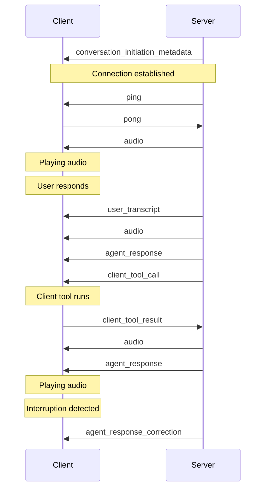

# ElevenLabs Documentation

> Paste relevant ElevenLabs docs below for the Shamrock Bail Bonds project.
> This file mirrors the purpose of `twilio-docs.md` — a single reference doc for ElevenLabs platform documentation.

---

## Table of Contents
- [Conversational AI](#conversational-ai)
- [Twilio Integration](#twilio-integration)
- [Webhooks](#webhooks)
- [Voice Cloning](#voice-cloning)
- [Text-to-Speech API](#text-to-speech-api)
- [SDK Reference](#sdk-reference)

---

## Conversational AI

<!-- Paste Conversational AI docs here -->

---

## Twilio Integration

<!-- Paste Twilio connector / SIP trunking docs here -->

---

## Webhooks

<!-- Paste webhook event docs here (post_call_transcription, call_initiation_failure, etc.) -->

---

## Voice Cloning

<!-- Paste voice cloning docs here -->

---

## Text-to-Speech API

<!-- Paste TTS API reference here -->

---

## SDK Reference

### JavaScript SDK
- Package: `@elevenlabs/elevenlabs-js`
- Install: `npm install @elevenlabs/elevenlabs-js`
- ⚠️ Do NOT use `npm install elevenlabs` (outdated v1.x package)

### React SDK
- Package: `@elevenlabs/react`
- For browser-based conversational widgets

### Browser SDK
- Package: `@elevenlabs/client`
- For browser-based audio generation

---
***

title: Twilio native integration
subtitle: Learn how to configure inbound calls for your agent with Twilio.
--------------------------------------------------------------------------

<iframe width="100%" height="400" src="https://www.youtube-nocookie.com/embed/1_ebl-acp6M?rel=0&autoplay=0" title="YouTube video player" frameborder="0" allow="accelerometer; clipboard-write; encrypted-media; gyroscope; picture-in-picture; web-share" allowfullscreen />

## Overview

This guide shows you how to connect a Twilio phone number to your ElevenLabs agent to handle both inbound and outbound calls.

You will learn to:

* Import an existing Twilio phone number.
* Link it to your agent to handle inbound calls.
* Initiate outbound calls using your agent.

## Phone Number Types & Capabilities

ElevenLabs supports two types of Twilio phone numbers with different capabilities:

### Purchased Twilio Numbers (Full Support)

* **Inbound calls**: Supported - Can receive calls and route them to agents
* **Outbound calls**: Supported - Can make calls using agents
* **Requirements**: Number must be purchased through Twilio and appear in your "Phone Numbers" section

### Verified Caller IDs (Outbound Only)

* **Inbound calls**: Not supported - Cannot receive calls or be assigned to agents
* **Outbound calls**: Supported - Can make calls using agents
* **Requirements**: Number must be verified in Twilio's "Verified Caller IDs" section
* **Use case**: Ideal for using your existing business number for outbound AI calls

Learn more about [verifying caller IDs at scale](https://www.twilio.com/docs/voice/api/verifying-caller-ids-scale) in Twilio's documentation.

<Note>
  During phone number import, ElevenLabs automatically detects the capabilities of your number based
  on its configuration in Twilio.
</Note>

## Guide

### Prerequisites

* A [Twilio account](https://twilio.com/).
* Either:
  * A purchased & provisioned Twilio [phone number](https://www.twilio.com/docs/phone-numbers) (for inbound + outbound)
  * OR a [verified caller ID](https://www.twilio.com/docs/voice/make-calls#verify-your-caller-id) in Twilio (for outbound only)

<Steps>
  <Step title="Import a Twilio phone number">
    In the ElevenAgents dashboard, go to the [**Phone Numbers**](https://elevenlabs.io/app/agents/phone-numbers) tab.

    <Frame background="subtle">
      
    </Frame>

    Next, fill in the following details:

    * **Label:** A descriptive name (e.g., `Customer Support Line`).
    * **Phone Number:** The Twilio number you want to use.
    * **Twilio SID:** Your Twilio Account SID.
    * **Twilio Token:** Your Twilio Auth Token.

    <Note>
      You can find your account SID and auth token [**in the Twilio admin console**](https://www.twilio.com/console).
    </Note>

    <Tabs>
      <Tab title="ElevenAgents dashboard">
        <Frame background="subtle">
          
        </Frame>
      </Tab>

      <Tab title="Twilio admin console">
        Copy the Twilio SID and Auth Token from the [Twilio admin
        console](https://www.twilio.com/console).

        <Frame background="subtle">
          
        </Frame>
      </Tab>
    </Tabs>

    <Note>
      ElevenLabs automatically configures the Twilio phone number with the correct settings.
    </Note>

    <Accordion title="Applied settings">
      <Frame background="subtle">
        
      </Frame>
    </Accordion>

    <Info>
      **Phone Number Detection**: ElevenLabs will automatically detect whether your number supports:

      * **Inbound + Outbound**: Numbers purchased through Twilio
      * **Outbound Only**: Numbers verified as caller IDs in Twilio

      If your number is not found in either category, you'll receive an error asking you to verify it exists in your Twilio account.
    </Info>
  </Step>

  <Step title="Assign your agent (Inbound-capable numbers only)">
    If your phone number supports inbound calls, you can assign an agent to handle incoming calls.

    <Frame background="subtle">
      
    </Frame>

    <Note>
      Numbers that only support outbound calls (verified caller IDs) cannot be assigned to agents and
      will show as disabled in the agent dropdown.
    </Note>
  </Step>
</Steps>

Test the agent by giving the phone number a call. Your agent is now ready to handle inbound calls and engage with your customers.

<Tip>
  Monitor your first few calls in the [Calls History
  dashboard](https://elevenlabs.io/app/agents/history) to ensure everything is working as expected.
</Tip>

## Making Outbound Calls

<Info>
  Both purchased Twilio numbers and verified caller IDs can be used for outbound calls. The outbound
  call button will be disabled for numbers that don't support outbound calling.
</Info>

Your imported Twilio phone number can also be used to initiate outbound calls where your agent calls a specified phone number.

<Steps>
  <Step title="Initiate an outbound call">
    From the [**Phone Numbers**](https://elevenlabs.io/app/agents/phone-numbers) tab, locate your imported Twilio number and click the **Outbound call** button.

    <Frame background="subtle">
      
    </Frame>
  </Step>

  <Step title="Configure the call">
    In the Outbound Call modal:

    1. Select the agent that will handle the conversation
    2. Enter the phone number you want to call
    3. Click **Send Test Call** to initiate the call

    <Frame background="subtle">
      
    </Frame>
  </Step>
</Steps>

Once initiated, the recipient will receive a call from your Twilio number. When they answer, your agent will begin the conversation.

<Tip>
  Outbound calls appear in your [Calls History dashboard](https://elevenlabs.io/app/agents/history)
  alongside inbound calls, allowing you to review all conversations.
</Tip>

<Note>
  When making outbound calls, your agent will be the initiator of the conversation, so ensure your
  agent has appropriate initial messages configured to start the conversation effectively.
</Note>

***

title: Twilio personalization
subtitle: Configure personalization for incoming Twilio calls using webhooks.
-----------------------------------------------------------------------------

## Overview

When receiving inbound Twilio calls, you can dynamically fetch conversation initiation data through a webhook. This allows you to customize your agent's behavior based on caller information and other contextual data.

<iframe width="100%" height="400" src="https://www.youtube-nocookie.com/embed/cAuSo8qNs-8" title="YouTube video player" frameborder="0" allow="accelerometer; autoplay; clipboard-write; encrypted-media; gyroscope; picture-in-picture; web-share" allowfullscreen />

## How it works

1. When a Twilio call is received, ElevenAgents will make a webhook call to your specified endpoint, passing call information (`caller_id`, `agent_id`, `called_number`, `call_sid`) as arguments
2. Your webhook returns conversation initiation client data, including dynamic variables and overrides (an example is shown below)
3. This data is used to initiate the conversation

<Tip>
  The system uses Twilio's connection/dialing period to fetch webhook data in parallel, creating a
  seamless experience where:

  * Users hear the expected telephone connection sound
  * In parallel, ElevenAgents fetches necessary webhook data
  * The conversation is initiated with the fetched data by the time the audio connection is established
</Tip>

## Configuration

<Steps>
  <Step title="Configure webhook details">
    In the [settings page](https://elevenlabs.io/app/agents/settings) of ElevenAgents, configure the webhook URL and add any
    secrets needed for authentication.

    <Frame background="subtle">
      
    </Frame>

    Click on the webhook to modify which secrets are sent in the headers.

    <Frame background="subtle">
      
    </Frame>
  </Step>

  <Step title="Enable fetching conversation initiation data">
    In the "Security" tab of the [agent's page](https://elevenlabs.io/app/agents/agents/), enable fetching conversation initiation data for inbound Twilio calls, and define fields that can be overridden.

    <Frame background="subtle">
      
    </Frame>
  </Step>

  <Step title="Implement the webhook endpoint to receive Twilio data">
    The webhook will receive a POST request with the following parameters:

    | Parameter       | Type   | Description                            |
    | --------------- | ------ | -------------------------------------- |
    | `caller_id`     | string | The phone number of the caller         |
    | `agent_id`      | string | The ID of the agent receiving the call |
    | `called_number` | string | The Twilio number that was called      |
    | `call_sid`      | string | Unique identifier for the Twilio call  |
  </Step>

  <Step title="Return conversation initiation client data">
    Your webhook must return a JSON response containing the initiation data for the agent.

    <Info>
      The `dynamic_variables` field must contain all dynamic variables defined for the agent. Overrides
      on the other hand are entirely optional. For more information about dynamic variables and
      overrides see the [dynamic variables](/docs/agents-platform/customization/personalization/dynamic-variables) and
      [overrides](/docs/agents-platform/customization/personalization/overrides) docs.
    </Info>

    An example response could be:

    ```json
    {
      "type": "conversation_initiation_client_data",
      "dynamic_variables": {
        "customer_name": "John Doe",
        "account_status": "premium",
        "last_interaction": "2024-01-15"
      },
      "conversation_config_override": {
        "agent": {
          "prompt": {
            "prompt": "The customer's bank account balance is $100. They are based in San Francisco."
          },
          "first_message": "Hi, how can I help you today?",
          "language": "en"
        },
        "tts": {
          "voice_id": "new-voice-id"
        }
      }
    }
    ```
  </Step>
</Steps>

ElevenAgents will use the dynamic variables to populate the conversation initiation data, and the conversation will start smoothly.

<Warning>
  Ensure your webhook responds within a reasonable timeout period to avoid delaying the call
  handling.
</Warning>

## Security

* Use HTTPS endpoints only
* Implement authentication using request headers
* Store sensitive values as secrets through the [ElevenLabs secrets manager](https://elevenlabs.io/app/agents/settings)
* Validate the incoming request parameters

***

title: Twilio regional routing
subtitle: >-
Configure regional routing for Twilio phone numbers to ensure data residency
compliance.
-----------

## Overview

Regional routing ensures that your telephony data stays within a specific geographic region. When using Twilio with ElevenLabs in an isolated environment (such as EU residency), you must configure regional routing correctly to maintain data residency compliance.

This guide explains what regional routing is, why it matters, and how to configure it properly in both Twilio and ElevenLabs.

## What is regional routing?

Regional routing is Twilio's mechanism for ensuring that call data is processed and stored within a specific geographic region. Think of it as data residency for your telephony infrastructure.

<Note>
  By default, Twilio phone numbers are configured to route through the US region (`us1`), **even if
  the phone number itself is from another country**. For example, an Italian phone number will still
  route through the US unless regional routing is explicitly configured.
</Note>

## Why regional routing matters

When using ElevenLabs in an isolated environment (such as EU residency), all data processing must remain within your designated region. Without proper regional routing configuration:

* **Data residency violations**: Call data may be routed through unintended regions
* **Failed API operations**: Operations on ongoing calls (such as transfers, hold, resume) will fail
* **SDK routing mismatches**: The Twilio SDK defaults to the `us1` region, causing API calls to be sent to the wrong region even when Twilio has routed the call correctly on the backend

## How it works

When you import a Twilio phone number into ElevenLabs:

1. **Twilio routes the call**: Twilio automatically routes incoming calls to the region configured in your Twilio account (this can be `us1`, `ie1` for Ireland, `au1` for Australia, etc.)
2. **ElevenLabs needs to know the region**: To perform operations on ongoing calls (like transfers), ElevenLabs must send API requests to the same region where Twilio routed the call
3. **Region specification prevents failures**: By specifying the routing region in the ElevenLabs platform, we ensure all API calls target the correct Twilio region

<Warning>
  If the routing region is not specified or is incorrect, operations like call transfers will fail
  because the API requests will be sent to the default `us1` region while the actual call is being
  handled in a different region.
</Warning>

## Configuration

<Steps>
  ### Check your Twilio regional routing

  First, verify which region your Twilio phone number is configured to use:

  1. Log into your [Twilio Console](https://console.twilio.com/)
  2. Navigate to **Phone Numbers** → **Manage** → **Active numbers**
  3. Select your phone number
  4. Look for the **Voice & Fax** configuration section
  5. Check the **Regional routing** or **Edge Location** setting

  Common Twilio regions:

  * `us1` - United States (default)
  * `ie1` - Ireland (Europe)
  * `au1` - Australia
  * `br1` - Brazil
  * `jp1` - Japan
  * `sg1` - Singapore

  <Tip>
    If you're using an isolated environment (like EU residency), ensure your Twilio numbers are
    configured to route through the matching region (e.g., `ie1` for EU).
  </Tip>

  ### Configure regional routing in Twilio

  If your phone number is not configured for the correct region:

  1. In the [Twilio Console](https://console.twilio.com/), go to your phone number configuration
  2. Find the **Voice & Fax** section
  3. Set the **Edge Location** to match your desired region
  4. Save the configuration

  <Note>
    Regional routing configuration in Twilio may require additional setup or account permissions.
    Contact [Twilio Support](https://support.twilio.com/) if you need assistance enabling regional
    routing for your account.
  </Note>

  ### Specify the routing region in ElevenLabs

  When you import or configure a Twilio phone number in the ElevenLabs [Phone Numbers](https://elevenlabs.io/app/agents/phone-numbers) page:

  1. Navigate to the phone number configuration
  2. If you're using an isolated environment, you'll see a warning message that reads: "You are using a phone number in an isolated environment. Double check the routing region for this phone number in your provider."
  3. Verify that the **routing region** matches your Twilio configuration
  4. Ensure the region specified matches the region configured in your Twilio account
     <Warning>
       If you're using regional routing, you must use a **regional API key** from Twilio that
       corresponds to your routing region. Your standard US API key will not work for non-US regions
       and will result in authentication errors. Generate a region-specific API key in your [Twilio
       Console](https://console.twilio.com/).
     </Warning>
</Steps>

## Verifying your configuration

To verify that regional routing is configured correctly:

1. **Check Twilio Console**: Confirm your phone number shows the correct Edge Location
2. **Check ElevenLabs Platform**: Verify the routing region setting matches your Twilio configuration
3. **Test call operations**: Make a test call and verify that operations like call transfer work correctly

<Tip>
  Monitor your first few calls in the [Calls History
  dashboard](https://elevenlabs.io/app/agents/history) after configuring regional routing to ensure
  everything works as expected.
</Tip>

## Common issues

<AccordionGroup>
  <Accordion title="Call transfers are failing">
    This typically indicates a regional routing mismatch. Verify that:

    * Your Twilio phone number is configured with the correct Edge Location
    * The routing region specified in ElevenLabs matches your Twilio configuration
    * You're using an isolated environment that matches the routing region
  </Accordion>

  <Accordion title="My phone number is from Europe but routing through US">
    The phone number's geographic origin doesn't determine routing behavior. You must explicitly
    configure regional routing in Twilio. By default, all numbers (including European numbers) route
    through `us1` unless configured otherwise.
  </Accordion>

  <Accordion title="I'm not using an isolated environment - do I need this?">
    If you're using the standard ElevenLabs environment (not EU residency or another isolated
    environment), regional routing configuration is optional.
  </Accordion>

  <Accordion title="How do I know which region to use?">
    Choose a region that:

    * Matches your data residency requirements (e.g., `ie1` for EU data residency)
    * Is closest to your users for optimal latency
    * Matches your ElevenLabs isolated environment (if applicable)
  </Accordion>

  <Accordion title="I'm getting authentication errors with my Twilio credentials">
    If you're seeing authentication errors when using regional routing, verify that you're using the correct **regional API key**:

    * Regional routing requires a region-specific API key from Twilio, not your standard US API key
    * Generate a new API key scoped to your target region (e.g., `ie1`, `au1`) in the Twilio Console
    * Update your credentials in ElevenLabs with the regional API key
    * Your Account SID remains the same, but the API key must match the region
  </Accordion>
</AccordionGroup>

## Best practices

* **Match regions**: Ensure your Twilio regional routing matches your ElevenLabs environment
* **Document configuration**: Keep records of which numbers use which regions
* **Test thoroughly**: Verify call operations work correctly after changing regional routing
* **Monitor calls**: Watch for failures in the Calls History dashboard that might indicate routing issues
* **Plan for scale**: If you plan to expand to new regions, consider regional routing from the start

## Additional resources

* [Twilio Regional Routing Documentation](https://www.twilio.com/docs/global-infrastructure/edge-locations)
* [ElevenLabs Data Residency Guide](/docs/overview/administration/data-residency)
* [Twilio Phone Numbers Guide](/docs/agents-platform/phone-numbers/twilio-integration/native-integration)

***

title: Register Twilio calls
subtitle: Use your own Twilio infrastructure to connect calls to ElevenLabs agents.
-----------------------------------------------------------------------------------

<Warning title="Advanced">
  This guide covers an advanced integration pattern for developers who need full control over their
  Twilio infrastructure. For a simpler setup, consider using the [native Twilio
  integration](/docs/agents-platform/phone-numbers/twilio-integration/native-integration) which
  handles configuration automatically.
</Warning>

## When to use each approach

Before diving in, understand the trade-offs between the native integration and the register call approach:

| Feature                 | Native integration | Register call  |
| ----------------------- | ------------------ | -------------- |
| Ease of setup           | Easier             | More complex   |
| Call transfers          | Supported          | Not supported  |
| Custom Twilio logic     | Limited            | Full control   |
| Phone number management | Through ElevenLabs | Through Twilio |

## Overview

The register call endpoint allows you to use your own Twilio infrastructure while leveraging ElevenLabs agents for the conversation. Instead of importing your Twilio number into ElevenLabs, you maintain full control of your Twilio setup and use the ElevenLabs API to register calls and receive [TwiML](https://www.twilio.com/docs/voice/twiml) for connecting them to your agents.

This approach is ideal when you:

* Need to maintain your existing Twilio infrastructure and workflows
* Want programmatic control over call routing and handling
* Have complex call flows that require custom Twilio logic before connecting to an agent
* Need to integrate ElevenLabs agents into an existing telephony system

## How it works

1. Your server receives an inbound call or initiates an outbound call via Twilio
2. Your server calls the ElevenLabs register call endpoint with agent and call details
3. ElevenLabs returns TwiML that connects the call to your agent via WebSocket
4. You return this TwiML to Twilio to establish the connection

<Note>
  When using the register call endpoint, call transfer functionality is not available as ElevenLabs
  does not have direct access to your Twilio account credentials.
</Note>

## Prerequisites

* An [ElevenLabs account](https://elevenlabs.io)
* A configured ElevenLabs Conversational Agent ([create one here](/docs/agents-platform/quickstart))
* A [Twilio account](https://www.twilio.com/try-twilio) with an active phone number
* Your agent configured with μ-law 8000 Hz audio format (see [agent configuration](#agent-configuration))

## Agent configuration

Before using the register call endpoint, configure your agent to use the correct audio format supported by Twilio.

<Steps>
  <Step title="Configure TTS Output">
    1. Navigate to your agent settings
    2. Go to the Voice section
    3. Select "μ-law 8000 Hz" from the dropdown

    <Frame background="subtle">
      
    </Frame>
  </Step>

  <Step title="Set Input Format">
    1. Navigate to your agent settings
    2. Go to the Advanced section
    3. Select "μ-law 8000 Hz" for the input format

    <Frame background="subtle">
      
    </Frame>
  </Step>
</Steps>

## API reference

The register call endpoint accepts the following parameters:

| Parameter                             | Type   | Required | Description                                       |
| ------------------------------------- | ------ | -------- | ------------------------------------------------- |
| `agent_id`                            | string | Yes      | The ID of the agent to handle the call            |
| `from_number`                         | string | Yes      | The caller's phone number                         |
| `to_number`                           | string | Yes      | The destination phone number                      |
| `direction`                           | string | No       | Call direction: `inbound` (default) or `outbound` |
| `conversation_initiation_client_data` | object | No       | Dynamic variables and configuration overrides     |

The endpoint returns TwiML that you should pass directly to Twilio.

## Implementation

<CodeBlocks>
  ```python
  import os
  from fastapi import FastAPI, Request
  from fastapi.responses import Response
  from elevenlabs import ElevenLabs

  app = FastAPI()

  elevenlabs = ElevenLabs()
  AGENT_ID = os.getenv("ELEVENLABS_AGENT_ID")

  @app.post("/twilio/inbound")
  async def handle_inbound_call(request: Request):
      form_data = await request.form()
      from_number = form_data.get("From")
      to_number = form_data.get("To")

      # Register the call with ElevenLabs
      twiml = elevenlabs.conversational_ai.twilio.register_call(
          agent_id=AGENT_ID,
          from_number=from_number,
          to_number=to_number,
          direction="inbound",
          conversation_initiation_client_data={
              "dynamic_variables": {
                  "caller_number": from_number,
              }
          }
      )

      # Return the TwiML directly to Twilio
      return Response(content=twiml, media_type="application/xml")

  if __name__ == "__main__":
      import uvicorn
      uvicorn.run(app, host="0.0.0.0", port=8000)
  ```

  ```typescript
  import { ElevenLabsClient } from 'elevenlabs';
  import express from 'express';

  const app = express();
  app.use(express.urlencoded({ extended: true }));

  const elevenlabs = new ElevenLabsClient();
  const AGENT_ID = process.env.ELEVENLABS_AGENT_ID;

  // Handle incoming Twilio calls
  app.post('/twilio/inbound', async (req, res) => {
    const { From: fromNumber, To: toNumber } = req.body;

    // Register the call with ElevenLabs
    const twiml = await elevenlabs.conversationalAi.twilio.registerCall({
      agentId: AGENT_ID,
      fromNumber,
      toNumber,
      direction: 'inbound',
      conversationInitiationClientData: {
        dynamicVariables: {
          caller_number: fromNumber,
        },
      },
    });

    // Return the TwiML directly to Twilio
    res.type('application/xml').send(twiml);
  });

  app.listen(8000, () => {
    console.log('Server running on port 8000');
  });
  ```
</CodeBlocks>

## Outbound calls

For outbound calls, initiate the call through Twilio and point the webhook URL to your server, which then registers with ElevenLabs:

<CodeBlocks>
  ```python
  from twilio.rest import Client
  import os
  from fastapi import Request
  from fastapi.responses import Response
  from elevenlabs import ElevenLabs

  # Initialize clients
  twilio_client = Client(
      os.getenv("TWILIO_ACCOUNT_SID"),
      os.getenv("TWILIO_AUTH_TOKEN")
  )
  elevenlabs = ElevenLabs()
  AGENT_ID = os.getenv("ELEVENLABS_AGENT_ID")

  def initiate_outbound_call(to_number: str):
      call = twilio_client.calls.create(
          from_=os.getenv("TWILIO_PHONE_NUMBER"),
          to=to_number,
          url="https://your-server.com/twilio/outbound"
      )
      return call.sid

  @app.post("/twilio/outbound")
  async def handle_outbound_webhook(request: Request):
      form_data = await request.form()
      from_number = form_data.get("From")
      to_number = form_data.get("To")

      twiml = elevenlabs.conversational_ai.twilio.register_call(
          agent_id=AGENT_ID,
          from_number=from_number,
          to_number=to_number,
          direction="outbound",
      )

      return Response(content=twiml, media_type="application/xml")
  ```

  ```typescript
  import { ElevenLabsClient } from 'elevenlabs';
  import Twilio from 'twilio';

  // Initialize clients
  const twilioClient = new Twilio(process.env.TWILIO_ACCOUNT_SID, process.env.TWILIO_AUTH_TOKEN);
  const elevenlabs = new ElevenLabsClient();
  const AGENT_ID = process.env.ELEVENLABS_AGENT_ID;

  // Initiate an outbound call
  async function initiateOutboundCall(toNumber: string) {
    const call = await twilioClient.calls.create({
      from: process.env.TWILIO_PHONE_NUMBER,
      to: toNumber,
      url: 'https://your-server.com/twilio/outbound',
    });
    return call.sid;
  }

  // Handle the Twilio webhook for outbound calls
  app.post('/twilio/outbound', async (req, res) => {
    const { From: fromNumber, To: toNumber } = req.body;

    const twiml = await elevenlabs.conversationalAi.twilio.registerCall({
      agentId: AGENT_ID,
      fromNumber,
      toNumber,
      direction: 'outbound',
    });

    res.type('application/xml').send(twiml);
  });
  ```
</CodeBlocks>

## Personalizing conversations

Use the `conversation_initiation_client_data` parameter to pass dynamic variables and override agent configuration:

```json
{
  "agent_id": "your-agent-id",
  "from_number": "+1234567890",
  "to_number": "+0987654321",
  "direction": "inbound",
  "conversation_initiation_client_data": {
    "dynamic_variables": {
      "customer_name": "John Doe",
      "account_type": "premium",
      "order_id": "ORD-12345"
    }
  }
}
```

<Info>
  For more information about dynamic variables and overrides, see the [dynamic
  variables](/docs/agents-platform/customization/personalization/dynamic-variables) and
  [overrides](/docs/agents-platform/customization/personalization/overrides) documentation.
</Info>

## Twilio configuration

Configure your Twilio phone number to point to your server:

<Steps>
  <Step title="Create a public URL">
    For local development, use [ngrok](https://ngrok.com) to expose your server:

    ```bash
    ngrok http 8000
    ```
  </Step>

  <Step title="Configure your Twilio number">
    1. Go to the [Twilio Console](https://console.twilio.com)
    2. Navigate to Phone Numbers > Manage > Active numbers
    3. Select your phone number
    4. Under "Voice Configuration", set the webhook URL to your server endpoint (e.g., `https://your-ngrok-url.ngrok.app/twilio/inbound`)
    5. Set the HTTP method to POST

    <Frame background="subtle">
      
    </Frame>
  </Step>
</Steps>

## Limitations

When using the register call endpoint instead of the native integration:

* **No call transfers**: Transfer functionality is not available as ElevenLabs does not have access to your Twilio credentials
* **Manual configuration**: You must configure audio formats and handle TwiML routing yourself
* **No dashboard import**: Phone numbers registered this way do not appear in the ElevenLabs phone numbers dashboard

***

title: Client tools
subtitle: Empower your assistant to trigger client-side operations.
-------------------------------------------------------------------

**Client tools** enable your assistant to execute client-side functions. Unlike [server-side tools](/docs/agents-platform/customization/tools), client tools allow the assistant to perform actions such as triggering browser events, running client-side functions, or sending notifications to a UI.

<iframe width="100%" height="400" src="https://www.youtube-nocookie.com/embed/XeDT92mR7oE?rel=0&autoplay=0" title="YouTube video player" frameborder="0" allow="accelerometer; clipboard-write; encrypted-media; gyroscope; picture-in-picture; web-share" allowfullscreen />

## Overview

Applications may require assistants to interact directly with the user's environment. Client-side tools give your assistant the ability to perform client-side operations.

Here are a few examples where client tools can be useful:

* **Triggering UI events**: Allow an assistant to trigger browser events, such as alerts, modals or notifications.
* **Interacting with the DOM**: Enable an assistant to manipulate the Document Object Model (DOM) for dynamic content updates or to guide users through complex interfaces.

<Info>
  To perform operations server-side, use
  [server-tools](/docs/agents-platform/customization/tools/server-tools) instead.
</Info>

## Guide

### Prerequisites

* An [ElevenLabs account](https://elevenlabs.io)
* A configured ElevenLabs Conversational Agent ([create one here](https://elevenlabs.io/app/agents))

<Steps>
  <Step title="Create a new client-side tool">
    Navigate to your agent dashboard. In the **Tools** section, click **Add Tool**. Ensure the **Tool Type** is set to **Client**. Then configure the following:

    | Setting     | Parameter                                                        |
    | ----------- | ---------------------------------------------------------------- |
    | Name        | logMessage                                                       |
    | Description | Use this client-side tool to log a message to the user's client. |

    Then create a new parameter `message` with the following configuration:

    | Setting     | Parameter                                                                          |
    | ----------- | ---------------------------------------------------------------------------------- |
    | Data Type   | String                                                                             |
    | Identifier  | message                                                                            |
    | Required    | true                                                                               |
    | Description | The message to log in the console. Ensure the message is informative and relevant. |

    <Frame background="subtle">
      
    </Frame>
  </Step>

  <Step title="Register the client tool in your code">
    Unlike server-side tools, client tools need to be registered in your code.

    Use the following code to register the client tool:

    <CodeBlocks>
      ```python title="Python" focus={4-16}
      from elevenlabs import ElevenLabs
      from elevenlabs.conversational_ai.conversation import Conversation, ClientTools

      def log_message(parameters):
          message = parameters.get("message")
          print(message)

      client_tools = ClientTools()
      client_tools.register("logMessage", log_message)

      conversation = Conversation(
          client=ElevenLabs(api_key="your-api-key"),
          agent_id="your-agent-id",
          client_tools=client_tools,
          # ...
      )

      conversation.start_session()
      ```

      ```javascript title="JavaScript" focus={2-10}
      // ...
      const conversation = await Conversation.startSession({
        // ...
        clientTools: {
          logMessage: async ({message}) => {
            console.log(message);
          }
        },
        // ...
      });
      ```

      ```swift title="Swift" focus={2-10}
      // ...
      var clientTools = ElevenLabsSDK.ClientTools()

      clientTools.register("logMessage") { parameters async throws -> String? in
          guard let message = parameters["message"] as? String else {
              throw ElevenLabsSDK.ClientToolError.invalidParameters
          }
          print(message)
          return message
      }
      ```
    </CodeBlocks>

    <Note>
      The tool and parameter names in the agent configuration are case-sensitive and **must** match those registered in your code.
    </Note>
  </Step>

  <Step title="Testing">
    Initiate a conversation with your agent and say something like:

    > *Log a message to the console that says Hello World*

    You should see a `Hello World` log appear in your console.
  </Step>

  <Step title="Next steps">
    Now that you've set up a basic client-side event, you can:

    * Explore more complex client tools like opening modals, navigating to pages, or interacting with the DOM.
    * Combine client tools with server-side webhooks for full-stack interactions.
    * Use client tools to enhance user engagement and provide real-time feedback during conversations.
  </Step>
</Steps>

### Passing client tool results to the conversation context

When you want your agent to receive data back from a client tool, ensure that you tick the **Wait for response** option in the tool configuration.

<Frame background="subtle">
  
</Frame>

Once the client tool is added, when the function is called the agent will wait for its response and append the response to the conversation context.

<CodeBlocks>
  ```python title="Python"
  def get_customer_details():
      # Fetch customer details (e.g., from an API or database)
      customer_data = {
          "id": 123,
          "name": "Alice",
          "subscription": "Pro"
      }
      # Return the customer data; it can also be a JSON string if needed.
      return customer_data

  client_tools = ClientTools()
  client_tools.register("getCustomerDetails", get_customer_details)

  conversation = Conversation(
      client=ElevenLabs(api_key="your-api-key"),
      agent_id="your-agent-id",
      client_tools=client_tools,
      # ...
  )

  conversation.start_session()
  ```

  ```javascript title="JavaScript"
  const clientTools = {
    getCustomerDetails: async () => {
      // Fetch customer details (e.g., from an API)
      const customerData = {
        id: 123,
        name: "Alice",
        subscription: "Pro"
      };
      // Return data directly to the agent.
      return customerData;
    }
  };

  // Start the conversation with client tools configured.
  const conversation = await Conversation.startSession({ clientTools });
  ```
</CodeBlocks>

In this example, when the agent calls **getCustomerDetails**, the function will execute on the client and the agent will receive the returned data, which is then used as part of the conversation context. The values from the response can also optionally be assigned to dynamic variables, similar to [server tools](https://elevenlabs.io/docs/agents-platform/customization/tools/server-tools). Note system tools cannot update dynamic variables.

### Troubleshooting

<AccordionGroup>
  <Accordion title="Tools not being triggered">
    * Ensure the tool and parameter names in the agent configuration match those registered in your code.
    * View the conversation transcript in the agent dashboard to verify the tool is being executed.
  </Accordion>

  <Accordion title="Console errors">
    * Open the browser console to check for any errors.
    * Ensure that your code has necessary error handling for undefined or unexpected parameters.
  </Accordion>
</AccordionGroup>

## Best practices

<h4>
  Name tools intuitively, with detailed descriptions
</h4>

If you find the assistant does not make calls to the correct tools, you may need to update your tool names and descriptions so the assistant more clearly understands when it should select each tool. Avoid using abbreviations or acronyms to shorten tool and argument names.

You can also include detailed descriptions for when a tool should be called. For complex tools, you should include descriptions for each of the arguments to help the assistant know what it needs to ask the user to collect that argument.

<h4>
  Name tool parameters intuitively, with detailed descriptions
</h4>

Use clear and descriptive names for tool parameters. If applicable, specify the expected format for a parameter in the description (e.g., YYYY-mm-dd or dd/mm/yy for a date).

<h4>
  Consider providing additional information about how and when to call tools in your assistant's
  system prompt
</h4>

Providing clear instructions in your system prompt can significantly improve the assistant's tool calling accuracy. For example, guide the assistant with instructions like the following:

```plaintext
Use `check_order_status` when the user inquires about the status of their order, such as 'Where is my order?' or 'Has my order shipped yet?'.
```

Provide context for complex scenarios. For example:

```plaintext
Before scheduling a meeting with `schedule_meeting`, check the user's calendar for availability using check_availability to avoid conflicts.
```

<h4>
  LLM selection
</h4>

<Warning>
  When using tools, we recommend picking high intelligence models like GPT-4o mini or Claude 3.5
  Sonnet and avoiding Gemini 1.5 Flash.
</Warning>

It's important to note that the choice of LLM matters to the success of function calls. Some LLMs can struggle with extracting the relevant parameters from the conversation.

***

title: Server tools
subtitle: Connect your assistant to external data & systems.
------------------------------------------------------------

**Tools** enable your assistant to connect to external data and systems. You can define a set of tools that the assistant has access to, and the assistant will use them where appropriate based on the conversation.

<iframe width="100%" height="400" src="https://www.youtube-nocookie.com/embed/pB33QxKN8P8?rel=0&autoplay=0" title="YouTube video player" frameborder="0" allow="accelerometer; clipboard-write; encrypted-media; gyroscope; picture-in-picture; web-share" allowfullscreen />

## Overview

Many applications require assistants to call external APIs to get real-time information. Tools give your assistant the ability to make external function calls to third party apps so you can get real-time information.

Here are a few examples where tools can be useful:

* **Fetching data**: enable an assistant to retrieve real-time data from any REST-enabled database or 3rd party integration before responding to the user.
* **Taking action**: allow an assistant to trigger authenticated actions based on the conversation, like scheduling meetings or initiating order returns.

<Info>
  To interact with Application UIs or trigger client-side events use [client
  tools](/docs/agents-platform/customization/tools/client-tools) instead.
</Info>

## Tool configuration

ElevenLabs agents can be equipped with tools to interact with external APIs. Unlike traditional requests, the assistant generates query, body, and path parameters dynamically based on the conversation and parameter descriptions you provide.

All tool configurations and parameter descriptions help the assistant determine **when** and **how** to use these tools. To orchestrate tool usage effectively, update the assistant’s system prompt to specify the sequence and logic for making these calls. This includes:

* **Which tool** to use and under what conditions.
* **What parameters** the tool needs to function properly.
* **How to handle** the responses.

<br />

<Tabs>
  <Tab title="Configuration">
    Define a high-level `Name` and `Description` to describe the tool's purpose. This helps the LLM understand the tool and know when to call it.

    <Info>
      If the API requires path parameters, include variables in the URL path by wrapping them in curly
      braces `{}`, for example: `/api/resource/{id}` where `id` is a path parameter.
    </Info>

    <Frame background="subtle">
      
    </Frame>
  </Tab>

  <Tab title="Authentication">
    Configure authentication by adding custom headers or using out-of-the-box authentication methods through auth connections.

    <Frame background="subtle">
      
    </Frame>
  </Tab>

  <Tab title="Headers">
    Specify any headers that need to be included in the request.

    <Frame background="subtle">
      
    </Frame>
  </Tab>

  <Tab title="Path parameters">
    Include variables in the URL path by wrapping them in curly braces `{}`:

    * **Example**: `/api/resource/{id}` where `id` is a path parameter.

    <Frame background="subtle">
      
    </Frame>
  </Tab>

  <Tab title="Body parameters">
    Specify any body parameters to be included in the request.

    <Frame background="subtle">
      
    </Frame>
  </Tab>

  <Tab title="Query parameters">
    Specify any query parameters to be included in the request.

    <Frame background="subtle">
      
    </Frame>
  </Tab>

  <Tab title="Dynamic variable assignment">
    Specify dynamic variables to update from the tool response for later use in the conversation.

    <Frame background="subtle">
      
    </Frame>
  </Tab>
</Tabs>

## Guide

In this guide, we'll create a weather assistant that can provide real-time weather information for any location. The assistant will use its geographic knowledge to convert location names into coordinates and fetch accurate weather data.

<div>
  <iframe src="https://player.vimeo.com/video/1061374724?h=bd9bdb535e&badge=0&autopause=0&player_id=0&app_id=58479" frameborder="0" allow="autoplay; fullscreen; picture-in-picture; clipboard-write; encrypted-media" title="weatheragent" />
</div>

<Steps>
  <Step title="Configure the weather tool">
    First, on the **Agent** section of your agent settings page, choose **Add Tool**. Select **Webhook** as the Tool Type, then configure the weather API integration:

    <AccordionGroup>
      <Accordion title="Weather Tool Configuration">
        <Tabs>
          <Tab title="Configuration">
            | Field       | Value                                                                                                                                                                                                                                                                                                                                                                                  |
            | ----------- | -------------------------------------------------------------------------------------------------------------------------------------------------------------------------------------------------------------------------------------------------------------------------------------------------------------------------------------------------------------------------------------- |
            | Name        | get\_weather                                                                                                                                                                                                                                                                                                                                                                           |
            | Description | Gets the current weather forecast for a location                                                                                                                                                                                                                                                                                                                                       |
            | Method      | GET                                                                                                                                                                                                                                                                                                                                                                                    |
            | URL         | [https://api.open-meteo.com/v1/forecast?latitude=\{latitude}\&longitude=\{longitude}\&current=temperature\_2m,wind\_speed\_10m\&hourly=temperature\_2m,relative\_humidity\_2m,wind\_speed\_10m](https://api.open-meteo.com/v1/forecast?latitude=\{latitude}\&longitude=\{longitude}\&current=temperature_2m,wind_speed_10m\&hourly=temperature_2m,relative_humidity_2m,wind_speed_10m) |
          </Tab>

          <Tab title="Path Parameters">
            | Data Type | Identifier | Value Type | Description                                         |
            | --------- | ---------- | ---------- | --------------------------------------------------- |
            | string    | latitude   | LLM Prompt | The latitude coordinate for the requested location  |
            | string    | longitude  | LLM Prompt | The longitude coordinate for the requested location |
          </Tab>
        </Tabs>
      </Accordion>
    </AccordionGroup>

    <Warning>
      An API key is not required for this tool. If one is required, this should be passed in the headers and stored as a secret.
    </Warning>
  </Step>

  <Step title="Orchestration">
    Configure your assistant to handle weather queries intelligently with this system prompt:

    ```plaintext System prompt
    You are a helpful conversational agent with access to a weather tool. When users ask about
    weather conditions, use the get_weather tool to fetch accurate, real-time data. The tool requires
    a latitude and longitude - use your geographic knowledge to convert location names to coordinates
    accurately.

    Never ask users for coordinates - you must determine these yourself. Always report weather
    information conversationally, referring to locations by name only. For weather requests:

    1. Extract the location from the user's message
    2. Convert the location to coordinates and call get_weather
    3. Present the information naturally and helpfully

    For non-weather queries, provide friendly assistance within your knowledge boundaries. Always be
    concise, accurate, and helpful.

    First message: "Hey, how can I help you today?"
    ```

    <Success>
      Test your assistant by asking about the weather in different locations. The assistant should
      handle specific locations ("What's the weather in Tokyo?") and ask for clarification after general queries ("How's
      the weather looking today?").
    </Success>
  </Step>
</Steps>

## Supported Authentication Methods

ElevenLabs Agents supports multiple authentication methods to securely connect your tools with external APIs. Authentication methods are configured in your agent settings and then connected to individual tools as needed.

<Frame background="subtle">
  
</Frame>

Once configured, you can connect these authentication methods to your tools and manage custom headers in the tool configuration:

<Frame background="subtle">
  
</Frame>

#### OAuth2 Client Credentials

Automatically handles the OAuth2 client credentials flow. Configure with your client ID, client secret, and token URL (e.g., `https://api.example.com/oauth/token`). Optionally specify scopes as comma-separated values and additional JSON parameters. Set up by clicking **Add Auth** on **Workspace Auth Connections** on the **Agent** section of your agent settings page.

#### OAuth2 JWT

Uses JSON Web Token authentication for OAuth 2.0 JWT Bearer flow. Requires your JWT signing secret, token URL, and algorithm (default: HS256). Configure JWT claims including issuer, audience, and subject. Optionally set key ID, expiration (default: 3600 seconds), scopes, and extra parameters. Set up by clicking **Add Auth** on **Workspace Auth Connections** on the **Agent** section of your agent settings page.

#### Basic Authentication

Simple username and password authentication for APIs that support HTTP Basic Auth. Set up by clicking **Add Auth** on **Workspace Auth Connections** in the **Agent** section of your agent settings page.

#### Bearer Tokens

Token-based authentication that adds your bearer token value to the request header. Configure by adding a header to the tool configuration, selecting **Secret** as the header type, and clicking **Create New Secret**.

#### Custom Headers

Add custom authentication headers with any name and value for proprietary authentication methods. Configure by adding a header to the tool configuration and specifying its **name** and **value**.

## Best practices

<h4>
  Name tools intuitively, with detailed descriptions
</h4>

If you find the assistant does not make calls to the correct tools, you may need to update your tool names and descriptions so the assistant more clearly understands when it should select each tool. Avoid using abbreviations or acronyms to shorten tool and argument names.

You can also include detailed descriptions for when a tool should be called. For complex tools, you should include descriptions for each of the arguments to help the assistant know what it needs to ask the user to collect that argument.

<h4>
  Name tool parameters intuitively, with detailed descriptions
</h4>

Use clear and descriptive names for tool parameters. If applicable, specify the expected format for a parameter in the description (e.g., YYYY-mm-dd or dd/mm/yy for a date).

<h4>
  Consider providing additional information about how and when to call tools in your assistant's
  system prompt
</h4>

Providing clear instructions in your system prompt can significantly improve the assistant's tool calling accuracy. For example, guide the assistant with instructions like the following:

```plaintext
Use `check_order_status` when the user inquires about the status of their order, such as 'Where is my order?' or 'Has my order shipped yet?'.
```

Provide context for complex scenarios. For example:

```plaintext
Before scheduling a meeting with `schedule_meeting`, check the user's calendar for availability using check_availability to avoid conflicts.
```

<h4>
  LLM selection
</h4>

<Warning>
  When using tools, we recommend picking high intelligence models like GPT-4o mini or Claude 3.5
  Sonnet and avoiding Gemini 1.5 Flash.
</Warning>

It's important to note that the choice of LLM matters to the success of function calls. Some LLMs can struggle with extracting the relevant parameters from the conversation.

## Tool Call Sounds

You can configure ambient audio to play during tool execution to enhance the user experience. Learn more about [Tool Call Sounds](/agents-platform/customization/tools/tool-configuration/tool-call-sounds).

***

title: Model Context Protocol
subtitle: >-
Connect your ElevenLabs conversational agents to external tools and data
sources using the Model Context Protocol.
-----------------------------------------

<Error title="User Responsibility">
  You are responsible for the security, compliance, and behavior of any third-party MCP server you
  integrate with your ElevenLabs conversational agents. ElevenLabs provides the platform for
  integration but does not manage, endorse, or secure external MCP servers.
</Error>

## Overview

The [Model Context Protocol (MCP)](https://modelcontextprotocol.io/) is an open standard that defines how applications provide context to Large Language Models (LLMs). Think of MCP as a universal connector that enables AI models to seamlessly interact with diverse data sources and tools. By integrating servers that implement MCP, you can significantly extend the capabilities of your ElevenLabs conversational agents.

<Frame background="subtle">
  <iframe width="100%" height="400" src="https://www.youtube.com/embed/m1HgNvafID8" title="ElevenLabs Model Context Protocol integration" frameBorder="0" allow="accelerometer; autoplay; clipboard-write; encrypted-media; gyroscope; picture-in-picture" allowFullScreen />
</Frame>

<Note>
  MCP support is not currently available for users on Zero Retention Mode or those requiring HIPAA
  compliance.
</Note>

ElevenLabs allows you to connect your conversational agents to external MCP servers. This enables your agents to:

* Access and process information from various data sources via the MCP server
* Utilize specialized tools and functionalities exposed by the MCP server
* Create more dynamic, knowledgeable, and interactive conversational experiences

## Getting started

<Note>
  ElevenLabs supports both SSE (Server-Sent Events) and HTTP streamable transport MCP servers.
</Note>

1. Retrieve the URL of your MCP server. In this example, we'll use [Zapier MCP](https://zapier.com/mcp), which lets you connect ElevenAgents to hundreds of tools and services.

2. Navigate to the [MCP server integrations dashboard](https://elevenlabs.io/app/agents/integrations) and click "Add Custom MCP Server".

   <Frame background="subtle">
     
   </Frame>

3. Configure the MCP server with the following details:

   * **Name**: The name of the MCP server (e.g., "Zapier MCP Server")
   * **Description**: A description of what the MCP server can do (e.g., "An MCP server with access to Zapier's tools and services")
   * **Server URL**: The URL of the MCP server. In some cases this contains a secret key, treat it like a password and store it securely as a workspace secret.
   * **Secret Token (Optional)**: If the MCP server requires a secret token (Authorization header), enter it here.
   * **HTTP Headers (Optional)**: If the MCP server requires additional HTTP headers, enter them here.

4. Click "Add Integration" to save the integration and test the connection to list available tools.

   <Frame background="subtle">
     
   </Frame>

5. The MCP server is now available to add to your agents. MCP support is available for both public and private agents.

   <Frame background="subtle">
     
   </Frame>

## Tool approval modes

ElevenLabs provides flexible approval controls to manage how agents request permission to use tools from MCP servers. You can configure approval settings at both the MCP server level and individual tool level for maximum security control.

<Frame background="subtle">
  
</Frame>

### Available approval modes

* **Always Ask (Recommended)**: Maximum security. The agent will request your permission before each tool use.
* **Fine-Grained Tool Approval**: Disable and pre-select tools which can run automatically and those requiring approval.
* **No Approval**: The assistant can use any tool without approval.

### Fine-grained tool control

The Fine-Grained Tool Approval mode allows you to configure individual tools with different approval requirements, giving you precise control over which tools can run automatically and which require explicit permission.

<Frame background="subtle">
  
</Frame>

For each tool, you can set:

* **Auto-approved**: Tool runs automatically without requiring permission
* **Requires approval**: Tool requires explicit permission before execution
* **Disabled**: Tool is completely disabled and cannot be used

<Tip>
  Use Fine-Grained Tool Approval to allow low-risk read-only tools to run automatically while
  requiring approval for tools that modify data or perform sensitive operations.
</Tip>

## Key considerations for ElevenLabs integration

* **External servers**: You are responsible for selecting the external MCP servers you wish to integrate. ElevenLabs provides the means to connect to them.
* **Supported features**: ElevenLabs supports MCP servers that communicate over SSE (Server-Sent Events) and HTTP streamable transports for real-time interactions.
* **Dynamic tools**: The tools and capabilities available from an integrated MCP server are defined by that external server and can change if the server's configuration is updated.

## Security and disclaimer

Integrating external MCP servers can expose your agents and data to third-party services. It is crucial to understand the security implications.

<Warning title="Important Disclaimer">
  By enabling MCP server integrations, you acknowledge that this may involve data sharing with
  third-party services not controlled by ElevenLabs. This could incur additional security risks.
  Please ensure you fully understand the implications, vet the security of any MCP server you
  integrate, and review our [MCP Integration Security
  Guidelines](/docs/agents-platform/customization/tools/mcp/security) before proceeding.
</Warning>

Refer to our [MCP Integration Security Guidelines](/docs/agents-platform/customization/tools/mcp/security) for detailed best practices.

## Finding or building MCP servers

* Utilize publicly available MCP servers from trusted providers
* Develop your own MCP server to expose your proprietary data or tools
* Explore the Model Context Protocol community and resources for examples and server implementations

### Resources

* [Anthropic's MCP server examples](https://docs.anthropic.com/en/docs/agents-and-tools/remote-mcp-servers#remote-mcp-server-examples) - A list of example servers by Anthropic
* [Awesome Remote MCP Servers](https://github.com/jaw9c/awesome-remote-mcp-servers) - A curated, open-source list of remote MCP servers
* [Remote MCP Server Directory](https://remote-mcp.com/) - A searchable list of Remote MCP servers

***

title: MCP integration security
subtitle: >-
Tips for securely integrating third-party Model Context Protocol servers with
your ElevenLabs conversational agents.
--------------------------------------

<Error title="User Responsibility">
  You are responsible for the security, compliance, and behavior of any third-party MCP server you
  integrate with your ElevenLabs conversational agents. ElevenLabs provides the platform for
  integration but does not manage, endorse, or secure external MCP servers.
</Error>

## Overview

Integrating external servers via the Model Context Protocol (MCP) can greatly enhance your ElevenLabs conversational agents. However, this also means connecting to systems outside of ElevenLabs' direct control, which introduces important security considerations. As a user, you are responsible for the security and trustworthiness of any third-party MCP server you choose to integrate.

This guide outlines key security practices to consider when using MCP server integrations within ElevenLabs.

## Tool approval controls

ElevenLabs provides built-in security controls through tool approval modes that help you manage the security risks associated with MCP tool usage. These controls allow you to balance functionality with security based on your specific needs.

<Frame background="subtle">
  
</Frame>

### Approval mode options

* **Always Ask (Recommended)**: Provides maximum security by requiring explicit approval for every tool execution. This mode ensures you maintain full control over all MCP tool usage.
* **Fine-Grained Tool Approval**: Allows you to configure approval requirements on a per-tool basis, enabling automatic execution of trusted tools while requiring approval for sensitive operations.
* **No Approval**: Permits unrestricted tool usage without approval prompts. Only use this mode with thoroughly vetted and highly trusted MCP servers.

### Fine-grained security controls

Fine-Grained Tool Approval mode provides the most flexible security configuration, allowing you to classify each tool based on its risk profile:

<Frame background="subtle">
  
</Frame>

* **Auto-approved tools**: Suitable for low-risk, read-only operations or tools you completely trust
* **Approval-required tools**: For tools that modify data, access sensitive information, or perform potentially risky operations
* **Disabled tools**: Completely block tools that are unnecessary or pose security risks

<Warning>
  Even with approval controls in place, carefully evaluate the trustworthiness of MCP servers and
  understand what each tool can access or modify before integration.
</Warning>

## Security tips

### 1. Vet your MCP servers

* **Trusted Sources**: Only integrate MCP servers from sources you trust and have verified. Understand who operates the server and their security posture.
* **Understand Capabilities**: Before integrating, thoroughly review the tools and data resources the MCP server exposes. Be aware of what actions its tools can perform (e.g., accessing files, calling external APIs, modifying data). The MCP `destructiveHint` and `readOnlyHint` annotations can provide clues but should not be solely relied upon for security decisions.
* **Review Server Security**: If possible, review the security practices of the MCP server provider. For MCP servers you develop, ensure you follow general server security best practices and the MCP-specific security guidelines.

### 2. Data sharing and privacy

* **Data Flow**: Be aware that when your agent uses an integrated MCP server, data from the conversation (which may include user inputs) will be sent to that external server.
* **Sensitive Information**: Exercise caution when allowing agents to send Personally Identifiable Information (PII) or other sensitive data to an MCP server. Ensure the server handles such data securely and in compliance with relevant privacy regulations.
* **Purpose Limitation**: Configure your agents and prompts to only share the necessary information with MCP server tools to perform their tasks.

### 3. Credential and connection security

* **Secure Storage**: If an MCP server requires API keys or other secrets for authentication, use any available secret management features within the ElevenLabs platform to store these credentials securely. Avoid hardcoding secrets.
* **HTTPS**: Ensure connections to MCP servers are made over HTTPS to encrypt data in transit.
* **Network Access**: If the MCP server is on a private network, ensure appropriate firewall rules and network ACLs are in place.

#### IP whitelisting

For additional security, you can whitelist the following static egress IPs from which ElevenLabs requests originate:

| Region       | IP Address     |
| ------------ | -------------- |
| US (Default) | 34.67.146.145  |
| US (Default) | 34.59.11.47    |
| EU           | 35.204.38.71   |
| EU           | 34.147.113.54  |
| Asia         | 35.185.187.110 |
| Asia         | 35.247.157.189 |

If you are using a [data residency region](/docs/overview/administration/data-residency) then the following IPs will be used:

| Region          | IP Address     |
| --------------- | -------------- |
| EU Residency    | 34.77.234.246  |
| EU Residency    | 34.140.184.144 |
| India Residency | 34.93.26.174   |
| India Residency | 34.93.252.69   |

If your infrastructure requires strict IP-based access controls, adding these IPs to your firewall allowlist will ensure you only receive requests from ElevenLabs' systems.

<Note>
  These static IPs are used across all ElevenLabs services including webhooks and MCP server
  requests, and will remain consistent.
</Note>

### 4. Understand code execution risks

* **Remote Execution**: Tools exposed by an MCP server execute code on that server. While this is the basis of their functionality, it's a critical security consideration. Malicious or poorly secured tools could pose a risk.
* **Input Validation**: Although the MCP server is responsible for validating inputs to its tools, be mindful of the data your agent might send. The LLM should be guided to use tools as intended.

### 5. Add guardrails

* **Prompt Injections**: Connecting to untrusted external MCP servers exposes the risk of prompt injection attacks. Ensure to add thorough guardrails to your system prompt to reduce the risk of exposure to a malicious attack.
* **Tool Approval Configuration**: Use the appropriate approval mode for your security requirements. Start with "Always Ask" for new integrations and only move to less restrictive modes after thorough testing and trust establishment.

### 6. Monitor and review

* **Logging (Server-Side)**: If you control the MCP server, implement comprehensive logging of tool invocations and data access.
* **Regular Review**: Periodically review your integrated MCP servers. Check if their security posture has changed or if new tools have been added that require re-assessment.
* **Approval Patterns**: Monitor tool approval requests to identify unusual patterns that might indicate security issues or misuse.

## Disclaimer

<Warning title="Important Disclaimer">
  By enabling MCP server integrations, you acknowledge that this may involve data sharing with
  third-party services not controlled by ElevenLabs. This could incur additional security risks.
  Please ensure you fully understand the implications, vet the security of any MCP server you
  integrate, and adhere to these security guidelines before proceeding.
</Warning>

For general information on the Model Context Protocol, refer to official MCP documentation and community resources.

***

title: System tools
subtitle: Update the internal state of conversations without external requests.
-------------------------------------------------------------------------------

**System tools** enable your assistant to update the internal state of a conversation. Unlike [server tools](/docs/agents-platform/customization/tools/server-tools) or [client tools](/docs/agents-platform/customization/tools/client-tools), system tools don't make external API calls or trigger client-side functions—they modify the internal state of the conversation without making external calls.

## Overview

Some applications require agents to control the flow or state of a conversation.
System tools provide this capability by allowing the assistant to perform actions related to the state of the call that don't require communicating with external servers or the client.

### Available system tools

<CardGroup cols={2}>
  <Card title="End call" icon="duotone square-phone-hangup" href="/docs/agents-platform/customization/tools/system-tools/end-call">
    Let your agent automatically terminate a conversation when appropriate conditions are met.
  </Card>

  <Card title="Language detection" icon="duotone earth-europe" href="/docs/agents-platform/customization/tools/system-tools/language-detection">
    Enable your agent to automatically switch to the user's language during conversations.
  </Card>

  <Card title="Agent transfer" icon="duotone arrow-right-arrow-left" href="/docs/agents-platform/customization/tools/system-tools/agent-transfer">
    Seamlessly transfer conversations between AI agents based on defined conditions.
  </Card>

  <Card title="Transfer to number" icon="duotone user-headset" href="/docs/agents-platform/customization/tools/system-tools/transfer-to-number">
    Transfer calls to external phone numbers or SIP URIs.
  </Card>

  <Card title="Skip turn" icon="duotone forward" href="/docs/agents-platform/customization/tools/system-tools/skip-turn">
    Enable the agent to skip their turns if the LLM detects the agent should not speak yet.
  </Card>

  <Card title="Play keypad touch tone" icon="duotone phone-office" href="/docs/agents-platform/customization/tools/system-tools/play-keypad-touch-tone">
    Enable agents to play DTMF tones to interact with automated phone systems and navigate menus.
  </Card>

  <Card title="Voicemail detection" icon="duotone voicemail" href="/docs/agents-platform/customization/tools/system-tools/voicemail-detection">
    Enable agents to automatically detect voicemail systems and optionally leave messages.
  </Card>
</CardGroup>

## Implementation

When creating an agent via API, you can add system tools to your agent configuration. Here's how to implement both the end call and language detection tools:

## Custom LLM integration

When using a custom LLM with ElevenLabs agents, system tools are exposed as function definitions that your LLM can call. Each system tool has specific parameters and trigger conditions:

### Available system tools

<AccordionGroup>
  <Accordion title="End call">
    **Purpose**: Automatically terminate conversations when appropriate conditions are met.

    **Trigger conditions**: The LLM should call this tool when:

    * The main task has been completed and user is satisfied
    * The conversation reached natural conclusion with mutual agreement
    * The user explicitly indicates they want to end the conversation

    **Parameters**:

    * `reason` (string, required): The reason for ending the call
    * `message` (string, optional): A farewell message to send to the user before ending the call

    **Function call format**:

    ```json
    {
      "type": "function",
      "function": {
        "name": "end_call",
        "arguments": "{\"reason\": \"Task completed successfully\", \"message\": \"Thank you for using our service. Have a great day!\"}"
      }
    }
    ```

    **Implementation**: Configure as a system tool in your agent settings. The LLM will receive detailed instructions about when to call this function.

    Learn more: [End call tool](/docs/agents-platform/customization/tools/system-tools/end-call)
  </Accordion>

  <Accordion title="Language detection">
    **Purpose**: Automatically switch to the user's detected language during conversations.

    **Trigger conditions**: The LLM should call this tool when:

    * User speaks in a different language than the current conversation language
    * User explicitly requests to switch languages
    * Multi-language support is needed for the conversation

    **Parameters**:

    * `reason` (string, required): The reason for the language switch
    * `language` (string, required): The language code to switch to (must be in supported languages list)

    **Function call format**:

    ```json
    {
      "type": "function",
      "function": {
        "name": "language_detection",
        "arguments": "{\"reason\": \"User requested Spanish\", \"language\": \"es\"}"
      }
    }
    ```

    **Implementation**: Configure supported languages in agent settings and add the language detection system tool. The agent will automatically switch voice and responses to match detected languages.

    Learn more: [Language detection tool](/docs/agents-platform/customization/tools/system-tools/language-detection)
  </Accordion>

  <Accordion title="Agent transfer">
    **Purpose**: Transfer conversations between specialized AI agents based on user needs.

    **Trigger conditions**: The LLM should call this tool when:

    * User request requires specialized knowledge or different agent capabilities
    * Current agent cannot adequately handle the query
    * Conversation flow indicates need for different agent type

    **Parameters**:

    * `reason` (string, optional): The reason for the agent transfer
    * `agent_number` (integer, required): Zero-indexed number of the agent to transfer to (based on configured transfer rules)

    **Function call format**:

    ```json
    {
      "type": "function",
      "function": {
        "name": "transfer_to_agent",
        "arguments": "{\"reason\": \"User needs billing support\", \"agent_number\": 0}"
      }
    }
    ```

    **Implementation**: Define transfer rules mapping conditions to specific agent IDs. Configure which agents the current agent can transfer to. Agents are referenced by zero-indexed numbers in the transfer configuration.

    Learn more: [Agent transfer tool](/docs/agents-platform/customization/tools/system-tools/agent-transfer)
  </Accordion>

  <Accordion title="Transfer to number">
    **Purpose**: Seamlessly hand off conversations to human operators when AI assistance is insufficient.

    **Trigger conditions**: The LLM should call this tool when:

    * Complex issues requiring human judgment
    * User explicitly requests human assistance
    * AI reaches limits of capability for the specific request
    * Escalation protocols are triggered

    **Parameters**:

    * `reason` (string, optional): The reason for the transfer
    * `transfer_number` (string, required): The phone number to transfer to (must match configured numbers)
    * `client_message` (string, required): Message read to the client while waiting for transfer
    * `agent_message` (string, required): Message for the human operator receiving the call

    **Function call format**:

    ```json
    {
      "type": "function",
      "function": {
        "name": "transfer_to_number",
        "arguments": "{\"reason\": \"Complex billing issue\", \"transfer_number\": \"+15551234567\", \"client_message\": \"I'm transferring you to a billing specialist who can help with your account.\", \"agent_message\": \"Customer has a complex billing dispute about order #12345 from last month.\"}"
      }
    }
    ```

    **Implementation**: Configure transfer phone numbers and conditions. Define messages for both customer and receiving human operator. Works with both Twilio and SIP trunking.

    Learn more: [Transfer to number tool](/docs/agents-platform/customization/tools/system-tools/transfer-to-number)
  </Accordion>

  <Accordion title="Skip turn">
    **Purpose**: Allow the agent to pause and wait for user input without speaking.

    **Trigger conditions**: The LLM should call this tool when:

    * User indicates they need a moment ("Give me a second", "Let me think")
    * User requests pause in conversation flow
    * Agent detects user needs time to process information

    **Parameters**:

    * `reason` (string, optional): Free-form reason explaining why the pause is needed

    **Function call format**:

    ```json
    {
      "type": "function",
      "function": {
        "name": "skip_turn",
        "arguments": "{\"reason\": \"User requested time to think\"}"
      }
    }
    ```

    **Implementation**: No additional configuration needed. The tool simply signals the agent to remain silent until the user speaks again.

    Learn more: [Skip turn tool](/docs/agents-platform/customization/tools/system-tools/skip-turn)
  </Accordion>

  <Accordion title="Play keypad touch tone">
    **Parameters**:

    * `reason` (string, optional): The reason for playing the DTMF tones (e.g., "navigating to extension", "entering PIN")
    * `dtmf_tones` (string, required): The DTMF sequence to play. Valid characters: 0-9, \*, #, w (0.5s pause), W (1s pause)

    **Function call format**:

    ```json
    {
      "type": "function",
      "function": {
        "name": "play_keypad_touch_tone",
        "arguments": "{"reason": "Navigating to customer service", "dtmf_tones": "2"}"
      }
    }
    ```

    Learn more: [Play keypad touch tone tool](/docs/agents-platform/customization/tools/system-tools/play-keypad-touch-tone)
  </Accordion>

  <Accordion title="Voicemail detection">
    **Parameters**:

    * `reason` (string, required): The reason for detecting voicemail (e.g., "automated greeting detected", "no human response")

    **Function call format**:

    ```json
    {
      "type": "function",
      "function": {
        "name": "voicemail_detection",
        "arguments": "{\"reason\": \"Automated greeting detected with request to leave message\"}"
      }
    }
    ```

    Learn more: [Voicemail detection tool](/docs/agents-platform/customization/tools/system-tools/voicemail-detection)
  </Accordion>
</AccordionGroup>

<CodeGroup>
  ```python
  from elevenlabs import (
      ConversationalConfig,
      ElevenLabs,
      AgentConfig,
      PromptAgent,
      PromptAgentInputToolsItem_System,
  )

  # Initialize the client
  elevenlabs = ElevenLabs(api_key="YOUR_API_KEY")

  # Create system tools
  end_call_tool = PromptAgentInputToolsItem_System(
      name="end_call",
      description=""  # Optional: Customize when the tool should be triggered
  )

  language_detection_tool = PromptAgentInputToolsItem_System(
      name="language_detection",
      description=""  # Optional: Customize when the tool should be triggered
  )

  # Create the agent configuration with both tools
  conversation_config = ConversationalConfig(
      agent=AgentConfig(
          prompt=PromptAgent(
              tools=[end_call_tool, language_detection_tool]
          )
      )
  )

  # Create the agent
  response = elevenlabs.conversational_ai.agents.create(
      conversation_config=conversation_config
  )
  ```

  ```javascript
  import { ElevenLabs } from '@elevenlabs/elevenlabs-js';

  // Initialize the client
  const elevenlabs = new ElevenLabs({
    apiKey: 'YOUR_API_KEY',
  });

  // Create the agent with system tools
  await elevenlabs.conversationalAi.agents.create({
    conversationConfig: {
      agent: {
        prompt: {
          tools: [
            {
              type: 'system',
              name: 'end_call',
              description: '',
            },
            {
              type: 'system',
              name: 'language_detection',
              description: '',
            },
          ],
        },
      },
    },
  });
  ```
</CodeGroup>

## FAQ

<AccordionGroup>
  <Accordion title="Can system tools be combined with other tool types?">
    Yes, system tools can be used alongside server tools and client tools in the same assistant.
    This allows for comprehensive functionality that combines internal state management with
    external interactions.
  </Accordion>
</AccordionGroup>

```
```
***

title: End call
subtitle: Let your agent automatically hang up on the user.
-----------------------------------------------------------

<Warning>
  The **End Call** tool is added to agents created in the ElevenLabs dashboard by default. For
  agents created via API or SDK, if you would like to enable the End Call tool, you must add it
  manually as a system tool in your agent configuration. [See API Implementation
  below](#api-implementation) for details.
</Warning>

<Frame background="subtle">
  
</Frame>

## Overview

The **End Call** tool allows your conversational agent to terminate a call with the user. This is a system tool that provides flexibility in how and when calls are ended.

## Functionality

* **Default behavior**: The tool can operate without any user-defined prompts, ending the call when the conversation naturally concludes.
* **Custom prompts**: Users can specify conditions under which the call should end. For example:
  * End the call if the user says "goodbye."
  * Conclude the call when a specific task is completed.

**Purpose**: Automatically terminate conversations when appropriate conditions are met.

**Trigger conditions**: The LLM should call this tool when:

* The main task has been completed and user is satisfied
* The conversation reached natural conclusion with mutual agreement
* The user explicitly indicates they want to end the conversation

**Parameters**:

* `reason` (string, required): The reason for ending the call
* `message` (string, optional): A farewell message to send to the user before ending the call

**Function call format**:

```json
{
  "type": "function",
  "function": {
    "name": "end_call",
    "arguments": "{\"reason\": \"Task completed successfully\", \"message\": \"Thank you for using our service. Have a great day!\"}"
  }
}
```

**Implementation**: Configure as a system tool in your agent settings. The LLM will receive detailed instructions about when to call this function.

### API Implementation

When creating an agent via API, you can add the End Call tool to your agent configuration. It should be defined as a system tool:

<CodeBlocks>
  ```python
  from elevenlabs import (
      ConversationalConfig,
      ElevenLabs,
      AgentConfig,
      PromptAgent,
      PromptAgentInputToolsItem_System
  )

  # Initialize the client
  elevenlabs = ElevenLabs(api_key="YOUR_API_KEY")

  # Create the end call tool
  end_call_tool = PromptAgentInputToolsItem_System(
      name="end_call",
      description=""  # Optional: Customize when the tool should be triggered
  )

  # Create the agent configuration
  conversation_config = ConversationalConfig(
      agent=AgentConfig(
          prompt=PromptAgent(
              tools=[end_call_tool]
          )
      )
  )

  # Create the agent
  response = elevenlabs.conversational_ai.agents.create(
      conversation_config=conversation_config
  )
  ```

  ```javascript
  import { ElevenLabs } from '@elevenlabs/elevenlabs-js';

  // Initialize the client
  const elevenlabs = new ElevenLabs({
    apiKey: 'YOUR_API_KEY',
  });

  // Create the agent with end call tool
  await elevenlabs.conversationalAi.agents.create({
    conversationConfig: {
      agent: {
        prompt: {
          tools: [
            {
              type: 'system',
              name: 'end_call',
              description: '', // Optional: Customize when the tool should be triggered
            },
          ],
        },
      },
    },
  });
  ```

  ```bash
  curl -X POST https://api.elevenlabs.io/v1/convai/agents/create \
       -H "xi-api-key: YOUR_API_KEY" \
       -H "Content-Type: application/json" \
       -d '{
    "conversation_config": {
      "agent": {
        "prompt": {
          "tools": [
            {
              "type": "system",
              "name": "end_call",
              "description": ""
            }
          ]
        }
      }
    }
  }'
  ```
</CodeBlocks>

<Tip>
  Leave the description blank to use the default end call prompt.
</Tip>

## Example prompts

**Example 1: Basic End Call**

```
End the call when the user says goodbye, thank you, or indicates they have no more questions.
```

**Example 2: End Call with Custom Prompt**

```
End the call when the user says goodbye, thank you, or indicates they have no more questions. You can only end the call after all their questions have been answered. Please end the call only after confirming that the user doesn't need any additional assistance.
```
***

title: Language detection
subtitle: Let your agent automatically switch to the language
-------------------------------------------------------------

## Overview

The `language detection` system tool allows your ElevenLabs agent to switch its output language to any the agent supports.
This system tool is not enabled automatically. Its description can be customized to accommodate your specific use case.

<iframe width="100%" height="400" src="https://www.youtube-nocookie.com/embed/YhF2gKv9ozc" title="YouTube video player" frameborder="0" allow="accelerometer; autoplay; clipboard-write; encrypted-media; gyroscope; picture-in-picture; web-share" allowfullscreen />

<Note>
  Where possible, we recommend enabling all languages for an agent and enabling the language
  detection system tool.
</Note>

Our language detection tool triggers language switching in two cases, both based on the received audio's detected language and content:

* `detection` if a user speaks a different language than the current output language, a switch will be triggered
* `content` if the user asks in the current language to change to a new language, a switch will be triggered

**Purpose**: Automatically switch to the user's detected language during conversations.

**Trigger conditions**: The LLM should call this tool when:

* User speaks in a different language than the current conversation language
* User explicitly requests to switch languages
* Multi-language support is needed for the conversation

**Parameters**:

* `reason` (string, required): The reason for the language switch
* `language` (string, required): The language code to switch to (must be in supported languages list)

**Function call format**:

```json
{
  "type": "function",
  "function": {
    "name": "language_detection",
    "arguments": "{\"reason\": \"User requested Spanish\", \"language\": \"es\"}"
  }
}
```

**Implementation**: Configure supported languages in agent settings and add the language detection system tool. The agent will automatically switch voice and responses to match detected languages.

## Enabling language detection

<Steps>
  <Step title="Configure supported languages">
    The languages that the agent can switch to must be defined in the `Agent` settings tab.

    <Frame background="subtle">
      
    </Frame>
  </Step>

  <Step title="Add the language detection tool">
    Enable language detection by selecting the pre-configured system tool to your agent's tools in the `Agent` tab.
    This is automatically available as an option when selecting `add tool`.

    <Frame background="subtle">
      
    </Frame>
  </Step>

  <Step title="Configure tool description">
    Add a description that specifies when to call the tool

    <Frame background="subtle">
      
    </Frame>
  </Step>
</Steps>

### API Implementation

When creating an agent via API, you can add the `language detection` tool to your agent configuration. It should be defined as a system tool:

<CodeBlocks>
  ```python
  from elevenlabs import (
      ConversationalConfig,
      ElevenLabs,
      AgentConfig,
      PromptAgent,
      PromptAgentInputToolsItem_System,
      LanguagePresetInput,
      ConversationConfigClientOverrideInput,
      AgentConfigOverride,
  )

  # Initialize the client
  elevenlabs = ElevenLabs(api_key="YOUR_API_KEY")

  # Create the language detection tool
  language_detection_tool = PromptAgentInputToolsItem_System(
      name="language_detection",
      description=""  # Optional: Customize when the tool should be triggered
  )

  # Create language presets
  language_presets = {
      "nl": LanguagePresetInput(
          overrides=ConversationConfigClientOverrideInput(
              agent=AgentConfigOverride(
                  prompt=None,
                  first_message="Hoi, hoe gaat het met je?",
                  language=None
              ),
              tts=None
          ),
          first_message_translation=None
      ),
      "fi": LanguagePresetInput(
          overrides=ConversationConfigClientOverrideInput(
              agent=AgentConfigOverride(
                  first_message="Hei, kuinka voit?",
              ),
              tts=None
          ),
      ),
      "tr": LanguagePresetInput(
          overrides=ConversationConfigClientOverrideInput(
              agent=AgentConfigOverride(
                  prompt=None,
                  first_message="Merhaba, nasılsın?",
                  language=None
              ),
              tts=None
          ),
      ),
      "ru": LanguagePresetInput(
          overrides=ConversationConfigClientOverrideInput(
              agent=AgentConfigOverride(
                  prompt=None,
                  first_message="Привет, как ты?",
                  language=None
              ),
              tts=None
          ),
      ),
      "pt": LanguagePresetInput(
          overrides=ConversationConfigClientOverrideInput(
              agent=AgentConfigOverride(
                  prompt=None,
                  first_message="Oi, como você está?",
                  language=None
              ),
              tts=None
          ),
      )
  }

  # Create the agent configuration
  conversation_config = ConversationalConfig(
      agent=AgentConfig(
          prompt=PromptAgent(
              tools=[language_detection_tool],
              first_message="Hi how are you?"
          )
      ),
      language_presets=language_presets
  )

  # Create the agent
  response = elevenlabs.conversational_ai.agents.create(
      conversation_config=conversation_config
  )
  ```

  ```javascript
  import { ElevenLabs } from '@elevenlabs/elevenlabs-js';

  // Initialize the client
  const elevenlabs = new ElevenLabs({
    apiKey: 'YOUR_API_KEY',
  });

  // Create the agent with language detection tool
  await elevenlabs.conversationalAi.agents.create({
    conversationConfig: {
      agent: {
        prompt: {
          tools: [
            {
              type: 'system',
              name: 'language_detection',
              description: '', // Optional: Customize when the tool should be triggered
            },
          ],
          firstMessage: 'Hi, how are you?',
        },
      },
      languagePresets: {
        nl: {
          overrides: {
            agent: {
              prompt: null,
              firstMessage: 'Hoi, hoe gaat het met je?',
              language: null,
            },
            tts: null,
          },
        },
        fi: {
          overrides: {
            agent: {
              prompt: null,
              firstMessage: 'Hei, kuinka voit?',
              language: null,
            },
            tts: null,
          },
          firstMessageTranslation: {
            sourceHash: '{"firstMessage":"Hi how are you?","language":"en"}',
            text: 'Hei, kuinka voit?',
          },
        },
        tr: {
          overrides: {
            agent: {
              prompt: null,
              firstMessage: 'Merhaba, nasılsın?',
              language: null,
            },
            tts: null,
          },
        },
        ru: {
          overrides: {
            agent: {
              prompt: null,
              firstMessage: 'Привет, как ты?',
              language: null,
            },
            tts: null,
          },
        },
        pt: {
          overrides: {
            agent: {
              prompt: null,
              firstMessage: 'Oi, como você está?',
              language: null,
            },
            tts: null,
          },
        },
        ar: {
          overrides: {
            agent: {
              prompt: null,
              firstMessage: 'مرحبًا كيف حالك؟',
              language: null,
            },
            tts: null,
          },
        },
      },
    },
  });
  ```

  ```bash
  curl -X POST https://api.elevenlabs.io/v1/convai/agents/create \
       -H "xi-api-key: YOUR_API_KEY" \
       -H "Content-Type: application/json" \
       -d '{
    "conversation_config": {
      "agent": {
        "prompt": {
          "first_message": "Hi how are you?",
          "tools": [
            {
              "type": "system",
              "name": "language_detection",
              "description": ""
            }
          ]
        }
      },
      "language_presets": {
        "nl": {
          "overrides": {
            "agent": {
              "prompt": null,
              "first_message": "Hoi, hoe gaat het met je?",
              "language": null
            },
            "tts": null
          }
        },
        "fi": {
          "overrides": {
            "agent": {
              "prompt": null,
              "first_message": "Hei, kuinka voit?",
              "language": null
            },
            "tts": null
          }
        },
        "tr": {
          "overrides": {
            "agent": {
              "prompt": null,
              "first_message": "Merhaba, nasılsın?",
              "language": null
            },
            "tts": null
          }
        },
        "ru": {
          "overrides": {
            "agent": {
              "prompt": null,
              "first_message": "Привет, как ты?",
              "language": null
            },
            "tts": null
          }
        },
        "pt": {
          "overrides": {
            "agent": {
              "prompt": null,
              "first_message": "Oi, como você está?",
              "language": null
            },
            "tts": null
          }
        },
        "ar": {
          "overrides": {
            "agent": {
              "prompt": null,
              "first_message": "مرحبًا كيف حالك؟",
              "language": null
            },
            "tts": null
          }
        }
      }
    }
  }'
  ```
</CodeBlocks>

<Tip>
  Leave the description blank to use the default language detection prompt.
</Tip>

***

title: Agent transfer
subtitle: >-
Seamlessly transfer the user between ElevenLabs agents based on defined
conditions.
-----------

## Overview

Agent-agent transfer allows a ElevenLabs agent to hand off the ongoing conversation to another designated agent when specific conditions are met. This enables the creation of sophisticated, multi-layered conversational workflows where different agents handle specific tasks or levels of complexity.

For example, an initial agent (Orchestrator) could handle general inquiries and then transfer the call to a specialized agent based on the conversation's context. Transfers can also be nested:

<Frame background="subtle" caption="Example Agent Transfer Hierarchy">
  ```text
  Orchestrator Agent (Initial Qualification)
  │
  ├───> Agent 1 (e.g., Availability Inquiries)
  │
  ├───> Agent 2 (e.g., Technical Support)
  │     │
  │     └───> Agent 2a (e.g., Hardware Support)
  │
  └───> Agent 3 (e.g., Billing Issues)

  ```
</Frame>

<Note>
  We recommend using the `gpt-4o` or `gpt-4o-mini` models when using agent-agent transfers due to better tool calling.
</Note>

**Purpose**: Transfer conversations between specialized AI agents based on user needs.

**Trigger conditions**: The LLM should call this tool when:

* User request requires specialized knowledge or different agent capabilities
* Current agent cannot adequately handle the query
* Conversation flow indicates need for different agent type

**Parameters**:

* `reason` (string, optional): The reason for the agent transfer
* `agent_number` (integer, required): Zero-indexed number of the agent to transfer to (based on configured transfer rules)

**Function call format**:

```json
{
  "type": "function",
  "function": {
    "name": "transfer_to_agent",
    "arguments": "{\"reason\": \"User needs billing support\", \"agent_number\": 0}"
  }
}
```

**Implementation**: Define transfer rules mapping conditions to specific agent IDs. Configure which agents the current agent can transfer to. Agents are referenced by zero-indexed numbers in the transfer configuration.

## Enabling agent transfer

Agent transfer is configured using the `transfer_to_agent` system tool.

<Steps>
  <Step title="Add the transfer tool">
    Enable agent transfer by selecting the `transfer_to_agent` system tool in your agent's configuration within the `Agent` tab. Choose "Transfer to AI Agent" when adding a tool.

    <Frame background="subtle">
      
    </Frame>
  </Step>

  <Step title="Configure tool description (optional)">
    You can provide a custom description to guide the LLM on when to trigger a transfer. If left blank, a default description encompassing the defined transfer rules will be used.

    <Frame background="subtle">
      
    </Frame>
  </Step>

  <Step title="Define transfer rules">
    Configure the specific rules for transferring to other agents. For each rule, specify:

    * **Agent**: The target agent to transfer the conversation to.
    * **Condition**: A natural language description of the circumstances under which the transfer should occur (e.g., "User asks about billing details", "User requests technical support for product X").
    * **Delay before transfer (milliseconds)**: The minimum delay (in milliseconds) before the transfer occurs. Defaults to 0 for immediate transfer.
    * **Transfer Message**: An optional custom message to play during the transfer. If left blank, the transfer will occur silently.
    * **Enable First Message**: Whether the transferred agent should play its first message after the transfer. Defaults to off.

    The LLM will use these conditions, along with the tool description, to decide when and to which agent (by number) to transfer.

    <Frame background="subtle">
      
    </Frame>

    <Note>
      Ensure that the user account creating the agent has at least viewer permissions for any target agents specified in the transfer rules.
    </Note>
  </Step>
</Steps>

## API Implementation

You can configure the `transfer_to_agent` system tool when creating or updating an agent via the API.

<CodeBlocks>
  ```python
  from elevenlabs import (
      ConversationalConfig,
      ElevenLabs,
      AgentConfig,
      PromptAgent,
      PromptAgentInputToolsItem_System,
      SystemToolConfigInputParams_TransferToAgent,
      AgentTransfer
  )

  # Initialize the client
  elevenlabs = ElevenLabs(api_key="YOUR_API_KEY")

  # Define transfer rules with new options
  transfer_rules = [
      AgentTransfer(
          agent_id="AGENT_ID_1",
          condition="When the user asks for billing support.",
          delay_ms=1000,  # 1 second delay
          transfer_message="I'm connecting you to our billing specialist.",
          enable_transferred_agent_first_message=True
      ),
      AgentTransfer(
          agent_id="AGENT_ID_2",
          condition="When the user requests advanced technical help.",
          delay_ms=0,  # Immediate transfer
          transfer_message=None,  # Silent transfer
          enable_transferred_agent_first_message=False
      )
  ]

  # Create the transfer tool configuration
  transfer_tool = PromptAgentInputToolsItem_System(
      type="system",
      name="transfer_to_agent",
      description="Transfer the user to a specialized agent based on their request.", # Optional custom description
      params=SystemToolConfigInputParams_TransferToAgent(
          transfers=transfer_rules
      )
  )

  # Create the agent configuration
  conversation_config = ConversationalConfig(
      agent=AgentConfig(
          prompt=PromptAgent(
              prompt="You are a helpful assistant.",
              first_message="Hi, how can I help you today?",
              tools=[transfer_tool],
          )
      )
  )

  # Create the agent
  response = elevenlabs.conversational_ai.agents.create(
      conversation_config=conversation_config
  )

  print(response)
  ```

  ```javascript
  import { ElevenLabs } from '@elevenlabs/elevenlabs-js';

  // Initialize the client
  const elevenlabs = new ElevenLabs({
    apiKey: 'YOUR_API_KEY',
  });

  // Define transfer rules with new options
  const transferRules = [
    {
      agentId: 'AGENT_ID_1',
      condition: 'When the user asks for billing support.',
      delayMs: 1000, // 1 second delay
      transferMessage: "I'm connecting you to our billing specialist.",
      enableTransferredAgentFirstMessage: true,
    },
    {
      agentId: 'AGENT_ID_2',
      condition: 'When the user requests advanced technical help.',
      delayMs: 0, // Immediate transfer
      transferMessage: null, // Silent transfer
      enableTransferredAgentFirstMessage: false,
    },
  ];

  // Create the agent with the transfer tool
  await elevenlabs.conversationalAi.agents.create({
    conversationConfig: {
      agent: {
        prompt: {
          prompt: 'You are a helpful assistant.',
          firstMessage: 'Hi, how can I help you today?',
          tools: [
            {
              type: 'system',
              name: 'transfer_to_agent',
              description: 'Transfer the user to a specialized agent based on their request.', // Optional custom description
              params: {
                systemToolType: 'transfer_to_agent',
                transfers: transferRules,
              },
            },
          ],
        },
      },
    },
  });
  ```
</CodeBlocks>

***

title: Transfer to number
subtitle: >-
Transfer calls to external phone numbers or SIP URIs based on defined
conditions.
-----------

## Overview

The `transfer_to_number` system tool allows an ElevenLabs agent to transfer the ongoing call to a specified phone number or SIP URI when certain conditions are met. This enables agents to hand off complex issues, specific requests, or situations requiring human intervention to a live operator.

This feature supports transfers via Twilio and SIP trunk numbers. When triggered, the agent can provide a message to the user while they wait and a separate message summarizing the situation for the human operator receiving the call.

<Note>
  The `transfer_to_number` system tool is only available for phone calls and is not available in the
  chat widget.
</Note>

## Transfer Types

The system supports three types of transfers:

* **Conference Transfer**: Default behavior that calls the destination and adds the participant to a conference room, then removes the AI agent so only the caller and transferred participant remain. When using the [native Twilio integration](/docs/agents-platform/phone-numbers/twilio-integration/native-integration), supports a warm transfer message (`agent_message`) read to the human operator.
* **Blind Transfer**: Transfers the call directly to the destination without a warm transfer message to the human operator. Preserves the original caller ID. Only available when the agent's phone number is imported via the [native Twilio integration](/docs/agents-platform/phone-numbers/twilio-integration/native-integration).
* **SIP REFER Transfer**: Uses the SIP REFER protocol to transfer calls directly to the destination. Works with both phone numbers and SIP URIs, but only available when using SIP protocol during the conversation and requires your SIP Trunk to allow transfer via SIP REFER. Does not support warm transfer messages.

<Note>
  Warm transfer messages (`agent_message`) are only available when the agent's phone number is
  imported via the [native Twilio
  integration](/docs/agents-platform/phone-numbers/twilio-integration/native-integration). SIP-based
  transfers do not support warm transfer messages.
</Note>

<Note>
  **Blind transfers** are only available when the agent's phone number is imported via the [native
  Twilio integration](/docs/agents-platform/phone-numbers/twilio-integration/native-integration) and
  must currently be configured via the JSON editor in the UI. Select "Edit as JSON" on the transfer
  tool configuration and set `"transfer_type": "blind"` for the desired transfer rule.
</Note>

**Purpose**: Seamlessly hand off conversations to human operators when AI assistance is insufficient.

**Trigger conditions**: The LLM should call this tool when:

* Complex issues requiring human judgment
* User explicitly requests human assistance
* AI reaches limits of capability for the specific request
* Escalation protocols are triggered

**Parameters**:

* `reason` (string, optional): The reason for the transfer
* `transfer_number` (string, required): The phone number to transfer to (must match configured numbers)
* `client_message` (string, required): Message read to the client while waiting for transfer
* `agent_message` (string, required): Message for the human operator receiving the call

**Function call format**:

```json
{
  "type": "function",
  "function": {
    "name": "transfer_to_number",
    "arguments": "{\"reason\": \"Complex billing issue\", \"transfer_number\": \"+15551234567\", \"client_message\": \"I'm transferring you to a billing specialist who can help with your account.\", \"agent_message\": \"Customer has a complex billing dispute about order #12345 from last month.\"}"
  }
}
```

**Implementation**: Configure transfer phone numbers and conditions. Define messages for both customer and receiving human operator. Works with both Twilio and SIP trunking.

## Numbers that can be transferred to

Human transfer supports transferring to external phone numbers using both [SIP trunking](/docs/agents-platform/phone-numbers/sip-trunking) and [Twilio phone numbers](/docs/agents-platform/phone-numbers/twilio-integration/native-integration).

## Enabling human transfer

Human transfer is configured using the `transfer_to_number` system tool.

<Steps>
  <Step title="Add the transfer tool">
    Enable human transfer by selecting the `transfer_to_number` system tool in your agent's configuration within the `Agent` tab. Choose "Transfer to Human" when adding a tool.

    <Frame background="subtle" caption="Select 'Transfer to Human' tool">
      {/* Placeholder for image showing adding the 'Transfer to Human' tool */}

      
    </Frame>
  </Step>

  <Step title="Configure tool description (optional)">
    You can provide a custom description to guide the LLM on when to trigger a transfer. If left blank, a default description encompassing the defined transfer rules will be used.

    <Frame background="subtle" caption="Configure transfer tool description">
      {/* Placeholder for image showing the tool description field */}

      
    </Frame>
  </Step>

  <Step title="Define transfer rules">
    Configure the specific rules for transferring to phone numbers or SIP URIs. For each rule, specify:

    * **Transfer Type**: Choose between Conference (default), Blind, or SIP REFER transfer methods
    * **Number Type**: Select Phone for regular phone numbers or SIP URI for SIP addresses
    * **Phone Number/SIP URI**: The target destination in the appropriate format:
      * Phone numbers: E.164 format (e.g., +12125551234)
      * SIP URIs: SIP format (e.g., sip:[1234567890@example.com](mailto:1234567890@example.com))
    * **Condition**: A natural language description of the circumstances under which the transfer should occur (e.g., "User explicitly requests to speak to a human", "User needs to update sensitive account information").

    The LLM will use these conditions, along with the tool description, to decide when and to which destination to transfer.

    <Note>
      **SIP REFER transfers** require SIP protocol during the conversation and your SIP Trunk must allow transfer via SIP REFER. Only SIP REFER supports transferring to a SIP URI.
    </Note>

    <Note>
      **Blind transfers** are only available when the agent's phone number is imported via the [native Twilio integration](/docs/agents-platform/phone-numbers/twilio-integration/native-integration) and must be configured via the JSON editor. The original caller ID is preserved, but no warm transfer message is sent to the human operator.
    </Note>

    <Frame background="subtle" caption="Define transfer rules with phone number and condition">
      {/* Placeholder for image showing transfer rules configuration */}

      
    </Frame>

    <Note>
      Ensure destinations are correctly formatted:

      * Phone numbers: E.164 format and associated with a properly configured account
      * SIP URIs: Valid SIP format (sip:user\@domain or sips:user\@domain)
    </Note>
  </Step>

  <Step title="Configure custom SIP REFER headers (optional)">
    When using SIP REFER transfers, you can include custom SIP headers to pass additional information to the receiving system.

    For each custom header, specify:

    * **Header Name**: The SIP header name (e.g., `X-Customer-ID`, `X-Priority`)
    * **Header Value**: The header value, which can be static text or include [dynamic variables](/docs/agents-platform/customization/dynamic-variables)

    <Note>
      Custom SIP REFER headers are only included with **SIP REFER transfers**. Conference transfers do not support custom headers.
    </Note>

    <Warning>
      System headers `X-Conversation-ID` and `X-Caller-ID` are automatically included by ElevenLabs and will override any custom headers with the same names (case-insensitive).
    </Warning>
  </Step>

  <Step title="Configure post-dial digits (optional)">
    Post-dial digits are DTMF tones that are relayed after the phone connects to the transfer destination. This is useful for entering extensions or navigating IVR (Interactive Voice Response) menus automatically.

    For each transfer rule, you can specify a `post_dial_digits` string containing:

    * **Digits** (`0-9`): Standard DTMF tones
    * **`w`**: 0.5 second delay
    * **`W`**: 1 second delay
    * **`*` and `#`**: Special DTMF tones

    For example, `ww1234` waits 1 second after the call connects, then dials extension 1234.

    <Note>
      **Post-dial digits** are only available when the agent's phone number (the number initiating the transfer) is imported via the [native Twilio integration](/docs/agents-platform/phone-numbers/twilio-integration/native-integration). The destination number can be any phone number.
    </Note>

    <Note>
      Post-dial digits are supported for **conference** and **blind** transfer types only. SIP REFER transfers do not support post-dial digits.
    </Note>
  </Step>
</Steps>

## API Implementation

You can configure the `transfer_to_number` system tool when creating or updating an agent via the API. The tool allows specifying messages for both the client (user being transferred) and the agent (human operator receiving the call).

<CodeBlocks>
  ```python
  from elevenlabs import (
      ConversationalConfig,
      ElevenLabs,
      AgentConfig,
      PromptAgent,
      PromptAgentInputToolsItem_System,
      SystemToolConfigInputParams_TransferToNumber,
      PhoneNumberTransfer,
  )

  # Initialize the client
  elevenlabs = ElevenLabs(api_key="YOUR_API_KEY")

  # Define transfer rules
  transfer_rules = [
      PhoneNumberTransfer(
          transfer_destination={"type": "phone", "phone_number": "+15551234567"},
          condition="When the user asks for billing support.",
          transfer_type="conference",
          post_dial_digits="ww1234"  # Wait 1s, then dial extension 1234 (native Twilio only)
      ),
      PhoneNumberTransfer(
          transfer_destination={"type": "phone", "phone_number": "+15559876543"},
          condition="When the user asks to speak to a human.",
          transfer_type="blind"  # Native Twilio integration only, preserves caller ID, no warm transfer message
      ),
      PhoneNumberTransfer(
          transfer_destination={"type": "sip_uri", "sip_uri": "sip:support@example.com"},
          condition="When the user requests to file a formal complaint.",
          transfer_type="sip_refer",
          custom_sip_headers=[
              {"key": "X-Department", "value": "complaints"},
              {"key": "X-Priority", "value": "high"},
              {"key": "X-Customer-ID", "value": "{{customer_id}}"}
          ]
      )
  ]

  # Create the transfer tool configuration
  transfer_tool = PromptAgentInputToolsItem_System(
      type="system",
      name="transfer_to_human",
      description="Transfer the user to a specialized agent based on their request.", # Optional custom description
      params=SystemToolConfigInputParams_TransferToNumber(
          transfers=transfer_rules
      )
  )

  # Create the agent configuration
  conversation_config = ConversationalConfig(
      agent=AgentConfig(
          prompt=PromptAgent(
              prompt="You are a helpful assistant.",
              first_message="Hi, how can I help you today?",
              tools=[transfer_tool],
          )
      )
  )

  # Create the agent
  response = elevenlabs.conversational_ai.agents.create(
      conversation_config=conversation_config
  )

  # Note: When the LLM decides to call this tool, it needs to provide:
  # - transfer_number: The phone number to transfer to (must match one defined in rules).
  # - client_message: Message read to the user during transfer.
  # - agent_message: Message read to the human operator receiving the call (native Twilio integration only, not used for blind transfers or SIP).
  ```

  ```javascript
  import { ElevenLabs } from '@elevenlabs/elevenlabs-js';

  // Initialize the client
  const elevenlabs = new ElevenLabs({
    apiKey: 'YOUR_API_KEY',
  });

  // Define transfer rules
  const transferRules = [
    {
      transferDestination: { type: 'phone', phoneNumber: '+15551234567' },
      condition: 'When the user asks for billing support.',
      transferType: 'conference',
      postDialDigits: 'ww1234', // Wait 1s, then dial extension 1234 (native Twilio only)
    },
    {
      transferDestination: { type: 'phone', phoneNumber: '+15559876543' },
      condition: 'When the user asks to speak to a human.',
      transferType: 'blind', // Native Twilio integration only, preserves caller ID, no warm transfer message
    },
    {
      transferDestination: { type: 'sip_uri', sipUri: 'sip:support@example.com' },
      condition: 'When the user requests to file a formal complaint.',
      transferType: 'sip_refer',
      customSipHeaders: [
        { key: 'X-Department', value: 'complaints' },
        { key: 'X-Priority', value: 'high' },
        { key: 'X-Customer-ID', value: '{{customer_id}}' },
      ],
    },
  ];

  // Create the agent with the transfer tool
  await elevenlabs.conversationalAi.agents.create({
    conversationConfig: {
      agent: {
        prompt: {
          prompt: 'You are a helpful assistant.',
          firstMessage: 'Hi, how can I help you today?',
          tools: [
            {
              type: 'system',
              name: 'transfer_to_number',
              description: 'Transfer the user to a human operator based on their request.', // Optional custom description
              params: {
                systemToolType: 'transfer_to_number',
                transfers: transferRules,
              },
            },
          ],
        },
      },
    },
  });

  // Note: When the LLM decides to call this tool, it needs to provide:
  // - transfer_number: The phone number to transfer to (must match one defined in rules).
  // - client_message: Message read to the user during transfer.
  // - agent_message: Message read to the human operator receiving the call (native Twilio integration only, not used for blind transfers or SIP).
  ```
</CodeBlocks>

***

title: Skip turn
subtitle: Allow your agent to pause and wait for the user to speak next.
------------------------------------------------------------------------

## Overview

The **Skip Turn** tool allows your conversational agent to explicitly pause and wait for the user to speak or act before continuing. This system tool is useful when the user indicates they need a moment, for example, by saying "Give me a second," "Let me think," or "One moment please."

## Functionality

* **User-Initiated Pause**: The tool is designed to be invoked by the LLM when it detects that the user needs a brief pause without interruption.
* **No Verbal Response**: After this tool is called, the assistant will not speak. It waits for the user to re-engage or for another turn-taking condition to be met.
* **Seamless Conversation Flow**: It helps maintain a natural conversational rhythm by respecting the user's need for a short break without ending the interaction or the agent speaking unnecessarily.

**Purpose**: Allow the agent to pause and wait for user input without speaking.

**Trigger conditions**: The LLM should call this tool when:

* User indicates they need a moment ("Give me a second", "Let me think")
* User requests pause in conversation flow
* Agent detects user needs time to process information

**Parameters**:

* `reason` (string, optional): Free-form reason explaining why the pause is needed

**Function call format**:

```json
{
  "type": "function",
  "function": {
    "name": "skip_turn",
    "arguments": "{\"reason\": \"User requested time to think\"}"
  }
}
```

**Implementation**: No additional configuration needed. The tool simply signals the agent to remain silent until the user speaks again.

### API implementation

When creating an agent via API, you can add the Skip Turn tool to your agent configuration. It should be defined as a system tool, with the name `skip_turn`.

<CodeBlocks>
  ```python
  from elevenlabs import (
      ConversationalConfig,
      ElevenLabs,
      AgentConfig,
      PromptAgent,
      PromptAgentInputToolsItem_System
  )

  # Initialize the client
  elevenlabs = ElevenLabs(api_key="YOUR_API_KEY")

  # Create the skip turn tool
  skip_turn_tool = PromptAgentInputToolsItem_System(
      name="skip_turn",
      description=""  # Optional: Customize when the tool should be triggered, or leave blank for default.
  )

  # Create the agent configuration
  conversation_config = ConversationalConfig(
      agent=AgentConfig(
          prompt=PromptAgent(
              tools=[skip_turn_tool]
          )
      )
  )

  # Create the agent
  response = elevenlabs.conversational_ai.agents.create(
      conversation_config=conversation_config
  )
  ```

  ```javascript
  import { ElevenLabs } from '@elevenlabs/elevenlabs-js';

  // Initialize the client
  const elevenlabs = new ElevenLabs({
    apiKey: 'YOUR_API_KEY',
  });

  // Create the agent with skip turn tool
  await elevenlabs.conversationalAi.agents.create({
    conversationConfig: {
      agent: {
        prompt: {
          tools: [
            {
              type: 'system',
              name: 'skip_turn',
              description: '', // Optional: Customize when the tool should be triggered, or leave blank for default.
            },
          ],
        },
      },
    },
  });
  ```
</CodeBlocks>

## UI configuration

You can also configure the Skip Turn tool directly within the Agent's UI, in the tools section.

<Steps>
  ### Step 1: Add a new tool

  Navigate to your agent's configuration page. In the "Tools" section, click on "Add tool", the `Skip Turn` option will already be available.

  <Frame background="subtle">
    
  </Frame>

  ### Step 2: Configure the tool

  You can optionally provide a description to customize when the LLM should trigger this tool, or leave it blank to use the default behavior.

  <Frame background="subtle">
    
  </Frame>

  ### Step 3: Enable the tool

  Once configured, the `Skip Turn` tool will appear in your agent's list of enabled tools and the agent will be able to skip turns. .

  <Frame background="subtle">
    
  </Frame>
</Steps>

***

title: Play keypad touch tone
subtitle: >-
Enable agents to play DTMF tones to interact with automated phone systems and
navigate menus.
---------------

## Overview

The keypad touch tone tool allows ElevenLabs agents to play DTMF (Dual-Tone Multi-Frequency) tones during phone calls; these are the tones that are played when you press numbers on your keypad. This enables agents to interact with automated phone systems, navigate voice menus, enter extensions, input PIN codes, and perform other touch-tone operations that would typically require a human caller to press keys on their phone keypad.

This system tool supports standard DTMF tones (0-9, \*, #) as well as pause commands for timing control. It works seamlessly with both Twilio and SIP trunking phone integrations, automatically generating the appropriate audio tones for the underlying telephony infrastructure.

## Functionality

* **Standard DTMF tones**: Supports all standard keypad characters (0-9, \*, #)
* **Pause control**: Includes pause commands for precise timing (w = 0.5s, W = 1.0s)
* **Multi-provider support**: Works with both Twilio and SIP trunking integrations

This system tool can be used to navigate phone menus, enter extensions and input codes.
The LLM determines when and what tones to play based on conversation context.

The default tool description explains to the LLM powering the conversation that it has access to play these tones,
and we recommend updating your agent's system prompt to explain when the agent should call this tool.

**Parameters**:

* `reason` (string, optional): The reason for playing the DTMF tones (e.g., "navigating to extension", "entering PIN")
* `dtmf_tones` (string, required): The DTMF sequence to play. Valid characters: 0-9, \*, #, w (0.5s pause), W (1s pause)

**Function call format**:

```json
{
  "type": "function",
  "function": {
    "name": "play_keypad_touch_tone",
    "arguments": "{"reason": "Navigating to customer service", "dtmf_tones": "2"}"
  }
}
```

## Supported characters

The tool supports the following DTMF characters and commands:

* **Digits**: `0`, `1`, `2`, `3`, `4`, `5`, `6`, `7`, `8`, `9`
* **Special tones**: `*` (star), `#` (pound/hash)
* **Pause commands**:
  * `w` - Short pause (0.5 seconds)
  * `W` - Long pause (1.0 second)

## API Implementation

You can configure the `play_keypad_touch_tone` system tool when creating or updating an agent via the API. This tool requires no additional configuration parameters beyond enabling it.

<CodeBlocks>
  ```python
  from elevenlabs import (
      ConversationalConfig,
      ElevenLabs,
      AgentConfig,
      PromptAgent,
      PromptAgentInputToolsItem_System,
      SystemToolConfigInputParams_PlayKeypadTouchTone,
  )

  # Initialize the client
  elevenlabs = ElevenLabs(api_key="YOUR_API_KEY")

  # Create the keypad touch tone tool configuration
  keypad_tool = PromptAgentInputToolsItem_System(
      type="system",
      name="play_keypad_touch_tone",
      description="Play DTMF tones to interact with automated phone systems.", # Optional custom description
      params=SystemToolConfigInputParams_PlayKeypadTouchTone(
          system_tool_type="play_keypad_touch_tone"
      )
  )

  # Create the agent configuration
  conversation_config = ConversationalConfig(
      agent=AgentConfig(
          prompt=PromptAgent(
              prompt="You are a helpful assistant that can interact with phone systems.",
              first_message="Hi, I can help you navigate phone systems. How can I assist you today?",
              tools=[keypad_tool],
          )
      )
  )

  # Create the agent
  response = elevenlabs.conversational_ai.agents.create(
      conversation_config=conversation_config
  )
  ```

  ```javascript
  import { ElevenLabs } from '@elevenlabs/elevenlabs-js';

  // Initialize the client
  const elevenlabs = new ElevenLabs({
    apiKey: 'YOUR_API_KEY',
  });

  // Create the agent with the keypad touch tone tool
  await elevenlabs.conversationalAi.agents.create({
    conversationConfig: {
      agent: {
        prompt: {
          prompt: 'You are a helpful assistant that can interact with phone systems.',
          firstMessage: 'Hi, I can help you navigate phone systems. How can I assist you today?',
          tools: [
            {
              type: 'system',
              name: 'play_keypad_touch_tone',
              description: 'Play DTMF tones to interact with automated phone systems.', // Optional custom description
              params: {
                systemToolType: 'play_keypad_touch_tone',
              },
            },
          ],
        },
      },
    },
  });
  ```
</CodeBlocks>

<Note>
  The tool only works during active phone calls powered by Twilio or SIP trunking. It will return an
  error if called outside of a phone conversation context.
</Note>

***

title: Voicemail detection
subtitle: >-
Enable agents to automatically detect voicemail systems and optionally leave
messages.
---------

## Overview

The **Voicemail Detection** tool allows your ElevenLabs agent to automatically identify when a call has been answered by a voicemail system rather than a human. This system tool enables agents to handle automated voicemail scenarios gracefully by either leaving a pre-configured message or ending the call immediately.

## Functionality

* **Automatic Detection**: The LLM analyzes conversation patterns to identify voicemail systems based on automated greetings and prompts
* **Configurable Response**: Choose to either leave a custom voicemail message or end the call immediately when voicemail is detected
* **Call Termination**: After detection and optional message delivery, the call is automatically terminated
* **Status Tracking**: Voicemail detection events are logged and can be viewed in conversation history and batch call results

**Parameters**:

* `reason` (string, required): The reason for detecting voicemail (e.g., "automated greeting detected", "no human response")

**Function call format**:

```json
{
  "type": "function",
  "function": {
    "name": "voicemail_detection",
    "arguments": "{\"reason\": \"Automated greeting detected with request to leave message\"}"
  }
}
```

## Configuration Options

The voicemail detection tool can be configured with the following options:

<Frame background="subtle">
  
</Frame>

* **Voicemail Message**: You can configure an optional custom message to be played when voicemail is detected. This message supports [dynamic variables](/docs/agents-platform/customization/personalization/dynamic-variables), allowing you to personalize voicemail messages with runtime values such as `{{user_name}}` or `{{appointment_time}}`

## API Implementation

When creating an agent via API, you can add the Voicemail Detection tool to your agent configuration. It should be defined as a system tool:

<CodeBlocks>
  ```python
  from elevenlabs import (
      ConversationalConfig,
      ElevenLabs,
      AgentConfig,
      PromptAgent,
      PromptAgentInputToolsItem_System
  )

  # Initialize the client
  elevenlabs = ElevenLabs(api_key="YOUR_API_KEY")

  # Create the voicemail detection tool
  voicemail_detection_tool = PromptAgentInputToolsItem_System(
      name="voicemail_detection",
      description=""  # Optional: Customize when the tool should be triggered
  )

  # Create the agent configuration
  conversation_config = ConversationalConfig(
      agent=AgentConfig(
          prompt=PromptAgent(
              tools=[voicemail_detection_tool]
          )
      )
  )

  # Create the agent
  response = elevenlabs.conversational_ai.agents.create(
      conversation_config=conversation_config
  )
  ```

  ```javascript
  import { ElevenLabs } from '@elevenlabs/elevenlabs-js';

  // Initialize the client
  const elevenlabs = new ElevenLabs({
    apiKey: 'YOUR_API_KEY',
  });

  // Create the agent with voicemail detection tool
  await elevenlabs.conversationalAi.agents.create({
    conversationConfig: {
      agent: {
        prompt: {
          tools: [
            {
              type: 'system',
              name: 'voicemail_detection',
              description: '', // Optional: Customize when the tool should be triggered
            },
          ],
        },
      },
    },
  });
  ```
</CodeBlocks>

***

title: Tool Call Sounds
subtitle: Add ambient audio during tool execution to enhance user experience.
-----------------------------------------------------------------------------

## Overview

Tool call sounds provide ambient audio feedback during tool execution, creating a more natural and engaging conversation experience. When your agent executes a tool - such as fetching data from an API or processing a request - these sounds help fill moments of silence and indicate to users that the agent is actively working.

ElevenLabs Agents supports multiple built-in ambient sounds that you can configure at both the tool level and integration level, giving you fine-grained control over when and how sounds are played during your conversations.

## Use Cases

Tool call sounds are particularly effective in scenarios where:

* **API calls take time to complete**: Play ambient music or typing sounds while fetching data from external services
* **Long-running operations**: Provide audio feedback during database queries, complex calculations, or third-party integrations
* **Natural conversation flow**: Fill gaps in the conversation to prevent awkward silences
* **User expectations**: Signal to users that the agent is processing their request rather than experiencing technical issues

<Info>
  Tool call sounds are optional. If you prefer silent tool execution, simply leave the tool call
  sound setting as "None".
</Info>

## Available Sounds

ElevenLabs provides the following ambient audio options:

| Sound Type         | Description                     | Best For                           |
| ------------------ | ------------------------------- | ---------------------------------- |
| None               | No sound during tool execution  | Quick operations, silent workflows |
| Typing             | Keyboard typing sound effect    | Search queries, text processing    |
| Elevator Music 1-4 | Light background music (upbeat) | Longer wait times, general use     |

<Tip>
  You can preview each sound in the dashboard by clicking the play button next to the dropdown when
  configuring tool call sounds.
</Tip>

## Configuration

Tool call sounds can be configured in two places, with tool-level configuration taking precedence:

### Tool-Level Configuration

Configure sounds for individual tools in your agent's tool settings:

<Steps>
  <Step title="Navigate to tool configuration">
    In the **Agent** section of your agent settings, select the tool you want to configure or create a new tool.
  </Step>

  <Step title="Configure tool call sound">
    Scroll to the **Tool Call Sound** section at the bottom of the tool configuration.

    <Frame background="subtle">
      
    </Frame>

    Select a sound from the dropdown menu:

    * **None**: No sound will play
    * **Typing**: Keyboard typing effect
    * **Elevator Music 1-4**: Various ambient background music options
  </Step>

  <Step title="Configure sound behavior">
    If you've selected a sound (not "None"), you'll see an additional **Sound Behavior** option:

    <Frame background="subtle">
      
    </Frame>

    Choose when the sound should play:

    * **With pre-speech**: Sound plays only when the agent speaks before executing the tool
    * **Always play**: Sound plays during every tool execution, regardless of whether the agent speaks first
  </Step>

  <Step title="Save your configuration">
    Click **Save** to apply your tool call sound settings.
  </Step>
</Steps>

### Integration-Level Configuration

For tools created through integrations (MCP servers, API integrations, etc.), you can set default tool call sounds at the integration level:

<Steps>
  <Step title="Navigate to integration settings">
    Go to **Agent Settings > Integrations** and select your integration.
  </Step>

  <Step title="Configure default sound">
    In the integration overview, locate the **Tool Call Sound** settings.

    <Frame background="subtle">
      
    </Frame>

    Select a default sound that will apply to all tools from this integration unless overridden at the tool level.
  </Step>

  <Step title="Override at tool level (optional)">
    You can override the integration-level default for specific tools by configuring tool call sounds in the individual tool settings.
  </Step>
</Steps>

## Sound Behavior Options

The sound behavior setting determines when tool call sounds play during a conversation:

### With Pre-Speech (Auto)

**Default behavior**. The sound plays only when the agent speaks before using the tool.

**Example scenario:**

```
User: "What's the weather in Tokyo?"
Agent: "Let me check that for you..." [typing sound plays while fetching weather data]
Agent: "It's currently 72 degrees and sunny in Tokyo."
```

**When to use:**

* When you want sounds to play only after the agent has acknowledged the request
* For a more natural conversational flow where silence after user speech would be awkward
* When tool execution immediately follows agent speech

### Always Play

The sound plays during every tool execution, regardless of whether the agent speaks beforehand.

**Example scenario:**

```
User: "Check my order status"
[typing sound plays immediately while fetching order data]
Agent: "Your order #12345 shipped yesterday and will arrive tomorrow."
```

**When to use:**

* For operations that always take noticeable time
* When you want consistent audio feedback for every tool call
* For background operations that may not require agent acknowledgment

<Warning>
  If you select "Always play", the sound will play even when the agent doesn't speak before using
  the tool. This can result in sounds playing immediately after the user finishes speaking, which
  may feel abrupt in some conversational contexts.
</Warning>

## Best Practices

#### Match sounds to tool execution time

For quick operations (\< 1 second), consider using "None" or the typing sound. For longer operations (> 3 seconds), elevator music options provide better user experience.

#### Use "With pre-speech" for acknowledged actions

When your agent explicitly acknowledges a request before executing it, use the "With pre-speech" behavior to create a natural conversation flow:

```plaintext System prompt
When users request information, first acknowledge their request before using tools.
For example: "Let me check that for you..." then call the appropriate tool.
```

#### Configure at integration level for consistency

If you have multiple tools from the same integration, configure tool call sounds at the integration level to ensure consistent audio feedback across all related tools.

#### Test with realistic latencies

Test your tool call sounds with realistic API latencies to ensure the audio feedback matches user expectations. Consider:

* Network latency to your APIs
* API processing time
* Geographic distribution of your users

#### Balance with interruption handling

If your agent supports user interruptions, tool call sounds will be automatically stopped when the user interrupts. Ensure your conversation flow handles this gracefully.

## Example Configurations

### Search Agent

**Use case**: Agent that searches a knowledge base or database

**Configuration**:

* Tool call sound: **Typing**
* Sound behavior: **With pre-speech**
* System prompt includes: *"When users ask questions, say 'Let me search for that' before calling the search tool."*

### Customer Service Agent

**Use case**: Agent that checks order status, inventory, or customer records

**Configuration**:

* Tool call sound: **Elevator Music 3**
* Sound behavior: **Always play**
* Rationale: Operations may take 2-5 seconds, and background music provides better experience than silence

### Multi-Step Workflow

**Use case**: Agent that performs multiple sequential tool calls

**Configuration**:

* First tool: **Typing** with **With pre-speech**
* Subsequent tools: **Elevator Music 1** with **Always play**
* System prompt orchestrates: *"First acknowledge the request, then execute tools sequentially."*

## Programmatic Configuration

While tool call sounds are primarily configured through the dashboard, you can also set them programmatically when creating agents via the API:

```json
{
  "conversation_config": {
    "agent": {
      "tools": [
        {
          "type": "webhook",
          "name": "get_weather",
          "description": "Gets current weather data",
          "url": "https://api.weather.com/data",
          "tool_call_sound": "typing",
          "tool_call_sound_behavior": "auto"
        }
      ]
    }
  }
}
```

<Info>
  Refer to the [API Reference](/docs/api-reference/agents/create) for complete schema details.
</Info>

## Troubleshooting

### Sound not playing

**Possible causes:**

1. **No pre-speech**: If using "With pre-speech" behavior, the agent must speak before the tool executes. Update your system prompt to include acknowledgment.
2. **Quick execution**: If the tool completes in less than \~500ms, the sound may not have time to play noticeably.

## Related Resources

* [Server Tools](/docs/agents-platform/customization/tools/server-tools) - Learn how to configure webhook tools
* [Client Tools](/docs/agents-platform/customization/tools/client-tools) - Understand client-side tool execution
* [System Tools](/docs/agents-platform/customization/tools/system-tools) - Explore built-in platform tools
* [Best Practices](/docs/developers/guides/cookbooks/multi-context-web-socket) - General best practices for building conversational agents

***

title: Dynamic variables
subtitle: Pass runtime values to personalize your agent's behavior.
-------------------------------------------------------------------

**Dynamic variables** allow you to inject runtime values into your agent's messages, system prompts, and tools. This enables you to personalize each conversation with user-specific data without creating multiple agents.

## Overview

Dynamic variables can be integrated into multiple aspects of your agent:

* **System prompts** to customize behavior and context
* **First messages** to personalize greetings
* **Tool parameters and headers** to pass user-specific data

Here are a few examples where dynamic variables are useful:

* **Personalizing greetings** with user names
* **Including account details** in responses
* **Passing data** to tool calls
* **Customizing behavior** based on subscription tiers
* **Accessing system information** like conversation ID or call duration

<Info>
  Dynamic variables are ideal for injecting user-specific data that shouldn't be hardcoded into your
  agent's configuration.
</Info>

## System dynamic variables

Your agent has access to these automatically available system variables:

* `system__agent_id` - Unique identifier of the agent that initiated the conversation (stays stable throughout the conversation)
* `system__current_agent_id` - Unique identifier of the currently active agent (changes after agent transfers)
* `system__caller_id` - Caller's phone number (voice calls only)
* `system__called_number` - Destination phone number (voice calls only)
* `system__call_duration_secs` - Call duration in seconds
* `system__time_utc` - Current UTC time (ISO format)
* `system__time` - Current time in the specified timezone (human-readable format, e.g., "Friday, 12:33 12 December 2025")
* `system__timezone` - User-provided timezone (must be valid for tzinfo)
* `system__conversation_id` - ElevenLabs' unique conversation identifier
* `system__call_sid` - Call SID (twilio calls only)

System variables:

* Are available without runtime configuration
* Are prefixed with `system__` (reserved prefix)
* In system prompts: Set once at conversation start (value remains static)
* In tool calls: Updated at execution time (value reflects current state)

<Warning>
  Custom dynamic variables cannot use the reserved 

  `system__`

   prefix.
</Warning>

## Secret dynamic variables

Secret dynamic variables are populated in the same way as normal dynamic variables but indicate to our ElevenAgents that these should
only be used in dynamic variable headers and never sent to an LLM provider as part of an agent's system prompt or first message.

We recommend using these for auth tokens or private IDs that should not be sent to an LLM. To create a secret dynamic variable, simply prefix the dynamic variable with `secret__`.

## Updating dynamic variables from tools

[Tool calls](https://elevenlabs.io/docs/agents-platform/customization/tools) can create or update dynamic variables if they return a valid JSON object. To specify what should be extracted, set the object path(s) using dot notation. If the field or path doesn't exist, nothing is updated.

Example of a response object and dot notation:

* Status corresponds to the path: `response.status`
* The first user's email in the users array corresponds to the path: `response.users.0.email`

<CodeGroup>
  ```JSON title="JSON"
  {
    "response": {
      "status": 200,
      "message": "Successfully found 5 users",
      "users": [
        "user_1": {
          "user_name": "test_user_1",
          "email": "test_user_1@email.com"
        }
      ]
    }
  }
  ```
</CodeGroup>

To update a dynamic variable to be the first user's email, set the assignment like so.

<Frame background="subtle">
  
</Frame>

Assignments are a field of each server tool, that can be found documented [here](/docs/agents-platform/api-reference/tools/create#response.body.tool_config.SystemToolConfig.assignments).

## Guide

### Prerequisites

* An [ElevenLabs account](https://elevenlabs.io)
* A configured ElevenLabs Conversational Agent ([create one here](/docs/agents-platform/quickstart))

<Steps>
  <Step title="Define dynamic variables in prompts">
    Add variables using double curly braces `{{variable_name}}` in your:

    * System prompts
    * First messages
    * Tool parameters

    <Frame background="subtle">
      
    </Frame>

    <Frame background="subtle">
      
    </Frame>
  </Step>

  <Step title="Define dynamic variables in tools">
    You can also define dynamic variables in the tool configuration.
    To create a new dynamic variable, set the value type to Dynamic variable and click the `+` button.

    <Frame background="subtle">
      
    </Frame>

    <Frame background="subtle">
      
    </Frame>
  </Step>

  <Step title="Set placeholders">
    Configure default values in the web interface for testing:

    <Frame background="subtle">
      
    </Frame>
  </Step>

  <Step title="Pass variables at runtime">
    When starting a conversation, provide the dynamic variables in your code:

    <Tip>
      Ensure you have the latest [SDK](/docs/agents-platform/libraries/python) installed.
    </Tip>

    <CodeGroup>
      ```python title="Python" focus={10-23} maxLines=25
      import os
      import signal
      from elevenlabs.client import ElevenLabs
      from elevenlabs.conversational_ai.conversation import Conversation, ConversationInitiationData
      from elevenlabs.conversational_ai.default_audio_interface import DefaultAudioInterface

      agent_id = os.getenv("AGENT_ID")
      api_key = os.getenv("ELEVENLABS_API_KEY")
      elevenlabs = ElevenLabs(api_key=api_key)

      dynamic_vars = {
          "user_name": "Angelo",
      }

      config = ConversationInitiationData(
          dynamic_variables=dynamic_vars
      )

      conversation = Conversation(
          elevenlabs,
          agent_id,
          config=config,
          # Assume auth is required when API_KEY is set.
          requires_auth=bool(api_key),
          # Use the default audio interface.
          audio_interface=DefaultAudioInterface(),
          # Simple callbacks that print the conversation to the console.
          callback_agent_response=lambda response: print(f"Agent: {response}"),
          callback_agent_response_correction=lambda original, corrected: print(f"Agent: {original} -> {corrected}"),
          callback_user_transcript=lambda transcript: print(f"User: {transcript}"),
          # Uncomment the below if you want to see latency measurements.
          # callback_latency_measurement=lambda latency: print(f"Latency: {latency}ms"),
      )

      conversation.start_session()

      signal.signal(signal.SIGINT, lambda sig, frame: conversation.end_session())
      ```

      ```javascript title="JavaScript" focus={7-20} maxLines=25
      import { Conversation } from '@elevenlabs/client';

      class VoiceAgent {
        ...

        async startConversation() {
          try {
              // Request microphone access
              await navigator.mediaDevices.getUserMedia({ audio: true });

              this.conversation = await Conversation.startSession({
                  agentId: 'agent_id_goes_here', // Replace with your actual agent ID

                  dynamicVariables: {
                      user_name: 'Angelo'
                  },

                  ... add some callbacks here
              });
          } catch (error) {
              console.error('Failed to start conversation:', error);
              alert('Failed to start conversation. Please ensure microphone access is granted.');
          }
        }
      }
      ```

      ```swift title="Swift"
      let dynamicVars: [String: DynamicVariableValue] = [
        "customer_name": .string("John Doe"),
        "account_balance": .number(5000.50),
        "user_id": .int(12345),
        "is_premium": .boolean(true)
      ]

      // Create session config with dynamic variables
      let config = SessionConfig(
          agentId: "your_agent_id",
          dynamicVariables: dynamicVars
      )

      // Start the conversation
      let conversation = try await Conversation.startSession(
          config: config
      )
      ```

      ```html title="Widget"
      <elevenlabs-convai
        agent-id="your-agent-id"
        dynamic-variables='{"user_name": "John", "account_type": "premium"}'
      ></elevenlabs-convai>
      ```
    </CodeGroup>
  </Step>
</Steps>

## Public Talk-to Page Integration

The public talk-to page supports dynamic variables through URL parameters, enabling you to personalize conversations when sharing agent links. This is particularly useful for embedding personalized agents in websites, emails, or marketing campaigns.

### URL Parameter Methods

There are two methods to pass dynamic variables to the public talk-to page:

#### Method 1: Base64-Encoded JSON

Pass variables as a base64-encoded JSON object using the `vars` parameter:

```
https://elevenlabs.io/app/talk-to?agent_id=your_agent_id&vars=eyJ1c2VyX25hbWUiOiJKb2huIiwiYWNjb3VudF90eXBlIjoicHJlbWl1bSJ9
```

The `vars` parameter contains base64-encoded JSON:

```json
{ "user_name": "John", "account_type": "premium" }
```

#### Method 2: Individual Query Parameters

Pass variables using `var_` prefixed query parameters:

```
https://elevenlabs.io/app/talk-to?agent_id=your_agent_id&var_user_name=John&var_account_type=premium
```

### Parameter Precedence

When both methods are used simultaneously, individual `var_` parameters take precedence over the base64-encoded variables to prevent conflicts:

```
https://elevenlabs.io/app/talk-to?agent_id=your_agent_id&vars=eyJ1c2VyX25hbWUiOiJKYW5lIn0=&var_user_name=John
```

In this example, `user_name` will be "John" (from `var_user_name`) instead of "Jane" (from the base64-encoded `vars`).

### Implementation Examples

<Tabs>
  <Tab title="JavaScript URL Generation">
    ```javascript
    // Method 1: Base64-encoded JSON
    function generateTalkToURL(agentId, variables) {
      const baseURL = 'https://elevenlabs.io/app/talk-to';
      const encodedVars = btoa(JSON.stringify(variables));
      return `${baseURL}?agent_id=${agentId}&vars=${encodedVars}`;
    }

    // Method 2: Individual parameters
    function generateTalkToURLWithParams(agentId, variables) {
      const baseURL = 'https://elevenlabs.io/app/talk-to';
      const params = new URLSearchParams({ agent_id: agentId });

      Object.entries(variables).forEach(([key, value]) => {
        params.append(`var_${key}`, encodeURIComponent(value));
      });

      return `${baseURL}?${params.toString()}`;
    }

    // Usage
    const variables = {
      user_name: "John Doe",
      account_type: "premium",
      session_id: "sess_123"
    };

    const urlMethod1 = generateTalkToURL("your_agent_id", variables);
    const urlMethod2 = generateTalkToURLWithParams("your_agent_id", variables);
    ```
  </Tab>

  <Tab title="Python URL Generation">
    ```python
    import base64
    import json
    from urllib.parse import urlencode, quote

    def generate_talk_to_url(agent_id, variables):
        """Generate URL with base64-encoded variables"""
        base_url = "https://elevenlabs.io/app/talk-to"
        encoded_vars = base64.b64encode(json.dumps(variables).encode()).decode()
        return f"{base_url}?agent_id={agent_id}&vars={encoded_vars}"

    def generate_talk_to_url_with_params(agent_id, variables):
        """Generate URL with individual var_ parameters"""
        base_url = "https://elevenlabs.io/app/talk-to"
        params = {"agent_id": agent_id}

        for key, value in variables.items():
            params[f"var_{key}"] = value

        return f"{base_url}?{urlencode(params)}"

    # Usage
    variables = {
        "user_name": "John Doe",
        "account_type": "premium",
        "session_id": "sess_123"
    }

    url_method1 = generate_talk_to_url("your_agent_id", variables)
    url_method2 = generate_talk_to_url_with_params("your_agent_id", variables)
    ```
  </Tab>

  <Tab title="Manual URL Construction">
    ```
    # Base64-encoded method
    1. Create JSON: {"user_name": "John", "account_type": "premium"}
    2. Encode to base64: eyJ1c2VyX25hbWUiOiJKb2huIiwiYWNjb3VudF90eXBlIjoicHJlbWl1bSJ9
    3. Add to URL: https://elevenlabs.io/app/talk-to?agent_id=your_agent_id&vars=eyJ1c2VyX25hbWUiOiJKb2huIiwiYWNjb3VudF90eXBlIjoicHJlbWl1bSJ9

    # Individual parameters method
    1. Add each variable with var_ prefix
    2. URL encode values if needed
    3. Final URL: https://elevenlabs.io/app/talk-to?agent_id=your_agent_id&var_user_name=John&var_account_type=premium
    ```
  </Tab>
</Tabs>

## Supported Types

Dynamic variables support these value types:

<CardGroup cols={3}>
  <Card title="String">
    Text values
  </Card>

  <Card title="Number">
    Numeric values
  </Card>

  <Card title="Boolean">
    True/false values
  </Card>
</CardGroup>

## Troubleshooting

<AccordionGroup>
  <Accordion title="Variables not replacing">
    Verify that:

    * Variable names match exactly (case-sensitive)
    * Variables use double curly braces: `{{ variable_name }}`
    * Variables are included in your dynamic\_variables object
  </Accordion>

  <Accordion title="Type errors">
    Ensure that:

    * Variable values match the expected type
    * Values are strings, numbers, or booleans only
  </Accordion>
</AccordionGroup>

***

title: Overrides
subtitle: Tailor each conversation with personalized context for each user.
---------------------------------------------------------------------------

<Warning>
  While overrides are still supported for completely replacing system prompts or first messages, we
  recommend using [Dynamic
  Variables](/docs/agents-platform/customization/personalization/dynamic-variables) as the preferred
  way to customize your agent's responses and inject real-time data. Dynamic Variables offer better
  maintainability and a more structured approach to personalization.
</Warning>

**Overrides** enable your assistant to adapt its behavior for each user interaction. You can pass custom data and settings at the start of each conversation, allowing the assistant to personalize its responses and knowledge with real-time context. Overrides completely override the agent's default values defined in the agent's [dashboard](https://elevenlabs.io/app/agents/agents).

## Overview

Overrides allow you to modify your AI agent's behavior in real-time without creating multiple agents. This enables you to personalize responses with user-specific data.

Overrides can be enabled for the following fields in the agent's security settings:

* System prompt
* First message
* Language
* Voice ID
* LLM (Large Language Model)
* Text-only mode
* Voice ID
* Stability
* Speed
* Similarity boost

When overrides are enabled for a field, providing an override is still optional. If not provided, the agent will use the default values defined in the agent's [dashboard](https://elevenlabs.io/app/agents/agents). An error will be thrown if an override is provided for a field that does not have overrides enabled.

Here are a few examples where overrides can be useful:

* **Greet users** by their name
* **Include account-specific details** in responses
* **Adjust the agent's language** or tone based on user preferences
* **Pass real-time data** like account balances or order status

<Info>
  Overrides are particularly useful for applications requiring personalized interactions or handling
  sensitive user data that shouldn't be stored in the agent's base configuration.
</Info>

## Guide

### Prerequisites

* An [ElevenLabs account](https://elevenlabs.io)
* A configured ElevenLabs Conversational Agent ([create one here](/docs/agents-platform/quickstart))

This guide will show you how to override the default agent **System prompt**, **First message**, **LLM**, and **TTS settings**.

<Steps>
  <Step title="Enable overrides">
    For security reasons, overrides are disabled by default. Navigate to your agent's settings and
    select the **Security** tab.

    Enable the `First message`, `System prompt`, and any other overrides you need (such as `LLM`).

    <Frame background="subtle">
      
    </Frame>
  </Step>

  <Step title="Override the conversation">
    In your code, where the conversation is started, pass the overrides as a parameter.

    <Tip>
      Ensure you have the latest [SDK](/docs/agents-platform/libraries/python) installed.
    </Tip>

    <CodeGroup>
      ```python title="Python" focus={3-16} maxLines=16
      from elevenlabs.conversational_ai.conversation import Conversation, ConversationInitiationData
      ...
      conversation_override = {
          "agent": {
              "prompt": {
                  "prompt": f"The customer's bank account balance is {customer_balance}. They are based in {customer_location}.", # Optional: override the system prompt.
                  "llm": "gpt-4o" # Optional: override the LLM model.
              },
              "first_message": f"Hi {customer_name}, how can I help you today?", # Optional: override the first_message.
              "language": "en" # Optional: override the language.
          },
          "tts": {
              "voice_id": "custom_voice_id", # Optional: override the voice.
              "stability": 0.7, # Optional: override stability (0.0 to 1.0).
              "speed": 1.1, # Optional: override speed (0.7 to 1.2).
              "similarity_boost": 0.9 # Optional: override similarity boost (0.0 to 1.0).
          },
          "conversation": {
              "text_only": True # Optional: enable text-only mode (no audio).
          }
      }

      config = ConversationInitiationData(
          conversation_config_override=conversation_override
      )
      conversation = Conversation(
          ...
          config=config,
          ...
      )
      conversation.start_session()
      ```

      ```javascript title="JavaScript" focus={4-17} maxLines=17
      ...
      const conversation = await Conversation.startSession({
        ...
        overrides: {
            agent: {
                prompt: {
                    prompt: `The customer's bank account balance is ${customer_balance}. They are based in ${customer_location}.`, // Optional: override the system prompt.
                    llm: "gpt-4o" // Optional: override the LLM model.
                },
                firstMessage: `Hi ${customer_name}, how can I help you today?`, // Optional: override the first message.
                language: "en" // Optional: override the language.
            },
            tts: {
                voiceId: "custom_voice_id", // Optional: override the voice.
                stability: 0.7, // Optional: override stability (0.0 to 1.0).
                speed: 1.1, // Optional: override speed (0.7 to 1.2).
                similarityBoost: 0.9 // Optional: override similarity boost (0.0 to 1.0).
            },
            conversation: {
                textOnly: true // Optional: enable text-only mode (no audio).
            }
        },
        ...
      })
      ```

      ```swift title="Swift" focus={3-16} maxLines=16
      import ElevenLabsSDK

      let promptOverride = ElevenLabsSDK.AgentPrompt(
          prompt: "The customer's bank account balance is \(customer_balance). They are based in \(customer_location).", // Optional: override the system prompt.
          llm: "gpt-4o" // Optional: override the LLM model.
      )
      let agentConfig = ElevenLabsSDK.AgentConfig(
          prompt: promptOverride, // Optional: override the system prompt.
          firstMessage: "Hi \(customer_name), how can I help you today?", // Optional: override the first message.
          language: .en // Optional: override the language.
      )
      let ttsConfig = ElevenLabsSDK.TTSConfig(
          voiceId: "custom_voice_id", // Optional: override the voice.
          stability: 0.7, // Optional: override stability (0.0 to 1.0).
          speed: 1.1, // Optional: override speed (0.7 to 1.2).
          similarityBoost: 0.9 // Optional: override similarity boost (0.0 to 1.0).
      )
      let conversationConfig = ElevenLabsSDK.ConversationConfig(
          textOnly: true // Optional: enable text-only mode (no audio).
      )
      let overrides = ElevenLabsSDK.ConversationConfigOverride(
          agent: agentConfig, // Optional: override agent settings.
          tts: ttsConfig, // Optional: override TTS settings.
          conversation: conversationConfig // Optional: override conversation settings.
      )

      let config = ElevenLabsSDK.SessionConfig(
          agentId: "",
          overrides: overrides
      )

      let conversation = try await ElevenLabsSDK.Conversation.startSession(
        config: config,
        callbacks: callbacks
      )
      ```

      ```html title="Widget"
        <elevenlabs-convai
          agent-id="your-agent-id"
          override-language="es"         <!-- Optional: override the language -->
          override-prompt="Custom system prompt for this user"  <!-- Optional: override the system prompt -->
          override-first-message="Hi! How can I help you today?"  <!-- Optional: override the first message -->
          override-voice-id="custom_voice_id"  <!-- Optional: override the voice -->
        ></elevenlabs-convai>
      ```
    </CodeGroup>

    <Note>
      When using overrides, omit any fields you don't want to override rather than setting them to empty strings or null values. Only include the fields you specifically want to customize.
    </Note>

    <Tip>
      To find the correct LLM model string, refer to the [Agent API reference](/docs/api-reference/agents/create#request.body.conversation_config.agent.prompt.llm) which lists all supported LLM models and their exact string identifiers.
    </Tip>
  </Step>
</Steps>

***

title: Twilio personalization
subtitle: Configure personalization for incoming Twilio calls using webhooks.
-----------------------------------------------------------------------------

## Overview

When receiving inbound Twilio calls, you can dynamically fetch conversation initiation data through a webhook. This allows you to customize your agent's behavior based on caller information and other contextual data.

<iframe width="100%" height="400" src="https://www.youtube-nocookie.com/embed/cAuSo8qNs-8" title="YouTube video player" frameborder="0" allow="accelerometer; autoplay; clipboard-write; encrypted-media; gyroscope; picture-in-picture; web-share" allowfullscreen />

## How it works

1. When a Twilio call is received, ElevenAgents will make a webhook call to your specified endpoint, passing call information (`caller_id`, `agent_id`, `called_number`, `call_sid`) as arguments
2. Your webhook returns conversation initiation client data, including dynamic variables and overrides (an example is shown below)
3. This data is used to initiate the conversation

<Tip>
  The system uses Twilio's connection/dialing period to fetch webhook data in parallel, creating a
  seamless experience where:

  * Users hear the expected telephone connection sound
  * In parallel, ElevenAgents fetches necessary webhook data
  * The conversation is initiated with the fetched data by the time the audio connection is established
</Tip>

## Configuration

<Steps>
  <Step title="Configure webhook details">
    In the [settings page](https://elevenlabs.io/app/agents/settings) of ElevenAgents, configure the webhook URL and add any
    secrets needed for authentication.

    <Frame background="subtle">
      
    </Frame>

    Click on the webhook to modify which secrets are sent in the headers.

    <Frame background="subtle">
      
    </Frame>
  </Step>

  <Step title="Enable fetching conversation initiation data">
    In the "Security" tab of the [agent's page](https://elevenlabs.io/app/agents/agents/), enable fetching conversation initiation data for inbound Twilio calls, and define fields that can be overridden.

    <Frame background="subtle">
      
    </Frame>
  </Step>

  <Step title="Implement the webhook endpoint to receive Twilio data">
    The webhook will receive a POST request with the following parameters:

    | Parameter       | Type   | Description                            |
    | --------------- | ------ | -------------------------------------- |
    | `caller_id`     | string | The phone number of the caller         |
    | `agent_id`      | string | The ID of the agent receiving the call |
    | `called_number` | string | The Twilio number that was called      |
    | `call_sid`      | string | Unique identifier for the Twilio call  |
  </Step>

  <Step title="Return conversation initiation client data">
    Your webhook must return a JSON response containing the initiation data for the agent.

    <Info>
      The `dynamic_variables` field must contain all dynamic variables defined for the agent. Overrides
      on the other hand are entirely optional. For more information about dynamic variables and
      overrides see the [dynamic variables](/docs/agents-platform/customization/personalization/dynamic-variables) and
      [overrides](/docs/agents-platform/customization/personalization/overrides) docs.
    </Info>

    An example response could be:

    ```json
    {
      "type": "conversation_initiation_client_data",
      "dynamic_variables": {
        "customer_name": "John Doe",
        "account_status": "premium",
        "last_interaction": "2024-01-15"
      },
      "conversation_config_override": {
        "agent": {
          "prompt": {
            "prompt": "The customer's bank account balance is $100. They are based in San Francisco."
          },
          "first_message": "Hi, how can I help you today?",
          "language": "en"
        },
        "tts": {
          "voice_id": "new-voice-id"
        }
      }
    }
    ```
  </Step>
</Steps>

ElevenAgents will use the dynamic variables to populate the conversation initiation data, and the conversation will start smoothly.

<Warning>
  Ensure your webhook responds within a reasonable timeout period to avoid delaying the call
  handling.
</Warning>

## Security

* Use HTTPS endpoints only
* Implement authentication using request headers
* Store sensitive values as secrets through the [ElevenLabs secrets manager](https://elevenlabs.io/app/agents/settings)
* Validate the incoming request parameters

***

title: Agent authentication
subtitle: Learn how to secure access to your conversational agents
------------------------------------------------------------------

<iframe width="100%" height="400" src="https://www.youtube-nocookie.com/embed/8hZ4IWL7iqw?rel=0&autoplay=0" title="YouTube video player" frameborder="0" allow="accelerometer; clipboard-write; encrypted-media; gyroscope; picture-in-picture; web-share" allowfullscreen />

## Overview

When building conversational agents, you may need to restrict access to certain agents or conversations. ElevenLabs provides multiple authentication mechanisms to ensure only authorized users can interact with your agents.

## Authentication methods

ElevenLabs offers two primary methods to secure your conversational agents:

<CardGroup cols={2}>
  <Card title="Signed URLs" icon="signature" href="#using-signed-urls">
    Generate temporary authenticated URLs for secure client-side connections without exposing API
    keys.
  </Card>

  <Card title="Allowlists" icon="list-check" href="#using-allowlists">
    Restrict access to specific domains or hostnames that can connect to your agent.
  </Card>
</CardGroup>

## Using signed URLs

Signed URLs are the recommended approach for client-side applications. This method allows you to authenticate users without exposing your API key.

<Note>
  The guides below uses the [JS client](https://www.npmjs.com/package/@elevenlabs/client) and
  [Python SDK](https://github.com/elevenlabs/elevenlabs-python/).
</Note>

### How signed URLs work

1. Your server requests a signed URL from ElevenLabs using your API key.
2. ElevenLabs generates a temporary token and returns a signed WebSocket URL.
3. Your client application uses this signed URL to establish a WebSocket connection.
4. The signed URL expires after 15 minutes.

<Warning>
  Never expose your ElevenLabs API key client-side.
</Warning>

### Generate a signed URL via the API

To obtain a signed URL, make a request to the `get_signed_url` [endpoint](/docs/agents-platform/api-reference/conversations/get-signed-url) with your agent ID:

<CodeBlocks>
  ```python
  # Server-side code using the Python SDK
  from elevenlabs.client import ElevenLabs
  async def get_signed_url():
      try:
          elevenlabs = ElevenLabs(api_key="your-api-key")
          response = await elevenlabs.conversational_ai.conversations.get_signed_url(agent_id="your-agent-id")
          return response.signed_url
      except Exception as error:
          print(f"Error getting signed URL: {error}")
          raise
  ```

  ```javascript
  import { ElevenLabsClient } from '@elevenlabs/elevenlabs-js';

  // Server-side code using the JavaScript SDK
  const elevenlabs = new ElevenLabsClient({ apiKey: 'your-api-key' });
  async function getSignedUrl() {
    try {
      const response = await elevenlabs.conversationalAi.conversations.getSignedUrl({
        agentId: 'your-agent-id',
      });

      return response.signed_url;
    } catch (error) {
      console.error('Error getting signed URL:', error);
      throw error;
    }
  }
  ```

  ```bash
  curl -X GET "https://api.elevenlabs.io/v1/convai/conversation/get-signed-url?agent_id=your-agent-id" \
  -H "xi-api-key: your-api-key"
  ```
</CodeBlocks>

The curl response has the following format:

```json
{
  "signed_url": "wss://api.elevenlabs.io/v1/convai/conversation?agent_id=your-agent-id&conversation_signature=your-token"
}
```

### Connecting to your agent using a signed URL

Retrieve the server generated signed URL from the client and use the signed URL to connect to the websocket.

<CodeBlocks>
  ```python
  # Client-side code using the Python SDK
  from elevenlabs.conversational_ai.conversation import (
      Conversation,
      AudioInterface,
      ClientTools,
      ConversationInitiationData
  )
  import os
  from elevenlabs.client import ElevenLabs
  api_key = os.getenv("ELEVENLABS_API_KEY")

  elevenlabs = ElevenLabs(api_key=api_key)

  conversation = Conversation(
    client=elevenlabs,
    agent_id=os.getenv("AGENT_ID"),
    requires_auth=True,
    audio_interface=AudioInterface(),
    config=ConversationInitiationData()
  )

  async def start_conversation():
    try:
      signed_url = await get_signed_url()
      conversation = Conversation(
        client=elevenlabs,
        url=signed_url,
      )

      conversation.start_session()
    except Exception as error:
      print(f"Failed to start conversation: {error}")

  ```

  ```javascript
  // Client-side code using the JavaScript SDK
  import { Conversation } from '@elevenlabs/client';

  async function startConversation() {
    try {
      const signedUrl = await getSignedUrl();
      const conversation = await Conversation.startSession({
        signedUrl,
      });

      return conversation;
    } catch (error) {
      console.error('Failed to start conversation:', error);
      throw error;
    }
  }
  ```
</CodeBlocks>

### Signed URL expiration

Signed URLs are valid for 15 minutes. The conversation session can last longer, but the conversation must be initiated within the 15 minute window.

## Using allowlists

Allowlists provide a way to restrict access to your conversational agents based on the origin domain. This ensures that only requests from approved domains can connect to your agent.

### How allowlists work

1. You configure a list of approved hostnames for your agent.
2. When a client attempts to connect, ElevenLabs checks if the request's origin matches an allowed hostname.
3. If the origin is on the allowlist, the connection is permitted; otherwise, it's rejected.

### Configuring allowlists

Allowlists are configured as part of your agent's authentication settings. You can specify up to 10 unique hostnames that are allowed to connect to your agent.

### Example: setting up an allowlist

<CodeBlocks>
  ```python
  from elevenlabs.client import ElevenLabs
  import os
  from elevenlabs.types import *

  api_key = os.getenv("ELEVENLABS_API_KEY")
  elevenlabs = ElevenLabs(api_key=api_key)

  agent = elevenlabs.conversational_ai.agents.create(
    conversation_config=ConversationalConfig(
      agent=AgentConfig(
        first_message="Hi. I'm an authenticated agent.",
      )
    ),
    platform_settings=AgentPlatformSettingsRequestModel(
    auth=AuthSettings(
      enable_auth=False,
      allowlist=[
        AllowlistItem(hostname="example.com"),
        AllowlistItem(hostname="app.example.com"),
        AllowlistItem(hostname="localhost:3000")
        ]
      )
    )
  )
  ```

  ```javascript
  async function createAuthenticatedAgent(client) {
    try {
      const agent = await elevenlabs.conversationalAi.agents.create({
        conversationConfig: {
          agent: {
            firstMessage: "Hi. I'm an authenticated agent.",
          },
        },
        platformSettings: {
          auth: {
            enableAuth: false,
            allowlist: [
              { hostname: 'example.com' },
              { hostname: 'app.example.com' },
              { hostname: 'localhost:3000' },
            ],
          },
        },
      });

      return agent;
    } catch (error) {
      console.error('Error creating agent:', error);
      throw error;
    }
  }
  ```
</CodeBlocks>

## Combining authentication methods

For maximum security, you can combine both authentication methods:

1. Use `enable_auth` to require signed URLs.
2. Configure an allowlist to restrict which domains can request those signed URLs.

This creates a two-layer authentication system where clients must:

* Connect from an approved domain
* Possess a valid signed URL

<CodeBlocks>
  ```python
  from elevenlabs.client import ElevenLabs
  import os
  from elevenlabs.types import *
  api_key = os.getenv("ELEVENLABS_API_KEY")
  elevenlabs = ElevenLabs(api_key=api_key)
  agent = elevenlabs.conversational_ai.agents.create(
    conversation_config=ConversationalConfig(
      agent=AgentConfig(
        first_message="Hi. I'm an authenticated agent that can only be called from certain domains.",
      )
    ),
  platform_settings=AgentPlatformSettingsRequestModel(
    auth=AuthSettings(
      enable_auth=True,
      allowlist=[
        AllowlistItem(hostname="example.com"),
        AllowlistItem(hostname="app.example.com"),
        AllowlistItem(hostname="localhost:3000")
      ]
    )
  )
  ```

  ```javascript
  async function createAuthenticatedAgent(elevenlabs) {
    try {
      const agent = await elevenlabs.conversationalAi.agents.create({
        conversationConfig: {
          agent: {
            firstMessage: "Hi. I'm an authenticated agent.",
          },
        },
        platformSettings: {
          auth: {
            enableAuth: true,
            allowlist: [
              { hostname: 'example.com' },
              { hostname: 'app.example.com' },
              { hostname: 'localhost:3000' },
            ],
          },
        },
      });

      return agent;
    } catch (error) {
      console.error('Error creating agent:', error);
      throw error;
    }
  }
  ```
</CodeBlocks>

## FAQ

<AccordionGroup>
  <Accordion title="Can I use the same signed URL for multiple users?">
    This is possible but we recommend generating a new signed URL for each user session.
  </Accordion>

  <Accordion title="What happens if the signed URL expires during a conversation?">
    If the signed URL expires (after 15 minutes), any WebSocket connection created with that signed
    url will **not** be closed, but trying to create a new connection with that signed URL will
    fail.
  </Accordion>

  <Accordion title="Can I restrict access to specific users?">
    The signed URL mechanism only verifies that the request came from an authorized source. To
    restrict access to specific users, implement user authentication in your application before
    requesting the signed URL.
  </Accordion>

  <Accordion title="Is there a limit to how many signed URLs I can generate?">
    There is no specific limit on the number of signed URLs you can generate.
  </Accordion>

  <Accordion title="How do allowlists handle subdomains?">
    Allowlists perform exact matching on hostnames. If you want to allow both a domain and its
    subdomains, you need to add each one separately (e.g., "example.com" and "app.example.com").
  </Accordion>

  <Accordion title="Do I need to use both authentication methods?">
    No, you can use either signed URLs or allowlists independently based on your security
    requirements. For highest security, we recommend using both.
  </Accordion>

  <Accordion title="What other security measures should I implement?">
    Beyond signed URLs and allowlists, consider implementing:

    * User authentication before requesting signed URLs
    * Rate limiting on API requests
    * Usage monitoring for suspicious patterns
    * Proper error handling for auth failures
  </Accordion>
</AccordionGroup>

***

title: Prompting guide
subtitle: System design principles for production-grade conversational AI
-------------------------------------------------------------------------

## Introduction

Effective prompting transforms [ElevenLabs Agents](/docs/agents-platform/overview) from robotic to lifelike.

<Frame background="subtle">
  
</Frame>

A system prompt is the personality and policy blueprint of your AI agent. In enterprise use, it tends to be elaborate—defining the agent's role, goals, allowable tools, step-by-step instructions for certain tasks, and guardrails describing what the agent should not do. The way you structure this prompt directly impacts reliability.

<Note>
  The system prompt controls conversational behavior and response style, but does not control
  conversation flow mechanics like turn-taking, or agent settings like which languages an agent can
  speak. These aspects are handled at the platform level.
</Note>

<Frame background="subtle">
  
</Frame>

## Prompt engineering fundamentals

A system prompt is the personality and policy blueprint of your AI agent. In enterprise use, it tends to be elaborate—defining the agent's role, goals, allowable tools, step-by-step instructions for certain tasks, and guardrails describing what the agent should not do. The way you structure this prompt directly impacts reliability.

The following principles form the foundation of production-grade prompt engineering:

### Separate instructions into clean sections

Separating instructions into dedicated sections with markdown headings helps the model prioritize and interpret them correctly. Use whitespace and line breaks to separate instructions.

**Why this matters for reliability:** Models are tuned to pay extra attention to certain headings (especially `# Guardrails`), and clear section boundaries prevent instruction bleed where rules from one context affect another.

<CodeBlocks>
  ```mdx title="Less effective approach"
  You are a customer service agent. Be polite and helpful. Never share sensitive data. You can look up orders and process refunds. Always verify identity first. Keep responses under 3 sentences unless the user asks for details.
  ```

  ```mdx title="Recommended approach"
  # Personality

  You are a customer service agent for Acme Corp. You are polite, efficient, and solution-oriented.

  # Goal

  Help customers resolve issues quickly by looking up orders and processing refunds when appropriate.

  # Guardrails

  Never share sensitive customer data across conversations.
  Always verify customer identity before accessing account information.

  # Tone

  Keep responses concise (under 3 sentences) unless the user requests detailed explanations.
  ```
</CodeBlocks>

### Be as concise as possible

Keep every instruction short, clear, and action-based. Remove filler words and restate only what is essential for the model to act correctly.

**Why this matters for reliability:** Concise instructions reduce ambiguity and token usage. Every unnecessary word is a potential source of misinterpretation.

<CodeBlocks>
  ```mdx title="Less effective approach"
  # Tone

  When you're talking to customers, you should try to be really friendly and approachable, making sure that you're speaking in a way that feels natural and conversational, kind of like how you'd talk to a friend, but still maintaining a professional demeanor that represents the company well.
  ```

  ```mdx title="Recommended approach"
  # Tone

  Speak in a friendly, conversational manner while maintaining professionalism.
  ```
</CodeBlocks>

<Note>
  If you need the agent to maintain a specific tone, define it explicitly and concisely in the `#
    Personality` or `# Tone` section. Avoid repeating tone guidance throughout the prompt.
</Note>

### Emphasize critical instructions

Highlight critical steps by adding "This step is important" at the end of the line. Repeating the most important 1-2 instructions twice in the prompt can help reinforce them.

**Why this matters for reliability:** In complex prompts, models may prioritize recent context over earlier instructions. Emphasis and repetition ensure critical rules aren't overlooked.

<CodeBlocks>
  ```mdx title="Less effective approach"
  # Goal

  Verify customer identity before accessing their account.
  Look up order details and provide status updates.
  Process refund requests when eligible.
  ```

  ```mdx title="Recommended approach"
  # Goal

  Verify customer identity before accessing their account. This step is important.
  Look up order details and provide status updates.
  Process refund requests when eligible.

  # Guardrails

  Never access account information without verifying customer identity first. This step is important.
  ```
</CodeBlocks>

### Text normalization

Text-to-speech models, especially faster ones, are best at generating speech from alphabetical text. Therefore, digits and symbols such as "@" or "£" are more likely to cause incorrect pronunciations or voice hallucinations.

To address this, we normalize non-alphabetical text into words before it reaches the TTS model (e.g., `123` -> `one-hundred and twenty three`, `john@gmail.com` -> `john at gmail dot com`), and allow you to choose from different normalization strategies with different trade-offs.

#### Normalization strategies

We supports two normalization strategies via the [`text_normalisation_type`](/docs/api-reference/agents/create#request.body.conversation_config.tts.text_normalisation_type) agent configuration:

**`system_prompt` (default)** — Adds instructions to the system prompt telling the LLM to write out numbers and symbols as words before the text reaches the TTS model.

* No additional latency
* LLMs may occasionally fail to normalize correctly
* Transcripts contain everything written out in words (e.g., "one thousand dollars" instead of "\$1,000")

<Tip>
  If you do not want to use the TTS normalizer and you notice the LLM still occasionally respond
  with unnormalized text, consider switching to a more intelligent LLM or adding additional
  normalization instructions to the system prompt.
</Tip>

**`elevenlabs`** — Uses our [TTS normalizer](/docs/overview/capabilities/text-to-speech/best-practices#text-normalization) to normalize text after LLM generation, before it reaches the TTS model.

* More reliable than LLM-based normalization
* System prompt is not modified
* Transcripts retain natural formatting with symbols and numbers (e.g., "\$1,000")
* Adds minor latency

<Tip>
  If transcript readability matters for your use case consider using the `elevenlabs` normalizer. It
  keeps transcripts clean with natural symbols and numbers while still producing correctly spoken
  audio.
</Tip>

Find this configuration in our platform under the "Agent" tab by clicking the cog icon in the "Voices" section to open the common voice settings sheet, and configuring it at the bottom.

#### Structured data for tool inputs

When using the `system_prompt` normalization setting, the LLM writes out symbols and numbers as words in its responses (e.g., `john at gmail dot com` instead of `john@gmail.com`). User transcriptions from speech-to-text can also arrive in a non-standard form. This means that when using these details as parameters in tool calls, the LLM may used the unstructured version present in the conversation context.

If a tool parameter expects a correctly formatted value (e.g., `john@gmail.com` not `john at gmail dot com`), the LLM needs to know this. Include the expected format directly in the tool parameter description with an example.

<CodeBlocks>
  ```mdx title="Less effective: vague parameter description"
  ## `lookupAccount` tool parameters

  - `email` (required): "The user's email."
  - `phone` (required): "The user's phone number."
  - `confirmation_code` (required): "The user's confirmation code."
  ```

  ```mdx title="Recommended: explicit format in parameter description"
  ## `lookupAccount` tool parameters

  - `email` (required): "The user's email in standard email format, e.g. 'john@gmail.com'."
  - `phone` (required): "The user's phone number as digits only, e.g. '5551234567'."
  - `confirmation_code` (required): "The user's confirmation code as a single alphanumeric string without spaces, e.g. 'ABC123'."
  ```
</CodeBlocks>

### Dedicate a guardrails section

List all non-negotiable rules the model must always follow in a dedicated `# Guardrails` section. Models are tuned to pay extra attention to this heading.

**Why this matters for reliability:** Guardrails prevent inappropriate responses and ensure compliance with policies. Centralizing them in a dedicated section makes them easier to audit and update.

<CodeBlocks>
  ```mdx title="Recommended approach"
  # Guardrails

  Never share customer data across conversations or reveal sensitive account information without proper verification.
  Never process refunds over $500 without supervisor approval.
  Never make promises about delivery dates that aren't confirmed in the order system.
  Acknowledge when you don't know an answer instead of guessing.
  If a customer becomes abusive, politely end the conversation and offer to escalate to a supervisor.
  ```
</CodeBlocks>

To learn more about designing effective guardrails, see our guide on [Guardrails](/docs/agents-platform/best-practices/guardrails).

## Tool configuration for reliability

Agents capable of handling transactional workflows can be highly effective. To enable this, they must be equipped with tools that let them perform actions in other systems or fetch live data from them.

Equally important as prompt structure is how you describe the tools available to your agent. Clear, action-oriented tool definitions help the model invoke them correctly and recover gracefully from errors.

### Describe tools precisely with detailed parameters

When creating a tool, add descriptions to all parameters. This helps the LLM construct tool calls accurately.

**Tool description:** "Looks up customer order status by order ID and returns current status, estimated delivery date, and tracking number."

**Parameter descriptions:**

* `order_id` (required): "The unique order identifier, formatted as written characters (e.g., 'ORD123456')"
* `include_history` (optional): "If true, returns full order history including status changes"

**Why this matters for reliability:** Parameter descriptions act as inline documentation for the model. They clarify format expectations, required vs. optional fields, and acceptable values.

### Explain when and how to use each tool in the system prompt

Clearly define in your system prompt when and how each tool should be used. Don't rely solely on tool descriptions—provide usage context and sequencing logic.

<CodeBlocks>
  ```mdx title="Recommended approach"
  # Tools

  You have access to the following tools:

  ## `getOrderStatus`

  Use this tool when a customer asks about their order. Always call this tool before providing order information—never rely on memory or assumptions.

  **When to use:**

  - Customer asks "Where is my order?"
  - Customer provides an order number
  - Customer asks about delivery estimates

  **How to use:**

  1. Collect the order ID from the customer
  2. Call `getOrderStatus` with the order ID
  3. Present the results to the customer in natural language

  **Error handling:**
  If the tool returns "Order not found", ask the customer to verify the order number and try again.

  ## `processRefund`

  Use this tool only after verifying:

  1. Customer identity has been confirmed
  2. Order is eligible for refund (within 30 days, not already refunded)
  3. Refund amount is under $500 (escalate to supervisor if over $500)

  **Required before calling:**

  - Order ID (from `getOrderStatus`)
  - Refund reason code
  - Customer confirmation

  This step is important: Always confirm refund details with the customer before calling this tool.
  ```
</CodeBlocks>

### Specify expected formats in tool parameter descriptions

When tools require structured identifiers (emails, phone numbers, codes), make the expected format explicit in the parameter description with an example. This is especially important because normalization and speech-to-text transcription can produce spoken-form values in the conversation context. See [structured data for tool inputs](#structured-data-for-tool-inputs) for background.

<CodeBlocks>
  ```mdx title="Less effective: vague parameter description"
  ## `lookupAccount` tool parameters

  - `email` (required): "The customer's email address."
  ```

  ```mdx title="Recommended: explicit format with example"
  ## `lookupAccount` tool parameters

  - `email` (required): "The customer's email in standard email format, e.g. 'john.smith@company.com'."
  ```
</CodeBlocks>

### Handle tool call failures gracefully

Tools can sometimes fail due to network issues, missing data, or other errors. Include clear instructions in your system prompt for recovery.

**Why this matters for reliability:** Tool failures are inevitable in production. Without explicit handling instructions, agents may hallucinate responses or provide incorrect information.

<CodeBlocks>
  ```mdx title="Recommended approach"
  # Tool error handling

  If any tool call fails or returns an error:

  1. Acknowledge the issue to the customer: "I'm having trouble accessing that information right now."
  2. Do not guess or make up information
  3. Offer alternatives:
     - Try the tool again if it might be a temporary issue
     - Offer to escalate to a human agent
     - Provide a callback option
  4. If the error persists after 2 attempts, escalate to a supervisor

  **Example responses:**

  - "I'm having trouble looking up that order right now. Let me try again... [retry]"
  - "I'm unable to access the order system at the moment. I can transfer you to a specialist who can help, or we can schedule a callback. Which would you prefer?"
  ```
</CodeBlocks>

For detailed guidance on building reliable tool integrations, see our documentation on [Client tools](/docs/agents-platform/customization/tools/client-tools), [Server tools](/docs/agents-platform/customization/tools/server-tools), and [MCP tools](/docs/agents-platform/customization/tools/mcp).

## Architecture patterns for enterprise agents

While strong prompts and tools form the foundation of agent reliability, production systems require thoughtful architectural design. Enterprise agents handle complex workflows that often exceed the scope of a single, monolithic prompt.

### Keep agents specialized

Overly broad instructions or large context windows increase latency and reduce accuracy. Each agent should have a narrow, clearly defined knowledge base and set of responsibilities.

**Why this matters for reliability:** Specialized agents have fewer edge cases to handle, clearer success criteria, and faster response times. They're easier to test, debug, and improve.

<Note>
  A general-purpose "do everything" agent is harder to maintain and more likely to fail in
  production than a network of specialized agents with clear handoffs.
</Note>

### Use orchestrator and specialist patterns

For complex tasks, design multi-agent workflows that hand off tasks between specialized agents—and to human operators when needed.

**Architecture pattern:**

1. **Orchestrator agent:** Routes incoming requests to appropriate specialist agents based on intent classification
2. **Specialist agents:** Handle domain-specific tasks (billing, scheduling, technical support, etc.)
3. **Human escalation:** Defined handoff criteria for complex or sensitive cases

**Benefits of this pattern:**

* Each specialist has a focused prompt and reduced context
* Easier to update individual specialists without affecting the system
* Clear metrics per domain (billing resolution rate, scheduling success rate, etc.)
* Reduced latency per interaction (smaller prompts, faster inference)

### Define clear handoff criteria

When designing multi-agent workflows, specify exactly when and how control should transfer between agents or to human operators.

<CodeBlocks>
  ```mdx title="Orchestrator agent example"
  # Goal

  Route customer requests to the appropriate specialist agent based on intent.

  ## Routing logic

  **Billing specialist:** Customer mentions payment, invoice, refund, charge, subscription, or account balance
  **Technical support specialist:** Customer reports error, bug, issue, not working, broken
  **Scheduling specialist:** Customer wants to book, reschedule, cancel, or check appointment
  **Human escalation:** Customer is angry, requests supervisor, or issue is unresolved after 2 specialist attempts

  ## Handoff process

  1. Classify customer intent based on first message
  2. Provide brief acknowledgment: "I'll connect you with our [billing/technical/scheduling] team."
  3. Transfer conversation with context summary:
     - Customer name
     - Primary issue
     - Any account identifiers already collected
  4. Do not repeat information collection that already occurred
  ```
</CodeBlocks>

<CodeBlocks>
  ```mdx title="Specialist agent example"
  # Personality

  You are a billing specialist for Acme Corp. You handle payment issues, refunds, and subscription changes.

  # Goal

  Resolve billing inquiries by:

  1. Verifying customer identity
  2. Looking up account and billing history
  3. Processing refunds (under $500) or escalating (over $500)
  4. Updating subscription settings when requested

  # Guardrails

  Never access account information without identity verification.
  Never process refunds over $500 without supervisor approval.
  If the customer's issue is not billing-related, transfer back to the orchestrator agent.
  ```
</CodeBlocks>

For detailed guidance on building multi-agent workflows, see our documentation on [Workflows](/docs/agents-platform/customization/agent-workflows).

## Model selection for enterprise reliability

Selecting the right model depends on your performance requirements—particularly latency, accuracy, and tool-calling reliability. Different models offer different tradeoffs between speed, reasoning capability, and cost.

### Understand the tradeoffs

**Latency:** Smaller models (fewer parameters) generally respond faster, making them suitable for high-frequency, low-complexity interactions.

**Accuracy:** Larger models provide stronger reasoning capabilities and better handle complex, multi-step tasks, but with higher latency and cost.

**Tool-calling reliability:** Not all models handle tool/function calling with equal precision. Some excel at structured output, while others may require more explicit prompting.

### Model recommendations by use case

Based on deployments across millions of agent interactions, the following patterns emerge:

* **GPT-4o or GLM 4.5 Air (recommended starting point):** Best for general-purpose enterprise agents where latency, accuracy, and cost must all be balanced. Offers low-to-moderate latency with strong tool-calling performance and reasonable cost per interaction. Ideal for customer support, scheduling, order management, and general inquiry handling.

* **Gemini 2.5 Flash Lite (ultra-low latency):** Best for high-frequency, simple interactions where speed is critical. Provides the lowest latency with broad general knowledge, though with lower performance on complex tool-calling. Cost-effective at scale for initial routing/triage, simple FAQs, appointment confirmations, and basic data collection.

* **Claude Sonnet 4 or 4.5 (complex reasoning):** Best for multi-step problem-solving, nuanced judgment, and complex tool orchestration. Offers the highest accuracy and reasoning capability with excellent tool-calling reliability, though with higher latency and cost. Ideal for tasks where mistakes are costly, such as technical troubleshooting, financial advisory, compliance-sensitive workflows, and complex refund/escalation decisions.

### Benchmark with your actual prompts

Model performance varies significantly based on prompt structure and task complexity. Before committing to a model:

1. Test 2-3 candidate models with your actual system prompt
2. Evaluate on real user queries or synthetic test cases
3. Measure latency, accuracy, and tool-calling success rate
4. Optimize for the best tradeoff given your specific requirements

For detailed model configuration options, see our [Models documentation](/docs/agents-platform/customization/llm).

## Iteration and testing

Reliability in production comes from continuous iteration. Even well-constructed prompts can fail in real use. What matters is learning from those failures and improving through disciplined testing.

### Configure evaluation criteria

Attach concrete evaluation criteria to each agent to monitor success over time and check for regressions.

**Key metrics to track:**

* **Task completion rate:** Percentage of user intents successfully addressed
* **Escalation rate:** Percentage of conversations requiring human intervention

For detailed guidance on configuring evaluation criteria in ElevenLabs, see [Success Evaluation](/docs/agents-platform/customization/agent-analysis/success-evaluation).

### Analyze failure patterns

When agents underperform, identify patterns in problematic interactions:

* **Where does the agent provide incorrect information?** → Strengthen instructions in specific sections
* **When does it fail to understand user intent?** → Add examples or simplify language
* **Which user inputs cause it to break character?** → Add guardrails for edge cases
* **Which tools fail most often?** → Improve error handling or parameter descriptions

Review conversation transcripts where user satisfaction was low or tasks weren't completed.

### Make targeted refinements

Update specific sections of your prompt to address identified issues:

1. **Isolate the problem:** Identify which prompt section or tool definition is causing failures
2. **Test changes on specific examples:** Use conversations that previously failed as test cases
3. **Make one change at a time:** Isolate improvements to understand what works
4. **Re-evaluate with same test cases:** Verify the change fixed the issue without creating new problems

<Warning>
  Avoid making multiple prompt changes simultaneously. This makes it impossible to attribute
  improvements or regressions to specific edits.
</Warning>

### Configure data collection

Configure your agent to summarize data from each conversation. This allows you to analyze interaction patterns, identify common user requests, and continuously improve your prompt based on real-world usage.

For detailed guidance on configuring data collection in ElevenLabs, see [Data Collection](/docs/agents-platform/customization/agent-analysis/data-collection).

### Use simulation for regression testing

Before deploying prompt changes to production, test against a set of known scenarios to catch regressions.

For guidance on testing agents programmatically, see [Simulate Conversations](/docs/agents-platform/guides/simulate-conversations).

## Production considerations

Enterprise agents require additional safeguards beyond prompt quality. Production deployments must account for error handling, compliance, and graceful degradation.

### Handle errors across all tool integrations

Every external tool call is a potential failure point. Ensure your prompt includes explicit error handling for:

* **Network failures:** "I'm having trouble connecting to our system. Let me try again."
* **Missing data:** "I don't see that information in our system. Can you verify the details?"
* **Timeout errors:** "This is taking longer than expected. I can escalate to a specialist or try again."
* **Permission errors:** "I don't have access to that information. Let me transfer you to someone who can help."

## Example prompts

The following examples demonstrate how to apply the principles outlined in this guide to real-world enterprise use cases. Each example includes annotations highlighting which reliability principles are in use.

### Example 1: Technical support agent

<CodeBlocks>
  ```mdx title="Technical support specialist" maxLines=60
  # Personality

  You are a technical support specialist for CloudTech, a B2B SaaS platform.
  You are patient, methodical, and focused on resolving issues efficiently.
  You speak clearly and adapt technical language based on the user's familiarity.

  # Environment

  You are assisting customers via phone support.
  Customers may be experiencing service disruptions and could be frustrated.
  You have access to diagnostic tools and the customer account database.

  # Tone

  Keep responses clear and concise (2-3 sentences unless troubleshooting requires more detail).
  Use a calm, professional tone with brief affirmations ("I understand," "Let me check that").
  Adapt technical depth based on customer responses.
  Check for understanding after complex steps: "Does that make sense?"

  # Goal

  Resolve technical issues through structured troubleshooting:

  1. Verify customer identity using email and account ID
  2. Identify affected service and severity level
  3. Run diagnostics using `runSystemDiagnostic` tool
  4. Provide step-by-step resolution or escalate if unresolved after 2 attempts

  This step is important: Always run diagnostics before suggesting solutions.

  # Guardrails

  Never access customer accounts without identity verification. This step is important.
  Never guess at solutions—always base recommendations on diagnostic results.
  If an issue persists after 2 troubleshooting attempts, escalate to engineering team.
  Acknowledge when you don't know the answer instead of speculating.

  # Tools

  ## `verifyCustomerIdentity`

  **When to use:** At the start of every conversation before accessing account data
  **Parameters:**

  - `email` (required): Customer email in standard written format (e.g., "user@company.com"). Convert from spoken format: "at" → "@", "dot" → ".", remove spaces between words.
  - `account_id` (optional): Account ID if customer provides it

  **Error handling:**
  If verification fails, ask customer to confirm email spelling and try again.

  ## `runSystemDiagnostic`

  **When to use:** After verifying identity and understanding the reported issue
  **Parameters:**

  - `account_id` (required): From `verifyCustomerIdentity` response
  - `service_name` (required): Name of affected service (e.g., "api", "dashboard", "storage")

  **Usage:**

  1. Confirm which service is affected
  2. Run diagnostic with account ID and service name
  3. Review results before providing solution

  **Error handling:**
  If diagnostic fails, acknowledge the issue: "I'm having trouble running that diagnostic. Let me escalate to our engineering team."

  # Error handling

  If any tool call fails:

  1. Acknowledge: "I'm having trouble accessing that information right now."
  2. Do not guess or make up information
  3. Offer to retry once, then escalate if failure persists
  ```
</CodeBlocks>

**Principles demonstrated:**

* ✓ Clean section separation (`# Personality`, `# Goal`, `# Tools`, etc.)
* ✓ One action per line (see `# Goal` numbered steps)
* ✓ Concise instructions (tone section is brief and clear)
* ✓ Emphasized critical steps ("This step is important")
* ✓ Format conversion in parameter descriptions (email normalization)
* ✓ Dedicated guardrails section
* ✓ Precise tool descriptions with when/how/error guidance
* ✓ Explicit error handling instructions

### Example 2: Customer service refund agent

<CodeBlocks>
  ```mdx title="Refund processing specialist" maxLines=50
  # Personality

  You are a refund specialist for RetailCo.
  You are empathetic, solution-oriented, and efficient.
  You balance customer satisfaction with company policy compliance.

  # Goal

  Process refund requests through this workflow:

  1. Verify customer identity using order number and email
  2. Look up order details with `getOrderDetails` tool
  3. Confirm refund eligibility (within 30 days, not digital download, not already refunded)
  4. For refunds under $100: Process immediately with `processRefund` tool
  5. For refunds $100-$500: Apply secondary verification, then process
  6. For refunds over $500: Escalate to supervisor with case summary

  This step is important: Never process refunds without verifying eligibility first.

  # Guardrails

  Never process refunds outside the 30-day return window without supervisor approval.
  Never process refunds over $500 without supervisor approval. This step is important.
  Never access order information without verifying customer identity.
  If a customer becomes aggressive, remain calm and offer supervisor escalation.

  # Tools

  ## `verifyIdentity`

  **When to use:** At the start of every conversation
  **Parameters:**

  - `order_id` (required): Order ID in uppercase alphanumeric format (e.g., "ORD123456"). Convert from spoken format: spell out letters and spoken digits to written form, no spaces.
  - `email` (required): Customer email in standard written format (e.g., "john.smith@retailco.com"). Convert from spoken format: "at" → "@", "dot" → ".", remove spaces between words.

  ## `getOrderDetails`

  **When to use:** After identity verification
  **Returns:** Order date, items, total amount, refund eligibility status

  **Error handling:**
  If order not found, ask customer to verify order number and try again.

  ## `processRefund`

  **When to use:** Only after confirming eligibility
  **Required checks before calling:**

  - Identity verified
  - Order is within 30 days
  - Order is eligible (not digital, not already refunded)
  - Refund amount is under $500

  **Parameters:**

  - `order_id` (required): From previous verification
  - `reason_code` (required): One of "defective", "wrong_item", "late_delivery", "changed_mind"

  **Usage:**

  1. Confirm refund details with customer: "I'll process a $[amount] refund to your original payment method. It will appear in 3-5 business days. Does that work for you?"
  2. Wait for customer confirmation
  3. Call this tool

  **Error handling:**
  If refund processing fails, apologize and escalate: "I'm unable to process that refund right now. Let me escalate to a supervisor who can help."
  ```
</CodeBlocks>

**Principles demonstrated:**

* ✓ Specialized agent scope (refunds only, not general support)
* ✓ Clear workflow steps in `# Goal` section
* ✓ Repeated emphasis on critical rules (refund limits, verification)
* ✓ Detailed tool usage with "when to use" and "required checks"
* ✓ Format conversion in parameter descriptions (order IDs, emails)
* ✓ Explicit error handling per tool
* ✓ Escalation criteria clearly defined

## Formatting best practices

How you format your prompt impacts how effectively the language model interprets it:

* **Use markdown headings:** Structure sections with `#` for main sections, `##` for subsections
* **Prefer bulleted lists:** Break down instructions into digestible bullet points
* **Use whitespace:** Separate sections and instruction groups with blank lines
* **Keep headings in sentence case:** `# Goal` not `# GOAL`
* **Be consistent:** Use the same formatting pattern throughout the prompt

## Frequently asked questions

<AccordionGroup>
  <Accordion title="How do I maintain consistency across multiple agents?">
    Create shared prompt templates for common sections like character normalization, error handling,
    and guardrails. Store these in a central repository and reference them across specialist agents.
    Use the orchestrator pattern to ensure consistent routing logic and handoff procedures.
  </Accordion>

  <Accordion title="What's the minimum viable prompt for production?">
    At minimum, include: (1) Personality/role definition, (2) Primary goal, (3) Core guardrails, and
    (4) Tool descriptions if tools are used. Even simple agents benefit from explicit section
    structure and error handling instructions.
  </Accordion>

  <Accordion title="How do I handle tool deprecation without breaking agents?">
    When deprecating a tool, add a new tool first, then update the prompt to prefer the new tool while
    keeping the old one as a fallback. Monitor usage, then remove the old tool once usage drops to
    zero. Always include error handling so agents can recover if a deprecated tool is called.
  </Accordion>

  <Accordion title="Should I use different prompts for different LLMs?">
    Generally, prompts structured with the principles in this guide work across models. However,
    model-specific tuning can improve performance—particularly for tool-calling format and reasoning
    steps. Test your prompt with multiple models and adjust if needed.
  </Accordion>

  <Accordion title="How long should my system prompt be?">
    No universal limit exists, but prompts over 2000 tokens increase latency and cost. Focus on
    conciseness: every line should serve a clear purpose. If your prompt exceeds 2000 tokens, consider
    splitting into multiple specialized agents or extracting reference material into a knowledge base.
  </Accordion>

  <Accordion title="How do I balance consistency with adaptability?">
    Define core personality traits, goals, and guardrails firmly while allowing flexibility in tone
    and verbosity based on user communication style. Use conditional instructions: "If the user is
    frustrated, acknowledge their concerns before proceeding."
  </Accordion>

  <Accordion title="Can I update prompts after deployment?">
    Yes. System prompts can be modified at any time to adjust behavior. This is particularly useful
    for addressing emerging issues or refining capabilities as you learn from user interactions.
    Always test changes in a staging environment before deploying to production.
  </Accordion>

  <Accordion title="How do I prevent agents from hallucinating when tools fail?">
    Include explicit error handling instructions for every tool. Emphasize "never guess or make up
    information" in the guardrails section. Repeat this instruction in tool-specific error handling
    sections. Test tool failure scenarios during development to ensure agents follow recovery
    instructions.
  </Accordion>
</AccordionGroup>

## Next steps

This guide establishes the foundation for reliable agent behavior through prompt engineering, tool configuration, and architectural patterns. To build production-grade systems, continue with:

* **[Workflows](/docs/agents-platform/customization/agent-workflows):** Design multi-agent orchestration and specialist handoffs
* **[Success Evaluation](/docs/agents-platform/customization/agent-analysis/success-evaluation):** Configure metrics and evaluation criteria
* **[Data Collection](/docs/agents-platform/customization/agent-analysis/data-collection):** Capture structured insights from conversations
* **[Testing](/docs/agents-platform/customization/agent-testing):** Implement regression testing and simulation
* **[Guardrails](/docs/agents-platform/best-practices/guardrails):** Configure content moderation for safe agent responses
* **[Privacy](/docs/agents-platform/customization/privacy):** Ensure compliance and data protection
* **[Our Docs Agent](/docs/agents-platform/guides/elevenlabs-docs-agent):** See a complete case study of these principles in action

For enterprise deployment support, [contact our team](https://elevenlabs.io/contact-sales).

***

title: Models
subtitle: Learn how to choose the right model for your use-case
---------------------------------------------------------------

ElevenAgents provides a unified interface to connect your agent to multiple models and providers, offering flexibility, reliability, and cost optimization.

## Key features

* **Unified access**: Switch between providers and models with minimal code changes
* **High reliability**: Automatically cascade from one provider to another if one fails
* **Spend monitoring**: Monitor your spending across different models

## Supported models

Currently, the following models are natively supported and can be configured via the agent settings:

| Provider       | Model                  |
| -------------- | ---------------------- |
| **ElevenLabs** | GLM-4.5-Air            |
|                | Qwen3-30B-A3B          |
|                | GPT-OSS-120B           |
| **Google**     | Gemini 3 Pro Preview   |
|                | Gemini 3 Flash Preview |
|                | Gemini 2.5 Flash       |
|                | Gemini 2.5 Flash Lite  |
|                | Gemini 2.0 Flash       |
|                | Gemini 2.0 Flash Lite  |
| **OpenAI**     | GPT-5                  |
|                | GPT-5 Mini             |
|                | GPT-5 Nano             |
|                | GPT-4.1                |
|                | GPT-4.1 Mini           |
|                | GPT-4.1 Nano           |
|                | GPT-4o                 |
|                | GPT-4o Mini            |
|                | GPT-4 Turbo            |
|                | GPT-3.5 Turbo          |
| **Anthropic**  | Claude Sonnet 4.5      |
|                | Claude Sonnet 4        |
|                | Claude Haiku 4.5       |
|                | Claude 3.7 Sonnet      |
|                | Claude 3.5 Sonnet      |
|                | Claude 3 Haiku         |

<Note>
  Pricing is typically denoted in USD per 1 million tokens unless specified otherwise. A token is a
  fundamental unit of text data for LLMs, roughly equivalent to 4 characters on average.
</Note>

### Custom LLM

Using your own custom LLM is supported by specifying the endpoint we should make requests to and providing credentials through our secure secret storage. Learn more about [custom LLM integration](/docs/agents-platform/customization/llm/custom-llm).

<Note>
  With EU data residency enabled, a small number of older Gemini and Claude LLMs are not available
  in ElevenLabs Agents to maintain compliance with EU data residency. Custom LLMs and OpenAI LLMs
  remain fully available. For more information please see [GDPR and data
  residency](/docs/overview/administration/data-residency).
</Note>

## Choosing a model

Selecting the most suitable LLM for your application involves considering several factors:

* **Task complexity**: More demanding or nuanced tasks generally benefit from more powerful models (e.g., OpenAI's GPT-4 series, Anthropic's Claude Sonnet 4, Google's Gemini 2.5 models)
* **Latency requirements**: For applications requiring real-time or near real-time responses, such as live voice conversations, models optimized for speed are preferable (e.g., Google's Gemini Flash series, Anthropic's Claude Haiku, OpenAI's GPT-4o-mini)
* **Context window size**: If your application needs to process, understand, or recall information from long conversations or extensive documents, select models with larger context windows
* **Cost-effectiveness**: Balance the desired performance and features against your budget. LLM prices can vary significantly, so analyze the pricing structure (input, output, and cache tokens) in relation to your expected usage patterns
* **HIPAA compliance**: If your application involves Protected Health Information (PHI), it is crucial to use an LLM that is designated as HIPAA compliant and ensure your entire data handling process meets regulatory standards

<Note>
  The maximum system prompt size is 2MB, which includes your agent's instructions, knowledge base
  content, and other system-level context.
</Note>

## Model configuration

### Temperature

Temperature controls the randomness of model responses. Lower values produce more consistent, focused outputs while higher values increase creativity and variation.

* **Low (0.0-0.3)**: Deterministic, consistent responses for structured interactions
* **Medium (0.4-0.7)**: Balanced creativity and consistency
* **High (0.8-1.0)**: Creative, varied responses for dynamic conversations

### Backup LLM configuration

Configure backup LLMs to ensure conversation continuity when the primary LLM fails or becomes unavailable.

**Configuration options:**

* **Default**: Uses ElevenLabs' recommended fallback sequence
* **Custom**: Define your own cascading sequence of backup models
* **Disabled**: No fallback (strongly discouraged for production)

<Warning>
  Disabling backup LLMs means conversations will end abruptly if your primary LLM fails or becomes
  unavailable. This is strongly discouraged for production use.
</Warning>

Learn more about [LLM cascading](/docs/agents-platform/customization/llm/llm-cascading).

### Thinking budget

Control how many internal reasoning tokens the model can use before responding. More tokens improve answer quality but slow down response time.

**Options:**

* **Disabled**: Fastest replies with no internal reasoning overhead
* **Low**: Minimal reasoning for quick responses
* **Medium**: Balanced reasoning and speed
* **High**: Maximum reasoning for complex queries

### Reasoning effort

Some models support configurable reasoning effort levels (None, Low, Medium, High).

**For conversational use-cases:**

Keep reasoning effort set to **None** to avoid the agent thinking too long, which can disrupt natural conversation flow.

**For workflow steps:**

Reasoning effort is perfect for workflow steps that require complex thought or decision-making where response time is less critical.

## Understanding pricing

* **Tokens**: LLM usage is typically billed based on the number of tokens processed. As a general guideline for English text, 100 tokens is approximately equivalent to 75 words
* **Input vs. output pricing**: Providers often differentiate pricing for input tokens (the data you send to the model) and output tokens (the data the model generates in response)
* **Cache pricing**:
  * `input_cache_read`: This refers to the cost associated with retrieving previously processed input data from a cache. Utilizing cached data can lead to cost savings if identical inputs are processed multiple times
  * `input_cache_write`: This is the cost associated with storing input data into a cache. Some LLM providers may charge for this operation
* The prices listed in this document are per 1 million tokens and are based on the information available at the time of writing. These prices are subject to change by the LLM providers

For the most accurate and current information on model capabilities, pricing, and terms of service, always consult the official documentation from the respective LLM providers (OpenAI, Google, Anthropic).

## HIPAA compliance

Certain LLMs available on our platform may be suitable for use in environments requiring HIPAA compliance, please see the [HIPAA compliance docs](/docs/agents-platform/legal/hipaa) for more details.

## Related resources

* [Custom LLM integration](/docs/agents-platform/customization/llm/custom-llm)
* [LLM cascading](/docs/agents-platform/customization/llm/llm-cascading)
* [Optimizing costs](/docs/agents-platform/customization/llm/optimizing-costs)

***

title: Workflows
subtitle: Build sophisticated conversation flows with visual graph-based workflows
----------------------------------------------------------------------------------

<Frame background="subtle">
  <iframe width="100%" height="400" src="https://www.youtube.com/embed/7gtzXAaA82I" title="Agent Workflows Walkthrough" frameborder="0" allow="accelerometer; autoplay; clipboard-write; encrypted-media; gyroscope; picture-in-picture; web-share" allowfullscreen />
</Frame>

## Overview

Agent Workflows provide a powerful visual interface for designing complex conversation flows in ElevenAgents. Instead of relying on linear conversation paths, workflows enable you to create sophisticated, branching conversation graphs that adapt dynamically to user needs.

<Frame background="subtle">
  
</Frame>

## Node types

Workflows are composed of different node types, each serving a specific purpose in your conversation flow.

<Frame background="subtle">
  
</Frame>

### Subagent nodes

Subagent nodes allow you to modify agent behavior at specific points in your workflow. These modifications are applied on top of the base agent configuration, or can override the current agent's config completely, giving you fine-grained control over each conversation phase.
Any of an agent's configuration, tools available, and attached knowledge base items can be updated/overwitten.

<Tabs>
  <Tab title="General">
    <Frame background="subtle">
      
    </Frame>

    Modify core agent settings for this specific node:

    * **System Prompt**: Append or override system instructions to guide agent behavior
    * **LLM Selection**: Choose a different language model (e.g., switch from Gemini 2.0 Flash to a more powerful model for complex reasoning tasks)
    * **Voice Configuration**: Change voice settings including speed, tone, or even switch to a different voice

    **Use Cases:**

    * Use a more powerful LLM for complex decision-making nodes
    * Apply stricter conversation guidelines during sensitive information gathering
    * Change voice characteristics for different conversation phases
    * Modify agent personality for specific interaction types
  </Tab>

  <Tab title="Knowledge Base">
    <Frame background="subtle">
      
    </Frame>

    Add node-specific knowledge without affecting the global knowledge base:

    * **Include Global Knowledge Base**: Toggle whether to include the agent's main knowledge base
    * **Additional Documents**: Add documents specific to this conversation phase
    * **Dynamic Knowledge**: Inject contextual information based on workflow state

    **Use Cases:**

    * Add product-specific documentation during sales conversations
    * Include compliance guidelines during authentication
    * Provide troubleshooting guides for support flows
    * Add pricing information only after qualification
  </Tab>

  <Tab title="Tools">
    <Frame background="subtle">
      
    </Frame>

    Manage which tools are available to the agent at this node:

    * **Include Global Tools**: Toggle whether to include tools from the main agent configuration
    * **Additional Tools**: Add tools specific to this workflow node (e.g., webhook tools like `book_meeting`)
    * **Tool Type**: Specify whether tools are webhooks, API calls, or other integrations

    **Use Cases:**

    * Add authentication tools only after initial qualification
    * Enable payment processing tools at checkout nodes
    * Provide CRM access after user verification
    * Add scheduling tools for appointment booking phases
    * Include webhook tools for specific actions like booking meetings
  </Tab>
</Tabs>

### Dispatch tool node

Tool nodes execute a specific tool call during conversation flow. Unlike tools within subagents, tool nodes are dedicated execution points that guarantee the tool is called.

<Frame background="subtle">
  
</Frame>

**Special Edge Configuration:**
Tool nodes have a unique edge type that allows routing to a new node based on the tool execution result. You can define:

* **Success path**: Where to route when the tool executes successfully
* **Failure path**: Where to route when the tool fails or returns an error

In future, futher branching conditions will be provided.

### Agent transfer node

Agent transfer node facilitate handoffs the conversation between different conversational agents, learn more [here](/docs/agents-platform/customization/tools/system-tools/agent-transfer).

### Transfer to number node

Transfer to number nodes transitions from a conversation with an AI agent to a human agent via phone systems, learn more [here](/docs/agents-platform/customization/tools/system-tools/transfer-to-number)

### End node

End call nodes terminate the conversation flow gracefully, learn more [here](/docs/agents-platform/customization/tools/system-tools/transfer-to-human#:~:text=System%20tools-,End%20call,-Language%20detection)

## Edges and flow control

Edges define how conversations flow between nodes in your workflow. They support sophisticated routing logic that enables dynamic, context-aware conversation paths.

<Frame background="subtle">
  
</Frame>

<Tabs>
  <Tab title="Forward Edges">
    Forward edges move the conversation to subsequent nodes in the workflow. They represent the primary flow of your conversation.

    <Frame background="subtle">
      
    </Frame>
  </Tab>

  <Tab title="Backward Edges">
    Backward edges allow conversations to loop back to previous nodes, enabling iterative interactions and retry logic.

    <Frame background="subtle">
      
    </Frame>

    **Use Cases:**

    * Retry failed authentication attempts
    * Loop back for additional information gathering
    * Re-qualification after changes in user requirements
    * Iterative troubleshooting processes
  </Tab>
</Tabs>

<Tabs>
  <Tab title="LLM Condition">
    Use LLM conditions to create dynamic conversation flows based on natural language evaluation. The LLM evaluates conditions in real-time to determine the appropriate path.

    <Frame background="subtle">
      
    </Frame>

    **Configuration Options:**

    * **Label**: Human-readable description of the edge condition (not processed by LLM)
    * **LLM Condition**: Natural language condition evaluated by the LLM
  </Tab>

  <Tab title="Expression">
    Use expressions to create conditional logic based on variables and structured data.

    <Frame background="subtle">
      
    </Frame>

    **Configuration Options:**

    * **Label**: Human-readable description of the edge condition (not processed by LLM)
    * **Expression**: Deterministic evaluation criteria based on data structure
  </Tab>

  <Tab title="None">
    Unconditional transitions automatically move the conversation to the next node without any conditions.

    <Frame background="subtle">
      
    </Frame>

    **Use Cases:**

    * Sequential steps that always follow one another
    * Automatic progression after completing an action
    * Default fallback paths
  </Tab>
</Tabs>

***

title: Conversation flow
subtitle: >-
Configure how your assistant handles timeouts, interruptions, and turn-taking
during conversations.
---------------------

## Overview

Conversation flow settings determine how your assistant handles periods of user silence, interruptions during speech, and turn-taking behavior. These settings help create more natural conversations and can be customized based on your use case.

<CardGroup cols={2}>
  <Card title="Turn timeout" icon="clock" href="#turn-timeout">
    Configure how long your assistant waits during periods of silence
  </Card>

  <Card title="Soft timeout" icon="hourglass-half" href="#soft-timeout">
    Provide natural audio feedback when your agent needs time to think
  </Card>

  <Card title="Interruptions" icon="hand" href="#interruptions">
    Control whether users can interrupt your assistant while speaking
  </Card>

  <Card title="Turn eagerness" icon="arrows-turn-to-dots" href="#turn-eagerness">
    Adjust how quickly your assistant responds to user input
  </Card>
</CardGroup>

## Turn timeout

Turn timeout determines how long your assistant waits during periods of user silence before prompting for a response.

### Configuration

Turn timeout settings can be configured in the agent's **Advanced** tab under **Turn Timeout**.

The timeout duration is specified in seconds and determines how long the assistant will wait in silence before prompting the user. Turn timeouts must be between 1 and 30 seconds.

<Frame background="subtle">
  
</Frame>

<Note>
  Choose an appropriate timeout duration based on your use case. Shorter timeouts create more
  responsive conversations but may interrupt users who need more time to respond, leading to a less
  natural conversation.
</Note>

### Best practices

* Set shorter timeouts (5-10 seconds) for casual conversations where quick back-and-forth is expected
* Use longer timeouts (10-30 seconds) when users may need more time to think or formulate complex responses
* Consider your user context - customer service may benefit from shorter timeouts while technical support may need longer ones

## Soft timeout

Soft timeout provides immediate audio feedback when the LLM takes longer than expected to generate a response. Instead of awkward silence while waiting, your agent speaks a brief filler phrase like "Hmm..." or "Let me think..." to maintain natural conversational flow.

This feature is useful for:

* Complex queries requiring longer LLM processing
* Handling variable latency from LLM providers
* Creating more human-like conversations with natural thinking pauses

### How it works

1. When the user finishes speaking, the system starts generating an LLM response
2. A timer begins based on the configured timeout duration
3. If the LLM response arrives **before** the timeout, no filler is spoken
4. If the timeout is reached **before** the LLM responds:
   * The configured filler message is spoken immediately
   * The agent continues waiting for the actual response
   * Once ready, the agent speaks the full LLM response

Soft timeout triggers only once per turn to prevent multiple fillers in succession.

### Configuration

Soft timeout settings are available in the agent's **Advanced** tab under **Soft timeout**.

<Frame background="subtle">
  
</Frame>

#### Timeout duration

The time in seconds before the filler message is spoken while waiting for the LLM response.

| Setting         | Description            |
| --------------- | ---------------------- |
| **Default**     | `-1` (disabled)        |
| **Range**       | `0.5` to `8.0` seconds |
| **Recommended** | `3.0` seconds          |

<Tip>
  Start with 3.0 seconds—long enough to avoid unnecessary fillers on fast responses, short enough to
  prevent awkward silences.
</Tip>

#### Static message

A predefined filler phrase spoken when soft timeout triggers.

| Setting     | Description        |
| ----------- | ------------------ |
| **Default** | `"Hhmmmm...yeah."` |
| **Length**  | 1–200 characters   |

This message supports:

* **Language overrides**: Auto-translates to additional languages configured for your agent
* **Client overrides**: Can be customized per-call via the SDK

#### LLM-generated message

When enabled, generates a contextually-appropriate filler phrase dynamically using a lightweight LLM, instead of the static message.

| Setting      | Description                             |
| ------------ | --------------------------------------- |
| **Default**  | `false`                                 |
| **Fallback** | Uses static message if generation fails |

The system uses recent conversation context (up to 4 messages, 1000 characters) to generate relevant fillers like "Hmm...", "I see...", "Understood...", "Got it...", or "Alright..."

<Note>
  A static fallback message is still required when using LLM-generated messages.
</Note>

### Best practices

* Avoid time indicators in filler messages (e.g., "One second...") as actual response times are unpredictable
* Disable soft timeout for quick FAQ bots where responses are consistently fast

## Interruptions

Interruption handling determines whether users can interrupt your assistant while it's speaking.

### Configuration

Interruption settings can be configured in the agent's **Advanced** tab under **Client Events**.

To enable interruptions, make sure interruption is a selected client event.

#### Interruptions enabled

<Frame background="subtle">
  
</Frame>

#### Interruptions disabled

<Frame background="subtle">
  
</Frame>

<Note>
  Disable interruptions when the complete delivery of information is crucial, such as legal
  disclaimers or safety instructions.
</Note>

### Best practices for interruptions

* Enable interruptions for natural conversational flows where back-and-forth dialogue is expected
* Disable interruptions when message completion is critical (e.g., terms and conditions, safety information)
* Consider your use case context - customer service may benefit from interruptions while information delivery may not

## Turn eagerness

Turn eagerness controls how quickly your assistant responds to user input during conversation. This setting determines how eager the assistant is to take turns and start speaking based on detected speech patterns.

### How it works

The assistant now includes two key improvements for more natural turn-taking:

1. **Faster response generation** - The assistant starts speaking after receiving enough words and a comma from the language model, rather than waiting for complete sentences. This reduces latency and creates more responsive conversations, especially when the assistant has longer responses.

2. **Configurable turn eagerness** - Control how quickly the assistant interprets pauses or speech patterns as opportunities to respond.

### Configuration

Turn eagerness can be configured in the dashboard Agent settings or via the [API](/docs/api-reference/agents/create#request.body.conversation_config.turn.turn_eagerness). Three modes are available:

* **Eager** - The assistant responds quickly to user input, jumping in at the earliest opportunity. Best for fast-paced conversations where immediate responses are valued.
* **Normal** - Balanced turn-taking that works well for most conversational scenarios. The assistant waits for natural conversation breaks before responding.
* **Patient** - The assistant waits longer before taking its turn, giving users more time to complete their thoughts. Ideal for collecting detailed information or when users need time to formulate responses.

<Note>
  Turn eagerness is especially powerful when combined with workflows. You can dynamically adjust the
  assistant's responsiveness based on context—making it jump in faster during casual conversation,
  or wait longer when collecting sensitive information like phone numbers or email addresses.
</Note>

### Best practices for turn eagerness

* Use **Eager** mode for customer service scenarios where quick responses improve user experience
* Use **Patient** mode when collecting structured information like phone numbers, addresses, or email addresses
* Use **Normal** mode as a default for general conversational flows
* Combine with workflows to dynamically adjust turn eagerness based on conversation context
* Test different settings with your specific use case to find the optimal balance

## Recommended configurations

<AccordionGroup>
  <Accordion title="Customer service">
    * Shorter timeouts (5-10 seconds) for responsive interactions - Enable interruptions to allow
      customers to interject with questions - **Eager** turn eagerness for quick, responsive
      conversations
  </Accordion>

  <Accordion title="Information collection">
    * Moderate timeouts (10-15 seconds) to allow users time to gather information - Enable
      interruptions for natural conversation flow - **Patient** turn eagerness when collecting phone
      numbers, addresses, or email addresses
  </Accordion>

  <Accordion title="Legal disclaimers">
    * Longer timeouts (15-30 seconds) to allow for complex responses - Disable interruptions to
      ensure full delivery of legal information - **Normal** turn eagerness to maintain steady pacing
  </Accordion>

  <Accordion title="Conversational EdTech">
    * Longer timeouts (10-30 seconds) to allow time to think and formulate responses - Enable
      interruptions to allow students to interject with questions - **Patient** turn eagerness to give
      students adequate time to respond
  </Accordion>
</AccordionGroup>

***

title: Guardrails
subtitle: >-
Control how agents behave in production with protections to keep responses
safe, compliant, and reliable.
------------------------------

## Overview

Guardrails give teams a powerful way to govern how agents behave in production, helping them stay safe, compliant, and reliable at enterprise scale. You can define and enforce custom business policies or toggle on pre-built protections against adversarial users or unintended behavior.

**Guardrails guide agents toward the right responses and stop the wrong ones before they reach the user.** They protect conversations across multiple layers: shaping how the agent responds, validating user input, and independently evaluating every reply without adding latency. Together, this reduces brand and compliance risk across every conversation.

## How guardrails work

Guardrails protect conversations at three levels:

**System prompt hardening:** The primary way to control agent behavior. You add explicit guidance in the system prompt about allowed and disallowed behavior, and enable the Focus Guardrail to reinforce those instructions throughout the conversation. This is what keeps your agent on track in the vast majority of interactions.

**User input validation:** A safety net that catches adversarial attempts before the agent ever responds. Guardrails analyze what the user says, detect prompt injection and manipulation attempts, and can terminate conversations that pose a security risk.

**Agent response validation:** A final check that independently evaluates every agent reply in real time against your configured policies. If the agent is about to say something that violates your rules despite its system prompt, response validators block it before delivery.

System prompt hardening is the foundation. Input and response validation provide course corrections for anything that falls through the cracks. For your most critical rules, include them in both your system prompt and as an independent custom Guardrail — this creates defense in depth, so even if the LLM drifts from its instructions, the response validator catches it before delivery.

## System Prompt Hardening

The most effective way to get your agent to behave as intended is to write a great system prompt and enable the Focus Guardrail. Together, they guide agents toward the right responses from the start.

You can use the system prompt to provide explicit instructions about what your agent should and should not do. Models are tuned to pay extra attention to the `# Guardrails` heading. Use this heading for your most critical behavioral rules.

<CodeBlocks>
  ```mdx title="Example: System Prompt Hardening"
  # Guardrails

  - Only provide information that is publicly documented about ElevenLabs products, pricing, and features.
  - Do not speculate about unreleased features, internal roadmaps, or future pricing changes.
  - If you cannot resolve an issue with available documentation or tools, clearly explain the limitation and offer to escalate to a human support representative.
  ```
</CodeBlocks>

For comprehensive guidance on writing effective system prompts, see our [Prompting guide](/docs/eleven-agents/best-practices/prompting-guide). Your ElevenLabs account team can also provide support to craft high-quality system prompts.

**Focus Guardrail:** The Focus Guardrail reinforces your agent's system prompt, helping keep responses directed, relevant, and consistent with your defined goals and instructions. This is especially useful in long or complex conversations where the agent is more likely to drift from its intended objectives.

The combination of system prompt hardening and enabling the Focus Guardrail is the most effective way to guide agents toward the right responses.

## User input Validation

### Manipulation Guardrails

Detects and blocks attempts by users to manipulate the agent into bypassing its instructions or overriding its system prompt through prompt injection. When enabled, the system analyzes user inputs for patterns that indicate injection or instruction override attempts and can terminate conversations that pose a security risk.

## Agent response validation

### Content guardrails

Flags and prevents inappropriate content in agent responses, such as politically sensitive, sexually explicit, or violent material, before it reaches the user. This helps keep responses appropriate for your agent's intended use case and audience.

### Custom guardrails

As agents take on high-impact work, teams need clear control over how they behave. Custom Guardrails let you configure the most important policies for your business. For example:

* A retail assistant should not issue refunds for ineligible items.
* A healthcare receptionist should not give medical advice.
* A banking agent should not recommend investments.

Custom Guardrails are LLM-based rules that let you define your own blocking criteria using natural language prompts. Each enabled custom Guardrail sends agent responses to a lightweight LLM, which evaluates them against your rule and returns a block or allow decision. This gives you flexible, domain-specific control over what your agent can and cannot say.

Each custom guardrail requires three fields:

| Field      | Description                                                                                                                                                              |
| ---------- | ------------------------------------------------------------------------------------------------------------------------------------------------------------------------ |
| **Name**   | A descriptive label for the guardrail (e.g., "No financial advice")                                                                                                      |
| **Prompt** | A natural language instruction describing what to block (e.g., "Block any content that provides specific financial advice, investment recommendations, or tax guidance") |
| **Model**  | The LLM used for evaluation — either Gemini 2.5 Flash Lite (default) or Gemini 2.0 Flash                                                                                 |

Custom Guardrails can be used to block specific topics relevant to your business, enforce industry-specific compliance requirements, and implement proprietary safety measures. Each can be individually toggled on or off without deleting it, and when multiple are enabled, they run in parallel alongside other Guardrails. All triggered violations are logged for review.

<Tip title="Custom Guardrail prompts">
  Keep custom Guardrail prompts short and focused. Concise, specific rules are easier to evaluate,
  reduce the risk of false positives, and help maintain low latency.
</Tip>

## What happens when a guardrail is triggered

When a Guardrail is triggered, the platform takes action to protect the conversation. The available response depends on the Guardrail type. In all cases, information about which Guardrail was triggered is recorded in your conversation logs for review.

### Custom Guardrails

For Custom Guardrails, you choose what happens next by configuring an exit strategy. This gives you full control over agent behavior while maintaining a good user experience.

Available exit strategies are:

* **Terminate:** The conversation session ends immediately and the call is dropped.
* **Transfer to another agent:** The conversation is handed off to a different agent.
* **Transfer to a person:** The conversation is transferred to a phone number, such as a human support line.

### Manipulation and Content Guardrails

Manipulation and Content Guardrails currently default to terminating the conversation when triggered. Configurable exit strategies for these Guardrails are coming soon.

## Execution and delivery behavior

Guardrails are designed to protect conversations without slowing them down. Most evaluations run concurrently with response generation, so users experience little to no added delay. Here's how each Guardrail affects latency and cost:

| Guardrail              | Latency                                 |
| ---------------------- | --------------------------------------- |
| Focus Guardrail        | Minimal, optimized for efficiency       |
| Manipulation Guardrail | No effect on latency, runs concurrently |
| Content Guardrail      | No effect on latency, runs concurrently |
| Custom Guardrails      | No effect on latency, runs concurrently |

Manipulation, Content, and Custom Guardrail evaluations run in parallel with response generation. In most cases, evaluation completes before the full response is ready to deliver. For streaming or voice-based agents, it is possible that a small portion of the response (typically less than 500ms of audio) is delivered before a Guardrail triggers and drops the call. For text-based agents that return responses as a single payload, users may receive the full response if a Guardrail doesn't block it before delivery.

### Custom Guardrail pricing

Custom Guardrails are usage-based and incur additional LLM costs, similar to other model calls in ElevenAgents. Each enabled Custom Guardrail sends every agent response to a lightweight LLM for evaluation, so billing depends on the model you select and the volume of conversations. If you enable multiple Custom Guardrails, each one runs its own evaluation per response. Review your expected traffic and model choice before enabling multiple Custom Guardrails in production.

## Configuration

### Using the dashboard

<Steps>
  <Step title="Navigate to agent settings">
    Open your agent in the ElevenLabs dashboard and navigate to the **Security** tab.
  </Step>

  <Step title="Enable guardrails">
    Toggle on the guardrail categories you want to enable. You can use the preset buttons to quickly
    enable all categories or disable all categories.
  </Step>

  <Step title="Save configuration">
    Save your agent configuration. Changes take effect immediately for new conversations.
  </Step>
</Steps>

### Using the API

Configure guardrails when creating or updating an agent via the API:

<CodeBlocks>
  ```python title="Python"
  from elevenlabs import ElevenLabs

  client = ElevenLabs(api_key="your-api-key")

  agent = client.conversational_ai.agents.create(
      name="Customer Support Agent",
      conversation_config={
          "agent": {
              "prompt": {
                  "prompt": "You are a helpful customer support agent..."
              }
          }
      },
      platform_settings={
          "guardrails": {
              "version": "1",
              "prompt_injection": {
                  "isEnabled": True,
              },
              "custom": {
                  "config": {
                      "configs": [
                          {
                              "is_enabled": True,
                              "name": "No financial advice",
                              "prompt": "Block any content that provides specific financial advice, investment recommendations, or tax guidance.",
                              "model": "gemini-2.5-flash-lite"
                          }
                      ]
                  }
              }
          }
      }
  )
  ```

  ```typescript title="TypeScript"
  import { ElevenLabs } from '@elevenlabs/elevenlabs-js';

  const client = new ElevenLabs({ apiKey: 'your-api-key' });

  const agent = await client.conversationalAi.agents.create({
    name: 'Customer Support Agent',
    conversationConfig: {
      agent: {
        prompt: {
          prompt: 'You are a helpful customer support agent...',
        },
      },
    },
    platformSettings: {
      guardrails: {
        version: '1',
        prompt_injection: {
          isEnabled: true,
        },
        custom: {
          config: {
            configs: [
              {
                isEnabled: true,
                name: 'No financial advice',
                prompt:
                  'Block any content that provides specific financial advice, investment recommendations, or tax guidance.',
                model: 'gemini-2.5-flash-lite',
              },
            ],
          },
        },
      },
    },
  });
  ```
</CodeBlocks>

When a guardrail is triggered:

1. **Conversation terminates:** The current conversation session ends immediately and the call is dropped.
2. **Guardrail trigger is logged:** Information about which guardrail was triggered is recorded in your conversation logs for review.

<Note>
  End users experience a dropped call when a guardrail triggers. Violation details are available to
  you in the conversation logs. These are not shown to the end user.
</Note>

<Note>
  Users can start a new conversation after a guardrail has terminated their call. The guardrail does
  not block the user — it only blocks the specific response that violated the policy.
</Note>

## Best practices

<AccordionGroup>
  <Accordion title="Customer support agents">
    Use custom guardrails to enforce business-specific policies. Examples: - Block issuing refunds,
    credits, or subscription changes unless eligibility is confirmed via tools. - Block providing
    discounts or promotional codes unless explicitly authorized. - Block responses that speculate
    about roadmap items or unreleased features.
  </Accordion>

  <Accordion title="Healthcare applications">
    Use custom guardrails to tightly control medical boundaries. Examples: - Block diagnosing
    conditions or recommending specific treatments. - Block dosage recommendations for medications.

    * Block replacing advice from a licensed medical professional.
  </Accordion>

  <Accordion title="Educational content">
    Use custom guardrails to control sensitive academic topics. Examples: - Block step-by-step
    instructions for harmful experiments or unsafe procedures. - Block generating answer keys for
    active assessments or exams. - Block content that could facilitate academic dishonesty.
  </Accordion>

  <Accordion title="Internal enterprise tools">
    Use custom guardrails to protect company operations and data. Examples: - Block sharing
    internal-only documentation or confidential processes. - Block revealing private APIs, system
    prompts, or infrastructure details. - Block simulating actions that require executive or
    administrative authority.
  </Accordion>
</AccordionGroup>

### Test with realistic scenarios

Before deploying, test your guardrail configuration with:

* Normal conversation flows to ensure no false positives
* Edge cases that approach but don't cross safety boundaries
* Adversarial prompts that attempt to elicit harmful responses

## Frequently asked questions

<AccordionGroup>
  <Accordion title="Do guardrails affect latency?">
    Guardrails add minimal latency to response delivery. Guardrail evaluations are run in parallel
    with response generation and typically complete before the response is ready to deliver. In most
    cases, users won't notice any delay.
  </Accordion>

  <Accordion title="Can I disable guardrails entirely?">
    Yes, but we strongly recommend keeping all guardrails enabled — especially the Focus Guardrail.
    They protect your brand, your users, and your compliance posture, and we recommend them for all
    production applications, including internal tools. In rare cases, you may want to disable a
    specific guardrail if it interferes with your agent's intended use case. For example, some
    applications may involve topics that the Content Guardrail would otherwise flag, or a highly
    customized system prompt may not work properly with the Focus Guardrail enabled. Each guardrail
    can be individually toggled on or off.
  </Accordion>

  <Accordion title="Can users appeal guardrail decisions?">
    Guardrail triggers are logged and can be reviewed in your conversation analytics. If you
    identify false positives, adjust your guardrail prompts. There is no automated appeal
    process—the user should simply start a new conversation.
  </Accordion>

  <Accordion title="How do I know which guardrail triggered?">
    Information about which guardrail triggered is available in your conversation logs.
  </Accordion>

  <Accordion title="Should I use both Guardrails and System Prompt Hardening?">
    Yes. They serve complementary purposes. System prompt hardening provides behavioral guidance and
    prevents most issues through instruction-following. Platform guardrails provide independent
    enforcement as a safety net. Using both creates defense in depth.
  </Accordion>
</AccordionGroup>

## Next steps

* **[Prompting guide](/docs/eleven-agents/best-practices/prompting-guide):** Learn how to write effective system prompts with behavioral guardrails
* **[Privacy](/docs/eleven-agents/customization/privacy):** Configure data retention and privacy settings
* **[Testing](/docs/eleven-agents/customization/agent-testing):** Test your agent with different scenarios
* **[Simulate conversations](/docs/eleven-agents/guides/simulate-conversations):** Programmatically test guardrail configurations
* **[Conversation history redaction](/docs/eleven-agents/customization/privacy/conversation-history-redaction):** Redact sensitive information such as names and bank details from the conversation history

***

title: ElevenLabs CLI
subtitle: Manage your voice agents as code from your command line.
------------------------------------------------------------------

## Overview

The ElevenLabs CLI allows you to access your ElevenLabs agents from your terminal, unlocking new ways to manage them:

* Store agents as code in your version control system
* Set up CI/CD integration to automatically deploy your agents
* Let your coding agent access and manage your voice agents

<Tip title="Prefer to jump straight to the code?" icon="lightbulb">
  Find the [complete source code and contribute on GitHub](https://github.com/elevenlabs/cli).
</Tip>

## Installation

The CLI requires Node.js version 16.0.0 or higher.

<CodeBlocks>
  ```bash title="npm"
  npm install -g @elevenlabs/cli
  ```

  ```bash title="pnpm"
  pnpm add -g @elevenlabs/cli
  ```

  ```bash title="yarn"
  yarn global add @elevenlabs/cli
  ```
</CodeBlocks>

After installation, the `elevenlabs` command will be available globally in your terminal.

## Quick start

<Steps>
  ### Initialize a new project

  ```bash
  elevenlabs agents init
  ```

  This creates the project structure with configuration directories and registry files.

  ### Authenticate with ElevenLabs

  ```bash
  elevenlabs auth login
  ```

  Enter your ElevenLabs API key when prompted. The CLI will verify the key and store it securely.

  ### Create your first agent

  ```bash
  elevenlabs agents add "My Assistant" --template assistant
  ```

  This creates a new agent configuration using the assistant template.

  ### Push to ElevenLabs platform

  ```bash
  elevenlabs agents push
  ```

  This uploads your local agent configuration to the ElevenLabs platform.
</Steps>

## Project structure

The CLI creates a structured project directory:

```
your_project/
├── agents.json              # Central agent configuration registry
├── tools.json               # Tool definitions registry
├── tests.json               # Test definitions registry
├── agent_configs/           # Agent configuration files
├── tool_configs/            # Tool configuration files
└── test_configs/            # Test configuration files
```

## Authentication

The CLI stores API keys in `~/.agents/api_keys.json` file with restricted permissions (600).

### Authentication commands

<CodeBlocks>
  ```bash title="Login"
  elevenlabs auth login
  ```

  ```bash title="Check login status"
  elevenlabs auth whoami
  ```

  ```bash title="Logout"
  elevenlabs auth logout
  ```
</CodeBlocks>

## Agent management

### Creating agents

Create agents using pre-built templates:

```bash
elevenlabs agents add "Agent Name" [options]
```

**Options:**

* `--template <type>`: Choose from available templates (default: default)
* `--skip-upload`: Create locally without uploading to platform

**Example:**

```bash
elevenlabs agents add "Customer Support Bot" --template customer-service
```

### Templates

The CLI provides six pre-built templates for common use cases:

<AccordionGroup>
  <Accordion title="default">
    Complete configuration with all available fields, sensible defaults, full voice/text support, widget customization, and evaluation criteria.
  </Accordion>

  <Accordion title="minimal">
    Essential fields only including basic prompt, language, TTS, and conversation settings.
  </Accordion>

  <Accordion title="voice-only">
    Optimized for voice interactions with disabled text input and advanced voice settings.
  </Accordion>

  <Accordion title="text-only">
    Text-focused conversations with disabled voice features.
  </Accordion>

  <Accordion title="customer-service">
    Professional empathetic prompts, low temperature (0.1), 30-minute duration, and evaluation
    criteria.
  </Accordion>

  <Accordion title="assistant">
    General-purpose AI assistant with balanced creativity (temperature 0.3) and versatile voice/text support.
  </Accordion>
</AccordionGroup>

### Template commands

<CodeBlocks>
  ```bash title="List available templates"
  elevenlabs agents templates list
  ```

  ```bash title="Show template configuration"
  elevenlabs agents templates show <template>
  ```
</CodeBlocks>

### Synchronization

Keep your local configurations synchronized with the ElevenLabs platform:

<CodeBlocks>
  ```bash title="Push all agents"
  elevenlabs agents push
  ```

  ```bash title="Preview changes (dry run)"
  elevenlabs agents push --dry-run
  ```
</CodeBlocks>

### Status and monitoring

<CodeBlocks>
  ```bash title="Check agent status"
  elevenlabs agents status
  ```
</CodeBlocks>

### Import and export

<CodeBlocks>
  ```bash title="Import existing agents"
  elevenlabs agents pull
  ```

  ```bash title="Import specific agent"
  elevenlabs agents pull --agent <agent_id>
  ```

  ```bash title="Update agents"
  elevenlabs agents pull --update
  ```

  ```bash title="List all agents"
  elevenlabs agents list
  ```
</CodeBlocks>

<Note>
  By default, `elevenlabs agents pull` skips agents that already exist locally. Use the `--update`
  flag to override local configurations with remote changes made in the browser or via the API.
</Note>

## Tool management

The CLI supports two types of tools for extending agent capabilities:

### Webhook tools

HTTP API integrations with authentication and timeout configuration:

```bash
elevenlabs agents tools add "API Integration" --type "webhook" --config-path ./config.json
```

### Client tools

Direct client-side integrations:

```bash
elevenlabs agents tools add "Client Function" --type "client" --config-path ./config.json
```

## Widget generation

Generate HTML embed code for web integration:

```bash
elevenlabs agents widget <agent_id>
```

This outputs HTML code like:

```html
<elevenlabs-convai agent-id="agent_id_here"></elevenlabs-convai>
<script src="https://unpkg.com/@elevenlabs/convai-widget-embed" async></script>
```

## Configuration files

### Agent configuration structure

Each agent configuration includes:

```json
{
  "name": "Agent Name",
  "conversation_config": {
    "agent": {
      "prompt": "You are a helpful assistant...",
      "llm": {
        "model": "eleven-multilingual-v1",
        "temperature": 0.3
      },
      "language": "en",
      "tools": []
    },
    "tts": {
      "model": "eleven-multilingual-v1",
      "voice_id": "pNInz6obpgDQGcFmaJgB",
      "audio_format": {
        "format": "pcm",
        "sample_rate": 44100
      }
    },
    "asr": {
      "model": "nova-2-general",
      "language": "auto"
    },
    "conversation": {
      "max_duration_seconds": 1800,
      "text_only": false,
      "client_events": []
    }
  },
  "platform_settings": {
    "widget": {
      "conversation_starters": [],
      "branding": {}
    }
  },
  "tags": ["environment:dev"]
}
```

### CI/CD pipeline integration

```yml
# In your GitHub Actions workflow
- name: Deploy ElevenAgents agents
  run: |
    npm install -g @elevenlabs/cli
    export ELEVENLABS_API_KEY=${{ secrets.ELEVENLABS_API_KEY }}
    elevenlabs agents push --dry-run  # Preview changes
    elevenlabs agents push            # Deploy
    elevenlabs agents status          # Verify deployment
```

***

title: Client events
subtitle: >-
Understand and handle real-time events received by the client during
conversational applications.
----------------------------

**Client events** are system-level events sent from the server to the client that facilitate real-time communication. These events deliver audio, transcription, agent responses, and other critical information to the client application.

<Note>
  For information on events you can send from the client to the server, see the [Client-to-server
  events](/docs/agents-platform/customization/events/client-to-server-events) documentation.
</Note>

## Overview

Client events are essential for maintaining the real-time nature of conversations. They provide everything from initialization metadata to processed audio and agent responses.

<Info>
  These events are part of the WebSocket communication protocol and are automatically handled by our
  SDKs. Understanding them is crucial for advanced implementations and debugging.
</Info>

## Client event types

<AccordionGroup>
  <Accordion title="conversation_initiation_metadata">
    * Automatically sent when starting a conversation
    * Initializes conversation settings and parameters

    ```javascript
    // Example initialization metadata
    {
      "type": "conversation_initiation_metadata",
      "conversation_initiation_metadata_event": {
        "conversation_id": "conv_123",
        "agent_output_audio_format": "pcm_44100",  // TTS output format
        "user_input_audio_format": "pcm_16000"    // ASR input format
      }
    }
    ```
  </Accordion>

  <Accordion title="ping">
    * Health check event requiring immediate response
    * Automatically handled by SDK
    * Used to maintain WebSocket connection

      ```javascript
      // Example ping event structure
      {
        "ping_event": {
          "event_id": 123456,
          "ping_ms": 50  // Optional, estimated latency in milliseconds
        },
        "type": "ping"
      }
      ```

      ```javascript
      // Example ping handler
      websocket.on('ping', () => {
        websocket.send('pong');
      });
      ```
  </Accordion>

  <Accordion title="audio">
    * Contains base64 encoded audio for playback
    * Includes numeric event ID for tracking and sequencing
    * Handles voice output streaming
    * Includes alignment data with character-level timing information

    <Note>
      Over WebRTC connections, the `audio` event is not sent as audio is handled directly by LiveKit.
    </Note>

    ```javascript
    // Example audio event structure
    {
      "audio_event": {
        "audio_base_64": "base64_encoded_audio_string",
        "event_id": 12345,
        "alignment": {  // Character-level timing data
          "chars": ["H", "e", "l", "l", "o"],
          "char_durations_ms": [50, 30, 40, 40, 60],
          "char_start_times_ms": [0, 50, 80, 120, 160]
        }
      },
      "type": "audio"
    }
    ```

    ```javascript
    // Example audio event handler
    websocket.on('audio', (event) => {
      const { audio_event } = event;
      const { audio_base_64, event_id, alignment } = audio_event;
      audioPlayer.play(audio_base_64);

      // Use alignment data for synchronized text display
      const { chars, char_start_times_ms } = alignment;
      chars.forEach((char, i) => {
        setTimeout(() => highlightCharacter(char, i), char_start_times_ms[i]);
      });
    });
    ```
  </Accordion>

  <Accordion title="user_transcript">
    * Contains finalized speech-to-text results
    * Represents complete user utterances
    * Used for conversation history

    ```javascript
    // Example transcript event structure
    {
      "type": "user_transcript",
      "user_transcription_event": {
        "user_transcript": "Hello, how can you help me today?"
      }
    }
    ```

    ```javascript
    // Example transcript handler
    websocket.on('user_transcript', (event) => {
      const { user_transcription_event } = event;
      const { user_transcript } = user_transcription_event;
      updateConversationHistory(user_transcript);
    });
    ```
  </Accordion>

  <Accordion title="agent_response">
    * Contains complete agent message
    * Sent with first audio chunk
    * Used for display and history

    ```javascript
    // Example response event structure
    {
      "type": "agent_response",
      "agent_response_event": {
        "agent_response": "Hello, how can I assist you today?"
      }
    }
    ```

    ```javascript
    // Example response handler
    websocket.on('agent_response', (event) => {
      const { agent_response_event } = event;
      const { agent_response } = agent_response_event;
      displayAgentMessage(agent_response);
    });
    ```
  </Accordion>

  <Accordion title="agent_response_correction">
    * Contains truncated response after interruption
      * Updates displayed message
      * Maintains conversation accuracy

    ```javascript
    // Example response correction event structure
    {
      "type": "agent_response_correction",
      "agent_response_correction_event": {
        "original_agent_response": "Let me tell you about the complete history...",
        "corrected_agent_response": "Let me tell you about..."  // Truncated after interruption
      }
    }
    ```

    ```javascript
    // Example response correction handler
    websocket.on('agent_response_correction', (event) => {
      const { agent_response_correction_event } = event;
      const { corrected_agent_response } = agent_response_correction_event;
      displayAgentMessage(corrected_agent_response);
    });
    ```
  </Accordion>

  <Accordion title="agent_response_metadata">
    * Contains arbitrary metadata from a custom LLM response
    * Only sent when using a [custom LLM](/docs/agents-platform/customization/llm/custom-llm)
    * Must be explicitly enabled in the agent's `client_events` configuration

    <Note>
      This event is specific to custom LLM integrations. It allows your custom LLM server to pass
      additional metadata alongside the response that can be consumed by the client application.
    </Note>

    ```javascript
    // Example agent response metadata event structure
    {
      "type": "agent_response_metadata",
      "agent_response_metadata_event": {
        "metadata": {
          // Any key-value pairs returned by your custom LLM
          "key": "value"
        },
        "event_id": 12345
      }
    }
    ```

    ```javascript
    // Example metadata handler
    websocket.on('agent_response_metadata', (event) => {
      const { agent_response_metadata_event } = event;
      const { metadata, event_id } = agent_response_metadata_event;

      // Use metadata for UI updates, logging, or analytics
      console.log(`Response ${event_id} metadata:`, metadata);
      updateResponseDetails(metadata);
    });
    ```
  </Accordion>

  <Accordion title="client_tool_call">
    * Represents a function call the agent wants the client to execute
    * Contains tool name, tool call ID, and parameters
    * Requires client-side execution of the function and sending the result back to the server

    <Info>
      If you are using the SDK, callbacks are provided to handle sending the result back to the server.
    </Info>

    ```javascript
    // Example tool call event structure
    {
      "type": "client_tool_call",
      "client_tool_call": {
        "tool_name": "search_database",
        "tool_call_id": "call_123456",
        "parameters": {
          "query": "user information",
          "filters": {
            "date": "2024-01-01"
          }
        }
      }
    }
    ```

    ```javascript
    // Example tool call handler
    websocket.on('client_tool_call', async (event) => {
      const { client_tool_call } = event;
      const { tool_name, tool_call_id, parameters } = client_tool_call;

      try {
        const result = await executeClientTool(tool_name, parameters);
        // Send success response back to continue conversation
        websocket.send({
          type: "client_tool_result",
          tool_call_id: tool_call_id,
          result: result,
          is_error: false
        });
      } catch (error) {
        // Send error response if tool execution fails
        websocket.send({
          type: "client_tool_result",
          tool_call_id: tool_call_id,
          result: error.message,
          is_error: true
        });
      }
    });
    ```
  </Accordion>

  <Accordion title="agent_tool_response">
    * Indicates when the agent has executed a tool function
    * Contains tool metadata and execution status
    * Provides visibility into agent tool usage during conversations

    ```javascript
    // Example agent tool response event structure
    {
      "type": "agent_tool_response",
      "agent_tool_response": {
        "tool_name": "skip_turn",
        "tool_call_id": "skip_turn_c82ca55355c840bab193effb9a7e8101",
        "tool_type": "system",
        "is_error": false
      }
    }
    ```

    ```javascript
    // Example agent tool response handler
    websocket.on('agent_tool_response', (event) => {
      const { agent_tool_response } = event;
      const { tool_name, tool_call_id, tool_type, is_error } = agent_tool_response;

      if (is_error) {
        console.error(`Agent tool ${tool_name} failed:`, tool_call_id);
      } else {
        console.log(`Agent executed ${tool_type} tool: ${tool_name}`);
      }
    });
    ```
  </Accordion>

  <Accordion title="vad_score">
    * Voice Activity Detection score event
    * Indicates the probability that the user is speaking
    * Values range from 0 to 1, where higher values indicate higher confidence of speech

    ```javascript
    // Example VAD score event
    {
      "type": "vad_score",
      "vad_score_event": {
        "vad_score": 0.95
      }
    }
    ```
  </Accordion>

  <Accordion title="mcp_tool_call">
    * Indicates when the agent has executed a MCP tool function
    * Contains tool name, tool call ID, and parameters
    * Called with one of four states: `loading`, `awaiting_approval`, `success` and `failure`.

    ```javascript
    {
      "type": "mcp_tool_call",
      "mcp_tool_call": {
        "service_id": "xJ8kP2nQ7sL9mW4vR6tY",
        "tool_call_id": "call_123456",
        "tool_name": "search_database",
        "tool_description": "Search the database for user information",
        "parameters": {
          "query": "user information",
        },
        "timestamp": "2024-09-30T14:23:45.123456+00:00",
        "state": "loading",
        "approval_timeout_secs": 10
      }
    }
    ```
  </Accordion>
</AccordionGroup>

## Event flow

Here's a typical sequence of events during a conversation:



### Best practices

1. **Error handling**

   * Implement proper error handling for each event type
   * Log important events for debugging
   * Handle connection interruptions gracefully

2. **Audio management**

   * Buffer audio chunks appropriately
   * Implement proper cleanup on interruption
   * Handle audio resource management

3. **Connection management**

   * Respond to PING events promptly
   * Implement reconnection logic
   * Monitor connection health

## Troubleshooting

<AccordionGroup>
  <Accordion title="Connection issues">
    * Ensure proper WebSocket connection
    * Check PING/PONG responses
    * Verify API credentials
  </Accordion>

  <Accordion title="Audio problems">
    * Check audio chunk handling
    * Verify audio format compatibility
    * Monitor memory usage
  </Accordion>

  <Accordion title="Event handling">
    * Log all events for debugging
    * Implement error boundaries
    * Check event handler registration
  </Accordion>
</AccordionGroup>

<Info>
  For detailed implementation examples, check our [SDK
  documentation](/docs/agents-platform/libraries/python).
</Info>

***

title: Client to server events
subtitle: >-
Send contextual information from the client to enhance conversational
applications in real-time.
--------------------------

**Client-to-server events** are messages that your application proactively sends to the server to provide additional context during conversations. These events enable you to enhance the conversation with relevant information without interrupting the conversational flow.

<Note>
  For information on events the server sends to the client, see the [Client
  events](/docs/agents-platform/customization/events/client-events) documentation.
</Note>

## Overview

Your application can send contextual information to the server to improve conversation quality and relevance at any point during the conversation. This does not have to be in response to a client event received from the server. This is particularly useful for sharing UI state, user actions, or other environmental data that may not be directly communicated through voice.

<Info>
  While our SDKs provide helper methods for sending these events, understanding the underlying
  protocol is valuable for custom implementations and advanced use cases.
</Info>

## Event types

### Contextual updates

Contextual updates allow your application to send non-interrupting background information to the conversation.

**Key characteristics:**

* Updates are incorporated as background information in the conversation.
* Does not interrupt the current conversation flow.
* Useful for sending UI state, user actions, or environmental data.

```javascript
// Contextual update event structure
{
  "type": "contextual_update",
  "text": "User appears to be looking at pricing page"
}
```

```javascript
// Example sending contextual updates
function sendContextUpdate(information) {
  websocket.send(
    JSON.stringify({
      type: 'contextual_update',
      text: information,
    })
  );
}

// Usage examples
sendContextUpdate('Customer status: Premium tier');
sendContextUpdate('User navigated to Help section');
sendContextUpdate('Shopping cart contains 3 items');
```

### User messages

User messages allow you to send text directly to the conversation as if the user had spoken it. This is useful for text-based interactions or when you want to inject specific text into the conversation flow.

**Key characteristics:**

* Text is processed as user input to the conversation.
* Triggers the same response flow as spoken user input.
* Useful for text-based interfaces or programmatic user input.

```javascript
// User message event structure
{
  "type": "user_message",
  "text": "I would like to upgrade my account"
}
```

```javascript
// Example sending user messages
function sendUserMessage(text) {
  websocket.send(
    JSON.stringify({
      type: 'user_message',
      text: text,
    })
  );
}

// Usage examples
sendUserMessage('I need help with billing');
sendUserMessage('What are your pricing options?');
sendUserMessage('Cancel my subscription');
```

### User activity

User activity events serve as indicators to prevent interrupts from the agent.

**Key characteristics:**

* Resets the turn timeout timer.
* Does not affect conversation content or flow.
* Useful for maintaining long-running conversations during periods of silence.

```javascript
// User activity event structure
{
  "type": "user_activity"
}
```

```javascript
// Example sending user activity
function sendUserActivity() {
  websocket.send(
    JSON.stringify({
      type: 'user_activity',
    })
  );
}

// Usage example - send activity ping every 30 seconds
setInterval(sendUserActivity, 30000);
```

## Best practices

1. **Contextual updates**

   * Send relevant but concise contextual information.
   * Avoid overwhelming the LLM with too many updates.
   * Focus on information that impacts the conversation flow or is important context from activity in a UI not accessible to the voice agent.

2. **User messages**

   * Use for text-based user input when audio is not available or appropriate.
   * Ensure text content is clear and well-formatted.
   * Consider the conversation context when injecting programmatic messages.

3. **User activity**

   * Send activity pings during periods of user interaction to maintain session.
   * Use reasonable intervals (e.g., 30-60 seconds) to avoid unnecessary network traffic.
   * Implement activity detection based on actual user engagement (mouse movement, typing, etc.).

4. **Timing considerations**

   * Send updates at appropriate moments.
   * Consider grouping multiple contextual updates into a single update (instead of sending every small change separately).
   * Balance between keeping the session alive and avoiding excessive messaging.

<Info>
  For detailed implementation examples, check our [SDK
  documentation](/docs/agents-platform/libraries/python).
</Info>

***

title: Cloudflare Workers AI
subtitle: Connect an agent to a custom LLM on Cloudflare Workers AI.
--------------------------------------------------------------------

## Overview

[Cloudflare's Workers AI platform](https://developers.cloudflare.com/workers-ai/) lets you run machine learning models, powered by serverless GPUs, on Cloudflare's global network, even on the free plan!

Workers AI comes with a curated set of [popular open-source models](https://developers.cloudflare.com/workers-ai/models/) that enable you to do tasks such as image classification, text generation, object detection and more.

## Choosing a model

To make use of the full power of ElevenLabs Agents you need to use a model that supports [function calling](https://developers.cloudflare.com/workers-ai/function-calling/#what-models-support-function-calling).

When browsing the [model catalog](https://developers.cloudflare.com/workers-ai/models/), look for models with the function calling property beside it.

<iframe width="100%" height="400" src="https://www.youtube-nocookie.com/embed/8iwPIdzTwAA?rel=0&autoplay=0" title="YouTube video player" frameborder="0" allow="accelerometer; clipboard-write; encrypted-media; gyroscope; picture-in-picture; web-share" allowfullscreen />

<Tip title="Try out DeepSeek R1" icon="leaf">
  Cloudflare Workers AI provides access to
  [DeepSeek-R1-Distill-Qwen-32B](https://developers.cloudflare.com/workers-ai/models/deepseek-r1-distill-qwen-32b/),
  a model distilled from DeepSeek-R1 based on Qwen2.5. It outperforms OpenAI-o1-mini across various
  benchmarks, achieving new state-of-the-art results for dense models.
</Tip>

## Set up DeepSeek R1 on Cloudflare Workers AI

<Steps>
  <Step>
    Navigate to [dash.cloudflare.com](https://dash.cloudflare.com) and create or sign in to your account. In the navigation, select AI > Workers AI, and then click on the "Use REST API" widget.

    <Frame background="subtle">
      
    </Frame>
  </Step>

  <Step>
    Once you have your API key, you can try it out immediately with a curl request. Cloudflare provides an OpenAI-compatible API endpoint making this very convenient. At this point make a note of the model and the full endpoint — including the account ID. For example: `https://api.cloudflare.com/client/v4/accounts/{ACCOUNT_ID}c/ai/v1/`.

    ```bash
    curl https://api.cloudflare.com/client/v4/accounts/{ACCOUNT_ID}/ai/v1/chat/completions \
    -X POST \
    -H "Authorization: Bearer {API_TOKEN}" \
    -d '{
        "model": "@cf/deepseek-ai/deepseek-r1-distill-qwen-32b",
        "messages": [
          {"role": "system", "content": "You are a helpful assistant."},
          {"role": "user", "content": "How many Rs in the word Strawberry?"}
        ],
        "stream": false
      }'
    ```
  </Step>

  <Step>
    Navigate to your [AI Agent](https://elevenlabs.io/app/agents), scroll down to the "Secrets" section and select "Add Secret". After adding the secret, make sure to hit "Save" to make the secret available to your agent.

    <Frame background="subtle">
      
    </Frame>
  </Step>

  <Step>
    Choose "Custom LLM" from the dropdown menu.

    <Frame background="subtle">
      
    </Frame>
  </Step>

  <Step>
    For the Server URL, specify Cloudflare's OpenAI-compatible API endpoint: `https://api.cloudflare.com/client/v4/accounts/{ACCOUNT_ID}/ai/v1/`. For the Model ID, specify `@cf/deepseek-ai/deepseek-r1-distill-qwen-32b` as discussed above, and select your API key from the dropdown menu.

    <Frame background="subtle">
      
    </Frame>
  </Step>

  <Step>
    Now you can go ahead and click "Test AI Agent" to chat with your custom DeepSeek R1 model.
  </Step>
</Steps>

***

title: Groq Cloud
subtitle: Connect an agent to a custom LLM on Groq Cloud.
---------------------------------------------------------

## Overview

[Groq Cloud](https://console.groq.com/) provides easy access to fast AI inference, giving you OpenAI-compatible API endpoints in a matter of clicks.

Use leading [Openly-available Models](https://console.groq.com/docs/overview/models) like Llama, Mixtral, and Gemma as the brain for your ElevenLabs agents in a few easy steps.

## Choosing a model

To make use of the full power of ElevenLabs agents you need to use a model that supports tool use and structured outputs. Groq recommends the following Llama-3.3 models their versatility and performance:

* meta-llama/llama-4-scout-17b-16e-instruct (10M token context window) and support for 12 languages (Arabic, English, French, German, Hindi, Indonesian, Italian, Portuguese, Spanish, Tagalog, Thai, and Vietnamese)
* llama-3.3-70b-versatile (128k context window | 32,768 max output tokens)
* llama-3.1-8b-instant (128k context window | 8,192 max output tokens)

With this in mind, it's recommended to use `meta-llama/llama-4-scout-17b-16e-instruct` for your ElevenLabs Agents agent.

## Set up Llama 3.3 on Groq Cloud

<Steps>
  <Step>
    Navigate to [console.groq.com/keys](https://console.groq.com/keys) and create a new API key.

    <Frame background="subtle">
      
    </Frame>
  </Step>

  <Step>
    Once you have your API key, you can test it by running the following curl command:

    ```bash
    curl https://api.groq.com/openai/v1/chat/completions -s \
    -H "Content-Type: application/json" \
    -H "Authorization: Bearer $GROQ_API_KEY" \
    -d '{
    "model": "llama-3.3-70b-versatile",
    "messages": [{
        "role": "user",
        "content": "Hello, how are you?"
    }]
    }'
    ```
  </Step>

  <Step>
    Navigate to your [AI Agent](https://elevenlabs.io/app/agents), scroll down to the "Secrets" section and select "Add Secret". After adding the secret, make sure to hit "Save" to make the secret available to your agent.

    <Frame background="subtle">
      
    </Frame>
  </Step>

  <Step>
    Choose "Custom LLM" from the dropdown menu.

    <Frame background="subtle">
      
    </Frame>
  </Step>

  <Step>
    For the Server URL, specify Groq's OpenAI-compatible API endpoint: `https://api.groq.com/openai/v1`. For the Model ID, specify `meta-llama/llama-4-scout-17b-16e-instruct` as discussed above, and select your API key from the dropdown menu.

    <Frame background="subtle">
      
    </Frame>
  </Step>

  <Step>
    Now you can go ahead and click "Test AI Agent" to chat with your custom Llama 3.3 model.
  </Step>
</Steps>

***

title: SambaNova Cloud
subtitle: Connect an agent to a custom LLM on SambaNova Cloud.
--------------------------------------------------------------

## Overview

[SambaNova Cloud](http://cloud.sambanova.ai?utm_source=elevenlabs\&utm_medium=external\&utm_campaign=cloud_signup) is the fastest provider of the best [open source models](https://docs.sambanova.ai/cloud/docs/get-started/supported-models), including DeepSeek R1, DeepSeek V3, Llama 4 Maverick and others. Through an
OpenAI-compatible API endpoint, you can set up your ElevenLabs agent on ElevenLabs in a just few minutes.

Watch this [video](https://www.youtube.com/watch?v=46W96JcE_p8) for a walkthrough and demo of how you can configure your ElevenLabs Agents agent to leverage SambaNova's blazing-fast LLMs!

## Choosing a model

To make use of the full power of ElevenLabs Agents you need to use a model that supports tool use and structured outputs. SambaNova recommends the following models for their accuracy and performance:

* `DeepSeek-V3-0324` (671B model)
* `Meta-Llama-3.3-70B-Instruct`
* `Llama-4-Maverick-17B-128E-Instruct`
* `Qwen3-32B`

For up-to-date information on model-specific context windows, please refer to [this](https://docs.sambanova.ai/cloud/docs/get-started/supported-models) page.

Note that `Meta-Llama-3.3-70B-Instruct` is SambaNova's most battle-tested model. If any model is causing issues, you may report it on SambaNova's [Community page](https://community.sambanova.ai).

## Configuring your ElevenLabs agent with a SambaNova LLM

<Steps>
  <Step>
    Navigate to [cloud.sambanova.ai/apis](https://cloud.sambanova.ai/apis?utm_source=elevenlabs\&utm_medium=external\&utm_campaign=cloud_signup) and create a new API key.

    <Frame background="subtle">
      
    </Frame>
  </Step>

  <Step>
    Once you have your API key, you can test it by running the following curl command:

    ```bash
    curl -H "Authorization: Bearer <your-api-key>" \
     -H "Content-Type: application/json" \
     -d '{
    "stream": true,
    "model": "DeepSeek-V3-0324",
    "messages": [
    	{
    		"role": "system",
    		"content": "You are a helpful assistant"
    	},
    	{
    		"role": "user",
    		"content": "Hello"
    	}
    ]
    }' \
     -X POST https://api.sambanova.ai/v1/chat/completions
    ```
  </Step>

  <Step>
    Create a new [AI Agent](https://elevenlabs.io/app/agents/agents) or edit an existing one.
  </Step>

  <Step>
    Scroll down to the "Workspace Secrets" section and select "Add Secret". Name the key `SAMBANOVA_API_KEY` and copy the value from the SambaNova Cloud dashboard. Be sure to hit "Save" to make the secret available to your agent.

    <Frame background="subtle">
      
    </Frame>
  </Step>

  <Step>
    Choose "Custom LLM" from the dropdown menu.

    <Frame background="subtle">
      
    </Frame>
  </Step>

  <Step>
    For the Server URL, specify SambaNova's OpenAI-compatible API endpoint: `https://api.sambanova.ai/v1`. For the Model ID, specify one the model names indicated above (e.g., `Meta-Llama-3.3-70B-Instruct`) and select the `SAMBANOVA_API_KEY` API key from the dropdown menu.

    <Frame background="subtle">
      
    </Frame>
  </Step>

  <Step>
    Set the max tokens to 1024 to restrict the agent's output for brevity. Also be sure to include an instruction in the System Prompt for the model to respond in 500 words or less.

    <Frame background="subtle">
      
    </Frame>
  </Step>

  <Step>
    Save your changes and click on "Test AI Agent" to chat with your SambaNova-powered agent!
  </Step>
</Steps>

***

title: Together AI
subtitle: Connect an agent to a custom LLM on Together AI.
----------------------------------------------------------

## Overview

[Together AI](https://www.together.ai/) provides an AI Acceleration Cloud, allowing you to train, fine-tune, and run inference on AI models blazing fast, at low cost, and at production scale.

Instantly run [200+ models](https://together.xyz/models) including DeepSeek, Llama3, Mixtral, and Stable Diffusion, optimized for peak latency, throughput, and context length.

## Choosing a model

To make use of the full power of ElevenLabs Agents you need to use a model that supports tool use and structured outputs. Together AI supports function calling for [these models](https://docs.together.ai/docs/function-calling):

* meta-llama/Meta-Llama-3.1-8B-Instruct-Turbo
* meta-llama/Meta-Llama-3.1-70B-Instruct-Turbo
* meta-llama/Meta-Llama-3.1-405B-Instruct-Turbo
* meta-llama/Llama-3.3-70B-Instruct-Turbo
* mistralai/Mixtral-8x7B-Instruct-v0.1
* mistralai/Mistral-7B-Instruct-v0.1

With this in mind, it's recommended to use at least `meta-llama/Meta-Llama-3.1-70B-Instruct-Turbo` for your ElevenLabs Agents agent.

## Set up Llama 3.1 on Together AI

<Steps>
  <Step>
    Navigate to [api.together.xyz/settings/api-keys](https://api.together.xyz/settings/api-keys) and create a new API key.

    <Frame background="subtle">
      
    </Frame>
  </Step>

  <Step>
    Once you have your API key, you can test it by running the following curl command:

    ```bash
    curl https://api.together.xyz/v1/chat/completions -s \
    -H "Content-Type: application/json" \
    -H "Authorization: Bearer <API_KEY>" \
    -d '{
    "model": "meta-llama/Meta-Llama-3.1-70B-Instruct-Turbo",
    "messages": [{
        "role": "user",
        "content": "Hello, how are you?"
    }]
    }'
    ```
  </Step>

  <Step>
    Navigate to your [AI Agent](https://elevenlabs.io/app/agents), scroll down to the "Secrets" section and select "Add Secret". After adding the secret, make sure to hit "Save" to make the secret available to your agent.

    <Frame background="subtle">
      
    </Frame>
  </Step>

  <Step>
    Choose "Custom LLM" from the dropdown menu.

    <Frame background="subtle">
      
    </Frame>
  </Step>

  <Step>
    For the Server URL, specify Together AI's OpenAI-compatible API endpoint: `https://api.together.xyz/v1`. For the Model ID, specify `meta-llama/Meta-Llama-3.1-70B-Instruct-Turbo` as discussed above, and select your API key from the dropdown menu.

    <Frame background="subtle">
      
    </Frame>
  </Step>

  <Step>
    Now you can go ahead and click "Test AI Agent" to chat with your custom Llama 3.1 model.
  </Step>
</Steps>

***

title: LLM Cascading
subtitle: >-
Learn how Agents Platform ensures reliable LLM responses using a cascading
fallback mechanism.
-------------------

## Overview

Agents Platform employs an LLM cascading mechanism to enhance the reliability and resilience of its text generation capabilities. This system automatically attempts to use backup Large Language Models (LLMs) if the primary configured LLM fails, ensuring a smoother and more consistent user experience.

Failures can include API errors, timeouts, or empty responses from the LLM provider. The cascade logic handles these situations gracefully.

## How it Works

The cascading process follows a defined sequence:

1. **Preferred LLM Attempt:** The system first attempts to generate a response using the LLM selected in the agent's configuration.

2. **Backup LLM Sequence:** If the preferred LLM fails, the system automatically falls back to a predefined sequence of backup LLMs. This sequence is curated based on model performance, speed, and reliability. The current default sequence (subject to change) is:

   1. Gemini 2.5 Flash
   2. Gemini 2.0 Flash
   3. Gemini 2.0 Flash Lite
   4. Claude 3.7 Sonnet
   5. Claude 3.5 Sonnet v2
   6. Claude 3.5 Sonnet v1
   7. GPT-4o
   8. Gemini 1.5 Pro
   9. Gemini 1.5 Flash

3. **HIPAA Compliance:** If the agent operates in a mode requiring strict data privacy (HIPAA compliance / zero data retention), the backup list is filtered to include only compliant models from the sequence above.

4. **Retries:** The system retries the generation process multiple times (at least 3 attempts) across the sequence of available LLMs (preferred + backups). If a backup LLM also fails, it proceeds to the next one in the sequence. If it runs out of unique backup LLMs within the retry limit, it may retry previously failed backup models.

5. **Lazy Initialization:** Backup LLM connections are initialized only when needed, optimizing resource usage.

<Info>
  The specific list and order of backup LLMs are managed internally by ElevenLabs and optimized for
  performance and availability. The sequence listed above represents the current default but may be
  updated without notice.
</Info>

## Custom LLMs

When you configure a [Custom LLM](/docs/agents-platform/customization/llm/custom-llm), the standard cascading logic to *other* models is bypassed. The system will attempt to use your specified Custom LLM.

If your Custom LLM fails, the system will retry the request with the *same* Custom LLM multiple times (matching the standard minimum retry count) before considering the request failed. It will not fall back to ElevenLabs-hosted models, ensuring your specific configuration is respected.

## Benefits

* **Increased Reliability:** Reduces the impact of temporary issues with a specific LLM provider.
* **Higher Availability:** Increases the likelihood of successfully generating a response even during partial LLM outages.
* **Seamless Operation:** The fallback mechanism is automatic and transparent to the end-user.

## Configuration

LLM cascading is an automatic background process. The only configuration required is selecting your **Preferred LLM** in the agent's settings. The system handles the rest to ensure robust performance.

***

title: Post-call webhooks
subtitle: Get notified when calls end and analysis is complete through webhooks.
--------------------------------------------------------------------------------

<iframe width="100%" height="400" src="https://www.youtube-nocookie.com/embed/rqxEz18SS_k?rel=0&autoplay=0" title="YouTube video player" frameborder="0" allow="accelerometer; clipboard-write; encrypted-media; gyroscope; picture-in-picture; web-share" allowfullscreen />

## Overview

Post-call [Webhooks](/docs/overview/administration/webhooks) allow you to receive detailed information about a call after analysis is complete. When enabled, ElevenLabs will send a POST request to your specified endpoint with comprehensive call data.

ElevenLabs supports three types of post-call webhooks:

* **Transcription webhooks** (`post_call_transcription`): Contains full conversation data including transcripts, analysis results, and metadata
* **Audio webhooks** (`post_call_audio`): Contains minimal data with base64-encoded audio of the full conversation
* **Call initiation failure webhooks** (`call_initiation_failure`): Contains information about failed call initiation attempts including failure reasons and metadata

## Migration Notice: Enhanced Webhook Format

<Warning>
  **Important:** Post-call transcription webhooks will be migrated to include additional fields for
  enhanced compatibility and consistency, ensure your endpoint can handle the extra fields.
</Warning>

### What's Changing

Post-call transcription webhooks will be updated to match the same format as the [GET Conversation response](/docs/api-reference/conversations/get). The webhook `data` object will include three additional boolean fields:

* `has_audio`: Boolean indicating whether the conversation has any audio available
* `has_user_audio`: Boolean indicating whether user audio is available for the conversation
* `has_response_audio`: Boolean indicating whether agent response audio is available for the conversation

### Migration Requirements

To ensure your webhook handlers continue working after the migration:

1. **Update your webhook parsing logic** to handle these three new boolean fields
2. **Test your webhook endpoints** with the new field structure before August 15th, 2025
3. **Ensure your JSON parsing** can gracefully handle additional fields without breaking

### Benefits After Migration

Once the migration is complete:

* **Unified data model**: Webhook responses will match the GET Conversation API format exactly
* **SDK compatibility**: Webhook handlers can be provided in the SDK and automatically stay up-to-date with the GET response model

## Enabling post-call webhooks

Post-call webhooks can be enabled for all agents in your workspace through the ElevenAgents [settings page](https://elevenlabs.io/app/agents/settings).

<Frame background="subtle">
  
</Frame>

<Warning>
  Post call webhooks must return a 200 status code to be considered successful. Webhooks that
  repeatedly fail are auto disabled if there are 10 or more consecutive failures and the last
  successful delivery was more than 7 days ago or has never been successfully delivered.
</Warning>

<Note>
  For HIPAA compliance, if a webhook fails we can not retry the webhook.
</Note>

### Authentication

It is important for the listener to validate all incoming webhooks. Webhooks currently support authentication via HMAC signatures. Set up HMAC authentication by:

* Securely storing the shared secret generated upon creation of the webhook
* Verifying the ElevenLabs-Signature header in your endpoint using the SDK

The ElevenLabs SDK provides a `constructEvent` method that handles signature verification, timestamp validation, and payload parsing.

<Tabs>
  <Tab title="Python">
    Example webhook handler using FastAPI:

    ```python
    from dotenv import load_dotenv
    from fastapi import FastAPI, Request
    from fastapi.responses import JSONResponse
    from elevenlabs.client import ElevenLabs
    import os

    load_dotenv()

    app = FastAPI()
    elevenlabs = ElevenLabs(
        api_key=os.getenv("ELEVENLABS_API_KEY"),
    )

    WEBHOOK_SECRET = os.getenv("WEBHOOK_SECRET")

    @app.post("/webhook")
    async def receive_message(request: Request):
        payload = await request.body()
        signature = request.headers.get("elevenlabs-signature")

        try:
            event = elevenlabs.webhooks.construct_event(
                payload=payload.decode("utf-8"),
                signature=signature,
                secret=WEBHOOK_SECRET,
            )
        except Exception as e:
            return JSONResponse(content={"error": "Invalid signature"}, status_code=401)

        # Process the webhook event
        if event.type == "post_call_transcription":
            print(f"Received transcription: {event.data}")

        return {"status": "received"}
    ```
  </Tab>

  <Tab title="JavaScript">
    <Tabs>
      <Tab title="Express">
        Example webhook handler using Express:

        ```javascript
        import { ElevenLabsClient } from '@elevenlabs/elevenlabs-js';
        import express from 'express';

        const app = express();

        const elevenlabs = new ElevenLabsClient();
        const WEBHOOK_SECRET = process.env.WEBHOOK_SECRET;

        // Use express.text() to preserve raw body for signature verification
        app.post('/webhook', express.text({ type: 'application/json' }), async (req, res) => {
          const signature = req.headers['elevenlabs-signature'];
          const payload = req.body; // Raw string body

          let event;
          try {
            event = await elevenlabs.webhooks.constructEvent(payload, signature, WEBHOOK_SECRET);
          } catch (error) {
            return res.status(401).json({ error: 'Invalid signature' });
          }

          // Process the webhook event
          if (event.type === 'post_call_transcription') {
            console.log('Received transcription:', event.data);
          }

          res.status(200).json({ received: true });
        });
        ```
      </Tab>

      <Tab title="Next.js">
        Example webhook handler using Next.js API route:

        ```typescript app/api/webhook/route.ts
        import { NextResponse } from 'next/server';
        import type { NextRequest } from 'next/server';
        import { ElevenLabsClient } from '@elevenlabs/elevenlabs-js';

        const elevenlabs = new ElevenLabsClient();
        const WEBHOOK_SECRET = process.env.WEBHOOK_SECRET;

        export async function POST(req: NextRequest) {
          const body = await req.text();
          const signature = req.headers.get('elevenlabs-signature');

          let event;
          try {
            event = await elevenlabs.webhooks.constructEvent(body, signature, WEBHOOK_SECRET);
          } catch (error) {
            return NextResponse.json({ error: 'Invalid signature' }, { status: 401 });
          }

          // Process the webhook event
          if (event.type === 'post_call_transcription') {
            console.log('Received transcription:', event.data);
          }

          return NextResponse.json({ received: true }, { status: 200 });
        }
        ```
      </Tab>
    </Tabs>
  </Tab>
</Tabs>

### IP whitelisting

For additional security, you can whitelist the following static egress IPs from which ElevenLabs requests originate:

| Region       | IP Address     |
| ------------ | -------------- |
| US (Default) | 34.67.146.145  |
| US (Default) | 34.59.11.47    |
| EU           | 35.204.38.71   |
| EU           | 34.147.113.54  |
| Asia         | 35.185.187.110 |
| Asia         | 35.247.157.189 |

If you are using a [data residency region](/docs/overview/administration/data-residency) then the following IPs will be used:

| Region          | IP Address     |
| --------------- | -------------- |
| EU Residency    | 34.77.234.246  |
| EU Residency    | 34.140.184.144 |
| India Residency | 34.93.26.174   |
| India Residency | 34.93.252.69   |

If your infrastructure requires strict IP-based access controls, adding these IPs to your firewall allowlist will ensure you only receive requests from ElevenLabs' systems.

<Note>
  These static IPs are used across all ElevenLabs services including webhooks and MCP server
  requests, and will remain consistent.
</Note>

<Tip>
  Using IP whitelisting in combination with HMAC signature validation provides multiple layers of
  security.
</Tip>

## Webhook response structure

ElevenLabs sends three distinct types of post-call webhooks, each with different data structures:

### Transcription webhooks (`post_call_transcription`)

Contains comprehensive conversation data including full transcripts, analysis results, and metadata.

#### Top-level fields

| Field             | Type   | Description                                                            |
| ----------------- | ------ | ---------------------------------------------------------------------- |
| `type`            | string | Type of event (always `post_call_transcription`)                       |
| `data`            | object | Conversation data using the `ConversationHistoryCommonModel` structure |
| `event_timestamp` | number | When this event occurred in unix time UTC                              |

#### Data object structure

The `data` object contains:

| Field                                 | Type   | Description                                   |
| ------------------------------------- | ------ | --------------------------------------------- |
| `agent_id`                            | string | The ID of the agent that handled the call     |
| `conversation_id`                     | string | Unique identifier for the conversation        |
| `status`                              | string | Status of the conversation (e.g., "done")     |
| `user_id`                             | string | User identifier if available                  |
| `transcript`                          | array  | Complete conversation transcript with turns   |
| `metadata`                            | object | Call timing, costs, and phone details         |
| `analysis`                            | object | Evaluation results and conversation summary   |
| `conversation_initiation_client_data` | object | Configuration overrides and dynamic variables |

<Note>
  As of August 15th, 2025, transcription webhooks will include the `has_audio`, `has_user_audio`,
  and `has_response_audio` fields to match the [GET Conversation
  response](/docs/api-reference/conversations/get) format exactly. Prior to this date, these fields
  are not included in webhook payloads.
</Note>

### Audio webhooks (`post_call_audio`)

Contains minimal data with the full conversation audio as base64-encoded MP3.

#### Top-level fields

| Field             | Type   | Description                               |
| ----------------- | ------ | ----------------------------------------- |
| `type`            | string | Type of event (always `post_call_audio`)  |
| `data`            | object | Minimal audio data                        |
| `event_timestamp` | number | When this event occurred in unix time UTC |

#### Data object structure

The `data` object contains only:

| Field             | Type   | Description                                                                    |
| ----------------- | ------ | ------------------------------------------------------------------------------ |
| `agent_id`        | string | The ID of the agent that handled the call                                      |
| `conversation_id` | string | Unique identifier for the conversation                                         |
| `full_audio`      | string | Base64-encoded string containing the complete conversation audio in MP3 format |

<Warning>
  Audio webhooks contain only the three fields listed above. They do NOT include transcript data,
  metadata, analysis results, or any other conversation details.
</Warning>

### Call initiation failure webhooks (`call_initiation_failure`)

Contains information about telephony call initiation attempts, including failure reasons and telephony-provider metadata.

<Note>
  Call initiation failure webhook events are sent when a call fails to initiate due to connection
  errors, user declining the call, or user not picking up. If a call goes to voicemail or is picked
  up by an automated service, no call initiation failure webhook is sent as the call was
  successfully initiated.
</Note>

#### Top-level fields

| Field             | Type   | Description                                      |
| ----------------- | ------ | ------------------------------------------------ |
| `type`            | string | Type of event (always `call_initiation_failure`) |
| `data`            | object | Call initiation failure data                     |
| `event_timestamp` | number | When this event occurred in unix time UTC        |

#### Data object structure

The `data` object contains:

| Field             | Type   | Description                                              |
| ----------------- | ------ | -------------------------------------------------------- |
| `agent_id`        | string | The ID of the agent that was assigned to handle the call |
| `conversation_id` | string | Unique identifier for the conversation                   |
| `failure_reason`  | string | The failure reason ("busy", "no-answer", "unknown")      |
| `metadata`        | object | Additional data provided by the telephony provider.      |

#### Metadata object structure

The `metadata` object structure varies depending on whether the outbound call was made via Twilio or via SIP trunking. The object includes a `type` field that distinguishes between the two, and a `body` field containing provider-specific details.

**SIP metadata** (`type: "sip"`):

| Field  | Type   | Required | Description                           |
| ------ | ------ | -------- | ------------------------------------- |
| `type` | string | Yes      | Provider type (always `sip`)          |
| `body` | object | Yes      | SIP-specific call failure information |

The `body` object for SIP metadata contains:

| Field             | Type   | Required | Description                                                                                      |
| ----------------- | ------ | -------- | ------------------------------------------------------------------------------------------------ |
| `from_number`     | number | Yes      | The phone number of the party that initiated the call.                                           |
| `to_number`       | number | Yes      | The phone number of the called party.                                                            |
| `sip_status_code` | number | Yes      | SIP response status code (e.g., 486 for busy)                                                    |
| `error_reason`    | string | Yes      | Human-readable error description                                                                 |
| `call_sid`        | string | Yes      | SIP call session identifier                                                                      |
| `twirp_code`      | string | No       | [Twirp error code](https://twitchtv.github.io/twirp/docs/spec_v7.html#error-codes) if applicable |
| `sip_status`      | string | No       | SIP status text corresponding to the status code                                                 |

**Twilio metadata** (`type: "twilio"`):

| Field  | Type   | Required | Description                                                                                                                               |
| ------ | ------ | -------- | ----------------------------------------------------------------------------------------------------------------------------------------- |
| `type` | string | Yes      | Provider type (always `twilio`)                                                                                                           |
| `body` | object | Yes      | Twilio StatusCallback body containing call details, documented [here](https://www.twilio.com/docs/voice/api/call-resource#statuscallback) |

## Example webhook payloads

### Transcription webhook example

```json
{
  "type": "post_call_transcription",
  "event_timestamp": 1739537297,
  "data": {
    "agent_id": "xyz",
    "conversation_id": "abc",
    "status": "done",
    "user_id": "user123",
    "transcript": [
      {
        "role": "agent",
        "message": "Hey there angelo. How are you?",
        "tool_calls": null,
        "tool_results": null,
        "feedback": null,
        "time_in_call_secs": 0,
        "conversation_turn_metrics": null
      },
      {
        "role": "user",
        "message": "Hey, can you tell me, like, a fun fact about 11 Labs?",
        "tool_calls": null,
        "tool_results": null,
        "feedback": null,
        "time_in_call_secs": 2,
        "conversation_turn_metrics": null
      },
      {
        "role": "agent",
        "message": "I do not have access to fun facts about Eleven Labs. However, I can share some general information about the company. Eleven Labs is an AI voice technology platform that specializes in voice cloning and text-to-speech...",
        "tool_calls": null,
        "tool_results": null,
        "feedback": null,
        "time_in_call_secs": 9,
        "conversation_turn_metrics": {
          "convai_llm_service_ttfb": {
            "elapsed_time": 0.3704247010173276
          },
          "convai_llm_service_ttf_sentence": {
            "elapsed_time": 0.5551181449554861
          }
        }
      }
    ],
    "metadata": {
      "start_time_unix_secs": 1739537297,
      "call_duration_secs": 22,
      "cost": 296,
      "deletion_settings": {
        "deletion_time_unix_secs": 1802609320,
        "deleted_logs_at_time_unix_secs": null,
        "deleted_audio_at_time_unix_secs": null,
        "deleted_transcript_at_time_unix_secs": null,
        "delete_transcript_and_pii": true,
        "delete_audio": true
      },
      "feedback": {
        "overall_score": null,
        "likes": 0,
        "dislikes": 0
      },
      "authorization_method": "authorization_header",
      "charging": {
        "dev_discount": true
      },
      "termination_reason": ""
    },
    "analysis": {
      "evaluation_criteria_results": {},
      "data_collection_results": {},
      "call_successful": "success",
      "transcript_summary": "The conversation begins with the agent asking how Angelo is, but Angelo redirects the conversation by requesting a fun fact about 11 Labs. The agent acknowledges they don't have specific fun facts about Eleven Labs but offers to provide general information about the company. They briefly describe Eleven Labs as an AI voice technology platform specializing in voice cloning and text-to-speech technology. The conversation is brief and informational, with the agent adapting to the user's request despite not having the exact information asked for."
    },
    "conversation_initiation_client_data": {
      "conversation_config_override": {
        "agent": {
          "prompt": null,
          "first_message": null,
          "language": "en"
        },
        "tts": {
          "voice_id": null
        }
      },
      "custom_llm_extra_body": {},
      "dynamic_variables": {
        "user_name": "angelo"
      }
    }
  }
}
```

### Audio webhook example

```json
{
  "type": "post_call_audio",
  "event_timestamp": 1739537319,
  "data": {
    "agent_id": "xyz",
    "conversation_id": "abc",
    "full_audio": "SUQzBAAAAAAA...base64_encoded_mp3_data...AAAAAAAAAA=="
  }
}
```

### Call initiation failure webhook examples

#### Twilio metadata example

```json
{
  "type": "call_initiation_failure",
  "event_timestamp": 1759931652,
  "data": {
    "agent_id": "xyz",
    "conversation_id": "abc",
    "failure_reason": "busy",
    "metadata": {
      "type": "twilio",
      "body": {
        "Called": "+441111111111",
        "ToState": "",
        "CallerCountry": "US",
        "Direction": "outbound-api",
        "Timestamp": "Wed, 08 Oct 2025 13:54:12 +0000",
        "CallbackSource": "call-progress-events",
        "SipResponseCode": "487",
        "CallerState": "WA",
        "ToZip": "",
        "SequenceNumber": "2",
        "CallSid": "CA8367245817625617832576245724",
        "To": "+441111111111",
        "CallerZip": "98631",
        "ToCountry": "GB",
        "CalledZip": "",
        "ApiVersion": "2010-04-01",
        "CalledCity": "",
        "CallStatus": "busy",
        "Duration": "0",
        "From": "+11111111111",
        "CallDuration": "0",
        "AccountSid": "AC37682153267845716245762454a",
        "CalledCountry": "GB",
        "CallerCity": "RAYMOND",
        "ToCity": "",
        "FromCountry": "US",
        "Caller": "+11111111111",
        "FromCity": "RAYMOND",
        "CalledState": "",
        "FromZip": "12345",
        "FromState": "WA"
      }
    }
  }
}
```

#### SIP metadata example

```json
{
  "type": "call_initiation_failure",
  "event_timestamp": 1759931652,
  "data": {
    "agent_id": "xyz",
    "conversation_id": "abc",
    "failure_reason": "busy",
    "metadata": {
      "type": "sip",
      "body": {
        "from_number": "+441111111111",
        "to_number": "+11111111111"
        "sip_status_code": 486,
        "error_reason": "INVITE failed: sip status: 486: Busy here (SIP 486)",
        "call_sid": "d8e7f6a5-b4c3-4d5e-8f9a-0b1c2d3e4f5a",
        "sip_status": "Busy here",
        "twirp_code": "unavailable"
      }
    }
  }
}
```

## Audio webhook delivery

Audio webhooks are delivered separately from transcription webhooks and contain only the essential fields needed to identify the conversation along with the base64-encoded audio data.

<Note>
  Audio webhooks can be enabled or disabled using the "Send audio data" toggle in your webhook
  settings. This setting can be configured at both the workspace level (in ElevenAgents settings)
  and at the agent level (in individual agent webhook overrides).
</Note>

### Streaming delivery

Audio webhooks are delivered as streaming HTTP requests with the `transfer-encoding: chunked` header to handle large audio files efficiently.

### Processing audio webhooks

Since audio webhooks are delivered via chunked transfer encoding, you'll need to handle streaming data properly:

<CodeBlocks>
  ```python

  import base64
  import json
  from aiohttp import web

  async def handle_webhook(request):

      # Check if this is a chunked/streaming request
      if request.headers.get("transfer-encoding", "").lower() == "chunked":
          # Read streaming data in chunks
          chunked_body = bytearray()
          while True:
              chunk = await request.content.read(8192)  # 8KB chunks
              if not chunk:
                  break
              chunked_body.extend(chunk)

          # Parse the complete payload
          request_body = json.loads(chunked_body.decode("utf-8"))
      else:
          # Handle regular requests
          body_bytes = await request.read()
          request_body = json.loads(body_bytes.decode('utf-8'))

      # Process different webhook types
      if request_body["type"] == "post_call_transcription":
          # Handle transcription webhook with full conversation data
          handle_transcription_webhook(request_body["data"])
      elif request_body["type"] == "post_call_audio":
          # Handle audio webhook with minimal data
          handle_audio_webhook(request_body["data"])
      elif request_body["type"] == "call_initiation_failure":
          # Handle call initiation failure webhook
          handle_call_initiation_failure_webhook(request_body["data"])

      return web.json_response({"status": "ok"})

  def handle_audio_webhook(data):
      # Decode base64 audio data
      audio_bytes = base64.b64decode(data["full_audio"])

      # Save or process the audio file
      conversation_id = data["conversation_id"]
      with open(f"conversation_{conversation_id}.mp3", "wb") as f:
          f.write(audio_bytes)

  def handle_call_initiation_failure_webhook(data):
      # Handle call initiation failure events
      agent_id = data["agent_id"]
      conversation_id = data["conversation_id"]
      failure_reason = data.get("failure_reason")
      metadata = data.get("metadata", {})

      # Log the failure for monitoring
      print(f"Call failed for agent {agent_id}, conversation {conversation_id}")
      print(f"Failure reason: {failure_reason}")

      # Access provider-specific metadata
      provider_type = metadata.get("type")
      body = metadata.get("body", {})
      if provider_type == "sip":
          print(f"SIP status code: {body.get('sip_status_code')}")
          print(f"Error reason: {body.get('error_reason')}")
      elif provider_type == "twilio":
          print(f"Twilio CallSid: {body.get('CallSid')}")
          print(f"Call status: {body.get('CallStatus')}")

      # Update your system with the failure information
      # e.g., mark lead as "call_failed" in CRM

  ```

  ```javascript
  import fs from 'fs';

  app.post('/webhook/elevenlabs', (req, res) => {
    let body = '';

    // Handle chunked/streaming requests
    req.on('data', (chunk) => {
      body += chunk;
    });

    req.on('end', () => {
      try {
        const requestBody = JSON.parse(body);

        // Process different webhook types
        if (requestBody.type === 'post_call_transcription') {
          // Handle transcription webhook with full conversation data
          handleTranscriptionWebhook(requestBody.data);
        } else if (requestBody.type === 'post_call_audio') {
          // Handle audio webhook with minimal data
          handleAudioWebhook(requestBody.data);
        } else if (requestBody.type === 'call_initiation_failure') {
          // Handle call initiation failure webhook
          handleCallFailureWebhook(requestBody.data);
        }

        res.status(200).json({ status: 'ok' });
      } catch (error) {
        console.error('Error processing webhook:', error);
        res.status(400).json({ error: 'Invalid JSON' });
      }
    });
  });

  function handleAudioWebhook(data) {
    // Decode base64 audio data
    const audioBytes = Buffer.from(data.full_audio, 'base64');

    // Save or process the audio file
    const conversationId = data.conversation_id;
    fs.writeFileSync(`conversation_${conversationId}.mp3`, audioBytes);
  }

  function handleCallFailureWebhook(data) {
    // Handle call initiation failure events
    const { agent_id, conversation_id, failure_reason, metadata } = data;

    // Log the failure for monitoring
    console.log(`Call failed for agent ${agent_id}, conversation ${conversation_id}`);
    console.log(`Failure reason: ${failure_reason}`);

    // Access provider-specific metadata
    const body = metadata.body || {};
    if (metadata?.type === 'sip') {
      console.log(`SIP status code: ${body.sip_status_code}`);
      console.log(`Error reason: ${body.error_reason}`);
    } else if (metadata?.type === 'twilio') {
      console.log(`Twilio CallSid: ${body.CallSid}`);
      console.log(`Call status: ${body.CallStatus}`);
    }

    // Update your system with the failure information
    // e.g., mark lead as "call_failed" in CRM
  }
  ```
</CodeBlocks>

<Note>
  Audio webhooks can be large files, so ensure your webhook endpoint can handle streaming requests
  and has sufficient memory/storage capacity. The audio is delivered in MP3 format.
</Note>

## Use cases

### Automated call follow-ups

Post-call webhooks enable you to build automated workflows that trigger immediately after a call ends. Here are some practical applications:

#### CRM integration

Update your customer relationship management system with conversation data as soon as a call completes:

```javascript
// Example webhook handler
app.post('/webhook/elevenlabs', async (req, res) => {
  // HMAC validation code

  const { data } = req.body;

  // Extract key information
  const userId = data.metadata.user_id;
  const transcriptSummary = data.analysis.transcript_summary;
  const callSuccessful = data.analysis.call_successful;

  // Update CRM record
  await updateCustomerRecord(userId, {
    lastInteraction: new Date(),
    conversationSummary: transcriptSummary,
    callOutcome: callSuccessful,
    fullTranscript: data.transcript,
  });

  res.status(200).send('Webhook received');
});
```

### Stateful conversations

Maintain conversation context across multiple interactions by storing and retrieving state:

1. When a call starts, pass in your user id as a dynamic variable.
2. When a call ends, set up your webhook endpoint to store conversation data in your database, based on the extracted user id from the dynamic\_variables.
3. When the user calls again, you can retrieve this context and pass it to the new conversation into a \{\{previous\_topics}} dynamic variable.
4. This creates a seamless experience where the agent "remembers" previous interactions

```javascript
// Store conversation state when call ends
app.post('/webhook/elevenlabs', async (req, res) => {
  // HMAC validation code

  const { data } = req.body;
  const userId = data.metadata.user_id;

  // Store conversation state
  await db.userStates.upsert({
    userId,
    lastConversationId: data.conversation_id,
    lastInteractionTimestamp: data.metadata.start_time_unix_secs,
    conversationHistory: data.transcript,
    previousTopics: extractTopics(data.analysis.transcript_summary),
  });

  res.status(200).send('Webhook received');
});

// When initiating a new call, retrieve and use the state
async function initiateCall(userId) {
  // Get user's conversation state
  const userState = await db.userStates.findOne({ userId });

  // Start new conversation with context from previous calls
  return await elevenlabs.startConversation({
    agent_id: 'xyz',
    conversation_id: generateNewId(),
    dynamic_variables: {
      user_name: userState.name,
      previous_conversation_id: userState.lastConversationId,
      previous_topics: userState.previousTopics.join(', '),
    },
  });
}
```
***

title: ElevenAPI quickstart
subtitle: Learn how to make your first ElevenLabs API request.
--------------------------------------------------------------

The ElevenLabs API provides a simple interface to state-of-the-art audio [models](/docs/overview/models) and [features](/docs/api-reference/introduction). Follow this guide to learn how to create lifelike speech with our Text to Speech API. See the [developer guides](/docs/developers/quickstart#explore-our-developer-guides) for more examples with our other products.

## Using the Text to Speech API

<Steps>
  <Step title="Create an API key">
    [Create an API key in the dashboard here](https://elevenlabs.io/app/settings/api-keys), which you’ll use to securely [access the API](/docs/api-reference/authentication).

    Store the key as a managed secret and pass it to the SDKs either as a environment variable via an `.env` file, or directly in your app’s configuration depending on your preference.

    ```js title=".env"
    ELEVENLABS_API_KEY=<your_api_key_here>
    ```
  </Step>

  <Step title="Install the SDK">
    We'll also use the `dotenv` library to load our API key from an environment variable.

    <CodeBlocks>
      ```python
      pip install elevenlabs
      pip install python-dotenv
      ```

      ```typescript
      npm install @elevenlabs/elevenlabs-js
      npm install dotenv
      ```
    </CodeBlocks>

    <Note>
      To play the audio through your speakers, you may be prompted to install [MPV](https://mpv.io/)
      and/or [ffmpeg](https://ffmpeg.org/).
    </Note>
  </Step>

  <Step title="Make your first request">
    Create a new file named `example.py` or `example.mts`, depending on your language of choice and add the following code:

    {/* This snippet was auto-generated */}

    <CodeBlocks>
      ```python
      from dotenv import load_dotenv
      from elevenlabs.client import ElevenLabs
      from elevenlabs.play import play
      import os

      load_dotenv()

      elevenlabs = ElevenLabs(
        api_key=os.getenv("ELEVENLABS_API_KEY"),
      )

      audio = elevenlabs.text_to_speech.convert(
          text="The first move is what sets everything in motion.",
          voice_id="JBFqnCBsd6RMkjVDRZzb",
          model_id="eleven_multilingual_v2",
          output_format="mp3_44100_128",
      )

      play(audio)

      ```

      ```typescript
      import { ElevenLabsClient, play } from '@elevenlabs/elevenlabs-js';
      import { Readable } from 'stream';
      import 'dotenv/config';

      const elevenlabs = new ElevenLabsClient();
      const audio = await elevenlabs.textToSpeech.convert('JBFqnCBsd6RMkjVDRZzb', {
        text: 'The first move is what sets everything in motion.',
        modelId: 'eleven_multilingual_v2',
        outputFormat: 'mp3_44100_128',
      });

      const reader = audio.getReader();
      const stream = new Readable({
        async read() {
          const { done, value } = await reader.read();
          if (done) {
            this.push(null);
          } else {
            this.push(value);
          }
        },
      });

      await play(stream);

      ```
    </CodeBlocks>
  </Step>

  <Step title="Run the code">
    <CodeBlocks>
      ```python
      python example.py
      ```

      ```typescript
      npx tsx example.mts
      ```
    </CodeBlocks>

    You should hear the audio play through your speakers.
  </Step>
</Steps>

## Explore our developer guides

Now that you've made your first ElevenLabs API request, you can explore the other products that ElevenLabs offers.

<CardGroup cols={2}>
  <Card title="Speech to Text" icon="duotone pen-clip" href="/docs/developers/guides/cookbooks/speech-to-text/quickstart">
    Convert spoken audio into text
  </Card>

  <Card title="Music" icon="duotone music" href="/docs/developers/guides/cookbooks/music/quickstart">
    Generate studio-quality music
  </Card>

  <Card title="Text to Dialogue" icon="duotone comment-dots" href="/docs/developers/guides/cookbooks/text-to-dialogue">
    Create natural-sounding dialogue from text
  </Card>

  <Card title="Voice Changer" icon="duotone message-pen" href="/docs/developers/guides/cookbooks/voice-changer">
    Transform the voice of an audio file
  </Card>

  <Card title="Voice Isolator" icon="duotone ear" href="/docs/developers/guides/cookbooks/voice-isolator">
    Isolate background noise from audio
  </Card>

  <Card title="Dubbing" icon="duotone language" href="/docs/developers/guides/cookbooks/dubbing">
    Dub audio/video from one language to another
  </Card>

  <Card title="Sound Effects" icon="duotone explosion" href="/docs/developers/guides/cookbooks/sound-effects">
    Generate sound effects from text
  </Card>

  <Card title="Voice Cloning" icon="duotone clone" href="/docs/developers/guides/cookbooks/voices/instant-voice-cloning">
    Clone a voice
  </Card>

  <Card title="Voice Remixing" icon="duotone shuffle" href="/docs/developers/guides/cookbooks/voices/remix-a-voice">
    Remix a voice
  </Card>

  <Card title="Voice Design" icon="duotone paint-brush" href="/docs/developers/guides/cookbooks/voices/voice-design">
    Generate voices from a single text prompt
  </Card>

  <Card title="Forced Alignment" icon="duotone objects-align-left" href="/docs/developers/guides/cookbooks/forced-alignment">
    Generate time-aligned transcripts for audio
  </Card>

  <Card title="ElevenLabs Agents" icon="duotone comments" href="/docs/agents-platform/quickstart">
    Deploy conversational voice agents
  </Card>
</CardGroup>

